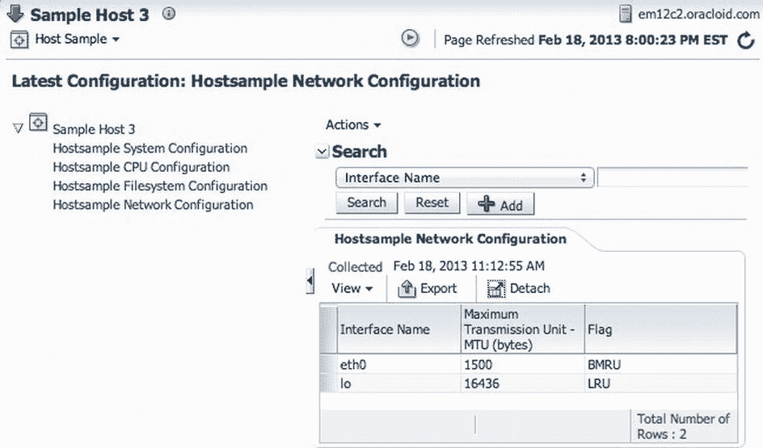

# 创建目标类型元数据的配置指标

目标类型元数据的配置指标需要创建，如 **清单 10-20** 所示。请注意，该清单只提供了相关的片段，因为 `QueryDescriptor` 元素中的 fetchlet 配置和 `Display` 元素对你来说已经很熟悉了。完整的 XML 定义可在 EDK 示例插件中找到。

## 清单 10-20. 配置指标片段

```xml
<Metric NAME="HostConfig" TYPE="RAW" CONFIG="TRUE">
  <TableDescriptor TABLE_NAME="MGMT_EMX_HS_SYSTEM">
    <ColumnDescriptor NAME="hostname" COLUMN_NAME="hostname" TYPE="STRING" IS_KEY="FALSE"/>
    <ColumnDescriptor NAME="version" COLUMN_NAME="version" TYPE="STRING" IS_KEY="FALSE"/>
  </TableDescriptor>
  <QueryDescriptor ...>...</QueryDescriptor>
</Metric>
...
<Metric NAME="NetConfig" TYPE="RAW" CONFIG="TRUE">
  <TableDescriptor TABLE_NAME="MGMT_EMX_HS_NET">
    <ColumnDescriptor NAME="net_interface" COLUMN_NAME="net_interface"
                      TYPE="STRING" IS_KEY="TRUE"/>
    <ColumnDescriptor NAME="net_mtu" COLUMN_NAME="net_mtu" TYPE="NUMBER" IS_KEY="FALSE"/>
    <ColumnDescriptor NAME="net_flag" COLUMN_NAME="net_flag" TYPE="STRING" IS_KEY="FALSE"/>
  </TableDescriptor>
  <QueryDescriptor ...>...</QueryDescriptor>
</Metric>
```

配置指标应设置 `CONFIG="TRUE"` 属性。其类型必须设置为 `"RAW"`，这意味着值被直接收集到存储库模式的一个表中。**清单 10-20** 中 `TableDescriptor` 的 `TABLE_NAME` 属性必须与 **清单 10-19** 中 ECM 元数据对应的 `TABLE` 元素的 `NAME` 匹配。**清单 10-20** 中 `ColumnDescriptor` 元素的 `NAME` 和 `COLUMN_NAME` 属性必须与 **清单 10-19** 中列元素的 `NAME` 属性匹配。我天真地以为只有 `COLUMN_NAME` 需要匹配，这导致了我长时间的故障排除，直到我意识到 `NAME` 属性也必须设置为相同的值。ECM 元数据表中标记为唯一键部分的列也必须在相应的配置指标中标记为键，正如你在 `net_interface` 列中看到的那样。

既然你已经理解了 ECM 元数据的内容以及目标类型元数据中需要什么，是时候通过将所需的 `CollectionItem` 添加到默认收集元数据来完成整个画面了，如 **清单 10-21** 所示。

## 清单 10-21. 用于配置快照的 CollectionItem

```xml
<CollectionItem NAME="HostSample3Snap" UPLOAD_ON_FETCH="TRUE" CONFIG="TRUE">
  <Schedule OFFSET_TYPE="INCREMENTAL">
    <IntervalSchedule INTERVAL="24" TIME_UNIT="Hr"/>
  </Schedule>
  <MetricColl NAME="HostConfig" />
  ...
  <MetricColl NAME="NetConfig" />
</CollectionItem>
```


在清单 10-21 中，`CollectionItem`的`NAME`必须与清单 10-19 中`METADATA`元素的`SNAP_TYPE`属性匹配。`CollectionItem`属性还必须使用`CONFIG="TRUE"`属性标记为配置集合。将`OFFSET_TYPE`属性设置为`incremental`并非关键，因为它只意味着时间间隔是从上一个集合的结束时间开始计算，而不是集合开始时间之间。对于快速执行的集合而言，这没有区别。一个集合项必须包含清单 10-20 中定义的所有配置指标，每一项都匹配清单 10-19 中定义的表。

假设`ECM`元数据在暂存区的位置正确，它将在打包期间自动包含在插件归档文件中。请注意，如果您只是调整`ECM`元数据而不更改其他组件，通常可以像处理报告一样，仅使用`MRS`上传`ECM`元数据。`MRS`同样会在本章末尾再次描述。

您可以在*可扩展性程序员参考手册*的第 6 章中找到关于`ECM`的完整文档。在那里，您可以查看例如如何定义`ECM`表列上的索引以及如何在配置项之间创建依赖关系。请注意，除非您需要将`ECM`标题翻译成其他语言，否则可以忽略生成放置在`<STAGE>/oms/rsc/ecm`目录下的`.dlf`文件的说明。（该文档提到了不存在的`generate_ecm_resources`实用程序，但`.dlf`文件本身可以通过运行`empdk generate_metadata_resource -service LiveSnapshotRegistration`命令来生成。）

如果`ECM`定义正确且收集了配置指标，您可以通过目标的菜单导航到 Configuration  `Last Collected`，查看收集到的最新配置，如图 10-12 所示。如果您需要对配置信息收集进行故障排查，本章前面介绍的代理`Metric Browser`会非常有帮助。*可扩展性程序员参考手册*的第 6 章也包含有用的故障排查建议。



图 10-12. EM12c 控制台中的配置信息

虽然定义配置指标看起来有点繁琐，但一旦掌握诀窍，就会变得相当清晰。好消息是，所有配置管理功能都立即可用，就像处理标准的 Oracle 目标一样，而且不需要任何变更管理许可选项。这些功能包括不同目标之间的配置比较、与保存的配置进行比较以及随时间跟踪配置变化。

## 更高级的功能

您已经了解了基本的插件功能以及一些高级功能，如配置管理，但还有更多功能可用。凭借这些基础知识以及通过实践示例获得的实用技能，您可以查阅文档以获取更多作为插件开发者可用的高级功能。请注意，如果文档不够清晰（您会在某些情况下注意到这一点），您还可以参考`EDK`附带的现有示例插件、Oracle 自己的开箱即用插件，以及作为`EDK`一部分提供的附加文档中的`XML Schema`定义。

以下列表简要介绍了本章未涵盖的功能及其提供的功能：

```
*   作业类型：插件开发者可以通过定义新的作业类型来扩展 EM12c 作业系统。作业系统灵活，允许指定规则来定义作业参数、应使用哪些凭据、如何控制对作业的访问以及如何序列化作业。作业类型在`oracle.samples.xsh2`插件中定义。
*   凭据：凭据需要用于支持作业框架，并提供一种安全的替代方案，以比通过实例属性传递更安全的方式定义和传递密码给获取程序。（请记住，命令行和环境变量内容不会受到其他用户的保护。）虽然凭据已在`oracle.samples.xsh1`插件中定义，但直到`oracle.samples.xsh2`插件中才被使用，因此请使用此插件来研究凭据示例。
*   派生关联：EM12c 可扩展性框架提供了一种定义目标类型之间依赖关系和其他关系的方法，可以通过使用预定义的关联（如`deployed_on`、`provided_by`或`cluster_contains`），也可以通过定义新的关联来实现。这为 EM12c 提供了复杂系统的拓扑结构，例如集群数据库或 Web 场，其中多个被监控组件是相互连接的。关联通常与配置管理一起实现，以确保定义了系统拓扑，并且可以管理整个系统的配置。派生关联在`oracle.samples.xsh2`示例插件中定义。
*   目标发现：除了手动添加目标的过程（EM12c 用户必须从头开始配置目标实例）外，插件开发者还可以启用自动和引导发现模式。这通常涉及用 Java 或 Perl 实现定义特殊的发现规则和脚本。使用`oracle.samples.xsh3`插件来研究一个发现实现的示例。
*   合规标准：此功能允许您定义合规规则。规则可以基于存储库中现有的指标和配置集合（基于`SQL`或`PL/SQL`），也可以基于针对文件、用户、进程、数据库对象、Windows 注册表项或 Active Directory 实体的实时收集。规则被分层组织为合规标准，然后基于这些标准定义合规框架。关于定义合规标准的详细示例位于*可扩展性程序员参考手册*的第 12 章。合规标准示例实现在插件`oracle.samples.xsh3`中。
*   管理用户界面：这可能是 EM12c 可扩展性最令人兴奋的新能力，它允许插件开发者创建完全自定义的用户界面并控制用户体验。自定义用户界面不仅让插件开发者能够控制收集的指标和配置信息的显示方式，还为交互式用户界面提供了全面能力，包括执行管理操作，如启动和停止组件、终止会话或用户、创建目标资源，以及管理员可能需要执行的几乎任何其他操作。有两种方法可以创建自定义用户界面。更简单但功能更有限的方法是使用基于元数据的管理界面，通过`XML`结构以纯声明方式定义页面、屏幕布局和操作。虽然相比`10g`和`11g`这是一个巨大的进步，但可用的交互功能有限。更复杂的方法是使用基于`Adobe Flex`的框架，它能提供对用户体验的完全控制和完整的交互能力，并允许您将自定义 UI 组件与插件一起打包。基于元数据的声明式 UI 在`oracle.samples.xsh2`中实现。基于`Flex`的 UI 在`oracle.samples.xsh3`中实现。然而，其中只有一个预构建的`Flex`组件，我在源代码中找不到它。
```


## 更完整的基于 Flex 的示例

有关更完整的基于 Flex 的示例，请使用 `<EDK>/samples/plugins/HostSample` 中的另一个示例。

### 自定义事件管理

此功能允许插件开发人员自定义在事件管理器页面上选择事件时所看到的内容。他们可以在事件详细信息区域添加信息、自定义诊断链接、定义一个新的引导式解决区域，以及覆盖 My Oracle Support 的默认搜索表达式。文档提到仅使用 MRS 注册事件管理自定义，但根据元数据在 OMS 中存储的目标路径，如果插件档案被放置在 `<STAGE>/oms/metadata/events/custmzn` 或 `<STAGE>/oms/metadata/custmzn` 下，`empdk` 应该能够将事件管理自定义作为插件档案的一部分打包。

请注意，基于 Flex 的 UI 的最佳实现在位于 EDK 的 HostSample 演示中，路径为 `<EDK>/samples/plugins/HostSample`。一个 `README` 文件解释了如何构建插件，以及如何使用 Adobe Flash Builder 打开和处理基于 Flex 的 UI，这是学习 EM12c 高级 UI 开发的绝佳方式。虽然自定义管理 UI 是可扩展性中最复杂的领域，但文档并不十分清晰，并且难以划定基于元数据的 UI 和基于 Flex 的 UI 之间的界限。因此，通过示例学习会对您大有帮助。我还发现，搜索诸如图表属性等通用的 Adobe Flex 解决方案，让我能够猜测出一些在 EM12c 可扩展性文档或 EDK 中未能找到的、用于基于元数据 UI 的 XML 属性。

## 元数据注册服务

在开发插件期间，您可能需要进行许多迭代调整，并在每次更改后在 EM12c 控制台中验证其影响。对每次小改动都进行打包、部署和升级插件可能是令人畏惧的。为了减少这种部署开销，EM12c 通过 `emctl register oms metadata` 命令提供了元数据注册服务 (MRS)，用于有选择地上传和升级特定元数据。MRS 在《可扩展性程序员参考》的第 13.7 节中有文档说明，但在撰写本文时，其文档覆盖并不全面。

根据我的经验，MRS 在动态更新报告定义、更新用户界面定义 (`mpcui` 服务) 和 ECM 元数据 (`LiveSnapshotRegistration` 服务) 方面运行良好。然而，注册新目标类型元数据对我来说并不总是成功，可能是因为目标元数据未能成功传播到代理。

例如，要更新或注册一个新的报告定义，您可以使用以下命令：

```
emctl register oms metadata -service report -file report_file.xml -pluginId oracle.samples.xsh1
```

请注意，某些服务在注册组件时需要特殊步骤。例如，通过 MRS 注册合规标准服务后，必须手动在存储库数据库中执行 `EM_COMPLIANCE_UTIL.trigger_rule_dependency_job` 过程。

MRS 还允许您实现一些新功能——例如，具有现有目标的新作业类型和合规标准——而实际上无需开发任何新插件。事实上，虽然大多数情况下您创建插件是为了打包新的目标类型，但您也可以创建没有任何目标类型的插件，仅打包报告或合规标准等内容。

## 总结

在本章中，您已经熟悉了指标扩展及其大部分功能。您了解到，虽然 EM12c 指标扩展比 Grid Control 10g/11g 的用户定义指标更加灵活和可管理，但它们仍然缺乏许多对于从多个新目标甚至现有目标收集指标至关重要的功能。例如，您无法轻松处理累积计数器、创建参数化指标扩展或使用额外的收集机制。随后，您还了解到指标扩展构建在 EM12c 可扩展性框架之上，基本上会转换为您在开发新目标类型时创建的类似 XML 定义。

在本章的第二部分，您学习了如何为插件开发设置环境、在哪里可以找到文档和示例，以及如何构建和部署这些示例。基于这些示例插件，您学习了插件开发的所有基础知识以及一些使您的工作更轻松、插件开发更高效的技巧。您还深入研究了一些有用的高级功能的细节，例如配置管理，并了解了可以在哪里查找示例实现和文档。


本章强调，有许多资源可用于进一步了解**可扩展性**和插件——无论是使用官方文档、XML Schema 文档，还是深入研究 Oracle 提供的插件以理解某些功能的工作原理。即使你不打算开发供自己使用或对外分发的插件，掌握`EM12c`可扩展性框架的知识也应能加深你对`EM12c`内部机制的理解，使你成为更出色的故障排查者，并帮助你找到那些即使 Oracle 未提供文档的问题的答案。`EM12c`的存在是为了让你更高效地管理企业基础设施，而通过以各种方式利用可扩展性框架，你可以自动化更多任务并覆盖更广泛的 IT 基础设施范围。

