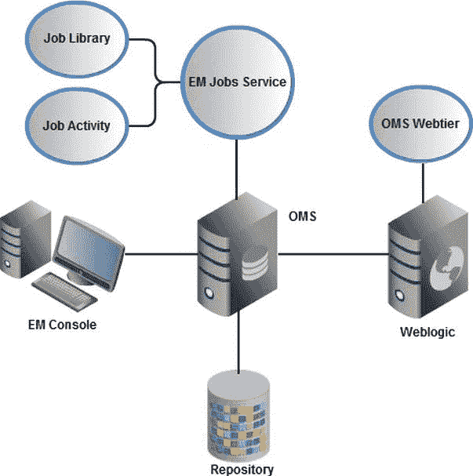
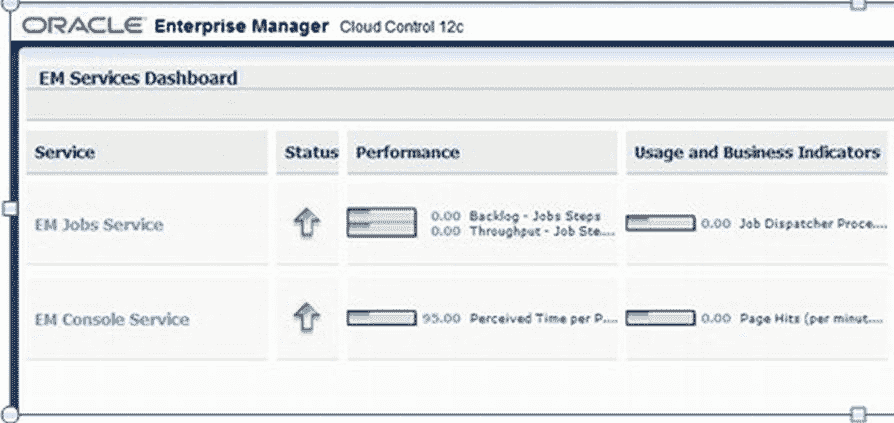
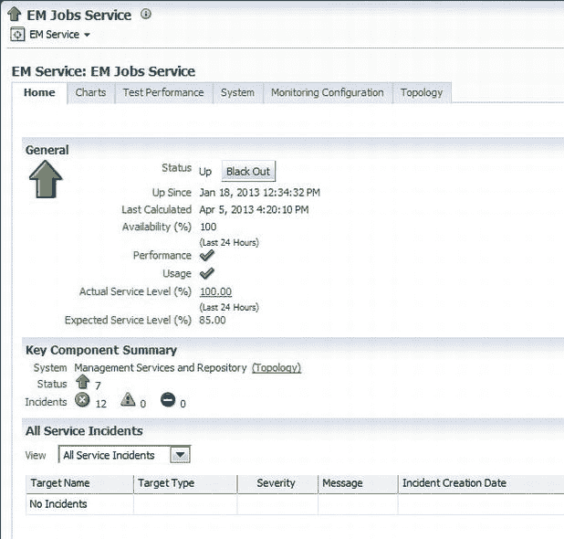
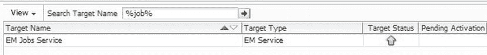
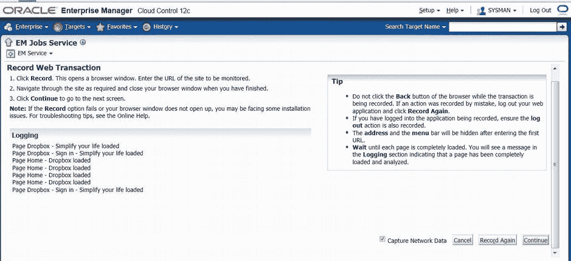
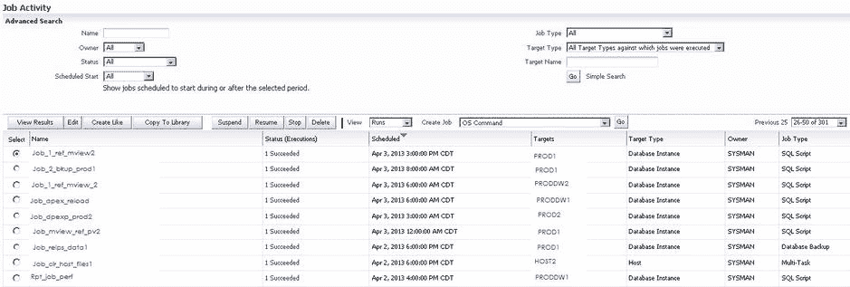
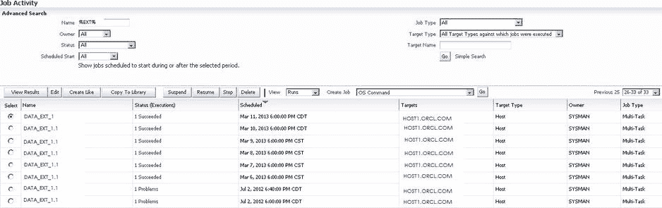

# 第 11 章

## 企业管理员作业

作者：Kellyn Pot'Vin

数据库作业被定义为“管理员定义的用于自动化常运行任务的一个工作单元”。管理员需要安排数据库维护任务、在非工作时间维护或运行批处理的脚本，或进行数据库备份，这是显而易见的；这些作业是 DBA 角色的必备要求。`EM`作业系统赋予用户灵活的调度能力，可在任何时间、以任何时间间隔运行作业。它与`EM12c`环境无缝集成，这与独立于主要数据库管理和监控系统之外的调度器不同。

企业管理员作业系统在 Oracle 9i 中引入，然而在 Enterprise Manager 12c 中，`EM`作业的使用频率仍不及其他功能，如监控、告警、备份和性能页面。

在我作为数据库管理员的多年经历中，我遇到的将`EM`作业系统优先于其他作业调度器使用的环境寥寥无几，我对此感到好奇。尽管`EM`作业系统提供了管理的便捷性、通知和调度功能，但许多管理员似乎仍然忠于他们自己收集的脚本来管理数据库中执行的工作。Oracle 已经提供了历史上颇具挑战性的`DBMS_JOBS`，以及最近引入且更先进的`DBMS_SCHEDULER_JOBS`，后者包含链式作业和更明确的调度等增强功能。此外，操作系统的`cron`调度器允许管理员使用操作系统（OS）级别可用的任何语言来编写所需脚本并进行调度。

提供更多调度和管理选项，再加上另一组用于支持的数据库级视图/表，可能看起来有些多余。我在本章的主要任务是说服管理员，为什么`EM12c`作业系统不仅是一个更好的选择，而且优于早期版本的`EM`作业系统，是在任何数据库环境中管理数据库作业的更先进方式。

增强功能包括：

*   简单的作业调度界面
*   一个位置管理环境中所有作业事件
*   作业库可用作作业的存储库
*   能够轻松关联作业对停机和维护的要求
*   通过作业部署简化全局任务

`EM`作业系统还支持`EM`控制台中基础设施的所有领域，为许多对管理员（与控制台界面交互时）透明发生的任务执行作业。

## 为何使用 EM12c 作业

需要回答的主要问题是，管理员为何应从当前的作业管理程序/调度器切换到企业管理员作业系统。当我首次接触使用`EM12c`的环境时，我也想知道这个问题的答案。我一直使用自己的一套 shell 和 Perl 脚本，并觉得在操作系统`cron`调度器中调度它们很舒适。在对环境变量和代码进行了小的调整以考虑服务器环境的独特性后，我发现脚本/操作系统级调度器是一个令人满意的解决方案。对于易于进行数据库管理而言，选择操作系统级调度器似乎仍然是最好的。

当我开始为多个客户、多个服务器平台以及操作系统配置文件设计和偏好管理新环境时，我遇到了一个有趣的挑战。我现在在一个大型数据库团队环境中工作，这要求我快速熟悉他人的调度选择或新脚本作者的编码风格，或者在调查备份和维护脚本时，我甚至不确定使用了哪种调度器。当使用多个作业调度器时，关于哪个调度器在监控、备份和告警方面执行哪个任务，常常会做出错误的假设。

立即显而易见的是，在那些通过企业管理员使用作业系统的环境中，几乎不需要时间来适应。无论是在 10g 或 11g 企业管理员，还是新的 12c 版本中，界面都是相似的。在企业管理员作业界面内维护、更改、“跳过”或执行与作业相关的任何其他任务，管理员都很容易熟悉。由于所有作业都包含在企业管理员内，在停机期间创建维护窗口也更容易管理。

使用`EM12c`作业界面相对于其他调度器的优势如下：

*   具有通配符功能的简单或高级作业搜索功能
*   可以查看任何作业计划是否与整个环境中其他正在运行的作业冲突
*   可以选择在目标停机期间跳过所有作业，或配置作业即使在目标处于停机状态时也运行，从而简化了对任务在维护期间运行的担忧
*   能够将脚本整合到`EM12c`作业系统中以执行任何任务，为所有作业任务提供统一的调度、通知和告警系统

### 企业管理员作业架构

如图 11-1 所示，`EM12c`的`EM`作业界面核心涉及三个领域：

*   `EM 作业服务`：管理企业管理员中所有作业的企业管理目标服务
*   `作业库`：作业的存储库
*   `作业活动`：用于查看、创建和管理作业的作业界面系统



**图 11-1.** EM 作业系统作为高级 EM12c 架构的一部分

前面的章节已经对 Oracle 管理服务（第 3 章）、存储库（第 1 章）以及 EM 控制台和 WebLogic 服务器（第 4 章）进行了重要介绍。本章接下来的篇幅将更详细地解释`EM`作业的每个组件——`EM 作业服务`、`作业活动`和`作业库`。

### EM 作业系统组件

`EM`作业系统包含大量复杂的组件，这些组件与`EM12c`环境的几乎所有方面都有交互。随着你对由`EM 作业服务`管理的用户作业、系统作业和代理作业越来越熟悉，你将会看到`EM12c`环境的持续健康和监控如何依赖此功能来立即或在预定时间执行任务。

### EM 作业服务


### EM 作业服务

EM 作业服务是运行中的服务，负责控制 EM12c 环境中的所有作业处理。此界面可能不易找到，但通过点击 `目标` → `所有目标`，在“搜索目标名称”框中输入 `服务`，然后点击箭头，是最容易访问的方式。接着点击 `EM 作业服务`（参见图 11-2）。随后，EM 作业服务界面（如图 11-3 所示）便会显示。我们将反复回到此界面，因为它是通往 EM12c 作业服务高级功能的重要入口。



图 11-2. EM 服务仪表板，包含 EM 作业服务和 EM 控制台服务，以及状态、性能、使用率、组件和重要服务级别



图 11-3. EM 作业服务界面，展示主左窗格中显示的基本信息，包括状态、事件和正常运行时间

此控制台界面允许用户查看服务状态、事件、违规情况、性能图表、测试性能、作业环境的配置拓扑以及 EM 作业系统中包含的所有其他功能。

您也可以通过点击 `目标` → `所有目标`，在“搜索目标名称”框中输入 `%job%`，然后点击箭头来找到 EM 作业服务页面（并了解通配符搜索在 EM12c 中如何工作）。代理 `EM 作业服务` 会显示在列表中，可通过点击目标名称访问。



图 11-4. 在“所有目标”视图中进行通配符搜索非常简单

## 监控配置

EM 作业服务界面包含多个选项卡，提供对作业系统功能的访问。DBA 最常用的选项卡可能就是“监控配置”选项卡（参见图 11-5）。


图 11-5. “监控配置”选项卡是 EM 作业服务界面中最常用的选项卡之一

用户界面的“监控配置”部分包含众多选项，用于与 EM 作业服务的功能进行交互。

“根因分析配置”选项可用于在 EM 服务发生故障时执行自动或手动检查。此分析可以精确定位问题，或上传到 `My Oracle Support` 以协助处理服务请求。此功能非常有益，可以节省管理员在 `My Oracle Support` 界面手动填写服务请求所浪费的时间。本节涵盖的服务请求主要针对 EM12c 核心服务，包括企业管理器控制台、Oracle 管理服务和 EM 作业服务。

“性能指标”链接使您能够配置 EM 作业步骤吞吐量和作业步骤积压的阈值。当将 EM 作业系统用作数据库环境的主要作业调度程序时，这可以提供大多数其他作业调度程序所缺乏的监控激励。收集执行后性能信息在其他调度/日志记录方法中可能不可用，但在 EM12c 作业服务中，所有数据默认保留 31 天。

“监控配置”选项卡中的另一个链接是“服务测试与信标”。服务测试是测试网页能否定期完成简单事务、测试正常运行时间或登录网站并在特定时间验证文件是否可供下载的绝佳方法。与指标扩展（在第 13 章中描述）不同，此功能非常特定于 URL，并使用 EM 作业在请求的间隔执行任务。

此功能具有独特的选项，可通过使用 ActiveX 插件记录 Web 会话，该会话随后作为 EM 作业的一部分进行配置，以在预定时间间隔执行任务，检查用户访问同一网站时会完成的已记录步骤是否成功完成。图 11-6 显示了一个来自网站的会话记录——成功登录、访问四个文件，然后注销。此会话将被 EM 作业服务用于创建性能测试，然后继续进行信标设置。



图 11-6. 正在为性能测试和信标设置记录的会话

> **注意**
>
> 要记录用于性能测试的 Web 事务，Microsoft Internet Explorer 是唯一受支持的 Web 浏览器。尝试使用其他浏览器时，选项不会出现。在某些情况下，即使使用带有 ActiveX 插件的 Internet Explorer，Web 事务也可能会失败，管理员将被 `My Oracle Support` 指导使用 Oracle 应用程序开发框架 (`ADF`) 来记录 Web 事务，并将保存的会话文件导入服务测试界面。

## 作业活动页面

作业活动页面使您能够执行以下操作：

*   创建作业
*   将已计划、正在运行或先前执行的作业保存到作业库，以供将来使用
*   在活动部分查看或编辑现有作业
*   查看作业执行结果、编辑、创建、恢复、暂停、停止或删除作业执行
*   通过各种方法搜索作业，包括作业名称（允许使用通配符）、作业类型和状态

作业活动页面（如图 11-7 所示）可以在数据库、集群或完整监控环境的级别查看。



图 11-7. 作业活动示例，管理员首先查看计划时间最远的活动，并通过向下滚动查看当前和过去的活动

在搜索和查看作业活动页面时，请记住表 11-1 中的以下术语。

表 11-1. 重要作业活动术语

```
| 作业活动 | 描述 |
| --- | --- |
| 作业执行 | EM12c 中的单次作业执行——通常归因于一个目标，但根据任务不同，可以有多个目标或根本没有目标。 |
| 作业运行 | 特定作业所有执行的汇总 |
```

在搜索作业执行和作业运行时，您可以在作业名称搜索选项中使用通配符 (`%`)，如图 11-8 所示。此通配符可用于任何需要您输入值（而不是提供下拉选择）的字段。



图 11-8. 使用通配符选项的作业活动搜索

前面的示例中的作业搜索查找了名称中包含字母 `EXTR` 的任何作业。搜索中未请求区分作业类型（已计划、成功、有问题等），因此返回了所有符合搜索条件的作业。

EM 作业支持表 11-2 中列出的作业操作。

表 11-2. 作业活动操作


