# Enterprise Manager 作业管理

## 作业操作说明

| 操作 | 描述 |
| --- | --- |
| 创建 | 创建一个操作系统或 SQL 脚本作业，以及其他类型的作业。 |
| 编辑 | 更新现有作业，更改计划时间、间隔、参数等。 |
| 类似创建 | 从现有作业创建一个新作业，可以选择编辑现有参数、计划等。（备份作业和某些其他维护作业可能不允许使用“类似创建”选项。） |
| 删除 | 从 EM 作业活动视图中移除单个计划/失败的作业，或移除该作业的所有实例。（任何库副本将被保留。） |
| 挂起 | 将作业“挂起”直到恢复，使现有计划得以继续。 |
| 恢复 | 恢复已挂起的作业计划。作业必须单独恢复。 |
| 失败时重试 | 如果作业属于允许的作业类型列表，则重试该作业。 |

## 作业库

Enterprise Manager 作业库允许提交作业到 EM 作业调度程序的存储库。此存储库包含管理员在备份和 EM 控制台处理之外创建的所有作业。该库仅保留已保存到其中的内容，并且必须与活动作业的更改保持同步。如果能有一个导出程序将当前作业的快照保存到库中，那将是非常有益的，但不幸的是目前并不存在。因此，务必将所有更改过的作业（包括简单的执行时间更改）从“作业活动”页面保存到库中。如果因任何原因必须参考库来重新创建作业，这将确保作业正确地重新提交到调度程序。

对于早期 10g 和 11g EM 作业的用户，没有将作业迁移到新 EM12c 环境的过程。此功能在新版 EM12c 中同样缺失，但 Oracle 计划在即将发布的版本中包含一个。此功能应具有多重好处，不仅适用于迁移，也作为升级的一部分、备份/恢复的次选方案以及复制的一部分。

作业库界面（如图 11-9 所示）与作业活动页面类似，并使用许多相似的选项，包括“编辑”和“访问”。

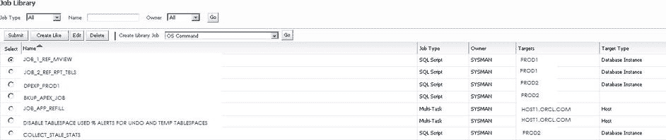

图 11-9. EM12c 控制台的生产作业库示例

## 作业模式

在`SYSMAN`模式中存在超过 70 个`JOB`表，但只有少数几个涉及 EM 作业系统的主要组件，需要基本了解。您可以对这些表执行查询，以获得对 EM 作业环境更明确的视图。图 11-10 显示了两个主要表以及对象之间的关系。

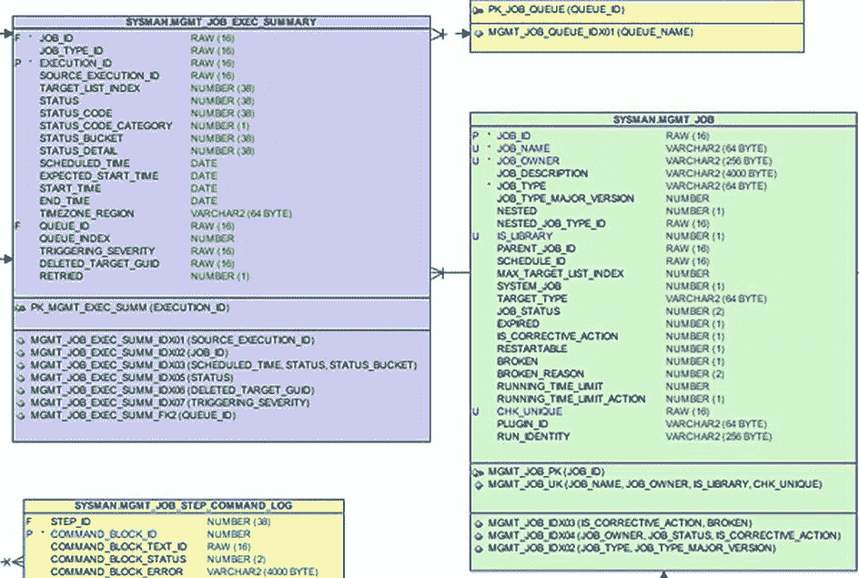

图 11-10. 注意连接`SYSMAN`模式中 EM 作业系统部分最常见对象的列

以下示例查询将针对作业数据进行报告。经常在后续查询中使用的`MGMT_JOB`表同时包含作业库和`job_activity`信息，因此在查询时必须牢记这一点，如图 11-11 所示。如果 EM 作业活动或作业库界面在任何时候无法成功管理作业，而必须使用 Enterprise Manager 命令行界面（`EMCLI`），那么这些数据通常是必不可少的。

```sql
select  mj.job_owner, mj.job_name,
decode(mj.is_library, 1, 'JOB_LIBRARY', 0, 'JOB_ACTIVITY')
from sysman.mgmt_job mj
order by mj.job_owner, mj_job_name;
```

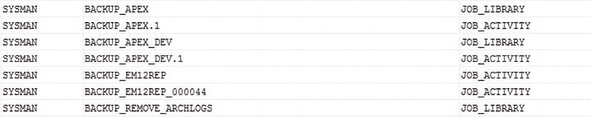

图 11-11. 活动作业（已提交）和库中保留作业的备份作业信息示例

`EMCLI`也可用于收集有关环境中作业的数据。此实用程序有其自己的一组动词（命令），通过命令行界面调用以查询、执行、配置、部署和管理 Enterprise Manager，通常提供比 EM 控制台图形界面更强大的功能。

作为此功能的示例，我们可以通过执行以下命令从`EMCLI`查询作业数据：

```text
emcli get_jobs

REFRESH_MV_ORCL.MV_DEVA_PART.1                    SQLScript              416E2CE166724F53BCF3ECD798E1759B
B16A12D945A1466C871B99E1A5226309
2013-01-21 07:00:00  2013-01-21 07:02:22America/Chicago
Succeeded  5    SYSJOB  oracle_database  ORCL5

ORCL5_MFC_APP_REF.1                               SQLScript              F39C0BE9B9F74F758FFDA95392778CDF
E088B023C23048E79768BC4FEC2888B3
2013-01-20 06:00:00  2013-01-20 06:00:23
America/Chicago
Succeeded  5    SYSJOB  oracle_database  ORCL5
```

`JOB_ID`列是此模式中最常用的连接列之一，用于标识相关作业。在上面的结果中，您可以看到返回了两个作业，包括作业名称、作业类型、作业 ID 和目标 GUID，以及执行信息，包括时间、时区和作业是否成功。

在下一个示例中，将`MGMT_JOB_EXEC_SUMMARY`与`MGMT_JOB`表连接以显示最近的历史记录并验证作业状态。

```sql
select mj.job_name, mjes.start_time,  mjes.end_time,
DECODE(mjes.status,
 1, 'SCHEDULED', 2, 'RUNNING', 3, 'FAILED INIT',
 4, 'FAILED', 5, 'SUCCEEDED', 6, 'SUSPENDED',
 7, 'AGENT DOWN', 8, 'STOPPED', 9, 'SUSPENDED/LOCK',
 10, 'SUSPENDED/EVENT', 11, 'SUSPENDED/BLACKOUT',
 12, 'STOP PENDING', 13, 'SUSPEND PENDING', 14, 'INACTIVE',
 15, 'QUEUED', 16, 'FAILED/RETRIED', 17, 'WAITING', 18, 'SKIPPED',status) "Execution STATUS"
from sysman.mgmt_job mj, sysman.mgmt_job_exec_summary mjes
where mj.job_id=mjes.job_id
and mj.job_name ='BACKUP_EM12REP_000044'
order by mjes.start_time desc;
```

此查询的输出将产生关于数据库存储库的备份作业信息。当前正在运行的作业以及历史作业信息都可以在图 11-12 中看到。

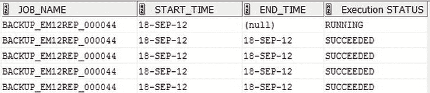

图 11-12. 查询作业状态信息

然后我们可以查询满足以下条件的过去 24 小时内的数据：不需要纠正操作（`is_corrective_action = 0`），状态为标准作业历史记录（`status IN (5,4,3,18,8)`），并且有重试要求（`retried`不为空）。

```sql
SELECT mjes.job_id, mj.job_name, mjes.retried
FROM MGMT_JOB_EXEC_SUMMARY mjes, MGMT_JOB mj
WHERE mjes.job_id = mj.job_id AND mj.is_corrective_action = 0
AND mjes.status IN (5,4,3,18,8)
AND  mjes.start_time > sysdate-1
and mjes.retried is not null;
```

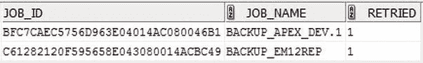

图 11-13. 经历过至少一次重试的作业的结果

这些基本查询提供了如何连接表以及如何从`SQL*Plus`报告 EM 作业系统信息的示例。这些数据随后可以帮助您进行故障排除，或者您可以使用`EMCLI`来处理问题或在 EM 控制台之外执行任务。

### 权限与责任

了解谁有权创建和管理作业至关重要。作业应由个别用户拥有，并在此级别设置首选凭据，以确保对这些凭据使用的问责制。

通过创建 EM12c 管理员登录并安全地设置它们，您可以查看谁运行了作业以及谁编辑了作业，确保创建、执行甚至删除作业的用户在 Enterprise Manager 访问日志中被有效跟踪。由于用户不是存储库所有者（`SYSMAN`），这消除了在 EM12c 环境中默认授予该用户的广泛角色和权限可能引发的安全问题。


要查看谁有凭证来运行和管理作业，您可以运行一个简单的查询来显示谁拥有哪些权限（参见图 11-14），以及这些凭证与 `SYSMAN` 模式拥有的凭证相比如何（参见图 11-15）。图 11-16 提供了一个示意图以供参考。

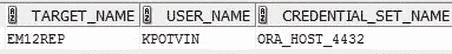

图 11-14. 查询 EM `SYSMAN` 模式后显示的拥有目标凭证的用户

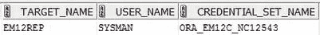

图 11-15. 环境中可能出现的 `SYSMAN` 凭证示例

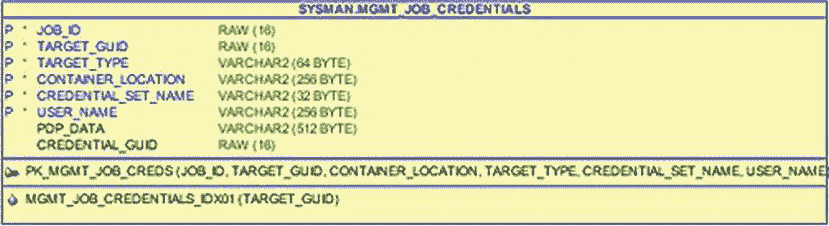

图 11-16. 用于对作业活动进行细粒度查询的凭证、作业命令和作业信息表

```
SELECT mt.target_name, mtc.user_name, mtc.credential_set_name
FROM MGMT_TARGET_CREDENTIALS mtc, MGMT_TARGETS mt
WHERE mtc.TARGET_GUID=mt.target_GUID;
```

```
SELECT mt.target_name, mtc.user_name, mtc.credential_set_name
FROM MGMT_TARGET_CREDENTIALS mtc, MGMT_TARGETS mt
WHERE mtc.TARGET_GUID=mt.target_GUID
And mtc.USER_NAME='SYSMAN';
```

`MGMT_JOB_CREDENTIALS` 表包含所有作业凭证数据，可以单独查询，也可以与 `MGMT_JOB` 和其他表连接以获取更多信息。

## 作业创建

作业创建界面与之前版本的 Enterprise Manager 保持相似。然而，由于该界面的复杂性，本节提供一个清晰的作业创建示例。在这个例子中，我们将创建一个简单的安全作业，用于检查谁拥有访问 `DBA_*` 视图的权限。

从“作业活动”菜单中，点击 `创建作业` 下拉菜单并选择 `安全规则配置`。然后点击 `执行`（参见图 11-17）。


图 11-17. 开始创建作业

这将打开作业创建页面。从 `常规` 选项卡开始，填写名称和描述（如果需要）。然后选择一个目标类型（本例中选择 `数据库实例`）并点击 `添加` 来选择一个数据库目标。

在“添加目标”窗口中选择目标后，您将返回到主屏幕，此时屏幕显示的信息类似于图 11-18。

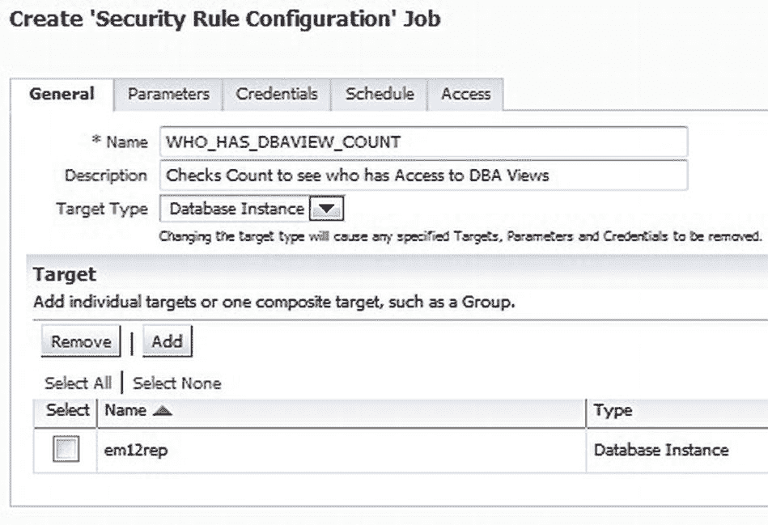

图 11-18. 为新作业配置的 `常规` 选项卡

您现在已成功填写 `常规` 选项卡，可以继续进行 `参数` 选项卡。

从 `安全规则` 下拉列表中选择 `访问 DBA_* 视图` 选项。对于要返回的最大行数，输入 `全部`（参见图 11-19）。

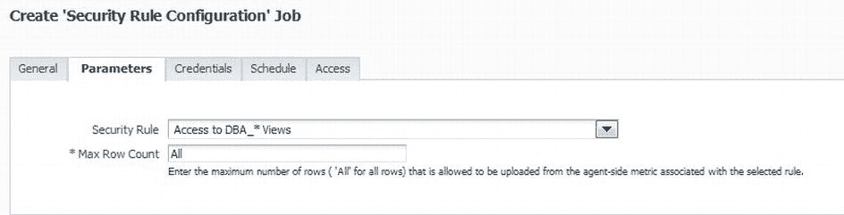

图 11-19. 检查对 `DBA_*` 视图访问权限的参数设置

接下来，点击 `凭证` 选项卡。本例中，`凭证` 选项选择 `命名的`（参见图 11-20）。我们将填写详细信息以清晰地理解界面，但为了便于管理，最好事先设置好首选凭证。

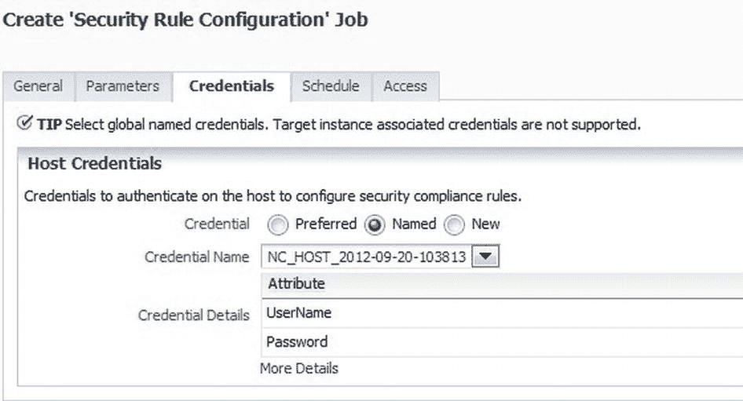

图 11-20. 作业创建的凭证设置

完成凭证设置后，继续进行 `计划` 选项卡。图 11-21 显示了一个计划，设置为每周一上午 9:30 发送报告，并且永不过期或没有结束日期宽限期。

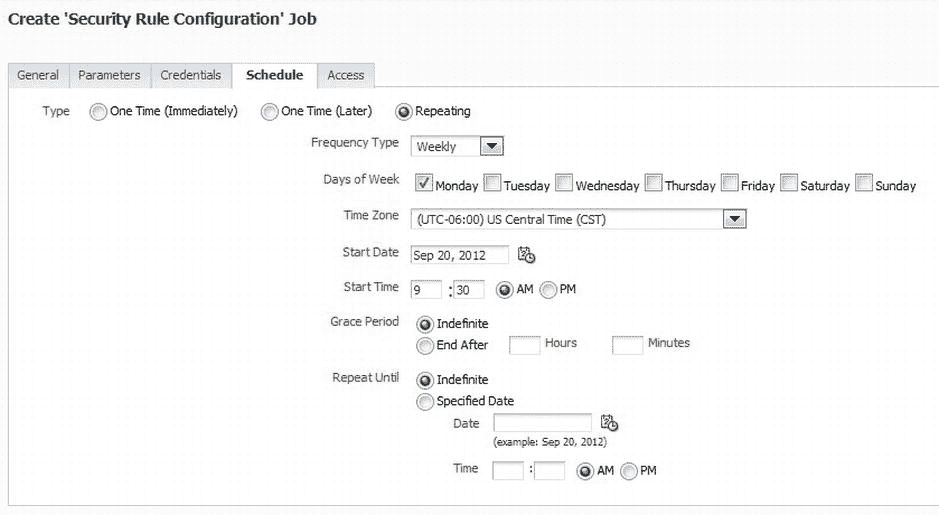

图 11-21. 为新作业设置计划

接下来，您可以选择为每个管理员（所有者除外）设置查看或管理作业的权限，如图 11-22 所示。也可以通过勾选 `删除` 列下的方框（图中未显示，但在最右侧）将管理员从访问列表中移除。

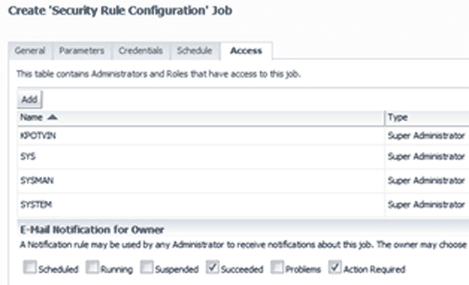

图 11-22. 谁有访问权限以及将发送哪些通知

在 `安全规则配置` 部分下方是 `电子邮件通知` 部分。在这里，您可以选择以下通知选项：

*   `已计划`：作业已计划运行。
*   `正在运行`：作业正在执行。
*   `已暂停`：作业已被暂停运行。
*   `已成功`：作业已成功完成。
*   `问题`：作业在某个步骤或整体上遇到失败或问题。
*   `需要操作`：需要管理员介入。这包括状态为“已跳过”的作业。

由于作业由用户 `KPOTVIN` 拥有，任何与该用户关联并已在 EM 控制台中配置的电子邮件地址都将根据设置接收通知。该用户也有权查看、管理和监控作业。

### 作业类型

Enterprise Manager 在 12c 版本中扩展了对作业类型的支持。虽然 `操作系统命令`、`SQL 脚本` 和 `RMAN` 可能很常见，但现在 EM 作业环境支持数十种作业类型：


### 12.5.2 作业类型、作业事件和通知

Enterprise Manager 中存在多种作业类型，以下是一些常见的和新增的类型：

*   `Application Development Protocol (ADP)`: Oracle ADF 使用的作业协议。
*   `Agent Configuration and Control Operations`: 这是一系列 Enterprise Manager 计划作业类型中的前两种。这些作业是在 EM 控制台中作为代理配置或控制请求的一部分创建的。
*   `ASM Scripts`: 自动存储管理中的许多任务被安排为 EM 控制台中的作业。这是另一种由 EM 控制台创建的作业，与通过 EM Jobs 界面创建的作业相对。
*   `Clone Home`: 这是最受期待的新增功能之一，这种新的作业类型允许您轻松地将现有的 Oracle 主目录克隆到一个新的 Oracle 主目录。
*   `Database Configuration`: 另一种 EM 控制台作业类型，它可以在不要求您在目标服务器上执行任务的情况下更新数据库配置。
*   `Deployments`: EM12c 的一项新功能，此作业从 EM 控制台部署到目标，用于监控和配置。
*   `Discovery of Specific Oracle Components`: 作业也会被安排用于通过 EM 控制台在指定的 Oracle 目标上发现 Oracle 组件。这种自动发现通过从服务器动态提取配置和目标信息来节省时间和精力，确保任何目标的正确配置。
*   `Log Rotation`: 如果日志、跟踪文件和 Enterprise Manager 日志变得太大，可能会难以管理。这种作业类型可以在 EM Jobs 界面中创建，用于管理您定期访问和监控的许多数据库日志。
*   `OPatch Updates`: EM12c 的另一种新作业类型，自动化的 `OPatch` 更新确保您在 EM12c 环境中监控的每个目标上都安装了最新版本的 `OPatch` 实用程序。
*   `OS Commands`: 这种作业类型允许您将现有的 `OS` 脚本从 `cron` 调度程序或其他 `OS` 级调度程序迁移到 Enterprise Manager 控制台内的单一调度程序中。通过迁移到 EM Jobs 界面，在 EM 中断期间无需再通过第二个调度程序进行管理，所有操作都可以通过单一界面管理。
*   `RMAN`: 所有的 `Recovery Manager` 作业，虽然通过 EM 控制台中的 `RMAN` 界面创建，但它们会在 Job Activity 界面中显示为计划作业。这些作业类型无法保存到库中，并且在 Job Activity 界面中的编辑功能有限。
*   `Security`: 这种作业类型涉及从 EM 控制台的 `Setup` -> `Security` 部分访问的安全界面。这些作业包括针对管理员、角色、凭据和审计数据的作业。
*   `SQL Scripts`: 涉及 EM 作业的最常见作业类型，这允许您执行 `SQL`、存储过程以及任何其他将在 `SQL*Plus` 会话中执行的任务。
*   `Multitask Jobs`: 对于需要多个步骤来完成一个过程的作业，这是 EM12c 中的一项新功能。过去，您必须为复杂的、多步骤的过程编写脚本。现在，EM12c Jobs 界面使得创建具有多个步骤的作业变得简单，包括那些在每个步骤都有成功逻辑请求的作业。

定位 EM12c Jobs Service 支持的常见和新的作业类型非常简单。以下查询不仅显示了支持的作业类型，还显示了用于 `EMCLI` 执行的作业类型 ID。

```sql
select * from sysman.MGMT_JOB_TYPE_INFO
where job_type_category=0
and editable=1
and agent_bound=1
and job_type not like '%Obsolete%'
and job_type_default is not null;
```

图 11-23 显示了查询结果，其中包含了来自 `OMS` 存储库数据库中 `SYSMAN` 模式的作业类型以及每个作业类型的任何相关信息。这些数据清楚地显示了支持前端的作业类型 (`job_type_category=0`)、在作业创建后能够被编辑的作业类型（例如，备份作业在备份和恢复调度程序外部创建后无法被编辑），并且所有作业类型都可用于代理（`agent_bound` 与 `OMS` 级别的作业相对）。如图所示，所有过时的作业类型都被跳过，但仍在存储库中列出。

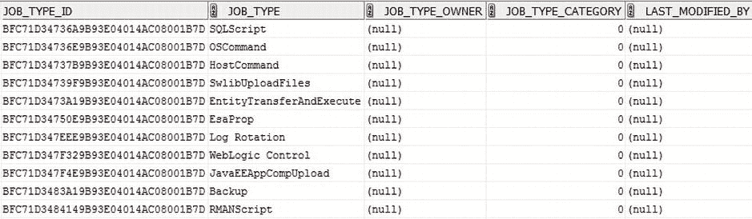

**图 11-23** 作业类型信息查询结果，显示了系统可用的一些特定作业类型。

### 12.5.3 有效监控和作业状态

在 EM 作业系统中运行的任何给定作业的状态都极其重要，因为通知和警报都基于此状态。由于一个作业可能包含多个步骤，状态会随着每个步骤的执行而变化，并且可以触发事件来提醒管理员作业运行的不同状态。此作业状态可以通过作业事件进行监控、警报和管理。

作业事件返回报告状态并提醒责任方。您可以手动设置这些事件，因为作业事件默认是未启用的。这样做是为了避免系统因事件监控而过载。

作业事件如下：

*   `All`: 报告任何作业的所有状态。
*   `Scheduled`: 作业已计划运行。
*   `Action Required`: 需要管理员介入作业才能运行完成。这包括因计划中断而被跳过的作业。
*   `Suspended`: 作业已被暂停，因此无法执行其常规计划。
*   `Succeeded`: 作业已成功执行。
*   `Problems`: 一个或多个作业步骤中发生了故障。

可以通过 Job Events Generation Criteria 页面配置作业事件。您可以通过在 EM 控制台中选择 `Setup` -> `Incidents` -> `Job Events` 来访问此页面，如图 图 11-24 所示。随后将出现第 1 步页面，如图 图 11-25 所示。在这里，您可以决定默认情况下哪些事件会发送警报通知，并且可以按目标或组缩小范围。

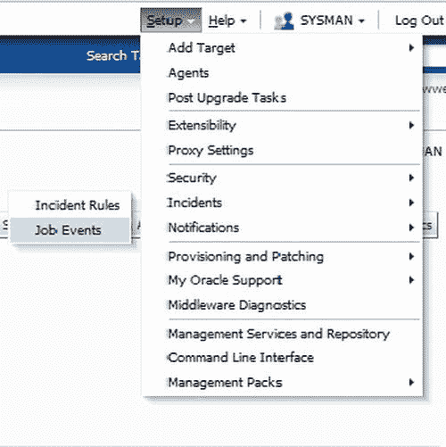

**图 11-24** 从 EM 控制台的 `Setup` 菜单进入 `Job Events` 功能

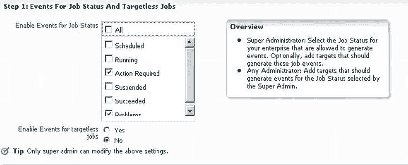

**图 11-25** 在 EM12c 环境中为所有作业设置警报和通知的默认选项

一些管理员选择接收作业运行成功 (`Succeeded`) 的通知。根据我的专业经验，我建议不要配置作业来执行此通知。管理员在警报上花费的大部分时间并非由于监控不足，而是监控过度。如果 Enterprise Manager 被配置为包含电子邮件“成功”通知，您会习惯于接收它们，知道它们不需要响应，这可能导致错过关键问题通知。

对于那些希望关闭个别成功消息并简单地每天报告一次这些成功和作业失败的管理员，可以设置一个辅助作业来报告并消除不必要的个别通知。

```sql
select mj.job_id, mj.job_name, mjes.start_time, mjes.end_time,
mjes.status_detail, mjes.retried
from sysman.mgmt_job mj, sysman.mgmt_job_exec_summary mjes
where mj.job_id=mjes.job_id
and mjes.start_time >= sysdate-1
and mj.job_status!=0
and mj.expired=0;

JOB_ID
```


```
作业名称                                         开始时间
-------------------------------------------------------------------------
结束时间        状态详情        重试次数
---------     -------------     ----------
285DCE9F51ED4E6D843974116963EDC3
DPEXP_ORCL_1230                                     2012 年 12 月 31 日
2012 年 12 月 31 日                 0
```

上面的输出显示了一个失败、未过期且从未重试过的作业。查询请求的是在过去一天内运行过的、未失败 (`successful=0`) 且未过期 (`0` 表示按计划处于活动状态) 的任何作业。这条信息可以用来替代报告每个单独的作业。选择权在管理员手中，但了解如何查找作业信息至关重要，特别是当默认选项不符合管理员偏好时。

**权限**

我多次遇到过计划作业之间的冲突，例如，一个任务是通过 `cron` 的 shell 脚本计划的，另一个是在 `DBMS_SCHEDULER` 中计划的，而第三个则是在 `EM 作业调度器` 中计划的。`EM12c 作业服务` 提供了一个可以处理多种任务脚本格式和作业类型的作业调度器，并具有单一的作业界面来管理作业。作业管理的安全性是管理员创建步骤的一部分，用于保护能够创建、管理和删除作业的用户。

在 `EM12c` 环境中，有多种方法可以查看谁可以创建和管理作业。由于管理员可能并不总是知道谁在环境中创建作业、创建了多少以及频率如何，因此确保 `EM` 作业需求不会损害系统性能至关重要。

以下查询清晰地展示了哪些用户被授予了创建和计划作业的权限，如 图 11-26 所示。

```
SELECT grantee  from SYSMAN.MGMT_PRIV_GRANTS
WHERE PRIV_NAME='SUPER_USER';
```

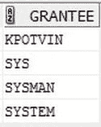

图 11-26。`EM12c` 超级用户也可以创建和管理 `EM` 作业。

**EM 作业服务图表与指标**

`EM 作业服务` 界面，如 图 11-27 所示，使您能够轻松评估 `EM 作业` 环境的健康状况。界面顶部的选项卡可以快速访问 `作业服务` 的高级功能。可以通过选择 `目标`  `所有目标`，然后对 ``%Service%`` 进行通配符搜索，最后点击 `EM 作业服务` 来访问这些选项卡。

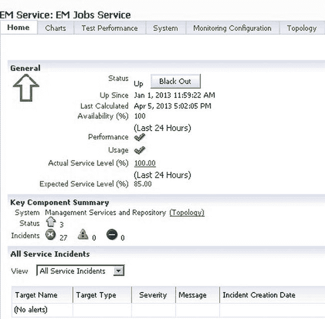

图 11-27。`EM 作业服务` 主页，显示了高级统计信息和事件信息。

从该界面，您可以查看有关性能、使用情况和事件的详细信息。

**EM 作业服务图表**

借助 `EM12c EM 作业服务` 中的性能图表，判断在给定时间范围内多少作业算“过多”变得容易得多。可以通过 `图表` 选项卡访问这些图表。

`EM 作业服务` 图表显示了有关作业调度器性能、作业步骤积压和吞吐量的信息（参见 图 11-28）。这种数据的图形化视图使您能够快速确定 `EM12c` 环境中是否存在作业性能问题。

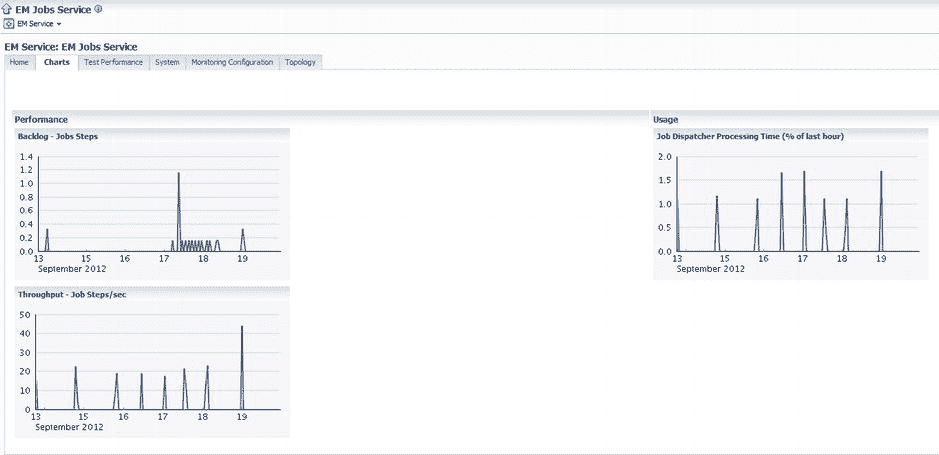

图 11-28。三个预配置的 `EM` 作业性能图表。

对于“作业繁重”的环境，您可以在 `EM 作业服务` 的 `监控配置` 选项卡上创建进一步的监控增强功能。然后，您可以查看此图表以了解繁重的资源使用情况，因为数据被有效地分解为三个部分：`作业步骤`、`处理时间` 和 `吞吐量 (作业步骤/秒)`。

**性能指标**

性能指标允许您设置专门与某个功能（本例中为 `EM` 作业）相关的指标。默认指标是为标准数据库环境设置的，如果需要，您可以在现有界面中编辑它们，尽管这种情况很少需要。有两个关键指标只需要最少的配置，因为大多数数据库环境都具有独特性：

*   `吞吐量—作业步骤/秒`
*   `积压—作业步骤`

一旦为环境配置了所需的值，这两个指标将在作业的吞吐量超过每秒设定值，或积压的作业步骤数量超过阈值时发出警报。

**使用情况指标**

列表中预设了一个指标：`作业调度器处理时间 (过去一小时百分比)`。您还可以向环境添加和配置特定的使用情况指标。它们的设置方式与性能指标非常相似，并应基于之前在 图 11-28 中展示的性能图表收集的信息进行彻底测试。

可以通过选择 `目标`  `所有目标`  `EM 作业服务`  `指标配置`  `使用情况指标` 来访问 `使用情况指标` 区域。或者，您也可以通过 `监控配置` 选项卡上的链接访问这些指标（参见 图 11-29）。

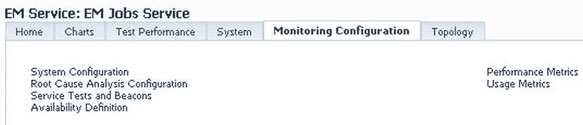

图 11-29。`使用情况指标` 选项位于 `监控配置` 选项卡的右下角区域。

您可以从 `使用情况指标` 界面添加、编辑或删除指标。在下面的示例中，我们将通过简单地点击 `添加` 按钮并按照向导操作来添加一个系统使用情况指标。图 11-30 和 图 11-31 展示了向导第一页的不同部分。

在此示例中，我们将添加一个使用情况指标来监控未受监控的 `NFS` 服务器上的映射错误（参见 图 11-30）。

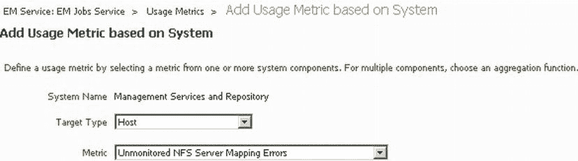

图 11-30。添加使用情况指标以检查目标主机上未受监控的 `NFS` 服务器的映射错误。

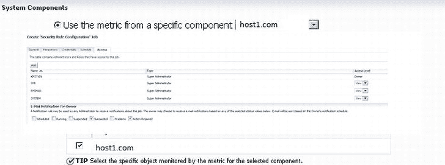

图 11-31。为无存储使用情况指标的配置选择正确的系统组件设置。

将 `目标类型` 选项设置为 `主机`，将 `指标` 设置为 `未受监控的 NFS 服务器映射错误`。然后选择您希望基于其设置指标的主机目标，并选择是允许 `EM12c` 分别监控每个磁盘，还是根据特定磁盘上可用存储总量的平均值进行监控（参见 图 11-31）。

接下来，点击 `继续`，为使用情况指标命名并设置警告和严重阈值（参见 图 11-32）。然后点击 `确定` 保存新的使用情况指标。

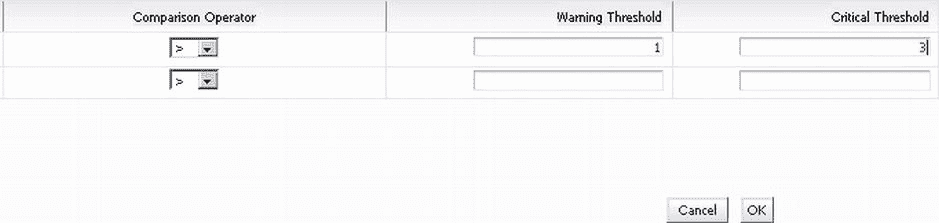

图 11-32。为使用情况指标赋予描述性标题后，设置合理的阈值。

该指标现在可供使用，可以从 `EM` 控制台的 `所有指标` 部分访问。

**将脚本迁移到 EM 作业系统**

将可能当前使用 `cron` 或其他调度器的现有脚本化作业迁移到 `EM 作业系统` 是一个简单的过程。

必须考虑对现有脚本进行以下更改：
```


# EM12c 作业系统管理

## 作业系统优势
*   不再需要许多曾经必需的环境变量。EM 作业系统将通过 EM 和目标属性自动获知 `ORACLE_HOME`、目标 `ORACLE_SID` 等信息。
*   针对多个目标提交作业变得简单，而在此之前，可能需要进行复杂的跨服务器身份验证。
*   可以向 EM 中的目标组提交维护及其他作业，从而简化数据库管理。如果组被更新，作业也会随之适应组的变更。
*   作业可归属于多种类型的目标，包括主机、集群和目录。

EM 作业权限非常精细，允许创建者/管理员与其他管理员共享作业。这些权限包括：
*   完全的编辑、删除或管理作业的权限。
*   查看作业结果的权限。

## 管理 EM12c 作业
本章前面的章节清晰地描述了 EM12c 作业系统和 EM 作业服务组件。下一步——由于与前面章节的基础知识相似，深度稍浅——是理解如何正确管理作业。

作业管理通过“作业活动”页面执行，并可从 EM12c 摘要或特定于目标的层级访问。要直接从这些选项访问该页面，请转到“数据库”选项卡并选择 `Jobs` -> `Job Activity`。根据任务的不同，有各种可用选项；本节涵盖以下主题：
*   查看作业结果
*   编辑作业
*   停止作业
*   挂起作业
*   复制到库
*   删除作业

### 查看作业结果
自 EM10g 以来，清晰查看作业结果和访问执行日志信息的能力几乎保持不变。当管理员需要管理并接收有关 EM 作业问题的通知时，这些数据在今天仍然具有相关性和价值。图 11-33 展示了“作业活动”界面。

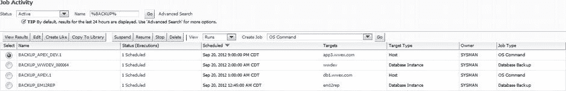

图 11-33。从“作业活动”界面查看作业

例如，如果我们选择查看 `Backup_APEX_DEV.1` 作业的信息，只需在它未被选中时点击其单选按钮，然后点击其上方的“查看结果”按钮。

然后，作业的任何输出都会显示出来，如图 11-34 所示。

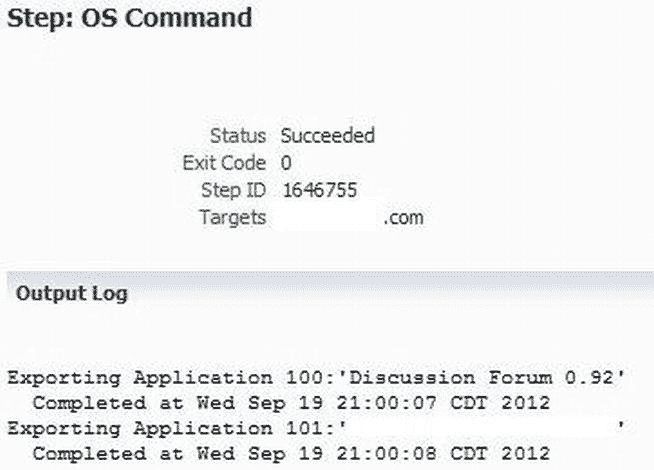

图 11-34。EM 作业日志输出

### 从活动视图编辑作业
计划运行的作业以及已执行的作业都可以进行编辑。（取决于作业类型，例如备份，可能只能进行微小的更改。）之前已执行的作业随后可以作为新作业重新提交。当您更新一个新作业并做出更改时，这些更改也会提交给该作业的任何未来计划间隔。这是一个重要的区别，因为如果作业只需要一次性更改，那么更好的选择可能是对现有作业执行一次“类似创建”并安排单次执行，以确保常规执行时间不受影响。

> **注意** 从“作业活动”视图编辑的任何作业都不会自动保存到库中。任何应保留在库中的永久性更改都应在“作业库”视图中保存。

### 停止正在运行的作业
点击“停止”按钮将停止该作业及其所有后续运行。作业将不再有未来的调度计划。

### 挂起作业
点击“挂起”按钮是将作业“搁置”以进行维护（这将导致目标暂时不可用）的正确方法。您可以在稍后时间重新启动该作业。

### 复制到库
“复制到库”选项将选定的作业复制到库中，以便以后访问、编辑、提交等。备份作业、数据泵作业和其他杂项作业无法保留在库中，如果您尝试保存它们，将会失败。这些作业可以通过 EM12c 的备份和恢复来保留，但目前，备份和数据泵作业没有库。

### 删除作业
删除作业时，可以选择删除该作业的特定运行，或者从作业系统中删除所有作业（包括历史记录）。请确保，如果您选择删除所有作业历史记录，不会违反业务所需的任何保留策略。删除后，作业将从调度程序中移除，必须重新提交。因此，如果您删除了所有历史记录且作业信息将来还需要使用，确保作业保留在库中就很重要。

### 管理管理器
EM12c 第 2 版增加了一个名为“管理管理器”(MTM)的作业系统页面。此页面使您能够执行类似于“作业活动”、“作业库”和“作业健康状况监视器”页面上的任务，但提供了更增强、更完整的作业环境视图。

MTM 显示以下内容：
*   EM 作业系统的标准健康状况
*   作业状态
*   诊断信息
*   代理管理
*   跟踪的上传间隔和通知

虽然直到 EM12c 第 2 版才可用，但“健康状况概览”页面现在结合了环境的整体负载和活动以及特定于目标的作业负载。

## 故障排除 EM12c 作业系统
如果遇到的问题超出了由于作业语法或配置不正确（这些错误会被 EM 控制台界面日志文件捕获）而导致的简单作业失败，您可能需要使用企业管理器诊断工具包，也称为 EMDIAG。

这些数据不仅有价值，而且是通过 My Oracle Support 提交大多数服务请求所必需的。

EMDIAG 基本存储库工具包随 EM12c 一起提供。另外两个工具包可通过 My Oracle Support 下载获取。EMDIAG 工具包的文档可通过 MOS 说明：*MOS ID#* 421053.1 获取。这三个工具包如下：
*   `repvfy`：包含在 EM12c 安装中，该工具包直接从 OMS 存储库中提取数据。
*   `agtvfy`：特定于 Cloud Control 的工具包，用于维护和诊断问题。
*   `omsvfy`：用于诊断和维护 OMS 数据库存储库的特定工具包。

### 执行安装
执行以下步骤安装 EMDIAG。

1.  首先，切换到新创建的目录（您将在其中安装 EMDIAG），因此 `cd` 到 EMDIAG 主目录（您选择用于解压文件的新目录）：
```
    cd $EMDIAG_HOME/bin
    ```
2.  在`bin`目录中有三个常见文件——可执行文件、支持 Windows 的批处理文件以及支持两者的 Perl 脚本：
```
    -rwxrwxr-- 1 oracle dba   3331 Feb 23  2012 repvfy.bat
    -rwxrwxr-- 1 oracle dba 198800 Aug 31 18:57 repvfy.pl
    -rwxrwxr-x 1 oracle dba   7195 Aug 31 18:57 repvfy
    ```
    通过执行以下命令启动安装：
```
    ./repvfy install -tns em12rep -pwd password
    ```
3.  安装开始，最后显示以下内容：
```
    PL/SQL procedure successfully completed.
    COMPONENT            INFO
    -------------------- --------------------
    EMDIAG Version       2012.0831
    Repository Version   12.1.0.1.0
    Database Version     11.2.0.3.0
    Test Version         2012.0926
    Repository Type      CENTRAL
    Verify Tests         381
    Object Tests         157
    Deployment           SMALL
    8 rows selected.
    Disconnected from Oracle Database 11g Enterprise Edition Release 11.2.0.3.0 - 64 bit Production With the Partitioning, OLAP, Data Mining and Real Application Testing options
    ```
4.  检查安装并验证版本：
```
    $ ./repvfy version -tns em12rep version
    ```
    在提示时输入 `SYSMAN` 密码。输出结果如下：


### 在 EM12c 中使用 EMDIAG

根据提交的参数不同，可以运行多种诊断报告。`EMDIAG` 套件是一个完整的诊断工具集，当 `EM12c` 环境中出现问题时，它将协助管理员和 My Oracle Support 进行诊断。

## 作业级诊断

来自 Enterprise Manager 的以下查询将收集运行作业级诊断报告所需的数据。此示例使用一个 `Apex` 的备份作业。

以具有 `SYSMAN` 模式选择权限的用户身份从 `SQL*Plus` 执行以下操作：

```sql
select mj.job_id, mj.job_name, mjh.execution_id, mjh.step_id
from sysman.mgmt_job mj, sysman.mgmt_job_history mjh
where mj.job_id = 'BFC78F41009876F3E04014AC08003231'
and mj.job_id=mjh.job_id
and mjh.start_time > sysdate-1;
```

图 11-35 显示了输出结果。

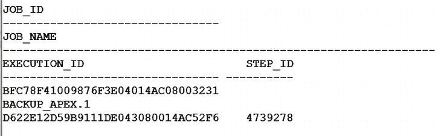

图 11-35. 前述查询的输出

利用作业名称，我们可以对作业本身执行一些诊断报告收集。由于生成的诊断数据量很大，建议将输出重定向到文件。

```bash
$ cd $EMDIAG_HOME/bin
./repvfy dump job -name BACKUP_APEX.1 –pwd w0rldw1d3 -tns em12rep > ./rep_apex_job.lst
```

输出文件随后会显示关于该作业的完整报告，从诊断工具、数据库、测试和存储库的信息开始。图 11-36 显示了这些信息。图 11-37 显示了一些作业参数。图 11-38 显示了参数参数。图 11-39 显示了作业源和目标。

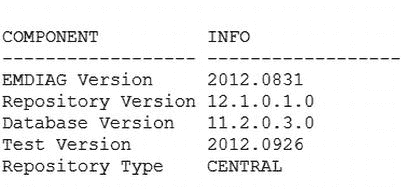

图 11-36. 关于存储库的版本和 `EMDIAG` 信息

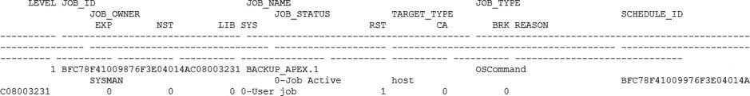

图 11-37. 从这里开始，报告深入到作业运行时、时区和其他详细信息

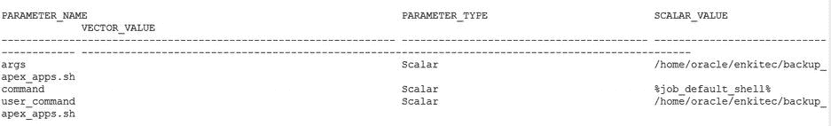

图 11-38. `EMDIAG` 作业报告中 `EM12c` 作业步骤的参数参数

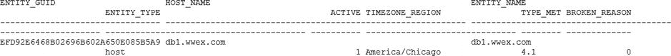

图 11-39. 关于运行作业的主机的 `GUID` 信息

接下来的部分会告知您谁拥有该作业、谁拥有该作业的权限，以及权限类型。由于此作业仅由 `SYSMAN` 用户拥有和运行，因此我们的示例报告中仅显示此用户。

报告的下一部分，如图 11-40 所示，展示了历史上最后十次运行的情况，包括运行时间、重试次数和作业的成功信息。

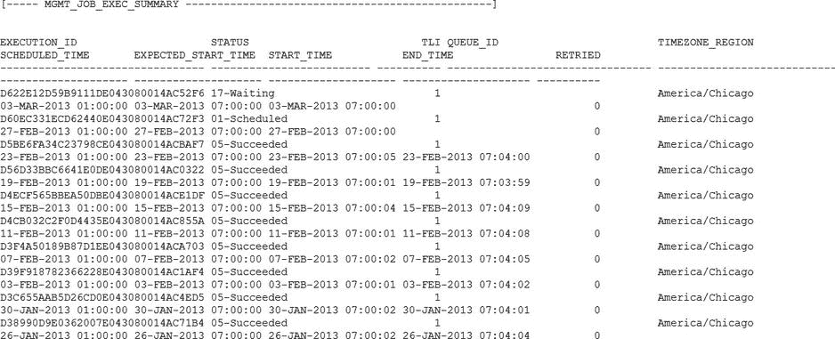

图 11-40. 显示 `EM` 作业服务中有关作业运行的历史数据

在此示例中，`EMDIAG` 指示一个作业处于等待状态。图 11-41 中的近期历史记录显示所有作业都已成功。但是，存在一个 17 级别的作业，这表示有一次运行由于某些未在执行摘要中显示的未公开问题而不得不等待。

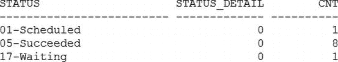

图 11-41. 作业运行状态值和历史报告的摘要计数

如果在作业分析过程中出现任何错误，这些错误将保存在报告的最后部分。我们的示例成功编译且未发现问题，因此输出结果如您在图 11-42 中所见。

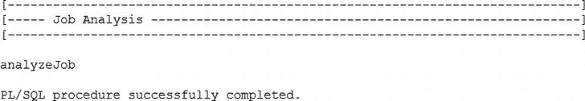

图 11-42. 作业分析成功完成，报告末尾未显示错误

如果一个作业包含多个步骤，并且您只想收集该步骤的详细诊断信息，可以通过运行以下命令生成辅助报告：

```bash
./repvfy dump –tns <oms_sid> step –id <step_id>
```

## GUID 目标诊断

在下一个场景中，我们将利用 `EM12rep`（`EM12c` 的 `OMS` 存储库）的 `GUID` 来收集 `EM` 环境数据：

```bash
./repvfy dump -tns <oms_sid> execution
-guid EFD92E6468B02696B602A650E085B5A9 -pwd <pwd>
> ./rep_guid.lst
```

通过运行 `GUID` 级别的命令，您可以获得关于 `EM` 作业服务健康状况的一站式诊断报告。（`GUID` 是您的目标 `GUID`，它会转储所有目标上所有作业的信息。）

报告开始部分与作业级报告非常相似，列出了存储库和 `EM` 信息。但是，当您查看目标信息时，会注意到明显的差异，特别是当您的 `EM` 环境很大时。

如果有任何由 `EM` 作业服务提交的后台作业遇到问题，它们会在自己的部分中被清晰地报告出来，如图 11-43 所示。

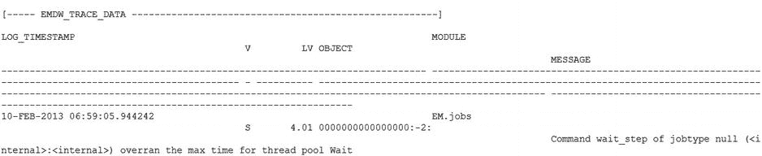

图 11-43. 关于作业执行中错误的跟踪数据

我目前唯一的抱怨是，对于 `EM12c` 的 `BP1` 版本，在完整环境级别运行 `EMDIAG` 时，会在作业分析摘要步骤遇到错误。您可以在图 11-44 中看到该错误。

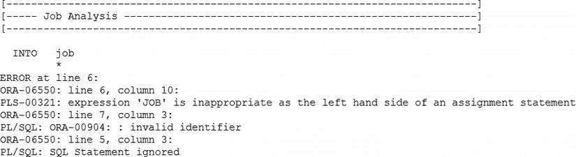

图 11-44. `OMS` 诊断级 `EMDIAG` 的单一错误

因此，如果您仍在使用 `BP1` 版本并且需要提取此级别的诊断数据，我希望您已将问题范围缩小到单个作业或目标作为报告的焦点，从而避免此错误。Release 2 版本已修正此问题。

## 全局诊断

在此示例中，我们将运行一个 9 级诊断，该诊断将针对整个 Enterprise Manager 环境运行报告，检查健康状况和其他问题：

```bash
./repvfy -tns em12rep verify -level 9 –detail
```

此级别的诊断首先检查您正在使用的 `EMDIAG` 版本，以及是否有更新的版本可用。

然后，诊断继续对 `EM` 环境执行完整的验证，如图 11-45 所示，然后登录 `SQL*Plus` 以对 `EM` 测试、`EM` 系统的安装信息以及来自 `EM` 环境的内部作业和警报执行辅助诊断。

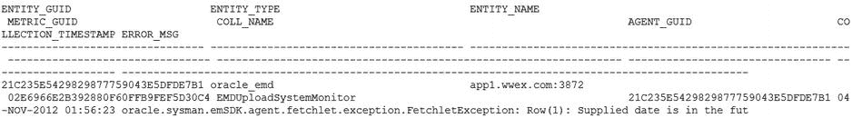

图 11-45. 显示来自 `EMDIAG` 的度量标准收集问题的全局级别诊断


诊断过程会遍历所有已提升和未提升的**目标**，提出更改建议，最后通过验证任何非标准的 EM 用户来结束报告，如图 11-46 所示。


图 11-46. 验证用户非标准 EM 系统账户的建议

## 查询作业数据

我们可以再次查询`SYSMAN`模式中`MGMT_JOB`表的数据，以查看那些非一次性作业（`status<>2`）的备份作业。

```sql
select job_name, job_id
from SYSMAN.MGMT_JOB
where job_name like '%BACKUP%'
and job_status <> 2;
```

图 11-47 显示了查询的结果。

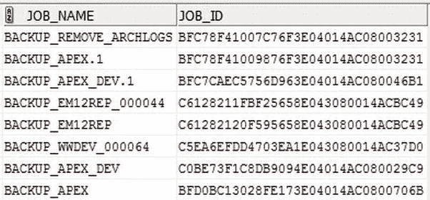

图 11-47. 示例查询结果，显示所有名称包含 BACKUP 的作业

## 使用 EMDIAG 实用程序

使用 EMDIAG 实用程序命令`repvfy`，我们可以通过执行以下命令将作业的所有数据转储到日志文件中：

```bash
$repvfy dump job –name  BACKUP_APEX.1
```

或者，我们也可以从 SQL*Plus 进行查询，以从原始查询中收集`STEP_ID`数据：

```sql
select mj.job_id, mj.job_name, mjh.execution_id, mjh.step_id
from sysman.mgmt_job mj, sysman.mgmt_job_history mjh
where mj.job_id = 'BFC78F41009876F3E04014AC08003231'
and mj.job_id=mjh.job_id
and mjh.start_time > sysdate-1;
```

图 11-48 展示了一个`JOB_ID`、`EXECUTION_ID`和`STEP_ID`的示例，这些 ID 可在我们执行 EMDIAG 步骤将数据转储到日志文件时使用。

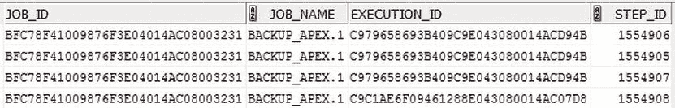

图 11-48. JOB_ID、EXECUTION_ID 和 STEP_ID 示例

然后我们可以使用`STEP_ID`，继续将有关该作业的更多数据转储到日志文件中：

```bash
$repvfy dump step –id 1554907
```

`STEP_ID`也位于`emoms.trc`文件中最后一次出现的错误中，该文件位于`$OMS_HOME/gc_inst/em/EMGC_OMS1/sysman/log`。如果出于某种原因 SQL*Plus 查询没有返回信息，这个跟踪文件会指引您找到目标和作业信息。

`EXECUTION_ID`（同样显示在图 11-48 中）随后可用于收集有关执行步骤失败的更多信息，这些信息随后将被转储到另一个日志文件中，该文件位于与执行日志相同的`$EMDIAG_HOME/logs`目录下：

```bash
$repvfy dump execution –guid C979658693B409C9E043080014ACD94B
```

EMDIAG 执行的输出相当广泛。如果您不熟悉它，或者您对自己的数据分析感到不确定，您应该毫不犹豫地向 My Oracle Support 提出服务请求，并上传文件供 Oracle 的技术代表审查。

这些报告的输出日志随后会生成到`<EMDIAG_HOME>/log`目录中，以便审查或上传到 My Oracle Support。我更倾向于将屏幕输出重定向到一个文件以便于查看，如前面的示例所示。这些数据应该能帮助您回答有关`EM12c`环境的问题，而不必总是提出 SR（服务请求），但如果需要，这些宝贵的诊断数据可以生成以节省时间和精力，从而让您可以执行除回答 My Oracle Support 问题之外的其他任务。

# 维护窗口期与 EM12c 作业影响

在`EM12c`环境中，通常在维护窗口期从任何维护窗口期创建入口点发出维护窗口期，以避免产生非必要的通知和警报。当为单个作业设置作业通知时，与通过作业事件设置维护窗口期相比，`EM 作业系统`可能会引起显著的警报。

在设置维护窗口期时，您对作业有两个选择：作业可以在维护窗口期内被跳过，或者作业可以继续运行，仅在目标对作业不可用的时间段内发出警报。


# 配置与控制作业和中断期

默认情况下，系统会在中断期继续运行作业，因此您必须**取消选中**复选框才能阻止作业运行。

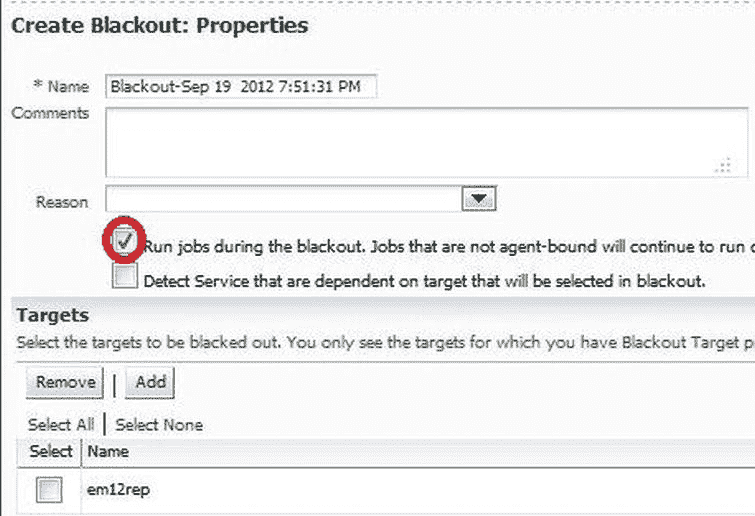

图 11-49. 如果您不希望尝试运行作业，必须取消选中默认复选框，以在中断期间跳过作业执行

做出选择时需要考虑两点：

*   如果您允许作业在中断期继续运行，而目标在作业即将结束时变得不可用（此时目标代理本应向作业服务发送成功执行代码），该作业将继续显示为正在运行，并且该作业的任何后续运行都将被跳过。
*   如果您在整个中断期内停止作业运行，则作业将在该中断期内被跳过。如果作业设置为在需要操作时通知，则会为每个被跳过的计划作业发送通知。

由于中断期也是作为作业（但在后台运行）发出的，因此您也可以通过查询数据库中的表来查看这些中断期。以下查询示例展示了如何首先通过连接 `MGMT_JOB`、`MGMT_JOB_EXEC_SUMMARY` 和 `MGMT_BLACKOUTS` 这三个表，获取有关任何已安排中断期的信息。

```sql
SELECT mj.job_name, mj.job_id, mje.status, mje.scheduled_time
FROM    MGMT_JOB mj, MGMT_JOB_EXEC_SUMMARY mje, MGMT_BLACKOUTS mb
WHERE   mb.start_job_id=mj.job_id
AND     mj.job_id=mje.job_id;
```

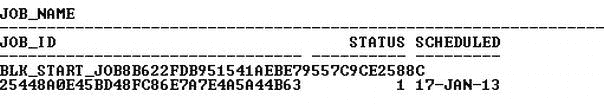

图 11-50. 在 EM12c 中查询中断期的输出结果

下一个查询则为我们提供了有关计划中断期的详细信息，包括 EM 作业服务所见的具体步骤。

```sql
SELECT  mje.step_id, mje.step_name, mje.step_type, mje.step_status,
        mje.start_time, mje.output_id, mje.error_id
FROM    MGMT_JOB_EXECUTION mje, MGMT_BLACKOUTS mb
WHERE   mje.job_id=mb.start_job_id
ORDER BY mje.step_id;
```

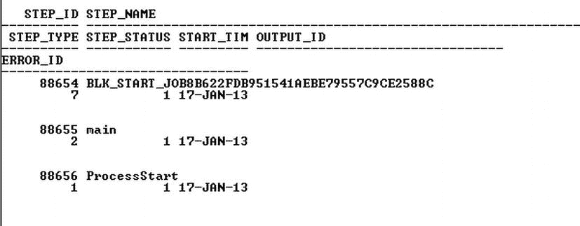

图 11-51. 在 EM12c 环境中提交的中断期的详细信息

这些查询也很有帮助，因为中断期可能是为未来计划/安排的，在 EM 控制台中不可见。您可以查询数据库以确保代理已向 OMS 发出所需的通信，从而验证中断期是否存在或报告是否正确。

### 通过 EM 作业控制多个管理代理

全系统范围的维护可能是一项艰巨的任务，但可以使用 EM 作业界面进行简化。管理代理使您能够通过一个作业向多个目标提交任务。这可用于对多个目标设置中断期、关闭实例、应用补丁以及执行大量其他常见任务。要提交可供多个代理使用的任务，必须正确创建作业。

要访问管理代理设置页面（如 图 11-52 所示），请选择 **设置** → **代理**。

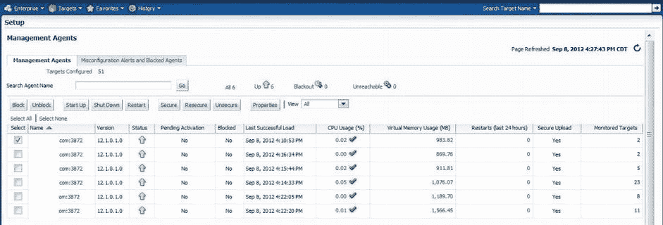

图 11-52. EM12c 中的管理代理

选择需要包含在任务中的代理。然后单击要执行的任务。任务包括以下选项：

*   阻止/取消阻止
*   启动/关闭/重新启动
*   重新保护/保护/取消保护
*   属性

您可以单击其中一个任务按钮，然后“创建作业”页面会要求您提交 EM 作业的标准信息（参见 图 11-53）。

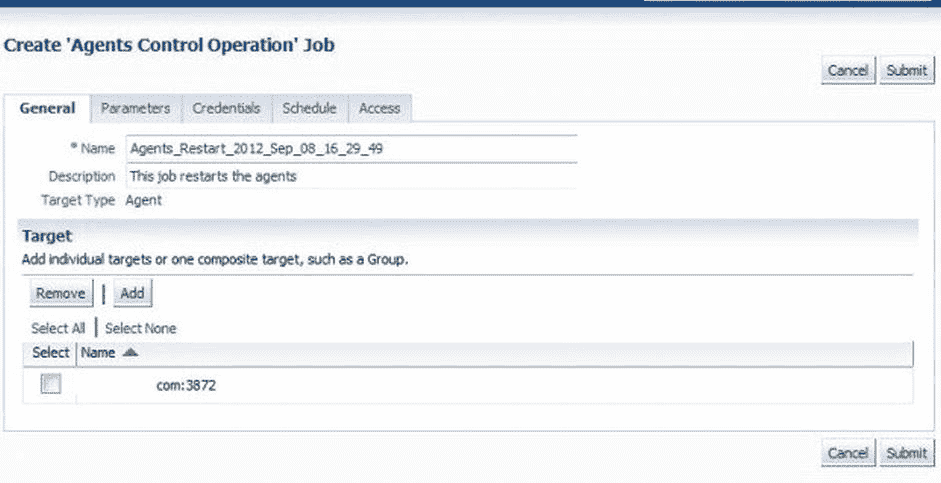

图 11-53. 有关代理控制作业的常规信息

这是一个非常出色的功能，可协助完成需要代理关闭然后重新启动的重复性维护任务，无需您登录每个控制台单独执行任务。

然后，您可以通过代理界面使用 EM 作业，在一个作业执行中配置多个代理。


## 摘要

这包括更改时区、设置代理主机，甚至执行常规安全任务，例如更改仓库密码。

EM 作业系统是增强型 EM12c 产品线中的一项成熟功能，为数据库环境提供了更为集成的调度程序选项。考虑到 EM12c 的监控设计，其支持数据库和服务器环境作业需求的能力使其成为显而易见的选择。对于当今需要承担要求苛刻的数据库专家角色的管理员来说，将所有作业（包括脚本、多步骤作业、高级逻辑检查和服务测试）迁移过来都是值得的。

# 第 12 章 事件管理

作者：Pete Sharman

事件管理的目标是使管理员能够尽可能快速、高效地监控和解决其数据中心中可能正在发生的服务中断。我们的目标不是管理这些服务中断可能引发的众多离散事件，而是管理数量更少但更有意义的问题事件，并在这些问题事件的整个生命周期中根据业务优先级进行管理。

为此，EM12c 提供了一个名为“事件管理器”的集中式事件控制台，使管理员能够跟踪、诊断和解决这些问题事件，同时还提供功能帮助消除重复问题事件的根本原因。事件管理器还包含与 Oracle 专业知识对接的功能，通过相关的 My Oracle Support 知识库文章和文档，使管理员能够加速诊断和解决问题事件与故障的过程。最后，事件管理器还提供了对问题事件执行生命周期操作的能力，因此您可以将问题事件的所有权分配给特定用户、确认问题事件、设置问题事件的优先级、跟踪问题事件的状态、升级问题事件或将其抑制以便推迟到以后处理。您还可以针对问题事件发起通知，或通过服务台连接器创建服务台工单。

由于事件管理器是 EM12c 中的全新功能，本章将提供以下内容：

*   对新术语的解释，包括事件、问题事件和问题
*   用户界面介绍，以便您能够设置事件管理器
*   一些关于如何充分利用此新功能的建议指南

## 事件管理器术语

在深入探讨如何使用事件管理器功能之前，您需要了解一些新术语。让我们从了解事件和问题事件，以及它们之间的区别开始。

### 事件和问题事件

企业管理器仍然是管理和监控 Oracle 数据中心的主要工具，因此它也管理和监控从应用服务器到数据库再到主机及其操作系统的应用程序堆栈。当企业管理器检测到此基础架构中的任何问题时，它会引发事件。*事件* 可能是以下任何一种：

*   *指标警报*：这些警报（例如，CPU 利用率或表空间使用警报）表示您设置的关键阈值已被突破。
*   *作业事件*：这些事件可能是由于您使用作业系统时作业失败引起的。会引发一个事件来发出特定作业失败的信号。
*   *标准违规*：如果您正在使用合规性标准，并且任何被监控的目标违反了这些标准，则可能引发标准违规事件。
*   *可用性事件*：如果企业管理器检测到目标宕机，则可能引发可用性事件。
*   *其他事件*：也可能发生其他类型的事件，例如 SLA 警报或高可用性与连接器外部类。当然，用户可以定义自己的事件类型并引发事件。

所有这些事件都表明 Oracle 数据中心中发生了特定问题。在所有事件中，您真正希望能够确定哪些是重要的，并且能够从这些重要事件中关联出那些与相同潜在问题相关的事件。归根结底，作为管理员，您想要管理的是数量更少的重要问题事件。您可能有一个性能问题事件，它合并了多个性能事件；另一个与空间相关的问题事件；以及一个基于可用性问题的不同问题事件。因此，事件管理的目标不是管理数量众多的单个事件，而是管理数量更少、更有意义的问题事件。一个问题事件可以是一个重大事件（例如，目标宕机），也可以是一组都与同一问题相关的事件的组合（例如，空间耗尽可能被企业管理器检测为从数据库、主机和存储目标类型引发的独立事件）。

事件是企业管理器检测到并在您的 IT 基础设施中引发的重要事件。每个事件都有一组属性，表明事件的类型、其严重性（致命、严重等）、引发事件的对象或实体（通常是一个目标，但也可能是作业或其他对象）、与事件关联的消息、发生时间戳以及功能类别（如可用性、安全等）。

与这些事件相关联的是事件严重性。第一个是“致命”，这是企业管理器中一个新增的严重性级别，专门与目标可用性事件类型关联，表示目标已宕机。“严重”和“警告”事件的含义与先前版本中的含义相同。接下来，“建议”级别通常与合规性标准违规事件关联。“信息”级别仅用于表示事件已发生，但无需对此采取任何措施。

如前所述，一个问题事件可以包含一个或多个事件。让我们来看一个包含一个事件的问题事件的详细信息。图 12-1 显示了一个包含一个可用性事件的问题事件。

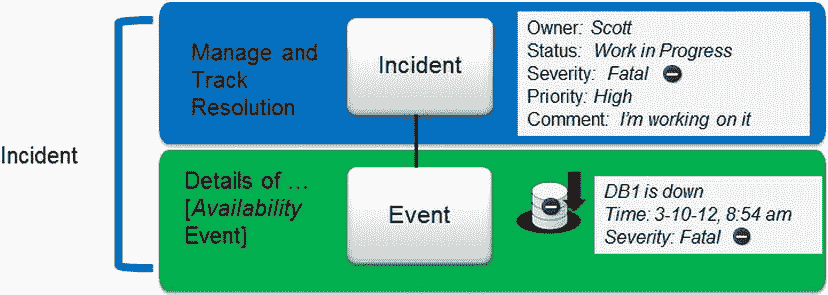

图 12-1。包含一个事件的问题事件

该事件发出信号表明数据库 DB1 已宕机，并包含一个指示事件引发时间的时间戳。由于这是一个目标可用性事件且数据库已宕机，因此严重性标记为“致命”。可以为该事件创建一个问题事件，因此该问题事件仅包含一个事件。为了管理和跟踪问题事件的解决情况，问题事件还具有其他属性，例如所有者（正在处理该问题事件的企业管理器用户）、状态、问题事件严重性（基于事件严重性）、优先级和一个注释字段。

问题事件也可以包含多个事件；这些事件将是相关的，并且指向相同的潜在原因。图 12-2 中的示例显示了一个主机目标上的两个指标警报事件——内存利用率指标警报事件和 CPU 利用率指标警报事件，因为该主机开始承受高负载。我们有一个警告严重性的内存利用率指标警报事件，不久之后又有一个严重严重性的 CPU 利用率指标警报事件。

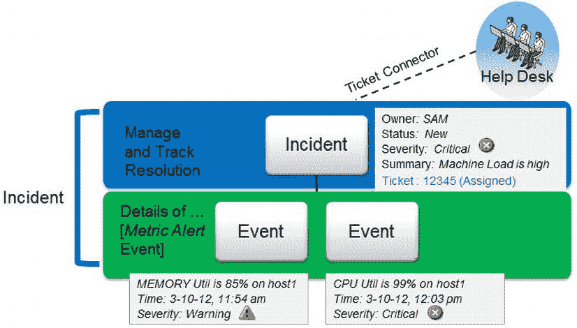

图 12-2。包含多个事件的问题事件


可以创建一个包含多个事件的**事件**，以便管理和跟踪整个事件的解决过程。与之前的示例类似，我们还有与该事件关联的其他属性。`Enterprise Manager` 会根据事件中包含的所有事件中最严重的事件严重级别，自动分配事件的严重级别。由于最严重的事件级别是“严重”，因此事件严重级别也被设置为“严重”。最后，事件还有一个摘要，即关于事件内容的简短描述。各个事件表明机器负载很高，因此您可以将摘要设置为该内容。或者，您也可以将事件摘要设置为与事件消息相同。

如果您使用某个帮助台连接器来连接帮助台系统，事件还可能生成一个帮助台工单，从而允许帮助台分析师处理该事件。在 `Enterprise Manager` 内，您将能够跟踪工单编号及其特定状态。

### 问题

`问题`是事件的根本原因。在 `Enterprise Manager` 的术语中，问题特指与 `Automatic Diagnostic Repository (ADR)` 事件或 Oracle 软件事件相关的问题。每当 `Enterprise Manager` 检测到 `ADR` 事件被引发时，它会自动创建一个问题。一个 `ADR` 事件可被视为一个关键的 Oracle 软件问题，通常需要联系 Oracle 支持部门、提出服务请求，并可能收到针对该问题的修补程序。

每当引发一个 `ADR` 事件时，我们会为该 `ADR` 事件在 `Enterprise Manager` 中生成一个事件，同时也会自动生成一个问题对象。所有具有相同问题签名（即相同根本原因）的 `ADR` 事件将被链接到单个问题对象中（例如，具有相同参数的 `ORA-0600` 错误的 `ADR` 事件将被链接到同一个问题对象）。管理员可以在 `Incident Manager` 中管理问题，其方式与管理事件相同，因此您可以为问题分配负责人、跟踪解决进度等。此外，还有指向 `Support Workbench` 功能的上下文链接，允许管理员打包诊断材料、提出服务请求，并在用户界面中查看诊断活动的状态，例如 SR 编号以及最终的 Bug 编号（如果生成了的话）。

Figure 12-3 说明了事件与问题之间的关系。在此示例中，数据库中发生了两个 `ADR` 事件（两个 `ORA-600` 错误）。这两个事件的严重级别均为“严重”。`Enterprise Manager Cloud Control` 自动创建一个包含这些事件的问题对象。在 `Incident Manager` 用户界面内，您可以链接到 `Support Workbench` 以提出服务请求，然后从 `Incident Manager` 跟踪该请求。

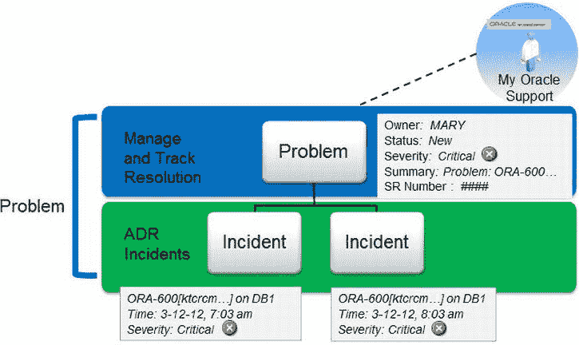

Figure 12-3. 事件与问题

### 事件规则集

`事件规则集`是对通知规则的替代和增强。它们提供了一种自动化与事件、事件或问题相关的操作的方法。事件规则集的一些常见场景或用例包括：基于事件创建事件、发送电子邮件或寻呼等通知、创建帮助台工单，以及自动化事件工作流操作（例如，自动分配事件负责人或在事件打开一段时间后将其升级）。

`Enterprise Manager Cloud Control 12.1` 中有两种类型的事件规则集：企业规则集和私有规则集。`企业规则集`旨在用于实施您在管理事件和事件方面的操作实践。我们前面讨论的所有操作，例如创建事件、发送通知和创建工单，都在企业规则集类型中得到支持。由于这些操作会影响所有类型的事件和问题，因此创建这些规则集的用户需要具有 `Rule Set` 资源权限。一旦创建了企业类型规则集，它对所有 `Enterprise Manager` 用户都是可见的。当您创建规则集时，可以对该规则集进行进一步的协作开发，因此每个规则集基本上可以有多个作者（即多个 `Enterprise Manager` 用户）可以编辑该特定规则集。而 `私有规则集` 仅设计用于向您自己发送电子邮件通知。因此，创建私有规则集不需要特殊权限。

规则集被定义为应用于一组通用对象（如目标（包括组）或作业）的一个或多个规则的集合。在组内，您可以为规则集指定一组异构目标（即一组不同的目标类型）进行应用。规则集的理念是使您能够将与同一对象相关的不同规则逻辑地组合到一个可管理的单元中。这是我们在早期版本中针对通知规则多次听到的一项增强请求，当时管理员经常基于目标类型创建多个通知规则，最终这些规则都对同一个组进行操作。将这些规则逻辑地组合成一个单元，是从早期功能自然演进而来的，使得跟踪和管理这些多个规则更加容易。

特定规则集内的规则按特定顺序执行。默认情况下，规则按创建顺序执行，但您可以随时更改此顺序。规则集本身也可以按特定顺序执行。同样，默认情况下这是规则集的创建顺序，但也可以更改。

`Enterprise Manager Cloud Control 12.1` 附带提供的一些开箱即用的规则集，会自动为 Oracle 公司认为有意义的事件创建事件，并自动删除事件。您可以按原样使用这些规则集，但无法编辑它们。不过，您可以使用 `Create Like` 功能创建自己的版本，如果原始规则集不符合您的要求，可以将其禁用。

规则是规则集的组成部分。`规则`基本上是给 `EM12c` 的指令，指示在发生事件、事件或问题时如何自动执行操作。规则不会追溯操作，因此规则仅对在其创建之后发生的事件、事件或问题生效。

规则由两部分组成：条件和操作。`条件`指定规则所应用的事件、事件或问题。`操作`告诉 `EM12c` 您希望它对这些指定的事件、事件或问题执行哪些操作。每个操作又可以有一些附加条件。让我们看几个示例来了解其工作原理：


# Incident Manager 用户界面

现在您已经了解了事件管理的基本术语和概念，让我们花点时间介绍 Incident Manager 用户界面。该界面包含两部分：

*   事件规则设置界面，用于创建自己的事件规则，以自动化响应事件和告警
*   Incident Manager 控制台，用于搜索、查看和管理未解决的事件、告警和问题

让我们首先了解如何创建您自己的事件规则。

### 创建事件规则

要创建事件规则，您需要点击任何屏幕右上角的 `Setup` 菜单，然后选择 `Incidents` -> `Incident Rules`，如 图 12-5 所示。

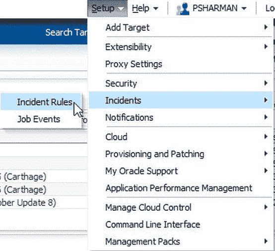

图 12-5. 访问 Incident Rules - All Enterprise Rules 页面

这将带您进入 `Incident Rules - All Enterprise Rules` 页面，在此您可以查看、编辑或删除现有规则集，或创建您自己的规则集。在此示例中，您将定义一个规则集中的规则，当 `orcl` 数据库的 `USERS` 表空间即将用尽空间时，创建一个事件并发送电子邮件给您。为使此规则执行，您需要将 `USERS` 表空间的默认设置更改为当空间用尽时不自动扩展，并将表空间的关键阈值触发点更改为 90% 满。这些操作在规则集创建过程之外完成（以下截图中省略了该部分）。点击 `Create Rule Set` 按钮，如 图 12-6 所示，以开始创建新规则集的过程。

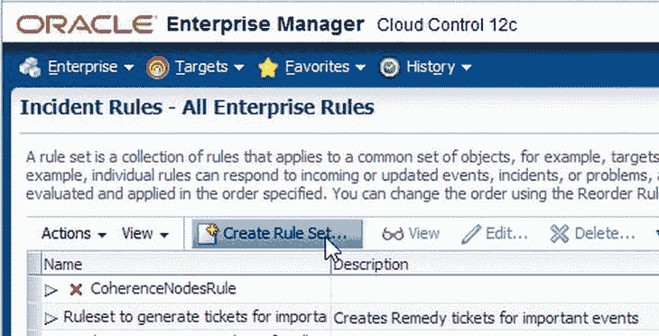

图 12-6. 创建规则集的第一步

`Create Rule Set` 页面的重要部分在底部，您在此指定规则适用的目标以及构成规则集的规则（参见 图 12-7）。填写规则集名称（必填字段）并提供规则集的描述。规则集类型默认为 `Enterprise`。（`Private` 用于当您希望获得非标准业务实践的通知时；它唯一能执行的操作是发送电子邮件。）接下来点击 `Add` 按钮，如 图 12-7 所示，以添加此规则集将应用到的组（虽然也可以添加特定目标，但当规则集同时应用于多个目标时，才能充分发挥此工具的威力）。

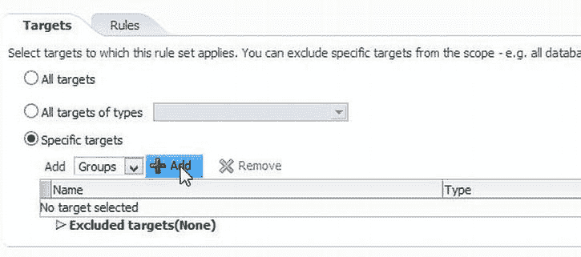

图 12-7. 向规则集添加目标

会出现 `Search and Select: Targets` 弹出窗口（前提是你已在浏览器中禁用了弹出窗口拦截器；如果未禁用，请为该站点允许弹出窗口并重试操作）。从这里，您可以为此规则集选择不同的目标。在 图 12-8 所示的示例中，您选择了 `HQ GROUP` 组，您知道它包含 `orcl` 数据库。

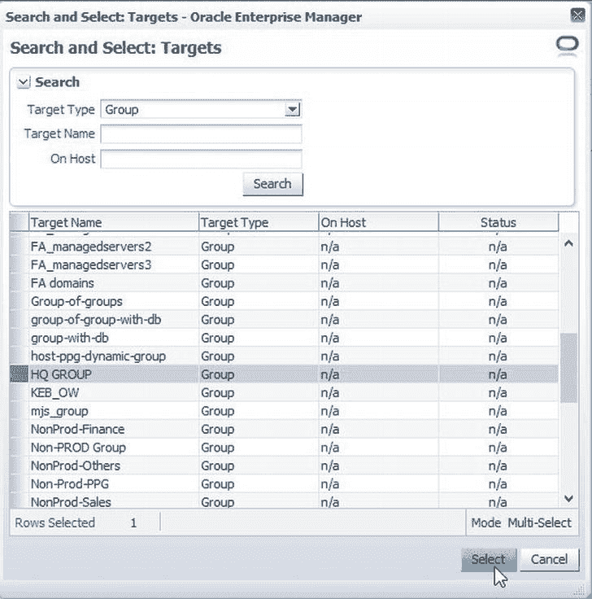

图 12-8. Search and Select: Targets 屏幕

一旦选择了目标组，您需要向规则集添加相关规则。要开始此操作，请点击 `Rules` 选项卡。然后点击 `Create` 按钮，如 图 12-9 所示。

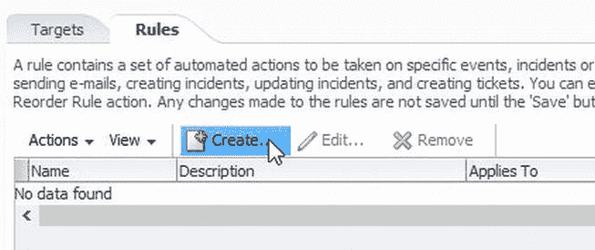

图 12-9. 向规则集添加规则

因为规则可以应用于事件、告警或问题，您需要选择正在创建的规则类型。在此示例中，如 图 12-10 所示，您正在为 `Tablespace Full` 指标告警事件创建规则，因此您在 `Select Type of Rule to Create` 弹出窗口中选择第一个选项。

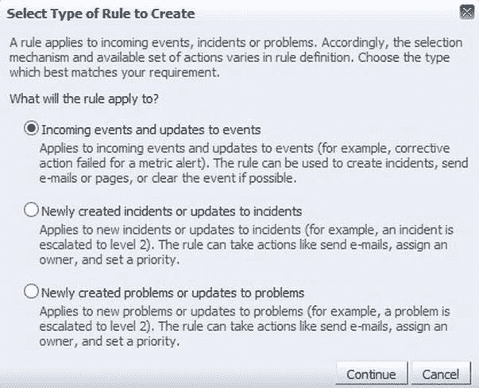

图 12-10. Select Type of Rule to Create 屏幕

接下来，您需要通过从下拉列表中选择 `Metric Alert` 来指定事件类型（参见 图 12-11）。

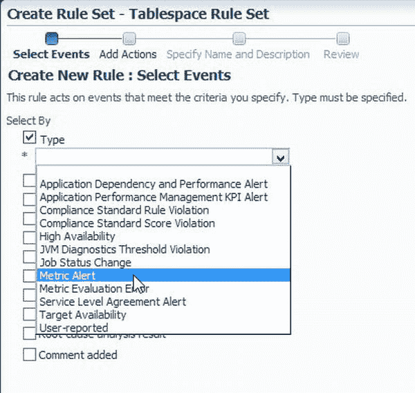

图 12-11. Create New Rule: Select Events 屏幕

您希望此规则仅作用于特定的指标告警，因此您选择 `Specific Events of Type Metric Alert` 单选按钮。然后点击 `Add` 按钮以添加事件，如 图 12-12 所示。

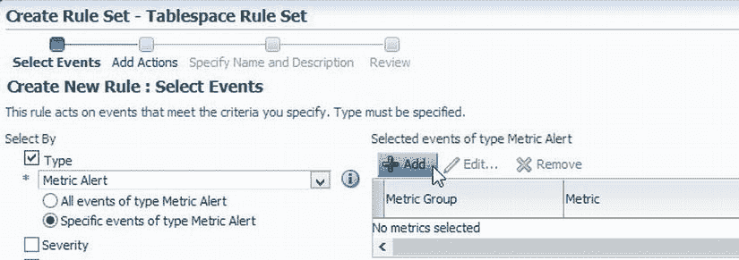

图 12-12. 向规则添加指标告警事件

选择 `Target Type` 为 `Database Instance`。然后搜索名称中包含 `*Tablespace*` 的所有指标以最小化列表（参见 图 12-13）。

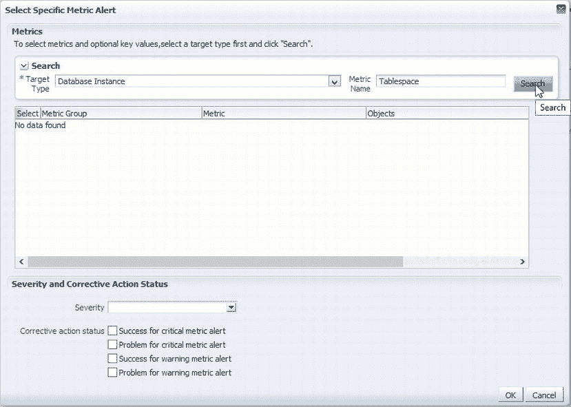

图 12-13. Select Specific Metric Alert 屏幕

在这种情况下，如 图 12-14 所示，您希望使用 `Tablespace Free Space (MB)` 指标，并将规则限制到 `USERS` 表空间，特别是针对 `Critical` 严重性情况。

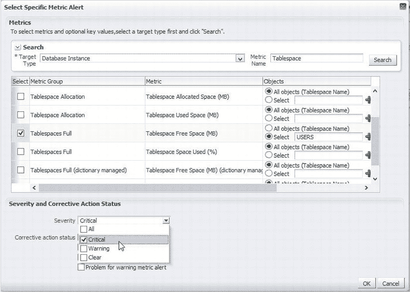

图 12-14. 选择特定指标和严重性

完成后，点击 `Next` 按钮。现在您需要添加相关操作，因此点击 `Add` 按钮，如 图 12-15 所示。

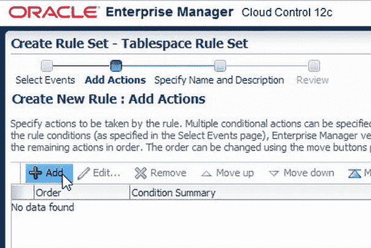

图 12-15. 向规则添加操作

在继续之前，让我们先看一下规则的示例。图 12-4 展示了一个应用于 `Production` 组 `PROD-GROUP` 的企业规则集。

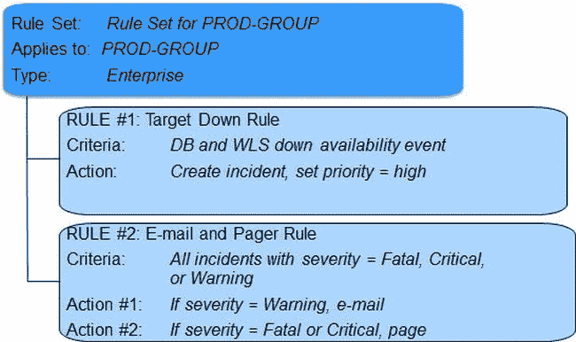

图 12-4. 一个事件规则集

这个异构组由一组目标组成，包括主机、数据库和 WebLogic 服务器。此规则集有两个规则。第一个是 `Target Down` 规则；该规则的条件是任何数据库或 WebLogic 服务器宕机。在这种情况下，操作是自动创建一个事件并将其优先级设置为高。此规则集中的第二个规则与发送通知有关。该规则的条件是针对 `PROD-GROUP` 内目标上的任何严重性为 `Fatal`、`Critical` 或 `Warning` 的事件。这里的操作是仅在严重性设置为 `Warning` 时发送电子邮件，或者在严重性设置为 `Fatal` 或 `Critical` 时发送页面通知。

*   如果规则条件是特定的指标告警（例如，CPU 利用率或表空间使用百分比超过某个警告或严重阈值），操作可能是创建一个事件。
*   另一个规则可以针对严重性为警告或严重的事件进行操作，操作是发送通知。在这种情况下，可能还有一个附加条件，即如果规则条件是 `Severity = Critical`，则操作是通过寻呼通知，而如果 `Severity = Warning`，则操作是通过电子邮件通知。
*   规则的另一个例子可能是针对已开启超过七天的事件，其中规则操作是将升级级别设置为 1（升级级别范围为 1 到 5）。

## 创建并配置规则

现在，你需要告知规则创建一个事件（分配给你的 EM 管理员名称），将其优先级设置为紧急，并同时向你发送电子邮件以确保你收到通知，如图 12-16 所示。

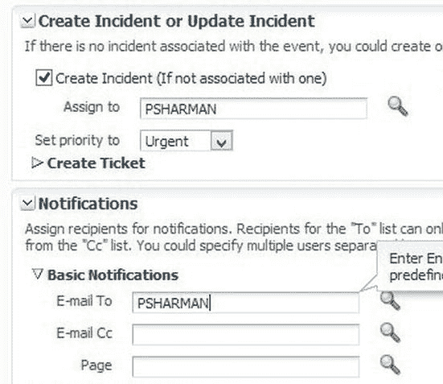

图 12-16. 向规则添加通知

完成后，点击`Continue`按钮，然后点击`Next`按钮。为规则提供名称和描述，然后点击`Next`，如图 12-17 所示。

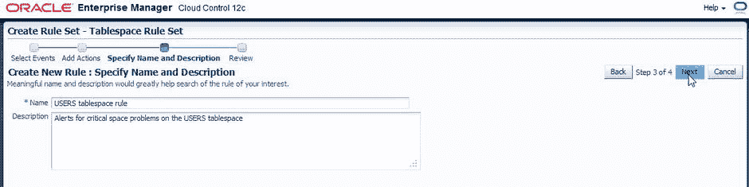

图 12-17. 指定规则名称和描述

点击`Continue`按钮。在下一个屏幕，点击`OK`按钮，然后点击`Save`以保存规则集。最后，点击`OK`以确认规则集创建消息，如图 12-18 所示。


图 12-18. 确认规则集已成功创建的窗口

现在你应该开始在`Incident Manager`控制台中看到生成的事件，如图 12-19 所示。根据检查事件的频率，这可能需要长达 30 分钟。

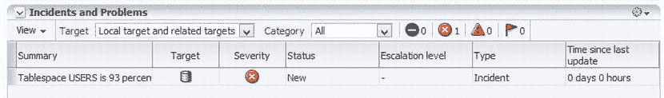

图 12-19. `Incident Manager`控制台中的表空间满警报

### 查看事件详情

现在，让我们继续查看特定事件的详细信息，使用我们刚刚创建的示例规则集。第一步是滚动浏览未解决事件列表，直到找到相关事件。（在此示例中，表空间`USERS`已使用 93%。）

当你通过单击任意位置选中包含该事件的行时，屏幕的下半部分会切换到该事件的详细信息，就像在普通主从窗体中看到的那样。图 12-20 显示了一个示例。

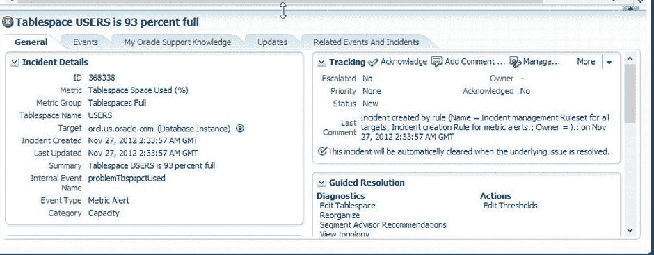

图 12-20. 事件详情

按照`EM12c`的标准，你可以通过将鼠标悬停在其两个部分之间的分隔线上来更改屏幕布局（如图 12-20 屏幕顶部中间所示），然后拖动光标以在不滚动的情况下显示更多信息。如图 12-21 所示的`General`选项卡，显示了关于事件和生成它的指标数据的具体详细信息、一个引导你完成解决事件的指导性解决区域，以及一个我们将在查看其他选项卡后回来讨论的跟踪区域。

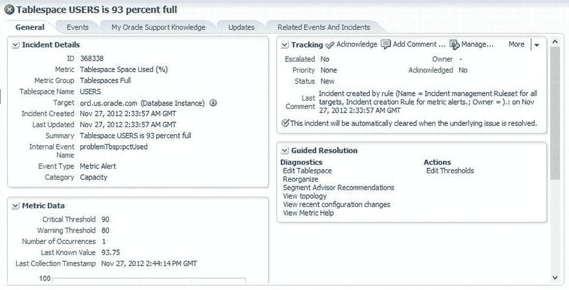

图 12-21. `Incident Manager`中的`General`选项卡

通过点击`Events`选项卡，你可以看到生成此事件的所有事件。在此特定情况下，只有一个事件，如图 12-22 所示。

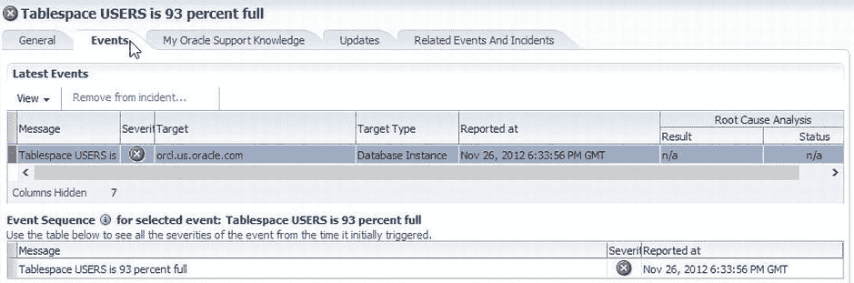

图 12-22. `Incident Manager`中的`Events`选项卡

转到下一个选项卡`My Oracle Support Knowledge`（如图 12-23 所示），你可以看到从`My Oracle Support`提取的可能有助于解决问题的相关信息。信息按相关性排序，因此希望更相关的文章能帮助解决问题。

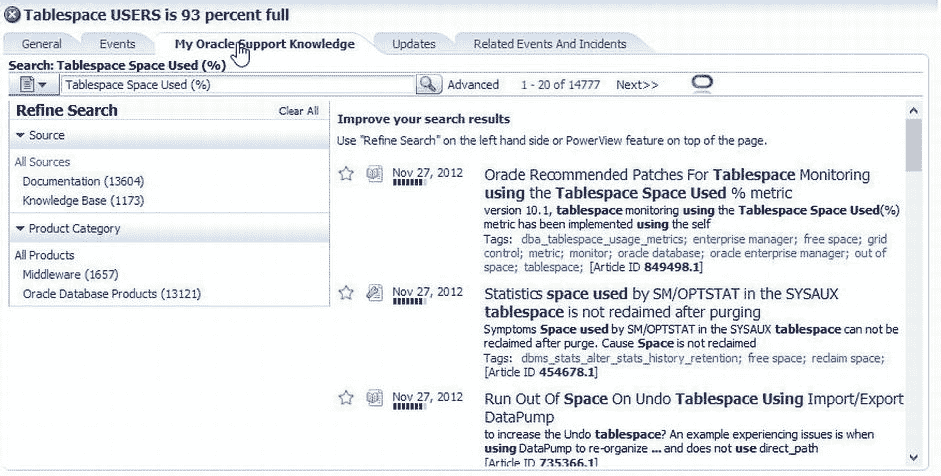

图 12-23. `Incident Manager`中的`My Oracle Support Knowledge`选项卡

`Updates`选项卡显示有关事件任何更新的信息。（在此示例中，没有任何更新，因此未包含屏幕截图。）你还可以通过点击最后一个选项卡查看任何相关事件和事件（同样，由于此特定事件目前没有，此处未显示）。

现在让我们转到`General`选项卡上的`Tracking`区域。在这里，你可以确认事件、向其添加注释或管理它（这也允许确认事件或添加注释）。点击`Manage`按钮以访问如图 12-24 所示的屏幕。

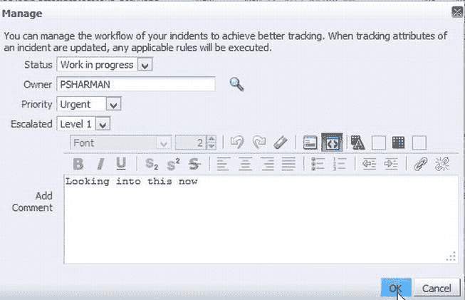

图 12-24. 管理事件的工作流

在图 12-24 所示的示例中，我已将事件状态更改为`Work in Progress`，添加了优先级和注释，并将事件升级到级别 1（如前所述，允许五个升级级别）。这向系统中的其他管理员表明此事件正在处理中。

### 创建自定义视图

你可能已经注意到，在`Incident Manager`控制台的首次截图中，在复杂环境中，你会看到大量的未解决事件，要找到你特别感兴趣的那些并不容易。值得庆幸的是，`EM12c`允许你构建自定义视图，以将你看到的事件数量限制在更易于管理的范围内。为此，点击`Incident Manager`控制台左侧`Views`窗格中的`Create`按钮，如图 12-25 所示。

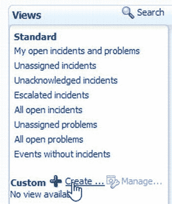

图 12-25. 开始创建自定义视图

对于此特定示例，你希望构建一个过去 24 小时内未解决事件和问题的视图，因此你为这里的不同字段选择相关值。如图 12-26 所示，然后你可以点击`Get Results`按钮以确保这确实显示了你希望看到的内容。

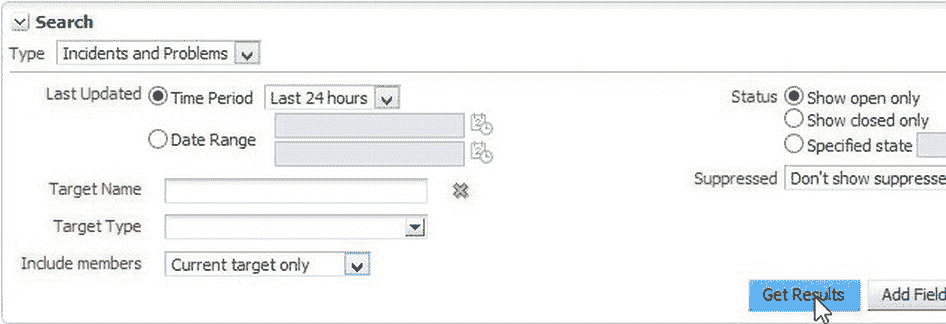

图 12-26. 搜索匹配自定义视图的事件

当你对结果满意后，点击`Create View`按钮。

当系统提示时，为自定义视图提供一个有意义的名称，如图 12-27 所示。


图 12-27. 为自定义视图输入视图名称

现在你将在左侧的自定义视图列表中看到该视图，如图 12-28 所示。

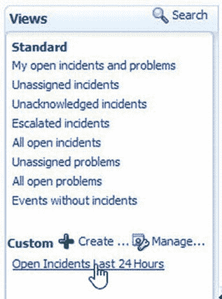

图 12-28. 选择你刚创建的自定义视图

### 规则与通知的优先级

在某些情况下，你的`EM12c`站点可能处于高负载状态。在这些情况下，更重要的事件和事件会优先于其他事件进行处理。在确定处理优先级时会考虑两个因素。

第一个是目标的生命周期状态，优先级基于以下顺序：关键任务目标具有最高优先级，其次是生产、阶段和测试目标，然后开发目标的优先级最低。作为管理员，你的职责之一是为每个目标适当设置生命周期状态。此处显示的状态是产品附带的开箱即用状态。

第二个因素是事件或事件的类型。任何与可用性相关的事件或事件，例如目标宕机，始终设置为最高优先级。接下来，处理任何严重级别为关键或警告的事件或事件，最后，任何仅信息性的事件被视为最低优先级。


这种优先级处理仅在系统处于高负载时才会考虑。在系统正常负载下，事件和事故会按到达顺序处理。

### 向后兼容性

在向后兼容性方面，当您从早期版本迁移到`EM12c`时，通知功能提供了向后兼容性。如果您基于`PL/SQL`、操作系统脚本或`SNMP`陷阱创建过任何通知，这些通知方法将被迁移并在`EM12c`中继续工作。

不过，Oracle 确实鼓励您使用新的事件模型创建这些通知方法的新版本，以便利用我们一直在讨论的新特性。如果您在早期版本中创建过通知规则，Oracle 会在升级过程中将其作为一部分迁移为新版本中的事故规则集。

让我们通过一个示例看看这种通知规则到事故规则集的映射是如何完成的。图 12-29 展示了一个`Enterprise Manager` 11.1 的通知规则，该规则应用于组`PROD-GROUP`及其中的数据库目标。

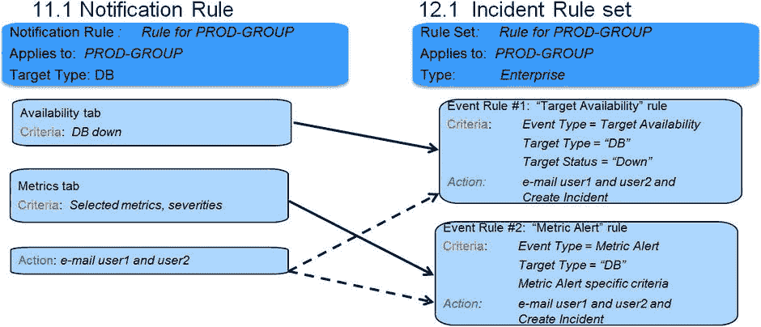

图 12-29。将通知规则映射到事故规则集

如果您熟悉早期版本中的通知规则，会了解通知规则设置中的选项卡。在我们的示例中，`可用性`选项卡显示了选择的`数据库关闭`标准，`指标`选项卡显示了所选关注指标及其严重性。最后，操作被设置为向两个用户`user1`和`user2`发送电子邮件。

当此规则被迁移到`EM12c`中的事故规则集时，该规则集将应用于相同的目标（组`PROD-GROUP`），并且其类型为`企业型`。规则集中将创建一个事件规则，以涵盖通知规则中指定的目标可用性标准。在通知规则中，标准是`数据库关闭`。在事故规则集中，这转换为：事件类型是目标可用性、目标类型是数据库、目标状态是关闭。并且由于通知规则中的操作是向用户发送电子邮件，该操作也会延续到事故规则集中。此外，还会为该特定事件创建一个事故对象。对于您可能在通知规则的`指标`选项卡上选择的指标，将创建一个指标警报规则，其标准如下：事件类型是指标警报、目标类型是数据库，并且也为指标警报设置了具体标准。这里的操作同样延续为向用户发送电子邮件，并且会为此事件创建一个事故。

## 事件管理器指南

既然您已经了解了如何在`EM12c`版本中使用`事件管理器`功能，接下来让我们看看一些关于如何充分利用此功能的建议指南。不过，在此之前，最好先定义一些您可能希望达成的目标，以确保使用`事件管理器`实现可扩展、更智能的监控。从高层次来看，这些目标可定义如下：

### 满足您的监控要求。
这些要求当然因客户而异，但一般来说，这意味着必须发送适当的通知，并遵循事故管理操作流程。实现此目标的最简单方法是部署监控标准。

### 遵守安全实践。
在授予目标权限时，请确保遵循最小权限原则。换句话说，只授予执行所需监控所需的权限级别。

### 易于管理。
重要的是，您的基础设施不会成为管理难题，因此请充分利用管理组，以便能够“将多个作为一个”进行管理，同时只需最少的努力来监控新目标。

设置目标监控和目标权限角色已在第 7 章中介绍，因此这里只看看设置规则来管理事故的建议指南。

## 管理事件和事故

管理事件和事故的首要考虑之一是从源头控制事件。正如在性能管理中您希望确保只完成需要完成的工作一样，在`事件管理器`中，有意义的做法是只让那些您希望响应的事件和事故发生。不必要的事件会给您的系统带来不必要的负载。以下是您为实现此目的可能需要考虑的一些事项：

*   审查您的指标设置。这看似显而易见，但请确保只对您实际关心的指标设置阈值。
*   根据指标趋势调整指标阈值。您可以对监控系统执行的一项更重要的操作是，在一段时间内跟踪指标趋势（时长取决于您可能已有的历史数据量以及指标测量频率），以便您可以就哪些指标重要（这可以反馈到前一点）以及阈值应设置在什么水平做出明智的决定。
*   适当设置发生次数。例如，如果某些事件只发生一两次，您可能不需要被通知。您可以设置在收到通知前必须达到的指标发生次数。
*   使用修正操作自动清除指标警报。根据指标本身，您可以定义一个将自动执行的修正操作来解决问题。这将自动清除指标警报，因此您无需采取行动。您可能还需要考虑创建一个规则，如果事件已打开一定天数，则清除所有指标警报的事件。
*   为您可能不关心的指标禁用指标收集。一旦您拥有了第二点中讨论的历史信息，您就可以利用它来设置指标阈值，并禁用在您的特定环境中可能不重要的那些指标。
*   在监控模板中定义指标设置，并在监控集合中使用这些模板。这将使您能够充分利用管理组，当新目标添加到您的环境或需要调整阈值时，减少您需要做的工作量。

### 规则集建议

关于规则集的建议，让我们从一些通用建议开始。首先，正如刚刚讨论的，强烈建议将组作为规则集的目标。您希望将属于该组成员的所有相关规则放在同一个规则集中。然后，尽可能利用您可以控制规则集中规则执行顺序这一事实。

当您在`EM12c`中的规则集中创建规则时，您会注意到三种类型的规则。让我们看看关于如何使用这些类型的具体建议。对于操作事件的规则，其用例是为在`Enterprise Manager`中管理的警报或事件创建事故。如果您想在`Enterprise Manager`中使用工单连接器为这些事故创建工单，请使用事件规则来实现，即通过规则操作首先在事件上创建事故，然后为该事故创建工单。事件规则的另一个用例是使用事件连接器将事件简单地发送到第三方管理系统。最后一种情况是仅发送事件通知而不创建事故，这在早期版本中也是可以的。


# 规则

对于处理事件的规则，其主要用例之一是自动化与事件工作流相关的操作（例如，自动为事件分配负责人），设置事件的优先级或其升级级别，或者为事件发送通知。你还可以在另一个用例中，根据事件条件创建工单，例如，当事件升级到第 2 级时创建一个工单。

规则用于问题，以自动化管理工作问题的工作流，其方式与处理事件非常相似。例如，你可以自动为问题分配负责人，设置问题的优先级或升级级别，或者为问题发送通知。

事件规则集可轻松用于自动化和工作流管理。例如，你可能会执行以下操作：

*   自动分配事件以加快解决速度。创建事件时，自动分配事件负责人。或者，创建一个单独的规则，基于特定标准分配负责人。无论哪种情况，这都节省了手动将事件分配给特定负责人的需要。
*   自动化你的升级流程。你可能希望根据事件处于打开和未解决状态的时间长度来设置其升级级别。如果你没有像第一个要点中讨论的那样自动分配事件，你可能希望升级未分配的重要事件。
*   为升级的事件或问题发送通知。当事件或问题被升级时，你可以发送电子邮件通知、分配负责人或为事件或问题设置优先级。
*   自动分配优先级级别。与负责人分配一样，你可以在事件创建时自动分配一个优先级级别。然后，你可以在事件管理器控制台中按优先级排序，并首先处理高优先级的事件。

# 摘要

事件管理器为管理员提供了一个中心控制点，用于管理由企业经理检测到的基础设施内的事件、事故和问题。它使你能够快速有效地监控和解决服务中断，并提供了一种管理数量较少但有意义的事件，而不是大量离散事件的方法。通过与 My Oracle Support 的集成，它允许你访问集成的 Oracle 专业知识，以加速事件和问题的诊断与解决。

# 第 13 章 高可用性、备份与恢复


作者：Leighton Nelson

本章探讨了为建立高可用的 Oracle Enterprise Manager Cloud Control 12c 环境所需的三层架构。它还涵盖了系统各组件的备份和恢复方法，包括存储库数据库、管理服务和代理。

Enterprise Manager Cloud Control 12c 为数据库、应用程序和硬件提供了完整的基础设施管理解决方案。在企业中拥有如此关键的组件，自然会引发对冗余和高可用性的担忧。如果配置中确实出现问题，恢复应以最短的时间进行，从而将对企业的可管理性和监控的干扰降至最低。维护也是必需的，需要为 Enterprise Manager 软件组件（即数据库、管理服务、代理和操作系统）打补丁。正是考虑到这些担忧，Oracle Enterprise Manager 被设计为通过使用不同的高可用性机制来满足期望的服务和操作级别。

## 高可用性

Enterprise Manager 架构中的每个组件都应具有高可用性，以实现完整的高可用配置。需要考虑的主要组件如图 13-1 所示，如下：

*   `Management Agent`：在目标上运行，与`OMS`通信并发送指标。
*   `Management Server`：Enterprise Manager 的核心，提供`Management Services`。
*   `Repository`：在 Oracle 数据库中存储来自监控目标的持久数据。
*   `Software Library`：存储用于修补、配置以及代理和插件部署的文件。

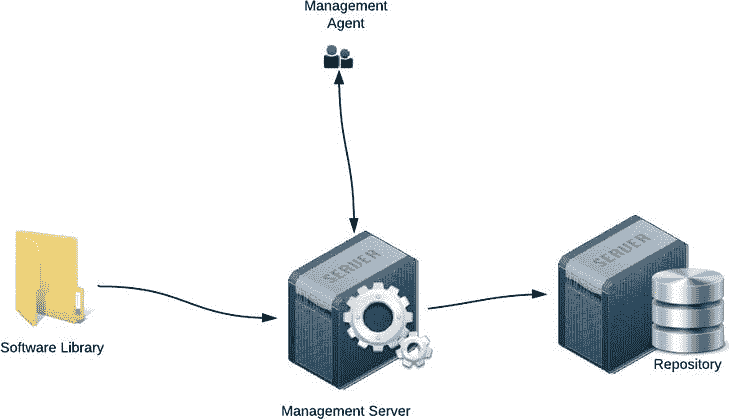

图 13-1 .  Enterprise Manager Cloud Control 12c 架构

可以为每个组件配置不同级别的复杂性和成本的不同级别的高可用性。在考虑高可用性要求时，应在成本、复杂性、性能和数据丢失方面做出最小的权衡。通常，复杂性和高可用性级别是成比例的。

`Oracle Management Agent`应配置为开机启动。这确保了在服务器重启后不需要手动干预，并能在服务中断后快速启用目标监控。在 Unix 和 Linux 操作系统上，一个名为`gcstartup`的脚本被放置在`/etc/init.d`中，并在特定的运行级别下运行。在 Microsoft Windows 上，会创建一个服务以在启动时自动启动。

Oracle 为 Enterprise Manager Cloud Control 定义了四个高可用性级别。这些级别在表 13-1 中进行了总结。本章仅涵盖级别 1 到 3。

表 13-1. Enterprise Manager 高可用性级别

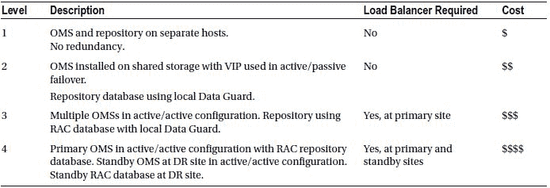

## Oracle Management Agent

`Oracle Management Agent`负责发送其安装主机的指标和待处理警报。为了提供高可用性，应为代理启用以下功能：

*   启用代理在操作系统启动时自动启动。这应在运行`root.sh`脚本后自动配置。
*   在冗余存储上安装代理。这包括配置了 RAID 的存储后端。
*   为代理看门狗进程配置重启参数。看门狗进程负责基于以下环境变量重启代理：
    ```
    EM_MAX_RETRIES  表示看门狗进程在 `EM_MAX_RETRY_WINDOW` 内尝试重启代理的最大次数。默认设置为 3。
    EM_RETRY_WINDOW  表示与 `EM_MAX_RETRIES` 一起使用的时间间隔，用于在尝试启动管理代理之前进行等待。默认设置为 600 秒。
    ```

安装 Enterprise Manager 代理后，应执行`<AGENT_HOME>/root.sh`脚本。这将在 Linux 和某些 Unix 操作系统上创建以下控制管理代理启动的脚本：

*   `/etc/init.d/gcstartup`
*   `/etc/init/gcstartup`
*   `/etc/rc.d/init.d/gcstartup`

如果这些文件不存在，请确保已执行`<AGENT_HOME>/root.sh`脚本。

代理的丢失或损坏将导致其关联目标的监控和指标数据上传丢失。同样，如果代理关闭，目标将无法与管理服务器通信，导致可管理性丧失。

### Management Repository


资料库是代理上传的监控数据的持久化存储。它存储所有监控目标的指标和配置数据。资料库丢失将导致管理服务器故障。建议启用数据库高可用性功能，例如用于数据文件存储（取决于冗余级别和后端 RAID 配置）的实时应用集群 (`RAC`) 或 `RAC One Node`、自动存储管理 (`ASM`)，以及用于资料库的数据卫士 (`Data Guard`)。此外，如果资料库配置为 `RAC` 数据库，则管理服务应配置为使用单客户端访问名称 (`SCAN`) 和非默认的 `RAC` 服务名。以下是一个为 `RAC` 数据库配置管理服务的示例：
```
emctl config oms -store_repos_details -repos_conndesc "
(DESCRIPTION= (ADDRESS=(PROTOCOL=TCP)
(HOST=emrep-scan.example.com)(PORT=1521) )
(CONNECT_DATA=(SERVER=DEDICATED) (SERVICE_NAME = emrep)))"
-repos_user sysman
```

图 13-2 展示了一个使用 `SCAN` 名称配置的、采用 `RAC` 资料库数据库的 `OMS` 示例。有关配置 `SCAN` 的更多详细信息，请参阅 *《Oracle Clusterware 管理与部署指南 11g 第 2 版 (11.2)》*。

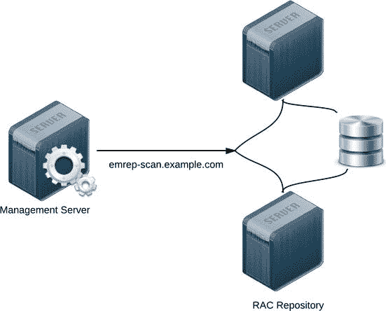

图 13-2 . 使用 `RAC` 数据库配置的资料库数据库

考虑使用 Enterprise Manager Cloud Control 12c 中的最大可用性架构¹ (`MAA`) 顾问来配置额外的 `HA` 组件，包括以下内容：
*   启用 `ARCHIVELOG` 模式，以便可以执行数据库的一致性热备份。
*   启用块校验和，使 Oracle 能够检测物理磁盘或存储系统导致的损坏。将 `DB_BLOCK_CHECKSUM` 参数设置为 `TYPICAL` 或 `FULL`。
*   适当配置重做日志文件和组的大小。优化数据库的 `I/O` 吞吐量和性能，以使日志切换不会过于频繁。使用重做日志大小调整顾问（通过设置 `FAST_START_MTTR_TARGET` 启用）有助于确定最佳大小。
*   使用快速恢复区² 存储重做日志和归档日志等与恢复相关的文件。然后 Oracle 可以使用建议的、利用快速恢复区的备份机制。
*   启用闪回数据库，以便使用闪回日志实现更快的数据库恢复。
*   使用快速启动故障恢复来控制实例恢复时间。设置初始化参数 `FAST_START_MTTR_TARGET` 以指定实例恢复应占用的秒数。
*   启用数据库块检查，以便及早检测和防止数据及内存损坏。将 `DB_BLOCK_CHECKING` 设置为 `TRUE` 或 `FULL`。

配置完组件后，您可以使用高可用性控制台（如 图 13-3 所示）监控每个组件的状态。

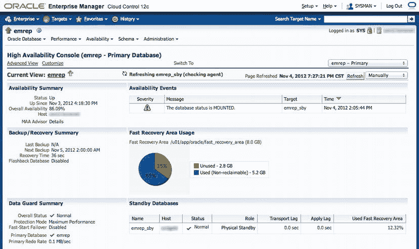

图 13-3 . Enterprise Manager Cloud Control 12c 高可用性控制台

 **注意** 管理资料库应配置在其自己的数据库中，以确保对资料库的操作不会影响其他应用程序，反之亦然。

建议使用物理备用数据库，以便在主站点发生故障时提供灾难恢复。主资料库上的数据将与备用数据库保持同步。为资料库数据库配置物理备用时，请使用与主站点类似的硬件和资源，以便在发生故障切换/切换时不会出现任何性能影响。使用 Enterprise Manager 从主数据库创建备用数据库。根据您的网络带宽和恢复目标确定要用于同步备用数据库的网络模式：
*   `最大保护`：同步写入备用库
*   `最大可用性`：同步写入备用库
*   `最高性能`：异步写入备用库

 **注意** Enterprise Manager 只能创建单实例备用数据库。您可以使用 Enterprise Manager 中的“转换为 `RAC`”功能将单实例物理备用数据库转换为 `RAC`。

### 管理服务

管理服务 (`OMS`) 通过 Enterprise Manager 控制台提供用户界面，并处理来自代理的数据。`OMS` 丢失将导致 Enterprise Manager 完全中断：代理上传、作业、事件和通知都将停止运行。Oracle WebLogic Node Manager 和 Oracle 进程管理器与通知服务器 (`OPMN`) 将尝试在管理服务宕机时自动重启它。虽然这提供了一些好处，但如果主机宕机，它并不能保护 `OMS`。至少，如果可能，`OMS` 和资料库应安装在不同的主机上。多个 `OMS` 可以部署在服务器负载均衡器之后，以提供针对单台主机故障的保护。此外，您可以选择在共享文件系统上安装 `OMS`，这将在单台主机丢失时提供被动故障转移。我们将详细探讨保护 `OMS` 的每种选项。

### 级别 1 — 分离的 `OMS` 和资料库主机/无冗余

级别 1 配置由单个 `OMS` 和资料库组成，每个都安装在其自己的主机上。此配置提供的保护最少，因为任何主机的故障都将导致 Enterprise Manager 系统完全中断。应考虑 `OMS` 和资料库之间的距离，因为两者之间的高网络延迟会降低性能。建议除最小配置外的所有配置都采用此配置。

图 13-4 是级别 1 高可用性配置的示意图。代理直接上传到管理服务主机，而用户通过 Enterprise Manager 控制台或命令行 `EMCLI` 直接与物理 `OMS` 主机交互。如果管理服务或资料库数据库主机中的任何一个变得不可用，将发生完全中断，导致目标监控丢失。将每个组件保留在其自己的服务器上可以降低它们因资源开销而相互影响的可能性。例如，增加数据库参数 `sga_max_size` 和 `sga_target` 可能会降低 `OMS` 的性能，因为这样做会减少操作系统可用的内存量。此外，它为根据业务需求扩展环境奠定了基础。

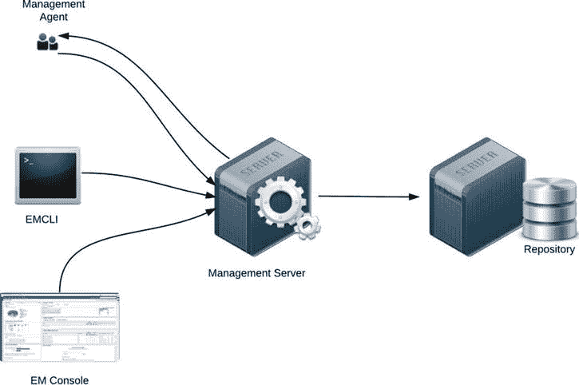

图 13-4 . `OMS` 和资料库位于不同服务器上的级别 1 高可用性配置

### 级别 2 — 主动/被动 `OMS` 和数据卫士资料库

为了减少计划内或计划外中断期间的 `OMS` 停机时间，应在配置中引入一些冗余。级别 2 配置使用共享文件系统实现管理服务的主动/被动（或冷）故障转移集群解决方案。文件系统在两个或多个主机之间共享，且一次仅在一个主机上处于活动状态。

作为级别 2 高可用性配置的先决条件，应执行以下步骤：
1.  `OMS` 的共享文件系统可以安装在通用集群文件系统上，包括 `NFS`、Oracle 集群文件系统 (`OCFS2`) 和 Oracle 自动存储管理集群文件系统 (`ACFS`)。如果使用 `NFS` 作为共享存储，请确保在 `/etc/fstab`（AIX 上为 `/etc/filesystems`）中设置正确的挂载选项，以防止潜在的 `I/O` 问题。具体来说，应设置 `rsize` 和 `wsize`。


以下示例展示了 Linux 服务器上`/etc/fstab`文件中的一个条目；NFS 共享被挂载在名为`filer1`的文件器上的`/vol1/oms_share`目录下。

```
filer:/vol1/oms_share /u01/app/oms_share nfs rw,bg,rsize=32768,wsize=32768,hard,nointr,tcp,noac,vers=3,timeo=600 0 0
```

2.  在共享文件系统上安装 OMS 的二进制文件以及库存。
3.  使用 Oracle Clusterware 或第三方软件和硬件设置虚拟主机名和 IP 地址（VIP）。通过将 OMS 的虚拟主机名与一个解析到该主机名的唯一 IP 地址一起使用来实现故障转移。
4.  使用带有 Data Guard 的本地物理备用数据库配置仓库数据库（参见图 13-5）。

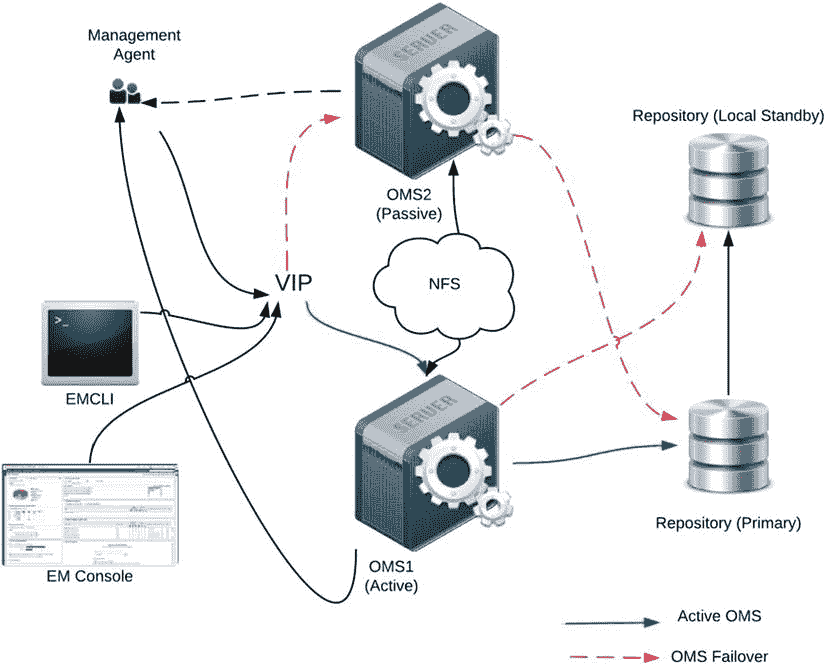

图 13-5. 具有主动/被动 OMS 和本地备用的 2 级 Enterprise Manager Cloud Control 12c 高可用性配置

在我们的示例中，我们将使用 Oracle Clusterware 来创建和管理虚拟主机名，并执行应用程序的故障转移。`OCFS2`被选为共享文件系统。

 **注意** `OCFS v1`不支持作为 OMS 的共享存储。

在安装管理服务之前，您应在所有主机上配置以下先决条件：

1.  确保安装 OMS 的每台主机上的操作系统用户 ID 相同。

 **注意** 对于 Red Hat Enterprise Linux 和 Oracle Linux 操作系统，请安装`oracle-validated`或`oracle-preinstall-11gr2`软件包以确保 UID 和 GID 的一致性。

```
[oracle@oms1 ∼]$ id -a
uid=1101(oracle) gid=1000(oinstall) groups=1000(oinstall),1021(asmdba),1032(dba)
```

2.  设置环境变量。
    *   a. 操作系统时区变量`TZ`:³

    ```
    export TZ='America/New_York'
    ```

    *   b. 应取消设置`PERL5LIB`变量，以避免关联到错误的 PERL 库。
3.  在两台服务器上安装 Oracle Clusterware（参见*Oracle Grid Infrastructure Installation Guide*）。
4.  安装并配置`OCFS2`。
5.  准备数据库以供`OMS`使用（更多信息参见第 2 章）。

在安装`OMS`之前，应有一个映射到唯一静态 IP 地址的虚拟主机名可用（这意味着一个当前未使用、与 Enterprise Manager 其他组件在同一子网中的 IP 地址）。VIP 配置在用于访问服务器的公共子网上。如果托管 VIP 的服务器宕机，Oracle Clusterware 会将其重新定位到集群中可用的成员。同样，如果需要对托管 VIP 的服务器进行维护，也可以将其重新定位到集群中的另一台服务器。

可以像创建任何其他 Clusterware 资源一样创建 VIP。但是，Oracle 建议您使用 Oracle Clusterware 11gR2 中的`appvipcfg`实用程序来创建应用 VIP。VIP 是使用一组适用于应用 VIP 的预定义设置创建的，例如放置策略和回退⁴选项。有关使用`appvipcfg`的详细信息，请参阅*Oracle Clusterware Administration and Deployment Guide11gR2*文档。

按照以下步骤，为`OMS`创建一个应用 VIP：

1.  安装 Oracle Clusterware 11gR2 后，以`ROOT`用户登录并执行以下命令：

    ```
    GRID_HOME/bin/appvipcfg create -network=1 \
           -ip=192.168.1.0 \
           -vipname=omsvip \
           -user=root
    ```

运行`appvipcfg`的示例输出如下：

```
[root@oms1 bin]# /u01/app/11.2.0/grid/bin/appvipcfg create -network=1 \
-ip=192.168.1.0 \
-vipname=omsvip \
-user=root
Production Copyright 2007, 2008, Oracle.All rights reserved
2012-10-28 03:30:29: Creating Resource Type
2012-10-28 03:30:29: Executing /u01/app/11.2.0/grid/bin/crsctl add type
app.appvip_net1.type -basetype ora.cluster_vip_net1.type -file
/u01/app/11.2.0/grid/crs/template/appvip.type
2012-10-28 03:30:29: Executing cmd: /u01/app/11.2.0/grid/bin/crsctl add type
app.appvip_net1.type -basetype ora.cluster_vip_net1.type -file
/u01/app/11.2.0/grid/crs/template/appvip.type
2012-10-28 03:30:37: Create the Resource
2012-10-28 03:30:37: Executing /u01/app/11.2.0/grid/bin/crsctl add resource
omsvip -type app.appvip_net1.type -attr
"USR_ORA_VIP=192.168.1.0,START_DEPENDENCIES=hard(ora.net1.network)
pullup(ora.net1.network),STOP_DEPENDENCIES=hard(ora.net1.network),
ACL='owner:root:rwx,pgrp:root:r-x,other::r--,user:root:r-x',
HOSTING_MEMBERS=oms1.example.com,APPSVIP_FAILBACK="
2012-10-28 03:30:37: Executing cmd: /u01/app/11.2.0/grid/bin/crsctl add
resource omsvip -type app.appvip_net1.type -attr
"USR_ORA_VIP=192.168.1.0,START_DEPENDENCIES=hard(ora.net1.network)
pullup(ora.net1.network),STOP_DEPENDENCIES=hard(ora.net1.network),
ACL='owner:root:rwx,pgrp:root:r-x,other::r--,user:root:r-x',
HOSTING_MEMBERS=oms1.example.com,APPSVIP_FAILBACK="
```

这将在网络 1 上创建一个 VIP，定义为 IP 地址`192.168.1.0`。VIP 名称为`omsvip`，由`ROOT`用户所有。

2.  接下来，您需要允许 Oracle Grid Infrastructure 软件所有者（例如`GRID`）运行脚本来启动 VIP。作为`ROOT`，执行以下命令：

    ```
    GRID_HOME/bin/crsctl setperm resource omsvip -u user:grid:r-x
    ```

3.  以`GRID`用户身份启动 VIP。

    ```
    GRID_HOME/bin/crsctl start resource omsvip
    ```

例如：

```
[grid@oms1 ∼]$ $GRID_HOME/bin/crsctl start resource omsvip
CRS-2672: Attempting to start 'omsvip' on 'oms1'
CRS-2676: Start of 'omsvip' on 'oms1' succeeded
```

4.  检查 VIP 的状态。

    ```
    GRID_HOME/bin/crsctl status resource omsvip
    ```

输出状态应类似于以下内容：

```
NAME=omsvip
TYPE=app.appvip_net1.type
TARGET=ONLINE
STATE=ONLINE on oms1
```

5.  在 DNS 中定义虚拟主机名，并且应解析到使用上述步骤创建的应用 VIP 地址。使用`nslookup`或`dig`命令检查虚拟主机名和 VIP 是否可解析。

    ```
    $ nslookup omsvip
    ```

这应该解析到集群中每个节点上虚拟主机名的唯一 IP 地址。

6.  同时对 IP 地址进行反向查找。

    ```
    $nslookup <virtual IP address>
    ```

7.  验证从`nslookup`输出返回的 IP 地址是否在`OMS`主机上运行。

    ```
    ifconfig –a|grep <virtual IP address>
    ```

8.  验证虚拟主机名和 VIP 已正确配置后，您就可以继续进行`OMS`安装了。在启动安装程序之前应执行以下操作：
    *   a. 在所有集群节点的共享存储上为`OMS`创建一个新的`ORACLE_HOME`：

        ```
        $ mkdir –p /u01/app/oms_share
        ```

    *   b. 在所有节点上的`OMS`的`ORACLE_HOME`下创建 Oracle 库存目录：

        ```
        $ mkdir /u01/app/oms_share/oraInventory
        ```

    *   c. 在`oraInventory`目录中创建库存指针：

        ```
        $ vi oraInst.loc
        ```

`oraInst.loc`文件应包含`OMS`的库存路径和软件所有者的组。例如：

```
inventory_loc=/u01/app/oracle/oms_share/oraInventory
inst_group=oinstall
```

9.  接下来，通过指定`ORACLE_HOSTNAME`环境变量为您的虚拟主机名，并指向共享库存位置，来进行安装。


```
runInstaller -invPtrloc /u01/app/oms_share/oraInst.loc \
ORACLE_HOSTNAME=omsvip.example.com –debug
```

## 在第一台主机上安装 OMS

按照《Oracle Enterprise Manager Cloud Control 12c 基础安装指南》中描述的安装步骤，在第一台主机上安装 OMS。您只需要完成一次安装。由于位置是共享的，二进制文件将可以从共享文件系统的另一台主机访问。

OMS 成功安装并启动运行后，如果主机宕机，VIP 会自动迁移到另一个节点。然后，您可以在集群中任何运行 VIP 的剩余节点上手动启动管理服务。

### 手动迁移 VIP

要将 VIP 手动迁移到集群中的另一台主机，请执行以下命令：

```
[grid@oms1 ∼]$ crsctl relocate res omsvip
CRS-2673: Attempting to stop 'omsvip' on 'oms1'
CRS-2677: Stop of 'omsvip' on 'oms1' succeeded
CRS-2672: Attempting to start 'omsvip' on 'oms2'
CRS-2676: Start of 'omsvip' on 'oms2' succeeded
```

### 检查迁移后的主机

1.  检查与 VIP 关联的 IP 地址是否在迁移后的主机上运行。

```
ifconfig –a|grep <vip>
```

存储库数据库应可从集群中的其他主机访问，并且监听器应已启动并运行。

2.  将 `ORACLE_HOSTNAME` 环境变量设置为虚拟主机名。沿用我们的示例，使用以下命令：

```
export ORACLE_HOSTNAME=omsvip.example.com
```

3.  在新节点上启动 OMS。

```
$OMS_HOME/bin/emctl start oms
```

或者，可以通过创建 `start`、`check`、`stop`、`clean` 和 `abort` 例程来配置 Oracle Clusterware 以完全管理 OMS，这些例程告诉它如何对 OMS 进行操作。此配置的详细信息超出了本章的范围。有关详细信息，请参阅《Oracle Clusterware Administration and Deployment Guide 11gR2》。

## 为 OMS 实施冷故障切换

为 OMS 实施冷故障切换方案后，您就受到了保护，免受单台主机故障的影响。然而，执行故障切换的时间可能从几分钟到几小时不等，具体取决于是手动完成还是通过 Oracle Clusterware 或其他方法自动完成。

存储库也需要受到保护，因为它现在是一个单点故障。如前所述，强烈建议设置一个本地 Data Guard，包含一个物理备用数据库。备用数据库应配置在与管理服务器和主数据库分离的主机上。但是，为了降低成本，也有可能在另一台 OMS 主机上创建主数据库和物理备用数据库。如果主存储库发生计划内或计划外的中断，物理备用数据库可以在剩余的主机上切换或故障转移到备用数据库。请注意，该主机现在将成为一个单点故障。

### 使用 Enterprise Manager 创建备用数据库的前提条件

要使用 Enterprise Manager 创建备用数据库，目标主机应安装有 Oracle Management Agent，并由 Enterprise Manager 进行监控。此外，如果使用 ASM 作为数据库存储，它应与监听器一起被监控。

### 使用 Enterprise Manager 创建备用数据库的步骤

1.  导航到存储库数据库主页，从菜单中选择 **可用性** > **添加备用数据库**。
2.  备份主数据库（参见图 13-6）。Data Guard 使用 RMAN 基于新的或现有的备份创建备用数据库。联机备份要求数据库处于 `ARCHIVELOG` 模式。

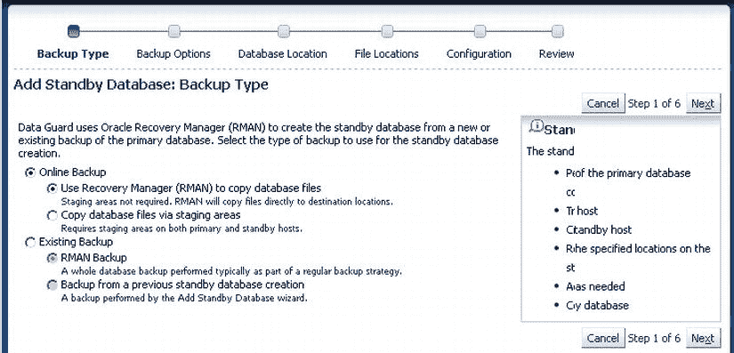

图 13-6.  使用 RMAN 联机备份添加备用数据库

如果使用联机方法，请在高峰时段之外的时间执行备份，以免对 Enterprise Manager Cloud Control 的性能产生负面影响。使用此方法时，您还可以决定使用 RMAN 的功能通过 Oracle Net Services 将备份直接复制到目标主机，或者在复制前暂存备份。后一种选项需要在主站点和辅助站点都有额外的存储空间。如果存在常规备份过程或先前的“添加备用数据库”操作产生的现有备份，也可以使用它。

3.  接下来，您将选择一个备份选项。如图 13-7 所示，您提供 RMAN 将使用的并行度以及主主机的凭据。备用数据库将需要备用重做日志以进行实时应用。在发生角色转换时，它们也会在主数据库上创建。您可以为备用重做日志使用 OMF（默认）或手动指定日志文件。对于使用 ASM 的数据库，请提供磁盘组名称。

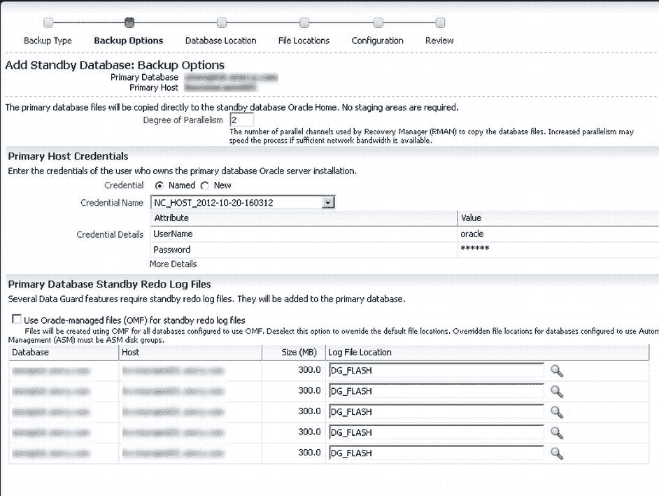

图 13-7.  添加备用数据库，备份选项

4.  添加用于在备用数据库上存储数据库文件和快速恢复区的文件位置，如图 13-8 所示。如果使用 ASM，请指定磁盘组。

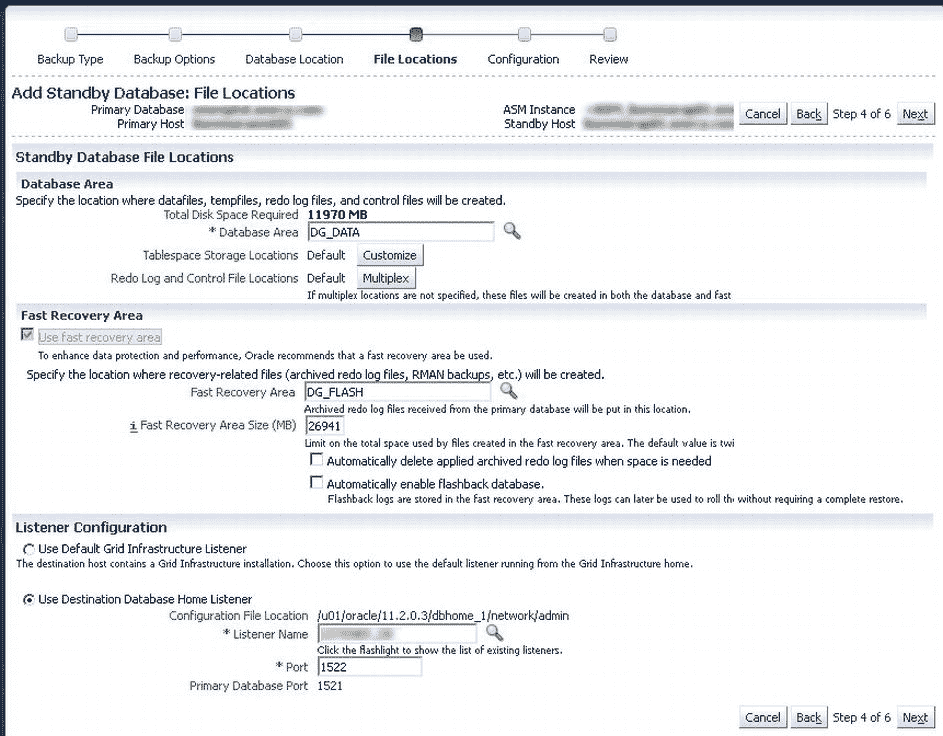

图 13-8.  添加备用数据库，文件位置

5.  选择备用数据库的配置属性，如图 13-9 所示。

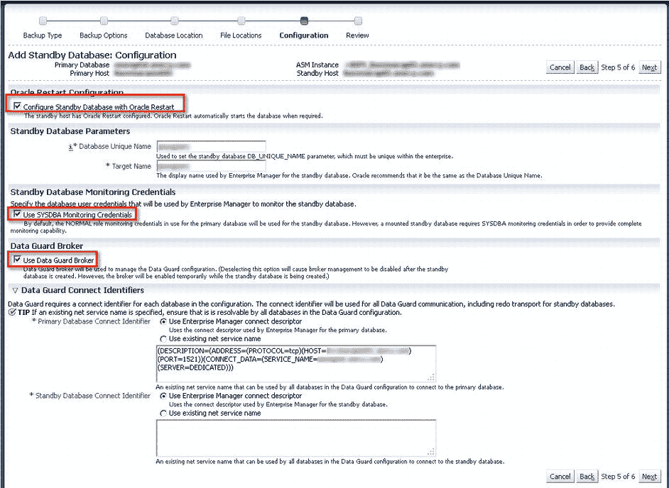

图 13-9.  添加备用数据库，配置

如果备用服务器上配置了 Oracle Restart[⁵]，请为其启用配置：
    *   a.  为备用数据库提供一个唯一的名称，并为 Enterprise Manager 中的目标提供一个名称。
    *   b.  通过选择 **使用 SYSDBA 监视凭据** 复选框来指定 Enterprise Manager 要使用的监视凭据。这是因为备用数据库在重做应用期间将处于 `mounted` 状态。使用 `SYSDBA` 角色将使更多监视信息可用。
    *   c.  选择 **使用 Data Guard Broker** 复选框以启用使用 Data Guard Broker 管理主数据库和备用数据库。它简化了 Data Guard 配置中主数据库和备用数据库的管理，包括角色转换和运行状况检查。Data Guard 需要一个连接标识符来与所有主数据库和备用数据库进行通信。提供一个供 Data Guard 使用的连接描述符。可以使用 Enterprise Manager 连接描述符或现有的服务名。
6.  在下一个屏幕（如图 13-10 所示）上查看您的选项，然后单击 **完成** 按钮。

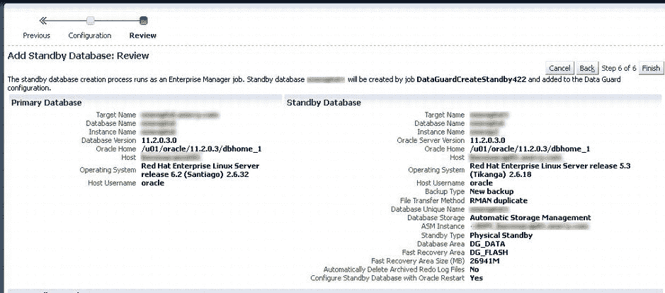

图 13-10.  添加备用数据库，复查

7.  将创建一个作业来构建备用数据库。单击作业名称以查看步骤和输出，如图 13-11 所示。

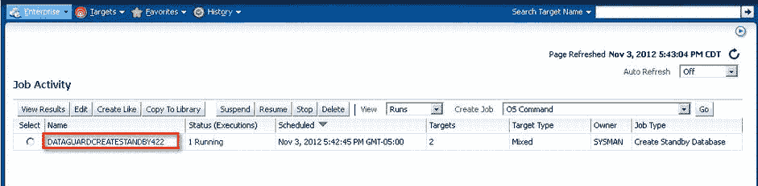

图 13-11.  Data Guard 作业创建

### 管理备用数据库

备用数据库成功创建后，您将能够通过 Enterprise Manager 控制台管理它。从存储库数据库主页中，选择 **可用性** > **Data Guard 管理**，如图 13-12 所示。

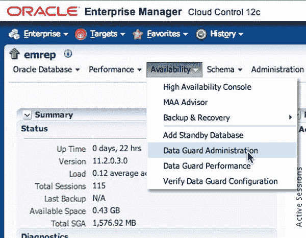

图 13-12.  Data Guard 管理选项

[⁵]: Oracle Restart 是一项功能，可在单个服务器上为 Oracle 实例、监听器和其他相关组件提供高可用性。


Data Guard 界面展示了 Data Guard 状态概览以及有关主数据库和备用数据库的配置信息，如 图 13-13 所示。

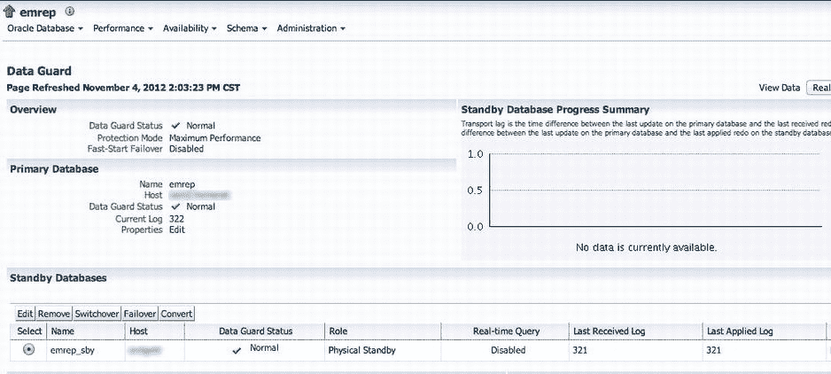

图 13-13 . Data Guard 状态

默认情况下，备用数据库是使用“最高性能”保护模式创建的。⁶ 此模式确保，如果主数据库和备用数据库之间存在网络连接问题，不会影响主数据库的性能。然而，这有可能导致数据丢失。由于我们使用的是本地 Data Guard，启用“最高可用性”保护模式可能是可行的。此模式同样不会在出现网络连接问题时影响主数据库的可用性和性能，但提供了更高级别的数据保护。将保护模式更改为“最高可用性”（参见 图 13-14）。

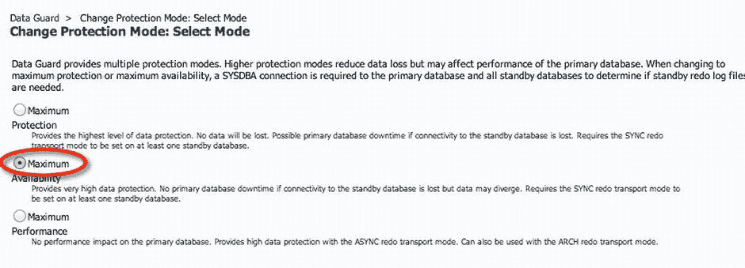

图 13-14 . 更改 Data Guard 保护模式

保护模式的更改将反映在控制台中，如 图 13-15 所见。从“最高性能”更改为“最高可用性”也会将重做传输模式从异步 (`ASYNC`) 更改为同步 (`SYNC`)。

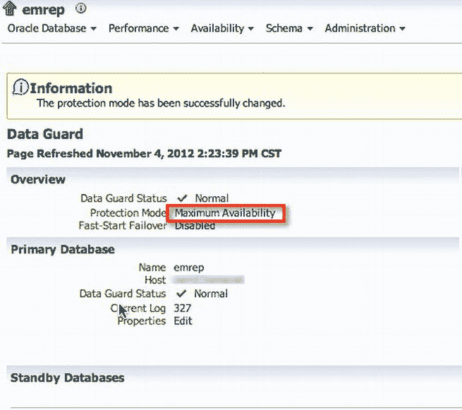

图 13-15 . Data Guard 最高可用性保护模式

此外，我们建议使用 Data Guard Broker 来管理 Data Guard 操作，例如故障切换、切换和运行状况检查。Data Guard Broker 通过 Enterprise Manager 或命令行实用程序 Data Guard Broker Line Manager (`dgmgrl`) 提供 GUI 界面，从而简化了此配置中数据库的管理。关于 Data Guard 和 Data Guard Broker 的完整讨论超出了本章的范围。有关详细信息，请参阅 *Oracle Data Guard Concepts and Administration 11g Release 2 (11.2)* 文档。为了管理 Enterprise Manager 存储库的角色更改操作，应使用后一种方法，因为 Enterprise Manager Cloud Control 12c 系统将无法用于完成这些操作。

还可以配置管理服务，以便在存储库数据库更改角色（即在切换/故障切换期间）后无需进行配置更改。使用 Oracle Database 11gR2，您可以通过 `srvctl` 命令行实用程序配置仅在数据库担任主角色时才处于活动状态的服务。以下示例说明了在 Data Guard 配置中为 OMS 配置数据库服务的步骤：

1.  在主数据库 `emrepprim` 上创建一个名为 `emrepsrvc` 的数据库服务，供 OMS 使用。

    ```
    $ srvctl add service -d emrepprim -s emrepsrvc -l PRIMARY -q FALSE -e NONE -m NONE -w 0 -z 0
    ```

2.  验证服务的配置。

    ```
    $ srvctl config service -d emreptst -s emrepsrvc
    Service name: emrepsrvc
    Service is enabled
    Cardinality: SINGLETON
    Disconnect: false
    Service role: PRIMARY
    Management policy: AUTOMATIC
    DTP transaction: false
    AQ HA notifications: false
    Failover type: NONE
    Failover method: NONE
    TAF failover retries: 0
    TAF failover delay: 0
    Connection Load Balancing Goal: LONG
    Runtime Load Balancing Goal: NONE
    TAF policy specification: NONE
    Edition:
    ```

3.  在主数据库上启动并检查服务的状态。

    ```
    $ srvctl start service -d emreptst -s emrepsrvc
    $ srvctl status service -d emreptst -s emrepsrvc
    Service emrepsrvc is running
    ```

4.  在备用数据库上创建相同的服务，供角色更改为备用时使用。

    ```
    $ srvctl add service -d emrepsby -s emrepsrvc -l PRIMARY -q FALSE -e NONE -m BASIC -w 0 -z 0
    $ srvctl config service -d emrepsby -s emrepsrvc
    Service name: emrepsrvc
    Service is enabled
    Cardinality: SINGLETON
    Disconnect: false
    Service role: PRIMARY
    Management policy: AUTOMATIC
    DTP transaction: false
    AQ HA notifications: false
    Failover type: NONE
    Failover method: BASIC
    TAF failover retries: 0
    TAF failover delay: 0
    Connection Load Balancing Goal: LONG
    Runtime Load Balancing Goal: NONE
    TAF policy specification: NONE
    Edition:
    ```

5.  重新配置 OMS 以在连接描述符中使用新服务。

    ```
    $OMS_HOME/bin/emctl config oms -store_repos_details -repos_conndesc
    '(DESCRIPTION=(FAILOVER=ON)(ADDRESS_LIST=(ADDRESS=(PROTOCOL=TCP)(HOST=oemhost1)(PORT=1521))
    (ADDRESS=(PROTOCOL=TCP)(HOST=oemhost2)(PORT=1521)))(CONNECT_DATA=(SERVICE_NAME=emrepsrvc.
    smrcy.com))(FAILOVER_MODE=(TYPE=select)(METHOD=basic)))' -repos_user sysman
    Oracle Enterprise Manager Cloud Control 12c Release 2
    Copyright (c) 1996, 2012 Oracle Corporation.  All rights reserved.
    Enter Repository User's Password :
    Successfully updated datasources and stored repository details in Credential Store.
    If there are multiple OMSs in this environment, run this store_repos_details command on
    all of them.
    And finally, restart all the OMSs using 'emctl stop oms -all' and 'emctl start oms'.
    ```

6.  停止并重新启动 OMS。
    *   a. 要停止 OMS，请使用 `emctl stop oms -all`：

        ```
        $emctl stop oms -all
        Oracle Enterprise Manager Cloud Control 12c Release 2
        Copyright (c) 1996, 2012 Oracle Corporation.  All rights reserved.
        Stopping WebTier...
        WebTier Successfully Stopped
        Stopping Oracle Management Server...
        Oracle Management Server Successfully Stopped
        AdminServer Successfully Stopped
        Oracle Management Server is Down
        ```

    *   b. 要重新启动，请使用 `emctl start oms`：

        ```
        $emctl start oms
        Oracle Enterprise Manager Cloud Control 12c Release 2
        Copyright (c) 1996, 2012 Oracle Corporation.  All rights reserved.
        Starting Oracle Management Server...
        Starting WebTier...
        WebTier Successfully Started
        Oracle Management Server Successfully Started
        Oracle Management Server is Up
        Verify that the new DG connection string is in use
        $emctl config oms -list_repos_details
        Oracle Enterprise Manager Cloud Control 12c Release 2
        Copyright (c) 1996, 2012 Oracle Corporation.  All rights reserved.
        Repository Connect Descriptor : (DESCRIPTION=(FAILOVER=ON)(ADDRESS_LIST=(ADDRESS=(PROTOCOL=TCP)(HOST=oemhost1)(PORT=1521))
        (ADDRESS=(PROTOCOL=TCP)(HOST=oemhost2)(PORT=1521)))(CONNECT_DATA=(SERVICE_NAME=emrepsrvc.
        smrcy.com))(FAILOVER_MODE=(TYPE=select)(METHOD=basic)))
        Repository User : sysman
        ```

### 第 3 级 — 使用 SLB 和 RAC Data Guard 存储库的主动/主动 OMS


# 三级高可用性配置

在上一节中，我们确定了当 `OMS` 故障转移到另一台主机时，会出现一定的停机时间。某些环境无法容忍此类停机，因此需要提高可用性级别。幸运的是，这可以通过使用多个管理服务器并结合 `RAC` 数据库作为存储库来实现。`RAC` 为数据库提供了高可用性和可扩展性。你也可以考虑采用主动/被动 `RAC One Node`⁷ 配置。此外，还使用本地物理备用数据库来保护数据库以防数据库存储故障。管理服务位于服务器负载均衡器（`SLB`）之后。`SLB` 随后将来自企业管理器控制台和管理代理的流量定向到可用的 `OMS`。每个管理服务器可以安装在与 `RAC` 节点不同的主机上（参见图 13-16）。然而，你可能需要平衡使用独立服务器的成本与此类配置所需的保护级别。管理服务器和存储库数据库应彼此靠近以减少网络延迟。这可能要求管理服务器和 `RAC` 数据库实例共存于同一服务器上。

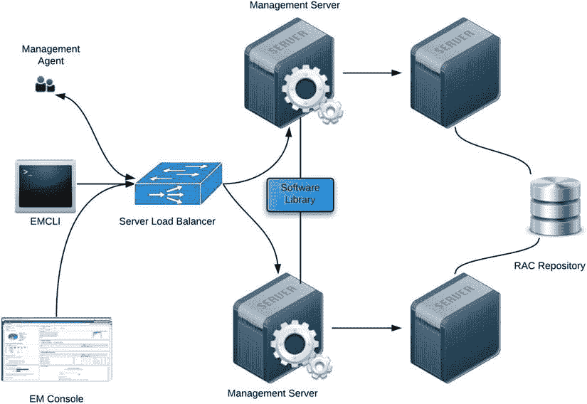

图 13-16 .  三级高可用性配置：多个 `OMS` 配置在服务器负载均衡器之后，并使用 `RAC` 数据库作为管理存储库

此级别的可用性还提供了根据业务需求进行扩展的能力。可以添加更多 `OMS` 服务器以进行横向扩展，同时可以向 `RAC` 数据库添加节点以扩展存储库。

## 配置步骤

设置三级高可用性配置所需的步骤如下：

1.  安装主 `OMS`。
2.  配置 `SLB`。
3.  添加存储库目标。
4.  配置软件库。
5.  添加第二个 `OMS`。
6.  创建备用数据库。
7.  将备用数据库转换为 `RAC`。

## 初始 OMS 状态

在首次安装第一个 `OMS` 后，代理和用户通过物理主机名连接：

```shell
$ $OMS_HOME/bin/emctl status oms -details
Oracle Enterprise Manager Cloud Control 12c Release 2  Copyright (c) 1996, 2012 Oracle Corporation.  All rights reserved.
Enter Enterprise Manager Root (SYSMAN) Password :
Console Server Host        : oem1.example.com
HTTP Console Port          : 7790
HTTPS Console Port         : 7803
HTTP Upload Port           : 4890
HTTPS Upload Port          : 4904
EM Instance Home           : /u01/app/oracle/Middleware/gc_inst/em/EMGC_OMS1
OMS Log Directory Location : /u01/app/oracle/Middleware/gc_inst/em/EMGC_OMS1/sysman/log
OMS is not configured with SLB or virtual hostname
Agent Upload is locked.
OMS Console is locked.
Active CA ID: 1
Console URL: https://oem1.example.com:443/em
Upload URL: https://oem1.example.com:4904/empbs/upload

WLS Domain Information
Domain Name      : GCDomain
Admin Server Host: oem1.example.com

Managed Server Information
Managed Server Instance Name: EMGC_OMS1
Managed Server Instance Host: oem1.example.com
WebTier is Up
Oracle Management Server is Up
```

## 服务器负载均衡器配置

当配置了服务器负载均衡器时，`SLB` 会将代理和控制台流量定向到多个管理服务。`SLB` 配置应在安装第一个 `OMS` 之后进行。

### SLB 配置要求

`SLB` 的配置可能因设备制造商而异。然而，`SLB` 有几个要求，列举如下：

*   `虚拟服务器端口`：应配置四个端口——安全上传、代理注册、安全控制台和非安全控制台。如果 `OMS` 仅配置了安全上传和代理流量，则只需要安全上传和安全控制台虚拟服务器端口。
*   `持久性`：企业管理器控制台与 `OMS` 之间的 `HTTP` 和 `HTTPS` 流量需要持久性或“粘性”，以便发送到某个 `OMS` 的请求在同一会话期间不会切换到另一个。没有持久性可能导致用户因会话被不同的管理服务处理而不得不持续登录。
*   `应用程序监控`：检查管理服务的健康状况，以便请求不会被发送到不可用或性能下降的服务。

除了这些要求，某些设备可能还需要额外的设置，例如 `F5 BIG-IP TCP 配置文件`。表 13-2 展示了一个仅使用安全上传和安全控制台端口的管理端口配置示例。

表 13-2. 管理服务端口

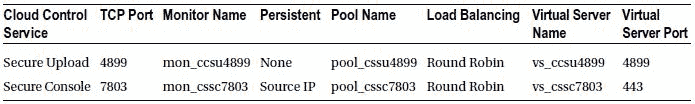

上述配置假设安全上传端口配置为端口 `4899`，安全控制台端口配置为端口 `7803`。这些端口在 `OMS` 安装过程中配置。请确认你提供了与企业管理器云控制 `12c` 安装期间使用的相同端口。虚拟主机名和 `IP` 地址也在 `DNS` 中注册，以允许客户端连接到 `SLB`。

### SLB 配置项

接下来你需要创建以下项目：

*   `池`：两台或多台 `OMS` 服务器的组，进行负载均衡，每个池运行不同的管理服务。
*   `运行状况检查器`：确定服务正在运行并可接受连接。
*   `虚拟服务器`：代表服务器池的唯一 `IP` 地址和端口。

## 使用 SLB 保护 OMS

`SLB` 配置完成后，下一步是配置 `OMS` 以使用 `SLB`。为此，你需要重新保护管理服务以重新生成证书。

```shell
emctl secure oms –sysman_pwd <sysman_password> \
       -reg_pwd <agent_reg_password> \
       -host <virtualhostname> \
       -secure_port 4899 \
       -slb_port 4899 \
       -slb_console_port 443 \
       -console \
       –lock_console
```

以下示例说明了通过使用端口 `4904` 的 `HTTPS` 上传和端口 `443` 的 `HTTPS` 控制台，利用 `SLB` 虚拟主机名保护 `OMS`。控制台也被锁定以防止非 `HTTPS` 流量访问。

```shell
$OMS_HOME/bin/emctl secure oms -sysman_pass \
-reg_pwd regpass \
-host slb.example.com \
-secure_port 4904 \
-slb_port 4904 \
-slb_console_port 443 \
-reset \
-console \
-lock_console
Oracle Enterprise Manager Cloud Control 12c Release 2
Copyright (c) 1996, 2012 Oracle Corporation.  All rights reserved.
Securing OMS... Started.
Securing OMS... Successful
Restart OMS
```

运行这些命令后，需要重启 `OMS`。

```shell
emctl stop oms –all

emctl start oms
```

## 验证配置

要验证 `OMS` 是否已成功保护，请执行以下命令：

```shell
emctl status oms –details
```

此命令的输出应表明已配置 `SLB` 或虚拟主机名，以及 `SLB` `HTTPS` 上传和 `HTTPS` 控制台的端口。


```
$ $OMS_HOME/bin/emctl status oms -details
Oracle Enterprise Manager Cloud Control 12c Release 2  Copyright (c) 1996, 2012 Oracle Corporation.  All rights reserved.
Enter Enterprise Manager Root (SYSMAN) Password :
Console Server Host        : oem1.example.com
HTTP Console Port          : 7790
HTTPS Console Port         : 7803
HTTP Upload Port           : 4890
HTTPS Upload Port          : 4904
EM Instance Home           : /u01/app/oracle/Middleware/gc_inst/em/EMGC_OMS1
OMS Log Directory Location : /u01/app/oracle/Middleware/gc_inst/em/EMGC_OMS1/sysman/log
SLB or virtual hostname: slb.example.com
HTTPS SLB Upload Port : 4904
HTTPS SLB Console Port : 443
Agent Upload is locked.
OMS Console is locked.
Active CA ID: 1
Console URL: https://slb.example.com:443/em
Upload URL: https://slb.example.com:4904/empbs/upload

WLS Domain Information
Domain Name      : GCDomain
Admin Server Host: oem1.example.com

Managed Server Information
Managed Server Instance Name: EMGC_OMS1
Managed Server Instance Host: oem1.example.com
WebTier is Up
Oracle Management Server is Up
```

用户现在可以通过虚拟主机名[`slb.example.com`](https://slb.example.com)访问服务器。端口 443 是默认的 HTTPS 端口，因此无需指定端口号。如果选择其他端口作为安全端口，则应将其作为 URL 的一部分进行指定。任何先前部署并配置为上传到 OMS 物理主机名的代理也需要重新进行安全配置。使用以下命令重新配置代理：

```
emctl secure agent –emdWalletSrcUrl https://slb.example.com:4899/em
```

保护代理后，检查状态以验证其是否正在通过 SLB 上传端口上传，检查`REPOSITORY_URL`属性。

```
$ $AGENT_HOME/core/12.1.0.2.0/bin/emctl status agent
Oracle Enterprise Manager Cloud Control 12c Release 2
Copyright (c) 1996, 2012 Oracle Corporation.  All rights reserved.

Agent Version     : 12.1.0.2.0
OMS Version       : 12.1.0.2.0
Protocol Version  : 12.1.0.1.0
Agent Home        : /u02/app/oracle/agent12c/agent_inst
Agent Binaries    : /u02/app/oracle/agent12c/core/12.1.0.2.0
Agent Process ID  : 19494
Parent Process ID : 19454
Agent URL         : https://oem1.example.com:3872/emd/main/
Repository URL    : https://slb.example.com:4904/empbs/upload
Started at        : 2012-11-03 12:44:10
Started by user   : oracle
Last Reload       : (none)
Last successful upload                       : 2012-11-03 12:47:04
Last attempted upload                        : 2012-11-03 12:47:05
Total Megabytes of XML files uploaded so far : 1.09
Number of XML files pending upload           : 44
Size of XML files pending upload(MB)         : 0.64
Available disk space on upload filesystem    : 44.63%
Collection Status                            : Collections enabled
Heartbeat Status                             : Ok
Last attempted heartbeat to OMS              : 2012-11-03 12:46:09
Last successful heartbeat to OMS             : 2012-11-03 12:46:09
Next scheduled heartbeat to OMS              : 2012-11-03 12:47:09

Agent is Running and Ready
```

同样地，如果`EMCLI`先前已配置，则也需要重新配置以使用 SLB：

```
emcli setup –url=https://slb.example.com/em –username=sysman
```

**附加 OMS 安装**

下一步是安装附加的管理服务。这可以通过使用“添加附加 OMS 部署过程”（推荐）或“静默模式”来完成。有关使用“静默模式”安装的详细信息，请参阅*《Oracle Enterprise Manager Cloud Control 高级安装和配置指南》*。

该部署过程简化了部署附加管理服务器以满足高可用性要求的过程。它通过向导驱动的界面收集输入，自动化准备和安装附加管理服务所需的步骤。它将根据收集的输入克隆现有的中间件主页，包括 OMS 配置。任何附加服务器也应满足安装 OMS 的相同要求。有关附加管理服务的先决条件，请参阅*《Oracle Enterprise Manager Cloud Control 基本安装指南 12c Release 2》*的第 8 章。

`注意` 任何打算用作 OMS 的新服务器都应已部署代理。部署过程不会将代理克隆到目标。

请按照以下步骤安装附加 OMS：

1.  从 Enterprise Manager 控制台，选择 Enterprise  Provisioning and Patching  Procedure Library，如图 13-17 所示。

    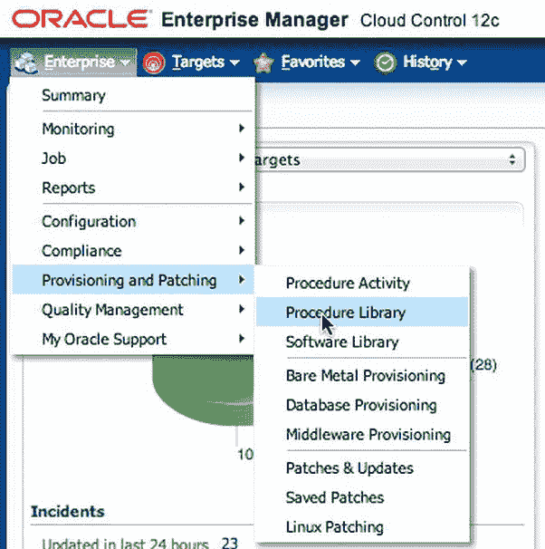
    图 13-17 . 访问过程库

2.  选择“Add Management Service”单选按钮，然后单击`Launch`（参见图 13-18）。如果该过程在列表中不可见，可以通过单击按过程名称对列进行排序。

    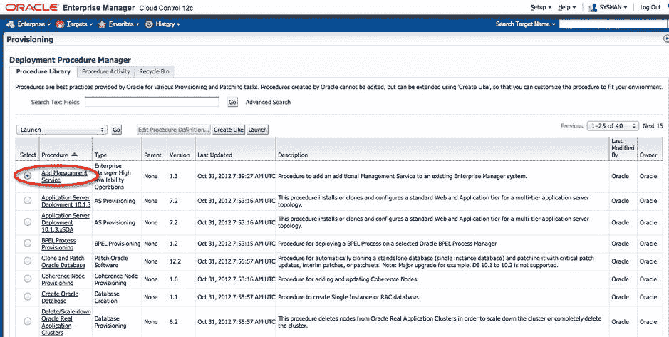
    图 13-18 . 添加管理服务部署过程

3.  下一个屏幕，如图 13-19 所示，列出了在继续过程之前应满足的先决条件。选择与已满足的先决条件关联的所有复选框。如果有任何不满足，应先解决它们，然后再继续处理器。完成后单击`Next`。

    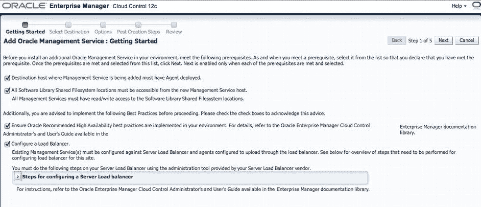
    图 13-19 . 添加 Oracle 管理服务先决条件检查

4.  在“选择目标”屏幕上，选择一个将用作附加 OMS 的受管主机，如图 13-20 所示。中间件主页的路径将与第一个 OMS 上的路径相同。输入实例基本位置的路径或接受默认值。选择或输入在源和目标上拥有软件的用户的凭据（例如，`oracle`）。

    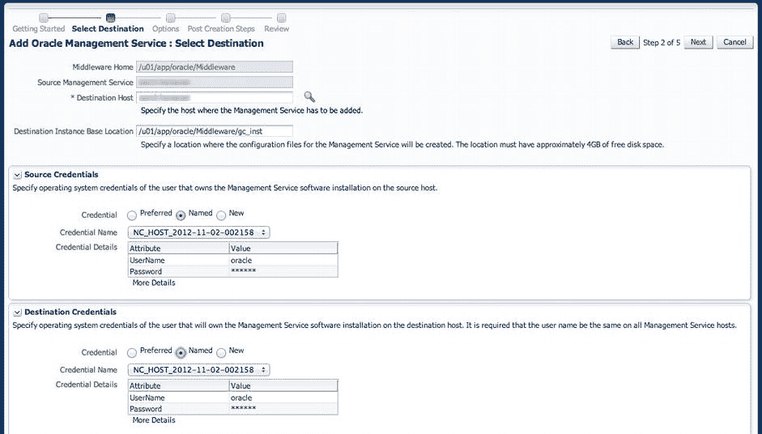
    图 13-20 . 添加 OMS，选择目标

5.  接下来，您将选择如何将克隆的主目录从源 OMS 主机传输到目标主机，并选择暂存位置（参见图 13-21）。暂存位置应至少有 4GB 的可用空间。如果选择了共享文件系统（如 NFS），则不需要暂存位置。对于 FTP 和 HTTP(S)选项，操作系统临时位置（Unix 或 Linux 中的`/tmp`或 Windows 中的`C:\Temp`）还需要有 8GB 的可用空间。有关指定临时位置的详细信息，请参阅*《Oracle Enterprise Manager Cloud Control 基本安装指南 12c Release 2》*的第 9 章。此外，您需要提供目标管理服务要使用的端口。它们将默认为源管理服务的端口。如果可能，我们建议在所有管理服务上保持端口相同。

    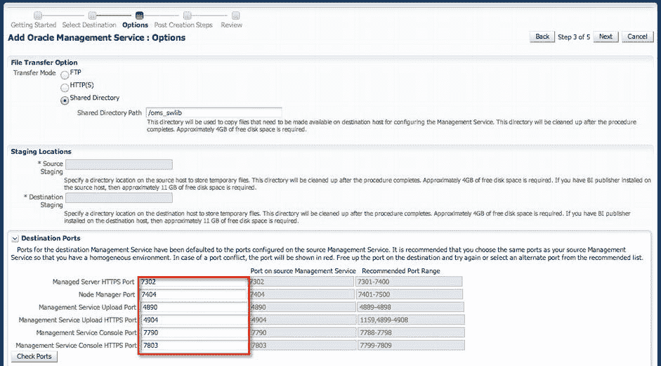
    图 13-21 . 添加 OMS，选项


6.  如 图 13-22 所示的“创建后步骤”屏幕，列出了在尚未完成的情况下，设置 `SLB` 以包含新 `OMS` 主机的要求。还必须执行 `root.sh` 脚本。你还可以选择提供一个电子邮件地址来接收安装后步骤的通知。

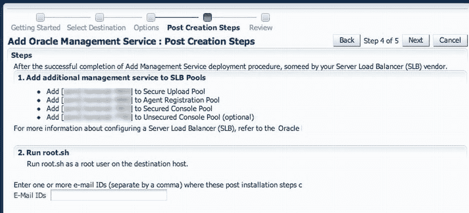

图 13-22 . 添加 OMS，创建后步骤

7.  接下来会显示一个摘要屏幕，你可以在其中查看输入的信息（参见 图 13-23）。点击 `Finish` 以创建部署过程作业。根据你的硬件资源情况，运行此作业可能需要很长时间。你可以查看部署过程中每个步骤的进度，如 图 13-24 所示。

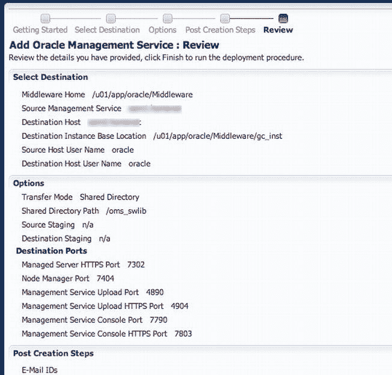

图 13-23 . 添加 OMS，复查

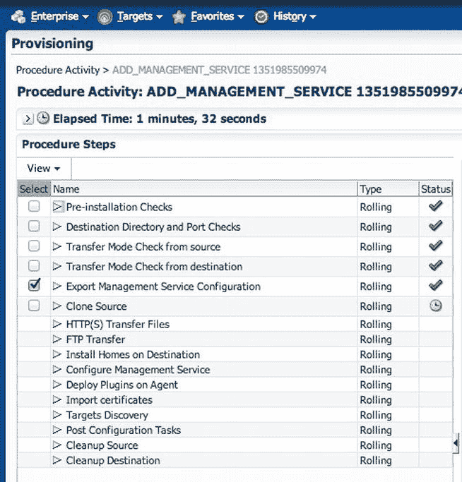

图 13-24 . 过程活动

如果任何步骤失败，你应该检查并执行必要的纠正措施，然后才能恢复或重试。如果你提供了用于接收安装后步骤通知的电子邮件地址，你将会收到配置 `SLB` 以使用新添加的 `OMS` 并执行 `root.sh` 脚本的步骤。

以下新目标会在 `Enterprise Manager` 控制台中自动被发现：
- `Oracle WebLogic Server`
- `Oracle Web Tier`
- `Application deployments`
- `Oracle Management Service`
- `Oracle Management Agent`
- `Enterprise Manager Cloud Control` 主机

主机上任何其他现有目标应通过 `Add Manual Target` 或 `Auto Discovery Results` 进行提升。

配置完额外的管理服务后，高可用性配置的下一步是使用 `Data Guard` 为存储库创建一个本地物理备用数据库。`Oracle` `MAA` 架构推荐使用 `RAC` 物理备用数据库，但也可以使用单实例备用数据库。备用数据库可以防止存储、介质损坏或任何导致主数据库丢失的事件。

可以通过使用本章第 2 级高可用性部分中描述的相同步骤来添加备用数据库。使用 `Enterprise Manager Cloud Control` 无法创建 `RAC` 备用数据库。但是，使用部署过程可以将单实例备用数据库转换为 `RAC` 备用数据库。

### 第 4 级—带备用站点的 MAA

前面描述的高可用性级别将针对计划外和计划停机提供保护。使用带有多个 `Oracle Management Services` 的 `SLB` 可以在单个 `OMS` 变得不可用时提供服务。使用 `Real Application Clusters` 结合本地 `Data Guard` 可为存储库提供最高级别的可用性，即使主机不可用也不会停机。如果执行了故障切换或切换操作，只会发生最短的停机时间。但是，如果主站点发生完全站点故障，整个 `Enterprise Manager Cloud Control` 环境将变得不可用，可能导致依赖于该基础设施的其他应用程序服务中断。

### 先决条件

在单独的站点配置备用 `Enterprise Manager Cloud Control` 系统可提供高可用性并防范站点故障。此配置包括位于 `SLB` 后面的多个主动/主动 `OMS` 服务器，以及位于主站点和另一个异地位置的 `RAC` 主数据库和 `Data Guard` 中的备用数据库。备用管理服务的先决条件如下：
- 按照前面所述，使用 `MAA` 配置来配置主站点。
- 使用类似的硬件和资源配置备用站点，以确保切换到备用站点后不会发生性能损失。
- 用于 `Software Library` 的共享存储应复制到备用站点。`Software Library` 的路径在两个位置也应相同。考虑使用基于磁盘的复制或基于软件的复制，例如 `rsync`⁸ 或类似工具。
- 还应在备用站点部署第二个 `SLB`，以确保在灾难恢复环境中的完全冗余。使用提供从主站点到备用站点的 `VIP` 故障转移的供应商解决方案。

满足这些先决条件后，按照 *`Oracle Enterprise Manager Cloud Control 12c Administrator’s Guide`* 中的说明安装和配置备用管理服务。

### 备用管理服务器安装

要安装备用管理服务器，你需要执行仅软件安装，可以使用来自 `Procedure Library` 的修改版 `Add Management Service` 部署过程，也可以使用 `Oracle Universal Installer`。下一个示例将引导你完成使用前一种方法的步骤。

如果主站点和备用站点之间存在防火墙，应将其配置为允许 `HTTP Console`、`HTTPS Console`、`HTTP Agent Upload` 和 `HTTPS Agent Upload` 端口以及 `Admin Server` 和 `Node Manager` 端口的通信。

以下部署过程提供了将主 `Enterprise Manager` 软件（包括插件和补丁）克隆到另一台服务器的逐步工作流：
1.  在第一台管理服务（`Admin Server` 正在运行）上运行以下命令，将 `emkey` 复制到管理存储库：

    ```
    $ $OMS_HOME/bin/emctl config emkey -copy_to_repos
    Oracle Enterprise Manager Cloud Control 12c Release 2
    Copyright (c) 1996, 2012 Oracle Corporation.  All rights reserved.
    Enter Enterprise Manager Root (SYSMAN) Password :
    The EMKey has been copied to the Management Repository. This operation will cause the EMKey
    to become unsecure.
    After the required operation has been completed, secure the EMKey by running "emctl config
    emkey -remove_from_repos".
    ```

2.  从主站点的第一台管理服务导出配置。如果可能，使用共享文件系统以避免远程传输文件。

    ```
    $ $OMS_HOME/bin/emctl exportconfig oms -sysman_pwd oracle12c -dir /u02/backup
    Oracle Enterprise Manager Cloud Control 12c Release 2
    Copyright (c) 1996, 2012 Oracle Corporation.  All rights reserved.
    ExportConfig started...
    Machine is Admin Server host. Performing Admin Server backup...
    Exporting emoms properties...
    Exporting secure properties...
    Exporting configuration for pluggable modules...
    Preparing archive file...
    Backup has been written to file: /u02/backup/opf_ADMIN_20121227_131133.bka

    The export file contains sensitive data.
    Please ensure that it is kept secure.

    ExportConfig completed successfully!
    ```

3.  如果目标备用主机上尚未存在管理代理，则安装一个管理代理。
4.  使用修改后的 `Add Standby Management Service` 部署过程执行 `Enterprise Manager` 软件的仅软件安装。
    a. 从菜单中选择 `Enterprise` -> `Provisioning and Patching`。
    b. 选择 `Add Management Service` 过程，然后点击 `Create Like`，如 图 13-25 所示。

    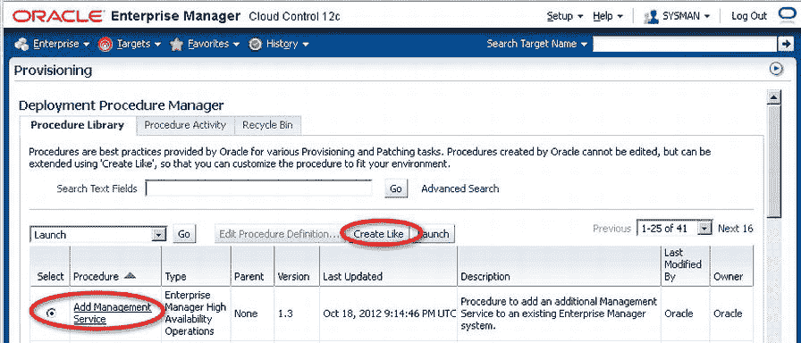
    图 13-25 . 为备用管理服务创建部署过程

    c. 输入该过程的新名称，例如 `Add Standby Management Service`。参见 图 13-26。


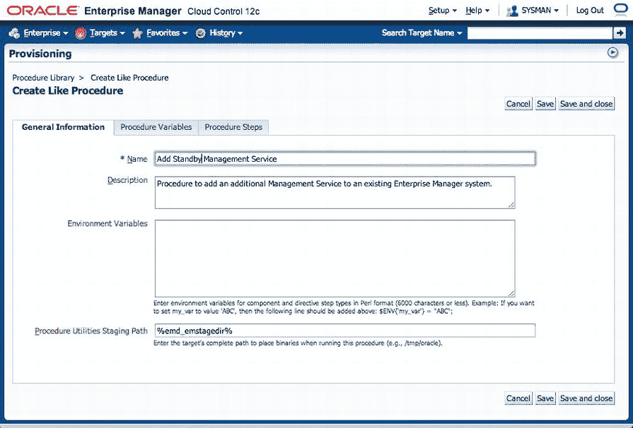

图 13-26 .  为部署过程提供一个新名称

*   d.   导航到 **Procedure Step** 选项卡并禁用步骤（参见 图 13-27）：
        *   Configure Management Service
        *   Targets Discovery
        *   Post Configuration Tasks

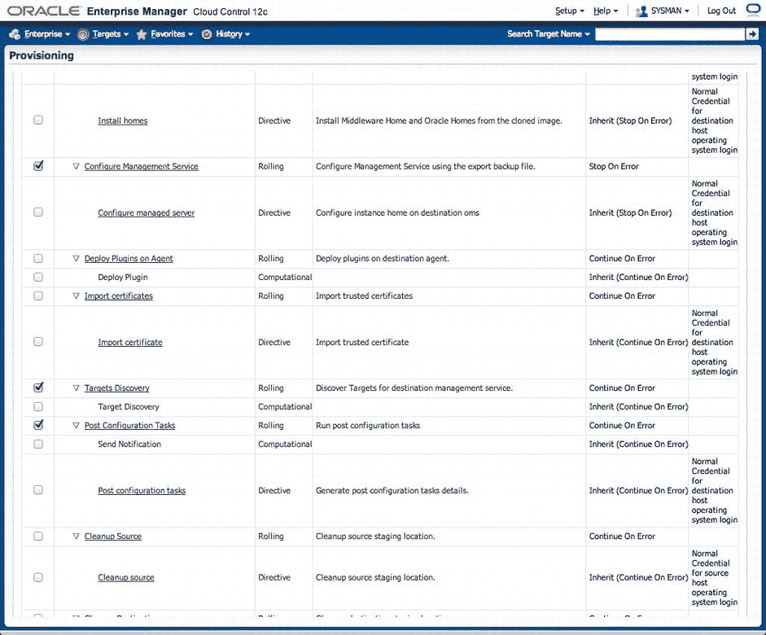

图 13-27 .  禁用备用管理服务不需要的步骤

*   e.   保存部署过程。新过程应类似于 图 13-28。

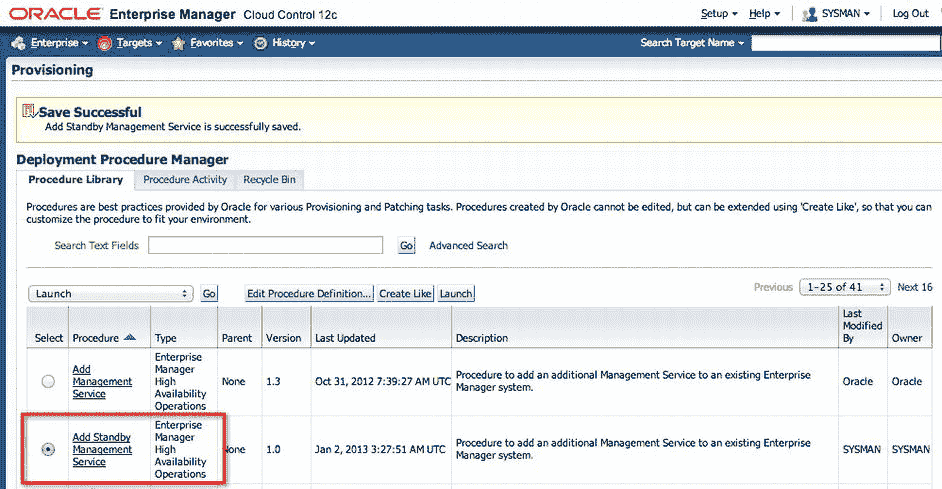

图 13-28 .  成功创建“Add Standby Management Service”部署过程

*   f.   启动该过程并按照步骤操作，这些步骤将与添加 OMS 时执行的步骤相同。
    *   g.   部署完成后，从备用主机上删除以下文件：

```
    <OMS_HOME>/sysman/config/emInstanceMapping.properties
    ```

 **Note**  确保主备用主机和目标备用主机上的 `/tmp` 文件系统至少有 4GB 可用空间。否则，OMS 安装将失败。

5.  通过在备用主机上以备用模式运行 `omsca` 来配置备用管理服务。

```
    $ $OMS_HOME/bin/omsca standby -EM_DOMAIN_NAME GCDomainStby -NM_USER \
    nodemanager -AS_USERNAME weblogic -nostart
    Oracle Enterprise Manager Cloud Control 12c Release 12.1.0.2.0
    Copyright (c) 1996, 2012, Oracle. All rights reserved.

Enter Admin Server Host Name[oem3.example.com]:
    Enter Admin Server HTTPS Port[7101]:
    Enter Admin Server user password:
    Confirm Password:
    Enter EM instance host [oem3.example.com]:
    Enter Upload HTTP PORT[4889]:
    Enter Upload HTTPS PORT[4899]:
    Enter location for OMS config files[/u01/oracle/gc_inst]:/u01/oracle/Middleware/gc_inst
    Enter Node Manager Password:
    Confirm Password:
    Enter Repository database host name:oem.example.com
    Enter Repository database listener port:1521
    Enter Repository database SID:oemprd1
    Enter Repository database user password:
    Enter Agent Registration password:
    Confirm Password:
    Doing pre requisite checks ......
    Pre requisite checks completed successfully

Doing infrastructure setup ......
    Infrastructure setup of EM completed successfully.

Doing pre deployment operations ......
    Pre deployment of EM completed successfully.

Deploying EM ......
    Deployment of EM completed successfully.

Configuring webtier ......
    Configuring webTier completed successfully.

Securing OMS ......
    EM Key is secured and is backed up at /u01/oracle/Middleware/oms/sysman/config/emkey.ora
    Adapter created successfully: emgc_USER
    Adapter created successfully: emgc_GROUP
    Post "Deploy and Repos Setup" operations completed successfully.

Performing Post deploy operations ....
    Total 0 errors, 0 warnings. 0 entities imported.
    pluginID:oracle.sysman.core
    Done with csg import
    pluginID:oracle.sysman.core
    Done with csg import
    Post deploy operations completed successfully.

EM configuration completed successfully.
    EM URL is: https://oem.example.com:7799/em
    ```

6.  通过运行此命令配置插件：

```
    pluginca -action deploy -isFirstOMS true -plugins <plugin-list> -oracleHome
    <oms oracle home> -middlewareHome <wls middleware home>
    ```

*   应使用以下查询获取插件列表：

```sql
        SELECT epv.plugin_id, epv.version FROM em_plugin_version epv,
                em_current_deployed_plugin ecp
        WHERE epv.plugin_type NOT IN ( 'BUILT_IN_TARGET_TYPE' , 'INSTALL_HOME')
                AND ecp.dest_type='2'
                AND epv.plugin_version_id = ecp.plugin_version_id;
        ```


*   插件应使用此格式的逗号分隔列表：

```
<plugin-id>=<plugin-version>,<plugin-id>=<plugin-version>,...
```

*   可以使用如下查询来提取所需格式的插件：

```
SELECT listagg(epv.plugin_id||'='||epv.version,',')
        within group (order by epv.plugin_id)
FROM em_plugin_version epv, em_current_deployed_plugin ecp
WHERE epv.plugin_type NOT IN ( 'BUILT_IN_TARGET_TYPE' , 'INSTALL_HOME')
        AND ecp.dest_type='2'
        AND epv.plugin_version_id = ecp.plugin_version_id;
```

*   查询结果随后可用作 `pluginca` 中的 `plugins` 参数：

```
$ $OMS_HOME/bin/pluginca -action deploy -isFirstOMS true -plugins "oracle.sysman.db=12.1.0.2.0,oracle.sysman.emas=12.1.0.3.0,oracle.sysman.mos=12.1.0.2.0,
oracle.sysman.xa=12.1.0.3.0" -oracleHome $OMS_HOME -middlewareHome $MW_HOME
pluginca - Plugin Configuration Tool
Oracle Enterprise Manager 12c Release 2 Grid Control
Copyright (c) 1996, 2012 Oracle Corporation. All rights reserved.
Log file: /u01/oracle/Middleware/oms/cfgtoollogs/pluginca/gcinstall/configplugin_deploy_
2013-01-02_14-42-39.log
Trace file: /u01/oracle/Middleware/oms/cfgtoollogs/pluginca/gcinstall/configplugin_deploy_
2013-01-02_14-42-39.trc
Initializing PluginCA.
Options passed: -loglevel debug -action deploy -isfirstoms true -plugins oracle.sysman.db=12.1.0.2.0,oracle.sysman.emas=12.1.0.3.0,oracle.sysman.mos=12.1.0.2.0,
oracle.sysman.xa=12.1.0.3.0 -oraclehome /u01/oracle/Middleware/oms –middlewarehome
/u01/oracle/Middleware
Starting Deployment
Invoking pre deploy callbacks.
OMS state could be found. It is down
Performing Midtier deconfig
Performing Midtier config
Performing Opss deconfig
Performing Opss config
Performing Post metadata registration
Performing Midtier update oh prop
Performing Post config module
Invoking post deploy callbacks.
Completed Deployment
```

7.  导入在步骤 2 中从主管理服务导出的配置。如果配置已导出到本地文件系统，请先将其复制到备用主机。

```
$OMS_HOME/bin/emctl importconfig oms -file /u02/backup/opf_ADMIN_20121227_131133.bka
Oracle Enterprise Manager Cloud Control 12c Release 2
Copyright (c) 1996, 2012 Oracle Corporation.  All rights reserved.
ImportConfig started...
Enter Enterprise Manager Root (SYSMAN) Password :
Enter Agent Registration Password:
Processing export file...
Checking OS and OMS Versions...
OS check passed.
OMS version check passed.
Proceed with oms import...
Backing up the OMS before import...
Pre-import backup of OMS failed...
Error: null

Do you wish to continue with import? (y/n)
y
Continuing with Importconfig...
Updating OMS properties...
Configuring emoms.properties...
Processing zipped files...

If you have software library configured
please make sure it is functional and accessible
from this OMS by visiting:
 Setup->Change Management->Software Library

Resecure the OMS...
OMS secured!
ImportConfig completed successfully!
```

8.  停止备用 OMS。

```
emctl stop oms
```

9.  在主 Enterprise Manager 控制台中，使用“添加手动目标引导发现”来添加 WebLogic 域及相关目标，以发现备用主机上的 Fusion Middleware 目标。
10. 如果在主服务器上先前配置过单点登录，则在备用服务器上配置单点登录。这包括为 Enterprise Manager Cloud Control 管理员配置 Active Directory 身份验证。
11. 如果在主服务器上配置过，则执行任何其他组件的配置，例如 BI Publisher 或 Real User Experience Insight。


# 备用管理服务器安装后注意事项

拥有备用站点的一个需要注意的点是，它需要额外的管理工作量。初始配置后，必须使备用站点与主站点保持同步。对于仓库数据库，`Data Guard` 会自动处理同步。应用于主站点软件主目录的补丁也需要在备用站点应用。作为补丁过程一部分在主站点执行的任何数据库脚本都由 `Data Guard` 处理，不应在备用站点再次执行。在主站点部署或更新的插件也要求在备用站点进行部署和更新。如果未能这样做，在尝试切换时将导致 `OMS` 无法启动。有关在备用站点部署和升级插件的详细信息，请参阅 `Oracle Enterprise Manager Cloud Control Administrator’s Guide 13c Release 2`。

除了上述更改外，`SYSMAN` 凭据也应在主站点和备用站点保持同步。如果不这样做，角色转换将在备用 `OMS` 上失败。要更改主备用 `OMS` 上的 `SYSMAN` 凭据，请遵循以下步骤：

1.  在主 `OMS` 上更改 `SYSMAN` 密码。

    ```
    $ emctl config oms -change_repos_pwd
    Oracle Enterprise Manager Cloud Control 13c Release 2
    Copyright (c) 1996, 2013 Oracle Corporation.  All rights reserved.
    Enter Repository User's Current Password :
    Enter Repository User's New Password :

    Changing passwords in backend ...
    Passwords changed in backend successfully.
    Updating repository password in Credential Store...
    Successfully updated Repository password in Credential Store.
    Restart all the OMSs using 'emctl stop oms -all' and 'emctl start oms'.
    Successfully changed repository password.
    ```

2.  停止 `OMS`，包括 `Admin Server`。

    ```
    $ emctl stop oms -all
    Oracle Enterprise Manager Cloud Control 13c Release 2
    Copyright (c) 1996, 2013 Oracle Corporation.  All rights reserved.
    Stopping WebTier...
    WebTier Successfully Stopped
    Stopping Oracle Management Server...
    Oracle Management Server Already Stopped
    AdminServer Successfully Stopped
    Oracle Management Server is Down
    ```

3.  启动 `OMS`。

    ```
    $ emctl start oms
    Oracle Enterprise Manager Cloud Control 13c Release 2
    Copyright (c) 1996, 2013 Oracle Corporation.  All rights reserved.
    Starting Oracle Management Server...
    Starting WebTier...
    WebTier Successfully Started
    Oracle Management Server Successfully Started
    Oracle Management Server is Up
    ```

4.  在备用 `OMS` 上更改 `SYSMAN` 密码。

    ```
    $ emctl config oms -change_repos_pwd -use_sys_pwd -sys_pwd <sys_password>
    Oracle Enterprise Manager Cloud Control 13c Release 2
    Copyright (c) 1996, 2013 Oracle Corporation.  All rights reserved.
    Enter Repository User's New Password :

    Changing passwords in backend ...
    Passwords changed in backend successfully.
    Updating repository password in Credential Store...
    Successfully updated Repository password in Credential Store.
    Restart all the OMSs using 'emctl stop oms -all' and 'emctl start oms'.
    Successfully changed repository password.
    ```

5.  停止 `OMS`，包括 `Admin Server`。

    ```
    $ emctl stop oms -all
    Oracle Enterprise Manager Cloud Control 13c Release 2
    Copyright (c) 1996, 2013 Oracle Corporation.  All rights reserved.
    Stopping WebTier...
    WebTier Successfully Stopped
    Stopping Oracle Management Server...
    Error occurred while trying to stop Oracle Management Server
    AdminServer Successfully Stopped
    Oracle Management Server is Down
    ```

6.  启动 `Admin Server`。

    ```
    $ emctl start oms -admin_only
    Oracle Enterprise Manager Cloud Control 13c Release 2
    Copyright (c) 1996, 2013 Oracle Corporation.  All rights reserved.
    Starting Admin Server only...
    Admin Server Successfully Started
    ```

### 软件库

软件库用于打补丁、代理部署、资源调配和自更新。应将其安装在共享存储上，以便多个管理服务器可以访问。以下任何选项都可用于共享存储：

*   `NFS`
*   `OCFS2`
*   `DBFS`
*   `ACFS`

由于软件库至关重要，因此应位于高可用性文件系统上。这意味着使用 `RAID`（镜像和条带化）后端存储系统。

可以通过登录 Enterprise Manager 控制台并选择 `Setup` -> `Provisioning and Patching` -> `Software Library` 来配置软件库。为软件库选择一个已挂载到 `OMS` 上的共享文件系统位置（参见 图 13-29）。也可以添加多个位置。

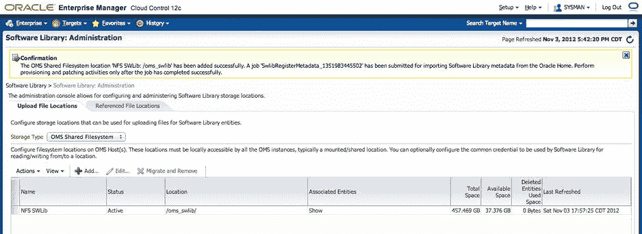

图 13-29 . 软件库设置

## 备份

在高可用性 Enterprise Manager Cloud Control 配置中，`OMS`、仓库和代理这三个组件都单独配置以减少停机时间。尽管我们建议实施最高级别的可用性，但相关的成本和所需资源可能令人望而却步。此外，在任何 IT 框架中，随着时间的推移，组件故障很可能会发生。因此，任何高可用性架构如果不讨论备份和恢复策略都是不完整的。

备份 Enterprise Manager 生态系统需要一个涵盖仓库、`OMS` 和代理的解决方案。每个组件都根据其可用方法单独备份。管理仓库数据库存储由代理提供的指标和数据。应使用 `RMAN` 按照 Oracle 数据库的推荐备份策略进行备份。

## 仓库备份

为仓库数据库配置备份策略的第一步是确保其处于 `ARCHIVELOG` 模式。这将允许进行一致的联机备份，并便于数据库的及时点恢复。应使用推荐的备份策略定期进行热备份。还应启用数据库高可用性功能，如 `快速恢复区` 和 `闪回数据库`，以便在发生故障时能够更快地恢复数据库。可以通过使用 Enterprise Manager Cloud Control 控制台来配置备份。考虑使用 Enterprise Manager 的 `推荐备份策略` 选项来备份仓库数据库。

要使用 Enterprise Manager 计划数据库备份，请遵循以下步骤：

1.  转到仓库数据库主页并选择 `Availability` -> `Backup & Recovery` -> `Schedule Backup`。
2.  以具有 `SYSDBA` 凭据的用户身份登录。
3.  单击 `Schedule Oracle-Suggested Backup` 按钮，根据备份的目标位置（`磁盘`、`磁带` 等）创建完全自动化的备份策略，如 图 13-30 所示。Oracle 建议的备份基于增量更新备份策略。它将首先安排完整备份，之后将安排增量备份。基于此备份，可以恢复到一天中的任何时间点。

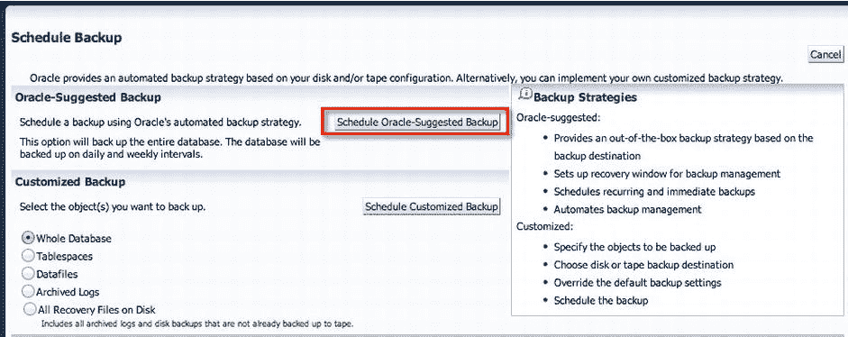

图 13-30 . 计划 Oracle 建议的备份

**注意** 如果使用基于磁盘的备份策略，Oracle 建议使用 `快速恢复区` 以实现更快的恢复。

4.  选择备份的目标介质，如 图 13-31 所示。

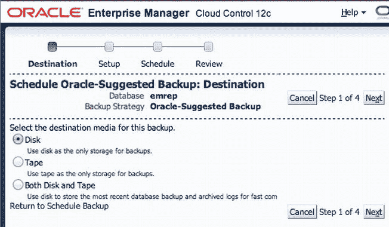

图 13-31 . 计划备份目标类型


## 调度备份

1.  输入备份的位置，如 图 13-32 所示。在基于磁盘的备份策略中，默认使用已配置的快速恢复区域。

    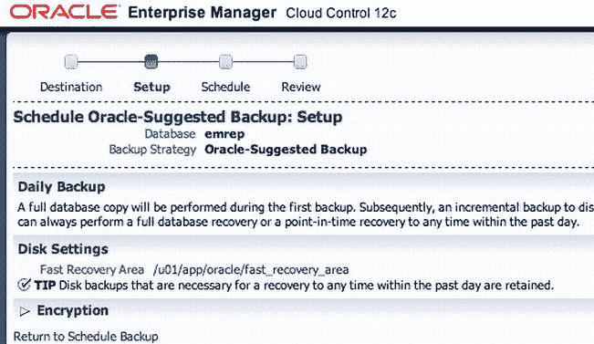
    图 13-32 . 选择快速恢复区域作为基于磁盘的备份位置

2.  输入循环备份的时间表，如 图 13-33 所示。

    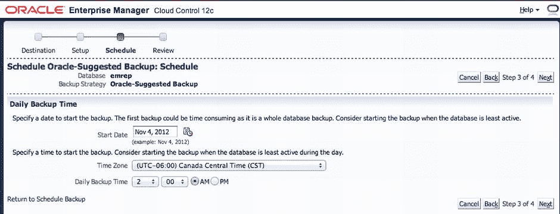
    图 13-33 . Oracle 建议的备份时间表

3.  检查备份设置和生成的 `RMAN` 脚本（参见 图 13-34）。单击“提交作业”以计划备份。

    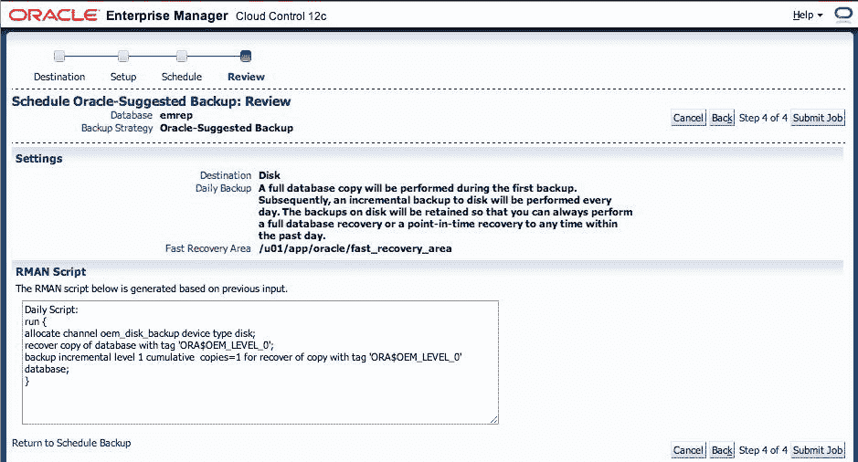
    图 13-34 . Oracle 建议的备份设置

使用 Oracle Enterprise Manager Cloud Control 计划备份作业还可以让你接收有关作业状态的通知，并查看包括运行时间和上次备份时间在内的备份信息。

### Oracle 管理服务备份

Oracle 管理服务负责与管理代理通信并将数据上传到管理存储库。它包括 Oracle Fusion Middleware 主目录、OMS 主目录以及插件主目录之外的 Web 层（OHS）Oracle 主目录。应定期备份 OMS 文件系统以保存任何更改，例如补丁、更新或配置更改。使用 `exportconfig` 命令备份 OMS 实例主目录（`MW_HOME/gc_inst`），包括 WebLogic Server、Web 层和管理服务器。要创建实例和所有子组件的备份，请使用以下语法：

```
emctl exportconfig oms [-sysman_pwd <sysman password>]
     [-dir <backup dir>]     指定存储备份文件的目录
     [-oms_only]             指定在管理服务器主机上进行仅 OMS 的备份
     [-keep_host]            指定如果未定义 slb 则备份主机名
                            （仅当将在响应此主机名的机器上执行恢复时才使用此选项）
```

以下示例将 OMS 配置备份到共享目录。将创建一个扩展名为 `.bka` 的归档文件。

```
$ $OMS_HOME/bin/emctl exportconfig oms -sysman_pwd oracle12c -dir /mnt/backup
Oracle Enterprise Manager Cloud Control 12c Release 2
Copyright (c) 1996, 2012 Oracle Corporation.  All rights reserved.
ExportConfig started...
Machine is Admin Server host. Performing Admin Server backup...
Exporting emoms properties...
Exporting secure properties...
Exporting configuration for pluggable modules...
Preparing archive file...
Backup has been written to file: /mnt/backup/opf_ADMIN_20121104_224806.bka

The export file contains sensitive data.
Please ensure that it is kept secure.

ExportConfig completed successfully!
```

除了备份 OMS 配置外，还应执行 Oracle 清单和 `opatch lsinventory –detail` 命令输出的备份。

以下示例生成 `opatch` 清单输出并将其写入共享文件系统。

```
$OMS_HOME/OPatch/opatch lsinventory –detail > /mnt/backups/opatch_bkup.log
```

OMS 的备份可以手动完成，也可以通过 Enterprise Manager Cloud Control 作业系统计划完成。

### 管理代理备份

管理代理是无状态的，因此不需要备份。相反，应为所有受监控的平台创建代理的参考金镜像。任何补丁和自定义设置都应包含在金配置中。如果管理代理丢失，应从参考金镜像安装。

## 恢复

执行每个 Enterprise Manager Cloud Control 组件的定期备份很重要。然而，更重要的是在需要时能够成功恢复这些组件。Enterprise Manager 的恢复可能需要恢复多个组件，包括存储库、管理服务和代理，具体取决于问题的性质。例如，在主机丢失的情况下恢复管理服务可能需要比将管理服务恢复到原始主机更多的步骤。你将在以下部分中研究这些场景。

## 存储库恢复

如果 `OMS` 关闭，Cloud Control 控制台将不可用。要恢复存储库数据库，应使用 `RMAN` 命令行实用程序。使用 `RMAN`，你可以通过完全恢复或时间点恢复来恢复数据库（请参阅 `Oracle Database Backup and Recovery Guide`）。对于后者，你可能需要重新同步与存储库不同步的代理。要使用 `EMCTL` 重新同步代理，请使用以下语法：

```
emctl resync repos (-full|-agentlist "agent names")
[-name "resync name"]
[-sysman_pwd "sysman password"]
```

此命令应在管理存储库恢复之后且在启动 `OMS` 之前执行。

在恢复存储库数据库后，使 Enterprise Manager Cloud Control 运行所需的步骤将根据执行的是完全恢复还是不完全恢复，以及是在同一主机还是不同主机上执行恢复而有所不同。表 13-3 总结了不同恢复场景所需的步骤。在每种情况下，都应在停止 `OMS` 后恢复存储库数据库。

表 13-3. OMS、存储库和代理的恢复场景

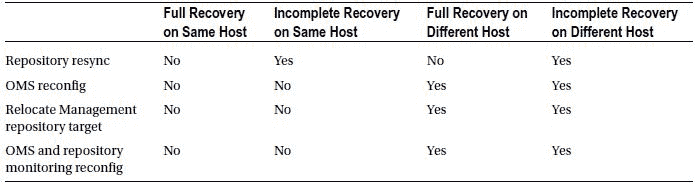

每当在不同的主机上恢复存储库数据库时，都需要重新配置 `OMS`。这将新的数据库连接描述存储在 `OMS` 中。我们使用以下命令在 `OMS` 中重新配置存储库数据库：

```
emctl config oms -store_repos_details (-repos_host <host> -repos_port <port> -repos_sid
<sid> | -repos_conndesc <connect descriptor>) -repos_user <username> [-repos_pwd <pwd>]
```

按照以下步骤重新配置 `OMS`：

1.  停止所有 `OMS`。

    ```
    emctl stop oms
    ```

2.  在每个 `OMS` 上重新配置存储库连接字符串。

    ```
    emctl config oms -store_repos_details
    ```

    使用以下命令重新启动管理服务器和所有 `OMS`：

    ```
    emctl stop oms -all
    emctl start oms
    ```

在不同的主机上恢复存储库还需要将管理存储库数据库目标重新定位到运行在新主机上的不同代理。这仅在主机上已存在代理且未由其发现任何其他数据库的情况下才可完成。使用以下语法将目标重新定位到新主机：

```
emctl config repos [-sysman_pwd <sysman password>]
      [-agent <new agent>]    指定存储库目标的新目标代理
      [-host <new host>]      指定存储库目标的新主机名
      [-oh <new oracle home>] 指定存储库目标的新 OracleHome
      [-conn_desc [<jdbc connect descriptor>]]
                              如果指定了值，则使用该值更新连接描述符，
                              否则使用存储在 emoms.properties 中的值
      [-ignore_timeskew]      忽略代理上的时间偏差
```

还应使用此命令更新 `OMS` 和存储库目标的监控配置：


```
emctl config emrep [-sysman_pwd <sysman 密码>]
      [-agent <新代理>]    指定 emrep 目标的新目标代理
      [-conn_desc [<JDBC 连接描述符>]]
                              如果指定则使用该值更新连接描述符，
                              否则使用 emoms.properties 中存储的值
      [-ignore_timeskew]      忽略代理上的时间偏移
```

在数据库恢复并重新配置后，下一步是登录到 Enterprise Manager Cloud Control 控制台，验证所有操作是否已恢复。

### Oracle 管理服务恢复

恢复 OMS 需要恢复软件主目录（Fusion Middleware）和实例主目录（gc_inst）。软件主目录可以从文件系统备份恢复，或使用 Enterprise Manager Cloud Control 12c 安装程序在相同或不同主机上使用“仅安装软件”选项重新安装。OMS 主目录必须与正在恢复的 OMS 主目录位置相同。

OMS 中存在的所有插件都必须安装才能成功恢复。应以 SYSMAN 用户身份运行以下 SQL 查询：

```
SELECT epv.display_name, epv.plugin_id, epv.version, epv.rev_version,decode(su.aru_file,
null, 'Media/External', 'https://updates.oracle.com/Orion/Services/download/ '
||aru_file||'?aru='||aru_id||chr(38)||'patch_file='||aru_file) URL
FROM em_plugin_version epv, em_current_deployed_plugin ecp, em_su_entities su
WHERE epv.plugin_type NOT IN ('BUILT_IN_TARGET_TYPE', 'INSTALL_HOME')
AND ecp.dest_type='2'
AND epv.plugin_version_id = ecp.plugin_version_id
AND su.entity_id = epv.su_entity_id;
```

以下示例输出显示了插件、版本、修订版和 URL。如果通过 Self Update 下载，URL 将显示。否则，状态将显示为 Media/External。

```
SQL>

DISPLAY_NAME                      PLUGIN_ID           VERSION      REV_VERSION   URL
------------------------------  ------------------  -----------  ------------  ----------------
Oracle MOS (My Oracle Support)  oracle.sysman.mos   12.1.0.2.0              0  Media/External
Oracle Fusion Middleware        oracle.sysman.emas  12.1.0.3.0              0  Media/External
Oracle Database                 oracle.sysman.db    12.1.0.2.0       20120804  Media/External
Oracle Exadata                  oracle.sysman.xa    12.1.0.3.0              0  Media/External
```

如果列出了任何其他插件，应将它们下载到单个目录中；然后将扩展名从`.zip`重命名为`.opar`。如果未从文件系统备份恢复，请使用“仅安装软件”选项安装中间件和 OMS Oracle 主组件。软件重新安装或恢复后，下一步是安装其他插件（如果有）。通过指定`–PluginLocation`标志来选择下载插件的位置，执行位于`OMS_HOME/sysman/install`中的`PluginInstall.sh`脚本。在仅软件安装的情况下，之前应用的所有补丁都必须重新应用。

恢复软件主目录后，下一步是恢复或重新创建 OMS。这通过使用`omsca`实用程序并指定由`emctl exportconfig`命令生成的备份文件路径来完成。

```
omsca recover –as –ms -nostart –backup_file <exportconfig 文件>
```

恢复 OMS 所需的步骤可能因是否使用 SLB 或配置了多个管理服务以及是否在同一主机或不同主机上恢复而异。以下步骤是在没有 SLB 的同一主机上恢复单个 OMS 所必需的。OMS 实例将通过使用`emctl exportconfig`获取的 OMS 配置备份进行恢复。

1.  清理失败的主机。
2.  验证软件库是否可用。
3.  通过恢复文件系统备份或运行安装程序的“仅软件”选项来恢复软件主目录。（参见`Oracle Enterprise Manager Cloud Control 高级安装与配置指南第 2 版`）。
4.  在恢复模式下执行`omsca`，并指定先前获取的备份文件位置。
5.  如有必要，恢复代理。
6.  启动 OMS。
7.  验证 OMS 是否正常工作。

有关其他 OMS 恢复场景的详细信息，请参阅`Oracle Enterprise Manager Cloud Control 12c 管理员指南`。

### 管理代理恢复

管理代理的恢复需要重新安装它，最好从参考安装进行，或执行从先前备份的文件系统恢复。代理应使用现有补丁和自定义设置进行克隆。代理也应使用相同端口安装。重新安装后，应从 Enterprise Manager Cloud Control 中的“代理重新同步”页面执行重新同步。

 `注意` 重新安装后，代理会被 OMS 阻止，以防止目标覆盖先前配置的数据。使用“重新同步代理”按钮重新同步并取消阻止代理。

在典型场景中，代理恢复通常遵循以下步骤：

1.  使用 Oracle Universal Installer (OUI) 清理现有代理 Oracle 主目录以清理库存。
2.  安装新代理或从参考安装克隆，使用相同端口和路径。也可以从先前备份恢复文件系统。
3.  从 Enterprise Manager Cloud Control 代理主页执行代理重新同步。
4.  如有必要，重新配置用户定义的指标。
5.  验证代理状态。

```
emctl status agent
emctl upload agent
```

## 切换和故障转移

当使用级别 2、3 或 4 高可用性配置时，管理服务和存储库都可以独立切换和故障转移。切换通常在计划维护期间进行，包括操作系统和软件打补丁，而故障转移通常在计划外维护期间发生，例如硬件或软件故障。

在级别 2 配置中，管理服务的切换和故障转移遵循相同的程序。如前所述，这需要将 OMS 虚拟主机名和 VIP 重新定位到另一主机，然后手动启动 OMS 或使用 Clusterware 自动化重新定位。在使用物理备用数据库用于 Enterprise Manager 存储库的级别 2、3 或 4 配置中，数据库必须切换（计划）或故障转移（未计划）。在级别 3 高可用性中，OMS 不需要任何操作，因为涉及多个管理服务。SLB 将监视管理服务，检测到一个服务失败时将流量路由到可用的 OMS。

要使用 Data Guard 切换管理存储库，请使用 DGMRL 命令行实用程序，因为 Enterprise Manager 控制将无法切换存储库。按照以下步骤切换管理存储库，而管理服务尚未切换：

1.  从 Enterprise 控制台，选择`可用性` ä `Data Guard 管理`。
2.  检查 Redo Apply 进程是否是最新的。验证 ApplyLag 状态为零，如图 13-35 所示。

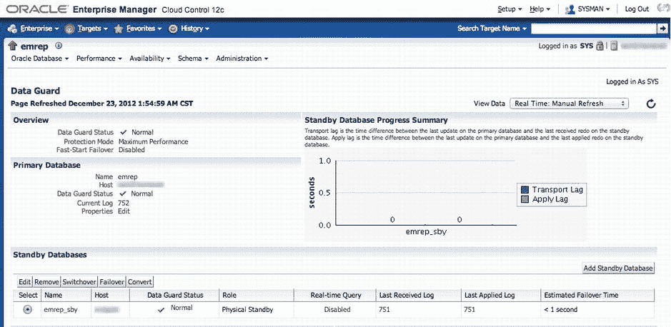

图 13-35 . Data Guard 管理界面，显示 ApplyLag 和 TransportLag 状态

3.  通过运行以下命令停止主站点上的管理服务。如果使用多个管理服务，应在每个 OMS 上执行此操作。

```
emctl stop oms -all
```


## 4. 使用 DGMGRL 命令行工具切换到备用数据库。在切换操作的情况下，可以在主数据库或备用数据库站点执行此操作。执行切换前，请验证 Data Guard 配置和数据库状态。以下示例说明了这些步骤。

### a. 执行切换前，验证 Data Guard 配置和数据库状态：

```
$ dgmgrl
DGMGRL for Linux: Version 11.2.0.3.0 - 64bit Production
Copyright (c) 2000, 2009, Oracle. All rights reserved.
Welcome to DGMGRL, type "help" for information.
DGMGRL> connect sys/<password>
Connected.
DGMGRL> show configuration

Configuration - emrep

Protection Mode: MaxPerformance
  Databases:
    emrep  - Primary database
    emrep2 - Physical standby database

Fast-Start Failover: DISABLED

Configuration Status:
SUCCESS

DGMGRL> show database emrep

Database - emrep

Role:            PRIMARY
  Intended State:  TRANSPORT-ON
  Instance(s):
    emrep

Database Status:
SUCCESS

DGMGRL> show database emrep2

Database - emrep2

Enterprise Manager Name: emrep_sby
  Role:                    PHYSICAL STANDBY
  Intended State:          APPLY-ON
  Transport Lag:           0 seconds
  Apply Lag:               0 seconds
  Real Time Query:         OFF
  Instance(s):
    emrep2

Database Status:
SUCCESS
```

### b. 发出 SWITCHOVER 命令：

```
DGMGRL> switchover to emrep2;
Performing switchover NOW, please wait...
New primary database "emrep2" is opening...
Operation requires shutdown of instance "emrep" on database "emrep"
Shutting down instance "emrep"...
ORACLE instance shut down.
Operation requires startup of instance "emrep" on database "emrep"
Starting instance "emrep"...
Unable to connect to database
ORA-12514: TNS:listener does not currently know of service requested in connect descriptor

Failed.
Warning: You are no longer connected to ORACLE.

Please complete the following steps to finish switchover:
       start up and mount instance "emrep" of database "emrep"
```

 `注意` 根据 Data Guard 配置的当前状态，发出切换命令后可能需要执行额外步骤。如示例所示，新的备用数据库应手动启动并挂载。

### c. 验证 Data Guard 配置状态，确认角色已切换：

```
DGMGRL> connect sys/<password>
Connected.
DGMGRL> show configuration;

Configuration - emrep

Protection Mode: MaxPerformance
  Databases:
    emrep2 - Primary database
    emrep  - Physical standby database

Fast-Start Failover: DISABLED

Configuration Status:
SUCCESS

DGMGRL> show database emrep2;

Database - emrep2

Enterprise Manager Name: emrep_sby
  Role:                    PRIMARY
  Intended State:          TRANSPORT-ON
  Instance(s):
    emrep2

Database Status:
SUCCESS

DGMGRL> show database emrep;

Database - emrep

Role:            PHYSICAL STANDBY
  Intended State:  APPLY-ON
  Transport Lag:   0 seconds
  Apply Lag:       0 seconds
  Real Time Query: OFF
  Instance(s):
    emrep

Database Status:
SUCCESS
```

此处，你可以看到数据库的角色已成功更改。下一步是重新配置 OMS 以使用新的主数据库。

## 5. 如果 Admin Server 尚未运行，请启动它。

```
emctl start oms –admin_only
```

## 6. 使用新的主数据库存储库配置 OMS。

```
$OMS_HOME/bin/emctl config oms -store_repos_details -repos_conndesc "(DESCRIPTION=(ADDRESS_LIST=(ADDRESS=(PROTOCOL=TCP)(HOST=oem3)(PORT=1522)))
(CONNECT_DATA=(SID=emrep2)))" -repos_user sysman
Oracle Enterprise Manager Cloud Control 12c Release 2
Copyright (c) 1996, 2012 Oracle Corporation.  All rights reserved.
Enter Repository User's Password :
```

## 7. 启动 OMS。

```
emctl start oms
```

## 8. 重新定位管理存储库目标。OMS 上的管理代理会监控 OMS 和管理存储库目标。切换后，需要更新存储库目标以反映已切换过来的存储库数据库，即新的主数据库。

```
emctl config emrep –agent <central_agent_name> -conn_desc <conn_desc_of_new_primary>
```

使用 Data Guard 对管理存储库进行故障转移与切换类似，区别在于使用 DGMGRL 发出的命令将是 `failover to <standby_db_name>`。

除了使用上述手动步骤外，你还可以利用 Data Guard 快速启动故障转移功能自动化 OMS 和管理存储库的故障转移：

*   快速启动故障转移通过一个独立于主备服务器运行的 Observer 进程来判断何时需要故障转移到备用数据库。如果 Observer 在一段可配置的时间内无法联系到主站点，它将自动故障转移到备用数据库。
*   故障转移发生后，会触发一个名为 `DB_ROLE_CHANGE` 的数据库事件。
*   `DB_ROLE_CHANGE` 事件会触发一个触发器，该触发器进而启动 Enterprise Manager 应用层。

可以创建一个脚本来自动化这些步骤。使用 `<OMS_HOME>/sysman/ha` 目录中提供的示例脚本，创建一个用于配置 OMS 指向新的主数据库并启动所有管理服务的脚本。清单 13-1 是一个脚本示例，它将在备用站点启动 OMS 并重新配置 OMS 使其使用在 Data Guard 配置中切换过来的新主管理存储库数据库。

## 清单 13-1. 在备用站点启动 EM 层的示例脚本

```
#!/bin/sh
LOGFILE="/oms_swlib/em/failover/em_failover.log"
OMS_ORACLE_HOME="/u01/app/oracle/Middleware/oms"
CENTRAL_AGENT="oem2.example.com:3872"
SYSMAN_PWD="oracle12c"

#log message
echo "###############################" >> $LOGFILE
date >> $LOGFILE
echo $OMS_ORACLE_HOME >> $LOGFILE
id >>  $LOGFILE 2>&1

#switch all OMS to point to new primary and startup all OMS
$OMS_ORACLE_HOME/bin/emctl config oms -store_repos_details -repos_conndesc "(DESCRIPTION=(ADDRESS_LIST=(ADDRESS=(PROTOCOL=TCP)(HOST=oem1)(PORT=1521)))
(CONNECT_DATA=(SID=emrep2)))" \
-repos_user sysman –repos_pwd $SYSMAN_PWD >> $LOGFILE 2>&1
$OMS_ORACLE_HOME/bin/emctl sync_opss_policy_store \
-sysman_pwd oracle12c  >> $LOGFILE 2>&1
$OMS_ORACLE_HOME/bin/emctl stop oms >>  $LOGFILE 2>&1
$OMS_ORACLE_HOME/bin/emctl start oms >>  $LOGFILE 2>&1

#relocate Management Services and Repository target
#to be done only once in a multiple OMS setup
#allow time for OMS to be fully initialized
$OMS_ORACLE_HOME/bin/emctl config emrep -agent $CENTRAL_AGENT \
-conn_desc -sysman_pwd $SYSMAN_PWD >> $LOGFILE 2>&1

#always return 0 so that dbms scheduler job completes successfully
exit 0
```

清单 13-2 中的示例脚本创建了一个触发器，该触发器将在切换或故障转移操作期间发生 `DB_ROLE_CHANGE` 事件时被触发。此触发器随后将调用前面的脚本以启动 Enterprise Manager 层。

## 清单 13-2. 数据库角色变更触发器示例


```
CREATE OR REPLACE TRIGGER FAILOVER_EM
AFTER DB_ROLE_CHANGE ON DATABASE
DECLARE
    `v_db_unique_name` varchar2(30);
    `v_db_role` varchar2(30);
BEGIN
    select upper(VALUE) into `v_db_unique_name`
    from `v$parameter` where NAME='db_unique_name';
    select database_role into `v_db_role`
    from `v$database`;

if `v_db_role` = 'PRIMARY' then

-- 提交作业以与存储库同步 Resync 代理
      -- 如果在最大性能模式下运行，并且故障转移时可能存在数据丢失风险，则需要此步骤
      -- 如果需要，请取消下面代码块的注释
      -- begin
      --  `SYSMAN.setemusercontext('SYSMAN', SYSMAN.MGMT_USER.OP_SET_IDENTIFIER)`;
      --  `SYSMAN.emd_maintenance.full_repository_resync('AUTO-FAILOVER to '||
          `v_db_unique_name`||'- '||systimestamp, true);
      --  `SYSMAN.setemusercontext('SYSMAN', SYSMAN.MGMT_USER.OP_CLEAR_IDENTIFIER)`;
      -- end;

-- 启动 EM 中层服务
      `dbms_scheduler.create_job`(
          `job_name`=>'START_EM',
          `job_type`=>'executable',
          `job_action`=> '/oms_swlib/em/failover/' || `v_db_unique_name`|| '_start_oms.sh',
          `enabled`=>TRUE
      );
    end if;
EXCEPTION
WHEN OTHERS
THEN
    `SYSMAN.mgmt_log.log_error`('LOGGING', `SYSMAN.MGMT_GLOBAL.UNEXPECTED_ERR`,
`SYSMAN.MGMT_GLOBAL.UNEXPECTED_ERR_M` || 'EM_FAILOVER: ' ||`SQLERRM`);
END;
/
```

## 总结

本章介绍了企业管理系统云控制（Enterprise Manager Cloud Control）的主要组件——`Oracle 管理服务`、`Oracle 管理存储库`、`Oracle 管理代理`以及`软件库`——这些组件都需要配置为高可用性。每个组件都需要通过不同的方法进行保护。

存储库数据库的高可用性需要使用数据库的高可用性特性，包括`ASM`、`RAC`和`数据守护`。每种特性都应在适当的时候使用 Oracle 推荐的最佳实践进行配置。`RAC`提供了可扩展性，并能在单个主机故障时实现无缝故障转移。`数据守护`则能在主机和存储发生故障时提供保护，在角色切换期间实现最短的停机时间（通常少于一分钟）。在最具可配置性的形态下，存储库数据库部署在`RAC`数据库上，并使用`数据守护`配置了一个本地的`RAC`物理备用库。一个具有相同配置的备用站点也可用于在主站点丢失时提供服务。

`Oracle 管理服务`可以使用多种技术来实现高可用性，每种技术在成本和复杂性上有所不同。最简单的技术涉及将`OMS`主机与存储库主机分离。您还了解了主动/被动或冷故障转移解决方案，其中多个主机在共享文件系统上共享单个`OMS`，但在任何给定时间点只有一个处于活动状态。这利用了`VIP`的概念，以便在集群中一个主机丢失时进行故障转移。需要手动进行故障转移，并且在`OMS`在另一台主机上重新启动时会出现一些停机时间。下一个层级是在负载均衡器后面设置多个管理服务。这可以在单个`OMS`丢失时实现无缝故障转移解决方案。在`MAA`配置中，备用站点的配置与主站点类似。这显然成本最高。然而，它不仅提供单站点可用性，还能抵御灾难。

管理代理通过在软件库中配置参考镜像来实现高可用性。这使得使用部署过程更容易恢复代理。

高可用性架构的一个关键方面是其备份和恢复策略。企业管理系统云控制中的每个组件都应在适当的时候遵循推荐的最佳实践，以确保可恢复性，满足业务的恢复点和恢复时间目标，从而将对业务的影响降至最低。

除了本章讨论的四个高可用性级别外，其他技术解决方案也可以提供不同级别的高可用性。这些包括但不限于虚拟化软件（如`Oracle VM Server`）、数据复制技术（包括`Oracle GoldenGate`和`Oracle Streams`）以及存储级复制解决方案。解决方案的选择取决于业务需求、资源和成本。

¹ `最大可用性架构 (MAA)` 是一套基于高可用性特性的 Oracle 推荐实践。这些建议基于产品开发验证和客户运行 Oracle 产品的经验。

² `快速恢复区` 在 11.2 版之前的 Oracle 数据库中被称为闪回恢复区。

³ `TZ`环境变量的格式取决于您的操作系统。有关设置`TZ`变量的更多信息，请参阅您的操作系统文档。

⁴ 回切的默认值设置为 0，这意味着`VIP`及其依赖资源在原始节点再次可用后不会自动回切。

⁵ `Oracle Restart`是 Oracle Database 11gR2 的单实例高可用性功能。它通过在发生故障时重新启动数据库实例、服务和监听器来提供高可用性。它还会在服务器启动时重新启动数据库组件。

⁶ `保护模式`指的是在主数据库故障时接受的潜在数据丢失。三种可用模式是：最大性能、最大可用性和最大保护。

⁷ `Oracle RAC One Node`是 Oracle Database 11g 第 2 版中提供的一项新选件。`Oracle RAC One Node`是一个在集群中的一个节点上运行的 Oracle `RAC`启用数据库的单实例。

⁸ `rsync`是一种软件，它能够在将文件和目录从一个系统复制到另一个系统的同时，通过使用差异算法最小化数据传输。

# 索引

  A

主动/主动 `OMS`

附加 `OMS`

`管理服务`部署过程

选项

`Oracle 管理服务`先决条件检查

创建后步骤

过程活动

过程库访问

复查

选择目标

目标

代理与用户连接

管理服务器安装

要求

服务器负载均衡器配置

主动/被动 `OMS`

`数据守护`

管理选项

`数据守护代理`

`最大可用性`保护模式

保护模式

状态

示例

先决条件

将 `VIP` 重新定位到另一台主机

备用数据库

备份选项

配置

`数据守护`作业创建

文件位置


#   B

## 回顾

## RMAN 联机备份

## VIP 创建

## 活动会话历史 (ASH) 分析

## 活动窗格

## 瞬间活动

## 数据库性能主页

## 基线

## EM 控制台数据库控制

## I/O 图表信息/基线值

## I/O 选项卡

## 并行执行选项卡

## 服务选项卡

## 统计信息

## 吞吐量选项卡

## 下拉等待类选项

## 紧急监控（*参见* 紧急监控）

## 图表/负载图

## 主机性能

## 许可要求

### 负载图

## 主要性能视图

## 选项

### SQL 监控

## CPU 与 I/O 读写

## EM12c 控制台

## 执行数据

## SQL 特定指标

## 临时空间使用情况

## 视图

### SQL 性能

### 顾问中心

## 云控制 SQL 历史记录

### 优化器统计信息

### SQL 访问顾问

### SQL 性能分析器

### SQL 计划控制

### SQL 调优集

## 顶级活动（*参见* 顶级活动）

## 顶级 SQL ID 活动

## 管理组

## Enterprise Manager 控制台

## 加入

## 生命周期、位置和业务线属性

## 非生产目标

## 生产目标

### 模板集合

## 时区

## 应用质量管理 (AQM)

## appvipcfg 实用程序

## 自动数据库诊断监视器 (ADDM)

## 自动存储管理 (ASM)

## 平均活动会话数 (AAS)

#   C

## 备份

### 管理代理备份

### Oracle 管理服务备份

### 资料库备份

## 目标类型

## 快速恢复区

## Oracle 建议的备份

## 计划

## 设置

## 业务服务管理

## 业务事务管理

## 成本分摊

## 云计算

## 特性


# 云生命周期管理

-   定义
-   部署模型
-   企业私有云
-   服务模型

# 云控制

## 云控制菜单栏

## 导航菜单栏

## 目标管理菜单栏

## 用户界面功能

### 云控制菜单栏

### 警报阶段

### 管理包访问

### My Oracle Support 集成

### 通知

-   条件格式化逻辑
-   电子邮件自定义
-   通知方法
-   短格式通知
-   SMTP 服务器详细信息
-   SYSMAN 账户

### 代理配置

-   NTLMAPS 代理
-   服务器访问

### 安全管理

### 设置菜单

# 云生命周期管理

-   应用程序组装
-   业务驱动的应用程序管理
-   业务服务管理
-   业务交易管理
-   用户体验管理

## 成本核算

-   成本中心创建
-   EM12c 成本核算控制台
-   扩展计费计划
-   功能特性
-   插件安装
-   报告
-   目标分配
-   通用计费计划

## 云堆栈监控

### 整合规划器

## 部署

## 计量

## 优化

## Oracle Virtual Assembly Builder (`OVAB`)

## 规划

## 自助服务门户

## 设置

## 测试

# 社区云

### 合规框架

# 配置安全更新

### 整合规划器

-   优点
-   数据收集部分
-   目标服务器
-   企业菜单选项
-   主页
-   关键概念
-   新建项目
-   物理机到 Oracle 虚拟机 (`P2V`)
-   物理机到物理机 (`P2P`)
-   预配置场景
-   项目信息整合规划器


```
BI Publisher 报告
常规选项卡
项目信息
资源类型下拉菜单
源服务器选项卡
源工作负载选项卡
项目屏幕创建
源服务器约束

  D

数据库机器发现向导
数据库重放功能
默认采集元数据
部署管理代理
添加主机目标向导
添加主机目标
手动添加目标
代理部署摘要
代理安装
凭证
Enterprise Manager Cloud Control 控制台
设置菜单
agentDeploy 脚本
AgentPull 脚本
Enterprise Manager 系统
RPM 包
DGMRL 命令
指令
命令行参数
配置属性
配置
确认消息
创建指令
定义
描述
选择和添加文件
指定源部分
上传文件选项
上传位置
基于磁盘的备份策略
域名系统 (DNS)
动态监控服务 (DMS) 获取器

  E

紧急监控
比较 ADDM 报告
活动
配置
EM12c 数据库目标界面
发现部分
选项
PL/SQL 包
资源
时间线和基线
实时 ADDM
EM 作业服务
emrepsrvc
工程化系统
Exadata 数据库一体机 (*参见* Exadata Database Machine)
IORM
维护阶段
自动化补丁管理
合规性框架
配置管理
缺陷诊断
管理阶段
测试阶段
确认消息
整合规划器
创建场景向导
数据库重放功能
预览效果
```


-   RAT
-   SQL 性能分析器
-   SQL 调优集
-   测试环境创建
-   类型
-   数据库设备
-   硬件与软件
-   内存内机器
-   生命周期
-   Oracle Exadata 数据库机
-   Oracle Exalogic 弹性云
-   SPARC SuperCluster T4-4
-   Sun ZFS 存储设备
-   企业配置管理 (ECM)
-   添加步骤
-   `CollectionItem` 属性
-   配置信息
-   配置指标代码片段
-   `generate_ecm_resources` 实用程序
-   元数据代码片段
-   `METADATAS` 根元素
-   `OFFSET_TYPE` 属性
-   `VER` 属性
-   Enterprise Manager Cloud Control 12c (EM12c)
-   云控制 (*参见* 云控制)
-   DMS 获取器
-   ECM (*参见* 企业配置管理)
-   特性
-   HTTP 数据获取器
-   界面
-   特征
-   数据库性能主页
-   设计
-   旧式界面
-   WebLogic 服务器性能主页
-   JDBC 获取器
-   JMX 获取器
-   监控与管理
-   管理组 (*参见* 管理组)
-   管理建议 (*参见* 管理建议)
-   指标阈值
-   监控模板
-   同步计划
-   模板集合
-   操作系统命令获取器
-   报告机制
-   REST 获取器
-   SNMP 获取器
-   SQL 获取器
-   技术栈
-   URL 计时获取器
-   URLXML 获取器
-   WBEM 获取器
-   Web 服务
-   Enterprise Manager Cloud Control 12c (EM12c) 架构
-   应用性能管理
-   AQM
-   云控制控制台
-   云管理
-   命令行工具
-   通信流
-   防火墙
-   端口配置
-   协议
-   数据库管理
-   企业监控
-   框架与基础设施


# 企业管理器

## 硬件与虚拟化管理
- 硬件与虚拟化管理
- 高可用性配置
- 主动/主动配置
- 安装
- 1 级部署
- 可扩展性与可用性
- 共享存储与 VIP

## 生命周期管理
- 生命周期管理

## 管理工具
- 管理工具
- 中间件管理
- 非 Oracle 管理
- OMA
- OMR
- OMS
- 可插拔认证方案
- 插件
- 资料库

## 数据库用户
- 数据库用户
- 视图

## 管理
- 软件库
- 管理页面
- 特性
- `EMCLI` 实用程序
- `EMCTL` 实用程序

# 企业管理器 (EM) 作业
## 概述
- `Enterprise Manager` 诊断套件
- `Enterprise Manager` (EM) 作业
- 架构
- 优势
- 停机期创建
- 组件
- 作业活动页面
- 作业服务
- 库
- 监控配置
- 定义
- 有效监控/作业状态
- 增强

## 作业创建
- 作业创建
- `DBA_* 视图` 选项
- 下拉菜单与安全规则配置
- 结束日期宽限期
- 常规标签页配置
- 安全规则配置
- 作业服务
- 作业类型

## 管理
- 管理
- 删除
- 版本更新
- 作业停止
- 库选项复制
- 暂停状态
- 脚本迁移
- `MTM`
- 多管理代理
- 脚本/操作系统级
- 服务图表与指标
- 作业性能图表
- 性能指标
- 服务接口
- 使用指标

## `SYSMAN` 模式
- `SYSMAN` 模式
- 组件
- `EMCLI`
- 作业活动
- `JOB_ID` 列
- 作业信息查询
- `MGMT_JOB_CREDENTIALS` 表
- 查询
- `SQL*Plus`

### 故障排除
- 故障排除
- `EMDIAG`
- 全局诊断


GUID 目标诊断
安装
作业级诊断
Enterprise 菜单
合规性菜单
合规性子菜单
作业子菜单
监控子菜单
My Oracle Support 子菜单
下一个子菜单
配置与修补选项
质量管理
报告配置
Information Publisher 报告
月度空间使用报告
报告类别
空间使用报告定制
每周空间管理报告
报告子菜单
Enterprise 私有云
Enterprise User Security (EUS)
Exadata 数据库机
数据库机发现向导
EM12
Exadata 示意图视图
启动自动发现
管理代理
Review 屏幕
SNMP 订阅步骤
Exadata I/O 资源管理器 (IORM)
可扩展性开发套件 (EDK)
部署
安装
插件开发工具
插件元数据
插件示例
参考文档
阶段结构

  F
快速恢复区 (FRA)
完全限定域名 (FQDN)

  G
gcstartup
通用组件
组件选项
确认
创建实体选项
描述页面
审查与保存
设置指令屏幕
图形用户界面 (GUI)

  H
硬件要求安装
管理代理
管理资料库
OMS
高可用性
启动
组件
级别
管理资料库
管理服务 (*参见* Oracle Management Service (OMS)
Oracle 管理代理
软件库
HTTP 数据获取片段
混合云
超文本传输协议 (HTTP)

  I
事件管理
向后兼容性


-   目标
-   准则
-   事件管理
-   建议
-   优先级排序
-   术语
-   事件与事故
-   事故规则集
-   问题
-   用户界面 (`参见` 用户界面)
-   基础设施即服务 (IaaS)
-   互联网控制报文协议 (ICMP)
  J, K
-   Java 数据库连接 (JDBC)
-   Java 开发工具包 (JDK)
-   Java 管理扩展 (JMX) 适配器
-   Java 管理扩展 (JMX) 获取器
-   JDBC 获取器
  L
-   轻量目录访问协议 (LDAP)
-   认证
-   层级结构
  M
-   管理插件
-   默认采集元数据
-   开发环境
-   可扩展性开发工具包 (EDK)
-   部署
-   安装
-   插件开发工具
-   插件元数据
-   插件示例
-   参考文档
-   阶段结构
-   可扩展性框架
-   生命周期
-   管理能力
-   指标浏览器
-   指标扩展
-   高级功能
-   计算指标列
-   DMS 获取器
-   动态属性
-   ECM (`参见` 企业配置管理)
-   HTTP 数据获取器
-   JDBC 获取器
-   JMX 获取器
-   关键列
-   METADATA_DEFINITION 列
-   元数据注册服务
-   操作系统命令获取器
-   报告机制
-   REST 获取器
-   SNMP 获取器
-   SQL 获取器
-   URL 计时获取器
-   URLXML 获取器
-   WBEM 获取器
-   Web 服务
-   XML 定义
-   打包
-   目标类型元数据
-   显示元素
-   实例属性
-   指标元素
-   QueryDescriptor 元素
-   响应指标
-   示例插件主机 1
-   SCOPE 属性
-   结构


## 文档索引

TableDescriptor 元素

<TargetMetadata> 元素

目标类型

管理建议

事件、事故、问题工作流

多事件的事故/事件关系

指标收集错误

规则与规则集

管理存储库安装

数据库软件

配置脚本

数据库版本

下载软件更新

网格安装选项

安装选项

安装程序

清单位置

语言选项

OTN

特权操作系统用户组

选择安装选项

指定安装位置

概要屏幕

解压缩

Oracle Database 11gR2 (*参见* Oracle Database 11gR2)

存储库数据库创建

创建选项

数据库字符集

数据库配置助手

数据库内容

数据库凭据

数据库标识

数据库存储

数据库模板

管理选项

内存参数

恢复选项

运行 DBCA

标准数据库组件

管理管理器 (MTM)

最大可用性架构 (MAA)

先决条件

备用管理服务器

部署过程

首个管理服务

导入配置

omsca

插件配置

安装后配置

单点登录

WebLogic 域

指标浏览器

指标扩展

高级功能

计算指标列

CPU 利用率指标

创建

添加列

(>) 比较运算符

创建按钮

凭据选项卡

常规属性选项卡

open_cursors_pct 属性

目标类型选项

测试选项卡

开发生命周期

DMS 获取器

动态属性


# 索引

## 企业配置管理相关

- `ECM` (参见 *企业配置管理*)
- `EM_MEXT_ADAPTERS` 视图
- `EM_MEXT_TARGETTYPE_ADAPTERS` 仓库视图
- `HTTP` 数据获取器
- `JDBC` 获取器
- `JMX` 适配器
- `JMX` 获取器
- 关键列
- `METADATA_DEFINITION` 列
- 元数据注册服务
- 新版本创建
- `open_cursors` 初始化参数
- `OS` 命令适配器
  - 环境变量
  - 主机凭证
  - 输入凭证
  - 多列
  - 多值
  - `Perl` 脚本
  - 属性
  - 单列
- `OS` 命令获取器
- 物理 `IO` 指标
- 发布
- 报告机制
- `REST` 获取器
- `SNMP` 适配器
- `SNMP` 获取器
- `SQL` 适配器
- `SQL` 获取器
- 测试
- `URL` 计时获取器
- `URLXML` 获取器
- `WBEM` 获取器
- `Web` 服务
- `XML` 定义
- 度量阈值
- 监控模板

 N

## 导航菜单栏

- 企业菜单 (参见 *Enterprise menu*)
- 收藏夹菜单
- 历史记录菜单
- 快速导航菜单
- 搜索框
- 目标菜单
  - 所有目标选项
  - 数据库系统
  - 组信息
  - 服务

 O

## Oracle 数据库 11gR2

- 内核参数
- `Oracle` 基目录
- `repositorydb.testdomain.com`
- `RPM` 软件包与 `YUM`
- 用户和组创建
- `Oracle` 数据库软件
  - 配置脚本
  - 数据库版本
  - 网格安装选项
  - 安装程序
  - 语言选项
  - `OTN`
  - 特权操作系统用户组
  - 选择安装选项
  - 指定安装位置
  - 摘要屏幕
  - 解压文件
- `Oracle` 数据库软件下载软件更新
- `Oracle` 企业管理器 `12c` 应用测试套件


# Oracle Enterprise Manager Cloud Control 术语表

## 安装与配置

### Oracle Enterprise Manager 12c 安装

基本目录

数据库连接详细信息

执行配置脚本

安装完成

安装详细信息

安装检查

安装类型

安装程序

登录屏幕

Oracle 清单

`oracle-validated` 软件包

OTN

插件部署

端口配置详细信息

先决条件检查

资料库配置详细信息

软件更新

用户和组

Weblogic Server 配置

## 核心组件

### Oracle Management Agent (OMA)

云控制台

访问

代理菜单

`EM 代理浏览器`

事件区域

监控区域

多代理控制

性能和用法区域

资源消耗区域

摘要区域

命令行界面

`EMCLI` 实用程序

`EMCTL` 实用程序

日志和跟踪文件

故障排除

### Oracle Management Repository (OMR)

命令行

数据保留

优化器统计信息

队列管理

`EM12c` 控制台

访问

数据库主页

主页

资料库同步

资料库视图

故障排除

### Oracle Management Service (OMS)

主动/主动 OMS (*参见* 主动/主动 OMS)

主动/被动 OMS (*参见* 主动/被动 OMS)

命令行实用程序

目录结构

`EMCTL` 实用程序

日志和跟踪文件

`EM12c` 控制台

访问

更改属性值

配置属性

运行状况概览页面

主页

管理服务主页

## 其他组件与概念

Oracle Internet Directory (`OID`)

Oracle Exadata Database Machine

Oracle Exalogic Elastic Cloud

Oracle Enterprise Manager Cloud Control 可扩展性程序员指南

Oracle Enterprise Manager Cloud Control 可扩展性程序员参考

loss of

MAA with standby site (*see* Maximum availability architecture (MAA))

multiple OMSs

repository hosts/no redundancy

troubleshooting

Oracle Process Manager and Notification Server (OPMN)

Oracle Restart

Oracle Software

inventory directory

library

Oracle Technology Network (OTN)

`oracle-validated`/`oracle-preinstall-11gr2` package

Oracle Virtual Assembly Builder (OVAB)

Oracle WebLogic Node Manager

OS command fetchlets

OS process ID (PID)

  P, Q

# 补丁

Add Patch button

benefits

custom scripts

deployable and nondeployable

Deployment Options page

deployment procedures

deployment successful

`My Oracle Support`

`OPatch` approaches

patch plans

Add to Plan menu

Create New Plan dialog box

patches and updates

patch recommendations

setting up plan

patch sets

plan template

Edit Template Wizard

New Plan Template dialog box

successful plan deployment

procedure library

Review & Deploy screen

roles

saved patches

Setting Deployment Options

validation

patching and provisioning deployment procedures

# 平台即服务 (PaaS)

# 私有云

## 配置

Cloud Control console

database provisioning console

definition

deployment procedure

designer and operator roles

Easy-to-navigate database provisioning wizards

installation media

Create Entity

Select Files page

Select Upload Location dialog box

specifications

Locking-down feature

profiles and database templates

provision profile

Content options

Create button

Credentials section

Profile page

reference target

review


# R

*   自更新功能
*   公共云
*   `public-yum*.repo` 配置文件
*   真正应用集群 (RAC)
*   真正应用测试 (RAT)
*   恢复
    *   故障切换
    *   管理代理恢复
    *   Oracle 管理服务恢复
    *   资料库恢复
    *   切换
    *   ApplyLag 和 TransportLag 状态
    *   数据库角色变更触发器
    *   备用站点上的 EM 层
    *   管理资料库目标
    *   备用数据库
*   基于资料库的身份验证
*   `repositorydb.testdomain.com`
*   REST 提取器

# S

*   安全管理
    *   访问控制
    *   管理员
    *   详细信息
    *   企业管理器角色
    *   资源分配
    *   安全向导
    *   目标权限分配
    *   凭证
    *   可保护项
*   自助服务门户
*   `set_target_property_value`
*   简单网络管理协议 (SNMP) 适配器
*   简单网络管理协议 (SNMP) 提取器
*   单一客户端访问名称 (SCAN)
*   单点登录 (SSO) 身份验证
*   软件即服务 (SaaS)
*   软件库
    *   优势
    *   备份
    *   实体
        *   自定义实体
        *   指令（*参见* 指令）
        *   通用组件（*参见* 通用组件）
        *   维护任务
        *   Oracle 拥有的实体
        *   组织实体
        *   执行定期维护任务
        *   清除已删除的实体文件
        *   重新导入 Oracle 拥有的实体文件
        *   移除与迁移
    *   文件结构
    *   名称、状态和位置
    *   OMS 代理文件系统
    *   OMS 共享文件系统位置
    *   Oracle 拥有的文件夹
    *   引用的文件位置
    *   设置菜单
    *   软件库管理控制台
    *   用户拥有的文件夹
*   SPARC SuperCluster T4-4
*   SQL 提取器
*   SQL 性能分析器
*   SQL 调优集
*   `srvctl` 命令
*   Sun ZFS 存储设备
*   `SYSMAN` 用户

# T

*   目标管理菜单栏
    *   定制
    *   诊断
    *   主页
    *   日志审查
    *   菜单项
    *   监控设置
    *   Oracle 数据库
    *   目标设置
    *   目标状态和通知控制
    *   WebLogic 管理服务器
*   目标类型元数据
*   顶级活动
    *   CPU + CPU 等待选项
    *   图形
    *   性能下拉菜单
    *   SQL 详细信息页面
        *   计划控制选项卡
        *   SQL 活动
        *   SQL 监控选项卡
        *   SQL 计划
        *   SQL 统计信息
        *   调优历史记录选项卡
*   顶级会话窗格
    *   活动查询执行
    *   活动选项卡
    *   阻塞选项卡
    *   常规选项卡
    *   打开的游标选项卡
    *   并行 SQL 选项卡
    *   `PID`
    *   SQL 监控选项卡
    *   统计信息选项卡
    *   等待事件历史记录选项卡
*   顶级 SQL 窗格

# U, V

*   URL 计时提取器
*   URLXML 提取器
*   用户体验管理
*   用户界面
    *   访问规则
        *   操作
        *   添加规则
        *   添加目标
        *   `创建规则集` 页面
        *   创建自定义视图
        *   事件屏幕
        *   事件选项卡
        *   常规选项卡
        *   事件管理器控制台
        *   主从表单
        *   `度量警报` 单选按钮
        *   My Oracle Support 知识库
        *   通知
        *   规则名称和描述
        *   `ruleset`
        *   规则类型选择
        *   `tablespace`
        *   目标屏幕
        *   工作流

# W, X, Y, Z

*   基于 Web 的企业管理 (WBEM) 提取器
