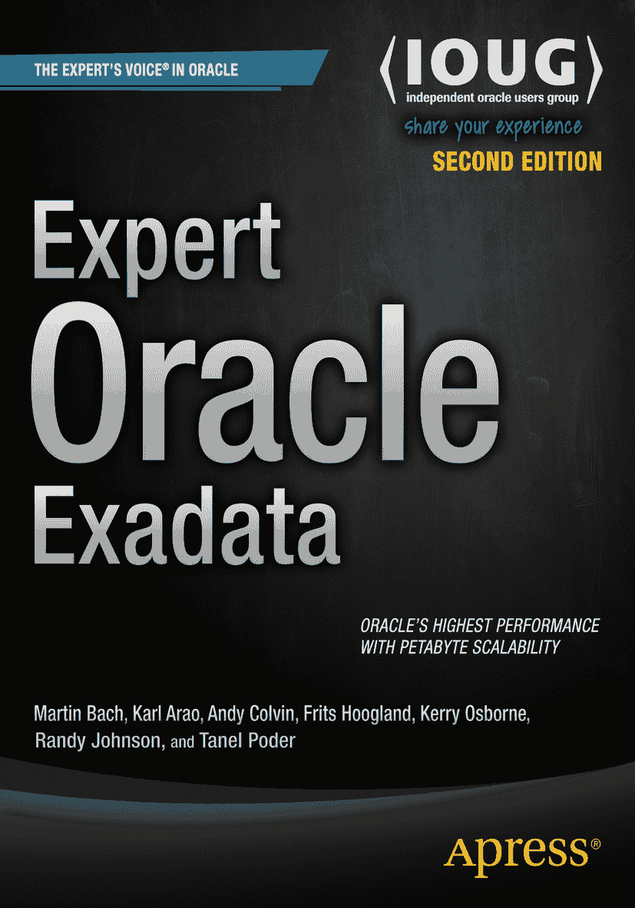

 Martin Bach, Karl Arao, Andy Colvin, Frits Hoogland, Kerry Osborne, Randy Johnson and Tanel Poder *Expert Oracle Exadata* 第二版

本书作者引用的任何源代码或其他补充材料，读者均可访问 [`www.apress.com/9781430262411`](http://www.apress.com/9781430262411) 获取。有关如何查找本书源代码的详细信息，请访问 [`www.apress.com/source-code/`](http://www.apress.com/source-code/)。读者也可以在 SpringerLink 的每章补充材料部分访问源代码。

ISBN 978-1-4302-6241-1
e-ISBN 978-1-4302-6242-8
DOI 10.1007/978-1-4302-6242-8
© Apress 2015

*Expert Oracle Exadata*

总经理：Welmoed Spahr
策划编辑：Jonathan Gennick
开发编辑：Douglas Pundick
技术审校：Frits Hoogland
编辑委员会：Steve Anglin, Louise Corrigan, Jim DeWolf, Jonathan Gennick, Robert Hutchinson, Michelle Lowman, James Markham, Susan McDermott, Matthew Moodie, Jeffrey Pepper, Douglas Pundick, Ben Renow-Clarke, Gwenan Spearing, Steve Weiss
协调编辑：Jill Balzano
文字编辑：Ann Dickson
排版：SPi Global
索引：SPi Global
美术设计：SPi Global
封面设计师：Anna Ishchenko

有关翻译信息，请发送电子邮件至 `rights@apress.com`，或访问 [`www.apress.com`](http://www.apress.com/)。Apress 和 friends of ED 的图书可批量购买用于学术、企业或推广用途。大多数书名也提供电子书版本和许可。更多信息，请参考我们的“批量销售–电子书许可”网页：[`www.apress.com/bulk-sales`](http://www.apress.com/bulk-sales)。

本作品受版权保护。出版者保留所有权利，无论涉及材料的全部或部分，具体包括翻译、转载、插图重用、朗诵、广播、微缩胶片或任何其他物理方式的复制，以及信息存储与检索、电子改编、计算机软件，或目前或未来开发的类似或相异方法。本法律保留的例外情况是，用于评论或学术分析的简短摘录，或专门为输入和执行于计算机系统而提供的、仅供作品购买者专用的材料。仅当符合出版者所在地的版权法现行版本规定时，才允许复制本出版物或其部分内容，且必须始终获得 Springer 的使用许可。使用许可可通过版权许可中心的 RightsLink 获取。违规行为将依据相应的版权法承担法律责任。商标名称、标识和图像可能出现在本书中。我们并非每次出现商标名称、标识或图像时都使用商标符号，而是仅以编辑方式并为了商标所有者的利益而使用这些名称、标识和图像，无侵犯商标的意图。在本出版物中使用商品名称、商标、服务标识和类似术语，即使未特别标明，也不应被视为表达这些术语是否受专有权约束的意见。虽然本书中的建议和信息在出版时被认为是真实和准确的，但作者、编辑和出版者均不对可能出现的任何错误或遗漏承担法律责任。出版者对本出版物所含材料不作任何明示或暗示的保证。由 Springer Science+Business Media New York 向全球图书贸易发行，地址：233 Spring Street, 6th Floor, New York, NY 10013。电话：1-800-SPRINGER，传真：(201) 348-4505，电子邮件：orders-ny@springer-sbm.com，或访问 www.springeronline.com。Apress Media, LLC 是加利福尼亚州的一家有限责任公司，其唯一成员（所有者）是 Springer Science + Business Media Finance Inc (SSBM Finance Inc)。SSBM Finance Inc 是特拉华州的一家公司。

