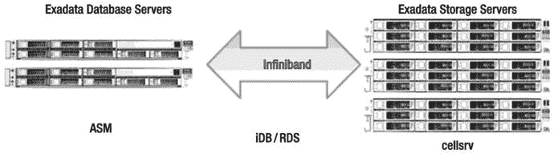
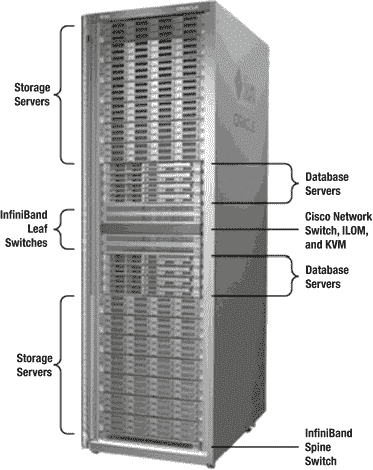
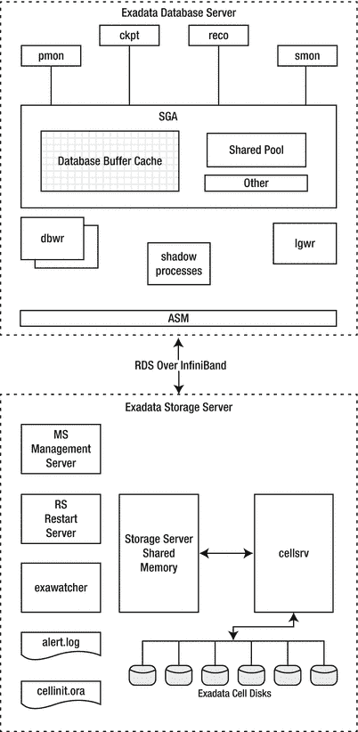
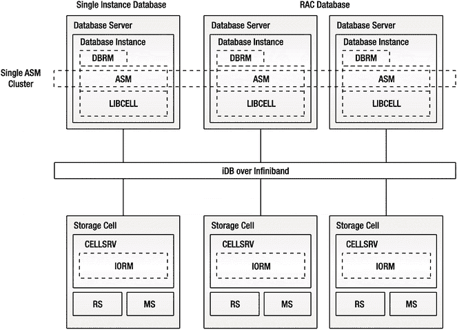
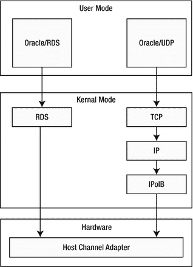

# 什么是 Exadata？

毫无疑问，你对 Exadata 是什么已经有相当好的了解，否则你手中就不会拿着这本书了。在我们看来，它是一个硬件和软件的预配置组合，为运行 Oracle 数据库（截至本书撰写时，可以是 11g 第 2 版或 12c 第 1 版）提供了一个平台。由于 Exadata 数据库一体机包含存储子系统，因此开发了不同的软件在存储层运行。这使得 Oracle 产品开发能够实现一些在其他平台上无法完成的功能。事实上，Exadata 最初就是作为一个存储系统而诞生的。如果你与参与该产品开发的人员交谈，通常会听到他们将存储组件称为 Exadata 或 SAGE（面向网格环境的存储设备），后者是该项目的代号。

Exadata 最初旨在解决超大型数据库最常见的瓶颈——无法将足够大量的数据从磁盘存储系统移动到数据库服务器。Oracle 业务的基础是通过使用智能缓存技术提供极快的数据访问速度。随着数据库规模开始超出使用这些技术有效缓存数据的能力，Oracle 开始寻找消除存储层和数据库层之间瓶颈的方法。开发人员提出的解决方案是硬件和软件的结合。仔细想想，有两种方法可以最大限度地减少这种瓶颈。第一种是使数据库与存储之间的管道更大。虽然涉及许多组件并且这有点过于简化，但你可以将 InfiniBand 视为那个更大的管道。第二种最小化瓶颈的方法是减少需要传输的数据量。他们通过智能扫描实现了这一点。两者的结合为这个问题提供了一个非常成功的解决方案。但要明确——通过智能扫描减少层间流动的数据量是那只会下金蛋的鹅。

在本介绍性章节中，我们将回顾构成 Exadata 的组件，包括硬件和软件。我们还将讨论各部分如何组合在一起（架构）。此外，我们将讨论数据库服务器如何与存储服务器通信。这与其他平台的处理方式非常不同，因此我们将花费相当多的时间来介绍这个主题。我们还将提供一些历史背景。到本章结束时，你应该对各部分如何组合有很好的感觉，并对 Exadata 的工作原理有基本的了解。本书的其余部分将提供细节，以充实本章构建的框架。

## Exadata 概览

俗话说，一图胜千言。图 1-1 展示了构成 Exadata 数据库一体机的各部分的非常高层级的视图。



图 1-1. 高层级 Exadata 组件

在考虑 Exadata 时，将整个系统在头脑中分为两部分是有帮助的：存储层和数据库层。各层通过 InfiniBand 网络连接。InfiniBand 提供了一个低延迟、高吞吐量的交换结构通信链路。冗余性通过多个交换机和链路提供。数据库层由运行标准 Oracle 11g 或 12c 软件的多个 Sun 服务器组成。服务器通常配置为一个或多个真正应用集群（RAC），尽管 RAC 实际上并不是必需的。数据库服务器使用自动存储管理（ASM）访问存储。即使数据库未配置使用 RAC，ASM 也是必需的。存储层也由多个 Sun x86 服务器组成。每个存储服务器包含 12 个磁盘驱动器或 8 个闪存驱动器，并运行 Oracle 存储服务器软件（`cellsrv`）。层间通信通过 iDB 完成，这是一种基于网络的协议，使用 InfiniBand 实现。iDB 用于发送数据请求以及关于请求的元数据（包括谓词）到 `cellsrv`。在某些情况下，`cellsrv` 能够在将结果发送回数据库层之前使用元数据处理数据。当 `cellsrv` 能够这样做时，称为智能扫描，通常会导致需要传输回数据库层的数据量显著减少。当无法进行智能扫描时，`cellsrv` 返回整个 Oracle 块。请注意，iDB 使用 RDS 协议，这是一种低延迟、特定于 InfiniBand 的协议。在某些情况下，Oracle 软件可以通过 RDS 建立远程直接内存访问（RDMA），这绕过了进行系统调用来完成跨 InfiniBand 网络的低延迟进程间通信。

## Exadata 历史

自 2008 年底首次发布以来，Exadata 经历了许多重大变化。事实上，撰写本书最困难的部分之一就是在项目进行期间跟上平台的变化。以下是该产品谱系及其随时间变化的简要回顾：


## Exadata 各代产品

*   ### 第一代（V1）
    首款 Exadata 于 **2008 年末**发布，被标记为 `V1`，是 HP 硬件与 Oracle 软件的结合。其架构与当前的 `X5` 版本相似，不同之处在于闪存——`V2` 版本才添加了闪存。Exadata `V1` 在市场上仅作为数据仓库平台销售。该产品颇具吸引力，但未被广泛采用。它还因**过热**问题而受到影响。普遍的说法是，你可以在机柜顶上煎鸡蛋。许多最初的 `V1` 客户后来用 `V2` 或 `X2-2` 替换了他们的 `V1`。

*   ### 第二代（V2）
    第二版 Exadata 于 **2009 年**的 Oracle Open World 大会上宣布。这个版本是 Sun 与 Oracle 合作的成果。在宣布时，Oracle 已经在进行对 Sun Microsystems 的收购流程。许多组件都升级到了更大或更快的版本，但最大的区别是增加了大量的固态存储。存储单元增强了 384G 的 Exadata 智能闪存缓存。软件也进行了增强以利用新的缓存。这次增加使得 Oracle 能够将该平台作为数据仓库平台之外的产品进行营销，开拓了一个大得多的市场。

*   ### 第三代（X2）
    Exadata 的第三个版本于 **2010 年**的 Oracle Open World 大会上宣布，命名为 `X2`。实际上，`X2` 有两个不同的版本。`X2-2` 遵循了与 `V2` 相同的基本蓝图，最多可配置八台双路数据库服务器。CPU 从 `V2` 使用的四核升级为六核型号。另一款 `X2` 型号名为 `X2-8`。它打破了小型 1U 数据库服务器的模式，引入了更大的数据库服务器，配备 8×8 核 CPU 和高达 1TB 的内存。由于主要得益于更多的 CPU 核心和更大的内存容量，`X2-8` 被定位为大型 OLTP 或混合负载系统的更强大平台。2011 年，Oracle 将 `X2-8` 的硬件升级为每节点 8x10 核 CPU 和 2TB 内存。针对需要额外存储的客户，推出了存储扩展机架（装满存储服务器的机架）。2012 年 1 月，Oracle 将高容量磁盘的大小从 2TB 增加到 3TB。

*   ### 第四代（X3）
    **2012 年**，Oracle 宣布了 Exadata `X3`。`X3` 是 `X2` 系列所包含硬件的自然演进。计算节点更新包括八核 Intel Sandy Bridge CPU 以及增加的内存，最高可达每台服务器 256GB（尽管最初很短一段时间内配备的是每台服务器 128GB）。存储服务器的 CPU 和内存也得到了升级，闪存存储增加到每台服务器 1.6TB。`X3-2` 系列还引入了一种新尺寸——八分之一机架。`X3-8` 机架的存储服务器得到了相同的改进，但 `X3-8` 机架中的计算节点与其 `X2-8` 对应型号相同。

*   ### 第五代（X4）
    Oracle 于 **2013 年**发布了 Exadata `X4`。它遵循了传统的新特性：处理能力增加到 2x12 核 CPU，增加了在计算节点升级到 512GB 内存的能力，并且闪存和磁盘存储也有所增加。`X4-2` 还采用了一种新型号的高容量磁盘，用 1.2TB、10,000 RPM 的磁盘替换了 600GB、15,000 RPM 的磁盘。这些磁盘采用了更小的外形规格（2.5” 对比 3.5”）。`X4-2` 的另一个显著变化是引入了活动/活动（active/active）的 InfiniBand 网络连接。在 `X4-2` 上，Oracle 打破了绑定连接，并独立利用每个 InfiniBand 端口。这允许在 InfiniBand 结构中实现更高的吞吐量。

*   ### 第六代（X5）
    **2015 年初**，Oracle 宣布了第六代 Exadata，即 `X5-2`。`X5-2` 是平台的一次巨大变革，它移除了高性能磁盘选项，转而采用全闪存、NVMe（非易失性内存快速通道）模型。高容量磁盘的大小没有改变，保持在每磁盘 4TB。闪存卡的容量再次翻倍，这次达到每台存储服务器 6.4TB。内存保持基础配置为 256GB，可升级到 768GB，每个插槽的核心数增加到 18 核。最后，取消了必须按预定义尺寸购买机架的要求。可以购买任何所需配置的 `X5-2` 机架——一个基础机架从两台计算节点和三台存储服务器开始。除此之外，机架内可以使用计算和存储服务器的任意组合。这消除了关于 Exadata 配置是否基于工作负载“平衡”的讨论。正如在 `X5` 之前的许多部署中所看到的，每个工作负载都略有不同，对计算和存储的需求也各不相同。

## 关于 Exadata 的不同视角

我们已经向您提供了一个相当平淡的描述，说明了我们如何看待 Exadata。然而，就像著名的盲人摸象故事一样，对于 Exadata 的本质存在许多相互矛盾的看法。我们将在本节中介绍一些常见的描述。


#### 数据仓库一体机

有时，Exadata 被描述为一种数据仓库一体机（DW 一体机）。尽管 Oracle 一直试图避免 Exadata 被简单归入此类，但这种描述可能比你最初想象的更接近事实。事实上，它是一套紧密集成的软硬件组合，Oracle 期望用户能直接运行它而无需做太多改动。这与人们通常对 DW 一体机的理解完全一致。然而，Oracle 数据库的本质意味着它具有极高的可配置性。这与典型的 DW 一体机形成了鲜明对比，后者通常没有太多可调节的选项。不过，DW 一体机与 Exadata 之间确实存在几个共同特点：

*   **卓越性能**：Exadata 以及大多数 DW 一体机最显著的特点，是它们都针对数据仓库类型的查询进行了优化。
*   **快速部署**：DW 一体机和 Exadata 数据库一体机都能非常迅速地部署。由于 Exadata 是预配置的，通常从收货到启动运行只需一周时间。这与传统的 Oracle 集群数据库部署场景形成鲜明对比，后者通常需要数周时间。
*   **可扩展性**：两种平台都具有可扩展的架构。对于 Exadata，升级是分步骤进行的。例如，从半机架配置升级到全机架配置，其磁盘总吞吐量会随着数据库服务器计算能力的提升而同步增加。
*   **降低 TCO**：这一点可能听起来有点奇怪，因为许多人认为 Exadata 最大的缺点是价格高昂。但事实是，在许多应用场景中，DW 一体机和 Exadata 都能降低总拥有成本。有趣的是，就 Exadata 而言，这在一定程度上要归功于支持特定工作负载所需的 Oracle 数据库许可证数量减少了。我们见过多个案例，在评估运行公司 Oracle 应用的硬件平台时，最终发现 Exadata 的实施和维护成本低于其他备选方案。
*   **高可用性**：大多数 DW 一体机都提供至少支持一定程度高可用性（HA）的架构。由于 Exadata 运行标准的 Oracle 12c 或 11g 软件，Oracle 开发的所有 HA 功能都是开箱即用的。其硬件设计也旨在消除任何单点故障。
*   **预配置**：当 Exadata 交付到你的数据中心时，Oracle 工程师会安排时间协助进行初始配置。这将包括确保整个机架的布线完成并按预期运行。但与大多数 DW 一体机一样，组件的集成工作已经完成。因此，无需进行广泛的研究和测试。操作系统预安装以及所有组件在机架内布线就绪，极大地缩短了从交付到实施的时间。

尽管存在诸多相似之处，Oracle 并不认为 Exadata 是一台 DW 一体机，即便二者共享许多特性。一般来说，这是因为 Exadata 提供了一个功能完备的 Oracle 数据库平台，包含了 Oracle 多年来构建的所有能力，包括运行任何现有 Oracle 数据库应用的能力，尤其能处理需要高并发度的混合工作负载——而这通常是 DW 一体机所不擅长的。

## OLTP 机器

将 Exadata 描述为 OLTP 机器，在一定程度上是一种旨在扩大市场吸引力的营销策略。虽然这个描述并非完全不准确，但不如其他一些赋予 Exadata 的称呼那么贴切。这让人想起那句经典名言：

> 这取决于“是”这个词的含义是什么。——比尔·克林顿

同样地，OLTP（在线事务处理）也是一个定义相对宽松的术语。我们通常用这个术语来描述那些对延迟非常敏感、并通过索引进行单块访问为特征的工作负载。但是，有一部分 OLTP 系统也非常注重写入操作，并且需要极高的并发度来支持大量用户。Exadata 的设计初衷并非成为这些写入密集型工作负载的最快解决方案，尽管 X5 型号中最新的闪存改进无疑比前代表现更好。然而，值得注意的是，很少有系统能完全归入这些类别。大多数系统都混合了对吞吐量敏感的长运行 SQL 语句和对延迟敏感的短时 SQL 语句——这就引出了我们看待 Exadata 的下一个视角。

#### 整合平台

将 Exadata 描述为整合平台，是将其定位为整合多个数据库的潜在平台。从总拥有成本（TCO）的角度来看，这是可取的，因为它具有降低复杂性（从而降低与复杂性相关的成本）、通过减少需要维护的系统数量来降低管理成本、通过减少服务器数量来降低功耗和数据中心成本，以及减少软件和维护费用的潜力。这是一种合理的看待 Exadata 的方式。由于 Exadata 结合了多种特性，它能够同时充分支持多种工作负载配置。尽管它并非完美的 OLTP 机器，但闪存缓存功能提供了一种机制，确保面向 OLTP 的工作负载具有低延迟。智能扫描优化为面向高吞吐量、数据仓库型的工作负载提供了卓越的性能。平台内置的资源管理选项提供了在同一个平台上满足这些有些冲突的需求的能力。事实上，这种能力最大的优势之一在于，它有可能完全消除当前许多企业中为了将数据从 OLTP 系统迁移到数据仓库系统而进行的大量工作，以免长运行查询对延迟敏感的工作负载产生负面影响。在许多企业中，仅仅将数据从一个平台迁移到另一个平台所消耗的资源就超过了任何其他操作。Exadata 在这方面的强大能力可能使得这一过程在许多情况下变得不再必要。

### 配置选项

由于 Exadata 是以预配置、集成的系统形式交付的，因此可用的选项非常少。截至撰写本文时，有五个标准版本可供选择。它们分为两大类，对应不同的型号名称（X5-2 和 X4-8）。两种型号的存储层和网络组件是相同的。然而，数据库层是不同的。


### Exadata 数据库一体机 X5-2

X5-2 有五种配置：八分之一机架、四分之一机架、半机架、全机架和弹性配置。表 1-1 显示了每种 Exadata X5-2 选项可用的存储空间。该系统设计为可升级，因此您可以在之后从四分之一机架升级到半机架。以下是您需要了解的不同选项的信息：

表 1-1.
各 Exadata 型号的可用磁盘空间

|   | X5 全机架 | X5 半机架 | X5 四分之一机架 | X5 八分之一机架 |
| --- | --- | --- | --- | --- |
| HC 2x 镜像 | 300TB | 150TB | 63TB | 30TB |
| EF 2x 镜像 | 80TB | 40TB | 17TB | 8TB |
| HC 3x 镜像 | 200TB | 100TB | 42TB | 21TB |
| EF 3x 镜像 | 53TB | 26TB | 11TB | 5TB |

*   八分之一机架：X5-2 八分之一机架配备的硬件与四分之一机架完全相同。在数据库层，一半的 CPU 核心通过 `BIOS` 被禁用。在存储服务器上，一半的硬盘、闪盘和 CPU 核心也被禁用。这以更低的成本提供了四分之一机架的所有冗余性。如果客户想从八分之一机架升级到四分之一机架，只需运行一些脚本来启用硬件即可。此配置随 X3 型号引入，在 V1、V2 或 X2 型号中不可用。高容量型号在配置为正常冗余（也称为双镜像）时提供约 30TB 的可用磁盘空间。当选择极致闪存版本时，在正常冗余下，用户可获得约 8TB 的可用空间。
*   四分之一机架：X5-2 四分之一机架配备两台数据库服务器和三台存储服务器。高容量版本在配置为正常冗余时提供约 63TB 的可用磁盘空间。高性能版本提供约四分之一的空间，即约 17TB 的可用空间（同样在配置为正常冗余的情况下）。
*   半机架：X5-2 半机架配备四台数据库服务器和七台存储服务器。高容量版本在配置为正常冗余时提供约 150TB 的可用磁盘空间。极致闪存版本在配置为正常冗余时提供约 40TB 的可用空间。
*   全机架：X5-2 全机架配备八台数据库服务器和十四台存储服务器。高容量版本在配置为正常冗余时提供约 300TB 的可用磁盘空间。极致闪存版本在配置为正常冗余时提供约 80TB 的可用空间。
*   弹性配置：Exadata X5-2 型号取消了对标准配置的要求，允许客户根据其需求定制 Exadata 机架的规模。它从一个包含三台存储服务器和两台计算服务器的基础机架开始。除此之外，任何服务器组合都可以放入机架中，最多可容纳 22 台计算服务器或 18 台存储服务器。对于一个非常小的、计算密集型的数据库，可以订购并从工厂交付一个配备 10 台计算服务器和 5 台存储服务器的机架。

Oracle 提供了一个 `InfiniBand` 扩展交换机套件，当需要在多个机架之间连接时可以购买。这些配置有一个额外的 `InfiniBand` 交换机，称为核心交换机。此交换机用于连接额外的机架。有足够的可用连接来连接多达八个机架，尽管根据您打算连接的机架数量，可能需要额外的布线。多个机架的数据库服务器可以组合成一个跨机架的单一 `RAC` 数据库，或者用于形成几个较小的 `RAC` 集群。第 15 章 包含有关连接多个机架的更多信息。

### Exadata 数据库一体机 X4-8

Exadata X4-8 是 Oracle 针对需要大内存占用的数据库的解决方案。X4-8 配置有两台数据库服务器和一定数量的弹性存储单元。在撰写本文时，当前生产中使用的 X4-8 型号采用了 X5-2 存储服务器。它本质上是一个 X5-2 机架，但使用了两台大型数据库服务器，而不是 X5-2 中使用的小型数据库服务器。如前所述，存储服务器和网络组件与 X5-2 型号相同。没有特定于 X4-8 的机架级升级可用。如果您需要更多容量，您的选择是添加另一个 X4-8、一个存储扩展机架或额外的存储单元。

### Exadata 存储扩展机架 X5-2

从 Exadata X2 型号开始，Oracle 开始为面临空间挑战的客户提供存储扩展机架。存储扩展机架基本上是装满存储服务器和 `InfiniBand` 交换机的机架。与 Exadata 一样，存储扩展机架有各种尺寸。如果磁盘大小在 Exadata 和存储扩展机架之间匹配，则来自扩展机架的磁盘可以添加到现有的磁盘组中。如果客户希望混合使用高容量和高性能磁盘，由于磁盘类型之间的性能特征不同，必须将它们放入不同的磁盘组。表 1-2 列出了每个存储扩展机架可用的磁盘空间量。以下是您需要了解的不同存储选项的信息：

表 1-2.
X5 存储扩展机架型号的可用磁盘空间

|   | X5 全扩展 | X5 半扩展 | X5 四分之一扩展 |
| --- | --- | --- | --- |
| HC 2x 镜像 | 301TB | 150TB | 66TB |
| EF 2x 镜像 | 61TB | 30TB | 13TB |
| HC 3x 镜像 | 200TB | 100TB | 44TB |
| EF 3x 镜像 | 40TB | 20TB | 9TB |

*   四分之一机架：X5-2 四分之一机架存储扩展包括四台存储服务器、两台 `InfiniBand` 交换机和一台管理交换机。
*   半机架：X5-2 半机架存储扩展包括九台存储服务器、三台 `InfiniBand` 交换机和一台管理交换机。
*   全机架：X5-2 全机架存储扩展包括十八台存储服务器、三台 `InfiniBand` 交换机和一台管理交换机。


#### 升级选项

八分之一机架、四分之一机架和半机架均可进行升级以增加容量。当前价目表提供了三种升级选项：半机架升级至全机架、四分之一机架升级至半机架、以及八分之一机架升级至四分之一机架。这些选项的设定是为了维持数据库服务器与存储服务器之间的相对平衡。升级操作将在现场完成。如果您订购升级套件，相关组件将通过大型托盘运送至您的现场，并安排 Oracle 工程师将组件安装到您的机架中。所有必要部件都应包含在内，包括机架导轨和线缆。遗憾的是，线缆上的标签似乎来自宇宙的另一个部分。当我们在 `2010` 年对实验室系统进行升级时，标签的缺失使我们耽误了几天时间。

四分之一机架升级至半机架的套件包括两台数据库服务器、四台存储服务器以及一个额外的 `InfiniBand` 交换机，该交换机将配置为脊交换机。半机架升级至全机架的套件包括四台数据库服务器和七台存储服务器。八分之一机架升级至四分之一机架不包含任何额外硬件，因为这些硬件已在八分之一机架的初始发货中包含。此升级实际上是一个软件修复，旨在启用在八分之一机架初始配置期间被禁用的资源。所有升级选项都不需要任何停机时间，但在安装新组件和布线时应格外小心，因为很容易碰松现有线缆，更不用说还需要将 `InfiniBand` 脊交换机添加到机架底部。

关于升级，还有几点值得注意。当客户购买升级套件时，他们将收到当前修订版的 `Exadata` 发货产品。这意味着最终可能会得到一个包含 `X2` 和 `X3` 组件的混合机架。许多公司购买了 `Exadata V2` 或 `X2` 系统，目前正在对这些系统进行升级。这个过程自然会引发几个问题。其中一个问题是，较新的 `X5-2` 服务器与较旧的 `V2` 或 `X2` 组件混合使用是否可以接受。答案是肯定的，混合使用没有问题。例如，在 `Enkitec` 实验室环境中，我们混合使用了 `V2`（我们最初的四分之一机架）和 `X2-2` 服务器（升级后的半机架）。我们选择将现有系统升级为半机架，而不是购买另一台独立的、配备 `X2-2` 组件的四分之一机架，这也是另一个可行的选择。当将不同代次的硬件组合到一个集群中时，重要的是要记住某些资源的数量会有所不同，尤其是在计算节点上。运行在 `X5` 服务器上的数据库实例将能够访问比在 `V2` 计算节点上多得多的内存和 CPU 核心。数据库管理员在决定哪些计算服务器应托管特定数据库服务时，应考虑到这一点。

另一个经常出现的问题是，对于数据库服务器 CPU 容量充足但空间不足的公司来说，增加额外的独立存储服务器是否是一个可选方案。如果您处理的问题仅仅是空间不足，那么增加额外的存储服务器绝对是一个可行的选择。借助 Oracle 新推出的弹性配置选项，逐步增加组件可以变得非常容易。

### 硬件组件

您可能已经见过许多类似图 `1-2` 的图片。它展示了一台 `Exadata 数据库一体机 X2-2` 全机架。它看起来仍然与 `X5-2` 全机架非常相似。我们添加了一些图形元素，向您展示各个部件在机柜中的位置。在本节中，我们将讨论这些部件。



图 1-2.

一台 `Exadata` 全机架

如您所见，大多数网络组件，包括一个以太网交换机和两个冗余的 `InfiniBand` 交换机，都位于机架中间。这很合理，因为它使布线稍微简单一些。周围的八个插槽预留给数据库服务器，机架的其余部分则用于存储服务器，但有两个例外。最底部的插槽用于放置一个额外的 `InfiniBand` “脊”交换机，如果需要，可用于连接其他机架。它位于机架底部，是基于您的 `Exadata` 将放置在有防静电地板的数据中心的预期，这样可以从机架底部布线。顶部的两个插槽可用于放置机架顶部交换机。通过移除 `V2` 和 `X2-2` 机架中的键盘、视频和鼠标 (`KVM`) 交换机，Oracle 能够在机架顶部为额外的交换机提供空间。

#### 操作系统

当前一代的 `X5` 硬件配置使用基于 Intel 的 Sun 服务器。截至撰写本文时，所有服务器都预装了 `Oracle Linux 6`。较早的版本在发货时可选择安装 `Oracle Linux 5` 或 `Solaris 11`。`X5-2` 型号的发布带来了 `Oracle Linux 6`。由于绝大多数客户选择 Linux，Oracle 取消了在基于 Intel 的 `Exadata` 系统上对 `Solaris 11` 的支持。从 `Exadata` 存储服务器版本 `11.2.3.2.0` 开始，Oracle 已宣布其打算支持一个版本的 Linux 内核——一个名为 `坚不可摧的企业内核 (UEK)` 的增强版本。这个优化版本包含多项专门适用于 `Exadata` 的增强功能。其中包括使用 `RDS` 协议对 `InfiniBand` 进行的网络相关改进。发布 `UEK` 的原因之一是为了加快 Oracle 向 Linux 内核推出更改/增强功能的速度，并克服 RedHat 默认内核的限制。Oracle 一直是 Linux 开发的重要合作伙伴，并为代码库做出了多项重大贡献。其明确的方向是将包含在 `UEK` 版本中的所有增强功能提交到标准发行版中。

#### 数据库服务器

当前一代的 `X5-2` 数据库服务器基于 `Sun Fire X4170 M5`（即 `Sun Fire X5-2`）服务器。每台服务器配备 `2×18 核 Intel Xeon E5-2699 v3` 处理器（主频 `2.3 GHz`）和 `256GB` 内存。它们还拥有四个内置的 `600GB` `10K RPM SAS` 硬盘。网络连接方面，除了两个 `QDR InfiniBand`（`40Gb/s`）端口外，还包括两个 `10Gb` 光纤和四个 `10Gb` 铜缆以太网端口。请注意，`10Gb` 光纤端口是开放的，您需要提供正确的连接器才能将它们连接到您现有的铜缆或光纤网络。这些服务器还配备了一个专用的 `ILOM` 端口和双路可热插拔电源。

`X4-8` 数据库服务器基于 `Sun Fire X4800` 服务器。它们专为处理需要大量内存的系统而设计。服务器配备 `8x15 核 Intel Xeon E7-8895 v2` 处理器（主频 `2.8 GHz`）和 `2 TB` 内存。`X4-8` 计算节点还包括七个内置的 `600GB` `10K RPM SAS` 硬盘，以及四张 `QDR InfiniBand` 卡、八个 `10Gb` 以太网光纤端口和十个 `1Gb` 以太网铜缆端口。这使得全机架的 `X4-8` 在数据库层总共拥有 `240` 个核心和 `4` TB 内存。


#### 存储服务器

当前一代的存储服务器在 X5-2 和 X4-8 型号上是相同的。每台存储服务器由一台 Sun Fire X4270 M5（即 Sun Fire X5-2L）组成，包含 12 块硬盘或 8 块闪存盘。根据您选择的是高容量版本还是极速闪存版本，磁盘将是 4TB（最初为 2TB）的硬盘或 1.6TB 的闪存驱动器。每台存储服务器配备 96GB（高容量版）或 64GB（极速闪存版）内存，以及 2 颗 8 核 Intel Xeon E5-2630 v3 处理器，主频为 2.4 GHz。由于这些 CPU 属于 Haswell 系列，它们内置了 AES 加密支持，这本质上为加密和解密提供了硬件辅助。每台存储服务器还包含 1.6TB 的 Sun Flash Accelerator F160 NVMe PCIe 卡。高容量版本包含 4 张用于闪存缓存的 F160 PCIe 卡；极速闪存版本包含 8 张 F160 PCIe 卡，它们既用作闪存缓存，也用作最终的磁盘存储。存储服务器预装了 Oracle Linux 6。

#### InfiniBand

Exadata 较重要的硬件组件之一是 InfiniBand 网络。它用于在数据库层和存储层之间传输数据。如果数据库服务器配置为 RAC 集群，它也用于这些服务器之间的互联流量。此外，InfiniBand 网络可用于连接外部系统，例如用于备份等用途。为此，Exadata 提供了冗余的 36 端口 QDR InfiniBand 交换机。这些交换机提供 40 Gb/秒的吞吐量。您偶尔会看到这些交换机被称为“叶”交换机。此外，每台数据库服务器和每台存储服务器都配备了双端口 QDR InfiniBand 主机通道适配器。如果您需要将多个 Oracle 一体化系统机架连接在一起，可以使用扩展（脊）交换机。

#### 闪存缓存

如前所述，每台存储服务器配备了 3.2TB 基于闪存的存储。此存储通常配置为缓存。Oracle 将其称为 Exadata 智能闪存缓存。ESFC 的主要目的是尽量减少单块读取的服务时间。此功能提供了大量的磁盘缓存，在半机架配置中约为 44.8TB。

#### 磁盘

Oracle 为磁盘提供两种选项。Exadata 数据库一体机可以配置为高容量驱动器或全闪存驱动器。如前所述，高容量选项包括 4TB、7200 RPM 的驱动器，而极速闪存选项包括 1.6TB NVMe 闪存驱动器。如果客户希望混合使用驱动器类型，则必须通过为每种存储类型使用不同的 ASM 磁盘组来实现。借助存储单元上可用的大量闪存缓存，对于大多数读取密集型工作负载来说，高容量选项似乎就足够了。根据我们迄今为止的观察，在混合工作负载系统中，闪存缓存在降低单块读取延迟方面做得非常好。

### 零碎信息

套餐价格包含一个 42U 机架及冗余配电单元。价格中还包括一个以太网交换机。规格表没有指明以太网交换机的型号，但在撰写本文时，发货的是 Cisco 制造的交换机。迄今为止，这是 Oracle 同意允许客户替换的套餐中唯一部件。如果您有更喜欢的其他交换机，可以移除随附的交换机并更换它（费用自担）。X3-2 之前的型号还包括一个 KVM 单元。由于 X2-8、X3-8 和 X4-8 中的数据库服务器尺寸更大，因此不提供 KVM。从 X3-2 开始，Oracle 移除了 KVM，以便将机架顶部两个单元留作机架顶交换机使用。套餐价格还包括一个备件套件，其中包含一个额外的闪存卡和一个额外的磁盘驱动器。套餐价格不包括用于 10Gb 以太网端口的 SFP+ 连接器或电缆。这些不是标准配件，将根据您网络中使用的设备而有所不同。这些 SFP+ 端口旨在用于将数据库服务器外部连接到客户的网络。

### 软件组件

构成 Exadata 的软件组件分为数据库层和存储层。标准 Oracle 数据库软件运行在数据库服务器上，而 Oracle 的磁盘管理软件运行在存储服务器上。两层上的组件都使用一种称为 iDB 的协议相互通信。接下来的两节将简要介绍位于两层上的软件栈。


#### 数据库服务器软件

如前所述，数据库服务器运行 `Oracle Linux`。这些数据库服务器也运行标准的 `Oracle 11g Release 2` 或 `Oracle 12c Release 1` 软件。该数据库软件没有特殊版本，与在任何其他平台上运行的软件相同。这实际上是 `Exadata` 相比于竞争对手的数据仓库设备产品的一个独特且重要的特点。本质上，这意味着任何能在 `Oracle 11gR2/12cR1` 上运行的应用程序都可以在 `Exadata` 上运行，而无需对应用程序进行任何更改。虽然存在特定于 `Exadata` 平台的代码（例如 `iDB`），但 Oracle 选择将其作为标准发行版的一部分。该软件能感知到它是否在访问 `Exadata` 存储，这种 `感知能力` 使其在访问 `Exadata` 存储时能够利用特定于 `Exadata` 的优化。

Oracle 自动存储管理 (`ASM`) 是数据库服务器软件栈中的一个关键组件。它为 `Exadata` 存储提供文件系统和卷管理功能。它是必需的，因为存储设备对数据库服务器不可见。数据库服务器上的进程没有直接机制来打开或读取 `Exadata` 存储单元上的文件。`ASM` 还通过镜像数据块（使用普通冗余（两个副本）或高冗余（三个副本））为存储提供冗余。这是一个重要特性，因为磁盘物理上位于多个存储服务器上。`ASM` 冗余提供了跨存储单元的镜像，允许在完全丢失一个存储服务器的情况下，平台上的数据库运行也不会中断。除了数据库服务器上的操作系统磁盘外，`Exadata` 存储服务器上没有其他形式的基于硬件或软件的 `RAID` 来保护数据。数据镜像保护完全由 `ASM` 提供。

虽然 `RAC` 通常安装在 `Exadata` 数据库服务器上，但它实际上并不是必需的。然而，`RAC` 在高可用性和可扩展性方面确实提供了诸多好处。对于需要比单台服务器所能提供的更多 `CPU` 或内存资源的系统，`RAC` 是获取这些额外资源的途径。

数据库服务器和存储服务器使用智能数据库协议 (`iDB`) 进行通信。`iDB` 实现了 Oracle 所称的 `函数传送` 架构。该术语用于描述 `iDB` 如何将有关正在执行的 `SQL` 语句的信息传送到存储单元，然后直接将处理过的数据（例如，预过滤后的数据）返回给请求进程，而不是数据块。在这种模式下，`iDB` 可以将返回给数据库服务器的数据限制为仅满足查询的行和列。`函数传送` 模式仅在执行全表扫描时可用。当无法（或不希望）进行下推处理时，`iDB` 也可以发送和检索完整的数据块。在这种模式下，`iDB` 像一个普通的 `I/O` 协议一样工作，用于获取整个 Oracle 数据块并将其返回到数据库服务器上的 Oracle 缓冲区缓存。为完整起见，我们应该提及，这实际上并不是一个非此即彼的简单场景。在某些情况下，我们可以获得这两种行为的组合。我们将在第 2 章中更详细地讨论这一点。

`iDB` 使用可靠数据报套接字 (`RDS`) 协议，并且当然使用数据库服务器和存储单元之间的 `InfiniBand` 结构。`RDS` 是一种低延迟、低开销的协议，与 `UDP` 等协议相比，能显著降低 `CPU` 使用率。`RDS` 已存在一段时间，比 `Exadata` 早好几年。该协议支持一种选项，可使用直接内存访问模型进行进程间通信，这使其能够避免与传统 `TCP` 流量相关的延迟和 `CPU` 开销。


理解这一点非常重要：数据库服务器的操作系统不会直接看到任何存储设备。因此，不存在打开文件、从中读取数据块或执行其他常规任务的操作系统调用。这也意味着，像 `iostat` 这样的标准操作系统工具在监控数据库服务器时将无法发挥作用，因为运行在服务器上的进程不会向数据库文件发出 I/O 调用。下面是一些说明这一事实的输出：

```
ACOLVIN@DBM011> @whoami

USERNAME              USER#          SID    SERIAL#  PREV_HASH_VALUE SCHEMANAME      OS_PID
--------------- ----------- ----------- -----------  --------------- ---------- -----------
ACOLVIN                  89          591       36280       1668665417    ACOLVIN      103148

ACOLVIN@DBM011> select /* avgskew.sql */ avg(pk_col) from acolvin.skew a where col1 > 0;
...
> strace -cp 103148
Process 103148 attached - interrupt to quit
^CProcess 103148 detached
% time     seconds  usecs/call     calls    errors syscall
------ ----------- ----------- --------- --------- ----------------
 96.76    0.000358           0       750       375 setsockopt
  3.24    0.000012           0       425           getrusage
  0.00    0.000000           0        53         3 read
  0.00    0.000000           0         2           write
  0.00    0.000000           0        24        12 open
  0.00    0.000000           0        12           close
  0.00    0.000000           0       225           poll
  0.00    0.000000           0        48           lseek
  0.00    0.000000           0         4           mmap
  0.00    0.000000           0        10           rt_sigprocmask
  0.00    0.000000           0         3           rt_sigreturn
  0.00    0.000000           0         5           setitimer
  0.00    0.000000           0       388           sendmsg
  0.00    0.000000           0       976       201 recvmsg
  0.00    0.000000           0         1           semctl
  0.00    0.000000           0        12           fcntl
  0.00    0.000000           0        31           times
  0.00    0.000000           0         3           semtimedop
------ ----------- ----------- --------- --------- ----------------
100.00    0.000370                  2972       591 total
```

在此列表中，我们对一个用户的前台进程（有时也称为影子进程）运行了 `strace`。该进程负责代表用户检索数据。如您所见，`strace` 捕获的绝大多数系统调用都与网络相关 (`setsockopt`)。相比之下，在非 Exadata 平台上，我们主要看到的是与磁盘 I/O 相关的事件，主要是某种形式的 `read` 调用。以下是非 Exadata 平台的一些输出，供比较：

```
ACOLVIN@AC12> @whoami

USERNAME          USER#        SID    SERIAL#  PREV_HASH_VALUE  SCHEMANAME  OS_PID
------------- --------- ---------- ----------  ---------------  ---------- -------
ACOLVIN             103        141         13       1029988163      ACOLVIN   57449

ACOLVIN@AC12> select /* avgskew.sql */ avg(pk_col) from acolvin.skew a where col1 > 0;

AVG(PK_COL)
-----------
16093749.8
...

[oracle@homer ∼]$ strace -cp 57449
Process 57449 attached - interrupt to quit
Process 57449 detached
% time     seconds  usecs/call     calls    errors syscall
------ ----------- ----------- --------- --------- ---------------
 99.44    0.029174           4      7709             pread
  0.40    0.000117           0      3921             clock_gettime
  0.16    0.000046           0      1314             times
  0.00    0.000000           0         3             write
  0.00    0.000000           0         7             mmap
  0.00    0.000000           0         2             munmap
  0.00    0.000000           0        43             getrusage
------ ----------- ----------- --------- --------- ---------------
100.00    0.029337                 12999             total
```

请注意，在非 Exadata 平台上捕获的主要系统调用与 I/O 相关 (`pread`)。前面两个列表的要点在于展示：在 Exadata 上，访问存储在磁盘中的数据所采用的机制与此截然不同。


#### 存储服务器软件

单元格服务 (`cellsrv`) 是在存储单元上运行的主要软件。它是一个多线程程序，负责处理来自数据库服务器的 I/O 请求。这些请求可以通过返回已处理的数据或返回完整的数据块来响应，具体取决于请求类型。`cellsrv` 还实现了 I/O 资源管理器 (`IORM`)，该管理器可用于确保 I/O 带宽在各种数据库和消费者组之间进行适当分配。

还有另外两个程序在 Exadata 存储单元上持续运行。管理服务器 (`MS`) 是一个 Java 程序，提供了 `cellsrv` 与单元格命令行界面 (`cellcli`) 工具之间的接口。`MS` 还提供了 `cellsrv` 与 Grid Control Exadata 插件（通过 `ssh` 运行的一组 `cellcli` 命令实现）之间的接口。第二个工具是重启服务器 (`RS`)。`RS` 实际上是一组负责监控其他进程并在必要时重启它们的进程。`ExaWatcher`（以前称为 `OSWatcher`）也安装在存储单元上，用于使用标准 Unix 工具（如 `vmstat` 和 `netstat`）收集历史操作系统统计信息。请注意，Oracle 不授权在存储服务器上安装任何其他软件。

当你第一次接触 Exadata 时，可能想做的事情之一就是登录到存储单元，查看实际正在运行的内容。不幸的是，存储服务器通常只允许指定的系统管理员或 `DBA` 访问，其他人一概禁止。下面是一个快速列表，显示了在活动存储服务器上执行 `ps` 命令生成的简略输出：

```
> ps -eo ruser,pid,ppid,cmd
RUSER      PID  PPID CMD
root      5555  4823 /usr/bin/perl /opt/oracle.ExaWatcher/ExecutorExaWatcher.pl
root      6025  5555 sh -c /opt/oracle.ExaWatcher/ExaWatcherCleanup.sh
root      6026  6025 /bin/bash /opt/oracle.ExaWatcher/ExaWatcherCleanup.sh
root      6033  5555 /usr/bin/perl /opt/oracle.ExaWatcher/ExecutorExaWatcher.pl
root      6034  6033 sh -c /opt/oracle.cellos/ExadataDiagCollector.sh
root      6036  6034 /bin/bash /opt/oracle.cellos/ExadataDiagCollector.sh
root      6659  8580 /opt/oracle/../cellsrv/bin/cellrsomt
-rs_conf /opt/oracle/../cellinit.ora
-ms_conf /opt/oracle/../cellrsms.state
-cellsrv_conf /opt/oracle/../cellrsos.state -debug 0
root      6661  6659 /opt/oracle/cell/cellsrv/bin/cellsrv 100 5000 9 5042
root      7603     1 /opt/oracle/cell/cellofl-11.2.3.3.1_LINUX.X64_141206/../celloflsrv
-startup 1 0 1 5042 6661 SYS_112331_141117 cell
root      7606     1 /opt/oracle/cell/cellofl-12.1.2.1.0_LINUX.X64_141206.1/../celloflsrv
-startup 2 0 1 5042 6661 SYS_121210_141206 cell
root      8580     1 /opt/oracle/cell/cellsrv/bin/cellrssrm -ms 1 -cellsrv 1
root      8587  8580 /opt/oracle/../cellrsbmt
-rs_conf /opt/oracle/../cellinit.ora
-ms_conf /opt/oracle/../cellrsms.state
-cellsrv_conf /opt/oracle/../cellrsos.state -debug 0
root      8588  8580 /opt/oracle/cell/cellsrv/bin/cellrsmmt
-rs_conf /opt/oracle/../cellinit.ora
-ms_conf /opt/oracle/../cellrsms.state
-cellsrv_conf /opt/oracle/../cellrsos.state -debug 0
root      8590  8587 /opt/oracle/cell/cellsrv/bin/cellrsbkm
-rs_conf /opt/oracle/../cellinit.ora
-ms_conf /opt/oracle/../cellrsms.state
-cellsrv_conf /opt/oracle/../cellrsos.state -debug 0
root      8591  8588 /bin/sh /opt/oracle/../startWebLogic.sh
root      8597  8590 /opt/oracle/../cellrssmt
-rs_conf /opt/oracle/../cellinit.ora
-ms_conf /opt/oracle/../cellrsms.state
-cellsrv_conf /opt/oracle/../cellrsos.state -debug 0
root      8663  8591 /usr/java/jdk1.7.0_72/bin/java -client -Xms256m -Xmx512m
-XX:CompileThreshold=8000 -XX:PermSize=128m -XX:MaxPermSize=256m
-Dweblogic.Name=msServer
-Djava.security.policy=/opt/oracle/../weblogic.policy
-XX:-UseLargePages -XX:Parallel
root     11449  5555 sh -c /usr/bin/mpstat -P ALL  5  720
root     11450 11449 /usr/bin/mpstat -P ALL 5 720
root     11457  5555 sh -c /usr/bin/iostat -t -x  5  720
root     11458 11457 /usr/bin/iostat -t -x 5 720
root     12175  5555 sh -c /opt/oracle/cell/cellsrv/bin/cellsrvstat
root     12176 12175 /opt/oracle/cell/cellsrv/bin/cellsrvstat
root     14386 14385 /usr/bin/top -b -d 5 -n 720
root     14530 14529 /bin/sh /opt/oracle.ExaWatcher/FlexIntervalMode.sh
/opt/oracle.ExaWatcher/RDSinfoExaWatcher.sh
root     14596 14595 /bin/sh /opt/oracle.ExaWatcher/FlexIntervalMode.sh
/opt/oracle.ExaWatcher/NetstatExaWatcher.sh 5 720
root     17315  5555 sh -c /usr/bin/vmstat  5  2
root     17316 17315 /usr/bin/vmstat 5 2
root     23881  5555 sh -c /opt/oracle.ExaWatcher/FlexIntervalMode.sh
'/opt/oracle.ExaWatcher/LsofExaWatcher.sh'  120  30
root     23882 23881 /bin/sh /opt/oracle.ExaWatcher/FlexIntervalMode.sh
/opt/oracle.ExaWatcher/LsofExaWatcher.sh 120 30
```

如你所见，有许多看起来像 `cellrsv` `XXX` 的进程。这些是构成重启服务器的进程。第一个进程是 `cellsrv` 本身。接下来的两个进程是卸载服务器（在第 2 章中有更详细的讨论），它们是在 Exadata 存储服务器软件的 12c 版本中引入的。另外请注意最后两个进程；这是我们称之为管理服务器的 `WebLogic` 程序。最后，你会看到几个与 `ExaWatcher` 相关的进程。还请注意所有进程都是由 `root` 启动的。虽然存储服务器上还有其他几个半特权帐户，但这显然不是一个为用户登录而设置的系统。

查看相关进程的另一种有趣方式是使用 `ps –H` 命令，它提供了一个缩进的进程列表，显示了它们彼此之间的关联关系。你可以根据前文中进程 ID (`PID`) 和父进程 ID (`PPID`) 之间的关系自己构建一棵树来推导，但 `–H` 选项使这变得容易得多。以下是从 `ps –efH` 命令输出中编辑过的片段：

```
cellrssrm <= 主重启服务器
  cellrsbmt
    cellrsbkm
  cellrssmt
  cellrsmmt
    startWebLogic.sh <= 管理服务器
  cellrsomt
    cellsrv
```

查看存储服务器上消耗的资源也很有趣。以下是来自 `top` 的输出片段：

```
top - 12:01:30 up 19 days, 17:17,  1 user,  load average: 0.49, 0.26, 0.21
Tasks: 428 total,   4 running, 424 sleeping,   0 stopped,   0 zombie
Cpu(s): 11.1%us,  1.7%sy,  0.0%ni, 83.8%id,  3.3%wa,  0.0%hi,  0.0%si,  0.0%st
Mem:  65963336k total, 21307292k used, 44656044k free,   140216k buffers
Swap:  2097080k total,        0k used,  2097080k free,  1235320k cached
  PID USER      PR  NI  VIRT   RES   SHR  S  %CPU   %MEM   TIME+       COMMAND
 7988 root      20   0 22.1g  7.1g   12m  S 246.3  11.3   5581:38     cellsrv
 7982 root      20   0 1621m  385m   21m  S   5.3    0.6   851:07.47   java
 8192 root      20   0 67960  5232   972  R   2.6    0.0     0:00.08   sh
  394 root      20   0 13016  1408   832  R   0.7    0.0     0:01.33   top
```

`top` 的输出显示 `cellsrv` 使用了超过一个完整的 CPU 核心。这在繁忙的系统中很常见，是由于 `cellsrv` 进程的多线程特性所致，这使其能够同时在多个 CPU 核心上运行。


#### 软件架构

在本节中，我们将简要讨论 Exadata 架构中的关键软件组件以及它们如何连接。有些组件同时运行在数据库层和存储层上。图 1-3 描绘了 Exadata 平台的整体架构。



图 1-3. Exadata 架构图

图的上半部分显示了一台数据库服务器上的关键组件，而下半部分则显示了一台存储服务器上的关键组件。图的上半部分看起来应该相当熟悉，因为它是标准的 Oracle 数据库架构。它展示了系统全局区（`SGA`），其中包含缓冲区缓存和共享池。它还展示了一些关键进程，例如日志写入器（`LGWR`）和数据库写入器（`DBWR`）。当然，还有更多的进程，也可以提供共享内存的更详细视图，但这应该能让你对数据库服务器上的情况有一个基本的了解。

图的下半部分显示了一台存储服务器上的组件。存储服务器上的架构相当简单。有一个主进程（`cellsrv`）和处理与所有数据库服务器通信的卸载服务器。还有一些用于管理和监控环境的辅助进程。

在架构图中你可能会注意到的一件事是，`cellsrv`使用一个`init.ora`文件并拥有一个告警日志。事实上，存储软件与 Oracle 数据库有着惊人的相似之处。这应该不足为奇。`cellinit.ora`文件包含一组在`cellsrv`启动时被评估的参数。告警日志用于记录值得注意的事件，很像 Oracle 数据库上的告警日志。另请注意，自动诊断库（`ADR`）作为存储软件的一部分被包含在内，用于捕获和报告诊断信息。

还请注意，有一个独立的进程不附属于任何数据库实例（`DISKMON`），它执行与 Exadata 存储相关的若干任务。虽然它被称为`DISKMON`，但它实际上是一个网络和单元监控进程，负责检查确认单元是否处于活动状态。`DISKMON`还负责将数据库资源管理器（`DBRM`）计划传播到存储服务器。`DISKMON`每个实例还有一个从属进程，负责在`ASM`与其负责的数据库之间进行通信。

数据库服务器和存储服务器之间的连接由`InfiniBand`结构提供。这两层之间的所有通信都通过此传输机制进行。这包括通过`DBWR`进程和`LGWR`进程进行的写入，以及由用户前台（或影子）进程执行的读取。

图 1-4 提供了架构的另一个系统视图，它侧重于软件栈以及它如何跨越数据库网格和存储网格中的多个服务器。



图 1-4. Exadata 软件架构

正如我们讨论过的，`ASM`是一个关键组件。请注意，我们将其绘制为一个横跨两层之间所有通信线的对象。这旨在表明`ASM`提供了数据库在存储层上知道的文件与对象之间的映射。然而，`ASM`实际上并不位于存储和数据库之间，它也不是进程每次进行“磁盘访问”都必须触及的栈中的一个层。

图 1-4 还显示了运行在数据库服务器实例上的`DBRM`与在存储服务器上运行的`cellsrv`内部实现的`IORM`之间的关系。

图 1-4 中的最后一个主要组件是`LIBCELL`，这是一个与 Oracle 内核链接的库。`LIBCELL`包含知道如何通过`iDB`请求数据的代码。这提供了一种非常非侵入性的机制，允许 Oracle 内核通过基于网络的调用与存储层通信，而不是使用操作系统的读写。`iDB`构建在 OpenFabrics 企业发行版提供的`RDS`协议之上。这是一种低延迟、低 CPU 开销的协议，用于提供进程间通信。你可能还会在 Oracle 的一些营销材料中看到该协议被称为零丢失零拷贝（`ZDP`）`InfiniBand`协议。图 1-5 是一个基本的示意图，说明了为什么`RDS`协议比使用传统的基于`TCP`的协议（如`UDP`）更高效。



图 1-5. RDS 示意图

如图所示，使用`RDS`协议绕过`TCP`处理，消除了通过网络传输数据所需的部分开销。请注意，`RDS`协议也用于`RAC`节点之间的互联流量。

## 总结

Exadata 是硬件和软件紧密结合的产物。硬件组件本身并无神奇之处。大部分性能收益来自于组件的集成方式以及在存储层实现的软件。在第 2 章中，我们将深入探讨卸载概念，这正是 Exadata 区别于所有其他运行 Oracle 数据库平台的关键所在。


## 2. 卸载 / 智能扫描

卸载（Offloading）是 Exadata 平台的关键差异化特性，自从我们接触第一台 Exadata 系统以来，它就令我们兴奋不已。卸载使得 Exadata 与 Oracle 运行的其他所有平台都不同。术语“卸载”指的是将处理从数据库层转移到存储层的概念。这也是 Exadata 平台提供的关键范式转变。但它不仅仅是移动工作（就 CPU 使用而言）。卸载的主要好处是减少了必须返回到数据库服务器的数据量——这是大多数大型数据库的主要瓶颈之一。

术语“卸载”和“智能扫描”（Smart Scan）的使用有些互换。我们认为“卸载”是一个更好的描述，因为它指的是传统上由数据库执行的部分 SQL 处理可以“卸载”到存储层。不过，这是一个相当通用的术语，用于指代许多甚至与 SQL 处理无关的优化，包括改善备份和恢复操作、文件初始化等。

另一方面，“智能扫描”是一个更聚焦的术语，因为它仅指 Exadata 对 SQL 语句的优化。这些优化针对扫描操作——通常是全段扫描。智能扫描的一个更具体的定义是：任何由智能扫描等待事件所覆盖的 Oracle 内核代码段。重要的是要区分，部分内核代码是在存储单元上执行的。有几个等待事件的名称中包含“智能扫描”术语：`Cell Smart Table Scan`、`Cell Smart Index Scan`，以及更近期的 `Cell External Table Smart Scan`。（后者需要 Exadata 机架之外的附加技术，这里不作讨论。）你可以在 第 10 章 中详细了解这些等待事件。虽然“智能扫描”这个术语确实带有一些营销色彩，但当它指代这些等待事件所覆盖的代码时，它确实有特定的上下文。无论如何，虽然这两个术语有些互换，但请记住，“卸载”可以指代的不仅仅是加速 SQL 语句执行。

本章重点介绍智能扫描优化。我们将讨论在智能扫描中可能起作用的各种优化、它们的工作原理，以及它们发生必须满足的要求。我们还将让你先睹为快一些可用于帮助确定给定 SQL 语句是否发生了智能扫描的技术。对于那些有兴趣深入研究的人，第 10 章、第 11 章 和 第 12 章 提供了更多关于 Exadata 特定等待事件、会话计数器和性能调查的背景知识。其他的卸载优化将仅被简要提及，因为它们在书中的其他地方有介绍。

## 为什么卸载如此重要

我们无法强调卸载概念有多么重要。将数据库处理转移到存储层这一想法——以及实际实现——是一个巨大的飞跃。这个概念已经存在一段时间了。事实上，有传言说 Oracle 几年前曾向至少一家大型 SAN 制造商提出过这个想法。当时该制造商显然不感兴趣，于是 Oracle 决定自行推进这个想法。Oracle 随后与 HP 合作构建了最初的 Exadata V1，它就包含了卸载概念。几年后，Oracle 收购了 Sun Microsystems。这次收购使公司能够提供集成的硬件和软件堆栈，并让它完全控制将哪些功能纳入产品中。

卸载之所以重要，是因为大型数据库上的主要瓶颈之一是，在磁盘系统和数据库服务器之间传输满足数据仓库（DWH）类型查询所需的大量数据所需的时间（即由于带宽限制）。这些 DWH 查询有时被称为决策支持系统（DSS）查询。在本书中你会看到这两个术语——它们本质上是同一个意思。这个瓶颈部分是硬件架构问题，但更大的问题是传统 Oracle 数据库移动的数据量巨大。Oracle 数据库在如何处理数据方面非常快速和聪明，但对于访问大量数据的查询，将数据传输到数据库仍然需要很长时间。因此，正如任何优秀的性能分析师所做的那样，Oracle 专注于减少在占用了大部分 elapsed time 的事情上花费的时间。在分析过程中，Oracle 团队意识到，每一个需要磁盘访问的查询在需要返回并由数据库服务器处理的数据量方面效率都非常低。Oracle 以开发最佳的缓存管理软件而闻名，但对于非常大的数据集，将所有数据都保存在数据库服务器的内存中是不切实际的。尽管现代英特尔服务器可以容纳多 TB 的内存，但数据量的增长早已超过了 DRAM 容量。这并不意味着技术没有进步。现代处理器——例如在 Exadata x4-8 中发现的 Ivy-Bridge E7-v2 Xeon——每个处理器支持高达 6TB DRAM，在双节点集群中总共可达 12TB DRAM。这相当令人印象深刻！

内存列式存储

实际上，Oracle 在发布 12.1.0.2 时开始解决近期可用的更大内存容量问题。这是一个相当不寻常的补丁集，因为它包含了很多新功能。其中最受市场推广的功能之一是引入了内存列式存储，这是一个需要额外付费的选项。它允许数据库管理员在 SGA 中创建一个新区域，名为 in-memory area，用于存储与特定段相关的信息。与纯内存数据库不同，Oracle 的解决方案是混合的，能够在需要时从内存和磁段访问数据。段在内存中的存储方式不同于 Oracle 以标准块形式在磁盘上持久化信息的方式。为了更好地利用内存，你还可以选择压缩数据。

内存功能非常令人兴奋，但值得专门用一本书来讨论——在本书中我们只是顺带提及。


