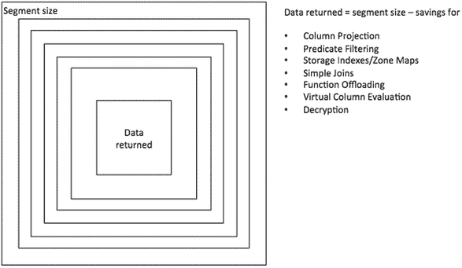

# Exadata 核心概念：卸载与性能优化

想象一下您能想到的最快的查询：从一个表中查询单个行的单个列，并且您确切知道该行存储的位置。在行式存储格式中，访问单个行的最快方式是使用所谓的 `ROWID`。它作为一个伪列外部化，`ROWID` 指示了数据对象号、数据文件号、数据块以及块中的行号。在传统的 Oracle 数据库中，至少需要将一个数据块（通常为 8K）读入内存才能获取那一列。假设您的表平均每个块存储 50 行。从磁盘读取该特定块后，您实际上向数据库服务器传输了 49 行额外的数据，这些数据对于此查询来说纯粹是开销。将其乘以十亿次，您就能开始理解在大型数据仓库中这个问题规模有多大。消除在存储层和数据库层之间传输完全不必要数据所花费的时间，正是 Exadata 旨在解决的核心问题。

## 卸载：解决方案

为了解决在各层之间移动不相关数据耗时过长的问题，采用了 **卸载** 方法。卸载有三个设计目标，尽管主要目标的重要性远超其他：

*   减少从磁盘系统传输到数据库服务器的数据量
*   降低数据库服务器上的 CPU 使用率
*   减少/消除存储层的磁盘访问时间

减少数据量是主要焦点和首要目标。卸载引入的大多数优化都致力于实现这一目标。降低 CPU 负载也很重要，但它不是 Exadata 提供的主要优势，因此相对于减少数据传输量而言处于次要地位。（然而，正如您将看到的，解压缩是这一普遍规则的一个显著例外，因为它通常在存储服务器上执行。）同时也引入了一些减少磁盘访问时间的优化。虽然某些结果可能相当惊人，但我们并不认为它们是 Exadata 的核心优化。

## 性能对比示例

Exadata 是一个集成的硬件/软件产品，它依赖于这两个组件来提供比非 Exadata 平台显著的性能提升。然而，软件组件带来的性能提升远远超过硬件带来的益处。以下是一个例子：

```
SQL> alter session set cell_offload_processing=false;

Session altered.

Elapsed: 00:00:00.00

SQL> select /*+ gather_plan_statistics monitor statement001 */
  2  count(*) from sales where amount_sold = 1;

  COUNT(*)
----------
   3006406

Elapsed: 00:00:33.15

SQL> alter session set cell_offload_processing=true;

Session altered.

SQL> select /*+ gather_plan_statistics monitor statement002 */
  2  count(*) from sales where amount_sold = 1;

  COUNT(*)
----------
   3006406

Elapsed: 00:00:04.68
```

这个例子展示了一个针对单个分区表扫描的性能。`SALES` 表是使用 Dominic Giles 的 `shwizard` 创建的，这是他流行的 Swingbench 基准测试套件的一部分。在这个特定案例中，该表有 294,575,180 行，存储在 68 个分区中。

查询首先在禁用卸载的情况下执行，这实际上使用了 Exadata 的所有硬件优势，但没有使用任何软件优势。您会注意到，即使在像这台非常强大的 X4-2 半机架这样的 Exadata 硬件上，此查询也花了半分多钟。尽管数据被条带化和镜像分布在 7 个单元（即 7 * 12 个磁盘）上，同样地，`智能闪存缓存`也拥有 7 * 3.2TB 的原始容量。

在随后执行上述脚本时，越来越多的数据被透明地缓存在`智能闪存缓存`中，将读取性能提升到了我们在早期 Exadata 软件版本中未曾梦想过的水平。在 33 秒的表扫描期间，几乎所有数据都来自闪存缓存：

```
STAT    cell flash cache read hits           31,769
STAT    physical read IO requests            31,776
STAT    physical read bytes          15,669,272,576
```

> **注意**
> 您可以在第 11 章中阅读有关会话统计信息和用于显示它们的 `mystats` 脚本的更多信息。

在本书第一版中，我们使用了一个类似的示例查询来演示启用和关闭卸载之间的差异，而且当时的差异更大——部分原因是当时的`智能扫描`默认情况下并未从`智能闪存缓存`中受益。闪存缓存中大型 I/O 请求的自动缓存将在第 5 章中详细介绍。

重新启用卸载后，查询完成的时间大大减少。显然，两次执行中使用的硬件是相同的。关键在于，正是软件通过卸载实现的能力带来了这种差异。

## 通用版本的 Exadata？

构建通用版本 Exadata 的话题经常被提及。其想法是构建一个在某种程度上模拟 Exadata 的硬件平台，其成本大概比 Oracle 对 Exadata 的收费要低。当然，这些提议的重点是复制 Exadata 的硬件部分，因为软件组件无法被复制。尽管如此，构建自己的 Exadata 听起来很有吸引力，因为单个硬件组件的购买价格可能低于 Oracle 的套件价格。然而，有几点需要考虑。在深入更多细节之前，应该先指出两种通用工作负载类型：`OLTP`（代表在线事务处理）和 `DSS`（代表决策支持系统）。Exadata 在推出时是为后者设计的，但重要的增强使其现在能够与纯 `OLTP` 平台竞争。更重要的是，Exadata 可以用于混合工作负载环境，而这正是大多数其他平台会遇到困难的领域。在考虑“自己动手”构建系统时，让我们关注几个值得注意的点：


## Exadata 硬件与软件优势分析

最受关注的硬件组件是 `Flash Cache`（闪存缓存）。你可以购买具有大容量缓存的 `SAN` 或 `NAS`。标准配置下的中型 `Exadata` 套装（`半机架`）在各存储服务器上提供约 `44.8` TB 的 `Flash Cache`。这是一个相当庞大的数字，但缓存的内容与缓存本身的大小同等重要。`Exadata` 足够智能，不会缓存那些不太可能从缓存中受益的数据。例如，缓存数据块的镜像副本并无帮助，因为 Oracle 通常只读取主副本（除非检测到损坏）。Oracle 在编写软件管理缓存方面有着悠久的历史。因此，当进行大表扫描时，它能够出色地处理，避免将所有数据刷新出去，从而使频繁访问的数据块倾向于保留在缓存中，这不足为奇。这种具备数据库感知能力的缓存所带来的结果是，一个普通的 `SAN` 或 `NAS` 需要大得多的缓存才能与 `Exadata` 的 `Flash Cache` 竞争。同时请记住，在非 `Exadata` 存储上，你需要存储的数据量将会大得多，因为你无法使用 `混合列式压缩 (HCC)`。

硬件更重要的方面——奇怪的是，在 DIY 方案中偶尔被忽视——是存储层与数据库层之间的吞吐量。`Exadata` 硬件堆栈在存储服务器和数据库服务器之间提供了比大多数当前实现更平衡的通道，因此第二个关注点通常是各层之间的带宽。增加存储与数据库服务器之间的有效吞吐量并不像听起来那么简单。`Exadata` 通过 `InfiniBand` 和 `可靠数据报套接字 (RDS)` 协议提供增加的吞吐量。Oracle 开发了 `iDB` 协议以在 `InfiniBand` 网络上运行。`iDB` 协议对于运行在非 `Exadata` 硬件上的数据库是不可用的。因此，需要一些其他方法来增加各层之间的带宽。对于大多数用户来说，这意味着在撰写本文时，要么选择通过 `10Gbit 以太网` 走 `以太网` 路线（`iSCSI`、`NFS`）。无处不在的 `光纤通道` 也提供了 `16Gbit/s` 范围内的替代方案。无论如何，你都需要在服务器中安装多个接口卡（这些卡需要通过快速总线连接）。存储设备（或多个设备）也必须能够提供足够的输出以匹配通道和消耗能力。（这就是 Oracle 谈及平衡配置时所指的含义，通过标准机架设置你可以获得这一点，与之相对的是 `X5-2 弹性配置`）。你还需要决定使用哪些硬件组件，并测试整个解决方案，以确保你选择的所有不同部分都能良好协作，在从磁盘到数据库服务器的路径上不会出现任何重大瓶颈或驱动程序问题。对于 `InfiniBand` 的使用尤其如此，它已变得更加普遍。`SCSI RDMA` 是一种非常有吸引力的协议，可以有效地连接存储，但从存储系统到 `HCA` 再到内核中 `OFED` 驱动程序的认证可能会使整个工作变得相当费力。

DIY 方案通常会涉及的第三个组件是数据库服务器本身。`Exadata` 硬件规格是公开可用的，因此购买完全相同的 `Sun` 型号是件简单的事。不幸的是，你可能需要规划更强的 CPU 处理能力，因为你无法将任何处理卸载到 `Exadata` 存储服务器的 CPU 上。这反过来又会增加 Oracle 数据库许可证的数量。你可能还需要在内存上投入更多，因为你无法依赖 `智能扫描` 来减少从你选择的存储解决方案传输的数据量。另一方面，当涉及在你的平台上整合许多数据库时，你可能发现早期 `dash two` 系统中的 CPU 核心数量有限。然而，始终有一个选择是使用 `dash eight` 服务器，它提供了 `x86-64` 架构下一些最密集封装的系统。Oracle 每一代都增加了核心数量，与 Intel 提供的双路系统进步相匹配。当前一代的 `X5-2` `Exadata` 系统提供双路系统，具有 `36` 核心/ `72` 线程。

最后但同样重要的是，需要再次强调 `HCC` 的优势。正如你可以在第 3 章中读到的那样，`HCC` 非常值得考虑——不仅从减少存储的角度，还因为它有可能在无需在数据库会话中解压缩的情况下扫描数据，从而再次释放 CPU 周期（见第 3 点）。得益于 `HCC` 段中采用的列式格式，它也能非常高效地执行分析查询。

假设有人能在各个方面匹配 `Exadata` 的硬件性能，仍然无法接近 `Exadata` 提供的性能。这是因为 `Exadata` 性能优势的主要部分是由（`cell`）软件提供的。`Exadata` 软件的优势很容易通过在 `Exadata` 上禁用卸载功能并进行对比测试来证明。这个演示让我们可以看到没有软件增强情况下的硬件性能。`Exadata` 软件所做的很大一部分工作是彻底消除完全不必要的工作，例如将最终会被丢弃的列和行传输回数据库服务器。

正如俗话所说：

```
“做任何事情最快的方法就是根本不去做它！”
```


## 卸载（Offloading）包含的内容

有许多优化都可以归类在**卸载**（offloading）的大旗下。本章将重点介绍通过**智能扫描**（Smart Scans）实现的 SQL 语句优化。主要的智能扫描优化包括列投影（column projection）、谓词过滤（predicate filtering）和存储索引（storage indexes）（当然还有更多！）。大多数智能扫描优化的主要目标是减少在扫描执行期间需要传回数据库服务器的数据量。然而，有些优化也试图卸载 CPU 密集型操作——例如解压缩。本章不会讨论与 SQL 语句处理无关的优化，例如智能文件创建（Smart File Creation）和与 RMAN 相关的优化。这些主题将在本书的其他地方详细介绍。为了让你更好地了解即将介绍的内容，图 2-1 展示了对某个段（segment）进行智能扫描时可以看到的累计特性。



图 2-1. 潜在的智能扫描优化

这些特性并非必然适用于每一个查询，也不一定按那个顺序应用。因此，“返回数据量”是一个动态目标。正如你可以在第 10 章中读到的，智能扫描的仪表化（instrumentation）并不完美，有些细节有待完善。接下来的几节将讨论图 2-1 中发现的各种优化。

一个图 2-1 中未列出的、非常重要变化发生在 Exadata 11.2.3.3.0 版本。这个变化被称为“针对表扫描工作负载的自动闪存缓存”（Automatic Flash Caching for Table Scan Workloads），对查询性能有显著影响。以前，除非通过将段的存储子句中的`cell_flash_cache`属性设置为`KEEP`来特别标记该段以使用它，否则智能扫描不会利用 Exadata 智能闪存缓存（Exadata Smart Flash Cache）。这主要有两个目的：首先，在早期的 Exadata 型号中，闪存缓存的容量并不充裕；其次，可用空间更好地用于以小的、单块 I/O 为主的 OLTP 型工作负载。在更新的 Exadata 型号中，有更多的闪存缓存可用；每一代新产品的容量都会翻倍。目前，X5-2 高容量存储服务器具有 4 个通过 NVMe 连接到 PCIe 总线的 1.6TB F160 闪存卡。X5-2 高性能存储服务器是第一个只配备 PCIe 闪存卡而没有旋转磁盘的型号。

在以下章节中，我们偶尔使用性能信息来证明某个观点。请不要因此感到困惑。第 10 章到第 12 章将比我们在这里能提供的更详细地解释这些内容。在讨论卸载时，作者有时会面临棘手的“鸡生蛋还是蛋生鸡”问题。另一方面，也不可能写一个 100 页的章节来包含所有可能相关的内容。请随意在本章和刚才提到的性能章节之间翻阅，或者简单地将性能计数器视为额外的、希望有用的见解。

> **注意**
>
> 作者在本节中会大量使用下划线参数（underscore parameters）来启用/禁用 Exadata 系统的某些方面。这些参数仅用于教育和学术目的列出，以及演示特定优化的效果。请勿在没有 Oracle 支持明确许可的情况下在 Oracle 系统中设置任何下划线参数。

### 列投影（Column Projection）

术语“列投影”指的是 Exadata 通过仅返回感兴趣的列（即那些在选择列表中或对数据库层上的连接操作必需的列）来限制在存储层和数据库层之间传输的数据量的能力。如果你的查询从一个 100 列的表中请求 5 列，Exadata 可以消除非 Exadata 存储将返回给数据库服务器的大部分数据。这个特性比你想象的要重要得多，并且它对响应时间可能有非常显著的影响。下面是一个示例：

```sql
SQL> alter session set "_serial_direct_read" = always;
Session altered.
Elapsed: 00:00:00.00

SQL> alter session set cell_offload_processing = false;
Session altered.
Elapsed: 00:00:00.00

SQL> select count(distinct seller) from sales;
COUNT(DISTINCTSELLER)
---------------------
1000
Elapsed: 00:00:53.55

SQL> alter session set cell_offload_processing = true;
Session altered.
Elapsed: 00:00:00.01

SQL> select count(distinct seller) from sales;
COUNT(DISTINCTSELLER)
---------------------
1000
Elapsed: 00:00:28.84
```

这个例子值得讨论一下。为了强制直接路径读（direct path reads）——这是智能扫描的先决条件——会话参数`_SERIAL_DIRECT_READ`被设置为`ALWAYS`（稍后会详细介绍）。接下来，通过将`CELL_OFFLOAD_PROCESSING`设置为`FALSE`来明确禁用智能扫描。你可以看到测试查询没有`WHERE`子句。这也是故意为之。这意味着谓词过滤和存储索引不能被用来减少必须从存储层传输的数据量，因为这两种优化只有在有`WHERE`子句时才能进行。这样，列投影就成了唯一生效的优化。列投影单独就能将查询的响应时间减半，这让你感到惊讶吗？我们第一次看到时也很惊讶，但仔细想想就有道理了。而且，在这种特定情况下，该表只有 12 列！

```sql
SQL> @desc sh.sales
Name                      Null?        Type
-------------------------  -----------  ------------
1      PROD_ID             NOT NULL     NUMBER
2      CUST_ID             NOT NULL     NUMBER
3      TIME_ID             NOT NULL     DATE
4      CHANNEL_ID          NOT NULL     NUMBER
5      PROMO_ID            NOT NULL     NUMBER
6      QUANTITY_SOLD       NOT NULL     NUMBER(10,2)
7      SELLER              NOT NULL     NUMBER(6)
8      FULFILLMENT_CENTER  NOT NULL     NUMBER(6)
9      COURIER_ORG         NOT NULL     NUMBER(6)
10     TAX_COUNTRY         NOT NULL     VARCHAR2(3)
11     TAX_REGION                       VARCHAR2(3)
12     AMOUNT_SOLD         NOT NULL     NUMBER(10,2)
```

你应该意识到，选择列表中的列并不是唯一必须返回到数据库服务器的列。这是一个非常普遍的误解。`WHERE`子句中的连接列也必须返回。事实上，在早期的 Exadata 版本中，列投影功能并不像它本可以做到的那样有效，实际上会返回`WHERE`子句中包含的所有列，这在许多情况下包括了一些不必要的列。

`DBMS_XPLAN`包可以显示关于列投影的信息，尽管默认情况下不会显示。投影数据也存储在`V$SQL_PLAN`视图的`PROJECTION`列中。下面是一个示例：

```sql
SQL> select /*+ gather_plan_statistics */
  2   count(s.prod_id), avg(amount_sold)
  3  from sales_nonpart s, products p
  4  where p.prod_id = s.prod_id
  5  and s.time_id = DATE '2013-12-01'
  6  and s.tax_country = 'DE';

COUNT(S.PROD_ID) AVG(AMOUNT_SOLD)
---------------- ----------------
            124       51.5241935
Elapsed: 00:00:00.09
```


