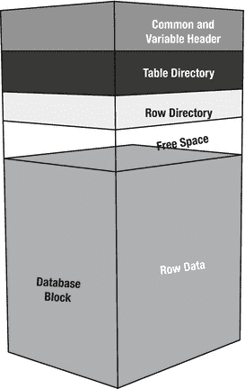
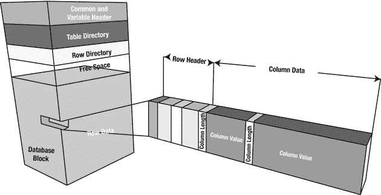
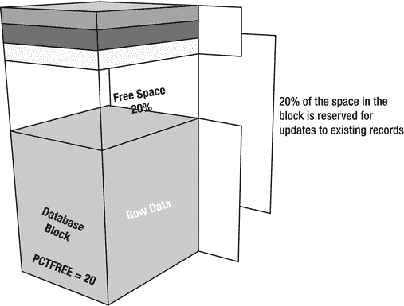
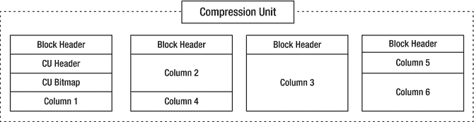

# 3. 混合列式压缩

混合列式压缩，或简称`(E)HCC`，曾经可能是`Exadata`中最被误解的功能之一，现在或许依然如此。自本书第一版以来，这一点并未真正改变，这也是我们如此强调它的原因。`HCC`最初是`Exadata`独有的功能，但现在其使用已面向更广泛的受众。在撰写本文时，任何想要使用`HCC`的人都必须使用`Exadata`或`Oracle ZFS Storage Appliance`。`Pillar Axiom`系列存储阵列也原生支持处理`HCC`压缩数据，无需先解压缩。`Oracle`最新的存储产品`FS1`阵列，其规格表中也包含`HCC`功能。然而，能够卸载扫描`HCC`数据仍然是`Exadata`存储服务器的专属领域。

本章分为三个主要部分：

*   Oracle 如何在磁盘上物理存储数据的介绍
*   `HCC`背后的概念及其实施
*   常见用例和自动化数据生命周期管理

在本章的第一部分，您将更多地了解`Oracle`数据库在所谓的“行式存储”格式中存储信息的方式。它解释了`Oracle`数据库块的结构以及两种可用的压缩方法：`BASIC`和`ADVANCED`。

在继续下一部分之前，了解`Oracle`块的剖析很重要，该部分介绍了`HCC`特有的“列式存储”格式。如果您好奇`HCC`中的“混合”之意，我们也将对此进行解释。然后，我们将讨论数据实际如何存储在磁盘上，以及压缩和解压缩将在何时何地发生。我们还将解释`HCC`压缩数据与传统的`I/O`执行方式相比，对`Smart Scans`的影响。

本章最后部分致力于介绍新的`Automatic Data Optimization`选项，该选项有助于自动化和强制实施数据生命周期管理。

## Oracle 存储概述

如您可能已经知道，`Oracle`将数据存储在块结构中。如今这些块通常是`8k`。您在数据库创建期间定义默认块大小。在数据库创建后更改默认块大小即使不是不可能，也是非常困难的。有充分的理由在数据库中坚持使用`8k`块大小，因为`Oracle`似乎对其大部分回归测试都是针对该块大小进行的。而且，如果您确实需要，仍然可以创建具有不同（通常更大）块大小的表空间。

数据库块在更大的图景中处于什么位置？块是`Oracle`中最小的物理存储单元。多个块形成一个区（extent），多个区组成一个段（segment）。段是您在数据库中处理的对象，例如表、分区和子分区。

简单来说，块由头部、表目录、行目录、行数据和空闲空间组成。行头部从块的顶部开始并向下延伸，而行数据从底部开始并向上延伸。图 3-1 详细显示了标准`Oracle`块的各个组件。



图 3-1.

标准的`Oracle`块格式（行式存储）

行的存储没有特定顺序，但列通常按照它们在该表中定义的顺序存储。对于块中的每一行，都会有一个行头部，然后是每个列的列数据。图 3-2 显示了行片段如何在标准`Oracle`块中存储。请注意，它被称为行片段（row piece），因为偶尔一行的数据可能存储在多个块中。在这种情况下，会有一个指向下一个行片段的指针。第 11 章 将非常详细地介绍其影响。



图 3-2.

标准的`Oracle`行格式（行式存储）

请注意，行头部可能包含指向另一个行片段的指针。稍后将对此进行更多说明，但现在，只需意识到存在一种指向另一位置的机制。另请注意，每个列前面都有一个单独的字段，指示列的长度。对于`NULL`值，列值字段中实际上没有存储任何内容。空列的存在由列长度字段中的值 0 表示。尾随的`NULL`列甚至不存储列长度字段，因为新行头部的出现表明当前行中没有更多具有值的列。

`PCTFREE`是与块相关的关键值；它控制在插入数据时块被认为已满之前使用了多少空间。其目的是在每个块中保留一些空闲空间用于（未来的）更新。这对于防止行迁移（将行移动到新块）是必要的，行迁移是由于行原始块中空间不足，而行大小增加所引起的。当预期行将被更新为需要更多空间的值时，数据库管理员可以通过设置更高的`PCTFREE`来保留更多空间。当行由于更新预计不会增加大小时，`PCTFREE`可以指定低至 0 的值。对于压缩块，通常使用非常低的`PCTFREE`值，因为目标是最大限度地减少空间使用，并且通常不预期更新行。图 3-3 显示了如何根据`PCTFREE`的值保留空闲空间。



图 3-3.

由`PCTFREE`控制的块空闲空间

图 3-3 显示了一个为其更新保留 20%空间的块。`PCTFREE`设置为 0%的块将允许插入几乎完全填满该块。当记录被更新且新数据不适合存储该记录的块中的可用空闲空间时，数据库会将该行移动到一个新块。此过程称为前述的行迁移。它不会将行从原始块中完全移除，而是留下一个对新定位行的引用，以便仍可以通过其原始`ROWID`找到它。`ROWID`格式定义了数据库查找行的方式。它由数据对象编号、数据文件编号、数据块以及块中的行组成。可以通过在查询表时指定`ROWID`伪列来外部化`ROWID`。`Oracle`提供了一个名为`DBMS_ROWID`的包，允许您解析`ROWID`并提取您需要的相关信息位。当您想通过将数据库块转储到跟踪文件来调查其内部结构时，`ROWID`格式将变得重要。

请注意，将行存储在多个片段中的更通用术语是行链接（row chaining）。行迁移是行链接的一种特殊情况，其中整个行被重新定位。行链接和迁移的示例将在本书的第 11 章中介绍。


## 解析 Oracle 数据块

到目前为止，您只阅读了相关概念，但我们也会尽可能地加以证明。当您开始查看数据块转储时，就能在行头中找到所有行链接的案例。您可以使用 `alter system dump datafile x block y` 语法转储数据块。尽管该命令并未官方记载，但有许多资料解释了这项技术。以下是一个数据块转储的小片段示例，其中行完全包含在同一个数据块中。为清晰起见，大部分数据块转储信息已被移除。

```
block_row_dump:
tab 0, row 0, @0x1f92
 tl: 6 fb: --H-FL-- lb: 0x2  cc: 1
 col  0: [ 2]  c1 02
tab 0, row 1, @0x1f8c
 tl: 6 fb: --H-FL-- lb: 0x0  cc: 1
 col  0: [ 2]  c1 03
```

表定义被刻意保持为最低限度，表中仅有一个数据类型为 `NUMBER` 的列（名为“ID”）。本次转储中与本讨论相关的关键信息是行头中的标志位：根据 David Litchfield 的文章《Oracle 数据库数据块》，行头中的标志字节 (`fb`) 可设置以下位：

*   K = 集群键
*   C = 集群表成员
*   H = 行的头部片段
*   D = 已删除的行
*   F = 首个数据片段
*   L = 最后一个数据片段
*   P = 第一列从前一片段延续而来
*   N = 最后一列在下一片段中延续

在此数据块转储的上下文中，位 `H`、`F` 和 `L` 已设置，分别对应头部片段、首个片段和最后一个片段。换句话说，后续的列数据足以读取整行。

### 通过 ROWID 高效查找的原理

但在进行行查找时，Oracle 如何知道该读取数据块中的什么内容呢？Oracle 在每个数据块中记录了能找到多少个表。通常，您只会找到一个表，但在某些特殊情况下，例如 `BASIC`/`ADVANCED` 压缩数据块或集群表，您可能会找到两个。以 `tab 0, row 0...` 开头的行引用数据块中的第一个表，而 row 0 的含义不言自明。`@` 符号后的十六进制数是数据块内的偏移量。

为了更好地理解偏移量的重要性，您需要查看行目录之前的头部结构。位于行目录之前的表目录列出了数据块中的行及其位置。结合表目录和行目录，Oracle 可以找到目标行，并直接跳转到上述数据块转储输出中显示的行目录中的偏移量——这就是通过 `ROWID` 进行查找如此高效的原因之一！对于上面展示的数据块转储，表目录（加上数据头中的一些细节）如下所示：

```
ntab=1
nrow=2
frre=-1
fsbo=0x16
fseo=0x1f8c
avsp=0x1f70
tosp=0x1f70
0xe:pti[0]      nrow=2  offs=0
0x12:pri[0]     offs=0x1f92
0x14:pri[1]     offs=0x1f8c
```

为了定位行，Oracle 需要找到数据块中表 0 的偏移量，并通过该偏移量定位行。对于第一行，偏移量是 `0x1f92`。这可以在行数据中找到：

```
tab 0, row 0, @0x1f92
```

这解释了为什么通过 `ROWID` 进行表查找如此快速高效。

### 迁移行和链式行分析

另一方面，迁移行仅设置了头部片段，没有设置其他标志位。以下是另一个表的例子：

```
block_row_dump:
tab 0, row 0, @0x1f77
 tl: 9 fb: --H----- lb: 0x3  cc: 0
 nrid:  0x00c813b6.0
tab 0, row 1, @0x1f6e
 tl: 9 fb: --H----- lb: 0x3  cc: 0
 nrid:  0x00c813b6.1
```

如果您仔细查看转储内容，会注意到一条额外的信息。这些行有一个 `NRID` 或下一个 `ROWID`。这就是指向行延续所在数据块的指针。`NRID` 指针存在于所有链式行中，包括迁移行。

### 解码 NRID 指针

要解码 `NRID`，您可以使用 `DBMS_UTILITY` 包。但需注意——`NRID` 采用十六进制格式编码，需要先转换为十进制值。此外，即使在 12c 版本中，它似乎也不适用于大文件表空间，这是一个限制。`NRID` 格式以 “.x” 结尾，其中 x 是行号。要定位 `NRID` `0x00c813b6.0` 所在的数据块，您可以使用此脚本（该表位于小文件表空间上）：

```
SQL> !cat nrid.sql
select
  dbms_utility.data_block_address_file(to_number('&1','xxxxxxxxxxxx')) file_no,
  dbms_utility.data_block_address_block(to_number('&1','xxxxxxxxxxxx')) block_no
from dual;
SQL> @nrid 00c813b6
   FILE_NO   BLOCK_NO
---------- ----------
         7     529334
```

因此，该行延续在数据文件 7，块 529334 中。

一行可以起始于一个数据块，并在另一个数据块（甚至多个数据块）中延续，这种现象称为链式行。这里展示一个例子。该行起始于 `DBA`（数据块地址）为 `0x014000f3` 的数据块：

```
tab 0, row 0, @0x30
 tl: 8016 fb: --H-F--N lb: 0x0  cc: 1
 nrid:  0x014000f4.0
 col  0: [8004]
```

您可以看到行的开始（头部片段和首个片段）以及表明该行在别处延续（`Next`）的指示。`NRID` 指向 `DBA` `0x014000f4`，并在行 0 中延续。

```
tab 0, row 0, @0x1f
 tl: 8033 fb: ------PN lb: 0x0  cc: 1
 nrid:  0x014000f5.0
```

在这里，您看到该行有一个 `Previous` 片段，并且在 `DBA` `0x014000f5` 中还有一个 `Next` 片段待续，同样是行 0。这是一个严重的链式行案例，因为它跨越了两个以上的数据块。在几个行片段之后，我们找到了最后剩下的片段：

```
tab 0, row 0, @0x1d7c
 tl: 516 fb: -----LP- lb: 0x0  cc: 1
```

标志字节中的 `L` 表示这是 `Last` 片段；`P` 标志表示存在 `Previous` 行片段。巧合的是，这就是 `HCC` 超级块，即所谓的压缩单元（`CU`）的构建方式。在之前的例子中，一行被“分散”在多个数据块中，这在行主序格式中通常是不希望出现的。然而，对于采用列主序格式的 `HCC`，您会发现这是一个非常巧妙的设计，并且对性能完全没有损害。您可以稍后了解更多关于这些压缩单元的信息，但首先让我们关注 `HCC` 出现之前可用的压缩机制。

### 压缩机制

`HCC` 是 Oracle 中一项相对较新的压缩技术。在它引入之前，您可以使用不同的压缩机制。这些技术的命名随时间有所变化，而且确实有些令人困惑。使用它们的语法似乎也随着每个版本而改变。为了保持一个共同的基准，将使用 `BASIC`、`OLTP` 和 `HCC` 这些名称。


### BASIC 压缩

顾名思义，BASIC 压缩是 Oracle 的一项标准特性。要使用 BASIC 压缩，必须使用直接路径方法将数据行加载到表中。直接路径加载基本上绕过了 SQL 引擎和 Oracle 内置的事务机制，在段的高水位线之上或一个替代的“临时”段中插入数据块。更具体地说，在直接路径插入期间，不使用缓冲区缓存。直接路径加载操作完成后，必须在其他人能对表应用 DML 之前提交事务。这是对更快加载过程的一种妥协：

```sql
SQL> insert /*+ append */ into destination select * from dba_objects;

20543 rows created.

SQL> select * from destination;

select * from destination
             *
ERROR at line 1:
ORA-12838: cannot read/modify an object after modifying it in parallel
```

这是将 BASIC 压缩用于除归档之外的任何用途的主要障碍。另一个“问题”是，对数据的更新会导致更新后的行以未压缩形式存储。对于不使用直接路径加载机制的插入，情况也是如此。

在 Oracle 发布 HCC（混合列压缩）之前，行一直以刚刚所示的格式存储——即所谓的行式存储格式。行式存储格式的对立面是新的 HCC 特有的列式存储格式，你将在本章后面读到相关内容。所有 BASIC 压缩的数据都将自包含地存储在 Oracle 块中。如果要创建启用 BASIC 压缩的表，可以在创建表时或之后进行：

```sql
SQL> create table T ... compress;

SQL> alter table T compress;
```

请注意，将表从非压缩状态更改为 `compress` 并不会压缩其中已存储的数据。你必须先“移动”该表，这会导致数据被压缩。移动表的命令不需要指定表空间，从而允许你将表保留在原处。BASIC 压缩在 Oracle 9i 中引入。这种形式的压缩也称为决策支持系统压缩。实际上，“压缩”这个词有点误导性。BASIC 压缩（以及 OLTP 压缩）使用去重方法来减少要存储的数据量。有关此压缩算法的细节将在下一节讨论。

### OLTP 压缩

OLTP 压缩是 Oracle 11g Release 1 推出的创新特性之一，但与 BASIC 压缩不同，其使用需要拥有“高级压缩选项”的许可。“高级压缩选项”不仅限于数据库块压缩，它能做的更多。Oracle 的一份白皮书描述了所有用例，你将在本章后面再次遇到它。尽管该特性在 Oracle 12c 中已重命名为“高级行压缩”，但我们决定沿用其旧称，因为我们已经非常习惯了。

回顾上一节关于 BASIC 压缩的内容，你需要使用直接路径操作才能从任何压缩中受益。这一要求使得对表和分区使用压缩变得非常困难，尤其是当它们正频繁进行 DML 操作时。如果不在这些操作上使用直接路径，那么你将以不压缩为代价来提高并发性。如果你为了节省存储空间而牺牲并发性，则必须更改代码并在访问段后立即提交。这两种选择都不是解决方案，尤其是最后一种。OLTP 压缩消除了这个痛点。使用 OLTP 压缩，你不需要为插入操作使用直接路径，却仍能受益于压缩。并且与默认不为块中未来更新留出空间的 BASIC 压缩不同，OLTP 压缩会这样做。

从概念上讲，你开始向一个新块中插入数据。最初行未被压缩。只有当达到阈值时，块才会被压缩。这应该会释放块中的一些空间，并且该块可能最终再次可用于 DML。随着更多行的插入，再次达到阈值，数据被压缩，如此循环往复，直到块被充分利用和压缩。

使用 OLTP 压缩的语法已经改变；以下是 11g Release 1、Release 2 和 12c Release 1 的示例：

```sql
SQL> -- 11.1 syntax
SQL> create table T ... compress for all operations;

SQL> -- 11.2 syntax
SQL> create table T ... compress for OLTP;

SQL> -- 12.1 syntax
SQL> create table T ... row store compress ADVANCED;
```

12c Release 1 中的解析器是向后兼容的，但你应该努力将脚本更新为新语法，因为旧的 DDL 语句已被弃用。

OLTP 压缩非常重要，即使你主要打算使用 HCC 进行压缩，因为它是任何先前存储在 HCC 压缩段中的更新行的回退压缩方法。无法对 HCC 压缩数据进行就地更新。相反，行会被迁移到一个 OLTP 压缩块中，该块最初可能因大部分为空而未被压缩。

从技术角度来看，BASIC 和 OLTP 压缩是相同的。Oracle 使用去重方法，即用符号替换相同数据的出现。读取表时必须查找该符号；因此，从技术上讲，你在 OLTP 压缩块中找到了两个表。第一个表包含符号表，而第二个表包含“真实”数据。块转储——再次简化到最低必要限度——显示如下：

```
bdba: 0x01437a2b
...
ntab=2
nrow=320
...
r0_9ir2=0x0
mec_kdbh9ir2=0x1c
76543210
shcf_kdbh9ir2=----------
76543210
flag_9ir2=--R---OC      Archive compression: N
fcls_9ir2[0]={ }
perm_9ir2[18]={ 8 16 0 17 15 14 10 13 11 1 5 6 2 12 3 4 9 7 }
0x28:pti[0]     nrow=53 offs=0
0x2c:pti[1]     nrow=267        offs=53
block_row_dump:
tab 0, row 0, @0x1dd6
tl: 7 fb: --H-FL-- lb: 0x0  cc: 15
col  0: *NULL*
col  1: [ 5]  56 41 4c 49 44
col  2: [ 1]  4e
col  3: *NULL*
col  4: [ 4]  4e 4f 4e 45
col  5: [ 1]  4e
col  6: [ 1]  4e
col  7: [ 1]  59
col  8: [ 3]  53 59 53
col  9: *NULL*
col 10: [ 7]  78 71 07 11 16 3c 0a
col 11: [19]  32 30 31 33 2d 30 37 2d 31 37 3a 32 31 3a 35 39 3a 30 39
col 12: [ 2]  c1 05
col 13: [ 7]  78 71 07 11 16 3c 0a
col 14: [ 5]  49 4e 44 45 58
bindmp: 00 55 0f 0e 20 1d 23
...
tab 1, row 0, @0x1dae
tl: 14 fb: --H-FL-- lb: 0x0  cc: 18
col  0: *NULL*
col  1: [ 5]  56 41 4c 49 44
col  2: [ 1]  4e
col  3: *NULL*
col  4: [ 4]  4e 4f 4e 45
col  5: [ 1]  4e
col  6: [ 1]  4e
col  7: [ 1]  59
col  8: [ 3]  53 59 53
col  9: *NULL*
col 10: [ 7]  78 71 07 11 16 3c 09
col 11: [19]  32 30 31 33 2d 30 37 2d 31 37 3a 32 31 3a 35 39 3a 30 38
col 12: [ 2]  c1 02
col 13: [ 7]  78 71 07 11 16 3c 09
col 14: [ 5]  54 41 42 4c 45
col 15: [ 2]  c1 03
col 16: [ 5]  49 43 4f 4c 24
col 17: [ 2]  c1 15
bindmp: 2c 00 04 03 1c cd 49 43 4f 4c 24 ca c1 15...
```

上述输出中需要注意的要点已用粗体标出。首先，可以看到块中有两个表，总共有 320 行。`pti[0]` 和 `pti[1]` 处的 `ROWID` 解释了每个表的行数和表偏移量。表 0 是符号表，并由“真实”表（表 1）中的 `bindmp` 引用。如何使用 `bindmp` 在符号表中定位符号的算法超出了本次讨论的范围。如果你想了解更多关于将符号表映射到数据表以及如何像 Oracle 那样读取行数据的内容，请参考 Jonathan Lewis 的系列文章“Compression in Oracle”。


#### 混合列压缩

经过这么多介绍之后，你终于来到了本章的核心部分——混合列压缩。如前所述，使用 `HCC` 要求你必须使用 Exadata 或 Oracle `ZFS 存储设备`，或者 Pillar `Axiom` 或 `Oracle FS1` 存储阵列。回顾关于智能扫描的章节（第 2 章），一个表空间必须完全存储在 Exadata 存储服务器上才有资格进行卸载处理。

虽然你可以在 Exadata 之外使用前述存储系统来操作 `HCC` 压缩数据，但无法在这些设备上获得智能扫描。因此，如果你没有使用上述任何存储设备，那就不太走运了。尽管 `RMAN` 可以愉快地恢复 `HCC` 压缩数据，但在压缩状态下访问它是不行的，你必须在使用前先解压（前提是空间允许）。如果你指定了 `TRANSFORM` 参数的 `TABLE_COMPRESSION_CLAUSE`，例如将表压缩设置为 `NOCOMPRESS`，那么导入 `HCC` 压缩表是可行的。不过，这是 `12c` 的功能。

```
[oracle@enkdb03 ∼]$ impdp ... transform=table_compression_clause:nocompress
```

另一方面，这可能需要大量空间。

### “混合列压缩”中的“混合”是什么意思？

大多数关系数据库系统以面向行的格式存储数据。对 Oracle 块的讨论阐述了这一概念：Oracle 数据库块包含行。每行有多个列，Oracle 通过读取行、定位列、读取值（如果存在）并将该值显示给最终用户来访问这些列。Oracle 数据库引擎操作的基本单位是行。通过 `ROWID` 进行行查找——或基于索引的查找——对于大多数通用型和 `OLTP` 查询引擎来说非常高效。另一方面，如果你只想要表中的一列，并可能对该列的所有值执行聚合操作，就会产生显著的额外开销。你的表越“宽”（换句话说，它包含的列越多），如果你想只检索并处理单个列，产生的开销就越大。

列式数据库引擎对列而非行进行操作，从而减少了上述开销。与标准的 Oracle `8kb` 块不同，列式数据库很可能采用更大的块大小，是我们从 Oracle 引擎中已知的 `8k` 的倍数。它还可能将列的值存储在一起（协同定位），并且可能在其存储列的方式中已经包含了大量优化。这很可能使得列式访问非常快。引擎无需读取整行来提取单个列的值，而是可以遍历一个相对较大的块，并通过多块操作检索多个值。因此，列式数据库更倾向于面向分析或以读取为主的工作负载。列式数据库在设计上无法擅长行查找。为了读取完整的行，必须为表中的每一列读取多个相对较大的存储块。因此，列式数据库不太擅长 `OLTP` 工作负载中常见的（整行）`ROWID` 查找。

Oracle 混合列压缩结合了列式数据组织的优势，因为它将列单独存储在一种新的存储类型中，即所谓的压缩单元或 `CU`。但与纯列式数据库不同，它并不忽视通过索引 `ROWID` 访问表的路径来检索信息。`CU` 以多个标准 Oracle 块的形式连续写入磁盘。属于同一行的信息位于同一个 `CU` 内，这允许 Oracle 盲目地发出一个或两个与 `CU` 大小匹配的读取请求，并确保行信息已被检索。正如你将在本章后面看到的，Exadata 以两种模式之一访问 `HCC` 压缩数据：面向块的模式或通过智能扫描。

### 利用混合列压缩

`HCC` 压缩要求你使用直接路径操作（又来了！），就像使用 `BASIC` 压缩一样。这听起来像是从 `OLTP` 压缩可能实现的功能倒退了一步，但根据我们的经验，事实并非如此。关于 `HCC` 还有一些值得了解的更多内容，你将在接下来的几段中读到，这些内容阐述了为什么 `HCC` 需要与精心设计的数据生命周期管理策略结合使用。常规的插入和更新操作会导致记录存储在 `HCC` 特定的 `CU` 之外，而删除操作只会导致更新 `CU` 的头部信息。在更新的情况下，行将迁移到标记为 `OLTP` 压缩的新块中。任何这些标记为 `OLTP` 压缩的新块不一定立即被压缩。如果它们没有填充到内部阈值，那么最初什么也不会发生，导致段大小随着更新的行数成比例地增长。

使用 `HCC`，你可以从四种不同的压缩类型中选择，如表 3-1 所示。请注意，预期的压缩比是非常粗略的估计值，你的数据的实际压缩比可能与这些数字有显著差异。

表 3-1. HCC 压缩类型

| 压缩类型 | 描述 | 预期压缩比 |
| --- | --- | --- |
| 查询低 | `HCC` 级别 1 使用算法 1。截至 Oracle `12.1`，这是 `LZO` (Lempel–Ziv–Oberhumer) 压缩算法。此级别提供最低的压缩比，但压缩和解压操作所需的 CPU 最少。该算法针对最大化速度进行了优化（特别是针对行级访问）。使用此算法的解压非常快。 | 4 倍 |
| 查询高 | `HCC` 级别 2 在 Oracle `12.1` 中使用 `ZLIB` (`gzip`) 压缩算法。 | 6 倍 |
| 归档低 | `HCC` 级别 3 使用与查询高相同的压缩算法，但压缩级别更高。然而，根据数据的不同，其压缩比可能不会显著超过查询高。 | 7 倍 |
| 归档高 | `HCC` 级别 4 压缩在 `12.1` 中使用 `Bzip2` 压缩算法。这是可用的最高压缩级别，但也是迄今为止 CPU 密集度最高的。压缩时间通常比级别 2 和 3 慢好几倍。但同样，根据数据的不同，压缩比可能不会比归档低高很多。此级别适用于监管机构要求你保持数据在线，而否则你本会将其归档到三级存储的情况。使用此算法压缩的数据是真正“冷”的，很少被访问。 | 12 倍 |

压缩算法

表 3-1 中列出的各种压缩算法的实现细节仅在撰写本文时是当前的。Oracle 保留更改算法的权利，并以通用术语进行引用。实际的实现对管理员来说意义不大，因为无论如何都无法控制它们。不变的事实是，压缩级别越高，算法就越激进。在此上下文中，“激进”指的是数据体积可以被缩减的有效程度，并且激进程度与所需的 CPU 成正比。你可以在本章后面阅读关于压缩数据实际机制的更多内容。

对压缩算法 (`LZO`、`GZIP`、`BZIP2`) 的引用都是从 Oracle 代码中的函数名称推断出来的。`ORADEBUG` 工具帮助打印了压缩数据会话的短堆栈跟踪。例如，以下是 `ARCHIVE HIGH` 压缩的 `create table` 语句的短堆栈：

```
BZ2_bzCompress()+144<-kgccbzip2pseudodo()+136<-kgccdo()+51<-kdzc_comp_buffer()+371<-kdzc_comp_colgrp()+595<-kdzc_comp_unit()+1598<-kdzc_comp_full_unit()+80<-kdzcompress()
```


有趣的是，但另一方面也不足为奇，本书第一版中的代码已经发生了变化。如果你发现以 `kdz` 开头的函数引用，那么它们极有可能是用于 HCC 的。

## 启用 HCC

你可以在创建表或分区时启用 HCC，也可以在之后启用。以下是一些代码示例：

```sql
SQL> create table t_ql ... column store compress for query low;
```

```sql
SQL> create table t_ah ... column store compress for archive high;
```

```sql
SQL> alter table t1 modify partition p_jun_2013 column store compress for query high;
```

与之前的所有示例一样，请注意，使用 `alter table` 语句更改表或分区的压缩状态，对于段中已存储的数据**没有任何效果**。它仅适用于未来的（直接路径）插入操作。要压缩段中已存储的数据，你必须移动该段。`alter table . . . move` 语句不需要你指定目标表空间。

## 查询压缩状态

要查询数据字典以了解段压缩的当前状态，可以使用 `DBA_TABLES`、`DBA_TAB_PARTITIONS` 和 `DBA_TAB_SUBPARTITIONS` 中的 `COMPRESSION` 和 `COMPRESS_FOR` 列，例如：

```sql
SQL> select table_name,compression,compress_for
  2  from user_tables;

TABLE_NAME                     COMPRESS COMPRESS_FOR
------------------------------ -------- ------------
T1                             DISABLED
T1_QL                          ENABLED  QUERY LOW
T1_QH                          ENABLED  QUERY HIGH
T1_AL                          ENABLED  ARCHIVE LOW
T1_AH                          ENABLED  ARCHIVE HIGH
```

但再次强调，这些信息**并不反映**段的实际大小，也不表明该段是否真的使用了那种特定的压缩类型。

## 压缩对大小的影响

使用上表展示了压缩对表大小的影响：`T1` 未压缩，作为基线；其他表则使用了 Oracle 12.1 中可用的不同算法进行压缩：

```sql
SQL> select s.segment_name, s.bytes/power(1024,2) mb, s.blocks,
  2  t.compression, t.compress_for, num_rows
  3  from user_segments s, user_tables t
  4  where s.segment_name = t.table_name
  5  and s.segment_name like 'T1%'
  6  order by mb;

SEGMENT_NAME                   MB     BLOCKS COMPRESS COMPRESS_FOR                      NUM_ROWS
-------------------- ---------- ---------- -------- -------------------------------- ---------
T1                           3840     491520 DISABLED                                       33554432
T1_QL                         936     119808 ENABLED  QUERY LOW                             33554432
T1_QH                         408      52224 ENABLED  QUERY HIGH                            33554432
T1_AL                         408      52224 ENABLED  ARCHIVE LOW                           33554432
T1_AH                         304      38912 ENABLED  ARCHIVE HIGH                          33554432
```

这些压缩表是使用 `CTAS` 语句在与基线表相同的表空间上创建的，并且行数完全相同。同样，压缩比仅用于说明。你的数据压缩比很可能会有所不同。

## 检查行级压缩类型

要了解某一行使用的压缩算法的更多信息，你可以使用内置包 `DBMS_COMPRESSION`。它提供了 `GET_COMPRESSION_TYPE` 函数，该函数以所有者、表名和 `ROWID` 作为参数。

```sql
SQL> select id, rowid,
  2  dbms_compression.get_compression_type(user, 'T1_QL', rowid) compType
  3  from t1_ql where rownum < 3;

ID ROWID                COMPTYPE
---------- ------------------ ----------
1 AAAPAgAAKAAJogDAAA          8
2 AAAPAgAAKAAJogDAAB          8
```

这些值的含义在 `DBMS_COMPRESSION` 包的 PL/SQL 包和类型参考手册中有解释。压缩类型 "8" 表示使用了 Query Low 压缩算法。如果你现在认为可以对查询运行 `count(*)` 来获取每个块的压缩类型，那你就错了——这耗时太长，不切实际，即使对于“小”表也是如此。


## HCC 内部机制

在介绍 HCC 压缩时，已经提及存储在 HCC 格式中的数据采用了一种新的存储方式——**列式存储**。你也可以阅读一些关于 HCC 压缩数据内部存储方式的资料。在本节中，你将更深入地了解实际的 HCC 机制。

首先，压缩后的数据存储在 Oracle 的元数据块中，称为一个 `压缩单元`。这是 `HCC` 众多创新特性中第一个也是最显著的一个。这并不意味着我们熟知的 `Oracle 块` 不再使用，只是使用方式略有不同。

在深入更多细节之前，我想为你展示一个来自 Oracle 11.2.0.4 的、经过简化编辑的 `CU` 的象征性块转储。

```
Block header dump:  0x014000f3
Object id on Block? Y
seg/obj: 0x420f  csc: 0x00.1bec83  itc: 3  flg: E  typ: 1 - DATA
...
bdba: 0x014000f3
data_block_dump,data header at 0x7f190a39b07c
=============================================
...
ntab=1
nrow=1
frre=-1
...
tosp=0x14
r0_9ir2=0x0
mec_kdbh9ir2=0x0
76543210
shcf_kdbh9ir2=----------
76543210
flag_9ir2=--R-----      Archive compression: Y
fcls_9ir2[0]={ }
0x16:pti[0]     nrow=1  offs=0
0x1a:pri[0]     offs=0x30
block_row_dump:
tab 0, row 0, @0x30
tl: 8016 fb: --H-F--N lb: 0x0  cc: 1
nrid:  0x014000f4.0
col  0: [8004]
Compression level: 01 (Query Low)
Length of CU row: 8004
kdzhrh: ------PC CBLK: 4 Start Slot: 00
NUMP: 04
PNUM: 00 POFF: 7954 PRID: 0x014000f4.0
PNUM: 01 POFF: 15970 PRID: 0x014000f5.0
PNUM: 02 POFF: 23986 PRID: 0x014000f6.0
PNUM: 03 POFF: 32002 PRID: 0x014000f7.0
CU header:
CU version: 0   CU magic number: 0x4b445a30
CU checksum: 0xf47f1618
CU total length: 32502
CU flags: NC-U-CRD-OP
ncols: 6
nrows: 2459
algo: 0
CU decomp length: 32148   len/value length: 324421
row pieces per row: 1
num deleted rows: 0
START_CU:
00 00 1f 44 0f 04 00 00 00 04 00 00 1f 12 01 40 00 f4 00 00 00 00 3e 62 01
...
```

这并非完整的 `CU`，仅仅是其头部片段。`CU` 的块转储看起来类似于压缩后的 `Oracle 块` 的块转储。从技术上讲，`CU` 是一个跨越多个标准 `Oracle 块` 的链式行，这些块被连续写入磁盘。每个块存储一个表，而该表仅包含一行（`ntab=1` 且 `nrow=1`）。更奇怪的是，这一行只有一个列（`cc: 1`），尽管表的 DDL 定义显示有更多列。`CU` 头部标识该块为 `CU` 的头部片段（设置了 `Head`、`First`、`Next` 标志）。头部描述了 `CU` 中的压缩数据，例如总长度、列数、行数、解压缩后的长度以及已删除行数。实际数据从 `START_CU` 标签内开始。在更下方你会看到一个 `END_CPU` 和 `BINDMP`。`CU` 的头部片段还存储了关于实际列位置的信息。第一个块的 `START_CU` 片段内编码了一个位图，指示哪些行已被删除以及列起始位置的指针。以 `NUMP` 开头的行列表列出了 `CU` 中的块数。此 `CU` 使用 `Query Low` 作为压缩算法，它由四个片段组成，分别位于块 `0x014000f4`、`...f5`、`...f6` 和 `...f7` 中（即连续写入磁盘）。

从概念上讲，你可以将 `CU` 视为一个类似于图 3-4 的逻辑概念。



图 3-4. 压缩单元示意图

每个块通过 `NRID` 标记和行头中设置的“下一个”位链接到下一个块。这是 `CU` 的第二个块。注意 `DBA` 正是紧邻头部片段的下一个块。

```
block_row_dump:
tab 0, row 0, @0x1f
tl: 8033 fb: ------PN lb: 0x0  cc: 1
nrid:  0x014000f5.0
col  0: [8021]
Compression level: 01 (Query Low)
```

同时注意每个块如何描述存储在其中的数据。本例中是 `Query Low`。这种自描述的块允许用户随意更改压缩算法，同时仍为 `Oracle` 提供足够的信息来解压该块。这就是为什么 `DBMS_COMPRESSION.GET_COMPRESION_TYPE` 如此有用。你从图 3-4 中还可以推导出，行不再像以前在行式存储格式中那样存储在一起。相反，所有数据都在 `CU` 内按列组织。位于 `CU` 第一个块中、介于 `START_CU` 和 `END_CU` 之间的位图告诉 `Oracle` 在哪里可以找到列以及其中的行。`CU` 的布局方式并非纯列式数据库中的那种，而是两者之间的一种“混合”。请记住，排序仅在单个 `CU` 内进行，`Query Low` 除外，因为它为了加快加载速度在加载时不应用排序。下一个 `CU` 将从第 1 列的更多数据重新开始。这种格式的优势在于，只需读取一个 `CU` 就可以完整地读取一行数据。而纯列式数据库则必须读取多个块，每行中的每列对应一个块。这就是为什么 `Oracle` 可以有把握地声称，基于索引的 `CU` 查找是可行的，且不会产生与纯列式数据库相同的开销。缺点是读取单个记录将需要读取一个多块的 `CU`，而不是单块。当然，全表扫描不会受到影响，因为无论如何所有块都会被读取。相反，如果你的查询只引用它实际需要的列，全扫描很可能会从列式存储格式中受益。这样，代码可以通过高效的代码路径循环遍历每个 `CU`，仅引用所需的列。

你稍后会读到更多关于权衡取舍的内容，但你现在应该已经想到，对于需要支持大量单行访问的表来说，必须读取整个 `CU` 而不仅仅是单个块可能是不利的。还要记住，`CU` 也是压缩的，解压缩时需要消耗 CPU 周期。

按列排序实际上是为了提高压缩算法的有效性，而不是为了获得列式存储的性能优势。这是 `HCC` “混合”特性的另一个体现。


