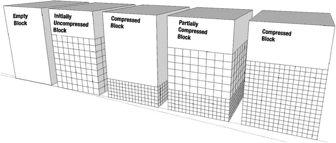

# DML 性能

一般而言，需要更新的记录不应被压缩。当您更新 HCC（混合列压缩）表中的一条记录时，该记录将迁移到一个标记为 OLTP（联机事务处理）压缩块的新数据块中。当然，系统会留下一个指针，以便您仍然可以通过其旧的`ROWID`访问该记录，但该记录也会被分配一个新的`ROWID`。由于更新后的记录会被降级为 OLTP 压缩，因此您需要理解这种压缩机制在更新时是如何工作的。

## OLTP 压缩过程

图 3-5 展示了非直接路径加载到 OLTP 块中的处理过程。


*图 3-5. 非直接路径加载的 OLTP 压缩过程*

状态的变化从左向右进行。行最初以未压缩状态加载。当块填充到无法再插入更多行时，块中的行数据将被压缩。然后该块将再次可用，并能够接收更多未压缩的行。这意味着在 OLTP 压缩表中，块可能处于各种压缩状态：所有行都可以被压缩，部分行可以被压缩，或者没有行被压缩。这正是 HCC 块中的记录在被更新时的行为方式。

## 示例：更新后表大小的增加

下面几个例子将说明这种行为。第一个例子将展示表的大小如何随着更新而膨胀。更新前，该段的大小为 408 MB。未压缩的表在此列出以供比较：

```
SQL> select segment_name,trunc(bytes/power(1024,2)) m
  2  from user_segments where segment_name in ('T1', 'T1_QH');

SEGMENT_NAME                              M
------------------------------ ----------
T1                                     3840
T1_QH                                   408
```

接下来，更新整个压缩表。更新完成后，您应该检查其大小：

```
SQL> update t1_qh set id = id + 1;

33554432 rows updated.

SQL> select segment_name,trunc(bytes/power(1024,2)) m
  2  from user_segments where segment_name in ('T1','T1_QH')
  3  order by segment_name;

SEGMENT_NAME                                            M
-------------------------------------- ---------------
T1                                                 3,841.00
T1_QH                                              5,123.00

2 rows selected.
```

此时，您会注意到更新后的块类型为 64-OLTP，这是由于从 HCC 压缩表更新而导致的压缩。调用`DBMS_COMPRESSION.GET_COMPRESSION_TYPE`可以确认这一点：

```
SQL> select decode (dbms_compression.get_compression_type(user,'T1_QH',rowid),
  2      1,  'COMP_NOCOMPRESS',
  3      2,  'COMP_FOR_OLTP',
  4      4,  'COMP_FOR_QUERY_HIGH',
  5      8,  'COMP_FOR_QUERY_LOW',
  6     16,  'COMP_FOR_ARCHIVE_HIGH',
  7     32,  'COMP_FOR_ARCHIVE_LOW',
  8     64,  'COMP_BLOCK',
  9      'OTHER') type
 10  from T1_QH
 11* where rownum < 11
SQL> /

TYPE
---------------------
COMP_BLOCK
COMP_BLOCK
COMP_BLOCK
COMP_BLOCK
COMP_BLOCK
COMP_BLOCK
COMP_BLOCK
COMP_BLOCK
COMP_BLOCK
COMP_BLOCK

10 rows selected.
```

以上是 11.2.0.4 版本的例子。`DBMS_COMPRESSION`中的约束在 Oracle 12c 中已被重命名——移除了“FOR”，`COMP_FOR_OLTP`现在称为`COMP_ADVANCED`。一旦您重新压缩该表，大小就会恢复正常。

```
SQL> select segment_name,trunc(bytes/power(1024,2)) m
  2  from user_segments where segment_name in ('T1','T1_QH')
  3  order by segment_name;

SEGMENT_NAME                                            M
---------------------------------------- -------------
T1                                                 3,841.00
T1_QH                                                546.00

2 rows selected.
```

## 示例：行更新行为

第二个例子演示了更新一行时会发生什么。与软件之前的版本不同，如您所见，更新后的行不会被迁移。它从 CU（压缩单元）中被删除，但不会留下指向该行迁移位置的指针。这有助于避免在“table fetch continued row”（表提取继续行）统计信息中追踪到链式行。

以下是所有行被压缩时的表大小。如果您想按照此示例操作，表需要位于`SMALLFILE`表空间上。表不需要包含有用信息，它仅仅是大。

```
SQL> create table UPDTEST_QL column store compress for query low
  2  tablespace users as select * from UPDTEST_BASE;

Table created.

SQL> select segment_name, bytes/power(1024,2) m, compress_for
  2  from user_segments s left outer join user_tables t
  3  on (s.segment_name = t.table_name)
  4  where s.segment_name like 'UPDTEST%'
  5  /

SEGMENT_NAME                              M COMPRESS_FOR
------------------------------ ---------- ------------------------------
UPDTEST_QL                               18 QUERY LOW
UPDTEST_BASE                           1344
```

对于此示例，您需要获取表中的第一个 ID 以及其他一些元信息：

```
SQL> select dbms_compression.get_compression_type(user,'UPDTEST_QL',rowid) as ctype,
  2  rowid, old_rowid(rowid) DBA, id from UPDTEST_QL where id between 1 and 10
  3  /

CTYPE ROWID                DBA                         ID
---------- -------------------- -------------------- ----------
8 AAAG6TAAFAALORzAAA      5.2942067.0                    1
8 AAAG6TAAFAALORzAAB      5.2942067.1                    2
8 AAAG6TAAFAALORzAAC      5.2942067.2                    3
8 AAAG6TAAFAALORzAAD      5.2942067.3                    4
8 AAAG6TAAFAALORzAAE      5.2942067.4                    5
8 AAAG6TAAFAALORzAAF      5.2942067.5                    6
8 AAAG6TAAFAALORzAAG      5.2942067.6                    7
8 AAAG6TAAFAALORzAAH      5.2942067.7                    8
8 AAAG6TAAFAALORzAAI      5.2942067.8                    9
8 AAAG6TAAFAALORzAAJ      5.2942067.9                   10
```

`old_rowid()`函数可从 Enitec 博客和在线代码仓库的文件`create_old_rowid.sql`中获取。它解码`ROWID`以获取数据块地址或磁盘上的位置。在上面的例子中，ID 1 位于文件 5、块 2942067、槽位 0。压缩类型为 8 表示 Query Low。现在开始修改：

```
SQL> update UPDTEST_QL set spcol = 'I AM UPDATED' where id between 1 and 10;

10 rows updated.

SQL> commit;

Commit complete.

SQL> select dbms_compression.get_compression_type(user,'UPDTEST_QL',rowid) as ctype,
  2  rowid, old_rowid(rowid) DBA, id from updtest_ql where id between 1 and 10;

CTYPE ROWID                DBA                         ID
---------- -------------------- -------------------- ----------
64 AAAG6TAAFAAK4jhAAA      5.2853089.0                    1
64 AAAG6TAAFAAK4jhAAB      5.2853089.1                    2
64 AAAG6TAAFAAK4jhAAC      5.2853089.2                    3
64 AAAG6TAAFAAK4jhAAD      5.2853089.3                    4
64 AAAG6TAAFAAK4jhAAE      5.2853089.4                    5
64 AAAG6TAAFAAK4jhAAF      5.2853089.5                    6
64 AAAG6TAAFAAK4jhAAG      5.2853089.6                    7
1 AAAG6TAAFAAK4jkAAA       5.2853092.0                    8
1 AAAG6TAAFAAK4jkAAB       5.2853092.1                    9
1 AAAG6TAAFAAK4jkAAC       5.2853092.2                   10

10 rows selected
```

如您所见，部分更新行的压缩类型已变为 64，这在`DBMS_COMPRESSION`中定义为`COMP_BLOCK`。此特定类型出现在更新块从其原始 CU 移出并移入 OLTP 压缩块的情况下。在 Oracle 11.2.0.2 及更早版本中，您会看到压缩类型为 2 或`COMP_ADVANCED`/`COMP_FOR_OLTP`。如何判断块已经移动？将新的数据块地址与原始地址进行比较：包含 ID 1 的块现在位于文件 5、块 2853089、槽位 0，而不是原来的文件 5、块 2942067、槽位 0。


## 数据迁移行为

当前的问题是，如果我们使用原始的 `ROWID` 查询 ID 为 1 的行，数据会发生什么变化：
```
SQL> select id,spcol from updtest_ql where rowid = 'AAAG6TAAFAALORzAAA';
```
```
no rows selected
```

这种行为与我们最初描述的更新效果不同。你可以在 Kerry Osborne 的博客中找到原始的参考资料：
[`http://kerryosborne.oracle-guy.com/2011/01/ehcc-mechanics-proof-that-whole-cus-are-not-decompressed/`](http://kerryosborne.oracle-guy.com/2011/01/ehcc-mechanics-proof-that-whole-cus-are-not-decompressed/)

旧的 `ROWID` 已经无法访问。那么新的 `ROWID` 呢？你肯定希望它能正常工作：
```
SQL> select id,spcol from updtest_ql where rowid = 'AAAG6TAAFAAK4jhAAA';
```
```
ID SPCOL
---------- ----------------------------------------
1 I AM UPDATED
```

在为这个更新版本进行研究时，无法创建一个行被真正迁移的测试案例。换句话说，无法使用其旧的 `ROWID` 检索到更新后的行。乍一听这很奇怪，但另一方面，它简化了处理过程。如果 Oracle 在原地留下一个指向新行的指针，它将需要在新块上执行另一次查找，从而减慢处理速度。

如果我们将新块（数据文件 5 块 2853089）转储，你可以看到它确实是一个 OLTP 压缩块。请注意，上面列表中下一个块中的行并未被压缩。压缩类型 1 表示未压缩。
```
SQL> alter system dump datafile 5 block 2853089;
```
```
System altered.
```
```
SQL> @trace
```
```
SQL> select value from v$diag_info where name like 'Default%';
```
```
VALUE
-------------------------------------------------------------------
/u01/app/oracle/diag/rdbms/dbm01/dbm011/trace/dbm011_ora_53134.trc
```
```
Block header dump:  0x016b88e1
Object id on Block? Y
seg/obj: 0x6e93  csc: 0x00.607114  itc: 2  flg: E  typ: 1 - DATA
brn: 0  bdba: 0x16b8881 ver: 0x01 opc: 0
inc: 0  exflg: 0
Itl           Xid                  Uba         Flag  Lck        Scn/Fsc
0x01   0x002c.00d.00000007  0x0020d085.0017.02  --U-    7  fsc 0x0000.00607122
0x02   0x0000.000.00000000  0x00000000.0000.00  ----    0  fsc 0x0000.00000000
bdba: 0x016b88e1
data_block_dump,data header at 0x7f5c8fb6d464
===============
tsiz: 0x1f98
hsiz: 0x34
pbl: 0x7f5c8fb6d464
76543210
flag=-0----X-
ntab=2
nrow=11
frre=-1
fsbo=0x34
fseo=0x372
avsp=0x33e
tosp=0x33e
r0_9ir2=0x1
mec_kdbh9ir2=0x0
76543210
shcf_kdbh9ir2=----------
76543210
flag_9ir2=--R-LN-C      Archive compression: N
fcls_9ir2[0]={ }
0x16:pti[0]     nrow=4  offs=0
0x1a:pti[1]     nrow=7  offs=4
0x1e:pri[0]     offs=0x1f7e
...
block_row_dump:
tab 0, row 0, @0x1f7e
tl: 11 fb: --H-FL-- lb: 0x0  cc: 1
col  0: [ 8]  54 48 45 20 52 45 53 54
bindmp : 00 06 d0 54 48 45 20 52 45 53 54
...
tab 1, row 0, @0x1b6f
tl: 1019 fb: --H-FL-- lb: 0x1  cc: 6
col  0: [ 2]  c1 02
col  1: [999]
31 20 20 20 20 20 20 20 20 20 20 20 20 20 20 20 20 20 20 20 20 20 20 20 20
20 20 20 20 20 20 20 20 20 20 20 20 20 20 20 20 20 20 20 20 20 20 20 20 20
...
col  2: [ 7]  78 71 0b 16 01 01 01
col  3: [ 7]  78 71 0b 16 12 1a 39
col  4: [ 8]  54 48 45 20 52 45 53 54
col  5: [12]  49 20 41 4d 20 55 50 44 41 54 45 44
bindmp : 2c 01 06 ca c1 02 fa 03 e7 31 20 20 20...
```

你将在该块中识别出典型的 BASIC/OLTP 压缩元信息——符号表和数据表，以及头部的标志和一个允许 Oracle 读取数据的 `bindmp` 列。另请注意，`data_object_id` 包含在块中，为十六进制格式 (`seg/obj: 0x6e93`)。该表有六列。反规范化值也以十六进制格式显示。

为了验证我们拥有正确的块，我们可以按如下方式转换 `data_object_id` 和第一列的值：
```
SQL> !cat obj_by_hex.sql
```
```
col object_name for a30
select owner, object_name, object_type
from dba_objects
where data_object_id = to_number(replace('&hex_value','0x',''),'XXXXXX');
```
```
SQL> @obj_by_hex.sql
```
```
Enter value for hex_value: 0x6e93
OWNER                OBJECT_NAME                    OBJECT_TYPE
-------------------- ------------------------------ -----------------------
MARTIN               UPDTEST_QL                     TABLE
Elapsed: 00:00:00.02
```

为了向你展示更新并未解压缩整个 CU，你可以看到存储 ID 1 到 10 的原始块的转储：
```
data_block_dump,data header at 0x7f5c8fb6d47c
===============
tsiz: 0x1f80
hsiz: 0x1c
pbl: 0x7f5c8fb6d47c
76543210
flag=-0------
ntab=1
nrow=1
frre=-1
fsbo=0x1c
fseo=0x30
avsp=0x14
tosp=0x14
r0_9ir2=0x0
mec_kdbh9ir2=0x0
76543210
shcf_kdbh9ir2=----------
76543210
flag_9ir2=--R-----      Archive compression: Y
fcls_9ir2[0]={ }
0x16:pti[0]     nrow=1  offs=0
0x1a:pri[0]     offs=0x30
block_row_dump:
tab 0, row 0, @0x30
tl: 8016 fb: --H-F--N lb: 0x0  cc: 1
nrid:  0x016ce474.0
col  0: [8004]
Compression level: 01 (Query Low)
Length of CU row: 8004
kdzhrh: ------PC- CBLK: 2 Start Slot: 00
NUMP: 02
PNUM: 00 POFF: 7974 PRID: 0x016ce474.0
PNUM: 01 POFF: 15990 PRID: 0x016ce475.0
*---------
CU header:
CU version: 0   CU magic number: 0x4b445a30
CU checksum: 0x504338c9
CU total length: 16727
CU flags: NC-U-CRD-OP
ncols: 6
nrows: 1016
algo: 0
CU decomp length: 16554   len/value length: 1049401
row pieces per row: 1
num deleted rows: 10
deleted rows: 0, 1, 2, 3, 4, 5, 6, 7, 8, 9,
START_CU:
...
```

请注意，此块显示其压缩级别为 1 (`QUERY LOW`)。另请注意，已从此块中删除（更准确地说，是移动，因为这些是之前更新的记录）了十条记录。显示 `deleted rows:` 的行实际上列出了已被擦除的行。

## 预期压缩比率

HCC 可以提供非常出色的压缩比。市场宣传材料声称有 10 倍的压缩比，信不信由你，对于许多数据集来说，这实际上是一个非常可以实现的数字。当然，压缩量在很大程度上取决于数据以及应用的四种算法中的哪一种。确定你的数据集可以实现何种压缩的最佳方法是进行测试。

Oracle 还提供了一个实用程序（通常称为压缩顾问）来压缩表中的样本数据，以计算估计的压缩比。该实用程序甚至可以从 9i Release 2 起在非 Exadata 平台上使用。对于 11.2 及更新版本，该软件包包含在标准发行版中。早期版本的用户需要从 Oracle 网站下载该软件包。本节将提供一些关于 Oracle 12.1 所提供的压缩顾问的见解。


### 压缩建议工具

如果你没有 Exadata 环境但仍想测试 HCC 的有效性，可以使用 `DBMS_COMPRESSION` 包中提供的压缩建议功能。`GET_COMPRESSION_RATIO` 过程能够让你对指定表中的样本行进行实际压缩。这并非对压缩率的估算；样本行会被插入到一个临时表中，然后系统会为该临时表创建一个压缩版本。最终返回的比率是压缩版本与非压缩版本大小的对比结果。

压缩建议工具在 Exadata 平台上也可能有用。当然，你本可以直接用不同级别压缩一张表来查看其压缩效果。但如果表非常大，这种方法可能不切实际。此时，你或许会想通过选择 `rownum < X` 的记录创建一个临时表，然后在该子集上进行压缩测试。这基本就是压缩建议工具的原理，不过它在选择记录集合时更为智能。以下是其在 12c 中的使用示例：

```sql
SQL> ! cat get_comp_ratio_12c.sql

set sqlblanklines on
set feedback off

accept owner -
prompt 'Enter Value for owner: ' -
default 'MARTIN'

accept table_name -
prompt 'Enter Value for table_name: ' -
default 'T1'

accept comp_type -
prompt 'Enter Value for compression_type (QH): ' -
default 'QH'

DECLARE
  l_blkcnt_cmp      BINARY_INTEGER;
  l_blkcnt_uncmp    BINARY_INTEGER;
  l_row_cmp         BINARY_INTEGER;
  l_row_uncmp       BINARY_INTEGER;
  l_cmp_ratio       NUMBER;
  l_comptype_str    VARCHAR2 (200);
  l_comptype        NUMBER;
BEGIN
  case '&&comp_type'
    when 'BASIC'        then l_comptype := DBMS_COMPRESSION.COMP_BASIC;
    when 'ADVANCED'     then l_comptype := DBMS_COMPRESSION.COMP_ADVANCED;
    when 'QL'           then l_comptype := DBMS_COMPRESSION.COMP_QUERY_LOW;
    when 'QH'           then l_comptype := DBMS_COMPRESSION.COMP_QUERY_HIGH;
    when 'AL'           then l_comptype := DBMS_COMPRESSION.COMP_ARCHIVE_LOW;
    when 'AH'           then l_comptype := DBMS_COMPRESSION.COMP_ARCHIVE_HIGH;
  END CASE;

  DBMS_COMPRESSION.get_compression_ratio (
    scratchtbsname    => 'USERS',              -- where will the temp table be created
    ownname           => '&owner',
    objname           => '&table_name',
    subobjname        => NULL,
    comptype          => l_comptype,
    blkcnt_cmp        => l_blkcnt_cmp,
    blkcnt_uncmp      => l_blkcnt_uncmp,
    row_cmp           => l_row_cmp,
    row_uncmp         => l_row_uncmp,
    cmp_ratio         => l_cmp_ratio,
    comptype_str      => l_comptype_str
  );

  dbms_output.put_line(' ');
  DBMS_OUTPUT.put_line ('Estimated Compression Ratio using '||l_comptype_str||': '||
                        round(l_cmp_ratio,3));
  dbms_output.put_line(' ');
END;
/
undef owner
undef table_name
undef comp_type
set feedback on
```

以及一些输出示例：

```sql
SQL> @scripts/get_comp_ratio_12c.sql
Enter Value for owner: MARTIN
Enter Value for table_name: T2
Enter Value for compression_type (QH): ADVANCED

Estimated Compression Ratio using "Compress Advanced": 1.1

SQL> @scripts/get_comp_ratio_12c.sql
Enter Value for owner: MARTIN
Enter Value for table_name: T2
Enter Value for compression_type (QH): QL

Compression Advisor self-check validation successful. select count(*) on both Uncompressed and EHCC Compressed format = 1000001 rows

Estimated Compression Ratio using "Compress Query Low": 74.8
```

请注意，该过程可以输出一条验证信息，告诉你用于比较的记录数量。如果需要，可以在调用过程时修改这个数字。`get_comp_ratio_12c.sql` 脚本会提示输入表名和压缩类型，然后执行 `DBMS_COMPRESSION.GET_COMPRESSION_RATIO` 过程。

### 实际案例

正如 Yogi Bear 曾经所说，光是观察就能学到很多。市场宣传幻灯片和书籍作者的声称是一回事，但实际数据通常更有用。为了让你对可预期的合理压缩效果有个概念，以下是来自不同行业的几个数据对比。这些数据应该能让你了解 HCC 可实现的潜在压缩比率范围。

## 自定义应用数据

该数据集来源于一个追踪资产移动的自定义应用。该表非常狭窄，仅包含 12 列。表中有近十亿行数据，但许多列的不同值数量非常少。这意味着相同的值会重复出现多次。这张表是压缩的理想候选对象。以下是基本的表统计信息和实现的压缩比：

```
==========================================================================================
表统计信息
==========================================================================================
表名                        : CP_DAILY
上次分析时间                 : 2010 年 12 月 29 日 23:55:16
并行度                       : 1
是否分区                     : 是
行数                         : 925241124
链计数                       : 0
块数                         : 15036681
空块数                       : 0
平均空间                     : 0
平均行长度                   : 114
是否启用监控                 : 是
样本大小                     : 925241124
总大小（兆字节）              : 118019
===========================================================================================
列统计信息
===========================================================================================
名称                       分析日期      是否可为空   不同值数量    密度      空值数量   桶数
===========================================================================================
PK_ACTIVITY_DTL_ID        2010/12/29   不为空       925241124     .000000   0          1
FK_ACTIVITY_ID            2010/12/29   不为空       43388928      .000000   0          1
FK_DENOMINATION_ID        2010/12/29                38            .000000   88797049   38
AMOUNT                    2010/12/29                1273984       .000001   0          1
FK_BRANCH_ID              2010/12/29   不为空       131           .000000   0          128
LOGIN_ID                  2010/12/29   不为空       30            .033333   0          1
DATETIME_STAMP            2010/12/29   不为空       710272        .000001   0          1
LAST_MODIFY_LOGIN_ID      2010/12/29   不为空       30            .033333   0          1
MODIFY_DATETIME_STAMP     2010/12/29   不为空       460224        .000002   0          1
ACTIVE_FLAG               2010/12/29   不为空       2             .000000   0          2
FK_BAG_ID                 2010/12/29                2895360       .000000   836693535  1
CREDIT_DATE               2010/12/29                549           .001821   836693535  1
===========================================================================================
```

```
SYS@POC1> @table_size2
输入 owner 的值:
输入 table_name 的值: CP_DAILY_INV_ACTIVITY_DTL
所有者                段名                      总大小（兆字节）  压缩方式
-------------------- ------------------------------ -------------- ------------
KSO                  CP_DAILY_INV_ACTIVITY_DTL           118,018.8
--------------
求和                                                      118,018.8
```

```
SYS@POC1> @comp_ratio
输入 original_size 的值: 118018.8
输入 owner 的值: KSO
输入 table_name 的值: CP_DAILY%
输入 type 的值:
所有者      段名                   类型               总大小（兆字节）  压缩比
---------- -------------------- ------------------ -------------- -----------------
KSO        CP_DAILY_HCC1        表                       7,488.1              15.8
KSO        CP_DAILY_HCC3        表                       2,442.3              48.3
KSO        CP_DAILY_HCC2        表                       2,184.7              54.0
KSO        CP_DAILY_HCC4        表                       1,807.8              65.3
--------------
求和                                                    13,922.8
```

正如预期，该表具有极高的可压缩性。针对这些表的简单查询在压缩表上运行速度也快得多，如下所示：

```
SQL> select sum(amount) from kso.CP_DAILY_HCC3 where credit_date = '01-oct-2010';
SUM(AMOUNT)
------------
4002779614.9
已选择 1 行。
已用时间: 00:00:02.37
```

```
SQL> select sum(amount) from kso.CP_DAILY where credit_date = '01-oct-2010';
SUM(AMOUNT)
------------
4002779614.9
已选择 1 行。
已用时间: 00:00:42.58
```

使用 `ARCHIVE LOW` 压缩表运行此简单查询的速度比在未压缩表上运行快了大约 19 倍。

## 电信通话明细数据

该表包含某电信公司的通话明细记录。表中大约有 15 亿条记录。该表中的许多列是唯一的或几乎唯一。此外，许多列包含大量空值。空值是不可压缩的，因为它们不以常规的 Oracle 块格式存储。这不是我们预期中会高度可压缩的表。以下是基本的表统计信息和压缩比：

```
==========================================================================================
表统计信息
==========================================================================================
表名                        : SEE
上次分析时间                 : 2010 年 9 月 29 日 00:02:15
并行度                       : 8
是否分区                     : 是
行数                         : 1474776874
链计数                       : 0
块数                         : 57532731
空块数                       : 0
平均空间                     : 0
平均行长度                   : 282
是否启用监控                 : 是
样本大小                     : 1474776874
总大小（兆字节）              : 455821
===========================================================================================
```

```
SQL> @comp_ratio
输入 original_size 的值: 455821
输入 owner 的值: KSO
输入 table_name 的值: SEE_HCC%
输入 type 的值:
所有者      段名                   类型               总大小（兆字节）  压缩比
---------- -------------------- ------------------ -------------- -----------------
KSO        SEE_HCC1             表                     168,690.1               2.7
KSO        SEE_HCC2             表                      96,142.1               4.7
KSO        SEE_HCC3             表                      87,450.8               5.2
KSO        SEE_HCC4             表                      72,319.1               6.3
                                                          --------------
求和                                                    424,602.1
```


## 财务数据

下表由财务数据构成——确切地说，是来自订单录入系统的收入应计数据。以下是基本的表统计信息：

```text
=====================================================================================
表统计信息
=====================================================================================
TABLE_NAME                    : REV_ACCRUAL
LAST_ANALYZED                 : 2011 年 1 月 7 日 00:42:47
DEGREE                        : 1
PARTITIONED                   : 是
NUM_ROWS                      : 114736686
CHAIN_CNT                     : 0
BLOCKS                        : 15225910
EMPTY_BLOCKS                  : 0
AVG_SPACE                     : 0
AVG_ROW_LEN                   : 917
MONITORING                    : 是
SAMPLE_SIZE                   : 114736686
TOTALSIZE_MEGS                : 120019
=====================================================================================
```

因此，行数并不算多，只有大约 1.15 亿，但该表很宽。它有 161 列，平均行长为 917 字节。在可压缩性方面则有点参差不齐。许多列包含高比例的空值。另一方面，许多列的唯一值数量非常少。将磁盘上的数据重新排序以作为提高压缩比的策略，这个表可能是一个候选对象。无论如何，以下是该表在各种 HCC 级别下实现的压缩率：

```sql
SQL> @comp_ratio
输入 original_size 的值: 120019
输入 owner 的值: KSO
输入 table_name 的值: REV_ACCRUAL_HCC%
输入 type 的值:

OWNER      SEGMENT_NAME         TYPE               TOTALSIZE_MEGS COMPRESSION_RATIO
---------- -------------------- ------------------ -------------- -----------------
KSO        REV_ACCRUAL_HCC1     TABLE                     31,972.6                3.8
KSO        REV_ACCRUAL_HCC2     TABLE                     17,082.9                7.0
KSO        REV_ACCRUAL_HCC3     TABLE                     14,304.3                8.4
KSO        REV_ACCRUAL_HCC4     TABLE                     12,541.6                9.6
                                                      --------------
sum                                                     75,901.4
```

## 零售销售数据

最后这张表由来自一家零售商的销售数据构成。该表包含约 60 亿条记录，占用空间远超半 Terabyte。它列数很少，且数据高度重复。实际上，该表中没有唯一字段。这是一个非常适合压缩的候选对象。以下是基本的表统计信息：

```text
==========================================================================================
表统计信息
==========================================================================================
TABLE_NAME                    : SALES
LAST_ANALYZED                 : 2010 年 12 月 23 日 03:13:44
DEGREE                        : 1
PARTITIONED                   : 否
NUM_ROWS                      : 5853784365
CHAIN_CNT                     : 0
BLOCKS                        : 79183862
EMPTY_BLOCKS                  : 0
AVG_SPACE                     : 0
AVG_ROW_LEN                   : 93
MONITORING                    : 是
SAMPLE_SIZE                   : 5853784365
TOTALSIZE_MEGS                : 618667
==========================================================================================

列统计信息
==========================================================================================
Name            Analyzed    Null?     NDV           Density  # Nulls   # Buckets   Sample
==========================================================================================
TRANS_ID        2010/12/23            389808128     .000000  0         1        5853784365
TRANS_LINE_NO   2010/12/23            126           .007937  0         1        5853784365
UNIT_ID         2010/12/23            128600        .000008  0         1        5853784365
DAY             2010/12/23            3             .333333  0         1        5853784365
TRANS_SEQ       2010/12/23            22932         .000044  0         1        5853784365
BEGIN_DATE      2010/12/23            4             .250000  0         1        5853784365
END_DATE        2010/12/23            4             .250000  0         1        5853784365
UNIT_TYPE       2010/12/23            1            1.000000  0         1        5853784365
SKU_TYPE        2010/12/23            54884         .000018  0         1        5853784365
QTY             2010/12/23            104           .009615  0         1        5853784365
PRICE           2010/12/23            622           .001608  0         1        5853784365
==========================================================================================
```

以下是为该表实现的压缩比。正如预期，它们非常出色：

```sql
SQL> @comp_ratio
输入 original_size 的值: 618667
输入 owner 的值: KSO
输入 table_name 的值: SALES_HCC%
输入 type 的值:

OWNER      SEGMENT_NAME         TYPE               TOTALSIZE_MEGS COMPRESSION_RATIO
---------- -------------------- ------------------ -------------- -----------------
KSO        SALES_HCC1           TABLE                     41,654.6               14.9
KSO        SALES_HCC2           TABLE                     26,542.0               23.3
KSO        SALES_HCC3           TABLE                     26,538.5               23.3
KSO        SALES_HCC4           TABLE                     19,633.0               31.5
                                                      --------------
sum                                                    114,368.1
```

## 实际案例总结

本节中的示例来自真实的应用程序。它们展示了数据可压缩性方面相当大的差异。这是可以预料的，因为压缩算法的成功与否很大程度上取决于被压缩的数据本身。表 3-6 汇总了所有四个示例的数据。

**表 3-6.** 实际案例对比

| 数据类型 | 基表名称 | 特征 | 压缩比 |
| --- | --- | --- | --- |
| 资产跟踪 | `CP_DAILY` | 窄表，许多低 NDV 列 | 16×-65× |
| 通话详单记录 | `SEE` | 许多`NULL`值，许多唯一列 | 3×-6× |
| 财务数据 | `REV_ACCRUAL` | 宽表，许多 NULL 值，许多低 NDV 列 | 4×-10× |
| 零售销售数据 | `SALES` | 窄表，大部分为低 NDV 列 | 15×-32× |

希望这些数据能让您对 HCC 可实现的压缩比范围以及最能受益于此技术的数据集类型有所了解。当然，预测特定表可压缩性的最佳方法是实际进行测试。这一点无论怎样强调都不为过。

### 限制/挑战

使用 HCC 存在一些挑战。其中许多与 HCC 在大多数非 Exadata 平台上不可用这一事实有关。这一事实为恢复和高可用性解决方案带来了有趣的场景。另一个主要挑战是 HCC 与正在被主动更新的数据配合不佳。特别是以大量单行更新为特征的系统——我们通常将其描述为 OLTP 工作负载——即使在引入了行级锁的 12c 版本中，也可能无法与 HCC 良好配合。


### 将数据迁移至非 Exadata 平台

使用 `HCC` 的最大障碍可能一直在于将数据迁移至非 Exadata 平台。例如，虽然 `RMAN` 和 `Data Guard` 都支持 `HCC` 块格式，并且可以顺利地将数据恢复到非 Exadata 环境，但在该环境中运行的数据库在数据解压缩之前将无法对其进行任何操作。此规则的唯一例外是使用 Oracle 的 `ZFS 存储设备`、`FS1` 存储系统或 `Pillar Axiom` 阵列。必须先解压缩数据，可能意味着在发生故障切换到非 Exadata 平台上的备用数据库时，在能够访问数据之前会有很长的延迟。将 `RMAN` 恢复到非 Exadata 平台时也存在同样的问题。恢复操作本身可以工作，但 `HCC` 格式块中的数据在被移动到非 `HCC` 格式之前将无法访问。顺便提一下，这可以通过 `ALTER TABLE MOVE NOCOMPRESS` 命令完成。

**注意**

在非 Exadata 平台上解压缩 `HCC` 数据的能力仅在 Oracle 数据库版本 11.2.0.2 中才可用。在 11.2.0.1 版本上尝试此操作将导致错误。

除了在访问数据之前解压缩数据所带来的长时间延迟外，还存在空间问题。如果 `HCC` 提供 10 倍的压缩因子，例如，你将需要在目标环境中有当前使用空间的 10 倍可用空间，以处理数据增大的尺寸。由于这些原因，`Data Guard` 很少在非 Exadata 平台上设置备用数据库。

在 Oracle 12c 之前，将 `HCC` 压缩数据导入非 Exadata 数据库是有问题的。`impdp` 中添加了一个长期请求的功能，允许 DBA 动态指定压缩级别，如下例所示：

```
[oracle@nonExadata ∼]$ impdp user/password@nonExadata/testpdb1 \
> directory=data_pump_dir dumpfile=hcc_dump.dmp \
> transform=table_compression_clause:nocompress
```

在导入之前 `HCC` 压缩的表之前，你需要确保存储空间足够，以便导入成功。在导入到非 Exadata 系统时未能提供转换子句将导致导入中止，并显示以下错误消息：

```
Processing object type TABLE_EXPORT/TABLE/TABLE
ORA-39083: Object type TABLE:"MARTIN"."UPDTEST_QL" failed to create with error:
ORA-64307:  Exadata Hybrid Columnar Compression is not supported for tablespaces on
  this storage type
```

### 禁用序列直接路径读取

如你在第 2 章中所见，序列 `Direct Path Reads` 允许非并行化的扫描操作使用直接路径读取机制，这是启用 Exadata 的 `Smart Scan` 功能的先决条件。`序列 Direct Path Reads` 的启用基于一个计算，该计算取决于被扫描对象的大小相对于可用缓冲区缓存的大小。简而言之，只有大型对象才会被考虑使用 `序列 Direct Path Reads`。`HCC` 的有效性在这里实际上可能适得其反。由于压缩极大地减小了对象的尺寸，它可能导致通常会受益于 `Smart Scan` 的语句改用标准读取机制，从而禁用了 Exadata 的许多优化功能。这通常不是一个大问题，因为 `HCC` 显著减少了块的数量。

数据库在运行时做出使用 `Direct Path Read`（进而触发 `Smart Scan`）的决定。当对象被压缩和分区时，这可能变得有趣。是否使用 `Smart Scan` 的算法基于被扫描对象的大小；对于分区对象，这意味着分区的大小。因此，在将分区与 `HCC` 结合使用的情况下，我们经常看到一些分区使用 `Smart Scans`，而一些则无法使用。请记住，不使用 `Smart Scans` 也意味着解压缩无法在存储层完成，因为此功能仅在执行 `Smart Scans` 时才启用。


### 锁定问题

文档过去曾指出，对使用`HCC`压缩的表更新单行数据，会锁定包含该行的整个`CU`。这可能导致`OLTP`类型系统出现严重的争用问题。不过，出于本章前文已阐述的原因，你无论如何都不应该用`HCC`来压缩活跃数据。

对我们而言，锁定整个`CU`是主要的原因，这也是为什么不建议对数据会被更新的表（或分区）使用`HCC`。从 Oracle `12c`开始，这一情况发生了改变。如果需要，你可以在`CU`头部预留一些空间来跟踪`DML`操作。要启用此功能，必须为`HCC`指定新的语法，如本例所示：

```sql
CREATE TABLE t1_ql_rll
enable row movement
column store compress for query low row level locking
AS
select * from t1_ql;
```

```
Table created.
```

表`T1_QL_RLL`已创建，包含一百万行随机数据，使用`Query Low`作为压缩机制。行级锁在`Query Compression`模式下效果最佳（如果可以这么说的话）。其在`Archive Compression`模式下的效果有些不可预测。但这完全说得通。归档数据本就不应该被更新，不是吗？比较两个表得出了一个有趣的结果：

```sql
SQL> select table_name,compression,compress_for,last_analyzed
  2  from tabs where table_name like 'T1_QL%';
```

```
TABLE_NAME           COMPRESS COMPRESS_FOR                   LAST_ANAL
-------------------- -------- ------------------------------ ---------
T1_QL                ENABLED  QUERY LOW                      22-AUG-14
T1_QL_RLL            ENABLED  QUERY LOW ROW LEVEL LOCKING    22-AUG-14
```

首先，你可以看到行级锁已被请求并应用于该表。当你比较表的大小时，会注意到为了跟踪`DML`操作而在`CU`头部预留的额外空间带来了一点小小的代价：

```sql
SQL> select segment_name,bytes/power(1024,2) m, blocks
  2  from user_segments
  3  where segment_name like 'T1_QL%';
```

```
SEGMENT_NAME                     M     BLOCKS
-------------------- ---------- ----------
T1_QL                          176      22528
T1_QL_RLL                      192      24576
```

在这个仅有一百万行的小示例中，大小差异只有几`MB`。锁定行的信息并不隐藏在`CU`的前几个字节中。正如人们可能预期的那样，它在`CU`头部清晰可见。转储一个带有随机`CU`头部的块就暴露了这一点：

```
data_block_dump,data header at 0x7efefa13407c
===============
tsiz: 0x1f80
hsiz: 0x1c
pbl: 0x7efefa13407c
76543210
flag=-0------
ntab=1
nrow=1
frre=-1
fsbo=0x1c
fseo=0x5e8
avsp=0x5cc
tosp=0x5cc
r0_9ir2=0x0
mec_kdbh9ir2=0x0
76543210
shcf_kdbh9ir2=----------
76543210
flag_9ir2=--R-----      Archive compression: Y
fcls_9ir2[0]={ }
0x16:pti[0]     nrow=1  offs=0
0x1a:pri[0]     offs=0x5e8
block_row_dump:
tab 0, row 0, @0x5e8
tl: 6552 fb: --H-F--N lb: 0x0  cc: 1
nrid:  0x0140219c.0
col  0: [6540]
Compression level: 01 (Query Low)
Length of CU row: 6540
kdzhrh: ------PCL CBLK: 2 Start Slot: 00
NUMP: 02
PNUM: 00 POFF: 5617 PRID: 0x0140219c.0
PNUM: 01 POFF: 13633 PRID: 0x0140219d.0
num lock bits: 7
locked rows:
*---------
CU header:
CU version: 0   CU magic number: 0x4b445a30
CU checksum: 0x22424f63
CU total length: 17189
CU flags: NC-U-CRD-OP
ncols: 6
nrows: 1015
algo: 0
CU decomp length: 17016   len/value length: 1049278
row pieces per row: 1
num deleted rows: 0
START_CU:
00 00 19 8c 4f 02 00 00 00 02 00 00 15 f1 01 40 21 9c 00 00 00 00 35 41 01
```

在这个特定的`CU`中，你可以看到用于锁定行的`7`个锁位。下一行实际上显示了被锁定的行（如果有的话）。现在，让我们尝试更新压缩单元中的一些行并转储该块。但在此之前，必须找到要更新行的块编号。使用以下查询，可以在块`192700`中识别出`ID`为`1`到`78`的行：

```sql
SQL> select min(id),max(id),blockn from (
  2    select id,DBMS_ROWID.ROWID_RELATIVE_FNO(rowid),
  3     DBMS_ROWID.ROWID_BLOCK_NUMBER(rowid) as blockn
  4    from martin.t1_ql_rll where id < 2500
  5  ) group by blockn order by blockn;
```

```
MIN(ID)    MAX(ID)     BLOCKN
---------- ---------- ----------
         1         78     192700
        79        708       8603
       169        258       8689
       259        348      26064
       349        438     173609
       439        528     173715
       529        570     173860
       571        618     196434
       709       2499       8641
       841       1464       8646
      1465       2220      26012
```

下一步，启动一个事务，更新`ID`从`1`到`10`的行：

```sql
SQL> update t1_ql_rll set spcol = 'me me me' where id between 1 and 10;
```

```
10 rows updated.
```

现在是关键时刻——该块的转储显示如下：

```
Block header dump:  0x01c04d40
 Object id on Block? Y
 seg/obj: 0x56ef  csc: 0x00.2385ed  itc: 3  flg: E  typ: 1 - DATA
 brn: 0  bdba: 0x1c04a03 ver: 0x01 opc: 0
 inc: 0  exflg: 0
 Itl           Xid                  Uba         Flag  Lck        Scn/Fsc
0x01   0xffff.000.00000000  0x00000000.0000.00  C---    0  scn 0x0000.002385ed
0x02   0x000a.00c.0000127a  0x000009f3.033b.0a  ----   10  fsc 0x0000.00000000
0x03   0x0000.000.00000000  0x00000000.0000.00  ----    0  fsc 0x0000.00000000
bdba: 0x01c04d40
data_block_dump,data header at 0x7f2fa276307c
[...]
tab 0, row 1, @0x2ea
tl: 3465 fb: --H-F--N lb: 0x0  cc: 1
nrid:  0x01c04d41.0
col  0: [3453]
Compression level: 01 (Query Low)
Length of CU row: 3453
kdzhrh: ------PCL CBLK: 4 Start Slot: 00
NUMP: 04
PNUM: 00 POFF: 2020 PRID: 0x01c04d41.0
PNUM: 01 POFF: 10036 PRID: 0x01c04d42.0
PNUM: 02 POFF: 18052 PRID: 0x01c04d43.0
PNUM: 03 POFF: 26068 PRID: 0x01c04d44.0
num lock bits: 6
locked rows: 1040(2), 1041(2), 1042(2), 1043(2), 1044(2), 1045(2), 1046(2), 1047(2), 1048(2), 1049(2),
*---------
CU header:
```

头部信息反映了被更新的块。这对并发性意味着什么？在以下示例中——没有启用行级锁——可以观察到众所周知的行为，即整个`CU`被锁定：

```sql
Session1> update t1_ql set spcol = 'UPDATED' where id between 1 and 10;
```

```
10 rows updated.
Elapsed: 00:00:00.06
```

```sql
Session2> update t1_ql set spcol='UPDATED TOO' where id between 100 and 110;
```

```
-- session waits
```

正如你所料，`Session2`必须等待`Session1`提交。毫不意外，这是预期的行为：

```sql
SQL> select sid,serial#,sql_id,seq#,event from v$session where username = 'MARTIN';
```

```
SID    SERIAL# SQL_ID              SEQ# EVENT
---------- ---------- ------------- ---------- --------------------------------------------
      328       1679 fvcbzbm0gak1x         91 SQL*Net message to client
     1109      13459 39pvwfpfcum          52 enq: TX - row lock contention
```

如果你对启用了行级锁的表重复此测试，你会看到两个更新就像在普通表上一样顺利通过：

```sql
Session1> update t1_ql_rll set spcol = 'UPDATED' where id between 1 and 10;
```

```
10 rows updated.
Elapsed: 00:00:00.04
```

```sql
Session2> update t1_ql_rll set spcol='UPDATED TOO' where id between 100 and 110;
```

```
11 rows updated.
Elapsed: 00:00:00.03
```

在这种情况下，没有等待，没有锁。在你开始重新定义所有表之前，请考虑关于`HCC`和活跃数据的原则。仅仅因为有行级锁的支持，其他`DML`操作仍然最好不要对`HCC`压缩数据执行。


#### 单行访问

`HCC` 是为全表扫描而构建且最适合全表扫描的。解压缩是一项 CPU 密集型任务。智能扫描可以将解压缩工作分配到存储单元的 CPU 上。这使得 CPU 密集型任务变得容易接受得多。然而，智能扫描仅在执行全表扫描时才会发生。这意味着其他访问机制，例如索引访问，必须使用数据库服务器 CPU 来执行解压缩。在极端情况下，这会给数据库服务器带来巨大的 CPU 负载，例如在高吞吐量的 `OLTP` 型系统中。此外，由于单行数据分散在 `CU` 的多个数据块中，检索一整行会导致读取整个 `CU`。对于倾向于使用索引访问数据的系统（即使访问是只读的），这可能对整体数据库效率产生不利影响。

### 常见使用场景

`HCC` 提供了如此高的压缩级别，以至于它已被用作传统信息生命周期模型（`ILM`）策略的替代方案。传统的 `ILM` 策略通常涉及将较旧的历史数据完全移出数据库。这些 `ILM` 策略通常需要某种类型的日期范围分区以及清除或归档过程。这样做是为了释放存储空间，并且在某些情况下是为了提高性能。通常，数据必须以某种备份格式保留，以便日后需要时能够访问。使用 `HCC`，在许多情况下，可以通过对最旧的分区进行压缩来近乎无限期地保留数据。这种方法与传统地移动数据的方法相比有许多优点。

首先也是最重要的，数据通过标准的应用程序接口仍然可用。在访问旧数据之前，不需要做额外的工作来恢复备份。仅此一项优势通常就足以证明这种方法的合理性。这种方法通常需要保留活动分区不压缩，同时更激进地压缩旧分区。以下是一个使用 11.2 语法创建具有混合压缩模式的分区表的简短示例：

```sql
SQL>   CREATE TABLE "KSO"."CLASS_SALES_P"
  2       (    "TRANS_ID" VARCHAR2(30),
  3            "UNIT_ID" NUMBER(30,0),
  4            "DAY" NUMBER(30,0),
  5            "TRANS_SEQ" VARCHAR2(30),
  6            "END_DATE" DATE,
  7            "BEGIN_DATE" DATE,
  8            "UNIT_TYPE" VARCHAR2(30),
  9            "CUST_TYPE" VARCHAR2(1),
 10            "LOAD_DATE" DATE,
 11            "CURRENCY_TYPE" CHAR(1)
 12       ) PCTFREE 10 PCTUSED 40 INITRANS 1 MAXTRANS 255  NOLOGGING
 13      STORAGE(
 14      BUFFER_POOL DEFAULT FLASH_CACHE DEFAULT CELL_FLASH_CACHE DEFAULT)
 15      TABLESPACE "CLASS_DATA"
 16      PARTITION BY RANGE ("BEGIN_DATE")
 17     (PARTITION "P1"  VALUES LESS THAN (TO_DATE
 18        (’ 2008-09-06 00:00:00’, ’SYYYY-MM-DD HH24:MI:SS’, ’NLS_CALENDAR=GREGORIAN’))
 19    SEGMENT CREATION IMMEDIATE
 20      PCTFREE 10 PCTUSED 40 INITRANS 1 MAXTRANS 255 NOCOMPRESS NOLOGGING
 21      STORAGE(INITIAL 8388608 NEXT 1048576 MINEXTENTS 1 MAXEXTENTS 2147483645
 22      PCTINCREASE 0 FREELISTS 1 FREELIST GROUPS 1 BUFFER_POOL DEFAULT
 23      FLASH_CACHE DEFAULT CELL_FLASH_CACHE DEFAULT)
 24      TABLESPACE "CLASS_DATA",
 25     PARTITION "P2"  VALUES LESS THAN (TO_DATE
 26        (’ 2008-09-07 00:00:00’, ’SYYYY-MM-DD HH24:MI:SS’, ’NLS_CALENDAR=GREGORIAN’))
 27    SEGMENT CREATION IMMEDIATE
 28      PCTFREE 0 PCTUSED 40 INITRANS 1 MAXTRANS 255 COMPRESS FOR QUERY HIGH NOLOGGING
 29      STORAGE(INITIAL 8388608 NEXT 1048576 MINEXTENTS 1 MAXEXTENTS 2147483645
 30      PCTINCREASE 0 FREELISTS 1 FREELIST GROUPS 1 BUFFER_POOL DEFAULT
 31      FLASH_CACHE DEFAULT CELL_FLASH_CACHE DEFAULT)
 32      TABLESPACE "CLASS_DATA",
 33     PARTITION "P3"  VALUES LESS THAN (TO_DATE
 34        (’ 2008-09-08 00:00:00’, ’SYYYY-MM-DD HH24:MI:SS’, ’NLS_CALENDAR=GREGORIAN’))
 35    SEGMENT CREATION IMMEDIATE
 36      PCTFREE 0 PCTUSED 40 INITRANS 1 MAXTRANS 255 COMPRESS FOR ARCHIVE LOW NOLOGGING
 37      STORAGE(INITIAL 8388608 NEXT 1048576 MINEXTENTS 1 MAXEXTENTS 2147483645
 38      PCTINCREASE 0 FREELISTS 1 FREELIST GROUPS 1 BUFFER_POOL DEFAULT
 39      FLASH_CACHE DEFAULT CELL_FLASH_CACHE DEFAULT)
 40      TABLESPACE "CLASS_DATA" ) ;
Table created.
```

Oracle `12c` 引入了一项新功能（作为付费选项）来自动化数据生命周期管理过程，这将在下一节中介绍。

### 自动数据优化

Oracle 数据优化（`ADO`）是版本 `12.1.0.1` 中引入的新功能。它可用于 Exadata，但不限于 Exadata。如果高级压缩选项可用，`ADO` 可以帮助管理员实施，更重要的是，强制执行信息生命周期管理。

#### 什么是数据生命周期管理？

数据生命周期管理是有效管理数据和存储的一个重要方面。在许多公司中，你会发现非 Exadata 部署有不同的存储层级。最常见的是，根据你从哪里开始计数，闪存被用作第 0 层或第 1 层。最高级别的存储层级为用户提供了尽可能好的性能，但同时，其供应并不充裕。大多数第 0 层存储太昂贵，无法全面使用。而且甚至不需要：由于我们观察到的数据访问模式，一个完全部署在闪存上的数据仓库意义不大。

许多仓库在白天（增量）加载数据。Oracle 架构师和应用程序设计师都发现，在 Oracle 数据仓库中，基于日期键按范围对表进行分区非常高效。许多博客文章和演示文稿都展示了如何有效地使用这种方法进行扩展。`Oak-Table` 成员 Tim Gorman 的论文《扩展到无穷大：Oracle 上的数据仓库》很好地概述了如何使用分区选项为超大型数据库（`VLDBs`）扩展 Oracle 性能。因此，在可以将表划分为基于范围的段的地方，数据生命周期管理是自然而然的下一步。这并不是什么新鲜事。事实上，在 Exadata 问世很久之前，管理员就经常实施它以节省成本。

当数据是“热的”，或者换句话说，是刚刚加载的，你可以预期大部分活动。加载本身需要足够的带宽来将数据从暂存层移动到最终用户可以访问的查询层。你不仅需要为加载做准备，还需要为 Oracle 为使数据可用而执行的任何操作做准备。创建或维护索引是加载期间最明显的操作，但你同样会发现 Oracle 执行的任务中包括重做和撤销生成，如果数据库处于归档日志模式并强制执行日志记录，还包括写入归档日志。大多数系统在加载期间并非静止不动，因此你还需要考虑查询性能；处理 `ETL` 时从存储读取很可能是并发发生的。总之，当前数据的 `I/O` 要求非常高。

一旦数据随着时间推移变得“冷”下来，对其的访问就不再那么猛烈和苛刻了。大多数查询活动集中在当前数据上。因此，许多架构师决定将那些不经常查询或修改的数据移动到较低层级的存储。

继续第 0 层（闪存）的例子，许多用户会转向基于硬盘的存储。这些硬盘不提供与闪存相同的高端性能特性，但作为交换，它们便宜得多。

最后，随着时间的推移，更冷的数据可以被移动到更低层级的存储。这使得管理员和架构师能够以比将所有数据保存在更高层级的 `SAN` 存储上更低的成本保留更大量的数据。


