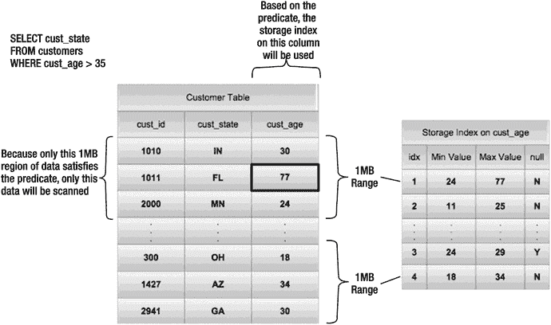

# 4. 存储索引

存储索引是一个你可能从未听闻过的实用 Exadata 特性。它们并非像 Oracle 传统的 B 树或位图索引那样，是存储在数据库中的索引。事实上，它们根本不是传统意义上的索引。它们无法识别出某列具有特定值的一组记录。相反，它们是存储服务器软件的一项特性，旨在消除磁盘 I/O。它们有时被称为“反向索引”。这是因为它们标识的是所请求记录不存在的位置，而非相反。其工作原理是为磁盘存储单元（默认大小为 1 兆字节，即 MB）存储某一列的最小值、最大值以及空值存在情况。由于在执行智能扫描时，SQL 谓词会被传递到存储服务器，因此存储软件可以在执行请求的 I/O 之前，根据存储索引的元数据（最大值、最小值、空值）来检查这些谓词。任何不可能包含匹配行的存储区域都会被跳过。在许多情况下，这可以显著减少必须执行的 I/O 量。请记住，由于存储软件需要将谓词与存储索引中的最大值和最小值以及/或空值进行比较，此优化仅对智能扫描可用。

存储软件没有提供记录在案的机制来更改或调整存储索引（尽管在存储服务器上启动 `cellsrv` 之前，可以设置几个未记录的参数）。事实上，甚至没有太多可用的监控手段。例如，没有等待事件来记录访问或更新存储索引所花费的时间量。尽管没有记录在案的命令来操作存储索引，但它们是一个极其强大的特性，并能带来显著的性能提升。因此，理解它们的工作原理非常重要。

### 结构

存储索引最多包含八个列的最小值、最大值和空值存在情况。此结构默认为 1MB 的存储块（存储区域）进行维护。存储索引仅存储在内存中，从不写入磁盘。

图 4-1 展示了存储索引中所含数据的概念视图。



图 4-1.
存储索引的概念图

如图所示，客户表中的第一个存储区域的最大值为 77，表明它可能包含满足查询谓词（`cust_age >35`）的行。图中其他存储区域的最大值不够高，不足以包含任何满足查询谓词的记录。因此，这些存储区域将不会从磁盘读取。

除了最大值和最小值之外，还有一个标志用于指示存储区域中的任何记录是否包含空值。空值竟然会被表示出来，这有点令人惊讶，因为空值在传统的 Oracle 索引中是不存储的。存储索引具备跟踪空值的能力，实际上可能对设计和实现决策产生影响。有些系统根本不使用空值。例如，SAP 使用单个空格字符代替空值。SAP 这样做只是为了确保可以通过 B 树索引访问记录（B 树索引不存储空值）。无论如何，存储索引提供了等同于在空值上的位图索引，这使得查找空值成为一个非常高效的过程（假设空值占值的百分比较低）。

### 监控存储索引

监控存储索引的能力非常有限。优化器不知道某个存储索引是否会被用于特定的 SQL 语句。AWR 或 ASH 也不会捕获有关特定 SQL 语句是否使用了存储索引的任何信息。有一个统计信息在数据库级别报告存储索引的使用情况，另外还有一个未记录的跟踪机制。

#### 数据库统计信息

只有一个数据库统计信息与存储索引直接相关。该统计信息 `cell physical IO bytes saved by storage index` 跟踪因使用存储索引而避免的累计 I/O 量。该统计信息在 `v$sesstat`、`v$sysstat` 及相关视图中公开。这是一个奇怪的统计信息，它为它并未实际执行的操作计算了一个精确值。尽管如此，它是唯一可以轻松访问的、指示存储索引是否已被使用的指标。不幸的是，由于该统计信息与 `v$sesstat` 中的所有统计信息一样是累积的，因此必须在执行给定 SQL 语句前后检查它，才能确定该特定语句是否使用了存储索引。以下是一个示例：

```
KSO@dbm2> select name, value
  2       from v$mystat s, v$statname n
  3       where s.statistic# = n.statistic#
  4       and name like '%storage index%';
NAME                                                                  VALUE
---------------------------------------------------------------- ----------
cell physical IO bytes saved by storage index                             0

KSO@dbm2> select avg(pk_col) from kso.skew2 where col1 is null;
AVG(PK_COL)
-----------
   32000001

KSO@dbm2> select name, value
  2  from v$mystat s, v$statname n
  3  where s.statistic# = n.statistic#
  4  and name like '%storage index%';
NAME                                                                  VALUE
---------------------------------------------------------------- ----------
cell physical IO bytes saved by storage index                    1842323456
```

如你所见，第一个查询向 `v$mystat` 请求包含 storage index 一词的统计信息。在当前会话中执行使用了存储索引的 SQL 语句之前，此统计信息的值将为 0。在我们的示例中，该查询使用了一个存储索引，消除了大约 1.8 GB 的磁盘 I/O。这是没有存储索引时本应需要的额外 I/O 量。请注意，`v$mystat` 是一个视图，它公开了你当前会话的累积统计信息。因此，如果你第二次运行该语句，其值应增加到第一次执行后值的两倍。当然，断开会话连接（例如通过退出 SQL*Plus）会将 `v$mystat` 公开的大多数统计信息（包括此统计信息）重置为 0。

#### 跟踪

有另一种方法可以在单个存储单元级别监控存储索引的情况。`cellsrv`程序有能力在访问存储索引时创建跟踪文件。可以通过在`cellinit.ora`文件中将`_CELL_STORAGE_INDEX_DIAG_MODE`参数设置为 2 来启用此跟踪，以使该设置在单元服务器重启后保持一致，或者在运行时使用以下代码在单元服务器中更改该参数：
```
CellCLI> alter cell events="immediate cellsrv.cellsrv_setparam('_cell_storage_index_diag_mode',2)"
CELLSRV parameter changed: _cell_storage_index_diag_mode=2.
Modification is in-memory only.
Add parameter setting to 'cellinit.ora' if the change needs to be persistent across cellsrv reboots.
Cell enkx4cel02 successfully altered
```
在正常使用中，显然应将此参数设置为 0，以防止存储单元产生写入跟踪文件的开销。为确保此参数设置为正确的值，可以使用以下命令从存储单元查询：
```
CellCLI> alter cell events="immediate cellsrv.cellsrv_getparam('_cell_storage_index_diag_mode')"
Parameter _cell_storage_index_diag_mode has value 0
Cell enkx4cel01 successfully altered
```
通过将隐藏的数据库参数`_KCFIS_STORAGEIDX_DIAG_MODE`设置为值 2，也可以为所有使用存储索引的 SQL 启用在所有存储服务器上的跟踪。由于这些跟踪机制完全未记载，在没有 Oracle 支持部门批准的情况下不应使用。安全总比后悔好。

由于`cellsrv`进程是多线程的，跟踪工具会创建许多跟踪文件。其结果类似于在数据库服务器上跟踪并行执行的 select 语句，因为需要合并多个跟踪文件才能显示完整的图景。跟踪文件的命名约定是`svtrc_`，后跟进程 ID，再跟一个线程标识符。进程 ID 与`cellsrv`进程的操作系统进程 ID 相匹配。由于`cellsrv`默认只启用 100 个线程（`_CELL_NUM_THREADS`），随着请求进入存储单元，文件名会被快速重用。由于这种快速重用，文件名中的线程编号部分很容易回绕。这种回绕不会覆盖之前的跟踪文件，而是在现有文件中追加新数据。在 Oracle 数据库服务器上，跟踪文件也会发生追加，但这种情况要少见得多，因为默认文件名中的进程 ID 部分来自用户的影子进程。通过在数据库服务器上使用进程 ID 作为跟踪文件的标识符，基本上每个会话都会获得自己的编号。

从存储单元软件的 12c 版本开始，Oracle 为单元存储服务器创建了卸载服务器的概念。单元卸载服务器是由主单元服务器启动的一个独立的（线程化）进程，目的是能够同时运行不同版本的存储服务器软件。包含使用上述方法生成的信息的跟踪文件是由卸载服务器生成的跟踪文件，而非主单元服务器生成的。这也改变了跟踪文件名——跟踪文件名以`cellofltrc_`开头，并且卸载服务器有自己的诊断目标位置。

还有一个相关的`cellsrv`参数`_CELL_SI_MAX_NUM_DIAG_MODE_DUMPS`，它设置了在跟踪功能关闭之前将创建的最大跟踪文件数。该参数默认值为 20。据推测，该参数是一种安全机制，可防止磁盘被跟踪文件填满，因为单个查询可能会创建大量文件。

以下是我们测试系统上生成的跟踪文件片段：
```
Trace file /opt/oracle/cell/log/diag/asm/cell/SYS_121111_140712/trace/cellofltrc_16634_15.trc
ORACLE_HOME = /opt/oracle/cell/cellofl-12.1.1.1.1_LINUX.X64_140712
System name:    Linux
Node name:      enkx4cel01.enkitec.com
Release:        2.6.39-400.128.17.el5uek
Version:        #1 SMP Tue May 27 13:20:24 PDT 2014
Machine:        x86_64
CELL SW Version:        OSS_12.1.1.1.1_LINUX.X64_140712
CELLOFLSRV SW Version:  OSS_12.1.1.1.1_LINUX.X64_140712
*** 2015-01-25 05:42:43.299
UserThread: LWPID: 16684 userId: 15 kernelId: 15 pthreadID: 140085391522112
*** 2015-01-25 06:38:55.655
4220890033:2 SIerr=0 size=1048576
2015-01-25 06:38:55.655743 :000031DA: ocl_si_ridx_pin: Pin successful for rgn_hdl:0x6000116c1d28 rgn_index:10206 rgn_hdr:0x600085fd2de4 group_id:2 si_ridx:0x6000aa687930
4220890033:2 SIerr=0 size=1048576
2015-01-25 06:38:55.655774 :000031DB: ocl_si_ridx_pin: Pin successful for rgn_hdl:0x6000116c1d28 rgn_index:10207 rgn_hdr:0x600085fd2df4 group_id:2 si_ridx:0x6000aa687a18
4220890033:2 SIerr=0 size=1048576
2015-01-25 06:38:55.655801 :000031DC: ocl_si_ridx_pin: Pin successful for rgn_hdl:0x6000116c3048 rgn_index:10240 rgn_hdr:0x60008eff7004 group_id:2 si_ridx:0x6000aa687db8
4220890033:2 SIerr=0 size=1015808
2015-01-25 06:38:55.655828 :000031DD: ocl_si_ridx_pin: Pin successful for rgn_hdl:0x6000116c3048 rgn_index:10241 rgn_hdr:0x60008eff7014 group_id:2 si_ridx:0x6000aa687b00
```
在此跟踪文件中有几点值得指出：

*   前几行是标准的跟踪文件头，包含文件名和软件版本。
*   （默认的）存储索引跟踪包含的信息量比以前（11g）版本的存储服务器软件在卸载服务器存在之前显示的信息要少得多。
*   每个存储索引条目描述的区域大小主要为 1048576 字节（`size=1048576`）。
*   对于使用的每个存储索引条目，该条目都会被“固定”，以保证在使用期间不会被移除或修改（`ocl_si_ridx_pin`）。

为了完整起见，我们在存储服务器版本 11.2.3.3.1 上执行了存储索引的转储。使用 11 版的原因是，从 12 版开始，存储服务器将跳过转储实际的存储索引，正如在先前的转储中可以看到的那样。11.2.3.3.1 版本的转储显示了一个存储区域的实际存储索引：
```
2015-01-31 05:58:14.530028*: RIDX(0x7f07556eb1c0) : st 2(RIDX_VALID) validBitMap 0 tabn 0 id {6507 1 964151215}
2015-01-31 05:58:14.530028*: RIDX: strt 32 end 2048 offset 86312501248 size 1032192 rgnIdx 82314 RgnOffset 16384 scn: 0x0000.00e9aa10 hist: 1
2015-01-31 05:58:14.530028*: RIDX validation history:
2015-01-31 05:58:14.530028*: 0:PartialRead 1:Undef 2:Undef 3:Undef 4:Undef 5:Undef 6:Undef 7:Undef 8:Undef 9:Undef
2015-01-31 05:58:14.530028*: Col id [1] numFilt 5 flg 2 (HASNONNULLVALUES):
2015-01-31 05:58:14.530028*: lo: c2 16 64 0 0 0 0 0
2015-01-31 05:58:14.530028*: hi: c2 19 8 0 0 0 0 0
2015-01-31 05:58:14.530028*: Col id [2] numFilt 4 flg 2 (HASNONNULLVALUES):
2015-01-31 05:58:14.530028*: lo: c5 15 4d c 22 26 0 0
2015-01-31 05:58:14.530028*: hi: c5 15 4d c 22 26 0 0
2015-01-31 05:58:14.530028*: Col id [7] numFilt 4 flg 2 (HASNONNULLVALUES):
2015-01-31 05:58:14.530028*: lo: c1 3 0 0 0 0 0 0
2015-01-31 05:58:14.530028*: hi: c1 3 0 0 0 0 0 0
```
以下几点值得指出：


*   该存储索引条目描述了一个接近 1MB 的区域（`size=1032192`）。
*   根据`strt`和`end`字段的值来看，这个存储索引条目似乎占用了 2K 内存。
*   对于每个被评估的列，都有一个`id`字段，该字段与其在表中的位置相关联。
*   对于每个被评估的列，都有一个`flg`字段。它看起来是一个位掩码的十进制表示。同时，第一位似乎指示当前列所在的存储区域是否包含空值。（也就是说，1 和 3 都表示存在空值。）
*   对于每个被评估的列，都有一个`lo`和`hi`值（以十六进制存储）。
*   `lo`和`hi`值仅占 8 个字节，这意味着对于那些值的前导部分不具有区分度的列，存储索引将失效（顺便提一下，经验证据也证实了这一点）。

虽然生成和读取跟踪文件非常有帮助，但这并不容易做到，并且需要直接访问存储服务器。除此之外，这种方法完全没有文档记录。它可能最适合在非生产环境中用于调查。

#### 监控总结

无论是数据库统计信息还是跟踪，都不是监控存储索引使用的特别令人满意的方式。如果能在语句级别通过`V$SQL`中的一列来跟踪存储索引使用情况，那将是很好的。与此同时，`cell physical IO bytes saved by storage index`（由存储索引节省的单元物理 IO 字节数）统计信息是我们目前拥有的最佳选择。

### 控制存储索引

你能用来控制存储索引行为的操作不多。不过，开发人员内置了一些隐藏参数，提供了一定的灵活性。

有四个数据库参数涉及存储索引（据我们所知）：

*   `_kcfis_storageidx_disabled`（默认值为`FALSE`）
*   `_kcfis_storageidx_diag_mode`（默认值为 0）
*   `_cell_storidx_mode`（默认值为`EVA`）
*   `_cell_storidx_minmax_enabled`（默认值为`TRUE`）

这些参数均未记录在案，因此对于我们在本节中讨论的方法需要谨慎。尽管如此，我们还是会告诉你其中一些参数的作用以及它们能做什么。

### _kcfis_storageidx_disabled

`_kcfis_storageidx_disabled`参数允许禁用存储索引。与所有隐藏参数一样，在设置之前最好先咨询 Oracle 支持，但就隐藏参数而言，这个相对无害。我们在测试中广泛使用过它，没有遇到任何负面后果。

你可以使用`alter session`语句在会话级别设置该参数：

```sql
alter session set "_kcfis_storageidx_disabled"=true;
```

请注意，尽管将`_kcfis_storageidx_disabled`设置为`TRUE`会禁用读取的存储索引，但此设置并不会禁用对现有存储索引的维护。也就是说，即使此参数设置为`TRUE`，当表中的值发生变化时，现有的存储索引仍然会被更新。

### _kcfis_storageidx_diag_mode

第二个参数`__KCFIS_STORAGEIDX_DIAG_MODE`与之前讨论过的`cellinit.ora`参数`_CELL_STORAGE_INDEX_DIAG_MODE`惊人地相似。正如你可能预料的那样，在数据库层设置此参数会导致所有受影响的存储单元上生成跟踪文件。将其设置为值 2 可启用跟踪。奇怪的是，将其设置为值 1 会禁用存储索引。不幸的是，跟踪文件是在存储单元上创建的，但这种生成它们的方法比重启存储服务器上的`cellsrv`进程干扰小得多。

你可以使用`alter session`语句在会话级别设置该参数：

```sql
alter session set "_kcfis_storageidx_diag_mode"=2;
```

该参数可能还有其他有效值，可以启用不同级别的跟踪。请记住，这将在每个涉及使用存储索引的查询所涉及的存储单元上生成大量跟踪文件。

### _cell_storidx_mode

`_CELL_STORIDX_MODE`参数是在 Oracle Database 11gR2 的第二个补丁集（11.2.0.2）中添加的。虽然此参数没有文档记录，但看起来它控制存储索引将应用于何处。此参数有三个有效值（`EVA,KDST,ALL`）。`EVA`和`KDST`是 Oracle 内核函数名称。

你可以使用`alter session`语句在会话级别设置该参数：

```sql
alter session set "_cell_storidx_mode"=ALL;
```

此参数的效果在不同版本中有所不同。截至`cellsrv`版本 11.2.2.3.0，`EVA`（默认值）支持所有有效的比较运算符。你应该注意，在旧版本中，`EVA`设置不支持`IS NULL`比较运算符。同样重要的是要记住，数据库补丁与存储软件补丁是相关的。如果只升级`cellsrv`版本而不打数据库软件补丁，可能会导致不可预测的行为（例如，禁用存储索引）。

### _cell_storidx_minmax_enabled

`_CELL_STORIDX_MINMAX_ENABLED`参数是在 Oracle Database 12.1.0.2 版本中添加的。默认值为`TRUE`。

此参数控制`cellsrv`版本 12.1.2.1.0 及更高版本中的一项新功能，即除了为 1MB 数据块所做的最小值和最大值跟踪外，单元服务器还跟踪某个段中某一列的运行最小值和最大值。参数`_CELL_STORIDX_MINMAX_ENABLED`控制数据库层是尝试使用存储服务器上计算的段列最小值和最大值，还是尝试在数据库层计算此值。使用存储层为列计算的最小值和最大值可以加快 Smart Scan 的处理速度，因为它可以完全跳过为 SQL 中的`min()`和`max()`函数扫描存储索引。单元服务器中段级最小值和最大值的使用情况不会反映在行源操作符中。存储索引使用情况的统计信息（cell physical IO bytes saved by storage index）的更新方式与常规存储索引使用情况相同，这使得单元保存的列最小值和最大值的实际使用变得不可见。

#### 存储软件参数

除了数据库参数外，还有许多与存储索引行为相关的、未记录的存储软件参数。可以通过将它们添加到`cellinit.ora`文件（为所有（卸载）服务器设置）并重启`cellsrv`来修改这些参数，或者在卸载服务器特定的`celloffloadinit.ora`文件中设置它们。请注意，`cellinit.ora`将在第 8 章中更详细地讨论。正如本章前面所讨论的，有些参数也可以使用`alter cell events="immediate cellsrv.cellsrv_setparam('参数',值)"`在存储服务器上在线设置。以下是`cellinit.ora`存储索引参数及其默认值的列表：

*   `_cell_enable_storage_index_for_loads=TRUE`
*   `_cell_enable_storage_index_for_writes=TRUE`
*   `_cell_si_max_num_diag_mode_dumps=20`
*   `_cell_storage_index_columns=0`
*   `_cell_storage_index_diag_mode=0`
*   `_cell_storage_index_partial_rd_sectors=512`
*   `_cell_storage_index_partial_reads_threshold_percent=85`
*   `_cell_storage_index_sizing_factor=2`
*   `_cell_si_expensive_debug_tracing=FALSE`
*   `_cell_si_lock_pool_num_locks=1024`
*   `_si_write_diag_disable=FALSE`

你已经在监控存储索引部分看到了跟踪参数（`_CELL_STORAGE_INDEX_DIAG_MODE`和`_CELL_SI_MAX_NUM_DIAG_MODE_DUMPS`）。我们认为这两个参数最有用，尽管你应该从列表中看出，还有一些内置的能力可以修改行为，例如为存储索引分配的内存大小以及每个表可以索引的列数。


### 行为

在控制存储索引何时使用、何时不使用方面，你能做的操作并不多。除了禁用它们的参数外，你能做的很少。没有特定的提示（hint）可以启用或禁用它们的使用。而且不幸的是，`OPT_PARAM` 提示对 `_KCFIS_STORAGEIDX_DISABLED` 参数也无效。事实上，由于没有办法强制使用存储索引，理解这种强大的优化在何时会起作用、何时不会起作用就变得更加重要。

为了使存储索引被使用，一个查询必须包含或利用以下所有条件：

*   **智能扫描**：存储索引只能与执行智能扫描的语句一起使用。这附带了一整套要求，详见第 2 章。主要要求是优化器必须选择全表扫描，并且 I/O 必须通过直接路径读取机制完成。
*   **至少一个谓词**：为了使语句使用存储索引，必须有一个包含至少一个谓词的 `WHERE` 子句。
*   **简单的比较运算符**：存储索引可以与以下运算符一起使用：
    `=, <, >, BETWEEN, >=, <=, IN, IS NULL, IS NOT NULL`
    请注意缺少 "`!=`"。

如果一个查询满足至少包含一个涉及简单比较运算符的谓词的要求，并且该查询的执行利用了智能扫描，那么存储软件就可以使用存储索引。它们可以应用于查询的以下任何方面：

*   **多列谓词**：存储索引可以与同一表上的多个谓词一起使用。
*   **连接**：存储索引可用于访问多表的语句，以在执行连接操作之前最小化磁盘 I/O。
*   **并行查询**：存储索引可以被并行查询工作进程使用。事实上，由于启用存储索引需要直接路径读取，因此并行查询对于确保能够使用存储索引非常有用。
*   **HCC**：存储索引与 HCC 压缩表配合工作。
*   **绑定变量**：存储索引与绑定变量配合工作。绑定变量的值似乎在每次执行时都会传递给存储单元。
*   **分区**：存储索引与分区对象配合工作。单个语句可以在同一次执行中受益于分区消除和存储索引。
*   **子查询**：存储索引与将列与子查询返回的值进行比较的谓词配合工作。
*   **加密**：存储索引在加密表上工作。

当然也存在限制。以下是一些会阻止使用存储索引的功能和语法：

*   **CLOBs**：不会为 CLOB 创建存储索引。
*   **`!=`**：存储索引不适用于使用 `!=` 比较运算符的谓词。
*   **通配符**：存储索引不适用于使用 % 通配符的谓词。

另一个限制是存储索引最多可能包含一个表的八列。它们是为每个表创建和维护八列的；然而，这并不意味着具有超过八个谓词的查询无法利用存储索引。在这种情况下，存储软件可以使用现有的索引，但默认情况下最多只能索引八列。存储服务器似乎维护着一种机制来衡量存储索引中列的受欢迎程度，并且可以随着时间的推移，当不同的字段在谓词中使用时，选择将表的不同字段包含在存储索引中。看起来开发者确实参数化了存储索引中列数的设置。因此，在 Oracle 支持的帮助下，可能可以更改此值，尽管我们从未听说过它被更改过。最后，请记住，存储索引不会持久化到磁盘。每当 `cellsrv` 程序重启时，存储单元必须重建它们。它们通常在存储服务器重启后，第一次引用给定列的智能扫描期间创建。这意味着，启动后创建的存储索引捕获的表和字段几乎肯定会存在差异，除非完全按照与上次启动后相同的顺序执行完全相同的 SQL。它们也可以在通过 `CREATE TABLE AS SELECT` 语句创建表时，或其他直接路径加载期间创建。当然，存储单元也会根据应用程序对表中数据的更改来更新存储索引。

### 性能

存储索引提供了 Exadata 平台上一些最显著的性能优势。根据特定列的聚簇因子（即该列数据在磁盘上的排序程度），结果可能非常惊人。这里有一个典型的例子，展示了查询在有和没有存储索引优势下的性能：

```sql
KSO@dbm2> alter session set cell_offload_processing=false;

会话已更改。

KSO@dbm2> alter session set "_kcfis_storageidx_disabled"=true;

会话已更改。

KSO@dbm2> select count(*) from skew3;

  COUNT(*)
----------
716798208
已用时间: 00:00:22.82

KSO@dbm2> alter session set cell_offload_processing=true;

会话已更改。
已用时间: 00:00:00.00

KSO@dbm2> select count(*) from skew3;

  COUNT(*)
----------
716798208
已用时间: 00:00:05.77

KSO@dbm2> select count(*) from skew3 where pk_col = 7000;

  COUNT(*)
----------
        80
已用时间: 00:00:02.32

KSO@dbm2> alter session set "_kcfis_storageidx_disabled"=false;

会话已更改。
已用时间: 00:00:00.00

KSO@dbm2> select count(*) from skew3 where pk_col = 7000;

  COUNT(*)
----------
          80
已用时间: 00:00:00.14
```

在此演示开始时，所有下推处理都通过数据库初始化参数 `CELL_OFFLOAD_PROCESSING` 被禁用。存储索引也通过隐藏参数 `_KCFIS_STORAGEIDX_DISABLED` 被禁用。运行了一个没有 `WHERE` 子句的查询，它使用直接路径读取完成，但没有进行下推处理。该查询耗时 22 秒完成全表扫描，并将整个块返回到数据库网格，就像在非 Exadata 存储环境中一样。然后重新启用下推处理并重复查询。这次它大约在五秒钟内完成。经过时间的改善主要归功于列投影，因为存储层只需返回行计数器，而无需返回任何列值。

随后向查询添加了一个选择性非常高的 `WHERE` 子句；这将时间减少到大约两秒。这种改进得益于谓词过滤和存储服务器闪存缓存开始缓存扫描中使用的数据。请记住，存储索引仍然处于关闭状态。只有 80 行的计数器需要返回给数据库机器，但存储单元仍需读取所有数据以确定要返回哪些行。最后，通过将 `_KCFIS_STORAGEIDX_DISABLED` 设置为 `FALSE` 重新启用了存储索引，并再次执行了带有 `WHERE` 子句的查询。这次经过时间仅为约 140 毫秒。虽然这种性能提升看起来很极端，但在使用存储索引时相对常见。

