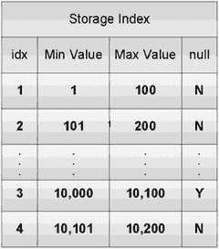
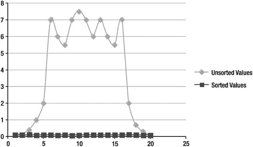

# 空值的特殊优化

对于存储索引而言，空值是一个特例。存储索引结构中有一个单独的标志，用于指示某个存储区域是否包含空值。这个独立的标志使得查询空值（或非空值）的效率比通常进行的最小值/最大值比较更高。以下是一个示例，对比了使用和不使用特殊空值优化时的典型性能：

```
KSO@dbm2> set timing on

KSO@dbm2> select count(*) from skew3 where col1=1000;

  COUNT(*)
----------
         0
Elapsed: 00:00:01.96

KSO@dbm2> select name, value
  2  from v$mystat s, v$statname n
  3  where s.statistic# = n.statistic#
  4  and name like '%storage index%';
NAME                                                                  VALUE
---------------------------------------------------------------- --------------
cell physical IO bytes saved by storage index                       2879774720
Elapsed: 00:00:00.00

KSO@dbm2> select count(*) from skew3 where col1 is null;

  COUNT(*)
----------
        16
Elapsed: 00:00:00.13

KSO@dbm2> select name, value
  2  from v$mystat s, v$statname n
  3  where s.statistic# = n.statistic#
  4  and name like '%storage index%';
NAME                                                                   VALUE
---------------------------------------------------------------- ---------------
cell physical IO bytes saved by storage index                      32299237376
Elapsed: 00:00:00.00
```

在此示例中，可以看到检索少数空值的速度极快。这是因为任何不包含空值的存储区域都无需被读取，因此不会出现需要读取实际数据的误报情况来拖慢此查询。对于任何其他值（除非是该列的最小值或最大值），很可能存在一些无法被排除的存储区域，即使它们实际上并不包含与谓词匹配的值。这正是前一个示例中的情况：第一个查询虽然花了两秒从磁盘读取所有数据，但未返回任何记录。另请注意，空值查询节省的 I/O 量略高于 27 千兆字节（GB），而第一个查询节省的 I/O 量仅约 2.5GB。这意味着第一个查询能够排除的存储区域要少得多。

### 值的物理分布

存储索引的行为与常规索引大不相同。它们维护的是磁盘上所存储值的粗略概览。然而，在某些情况下，它们的机制可以非常有效地消除大量磁盘 I/O，同时保持维护它们的成本相对较低。需要牢记的是，数据在磁盘上的物理分布对存储索引的有效性有重大影响。通过一个图示可以更清晰地说明这一点。

假设你有一个表，其中包含一个具有唯一值的列（即没有重复值）。如果数据在磁盘上的存储方式使得各行按该列排序，那么对于该列的任何一个给定值，都将有且仅有一个存储区域可能包含它。任何在该列上带有等值谓词的查询，最多只需读取一个存储区域。图 4-2 展示了一个排序列的存储索引概念图。



图 4-2. 排序列上的存储索引

从图 4-2 可以看出，如果你想检索值为 102 的记录，只有一个存储区域可能包含该值。

现在假设相同的数据集以随机顺序存储在磁盘上。你认为需要读取多少个存储区域才能通过等值谓词定位到单行数据？这取决于一个存储区域可以容纳多少行，但答案肯定比排序数据集所需的一个存储区域要大得多。

事情就是这么简单。存储索引在排序数据上更有效。从性能角度看，数据在磁盘上排序得越好，使用存储索引时的平均访问时间就越快。对于一个完全排序的列，访问时间应该非常快，而且无论请求什么值，访问时间的变化都应该很小。对于未排序的数据，访问时间在值范围的两端会较快（因为没有多少存储区域的值范围会包含被查询的值）。分布中间值的平均访问时间会有很大差异。图 4-3 是一个比较使用存储索引访问排序和未排序数据的图表。



图 4-3. 存储索引访问时间——排序 vs. 未排序

如你所见，排序数据能提供更好且更一致的结果。既然谈到这一点，我应该指出，在许多情况下，多个列都会受益于存储索引的这种行为特性。在数据仓库环境中，数据通常按日期列进行分区，并且常常有许多其他列也用于跟踪分区键，例如相关的日期（如下单日期、发货日期、插入日期、退货日期）或顺序生成的数字（如订单号）。针对这些列的查询常常存在问题，因为分区消除无法帮助它们。只要在加载前确保数据已预先排序，存储索引就能提供类似于分区消除的益处。这意味着，应将表或分区数据的排序视为数据移动或加载的一部分，以提高不仅限于存储索引，还包括混合列式压缩的效率。然而，一个给定的表或分区只能按一个列进行排序和存储。

### 潜在问题

天下没有免费的午餐。就像生活中的所有事物一样，存储索引也存在一些你应该了解的问题。


## 不正确结果

迄今为止，存储索引最大的问题在于 Exadata 存储软件的早期版本中存在一些导致结果不正确的错误。具体来说，在某些情况下，使用存储索引可能会错误地排除掉实际包含相关记录的存储区域。这种不正确的排除，可能是由于智能扫描使用存储索引时，并发 DML 操作的时序问题所导致。这些错误已在 11.2.0.2 版本及相应的存储服务器补丁中得到修复。在当前时间（Oracle 11.2.0.4/12.1.0.2），结果出错的可能性极低，意味着其发生概率不高于 Oracle 数据库其他部分可能出现的问题。如果您遇到或怀疑遇到此问题，通过将隐藏参数 `_KCFIS_STORAGEIDX_DISABLED` 设置为 `TRUE` 来禁用存储索引使用，可能是诊断查询结果差异的一个选项。如果查询在使用存储索引时确实产生不同的结果，您可以使用此参数在系统范围内禁用存储索引，或者为会话设置此参数，直到应用了适当的补丁。该参数可以通过 `alter session` 命令设置，以便只影响有问题的查询。当然，在启用任何隐藏参数之前，您应该先咨询 Oracle 支持。此外，MOS 笔记 1260804.1（如何诊断智能扫描和错误结果）对于诊断潜在的 Exadata/智能扫描相关问题（包括存储索引返回错误结果）也会有所帮助。

#### 移动目标

存储索引有时会让人感到沮丧，因为它们并不总是在您期望时生效。而且，因为您无法告诉 Oracle 您真的希望某个存储索引存在并被使用，除了尝试理解在某些情况下它们为何不存在或未被使用，以便将来避免这些条件外，您能做的很少。

在存储服务器软件的早期版本中，存储索引被禁用的主要原因之一是隐式数据类型转换。多年来，Oracle 在执行“智能”数据类型转换方面做得越来越好，这些转换不会产生负面的性能后果。例如，如果您编写的 SQL 语句的 `WHERE` 子句将日期字段与字符串进行比较，Oracle 通常会对字符串应用 `to_date` 函数，而不是修改日期列（后者可能产生禁用索引的不良副作用）。不幸的是，当 Exadata 存储软件相对较新时，并非所有的细节都已解决，至少没有达到我们从数据库一侧所习惯的程度。日期问题尤其棘手。以下是使用 `cellsrv` 11.2.1.2.6 的一个示例：

```
SYS@EXDB1> select count(*) from kso.skew3 where col3 = '20-OCT-05';

COUNT(*)
----------
         0

Elapsed: 00:00:14.00
SYS@EXDB1> select name, value
  2  from v$mystat s, v$statname n
  3  where s.statistic# = n.statistic#
  4  and name like '%storage index%';

NAME                                                      VALUE
------------------------------------------------- ---------------
cell physical IO bytes saved by storage index                0

Elapsed: 00:00:00.01
SYS@EXDB1> select count(*) from kso.skew3 where col3 = '20-OCT-2005';

COUNT(*)
----------
         0

Elapsed: 00:00:00.07
SYS@EXDB1> select name, value
  2  from v$mystat s, v$statname n
  3  where s.statistic# = n.statistic#
  4  and name like '%storage index%';

NAME                                                      VALUE
------------------------------------------------- ---------------
cell physical IO bytes saved by storage index     15954337792

Elapsed: 00:00:00.01
```

在这个非常简单的例子中，有一个查询的谓词将一个日期列（`col3`）与一个包含日期的字符串进行比较。一种情况下，字符串包含四位数的年份。另一种情况下，只使用了两位数字。只有使用四位年份格式的查询使用了存储索引。让我们看看这两个语句的执行计划，以了解为什么这两个查询被区别对待：

```
SYS@EXDB1> @fsx2
Enter value for sql_text: select count(*) from kso.skew3 where col3 = %
Enter value for sql_id:
Enter value for inst_id:

SQL_ID            AVG_ETIME  PX OFFLOAD IO_SAVED% SQL_TEXT
------------- ------------- --- ------- --------- ----------------------------------------
2s58n6d3mzkmn           .07   0 Yes        100.00 select count(*) from kso.skew3 where
                                                   col3 = '20-OCT-2005'
fuhmg9hqdbd84         14.00   0 Yes         99.99 select count(*) from kso.skew3 where
                                                   col3 = '20-OCT-05'

2 rows selected.

SYS@EXDB1> select * from table(dbms_xplan.display_cursor('&sql_id','&child_no','typical'));
Enter value for sql_id: fuhmg9hqdbd84
Enter value for child_no:

PLAN_TABLE_OUTPUT
--------------------------------------------------------------------------------------------
SQL_ID  fuhmg9hqdbd84, child number 0
-------------------------------------
select count(*) from kso.skew3 where col3 = '20-OCT-05'

Plan hash value: 2684249835

--------------------------------------------------------------------------
| Id | Operation                   | Name  | Rows | Bytes | Cost (%CPU)| Time     |
--------------------------------------------------------------------------
|  0 | SELECT STATEMENT            |       |      |       |  535K(100)|          |
|  1 |  SORT AGGREGATE             |       |    1 |     8 |            |          |
|* 2 |   TABLE ACCESS STORAGE FULL | SKEW3 |  384 |  3072 |  535K   (2)| 01:47:04 |
```


#### 分区大小

存储索引依赖于智能扫描，而智能扫描又依赖于直接路径读取。正如我们在第 2 章中讨论的，Oracle 通常会对大型对象使用串行直接路径读取。然而，当对象被分区时，Oracle 可能无法识别该对象是“大”的，因为它查看的是每个单独段的大小。这可能导致某些分区无法通过智能扫描机制读取，从而禁用了该分区的任何存储索引。当历史分区被压缩时，问题变得更加明显，因为压缩分区的减小尺寸更不可能触发串行直接路径读取。这个问题可以通过不依赖串行直接路径读取算法来解决，而是为对象指定并行度或使用提示来强制所需的行为。

#### 不兼容的编码技术

最后，有一些编码技术会禁用存储索引。这里有一个例子展示了 `trunc` 函数对日期列的影响：

```sql
KSO@dbm2> select count(*) from skew3 where trunc(col3) = ’20-OCT-2005’;

  COUNT(*)
----------
         0

1 row selected.

Elapsed: 00:00:05.36
```

```sql
KSO@dbm2> @expl
PLAN_TABLE_OUTPUT
-----------------------------------------------------------------------------------------------------------------------------------------------------------
SQL_ID  2mkcfrs28z393, child number 0
-------------------------------------
select count(*) from skew3 where trunc(col3) = ’20-OCT-2005’

Plan hash value: 2684249835

------------------------------------------------------------------------------------
| Id  | Operation                  | Name  | Rows  | Bytes | Cost (%CPU)| Time     |
------------------------------------------------------------------------------------
|   0 | SELECT STATEMENT           |       |       |       |   995K(100)|          |
|   1 |  SORT AGGREGATE            |       |     1 |     8 |            |          |
|*  2 |   TABLE ACCESS STORAGE FULL| SKEW3 |  7167K|    54M|   995K  (3)| 00:00:39 |
------------------------------------------------------------------------------------

Predicate Information (identified by operation id):
---------------------------------------------------

   2 - storage(TRUNC(INTERNAL_FUNCTION("COL3"))=TO_DATE(’ 2005-10-20
              00:00:00’, ’syyyy-mm-dd hh24:mi:ss’))
       filter(TRUNC(INTERNAL_FUNCTION("COL3"))=TO_DATE(’ 2005-10-20
              00:00:00’, ’syyyy-mm-dd hh24:mi:ss’))

22 rows selected.
```

在这个例子中，对日期列应用了一个函数，正如你可能预料的那样，这会禁用存储索引。对列应用函数会禁用存储索令并不太令人惊讶，但 `trunc` 函数的应用是一种常见的编码技术。许多日期包含时间组件，许多查询希望获取特定日期的数据。众所周知，以这种方式截断日期会禁用正常的 B-tree 索引使用。过去，这通常并不重要。许多数据仓库环境中的查询本来就是设计为进行全表扫描，因此确实无需担心禁用索引。存储索引从这个角度改变了游戏规则，可能迫使我们重新思考一些方法。我们将在第 16 章更详细地讨论这个问题。

## 总结

存储索引是一种在数据库能够利用智能表扫描时可用的优化技术。它们可以提供显著的性能改进，尽管最近单元格服务器版本中智能扫描数据在闪存缓存中的缓存使得智能扫描性能更接近存储索引优化后的性能。对于通过跟踪主分区键的备用键访问数据的查询尤其有效。

数据的物理存储方式是一个重要的考虑因素，并对存储索引的有效性产生显著影响。迁移到 Exadata 平台时应谨慎，以确保数据在磁盘上的聚集方式能够允许存储索引被有效使用。还应考虑到，存储索引仅限于八个列，并且是依赖于导致智能扫描的 SQL 谓词而完全自动创建的。

