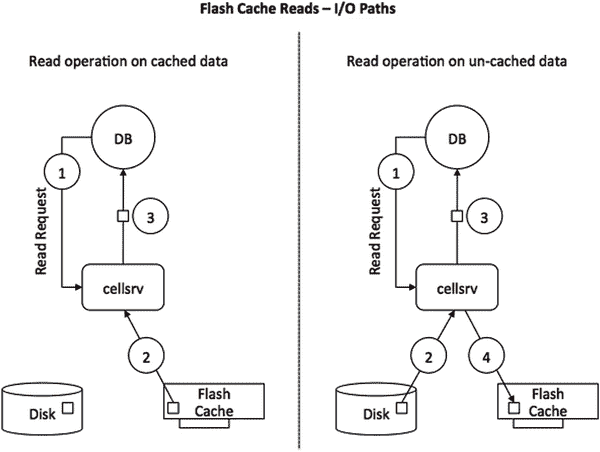
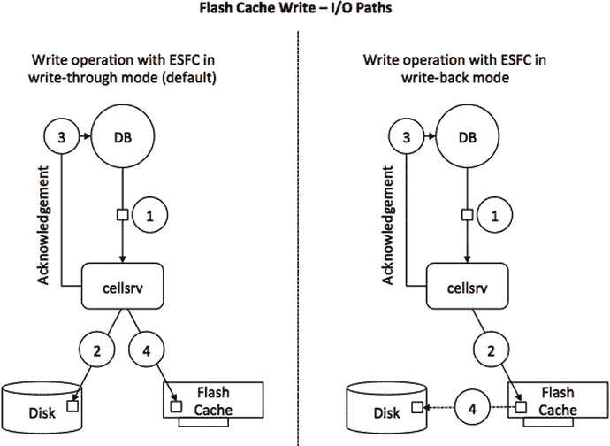

# 使用闪存作为缓存

全闪存的 X5-2 高性能计算节点与高容量型号不同。最显著的区别在于没有了机械旋转磁盘。每个新节点配备了八块 `F160` 卡。每块 `F160` 卡拥有 `1.6TB` 的容量，原始总容量达到 `12.8TB`。在一个完整的机架中，总量为 `179.2 TB`，这比之前的 X4-2 高性能节点的容量略小。尽管 X4-2 节点中的单个磁盘较小（`1.2TB` 对比 `F160` 卡的 `1.6TB`），但 X4-2 节点有 12 个硬盘（加上四块用于缓存的 `F80` 卡），硬盘原始容量约为 `200TB`。没有了旋转磁盘，你别无选择，只能在闪存上为 ASM 创建网格磁盘。你可能会问自己，全闪存节点是否也有缓存？答案是肯定的。当你收到系统发货时，Oracle 会为 `智能闪存缓存` 预留 `5%` 的闪存设备，原因将在下一节描述。

磁盘缓存工作原理的一个非常简化的描述大致如下：当读取请求到达时，I/O 子系统会检查缓存，看请求的数据是否存在于缓存中。如果数据在缓存中，则将其返回给请求进程。如果请求的数据不在缓存中，则从磁盘读取并返回给请求进程。对于未缓存的数据，数据会在返回给请求进程之后被复制到缓存中。这样做是为了确保填充缓存不会减慢 I/O 处理速度。

在大多数企业级存储阵列中，“缓存”是在电池或其他方式保护的 DRAM 中实现的，位于磁盘之前。在 Exadata 平台上，实现了一种不同的概念。作为磁盘控制器上 DRAM 的补充，闪存卡将充当缓存——尽管是一种智能缓存。图 5-1 展示了使用 Oracle 的 `ESFC` 进行读取的 I/O 路径。

图 5-1. 读取操作 I/O 路径的概念模型

当从持久层读取数据时，图 5-1 中标为“DB”的数据库会话发出一个读取操作，该操作最终成为多线程 `cellsrv` 二进制文件中的一个请求。为简单起见，忽略 I/O 资源管理、卸载服务器以及在读取 I/O 异常情况下从区的辅助镜像副本读取的能力，`cellsrv` 软件知道要读取的给定块的位置——无论是从闪存还是从旋转磁盘。根据数据的位置，发出读取操作。图 5-1 所示两种场景的区别在于非缓存读取。如果在 `闪存缓存` 中找不到一块数据，则针对数据所在的硬盘发出读取操作。如果为后续操作缓存数据是有意义的（可能是因为预计会在后续读取中重用），则该数据块会被移入 `闪存缓存`，但仅在将其发送回请求会话之后。

在理想情况下，待扫描的大部分段位于 `闪存缓存` 中，你可以看到这有时会显著降低单块读取和表扫描的响应时间。关于扫描，顺便说一句，速度提升不仅限于智能扫描。如果某个段被缓存在 `ESFC` 中，自 Exadata 版本 `11.2.3.3` 起，其他未卸载的 I/O 访问方法也将受益。

写入与刚才描述的情况不同。考虑图 5-2，它涵盖了 `智能闪存缓存` 的两种操作模式：默认的 `直写` 模式以及 `回写` 模式。

图 5-2. 直写和回写模式下写入操作 I/O 路径的概念模型

注意：X5-2 高性能节点又有所不同：`闪存缓存` 的默认操作模式是 `回写`。可以切换回 `直写` 模式，但这样做意味着放弃快速数据文件创建等功能，因为该功能需要启用 `WBFC`。

此处假设 `ESFC` 在默认的 `直写` 模式下运行，写入操作会绕过（闪存）缓存直接写入磁盘。然而，在向数据库服务器发回确认之后，Oracle 的存储软件随后会将数据复制到缓存中，前提是它适合缓存。这是一个关键点。随写入请求发送的元数据让存储软件知道数据是否可能被再次使用，如果是，数据也会被写入缓存。此步骤在向数据库层发送确认之后完成，以确保写入操作能够尽快完成。

