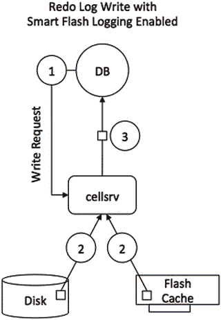
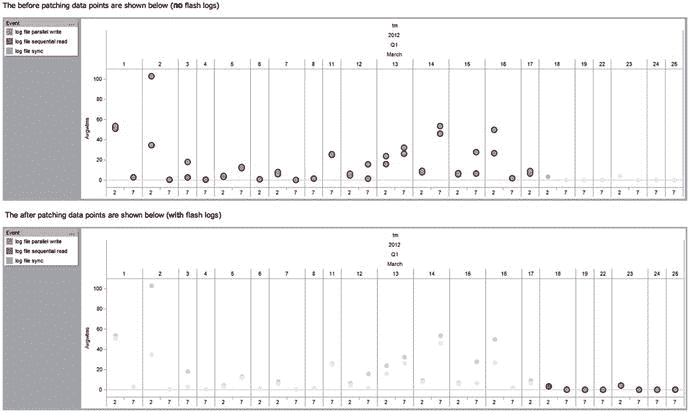
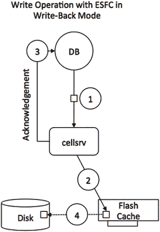

# Exadata 写回闪存缓存与智能扫描优化

## 写回闪存缓存模式概述

您可以稍后在本节中详细了解**写回闪存缓存**模式，但由于其概念非常重要，此处仍展示其高级步骤。在**写回模式**下运行时，所有的 I/O 首先进入闪存设备，而不是磁盘，至少初始如此。可以将**闪存缓存**视作企业级存储阵列中的缓存。如果**闪存缓存**已满，一个算法将评估其内容并将数据从**闪存缓存**写出到磁盘。**写透**与**写回**模式的另一个区别在于，缓存内容在重启后是持久的。由于数据可能位于闪存卡上且尚未写出到磁盘，因此也需要使用 ASM 冗余来保护其免受故障影响。

## Exadata 软件版本 11.2.3.3.0 的变革

从 Exadata 软件版本 `11.2.3.3.0` 开始，Oracle 从根本上改变了数据扫描的方式。在此之前，哪个组件负责什么任务有着明确的区分：**智能闪存缓存**主要用于单块 I/O。**智能扫描**由机械磁盘满足。如果您确实希望将**闪存缓存**用于**智能扫描**，则必须更改相关段的存储子句。其背后的逻辑很有说服力：不同的设备在操作系统中有不同的 I/O 队列，通过将 OLTP 应用程序典型的单块 I/O 与大型多块 I/O 操作分开，可以在相同的 Exadata 硬件上放置具有不同 I/O 工作负载特征的应用程序。再加上 I/O 资源管理器，每个人都拥有一个行为良好的系统。这在 V2 和 X2 的时代尤其有效，这两款系统与当今的 X5 系统相比，可用的闪存都非常少。您所拥有的容量在大多数情况下可能最好用于 OLTP 工作负载。您可以在 AWR 的“等待事件直方图”中针对“`cell single block physical read`”事件看到这一点。在绝大多数情况下，您应该会看到平均等待时间约为 1 毫秒或更短。

## 硬件进步与策略演进

这里有一个注意事项：硬盘性能的增长速度并未与闪存性能同步，后者能够为每个设备提供数千 IOPS，其持续吞吐量是硬盘的许多倍。由于闪存基于硅而非磁记录，其发展周期比硬盘快得多，从而产生更快、更可靠且比上一代更小的组件。总之，闪存允许越来越大的容量，这在 Exadata 平台上得到了体现。X5 中可用的 `F160` 卡容量是其前代产品的两倍。X4 和 X5 中的闪存量，以及在较小程度上 X3 中的闪存，现在为架构师提供了更多的空间来缓存数据，甚至包括全表扫描的数据。这只需要对 `cellsrv` 软件进行更改，该更改随版本 `11.2.3.3.0` 到来。

一旦您使用了这个特定版本（当然，或更新的版本），`cellsrv` 将自动缓存值得缓存的热门数据，包括全表扫描。新版本的发布并未改变小 I/O 的缓存方式。主要区别在于，热门数据可以被缓存并供**智能扫描**使用，而无需更改段的默认存储子句。

## 示例演示的调整

在本书的第一版中，我们曾展示一个示例，演示当**智能扫描**同时使用磁盘和**闪存缓存**时速度能快多少，但这需要将段的存储子句更改为 `CELL_FLASH_CACHE KEEP`。由于默认值已更改，演示也必须随之改变。在本例中，有必要明确禁止对表扫描使用**闪存缓存**以显示差异。为此，创建了两个表：`BIGT` 和 `BIGT_ESFC`。

```sql
SQL> select table_name, num_rows, partitioned, compression, cell_flash_cache
  2  from tabs where table_name in ('BIGT','BIGT_ESFC');
```


`TABLE_NAME                       NUM_ROWS PAR COMPRESS CELL_FL`
`------------------------------ ---------- --- -------- -------`
`BIGT_ESFC                       100000000 NO  DISABLED DEFAULT`
`BIGT                            100000000 NO  DISABLED NONE`
`已选择 2 行。`

`SQL> select segment_name, blocks, bytes/power(1024,3) g`
`2  from user_segments where segment_name in (’BIGT’,’BIGT_ESFC’);`

`SEGMENT_NAME                       BLOCKS          G`
`------------------------------ ---------- ----------`
`BIGT                             16683456 127.284668`
`BIGT_ESFC                        16683456 127.284668`
`已选择 2 行。`

表`BIGT`将作为这里的参考对象；第一次扫描将尽可能少地使用`ESFC`。结果如下：

```sql
SQL> select /*+ gather_plan_statistics without_ESFC */ count(*) from bigt;
```
```
  COUNT(*)
----------
 100000000

已用时间: 00:00:36.23
```

如果您记录性能计数器（您已经见过，并且可以在第 11 章中阅读更多内容），您会发现这些有趣的指标：

```
STAT    cell IO uncompressed bytes                                          136,533,385,216
STAT    cell blocks helped by minscn optimization                            16,666,678
STAT    cell blocks processed by cache layer                                 16,666,678
STAT    cell blocks processed by data layer                                  16,666,673
STAT    cell blocks processed by txn layer                                   16,666,678
STAT    cell num smartio automem buffer allocation attempts                           1
STAT    cell physical IO bytes eligible for predicate offload              136,533,377,024
STAT    cell physical IO interconnect bytes                                   2,690,691,224
STAT    cell physical IO interconnect bytes returned by smart scan            2,690,650,264
STAT    cell scans                                                                       1
...
STAT    physical read IO requests                                            130,346
STAT    physical read bytes                                         136,533,417,984
STAT    physical read total IO requests                                      130,346
STAT    physical read total bytes                                    136,533,417,984
STAT    physical read total multi block requests                              130,340
STAT    physical reads                                                    16,666,677
STAT    physical reads cache                                                        5
STAT    physical reads direct                                               16,666,672
```

请稍等片刻——一切都会变得清晰许多！在针对具有默认存储子句的表进行了几次扫描（全部是智能扫描）之后，`闪存缓存`在执行时间上变得非常明显：

```sql
SQL> select /*+ gather_plan_statistics with_ESFC */ count(*) from bigt_esfc;
```
```
  COUNT(*)
----------
 100000000

已用时间: 00:00:13.23
```

这比非缓存表示例中的 36 秒快了很多，而这样做的好处是开发人员或管理员无需做任何事情。这种加速完全是因为`Exadata`判定该对象是热门对象并对其进行了缓存。再次查看性能计数器，您可以看到有多少 I/O 操作是从`闪存缓存`中得到满足的：

```
STAT    cell IO uncompressed bytes                                          136,533,958,656
STAT    cell blocks helped by minscn optimization                            16,668,279
STAT    cell blocks processed by cache layer                                 16,668,279
STAT    cell blocks processed by data layer                                  16,666,743
STAT    cell blocks processed by txn layer                                   16,668,279
STAT    cell flash cache read hits                                              113,612
STAT    cell num smartio automem buffer allocation attempts                           1
STAT    cell physical IO bytes eligible for predicate offload              136,533,377,024
STAT    cell physical IO interconnect bytes                                   2,690,662,344
STAT    cell physical IO interconnect bytes returned by smart scan            2,690,662,344
STAT    cell scans                                                                       1
...
STAT    physical read IO requests                                            130,411
STAT    physical read bytes                                         136,533,377,024
STAT    physical read requests optimized                                      113,612
STAT    physical read total IO requests                                      130,411
STAT    physical read total bytes                                    136,533,377,024
STAT    physical read total bytes optimized                            118,944,309,248
STAT    physical read total multi block requests                              130,343
STAT    physical reads                                                    16,666,672
STAT    physical reads direct                                               16,666,672
```

如果比较这两个列表，您会发现工作量几乎完全相同。两者之间的差异体现在`cell Flash Cache read hits`和`“physical read ... optimized”`统计信息中。在 130,411 个 I/O 请求中，有 113,612 个被优化了。该演示特意没有使用`WHERE`子句，以迫使进行全表扫描，而不涉及进一步的优化，例如谓词过滤或存储索引来隔离性能提升。第 11 章提供了关于所有这些计数器的更多信息，而第 2 章则解释了智能扫描期间不同类型优化。

### 混合工作负载与 OLTP 优化

当第一版`Exadata`一体机（即所谓的`Exadata V1`）首次亮相时，它主要是一个支持决策支持系统的高性能解决方案。正如您刚才所读到的，闪存从最初的硬件版本中就缺席了。这后来被发现是一个限制，因此下一硬件版本`Exadata V2`成为第一个引入闪存卡的版本。得益于闪存卡和您在本书中读到的其他功能，`Exadata`能够为许多不同类型的工作负载提供高性能和可扩展性。这些工作负载不一定是统一的——高端硬件与存储服务器软件中发现的优化相结合，形成了一个平衡的组合。支持`OLTP`工作负载的关键驱动因素是`Exadata Storage Server Software`和`ESFC`闪存。一旦硬件规格到位，这些组件就能得到很好的利用。就`Exadata`而言，新功能不断被添加到存储服务器软件中。一个重要的`OLTP`优化是在版本`11.2.2.4.x`中引入的，名为智能闪存日志。


### 使用闪存进行数据库日志记录

Exadata Smart Flash Log (`ESFL`) 的目标是优化数据库日志写入。许多有管理 OLTP 类型应用程序背景的数据库管理员（DBA）都**深有体会**，低日志写入延迟至关重要。延迟上一个微小的“抖动”就可能极大地影响 OLTP 环境的整体性能。Smart Flash Logging 通过同时利用磁盘上的重做日志以及在闪存硬件上为`ESFC`分配的一小块空间（称为`Flashlog`）来帮助消除高延迟异常值。理想情况下，顺序的重做日志写入应该全部进入磁盘控制器的缓存。非 Exadata 环境通常使用企业级磁盘阵列，其前端配有或多或少的 DRAM，用于在数据最终落盘（de-staged）前缓存写入操作。为防止断电时数据损坏，这些缓存由电池，或者更近期的超级电容器进行备份保护。

Exadata 数据库一体机的控制器上并没有相同容量的缓存。在 X5-2 型号之前，每个磁盘控制器拥有 512MB 缓存，而 X5-2 型号拥有 1GB。只要缓存未满，写入 I/O 操作就应该能从中受益。然而，在某些情况下，可能会耗尽缓存，导致后续 I/O 请求直接穿透到连接的物理磁盘。当电池备份缓存的电池进入学习周期时，所有代次的 Exadata 一体机也可能发生这种情况。长话短说，磁盘控制器中的回写缓存（write-back cache）有可能回退到直写模式（write-through mode），这可能会对（重做日志）写入的性能产生影响。Smart Flash Logging 是 Oracle 开发的一项技术，通过将闪存卡作为重做日志写入的备用目标，来抵消此问题的负面影响。

Smart Flash Logging 需要 Exadata 存储软件 11.2.2.4 或更高版本，以及 Oracle Database 11.2.0.2 版本配合 Bundle Patch 11。对于 Oracle Database 11.2.0.3 版本，则需要 Bundle Patch 1 或更高版本。即使在闪存较少的系统上，Flash Logging 功能也不会造成侵入性影响。在每个存储单元（cell）上，将预留 512MB 作为重做日志的临时存储位置。

Smart Flash Logging 功能的工作原理如图 5-3 所示。当数据库发出重做日志写入请求时，`cellsrv`软件会同时向磁盘上的重做日志和`ESFL`发出并行写入。一旦第一个写入完成，`cellsrv`就会向请求进程发送写入确认，数据库将继续处理后续事务。在磁盘控制器缓存未饱和的情况下，对硬盘的写入应该比对 Flash Log 的写入更快。


图 5-3.
使用 Smart Flash Log 时重做日志写入的 I/O 路径

得益于 Exadata 的检测工具，你可以精确地看到 Flash Log 的使用情况（或未使用情况）。了解 Flash Log 使用情况的方法是向每个存储单元请求该信息，理想情况下通过`dcli`工具：

```
[oracle@enkdb03 ∼]$ dcli -l cellmonitor -g ./cell_group \
> cellcli -e "list metriccurrent where name like 'FL_.*_FIRST'"
enkcel04: FL_DISK_FIRST          FLASHLOG          10,441,253 IO requests
enkcel04: FL_FLASH_FIRST         FLASHLOG             426,834 IO requests
enkcel05: FL_DISK_FIRST          FLASHLOG          11,127,644 IO requests
enkcel05: FL_FLASH_FIRST         FLASHLOG            466,456 IO requests
enkcel06: FL_DISK_FIRST          FLASHLOG          11,376,268 IO requests
enkcel06: FL_FLASH_FIRST         FLASHLOG            456,559 IO requests
```

通过一个例子可以最好地说明这一点。图 5-4 显示了实施`ESFL`前后的重做日志写入延迟。图中的数据点显示了某条插入语句在凌晨 2 点和早上 7 点的负载时段。


图 5-4.
实施 Exadata Smart Flash Logging 前后的重做日志写入延迟

如你所见，与日志写入器（log-writer）相关的数据点与你预期的更加吻合。令人欣慰的消息是，在本书出版时，绝大多数——如果不是所有——Exadata 系统应该都在使用 Smart Flash Logging。Smart Flash Log 消除了支持者们将闪存用作重做日志的 Grid Disk 的一个论据，从而让你能够将闪存用于真正重要的事情。下一个需要破除的迷思是 Exadata“写入速度慢”。如果配置正确，它很可能并不慢，正如你可以在下一节中读到的那样。


### 使用闪存加速写入

到目前为止，本章主要介绍了智能闪存缓存（Smart Flash Cache）的默认操作模式：直写（write-through）（再次说明，X5-2 高性能单元格是例外，其默认模式是回写缓存）。该缓存也可以选择配置为在回写模式下运行。回写闪存缓存（WBFC）显著提升了您当前 Exadata 配置的写入 IOPS 能力。这项最初在 Exadata X3 代产品中引入的 OLTP 优化功能，向后兼容之前各代的 Exadata 数据库一体机。WBFC 将作为数据库所有写入 I/O 请求的主要处理设备，并且缓存内容在重启后仍然保持持久化。闪存卡设备的故障对用户是透明的，因为这将由 ASM 冗余和 Exadata 存储软件的组合来自动处理。

启用 WBFC 所需的最低 Exadata 存储软件版本是 11.2.3.2.1。My Oracle Support 笔记 888828.1 列出了网格基础设施（Grid Infrastructure）主目录和 RDBMS 主目录的进一步要求。如果需要，请务必应用这些补丁！图 5-5 及后续步骤展示了 WBFC 的工作原理。



图 5-5.

回写模式下闪存缓存使用示意图

如图 5-5 所示，步骤顺序如下：
当数据库发出写请求时，`cellsrv`会将写 I/O 直接发送到闪存设备（序号 1 和 2）。
一旦写入完成，数据库会立即确认该写入（序号 3）。
所有脏块将保留在缓存中，可用于未来的读或写 I/O。ASM 为闪存卡提供冗余，以保护系统免受故障影响。
当某个块不再被访问时，如果出现空间压力，它最终会被淘汰出缓存并写入磁盘（序号 4）。这个过程通常被称为将数据从缓存迁移到磁盘。

为了评估回写闪存缓存的效用，您需要定义一个以写入为主的 I/O 基准测试。Swingbench 套件以订单录入基准测试最为知名。但该套件中还有许多其他值得探索的基准测试。经过进一步研究，本演示找到了一个合适的测试案例，即压力测试。压力测试是一个相对简单的基准测试，它针对一个恰当地命名为`STRESSTESTTABLE`的表，发起四种不同的潜在事务。这些事务涵盖插入、删除、更新和查询，这并不令人意外。与 Swingbench 的典型做法一样，您可以单独定义每个事务对负载的贡献比例。如果您想跟随测试，我们定义所有事务中 15%为插入，10%为查询，55%为更新，20%为删除。与所有存储基准测试一样，您需要一个相当小的缓冲区缓存，以减轻 Oracle 优秀缓存机制的影响。

为了了解 Exadata 系统（在本例中是我们的 X2-2 四分之一机架）能够带来的好处，您需要计算出系统理论上能达到的性能。在这种情况下，X2-2 四分之一机架的数据表显示其约有 6,000 个磁盘 IOPS。如果这个未经 RAC 优化的基准测试能够驱动超过此数值的负载，我们就可以得出结论：回写闪存缓存发挥了作用。在执行基准测试后，这一点确实得到了证实。以下是来自 AWR 报告的 I/O 概况，涵盖了基准测试的执行过程。该测试是在一个 12.1.0.2 数据库的单实例上进行的，使用的是 X2-2 四分之一机架上的 12.1.2.1.0 Exadata 软件。

```
IO Profile                  Read+Write/Second     Read/Second    Write/Second
---------------------------------------------------------------------------
Total Requests:             22,376.6        11,088.3        11,288.3
Database Requests:          20,799.2        11,083.9         9,715.4
Optimized Requests:         20,684.8        11,023.8         9,661.0
Redo Requests:               1,570.1             0.0         1,570.1
Total (MB):                   219.5            86.7           132.7
Database (MB):                194.2            86.7           107.5
Optimized Total (MB):         187.2            86.2           101.1
Redo (MB):                     18.4             0.0            18.4
Database (blocks):          24,853.6        11,094.4        13,759.3
Via Buffer Cache (blocks):  24,844.1        11,094.3        13,749.7
Direct (blocks):                 9.5             0.0             9.5
```

如您所见，AWR 报告显示“总请求”类别下，由单个数据库实例驱动了每秒 22,376 次 I/O 操作，甚至没有针对多实例 RAC 使用进行工作负载优化。这已经超过了数据表中引用的数值。如果我们投入更多时间来调整基准测试，我们相信能够产生更大的负载。不过，请记住引言中提到的，在这个特定基准测试中，读写比例是 10:90，这不一定代表您的 I/O 分布！I/O 概况中存在如此多的读操作，与通过表主键的索引唯一扫描来执行更新语句的方式有关。在本章后续部分，您可以阅读更多关于监控闪存缓存使用情况的内容，并且您将看到`STRESSTESTTABLE`及其关联索引是闪存缓存中被缓存最频繁的对象。

### 其他与 WBFC 相关的优化

独立的缓存空间还提供了其他好处，这就是为什么即使在全闪存的高性能 X5-2 单元格服务器上，默认情况下您仍然会获得一个缓存。在 X5-2 的这些单元格上，闪存缓存被设置为 WBFC，并占用约 5%的可用闪存空间。其中一项优势是快速数据文件创建。以下是一个创建 20GB 表空间的示例。在非 Exadata 系统中，您的会话必须以单线程执行数据文件初始化，并且该线程受制于 I/O 子系统。在 Exadata 上，该操作被设计为跨所有存储服务器并行执行。快速数据文件创建将此过程更进一步。使用它时，只有关于表空间中已分配块的元数据会持久保存在回写闪存缓存中，实际的格式化操作不会立即进行。

```
SQL> create tablespace testdata datafile size 20g;

Tablespace created.

Elapsed: 00:00:00.89
```

对于创建 20GB 的数据文件来说，这个耗时不算太差。会话级统计信息“智能文件初始化节省的物理写入字节数”（cell physical write bytes saved by smart file initialization）和“物理写入总字节数”（physical write total bytes）让您了解到所节省的开销。此功能作为 Exadata 11.2.3.3.0 版本的一部分提供。

另一个与回写闪存缓存相关的有趣功能是存储单元能够限制写入 I/O 的异常值。根据文档集，由老化或损坏的闪存卡引起的写入异常值可能导致 I/O 响应时间变慢，并可以被重定向到不同的卡。如果您使用 Exadata 软件 12.1.2.1.0 和 11.2.0.4 BP 8 或更高版本，您将从该功能中受益。


### ESFC 和 ESFL 是如何创建的

Exadata 智能闪存缓存（Smart Flash Cache）是使用每个存储服务器上的 `cellcli` 实用程序创建和管理的。本节仅提供一个使用 `cellcli` 命令管理智能闪存缓存和智能闪存日志的示例。如果你想了解更多关于这些命令的信息，请参阅 附录 A。除了在每个单元上本地执行 `cellcli` 命令，你还可以利用 `dcli` 实用程序，它可以在多个系统上执行命令（并且功能远不止于此）。

在处理存储服务器上的闪存磁盘时，按顺序执行命令非常重要。你需要在创建闪存缓存（Flash Cache）之前先创建闪存日志（Flash Log）（大多数 Exadata 用户到此为止）。因此，第一个示例展示了如何配置 Exadata 智能闪存日志。你可以使用 `CREATE FLASHLOG ALL` 命令来创建它，如下所示：

```
[root@enkx3cel01 ∼]# cellcli -e create flashlog all

Flash log enkx3cel01_FLASHLOG successfully created

[root@enkx3cel01 ∼]# cellcli -e list flashlog attributes name,size

enkx3cel01_FLASHLOG     512M
```

之前的命令自动从 Exadata 闪存中分配了 512MB 的存储空间，将剩余的可用空间留给 ESFC。请记住，必须在 ESFC 之前创建 ESFL，否则闪存空间将只分配给 ESFC，而不会为闪存日志留下任何空间。

下一步是使用 `CREATE FLASHCACHE` 命令创建闪存缓存。以下是在 X3-2 存储服务器上默认直写（write-through）模式的示例：

```
CellCLI> create flashcache all

Flash cache enkx3cel01_FLASHCACHE successfully created
```

这种形式的命令指示存储软件将缓存分散到所有闪存卡上的所有 FMod（闪存模块）上。如果你真的、真的需要，并且想忽略 MOS 说明 1269706.1 中给出的建议，你可以指定一个大小而不是 "all"，以便在闪存卡上留出一些空间用作闪存磁盘。请注意，闪存缓存会自动分配一个包含存储单元名称的名字。要查看闪存缓存的大小，你可以发出 `LIST FLASHCACHE DETAIL` 命令，如下面 X3-2 单元所示。根据引言所述，当前的 Exadata X5-2 一代拥有更少的 FMOD 和更大的闪存磁盘。输出已重新格式化以便于阅读。在你的终端会话中，你将在一行中看到所有闪存磁盘（FD）：

```
[root@enkx3cel01 ∼]# cellcli -e list flashcache detail

name:                   enkx3cel01_FLASHCACHE

cellDisk:               FD_13_enkx3cel01,FD_14_enkx3cel01,FD_12_enkx3cel01,

FD_03_enkx3cel01,FD_09_enkx3cel01,FD_15_enkx3cel01,

FD_11_enkx3cel01,FD_05_enkx3cel01,FD_08_enkx3cel01,

FD_02_enkx3cel01,FD_04_enkx3cel01,FD_06_enkx3cel01,

FD_10_enkx3cel01,FD_00_enkx3cel01,FD_01_enkx3cel01,

FD_07_enkx3cel01

creationTime:           2014-01-30T22:21:18-06:00

degradedCelldisks:

effectiveCacheSize:     1488.75G

id:                     15b9e304-586c-4730-910f-0e16de67f751

size:                   1488.75G

status:                 normal
```

直到 X5-2 存储服务器，闪存缓存都分布在 16 个单元磁盘上。每个闪存卡上的每个 FMod 都有一个对应的单元磁盘。要获取有关构成闪存缓存的单元磁盘的更多信息，你可以使用 `LIST CELLDISK` 命令，下面是在 X3-2 系统上的示例：

```
[root@enkx3cel01 ∼]# cellcli -e list celldisk attributes name, \

> diskType, size where name like ’FD.*’

FD_00_enkx3cel01        FlashDisk       93.125G

FD_01_enkx3cel01        FlashDisk       93.125G

FD_02_enkx3cel01        FlashDisk       93.125G

FD_03_enkx3cel01        FlashDisk       93.125G

FD_04_enkx3cel01        FlashDisk       93.125G

FD_05_enkx3cel01        FlashDisk       93.125G

FD_06_enkx3cel01        FlashDisk       93.125G

FD_07_enkx3cel01        FlashDisk       93.125G

FD_08_enkx3cel01        FlashDisk       93.125G

FD_09_enkx3cel01        FlashDisk       93.125G

FD_10_enkx3cel01        FlashDisk       93.125G

FD_11_enkx3cel01        FlashDisk       93.125G

FD_12_enkx3cel01        FlashDisk       93.125G

FD_13_enkx3cel01        FlashDisk       93.125G

FD_14_enkx3cel01        FlashDisk       93.125G

FD_15_enkx3cel01        FlashDisk       93.125G
```

由于闪存缓存是在单元磁盘上创建的，因此必须在创建闪存缓存之前先创建单元磁盘，而它们通常在初始配置期间就已经创建好了。如果没有，可以使用 `CREATE CELLDISK` 命令完成：

```
CellCLI> create celldisk all flashdisk

CellDisk FD_00_enkx3cel01 successfully created

CellDisk FD_01_enkx3cel01 successfully created

CellDisk FD_02_enkx3cel01 successfully created

CellDisk FD_03_enkx3cel01 successfully created

CellDisk FD_04_enkx3cel01 successfully created

CellDisk FD_05_enkx3cel01 successfully created

CellDisk FD_06_enkx3cel01 successfully created

CellDisk FD_07_enkx3cel01 successfully created

CellDisk FD_08_enkx3cel01 successfully created

CellDisk FD_09_enkx3cel01 successfully created

CellDisk FD_10_enkx3cel01 successfully created

CellDisk FD_11_enkx3cel01 successfully created

CellDisk FD_12_enkx3cel01 successfully created

CellDisk FD_13_enkx3cel01 successfully created

CellDisk FD_14_enkx3cel01 successfully created

CellDisk FD_15_enkx3cel01 successfully created
```

你也可以通过指定特定的单元磁盘列表，在有限的 FMod 集合上创建闪存缓存。在大多数情况下，这不是必需的，但它是可行的。对于 X5-2，每个闪存卡只有一个 FMod，这种方法就不太实用了。下面是一个例子，仍然在 X3-2 上：

```
CellCLI> create flashcache celldisk=’FD_00_enkx3cel01, FD_01_enkx3cel01’, size=40G

Flash cache enkx3cel01_FLASHCACHE successfully created

CellCLI> list flashcache detail

name:                   enkx3cel01_FLASHCACHE

cellDisk:               FD_01_enkx3cel01,FD_00_enkx3cel01

creationTime:           2014-11-09T15:29:28-06:00

degradedCelldisks:

effectiveCacheSize:     40G

id:                     ad56aa9d-0de4-4713-85f2-19713a13vn3ebb

size:                   40G

status:                 normal
```

再次说明，`cellcli` 的详细使用方法在附录 A 中有更深入的介绍，但本节应能让你对闪存缓存的创建方式有一个基本的了解。


