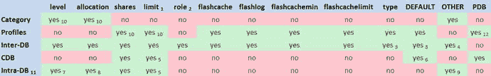

# 数据库并行参数配置与存储层并行化

| 参数 | 默认值 | 描述 |
| --- | --- | --- |
| `parallel_max_servers` |   | 单个实例上可创建的并行从属进程的最大数量。默认值由 `parallel_threads_per_cpu * cpu_count * concurrent_parallel_users * 5` 计算得出。`concurrent_parallel_users` 的值由以下条件决定：<br>- 如果设置了 `SGA_TARGET`：值为 4。<br>- 如果设置了 `PGA_AGGREGATE_TARGET`：值为 2。<br>- 否则为 1。 |
| `parallel_servers_target` |   | 在并行排队启用时，实例上任何给定时间可能正在使用的并行从属进程的上限。默认值由 `parallel_threads_per_cpu * cpu_count * concurrent_parallel_users * 2` 计算得出。`concurrent_parallel_users` 的值由以下条件决定：<br>- 如果设置了 `SGA_TARGET`：值为 4。<br>- 如果设置了 `PGA_AGGREGATE_TARGET`：值为 2。<br>- 否则为 1。 |
| `parallel_min_servers` | `0` | 应保持运行的并行从属进程的最小数量，与使用情况无关。通常设置此参数以消除创建和销毁并行进程的开销。 |
| `parallel_threads_per_cpu` | `2` | 用于各种并行计算，表示一个 CPU 可以支持的并发进程数。请注意，2 是 Oracle 的默认值，而 Oracle Exadata 的建议值是 1。 |
| `parallel_degree_policy` | `MANUAL` | 控制多个并行功能，包括自动并行度 (Auto DOP)、并行语句排队和内存中并行执行。 |
| `parallel_execution_message_size` | `16384` | 并行消息缓冲区的大小（以字节为单位）。 |
| `parallel_degree_level` | `100` | 12c 新增参数。默认 DOP 计算的缩放因子。100 代表 100%，因此将其设置为 50 会将计算出的 DOP 减少一半。 |
| `parallel_force_local` | `FALSE` | 决定并行查询从属进程是强制在启动查询的节点上执行 (TRUE)，还是允许扩散到 RAC 集群中的多个节点 (FALSE)。 |
| `parallel_instance_group` |   | 用于将 RAC 集群中的并行从属进程限制到特定实例。这是通过指定一个服务名称来实现的，该服务被配置为仅限于有限数量的实例。 |
| `parallel_io_cap_enabled` | `FALSE` | 此参数已弃用，当设置为 `IO` 时，由 `parallel_degree_limit` 替代。它与 `DBMS_RESOURCE_MANAGER.CALIBRATE_IO` 函数结合使用，以根据系统的 I/O 能力限制默认的 DOP 计算。 |
| `parallel_degree_limit` | `CPU` | 在自动并行度模式下，指定要使用的并行度上限。当设置为 `CPU` 时，上限为 `parallel_threads_per_cpu * cpu_count * instances`。当设置为 `IO` 时，上限取决于每个进程的 I/O 带宽 / 总系统吞吐量。当设置为一个数字时，它会将语句的最大并行度限制为该数字。 |
| `pga_aggregate_limit` |   | 12c 新增参数。此参数限制实例的 PGA 内存使用量。参见第 7 章（资源管理）。 |
| `parallel_adaptive_multi_user` | `TRUE` | 自动并行查询使用调优的旧机制。该机制通过根据查询启动时的系统负载减少请求的 DOP 来工作。 |
| `parallel_min_time_threshold` | `AUTO` | 触发自动 DOP 的最小估计串行执行时间。默认值为 `AUTO`，即 10 秒。当 `PARALLEL_DEGREE_POLICY` 参数设置为 `AUTO`、`ADAPTIVE` 或 `LIMITED` 时，会在设定的秒数后考虑并行化。如果所有引用的表都使用内存列存储，则此参数默认为 1。 |
| `parallel_server` | `FALSE` | 此参数与并行查询无关。根据数据库是否启用了 RAC，设置为 `TRUE` 或 `FALSE`。此参数很久以前就已弃用，已被 `CLUSTER_DATABASE` 参数取代。 |
| `parallel_server_instances` | `1` | 此参数也与并行查询无关。此参数设置为 RAC 集群中的实例数。 |
| `parallel_automatic_tuning` | `FALSE` | 自 10g 起已弃用。此参数启用了为设置了并行属性的对象自动计算 DOP 的功能。 |
| `parallel_min_percent` | `0` | 旧的节流机制。当并行语句排队未启用时（即 `PARALLEL_DEGREE_POLICY` 设置为 `MANUAL` 或 `LIMITED`），此参数表示并行语句执行所需的并行服务器的最小百分比。 |

表 6-2 中显示的参数控制着在启用自动并行度（通常称为“自动 DOP”）时启用的不同功能。这些参数是下划线参数，这意味着在获得 Oracle 支持部门的许可之前，不应在生产环境中使用它们。

## 选定的控制并行功能的下划线数据库参数

| 参数 | 默认值 | 描述 |
| --- | --- | --- |
| `_parallel_statement_queueing` | `FALSE` | 与自动 DOP 相关。如果设置为 `TRUE`，则启用并行语句排队。 |
| `_parallel_cluster_cache_policy` | `ADAPTIVE` | 与自动 DOP 相关。如果设置为 `CACHED`，则启用内存中并行执行。 |
| `_parallel_cluster_cache_pct` | `80` | 集群中用于内存中并行执行的总缓冲区缓存大小的百分比。默认情况下，大于总缓冲区缓存大小 80% 的段不被视为内存中并行执行的候选对象。 |

### 存储层的并行化

Exadata 在存储层拥有强大的处理能力。在 X4 世代及之前的固定八分之一、四分之一、二分之一或全机架配置中，存储层的 CPU 资源比计算层更丰富。对于 X5 世代，存储服务器从 X4 的两个六核 CPU 升级到 X5 的两个八核 CPU，而计算层对于双路服务器则从 X4 的两个 12 核 CPU 升级到 X5 的两个 18 核 CPU，这意味着对于 X5 世代的双路服务器，计算层的核心数更高。不用说，新的“弹性配置”意味着可以创建任何类型的配置，它完全放弃了计算层和存储层之间平衡的概念，应仅作为最后手段并谨慎考虑。

由于 Smart Scans 将大量处理卸载到存储单元上，每个涉及 Smart Scans 的查询实际上都在存储单元的 CPU 上并行执行。这种类型的并行化与传统的数据库并行处理完全独立。即使活动是由单个数据库服务器上的单个进程驱动的，Smart Scan 并行化也会发生。这引入了一些有趣的问题，在考虑数据库层的常规并行化时应予以考虑。由于并行查询的主要工作之一是允许多个进程参与 I/O 操作，并且 I/O 操作已经分布在多个进程上，因此在 Exadata 平台上运行的语句所需的并行度应小于其他平台。


## 自动并行度 (Auto DOP)

Oracle Database 11g Release 2 中并行操作的主要变化之一，是增加了一个被亲切地称为 **Auto DOP** (自动并行度) 的功能。它的设计初衷是为了解决这样一个问题：对于访问特定对象的所有查询，很少有一个单一的并行度值能普遍适用。在 11gR2 之前，并行度可以通过提示在语句级别指定，或者通过 `DEGREE` 和 `INSTANCE` 设置在对象级别指定。实际上，基于刚才提到的原因，在大多数情况下在语句级别使用提示更有意义。然而，这要求开发人员了解语句将要运行的平台、执行时硬件将要支持的工作负载，以及其他需要资源的进程的并发情况。正确地进行设置可能是一个繁琐的试错过程，而且不幸的是，并行度在语句运行时无法更改。一旦语句开始执行，你唯一的选择就是让它完成或终止它，然后更改并行度设置，再重试一次。这使得在“在线”环境中进行微调成为一个痛苦的过程。

#### 操作与配置

启用 Auto DOP 后，Oracle 会评估每条语句以确定是否应并行运行，如果是，应使用什么并行度。基本上，任何优化器判断串行运行时间超过 10 秒的语句，都将成为并行运行的候选。这个 10 秒的阈值可以通过设置 `PARALLEL_MIN_TIME_THRESHOLD` 参数来控制。做出这个决定时，不会考虑语句所涉及的任何对象是否已被设置并行度。

通过将 `PARALLEL_DEGREE_POLICY` 参数设置为 `AUTO`、`LIMITED` 或 `ADAPTIVE` (12c)，即可启用 Auto DOP。该参数的默认设置是 `MANUAL`，它会禁用所有三个 11gR2 的新并行特性 (Auto DOP、并行语句排队、内存中并行执行)。不幸的是，`PARALLEL_DEGREE_POLICY` 是那种控制多个事项的参数之一。以下列表显示了该参数不同设置的效果：

*   `MANUAL`: 如果 `PARALLEL_DEGREE_POLICY` 设置为 `MANUAL`，则不会启用任何 11gR2 的新并行特性。并行处理将像以前版本一样工作。也就是说，只有使用提示或对象被设置了并行度时，语句才会被并行化。
*   `LIMITED`: 如果 `PARALLEL_DEGREE_POLICY` 设置为 `LIMITED`，则仅启用 Auto DOP，而并行语句排队和内存中并行执行保持禁用。此外，只有访问那些已被设置为默认并行度的对象的语句，才会被考虑进行 Auto DOP 计算。
*   `AUTO`: 如果 `PARALLEL_DEGREE_POLICY` 设置为 `AUTO`，则所有三个新特性都将启用。无论对象级别是否有任何并行设置，语句都将被评估以进行并行执行。
*   `ADAPTIVE (12c)`: 这个新的 12c 参数启用了与前面讨论的 `AUTO` 值相同的功能。除此之外，Oracle 可能会根据语句执行期间收集的反馈，重新评估语句，以便为后续执行提供更好的并行度。

尽管有文档记载的启用并行语句排队和内存中并行执行的唯一方法是通过 `AUTO` 或 `ADAPTIVE` 这种“全有或全无”的设置，但开发人员贴心地提供了隐藏参数，以便独立控制这些特性。表 6-3 展示了这些参数，以及 `PARALLEL_DEGREE_POLICY` 的设置如何影响这些隐藏参数。

表 6-3. 受 PARALLEL_DEGREE_POLICY 影响的隐藏参数

| `Parallel_Degree_Policy` | `参数` | `值` |
| --- | --- | --- |
| `MANUAL` | `_parallel_statement_queuing` | `FALSE` |
|  | `_parallel_cluster_cache_policy` | `ADAPTIVE` |
| `LIMITED` | `_parallel_statement_queuing` | `FALSE` |
|  | `_parallel_cluster_cache_policy` | `ADAPTIVE` |
| `AUTO` | `_parallel_statement_queuing` | `TRUE` |
|  | `_parallel_cluster_cache_policy` | `CACHED` |
| `ADAPTIVE (12c)` | `_parallel_statement_queuing` | `TRUE` |
|  | `_parallel_cluster_cache_policy` | `CACHED` |

`_PARALLEL_STATEMENT_QUEUING` 参数的作用非常明显。当它被设置为 `TRUE` 时，排队功能即启用。`_PARALLEL_CLUSTER_CACHE_POLICY` 参数的用途则不那么明显。事实证明，它控制着内存中并行执行。将 `_PARALLEL_CLUSTER_CACHE_POLICY` 参数的值设置为 `CACHED` 即可启用内存中并行执行。你需要注意，在 Exadata 平台上，内存中并行执行的价值可能相对较低，因为当使用此特性通过并行进程扫描并使用缓冲区高速缓存中的数据时，智能扫描优化将不可用。我们稍后会更详细地讨论这一点。与此同时，这里是一个展示 Auto DOP 实际操作的示例：


`SQL> select owner, table_name, status, last_analyzed, num_rows, blocks, degree`
`2  from dba_tables where owner = 'MARTIN' and table_name = 'BIGT';`
`所有者  表名          状态   最后分析时间  行数      数据块数   并行度`
`------ --------------  --------  ---------  --------- ---------- --------`
`MARTIN BIGT               VALID  24-MAR-15  100000000   16683456        1`

`SQL> alter system set parallel_degree_policy=auto;`
`System altered.`

`SQL> select /* frits1 */ avg(id) from martin.bigt;`
`AVG(ID)`
`-----------`
`500000005`

`SQL> @find_sql`
`Enter value for sql_text: %frits1%`
`Enter value for sql_id:`
`SQL_ID        子进程号  执行计划哈希  执行次数  总耗时(秒) 平均耗时(秒) 用户名 SQL_TEXT`
`------------- ----- ---------- ----- -------- --------- -------- ---------------------------`
`djwmfmzgtjfqu     1 3043090422     1  1087.45   1087.45      SYS select /* frits1 */ avg(id)`
`from martin.bigt`

`SQL> !cat dplan.sql`
```
set verify off
set pages 9999
set lines 150
select * from table(dbms_xplan.display_cursor('&sql_id','&child_no',''))
/
```
`SQL> @dplan`
`Enter value for sql_id: djwmfmzgtjfqu`
`Enter value for child_no:`
```
PLAN_TABLE_OUTPUT
--------------------------------------------------------------------------------------------
SQL_ID  djwmfmzgtjfqu, child number 1
-------------------------------------
select /* frits1 */ avg(id) from martin.bigt

Plan hash value: 3043090422

------------------------------------------------------------------------------------------------------
|Id|操作                          | 名称   |行数|字节|开销(%CPU)|时间     | TQ  |输入输出|PQ 分发    |
------------------------------------------------------------------------------------------------------
| 0|SELECT STATEMENT               |        |    |     | 104K(100)|          |     |      |           |
| 1| SORT AGGREGATE                |        |  1 |   7 |          |          |     |      |           |
| 2|  PX COORDINATOR               |        |    |     |          |          |     |      |           |
| 3|   PX SEND QC (RANDOM)         |:TQ10000|  1 |   7 |          |          |Q1,00| P->S |QC (RAND)  |
| 4|    SORT AGGREGATE             |        |  1 |   7 |          |          |Q1,00| PCWP |           |
| 5|     PX BLOCK ITERATOR         |        |100M| 667M| 104K  (1)|00:00:05 |Q1,00| PCWC |           |
|*6|      TABLE ACCESS STORAGE FULL| BIGT   |100M| 667M| 104K  (1)|00:00:05 |Q1,00| PCWP |           |
------------------------------------------------------------------------------------------------------

谓词信息 (通过操作 ID 标识):
---------------------------------------------------
6 - storage(:Z>=:Z AND :Z<=:Z)

注意
-----
- 自动 DOP: 计算出的并行度为 48，这是由于达到了并行度限制。
```

如你所见，启用自动 DOP 使得该语句能够并行化，尽管该表并未设置并行属性（这意味着该表的并行度属性被设为 1，而不是更高的值或`DEFAULT`）。另外，请注意`DBMS_XPLAN`生成的执行计划输出显示，已启用自动 DOP，计算出的并行度为 48，并且该值 48 是受“并行度限制”约束的。实际上，这是由参数`PARALLEL_DEGREE_LIMIT`设置的。在本例中，参数`PARALLEL_DEGREE_LIMIT`被设置为`CPU`（默认值），这意味着限制值为`PARALLEL_THREADS_PER_CPU` * `CPU_COUNT` * 实例数，在本例中是 1 * 24 * 2，等于 48。

### I/O 校准

Oracle 数据库版本 11.2.0.2 对自动 DOP 引入了一项限制，要求在语句被自动并行化之前，必须先完成 I/O 系统的校准。此限制在版本 12c 中被解除。校准由`DBMS_RESOURCE_MANAGER.CALIBRATE_IO`过程完成，该过程会生成一个随机只读工作负载，并将其分布到 RAC 集群中的所有实例上。该过程可能会给系统带来显著的负载。文档建议在系统空闲或负载非常低时运行它。以下是一个示例，展示了在校准过程未运行且`PARALLEL_DEGREE_POLICY`在 11.2.0.4 上被设置为`limited`、`auto`或`adaptive`时会发生什么：

`SQL> @dplan`
`Enter value for sql_id: 05cq2hb1r37tr`
`Enter value for child_no:`
```
PLAN_TABLE_OUTPUT
---------------------------------------------------------------------------------------
SQL_ID  05cq2hb1r37tr, child number 0
-------------------------------------
select avg(pk_col) from kso.skew a where col1 > 0

Plan hash value: 568322376

---------------------------------------------------------------------------
|  Id | 操作          | 名称 |   行数| 字节 | 开销 (%CPU)| 时间     |
---------------------------------------------------------------------------
|   0 | SELECT STATEMENT   |      |       |       | 44298 (100)|          |
|   1 |  SORT AGGREGATE    |      |     1 |    11 |            |          |
|*  2 |   TABLE ACCESS FULL| SKEW |    32M|   335M| 44298   (1)| 00:01:29 |
---------------------------------------------------------------------------

谓词信息 (通过操作 ID 标识):
---------------------------------------------------
2 - filter("COL1">0)

注意
-----
- 自动 DOP: 因缺少 I/O 校准统计信息而跳过。
已选择 23 行。
```

如你所见，当未进行 I/O 校准时，自动 DOP 被禁用，优化器生成的是一个串行执行计划。当在版本 12.1.0.1 及以上启用自动 DOP 且 I/O 校准未完成时，优化器**将会进行**自动 DOP 的考虑！有两个视图提供有关校准的额外信息。`V$IO_CALIBRATION_STATUS`视图显示校准是否已完成，而`DBA_RSRC_IO_CALIBRATE`视图显示该过程的结果。以下是一个示例，展示了如何查看校准详情、统计`DATA`磁盘组中的磁盘数量，并使用`CALIBRATE_IO`过程：

`SQL> select * from V$IO_CALIBRATION_STATUS;`
```
STATUS        CALIBRATION_TIME
------------- -------------------------------------------------------------
NOT AVAILABLE
```

如果不确定磁盘数量，可以查询数据库可见的、以`DATA`为前缀的单元磁盘数量以进行校准。如果你的`DATA`磁盘组名称略有不同，例如在`DATA`后添加了机架名称，请在`DATA`和`CD`之间添加该名称：

`SQL> select count(*) from v$asm_disk where path like '%DATA_CD%';`
```
  COUNT(*)
----------
        36
```

`SQL> !cat calibrate_io.sql`
```
SET SERVEROUTPUT ON
DECLARE
  lat  INTEGER;
  iops INTEGER;
  mbps INTEGER;
BEGIN
  -- DBMS_RESOURCE_MANAGER.CALIBRATE_IO (<磁盘数>, <最大延迟>, iops, mbps, lat);
  DBMS_RESOURCE_MANAGER.CALIBRATE_IO (&no_of_disks, 10, iops, mbps, lat);
  DBMS_OUTPUT.PUT_LINE ('max_iops = ' || iops);
  DBMS_OUTPUT.PUT_LINE ('latency  = ' || lat);
  dbms_output.put_line('max_mbps = ' || mbps);
end;
/
```

`SQL> @calibrate_io`
`Enter value for no_of_disks: 36`

数据库过程将运行一段时间——在我们的系统上大约需要 15 分钟。该过程将导致数据库在所有实例上生成`csnn`进程，这些进程的数量由磁盘数量参数设置。如果过程完成，它将显示校准结果。例如：
```
max_iops = 11237
latency  = 8
max_mbps = 5511

PL/SQL 过程已成功完成。
```

`SQL> select * from V$IO_CALIBRATION_STATUS;`


`状态        校准时间                           连接 ID`
`------------- ---------------------------------------- ----------`
`就绪         24-MAY-15 07.17.45.086 上午                                  0`

```
SQL> select start_time, MAX_IOPS, MAX_MBPS, MAX_PMBPS, LATENCY, NUM_PHYSICAL_DISKS
from DBA_RSRC_IO_CALIBRATE;

START_TIME                      MAX_IOPS   MAX_MBPS  MAX_PMBPS    LATENCY NUM_PHYSICAL_DISKS
------------------------------ ---------- ---------- ---------- ---------- ------------------
24-MAY-15 07.11.38.691358 上午        11237       5511        400          8                 36
```

这些更改需要重启数据库才能生效。重启后，自动 DOP 将使用校准详情。在某些情况下，可能无法运行校准，或者存在影响校准的错误（例如 11.2.0.2 在捆绑补丁 4 之前的版本），导致为自动生成过高的 DOP 数值，这意味着它将不会被考虑。在这些情况下，可以手动设置重要的校准详情。这在 My Oracle Support (MOS) 注意事项 1269321.1 中有描述。具体操作如下：

```
SQL> delete from resource:io_calibrate$;
SQL> insert into resource:io_calibrate$ values(current_timestamp,
2  current_timestamp, 0, 0, 200, 0, 0);
SQL> commit;
```

设置该值后需要重启数据库。200 这个值是 Oracle Support 推荐给在 Exadata 上运行的客户使用的，也是 Oracle 用于在 Exadata 上测试自动 DOP 的值。

### 自动 DOP 总结

将 `PARALLEL_DEGREE_POLICY` 设置为 `AUTO` 的最终结果是，所有类型的语句都将并行运行，即使没有对象被特别标注并行度设置。这确实是真正的自动并行处理，因为数据库决定什么并行运行以及使用多少从属进程。此外，默认情况下，这些从属进程可能会分布在 RAC 数据库中的多个节点上。不幸的是，这种功能组合有点像狂野西部，事情在各处并行运行。然而，并行语句排队的能力确实提供了一定的秩序感，这引出了下一个主题。

我们发现，在很多情况下，自动 DOP 对计算出的 DOP 过于乐观。一个值得注意的参数是 `PARALLEL_DEGREE_LEVEL`，当该参数的值设置为低于默认值 100 时，可用于调低计算出的 DOP。其他限制（自动）DOP 的方法包括 `PARALLEL_DEGREE_LIMIT` 和数据库资源管理器。

### 并行语句排队

当 Oracle 在 Oracle 版本 7 中首次引入并行查询功能时，Larry Ellison 在一个多处理器服务器上进行了演示，他是唯一的用户。CPU 的利用率以图形方式显示，当演示并行查询功能时，所有 CPU 都在全速运行。我们想知道如果当时数据库中还有其他用户，他们在演示期间会有什么体验。很可能他们的体验不会好。这正是并行语句排队试图解决的问题。

Oracle 的并行能力是一份伟大的礼物，但也是一个诅咒，因为在一个多用户试图共享资源的环境中控制这头野兽充其量是困难的。人们曾尝试提出一种合理的方法来限制大的并行语句。但到目前为止，我认为这些尝试并不太成功。

Exadata 最有前途的方面之一是它能够运行混合工作负载（OLTP 和 DW）而不损害其中任何一个。为了做到这一点，Oracle 需要某种机制来分离工作负载，同样重要的是，限制资源密集型的并行查询。并行语句排队似乎正是这样一种工具。当与资源管理器结合使用时，它提供了一个相当健壮的机制，可以将工作负载限制在硬件可以支持的水平。

#### 旧方法

在我们介绍新的并行排队功能之前，我们可能应该回顾一下在之前的版本中是如何做的。我们拥有的最佳工具是并行自适应多用户（Parallel Adaptive Multiuser），它提供了在查询执行时根据工作负载自动降低给定语句并行度的能力。这实际上是一个强大的机制，也是我们在 11gR2 之前拥有的最佳方法。通过将 `PARALLEL_ADAPTIVE_MULTI_USER` 参数设置为 `TRUE` 可以启用此功能。顺便说一句，这仍然是 12c 的默认设置，所以这绝对是一个您可能需要考虑更改的参数。这种方法的一个缺点是，并行语句的并行度可能变化很大，因此执行时间也是如此。可以想象，一个语句这次获得了 32 个从属进程，而下次却被降级为串行执行，这很可能不会让用户感到高兴。

支持这种方法的论点是，如果系统繁忙，无论你做什么，查询都会运行得更慢，而且用户也期望在系统繁忙时运行得更慢。该论点的第一部分可能是真的，但我不相信第二部分（至少在大多数情况下）。然而，降级机制更大的问题在于，关于使用多少从属进程的决定是基于一个时间点——并行语句开始的时间点。回想一下，一旦为执行计划设置了并行度（DOP），就无法更改。即使在其运行期间有更多资源变得可用，该语句也会以分配给它的从属进程数量运行到完成。

考虑一个需要一分钟执行、使用 32 个从属进程的语句，并假设由于瞬间高负载，同一语句被降级为串行。现在，假设在其开始几秒钟后，系统负载回落到更正常的水平。不幸的是，这个串行语句将继续以其单个进程运行近 30 分钟，尽管平均系统负载并不比平时更忙。这种不稳定的性能会对使用系统和支持系统的人造成严重破坏。


### 新方式

现在，让我们比较一下**并行自适应多用户**（旧方式）与 11gR2 中引入的新机制，该机制允许并行语句排队。这种机制将长时间运行的并行查询与其他工作负载分离开来。其机制相当简单。启用该功能。使用 `PARALLEL_SERVERS_TARGET` 参数设置并行从属进程的目标数量。运行一个应该是资源密集型的查询。如果一个需要超过目标数的语句尝试启动，它将被排队，直到所需的从属进程数量可用。当然，有许多细节需要考虑，以及可以应用于管理此过程的其他控制机制。让我们看看它的行为：

```sql
SQL> alter system set parallel_degree_policy=auto;

系统已更改。

SQL> alter system set parallel_servers_target=10;

系统已更改。

SQL> @parms

输入 parameter 的值: parallel%

输入 isset 的值:

输入 show_hidden 的值:

NAME                                                          VALUE       ISDEFAUL
-------------------------------------------------- ---------   --------
parallel_adaptive_multi_user                                 TRUE        FALSE
parallel_automatic_tuning                                    FALSE       TRUE
parallel_degree_level                                        100         TRUE
parallel_degree_limit                                        CPU         TRUE
parallel_degree_policy                                       AUTO        FALSE
parallel_execution_message_size                              16384       FALSE
parallel_force_local                                         FALSE       TRUE
parallel_instance_group                                                        TRUE
parallel_io_cap_enabled                                      FALSE       TRUE
parallel_max_servers                                         240         FALSE
parallel_min_percent                                           0         TRUE
parallel_min_servers                                           0         FALSE
parallel_min_time_threshold                                  AUTO        TRUE
parallel_server                                              TRUE        TRUE
parallel_server_instances                                      2         TRUE
parallel_servers_target                                        10        TRUE
parallel_threads_per_cpu                                        1        FALSE
```

为了执行多个使用自动 DOP 的 SQL 语句并使它们排队，我们需要一个小脚本，如下所示。该脚本执行 10 个 `sqlplus` 进程，并使用“&”将其置于后台。末尾的 `wait` 命令等待所有后台进程完成。

```bash
T=0
while [ $T -lt 10 ]; do
echo "select avg(id) from t1;" | sqlplus -S ts/ts &
let T=$T+1
done
wait
echo "Finished."
```

现在执行上面的脚本。如果我们通过 `DBMS_XPLAN` 查看输出，我们会看到，由于上面设置的 `PARALLEL_SERVERS_TARGET` 为 10，Auto DOP 计算出执行需要 10 个从属进程：

```sql
SQL> @dplan b46903fft8uz4

输入 sql_id 的值: b46903fft8uz4
输入 child_no 的值:

PLAN_TABLE_OUTPUT
--------------------------------------------------------------------------------------------
SQL_ID  b46903fft8uz4, child number 2
-------------------------------------
select avg(id) from t1

Plan hash value: 3110199320

------------------------------------------------------------------------------------------------------------------------
| Id  | Operation                   | Name      |   Rows| Bytes | Cost (%CPU)| Time     |     TQ |IN-OUT| PQ Distrib |
------------------------------------------------------------------------------------------------------------------------
|   0 | SELECT STATEMENT            |           |       |       | 64140 (100)|          |        |      |            |
|   1 |  SORT AGGREGATE             |           |     1 |     6 |            |          |        |      |            |
|   2 |   PX COORDINATOR            |           |       |       |            |          |        |      |            |
|   3 |    PX SEND QC (RANDOM)      | :TQ10000  |     1 |     6 |            |          |  Q1,00 | P->S | QC (RAND)  |
|   4 |     SORT AGGREGATE          |           |     1 |     6 |            |          |  Q1,00 | PCWP |            |
|   5 |      PX BLOCK ITERATOR      |           |   100M|   572M| 64140   (1)| 00:00:02 |  Q1,00 | PCWC |            |
|*  6 |       TABLE ACCESS STORAGE FULL| T1       |   100M|   572M| 64140   (1)| 00:00:02 |  Q1,00 | PCWP |            |
------------------------------------------------------------------------------------------------------------------------

Predicate Information (identified by operation id):
---------------------------------------------------
   6 - storage(:Z>=:Z AND :Z<=:Z)

Note
-----
   - automatic DOP: Computed Degree of Parallelism is 10
```

在执行脚本启动多个 `sqlplus` 会话来执行并行化的表扫描之后，我们可以看到语句排队生效。首先，如果我们查看活动的并行查询进程数量，我们发现活动的并行查询进程数量没有超过设置的 10 个的限制：

```sql
SQL> select * from v$px_process_sysstat where statistic like '%In Use%';

STATISTIC                                     VALUE     CON_ID
---------------------------------------- ---------- ----------
Servers In Use                                 10          0
```

实际上，限制未被超过的原因正是并行语句排队，这可以在 `V$SQL_MONITOR` 和等待接口中看到：

```sql
SQL> select sid, sql_id, sql_exec_id, sql_text from v$sql_monitor where status='QUEUED';

SID SQL_ID            SQL_EXEC_ID SQL_TEXT
----- ------------- ----------- ------------------------------
  588 b46903fft8uz4    16777250 select avg(id) from t1
  396 b46903fft8uz4    16777254 select avg(id) from t1
  331 b46903fft8uz4    16777251 select avg(id) from t1
  265 b46903fft8uz4    16777253 select avg(id) from t1
  463 b46903fft8uz4    16777255 select avg(id) from t1
  654 b46903fft8uz4    16777256 select avg(id) from t1
  263 b46903fft8uz4    16777252 select avg(id) from t1
  200 b46903fft8uz4    16777249 select avg(id) from t1
  166 b46903fft8uz4    16777249 select avg(id) from t1
已选择 9 行。

SQL> @snapper ash=event+wait_class 1 1 all

正在以 1 秒的间隔对所有 SID 进行采样，获取 1 个快照...

-- Session Snapper v4.11 BETA - by Tanel Poder ( http://blog.tanelpoder.com ) - 享受地球上最先进的 Oracle 故障排除脚本吧！ :)

---------------------------------------------------------------
Active% | EVENT                               | WAIT_CLASS
---------------------------------------------------------------
   800% | resmgr:pq queued                    | Scheduler
   700% | cell smart table scan               | User I/O
   300% | ON CPU                              | ON CPU
--  ASH 快照 1 结束, 结束时间=2015-05-25 07:17:51, 持续秒数=1, 采样次数=5

PL/SQL 过程已成功完成。
```


在此清单中有几处值得注意。为了设置所需条件，我们启用了自动 DOP（Auto DOP），这同时也启用了并行排队（Parallel Queueing），然后将`PARALLEL_SERVER_TARGET`参数设置为一个非常低的数值（10），以便更容易触发排队。接着，我们使用一个 Shell 脚本来执行 10 条受自动 DOP 影响的语句。查看`V$PX_PROCESS_SYSSTAT`可知，活跃的并行查询服务器不超过 10 个，这与`PARALLEL_SERVERS_TARGET`参数的设置相符。`V$SQL_MONITOR`显示这些语句确实在排队。这一点很重要。所有使用并行查询的语句都会出现在`V$SQL_MONITOR`视图中。请注意，此视图需要 Tuning Pack 许可。如果它们的状态是`QUEUED`，则表示它们并未实际执行，而是在等待足够的并行从属进程变为可用。我们运行了 Tanel Poder 的 Snapper 脚本来查看这些排队语句正在等待什么事件。如你所见，等待事件是`resmgr: pq queued`。

注意

关于等待事件，还有一点你应该了解。与并行排队相关，存在一个等待事件的变化。此示例是使用 Oracle Database 12.1.0.2 创建的。如果你使用的是 11.2.0.1，你会看到一组不同的等待事件（有两个）。第一个是`PX Queuing: statement queue`。这是当一个语句轮到运行时它所等待的事件。另一个是`enq: JX - SQL statement queue`。当语句在队列中前面还有其他语句时，它会等待此事件。这种方案似乎相当笨拙，这可能就是它在后续版本中被更改的原因。

#### 控制并行排队

有几种机制可用于控制并行语句排队（Parallel Statement Queueing）功能的行为。基本方法是使用先进先出（FIFO）的排队机制。但也有办法在排队框架内对工作进行优先级排序。还可以通过提示（hint）完全绕过排队机制。反过来，即使数据库级别未启用并行语句排队功能，也可以通过提示为语句启用排队。还有一些参数会影响排队行为。最后，资源管理器（Resource Manager）有能力影响语句的排队方式。

### 使用参数控制排队

有几个参数会影响并行排队的行为。前两个是`PARALLEL_MAX_SERVERS`（设置每个实例的并行查询从属进程的最大数量）和`PARALLEL_SERVERS_TARGET`参数（设置当并行查询从属进程的使用数量达到多少时，希望并行执行的语句需要排队）。

`PARALLEL_MAX_SERVERS`的默认值计算如下：

```
parallel_threads_per_cpu * cpu_count * concurrent_parallel_users * 5
```

`PARALLEL_SERVERS_TARGET`的默认值计算如下：

```
parallel_threads_per_cpu * cpu_count * concurrent_parallel_users * 2
```

`concurrent_parallel_users`的确定方式为：

*   如果设置了`SGA_TARGET`：则为 4。
*   如果设置了`PGA_AGGREGATE_TARGET`：则为 2。
*   否则为 1。

对于大多数混合工作负载系统来说，这个计算值几乎肯定高于你想要的值，因为它旨在让并行查询进程完全消耗可用的 CPU 资源。允许长时间运行的并行语句完全消耗服务器，意味着对响应时间敏感的 OLTP 类型语句可能会受到影响。你还应该注意，活动的服务器进程数量可能超过参数允许的数量。由于分配给一个查询的从属进程数量可能是 DOP（并行度）的两倍，因此偶尔可能会超过目标值。

在 12c 中，如果使用了`PARALLEL_STMT_CRITICAL`资源管理指令（本章稍后讨论），建议将`PARALLEL_SERVERS_TARGET`设置为`PARALLEL_MAX_SERVERS`的 50-75%，以便绕过并行队列的关键查询能够利用剩余的并行从属进程。

注意

如果`PARALLEL_MAX_SERVERS`的计算值大于`PROCESSES`参数的值，则`PARALLEL_MAX_SERVERS`参数将被减小到低于`PROCESSES`参数的值。你将在实例启动时的警报日志中看到此行为的发生。

```
Mon May 06 18:43:06 2013
Adjusting the default value of parameter parallel_max_servers
from 160 to 135 due to the value of parameter processes (150)
Starting ORACLE instance (normal)
```

另一个值得讨论的参数是隐藏参数`_PARALLEL_STATEMENT_QUEUING`，它用于开启和关闭此功能。正如在自动 DOP 部分已经讨论过的，当`PARALLEL_DEGREE_POLICY`参数设置为`AUTO`时，此参数会被设置为`TRUE`。但是，也可以手动设置此隐藏参数，以独立地开启和关闭并行排队。

自动 DOP 计算仍然有点令人担忧，所以很好有一种方法可以开启并行排队功能，而无需让 Oracle 完全控制哪些语句并行运行。当然，由于这涉及设置隐藏参数，在没有 Oracle 支持部门批准的情况下，你不应在生产环境中这样做。尽管如此，这里再提供一个快速示例，展示可以在不启用自动 DOP 或内存中并行执行的情况下开启排队：

```
SQL > alter system set parallel_degree_policy=manual sid='*';
System altered.
SQL > alter table ts.t1 parallel (degree 8);
Table altered.
SQL> @parms
Enter value for parameter: parallel
Enter value for isset:
Enter value for show_hidden:
NAME                                               VALUE
-------------------------------------------------- ------
parallel_adaptive_multi_user                       TRUE
parallel_automatic_tuning                          FALSE
parallel_degree_level                              100
parallel_degree_limit                              CPU
parallel_degree_policy                             MANUAL
parallel_execution_message_size                    16384
parallel_force_local                               TRUE
parallel_instance_group
parallel_io_cap_enabled                            FALSE
parallel_max_servers                               128
```


`parallel_min_percent                       0`

`parallel_min_servers                       32`

`parallel_min_time_threshold                AUTO`

`parallel_server                            TRUE`

`parallel_server_instances                  2`

`parallel_servers_target                    10`

`parallel_threads_per_cpu                   1`

`T=0`

`while [ $T -lt 10 ]; do`

`echo "select avg(id) from t1;" | sqlplus -S ts/ts &`

`let T=$T+1`

`done`

`wait`

`echo "Finished."`

`SQL> select * from v$px_process_sysstat where statistic like '%In Use%';`

`STATISTIC                      VALUE     CON_ID`

`------------------------------ ----- ----------`

`Servers In Use                    80          0`

首先，我们将 `PARALLEL_DEGREE_POLICY` 设置为 manual。这会禁用自动并行度、语句排队和内存中并行查询。接着，我们将 T1 表的并行度装饰为八。然后我们查看了名称中包含 `PARALLEL` 的参数值。为了示例方便，我们将 `PARALLEL_FORCE_LOCAL` 设置为 `TRUE`，因此上述脚本的所有 `sqlplus` 会话都将在当前实例中使用并行查询从属进程。然后我们执行了该脚本。如你所见，10 个会话都分配了它们的八个并行查询从属进程，因为我们看到有 80 个服务器在使用中。

现在将未记录的参数 `_PARALLEL_STATEMENT_QUEUING` 设置为 `TRUE`，并重新运行脚本以创建 10 个会话：

`SQL> alter system set "_parallel_statement_queuing"=true sid='*';`

`System altered.`

`T=0`

`while [ $T -lt 10 ]; do`

`echo "select avg(id) from t1;" | sqlplus -S ts/ts &`

`let T=$T+1`

`done`

`wait`

`echo "Finished."`

`SQL> select * from v$px_process_sysstat where statistic like '%In Use%';`

`STATISTIC                      VALUE     CON_ID`

`------------------------------ ----- ----------`

`Servers In Use                    12          0`

此输出表明在未开启自动并行度的情况下启用了语句排队。请注意，这涉及一个隐藏参数，这意味着如果你想在生产环境中应用此技术，应与 Oracle 支持讨论如何设置此参数。

### 使用 Hint 控制语句排队

有两个 Hint 可用于在语句级别控制并行语句排队。一个 Hint，`NO_STATEMENT_QUEUING`，允许完全绕过排队过程，即使该功能在实例级别已开启。另一个 Hint，`STATEMENT_QUEUING`，则会开启排队机制，即使该功能在实例级别未启用。`STATEMENT_QUEUING` Hint 提供了一种在不开启自动并行度的情况下使用排队功能的有文档记载的途径。

### 使用资源管理器控制排队

Oracle 的数据库资源管理器提供了额外的控制并行语句排队的能力。虽然全面讨论 DBRM 超出了本章范围，但我们将介绍一些与并行查询相关的特定功能。第 7 章将更详细地介绍 DBRM。

没有 DBRM 时，并行语句队列严格按先进先出（FIFO）方式运行。DBRM 提供了几个指令属性，可用于在消费者组基础上提供额外控制。这些控制中有许多是在 11.2.0.2 版本中引入的。表 6-4 列出了 DBRM 提供的一些额外功能。

**表 6-4.** DBRM 并行语句排队控制

| 控制 | 描述 |
| --- | --- |
| 指定超时 | `PARALLEL_QUEUE_TIMEOUT` 指令属性可用于为消费者组设置最大排队时间。时间限制以秒为单位设置，一旦到期，语句将终止并报错（ORA-07454）。请注意，此指令直到数据库版本 11.2.0.2 才可用。 |
| 指定最大并行度 | `PARALLEL_DEGREE_LIMIT_P1` 指令属性设置可分配给单个语句的并行从属进程的最大数量。这等同于 `PARALLEL_DEGREE_LIMIT` 数据库参数，但用于基于不同用户集合设置限制。 |
| 管理出队顺序 | `MGMT_P1`、`MGMT_P2`、... `MGMT_P8` 指令属性可用于改变正常的 FIFO 处理。此属性允许在作为 CPU 和 I/O 的资源百分比分配（数据库内 IO 资源管理）之外，对出队进行优先级排序。这八个属性中的每一个基本上都提供一个不同的出队优先级级别。所有带有 `MGMT_P1` 属性的语句将在任何带有 `MGMT_P2` 的语句之前出队。除了出队优先级外，还可以分配一个概率数字来调节同一级别内语句的出队。 |
| 限制并行从属进程百分比 | `PARALLEL_TARGET_PERCENTAGE` 指令属性可用于将消费者组限制为系统可用并行从属进程的某个百分比。因此，如果系统在开始排队前允许 64 个从属进程处于活动状态，且 `PARALLEL_TARGET_PERCENTAGE` 设置为 50，则该消费者组将只能使用 32 个从属进程。请注意，此指令直到数据库版本 11.2.0.2 才可用。在 12c 中，`PARALLEL_SERVER_LIMIT` 取代了此指令。 |
| 将多个 SQL 作为一组排队 | `DBMS_RESOURCE_MANAGER` 包中的 `BEGIN_SQL_BLOCK` 和 `END_SQL_BLOCK` 过程通过将单个语句视为同时提交来配合并行语句排队工作。其思路是块中的所有语句都会一起出队，防止个别语句保持排队状态。该机制需要用 `BEGIN` 和 `END` 过程调用包围独立的 SQL 语句。请注意，此过程直到数据库版本 11.2.0.2 才可用。 |
| 关键并行语句优先级 | 在 12c 版本中，引入了 `PARALLEL_STMT_CRITICAL` 指令，当该指令为某个消费者组设置为 `BYPASS_QUEUE` 时，可使并行语句绕过语句队列。属于属性设置为 `BYPASS_QUEUE` 的消费者组的所有用户发出的查询都将绕过并行语句队列并立即执行。通过绕过机制，请求的并行从属进程总数可能超过 `PARALLEL_SERVERS_TARGET`。请注意，无论当前实际使用的并行查询进程有多少，关键查询都会运行，这意味着如果当前并行查询从属进程的使用量已达到 `PARALLEL_MAX_SERVERS`，则可能会遇到降级，甚至更糟，变为串行执行。这就是为什么你应该在 `PARALLEL_SERVERS_TARGET` 和 `PARALLEL_MAX_SERVERS` 之间保留一些缓冲空间。 |

DBRM 指令可能相当复杂。下面是一个修改自《Oracle® Database VLDB and Partitioning Guide 12c Release 1 (12.1.0.2)》的示例，展示了如何利用并行语句排队功能：

```
BEGIN
DBMS_RESOURCE_MANAGER.CLEAR_PENDING_AREA();
DBMS_RESOURCE_MANAGER.CREATE_PENDING_AREA();
--新计划
DBMS_RESOURCE_MANAGER.CREATE_PLAN(
'DAYTIME_PLAN',
'优先运行短查询的计划'
);
--消费者组
DBMS_RESOURCE_MANAGER.CREATE_CONSUMER_GROUP(
'MEDIUM_TIME',
'中等：运行时间在 1 到 10 分钟之间'
);
DBMS_RESOURCE_MANAGER.CREATE_CONSUMER_GROUP(
'LONG_TIME',


`’运行时间超过 10 分钟的长时间任务’`
`);

`--指令`
`DBMS_RESOURCE_MANAGER.CREATE_PLAN_DIRECTIVE(`
`’DAYTIME_PLAN’,`
`’SYS_GROUP’,`
`’针对 SYS 和高优先级查询的指令’,`
`MGMT_P1 => 100,`
`PARALLEL_STMT_CRITICAL => ’BYPASS_QUEUE’`
`);`
`DBMS_RESOURCE_MANAGER.CREATE_PLAN_DIRECTIVE(`
`’DAYTIME_PLAN’,`
`’OTHER_GROUPS’,`
`’针对运行时间少于 1 分钟的 SQL 的指令’,`
`MGMT_P2 => 70,`
`PARALLEL_DEGREE_LIMIT_P1 => 4,`
`SWITCH_TIME => 60,`
`SWITCH_ESTIMATE => TRUE,`
`SWITCH_FOR_CALL => TRUE,`
`SWITCH_GROUP => ’MEDIUM_TIME’`
`);`
`DBMS_RESOURCE_MANAGER.CREATE_PLAN_DIRECTIVE(`
`’DAYTIME_PLAN’,`
`’MEDIUM_TIME’,`
`’针对运行时间在 1 到 10 分钟之间的 SQL 的指令’,`
`MGMT_P2 => 20,`
`PARALLEL_SERVER_LIMIT => 75,`
`SWITCH_TIME => 600,`
`SWITCH_ESTIMATE => TRUE,`
`SWITCH_FOR_CALL => TRUE,`
`SWITCH_GROUP => ’LONG_TIME’`
`);`
`DBMS_RESOURCE_MANAGER.CREATE_PLAN_DIRECTIVE(`
`’DAYTIME_PLAN’,`
`’LONG_TIME’,`
`’针对运行时间超过 10 分钟的 SQL 的指令’,`
`MGMT_P2 => 10,`
`PARALLEL_SERVER_LIMIT => 50,`
`PARALLEL_QUEUE_TIMEOUT => 3600`
`);`
`DBMS_RESOURCE_MANAGER.VALIDATE_PENDING_AREA();`
`DBMS_RESOURCE_MANAGER.SUBMIT_PENDING_AREA();`
`END;`
`/`

这个示例需要一些解释：

创建了资源计划`DAYTIME_PLAN`。定义了两个使用者组：`MEDIUM_TIME`和`LONG_TIME`。还有另外两个使用者组（`SYS_GROUP`和`OTHER_GROUPS`）是自动创建的。

第一条指令是针对`SYS_GROUP`使用者组。该组通过`MGMT_P1`配置被分配了 100%的优先级，这意味着它优先于其他组。此外，该组绕过了语句队列。

第二条指令是针对`OTHER_GROUPS`使用者组，这是默认的使用者组。该指令规定，优化器应评估每条 SQL 语句，如果估计执行时间超过 60 秒（`SWITCH_TIME`），会话应切换到`MEDIUM_TIME`使用者组（`SWITCH_GROUP=>’MEDIUM_TIME’`）。一旦 SQL 执行完毕，会话会切换回`OTHER_GROUPS`使用者组（`SWITCH_FOR_CALL=>TRUE`）。出队优先级（`MGMT_P2`）设置为 70%的概率，意味着语句应在任何`MGMT_P1`语句之后出队，并且在与其他`MGMT_P2`语句比较时有 70%的概率出队。最大并行度（DOP）由`PARALLEL_DEGREE_LIMIT_P1`属性设置为 4。

第三条指令是针对`MEDIUM_TIME`使用者组。该指令也包含一个切换，如果 Oracle 估计 SQL 语句执行时间将超过 10 分钟，则将会话移动到`LONG_TIME`组。此外，该指令将出队优先级设置为第二优先级组（`MGMT_P2`）的 20%。该指令还对可能使用的并行从属进程百分比设置了限制（`PARALLEL_SERVER_LIMIT`）。在这种情况下，系统中允许的总从属进程的 80%是该使用者组中的会话可使用的最大值。

最后一条指令是针对`LONG_TIME`使用者组。该组中的会话与其他组相比，出队优先级非常低（`MGMT_P2=10`）。它还将并行从属进程的百分比限制在 50%。最后，由于该组中的语句可能排队很长时间，`PARALLEL_QUEUE_TIMEOUT`属性被设置为 14,400 秒。因此，如果一个语句排队了四个小时，它将因超时错误而失败。

在该计划真正运行之前，还需要完成一些额外的设置。如果使用者组不是`OTHER_GROUPS`，则需要授予会话一个使用者组作为其初始使用者组。在我们的示例中并非如此，因此我们不必使用`DBMS_RESOURCE_MANAGER.SET_INITIAL_CONSUMER_GROUP`过程。但是，我们希望当指令中设置的规则适用时，会话能切换到`MEDIUM_TIME`或`LONG_TIME`组。这意味着在该计划工作之前，我们必须使用`DBMS_RESOURCE_MANAGER_PRIVS.GRANT_SWITCH_CONSUMER_GROUP`过程。在此示例中，`KSO`用户被授予了切换权限。这需要针对所有受此计划影响的数据库用户完成：

```
BEGIN
DBMS_RESOURCE_MANAGER_PRIVS.GRANT_SWITCH_CONSUMER_GROUP(’KSO’,’MEDIUM_TIME’,FALSE);
DBMS_RESOURCE_MANAGER_PRIVS.GRANT_SWITCH_CONSUMER_GROUP(’KSO’,’LONG_TIME’,FALSE);
END;
/
```

#### 并行语句排队总结

本节比 11gR2 中对其他两个新并行特性的介绍要详细得多。它还包含了版本 12c 中添加的一些增强功能。这是因为该特性是使 Exadata 能够有效处理混合工作负载的关键组件。它使我们能够有效地处理对吞吐量和响应时间都敏感的语句混合。如果没有这个特性，在不严重影响其中一方的情况下提供足够的资源将非常困难。

### 内存中并行执行

在 11gR2 之前，并行化的查询完全忽略了缓冲区缓存。Oracle 假设并行查询只会在非常大的表上进行，而这些表可能永远不会有很大比例的块位于缓冲区缓存中。这一假设导致了这样的结论：直接从磁盘读取数据会更快。此外，用全表扫描的大量块淹没缓冲区缓存是不希望的，因此 Oracle 开发了一种称为直接路径读取的机制，它绕过了正常的缓存机制，直接将块读入用户的程序全局区（`PGA`）。

内存中并行执行特性采用了一种不同的方法。它试图为并行查询利用缓冲区缓存。该特性具有集群感知性，旨在跨集群节点（即 RAC 数据库实例）分布数据。数据块也被关联到单个节点，减少了节点之间的通信和数据传输次数。当然，目标是通过消除磁盘 I/O 来加速并行查询。这可能是一种可行的技术，因为现在许多系统拥有非常大的内存，这当然可以提供比磁盘操作显著的速度优势。然而，这种方法也有一些缺点。关于 Exadata 最大的缺点是，此特性会禁用所有智能扫描优化。在这方面，12c 中通过初始化参数将缓冲区缓存拆分为大表扫描缓存和 OLTP 缓存的新选项几乎没有提供什么安慰——智能扫描很可能比跨多个缓冲区缓存的 n 路扫描更快。

请注意，我们实际上从未在 Exadata 的野外环境中见过内存中并行查询。这可能是件好事，因为内置于 Exadata 中的许多优化依赖于 offloading，而 offloading 又依赖于直接路径读取。当然，如果在数据库服务器上访问内存中的块，就不会进行直接路径读取。在大多数平台上，内存访问会比从磁盘直接路径读取快得多。但在 Exadata 上，消除磁盘 I/O 也消除了大量可用于过滤和其他操作的 CPU。这意味着，对于并行执行访问缓冲区缓存，实际上可能比让存储服务器参与 SQL 语句的执行效率更低。

注意

12.1.0.2 数据库补丁集引入了内存中选项（`In-Memory Column Store`，`Vector Processing`和`In-Memory Aggregation`）。版本 12.1.0.1 引入了其他内存中缓存（`Automatic Big Table Caching`和`Full Database Caching`）特性，在同时运行 OLTP 的同时进一步加速了 Exadata 的分析能力。尽管这些确实是伟大的新特性，但进一步介绍它们超出了本章的范围。


此时，可能有必要做一个小演示。值得注意的是，要让此特性生效，需要付出相当大的努力。以下是我们为使其工作而采取的基本步骤。首先，我们必须找到一个查询，该查询的优化器估计运行时间将超过 `PARALLEL_MIN_TIME_THRESHOLD` 参数指定的秒数（假设该语句未被并行化）。此参数的默认值为 `AUTO`，即 10 秒。我们将此参数设置为 1 秒，以便更容易触发内存中并行行为。此外，该查询还必须针对一张表，该表应能几乎完全放入由所有参与的 RAC 实例共同提供的聚合缓冲区缓存中。为简化操作，我们通过将 `PARALLEL_FORCE_LOCAL` 参数设置为 `TRUE`，将处理限制在单个实例上。当然，我们必须将 `PARALLEL_DEGREE_POLICY` 设置为 `AUTO` 以启用该特性。我们还将 `PARALLEL_SERVERS_TARGET` 和 `PARALLEL_DEGREE_LIMIT` 设置为非常低的值。以下是我们用于测试该特性的参数设置以及查询的相关信息：

```
SYS@dbm2> @parms

Enter value for parameter: parallel

Enter value for isset:

Enter value for show_hidden:

NAME                                               VALUE    ISDEFAUL
-------------------------------------------------- -------- ----------
fast_start_parallel_rollback                       LOW      TRUE
parallel_adaptive_multi_user                       FALSE    FALSE
parallel_automatic_tuning                          FALSE    TRUE
parallel_degree_level                              100      TRUE
parallel_degree_limit                              8        FALSE
parallel_degree_policy                             AUTO     FALSE
parallel_execution_message_size                    16384    FALSE
parallel_force:local                               TRUE     FALSE
parallel_instance:group                                     TRUE
parallel_io_cap_enabled                            FALSE    TRUE
parallel_max_servers                               720      TRUE
parallel_min_percent                               0        TRUE
parallel_min_servers                               0        FALSE
parallel_min_time_threshold                        1        FALSE
parallel_server                                    TRUE     TRUE
parallel_server_instances                          4        TRUE
parallel_servers_target                            8        FALSE
parallel_threads_per_cpu                           1        FALSE
recovery_parallelism                               0        TRUE

19 rows selected.
```

```
SYS@dbm2> @pool_mem

AREA                                 MEGS
------------------------------
384.0
free memory                       1,162.5
fixed_sga                            7.3
streams pool                         .0
log_buffer                         248.7
shared pool                      2,011.3
large pool                          26.2
buffer_cache                     4,352.0
----------
sum                              8,192.0

8 rows selected.
```

```
SYS@dbm2> @table_size

Enter value for owner: KSO
Enter value for table_name: SKEWIMPQ
Enter value for type:

OWNER        SEGMENT_NAME                   TYPE           TOTALSIZE_MEGS TABLESPACE_NAME
------------ ------------------------------ -------------- -------------- ------------------
KSO          SKEWIMPQ                       TABLE                 3,577.0 USERS
--------------
sum                                                   3,577.0
```

```
SYS@dbm2> select owner, table_name, status, last_analyzed, num_rows, blocks, degree, cache
  2      from dba_tables where owner = 'KSO' and table_name = 'SKEWIMPQ';

OWNER      TABLE_NAME STATUS   LAST_ANALYZED          NUM_ROWS      BLOCKS DEGREE CACHE
---------- ---------- -------- -------------------   ---------- ---------- ------ ----
```


`KSO        SKEWIMPQ   VALID    2015-02-14:06:52:31   89599778      451141      1     Y`

因此，此实例上的缓冲区缓存大小约为 4.3G，而表的大小约为 3.5G。我们使用的查询很简单，无法从存储索引中获益，因为几乎所有记录都满足单个 `WHERE` 子句：

```
SYS@dbm2> select count(*) from kso.skewimpq;

COUNT(*)
----------
89599778

1 row selected.

SYS@dbm2> select count(*) from kso.skewimpq where col1 > 0;

COUNT(*)
----------
89599776

1 row selected.
```

现在，我们将展示运行查询之前、第一次运行查询之后以及第二次运行查询之后的一些统计数据：

```
SYS@dbm2> alter system flush buffer_cache;

System altered.

SYS@dbm2> @mystats
Enter value for name: reads
NAME VALUE
----------------------------------------------------------------------
--------------- SecureFiles DBFS Link streaming reads 0
cold recycle reads 0
data blocks consistent reads - undo records applied 0
gc cluster flash cache reads failure 0
gc cluster flash cache reads received 0
gc cluster flash cache reads served 0
gc flash cache reads served 0
lob reads 0
physical reads 7
physical reads cache 7
physical reads cache for securefile flashback block new 0
physical reads cache prefetch 0
physical reads direct 0
physical reads direct (lob) 0
physical reads direct for securefile flashback block new 0
physical reads direct temporary tablespace 0
physical reads for flashback new 0
physical reads prefetch warmup 0
physical reads retry corrupt 0
recovery array reads 0
session logical reads 14
session logical reads - IM 0
session logical reads in local numa group 0
session logical reads in remote numa group 0
transaction tables consistent reads - undo records applied 0

25 rows selected.

SYS@dbm2> select avg(pk_col) from kso.skewimpq where col1 > 0;

AVG(PK_COL)
-----------
16228570.2

SYS@dbm2> @mystats
Enter value for name: reads
NAME VALUE
----------------------------------------------------------------------
--------------- SecureFiles DBFS Link streaming reads 0
cold recycle reads 0
data blocks consistent reads - undo records applied 0
gc cluster flash cache reads failure 0
gc cluster flash cache reads received 0
```


`gc cluster flash cache reads served`                                                  `0`

`gc flash cache reads served`                                                          `0`

`lob reads`                                                                            `0`

`physical reads`                                                                  `450216`

`physical reads cache`                                                            `450216`

`physical reads cache for securefile flashback block new`                              `0`

`physical reads cache prefetch`                                                   `446512`

`physical reads direct`                                                                `0`

`physical reads direct (lob)`                                                          `0`

`physical reads direct for securefile flashback block new`                             `0`

`physical reads direct temporary tablespace`                                           `0`

`physical reads for flashback new`                                                     `0`

`physical reads prefetch warmup`                                                       `0`

`physical reads retry corrupt`                                                         `0`

`recovery array reads`                                                                 `0`

`session logical reads`                                                           `453226`

`session logical reads - IM`                                                           `0`

`session logical reads in local numa group`                                            `0`

`session logical reads in remote numa group`                                           `0`

`transaction tables consistent reads - undo records applied`                           `0`

`25 rows selected.`

仔细观察这些统计数据可以发现，所有发生的读取操作都进入了缓存（统计项：`physical reads cache`），而通常情况下，对大型段执行的“常规”全表扫描会通过直接读取完成到会话 PGA（统计项：`physical reads direct`）。这一点也可以通过等待接口观察到：多块读取到缓存在非 Exadata 平台上表现为`db file scattered read`事件，在 Exadata 上表现为`cell multiblock physical read`事件；而读取到 PGA 则表现为`direct path read`事件，在 Exadata 上这可以卸载为智能扫描（Smart Scans），具体表现为`cell smart table scan`或`cell smart index scan`事件。这种扫描实际上填充了缓冲区缓存。让我们再次执行相同的查询，看看是否能利用已读入缓冲区缓存的数据：

```
SYS@dbm2> select avg(pk_col) from kso.skewimpq where col1 > 0;

AVG(PK_COL)
-----------
16228570.2
```

```
SYS@dbm2> @mystats
Enter value for name: reads
NAME                                                                             VALUE
---------------------------------------------------------------------- ---------------
SecureFiles DBFS Link streaming reads                                                `0`
cold recycle reads                                                                   `0`
data blocks consistent reads - undo records applied                                  `0`
gc cluster flash cache reads failure                                                 `0`
gc cluster flash cache reads received                                                `0`
gc cluster flash cache reads served                                                  `0`
gc flash cache reads served                                                          `0`
lob reads                                                                            `0`
physical reads                                                                  `528923`
physical reads cache                                                            `528923`
physical reads cache for securefile flashback block new                              `0`
physical reads cache prefetch                                                   `518528`
```


`physical reads direct`                                                                `0`

`physical reads direct (lob)`                                                          `0`

`physical reads direct for securefile flashback block new`                             `0`

`physical reads direct temporary tablespace`                                           `0`

`physical reads for flashback new`                                                     `0`

`physical reads prefetch warmup`                                                       `0`

`physical reads retry corrupt`                                                         `0`

`recovery array reads`                                                                 `0`

`session logical reads`                                                           `906435`

`session logical reads - IM`                                                           `0`

`session logical reads in local numa group`                                            `0`

`session logical reads in remote numa group`                                           `0`

`transaction tables consistent reads - undo records applied`                           `0`

`25 行已选择。`

对 `SKEWIMPQ` 表的第二次扫描使 `session logical reads` 统计数据翻了一番（`906435`/`2` 大致等于第一次运行后看到的逻辑读取值 `453226`），但物理读取统计数据仅增加了 `78707`（`528923`-`450216`），这表明所有其他逻辑读取均通过缓存满足。

如果使用 `DBMS_XPLAN.DISPLAY_CURSOR` 来显示执行计划，Oracle 会揭示是否使用了内存中并行查询：

```
SYS@dbm2> @dplan

PLAN_TABLE_OUTPUT
----------------------------------------------------------------------------------------------
SQL_ID  31q77xaa06ggz, child number 2
-------------------------------------
select avg(pk_col) from kso.skewimpq where col1 > 0

Plan hash value: 3471853810

------------------------------------------------------------------------------------------------------------------------
| Id  | Operation                      | Name     | Rows  | Bytes | Cost (%CPU)| Time     |    TQ  |IN-OUT| PQ Distrib |
------------------------------------------------------------------------------------------------------------------------
|   0 | SELECT STATEMENT               |          |       |       | 17043 (100)|          |        |      |            |
|   1 |  SORT AGGREGATE                |          |     1 |    11 |            |          |        |      |            |
|   2 |   PX COORDINATOR               |          |       |       |            |          |        |      |            |
|   3 |    PX SEND QC (RANDOM)         | :TQ10000 |     1 |    11 |            |          |  Q1,00 | P->S | QC (RAND)  |
|   4 |     SORT AGGREGATE             |          |     1 |    11 |            |          |  Q1,00 | PCWP |            |
|   5 |      PX BLOCK ITERATOR         |          |    95M|  1002M| 17043   (1)| 00:00:01 |  Q1,00 | PCWC |            |
|*  6 |       TABLE ACCESS STORAGE FULL| SKEWIMPQ |    95M|  1002M| 17043   (1)| 00:00:01 |  Q1,00 | PCWP |            |
------------------------------------------------------------------------------------------------------------------------

Predicate Information (identified by operation id):
---------------------------------------------------
6 - storage(:Z>=:Z AND :Z<=:Z AND "COL1">0)
    filter("COL1">0)

Note
-----
- 使用了动态统计信息：动态采样 (level=AUTO)
- 自动并行度：计算出的并行度为 8，因为达到了并行度限制
- 并行扫描与缓冲区缓存关联

SYS@dbm2> @fsx2
输入 sql_text 的值：
输入 sql_id 的值： 31q77xaa06ggz

SQL_ID          AVG_ETIME       PX            OFFLOAD SQL_TEXT
-------------  ----------   ------- -------  --------------------------------------
31q77xaa06ggz       14.37     8 No            select avg(pk_col) from kso.skewimpq
                                             where col1 > 0

已选择 1 行。
```

# 内存中并行查询分析与验证

`DBMS_XPLAN.DISPLAY_CURSOR` 显示该语句已并行执行，这可以从以“PX.”开头的行源中看出。这里最有趣的是 `DISPLAY_CURSOR` 输出的 **注意** 部分：其中“针对缓冲区缓存的并行扫描”这一行明确表明扫描使用了缓冲区缓存，这意味着使用了内存中并行查询（In-Memory Parallel Query）。

## 获取间接证据

内存中并行查询的间接证据可以通过 `fsx2.sql` 脚本找到。当我们输入查询的 `SQL_ID` 后，可以看到该语句由八个并行查询服务器（`PX` 列）执行，并且没有使用智能扫描（`OFFLOAD` 列），而这在常规（非内存中 PX）的并行查询扫描执行中是必然发生的。另请注意，`fsx2.sql` 脚本报告了 `AVG_ETIME` 的估计值，该值远大于执行实际花费的时间。这是因为 `v$sql` 将耗时报告为所有从属进程耗时的总和。将此数字除以从属进程数可以得到一个估计值，但由于从属进程的耗时可能差异很大，该估计值不会完全准确。

## 禁用内存中并行执行

现在让我们将内存中并行执行与系统在不使用该功能时的行为进行比较。我们可以通过几种方式禁用此功能。文档记载的方法是将 `PARALLEL_DEGREE_POLICY` 参数设置为 `MANUAL`。然而，这也会禁用自动并行度（Auto DOP）和并行语句排队（Parallel Statement Queueing）。另一种方法是将隐藏参数 `_PARALLEL_CLUSTER_CACHE_POLICY` 设置为 `ADAPTIVE`：

```sql
SYS@dbm2> alter system set "_parallel_cluster_cache_policy"=adaptive;

System altered.
```

## 性能统计对比

### 禁用前（使用内存中并行查询）

```sql
SYS@dbm2> @mystats
Enter value for name: reads
NAME                                                                          VALUE
---------------------------------------------------------------------- ---------------
SecureFiles DBFS Link streaming reads                                                0
cold recycle reads                                                                   0
data blocks consistent reads - undo records applied                                  0
gc cluster flash cache reads failure                                                 0
gc cluster flash cache reads received                                                0
gc cluster flash cache reads served                                                  0
gc flash cache reads served                                                          0
lob reads                                                                            0
physical reads                                                                       0
physical reads cache                                                                 0
physical reads cache for securefile flashback block new                              0
physical reads cache prefetch                                                        0
physical reads direct                                                                0
physical reads direct (lob)                                                          0
physical reads direct for securefile flashback block new                             0
physical reads direct temporary tablespace                                           0
physical reads for flashback new                                                     0
physical reads prefetch warmup                                                       0
physical reads retry corrupt                                                         0
recovery array reads                                                                 0
session logical reads                                                               17
session logical reads - IM                                                           0
session logical reads in local numa group                                            0
session logical reads in remote numa group                                           0
transaction tables consistent reads - undo records applied                           0
25 rows selected.
```

### 禁用后（使用传统并行查询）

```sql
SYS@dbm2> select avg(pk_col) from kso.skewimpq where col1 > 0;

AVG(PK_COL)
-----------
16228570.2

SYS@dbm2> @mystats
Enter value for name: names
NAME                                                                          VALUE
---------------------------------------------------------------------- ---------------
SecureFiles DBFS Link streaming reads                                                0
cold recycle reads                                                                   0
data blocks consistent reads - undo records applied                                  0
gc cluster flash cache reads failure                                                 0
gc cluster flash cache reads received                                                0
gc cluster flash cache reads served                                                  0
gc flash cache reads served                                                          0
lob reads                                                                            0
physical reads                                                                  450207
physical reads cache                                                                 0
physical reads cache for securefile flashback block new                              0
physical reads cache prefetch                                                        0
physical reads direct                                                           450207
physical reads direct (lob)                                                          0
physical reads direct for securefile flashback block new                             0
physical reads direct temporary tablespace                                           0
physical reads for flashback new                                                     0
physical reads prefetch warmup                                                       0
physical reads retry corrupt                                                         0
recovery array reads                                                                 0
session logical reads                                                           450895
session logical reads - IM                                                           0
session logical reads in local numa group                                            0
session logical reads in remote numa group                                           0
transaction tables consistent reads - undo records applied                           0
25 rows selected.
```

```sql
SYS@dbm2> @fsx2
Enter value for sql_text: %avg(pk_col)%
Enter value for sql_id:
SQL_ID             AVG_ETIME        PX OFFLOAD SQL_TEXT
-------------      ----------   -------- ----------------------------------------
31q77xaa06ggz           14.37       8 No      select avg(pk_col) from kso.skewimpq
                                              where col1 > 0
31q77xaa06ggz            5.92       8 Yes     select avg(pk_col) from kso.skewimpq
                                              where col1 > 0
2 rows selected.
```

## 故障排除并行执行

请注意，在禁用**内存中并行执行**时，统计信息显示物理读取和逻辑读取的数量大致相同，这与首次运行以填充缓冲区缓存的前一个示例类似。但是，现在不是将统计信息 `physical reads cache` 增加到与 `physical reads` 统计量相同的量，而是统计信息 `physical reads direct` 增加到与 `physical reads` 统计量相同的量。另请注意，`fsx2.sql` 脚本显示共享池中有一个新的游标，该游标由八个并行从属进程执行，并卸载到了存储层。这是一个重要的点。内存中并行执行禁用了 Exadata 通过智能扫描提供的优化。这应该是显而易见的，因为磁盘 I/O 大部分已被内存中并行执行功能消除，但我们认为该功能在 Exadata 平台上不如在其他平台上有用，这也是主要原因。卸载查询显示更短的已用时间（`AVG_ETIME`）的原因在于，大部分处理被卸载到了存储层，这意味着并行进程的处理被进一步并行化，只有结果才会被发送到数据库层。

在 Oracle 11.2 版本之前的时代，当遇到并行执行问题时，清晰地了解整个集群的情况以及并行服务器之间相应工作负载的分布是一项相当大的挑战。更具挑战性的是回答诸如“为什么我的 SQL 只是部分并行化？”这样的问题。

实时 SQL 监控的引入解决了一些仪表化问题，并通过提供跨并行服务器的资源消耗交互式显示以及执行计划每个步骤的 SQL 统计详细信息，允许 DBA 和开发人员更详细地分析并行执行。在 11gR2 和 12c 中，`V$SQL_MONITOR` 视图中增加了有关资源管理和并行分配详细信息的额外列，情况已大为改善。本节不会详细讨论如何解读 SQL 监控报告。相反，它将重点介绍如何利用那些暴露 SQL 监控报告所用信息的视图，以及其他视图，以便进行快速故障排查，并发现降级何时发生以及内存中并行执行何时启动。

使用以下 SQL，您可以收集额外信息，例如 “px_in_memory” 表示查询已针对内存进行亲和性设置，或者用普通话说，正在执行内存中并行查询：

```
SQL> !cat other_xml.sql
select t.*
from v$sql_plan v,
xmltable(
'/other_xml/info'
passing xmltype(v.other_xml)
columns
info_type varchar2(30) path '@type',
info_value varchar2(30) path '/info'
) t
where v.sql_id = '&sql_id'
and v.child_number = &child_number
and other_xml is not null;
SQL> alter session set parallel_degree_policy=manual;
系统已更改。
SQL> select avg(pk_col) from kso.skew2;
AVG(PK_COL)
-----------
62500.2406
SQL> @find_sql
输入 sql_text 的值: %skew2%
输入 sql_id 的值:
SQL_ID          CHILD  PLAN_HASH  EXECS   ETIME AVG_ETIME USERNAME              SQL_TEXT
------------- ------  ---------- ----- ------- --------- -------- ---------------------
atb3q75xavzb6      0  4220890033     1   10.13     10.13      SYS    select avg(pk_col)
from kso.skew2
SQL> @other_xml
输入 sql_id 的值: atb3q75xavzb6
输入 child_number 的值: 0
INFO_TYPE                       INFO_VALUE
------------------------------ ---------------
db_version                      12.1.0.2
parse_schema                    "SYS"
plan_hash_full                  1438813450
plan_hash                       4220890033
plan_hash_2                     1438813450
```

在这种情况下，额外信息并未揭示很多额外信息。事实上，没有什么大的意外。但是，让我们将 `PARALLEL_DEGREE_POLICY` 设置为 `AUTO` 并再次执行查询：

```
SQL> alter session set parallel_degree_policy=auto;
系统已更改。
SQL> select avg(pk_col) from kso.skew2;
AVG(PK_COL)
-----------
62500.2406
SQL> @find_sql
输入 sql_text 的值: %skew2%
输入 sql_id 的值:
SQL_ID          CHILD  PLAN_HASH  EXECS   ETIME AVG_ETIME USERNAME             SQL_TEXT
------------- ------  ---------- ----- ------- --------- --------------------
atb3q75xavzb6      0  4220890033     1   10.13     10.13      SYS   select avg(pk_col)
from kso.skew2
atb3q75xavzb6      2  2117817910     1  113.39    113.39      SYS   select avg(pk_col)
from kso.skew2
SQL> @other_xml
输入 sql_id 的值: atb3q75xavzb6
输入 child_number 的值: 2
INFO_TYPE                       INFO_VALUE
------------------------------ -----------
derived_cpu_dop                         15
derived_io_dop                           3
dop                                     15
px_in_memory_imc                        no
px_in_memory                           yes
io_rate                                200
derived_io_dop                           3
cpu_rate                              1000
derived_cpu_dop                         16
cpu_rate                              1000
derived_cpu_dop                         16
cpu_rate                              1000
derived_cpu_dop                         16
db_version                        12.1.0.2
parse_schema                      "SYS"
plan_hash_full                  3329629242
plan_hash                       2117817910
plan_hash_2                     3329629242
```

这个子游标显示了更多与并行查询相关的信息。事实上，我们现在可以看到发生了内存中并行查询，因为 “px_in_memory” 是 “yes”。另外，我们可以看到并行度为 15；“dop” 是 “15”。当不使用自动 DOP 时，`other_xml` 将显示与并行执行相关的额外信息：

```
INFO_TYPE                       INFO_VALUE
------------------------------ ---------------
derived_cpu_dop                              0
derived_io_dop                               0
dop_reason                     table property
dop                                        8
px_in_memory_imc                           no
px_in_memory                               no
```

## 总结

语句的并行执行对于最大化 Exadata 平台上的吞吐量至关重要。Oracle 数据库版本 11gR2 和 12c 包含多项新特性和增强功能，使并行执行成为一个更可控的功能，这在平台承载混合工作负载时尤为重要。`自动 DOP` 功能旨在根据单个语句自动做出关于 DOP 的智能决策。`内存中并行执行` 在 Exadata 平台上可能不如在非 Exadata 平台上那样有用，因为它禁用了随 `智能扫描` 而来的优化。`并行语句排队` 是一个非常有用的功能，因为它允许面向吞吐量的工作与响应时间敏感的工作共存。与 `数据库资源管理器` 的集成通过提供对排队机制的大量额外控制和优先级划分，进一步增强了此功能。


# 7. 资源管理

如果资源是无限的，就无需管理它们。我们在日常生活的方方面面都能看到这一点。如果你的车是路上唯一的车，那么交通信号灯就没有必要。如果你是银行里唯一的顾客，那么蜿蜒形成有序队列的绳子就无需存在。但是，众所周知，这种情况很少见，数据库服务器也是如此。当系统负载较轻时，几乎不需要资源管理。进程会在相当一致的时间段内完成。但是当系统变得繁忙、资源变得稀缺时，我们可能会发现自己面对的是一群愤怒的用户。

从数据库的 8i 版本开始，Oracle Database Resource Manager 就已推出，其功能用于管理数据库内部的资源。没有 DBRM，所有数据库连接都被赋予相同的优先级，它们由操作系统调度程序以某种轮询方式提供服务。当系统负载繁重时，所有会话都会受到同等影响。低优先级的应用程序与业务关键型应用程序获得同样高的优先级。我们常常看到一些编写拙劣的即席查询降低了使用相同数据库的关键任务应用程序的性能。如果你担任 DBA 的时间足够长，尤其是在数据仓库环境中，你可能熟悉 Unix 的`renice`命令。这是一个 root 级别的命令，允许你在操作系统层面影响进程的 CPU 优先级。多年前，我们曾在一个 DBA 小组工作，支持一个负载特别繁重的数据仓库。`renice`命令经常被用来限制主导系统的数据库会话的 CPU 优先级。这种方法有几个明显的问题。首先，`renice`命令是一个仅对 root 用户可用的特权命令，系统管理员不太愿意授予 DBA 访问权限。第二个问题是，自动化它来管理 CPU 资源充其量是困难的。Oracle 的 Database Resource Manager 是解决这个问题的一种更优雅的解决方案。它允许 DBA 在数据库自身的领域内处理资源分配。这是一个组织良好的框架，设计上是自动化的。它确保关键的系统资源（如 CPU）在需要时可供你的重要应用程序使用，即使系统处于高负载之下。这是通过创建基于业务需求定义优先级的资源分配方案来实现的。

资源管理的另一个案例是整合。拥有 Exadata 这样的性能、容量和可扩展性的平台，被许多人视为理想的整合平台是不可避免的。但整合数据库是一个挑战，主要是因为跨数据库管理资源的难度。我们曾与大量客户合作，他们使用 Exadata 将多个数据库服务器整合到 Exadata 平台上。其中一个客户将 17 个数据库服务器上的 29 个数据库整合到两个 Exadata 全机架中。不用说，如果没有 Oracle 的资源管理功能，要在如此多的数据库环境之间平衡系统资源将是极其困难的（如果不是不可能的话）。使用数据库资源管理器，实际上没有办法跨数据库对 I/O 进行优先级排序。从 Exadata V2 开始，Oracle 在存储服务器中引入了 I/O Resource Manager (IORM)，这使得 DBA 能够对 I/O 进行优先级排序。因此，无论你是将多个数据库整合到你的 Exadata 平台上，还是在单个数据库内处理资源密集型应用程序，有效的资源管理都将在你的成功中发挥重要作用。

除了介绍可用于资源管理的 Exadata 和非 Exadata 特定选项之外，我们介绍这些材料的目标是双重的。首先，我们希望提供足够的细节来揭开资源管理的神秘面纱，而不会让读者不知所措。其次，我们旨在展示如何构建一个功能齐全的资源管理模型。这些目标提出了一个独特的挑战。提供太少的信息，读者将只能设置非常简单的配置。提供太多细节，我们有可能使主题复杂化并失去听众。撰写本章最困难的部分一直是两者之间取得平衡。为此，我们创建了简单的、基于共享的单级资源计划。事实上，简单的、单级的资源计划可以解决我们在现实世界中看到的大多数资源管理问题。此外，多级资源计划可能难以设计和测试。在本章中，我们同时演示了多级和单级计划，因为理解它们如何工作很重要。但是，如果你正在考虑使用 Oracle Resource Manager 或其他资源管理选项，最好的方法是保持简单，并且只在需要时才添加功能。

### 整合

整合的主要驱动力围绕着节省成本。每一代新硬件的发布通常都比前一代更强大，Exadata 也是如此。IT 部门可以通过将数据库环境孤岛整合到一个标准化、强大的平台上来利用这一趋势，并通过提高总资源利用率来实现更高的效率——实际上，降低了资本支出和运营支出。在以下部分中，我们将回顾数据库整合的类型。

#### 数据库整合的类型

除了资源需求外，在整合多个数据库时还需要考虑许多因素。这些因素包括但不限于：命名空间、隔离、维护、升级、备份与恢复、克隆和服务水平协议。每种方法都有其自身的优缺点，你很快就会看到。

#### 服务器

这可能是最简单的途径，意味着将多个数据库放到单个数据库服务器上，或者在 Oracle RAC 集群的情况下放到多个服务器上。每个应用程序通过使用专用的数据库进行隔离，这样易于维护和升级。但是随着越来越多的数据库被迁移到服务器上，必须为每个数据库分配的资源数量对可实现的整合密度提出了实际限制。从任何虚拟化整合解决方案的资源角度来看，情况也可能相同，它通常比在服务器上整合数据库有更多的开销，因为每个虚拟机也需要操作系统的资源。对于这类整合，尤其是开发环境（意味着连接数少、使用率低），我们通常看到内存容量首先达到上限。

#### 方案

这种方法将来自多个数据库的独立应用程序方案放入单个实例或 Oracle RAC 数据库中。进行这种类型的整合比服务器方法需要更多的规划和尽职调查。DBA 和应用程序团队必须检查是否存在冲突的方案名称或 SQL 与包中硬编码的方案名称。如果存在任何冲突，必须通过一些应用程序和数据库级别的更改来解决。如果所有应用程序方案都能很好地相互适应，意味着没有由于共享数据字典而导致的对象名称冲突，那么整合就会很容易。这种整合的结果是，对于多个应用程序，只需要管理一个数据库和随附的后台进程。这意味着，如果可能，方案级别的整合比服务器级别的整合达到更高的密度。


#### 多租户

Oracle Multitenant 是 Oracle 12c 引入的一个选项，它通过架构变更引入了可插拔数据库的概念。这使得一个 Oracle 数据库可以成为一个容器，即 CDB。CDB 在实例级别共享一套后台进程、共享内存、undo 表空间、临时表空间、控制文件和重做日志，但可以包含多个隔离的数据库，即 PDB。PDB 拥有自己独立的数据文件。多租户架构结合了专用数据库的完全隔离与模式整合的高效资源利用率和密度优势。虽然在撰写本文时，我们的大多数客户仍使用 11gR2 版本，但 12c 提供的多租户架构在许多情况下都可能带来益处。使用多租户选项后，只需要管理一个数据库。另一方面，PDB 提供了隔离，克服了数据库间的命名冲突问题，这意味着无需更改应用程序。所有 PDB 都可以在不影响同一 CDB 中其他 PDB 的情况下进行维护，并且它们可以轻松地从某个 CDB 拔出并插入另一个 CDB。多租户架构具有更多的灵活性、功能和优势，本章的本节将对此进行讨论。要了解更多关于 Oracle Multitenant 的信息，请访问数据库概念指南的第六部分：`http://docs.oracle.com/database/121/CNCPT/part_consol.htm#CHDGDBHJ`。

## 实例限制

实例限制提供了一种在实例级别限制 CPU 资源使用的方法。它依赖于数据库资源管理器来执行限制，因此需要有一个活动的资源管理器计划。请注意，使用数据库资源管理器在数据库内部为消费者组管理 CPU 资源是一个不同的功能。

实例限制可以解决两个具体问题：

*   管理同一主机上多个数据库实例的 CPU 资源使用，实例限制可以防止一个实例独占 CPU 资源而影响其他实例。实例限制的重点在于保证数据库性能。
*   管理同一主机上一个或多个数据库实例的 CPU 资源使用，实例限制可以防止一个或多个数据库实例过度使用 CPU 资源。实例限制的重点在于防止 CPU 的长时间运行队列。

实例限制本质上是通过计算活动的前台进程和非关键后台进程的数量，并将此数字与 `CPU_COUNT` 参数设置的值进行比较来实现的。这一工作由数据库资源管理器完成，这也是它必须处于活动状态的原因。如果活动进程的数量达到或超过 `CPU_COUNT`，数据库资源管理器就会限制下一个想要执行的数据库进程的执行。这种限制可以通过等待事件 `resmgr: cpu quantum` 观察到。

实例限制一个不太明显的好处是，它只对前台进程和非关键后台进程起作用。这意味着关键后台进程，如日志写入器及其从属进程、LMS 进程等，不会被实例限制所限制。因此，在配置了实例限制的实例中，即使活动过多，防止主机 CPU 资源过度使用，也不会导致关键后台进程出现 CPU 饥饿。如果没有实例限制，CPU 资源的过度使用将导致所有数据库进程——前台进程和关键后台进程都一样——在长的 CPU 运行队列中等待。关键后台进程在运行队列中等待可能带来严重后果：当日志写入器被排队时，大多数数据库处理将被阻塞；当 LMS 进程被排队时，集群稳定性可能受到损害，在极端情况下可能导致节点驱逐。

使用实例限制也有一个缺点。当实例限制处于活动状态时，它不会使用超过 `CPU_COUNT` 参数配置的更多 CPU 资源，无论资源是否可用。这意味着如果 `CPU_COUNT` 参数设置得过低，主机会显得健康且不繁忙，但数据库处理会因为大量进程被限制而受到影响。

### 配置实例限制

配置实例限制非常简单。设置一个资源计划并将 `CPU_COUNT` 设置为所需的活动进程数。为了谨慎起见，首先查看激活实例限制所必需的参数在 `spfile` 中的当前内容：

```
SYS@v12102 AS SYSDBA> show spparameter cpu_count

SID      NAME                          TYPE        VALUE
-------- ----------------------------- ----------- ----------------------------
*        cpu_count                     integer

SYS@v12102 AS SYSDBA> show spparameter resource_manager_plan

SID      NAME                          TYPE        VALUE
-------- ----------------------------- ----------- ----------------------------
*        resource_manager_plan         string
```

通过查看 `show spparameter` 的输出，您可以检查 `spfile` 中参数的值。通过 `show parameter` 检查这些参数的当前设置，将显示 Oracle 引擎填充的值。在大多数情况下，您会遇到上述情况——`CPU_COUNT` 和 `RESOURCE_MANAGER_PLAN` 都未设置。

为了激活实例限制，请将 `CPU_COUNT` 设置为一个值并设置一个资源管理器计划。这两个参数都可以在运行时更改：

```
SYS@v12102 AS SYSDBA> alter system set cpu_count=2 scope=both sid='*';

System altered.

SYS@v12102 AS SYSDBA> alter system set resource_manager_plan=default_plan scope=both sid='*';

System altered.
```

如果您不确定设置哪个资源管理器计划，`DEFAULT_PLAN` 通常是一个不错的选择。`DEFAULT_PLAN` 是一个非常简单的计划，它强烈偏向 `SYS_GROUP`，并给 `ORA$AUTOTASK` 组非常低的优先级。

```
SYS@v12102 AS SYSDBA> select group_or_subplan, mgmt_p1, mgmt_p2, mgmt_p3, mgmt_p4
  2  from dba_rsrc_plan_directives where plan = 'DEFAULT_PLAN';

GROUP_OR_SUBPLAN    MGMT_P1    MGMT_P2    MGMT_P3    MGMT_P4
---------------- ---------- ---------- ---------- ----------
SYS_GROUP                90          0          0          0
OTHER_GROUPS              9          0          0          0
ORA$AUTOTASK              1          0          0          0
```

请注意，在维护窗口期间，默认情况下资源管理器计划会在窗口持续时间内更改为 `DEFAULT_MAINTENANCE_PLAN`。在许多情况下，这不是问题。`DEFAULT_MAINTENANCE_PLAN` 使用多级计划，其中 `SYS_GROUP` 在第一级获得 75% 的资源，`OTHER_GROUPS` 获得 70%。第二个重要的注意事项是，无论是否设置了实例限制或资源管理器计划，默认维护窗口都会被设置，自动任务也会运行。

但是，如果您在该时段运行时间敏感和/或重要的批处理作业，您可能希望更改或禁用 Oracle 提供的自动任务，使其不与批处理同时运行。有关更改自动任务的更多信息，请参阅《数据库管理员指南》中的“管理自动数据库维护任务”：`http://docs.oracle.com/`。


### 设置 CPU_COUNT

实例笼统功能依赖于将 `CPU_COUNT` 设置为前台进程和非关键后台进程的总数。如前所述，`CPU_COUNT` 可以在线设置和更改。根据 Oracle 的建议，需要提醒一句：不要过于频繁地更改此值，也不要进行大幅度的数值变动。另一个重要的警告是不要将 `CPU_COUNT` 的值设置为低于 2，因为在某些情况下这可能阻止前台进程运行。

### 实例笼统的用法与结果

如果你通读了本章，你已经看到我们通过在“配置实例笼统”处将 `CPU_COUNT` 设置为 2 并将 `DEFAULT_PLAN` 资源管理器计划设置为启用，从而启用了实例笼统。为了展示这意味着什么，我们使用了一个名为 `burn_cpu.sql` 的小脚本，其内容如下：

```
declare
  run boolean := true;
begin
  while run loop
    execute immediate 'select sqrt( 9999999999 ) from dual';
  end loop;
end;
/
```

如果我们启动两个普通用户（即非 SYS）会话并让它们运行一段时间，我们就可以使用 `V$RSRCMGRMETRIC` 视图来查看资源消耗和资源管理器限流情况。这个视图的特殊之处在于，它显示的是过去一分钟的统计数据。视图内容刷新后，会等待一分钟，在此期间视图内容不会改变，然后随下一分钟的最新测量值而变化：

```
SYS@v12102 AS SYSDBA> select consumer_group_name,
  2  cpu_consumed_time/(intsize_csec*10) "CPU_USED",
  3  cpu_wait_time/(intsize_csec*10) "CPU_WAIT"
  4  from v$rsrcmgrmetric;

CONSUMER_GROUP_NAME              CPU_USED   CPU_WAIT
------------------------------ ---------- ----------
ORA$AUTOTASK                   .000166528          0
OTHER_GROUPS                   1.91517069 .000066611
SYS_GROUP                      .000099917          0
_ORACLE_BACKGROUND_GROUP_               0          0
```

我们看到的是，“普通用户”会话在 `OTHER_GROUPS` 消费者组中执行，并几乎占用了 2 个 CPU。正在发生极少量的限流，这在 `CPU_WAIT` 列中可见。发生限流是因为 `ORA$AUTOTASK` 和 `SYS_GROUPS` 有少量的 CPU 使用。

有趣的是，看看如果我们再添加一个执行 `burn_cpu.sql` 的会话会发生什么：

```
SYS@v12102 AS SYSDBA> select consumer_group_name,
  2  cpu_consumed_time/(intsize_csec*10) "CPU_USED",
  3  cpu_wait_time/(intsize_csec*10) "CPU_WAIT"
  4  from v$rsrcmgrmetric;

CONSUMER_GROUP_NAME              CPU_USED   CPU_WAIT
------------------------------ ---------- ----------
ORA$AUTOTASK                   .000133289          0
OTHER_GROUPS                   1.84096968 1.04265245
SYS_GROUP                      .000166611          0
_ORACLE_BACKGROUND_GROUP_               0          0
```

我们看到 `CPU_USED` 保持在略低于 2，增加一个会话导致 `CPU_WAIT` 指标上升。此时，重要的是要指出，使用实例笼统时，会话是在 CPU 上以轮询方式被限流，而不是特定进程被长时间挂起。这在 Linux 的 “top” 工具中非常明显，在这种情况下，它会显示运行 `burn_cpu.sql` 脚本的进程的 CPU 百分比大约为 66%（66 x 3 = 198%，所以几乎是 200%，即 `CPU_COUNT` 的值）。

### 实例笼统与多租户

当在可插拔数据库上使用实例笼统时，它只能应用于 CDB 级别。这限制了 CDB 及其所有 PDB 的活动进程总数。进一步的 CPU 管理必须使用资源管理器计划来完成。

### 超量分配

在实例笼统领域的超量分配，指的是将比服务器实际可用的更多的 CPU 资源（服务器上所有实例的 `CPU_COUNT` 总和）分配给数据库的做法。当你的服务器托管多个具有互补峰值工作负载计划的数据库时，这非常有用。例如，如果一个数据库在白天需要大量 CPU 资源来处理类似 OLTP 的事务，但在夜间大部分时间空闲，而另一个数据库在夜间执行类似数据仓库的事务（需要大量 CPU 资源），但在白天大部分时间空闲，那么将两者限制在可用 CPU 的 50% 是最安全但性能并非最佳的选择。相反，你可能希望将两者都设置为，例如，可用 CPU 的 75%。这引入了这样一个风险：如果两个数据库在同一时间都需要大量 CPU 资源，尽管预测了不同的 CPU 资源使用高峰时间（75 + 75 = 150%，即超量分配了 50%），它们仍然需要竞争 CPU 资源；但其优势在于使用了否则将无法使用的 CPU 数量。这意味着，超量分配就像生活中的所有事情一样，是一种权衡。

### 使用 Cgroups 将实例绑定到特定 CPU

Linux 的 “cgroups” 或 “控制组” 功能提供了一种限制、核算和隔离资源使用的方法，它随内核版本 2.6.24 引入，从带有不可破企业内核 (UEK) 版本 2 的 Oracle Linux 5 或 Oracle Linux 6 及更高版本开始可用。随着 Oracle 数据库 12c 版本以及 Oracle 版本 11.2.0.4 的发布，数据库通过 `PROCESSOR_GROUP_NAME` 参数集成了 cgroups 功能。

cgroups 功能为你提供了隔离部分资源（具体到 Oracle 数据库，特别是 CPU 或特定 NUMA 节点）的机会，方法是将它们分配给特定的 cgroups。一个用例是通过将这些数据库组绑定到特定的 CPU，为不同的数据库组设置不同的整合密度。请注意，两路 Exadata 计算节点（即 “dash two” 服务器，如 X5-2、X4-2 等）是 NUMA 系统，但在 grub 的内核加载行 (`/etc/grub.conf`) 中禁用了 NUMA (`numa=off`)。这意味着 cgroups 只能用于隔离到特定的 CPU。正如你可能猜到的，八路 Exadata 计算节点（即 “dash eight” 服务器）启用了 NUMA，这意味着既可以基于 NUMA 节点，也可以基于 CPU 进行隔离。

在 Oracle 数据库中使用 cgroups 的最简单方法是使用 My Oracle Support 注释中提供的脚本：“使用 `PROCESSOR_GROUP_NAME` 将数据库实例绑定到 Linux 上的 CPU 或 NUMA 节点”（文档 ID 1585184.1）。


# Cgroups 的安装与配置

脚本下载后，最合理的存放位置是 root 用户的家目录。脚本执行的任何操作都需要以 root 身份进行。首先，我们来查看系统信息：

`# ./setup_processor_group.sh -show`

```
This is a NUMA system.
NUMA configuration:
-------------------
Node 0
CPUs: 0-15
Memory Total: 75488296 kB Free: 13535460 kB
This system does not have any processor group.
```

该脚本是在一台 Exadata V2 机器上运行的，这就是显示约 75GB 内存的原因。它表明这是一个 NUMA 系统，并显示了一个节点。之所以只显示一个节点（节点 0），是因为 Exadata 双路计算节点在内核加载行关闭了 NUMA（请参见 `/etc/grub.conf` 中的 "kernel" 行，其中列出了 "numa=off" 设置）。

为了通过 `setup_processor_group.sh` 脚本使用 cgroups，系统需要使用该脚本进行“准备”。这只需要执行一次。准备过程如下：

`# ./setup_processor_group.sh -prepare`

```
SUCCESS: -prepare complete
Next step: create a new proc group using option -create
```

运行此命令后，使用 `–check` 开关执行 `setup_processor_group.sh` 来验证准备情况：

`# ./setup_processor_group.sh -check`

```
setup_processor_group.sh -prepare has been run on this system
```

准备过程会修改 `/etc/rc.local`，并添加脚本 `/etc/ora_autopg`。该脚本 `/etc/ora_autog` 会在 `/mnt/cgroup` 上挂载 cgroup 伪文件系统，并运行 `setup_processor_group.sh` 脚本（该脚本已被复制到 `/etc`），同时加载文件 `/etc/auto_orapg.conf` 中的 cgroup 设置。

现在主机已准备就绪，下一步是了解节点上的 CPU 拓扑结构。使用此脚本来了解您的系统外观：`cpu_topo.sh。`

```
echo "== summary =="
CPUINFO="/proc/cpuinfo" || CPUINFO=$1
awk -F: ’/^physical/ && !ID[$2] { P++; ID[$2]=1 }; /^cpu cores/ { CORES=$2 };  /^cpu cores/ { T++ }; END { print "sockets: "P"\ntot cores: "CORES*P"\ntot threads: "T }’ $CPUINFO
echo "== cpu map =="
echo " T -  S -  C"
C=0
cat /proc/cpuinfo | egrep "processor|physical id|core id" | awk ’{ print $(NF) }’ | while read V; do
[ $C -lt 2 ] && printf "%2d - " $V || printf "%2d\n" $V
[ $C -lt 2 ] && let ++C || C=0
done
```

在我的测试系统上，输出如下：

`# ./cpu_topo.sh`

```
== summary ==
sockets: 2
tot cores: 8
tot threads: 16
== cpu map ==
T -  S -  C
0 -  0 -  0
1 -  0 -  1
2 -  0 -  2
3 -  0 -  3
4 -  1 -  0
5 -  1 -  1
6 -  1 -  2
7 -  1 -  3
8 -  0 -  0
9 -  0 -  1
10 -  0 -  2
11 -  0 -  3
12 -  1 -  0
13 -  1 -  1
14 -  1 -  2
15 -  1 -  3
```

这表明我的系统有两个插槽（S 列，插槽 0 和 1），每个插槽有四个核心（C 列，编号 0 到 3）。线程号（T 列）是操作系统的 CPU 编号。这意味着在此系统上操作系统可见的 CPU 实际上是（超）线程。如果您仔细观察，会发现线程 0 和 8 连接到同一个核心（两者的 S 和 C 都是 0）。为了完全隔离工作负载，根据核心将不同的 cgroups 隔离起来非常重要。这种隔离很重要，因为一个 CPU 线程应仅被视为一个执行上下文，需要一个核心来执行。这意味着如果一个 CPU 线程正在使用其连接的核心，另一个线程必须等待该核心变为可用才能执行。当两个线程都想执行时，只有一个能真正执行——另一个则等待。由于这种等待是 CPU 内部事件，操作系统不可见，并且表现为在 CPU 上运行。换句话说，它是不可见的。

让我们创建一个名为 "singlecore" 的 cgroup，并将该组绑定到处理器编号 0 和 8，从而将其绑定到一个核心上：

`# ./setup_processor_group.sh -create -name singlecore -cpus 0,8 -u:g oracle:dba`

```
SUCCESS: -create complete for processor group singlecore
To start an Oracle instance in this processor group,
set the database initialization parameter:
PROCESSOR_GROUP_NAME=singlecore
```

请注意 `-u:g` 开关。它用于设置系统上配置的 Oracle 可执行文件的用户和组。要查看其配置方式，请列出 `$ORACLE_HOME/bin` 中 oracle 可执行文件的用户和组。

如 `-create` 的输出所述，下一个也是最后一步是设置数据库参数 `PROCESSOR_GROUP_NAME`，以使实例遵守为其配置的 cgroup 设置。如果实例在设置了 `PROCESSOR_GROUP_NAME` 指向某个控制组的情况下启动，则 `alert.log` 文件将显示如下内容：

```
Instance has been started in processor group singlecore (NUMA Nodes: 0 CPUs: 0,8)
```

当在使用多租户选项的情况下使用 cgroups 和 `PROCESSOR_GROUP_NAME` 数据库参数时，必须在 CDB 级别设置 `PROCESSOR_GROUP_NAME` 参数。可插拔数据库将继承 cgroup 属性并遵守它们。

# Oracle 12c 的 THREADED_EXECUTION

Oracle 12c 引入了一个新的初始化参数 `THREADED_EXECUTION`。当此参数设置为 `TRUE` 时，Oracle 可执行文件将作为进程内的线程运行某些数据库进程。通过将多个数据库进程作为线程组合在一个操作系统进程内，减少了操作系统级别的进程数量。请注意，当启用 `THREADED_EXECUTION` 时，一些后台进程作为线程运行；但是，通过监听器创建的用户进程仍将是进程，除非监听器参数 `DEDICATED_THROUGH_BROKER_<listener name>` 设置为 `ON`。一些关键的后台进程，如 `PMON、DBWn、VKTM 和 PSP`，无论 `THREADED_EXECUTION` 是否设置为 `TRUE`，仍将继续使用专用进程。

我们尚未对线程执行模型进行彻底测试。我们所做的测试表明，在性能方面，默认的进程模型和线程模型处于同一水平。在我们执行的测试中，两种模型都可能胜出。

进程（独立并拥有自己的地址空间）与线程（共享创建它们的进程的地址空间）之间确实存在概念上的差异。然而，像 Linux 这样的现代操作系统会尽可能努力减少需要完成的工作量。其中一项优化是，在创建进程时，新进程的地址空间几乎完全通过指针与其父进程共享。只有当新进程开始写入内存页面时，才会以写时复制的方式分配新页面。因此，与线程相比，为进程分配内存没有显著的额外开销。

与许多技术功能一样，最好选择大多数用户的选择，以便在 Oracle 内核代码中获得最稳定、经过最充分测试的执行路径。有限的测试表明性能没有显著提升。这些就是当前建议使用常规进程模型并将 `THREADED_EXECUTION` 保留为其默认值 `FALSE` 的原因。


## PGA 内存管理

Oracle 数据库 12c 版本引入了参数 `PGA_AGGREGATE_LIMIT`。这个参数的目的非常明确，即限制数据库实例整体的 PGA 内存使用量。当然，要使用 `PGA_AGGREGATE_LIMIT`，需要先启用 Oracle 的自动 PGA 管理功能，这意味着必须将 `PGA_AGGREGATE_TARGET` 参数设置为一个非零值。`PGA_AGGREGATE_TARGET` 参数的功能是设置您期望实例的 PGA 内存总量所占用的内存量。请注意，本段描述的是专用服务器进程，而非共享服务器/多线程服务器进程。

理解以下这一点很重要：通过设置 `PGA_AGGREGATE_TARGET` 参数，并不能保证实例不会为 PGA 分配使用更多的内存，因此它才被命名为 `PGA_AGGREGATE_TARGET`。本质上，`PGA_AGGREGATE_TARGET` 会限制并分配活动进程的工作区，以努力使整体的 PGA 内存使用量低于通过 `PGA_AGGREGATE_TARGET` 设置的大小。工作区分配指的是执行过程中所需的排序、哈希和位图内存。当然，单个进程的排序量，或者执行哈希连接时哈希表的大小是没有限制的。当所需内存量超过工作区大小时，内容会被移动到会话的临时表空间，并继续处理。

那么，如果 `PGA_AGGREGATE_TARGET` 是通过对进程排序、哈希和位图区域的大小调整来工作的，那是什么原因导致实例使用比 `PGA_AGGREGATE_TARGET` 设置值更多的内存呢？以下是我们遇到的一些情况；可能还有更多原因：

*   不能简单地将 `PGA_AGGREGATE_TARGET` 参数设置一个值，就指望实例中的所有会话都遵守它。每个启动的会话都需要一个最小的内存占用空间才能运行。这意味着，相对于正在使用的会话数量，如果 PGA 目标设置得太小，实例就会分配比设置值更多的内存。
*   像数组和集合这样的 PL/SQL 变量可以被任何单个会话无限制地使用和扩展。任何一个这样的会话在 Oracle 11.2 版本中最多可以使用 4GB，在 Oracle 12.1 版本中最多可以使用 32GB（这特指常用于 Exadata 平台的 Linux x86-64），前提是操作系统限制允许并且有足够的虚拟内存来容纳。请注意是虚拟内存——物理内存可能在虚拟内存耗尽之前就已耗尽，这意味着操作系统需要通过将当前内存内容交换到交换设备来满足内存分配。
*   会话中使用排序、哈希或位图内存的每个游标也有一个最小的内存占用。如果在会话中分配了大量使用这些内存区域的游标，那么无论 `PGA_AGGREGATE_TARGET` 如何设置，都会分配一定量的内存。

现在让我们退一步看。在大多数情况下，特别是当应用程序通过连接池分配会话时，连接数量是静态的，并且很少或根本不使用 PL/SQL 变量。这意味着实例的 PGA 将占用所需的内存，并在其整个生命周期内保持该内存量。因此，实际的 PGA 内存使用量可能远低于实际设置的 `PGA_AGGREGATE_TARGET` 值，也可能接近该值或更高，这完全取决于应用程序的请求类型、游标数量以及数据库中的连接数。它也可能高出很多，正如我们刚才描述的，数据库进程会获取所需的内存，而不管设置了什么值。一个良好的实践是定期测量 `V$PGASTAT` 中的实际 PGA 使用情况，通过在一段正常运行期后查看“maximum PGA allocated”统计信息，来观察实际使用的高水位线与 `PGA_AGGREGATE_TARGET` 设置值之间是否存在显著差异。

然而，有时 PGA 的使用并非那么静态。如果您的系统上操作系统、Clusterware、ASM 和数据库实例之间的内存是精心分配的，这可能导致问题，因为过度的 PGA 分配意味着请求的内存超出了预算。使用的内存无法保留在主内存中，操作系统需要将内存内容交换到磁盘。每当发生这种情况时，都会明显观察到性能的急剧下降。

上面描述的这些情况，正是 `PGA_AGGREGATE_LIMIT` 参数被创建的原因。它将尝试通过终止会话的当前执行来限制 PGA 内存分配，当发现实例中分配给 PGA 的内存过多，并且该会话正在为不可调整的 PGA 进行分配时，就会终止执行。这种终止会在会话中产生一个 “`ORA-04036: PGA memory used by the instance exceeds PGA_AGGREGATE_LIMIT`” 错误。请注意，后台进程和 SYS 连接不受此限制。对于此功能，并行查询进程不被视为后台进程，因此它们也可能被终止，这将针对用于给定执行的整组并行查询进程进行。

然而，测试表明，在 12.1.0.2 版本中，`PGA_AGGREGATE_LIMIT` 远非一个硬性限制。在我们的研究中，我们发现当 PGA 分配超过 `PGA_AGGREGATE_LIMIT` 时，内存管理代码会在真正终止一个或多个执行以符合 `PGA_AGGREGATE_LIMIT` 之前，对作为终止候选者的会话进行 4 到 20 次的采样。这样做的好处是短暂的高内存使用峰值不会立即导致执行终止，但缺点是实际内存使用量可能会大大超过 `PGA_AGGREGATE_LIMIT`，具体取决于分配的速度。

以下代码示例为一个关联数组分配内存。因为我们知道它会触发 ORA-4036，异常处理程序将打印错误代码、开始时的 PGA 和最后测量的 PGA，以及为 `PGA_AGGREGATE_TARGET` 和 `PGA_AGGREGATE_LIMIT` 设置的值，以便研究进程内存分配情况：

`pga_filler.sql`:

```sql
declare
  type vc2_ar is table of varchar2(32767) index by pls_integer;
  vc vc2_ar;
  v varchar2(32767);
  target number;
  start_pga number;
  current_pga number;
  agg_target number;
  agg_limit number;
  counter number := 0;
begin
  select value into agg_target from v$parameter where name = 'pga_aggregate_target';
  select value into agg_limit from v$parameter where name = 'pga_aggregate_limit';
  select value into start_pga from v$mystat m, v$statname n where m.statistic#=n.statistic# and name = 'session pga memory';
  for idx in 1 .. 30000000 loop
    v := rpad('x',32767,'x');
    vc(idx) := v;
    counter := counter + 1;
    if counter = 300 then
      select value into current_pga from v$mystat m, v$statname n where
        m.statistic#=n.statistic# and name = 'session pga memory';
      counter := 0;
    end if;
  end loop;
exception when others then
  dbms_output.put_line('error message :'||SQLERRM);
  dbms_output.put_line('start pga     :'||start_pga);
  dbms_output.put_line('last pga      :'||current_pga);
  dbms_output.put_line('pga agg target:'||agg_target);
  dbms_output.put_line('pga agg limit :'||agg_limit);
end;
/
```

请不要使用 `SYS` 用户测试此代码，因为 `SYS` 会话不会被限制。如果使用 `SYS` 用户，上面的代码要么会完成执行，要么当 PGA 内存已分配 4G（Oracle 11.2）或 32G（Oracle 12.1），或者达到操作系统限制时，会报 `ORA-4030`（out of process memory when trying to allocate %s bytes (%s,%s)）错误。

```
TS@v12102 > @pga_filler
error message :ORA-04036: PGA memory used by the instance exceeds PGA_AGGREGATE_LIMIT
start pga     :3338760
last pga      :807924232
pga agg target:524288000
pga agg limit :629145600
PL/SQL procedure successfully completed.
```


此示例是执行 `pga_filler.sql` 脚本的输出。本次执行显示 `PGA_AGGREGATE_TARGET` 设置为 524288000 (500M)，`PGA_AGGREGATE_LIMIT` 设置为 629145600 (600M)。当 PL/SQL 过程开始执行时，PGA 的大小为 3338760 (略高于 3M)。该 PL/SQL 块确实遇到了一个 ORA-4036 错误，此时 PGA 已增长到 807924232 (770M)。这清楚地表明，`PGA_AGGREGATE_LIMIT` 所设定的限制更像是一个考虑终止进程的**起点**，而非一个硬性限制。

这意味着，如果您有明确的限制 PGA 内存分配的需求，您应该将其设置为低于您实际所需的 PGA 内存限制。最重要的是，必须非常彻底地进行测试，尤其是在达到 PGA 限制并用于防止服务器开始交换（从而导致性能死亡螺旋）的情况下。

对于 Oracle 12c 之前的版本，Oracle 在一份关于 Exadata 整合的白皮书中引入了一个（未记录的）事件，以限制每个进程的 PGA 分配。这与在实例级别工作的 `PGA_AGGREGATE_LIMIT` 并不完全相同。该事件是 `10261`，它控制单个进程（包括 SYS 连接）被允许分配的 PGA 量。如果分配的内存量超过为此事件设置的级别（在 Oracle 11.2.0.3 及之前版本中），将引发一个 ORA-600 错误；在 Oracle 11.2.0.4 版本中则会引发 ORA-10260 错误。请注意，此事件也不是一个硬限制；测试显示它可能比设置值多出大约 100MB。设置此事件的方法如下：

```
alter system set events = '10261 trace name context forever, level <PGA LIMIT IN BYTES>';
```

由于这是一个未记录的事件，它应仅作为**最后手段**的解决方案。如果您确实需要使用这种 PGA 内存限制方式，您应该寻求 Oracle 支持部门的认可，并获取针对您具体情况的指导。

### 数据库资源管理器

数据库资源管理器自 Oracle 8i (1999) 就已存在，其基本目的是在数据库层面管理 CPU 资源。Exadata V2 引入了一项名为 I/O 资源管理器的新特性，正如您可能预料的那样，它旨在管理和优先处理存储单元层的 I/O。当 Exadata 上的数据库向存储单元请求 I/O 时，它们会随请求发送附加信息，以标识发出请求的数据库以及发出请求的使用者组。存储单元上的软件（Cellserv 或 `cellsrv`）知晓数据库内部（DBRM）和/或存储单元（IORM）的使用者组优先级，并据此管理 I/O 的调度方式。DBRM 和 IORM 紧密结合在一起，因此，在您能理解 IORM 之前，对 DBRM 有扎实的理解非常重要。数据库资源管理器是一个冗长的话题，完全可以单独写成一本书。因此，我们将重点讨论开发有效的 IORM 资源计划所需的基本结构。如果您已有 DBRM 的经验，或许可以跳过本节内容。

借助（Oracle 12c 的）多租户选项，数据库资源管理器增加了一个额外的层次。如上所述，传统的数据库资源管理器在数据库内部管理资源；然而，有了多租户选项，您实质上拥有了“数据库中的数据库”。为了在根/容器数据库中管理（可插拔）数据库之间的资源，需要在根数据库级别进行资源管理，这被称为 CDB（容器数据库）资源计划；此外，还需要在可插拔数据库内部进行资源管理，这与上述传统的非容器数据库几乎完全相同。

在开始之前，让我们回顾一下本主题中将使用的术语。表 7-1 描述了数据库资源管理器的各种组件。我们将在后续讨论中更详细地阐述它们。

表 7-1.
资源管理器组件描述

| 名称 | 描述 |
| --- | --- |
| 资源使用者组 (Resource consumer group) | 这些是您可能看到资源使用者组被引用的不同名称。资源管理器将资源分配给使用者组，而非用户会话。使用者组是一组可以根据其优先级和/或资源需求分组在一起的数据库会话。 |
| 资源计划指令 (Resource plan directive) | 这些是您可能看到资源计划指令被引用的名称。资源分配并非直接分配给使用者组，而是在资源计划指令中定义。然后，将使用者组分配给计划指令，以便可以执行资源分配。在 CDB 计划的情况下，资源分配被指定给一个可插拔数据库。 |
| 资源计划 (Resource plan) | 资源计划有时被简称为“计划”或“该计划”。计划指令被分组在一起以创建一个资源计划，从而定义分配给数据库中所有会话的总体资源分配。在多租户选项的情况下，可以有 CDB 计划来管理可插拔数据库之间的资源，以及常规计划，它们在可插拔数据库内部运作。 |

如表 7-2 所示，根据您是在非 CDB 还是 CDB 中使用 DBRM，DBRM 包含：

表 7-2.
基于租户类型的资源管理器组件

| 选项 | 资源管理器组件 |
| --- | --- |
| 非多租户 | 计划 ➤ 指令 ➤ 使用者组 |
| 多租户 | CDB: 计划 ➤ 指令 ➤ 可插拔数据库<br>PDB: 计划 ➤ 指令 ➤ 使用者组 |


# 创建 CDB 资源计划

存储单元级别的多租户支持随单元版本 12.1.1.1.0 引入。如果您已创建容器数据库并希望进行资源管理，则必须首先创建一个 CDB 资源计划，这正是我们现在要做的。请注意，在可插拔数据库内部进行资源管理需要 CDB 资源计划。如果您创建的是常规/非多租户数据库，或者您正在寻找 PDB 资源计划，您可能需要跳过本部分，转到“创建（可插拔）数据库资源计划”章节。

下一个示例为一个虚构的容器数据库（包含三个可插拔数据库：`database1`、`database2`和`database3`）创建一个名为`cdb_plan`的 CDB 资源计划：

```sql
begin
DBMS_RESOURCE_MANAGER.CLEAR_PENDING_AREA;
DBMS_RESOURCE_MANAGER.CREATE_PENDING_AREA;
DBMS_RESOURCE_MANAGER.CREATE_CDB_PLAN(plan=>'cdb_plan');
DBMS_RESOURCE_MANAGER.CREATE_CDB_PLAN_DIRECTIVE(
    plan=>'cdb_plan',
    pluggable_database=>'database1',
    shares=>4,
    utilization_limit=>null,
    parallel_server_limit=>null);
DBMS_RESOURCE_MANAGER.CREATE_CDB_PLAN_DIRECTIVE(
    plan=>'cdb_plan',
    pluggable_database=>'database2',
    shares=>1,
    utilization_limit=>10,
    parallel_server_limit=>0);
DBMS_RESOURCE_MANAGER.CREATE_CDB_PLAN_DIRECTIVE(
    plan=>'cdb_plan',
    pluggable_database=>'database3',
    shares=>1,
    utilization_limit=>null,
    parallel_server_limit=>10);
end;
/
```

`PL/SQL procedure successfully completed.`

这个计划需要一些解释。正如您稍后将在（可插拔）数据库资源计划中看到的那样，CDB 计划通常比数据库资源计划简单得多。CDB 计划本质上是位于 CDB 根目录中的一个计划，其中包含针对 PDB 的指令。对于每个可插拔数据库，您可以分配一定数量的份额（shares），这用于设置可插拔数据库的优先级。在本例中，总份额为 4+1+1=6；`database1`拥有四个份额意味着，如果所有可插拔数据库都需要竞争 CPU 资源，它将获得 4/6*100=66%的 CPU 资源。参数`utilization_limit`是一个百分比，指定了一个可插拔数据库被允许使用的总 CPU 容量的百分比。`utilization_limit`对于 PDB 不是累积的——您可以为任何 PDB 指定 100（百分比），这与`null`（无限制）的效果相同。您可以使用`parallel_server_limit`来设置并行执行服务器数量的百分比，该数量由`PARALLEL_SERVERS_TARGET`参数设定。

您可能想知道，如果 DBA 创建了一个未在 CDB 计划中指定的可插拔数据库，会发生什么情况：在它被明确指定到 CDB 计划之前，是否可以自由使用任何资源？答案是否定的：如果已启用 CDB 计划，那么未在 CDB 计划中指定的可插拔数据库将遵循默认指令设置。默认指令设置为：1 个份额，100（%）的`utilization_limit`，以及 100（%）的`parallel_server_limit`。您可以使用`DBMS_RESOURCE_MANAGER.UPDATE_CDB_DEFAULT_DIRECTIVE()`过程来更改默认指令设置。

至此，计划`cdb_plan`已创建完成。下一步是验证该计划，如果验证完成且没有警告，则提交该计划：

```sql
begin
DBMS_RESOURCE_MANAGER.VALIDATE_PENDING_AREA();
end;
/
```

`PL/SQL procedure successfully completed.`

```sql
begin
DBMS_RESOURCE_MANAGER.SUBMIT_PENDING_AREA();
end;
/
```

`PL/SQL procedure successfully completed.`

现在，CDB 计划已提交，它被添加到数据字典中，并且可以通过设置`RESOURCE_MANAGER_PLAN`参数来启用。CDB 计划只能在容器数据库的根数据库中启用。启用资源管理器计划的方式如下：

```sql
SQL> alter system set resource_manager_plan=cdb_plan sid='*';
```

`System altered.`

如果此计划导致容器中运行的数据库出现问题，可以发出另一个`alter system set resource_manager_plan`命令以恢复到旧的资源管理器计划，或者，如果没有旧的资源管理器计划，则可以将其设置为`''`（单引号，单引号）以重置资源管理器计划。

另一个需要注意的事项是 Oracle 数据库中的自动维护作业。这些作业在安装后默认启用，会在维护窗口期间设置`DEFAULT_MAINTENANCE_PLAN`资源管理器计划。如果您依赖自己的资源管理器计划来满足服务级别要求，您可以更改或禁用维护窗口，或者在通过`alter system`设置资源管理器计划时，在计划名称前添加`FORCE:`前缀来强制使用您自己的资源管理器计划。

如果您想获取有关 CDB 计划的更多信息，当前的 Oracle 12 版本包含以下可从 CDB 根目录访问的 DBA 视图：

*   `DBA_CDB_RSRC_PLANS`
*   `DBA_CDB_RSRC_PLAN_DIRECTIVES`

#### 创建（可插拔）数据库资源计划

无论您拥有一个可插拔数据库并设置了 CDB 资源管理计划，现在想要管理单个可插拔数据库内部的资源，还是选择不使用多租户选项而只想管理数据库中的资源，本节都将帮助您创建数据库资源管理计划。使用多租户选项时请注意，为了在可插拔数据库中设置资源管理器，需要先有一个活动的 CDB 资源管理器。

以下将创建一个名为`DAYTIME_PLAN`的数据库资源计划，该计划包含用于联机处理（`OLTP`）、批处理/长时间运行作业（`BATCH`）和维护（`MAINTENANCE`）的使用者组。您需要在 PDB 中以管理用户身份连接，而不是在 CDB 根目录中，这些命令才会生效：

```sql
begin
DBMS_RESOURCE_MANAGER.CLEAR_PENDING_AREA;
DBMS_RESOURCE_MANAGER.CREATE_PENDING_AREA;
DBMS_RESOURCE_MANAGER.CREATE_PLAN(
plan    =>’DAYTIME_PLAN’,
mgmt_mth=>’RATIO’);
DBMS_RESOURCE_MANAGER.CREATE_CONSUMER_GROUP(
consumer_group   => ’MAINTENANCE’);
DBMS_RESOURCE_MANAGER.CREATE_CONSUMER_GROUP(
consumer_group   => ’OLTP’);
DBMS_RESOURCE_MANAGER.CREATE_CONSUMER_GROUP(
consumer_group   => ’BATCH’);
DBMS_RESOURCE_MANAGER.CREATE_PLAN_DIRECTIVE(
plan            =>’DAYTIME_PLAN’,
mgmt_p1         =>20,
group_or_subplan=>’SYS_GROUP’);
DBMS_RESOURCE_MANAGER.CREATE_PLAN_DIRECTIVE(
plan            =>’DAYTIME_PLAN_PLAN’,
mgmt_p1         =>10,
group_or_subplan=>’MAINTENANCE’);
DBMS_RESOURCE_MANAGER.CREATE_PLAN_DIRECTIVE(
plan            =>’DAYTIME_PLAN’,
mgmt_p1         =>5,
group_or_subplan=>’OLTP’);
DBMS_RESOURCE_MANAGER.CREATE_PLAN_DIRECTIVE(
plan            =>’DAYTIME_PLAN’,
mgmt_p1         =>3,
group_or_subplan=>’BATCH’);
DBMS_RESOURCE_MANAGER.CREATE_PLAN_DIRECTIVE(
plan            =>’DAYTIME_PLAN’,
mgmt_p1         =>1,
group_or_subplan=>’OTHER_GROUPS’);
DBMS_RESOURCE_MANAGER.SET_CONSUMER_GROUP_MAPPING(
attribute      => DBMS_RESOURCE_MANAGER.ORACLE_USER,
value          => ’APP_ADMIN’,
consumer_group => ’MAINTENANCE’);
DBMS_RESOURCE_MANAGER.SET_CONSUMER_GROUP_MAPPING(
attribute      => DBMS_RESOURCE_MANAGER.SERVICE_NAME,
value          => ’OLTP’,
consumer_group => ’OLTP’);
DBMS_RESOURCE_MANAGER.SET_CONSUMER_GROUP_MAPPING(
attribute      => DBMS_RESOURCE_MANAGER.SERVICE_NAME,
value          => ’BATCH’,
consumer_group => ’BATCH’);
end;
/
```

`PL/SQL 过程已成功完成。`

现在，资源管理器计划已在挂起区域中创建。这是一个简单的计划，旨在帮助您了解其创建方法。如果您选择在数据库或可插拔数据库中使用数据库资源管理器，这是一个很好的起点。让我们按照前面描述的顺序来理解该计划：计划、指令和使用者组。

上述计划名为`DAYTIME_PLAN`。在计划属性中，`MGMT_MTH`（资源分配方法）已从默认的`EMPHASIS`（允许您在不同层级使用百分比）更改为`RATIO`，后者仅通过将`MGMT_P1`设置为应得的份额来使用单层计划。通过使用基于比率/份额的计划，您不必使用基于权重/百分比的计划，后者可能难以理解和排查问题。对于 PDB 资源计划，无论如何都无法使用多层计划。

创建计划后，有几条语句用于定义使用者组。为了将连接组映射到资源管理器使用者组，该组必须首先存在，这正是`DBMS_RESOURCE_MANAGER.CREATE_CONSUMER_GROUP`过程的作用。

`DAYTIME_PLAN`中有五条指令：

- 第一条指令针对`SYS_GROUP`，旨在为 SYS 和 SYSTEM 用户分配最多的资源以优先处理。
- 下一条指令针对`MAINTENANCE`组，用于执行应用程序维护时，其优先级应高于正常使用。
- 再下一条指令针对`OLTP`组，这是针对正常使用的首条指令。
- 接下来是针对`BATCH`组的指令，其优先级应低于`OLTP`组。
- 最后一条指令是针对`OTHER_GROUPS`，它应为任何其他用户提供最低优先级。

查看优先级设置，您会发现比率/份额方法易于阅读和理解：

| 使用者组       | 份额 | 百分比 | 计算公式         |
|----------------|------|--------|------------------|
| SYS_GROUP      | 20   | 51%    | (20/39*100)      |
| MAINTENANCE    | 10   | 26%    | (10/39*100)      |
| OLTP           | 5    | 13%    | (5/39*100)       |
| BATCH          | 3    | 8%     | (3/39*100)       |
| OTHER_GROUPS   | 1    | 3%     | (1/39*100)       |
| **总计**       | **(39)** | **100%** |                  |

补充几点说明：如果需要添加指令，使用`RATIO`方法时无需更改其他指令。您可以简单地添加新指令，并在`MGMT_P1`中设置适当的比例/份额数量。当然，这将改变计算结果；增加份额会降低其他组的百分比。非常重要的一点是，比率指示的 CPU 分配是基于当前`活跃`会话所属的使用者组进行的。这意味着，如果只有`OLTP`和`BATCH`组中的活跃会话，CPU 资源将根据它们的相互份额进行分配：`OLTP`组获得 5/(5+3)*100=62.5%，`BATCH`组获得 3/(5+3)*100=37.5%。比率设定了资源划分方式；它并不阻止资源组使用 CPU 资源。

最后一部分是映射规则。本计划中的映射规则非常简单，但展示了我们在实际工作中遇到的两种最常见的数据库连接分组方式。第一条规则将特定数据库用户映射到某个组。接下来的两条规则根据连接数据库时使用的服务，将数据库连接映射到两个组。服务可以使用`srvctl add service ...`命令行实用程序创建，该程序会添加一个“服务”类型的集群资源。服务还可用于将数据库的特定用途指向一个或多个实例，并且可以定义为在当前实例宕机时进行故障转移。

当非 SYS 会话进入数据库时，默认属于`OTHER_GROUPS`使用者组。资源管理器计划会自动将会话切换到特定的使用者组并管理资源。但是，会话不能随意切换到任何使用者组——资源管理器计划要将会话切换到某个使用者组，必须先明确授予该会话切换到该组的权限。这是通过`DBMS_RESOURCE_MANAGER_PRIVS.GRANT_SWITCH_CONSUMER_GROUP`过程实现的：

```sql
begin
DBMS_RESOURCE_MANAGER_PRIVS.GRANT_SWITCH_CONSUMER_GROUP(
grantee_name => ‘APP_ADMIN’,
consumer_group => ‘MAINTENANCE’
);
DBMS_RESOURCE_MANAGER_PRIVS.GRANT_SWITCH_CONSUMER_GROUP(
grantee_name => ‘APP_USER’,
consumer_group => ‘OLTP’
);
DBMS_RESOURCE_MANAGER_PRIVS.GRANT_SWITCH_CONSUMER_GROUP(
grantee_name => ‘APP_BATCH’,
consumer_group => ‘BATCH’
);
end;
/
```

在我们的示例中，我们有一个用于维护应用程序模式的`APP_ADMIN`用户，他被授予了`MAINTENANCE`使用者组。应用程序用户是`APP_USER`，被授予了`OLTP`使用者组。同样，`APP_BATCH`用户被授予了`BATCH`使用者组。

最佳实践是将`OTHER_GROUPS`（默认使用者组）排除在优先级设置之外。通过为特定使用者组设置优先级，并根据特定规则授予数据库用户访问这些使用者组的权限，任何在显式设置规则之外连接到数据库的会话将自动保留在`OTHER_GROUPS`使用者组中，且不会被赋予优先级。

# 验证并提交资源计划

现在我们已经理解了资源计划，让我们来验证并将其提交到数据字典：

```sql
begin
  DBMS_RESOURCE_MANAGER.VALIDATE_PENDING_AREA();
end;
/

PL/SQL procedure successfully completed.

begin
  DBMS_RESOURCE_MANAGER.SUBMIT_PENDING_AREA();
end;
/

PL/SQL procedure successfully completed.
```

您可以设置参数 `RESOURCE_MANAGER_PLAN`（在普通数据库或 PDB 中）来强制执行资源管理器计划。然而，在很多情况下，数据库的资源需求和优先级在一天中的不同时间是不同的，例如在线客户端在白天具有较高优先级，而批处理作业和报表在傍晚和夜间具有较高优先级。下一节将展示如何让数据库使用调度程序窗口切换资源管理器计划。

#### 使用调度程序更改资源计划

几乎每个数据库都有其使用方式发生显著变化的时间段。对于许多数据库来说，白天通常有在线用户以类似 OLTP 的方式请求信息，而晚上或夜间则有用于数据移动的批处理作业。在白天，在线用户应具有优先级，而报告和批处理等其他用途应具有较低的优先级。然而，在晚上，批处理和报告应具有最高优先级。通常，批处理作业会为其他数据库/应用程序提供白天事务处理的数据。

如果我们以 `DAYTIME_PLAN` 为例，可以通过简单修改计划名称来创建一个 `NIGHTTIME_PLAN`，将 `OLTP` 指令的 `MGMT_P1` 份额改为 1，并将 `BATCH` 指令的份额改为 5。这样，`SYS_GROUP` 和 `MAINTENANCE` 指令仍然优先于普通使用，但现在在此计划中，任何 `OLTP` 请求的优先级都将显著低于 `BATCH` 请求。

为了更改活动的资源管理器计划，可以使用调度程序窗口。下一个示例将使数据库根据一周中的时间自动更改资源计划：

```sql
begin
  DBMS_SCHEDULER.CREATE_WINDOW(
    window_name      => 'WEEKDAY_WINDOW',
    resource_plan    => 'DAYTIME_PLAN',
    start_date       => systimestamp at time zone 'EUROPE/AMSTERDAM',
    duration         => numtodsinterval(660, 'minute'),
    repeat_interval  => 'FREQ=WEEKLY;BYDAY=MON,TUE,WED,THU,FRI;BYHOUR=7;BYMINUTE=0;BYSECOND=0',
    end_date         => null);
  DBMS_SCHEDULER.ENABLE('"SYS"."WEEKDAY_WINDOW"');

  DBMS_SCHEDULER.CREATE_WINDOW(
    window_name      => 'WEEKNIGHT_WINDOW',
    resource_plan    => 'NIGHTTIME_PLAN',
    start_date       => systimestamp at time zone 'EUROPE/AMSTERDAM',
    duration         => numtodsinterval(780, 'minute'),
    repeat_interval  => 'FREQ=WEEKLY;BYDAY=MON,TUE,WED,THU,FRI;BYHOUR=18;BYMINUTE=0;BYSECOND=0',
    end_date         => null);
  DBMS_SCHEDULER.ENABLE('"SYS"."WEEKNIGHT_WINDOW"');
end;
/

PL/SQL procedure successfully completed.
```

该过程创建了两个窗口：`WEEKDAY_WINDOW` 和 `WEEKNIGHT_WINDOW`。参数 `resource_plan` 将资源计划绑定到窗口。工作日窗口在上午 7 点开始；工作日晚间窗口在 18:00（下午 6 点）开始。

## 等待事件：resmgr: cpu quantum

资源管理器对进程 CPU 消耗的限制将通过等待事件 `resmgr: cpu quantum` 可见。只有在启用了数据库资源管理器时才会发生这种限制。在普通数据库或可插拔数据库中，资源管理器计划处于活动状态的原因包括：

*   实例限制
*   用户定义的资源管理计划
*   自动维护作业窗口变为活动状态

**提示**

如果没有资源管理器计划，数据库就无法限制 CPU 消耗，因此等待事件 `resmgr: cpu quantum` 也不会出现。

数据库资源管理器会跟踪正在运行和准备运行的数据库进程。只要所有进程都能在 CPU 上获得完整的时间片，就不需要限制（除了与带有 `UTILIZATION_LIMIT` 指令的资源管理器使用者组绑定的情况，我们稍后会讨论）。然而，一旦正在运行和准备运行的进程数量超过了可见 CPU 的数量（或在实例限制情况下允许使用的 CPU 数量），资源管理器就会检查正在运行和准备运行的进程的消费组，并根据指令中配置的资源分布来限制这些进程的执行。这种限制在等待接口中显示为“`resmgr: cpu quantum`”。在大多数情况下，使用者组中的进程不会被长时间限制，而是在属于受限使用者组的活动进程之间以轮询方式进行一段“量子”时间（100 毫秒）的限制。这意味着被限制的进程在大多数情况下不会停止，而是会根据限制的程度运行得更慢。

## 后续步骤

如前所述，数据库资源管理器是一个很容易就能单独写一本书来讲述的主题。因此，过去几节已经描述了进行数据库资源管理的起点。要了解有关此主题的更多信息并查找特定属性，请参阅 [`http://docs.oracle.com/database/121/ADMIN/dbrm.htm`](http://docs.oracle.com/database/121/ADMIN/dbrm.htm) 的文档。您也可以参考 第 11 章，其中您可以了解其他资源管理器事件。

为完整起见，本段展示了在应用资源管理器时对我们有所帮助的一些数据库资源管理器的特定主题。

### 资源映射优先级

您可能想知道，当使用 `DBMS_RESOURCE_MANAGER.SET_CONSUMER_GROUP_MAPPING` 过程映射数据库用户时，如果一个数据库用户有资格映射到多个使用者组会发生什么。例如，如果使用者组像这样映射：

```sql
DBMS_RESOURCE_MANAGER.SET_CONSUMER_GROUP_MAPPING(
  attribute      => DBMS_RESOURCE_MANAGER.ORACLE_USER,
  value          => 'APP_ADMIN',
  consumer_group => 'MAINTENANCE');
```

和

```sql
DBMS_RESOURCE_MANAGER.SET_CONSUMER_GROUP_MAPPING(
  attribute      => DBMS_RESOURCE_MANAGER.SERVICE_NAME,
  value          => 'OLTP',
  consumer_group => 'OLTP');
```

当 `APP_ADMIN` 数据库用户使用 `OLTP` 服务登录时会发生什么？在这种情况下，两种映射都适用！答案可以在 `DBA_RSRC_MAPPING_PRIORITY` 视图中找到，该视图显示了以何种优先级评估哪些属性：

```sql
SQL> select * from dba_rsrc_mapping_priority;

ATTRIBUTE                     PRIORITY STATUS
------------------------------ ------- --------
EXPLICIT                              1
SERVICE_MODULE_ACTION                 2
SERVICE_MODULE                        3
MODULE_NAME_ACTION                    4
MODULE_NAME                           5
SERVICE_NAME                          6
ORACLE_USER                           7
CLIENT_PROGRAM                        8
CLIENT_OS_USER                        9
CLIENT_MACHINE                       10
CLIENT_ID                            11

11 rows selected.
```

如果优先级不符合您的需求，可以使用 `DBMS_RESOURCE_MANAGER.SET_CONSUMER_GROUP_MAPPING_PRI` 过程更改优先级。


### 资源限制

本章中的数据库资源计划，其指令在设置时包含了优先级，旨在根据设定的优先级来获取 CPU 资源的份额。独立于优先级，资源管理器还提供了限制 CPU 和并行查询服务器使用情况的选项。

此功能在指令中的参数是 `utilization_limit`：

```sql
DBMS_RESOURCE_MANAGER.CREATE_PLAN_DIRECTIVE(
  plan              =>'DAYTIME_PLAN',
  mgmt_p1           =>3,
  utilization_limit =>10,
  group_or_subplan  =>'BATCH'
);
```

这是前面展示的 `DAYTIME_PLAN` 中的一个指令，但经过修改以包含 `utilization_limit` 指令参数。其作用与不带 `utilization_limit` 参数时相同，这意味着它的优先级排序完全一致。然而，资源管理器会将使用该指令的使用者组（此处为 `BATCH`）中所有进程的总 CPU 使用率限制在 10%。除了限制 CPU 使用，它还会将并行查询服务器的使用限制为数据库参数 `PARALLEL_SERVERS_TARGET` 中指定的并行服务器数量的该参数值百分比。在这种情况下，你可能希望完全禁用并行查询服务器的使用（以避免与日间使用冲突），此时你可以使用指令参数 `parallel_server_limit` 并将其设置为零。设置 `parallel_server_limit` 指令参数会覆盖 `utilization_limit` 指令参数对并行查询服务器使用的限制值。

在 Exadata 上使用 `utilization_limit` 指令参数时，另一个需要意识到的重要点是，Cell 服务器中的 I/O 资源管理器会获取 `utilization_limit` 指令参数并应用相同的限制百分比，但现在是用于限制来自该使用者组中进程的 I/O 请求。

### 其他限制参数

作为指令参数实现的另一个资源管理器选项，是为某些条件设置阈值。一旦达到阈值，会话将切换到 `switch_group` 指令参数中设置的组，这适用于多个“切换”参数（见表 7-3）。

表 7-3. 资源管理器指令切换参数

| 参数 | 描述 |
| --- | --- |
| `switch_io_megabytes` | 指定一个会话可以发出的 I/O 量（以 MB 为单位）。 |
| `switch_io_reqs` | 指定一个会话可以发出的 I/O 请求数量。 |
| `switch_io_logical` | 指定一个会话可以发出的逻辑 I/O 数量。 |
| `switch_elapsed_time` | 指定会话中的耗时。 |
| `switch_time` | 指定会话中的 CPU 时间量。 |

此选项提供了极大的灵活性，例如，参数指定的量是计算整个会话的总计还是每次调用的值。如果设置为按每次调用计算（`switch_for_call`），则在调用期间会切换使用者组，否则不切换（`switch_for_call`）。请注意，要切换使用者组，数据库用户必须已被授予访问这些组的权限，可通过 `DBMS_RESOURCE_MANAGER_PRIVS.GRANT_SWITCH_CONSUMER_GROUP` 过程实现。

另一组为特定使用情况设置限制的指令参数如下：

表 7-4. 资源管理器指令限制参数

| 参数 | 描述 |
| --- | --- |
| `undo_pool` | 限制使用者组的 undo 空间大小（以 KB 为单位）。 |
| `max_idle_time` | 最大会话空闲时间（以秒为单位）。 |
| `max_idle_blocker_time` | 会话在阻塞另一个会话时可以保持空闲的最长时间。 |
| `max_est_exec_time` | 会话的最大执行时间（以 CPU 秒为单位）。如果优化器估计一个操作将花费更长时间，则该操作不会启动，并会发出 ORA-7455 错误。 |
| `active_sess_pool_p1` | 指定当前可以具有活动调用的最大会话数。 |
| `queueing_p1` | 指定非活动会话队列中的调用超时的时间。默认为 `NULL`，表示无限制。 |
| `parallel_degree_limit_p1` | 指定任何操作的并行度限制。默认为 `NULL`，表示无限制。值为 0 表示所有操作都将是串行的。 |

### 使用 ORACLE_FUNCTION 的使用者组映射

资源管理器提供了一个选项，可以将少量资源密集型的特定函数映射到使用者组：

表 7-5. 按函数进行资源管理器映射

| ORACLE_FUNCTION | 描述 |
| --- | --- |
| `BACKUP` | 使用 RMAN 进行备份操作。 |
| `COPY` | 使用 RMAN 进行映像副本。 |
| `DATALOAD` | 使用 Data Pump 加载数据。 |

当数据库有严格的性能目标时，将上述函数映射到一个使用者组以管理资源消耗可能是有益的。以下是操作方法：

```sql
BEGIN
  DBMS_RESOURCE_MANAGER.CREATE_PENDING_AREA();
  DBMS_RESOURCE_MANAGER.SET_CONSUMER_GROUP_MAPPING
    (DBMS_RESOURCE_MANAGER.ORACLE_FUNCTION, 'BACKUP', 'MAINTENANCE');
  DBMS_RESOURCE_MANAGER.SET_CONSUMER_GROUP_MAPPING
    (DBMS_RESOURCE_MANAGER.ORACLE_FUNCTION, 'COPY', 'MAINTENANCE');
  DBMS_RESOURCE_MANAGER.SUBMIT_PENDING_AREA();
END;
/


### 监控资源管理器

在实施了资源管理器计划后，您可能需要确认该计划是否按预期工作。为此，可以使用动态性能视图来查看资源管理器的行为。`V$RSRC_CONSUMER_GROUP` 就是其中一个动态性能视图：

表 7-6.

`V$RSRC_CONSUMER_GROUP` 视图相关字段

| 列名 | 描述 |
| --- | --- |
| `NAME` | 资源组的名称。 |
| `ACTIVE_SESSIONS` | 该消费者组中的活动会话数。 |
| `EXECUTION_WAITERS` | 正在等待分配时间片以使用 CPU 的活动会话数。 |
| `REQUESTS` | 该消费者组中会话发出的累计请求数。 |
| `CPU_WAIT_TIME` | 资源管理器使资源组中的会话等待 CPU 的累计时间总量。此等待时间不包括 I/O 等待、队列或锁存争用延迟等。`CPU_WAIT_TIME` 是分配给该消费者组的 `resmgr:cpu quantum` 等待事件所经过时间的总和。 |
| `CPU_WAITS` | 由于资源管理而导致会话等待的累计次数。 |
| `CONSUMED_CPU_TIME` | 该消费者组中会话累计使用的 CPU 时间总量（以毫秒为单位）。 |
| `YIELDS` | 由于资源管理，该消费者组中的会话不得不将 CPU 让给其他会话的累计次数。 |

以下列表是一个您可用于显示从 `V$RSRC_CONSUMER_GROUP` 视图中收集的指标的报告。这些指标是确定在测试期间我们的资源分配对消费者组产生影响的宝贵工具。

```
col name                        format a12            heading "Name"
col active_sessions             format 999            heading "Active|Sessions"
col execution_waiters           format 999            heading "Execution|Waiters"
col requests                    format 9,999,999      heading "Requests"
col cpu_wait_time               format 999,999,999    heading "CPU Wait|Time"
col cpu_waits                   format 99,999,999     heading "CPU|Waits"
col consumed_cpu_time           format 99,999,999     heading "Consumed|CPU Time"
col yields                      format 9,999,999      heading "Yields"

SELECT DECODE(name, '_ORACLE_BACKGROUND_GROUP_', 'BACKGROUND', name) name,
       active_sessions, execution_waiters, requests,
       cpu_wait_time, cpu_waits, consumed_cpu_time, yields
  FROM v$rsrc_consumer_group
ORDER BY cpu_wait_time;
```

```
               Active Execution               CPU Wait          CPU      Consumed
Name          Sessions   Waiters Requests          Time       Waits      CPU Time     Yields
------------ -------- --------- -------- ----------- ----------- ------------- ----------
BACKGROUND         34         0       76             0           0             0          0
APPS               30        13       30    87,157,739  11,498,286    47,963,809    365,611
REPORTS            30        27       31   145,566,524   2,476,651    10,733,274     78,950
MAINTENANCE        30        29       30   155,018,913   1,281,279     5,763,764     41,368
OTHER_GROUPS       34        29      131   155,437,715   1,259,766     5,576,621     40,168
```

如果您使用了多租户选项，此视图将按容器/PDB 显示资源管理统计信息。为了将这些统计信息与可插拔数据库关联起来，请在查询中添加 `con_id` 字段。

提示

`V$RSRCMGRMETRIC` 和 `V$RSRCMGRMETRIC_HISTORY` 视图对于监控您的 DBRM 资源分配对数据库中会话的影响也非常有用。

#### 资源管理器视图

Oracle 提供了许多报告资源管理器配置、历史和指标的视图。让我们来看一些有助于审查和监控 DBRM 配置中资源的视图：

`V$RSRC_PLAN`：此视图显示当前活动资源计划的配置。

`V$RSRC_PLAN_HISTORY`：此视图显示历史信息，包括它们被激活和停用的时间，以及它们是由数据库调度程序还是调度程序窗口启用的。历史记录包含最近的 15 个计划。

`V$RSRC_CONSUMER_GROUP`：此视图显示有关当前活动消费者组的信息，包括性能指标。

`V$RSRC_CONS_GROUP_HIST`：此视图显示来自 `V$RSRC_CONSUMER_GROUP` 视图的历史信息，需要将 `SEQUENCE#` 列与 `V$RSRC_PLAN` 中的相同列连接起来，以获取计划名称和时间。

`V$RSRC_SESSION_INFO`：此视图显示会话的性能统计信息以及资源管理器如何影响了它们。

`V$SESSION`：这并非真正的资源管理器视图；然而，其 `RESOURCE_CONSUMER_GROUP` 字段对于确定会话被分配到哪个资源组很有用。

`V$RSRCMGRMETRIC`：此视图包含过去一分钟内每个消费者组的资源使用情况，并且每分钟刷新一次。

`V$RSRCMGRMETRIC_HISTORY`：此视图包含 `V$RSRCMGRMETRIC` 内容的一小时历史记录。

`DBA_CDB_RSRC_PLANS` / `CDB_CDB_RSRC_PLANS`：CDB 资源计划。

`DBA_CDB_RSRC_PLAN_DIRECTIVES` / `CDB_CDB_RSRC_PLAN_DIRECTIVES`：CDB 资源计划指令。

`CDB_RSRC_CATEGORIES`：按容器划分的数据库消费者组类别。

`DBA_RSRC_CATEGORIES`：数据库消费者组类别。

`DBA_RSRC_PLANS`：列出数据字典中的所有数据库资源计划及其计划设置。

`DBA_HIST_RSRC_PLANS`：资源管理器计划的历史信息（AWR；需许可的视图）。

`DBA_RSRC_CONSUMER_GROUPS`：列出字典中创建的所有消费者组。

`DBA_HIST_RSRC_CONSUMER_GROUPS`：资源管理器消费者组的历史信息（AWR；需许可的视图）。

`DBA_RSRC_CONSUMER_GROUP_PRIVS`：列出所有用户以及他们被授予访问权限的消费者组。如前所述，在资源管理器能将用户切换到 `OTHER_GROUPS` 之外的任何其他组之前，必须先授予该用户访问该组的权限。

`DBA_RSRC_PLAN_DIRECTIVES`：列出数据字典中存储的所有资源管理器指令。

`DBA_RSRC_GROUP_MAPPINGS`：列出在数据字典中定义的会话到资源组的映射规则。

`DBA_RSRC_MAPPING_PRIORITY`：列出会话属性的优先级，资源管理器使用此优先级来确定评估映射规则的顺序。

`DBA_USERS`：这不是一个资源管理器视图，但其 `INITIAL_RSRC_CONSUMER_GROUP` 字段显示数据库用户被分配的初始资源管理器组。

`DBA_RSRC_IO_CALIBRATE`：此视图与 `DBMS_RESOURCE_MANAGER.CALIBRATE_IO` 过程相关，并显示校准的结果。

`DBA_RSRC_MANAGER_SYSTEM_PRIVS`：此视图显示所有被授予 `ADMINISTER_RESOURCE_MANAGER` 系统权限的用户和角色。此权限必须使用 `DBMS_RESOURCE_MANAGER_PRIVS` 包来授予。

## I/O 资源管理器

在本章前面，我们讨论了 Oracle 的**数据库资源管理器**，它通过消费者组和计划指令在数据库内部管理 CPU 资源。会话被分配到资源组，计划指令通过为 `MGMT_P1` 等资源管理属性分配值（如 CPU 百分比或份额）来管理资源分配。然而，数据库资源管理器仅限于管理数据库内部的资源。数据库资源管理器实际上也管理 I/O 资源，但方式有些间接，即通过限制用户会话可用的 CPU 和并行度（通过优先级排序和限制，这些设置在消费者组所映射到的指令中）。认识到任何会话首先都需要被数据库资源管理器允许运行，然后需要能够在 CPU 上获得一个时间片来运行（在操作系统层面），之后才能发出 I/O 请求，这一点极其重要。换句话说，CPU 是进行 I/O 所需的最终资源。

在 Exadata 出现之前，Oracle 在存储层没有存在感，限制数据库会话的 CPU 和并行度是（间接）管理 I/O 的唯一方式。Exadata 将 I/O 资源管理提升到了数据库层之上，并以非常直接的方式在存储单元上管理 I/O。安装在 Exadata 上的数据库使用一种称为智能数据库协议（iDB）的专有协议，向存储单元上的 `cellsrv` 发送 I/O 请求。利用 iDB，数据库在每次对存储单元的 I/O 调用中打包额外的属性。这些附加信息有多种用途。例如，IORM 使用 I/O 请求所针对的文件类型（重做日志、撤销日志、数据文件、控制文件等）来确定在闪存缓存中缓存这些块是否有益。已知有五个属性嵌入在 I/O 请求中：性能配置文件名称（如果已设置）、数据库、多租户情况下的容器、消费者组以及消费者组的类别。这五点附加信息对于 Oracle 的智能存储而言非常宝贵。知道是哪个数据库或容器发出的请求，使得 IORM 能够按数据库对 I/O 请求进行优先级排序。

类别（Categories）扩展了 Exadata 平台上消费者组的概念。使用数据库资源管理器，在数据库内部为消费者组分配类别。然后，可以在多个数据库中定义的通用类别被分配共享的 I/O 优先级。例如，您可能有多个数据库将用户会话映射到 `INTERACTIVE` 类别。来自 `INTERACTIVE` 类别的 I/O 请求现在可以优先于其他类别（如 `REPORTS`、`BATCH` 或 `MAINTENANCE`）得到处理。

资源管理配置文件（Resource management profiles）是一种新的、简便的方法，用于将数据库分组以使用特定的 I/O 资源管理配置文件。资源管理配置文件在 Exadata 版本 12.1.2.1.0 和数据库版本 12.1.0.2 中引入。资源管理配置文件与类别的区别在于，资源管理组对整个数据库进行分组，而类别则根据指令中设置的相同类别，对不同数据库中的会话进行分组。

### IORM 方法

IORM 提供了四种不同的 I/O 资源管理方法：数据库间（Interdatabase）、类别（Category）、数据库内（Intradatabase）和资源配置文件（Resource Profile）。这些方法可以单独使用，也可以组合使用。

#### 数据库间资源计划

IORM 根据发起请求的数据库名称及其在 IORM 计划中设置的优先级来确定 I/O 请求的优先级。当 Exadata 托管多个数据库并且您需要管理数据库之间的 I/O 优先级时，数据库间 IORM 非常有用。这是在每个存储服务器上创建的计划。

#### 类别资源计划

IORM 通过发起请求的类别以及计划中为该类别设置的优先级，在多个数据库中确定 I/O 请求的优先级。当您希望按工作负载类型管理 I/O 时，按类别管理 I/O 非常有用。例如，您可以在每个数据库中创建 `APPS`、`BATCH`、`REPORTS` 和 `MAINTENANCE` 等类别，然后根据这些类别对业务的重要性为其分配 I/O 配额。如果 `APPS` 类别被分配了 70%，那么所有数据库中分配给 `APPS` 类别的会话共享此配额。这是在每个存储服务器上创建的计划，与数据库资源管理器为多个数据库中的消费者组设置的类别协同工作。

#### 数据库内资源计划

与数据库间和类别 IORM 不同，数据库内 IORM 在数据库层使用 DBRM 进行配置。DBRM 经过增强，可与 IORM 合作，利用数据库中定义的资源组提供细粒度的 I/O 资源管理。这是通过在存储服务器上使用与分配 CPU 相同的机制（即 `MGMT_Pn` 属性和 `utilization_limit` 参数）向消费者组分配 I/O 份额和优先级来实现的。例如，`SALES` 数据库可能通过数据库间 IORM 计划被分配了 50%。这 50% 可以进一步分配给数据库内部的 `APPS`、`REPORTS`、`BATCH` 和 `OTHER_GROUPS` 消费者组。这确保了关键应用程序可用的 I/O 资源，并防止行为异常或 I/O 密集型进程从数据库内部更高优先级的会话中窃取 I/O。可插拔数据库的管理也属于数据库内 IORM 计划的职责范围。

#### 资源管理配置文件

资源管理配置文件，全称为 I/O 资源管理数据库间计划，需要在数据库或容器数据库中设置一个参数（`DB_PERFORMANCE_PROFILE`），将其值设为在存储服务器上定义的某个配置文件名称。与数据库间计划的最大区别在于，dbplan 中不再为每个数据库名称设置指令，而是将名称设置为配置文件名称，数据库通过设置 `DB_PERFORMANCE_PROFILE` 参数映射到这些配置文件。这针对数据库数量中等偏多（10 个或以上）的环境，旨在通过让所有数据库映射到少数几个配置文件来简化 IORM。为了让存储服务器理解这是一个性能配置文件而非数据库名称，需要在定义中添加 `"type=profile"`。配置文件不能与类别计划一起使用。

## IORM 工作原理

IORM 通过根据发起请求的数据库名称、类别或配置文件、或使用者组，将传入的 I/O 请求组织成队列，从而在存储单元级别管理 I/O。然后，它根据资源计划中为这些队列定义的优先级来服务这些队列。IORM 仅在需要时主动管理 I/O 请求。这意味着当闪存设备或单元磁盘未被充分利用时，I/O 请求会立即由 `cellsrv` 分派到设备。然而，当闪存设备或单元磁盘被完全利用时，IORM 会将 I/O 请求排入 I/O 队列（每个设备一个），并根据资源管理器中定义的优先级调度队列中的 I/O 请求。请注意，在 12.1.2.1.0 之前的存储服务器版本中，闪存被排除在资源管理之外。

例如，有两个数据库使用一个单元服务器，`DB1` 和 `DB2`。单元中的 I/O 资源计划定义为优先处理 `DB1` 占 75%，`DB2` 占 25%。当有剩余容量可用时，I/O 请求将以先入先出（FIFO）的方式得到服务。但是，当单元上的设备开始饱和时，I/O 请求将被排入队列。一旦排队，IORM 就会强制执行资源计划，这意味着 I/O 请求会按照资源计划中的定义重新排序。后台进程也会根据具有不同 I/O 类型优先级的内部资源计划获得优先处理。不用说，像日志写入器这样的关键后台进程的 I/O 请求会比前台会话（客户端会话）获得更高的优先级。

请注意，针对闪存和硬盘的 I/O 资源管理是 Exadata 12.1.2.1.0 或更高版本的功能。早期版本的 IORM 仅管理硬盘。此外，闪存的资源管理与硬盘的资源管理不同。闪存 I/O 的优先级处理方式是，小 I/O（小于 128K）总是优先于大 I/O，而不管任何 IORM 计划如何。只有对于大 I/O，才会应用资源管理计划。

### IORM 架构

对于存储服务器正在使用的每个物理存储设备，无论是否存在任何资源管理器计划，都会保留一个 IORM 队列。IORM 队列首先按类别或配置文件进行组织，具体取决于使用哪种类型。这就是配置文件和类别不能协同工作的原因。按类别组织后，数据库会按数据库间计划组织，最后按数据库内计划组织。这是 IORM 的评估顺序：

**类别/配置文件** &nbsp;&nbsp; **数据库间计划** &nbsp;&nbsp; **可插拔数据库** &nbsp;&nbsp; **数据库内计划**

为了亲自查看这一点，您可以从单元守护进程中转储 IORM 信息。此转储未被记录，不应在实时系统上进行。提供此信息是出于完整性和教育目的。IORM 转储信息是按单元管理和保存的；单元守护进程不像集群那样协同工作，而是独立工作。

首先，登录到一个单元，启动 `cellcli`，并执行：`alter cell events = ’immediate cellsrv.cellsrv_statedump(2,0)’`：

```
CellCLI> alter cell events = ’immediate cellsrv.cellsrv_statedump(2,0)’

Dump sequence #11 has been written to /opt/oracle/cell/log/diag/asm/cell/enkcel04/trace/svtrc_31370_114.trc

Cell enkcel04 successfully altered
```

注意跟踪文件的名称非常重要。转储非常大，包含大量用于错误解决和 Oracle 开发诊断的信息。以下是文件中的一个片段，显示了磁盘 `/dev/sdc` 的 IORM 统计信息：

```
IORM stats for disk=/dev/sdc

Heap stats: Inuse=62KB Total=207KB

--------- IORM Workload State & Characterization ---------

IORM: Solo Workload

Solo workload (no db or cg): 0 transitions

IORM boost =429.000000 (cnt = 3395, amt = 1458813)

#Bypassedios=0 #IOs skipped for fencing=1932 #IOs cancelled=0

#served=14073 bitmap=0x0 #queued=0 adtime=0ms asmrdtime=3ms #cumulserved=56404684 #pending=0 #lpending=0

busystate=1 #max_conc_io=5 write_cache_hit_rate=98% iocost=0.66ms

#free_lrg_wrts=11 #free_sml_wrts=85728 write_cost_adjust=0%

catidx=0 bitmap=0x0 OTHER

SIO:#served=3249 #queued=0 Util=2% aqtime=2us ahdtime=445us afdtime=0us

dbidx=0 bitmap=0x0 DBM01

SIO:#served=4 #queued=0 Util=0% aqtime=2us ahdtime=123us afdtime=0us lastreqtime=Wed Jan  7 19:46:46 1970 97 msec

cgidx=0 bitmap=0x0 cgname=ORA$AUTOTASK limit=90

cgidx=1 bitmap=0x0 cgname=OTHER_GROUPS

cgidx=2 bitmap=0x0 cgname=SYS_GROUP

cgidx=3 bitmap=0x0 cgname=_ORACLE_BACKGROUND_GROUP_

SIO:#served=4 #queued=0 Util=0% aqtime=2us ahdtime=123us afdtime=0us

#concios=4, #fragios=0 #starvedios=0 #maxcapwaits=0

cgidx=4 bitmap=0x0 cgname=_ORACLE_MEDPRIBG_GROUP_

cgidx=5 bitmap=0x0 cgname=_ORACLE_LOWPRIBG_GROUP_

cgidx=6 bitmap=0x0 cgname=_ORACLE_LOWPRIFG_GROUP_
```

（此转储创建于单元服务器版本 12.1.2.1.0；此信息在早期版本中可能不可用。）

此转储显示统计信息是按设备保存的。如所示，这是第三个物理磁盘，磁盘 `/dev/sdc`。第一个强调的部分是 “catidx=0”；这表明首先评估类别。如果未定义任何类别或配置文件，则存在两个类别，`OTHER` 和 `_ASM_`。第二个强调的部分是 “dbidx=0”。这是资源管理器到目前为止在此设备上看到的数据库列表，也是 IORM 可以操作的第二个级别。第三个强调的部分是 “cgidx=0”，显示了数据库中的使用者组列表。使用者组 3、4、5 和 6 是 Oracle 内部使用者组，本章前面已经提到过。`_ORACLE_BACKGROUND_GROUP_` 是用于后台进程关键 I/O 的内部使用者组。如果在数据库中未配置数据库内资源管理器计划，所有用户/前台进程都会映射到 `OTHER_GROUPS` 使用者组。

## IORM 目标

安装后，单元服务器已在运行 IORM 并处于活动状态。11.2.3.2 之前的存储服务器版本在没有 IORM 的情况下运行，需要先创建 IORM 计划才能启用 IORM。从 Exadata 版本 11.2.3.2 开始，IORM 始终启用并以 `basic` IORM 目标运行。以下是可设置的目标列表：

*   `low_latency`：此设置为对 I/O 延迟极其敏感的应用程序提供优化。它通过显著限制磁盘利用率来提供尽可能低的 I/O 延迟。换句话说，对吞吐量要求高的应用程序将因此优化目标受到显著（负面）影响。
*   `high_throughput`：此设置通过尝试充分利用存储单元的 I/O 容量，为 DW 事务提供最佳的吞吐量。它与 `low_latency` 相反，因此将显著（负面）影响磁盘 I/O 延迟。
*   `Balanced`：此设置试图在低延迟和高吞吐量之间取得平衡。这是通过比上述 `low_latency` 目标更轻微地限制大型 I/O 操作的磁盘利用率来实现的。当工作负载混合且没有需要极低延迟的应用程序时，请使用此目标。
*   `Auto`：此设置允许 IORM 为您的工作负载确定最佳优化目标。`Cellsrv` 持续监控大/小 I/O 请求，并按最佳匹配原则应用优化方法。如果某个消费者组 75% 或更多的 I/O 操作是小型 I/O（小于 128K），则被视为面向延迟的消费者组并进行相应管理。
*   `Basic`：此设置是安装后的默认值。此目标意味着存储服务器对低延迟进行有限优化，但不进行节流，而其他目标会进行节流。

可以使用 `cellcli` 命令行工具设置目标：

```
CellCLI> alter iormplan objective='auto';

IORMPLAN successfully altered
```

在大多数情况下，将目标设置为 `auto` 是有益的。这样做，IORM 会尝试根据数据库的使用模式进行优化。

该目标仅适用于硬盘 I/O。在存储服务器版本 12.1.2.1.0 之前，对闪存执行的 I/O 没有优先级。从存储服务器版本 12.1.2.1.0 开始，闪存 I/O 的目标是优先处理小型 I/O（128KB 或更小），而不管设置的目标如何。

## 配置跨数据库 IORM

使用 IORM 计划配置跨数据库 I/O 资源管理计划。此计划确定存储单元的数据库 I/O 优先级。IORM 计划使用 `CellCLI` 命令 `ALTER IORMPLAN` 创建。每个存储单元只能有一个 IORM 计划，无论有多少个数据库实例（集群或单实例）将其用作存储。创建跨数据库 IORM 计划相当简单。第一步是确定每个数据库的分配策略。您将使用这些分配策略来定义 IORM 计划的指令。`LEVEL` 属性指定数据库相对于计划中其他数据库应获得的优先级。`ALLOCATION` 属性确定数据库在其级别上可用总 I/O 中所获得的 I/O 百分比。始终需要为计划中未列出的任何数据库设置一个 `other` 指令。以下示例演示了如何创建 IORM 计划：

```
CellCLI> alter iormplan dbplan=((name=database1, level=1, allocation=60), -
> (name=database2, level=2, allocation=80), -
> (name=other, level=3, allocation=100))

IORMPLAN successfully altered
```

`CellCLI` 命令 `list iormplan detail` 显示我们的新 IORM 计划。请注意，`catPlan` 属性为空。这是我们将在下一节中查看的类别 IORM 计划的占位符。

```
CellCLI> list iormplan detail
          name:                       enkcel04_IORMPLAN
          catPlan:
          dbPlan:                     name=database1,level=1,allocation=75
                                      name=database2,level=2,allocation=80
                                      name=other,level=3,allocation=100
          objective:                  auto
          status:                     active
```

一个级别上所有数据库的总分配额不得超过 100%。如果任何级别的分配额总和超过 100%，`CellCLI` 将抛出错误。例如，以下列表显示了在级别 1 上分配超过 100% 时 `CellCLI` 产生的错误：

```
CellCLI> alter iormplan dbplan=((name=database1, level=1, allocation=75), -
> (name=database2, level=1, allocation=80), -
> (name=other, level=3, allocation=100))

CELL-00006: The IORMPLAN command contains an invalid allocation total at level 1.
```

因为 IORM 始终启用，设置上述（正确的）计划意味着 IORM 数据库计划被强制执行。如果计划未按预期工作，可以通过指定空数据库计划来禁用计划：

```
CellCLI> alter iormplan dbplan=''

IORMPLAN successfully altered
```

使用 Data Guard 选项时，可以将数据库在 Data Guard 设置中的角色（主库或备库）包含在 IORM 计划中，以便为两种角色指定不同的资源限制：

```
CellCLI> alter iormplan dbplan=((name=database1, level=1, allocation=75, role=primary), -
> (name=database1, level=1, allocation=25, role=standby), -
> (name=database2, level=2, allocation=80), -
> (name=other, level=3, allocation=100))

IORMPLAN successfully altered
```

由于每当添加需要除设置 `other` 指令之外的其他资源管理的数据库时都需要更改 I/O 资源管理器计划，因此本章稍后详细了解用于资源管理的 I/O 资源管理器配置文件是一个好主意。IORM 配置文件需要单元服务器 12.1.2.1.0 或更高版本以及数据库版本 12.1.0.2 Exadata 补丁包 4 或更高版本。它们的优点是，您可以创建几个资源配置文件（例如高、中、低），并通过将参数 `DB_PERFORMANCE_PROFILE` 设置为配置文件名称来将数据库分配给这些资源配置文件。特别是在有新数据库定期添加和旧数据库移除的环境中，例如数据库即服务环境，这可以节省大量工作。

### 配置跨数据库 IORM：份额

从单元服务器版本 11.2.3.1 开始，可以基于份额创建 IORM 计划，以表示数据库的相对权重，而不是百分比。基于百分比的计划最多支持 32 个数据库，而基于份额的 IORM 计划最多可支持 1023 个数据库。基于份额的计划不能像基于百分比的计划那样具有多个级别，因此限制稍多。然而，基于份额的计划比基于百分比的计划更易于阅读和理解。以下是基于份额的计划的配置方法：

```
CellCLI> alter iormplan dbplan=((name=database1, share=10), -
> (name=database2, share=4))

IORMPLAN successfully altered
```

设置此计划意味着，当 `database1` 和 `database2` 是唯一使用单元服务器的数据库时，在发生队列等待的情况下，`database1` 获得 71% (10/(10+4)*100) 的 I/O 资源，`database2` 获得 29%。默认情况下，份额计划中未列出的数据库获得份额 1。如果要更改默认设置，可以通过为 `name=default` 添加指令来指定更改。


## 限制超额 I/O 利用率

通常，当有超额 I/O 资源可用时（已分配但未被其他消费者组使用），IORM 允许消费者组使用超过其分配额的资源。例如，如果 `database1` 数据库在级别 1 分配了 50% 的资源，那么当其他数据库未完全利用其分配额时，它可能会消耗超过此限制的 I/O 资源。你可以通过为特定数据库分配的 I/O 资源设置绝对限制来覆盖此行为。这为多数据库服务器环境提供了更可预测的 I/O 性能。`LIMIT` IORM 属性用于设置即使存在超额 I/O 容量时，数据库可使用的 I/O 资源上限。以下列表显示了一个 IORM 计划，它将 `database1` 数据库的 I/O 容量限制在单元的 80%。

```
alter iormplan dbPlan=((name=database1, level=1, allocation=50, limit=80), -
> (name=other, level=2, allocation=100))
IORMPLAN successfully altered
```

请注意，通过使用 DBRM 资源计划中的 `UTILIZATION_LIMIT` 属性，也可以在消费者组级别定义最大的 I/O 限制。

## 配置数据库间 IORM：闪存属性

在创建计划时，无论是使用 `allocation` 属性设置百分比，还是使用 `shares` 属性设置相对权重，存储服务器都提供了许多计划属性来管理闪存的使用。以下属性可用于管理 Flash Log 功能和 Flash Cache 功能的使用：

```
CellCLI> alter iormplan dbplan=((name=database1,share=10, flashlog=on,flashcache=on ), -
> (name=database2,share=4, flashlog=on,flashcache=off ), -
> (name=default,share=1, flashlog=off,flashcache=off ))
IORMPLAN successfully altered
```

Flash Log 和 Flash Cache 属性的用法非常直接，只有简单的 `on` 或 `off` 选项。在上面的例子中，任何计划中提及的其他数据库都将禁用 Flash Log 和 Flash Cache 功能，因为 `name=default` 行重新定义了默认设置。Flash Log 和 Flash Cache 属性的默认设置（即在 IORM 计划中未明确定义）为开启（on）。

从 Exadata 版本 12.1.2.0 开始，IORM 提供了更多的闪存管理属性：`flashcachemin` 和 `flashcachelimit`。`flashcachemin` 属性保证了数据库对象在 Flash Cache 中的最小大小；`flashcachelimit` 则设置了数据库可在 Flash Cache 中使用的空间上限：

```
CellCLI> alter iormplan dbplan=((name=database1,share=10,flashcachemin=1G), -
> (name=database2,share=4,flashcachemin=500M,flashcachelimit=1G), -
> (name=default,share=1,flashcachelimit=500M))
IORMPLAN successfully altered
```

在此示例中，`database1` 的闪存使用最小大小设置为 1G，且无上限。`database1` 可能是一个需要闪存来提升性能的重要数据库。另一个命名数据库 `database2` 也保证了在 Flash Cache 中的空间量为 500M，但其上限被限制为 1G。任何其他数据库在 Flash Cache 中的空间使用量上限为 500M。

## 类别 IORM

I/O 资源管理器 (IORM) 通过一个称为 `category` 的属性扩展了资源组的概念。资源组允许 DBRM 在单个数据库内管理资源，而类别则提供了跨多个数据库的 I/O 资源管理。例如，假设我们的两个数据库 (`database1` 和 `database2`) 有相似的工作负载。它们都托管着执行短时、时间敏感事务的 OLTP 应用程序。在工作时间，这些事务必须具有优先级。这两个数据库也执行相当多的批处理，例如运行报告和维护作业。在工作时间，这些批处理的优先级较低。这两种工作负载可以使用 IORM 类别进行管理和分配优先级。可以在两个数据库中分别定义类别 `APPS_CATEGORY` 和 `BATCH_CATEGORY`，用于高优先级应用程序和长时间运行的低优先级活动。如果 `APPS_CATEGORY` 在级别 1 分配了 70%，那么无论存储网格负载多重，分配给此类别（来自两个数据库）的会话都将保证获得所有 I/O 资源的至少 70%。


#### 配置类别 IORM

设置类别 IORM 相当直接明了。一旦创建了 DBRM 使用者组，您需要在数据库中创建类别并将其分配给这些使用者组。最后一步是在存储单元中创建 IORM 计划，为每个类别建立 I/O 分配和优先级。您可以在类别 IORM 计划中定义最多八个级别。

为了展示 IORM 类别计划的使用，我们将创建两个新类别：`OLTP_CATEGORY`和`BATCH_CATEGORY`，并将它们分配给`OLTP`、`BATCH`和`MAINTENANCE`使用者组。为简洁起见，此处不展示使用者组的创建过程。此示例使用的是“创建（可插拔）数据库资源计划”一节中创建的使用者组。以下清单创建了我们的新类别，并将其分配给资源组。请记住，您需要在参与 IORM 类别计划的所有数据库上运行这些命令。为便于说明，我们将类别数量保持为两个。`BATCH`和`MAINTENANCE`资源组将被分配到`BATCH_CATEGORY`类别：

```sql
BEGIN
dbms_resource_manager.clear_pending_area();
dbms_resource_manager.create_pending_area();

-- 创建类别 --
dbms_resource_manager.create_category(
  category => 'OLTP_CATEGORY',
  comment  => 'Category for Interactive Applications');

dbms_resource_manager.create_category(
  category => 'BATCH_CATEGORY',
  comment  => 'Batch and Maintenance Jobs');

-- 将使用者组分配到类别 --
dbms_resource_manager.update_consumer_group(
  consumer_group => 'OLTP',
  new_category   => 'OLTP_CATEGORY');

dbms_resource_manager.update_consumer_group(
  consumer_group => 'BATCH',
  new_category   => 'BATCH_CATEGORY');

dbms_resource_manager.update_consumer_group(
  consumer_group => 'MAINTENANCE',
  new_category   => 'BATCH_CATEGORY');

dbms_resource_manager.submit_pending_area();
END;
/
```
```
PL/SQL 过程已成功完成。
```

要检查您的使用者组到类别的映射，请按如下方式查询`DBA_RSRC_CONSUMER_GROUPS`视图。请注意，`OTHER_GROUPS`使用者组被分配到了`OTHER`类别。该映射由 Oracle 自动创建且无法更改：

```sql
SQL> SELECT consumer_group, category
    FROM DBA_RSRC_CONSUMER_GROUPS
    WHERE consumer_group
    in ('OLTP','BATCH','MAINTENANCE','OTHER_GROUPS')
    ORDER BY category;
```
```
CONSUMER_GROUP                 CATEGORY
------------------------------ ------------------------------
OLTP                           OLTP_CATEGORY
BATCH                          BATCH_CATEGORY
MAINTENANCE                    BATCH_CATEGORY
OTHER_GROUPS                   OTHER
```

现在，我们可以在存储单元上创建一个新的 IORM 类别计划，并对这些类别设置 I/O 限制。不过在此之前，我们将先删除上一示例中创建的数据库间 IORM 计划。请记住，每个存储单元维护着自己的 IORM 计划，因此您需要在存储网格中的每个单元上运行这些命令。

```bash
CellCLI> alter iormplan dbplan= ''
IORMPLAN 已成功更改
```

现在我们准备好创建 IORM 类别计划了。以下命令创建了一个计划，其中`OLTP_CATEGORY`和`BATCH_CATEGORY`在级别 1 上分别分配了总单元 I/O 的 70%和 30%。默认类别`OTHER`在级别 2 上分配了 100%。

```bash
CellCLI> alter iormplan catplan=((name=OLTP_CATEGORY, level=1, allocation=70), -
> (name=BATCH_CATEGORY, level=1, allocation=30), -
> (name=OTHER, level=2, allocation=100))
IORMPLAN 已成功更改
```

再次，我们将使用`CellCLI`命令`list iorm detail`来确认我们的 IORM 类别计划已按我们期望的方式配置：

```bash
CellCLI> list iormplan detail
name:                       enkcel04_IORMPLAN
catPlan:                    name=OLTP_CATEGORY,level=1,allocation=70
                            name=BATCH_CATEGORY,level=1,allocation=30
                            name=OTHER,level=2,allocation=100
dbPlan:
objective:                  auto
status:                     active
```

由于我们删除了上一练习中的数据库间计划，因此`dbPlan`字段为空。稍后，在本章的 IORM 指标部分，我们将讨论如何在存储单元上监控 IORM 的效果。

### I/O 资源管理器与可插拔数据库

随着 Oracle 数据库 12c 的推出，数据库中实施了一种新架构。该新架构已在多处提及，通常被称为 Oracle 多租户选项。多租户性几乎已在数据库各处实现；容器数据库与非容器数据库之间的功能差距很小。值得庆幸的是，IORM 支持可插拔数据库。与数据库内 IORM 计划类似，您通过 CDB 资源管理器计划在 CDB 级别定义的设置，一旦在 RDBMS 层激活，就会被发送到单元。分配给 PDB 的任何份额都同样适用于 CPU 和 I/O。与数据库中的所有资源管理功能一样，可插拔数据库上的 I/O 资源管理仅在存在 I/O 限制时才会显现出来。


### I/O 资源管理器配置文件

Exadata 存储服务器版本 12.1.2.1.0 引入了一种新机制，可以轻松地将数据库分组为性能类别，称为 I/O 资源管理配置文件。其思路是在存储服务器上创建一个命名的性能配置文件，并让数据库通过一个参数绑定到该配置文件，该参数被设置为性能配置文件的名称。此功能的数据库部分是一个名为 `DB_PERFORMANCE_PROFILE` 的参数，它随 Oracle 数据库版本 12.1.0.2 Exadata 补丁包 4 引入。

性能配置文件与类别 IORM 计划不能同时使用。

使用性能配置文件时，最多可以创建八个配置文件。性能配置文件专为处理大量数据库而设计。为了处理大量数据库，性能配置文件仅使用基于份额的优先级方法。你可能还记得，使用分配（百分比）方法的数据库间资源计划最多只能处理 32 个数据库。通过使用基于份额的优先级方法，性能配置文件最多可处理 1023 个数据库。数据库参数 `DB_PERFORMANCE_PROFILE` 不是动态的，这意味着需要重启数据库才能设置它。在容器数据库（多租户选项）上使用 `DB_PERFORMANCE_PROFILE` 时，它只能在 CDB/根级别设置，而不能在可插拔数据库级别设置。在 CDB/根级别设置时，所有可插拔数据库都从根继承 `DB_PERFORMANCE_PROFILE` 设置。

这是一个如何设置性能配置文件计划的示例：

```
CellCLI> alter iormplan dbplan=((name=gold, share=12, limit=100, type=profile), -
> (name=silver, share=5, limit=65, type=profile), -
> (name=bronze, share=3, limit=45, type=profile), -
> (name=default, share=1, limit=10))

IORMPLAN successfully altered
```

性能配置文件和数据库间计划是存储服务器中两种不同的资源管理选项。这意味着它们可以同时使用，但为了尽可能保持资源管理的简单性，我们不建议这样做。性能配置文件指令可通过 `type=profile` 识别；数据库间计划没有类型，或者它们被添加了 `type=database` 到 dbplan 指令中。

在所有存储服务器上设置性能配置文件后，就可以在数据库上设置 `DB_PERFORMANCE_PROFILE` 参数（需要重启）以在存储层使用该配置文件。由于性能配置文件已在类别（第一）级别实现，因此可以使用数据库间计划在配置文件内分配资源，并使用数据库内计划来管理数据库内部的资源。

注意

在大多数情况下，单级 I/O 资源计划就足够了。与 DBRM 一样，多级 IORM 资源计划会增加衡量你的分配方案有效性的复杂性。

在使用多级分配方案时，重要的是要理解，在第 1 级由数据库、类别或消费者组分配但未使用的 I/O 资源会立即传递到下一级。例如，如果你在第 1 级为数据库 A 和 B 分配了 70%/30%，并且在第 2 级为数据库 C 分配了 100%，那么如果数据库 A 仅使用其分配的 50%，则剩余的 20% 将传递给数据库 C。数据库 B 不能利用数据库 A 分配但未使用的 I/O 资源，因为 A 和 B 处于同一级别。这是多级计划的一个微妙但重要的区别。如果不小心，你可能会无意中将过多的 I/O 资源给予较低级别的次要数据库，而不是将这些资源提供给你第 1 级的高优先级数据库。

基于份额的资源计划在设计上是单级的，并且易于创建和配置。在大多数情况下，使用基于份额的计划是使用 IORM 的最佳方式。除非你有特定的需求只能通过（多级）分配（百分比）计划来解决，否则应使用这些计划。

### 资源管理指令矩阵

考虑到所有可用功能以及一些不能同时使用的功能，以下矩阵试图概述哪些指令可以或不可以使用。这在设计 I/O 资源管理策略时可能会有所帮助。

`LIMIT` 可被 `SHARES` 或 `LEVEL` 和 `ALLOCATION` 使用   应同时设置主备指令   仅当使用份额时   仅当使用级别和分配时   `UTILIZATION_LIMIT` 和 `PARALLEL_SERVER_LIMIT` 指令   新 PDB 的 `DEFAULT` 份额设置   最简单的方法是使用 `SHARES`   在 `MGMT_P1` 上指定   需要 `OTHER_GROUPS`   使用性能配置文件时不能使用类别计划（反之亦然）   适用于 DBRM 和 PDB   `DB_PERFORMANCE_PROFILE` 设置在非 CDB 或 CDB 上（PDB 从 `CDB$ROOT` 继承）



### IORM 监控与度量

I/O 性能度量在存储单元中为 IORM 收集和维护。这些度量可用于确定你的 IORM 计划对你在环境中定义的数据库、类别或配置文件以及资源组资源指令的影响。例如，你可以看到特定数据库与其他数据库相比正在使用多少 I/O。通过观察 IORM 消费者组的实际 I/O 分布，你可以确定是否需要调整以提供足够的 I/O 资源给使用你数据库的应用程序。在本节中，我们将了解这些度量的组织方式并挖掘其中存储的有价值信息。有关 Exadata 监控的更多信息，包括取自存储服务器的信息，请参见第 11 章和第 12 章。

通过 `cellcli` 可用的度量有两个不同的来源：`METRICCURRENT`（这是在一分钟内测量的度量，之后可通过 `METRICCURRENT` 获取）和 `METRICHISTORY`（这是通过 `METRICCURRENT` 暴露的度量，是 `METRICCURRENT` 已过期的度量，存储一定天数——默认为七天）。可以通过查询单元的 `metrichistorydays` 属性来查看该设置：

```
CellCLI> list cell attributes name, metrichistorydays
          enkcel04          7
```

如果需要更改保留度量历史的时间，可以使用 alter cell 命令完成：

```
CellCLI> alter cell metricHistoryDays=’14’
Cell enkcel04 successfully altered

CellCLI> list cell attributes name, metricHistoryDays
          enkcel04        14
```

在大多数情况下，对于单元度量的典型使用，七天的历史记录就足够了。


#### 理解 IORM 指标

当遇到关于 I/O 吞吐量的问题时，无论是否创建和设置了 IORM 计划，首先需要在 cell 上检查实际的活动情况。以下`cellcli`命令显示了按存储介质分组的、每个数据库当前的请求数量：
```
CellCLI> list metriccurrent where objecttype='IORM_DATABASE' and name like 'DB_(FC_|FD_|)IO_BY_SEC'

          DB_FC_IO_BY_SEC          ASM                       0 MB/sec
          DB_FC_IO_BY_SEC          TEST                      0 MB/sec
          DB_FC_IO_BY_SEC          COLVIN                    0 MB/sec
          DB_FC_IO_BY_SEC          MBACH                     0 MB/sec
          DB_FC_IO_BY_SEC          _OTHER_DATABASE_          0 MB/sec
          DB_FD_IO_BY_SEC          ASM                       0 MB/sec
          DB_FD_IO_BY_SEC          TEST                      0 MB/sec
          DB_FD_IO_BY_SEC          COLVIN                    0 MB/sec
          DB_FD_IO_BY_SEC          MBACH                     0 MB/sec
          DB_FD_IO_BY_SEC          _OTHER_DATABASE_          0 MB/sec
          DB_IO_BY_SEC             ASM                       0 MB/sec
          DB_IO_BY_SEC             TEST                      0 MB/sec
          DB_IO_BY_SEC             COLVIN                    0 MB/sec
          DB_IO_BY_SEC             MBACH                     0 MB/sec
          DB_IO_BY_SEC             _OTHER_DATABASE_          0 MB/sec
```
该`list`命令列出了对 cell 可见的数据库通过闪存缓存(`DB_FC_IO_BY_SEC`)、闪存盘(`DB_FD_IO_BY_SEC`)和硬盘(`DB_IO_BY_SEC`)所使用的带宽。有几点值得注意。数据库`ASM`是一个特殊的数据库指示符，用于表示 ASM 启动和相关的任务，例如再平衡。此外，`_OTHER_DATABASE_`是一个特殊的数据库名称，用于表示与计算层 IO 不直接相关的 IO 任务。`_OTHER_DATABASE_` IO 的一个例子是将回写闪存缓存数据反洗到磁盘。

#### IORM 指标： metric_iorm.pl

为了使在命令行上获取和解读 cell I/O 性能与 I/O 资源管理器统计信息更加容易，Oracle 在 My Oracle Support 注释 1337265.1（用于收集 I/O 资源管理器指标的工具：`metric_iorm.pl`）中提供了一个名为`metric_iorm.pl`的 Perl 脚本。这个工具对于诊断磁盘和闪存的绝对性能，以及诊断 IO 资源管理的影响非常有价值。关于这个脚本没有太多可说的，因为 My Oracle Support 注释在安装方面非常完整（安装是通过将脚本放置在 cell 服务器上要使用的用户的主目录中完成的，通常是 root 或 celladmin），在用法上也很全面（主要是关于如何获取历史数据）。

该脚本获取磁盘和闪存 I/O 性能的统计信息，并获取与 IORM 相关的统计信息，然后以可读的方式提供这些信息。你可以在“IORM 相关指标概述”部分阅读更多关于这些统计信息的内容。第 11 章提供了该脚本的进一步示例和用例。

#### 工作负载管理

IORM 指标提供了关于`cellsrv`如何在存储网格中的消费者之间分配 I/O 资源的洞察。`Cellsrv`跟踪 I/O 请求，大致分为“小请求”和“大请求”。通过比较 IORM 指标中的大(`LG`)和小(`SM`) I/O 请求，你可以确定你的数据库更倾向于 DW 工作负载（高吞吐量）还是 OLTP 工作负载（低延迟）。通过将`IORM_MODE`与存储单元上的实际工作负载进行比较，你可以确定当前的 IORM 目标是否合适。例如，如果你发现存储单元中的大多数 I/O 操作都大于 128K，因此是大的(`LG`)，那么你可以考虑将目标设置为高吞吐量。同样，如果你发现存储单元中的大多数 I/O 操作都小于 128K，你可以考虑将目标设置为低延迟。但是，请注意将目标设置为`basic`或`auto`以外的值的含义；目标`high_throughput`可能会增加延迟时间，而`low_latency`可能会降低吞吐量。我们发现大多数客户使用`basic`或`auto`。

cell 服务器跟踪设置的 IORM 目标，包括（作为快速回顾）`basic`、`auto`、`low_latency`、`balance`和`high_throughput`。然而，cell 服务器本身使用三种优化模式来执行 I/O：

*   模式 1：`low_latency`
*   模式 2：`balanced`
*   模式 3：`high_throughput`

要查看 cell 服务器当前设置的模式，请使用以下命令：
```
CellCLI> list metriccurrent iorm_mode

          IORM_MODE          enkcel04          2
```
当 I/O 延迟或带宽的变化影响数据库处理时间，并且 IORM 目标被设置为`auto`时，可以使用`METRICHISTORY`值调查`IORM_MODE`统计信息随时间的变化：
```
CellCLI> list metrichistory where name = 'IORM_MODE' attributes name, metricvalue, collectiontime

          IORM_MODE          2          2015-05-06T07:59:16-05:00
          IORM_MODE          2          2015-05-06T08:00:16-05:00
          IORM_MODE          2          2015-05-06T08:01:16-05:00
          IORM_MODE          2          2015-05-06T08:02:16-05:00
          IORM_MODE          2          2015-05-06T08:03:16-05:00
          IORM_MODE          2          2015-05-06T08:04:16-05:00
          IORM_MODE          2          2015-05-06T08:05:16-05:00
..snip..
```


