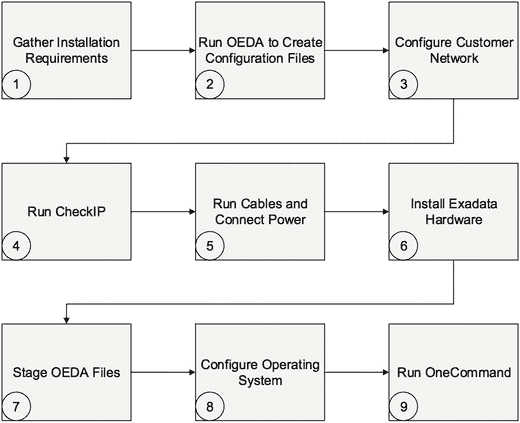

# 总结

数据库管理员面临的一大挑战是有效管理系统资源以满足业务目标，尤其是在数据库整合的场景下。多年来，Oracle 开发了丰富的功能，使资源管理成为可能。遗憾的是，由于其复杂性，这些功能很少被实施。但请务必注意，随着服务器变得更加强大和高效，数据库整合将变得越来越普遍。在 Exadata 平台上尤其如此。了解如何使用数据库和 I/O 资源管理，将成为确保您的数据库满足业务需求的一项日益重要的工具。

我们能提供的最佳建议是保持简单。试图利用 Oracle 资源管理器中的每一个花哨功能可能会导致混淆和不理想的结果。如果您没有对多级资源计划的特定需求，请坚持使用单级方法；或者使用基于份额的方法，该方法在设计上就是单级的。类别计划是另一个很少需要（和使用）的功能。新的 Exadata `12.1.2.1.0` 和数据库 `12.1.0.2 BP4` 性能配置文件功能看起来很有前景，是一种简便的资源管理方法。您将面临的大多数情况都可以通过实施一个简单的、单级的数据库间资源计划来解决。这意味着，关于资源管理我们能给出的最佳建议是：从小处着手，保持简单，并根据需要添加功能。

## 8. 配置 Exadata

Oracle 提供一项可选服务，负责从头到尾安装和配置您的 Exadata 数据库一体机。许多公司购买此服务以缩短实施时间，并降低将 Exadata 集成到其 IT 基础设施中的复杂性。如果您正在阅读本章，您可能正在考虑自行执行配置，或者您只是想更好地了解如何完成此过程。我们在此讨论的过程与 Oracle 使用的安装过程非常相似，主要是因为我们将会使用与 Oracle 相同的工具来配置 Exadata。该工具名为 `OneCommand`。它会获取您提供的特定于站点的信息，并执行从网络到软件再到存储的整个配置过程。完成后，您的 Exadata 数据库一体机将具备完整功能，包括一个初始数据库。

### Exadata 网络组件

Oracle 数据库网络需求多年来不断演变，使用 Exadata 时，您会注意到一些新术语以及一个新网络的增加。传统上，Oracle 数据库服务器需要一个公共网络链路来提供管理访问（通常是 `SSH`）和数据库访问（`SQL*Net`）。随着 `11gR2` Grid Infrastructure（以前称为 Oracle Clusterware）的推出，Oracle 为这个网络创造了一个新术语——客户端访问网络。在 Exadata 平台上，管理流量和数据库流量已经通过创建一个新的管理访问网络而分开。这个新网络被称为管理网络。客户端访问网络不再可通过 `SSH` 访问，仅用于 Oracle 监听器接收 `SQL*Net` 连接。在 Exadata 术语中（主要在配置上下文中），这两个网络被称为 `NET0`（管理网络）和 `BONDETH0`（客户端访问网络）。

计算节点和存储单元上的以太网端口数量和类型在 Exadata 的 `V2`、`X2` 和 `X3` 型号之间有所不同。每个型号的硬件规格在《Exadata 数据库一体机用户指南》中有详细说明。不过，所有型号至少提供四个嵌入式 `1` 千兆以太网端口。Oracle 将这些端口标识为 `NET0`、`NET1`、`NET2` 和 `NET3`。`X2-2` 及更新型号在端口 `NET4` 和 `NET5` 上包含一对 `10` 千兆以太网连接（不包括 `SFP+` 模块）。如前所述，`NET0` 用于管理网络（`ETH0`），而一对 `NET1`/`NET2` 或 `NET4`/`NET5` 用于客户端访问网络（`BONDETH0`）。在 `RAC` 环境中，常见的做法是将两个以太网设备绑定在一起，为客户端访问网络提供硬件冗余。这些链路传统上是主动/被动模式以提供容错能力。`NET3` 接口未分配，可用作可选网络进行配置。

#### ILOM

除了管理网络接口（`NET0`）外，计算节点和存储单元还配备了集成式远程系统管理器（`ILOM`）。在大多数现代服务器中常见，`ILOM` 是每个计算节点和存储单元中的一块适配卡，独立于操作系统运行。一旦服务器通电，`ILOM` 就会启动，并通过管理网络提供 Web 和 `SSH` 访问。`ILOM` 允许您远程执行许多原本需要物理接触服务器才能完成的任务，包括访问控制台、关闭和开启系统电源、以及重启或重置系统。如果需要，`ILOM` 提供一个串行端口，可用于直接获得主机的控制台访问权限。此串行端口需要 `DB-9` 转 `RJ-45` 连接。大多数现代客户端设备将需要一个 `USB` 转串口适配器，该适配器包含在 Exadata 备件套件中。此外，`ILOM` 监控服务器内部硬件组件的配置和状态。如上表所述，`ILOM` 通过其以太网端口连接到 Exadata 机箱内的管理交换机。

#### 客户端访问网络

客户端访问网络供 Oracle 监听器使用，以提供到数据库的 `SQL*Net` 连接。在 `RAC` 术语中，这个网络传统上被称为公共网络。来自每个数据库服务器（计算节点）的一条或两条链路（`NET1`/`NET2` 或 `NET4`/`NET5`）直接连接到您的公司交换机。Oracle 建议绑定连接以为客户端连接提供硬件冗余。铜缆连接应在 `NET1` 和 `NET2` 上进行绑定。对于绑定光纤链路，请使用 `NET4` 和 `NET5`。如果端口已绑定，那么每条链路应终止于单独的交换机，以提供网络冗余。


#### 私有网络

内部的 InfiniBand (IB) 交换机为私有网络提供服务。该网络管理 RAC 互连流量（缓存融合、心跳），以及数据库网格和存储网格之间的 iDB 流量。此网络完全包含在 InfiniBand 网络交换机结构内，没有到您公司网络的上行链路。网络配置可以在 `/etc/sysconfig/network-scripts` 目录下的 `ifcfg-ib0` 和 `ifcfg-ib1` 配置文件中找到。在 X4 之前发布的型号中，它们被配置为绑定设备，主设备文件为 `ifcfg-bondib0`。例如，以下列表显示了我们实验室中一台 X3-2 数据库服务器的 InfiniBand 网络配置文件。注意 `MASTER` 参数如何用于将这些网络设备映射到 `bondib0` 设备：

```
/etc/sysconfig/network-scripts/ifcfg-bondib0

DEVICE=bondib0
USERCTL=no
BOOTPROTO=none
ONBOOT=yes
IPADDR=192.168.10.1
NETMASK=255.255.252.0
NETWORK=192.168.8.0
BROADCAST=192.168.11.255
BONDING_OPTS="mode=active-backup miimon=100 downdelay=5000 updelay=5000 num_grat_arp=100"
IPV6INIT=no
MTU=65520
```

```
/etc/sysconfig/network-scripts/ifcfg-ib0

DEVICE=ib0
USERCTL=no
ONBOOT=yes
MASTER=bondib0
SLAVE=yes
BOOTPROTO=none
HOTPLUG=no
IPV6INIT=no
CONNECTED_MODE=yes
MTU=65520
```

```
/etc/sysconfig/network-scripts/ifcfg-ib1

DEVICE=ib1
USERCTL=no
ONBOOT=yes
MASTER=bondib0
SLAVE=yes
BOOTPROTO=none
HOTPLUG=no
IPV6INIT=no
CONNECTED_MODE=yes
MTU=65520
```

在 X4 和 X5 代系统中，每个 InfiniBand 端口都配置有其专用的 IP 地址。下面的示例显示了一个 X4-2 计算节点的 InfiniBand 接口配置文件样本：

```
/etc/sysconfig/network-scripts/ifcfg-ib0

#### DO NOT REMOVE THESE LINES ####
#### %GENERATED BY CELL% ####
DEVICE=ib0
BOOTPROTO=static
ONBOOT=yes
HOTPLUG=no
IPV6INIT=no
IPADDR=192.168.12.1
NETMASK=255.255.255.0
NETWORK=192.168.12.0
BROADCAST=192.168.12.255
MTU=7000
CONNECTED_MODE=yes
```

```
/etc/sysconfig/network-scripts/ifcfg-ib1

#### DO NOT REMOVE THESE LINES ####
#### %GENERATED BY CELL% ####
DEVICE=ib1
BOOTPROTO=static
ONBOOT=yes
HOTPLUG=no
IPV6INIT=no
IPADDR=192.168.12.2
NETMASK=255.255.255.0
NETWORK=192.168.12.0
BROADCAST=192.168.12.255
MTU=7000
CONNECTED_MODE=yes
```

这种配置方法提供了冗余的活动链路。请注意，IB 网络设备的 `MTU` 大小被设置为 7,000（字节）。`MTU` 代表最大传输单元，它决定了可在网络上传输的网络数据包的最大大小。典型的以太网网络配置的 `MTU` 大小最多为 1,500 字节。近年来，巨帧技术已成为一种流行的方法，通过减少 Oracle RAC 集群中节点之间缓存融合所需的网络往返次数来提高数据库性能。通常，巨帧支持高达 9,000 字节的 `MTU`，但某些实现可能支持更大的 `MTU` 大小。

**注意**

只有数据库服务器配置了更大的 `MTU` 大小。据推测，这是为了有益于数据库服务器与任何连接到 IB 交换机的外部主机之间的 TCP/IP (`IPoIB`: IP over InfiniBand) 流量。您可能会惊讶地了解到，存储单元上的 IB 端口配置的是标准的 1,500 字节 `MTU` 大小。存储单元上不需要大的 `MTU` 大小，因为数据库网格和存储网格之间的大多数大型 I/O 操作都使用 `RDS` 协议，该协议对于数据库 I/O 效率更高，并且完全绕过了 TCP/IP 协议栈。在 InfiniBand 网络上，`MTU` 大小仅在处理 InfiniBand 上的 IP (`IPoIB`) 时起作用——而不是 `RDS`。使用 InfiniBand 网络的进程，如备份或 NFS 挂载，可以从更大的 `MTU` 大小中受益。

### 关于配置过程

配置 Oracle 数据库服务器通常是一个手动且容易出错的过程，尤其是对于 RAC 环境。Exadata 也可以手动配置，但该平台的复杂性可能使这成为一项有风险的任务。Oracle 通过提供一个名为 Oracle Exadata 部署助手 (`OEDA`) 的实用程序，极大地简化了配置过程。该工具确保所有 Exadata 机架都使用相同的流程和工具集进行配置，这对于该平台的更广泛支持至关重要。`OEDA` 使用您提供的输入参数，并为您执行所有低级任务。即便如此，收集 `OEDA` 所需的所有正确信息很可能需要协作完成，尤其是在网络组件方面。Exadata 配置过程的最终结果是为您留下一个完全配置好的 Oracle RAC 系统，该系统已修补到指定的软件版本，并且示例数据库已启动并运行。图 8-1 展示了使用 `OEDA` 的 Exadata 配置过程。



图 8-1. 配置过程

如图 8-1 所示，该过程的第一步是收集安装要求并将其输入到 `OEDA` 图形实用程序中。Exadata 需要三个不同网络（管理、客户端访问和 InfiniBand）的 IP 地址，以及域名服务 (DNS)、网络时间协议 (NTP)、自动服务请求 (ASR) 的信息，如果您希望发送警报，还需要邮件信息。所有这些项目随后都被输入到 `OEDA` 图形实用程序中。在收集网络需求时，您很可能需要网络管理员的帮助来保留 IP 地址和子网，并向域名服务器注册新的网络名称。理解这些配置设置如何使用很重要，因此我们将在“步骤 2：运行 `OEDA`”中花大量时间讨论它们。

`OEDA` 可从 `My Oracle Support` 下载，可以在 `MOS note # 888828.1` 中找到。执行安装的人员可以指导您下载哪些文件。`OEDA` 包含一个基于 Java 的图形实用程序，它包含在更大的文件集中，其中还包括用于安装和配置 Exadata 的 `OEDA` 配置脚本。`OEDA` 生成 `OneCommand` 配置系统所需的所有参数和部署文件，以及 `Oracle Enterprise Manager 12c` 用于配置 Exadata 目标的附加文件，还有 `Oracle Platinum Support` 用于额外支持的配置文件。完成后，您就可以将这些文件上传到 Exadata。

在运行 `OEDA` 配置脚本之前，您需要准备好 `Grid Infrastructure` 和数据库（包括任何 Oracle 规定的补丁）的安装介质。该过程的最后一步是执行 `OEDA` 配置脚本。它的操作包括多个步骤，用于配置 Exadata 数据库机的所有组件。运行 `OEDA` 配置实用程序的顶层脚本名为 `config.sh`。该脚本可以端到端运行，自动执行所有步骤，也可以使用命令行选项指定运行特定步骤。我们强烈建议一次运行一个步骤。这样做使得在某个步骤未能成功完成时更容易进行故障排除。此外，Exadata 八分之一机架配置包含几个需要重新启动节点的步骤。

**注意**


