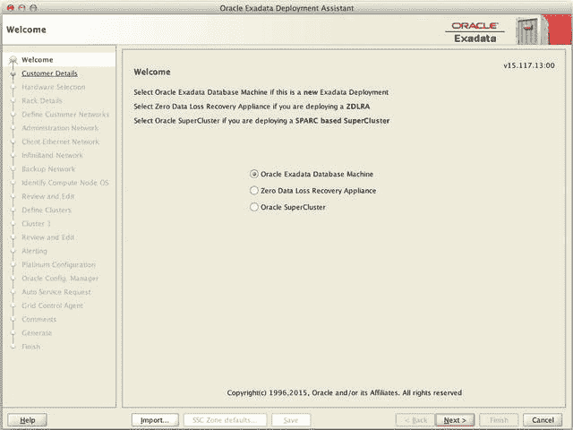
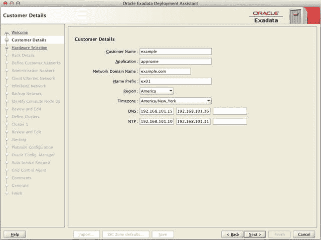
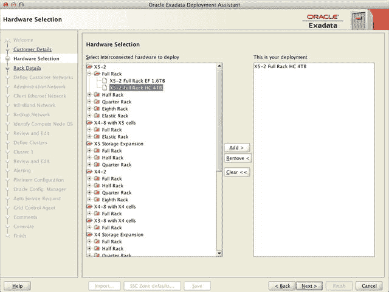
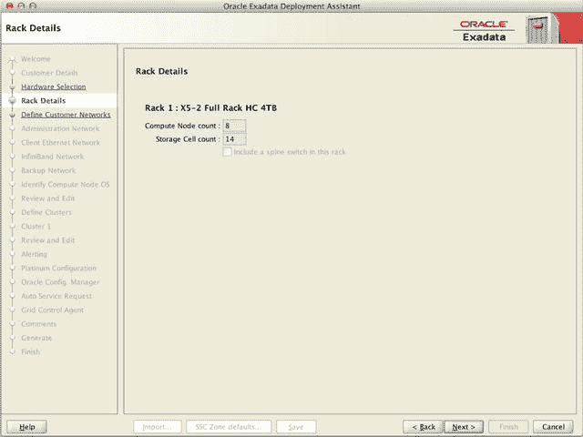
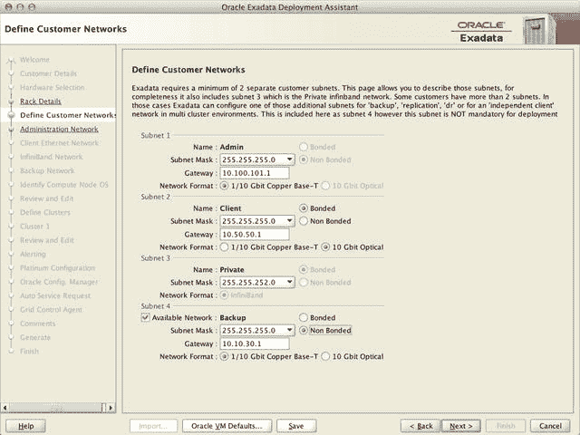
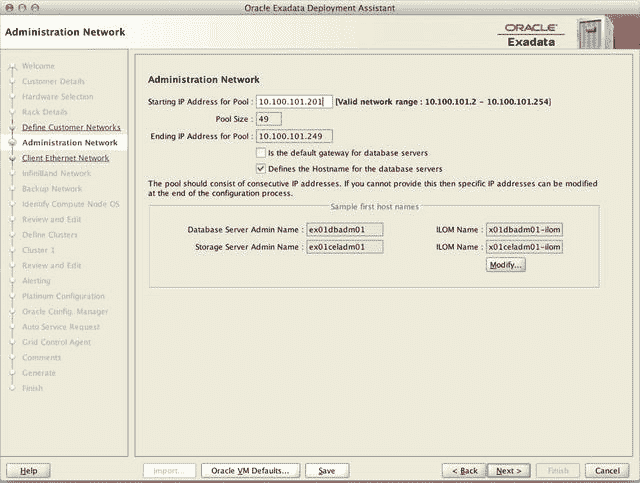
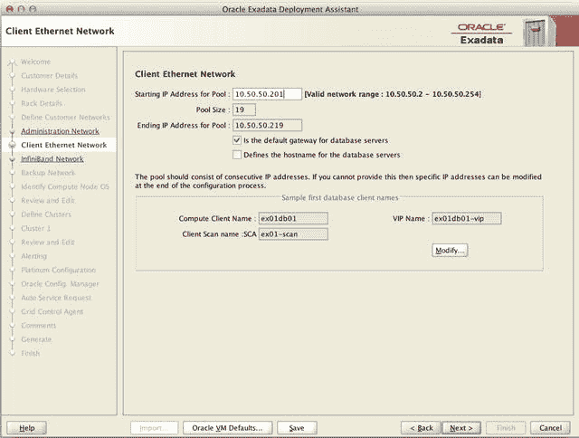
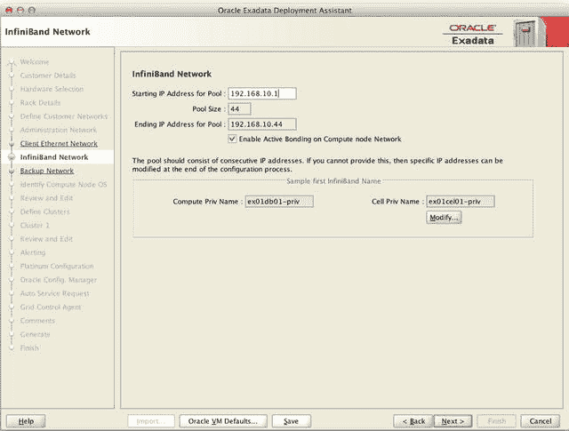
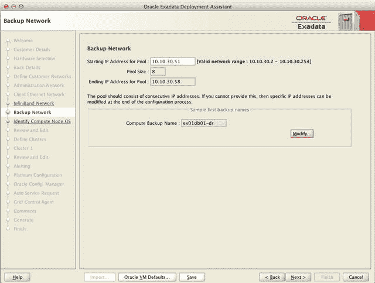
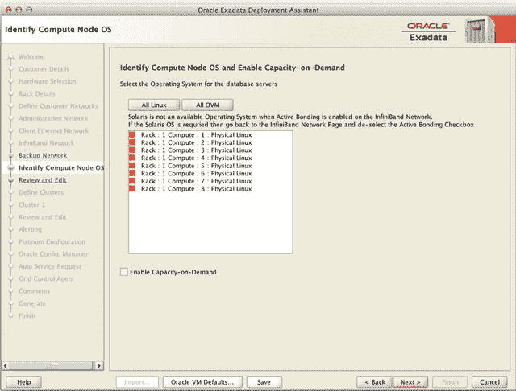

# 配置 Exadata

Oracle 并未为其网格基础设施、ASM 和 RDBMS 产品创建专门的 Exadata 版本，而是选择将 Exadata 特定的代码直接集成到您会安装在非 Exadata 平台上的相同产品中。在 11.2 版本中，Oracle 发布了单独的“捆绑补丁”，其中包含标准 PSU 内容以及额外的 Exadata 特定错误修复。从版本 12.1.0.1 开始，Oracle 不再为 Exadata 发布单独的捆绑补丁，而是推荐应用标准 PSU。

当您收到 Exadata 数据库一体机时，Oracle 硬件技术员会完成某些任务。这些任务包括连接 Exadata 机架内的所有网络组件，并为私有网络（IB 交换机）配置 IP 地址。此过程完成后，所有计算节点和存储单元都将通过 IB 交换机连接在一起。OEDA 配置脚本仅从第一个计算节点运行，并使用管理网络在其他服务器和存储单元上执行配置命令，以及在所有数据库服务器上安装网格基础设施和 RDBMS 软件。

## 步骤 1：收集安装需求

一如既往，收集需求是着手任何项目最关键（也最令人沮丧）的部分之一。因为 Exadata 是一次性配置完成的，所有内容都必须准备好同时就绪。这意味着网络必须准备就绪，所有主机名必须在 DNS 中注册，并且诸如哪些电子邮件地址应接收警报等信息都必须在系统安装前收集好。虽然可以跳过此步骤直接进入 QEDA，但如果未填写所有必需信息，则没有机制可以保存进度。我们将通过逐步讲解配置实用程序来介绍实际需要的项目。

## 步骤 2：运行 Oracle Exadata 部署助手

在 X3 发布之前，Oracle 要求客户填写一份冗长的文档，然后发回给 Oracle。收到后，Oracle 会将这些信息输入到一个 Excel 电子表格 (`dbm_configurator.xls`) 中。2012 年 10 月，Oracle 将这两个步骤合并为一个 Java 实用程序 (`OEDA`)，客户可以直接填写。虽然它确实减少了总工作量，但对于不熟悉所提每个问题的含义的客户来说，`OEDA` 同样可能令人望而生畏。

首先，为了获取 `OEDA` 实用程序，客户必须下载将安装在 Exadata 上的软件包。这可以在 My Oracle Support 注释 #888828.1 的“`OEDA`”部分找到。下载实用程序后，解压缩文件，其中将包含配置实用程序。Windows、Linux 和 Mac OS X 有单独的下载版本，因此请下载与您将运行初始图形实用程序的计算机对应的版本。准备好运行配置实用程序时，根据您的操作系统运行 `./config.sh` 或 `config.cmd`。欢迎屏幕将会出现（图 8-2）。从这里，用户可以点击“下一步 ➤”继续，或点击“导入”，这允许您修改一组现有的配置文件。



图 8-2. `OEDA` 主屏幕

### 客户详细信息

点击“下一步 ➤”按钮后，配置实用程序将询问有关正在安装的机架的一般信息，如图 8-3 所示。这包括客户名称、应用程序名称、区域、时区、操作系统和数据库名称前缀。所有这些字段都是必需的，并将出现在最终的部署摘要中。表 8-1 定义了这些参数。

表 8-1. 客户详细信息字段

| 配置参数 | 描述 |
| --- | --- |
| 客户名称 | 客户的名称 |
| 应用程序 | 此 Exadata 上使用的主要应用程序。如果未知，可以使用下面定义的“名称前缀”。 |
| 网络域名 | 主机的 DNS 域名 |
| 名称前缀 | 用于生成系统上所有网络接口主机名的前缀。例如，如果使用 `ex01`，主机名将是 `ex01dbadm01`、`ex01celadm01`、`ex01-scan` 等。 |
| 区域 | Exadata 所在的区域，例如欧洲或美洲 |
| 时区 | Exadata 所在的时区，例如 `America/Chicago`。 |
| DNS | DNS 服务器的 IP 地址（至少一个） |
| NTP | NTP 服务器的 IP 地址（至少一个） |



图 8-3. 客户详细信息屏幕

注意

此屏幕上最重要的字段是“数据库机前缀”，它将用作 Exadata 机架中所有主机命名的基础。在 Exadata 配置实用程序之前，此前缀仅支持四个字符长度。使用新的配置实用程序，前缀最多支持 16 个字符。为了统一性，建议将主机名前缀保持为八个字符或更少，这是因为单客户端访问名称 (`SCAN`) 的要求。`SCAN` 仅支持最长 15 个字符的主机名。此外，虽然许多组织支持较长的主机名，但 Exadata 的命名约定可能相当严格。虽然任何安装看起来都是永久的，但我们见过许多 Exadata 机架被搬迁到不同的数据中心。由于在 RAC 系统中重命名主机的复杂性——更不用说 Exadata（还需要重命名存储）——许多客户在搬迁到新数据中心时决定干脆拆除并重建整个集群。如果主机名前缀没有包含位置信息，则只需更改 IP——这是一个更简单且非破坏性的过程。

### 硬件选择

“硬件选择”屏幕（图 8-4）用于选择正在安装的 Exadata 机架类型。`OEDA` 支持从 X2 开始的 Exadata 机架以及 SPARC SuperCluster 平台。在安装 Exadata 机架时，请确保选择正确的存储类型和大小——高容量型号可能配备 2TB、3TB 或 4TB，具体取决于机架的购买时间。较新版本的 `OEDA` 实用程序支持 Exadata 第五代（X5）中发现的弹性配置。只需选择与您的机架类型对应的“弹性机架”选项——您将在“机架详细信息”屏幕上输入确切的计算或存储服务器数量。



图 8-4. 硬件选择

“硬件选择”屏幕还允许客户通过简单地将正确的机架大小移动到右侧窗格，轻松地为多机架配置生成配置文件。这将允许多个机架作为一个集群同时配置。

此外，对于将单个机架拆分为多个较小机架的客户，可以使用 `OEDA` 生成配置文件。在拆分机架的情况下，选择与实际机架尺寸对应的设备大小（如果将全机架拆分为两个半机架，请选择全机架尺寸——集群将在工具中稍后定义）。我们将在配置实用程序的“集群配置”部分继续讨论拆分机架的话题。


### 机架详情

图 8-5 中所示的“机架详情”屏幕显示了机架内的计算和存储服务器数量。标准机架尺寸（八分之一、四分之一、二分之一和全尺寸机架）对于每种选项都有传统数量的服务器。弹性机架允许你为特定机架配置设定计算和存储服务器的数量。



图 8-5. 机架详情屏幕

### 定义客户网络

图 8-6 中所示的“定义客户网络”屏幕要求输入 Exadata 机架上使用的每个网络的子网掩码、网关信息以及端口配置。在这里，你将指定连接是否绑定，以及它们将使用计算节点上的铜缆端口还是光纤端口。表 8-2 定义了此屏幕上列出的每个参数。

表 8-2. 定义客户网络字段

| 配置参数 | 描述 |
| --- | --- |
| `Admin Subnet Mask` | 管理网络的子网掩码 |
| `Admin Gateway` | 管理网络所用网关设备的 IP 地址 |
| `Client Subnet Mask` | 客户端访问网络的子网掩码 |
| `Client Gateway` | 客户端访问网络所用网关设备的 IP 地址 |
| `Client Bonded / Non-Bonded` | 决定客户端访问网络是否将配置为主/被动绑定以实现高可用性 |
| `Client Copper Base-T / Optical` | 决定客户端访问网络是利用铜缆连接（`NET1` / `NET2`）还是光纤连接（`NET4` / `NET5`）作为 `bondeth0` 接口。如果未配置绑定，则将使用 `NET1` 或 `NET4`。 |
| `Private Subnet Mask` | InfiniBand 网络的子网掩码 |
| `Backup Subnet Mask` | 可选备份网络的子网掩码 |
| `Backup Gateway` | 可选备份网络所用网关设备的 IP 地址 |
| `Backup Bonded / Non-Bonded` | 决定可选备份网络是否将配置为主/被动绑定以实现高可用性 |
| `Backup Copper Base-T / Optical` | 决定可选备份网络是利用铜缆连接（绑定时为 `NET1` / `NET2`，非绑定时为 `NET3`）还是光纤连接（`NET4` / `NET5`）作为 `bondeth1` 接口。如果未配置绑定，则将使用 `NET3`。 |



图 8-6. 定义客户网络屏幕

> **注意**
> `OEDA` 从一个基础地址顺序分配 IP 地址的方式，在向配置中添加计算节点和存储单元时可能会产生问题。本章后面讨论升级 Exadata 时，我们会更多地谈及这一点。

#### 管理网络

“管理网络”屏幕（图 8-7）用于定义管理网络。字段描述见表 8-3。管理网络（以前称为管理网络）包含机架中所有物理组件的 IP 地址，包括所有数据库和存储服务器、InfiniBand 交换机、电源分配单元以及 Cisco 交换机。你可以将此网络视为登录计算节点、存储单元和 InfiniBand 交换机的 SSH 入口点。内部 Cisco 网络交换机为管理网络提供服务。只需要一个网络接口即可将 Cisco 管理交换机上联到你的公司网络。

`Exaconf` 工具需要一组连续的 IP 地址，因此只需要输入范围中的第一个 IP 地址。输入子网掩码和网关 IP，并选择是否使用管理网络来定义数据库服务器的主机名（默认为是）。管理网络的主机名将包含 `<dbmachine_prefix>-dbadm01`、`<dbmachine_prefix>-celadm01` 等。这种命名约定是随着 Exadata 配置工具引入的。如果你仍然偏好旧的命名约定（不带“adm”），可以点击“Modify...”按钮并从主机名掩码中删除“adm”条目。确保“%”仍然存在，因为它用于枚举主机以及机架编号（对于多机架安装很有用）。

表 8-3. 管理网络字段

| 配置参数 | 描述 |
| --- | --- |
| `Starting IP Address for Pool` | 分配给 Exadata 机架用于管理网络的 IP 地址范围中的第一个地址 |
| `Pool Size` | 管理网络所需的 IP 地址数量。此数字无法修改。 |
| `Ending IP Address for Pool` | Exadata 机架在管理网络上使用的最后一个 IP 地址。此数字无法修改，由起始 IP 地址和池大小计算得出。 |
| `Is the Default Gateway for Database Servers` | 如果数据库服务器的默认路由将是管理网络，请勾选此框。默认为不勾选。 |
| `Defines the Hostname for the database servers` | 如果主机名将基于管理网络进行配置，请选择此框。默认值为保持勾选。 |



图 8-7. 管理网络屏幕


#### 客户以太网网络

“客户以太网网络”屏幕列出了客户端访问网络的配置详情（图 8-8）。该网络用于来自应用服务器的数据库流量，包括节点虚拟 IP（VIP）地址以及单一客户端访问名称（SCAN）VIP。通常，此网络包含数据库服务器的默认路由。随着 OEDA 实用程序的引入，此网络的默认命名约定也发生了变化。之前命名为`<dbmachine_prefix><host_number>`（`ex0101`、`ex0102`等）的网络，现在命名为`<dbmachine_prefix>client<host_number>`（`ex01client01`、`ex01client02`等）。若要恢复旧命名约定，只需单击“修改...”按钮并从名称字段中删除“client”。表 8-4 描述了“客户以太网网络”屏幕的字段。

**表 8-4.**
**客户以太网网络字段**

| 配置参数 | 描述 |
| --- | --- |
| 池的起始 IP 地址 | 分配给 Exadata 机架用于客户访问网络的 IP 地址范围中的第一个 IP 地址 |
| 池大小 | 客户访问网络所需的 IP 地址数量。此数字无法修改。 |
| 池的结束 IP 地址 | Exadata 机架在客户访问网络上使用的最后一个 IP 地址 |
| 是否是数据库服务器的默认网关 | 如果数据库服务器的默认路由将是客户访问网络，请勾选此框。默认为保持勾选状态。 |
| 定义数据库服务器的主机名 | 如果将根据客户访问网络配置主机名，请选择此框。默认值是不勾选此项。 |


**图 8-8.**
**客户以太网网络屏幕**

由于此网络被认为是机架中最重要的网络，因此它通常是一个**绑定连接**。在标准配置中，绑定链路配置为**主动-备用绑定**，这不使用任何链路聚合技术。此类配置的主要优点在于无需网络设备进行设置（操作系统处理所有链路故障切换），并且链路故障不会以任何方式降低性能。因为您始终只依赖单条链路的吞吐量，所以即使一侧出现故障，速度也将保持不变。来自数据库服务器的电缆线对应连接到冗余网络交换机，以提供完整的网络冗余。如果使用光网络端口，则接口`eth4`和`eth5`被绑定。对于铜缆网络端口，接口`eth1`和`eth2`被绑定。此绑定接口通常命名为`bondeth0`，但 Exadata V2 型号使用了名称`bond1`。例如，以下列表显示了从设备`eth1`和`eth2`如何引用主绑定设备`bondeth0`：

```shell
# egrep 'DEVICE|MASTER|SLAVE' ifcfg-bondeth0 ifcfg-eth1 ifcfg-eth2
ifcfg-bondeth0:DEVICE=bondeth0
ifcfg-eth1:DEVICE=eth1
ifcfg-eth1:MASTER=bondeth0
ifcfg-eth1:SLAVE=yes
ifcfg-eth2:DEVICE=eth2
ifcfg-eth2:MASTER=bondeth0
ifcfg-eth2:SLAVE=yes
```

**提示**

Exadata V2 系统不包含 10 千兆以太网（10 GbE）接口，仅支持千兆铜缆。每个 Exadata X2-2/X3-2/X4-2/X5-2 计算节点有两个光 10GbE 端口，每个 X3-8/X4-8 计算节点有八个光 10GbE 端口。

#### InfiniBand 网络

“InfiniBand 网络”屏幕（图 8-9）包含 InfiniBand 网络的配置信息。InfiniBand 网络包含一组默认 IP 地址，使用`192.168.10.1`作为起始地址，子网掩码为`255.255.252.0`。InfiniBand 网络是用于连接数据库服务器和存储的内部私有互连。由于可能存在路由问题，它需要一个企业网络中其他地方未使用的网络范围。由于 InfiniBand 网络用作内部网络，因此不包含网关。OEDA 配置实用程序未对 InfiniBand 网络上使用的命名约定引入任何更改。在 Exadata X4-2 及更高版本的机架上，可以选择“主动绑定”功能。此功能打破了先前的绑定配置，并为流量启用了每个 InfiniBand 端口。选择此选项将使计算节点上使用的 IP 地址数量增加一倍——X4-2 及更新的存储服务器将始终使用主动绑定。表 8-5 描述了“InfiniBand 网络”屏幕的字段。

**表 8-5.**
**InfiniBand 网络字段**

| 配置参数 | 描述 |
| --- | --- |
| 池的起始 IP 地址 | 分配给 Exadata 机架用于 InfiniBand 网络的 IP 地址范围中的第一个 IP 地址 |
| 池大小 | InfiniBand 网络所需的 IP 地址数量。此数字无法修改。 |
| 池的结束 IP 地址 | Exadata 机架在 InfiniBand 网络上使用的最后一个 IP 地址 |
| 在计算节点网络上启用主动绑定 | 决定 InfiniBand 端口是配置为主动/被动绑定（`bondib0`）还是创建单独的网络接口。主动绑定需要 Exadata X4 或更新的硬件。 |


**图 8-9.**
**InfiniBand 网络屏幕**

#### 备份网络

“备份网络”屏幕（图 8-10）详细说明了 Exadata 上唯一可选的。根据网络配置，一些客户更喜欢创建一个额外的网络，用于需要其自身访问路径的流量。此额外网络的常见用途包括 Data Guard、备份或网络文件系统（NFS）。默认命名约定是在每个计算节点的主机名末尾包含“-dr”。“备份网络”屏幕的字段在表 8-6 中概述。

**表 8-6.**
**备份 / Data Guard 以太网网络字段**

| 配置参数 | 描述 |
| --- | --- |
| 池的起始 IP 地址 | 分配给 Exadata 机架用于客户访问网络的 IP 地址范围中的第一个 IP 地址。请注意，只有计算节点将需要此网络上的 IP 地址。 |
| 池大小 | 客户访问网络所需的 IP 地址数量。此数字无法修改。 |
| 池的结束 IP 地址 | Exadata 机架在客户访问网络上使用的最后一个 IP 地址 |


**图 8-10.**
**备份 / Data Guard 以太网网络屏幕**

#### 识别计算节点操作系统并启用按需扩容

“识别计算节点操作系统并启用按需扩容”屏幕（图 8-11）会询问有关操作系统环境的标准配置问题，允许客户在物理 Linux 安装或使用 Oracle 虚拟机（OVM）虚拟化 Exadata 机架之间进行选择。此屏幕还允许客户启用 Oracle 的按需扩容功能，该功能可禁用 CPU 内核以节省 Oracle 许可证费用。


**图 8-11.**
**操作系统配置屏幕**


