# Exadata 配置界面

## 审阅与编辑详细信息

“审阅与编辑详细信息”界面（图 8-12）允许用户检查和修改 Exadata 机架在管理网络和私有网络上的 IP 地址。如果您正在对现有配置进行更改，请记住单击“重新生成数据”按钮以刷新主机名和 IP 地址。

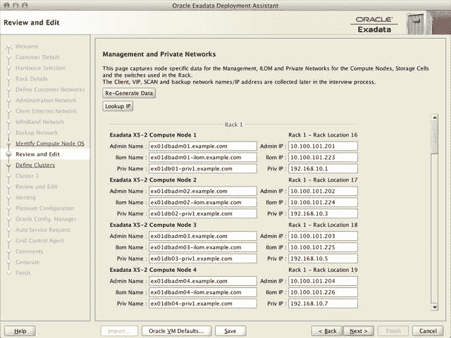

图 8-12. 审阅与编辑详细信息界面

## 定义集群

“定义集群”界面（图 8-13）允许管理员选择将在单个 Exadata 机架中安装的独立集群的数量。此选择界面简化了在单个 Exadata 机架内创建独立 ASM 和数据库集群所需的操作。管理员可以选择机架上的哪些计算和存储服务器将专用于每个已定义的集群。典型配置通常只涉及一个集群——这正是本示例中将要配置的情况。

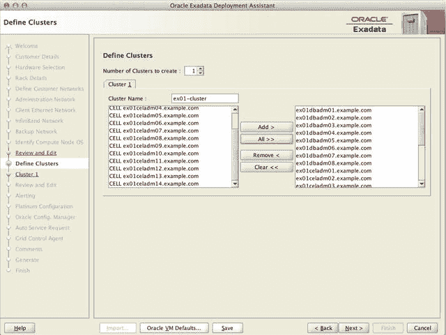

图 8-13. 定义集群界面

## 集群 (n)

在上一界面中定义的每个集群都将拥有自己的集群详细信息页面（图 8-14）。“集群 (n)”界面要求输入该集群的所有特定详细信息。这包括所有虚拟 IP 地址的命名约定、操作系统账户的 UID 和 GID、Oracle 软件主目录安装详细信息以及 ASM 磁盘组配置。首先，枚举计算节点的 DNS 和 NTP 服务器，然后是软件账户所有权详细信息。接下来，管理员定义 Oracle 软件主目录和补丁级别。默认情况下，Oracle 使用 `最优灵活架构 (OFA)` 标准来命名软件主目录。大多数 Exadata 安装都采用 `OFA` 标准，因为使用 `OFA` 时，Oracle 配置实用程序可以保证正常工作。可以更改软件位置，但请记住，出厂 Exadata 映像包含一个较大的 `/u01` 文件系统和一个非常小的 `/` 文件系统。如果您希望将软件移至 `/u01` 以外的文件系统，此配置将没有足够的磁盘空间。

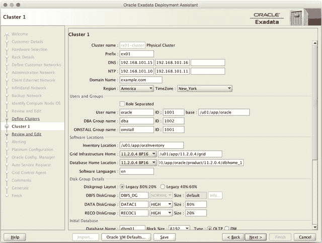

图 8-14. 集群 (n) 界面

在目录结构之后，“集群 (n)”界面允许用户设置其 ASM 磁盘组名称和冗余级别。默认情况下，数据库机前缀（在“客户详细信息”界面中选择）会附加到磁盘组名称的末尾。随着磁盘组冗余级别的选择，磁盘大小设置将动态变化。通常，Oracle 会使用 `DATA` 和 `RECO` 80%/20% 的拆分比例，假设 `DATA` 磁盘组会更大。对于希望为其快速恢复区域 (`FRA`) 创建更大磁盘组的客户，界面中提供了一个复选框，以便为 `RECO` 磁盘组分配更多空间。在规划 ASM 磁盘组冗余时，请考虑以下因素：

*   **高冗余**：每个区都写入三个副本。此配置会显著减少磁盘组中的可用空间。根据 Oracle 的建议，它最好在磁盘空间不是问题时，或者在计划以滚动方式应用所有 Exadata 补丁时使用。
*   **正常冗余**：每个区写入两个副本。虽然它为磁盘组提供了相当多的可用空间，但请记住，如果包含相同数据的两个磁盘同时丢失，将导致 ASM 卸载您的磁盘组。如果发生这种情况，使用这些磁盘组的数据库也将离线。在应用滚动存储服务器补丁时，一次将有 12 个磁盘离线，只留下一份数据副本可用。

在考虑哪种保护方案适合您时，请想想您对系统停机的容忍度。正常冗余提供更多存储空间，但对磁盘/单元故障的保护较少。除非您能承受数据库长时间停机，否则对于 `DATA` 磁盘组应倾向于选择高冗余。如果您能承受在解决瞬时磁盘/单元故障期间的停机，或者在最坏的情况下等待完整的数据库恢复，那么也许为 `RECO` 磁盘组选择高冗余更合适。如果空间非常紧张，并且您可以容忍此类停机，那么您可以考虑将所有磁盘组的冗余都设置为正常。值得说明的是，大多数 Exadata 客户将其 Exadata 机架配置为正常冗余。

您的 `DBFS_DG` 磁盘组的冗余级别（在大多数配置中用于存储 `OCR` 和投票文件）将自动设置为正常冗余。如果可用（在半机架或更大机架的配置中），`OneCommand` 会将 `OCR` 和投票文件移动到高冗余磁盘组。

示例数据库的名称（`dbm`）已包含在内，以及块大小和数据库类型。通常，`dbm` 数据库在系统安装后不久即被删除。通常使用 8192 的块大小——请记住，Smart Scans 不会返回整个块，而只返回会话请求的数据。`OLTP`/`DW` 数据库类型大多无关紧要，因为 Exadata 配置实用程序会为 `OLTP` 和数据仓库工作负载创建 `数据库配置助手 (DBCA)` 模板。

最后，该界面包含与配置集群成员的客户端和备份网络接口相关的信息。在此部分，您可以定义客户端网络上使用的虚拟 IP 接口的命名标准，以及 `单客户端访问名称 (SCAN)` 功能将使用的主机名。您还可以配置备份网络（如果使用）所使用的命名约定。

如果配置了多个集群，下一个界面将为要配置的下一个集群请求相同的信息。对所有剩余要构建的集群重复此过程。表 8-7 详细列出了“集群 (n)”界面上的字段。

表 8-7. 集群 (n) 字段


#### 审核与编辑

`审核与编辑`屏幕（图 8-15）包含将用于集群的 IP 地址和主机名。任何与先前输入自动生成的信息不同的变更都必须在此屏幕上最终确定。通常，此屏幕仅用于验证配置并继续操作。

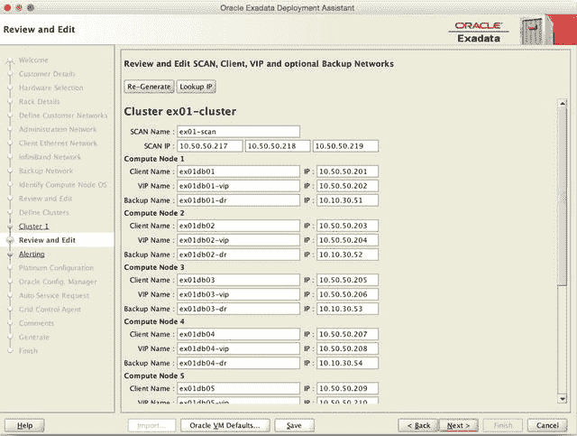

图 8-15. 审核与编辑屏幕

#### 存储单元警报

`存储单元警报`屏幕（图 8-16）允许用户输入将用于从存储单元和计算节点发送警报的信息。`cellsrv`管理服务（在每个存储单元上）监控存储单元的运行状况，并在存储服务器出现问题时能够发出通知。运行镜像版本`12.1.2.1.0`及更高版本的计算节点具有类似的管理服务，也会发送警报。警报可以通过简单邮件传输协议（`SMTP`）或简单网络管理协议（`SNMP`）发送。`SMTP`警报可以发送到多个地址或分发列表。这些警报将在发生故障时由服务器发送。通常，大多数部署仅使用`SMTP`警报。仅在使用第三方监控解决方案时，才在此处选择`SNMP`警报。Oracle Enterprise Manager 和 Automatic Service Request 都使用`SNMP`，但将在后续过程中进行配置。存储单元警报是可选的，但强烈建议启用，即使使用其他通知系统。表 8-8 定义了此屏幕上使用的字段。

表 8-8. 存储单元警报字段

```markdown
| 配置参数 | 描述 |
| --- | --- |
| 前缀 | Exadata 集群使用的命名前缀 |
| DNS | 集群使用的 DNS 服务器的 IP 地址 |
| NTP | 集群使用的 NTP 服务器的 IP 地址 |
| 域名 | 集群中主机使用的域名 |
| 区域/时区 | 集群中主机使用的时区 |
| 角色分离 | 如果您希望使用角色分离安装，请勾选此框。角色分离环境为集群上的每个 Oracle 主目录创建不同的操作系统用户账户。 |
| 用户名/ID | 将拥有 Oracle 软件主目录的操作系统账户和 UID |
| 基础目录 | 将用于`ORACLE_BASE`环境变量的目录 |
| DBA 组名/ID | 安装 Oracle 软件主目录时将用作 OSDBA 的操作系统组和 GID |
| OINSTALL 组名/ID | 将拥有 Oracle 软件清单的操作系统组和 GID |
| 清单位置 | 将用于存放 Oracle 软件清单的目录 |
| Grid Infrastructure 主目录 | 将用于 Grid Infrastructure Oracle 主目录的补丁级别和目录 |
| 数据库软件位置 | 将安装 Oracle 数据库软件的补丁级别和目录 |
| 软件安装语言 | Oracle 软件安装的语言 |
| 磁盘组布局 | 单选按钮，用于选择是否使用默认存储配置之一。 |
| DBFS 磁盘组 | `DBFS_DG ASM`磁盘组使用的名称。如果运行多个集群，此磁盘组在不同集群中的名称可能不同。 |
| DATA 磁盘组/冗余/大小 | `DATA ASM`磁盘组使用的名称。如果运行多个集群，此磁盘组在不同集群中的名称可能不同。冗余级别可以是`NORMAL`或`HIGH`。完成时大小分配总和必须等于 100%。 |
| RECO 磁盘组/冗余/大小 | `RECO ASM`磁盘组使用的名称。如果运行多个集群，此磁盘组在不同集群中的名称可能不同。完成时大小分配总和必须等于 100%。 |
| 数据库名称 | 将创建的示例数据库的名称 |
| 块大小 | 示例数据库的块大小 |
| OLTP/数据仓库 | 用于示例数据库的数据库模板（OLTP 或数据仓库） |
| 基础适配器（客户端网络） | 在“客户端以太网网络”屏幕中定义的网络适配器 |
| 域名 | 将附加到客户端访问网络所用主机名的域名 |
| 起始 IP | 集群中计算节点用于客户端网络的第一个 IP 地址 |
| 子网掩码 | 在“定义客户网络”屏幕中为客户端访问网络定义的子网掩码 |
| 网关 IP | 在“客户端以太网网络”屏幕中为客户端访问网络定义的网关 IP 地址 |
| 名称掩码/起始 ID | 客户端访问网络主机名使用的命名约定。此字段中定义的“%%”将从“起始 ID”字段定义的数字开始。 |
| VIP 名称掩码/起始 ID | 集群上虚拟 IP 地址接口使用的命名约定。此字段中定义的“%%”将从“起始 ID”字段定义的数字开始。 |
| SCAN 名称 | 单一客户端访问名称负载均衡器使用的主机名 |
| 基础适配器（备份网络） | 在“备份网络”屏幕中定义的网络适配器。如果不使用备份网络，请选择“未使用”并转到下一屏幕。 |
| 域名 | 将附加到备份网络所用主机名的域名 |
| 起始 IP | 集群中计算节点用于备份网络的第一个 IP 地址 |
| 名称掩码/起始 ID | 备份网络主机名使用的命名约定。此字段中定义的“%%”将从“起始 ID”字段定义的数字开始。 |
```

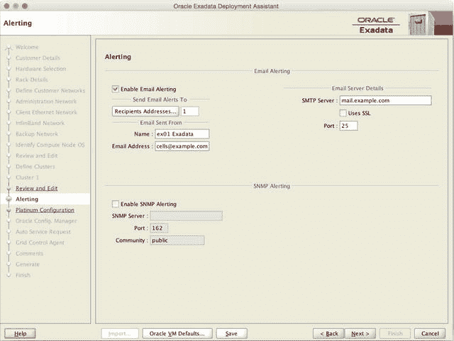

图 8-16. 存储单元警报屏幕

```markdown
| 配置参数 | 描述 |
| --- | --- |
| 启用电子邮件警报 | 勾选此框以启用`SMTP`警报。 |
| 收件人地址... | 点击此框输入将接收`SMTP`警报的电子邮件地址。 |
| SMTP 服务器 | 用于发送`SMTP`警报的`SMTP`服务器。 |
| 使用 SSL | 是否使用安全套接字层（`SSL`）加密`SMTP`通信。 |
| 端口 | `SMTP`端口号。默认端口为`25`。 |
| 名称 | 在存储服务器发送的电子邮件警报中显示的名称。 |
| 电子邮件地址 | 警报将从该电子邮件地址发出。 |
| 启用 SNMP 警报 | 勾选此框以启用`SNMP`警报。 |
| SNMP 服务器 | 发送`SNMP`警报的服务器。 |
| 端口 | `SNMP`端口号。默认端口为`162`。 |
| 团体名 | `SNMP`团体字符串。默认为`public`。 |
```


## 白金配置

对于选择 Oracle“白金服务”的客户，“白金配置”屏幕（图 8-17）包含与将要使用的网关服务器相关的所有问题。选项包括选择是使用现有网关还是为新网关配置服务器、网关服务器的连接类型以及所有与网关服务器相关的网络信息。该屏幕还会查询用于安装代理软件的操作系统用户账户详细信息，该软件将用于从 Oracle 提供监控。表 8-9 定义了“白金配置”屏幕中的字段。

表 8-9. 白金配置字段

| 配置参数 | 描述 |
| --- | --- |
| Capture data for Platinum configuration | 复选框，用于确定系统是否将配置为白金服务。如果不使用 Oracle 的白金服务，请取消勾选此框并转到下一个屏幕。 |
| Customer Name | 拥有 Exadata 的客户名称。 |
| CSI | 待支持的 Exadata 硬件的客户支持标识符。 |
| My Oracle Support email | 对上述 CSI 具有访问权限的账户的电子邮件地址。 |
| Use Existing Gateway | 如果将使用现有的白金服务网关来监控系统，请选择此框。 |
| Gateway Machine Type | 选择物理或虚拟化网关服务器安装。 |
| Gateway Machine Description | 网关服务器的描述。 |
| Platinum Gateway Hostname | 白金网关服务器使用的主机名。 |
| Primary IP Address | 白金网关服务器使用的 IP 地址。 |
| Subnet Mask | 白金网关服务器使用的子网掩码。 |
| Gateway IP address | 白金网关服务器的默认网关 IP 地址。 |
| VPN | 白金网关服务器使用的 VPN 连接类型。此类型为 SSL（默认）或 IPSec。 |
| Gateway to Exadata Link | 定义白金网关服务器在网络中的位置。默认选项为 DMZ。 |
| Static Routes | 如果需要，定义白金网关服务器与 Exadata 主机之间的任何静态路由。 |
| Gateway machine has an ILOM | 如果白金网关服务器具有集成的远程控制台管理端口，请选择此框。 |
| ILOM IP Address | 白金网关服务器上 ILOM 的 IP 地址。 |
| Subnet Mask | 白金网关服务器上 ILOM 的子网掩码。 |
| Gateway IP address | 白金网关服务器上 ILOM 的默认网关设备的 IP 地址。 |
| HTTP Proxy Required | 如果白金网关服务器必须使用 HTTP 代理访问 Oracle 站点，请选择此项。 |
| Proxy Hostname | HTTP 代理服务器的主机名（如果需要）。 |
| HTTP Proxy Requires Authentication | 如果 HTTP 代理需要用户名和密码，请选择此项。 |
| Proxy Username | HTTP 代理所需的用户名。 |
| Agent OS User name / ID | 将在 Exadata 主机上运行白金服务监控代理的操作系统用户名和 uid。 |
| Allow agent sudo privileges | 定义使用代理用户账户登录的用户是否可以在 Exadata 主机上执行 sudo 以执行特权操作。 |
| Agent OS Group name / ID | 将在 Exadata 主机上运行白金服务监控代理的操作系统组名和 gid。 |
| Agent OS User home | 代理软件所有者的操作系统主目录。 |
| Agent Software home | 代理软件将在 Exadata 主机上安装的目录。 |
| Agent Port | 将用于监控代理与白金网关服务器之间通信的网络端口号。 |
| SNMP Community String | 白金网关服务器使用的 SNMP 陷阱团体字符串。 |

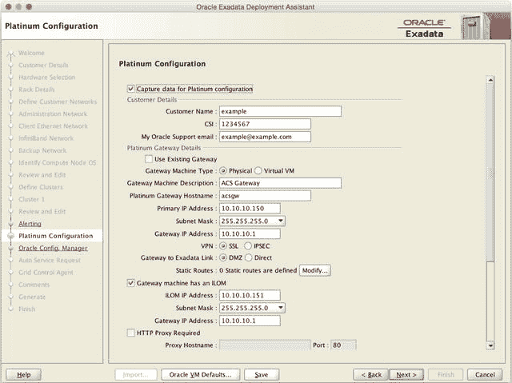
图 8-17. 白金配置屏幕

## Oracle 配置管理器

“Oracle 配置管理器”屏幕（图 8-18）包含配置 Oracle 配置管理器（OCM）所需的所有信息。OCM 用于收集配置信息并将其上传到（Oracle 企业管理器）存储库服务器。此选项对于 Exadata 配置不是必需的。Oracle 白金服务包含 OCM 的安装，因此如果已在上一个屏幕上配置了白金服务，则不需要此信息。如果您不使用白金服务但希望启用 OCM，表 8-10 包含此屏幕所需的所有字段。

表 8-10. Oracle 配置管理器字段

| 配置参数 | 描述 |
| --- | --- |
| Enable Oracle Configuration Manager | 勾选此框以启用 OCM。 |
| Receive updates via MOS | 如果您计划直接从 Oracle Support 接收更新，请勾选此框。 |
| MOS Email Address | 接收 My Oracle Support 更新的电子邮件地址。 |
| Access Oracle Configuration Manager via Support Hub | 如果使用支持中心，请勾选此框。 |
| Support Hub Hostname | 支持中心的主机名。 |
| Hub User Name | 支持中心服务器的操作系统用户名。 |
| HTTP Proxy used in upload to Oracle Configuration Manager | 如果与 Oracle 存储库通信需要 HTTP 代理，请勾选此框。 |
| HTTP Proxy Host | HTTP 代理主机名。 |
| Proxy Port | HTTP 代理端口。 |
| HTTP Proxy requires authentication | 如果 HTTP 代理需要身份验证，请勾选此框。 |
| HTTP Proxy User | HTTP 代理的用户名。 |

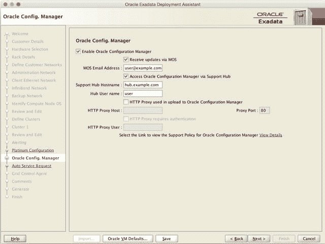
图 8-18. Oracle 配置管理器屏幕

## 自动服务请求

“自动服务请求”屏幕（图 8-19）包含配置 Oracle 自动服务请求（ASR）功能所需的信息。发生硬件故障时，ASR 将通过 ASR 服务器与 Oracle 支持之间的单向通信立即创建服务请求。所需的是一台单独的服务器和一个 Oracle 支持账户。虽然不是必需的，但强烈建议使用 ASR，因为使用它没有任何缺点。与 OCM 一样，自动服务请求通过白金服务提供，因此如果您使用白金服务，则无需输入任何信息。表 8-11 定义了配置 ASR 时的字段。

表 8-11. 自动服务请求字段

| 配置参数 | 描述 |
| --- | --- |
| Enable Auto Service Request | 如果使用自动服务请求，请勾选此框。 |
| ASR Manager Hostname | ASR 服务器的主机名。 |
| ASR Technical Contact Name | 负责 Exadata 系统的技术联系人的姓名。 |
| Technical Contact Email | 负责 Exadata 系统的技术联系人的电子邮件地址。 |
| My Oracle Support Account Name | 当硬件故障发生时将创建服务请求的 My Oracle Support 账户的名称。 |
| HTTP Proxy used in upload to ASR | 如果 ASR 服务器需要使用 HTTP 代理与 Oracle 支持通信，请勾选此框。 |
| HTTP Proxy Host | HTTP 代理的主机名。 |
| Proxy Port | HTTP 代理端口。 |
| HTTP Proxy requires authentication | 如果 HTTP 代理需要身份验证，请勾选此框。 |
| HTTP Proxy User | HTTP 代理的用户名。 |

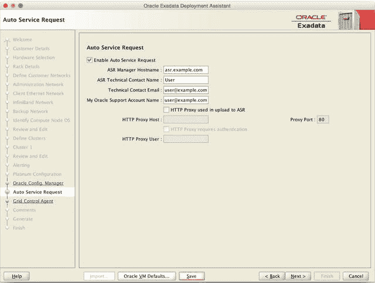
图 8-19. 自动服务请求屏幕


## 网格控制代理

“网格控制代理”屏幕（图 8-20）请求安装 Oracle Enterprise Manager 代理所需的信息。请注意，Exadata 配置工具并不会安装该软件，但添加此信息有助于在安装代理软件时方便地进行文档记录。表 8-12 定义了“网格控制代理”屏幕上的字段。

表 8-12.
网格控制代理 字段

| 配置参数 | 描述 |
| --- | --- |
| 启用 Enterprise Manager 网格控制代理 | 如果要指定一个 OEM 代理，请勾选此框。 |
| EM 主基准位置 | 代理安装的目录。 |
| OMS 主机名 | OEM 管理服务的主机名。 |
| OMS HTTPS 上传端口 | OEM 代理用于上传信息的端口。 |

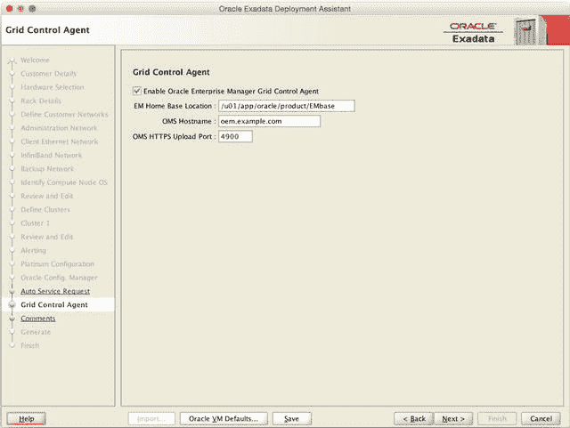

图 8-20.
网格控制代理 屏幕

## 注释

“注释”屏幕（图 8-21）允许 Exadata 管理员输入任何可能对配置工程师相关的附加注释。这包括一些关于网络配置的预设问题，以及任何需要在配置过程中应用于 Exadata 机架的自定义更改。在所示字段中输入任何其他注释，然后单击“Next ➤”按钮。单击此按钮后，部署助理将询问保存文档的位置。

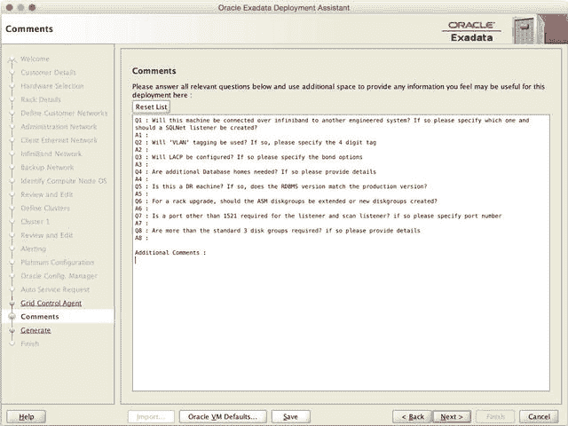

图 8-21.
注释 屏幕

## 完成

最后一个标题为“完成”的屏幕（图 8-22）显示了与配置文件相关的信息。还有一个超链接用于加载基于 HTML 的安装模板文件。完成后，单击“完成”按钮，您就可以进入下一步。

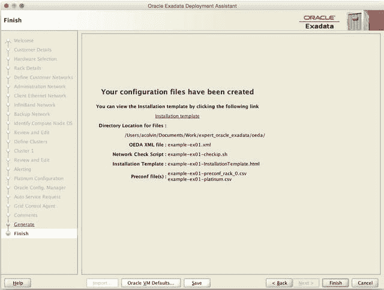

图 8-22.
完成 屏幕

部署助理创建的文件用于通过 OneCommand 脚本执行 Exadata 的实际安装。由部署助理创建的文件的完整列表包括以下内容：

```
$ find . -name \* -print
./example-ex01-checkip.sh
./example-ex01-InstallationTemplate.html
./example-ex01-platinum.csv
./example-ex01-preconf_rack_0.csv
./example-ex01.xml
./example-ex01.zip
```

安装 Exadata 系统所需的所有文件都包含在此目录中。文件将按照 `<客户端>-<Exadata 前缀>-<文件名>` 的格式命名。对于多机架集群，每个单独的集群将有一个单独的 XML 文件。表 8-13 描述了每个文件的用途。

表 8-13.
参数和部署文件

| 文件名 | 描述 |
| --- | --- |
| `checkip.sh` | 此文件用于运行 `checkip.sh` 脚本，该脚本执行网络就绪检查。 |
| `InstallationTemplate.html` | 安装模板是一个参考文件，包含了提供给部署助理软件的所有信息。这包括主机名、IP 地址、软件目录和补丁级别。 |
| `platinum.csv` | 此文件由 Oracle Platinum Services 用来完成其配置任务。 |
| `preconf_rack_#.csv` | 此文件包含特定 Exadata 机架的网络信息。如果要同时配置多个 Exadata 机架，每个机架将拥有自己的 `preconf_rack_#.csv` 文件。 |
| `cluster.xml` | 此文件包含构建集群所需的所有相关信息。OneCommand 过程在配置过程中使用此文件来安装和配置 Oracle 软件栈。 |
| `cluster.zip` | 这是一个 zip 文件，包含上述文件以供参考。 |

### 步骤 3：为主机名创建网络 VLAN 和 DNS 条目

运行 Exadata 部署助理实用程序后，需要将安装模板发送给网络团队，以便配置适当的网络虚拟局域网（VLAN）。主机名也需要在您的域名系统（DNS）服务器中注册。由于 OneCommand 过程的最终产品是一个运行中的 Oracle RAC 环境，因此必须为所有主机名配置正向和反向 DNS 查找。如果某个主机名解析不正确，可能会在部署过程中出现问题。


