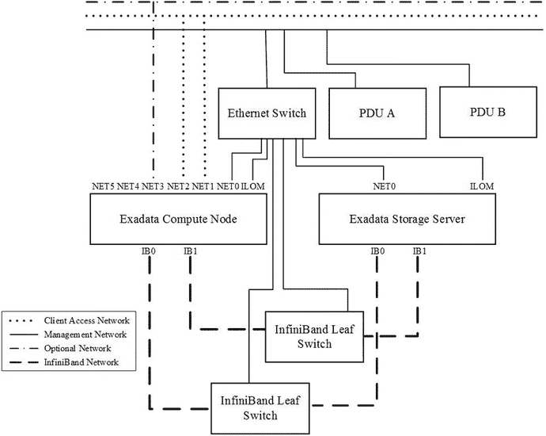
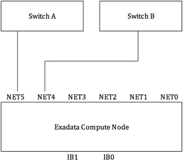

# 第 4 步：运行 CheckIP 以验证网络就绪状态

Exadata 部署助手创建的文件之一就是 `<client>-<cluster>-checkip.sh` 脚本。当 Oracle Exadata 部署助手用 Java 重写后，它就从一个由响应文件驱动的 shell 脚本，变成了一个完整的 Java 程序。如果你查看这个 shell 脚本的内部，实际上会发现它只是在后台调用 Java 代码。此脚本用于验证网络是否就绪，以及为 Exadata 规划的设置是否存在冲突。CheckIP 测试网络以确认满足以下条件：

- 应该响应 ping 的 IP 地址，确实响应。
- 不应该响应 ping 的 IP 地址，确实不响应。
- 必须在 DNS 中注册的主机名，能够使用 `<client>-<cluster>.xml` 文件中指定的信息进行正向和反向解析。

## 运行 CheckIP 脚本

在运行 OneCommand 之前，应运行 `<client>-<cluster>-checkip.sh` 脚本（CheckIP）以验证您公司网络的就绪情况。该脚本要求运行它的用户已从 My Oracle Support 站点下载了 Oracle Exadata 部署助手。用户还需要 `<client>-<cluster>-checkip.sh` 脚本以及 `<client>-<cluster>.xml` 文件。

此时，您应该从一个 Exadata 平台外部的主机运行 CheckIP。您选择运行 CheckIP 的主机必须拥有与您的 Exadata 系统相同的网络可见性。例如，该主机必须能够访问相同的 DNS 和 NTP 服务器，并且必须能够 ping 通您在 Exadata 网络设置中列出的 IP 地址。

下载 OEDA 实用程序并将所需文件复制到 OEDA 目录后，运行以下命令：

```
./<client>-<cluster>-checkip.sh
```

CheckIP 会将其进度打印到屏幕上，并生成一个 `<client>-<cluster>-checkip.out` 报告文件。

## 解释输出

以下清单展示了 CheckIP 脚本的示例输出。下面的输出在某些地方（FACTORY、CELL、SWITCHES 和 ILOMS）已被缩写：

```
正在执行配置文件验证
Checkip 版本: 15.141.14:00
如果此 Oracle Exadata 机架要添加到现有安装中，例如 Oracle Exadata、Oracle Exalogic 或 Oracle Exalytics 机架，
请从现有机器或安装运行 CheckIP 实用程序，以便私有网络检查能识别结构中正在使用的 IP 地址并报告它们。
未识别现有地址可能导致新机架安装后发生 IP 冲突。
正在处理 NAME 部分
正常: 名称服务器 10.100.1.207 响应 ex01db01.example.com 的解析请求
正常: 名称服务器 10.100.1.208 响应 ex01db01.example.com 的解析请求
正在处理 NTP 部分
正常: 10.100.1.208 响应时间服务器查询
正常: 10.100.148.198 响应时间服务器查询
正在处理 GATEWAY 部分
正常: 10.30.20.1 响应 ping
错误: 10.100.233.1 响应 ping
正在集群 ex01 上运行 checkip
正在处理 SCAN 部分
正常: ex01-scan.example.com 正向解析为 3 个 IP 地址 [10.100.233.205, 10.100.233.206, 10.100.233.207]
正常: ex01-scan.example.com 正向解析为 10.100.233.205
正常: 10.100.233.205 不响应 ping
正常: ex01-scan.example.com 正向解析为 10.100.233.206
正常: 10.100.233.206 不响应 ping
正常: ex01-scan.example.com 正向解析为 10.100.233.207
正常: 10.100.233.207 不响应 ping
正在处理 VIP 部分
正常: ex0101-vip.example.com 正向解析为 10.100.233.202
正常: 10.100.233.202 不响应 ping
正常: ex0102-vip.example.com 正向解析为 10.100.233.204
正常: 10.100.233.204 不响应 ping
正在处理 COMPUTE 部分
正常: ex0101.example.com 正向解析为 10.100.233.201
正常: 10.100.233.201 不响应 ping
正常: ex0102.example.com 正向解析为 10.100.233.203
正常: 10.100.233.203 不响应 ping
正常: ex01db01.example.com 正向解析为 10.30.20.85
正常: 10.30.20.85 不响应 ping
正常: ex01db02.example.com 正向解析为 10.30.20.86
正常: 10.30.20.86 不响应 ping
正在处理 CELL 部分
正常: ex01cel01.example.com 正向解析为 10.30.20.87
正常: 10.30.20.87 不响应 ping
正常: ex01cel02.example.com 正向解析为 10.30.20.88
正常: 10.30.20.88 不响应 ping
...
正在处理 FACTORY 部分
正常: 192.168.1.1 不响应 ping
...
正常: 192.168.1.9 不响应 ping
正在处理 SWITCHES 部分
正常: ex01sw-ip.example.com 正向解析为 10.30.20.95
正常: 10.30.20.95 不响应 ping
...
正在处理 ILOMS 部分
正常: ex01db01-ilom.example.com 正向解析为 10.30.20.90
正常: 10.30.20.90 不响应 ping
...
验证已完成...
```

在 `<client>-<cluster>-<checkup>.out` 文件中生成的输出报告包含与屏幕上显示相同的信息。如果发生任何验证错误，它们会以 `ERROR` 为前缀，并且描述失败的消息会指出遇到的问题以及预期的结果应该是什么。例如：

```
正在处理 SCAN 部分
正常: exa-scan.example.com 解析为 3 个 IP 地址
错误: exa-scan. ourcompany.com 错误地正向解析为 144.77.43.182 144.77.43.181 144.77.43.180，预期为 144.77.43.87
...
正在处理 COMPUTE 部分
正常: exadb01.example.com 正向解析为 10.80.23.1
正常: 10.80.23.1 反向解析为 exadb01.example.com.
错误: 10.80.23.1 响应 ping
```

CheckIP 的输出必须不包含任何错误。如果您在输出中看到任何错误，必须在运行 OneCommand 之前进行纠正。检查 `<client>-<cluster>-checkip.out` 文件，并确保在与网络管理员讨论之前，您没有输入错误的 IP 地址或拼错主机名。有时只需要对 Exadata 部署助手上的数据录入字段进行简单的更正即可。如果您这边一切看起来正常，请将 `<client>-<cluster>-checkip.out` 文件发送给您的网络管理员进行修复。


### 第 5 步：为 Exadata 机架布设线缆与电源

网络验证完成后，即可将所需线缆布设至机架预定位置。Exadata 机架从 Oracle 发货时，其内部线缆已全部连接完毕。这意味着将 Exadata 机架接入现有网络所需的**外部**线缆数量等于计算节点数量的两倍（每个节点两条），再加上一条管理网络线缆。内部线缆的布设示意图请参考图 8-23。



图 8-23. Exadata 铜缆网络示意图

虽然 Exadata 部署助手允许选择客户端访问网络是否采用绑定模式，但大多数 Exadata 配置会采用绑定网络以实现高可用性。由于此网络在 Exadata 上被视为关键网络，强烈建议采用绑定客户端访问网络。为此，特定主机上的每个端口需连接到不同的交换机。在使用铜缆连接客户端访问网络的 Exadata X5-2 系统上，使用端口 NET1 和 NET2。对于使用光纤连接的 Exadata X5-2 系统，端口 NET4 和 NET5 连接至外部交换机。无论采用哪种配置，都会为此网络创建一个名为 `bondeth0`（第一个以太网绑定）的绑定接口。绑定客户端访问网络的推荐布线连接方式请参考图 8-24。



图 8-24. 绑定的铜缆客户端访问网络

线缆布设完成后，请**不要**将其插入 Exadata 机架。由于机架预设了一组“出厂”IP 地址，如果这些地址在网络中其他地方已被使用，可能会导致 IP 冲突。所有线缆将在运行 `applyElasticConfig.sh` 脚本后再进行连接。

### 第 6 步：执行硬件安装

硬件安装通常由经认证的 Oracle 现场服务工程师（FSE）执行，该工程师有权访问企业安装服务检查表。此安装步骤相对简单，包括为 Exadata 机架上电、验证所有正确组件均已发货，并确保设备在运输过程中未受损。FSE 将执行多项硬件检查，并根据 Exadata 部署助手生成的 `InstallationTemplate.html` 文件中的设定配置网络设备。安装期间，FSE 将配置配电单元、所有 InfiniBand 交换机和内部以太网交换机。此时无需网络连接。此外，如果要将多个机架连接成一个集群，将在本步骤中进行多机架布线。

### 第 7 步：准备 OneCommand 文件与 Oracle 软件

在将配置文件复制到即将安装的 Exadata 计算节点之前，必须安装最新版的 Oracle Exadata 部署助手。该软件可从 My Oracle Support 的 `note #888828.1` 链接下载。下载最新版的 Oracle Exadata 部署助手后，需要将其传输到所有计算节点。

将参数和部署文件传输到 Exadata 有几种方法。一种方法是设置临时网络访问第一个计算节点。此网络配置将在后续步骤中被 `applyElasticConfig.sh` 替换为永久网络设置。另一种选择是将文件保存到便携式 USB 闪存盘，然后使用第一个计算节点前面板的 USB 端口，将文件复制到 OEDA 目录。USB 方法在较旧的 Exadata 型号（包含 `KVM`）上更为方便。由于缺少 `KVM`，建议创建到 Exadata 机架的临时网络连接。

Exadata 机架的出厂 IP 设置旨在确保每个机架到达客户现场时处于相同状态。所有机架将完全相同，无论规模大小——更大的机架系统只是使用了更多 IP 地址。IP 地址根据机架中的位置和网络组件类型分配。当 Oracle 在 X5-2 上引入弹性配置时，标准机架限制被移除。由于这种灵活性，新节点被配置为查询 InfiniBand 交换机以确定其默认 IP 地址。现在的标准出厂 IP 地址方案是使用 `172.16.2.0/24` 子网，其中最后八位由 InfiniBand 端口号加上 `36` 决定。这意味着，连接到 InfiniBand 端口 `8` 的第一个计算节点，其出厂 IP 地址为 `172.16.2.44`。`ILOM` IP 地址按照 `192.168.1.x` 的约定配置，按机架递增。请查阅《Exadata 用户指南》中的 InfiniBand 网络布线表，以确定您机架的 InfiniBand 端口矩阵。

要从笔记本电脑通过内部网络连接到 Exadata 计算节点，请在工厂网络上分配一个未使用的 IP 地址（例如 `172.16.2.244`，子网掩码 `255.255.255.0` 即可），并连接到内部以太网交换机端口 `48` 引出的线缆。然后，直接登录第一个计算节点（通常为 `172.16.2.44`），并通过 `SCP` 上传下载的 OEDA zip 文件。现在，是时候在整个集群上准备文件了。

在第一个计算节点的 `/opt/oracle.SupportTools/onecommand` 目录中解压 OEDA 文件。在第一个计算节点上准备配置文件。将 OEDA 软件和配置文件复制到所有计算节点。将 Oracle 安装介质和补丁程序复制到第一个计算节点。

#### 步骤 7-1：解压 OEDA

在此示例中，OEDA 软件已上传到第一个计算节点的 `/tmp/p20974448_121211_Linux-x86-64.zip`。解压该文件，然后为 OEDA 创建一个新目录，并将 zip 文件的内容解压到该目录中。

```
# mkdir -p /opt/oracle.SupportTools/onecommand
# chmod 777 /opt/oracle.SupportTools/onecommand
# cd /tmp
# unzip –q p20974448_121211_Linux-x86-64.zip –d /opt/oracle.SupportTools/onecommand
```

#### 步骤 7-2：准备配置文件

现在 OEDA 已在第一个计算节点上准备好，请将 Exadata 部署助手创建的所有配置文件上传到第一个计算节点的 `/opt/oracle.SupportTools/onecommand/linux-x64` 目录。

#### 步骤 7-3：将 OEDA 复制到所有计算节点

需要将 `/opt/oracle.SupportTools/onecommand` 目录的内容复制到机架中的所有计算节点。由于主机上未配置无密码访问，您需要使用单独的 `scp` 命令进行复制。以下示例针对半机架配置：

```
# scp –r /opt/oracle.SupportTools/onecommand  172.16.2.46: /opt/oracle.SupportTools
# scp –r /opt/oracle.SupportTools/onecommand  172.16.2.45: /opt/oracle.SupportTools
# scp –r /opt/oracle.SupportTools/onecommand  172.16.2.48: /opt/oracle.SupportTools
```


##### 第 7-4 步：暂存 Oracle 安装介质

最终，执行 Oracle 软件安装所需的软件必须上传至第一个计算节点上的`/opt/oracle.SupportTools/onecommand/linux-x64/WorkDir`目录。无需担心在其它节点上暂存安装文件——OneCommand 会根据需要传输这些文件。安装模板应包含一个“必需下载”部分，其中列出了执行安装所需的全部文件列表。该列表通常包括以下内容：

*   Oracle RDBMS 和 Grid Infrastructure 安装介质
*   用于安装介质的季度数据库补丁文件
    *   特定版本的`OPatch`文件
    *   任何建议的额外单点补丁

所有文件现已上传并暂存，您已准备好开始实际的配置过程。

### 第 8 步：配置操作系统

当 Oracle 硬件工程师完成安装后，您就可以首次启动计算节点和存储单元了。出厂时，新发货的 Exadata 中包含的服务器会预设一组 IP 地址，这被称为“**出厂配置**”。对于机架内升级，您将需要经历一个交互式的首次启动过程。首次启动过程在 Oracle 手册中并未详细记录，因此我们将花点时间讨论一下启动过程，以及首次启动这些服务器和存储单元时会发生什么。通常情况下，您拿到的是一个新的 Exadata 机架，它会直接引导至操作系统登录界面。

#### 回收磁盘空间

在配置出厂配置中的计算和存储服务器的网络设置之前，确保计算节点磁盘配置正确非常重要。X3-2 和 X4-2 计算节点发货时同时预装了 Linux 和 Solaris，让客户可以选择安装哪个操作系统。X5-2 计算节点发货时可选择物理 Linux 安装（默认）或用于运行虚拟化环境的 Oracle VM 安装。计算节点上安装了一个脚本(`/opt/oracle.SupportTools/reclaimdisks.sh`)，它将移除不需要的操作系统，并在所有磁盘驱动器上构建一个完全配置的 RAID-5 阵列。是时候回收可用磁盘空间，清除未使用的操作系统了。

```
# ./reclaimdisks.sh -free -reclaim
```

该脚本将在前台运行，重新配置逻辑卷配置。在 X5-2 计算节点上运行`reclaimdisks.sh`的输出如下所示：

```
# ./reclaimdisks.sh –reclaim -free
Model is ORACLE SERVER X5-2
Number of LSI controllers: 1
Physical disks found: 4 (252:0 252:1 252:2 252:3)
Logical drives found: 1
Linux logical drive: 0
RAID Level for the Linux logical drive: 5
Physical disks in the Linux logical drive: 4 (252:0 252:1 252:2 252:3)
Dedicated Hot Spares for the Linux logical drive: 0
Global Hot Spares: 0
[INFO     ] Check for Linux system disk
[INFO     ] Number of partitions on the system device /dev/sda: 4
[INFO     ] Higher partition number on the system device /dev/sda: 4
[INFO     ] Last sector on the system device /dev/sda: 3509760000
[INFO     ] End sector of the last partition on the system device /dev/sda: 3509759000
[INFO     ] Remove inactive system logical volume /dev/VGExaDb/LVDbSys3
[INFO     ] Remove xen files from /boot
[INFO     ] Unmount /u01 from /dev/mapper/VGExaDbOra-LVDbOra1
[INFO     ] Remove logical volume /dev/VGExaDbOra/LVDbOra1
[INFO     ] Remove volume group VGExaDbOra
[INFO     ] Remove physical volume /dev/sda4
[INFO     ] Remove partition /dev/sda4
[INFO     ] Remove device /dev/sda4
[INFO     ] Remove partition /dev/sda3
[INFO     ] Remove device /dev/sda3
[INFO     ] Create primary partition 3 using 240132160 3509759000
[INFO     ] Set lvm flag for the primary partition 3 on device /dev/sda
[INFO     ] Add device /dev/sda3
[INFO     ] Create physical volume on partition /dev/sda3
[INFO     ] Primary LVM partition /dev/sda3 has size 3269626841 sectors
[INFO     ] LVM Physical Volume /dev/sda3 has size 3269626841 sectors
[INFO     ] Size of LVM physical volume matches size of primary LVM partition /dev/sda3
[INFO     ] Extend volume group VGExaDb with physical volume on /dev/sda3
[INFO     ] Create 100Gb logical volume for DBORA partition in volume group VGExaDb
[INFO     ] Make DBORA ext4 file system on logical volume LVDbOra1
[INFO     ] Create filesystem on device /dev/VGExaDb/LVDbOra1
[INFO     ] Tune filesystem on device /dev/VGExaDb/LVDbOra1
[INFO     ] Set label DBORA for /dev/VGExaDb/LVDbOra1
[INFO     ] Mount /dev/mapper/VGExaDb-LVDbOra1 to /u01
[INFO     ] Logical volume LVDbSys2 exists in volume group VGExaDb
```

整个过程在 X5-2 计算节点上大约需要五分钟。对所有剩余的计算节点重复此步骤，并为处于出厂配置的 Exadata 系统运行`applyElasticConfig.sh`脚本。

#### 首次启动过程

每次服务器启动时，在运行级别 3 会调用`/etc/init.d/precel`脚本。该脚本会调用`/opt/oracle.cellos/cellFirstboot.sh`（首次启动）脚本。首次启动脚本会判断网络设置是否已经配置。这点未在文档中说明，但看起来它是由`/opt/oracle.cellos/cell.conf`文件的存在触发的。该文件由`/opt/oracle.cellos/ipconf.pl`脚本（`ipconf`）创建和维护，并包含有关您网络配置的所有信息。如果该文件存在，系统将假定已经配置完毕并继续启动周期。但如果未找到该文件，首次启动脚本将调用`ipconf`，并引导您通过交互式过程完成网络配置。`ipconf`用于为您的计算节点和存储单元设置以下网络参数：

*   名称服务器（DNS）
*   时间服务器（NTP）
*   国家代码
*   本地时区
*   主机名
*   所有网络设备的 IP 地址、子网掩码、网关、类型和主机名。类型是必需的，用于`cell.conf`文件中的内部文档。有效的类型包括`Private`、`Management`、`SCAN`和`Other`。
*   `ILOM`配置

例如，以下列表显示了在计算节点上配置管理网络时的提示：

```
Select interface name to configure or press Enter to continue: eth0
Selected interface. eth0
IP address or none: 192.168.8.217
Netmask: 255.255.255.0
Gateway (IP address or none) or none: 192.168.8.1
Select network type for interface from the list below
1: Management
2: SCAN
3: Other
Network type: 1
Fully qualified hostname or none: exadb03.ourcompany.com
```

当您完成所有网络设置的输入后，`ipconf`会生成一个新的`cell.conf`文件并重启系统。系统重启完成后，即可运行`reclaimdisks.sh`脚本，并完成由 OEDA 执行的软件安装。


### applyElasticConfig

由于 Exadata 机架上的主机已配置了出厂 IP 设置，服务器不会启动至`ipconf`脚本。Oracle 提供了一种自动化方法，可通过脚本设置机架上所有主机的网络信息。`applyElasticConfig.sh`脚本实现了这一过程的自动化。该脚本包含在 Oracle Exadata 部署助手（Oracle Exadata Deployment Assistant）中。它将确定每个节点（存储或计算）的主机类型，并应用该主机的特定网络设置。这是通过`ipconf`实用程序完成的。Exadata 部署助手创建的文件包括`<client>-<cluster>-preconf_rack_#.csv`和`<client>-<cluster>.xml`参数文件。`<client>-<cluster>-preconf_rack_#.csv`文件包含为每个计算节点和存储单元创建`cell.conf`文件所需的所有网络设置。由于`applyElasticConfig.sh`脚本会连接，`applyElasticConfig.sh`会调用`ipconf`脚本生成这些文件，并将它们作为`/opt/oracle.cellos/cell.conf`安装到每个计算节点和存储单元中。要运行`applyElasticConfig.sh`，请以 root 用户身份登录系统中的第一个计算节点，并按如下方式运行：

```
[root@exadb01 root]# cd /opt/oracle.SupportTools/onecommand/linux-x64
[root@exadb01 linux-x64]# ./applyElasticConfig.sh –cf <client>-<cluster>.xml
Applying Elastic Config...
Applying Elastic configuration...
Searching Subnet 172.16.2.x..............
7 live IPs in  172.16.2.x...............
Exadata node found 172.16.2.44..
Configuring node : 172.16.2.46...............
Done Configuring node : 172.16.2.46
Configuring node : 172.16.2.40.............
Done Configuring node : 172.16.2.40
Configuring node : 172.16.2.37.............................
Done Configuring node : 172.16.2.37
```

配置每个节点时，它将在配置最终网络设置后重新启动。一旦所有服务器完成启动周期，Exadata 应该已准备好连接到网络并使用 OneCommand 进行配置。在所有组件重新启动且机架已连接到网络后，登录第一个计算节点并运行 OneCommand 脚本的第一步，以验证一切是否准备就绪。

### 步骤 9：运行 OneCommand

OneCommand（包含在 OEDA zip 文件中）是在 Exadata 上安装 Oracle 软件的首选方法。OneCommand 是 Oracle 提供的一个实用程序，由多个配置步骤组成（截至本文撰写时有 20 个）。OneCommand 为 Exadata 客户和 Oracle 的支持人员提供了两个非常重要的好处。首先，它创建了数量有限的标准化（且众所周知的）配置，这使得平台更易于支持。毕竟，当终于联系到支持技术人员时，谁愿意听到“哦，我从未见过那样配置”呢？这是 Exadata 的关键优势之一。其次，它为从开始到结束配置 Exadata 提供了一个简化且结构化的机制。这意味着，凭借对 Exadata 内部原理的极少了解，经验丰富的技术人员可以在几小时内安装和配置 Exadata。目前尚不清楚 Oracle 最初是否打算对外提供对 OneCommand 的支持，但大约在 X2 开始发货的同时，Oracle 开始在《Exadata 所有者指南》（Exadata Owner’s Guide）中记录 OneCommand 流程。OneCommand 是一个多步骤过程，从一个名为`install.sh`的 shell 脚本运行。在撰写本文时，`install.sh`脚本支持安装 11.2.0.3 到 12.1.0.2 的版本，包括每个捆绑补丁。这些步骤可以端到端运行，也可以一次运行一个。表 8-14 显示了 2015 年 5 月版本中的每个步骤，以及该步骤功能的简要描述。

表 8-14.
OneCommand 步骤

| 步骤编号 | 步骤名称 | 描述 |
| --- | --- | --- |
| 步骤 1 | `Validate Configuration File` | 执行节点验证，包括检查所有主机是否在线、`<client>-<cluster>.xml`文件中的语法是否正确以及所有必需文件是否可用 |
| 步骤 2 | `Update Nodes for Eighth Rack` | 禁用计算节点上的 CPU 核心，移除存储服务器上的闪存卡和磁盘驱动器，然后重新启动所有组件 |
| 步骤 3 | `Setup Required Files` | 将所有文件移动到`/opt/oracle.SupportTools/onecommand/Software`目录，将补丁文件复制到整个集群，然后解压缩所有文件 |
| 步骤 4 | `Create Users` | 创建配置文件定义的操作系统用户帐户 |
| 步骤 5 | `Setup Cell Connectivity` | 创建`/etc/oracle/cell/network-config/cellip.ora`和`/etc/oracle/cell/network-config/cellinit.ora`文件 |
| 步骤 6 | `Verify Infiniband` | 使用`infinicheck`脚本验证 InfiniBand 网络 |
| 步骤 7 | `Calibrate Cells` | 使用`cellcli -e calibrate`命令检查单元磁盘。此命令测试单元磁盘的性能特征。如果任何磁盘性能低下，将在此步骤中识别出来。 |
| 步骤 8 | `Create Cell Disks` | 在所有存储服务器上配置单元磁盘、闪存缓存（Flash Cache）和闪存日志（Flash Log） |
| 步骤 9 | `Create Grid Disks` | 在所有存储服务器上创建网格磁盘 |
| 步骤 10 | `Configure Alerting` | 配置配置文件定义的 SMTP 和 SNMP 警报目的地 |
| 步骤 11 | `Install Cluster Software` | 安装 Grid Infrastructure 并为配置文件中定义的所有集群应用安装模板中指定的补丁 |
| 步骤 12 | `Initialize Cluster Software` | 在每个集群的所有计算节点上执行`root.sh`集群初始化脚本 |
| 步骤 13 | `Install Database Software` | 安装 Oracle 数据库软件并为配置文件中定义的所有集群应用安装模板中指定的补丁 |
| 步骤 14 | `Relink Database with RDS` | 确保所有数据库和 Grid Infrastructure 主目录都链接为使用 RDS 协议而不是 UDP |
| 步骤 15 | `Create ASM Diskgroups` | 创建配置文件定义的 ASM 磁盘组 |
| 步骤 16 | `Create Databases` | 创建配置文件定义的数据库 |
| 步骤 17 | `Apply Security Fixes` | 关闭集群并应用若干杂项修复 |
| 步骤 18 | `Install Exachk` | 安装`exachk`运行状况检查脚本 |
| 步骤 19 | `Create Installation Summary` | 创建部署摘要文档，包括 Exadata 集群的 IP 地址、主机名和序列号 |
| 步骤 20 | `ResecureMachine` | 对节点应用操作系统安全措施，包括设置密码要求和为 root 用户删除 SSH 密钥 |

用于运行 OneCommand 的主脚本是`install.sh`。20 个安装步骤可以通过按如下方式运行`install.sh`来列出：

```
# ./install.sh –cf <client>-<cluster>.xml -l
1. Validate Configuration File
2. Update Nodes for Eighth Rack
3. Setup Required Files
4. Create Users
5. Setup Cell Connectivity
6. Verify Infiniband
7. Calibrate Cells
8. Create Cell Disks
9. Create Grid Disks
10. Configure Alerting
11. Install Cluster Software
12. Initialize Cluster Software
13. Install Database Software
14. Relink Database with RDS
15. Create ASM Disk Groups
16. Create Databases
17. Apply Security Fixes
18. Install Exachk
19. Create Installation Summary
20. Resecure Machine
```

**注意**
OneCommand 不断变化以改进安装过程并支持额外的捆绑补丁。步骤的数量及其功能很可能随着每个 Exadata 版本而变化。在开始之前，请务必查看 README 文件，了解如何在您的系统上运行 OneCommand 的说明。


