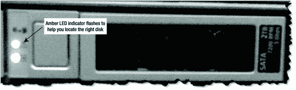
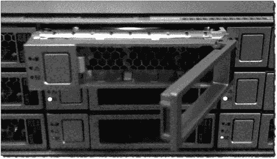
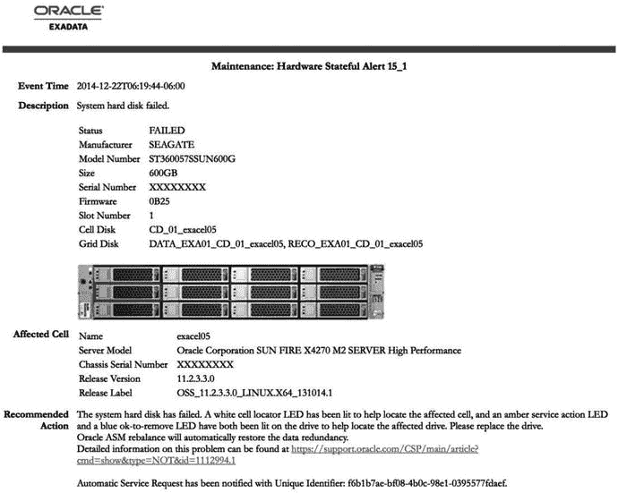

# 定位并更换故障磁盘

`CellCLI> list LUN attributes celldisk, physicaldrives where celldisk=CD_05_cell03 detail`

`cellDisk:               CD_05_cell03`
`physicalDrives:         16:5`

通过槽位地址，我们可以使用 `MegaCli64` 命令来激活存储单元前面板上磁盘驱动器的服务 LED。请注意，下面 `MegaCli64` 命令中的 `\` 字符用于防止 Bash shell 解释物理驱动器地址周围的括号 (`[]`)。（顺便说一下，单引号也可以起作用。）

```
/opt/MegaRAID/MegaCli/MegaCli64 -pdlocate -physdrv \[16:5\] -a0
```

磁盘驱动器前面的琥珀色 LED 应该开始闪烁，如图 9-2 所示。


**图 9-2. 磁盘驱动器前面板**

如果你想知道的话，可以使用 `MegaCli64` 命令的 `--stop` 选项来关闭服务 LED，如下所示：

```
/opt/MegaRAID/MegaCli/MegaCli64 -pdlocate --stop -physdrv \[16:5\] -a0
```

现在我们已经找到了正确的磁盘，可以通过按下释放按钮并轻轻拉动磁盘前面的拉杆将其从存储单元中移除，如图 9-3 所示。


**图 9-3. 弹出的磁盘驱动器**

**注意：** 存储单元中的所有磁盘驱动器都是可热插拔的，可以在不关闭存储单元电源的情况下进行更换。

## 检查 ASM 磁盘状态

在 `CellCLI` 中检查网格磁盘状态，我们发现它已从 `Active` 更改为 `Inactive`。这使得网格磁盘对 ASM 存储集群不可用：

```
CellCLI> list griddisk where name = 'SCRATCH_CD_05_cell03';

SCRATCH_CD_05_cell03    inactive
```

ASM 立即注意到磁盘丢失，将其脱机，并启动磁盘修复计时器。ASM 警告日志 (`alert_+ASM2.log`) 显示我们大约有 8.5 小时（30596/60/60）的时间将磁盘恢复在线，之后 ASM 会将其从磁盘组中永久移除：

```
alert_+ASM1.log
--------------------
Tue Dec 28 08:40:54 2010
GMON checking disk modes for group 5 at 121 for pid 52, osid 29292
Errors in file /u01/app/oracle/diag/asm/+asm/+ASM2/trace/+ASM2_gmon_5912.trc:
ORA-27603: Cell storage I/O error, I/O failed on disk o/192.168.12.5/SCRATCH_CD_05_cell03 at offset 4198400 for data length 4096
ORA-27626: Exadata error: 201 (Generic I/O error)
WARNING: Write Failed. group:5 disk:3 AU:1 offset:4096 size:4096
...
WARNING: Disk SCRATCH_DG_CD_05_CELL03 in mode 0x7f is now being offlined
WARNING: Disk SCRATCH_DG_CD_05_CELL03 in mode 0x7f is now being taken offline
...
Tue Dec 28 08:43:21 2010
WARNING: Disk (SCRATCH_DG_CD_05_CELL03) will be dropped in: (30596) secs on ASM inst: (2)
Tue Dec 28 08:43:23 2010
```

可以使用以下查询从一个 ASM 实例查看 ASM 中磁盘的状态。请注意，`SCRATCH` 磁盘组仍然处于挂载（在线）状态：

```
SYS:+ASM2> select dg.name, d.name, dg.state, d.mount_status, d.header_status, d.state
from v$asm_disk d,
v$asm_diskgroup dg
where dg.name = 'SCRATCH_DG'
and dg.group_number = d.group_number
order by 1,2;

NAME          NAME                         STATE      MOUNT_S HEADER_STATU STATE
------------- ---------------------------- ---------- ------- ------------ ----------
SCRATCH       SCRATCH_DG_CD_05_CELL01      MOUNTED    CACHED  MEMBER       NORMAL
SCRATCH       SCRATCH_DG_CD_05_CELL02      MOUNTED    CACHED  MEMBER       NORMAL
SCRATCH       SCRATCH_DG_CD_05_CELL03      MOUNTED    MISSING UNKNOWN      NORMAL
```

当磁盘脱机时，ASM 会继续轮询其状态，以查看磁盘是否可用。我们在 ASM 警告日志中看到以下查询在重复：

```
alert_+ASM1.log
--------------------
WARNING: Exadata Auto Management: OS PID: 5918 Operation ID: 3015:   in diskgroup  Failed
SQL    : /* Exadata Auto Mgmt: Select disks in DG that are not ONLINE. */
select name from v$asm_disk_stat
where
mode_status='OFFLINE'
and
```


```
group_number in
(
select group_number from v$asm_diskgroup_stat
where
name='SCRATCH_DG'
and
state='MOUNTED'
)
```

我们的测试数据库也检测到了网格磁盘的丢失，这一点可以在数据库告警日志中看到：

`alert_SCRATCH.log`

```
-----------------------
Tue Dec 28 08:40:54 2010
Errors in file /u01/app/oracle/diag/rdbms/scratch/SCRATCH/trace/SCRATCH_ckpt_22529.trc:
ORA-27603: Cell storage I/O error, I/O failed on disk o/192.168.12.5/SCRATCH_CD_05_cell03 at offset 26361217024 for data length 16384
ORA-27626: Exadata error: 201 (Generic I/O error)
WARNING: Read Failed. group:5 disk:3 AU:6285 offset:16384 size:16384
WARNING: failed to read mirror side 1 of virtual extent 0 logical extent 0 of file 260 in group [5.1611847437] from disk SCRATCH_CD_05_CELL03  allocation unit 6285 reason error; if possible, will try another mirror side
NOTE: successfully read mirror side 2 of virtual extent 0 logical extent 1 of file 260 in group [5.1611847437] from disk SCRATCH_CD_05_CELL02 allocation unit 224
...
Tue Dec 28 08:40:54 2010
NOTE: disk 3 (SCRATCH_CD_05_CELL03) in group 5 (SCRATCH) is offline for reads
NOTE: disk 3 (SCRATCH_CD_05_CELL03) in group 5 (SCRATCH) is offline for writes
```

请注意，数据库会自动切换到镜像副本来读取那些无法从故障网格磁盘读取的数据。这正是 ASM 常规冗余机制在起作用。

当我们重新插入磁盘驱动器后，存储单元会将网格磁盘状态恢复为 Active（活动），ASM 也会将磁盘重新联机。通过下面的查询，我们可以看到网格磁盘已恢复到 `CACHED` 状态，且 `HEADER_STATUS` 为 `NORMAL`：

```
SYS:+ASM2> select dg.name, d.name, dg.state, d.mount_status, d.header_status, d.state
from v$asm_disk d,
v$asm_diskgroup dg
where dg.name = 'SCRATCH'
and dg.group_number = d.group_number
order by 1,2;

NAME          NAME                      STATE      MOUNT_S HEADER_STATU STATE
------------- ------------------------- ---------- ------- ------------ ----------
SCRATCH       SCRATCH_CD_05_CELL01      MOUNTED    CACHED  MEMBER       NORMAL
SCRATCH       SCRATCH_CD_05_CELL02      MOUNTED    CACHED  MEMBER       NORMAL
SCRATCH       SCRATCH_CD_05_CELL03      MOUNTED    CACHED  MEMBER       NORMAL
```


磁盘组可能需要补写在磁盘离线期间排队等待写入的数据。如果磁盘在 `disk_repair_time` 计时器归零之前被重新插入，磁盘只需补上错过的写入操作即可。否则，整个磁盘组将需要重新平衡，这可能耗费相当长的时间。一般来说，这种延迟不是问题，因为它都在后台发生。在重新同步过程中，ASM 冗余机制使我们的数据库能够继续运行，服务不会中断。您可以通过 ASM 中的 `gv$asm_operation` 视图查看重新同步或重新平衡操作的状态。请注意，重新同步操作仅在 Oracle 12c 及更高版本中可见。

如果这是真实的磁盘故障，并且我们实际更换了磁盘驱动器，我们将需要等待 RAID 控制器确认新磁盘后才能使用。这个过程不会太久，但在使用前您应该检查磁盘状态以确保其状态为正常（Normal）。可以使用 `CellCLI` 命令 `LIST PHYSICALDISK` 来验证磁盘状态，如下所示：

```
CellCLI> list physicaldisk where diskType=HardDisk AND status=critical detail
```

当更换磁盘时，存储单元会自动执行以下任务：

*   更新磁盘固件以匹配存储单元中的其他磁盘驱动器。
*   重新创建单元磁盘，使其与被替换的磁盘匹配。
*   将新的单元磁盘联机（状态设置为 Normal）。
*   重新创建故障磁盘上的网格磁盘（或多个网格磁盘）。
*   将网格磁盘状态设置为 Active。

一旦更换后的网格磁盘被设置为 Active，ASM 会自动打开磁盘并开始重新同步过程。Exadata 存储服务器软件会自动处理所有这些任务，使得更换磁盘成为相当轻松的过程。

##### 何时更换单元磁盘

磁盘故障可能突然发生，导致磁盘立即离线；也可能逐渐发生，表现为 I/O 性能下降。存储单元会持续监控磁盘驱动器。这种监控包括驱动器的 I/O 和吞吐量性能，以及 SMART 指标，如温度、速度和读/写错误。其目标是为可能即将发生故障的磁盘提供早期预警。当存储单元检测到问题时，会生成一个包含具体磁盘更换说明的警报。如果系统已配置电子邮件通知，这些警报会自动通过电子邮件发送给您。警报也会通过其他可用的通知方法发送，包括 Oracle Enterprise Manager 和自动服务请求。图 9-4 显示了来自 Exadata 存储单元的电子邮件警报示例。请注意，电子邮件包含主机名称、发生故障的磁盘，甚至是一张存储单元前部的图片，故障磁盘周围标有红色圆环。当磁盘被更换且警报清除后，将会发送一封后续电子邮件，新磁盘周围标有绿色圆环。



图 9-4.
来自故障磁盘驱动器的电子邮件警报示例

在上一节中，我们引导您完成了一次模拟的驱动器故障。如果这是真实的磁盘故障，更换磁盘的步骤将遵循与模拟相同的流程。但是，当 Exadata 的预警系统确定某个驱动器可能即将发生故障时，会发生什么？当 Exadata 检测到驱动器问题时，它会相应地设置物理磁盘状态属性。以下 `CellCLI` 命令显示存储单元中所有磁盘的状态：

```
CellCLI> list physicaldisk attributes name, status where disktype = 'HardDisk'
         35:0    normal
         35:1    normal
         ...
         35:11   normal
```

表 9-1 显示了各种磁盘状态值及其含义。

表 9-1.
磁盘状态定义

| 状态 | 描述 |
| --- | --- |
| Normal | 驱动器健康。 |
| Predictive Failure | 磁盘仍在工作，但很可能即将发生故障，应尽快更换。 |
| Poor Performance | 磁盘表现出极差的性能，应予以更换。 |


### 预警性故障

如果磁盘状态显示为 `预警性故障`，`ASM` 将自动从驱动器中移除相关的网格磁盘，并根据受影响磁盘组（使用该驱动器的磁盘组）的冗余策略，将数据重平衡到磁盘组中的其他磁盘上。一旦 `ASM` 完成重平衡并执行完移除操作，您就可以更换该磁盘驱动器。下面的清单可用于跟踪 `ASM` 磁盘的状态。状态为 `Offline` 表示 `ASM` 尚未完成该磁盘组的重平衡。重平衡完成后，该磁盘将不再出现在清单中。顺便一提，查看 `ASM` 警报日志也是检查移除进度的绝佳方式。

```sql
SYS:+ASM2>select name, mode_status
            from v$asm_disk_stat
           where name like 'SCRATCH%'
           order by 1;

NAME                                               MODE_ST
-------------------------------------------------- -------
SCRATCH_CD_05_CELL01                               ONLINE
SCRATCH_CD_05_CELL02                               ONLINE
SCRATCH_CD_05_CELL03                               OFFLINE
```

**注意事项**

存储单元中的前两个物理磁盘也包含 Linux 操作系统。这两个磁盘上的操作系统分区被配置为彼此的镜像。如果其中一块磁盘发生故障，在您移除它之前，数据必须与镜像磁盘保持同步。更换磁盘前，请使用 `CellCLI` 命令 `alter cell validate configuration` 来验证不存在任何 `mdadm` 错误。

`CellCLI` 命令 `VALIDATE CONFIGURATION` 会为您执行此验证：

```bash
CellCLI> ALTER CELL VALIDATE CONFIGURATION
Cell enkcel01 successfully altered
```

### 性能低下

如果一块磁盘表现出性能低下，则应予以更换。一块性能不佳的单元磁盘可能会影响其他健康磁盘的性能。当磁盘性能开始极度恶化时，其状态将被设置为 `性能低下`。与 `预警性故障` 状态类似，`ASM` 会自动从磁盘组中移除所有（位于此单元磁盘上的）网格磁盘，并开始重平衡操作。重平衡完成后，您就可以移除并更换故障磁盘驱动器。您可以使用 `CellCLI` 命令 `CALIBRATE` 来手动检查存储单元中所有磁盘的性能。此命令运行 Oracle 的 `Orion` 校准工具，以考察每个磁盘的性能和吞吐量。通常，在运行 `CALIBRATE` 之前应关闭 `cellsrv`，因为它会显著影响使用该存储单元的数据库的 I/O 性能。如果无法为测试关闭 `cellsrv`，您可以使用 `FORCE` 选项运行 `CALIBRATE`。尽管听起来令人担忧，`FORCE` 选项只是覆盖了安全开关，允许您在 `cellsrv` 运行且应用程序正在使用单元磁盘时运行 `CALIBRATE`。下面的清单展示了在 `Exadata X4-2` 高容量存储单元的一组健康单元磁盘上运行 `CALIBRATE` 命令的输出。测试大约需要十分钟完成。

```text
CellCLI> calibrate

Calibration will take a few minutes...
Aggregate random read throughput across all hard disk LUNs: 1123 MBPS
Aggregate random read throughput across all flash disk LUNs: 8633 MBPS
Aggregate random read IOs per second (IOPS) across all hard disk LUNs: 2396
Aggregate random read IOs per second (IOPS) across all flash disk LUNs: 260102

Calibrating hard disks (read only) ...
LUN 0_0  on drive [20:0     ] random read throughput: 141.27 MBPS, and 195 IOPS
LUN 0_1  on drive [20:1     ] random read throughput: 139.66 MBPS, and 203 IOPS
LUN 0_10 on drive [20:10    ] random read throughput: 141.02 MBPS, and 201 IOPS
LUN 0_11 on drive [20:11    ] random read throughput: 140.82 MBPS, and 200 IOPS
LUN 0_2  on drive [20:2     ] random read throughput: 139.89 MBPS, and 199 IOPS
LUN 0_3  on drive [20:3     ] random read throughput: 142.46 MBPS, and 201 IOPS
LUN 0_4  on drive [20:4     ] random read throughput: 140.99 MBPS, and 203 IOPS
LUN 0_5  on drive [20:5     ] random read throughput: 141.92 MBPS, and 198 IOPS
LUN 0_6  on drive [20:6     ] random read throughput: 141.23 MBPS, and 199 IOPS
LUN 0_7  on drive [20:7     ] random read throughput: 143.44 MBPS, and 202 IOPS
LUN 0_8  on drive [20:8     ] random read throughput: 141.54 MBPS, and 204 IOPS
LUN 0_9  on drive [20:9     ] random read throughput: 142.63 MBPS, and 202 IOPS

Calibrating flash disks (read only, note that writes will be significantly slower) ...
LUN 1_0  on drive [FLASH_1_0] random read throughput: 540.90 MBPS, and 39921 IOPS
LUN 1_1  on drive [FLASH_1_1] random read throughput: 540.39 MBPS, and 40044 IOPS
LUN 1_2  on drive [FLASH_1_2] random read throughput: 541.03 MBPS, and 39222 IOPS
LUN 1_3  on drive [FLASH_1_3] random read throughput: 540.45 MBPS, and 39040 IOPS
LUN 2_0  on drive [FLASH_2_0] random read throughput: 540.56 MBPS, and 43739 IOPS
LUN 2_1  on drive [FLASH_2_1] random read throughput: 540.64 MBPS, and 43662 IOPS
LUN 2_2  on drive [FLASH_2_2] random read throughput: 542.54 MBPS, and 36758 IOPS
LUN 2_3  on drive [FLASH_2_3] random read throughput: 542.63 MBPS, and 37341 IOPS
LUN 4_0  on drive [FLASH_4_0] random read throughput: 542.35 MBPS, and 39658 IOPS
LUN 4_1  on drive [FLASH_4_1] random read throughput: 542.62 MBPS, and 39374 IOPS
LUN 4_2  on drive [FLASH_4_2] random read throughput: 542.80 MBPS, and 39699 IOPS
LUN 4_3  on drive [FLASH_4_3] random read throughput: 543.14 MBPS, and 38951 IOPS
LUN 5_0  on drive [FLASH_5_0] random read throughput: 542.42 MBPS, and 38388 IOPS
LUN 5_1  on drive [FLASH_5_1] random read throughput: 542.69 MBPS, and 39360 IOPS
LUN 5_2  on drive [FLASH_5_2] random read throughput: 542.59 MBPS, and 39350 IOPS
LUN 5_3  on drive [FLASH_5_3] random read throughput: 542.72 MBPS, and 39615 IOPS

CALIBRATE results are within an acceptable range.
Calibration has finished.
```

## 单元闪存缓存故障

Exadata X4-2 存储单元配备了四个 F80 PCIe 闪存缓存卡。每张卡有四个闪存缓存磁盘（FDOM），总计 16 个闪存磁盘。Exadata X5-2 大容量单元包含四张 F160 PCIe 闪存缓存卡，总共有四个闪存磁盘。这些闪存缓存卡占据存储单元内部的插槽 1、2、4 和 5。如果某个闪存缓存模块发生故障，存储单元的性能将会下降，应尽快予以更换。如果您将部分闪存缓存用于基于闪存磁盘的网格磁盘，那么您的磁盘组冗余也将受到影响。这些闪存缓存卡不支持热插拔，因此更换它们需要关闭受影响的单元电源。

如果某个闪存磁盘发生故障，Exadata 会向您发送电子邮件通知故障。邮件将包含该卡的插槽地址。如果特定的 FDOM 故障，邮件还会包含该 FDOM 在卡上的地址（1、2、3 或 4）。可以使用 `CellCLI` 命令 `LIST PHYSICALDISK` 查看故障的闪存缓存卡，如下所示：

```
CellCLI> list physicaldisk where disktype=flashdisk and status!=normal detail

         name:                 FLASH_5_3
         diskType:             FlashDisk
         flashLifeLeft:        100
         luns:                 5_3
         makeModel:            "Sun Flash Accelerator F80 PCIe Card"
         physicalFirmware:     UIO1
         physicalInsertTime:   2014-10-03T20:08:05-05:00
         physicalSize:         372.52903032302856G
         slotNumber:           "PCI Slot: 5; FDOM: 3"
         status:               critical
```

这里的 `slotNumber` 属性显示了卡和 FDOM 的安装位置。在我们的例子中，该卡安装在 PCIe 插槽 5 中。获得此信息后，您可以关闭存储单元电源并更换故障部件。请记住，当单元离线时，ASM 将无法再访问其上的网格磁盘。因此，在关闭单元之前，请确保关闭操作不会影响其所支持磁盘组的可用性。这与本章“单元磁盘故障”一节中描述的步骤相同。更换部件并重新启动单元后，存储单元将自动在更换的卡上配置单元磁盘，如果该卡曾用于闪存缓存，您将看到您的闪存缓存恢复为原来的大小。

## 单元故障

单元故障主要有两种类型——临时性和永久性。临时性单元故障可能无害，如单元重启或断电。持续的单元故障也可能本质上是临时的。例如，如果补丁安装失败或某个组件需要更换，可能会导致单元离线数小时甚至数天。永久性单元故障性质更严重，需要更换整个单元机箱。无论哪种情况，如果您的系统配置得当，都不会中断 ASM 或您的数据库。在本节中，我们将探讨当单元暂时离线时会发生什么，以及如果您必须更换一个单元时该怎么做。

### 临时性单元故障

如第 14 章所述，Exadata 存储单元是运行 Oracle Enterprise Linux 5 或 6 的 Sun 服务器，带有内部磁盘驱动器。如果某个存储单元离线，该单元上的所有磁盘对数据库服务器将变得不可用。这意味着该存储单元上包含数据库数据（以及 OCR 和 Voting 文件）的所有磁盘组在故障期间都将处于离线状态。ASM 故障组提供冗余，使您的集群和数据库能够在故障期间继续运行，尽管 I/O 性能会降低。在存储单元中创建网格磁盘时，它们会被分配给一个故障组。每个单元构成一个故障组，如下列列表所示：

```
SYS:+ASM2> select dg.name diskgroup, d.name disk, d.failgroup
from v$asm_diskgroup dg,
v$asm_disk d
where dg.group_number = d.group_number
and dg.name like 'SCRATCH%'
order by 1,2,3;

DISKGROUP                      DISK                           FAILGROUP
------------------------------ ------------------------------ ------------------------------
SCRATCH_DG                     SCRATCH_DG_CD_05_CELL01        CELL01
SCRATCH_DG                     SCRATCH_DG_CD_05_CELL02        CELL02
SCRATCH_DG                     SCRATCH_DG_CD_05_CELL03        CELL03
```

因为 `SCRATCH_DG` 是使用普通冗余创建的，所以即使整个存储单元宕机，我们的 `SCRATCH` 数据库也应该能够继续运行。在本节中，我们将测试当存储单元完全停止运行时会发生什么。我们将使用本章前面用于磁盘故障模拟的相同磁盘组配置。为了引发单元故障，我们将登录到存储单元 3 的 ILOM 并关闭其电源。由于每个存储单元构成一个 ASM 故障组，此场景与丢失单个单元磁盘非常相似（I/O 性能除外）。当然，不同之处在于我们丢失的是整个故障组。正如我们在单元磁盘故障测试中所做的那样，我们将在故障期间在 `SCRATCH` 数据库中生成数据，以验证数据库在单元停机期间是否继续为客户端请求提供服务。

为了生成测试所需的 I/O，我们将反复将 `BIGTAB` 表中的 23205888 行插入到 `bigtab2` 表中：

```
RJOHNSON:SCRATCH> insert /*+ append */ into bigtab2 nologging (select * from bigtab);
RJOHNSON:SCRATCH> commit;
```

在上述插入操作运行时，让我们关闭 Cell03 电源，并查看数据库警报日志。如您所见，当从 Cell03 上的磁盘读取时，数据库抛出错误“failed to read mirror side 1”。在日志往下几行，您会看到数据库成功读取了该区的镜像副本“successfully read mirror side 2”。

```
alert_SCRATCH.log
-----------------------
Fri Jan 16 21:09:45 2015
Errors in file /u01/app/oracle/diag/rdbms/scratch/SCRATCH/trace/SCRATCH_mmon_31673.trc:
ORA-27603: Cell storage I/O error, I/O failed on disk o/192.168.12.5/SCRATCH_CD_05_cell03 at offset 2483044352 for data length 16384
ORA-27626: Exadata error: 12 (Network error)
...
WARNING: Read Failed. group:3 disk:2 AU:592 offset:16384 size:16384
WARNING: failed to read mirror side 1 of virtual extent 2 logical extent 0 of file 260 in group [3.689477631] from disk SCRATCH_CD_05_CELL03  allocation unit 592 reason error; if possible,will try another mirror side
NOTE: successfully read mirror side 2 of virtual extent 2 logical extent 1 of file 260 in group [3.689477631] from disk SCRATCH_CD_05_CELL01 allocation unit 589
```

转到 ASM 警报日志，我们看到 ASM 也注意到了 Cell03 的问题，并通过将网格磁盘 `SCRATCH_CD_05_CELL03` 置为离线来响应。注意，稍后 ASM 也在将其他网格磁盘置为离线。这个过程一直持续，直到 Cell03 上的所有网格磁盘都离线：

```
alert_+ASM2.log
-------------------
--- Test Cell03 Failure ---
Fri Jan 16 21:09:45 2015
```

`注意：进程 23445 正在使磁盘 2.3915933784 (SCRATCH_CD_05_CELL03) 脱机，组 3 中的掩码为 0x7e`

`...`

`警告：磁盘 SCRATCH_CD_05_CELL03 处于 0x7f 模式，现在正在脱机`

`2015 年 1 月 16 日 星期五 21:09:47`

`注意：进程 19753 正在使磁盘 10.3915933630 (RECO_CD_10_CELL03) 脱机，组 2 中的掩码为 0x7e`

检查 `V$SESSION` 和 `V$SQL` 视图，我们可以看到插入操作仍在运行：

`SID PROG       SQL_ID         SQL_TEXT`
`----- ---------- -------------  -----------------------------------------`
`3 sqlplus@en 9ncczt9qcg0m8  insert /*+ append */ into bigtab2 nologgi`

因此，即使丢失了三分之一的所有存储，我们的数据库仍能继续服务客户端请求。这相当了不起。让我们再次启动 Cell03，并观察当此存储再次可用时会发生什么。

查看 Cell03 的告警日志，我们看到 `cellsrv` 将我们的网格磁盘重新联机。我们在 Cell03 告警日志中看到的最后内容是，它通过与数据库服务器上的 `diskmon`（磁盘监控器）进程建立心跳来重新加入存储网格：

`Cell03 告警日志`
`-----------------`
`GridDisk SCRATCH_DG_CD_05_cell03 的存储索引分配成功 [代码： 1]`
`CellDisk v0.5 名称=CD_05_cell03 状态=正常 guid=edc5f61e-6a60-48c9-a4a6-58c403a86a7c 发现于设备=/dev/sdf`
`GridDisk SCRATCH_DG_CD_05_cell03  - 编号为 (96)`
`GridDisk RECO_CD_06_cell03 的存储索引分配成功 [代码： 1]`
`GridDisk SYSTEM_CD_06_cell03 的存储索引分配成功 [代码： 1]`
`GridDisk STAGE_CD_06_cell03 的存储索引分配成功 [代码： 1]`
`GridDisk DATA_CD_06_cell03 的存储索引分配成功 [代码： 1]`
`CellDisk v0.5 名称=CD_06_cell03 状态=正常 guid=00000128-e01b-6d36-0000-000000000000 发现于设备=/dev/sdg`
`GridDisk RECO_CD_06_cell03  - 编号为 (100)`
`GridDisk SYSTEM_CD_06_cell03  - 编号为 (104)`
`GridDisk STAGE_CD_06_cell03  - 编号为 (108)`
`GridDisk DATA_CD_06_cell03  - 编号为 (112)`
`...`
`2015 年 1 月 16 日 星期五 22:51:30`
`与 diskmon 的心跳已在 enkdb02.enkitec.com 上启动`
`与 diskmon 的心跳已在 enkdb01.enkitec.com 上启动`
`2015 年 1 月 16 日 星期五 22:51:40`
`...`

## 总结

Exadata 是一个高度冗余的平台，包含许多活动部件。企业投资于此类平台，通常都期望有最短的停机时间。因此，Exadata 通常用于托管具有非常严格正常运行时间要求的关键业务应用程序。了解出现问题时该怎么做对于满足这些正常运行时间要求至关重要。在本章中，我们讨论了在组件和系统发生故障时保护您的应用程序和客户的正确流程。在您的系统投入生产之前，请优先练习备份和恢复系统卷、移除和更换磁盘驱动器以及重启存储单元。此外，熟悉您的数据库会发生什么变化。运行我们在本章讨论的诊断工具，并确保您理解如何解读输出结果。如果您将负责为公司维护 Exadata，那么现在就是熟悉本章所讨论主题的时候。

