# 12. 监控 Exadata 性能

至此，您已了解了关键的 Exadata 性能特性和相关的性能指标。现在，让我们看看如何将这些应用于日常任务。在本章中，您将读到可用于数据库层和存储单元性能监控的标准工具，以及如何解读其输出。

Oracle 数据库和 Exadata 存储单元提供了极其多样的指标，但在监控任何指标之前，您应该问问自己为什么要监控它们。此外，您应该知道，如果某个指标超过某个阈值，您会采取什么行动。这就引出了后续问题：具体是哪个阈值应该触发您的行动，以及为什么？换句话说，您应该清楚自己试图达到什么目标（理想情况下是可量化的、甚至可以书面记录的用户的良好响应时间），以及性能指标与之有何关联。

这里涵盖的监控任务可分为以下几类：

*   SQL 语句响应时间监控
*   数据库层利用率与效率监控
*   存储单元层利用率与效率监控
*   用于 Exadata 性能疑难排查的高级指标与监控

请注意，重点将放在 Exadata 特定的性能主题上，而非整个广泛的其他 Oracle 性能主题，如锁争用或通用 SQL 性能问题。这些内容肯定无法在一章内涵盖！

### 系统化方法

无论您监控什么指标，都应心中有目标。换句话说，不要仅仅因为指标可用就去收集和展示它们；这很可能会让您徒劳无功，甚至可能误导您去修复错误的问题。请注意，“性能”一词是模糊的——不同的人使用它时可能有不同的含义。从 IT 系统用户的角度来看，性能最终只关乎一件事——响应时间。而且不是在底层测量的个别等待事件的响应时间；终端用户并不关心那个。他们关心的是完成其业务任务需要等待多久，例如从提交报告到实际看到输出所需的时间。这个时间是以普通的挂钟时间来衡量的；就这么简单。

如果您监控的目的是确保应用程序用户获得良好的响应时间，那么您就应该衡量真正重要的东西——您的终端用户所体验到的响应时间。这将是性能监控的理想切入点。除了这个切入点，您还应该衡量更详细、更低层级的指标，以便将终端用户的响应时间分解为各个组成部分，例如在应用服务器中花费的时间和数据库时间。您的应用工具插桩和监控工具应能跟踪哪些数据库会话被用于哪些终端用户任务，这样当用户遇到不可接受的响应时间时，您可以报告这些特定的数据库会话当时正在做什么。在此上下文中，工具插桩通常意味着调用 `DBMS_APPLICATION_INFO`，这是一个对开发者极其有用的包，可用于让数据库知晓业务流程。

注意

我们在这里特意说了“无法接受的响应时间”，而不是笼统的“用户遇到的性能问题”。每当用户抱怨性能问题时，您都应试图清楚地了解他们实际指的是什么，以及问题是如何被衡量的。是确实有用户在应用程序中经历了过长的响应时间，还是某个监控系统仅仅因为“过高”的 CPU 利用率或任何其他次要指标而发出了警报？您后续的行动将取决于您试图解决的问题。理想情况下，您不应使用性能工具或 Oracle 指标来判定是否存在性能问题。您的出发点应该是用户（报告问题的人）或应用层面的指标，这些指标从应用程序视角反映了数据库响应时间。无论数据库指标看起来多好，如果应用程序为了等待报告完成而耗费了大量时间，那么您就有一个需要深入探究的性能问题。反之，无论您的数据库指标看起来有多“糟糕”，如果您的应用程序响应时间令人满意，您就没有迫切的需要去着手修复任何东西。

当因为正在发生的问题（过长的响应时间）而检查性能指标时，您应该首先识别出为这个缓慢的应用程序或作业提供服务的会话，然后深入探究该特定会话的响应时间。更准确地说，这应称为性能疑难排查，而不仅仅是监控。

请注意，还有其他类型的性能监控任务您可能想要执行——例如，主动的利用率和效率监控。执行这些任务可以让您密切关注服务器中剩余的利用余量，并在用户察觉到响应时间差异之前，就检测到系统利用率和底层响应时间的任何异常和突然峰值。收集和监控性能与利用率数据的另一个原因是用于容量规划。另外，由于这是一本关于数据库的书，我们无法深入探讨任何端到端的性能测量主题，这些主题会涉及在数据库参与之前，识别在应用服务器、网络等上花费的时间。

本章首先讨论如何识别一个运行缓慢的查询将其大部分时间花费在了哪里。您还可以阅读更多关于如何判断一个查询是否充分利用了 Exadata 性能特性的内容。

## 监控 SQL 语句响应时间

可以说，监控长时间运行查询的最佳工具是 Oracle 的 SQL 实时监控。它可以通过 Oracle 企业管理器（OEM）12c 云控制、Oracle 12c OEM Express 获得，或者，也可以通过使用 PL/SQL API 来生成。SQL Monitor 能够将所有关键性能信息收集到一个单一的交互页面上，即使在跨多个 RAC 实例的并行执行情况下也是如此。

SQL 监控功能要求您拥有诊断包和优化包的许可证。如果您以并行方式运行查询，或者当一个串行查询总共消耗了超过五秒的 I/O 和 CPU 时间时，SQL 监控会自动启动。此外，您可以使用 `MONITOR` 和 `NO_MONITOR` 提示来控制监控功能。如果您想监控频繁执行的短时查询，最好的工具是使用 ASH 数据并从中列出顶级等待事件和顶级行源（使用 `V$ACTIVE_SESSION_HISTORY` 视图中的 `SQL_PLAN_LINE` 列）。遗憾的是，访问 ASH 也需要您拥有相应的许可证。

如果您已经意识到存在性能问题（也许您的用户已经在抱怨响应时间差），您应该采用自上而下的方法进行监控。您应该识别出有问题的用户应用程序或报表的会话，并使用 ASH 深入了解这些会话正在做什么（ASH 会为您提供这些会话的顶级 SQL 语句的 `SQL_ID`），并在需要时。然后，使用 SQL 监控报告进一步深入探究这些顶级语句。

### 使用实时 SQL 监控报告监控 SQL 语句

当您点击 Enterprise Manager Cloud Control 性能页面中的 SQL 监控链接时，您将看到最新被监控的查询。SQL 监控报告自 Enterprise Manager 的 11g R1 或 10g R5 (10.2.0.5) 版本起就已存在。如果您没有使用 Enterprise Manager 12c Cloud Control，您可以使用内置的 Enterprise Manager Database Express，或者手动从 SQL*Plus 运行 SQL 监控报告，下文将进行说明。请注意，SQL 监控功能需要“诊断和调优”包的许可证。在本章中，您将看到的示例取自 Oracle Enterprise Manager 12.1.0.4，对应的数据库版本是 12.1.0.2。

图 12-1 展示了 SQL 监控报告入口页面的一个摘录。您可以通过两种方式到达该页面：点击 Cloud Control 中“性能”页面选项卡上的 SQL 监控链接，或者在登录到数据库目标后，从“性能”下拉菜单中进入。数据库主页还会为您简要总结过去一小时内观察到的被监控语句。如图 12-1 所示的 SQL 监控页面，列出了当前正在运行、排队中以及最近完成的已监控 SQL 执行，并附带一些关键性能指标和详细信息，例如并行度。如果使用了并行执行，它会显示涉及的实例数量。

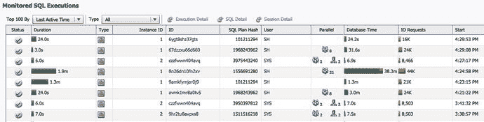

图 12-1. Enterprise Manager 的已监控 SQL 执行概览

注意：一个可能的解释是，实际耗时与数据库时间之间可能存在差异，这是因为它们的数据来源不同，使用了不同的粒度。Oracle 同时使用这两者来获取这些信息。

“状态”列显示一个图标，代表四种状态之一——正在运行、已完成、出错或已排队。当您点击状态图标时，当前行会被高亮显示，并且您可以使用报告顶部的“执行详细信息”按钮进入该 SQL 语句的详细监控页面。最重要的信息之一是“持续时间”列，它显示了一个语句已处于活动状态多长时间。持续时间是从语句执行开始到结束的实际耗时，如果语句仍在执行中，则是到当前时间为止的实际耗时。图 12-2 说明了语句执行中的持续时间（实际耗时）与 CPU 时间之间的差异。

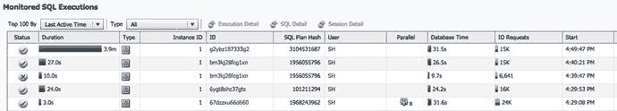

图 12-2. SQL 监控页面中的语句持续时间与数据库时间对比

“持续时间”列显示了用户关心的内容，即自 SQL 执行开始以来查询的响应时间。这是他们等待 SQL 完成所花费的时间。当然，最终用户实际等待的时间可能比查询的持续时间长得多，因为如图 12-2 所示，页面仅显示了数据库响应时间。时间也可能消耗在应用层或用户与应用服务器之间的网络连接上。

重要的是要知道，持续时间衡量的是从 SQL 执行开始一直到游标关闭或取消（例如，当所有数据都已从中提取完）的时间。这意味着，如果您的数据库可以在 30 秒内处理完查询，但随后以每次几行的方式提取了数百万行数据，那么就应用程序而言，您的查询将花费很长时间（这是由于网络造成的，网络用于在数据库及其客户端之间来回传输数据包以传递查询结果）。实际上，在数据库内部处理只花费了很少的时间。“持续时间”列仍然显示较长的查询“运行时长”，因为游标仍保持打开以供提取数据。请记住，持续时间衡量的是从游标执行开始到所有提取完成或应用程序已提取足够数据后游标最终关闭的整个时间。

这就引出了下一个重要指标的讨论——“数据库时间”，见图 12-2 中的第九列。“数据库时间”指标显示了您的查询在数据库中执行的总时间。因此，如果您运行一个持续 60 秒的串行 DML，并且所有时间都在数据库内部执行，那么您最终也会看到 60 秒的数据库时间。但是，如果您正在运行某个 `SELECT` 语句并提取大量行，导致您的会话花费（假设）50% 的时间在数据库中执行，另外 50% 的时间在等待下一条提取命令（在将一组行发送回应用程序之后），那么您可能只会看到这 60 秒总持续时间的一半作为数据库时间。换句话说，您将看到 30 秒的数据库时间，因为数据库会话仅为您的请求服务了 30 秒，其余时间处于空闲状态。

查看图 12-2 中的第一个条目，您会看到查询的持续时间（从执行阶段开始算起）为 3.9 分钟，查询以串行方式执行（第八列显示了这一点），并且只消耗了 31.5 秒的数据库时间。这表明执行会话大约有三分半钟在处理其他事情。它要么是空闲的（可能在等待下一个提取请求），要么是在执行其他语句（而第一个语句的游标仍保持打开）。在这个特定情况下，未花费在数据库中的时间确实用于通过网络传输大量数据。如果您发现这是生成大型报告的一部分，您或许可以通过使用分页和 Oracle 12c 中新的 top-N 查询功能来优化所花费的时间。

刚才讨论的例子是关于单个串行查询的。当您运行并行查询时，会有多个会话为您执行同一查询的不同部分。那么，数据库时间最终可能远高于您查询的持续时间（响应时间）。如果您查看图 12-2 中的最后一个条目，您会看到一个持续时间为 3 秒的语句，但在数据库中花费的总时间为 31.6 秒。当您查看“并行”列时，您会看到该会话以并行度 8 执行，这意味着有多个会话在数据库中为您的查询积极工作。所有这些并行会话的数据库时间加上查询协调器的时间都被计入“数据库时间”列。这个数据库时间让您了解在数据库中完成了多少工作。但是，因为该语句是并行化的，您不必等待那么长时间。如果您以串行模式运行相同的查询，数据库时间大约就是您可能需要等待的时间。请对最后一句话持保留态度，因为在实践中，从并行执行切换到串行执行时，SQL 执行中可能会发生许多其他事情。因此，在响应时间方面，您可能会遇到一些愉快或不愉快的意外。

请注意，SQL 监控概览页面中的这些条目不是针对特定 SQL 语句的，而是针对特定 SQL 语句执行的。因此，如果两个用户会话正在运行相同的语句，您将在此列表中看到两个单独的条目。您也可以在图 12-2 的第二行和第三行看到这样的例子。这使您能够精确检查特定用户（正在抱怨的用户）的问题是什么，而不是查看语句级别的聚合指标（如 `V$SQL` 提供的那些）并试图从中推断用户的问题。

## 单个长时间运行查询的实时监控

一旦您从所有长时间运行查询的列表中识别出感兴趣的查询，您可以点击列表左侧该查询的“正在运行”图标以高亮显示该行，接着点击 `执行详情` 按钮，您将进入如图 12-3 所示的受监控的 SQL 执行详情页面。此页面包含多个子选项卡，因此您可以随意探索并查看所有可用的信息。

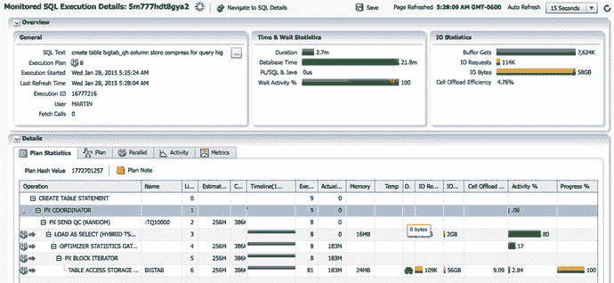

**图 12-3.** 受监控的 SQL 语句执行详情

受监控的 SQL 执行详情页面包含大量信息。得益于良好的用户界面设计，如果您之前阅读过 SQL 执行计划，它基本上是不言自明的。因此，我们不会在此逐一讲解所有细节，而是将重点放在最重要的指标上。与旧式的 `DBMS_XPLAN` 输出相比，SQL 监控页面具有高度的交互性，因此请务必在屏幕上将鼠标悬停在几乎所有元素上并点击，以查看所有可用的完整功能。这甚至包括一些看似普通的事项，比如某个指标。例如，请尝试将鼠标指针悬停在 IO 统计信息右上角可见的单元格卸载效率数字上。

让我们从页面的顶部区域开始。在屏幕顶部，紧接着“受监控的 SQL 执行详情”标题之后，您会看到一个小图标，它显示了所选 SQL 语句执行的状态。小圆圈意味着该语句仍在执行中（光标尚未关闭或取消）。

### 概览部分

如图 12-4a 所示的概览部分将显示一些基本详细信息，例如查询文本的缩略版本、并行度、查询开始时间、启动它的用户等等。点击 SQL 文本右侧的三个点小图标，您可以看到完整的 SQL 文本。

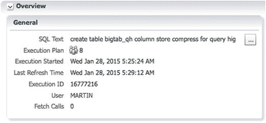

**图 12-4a.** SQL 监控概览部分

从 Oracle Database 12c 开始，还提供了另一个有趣的信息。基于成本的优化器（CBO）可以选择使用所谓的**自适应优化**。执行计划可以随时间演变，这一点也会被记录下来。图 12-4b 显示了有关已解析的自适应计划的信息。

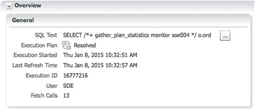

**图 12-4b.** 针对已解析的自适应计划的 SQL 监控概览部分

从版本 11.2.0.2 开始，您还会看到用于执行的绑定变量值。图 12-5 显示了一个取自另一个 SQL 监控报告的查询中绑定变量的示例。

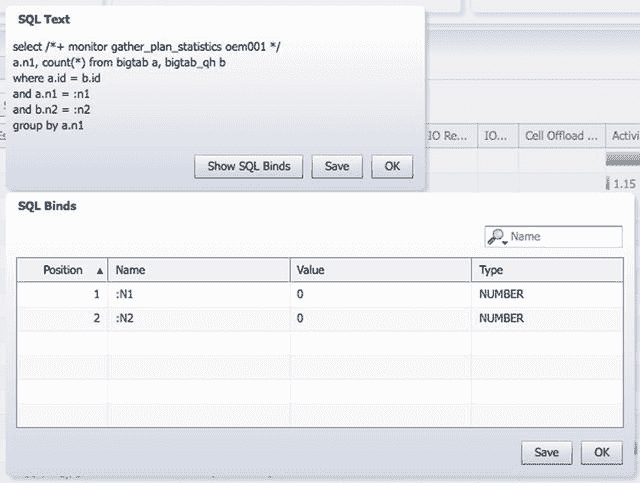

**图 12-5.** SQL 监控详情页面中的绑定变量值

当然，对于您的长时间运行报表和数据仓库查询，是否应该使用绑定变量是另一个完全不同的问题。对于数据仓库中的长时间运行查询，您可能不应该使用绑定；相反，您或许愿意牺牲一些响应时间，为每个字面值组合进行硬解析以获得新的查询计划，并可能为每个变量集获取最优计划。尽管如此，使用 Oracle 11.2.0.2 及更高版本，监控已在运行的查询的绑定变量值很容易，因为您不再需要求助于 `ORADEBUG ERRORSTACK` 命令。

### 时间与等待统计信息

图 12-6 中的“时间与等待统计信息”部分显示了语句的持续时间和数据库时间等熟悉指标。将鼠标移到不同的数据库时间组件上，可以看到在数据库内部等待所花费的时间与在 CPU 上运行的时间相比是多少。等待活动百分比条显示了等待事件的分布情况。请注意，此条中的 100% 指的是数据库时间中等待时间部分的 100%，而非整个数据库时间（后者还包括 CPU 时间）的 100%。此语句正在并行执行。

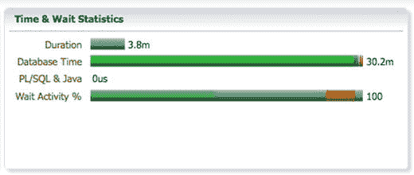

**图 12-6.** SQL 监控详情页面中的时间与等待统计信息

### IO 统计信息

图 12-7a 中的“IO 统计信息”部分显示了语句执行的一些关键 I/O 统计数据。

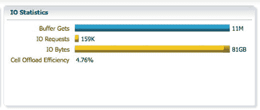

**图 12-7a.** SQL 监控详情页面中的 I/O 统计信息

`缓冲区获取` 条显示了在数据库层和存储单元（如果智能扫描已启动）中完成的逻辑 I/O 总数。`IO 请求` 和 `IO 字节` 统计信息不言自明，但请注意，这些指标显示了为给定语句执行的所有 I/O，包括智能扫描 I/O、任何常规块 I/O 以及 `TEMP` 表空间 I/O（用于排序、哈希连接以及任何其他不适合允许的 PGA 内存的工作区操作）。写 I/O 是单元格卸载效率对于语句执行可能为负的原因。如果由于某种原因（以 `Create Table as Select` 为最极端的例子），您执行的写 I/O 操作多于通过卸载查询所节省的 I/O，您将看到报告为“负节省”。理想情况下，单元格卸载效率指标应显示由于智能扫描在存储单元中早期执行过滤和投影并仅返回数据子集而避免的磁盘到数据库主机互连流量的百分比。然而，在一个复杂的执行计划中，发生的远不止对单个表的智能扫描。您还有连接、聚合操作、排序和直接路径数据加载，这些都会使用额外的 I/O 带宽，从而拉低卸载效率百分比。这就是为什么只关注单个比率不是一个好主意的好例子。卸载效率的单一百分比值隐藏了很多信息，例如百分比的来源及其背后的实际值。您可以将鼠标悬停在百分比上，查看用于计算的底层值。

当您将鼠标悬停在该比率上时（见图 12-7b），您可以看到存储单元从磁盘读取了 81GB，并且 (77GB) 通过互连接口来回发送。这是合理的，因为被监控的语句是一个在 select 部分没有 where 子句的 `Create Table as Select` 操作。

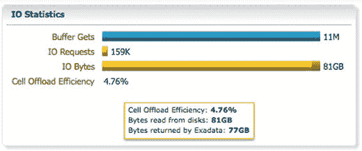

**图 12-7b.** SQL 监控详情页面中的单元格卸载效率比率

在其他示例中，类似于图 12-7b 所示的指标解释可能会产生误导。以一个运行缓慢的查询为例。在图 12-7c 中，单元格卸载效率变成了负数！

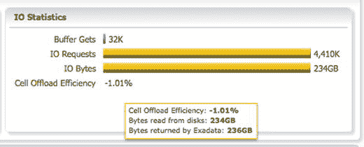

**图 12-7c.** SQL 监控详情页面中的单元格卸载效率比率

“从磁盘读取的字节数”统计量实际上代表了 Oracle 数据库发出的读和写的总字节数，不仅针对智能扫描，而且是因任何原因而发出的。“由 Exadata 返回的字节数”统计量实际上显示了数据库与存储单元之间由任何原因（例如块读写和智能扫描返回的行数组）引起的总互连流量。


如果您疑惑为何 I/O 互连字节可能大于实际数据库发出的 I/O 量，其解释在于这些指标的测量方式不同。数据库 I/O 指标（即图 12-7c 中的`从磁盘读取的字节数`统计信息）是在数据库层测量的，而 I/O 互连字节则是在底层互连/Oracle 网络层测量的。而中间层之一便是`ASM`层，它负责管理软件镜像等功能。因此，由于 SQL 语句执行的写操作需要由`ASM`层进行镜像，互连 I/O 流量可能会高于数据库流量。得益于`ASM 正常冗余镜像`，数据库每写入`1MB`数据（无论是由于直接路径加载还是某些工作区操作溢出到临时表空间），最终都会导致写入`2MB`的数据。具有高冗余设置的用户需要承受更高的写入代价。

互连流量高于实际读取数据量还有其他原因。一个例子是`HCC`压缩表。如果您将`10GB`的分区压缩到了`1GB`，那么读取它只需要进行`1GB`的 I/O。然而，如果`Smart Scan`在存储节点上实时解压缩这些数据，并将全部`10GB`的未压缩数据通过互连返回（假设在存储节点上未进行投影或过滤），那么 I/O 互连字节将远高于从磁盘读取的数据量。在此示例中，这可能使`单元卸载效率`统计值降至`10%`。所有这些再次说明，您不应仅仅关注于提高`单元卸载效率`比率，而应转而探究响应时间花在了何处。时间才是最终用户所关心的。

### 执行计划行源详情

既然您已经检查了语句执行的关键指标——持续时间、数据库时间、使用的并行度以及数据库时间中在 CPU 上运行与等待所占的比例——现在是时候深入到执行计划在行源级别的细节了。这些细节如图 12-8 所示。

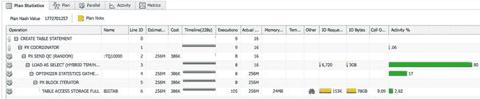

图 12-8. SQL 监控详细页面中的执行计划行源活动监控

让我们先关注执行计划输出的右侧列。`活动`列显示了该语句迄今为止的总资源使用情况细分。执行计划中`LOAD AS SELECT`行处最长的条形图显示，该行源消耗了该语句执行至今总活动的`80%`。在先前版本的 SQL 监控报告中，CPU 和等待活动分别显示在各自的单独列中。如图 12-8 所示的当前报告，将信息合并到了一个条形图中。在此示例中，等待信息传达得不够清晰；“load as select”中`80%`活动的大部分与 CPU 相关，但在条形图的最右侧有一些其他事件的采样。为了弥补这一点（并且与报告的几乎所有部分一致），您可以将鼠标悬停在条形图上检查其他组成部分。颜色编码与熟悉的性能主页相同。如您在此处所见，条形图的最大部分是绿色的，表示 CPU。该会话在压缩分析和直接路径临时写入上进行了等待。请注意，每个行源的条形图仅表示为该行源记录的等待/CPU，而非语句执行的总持续时间或数据库时间。您可以检查`时间与等待统计`部分（如前面图 12-6 所示）以了解总数据库时间中有多少被 CPU 使用消耗，多少被等待消耗。由于报告中显示的所有数据最终都取自`活动会话历史`，您也可以查询该视图以获取最详细的信息。

`单元卸载效率`比率显示了前述的符合`Smart Scan`条件的字节数与通过互连返回的字节数之间的比率。在上面的例子中，效率必定很低，因为该 SQL 语句是一个`Create Table as Select`语句，用于创建源表`BIGTAB`的一个`HCC`压缩副本。卸载效率是一个很好的附加信息，当在段上发生了`Smart Scan`时，会被添加到行源信息中。


`IO Bytes`列显示一个行源执行了多少 I/O 操作或读写了多少字节数据。熟悉早期 SQL Monitor 报告的用户可能会喜欢这一点——他们不再需要右键单击图表来切换显示字节数或 I/O 操作了，因为现在有了新的列。在图 12-8 中，您可以看到`TABLE ACCESS STORAGE FULL`行源总共执行了大约 78GB 的 I/O，使用了大约 153,000 次`IO Requests`。当您将鼠标悬停在这些条形图上时，会看到详细的写入和读取量（毫不意外，只记录了读取操作）。您还能看到此行源的精确数据，包括单次`IO request`的平均大小。其上方的执行计划步骤`LOAD AS SELECT`目前仅向磁盘写入了 3GB 数据——请记住该语句仍在执行中。请注意，这 3GB 数据是在 Oracle 数据库层面测量的，但更底层的`ASM`层很可能会对这些写入进行镜像（或三重镜像，取决于您的配置），因此实际物理写入磁盘的字节数可能是其两倍。您可以查看`Cell Physical IO Interconnect Bytes`会话统计信息，以了解通过`InfiniBand`网络实际发送（和接收）了多少数据；该指标同样能感知`ASM`镜像写入开销以及任何其他底层通信量。如果您好奇，为什么基于 78GB 源表创建表的操作只产生了 3GB 的 I/O，答案是压缩。否则，它可能只是一个只选取了原表子集的`Create Table As Select` (`CTAS`)语句。请记住，在生成报告时该语句尚未执行完毕，所以最终数字可能会稍多一些。

让我们再看一下`实时 SQL 监控`页面的几个项目。

紧挨着`计划哈希值`的`计划注释`也极具价值，尤其是在`Exadata`平台上。它可以显示许多有用的附加信息，如图 12-9a 所示，其中展示了对并行度（在表级别设置）的解释。您可以看到，完全没有使用内存中执行。

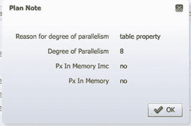

**图 12-9a. SQL ID 为 5m777hdt8gya2 的计划注释**

它还会向您显示该计划是否是自适应计划，以及使用的动态采样级别。图 12-9b 展示了一个示例。

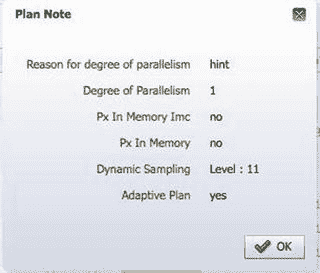

**图 12-9b. SQL ID 为 bjbvybmu6pv9h 的计划注释**

`SQL Monitor`报告的另一个非常有用的补充功能，可以通过`其他信息`列中的望远镜图标访问。根据操作的不同，它会向性能分析员展示有价值的信息。对于`智能扫描`，它会描绘出关键数据，如图 12-10 所示。

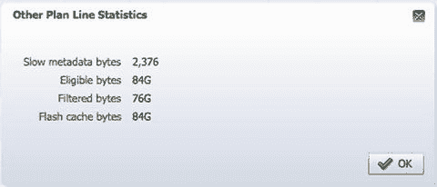

**图 12-10. 针对 BIGTAB 的智能扫描的其他计划行统计信息**

取自最后一个行源操作的`智能扫描`信息，它显示了符合`智能扫描`条件的字节数（这是一个大小约为 84GB 的非分区、未压缩表）。它展示了`智能扫描`能够执行的过滤量，以及有多少数据是从`闪存缓存`提供的。

您在图 12-11 中看到的`时间轴`列是理解 SQL 语句时间花费所在最重要的列之一。

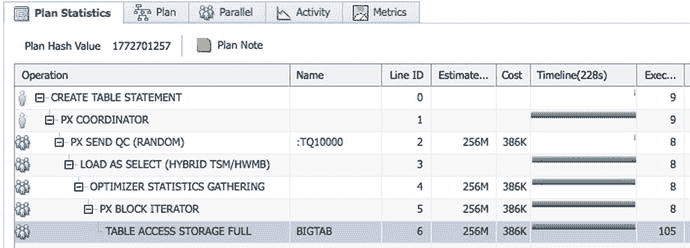

**图 12-11. SQL 监控详细页面中的行源活动时间轴**

图中的`时间轴`列以可视化方式显示了各个执行计划行源的活动时间线。如同报告中显示的几乎所有内容一样，时间轴至少部分基于`活动会话历史`(`ASH`)样本；`ASH`从`Oracle 11gR1`开始收集 SQL 执行计划行级别的详细信息。请查看`时间轴`列标题括号内的内容。这里应显示此 SQL 执行的总运行时长，本例中为 228 秒（大约 4 分钟）。因此，`时间轴`列的总宽度意味着大约 4 分钟的实际运行时间。您可以直观地解读执行计划中每个行源的条形图长度和位置。在上面的例子中，由于只有一组并行服务器进程，消费者和生产者之间没有依赖关系。除了`PX SEND QC`之外，所有操作都在查询开始时立即启动。在运行时间更长的查询中，您可以使用时间轴来弄清楚哪个操作何时开始以及耗时多久。将鼠标悬停在时间轴条形图上会提供更详细的信息。

Oracle 执行计划是行源函数构成的树，具有严格的层次结构，子行源只能将其结果传递给其直接父级。在我们的例子中，针对`BIGTAB`的`TABLE ACCESS STORAGE FULL`获取行并将其传回给其父操作`PX BLOCK ITERATOR`，然后该操作将行发送回`LOAD AS SELECT`操作符，但在此之前会计算优化器统计信息（自`Oracle 12c`起）。我们这里不深入探讨 SQL 执行引擎内部原理，但希望这个例子能说明 SQL 执行的层次性质，以及数据如何通过执行计划树“向上”流动，流向树的根节点（本例中是`CREATE TABLE STATEMENT`）。

时间轴是进行性能调查的绝佳工具，因为它们能精确显示行源中时间花费在哪里。到目前为止展示的例子不太适合接下来的讨论，这就是为什么选择了另一个查询作为示例，如图 12-12 所示。

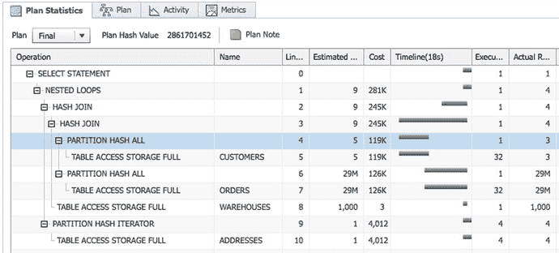

**图 12-12. SQL 监控详细页面中的行源活动时间轴**

观察查询的时间轴条形图，您会注意到`CUSTOMERS`表的`PARTITION HASH ALL`和`TABLE ACCESS STORAGE FULL`是第 4 行和第 5 行中显示的最先开始的行源。接下来开始工作的是`ORDERS`表的扫描，这两者通过哈希连接形成一个新的行源。这个新行源随后再与`WAREHOUSES`进行哈希连接，其结果又通过嵌套循环操作与`ADDRESSES`连接。

观察各个条形图，您可以看到它们各自的执行时间，这可以作为查询优化的起点。在上述案例中，`ORDERS`表的扫描耗时最长。与任何优化工作一样，分析员应聚焦于最大的时间消耗者。此处优化器不应受到指责——基数估计非常准确，正如您在估计行数和实际行数列中看到的那样。值得注意的是，查询处理了来自`ORDERS`表的大约 2900 万行数据，这或许可以通过一个过滤条件来减少。

减少行源操作耗时的其他选项包括：扫描更少的数据、进行更多过滤（希望是在存储细胞中完成）、访问更少的分区，或者仅仅是提高扫描吞吐量（例如在此例中增加并行度）。


时间线条只是首先需要检查的部分。SQL 监控报告中还有许多其他有用的细节。以 `SORT ORDER BY` 为例。在你的查询计划中，你经常会看到排序操作在整个语句执行期间都处于活动状态。如果你了解排序的基础知识，这应该是合理的——排序行源在前三分之二的时间里是活动的，因为它正在将数据抓取到排序缓冲区并进行排序（并将一些数据溢出到临时表空间）。排序本身完成后（子行源返回“数据结束”条件），排序行源函数仍然需要被调用。正是通过调用该函数，排序操作才将排序后的行返回给其父操作。这就是为什么父行源通常只在排序执行时间线的末尾才变为活动状态——因为所有行都必须先被抓取并排序，然后才能返回以进行进一步处理。而且一旦所有行都被抓取并排序，就没有理由让 `SORT ORDER BY` 行源再次访问其子行源了。

## 手动查询实时 SQL 监控数据

企业版管理器中所有漂亮的图表在内部都基于一些 `V$` 或 `DBA_` 视图。如果你碰巧无法访问企业版管理器，你可以直接从 `V$` 视图中获取你想要的信息。对于日常的监控和调优任务，你可能不需要访问底层的 `V$` 视图，但了解这些信息的来源仍然很有用，因为它可能对自定义监控和高级问题排查变得方便。以下是一些需要了解的关键视图：

*   `GV$SQL_MONITOR` 视图包含语句执行级别的监控数据。当多个会话正在运行同一条语句时，你将在此视图中拥有多个条目。确保通过使用正确的搜索过滤器来查询正确的执行。例如，你应该注意你真正要查找的是哪个 `SID` 和 `INST_ID`（或者如果监控并行查询，则是 `PX_QCSID`, `PX_QCINST_ID`），以及如果你正试图对当前正在运行的查询进行故障排查，`STATUS` 列是否仍显示 `EXECUTING`。
*   `GV$SQL_PLAN_MONITOR` 视图包含执行计划行级别的指标，这些指标被实时监控和更新。例如，你可以查询 `IO_INTERCONNECT_BYTES` 并将其与 `PHYSICAL_READ_BYTES` 和 `PHYSICAL_WRITE_BYTES` 进行比较，以确定每个独立执行计划行的下推效率，而不是整个查询的效率。请注意，提高下推效率百分比不应该是你监控和调优的主要目标——你将响应时间花在哪里很重要。在 Oracle 12c 中，该视图得到了极大增强，其数据用于填充“其他（统计信息）”列，图 12-10 展示了一个例子。看起来需要连接到 `v$sql_monitor_statname` 才能为 `OTHERSTAT%` 列添加标签。
*   从 Oracle 11gR1 开始，`GV$ACTIVE_SESSION_HISTORY` 视图包含了 `SQL_PLAN_LINE_ID`、`SQL_PLAN_OPERATION` 和 `SQL_PLAN_OPTIONS` 等列。除了 `SQL_ID`，你也可以查询这些列来找出 SQL 执行计划的顶部行源，而不仅仅是列出顶部 SQL 语句。

## 使用 DBMS_SQLTUNE 报告实时 SQL 监控数据

如果由于某种原因你无法访问图形化前端，你也可以使用 `DBMS_SQLTUNE.REPORT_SQL_MONITOR` 包函数来提取 SQL 监控详细信息。你可以使用以下语法，但请务必阅读相关文档以了解此功能的全部功能。请注意，下面的文本经过编辑，因为此函数生成的输出非常宽，不适合书籍页面。表格已被换行并适应打印。

```sql
SQL> SELECT
DBMS_SQLTUNE.REPORT_SQL_MONITOR(
sql_id=> '5m777hdt8gya2',
report_level=>'ALL',
type => 'TEXT') as report
FROM dual
SQL> /
SQL Monitoring Report

SQL Text
------------------------------
create table bigtab_qh column store compress for query high tablespace martin_bigfile parallel 8 as select * from bigtab

Global Information
------------------------------
Status              :  DONE
Instance ID         :  1
Session             :  MARTIN (588:34223)
SQL ID              :  5m777hdt8gya2
SQL Execution ID    :  16777216
Execution Started   :  01/28/2015 05:25:24
First Refresh Time  :  01/28/2015 05:25:24
Last Refresh Time   :  01/28/2015 05:29:12
Duration            :  228s
Module/Action       :  SQL*Plus/-
Service             :  SYS$USERS
Program             :  sqlplus@enkdb03.enkitec.com (TNS V1-V3)

Global Stats
===========================================================================================
| Elapsed |   Cpu   |    IO    | Application | Concurrency | Cluster  | PL/SQL  |  Other
| Time(s) | Time(s) | Waits(s) |  Waits(s)   |  Waits(s)   | Waits(s) | Time(s) | Waits(s)
===========================================================================================
|    1809 |    1770 |       25 |        0.00 |        0.07 |     0.01 |    0.00 |       14
===========================================================================================

==================================================
| Buffer | Read | Read  | Write | Write |  Cell   |
|  Gets  | Reqs | Bytes | Reqs  | Bytes | Offload |
===================================================
|    11M | 153K |  78GB |  6567 |   3GB |   4.76% |
===================================================

Parallel Execution Details (DOP=8, Servers Allocated=8)
============================================================================================
|      Name      | Type  | Server# | Elapsed |   Cpu   |    IO    | Application | Concurrency
|                |       |         | Time(s) | Time(s) | Waits(s) |  Waits(s)   |  Waits(s)
===========================================================================================
| PX Coordinator | QC    |         |    1.04 |    0.11 |     0.00 |        0.00 |        0.00
| p000           | Set 1 |       1 |     227 |     222 |     3.20 |             |        0.00
| p001           | Set 1 |       2 |     227 |     221 |     3.26 |             |        0.01
...
| p007           | Set 1 |       8 |     225 |     222 |     3.21 |             |        0.00
===========================================================================================

================================================================
Buffer | Read  | Read  | Write | Write |  Cell   | Wait Events |
Gets   | Reqs  | Bytes | Reqs  | Bytes | Offload | (sample #)  |
1M | 19088 |  10GB |   811 | 399MB |   4.76% |             |
1M | 19095 |  10GB |   822 | 398MB |   4.76% |             |
1M | 19090 |  10GB |   828 | 399MB |   4.76% |             |
================================================================

SQL Plan Monitoring Details (Plan Hash Value=2542114301)
============================================================================================
| Id |              Operation               |   Name   |  Rows   | Cost |   Time    | Start
|    |                                      |          | (Estim) |      | Active(s) | Active
```


```
|  0 | 创建表语句                             |          |          |      |         4 |   +225
|  1 |   PX 协调器                            |          |          |      |       229 |     +0
|  2 |    PX 发送至 QC（随机）                 | :TQ10000 |    256M | 386K |         3 |   +225
|  3 |     混合加载（TSM/HWMB 混合模式）       |          |          |      |       228 |     +1
|  4 |      优化器统计信息收集                 |          |    256M | 386K |       226 |     +2
|  5 |       PX 块迭代器                       |          |    256M | 386K |       226 |     +2
|  6 |        表访问（存储完整）               | BIGTAB   |    256M | 386K |       226 |     +2
```

```
| 执行次数 |   行数    | 读取 | 读取 | 写入 | 写入 |  单元    | 内存 | 活动 | 活动 | 活动 |
|          | (实际值) | 请求 | 字节 | 请求 | 字节 | 卸载     |(最大值)|  (%)  | 细节 |  (样本数) |
|        9 |       16 |      |      |      |      |          |      |      |      |         |
|        9 |       16 |      |      |      |      |          |      |      |      |         |
|        8 |       16 |      |      |      |      |          |      |      |      |         |
|        8 |       16 |  153 |   2MB |  6567 |   3GB |          |      |      |      |         |
|        8 |     256M |      |      |      |      |          |      |      |      |         |
|        8 |     256M |      |      |      |      |          |      |      |      |         |
|      105 |     256M | 153K |  78GB |      |      |   9.09% |   25M |      |      |         |
```

`DBMS_SQLTUNE.REPORT_SQL_MONITOR` 函数也接受 `HTML` 作为 `TYPE` 参数的值，而不是 `TEXT`，在这种情况下，输出将以 HTML 格式生成。如果你将此输出假脱机到一个 HTML 文件并在浏览器中打开，你将看到比纯文本好得多的输出。从 Oracle 11.2 开始，你还可以使用 `ACTIVE` 作为参数，并将其输出假脱机到 HTML 文件。现在，如果你在浏览器中打开这个文件，你将看到 SQL 监控页面，几乎与它在 Cloud Control 中的外观一模一样！而且显示该报告所需的所有数据都自包含在假脱机的 HTML 文件中——打开时不需要数据库访问！如果你想通过电子邮件将一份详细、自包含的报告（包含一些 SQL 执行问题）发送给某人，这将非常有用。

#### 控制 SQL 监控

对于所有使用并行执行的语句，SQL 监控会立即启动——无论它们运行了多长时间。对于串行执行的语句，SQL 监控不会立即启动，因为它并非设计用于监控典型的快速 OLTP 查询（这些查询每秒执行多次）。然而，如果一个串行查询消耗了超过五秒的总 CPU 和/或 I/O 等待时间，则被视为长时间运行的查询，并为该语句启用 SQL 监控。这是无缝且动态发生的；不需要重新执行语句。

你还可以使用 `MONITOR` 和 `NO_MONITOR` 提示来控制语句的 SQL 监控。`V$SQL_HINT` 视图显示了所有可用的提示以及它们被引入的版本。例如：

```sql
SQL> SELECT name, inverse, version, class, sql_feature
  2  FROM v$sql_hint WHERE name LIKE '%MONITOR%';

NAME            INVERSE          VERSION    CLASS           SQL_FEATURE
--------------- --------------- ---------- --------------- ---------------
NO_MONITORING                    8.0.0      NO_MONITORING   QKSFM_ALL
MONITOR         NO_MONITOR       11.1.0.6   MONITOR         QKSFM_ALL
NO_MONITOR      MONITOR          11.1.0.6   MONITOR         QKSFM_ALL
```

注意，`NO_MONITORING` 提示尽管名称相似，但完全是另一回事。`NO_MONITORING` 提示允许你禁用表列上的谓词使用监控（`sys.col_usage$`），它与 Oracle 11g 中引入的实时 SQL 监控选项无关。


