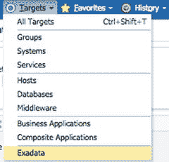
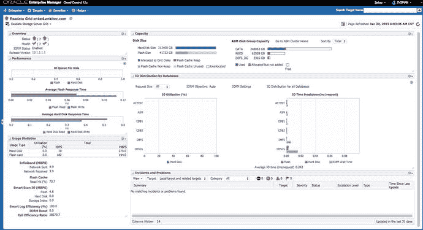
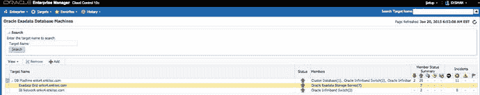
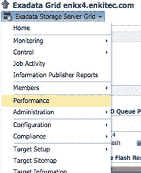
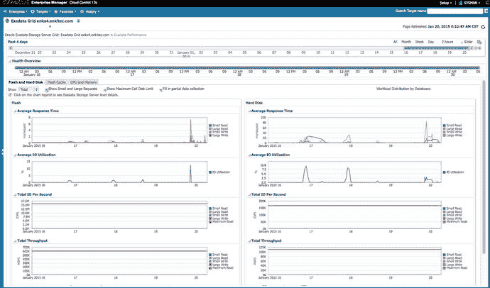
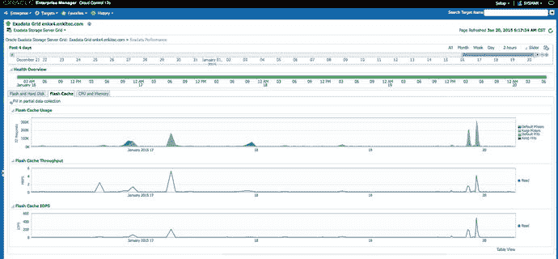
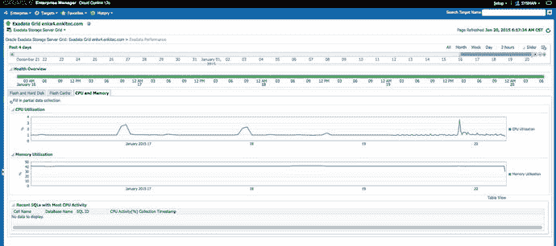
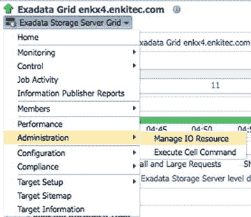
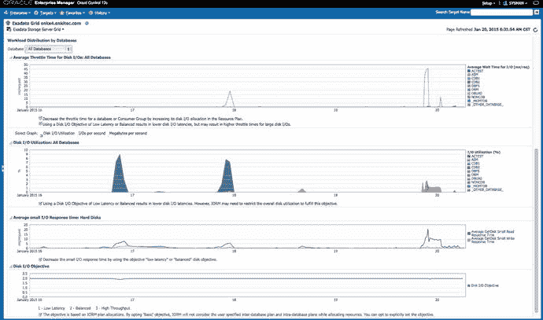
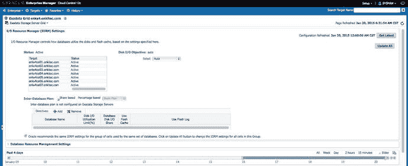

# 使用 V$SQL 和 V$SQLSTATS 监控 SQL 语句

在“过去”（Oracle 10g ASH 之前），性能监控通常是通过各种 `V$` 视图来完成的，这些视图显示了实例范围内的聚合指标。例如，Statspack 的 TOP-5 等待事件报告部分，仅仅是两个 `V$SYSTEM_EVENT` 视图快照之间的增量。TOP SQL 报告则基于 `V$SQL` 快照，该快照将库缓存中仍然存在的每个子游标的执行统计信息和资源消耗情况外化展示。

然而，在一个大型数据库系统中（比如 ERP 应用程序），库缓存中可能会有数万个游标，因此收集和存储所有这些游标统计信息的增量是不切实际的。出于这个原因，像 Statspack 和 AWR 这样的工具只存储一些顶级资源消耗语句的增量，而忽略那些不重要的语句。请记住，由于这些工具收集的是实例范围的数据，如果只有少数会话执行某个长时间运行的语句，它最终可能会被忽略。一个运行糟糕 SQL 语句的单一会话，可能会被实例中所有其他会话（可能有成千上万个）的“噪音”所淹没，从而无法被“听”到。这种实例范围的性能数据分析，其能力不如会话级的 ASH 数据切片和切块。借助 ASH，无论实例中有多少会产生噪音的会话，你都可以深入钻取分析任何一个会话。

如果你使用 Exadata，你至少运行的是 Oracle 11g R1，因此，假设你的 Exadata 集群拥有诊断包和调优包的许可证，那么所有这些优越的工具在技术上都是可用的。顺便说一句，我们尚未见到很多使用 Exadata 但没有诊断包和调优包许可证的客户，因此看起来绝大多数 Exadata 用户不必求助于像 Statspack 这样的旧工具，或者自己创建一个自定义的类 ASH 存储库（尽管用几行 PL/SQL 代码轮询每个实例中的 `V$SESSION` 或其底层的 `X$KSUSE` 视图也并非难事）。

在某些情况下，`V$SQL` 和 `V$SQLSTATS` 视图相对于 SQL 监控和类 ASH 采样数据仍然具有一些优势。例如，如果你想度量诸如执行次数、缓冲区获取次数、解析调用次数、获取次数或 SQL 子游标返回的行数等指标，你可以从实时 SQL 监控（`V$SQL_MONITOR`）或 `V$SQL`/`V$SQLSTATS` 视图中获取这些数据，但无法从 ASH 中获取。

然而，SQL 监控的问题在于它根本不监控短时间运行的查询，因此无法用于跟踪每秒执行多次的 OLTP 类型的小型查询。即使在应用程序的每个查询中添加 `MONITOR` 提示也无济于事，因为受监控的执行计划的最大数量是有限的（由 `_sqlmon_max_plan` 参数控制，默认为每个 CPU 20 个计划），而且你最终还可能面临实时计划统计信息的锁存争用问题。SQL 监控功能并非旨在持续监控每秒执行多次的短时间运行查询。

这就把我们带回了 `V$SQL` 和 `V$SQLSTATS`。它们都维护着类似的数据，但内部机制不同。当你查询 `V$SQL` 而没有指定确切的 `SQL_ID` 时，Oracle 必须遍历每一个库缓存哈希桶以及其下的所有游标。如果你有一个繁忙的数据库并且库缓存中有大量游标，这可能会导致库缓存互斥锁争用，因为当你遍历库缓存结构并读取其对象内容时，你必须持有该对象上的一个互斥锁。请注意，从 Oracle 11g 开始，所有的库缓存锁存器都不复存在，取而代之的是互斥锁。这些相同的互斥锁也用于解析、查找和固定游标以供执行，因此如果你的监控查询频繁轮询 `V$SQL`，它们最终可能会导致其他会话等待。

`V$SQLSTATS` 视图（在 Oracle 10g 中引入）没有这个问题。从 Oracle 10gR2 开始，Oracle 实际上在两个地方维护 SQL 执行统计信息——在子游标本身内部（`V$SQL`）以及存储在共享池中不同位置的单独游标统计信息数组中。这种分离带来的好处是，即使一个游标从共享池中刷出，它在这个单独数组中的统计信息可能仍能保持更长时间。此外，当监控工具查询 `V$SQLSTATS` 时，由于统计信息存储在单独的数组中，它们无需扫描整个库缓存。这意味着当你的监控工具使用 `V$SQLSTATS` 而不是 `V$SQL` 时，不会引起额外的库缓存锁存器（或互斥锁）争用。Statspack 和 AWR 都确实使用 `V$SQLSTATS` 来收集其顶级 SQL 报告的数据。

让我们看看 `V$SQLSTATS`（顺便说一句，`V$SQL` 视图的列与此几乎相同）。这里删除了一些输出以节省空间：

```
SQL> @desc v$sqlstats

Name                            Null?    Type
------------------------------- -------- ----------------------
1      SQL_TEXT                            VARCHAR2(1000)
2      SQL_FULLTEXT                        CLOB
3      SQL_ID                              VARCHAR2(13)
...
6      PLAN_HASH_VALUE                     NUMBER
...
20      CPU_TIME                            NUMBER
21      ELAPSED_TIME                        NUMBER
...
26      USER_IO_WAIT_TIME                   NUMBER
...
33      IO_CELL_OFFLOAD_ELIGIBLE_BYTES      NUMBER
34      IO_INTERCONNECT_BYTES               NUMBER
35      PHYSICAL_READ_REQUESTS              NUMBER
36      PHYSICAL_READ_BYTES                 NUMBER
37      PHYSICAL_WRITE_REQUESTS             NUMBER
38      PHYSICAL_WRITE_BYTES                NUMBER
...
41      IO_CELL_UNCOMPRESSED_BYTES          NUMBER
42      IO_CELL_OFFLOAD_RETURNED_BYTES      NUMBER
...
72      OBSOLETE_COUNT                      NUMBER
```

以 `IO_CELL` 开头的突出显示行是与 Exadata 存储节点相关的指标（尽管 `IO_INTERCONNECT_BYTES` 在非 Exadata 数据库上同样会被填充）。你可能会希望将这些存储节点指标与数据库指标（例如 `physical_read_bytes`）进行比较，以了解该 SQL 语句是否受益于 Exadata 智能扫描卸载。

请注意，这些仅仅计数字节的指标不应被用作性能的主要度量；再次强调，主要度量、起点应当始终是响应时间，然后你可以将其分解为各个等待事件，或者通过 SQL 监控报告或 ASH 分解为执行计划行源活动。你可以在第 11 章中了解更多关于此处所示指标的含义。

请注意，即使 `V$SQLSTATS` 视图也包含 `PLAN_HASH_VALUE` 列，但它实际上并不为具有不同计划哈希值的相同 `SQL_ID` 存储分开的统计信息。它将同一 SQL ID 下由不同计划生成的所有统计信息聚合在一个存储桶下。这意味着你无法真正从该视图中得知是哪个计划版本消耗了最多的资源。幸运的是，在 Oracle 11.2 中有一个名为 `V$SQLSTATS_PLAN_HASH` 的新视图，你应该查询它。该视图按 SQL ID 和计划哈希值分解并组织报告统计信息，而不是像 `V$SQLSTATS` 那样仅按 SQL ID 报告。


### 监控存储单元层

让我们看看如何监控存储单元层的利用率和效率。如你所知，存储单元是配置了用于存储数据库持久化部分硬盘的行业标准服务器。这些系统使用 Linux 作为其操作系统。自 Exadata V2 起，它们还配备了 PCIe 连接的闪存驱动器，可用作闪存缓存和闪存日志。Exadata X5-2 高性能单元是首批完全采用闪存而舍弃硬盘的型号。你可以使用常规的 Linux OS 监控命令和工具来关注单元的 OS 指标，如 CPU 使用率或磁盘 I/O 活动。由于 Exadata 采用特殊通信协议，你无法在计算节点上使用传统的 I/O 监控工具来监控磁盘 I/O：网格磁盘仅通过 ASM 层对外呈现。在计算节点上，你只能看到用于 OS 和 Oracle 安装的单个磁盘。监控单元本身 I/O 的唯一难点在于，Oracle 不允许你在单元上安装任何额外的（监控）守护进程和软件——如果你仍然希望保持受支持的配置。

好消息是，Oracle 单元服务器软件以及附加的 OS Watcher 或 ExaWatcher（从 11.2.3.3 版本开始）脚本在收集每个单元的详细性能指标方面做得很好。以下部分将展示如何提取、显示和使用其中一些指标。你可能还想回顾第 11 章，以获取关于如何使用`V$CELL%`系列视图或`cellsrvstat`实用程序监控单元的更多见解。

### 使用 CellCLI 在单元层访问单元指标

可以使用`CellCLI`实用程序访问单元收集的指标。事实上，Enterprise Manager Exadata 存储单元插件就是通过这种方式检索其数据的。你已经在之前的章节中见过`CellCLI`的使用。以下是使用`CellCLI`检索性能指标的几个示例。这些命令名称应该相当直观——我们将在附录 A 中更详细地介绍`CellCLI`命令。Oracle Exadata 文档集在《Exadata 存储服务器软件用户指南》的第 8 章中收录了`CellCli`命令。

```
# cellcli
CellCLI: Release 12.1.2.1.0 - Production on Wed Jan 28 09:23:26 CST 2015
Copyright (c) 2007, 2013, Oracle.  All rights reserved.
Cell Efficiency Ratio: 545
CellCLI> LIST METRICDEFINITION     显示指标简称
         CD_BY_FC_DIRTY
         CD_IO_BY_R_LG
         CD_IO_BY_R_LG_SEC
         CD_IO_BY_R_SCRUB
         CD_IO_BY_R_SCRUB_SEC
         CD_IO_BY_R_SM
   ... 大量输出已移除 ...
         SIO_IO_WR_HD
         SIO_IO_WR_HD_SEC
         SIO_IO_WR_RQ_FC
         SIO_IO_WR_RQ_FC_SEC
         SIO_IO_WR_RQ_HD
         SIO_IO_WR_RQ_HD_SEC
CellCLI> LIST METRICDEFINITION CL_CPUT DETAIL    显示指标描述和详细信息
     name:                    CL_CPUT
     description:             "Percentage of time over the previous minute that the system
                               CPUs were not idle."
     metricType:              Instantaneous
     objectType:              CELL
     unit:                    %
CellCLI> LIST METRICCURRENT CL_CPUT               列出最新的指标快照值
CL_CPUT      enkcel01      5.3 %
CellCLI> LIST METRICCURRENT CL_CPUT DETAIL        详细列出最新快照
         name:                   CL_CPUT
         alertState:             normal
         collectionTime:         2015-01-28T09:24:46-06:00
         metricObjectName:       enkcel04
         metricType:             Instantaneous
         metricValue:            1.4 %
         objectType:             CELL
CellCLI> LIST METRICHISTORY CL_CPUT  显示历史指标快照
         CL_CPUT         enkcel04        1.6 %   2015-01-23T12:05:42-06:00
         CL_CPUT         enkcel04        4.5 %   2015-01-23T12:06:42-06:00
         CL_CPUT         enkcel04        4.1 %   2015-01-23T12:07:42-06:00
         CL_CPUT         enkcel04        4.3 %   2015-01-23T12:08:42-06:00
         CL_CPUT         enkcel04        4.2 %   2015-01-23T12:09:42-06:00
         CL_CPUT         enkcel04        1.6 %   2015-01-23T12:10:56-06:00
... 跳过了大量输出 ...
CellCLI> LIST METRICHISTORY CL_CPUT -
> where collectiontime < "2015-01-23T12:09:00-06:00" -
> and collectiontime > "2015-01-23T12:06:00-06:00"
         CL_CPUT         enkcel04        4.5 %   2015-01-23T12:06:42-06:00
         CL_CPUT         enkcel04        4.1 %   2015-01-23T12:07:42-06:00
         CL_CPUT         enkcel04        4.3 %   2015-01-23T12:08:42-06:00
```


### 使用企业管理器 Exadata 存储服务器插件访问单元指标

Exadata 插件版本 12.1.0.6 随 OEM 12c R4 版本发布，提供了显著的用户界面和监控工具改进。这使得数据库管理员能够更清晰地按资源组件和消费者查看详细的 I/O 指标细分，这对于确保整个集群仍在容量范围内、以最佳状态运行并符合服务级别至关重要。

在早期版本的 Exadata 插件中，安装过程有些繁琐。您必须自定义一些监控图表，并以特定方式对齐它们，才能获得有意义的性能仪表板。随着新插件的发布，Exadata 数据库一体机发现过程变得更加简化，您可以轻松配置所有相关组件。本书不涵盖插件安装过程，但这在插件的安装指南中有详细说明。另外，在本节中，我们将重点介绍 Exadata 插件在性能监控方面的关键改进。Oracle 技术网络上发布了一篇更详尽的“最大可用性架构”白皮书，题为“Exadata 健康与资源使用监控”，其中讨论了使用 OEM12c R4 的各种监控方法。

为了让您了解高层次的聚合 I/O 性能，让我们从访问 Exadata 存储服务器网格主页开始。要访问该页面，请从 OEM12c R4 主页中，选择“目标”选项卡，然后选择“Exadata”，接着选择 Exadata 网格环境。图 12-13 显示了下拉菜单。



图 12-13.
“目标”选项卡 ➤ “Exadata”

导航到 Exadata 目标列表后，您将看到所有已发现的数据库一体机。图 12-14 显示了其中之一。点击数据库一体机名称旁的小三角形，会将系统分解为存储节点和计算节点，如图 12-14 所示。点击“网格”将带您进入 Exadata 网格的主性能页面，如图 12-15 所示。



图 12-15.
Exadata 存储服务器网格主页



图 12-14.
已发现的 Exadata 数据库一体机 ➤ Exadata 网格

Exadata 存储服务器网格登陆页面对于 Exadata 管理员非常有用。它提供了大量信息，而这些信息通常是 Oracle 数据库管理员不习惯接触的。在许多情况下，不同的团队倾向于互相推诿，这对任何人都没有帮助。数据库管理员通常无法看到完整技术栈的组件——但在 Exadata 上可以。

Exadata 存储服务器网格主页提供了 Exadata 数据库一体机高层次的概览性能。该页面按单元服务器状态、效率与使用统计、容量、I/O 细分以及事件/问题进行划分。从这里，您将能够突出显示任何需要立即关注的问题。在怀疑存在 I/O 性能问题的情况下，这是您需要查看的第一个也是关键页面，以了解环境的总体健康状况。

下一步是深入分析按资源组件（闪存 vs. 硬盘）和按数据库划分的 I/O 细分。从主页中，选择“性能”，如图 12-16 所示。



图 12-16.
Exadata 存储服务器网格主页的“性能”选项卡

页面加载完成后，您将看到一个类似于图 12-17 所示的页面。初始加载可能需要几秒钟来填充各种图表。



图 12-17.
Exadata 存储服务器性能视图——闪存与硬盘

在这里，您可以分别查看闪存和硬盘的当前和历史高层次 I/O 性能。页面顶部是时间维度，您可以深入下钻和筛选，直至 OEM 存储库中存在的最久远的历史数据。Exadata 插件 12.1.0.4 引入的一个功能是“显示最大单元磁盘限制”，这是您在指标“每秒总 I/O”和“总吞吐量”上看到的红线，对应于闪存和硬盘的性能容量线。每当您使用“单元磁盘限制”时，请确保将显示切换为“总计”而不是“平均值”，以便所有发生的 I/O 能够累加并显示为与总性能容量进行比较。同时，“显示小请求和大请求”功能将展示跨闪存和硬盘的小 I/O 和大 I/O 的细分。图 12-18 显示了一个历史闪存缓存性能的示例。



图 12-18.
Exadata 存储服务器性能视图——闪存缓存

“闪存缓存”选项卡包含有关闪存缓存效率（命中 vs. 未命中）和闪存 I/O 使用情况的指标。转到下一个选项卡，“CPU 和内存”也会显示这些统计数据，如图 12-19 所示。



图 12-19.
Exadata 存储服务器性能视图——CPU 和内存

“CPU 和内存”选项卡显示存储服务器 CPU 和内存利用率的指标数据，并包括最多过去七天内 CPU 活动最频繁的 SQL 脚本列表。

在我们确定了高活动时间段以及按闪存和硬盘划分的 I/O 性能后，接下来要做的是按数据库之间的“工作负载分布”进行深入分析。从主页中，选择“管理”，然后选择“管理 I/O 资源”。这将带我们进入 Exadata I/O 资源管理器 (IORM) 页面。菜单如图 12-20 所示。



图 12-20.
Exadata 存储服务器网格主页 ➤ “管理” ➤ “管理 I/O 资源”选项卡

IORM 设置页面太大，无法放在单张图中，这就是为什么您会在图 12-21 中找到其顶部部分，而与数据库相关的实际性能数据在图 12-22 中。



图 12-22.
Exadata IORM 页面——按数据库划分的工作负载分布



图 12-21.
Exadata IORM 页面

向下滚动时，可以查看托管在 Exadata 系统上的数据库的性能数据，如图 12-22 所示。


