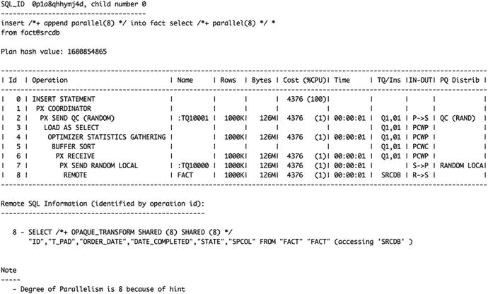
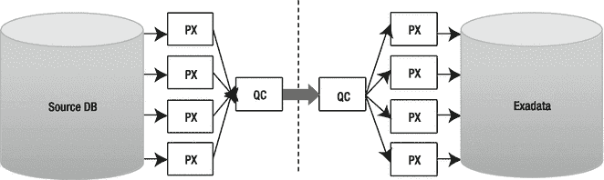

# 现在让我们将注意力转向导入过程

在迁移数据库时，通常首选模式级别的导入。它允许您将过程分解为更小、更易于管理的部分。但情况并非总是如此，有时进行完整的数据库导入是更好的选择。您在此处已了解到的大多数任务既适用于模式级导入，也适用于全库导入。在本节中，您会看到需要注意的任何例外情况的说明。如果您选择不进行全库导入，请注意系统对象（包括角色、公共同义词、配置文件、公共数据库链接、系统特权等）将不会被导入。您需要使用 `SQLFILE` 参数和 `FULL=Y` 导出来提取这些对象的 DDL。所需的导出可以仅执行元数据导出。然后，您可以在目标数据库上执行 DDL 来创建缺失的对象。让我们来看一些对数据库迁移有用的 `impdp` 参数。

*   `REMAP_SCHEMA`：顾名思义，此参数告诉 Data Pump 在导入过程中将对象的所有权从一个模式更改为另一个模式。当将多个数据库合并到一个 Exadata 数据库时，这对于解决模式冲突特别有用。在导入到 12c PDB 时，这甚至可能不需要。
*   `REMAP_DATAFILE`：可以使用此参数在导入过程中动态重命名数据文件。这允许 ASM 根据 Oracle 托管文件 (OMF) 规则自动组织和命名数据文件。
*   `REMAP_TABLESPACE`：此选项将段的表空间名称引用从一个表空间更改为另一个表空间。当您想在导入期间将表从一个表空间物理迁移到另一个表空间时，这很有用。
*   `SCHEMAS`：列出要导入的模式。
*   `SQLFILE`：此参数不将任何内容导入数据库，而是将对象定义 (DDL) 写入 SQL 脚本。如果您想更改对象的物理结构（例如分区或使用 HCC 压缩），这对于预构建对象非常有用。请注意，从 Oracle 12c 开始，您可以使用 `TRANSFORM` 参数（稍后描述）来进一步更改物理结构，最显著的是压缩级别。
*   `TABLE_EXISTS_ACTION`：如果导入的对象已存在时要采取的操作。有效关键字为 `APPEND`、`REPLACE`、`SKIP` 和 `TRUNCATE`。SKIP 是默认值。
*   `TABLES`：要导入的表列表。例如，`TABLES=MARTIN.T1,MARTIN.T2`
*   `TRANSFORM`：此参数允许您在对象创建 DDL 语句中更改段属性，例如存储属性。这为在 Exadata 中创建表时优化区大小提供了一种便捷的方法。Oracle 12c 极大地增强了此参数的潜力。您现在可以使用 `DISABLE_ARCHIVE_LOGGING` 参数，将正在导入的段的日志记录属性设置为 `NOLOGGING`。在已经实施物理备用数据库的环境中请务必小心——`NOLOGGING` 操作将损坏备用数据库上的数据文件。
*   其他新参数允许您使用 `TABLE_COMPRESSION_CLAUSE` 更改段的压缩级别，以及使用 `LOB_STORAGE` 关键字动态更改 LOB 类型（基本/安全文件）。可能还有其他参数对您的情况有用，请查看文档中的具体说明。
*   `LOGTIME`：这是 Oracle 12c 中一个非常有用的新增功能，允许您请求在 Data Pump 日志文件中输出时间戳。如果过程需要重复，这是预测过程所需时间的非常便捷的方法。
*   `NETWORK_LINK`：此参数已在上一节中介绍。

在开始将模式导入到您的 Exadata 数据库之前，请注意，Data Pump 仅在执行全库导入时才会自动创建表空间。如果您是在模式或表级别进行导入，则必须手动创建表空间。为此，请使用导入 Data Pump 参数 `FULL=yes` 和 `SQLFILE={your_sql_script}` 生成表空间的 DDL。这将生成一个包含 SQL 文件中所有对象（包括数据文件）的 DDL 的脚本。您可能会注意到，在 `CREATE TABLESPACE` DDL 中，数据文件的文件名是完全限定的。这完全不是您想要的，因为它绕过了 OMF 并创建了不易管理的硬编码文件名。`REMAP_DATAFILE` 参数允许您重命名数据文件以反映 Exadata 数据库中的 ASM 磁盘组。语法如下所示：

```
REMAP_DATAFILE=’/u02/oradata/LAB112/example01.dbf’:’+DATA’
```

另一种方法是使用 `REMAP_TABLESPACE`。在继续讨论导出/导入之前，最后要注意一点。源数据库和目标数据库之间的字符集转换是通过 Data Pump 自动完成的。请确保源数据库的字符集是目标数据库字符集的子集，否则在转换过程中可能会丢失一些内容。例如，如果您的源数据库是 US7ASCII（7 位），目标数据库是 WE8ISO8859P15（8 位），这是可以的。但是，在不同的 8 位字符集之间迁移或从 8 位迁移到 7 位可能会导致特殊字符丢失。

另一个重要的参考是版本兼容性。如有疑问，请查阅文档 ID 553337.1，该文档解释了不同 Oracle 版本 Data Pump 的兼容性。


## 导出与导入

如果你要迁移到 Exadata 的数据库版本早于 10g，那么 Data Pump 就不是一个可选项。相反，你需要使用其前身工具：导出 (`exp`) 和导入 (`imp`)。导出/导入功能自 Oracle 9.2 以来变化不大，但如果你是从更早的版本迁移，可能会发现某些功能缺失。希望你已经不再支持 8i 甚至 7.x 版本的数据库了，不过也不用担心。尽管在这些较旧的版本中，像 `FLASHBACK_SCN` 和 `PARALLEL` 这样的选项不可用，但总有办法绕过这些缺失的功能。说到版本，MOS 文档 ID 132904.1 提供了不同版本导出/导入工具的兼容性矩阵，以及本节中我们认为理所当然的一些其他背景信息。

`PARALLEL` 严格来说是 Data Pump 的功能，但你仍然可以通过并行运行多个方案导出来实现数据库导出的并行化。这是一种远不那么方便的“并行化”导出过程的方式。如果你必须以这种方式并行化导出过程，就需要自行计算如何将方案分组，使各组大小大致相等，以最小化所有导出完成所需的总时间。

`压缩` 是导出工具缺失的另一项功能。对于支持 Unix/Linux 平台的 DBA 来说，这从来都不是大问题。这些系统提供了通过命名管道将导出输出重定向到 `compress` 或 `gzip` 命令的能力，大致如下（`$` 符号当然是 shell 提示符）：

```
oracle@solaris:∼$ mkfifo exp.dmp
oracle@solaris:∼$ ls -l exp.dmp
prw-r--r--   1 oracle   oinstall       0 Jun 20 20:08 exp.dmp
oracle@solaris:∼$ cat exp.dmp | gzip > exp_compressed.dmp.gz &
[1] 5140
oracle@solaris:∼$ exp system file=exp.dmp owner=martin consistent=y statistics=none \
> log=exp_compressed.dmp.log
[...]
oracle@solaris:∼$ ls -lh *exp_compressed*
-rw-r--r--   1 oracle   oinstall     16M Jun 20 20:12 exp_compressed.dmp.gz
-rw-r--r--   1 oracle   oinstall    1.4K Jun 20 20:12 exp_compressed.dmp.log
```

`REMAP_TABLESPACE` 参数在导出/导入中不可用。要解决这个问题，你必须使用 `INDEXFILE` 参数生成一个 SQL 文件，该文件会产生一个类似于 Data Pump 的 `SQLFILE` 参数的 SQL 脚本。然后，你可以根据需要修改表空间引用并在新表空间中预创建段。使用 `IGNORE` 参数将允许导入工具简单地向你提前手动创建的表中执行插入操作。`REMAP_SCHEMA` 参数在导入工具中形式略有不同。要在导入过程中更改方案名称，请使用 `FROMUSER` 和 `TOUSER` 参数。

导出/导入有一个无法规避的限制。导入工具不支持 Exadata HCC（混合列压缩）。我们的测试表明，使用导入工具导入数据时，你能期望获得的最佳表压缩级别大约相当于为 OLTP 压缩的表（在 11g 中也称为“高级压缩”，这是一个需要额外许可的功能）。无论表配置为 Exadata 上可用的四种 HCC 压缩模式中的哪一种（查询低/高和归档低/高），结果都一样。这是因为 HCC 压缩只能在通过直接路径插入（例如使用 `insert /*+ APPEND */` 语法）时才会发生。根据《Exadata 用户指南》，常规插入和更新可以工作，但无法实现相同的压缩节省。这种“降低的压缩率”实际上与高级压缩选项提供的 OLTP 压缩相同，当进行常规插入时，HCC 会回退到这种压缩方式。顺便说一句，导入工具对此不会报错或发出任何警告。它只会以低得多的压缩率静默导入数据，悄无声息地消耗掉远比你计划或预期要多的存储空间。除了在导入完成后重建受影响的表之外，你对此无能为力。需要理解的重要一点是，你无法利用 Exadata 的 HCC 压缩来使用导出/导入工具。

导出/导入方法也不支持透明数据加密。如果你的数据库使用了 TDE，你需要使用 Data Pump 来迁移这些数据。如果你在方案级别进行导入，角色、公共同义词、配置文件、公共数据库链接和系统权限等系统对象将不会被导入。这类系统对象可以通过执行完整数据库导入并使用 `INDEXFILE` 参数来提取创建这些对象的 DDL 语句。这个步骤是最容易出错的环节。这是一个繁琐的过程，必须非常仔细，确保没有任何遗漏。幸运的是，有一些第三方工具能很好地比较两个数据库，并向你展示遗漏之处。大多数此类工具还提供将对象定义同步到新数据库的功能。

如果你仍在考虑使用导出/导入，请注意，由于导入工具的数据加载不使用直接路径加载插入，它会产生高得多的 CPU 使用开销，这源于 undo 和 redo 的生成以及缓冲区缓存管理。你还需要为数组插入设置合适的 `BUFFER` 参数（你会希望一次插入数千行），并使用 `COMMIT=Y`（这将在每次缓冲区插入后提交），这样就不会因为一个巨大的插入事务而填满 undo 段。

## 何时使用 Data Pump 或导出/导入

Data Pump 和导出/导入是数据量敏感的操作。也就是说，移动数据库所需的时间将直接与其大小和网络带宽相关。对于 OLTP 应用程序，可能会有相当长的停机时间。因此，它更适合较小规模的数据库。它也非常适合迁移大型数据仓库数据库，其中只读数据与读写数据是分开的。请查看应用程序的停机时间要求，并运行一些测试来确定 Data Pump 是否合适。Data Pump 和导出/导入的另一个好处是，它们允许你轻松复制应用程序方案中的所有对象，免除了手动复制 PL/SQL 包、视图、序列定义等的麻烦。使用导出/导入迁移小表和所有其他方案对象，同时使用不同方法迁移最大的表，这种做法并不少见。

在可传输数据库或可传输表空间不适用的情况下（换句话说，存在无法传输和/或转换的对象），你可能最终需要采用双管齐下的方法。第一步，确保数据文件被转换并插入。在迁移的第二部分，移动不可传输的组件。有趣的是，在 Oracle 12c 中，可传输表空间选项与逻辑导出结合为一个名为“全可传输导出/导入”的新功能。


## 使用数据泵或导出/导入时的注意事项

源数据库和目标数据库之间的字符集差异是受支持的，但如果你正在转换字符集，请确保源数据库的字符集是目标数据库字符集的子集。如果在模式级别导入，请检查是否未留下任何系统对象，例如角色和公共同义词，或数据库链接和授权。请记住，HCC（混合列压缩）仅在使用数据泵时才能有效应用。务必使用导出（`CONSISTENT=Y`）或数据泵（`FLASHBACK_SCN`/`FLASHBACK_TIME`）的一致性参数，以确保你的数据以读一致的方式导出。不要忘记考虑你可能给网络带来的负载。

数据泵和导出/导入方法也可能要求你有一些临时磁盘空间（在源服务器和目标服务器上都有）来存放转储文件。请注意，使用数据泵的表数据压缩选项要求你为源数据库和目标数据库都拥有 Oracle Advanced Compression 许可证（只有 `metadata_only` 压缩选项包含在企业版许可证中）。

#### 通过数据库链接复制数据

当在数据库之间提取和复制非常大量的数据（许多 TB）时，数据库链接可能是一个非常有用的选择。与默认的数据泵选项（即不使用网络链接子句）不同，使用数据库链接，你只需读取一次数据（从源），立即通过网络传输，并写入一次（到目标数据库）。使用传统的数据泵，Oracle 必须从源读取数据，然后将其写入一个转储文件。然后你需要使用某种文件传输工具传输该文件（或使用 NFS 进行网络复制操作），然后在将数据写入目标数据库表之前从转储文件中读取数据。除了为写入和读取转储文件而进行的额外磁盘 I/O 之外，你还需要额外的磁盘空间来在迁移期间存放这些文件。现在你可能会说“等等”。数据泵确实有 `NETWORK_LINK` 选项和通过数据库链接直接传输数据的能力，但这里有一个小陷阱。

Oracle 12c 中的数据泵允许进行一些优化，但网络链接方法有一个非常重要的缺点：你无法以并行方式导入表。使用数据泵和网络链接选项时，每个段都有自己唯一的（且唯一的）工作进程用于写入数据。在放弃数据泵之前，你应该阅读它所提供的功能。

对于 Exadata 非常重要的是，12c 中的 `impdp` 允许你使用直接路径插入。这对于 HCC 压缩数据至关重要。请记住 HCC 章节的内容，为了实现压缩，你需要使用直接路径插入。使用传统插入，你会创建标记为 OLTP 压缩的块，导致段大于其所需大小。下面是一个演示，展示 HCC 压缩与 `impdp` 一起工作。第一步是在目标数据库中创建一个数据库链接。

```
CREATE DATABASE LINK sourcedb
CONNECT TO source:user
IDENTIFIED BY source:password
USING 'tns_alias';
```

在启动 `impdp` 之前，你现在可以利用你的 DDL 文件来预创建要导入的表。稍作编辑，你可以在开始导入之前为特定段添加 HCC 压缩。在 12c 中，这使用 `impdp` 的 `TRANSFORM` 选项中的 `TABLE_COMPRESSION_CLAUSE` 变得更容易。

> **注意**
>
> 创建数据库链接时，你可以使用 USING 子句直接指定数据库链接的 TNS 连接字符串，如下所示：
>
> ```
> CREATE DATABASE LINK ... USING '(DESCRIPTION = (ADDRESS = (PROTOCOL = TCP)(HOST = source-host)(PORT = 1521)) (CONNECT_DATA = (SERVER = DEDICATED) (SERVICE_NAME = ORA10G)))'
> ```
>
> 这样，你就不必在数据库服务器中设置 `tnsnames.ora` 条目。

设置完成后，如下执行 `impdp`：

```
[oracle@enkdb03 ~]$ impdp network_link=dplink remap_schema=martin:imptest \
> schemas=martin directory=imptest logfile=nlimp.log
```

检查系统上的会话时，你将看到主进程以及导入从属进程。在一个特定实例中记录了以下内容：

```
IMPTEST@DB12C1:1> @as
SID    SERIAL# USERNAME      PROG       SQL_ID         SQL_TEXT
----- ---------- ------------- ---------- -------------  -----------------------------
1240      59677 IMPTEST       udi@enkdb0 7wn3wubg7gjds  BEGIN :1 := sys.kupc$que_int...
264       16273 IMPTEST       oracle@enk 9qhxsv2smtyw9  INSERT /*+ APPEND
1499       9287 IMPTEST       oracle@enk bjf05cwcj5s6p  BEGIN :1 := sys.kupc$...
```

从这个小 SQL 片段及其输出可以看出，使用数据泵可以实现直接路径插入。如果你不使用 Data Guard 备用数据库或类似的基于重做的复制工具，你甚至可能考虑在 `NOLOGGING` 模式下操作。另一个 12c 增强功能允许你以这种方式指定操作，而无需修改表 DDL：

```
[oracle@enkdb03 ~]$ impdp network_link=dplink remap_schema=martin:imptest schemas=martin \
> directory=imptest logfile=nlimp2.log table_exists_action=replace \
> transform=disable_archive_logging:Y
```

当你有任何类型的基于重做的备用数据库时，请小心。所有使用 `NOLOGGING` 的加载都不会传输到备用数据库，你必须从 SCN 开始进行备份才能使其重新同步。使用网络链接的数据泵方法的重要缺点是，你无法利用段内并行性。如果你想了解更多关于段内并行性的信息，请继续阅读。


#### 通过数据库链接实现高吞吐量 CTAS 或 IAS

尽管前面的示例很简单，但它们可能无法提供您期望的吞吐量，尤其是当源数据库服务器与目标不在同一网段时。必须对数据库链接和底层 TCP 协议进行调优，以实现高吞吐量的数据传输。数据传输速度显然受限于您的网络设备吞吐量，并且还取决于源和目标数据库之间的网络往返时间（`RTT`）。

要在短时间内移动数十`TB`的数据，您显然需要大量的网络吞吐量容量。您必须拥有端到端的容量，从源数据库到目标`Exadata`集群。这意味着您的源服务器必须能够以您的`Exadata`集群接收数据的速度发送数据，并且中间的任何网络设备（交换机、路由器）也必须能够处理这一点（此外还要处理所有其他必须流经它们的流量）。处理企业网络拓扑和网络硬件配置是一个非常广泛的主题，超出了本书的范围，但在这里简要提及`Exadata`数据库服务器内置的网络硬件这一主题非常重要。

除了`InfiniBand`端口外，`Exadata`集群还内置了以太网端口。表 `13-2` 列出了所有的以太网和`InfiniBand`端口。

**表 13-2.**

**每个数据库服务器中的 Exadata 以太网和 InfiniBand 端口**

| Exadata 版本 | 硬件 | 以太网端口 | InfiniBand 端口 |
| --- | --- | --- | --- |
| V2 | Sun | 4 × 1 Gb/s | 2 × 40 Gb/s QDR |
| X2-2 | Sun | 4 × 1 Gb/s 2 × 10 Gb/s | 2 × 40 Gb/s |
| X2-8 | Sun | 8 × 1 Gb/s 8 × 10 Gb/s | 8 × 40 Gb/s |
| X3-2 | Sun | 4 x 1 or 10 Gb/s 2 x 10 Gb/s | 2 x 40 Gb/s |
| X3-8 | Sun | 8 × 1 Gb/s 8 × 10 Gb/s | 8 × 40 Gb/s |
| X4-2 | Sun | 4 x 1 or 10 Gb/s 2 x 10 Gb/s | 2 x 40 GB/s x 40 Gb/s (active/active) |
| X4-8 | Sun | 10 x 1 Gb/s 8 x 10 Gb/s | 8 x 40 Gb/s (active/ active) |
| X5-2 | Sun | 4 x 1 or 10 Gb/s 2 x 10 Gb/s | 2 x 40 GB/s x 40 Gb/s (active/active) |

数据库服务器和存储节点各有一个用于服务器管理（`ILOM`）的管理以太网端口。请注意，在撰写本文时没有`X5-8`型号。

请注意，`X2`及更早的代使用`PCIe`版本`2.0`，而`X3`及之后的代使用`PCIe`版本`3`以获得更高的每`PCI`通道吞吐量。然而，直到`X3`代，`InfiniBand`卡能够使用`PCIe`版本`2.0`和`8`条通道，这意味着`InfiniBand`卡与其`PCI`总线通信的最大带宽限制为`8 x 500MB = 4000MB`（大约`4GB`）。在`Exadata`中使用的四倍链路聚合的四倍数据速率（`QDR`）`InfiniBand`吞吐量的最大数据速率为`40Gb/s`，或`5GB/s`。这可能解释了直到`X3`代`InfiniBand`的主动/被动配置。

表 `13-2` 显示了每个数据库服务器的网络端口数量。虽然`Exadata V2`没有任何`10GbE`端口，但它每个数据库服务器仍然有`4 × 1GbE`端口。一个满配机箱有八个数据库服务器，这总共将提供`32 × 1 GbE`端口，当仅使用以太网端口时，理论上最大吞吐量为每秒`32`吉比特。考虑到各种开销，如果您设法将所有网络端口均匀地投入使用并且没有其他瓶颈，理论上仍然可以实现每秒`3`千兆字节的传输速度。这意味着您必须要么将网络接口配置为全主动绑定，要么通过不同的网络接口路由不同数据集的`数据传输`。不同的`dblinks`连接可以通过不同的`IP`地址路由，或者通过不同路径传输`数据泵`转储文件。值得庆幸的是，当前的`Exadata`系统可以使用`10Gb/s`以太网，既可以使用内置端口进行铜缆连接，也可以选择使用两个光口实现相同的理论带宽。在`dash-8`系统上，您确实有丰富的网络端口可用。

由于这相当复杂，迁移到`Exadata`的公司经常使用高吞吐量的绑定`InfiniBand`链路来以低停机时间迁移大型数据集。不幸的是，大多数公司现有的数据库网络基础设施不包括`InfiniBand`（在老旧、庞大的服务器中）。标准通常是若干个交换和绑定的`1GbE`以太网端口，或者在某些情况下是`10GbE`端口。这就是为什么对于`Exadata V1/V2`迁移，您必须要么在源服务器中安装`InfiniBand`卡，要么使用一个能够同时处理源以太网流量并将其传输到目标`Exadata InfiniBand`网络的交换机。

幸运的是，`Exadata X2`及更新的版本都包含了`10GbE`端口，因此您不再需要经历让旧服务器支持`InfiniBand`的麻烦，可以转而使用`10GbE`连接（如果您的旧服务器或网络交换机已经配备了`10GbE`以太网）。

如果您打算使用网络链接作为将数据传输到`Exadata`的主要手段来迁移系统，您可能考虑使用 `iperf` 检查带宽，这是一个用于测量吞吐量的开源工具。该工具在一个`MOS`说明中突出介绍：How to use `iperf` to test network performance, ID: 1507397.1，详细说明了如何对`RAC`互连流量和丢包进行故障排除。我们认为它非常值得使用。

这引出了我们关于高网络吞吐量数据库迁移的软件配置主题。本章的目的不是成为网络调优参考，但我们希望解释一些我们遇到过的挑战。要正确设置`Oracle`数据库链接的吞吐量涉及更改多个设置并需要手动并行化。希望本节内容能帮助您在处理海量数据集和低停机时间要求时避免重复造轮子。在开始为最佳吞吐量调优数据库之前，您应确保网络连接为迁移提供了足够的吞吐量和足够低的延迟。

除了网络硬件层面需要有足够的吞吐量容量外，还有三个主要的软件配置设置会影响`Oracle`的数据传输速度：

*   获取数组大小（`arraysize`）
*   `TCP`发送和接收缓冲区大小
*   `Oracle Net`会话数据单元（`SDU`）大小

对于常规应用程序连接，如果您正在传输大量行，则必须将获取数组大小设置为一个较高的值，范围从几百到几千。否则，如果`Oracle`一次发送的行数太少，大部分传输时间可能最终都花在等待客户端和服务器之间的`SQL*Net`数据包往返上。

然而，使用数据库链接时，`Oracle`足够智能，会自动将获取数组大小设置为最大值——它一次传输`32,767`行。因此，我们不需要自己调优它。


#### 调优 TCP 缓冲区大小

TCP 发送和接收缓冲区大小是在操作系统层面配置的，因此每个操作系统和硬件设备对此都有不同的设置。为了实现更高的吞吐量，可能需要在连接的两端增加 TCP 缓冲区大小。您可以在此处阅读一个 Linux 示例；对于其他操作系统，请参考您的网络文档。此处参考了匹兹堡超级计算中心“实现高性能数据传输”页面（[`http://www.psc.edu/networking/projects/tcptune/`](http://www.psc.edu/networking/projects/tcptune/)）。

作为第一步，您必须确定系统中 TCP（每个连接）的最大缓冲区大小。在 Exadata 服务器上，只需保持 TCP 缓冲区大小设置为标准 Exadata 安装期间设置的值即可。在 Exadata 上，TCP 协议栈已经从通用的 Linux 默认值进行了更改。请勿基于通用数据库文档（例如“Oracle Database Quick Installation Guide for Linux”）配置 Exadata 服务器设置。

许多非 Exadata 系统针对 100Mbit/s 或 1Gbit/s 范围的网络进行了保守配置。通过设置操作系统参数来增大发送和接收缓冲区，可以优化 10Gbit/s 以太网的使用。在此背景下，一个有用的指标是带宽延迟积。BDP 是特定时间点上“在途”的最大数据量，您的非 Exadata 系统网络配置应考虑到这一点。不久前，从 Red Hat Linux 5.x 使用的 2.6.18 内核开始，Linux 引入了发送和接收缓冲区的自动调优。缓冲区的调优可以通过`/proc/sys/net/ipv4/tcp_moderate_rcvbuf`检查；它应设置为 1。研究此主题时常见的建议是，您不应试图超越 Linux 的默认行为，而应坚持使用默认值。

最佳缓冲区大小取决于您的网络往返时间和网络链路的最大吞吐量（或期望的吞吐量，取较低者）。最佳缓冲区大小值可以使用 BDP 公式计算，该公式在前面提到的“实现高性能数据传输”文档中也有解释。请注意，更改前面显示的内核参数意味着在服务器内进行全局更改。如果您的数据库服务器运行大量进程，由于缓冲区大小的增加，内存使用量可能会上升。因此，在实际迁移发生之前，您可能不想增加这些参数。

在您在操作系统级别更改上述任何套接字缓冲区设置之前，如果您的源数据库是 Oracle 10g 或更新版本，则有一个好消息。从 Oracle 10g 开始，Oracle 可以在启动新进程时自行请求自定义缓冲区大小。您可以通过在服务器端（源数据库）更改`listener.ora`配置文件和目标数据库侧的`tnsnames.ora`（或数据库链接定义中的原始 TNS 连接字符串）来实现这一点。在从目标指向源的数据库链接连接中，目标数据库充当客户端。这在 Oracle Database Net Services Administrator's Guide 的“优化性能”部分，“配置 I/O 缓冲区空间”一节中有详细说明。

此外，您可以通过增加`SDU`大小来减少 Oracle 用于发送网络数据的系统调用次数。这需要在`listener.ora`中进行更改，并在服务器端的`sqlnet.ora`中设置默认`SDU`大小。您还应该相应地编辑客户端配置文件。有关更多详细信息，请参阅 Oracle 文档。请注意，在 Oracle 12c 中，对于 12c 到 12c 的通信，`SDU`的最大大小已从 32kb 增加到 2MB。

以下是一个示例，展示了如何在源数据库上启用大的`SDU`。首先，您需要一个监听器。考虑到迁移，您可能希望使用一个新的监听器，而不是修改现有的监听器。这也意味着您不会干扰常规监听器，如果您使用动态注册的数据库，这可能是一个负担。在示例中，您将看到在源数据库上定义为`SDUTEST`的监听器：

```
$ cat listener.ora

LISTENER_sdutest =
  (DESCRIPTION_LIST =
    (DESCRIPTION =
      (SDU = 2097152)
      (ADDRESS =
        (PROTOCOL = TCP)
        (HOST = sourcehost)
        (PORT = 2521)
        (SEND_BUF_SIZE=4194304)
        (RECV_BUF_SIZE=1048576)
      )
    )
  )

SID_LIST_listener_sdutest =
  (SID_DESC=
    (GLOBAL_DBNAME=source)
    (ORACLE_HOME = /u01/app/oracle/product/12.1.0.2/dbhome_1)
    (SID_NAME = source1)
  )
```

除了`listener.ora`文件，您还需要在`sqlnet.ora`中将默认`SDU`设置为 2M：

```
DEFAULT_SDU_SIZE=2097152
```

您可能希望将`listener.ora`和`sqlnet.ora`文件存储在其正确的`TNS_ADMIN`目录中，而不干扰其他监听器。如果您计划仅在迁移期间修改网络参数，那么修改默认监听器当然是可以的。

Exadata 上（作为客户端）的`tnsnames.ora`文件将引用一个类似于此示例的数据库：

```
$ cat tnsnames.ora

source =
  (DESCRIPTION =
    (SDU=2097152)
    (ADDRESS =
      (PROTOCOL = TCP)
      (HOST = sourcehost)
      (PORT = 2521)
      (SEND_BUF_SIZE=1048576)
      (RECV_BUF_SIZE=4194304)
    )
    (CONNECT_DATA =
      (SERVER = DEDICATED)
      (SERVICE_NAME = source)
    )
  )
```

使用这些设置，当在目标（Exadata）数据库中发起数据库链接连接时，`tnsnames.ora`连接字符串的附加信息将使目标 Oracle 数据库为其连接请求更大的 TCP 缓冲区大小。得益于目标数据库`tnsnames.ora`和源数据库`sqlnet.ora`中的`SDU`设置，目标数据库将协商尽可能大的`SDU`大小。

注意

如果您在旧版 Oracle 中进行过 SQL*Net 性能调优，您可能还记得另一个 SQL*Net 参数：`TDU`。此参数已过时，从 Oracle Net8（Oracle 8.0）开始被忽略。

此外，在本书付印时，您更可能正在将非 12c 数据库迁移到 Exadata 中，因此请注意，这些版本中不支持超大`SDU`。

可以请求不同大小的发送和接收缓冲区。这是因为在数据传输期间，大部分数据将从源移动到目标方向。只有部分确认和“fetch more”数据包会从另一个方向发送。这就是为什么您在源数据库（`listener.ora`）中看到发送缓冲区更大，因为源主要进行发送。在目标侧（`tnsnames.ora`），接收缓冲区被配置为更大，因为目标数据库主要进行接收。请注意，这些缓冲区大小仍然受到操作系统级最大缓冲区大小的限制。正如您在上一节中所读到的，在 Linux 上这个数字是自动调优的。其他操作系统可能有所不同。


#### 并行化数据加载

如果你为迁移选择了抽取-加载方法，并且计划使用**EHCC**，那么还有一个瓶颈需要克服。你可能希望使用**EHCC**来节省存储空间并获得更好的数据扫描性能（压缩数据意味着需要从磁盘读取的字节更少）。请注意，如果你的查询执行时间大部分花费在数据访问之外的操作上，例如排序、分组、连接，以及在`SELECT`列表或过滤条件中调用的任何昂贵函数，那么更快的扫描可能不会使你的查询明显加速。然而，与经典的块级去重相比，**EHCC**压缩需要多得多的**CPU**周期，因为**EHCC**中的最终压缩是通过**CPU**密集型算法执行的（当前是**LZO**、**Zlib**或**BZip**，具体取决于压缩级别）。此外，虽然解压缩可以在存储单元或数据库层进行，但数据的压缩只能在数据库层进行。因此，如果你使用单个会话将大量数据加载到**EHCC**压缩表中，你将受限于你正在使用的单个**CPU**（核心）。因此，你几乎肯定需要并行化数据加载，以利用数据库层的所有**CPU**，实现更高效、更快速的压缩。

这听起来很简单——只需在目标表上添加一个`PARALLEL`标志，或者在查询中加入一个`PARALLEL`提示，就应该万事大吉了，对吗？或者也许使用`impdp`中的`PARALLEL`关键字来并行完成工作？不幸的是，事情比这稍微复杂一些。有几个问题需要解决；其中一个是简单的，但另一个需要一些努力。

接下来的几节将不会提及`impdp`，原因很简单：当通过网络链路使用`impdp`导入时，该工具无法执行段内并行。它会并行导入段（尊重并行子句），但没有任何段会被并行导入。相反，重点是如何使用你自己的**DIY**段内并行性，通过数据库链路上的插入语句来实现。

##### 问题一：确保数据加载并行执行

这里的问题是，虽然并行查询和数据定义语言（**DDL**）语句在任何会话中默认启用，但数据操作语言（**DML**）语句的并行执行则没有启用。因此，并行**CTAS**语句将端到端地并行运行，但并行**IAS**语句的加载部分将以串行方式完成！查询部分（`SELECT`）将并行执行，因为从站将数据传递给单个查询协调器（**QC**），而正是这个单一的进程在执行数据加载（包括**CPU**密集型的压缩）。

不过，这个问题很容易解决；你只需要在你的会话中启用并行**DML**。让我们先检查一下会话中的并行执行标志：

```sql
SQL> SELECT pq_status, pdml_status, pddl_status, pdml_enabled
  2> FROM v$session WHERE sid = SYS_CONTEXT(’userenv’,’sid’);

PQ_STATUS   PDML_STATUS   PDDL_STATUS   PDML_ENABLED
---------   -----------   -----------   ---------------
ENABLED     DISABLED      ENABLED       NO
```

当前会话中并行**DML**被禁用。`PDML_ENABLED`列是为了向后兼容而存在的。让我们启用**PDML**：

```sql
SQL> ALTER SESSION ENABLE PARALLEL DML;

Session altered.

SQL> SELECT pq_status, pdml_status, pddl_status, pdml_enabled
  2> FROM v$session WHERE sid = SYS_CONTEXT(’userenv’,’sid’);

PQ_STATUS   PDML_STATUS   PDDL_STATUS   PDML_ENABLED
---------   -----------   -----------   ---------------
ENABLED     ENABLED       ENABLED       YES
```

启用并行**DML**后，**INSERT AS SELECT**语句就能够为**IAS**语句的加载部分使用并行从站了。

关于并行插入，还有另一个重要方面需要注意。在下一个例子中，启动了一个新会话（因此**PDML**被禁用），当前语句是一个并行插入。你可以看到在插入和查询块上都添加了一个“语句级”的`PARALLEL`提示，解释的执行计划输出（`DBMS_XPLAN`包）显示使用了并行性。然而，这个执行计划在加载到压缩表时会非常缓慢，因为并行性只对查询（`SELECT`）部分启用，而不是对数据加载部分！

为什么会这样？请注意实际数据加载发生的位置——在执行计划树中的`LOAD AS SELECT`操作符中。然而，这个`LOAD AS SELECT`位于`PX COORDINATOR`行源之上（这是可以从从站拉取行和其他信息到**QC**的行源）。此外，在第 3 行，你可以看到`P->S`操作符，这意味着从第 3 行向上传递到执行计划树的任何行都由一个串行进程（**QC**）接收。

```sql
-------------------------------------------------------------------------------------------------
| Id  | Operation                   | Name     | Rows |  Bytes | Cost (%CPU)| Time      |
-------------------------------------------------------------------------------------------------
|   0 | INSERT STATEMENT            |          |      |        | 6591 (100) |           |
|   1 |  LOAD AS SELECT             |          |      |        |            |           |
|   2 |   PX COORDINATOR            |          |      |        |            |           |
|   3 |    PX SEND QC (RANDOM)      | :TQ10000 |   10M|   1268M| 6591   (1) | 00:00:01 |
|   4 |     PX BLOCK ITERATOR       |          |   10M|   1268M| 6591   (1) | 00:00:01 |
|*  5 |      TABLE ACCESS STORAGE FULL| T1     |   10M|   1268M| 6591   (1) | 00:00:01 |
-------------------------------------------------------------------------------------------------
... continued from previous output:
-----------------------------
TQ  |IN-OUT| PQ Distrib |
-----------------------------
|      |            |
|      |            |
Q1,00 | P->S | QC (RAND)  |
Q1,00 | PCWP |            |
Q1,00 | PCWC |            |
Q1,00 | PCWP |            |
-----------------------------
```


`谓词信息（由操作 ID 标识）：`
`---------------------------------------------------`
`5 - storage(:Z>=:Z AND :Z<=:Z)`

## 注意

执行计划表的输出太宽，无法放入单行；因此，剩余的信息（这些信息非常重要！）已被换行显示。

“并行度为 8 是因为提示”这一消息意味着，Oracle 理解了以并行度 8 运行查询某部分的请求，并且在优化执行计划时，CBO 计算中使用了这个并行度。然而，如上所述，这并不意味着整个执行计划都使用了这个并行度。检查实际的数据加载工作（`LOAD AS SELECT`）是由单个 QC（查询协调器）执行还是由 PX 从属进程执行，这一点很重要。

让我们看看启用并行 DML 后会发生什么：

```sql
SQL> alter session enable parallel dml;

Session altered.

SQL> insert /*+ monitor append parallel(8) */ into t1 select /*+ parallel(8) */ * from t2
```

```
SQL 计划监控详情（计划哈希值=3136303183）
====================================================================================
| Id |               操作               |   名称   | 行数 | 代价 |    时间    |
|    |                                   |          | (预估) |      | 活动秒数   |
====================================================================================
|  0 | INSERT STATEMENT                  |          |        |      |           1 |
|  1 |   PX COORDINATOR                  |          |        |      |           1 |
|  2 |    PX SEND QC (RANDOM)            | :TQ10000 |   10M | 3764 |           1 |
|  3 |     LOAD AS SELECT                |          |        |      |           3 |
|  4 |      OPTIMIZER STATISTICS GATHERING|          |   10M | 3764 |           3 |
|  5 |       PX BLOCK ITERATOR           |          |   10M | 3764 |           2 |
|  6 |        TABLE ACCESS STORAGE FULL  | T2       |   10M | 3764 |           3 |
===================================================================================
```

此案例中请求的 DOP（并行度）与之前一样是 8，但请比较这两个计划。此执行计划取自 12c 数据库的 SQL 监控报告。可以看到一个额外的步骤——收集统计信息。这是一个新功能，可确保在新建或填充的段中拥有准确的统计信息。

要理解接下来的讨论，你还需要查看并行分布情况。如下所示——这次取自 11.2 数据库的`DBMS_XPLAN.DISPLAY_CURSOR`：

```
------------------------------------------------------------------------------------------------
| Id  | 操作                       | 名称     | 行数 | 字节数 ||    TQ  | 内外 | PQ 分发      |
------------------------------------------------------------------------------------------------
|   0 | INSERT STATEMENT            |          |      |        ||        |      |              |
|   1 |  PX COORDINATOR             |          |      |        ||        |      |              |
|   2 |   PX SEND QC (RANDOM)       | :TQ10000 |   10M|   1268M||  Q1,00 | P->S | QC (RAND)    |
|   3 |    LOAD AS SELECT           |          |      |        ||  Q1,00 | PCWP |              |
|   4 |     PX BLOCK ITERATOR       |          |   10M|   1268M||  Q1,00 | PCWC |              |
|*  5 |      TABLE ACCESS STORAGE FULL| T1     |   10M|   1268M||  Q1,00 | PCWP |              |
------------------------------------------------------------------------------------------------
```

在本页两个执行计划所代表的第二种情况下，`LOAD AS SELECT`操作符已下移到执行计划树中；它不再是`PX COORDINATOR`的父操作。如何解读这个简单的执行计划呢？`TABLE ACCESS STORAGE FULL`将行发送给`PX BLOCK ITERATOR`（它是实际调用`TABLE ACCESS`并传递下一个要读取的数据块范围的行源）。然后，`PX BLOCK ITERATOR`将行发送回`LOAD AS SELECT`，后者立即将行加载到目标表中，完全不传递给 QC。所有的`SELECT`和`LOAD`工作都在同一个从属进程内完成——不需要进程间通信。如何判断呢？因为`IN-OUT`列显示两个操作都是`PCWP`（并行操作，与父操作结合），且两个操作的`TQ`值相同（`Q1,00`）。这表明并行执行从属进程确实在同一个表队列节点下执行所有这些步骤，无需在从属进程组之间传递数据。

## 使用数据库链接的执行计划

从数据库链接读取数据时，实际的执行计划如下所示：



在此示例中，由于在会话级别启用了并行 DML，数据加载是并行完成的；`LOAD AS SELECT`是一个并行操作（`IN-OUT`列显示`PCWP`），在 PX 从属进程内执行，而不是在 QC 中执行。

请注意，`DBMS_XPLAN`显示了通过数据库链接发送到远程服务器的 SQL 语句（在上面的远程 SQL 信息部分）。没有向远程服务器发送`PARALLEL`提示，而是发送了一个未文档化的`SHARED`提示，它是`PARALLEL`提示的别名。注意输出来自 12c，其中这个加载选择操作会触发一个统计信息收集操作。

这是比较容易解决的问题。如果你的数据量非常大，使用数据库链接还有另一个需要解决的问题，我们现在将进行解释。


## 问题二：实现完全并行网络数据传输

数据库链接与并行执行相关的另一个问题是，即使你能在链接两端都成功运行并行执行，实际打开数据库链接并管理网络传输的却是查询协调器。并行执行从属进程无法“神奇地”各自建立到另一数据库的数据库链接连接——所有流量都流经单个查询的查询协调器。因此，即使你可以使用数百个从属进程运行 `CTAS`/`IAS` 语句，网络传输仍然只使用一个数据库链接连接。虽然你可以通过增大 TCP 缓冲区和 SDU 大小来优化网络吞吐量，但查询协调器进程（运行在单个 CPU 上）能够处理的数据量仍然存在限制。

图 13-1 展示了尽管采用了所有并行执行，数据如何流经单个查询协调器。



**图 13-1.**
数据流在查询协调器处是单线程的

除了单个查询协调器的数据库链接瓶颈外，在查询协调器和从属进程之间发送数据（消息）也需要额外的 CPU 时间。过去，精细调整 `parallel_execution_message_size` 参数在这方面有所帮助。然而，从 Oracle 11.2 开始，其值默认为 16KB，因此进一步调整可能不会有显著收益。如果你在 RAC 实例的多个节点上执行并行数据加载，每个查询仍将只有一个查询协调器和一个网络连接。因此，如果查询协调器在节点 1 运行，而并行从属进程在节点 2 运行，查询协调器必须通过 RAC 互联网络将其从数据库链接获取的数据作为 PX 消息发送给从属进程。

如果你选择将数据库链接与并行从属进程一起使用，应在不同实例中运行多个独立的查询，并使用以下命令强制将并行从属进程与查询协调器置于同一实例中：

```sql
SQL> ALTER SESSION SET parallel_force_local = TRUE;

会话已更改。
```

这样，你至少可以避免 RAC 实例间流量和远程消息传递的 CPU 开销，但查询协调器到从属进程的实例内消息传递（行分发）开销仍然存在。

尽管进行了所有这些优化，并在不同实例中使用并行查询迁移了不同的大型表，你可能仍会发现单个数据库链接（及其查询协调器）无法提供足够的吞吐量，无法在停机时间内迁移数据库中最大的事实表。如前所述，数据库链接方法最适合用于数据库中的少数几个巨型表，其余的表可以使用 Data Pump 进行导出/导入。也许你只有几个巨大的事实表，但如果你的满配 Exadata 集群中有八个 RAC 实例，如何才能让所有实例高效地传输和加载数据呢？你可能希望每个实例至少有一个并行查询及其查询协调器和数据库链接，如果单个查询协调器进程无法足够快地拉取和分发数据，甚至可能需要多个这样的查询。

这里显而易见的解决方案是利用分区功能，因为你的大型 TB 级表在源数据库中很可能已经是分区的。你只需将大表作为多个独立的部分复制。然而，这种方法存在几个问题。

第一个问题是，当执行常规的直接路径加载插入（这对于 HCC 和适用的 `NOLOGGING` 加载是必需的）时，你的会话将独占地锁定它正在插入的表。当针对该表存在未提交的直接路径加载事务处于活动状态时，其他任何人都不能修改或向该表插入数据。请注意，其他人仍然可以读取该表，因为 `SELECT` 语句不会对它们查询的表获取队列锁。

如何解决这个并发问题呢？幸运的是，Oracle 的 `INSERT` 语法允许你通过名称指定要插入的确切分区或子分区：

```sql
INSERT /*+ APPEND */
INTO
fact PARTITION ( Y20080101 )
SELECT
*
FROM
fact@sourcedb
WHERE
order_date >= TO_DATE('20080101 ', 'YYYYMMDD ')
AND order_date  < TO_DATE('20080102', 'YYYYMMDD ')
```

使用这种语法，直接路径插入语句将只锁定指定的分区，其他会话可以自由地向同一表的其他分区插入数据。Oracle 仍将执行分区键检查，以确保数据不会被加载到错误的分区中。如果你尝试向分区插入无效的分区键值，Oracle 将返回错误消息：

`ORA-14401: 插入的分区键值超出指定分区的范围。`

请注意，你不能在查询的 `SELECT` 部分使用 `PARTITION ( partition_name )` 语法。这里的问题是，查询生成器（反解析器）——它负责组合通过数据库链接发送的 SQL 语句——不支持 `PARTITION` 语法。如果你尝试使用，将会收到错误：

`ORA-14100: 扩展表名的分区不能引用远程对象。`

这就是为什么你必须依赖源数据库端的分区裁剪——例如，通过向 `WHERE` 条件添加过滤谓词，以便只返回目标分区中的数据。在刚才显示的示例中，源表按 `order_date` 列进行范围分区。多亏了传递给源数据库的 `WHERE` 子句，该数据库中的分区裁剪优化将只扫描所需的分区，而不是整个表。

注意此示例中没有使用 `BETWEEN` 子句，因为它包含了 `WHERE` 子句中指定范围的两端值，而 Oracle 分区选项的“值小于”子句从分区值范围中排除了 DDL 中指定的值。

也可以使用子分区范围的插入语法加载到单个子分区（从而一次只锁定一个子分区）。当即使是单个分区的数据也太大而无法通过单个进程/数据库链接快速加载时，这非常有用，它允许你将数据分割成更小的块。只是注意不要有太多（小的）子分区——你之后可能无法对它们执行智能扫描。以下是上面的示例，这次是针对子分区插入：

```sql
INSERT /*+ APPEND */
INTO
fact SUBPARTITION ( Y20080101_SP01 )
SELECT
*
FROM
fact@sourcedb
WHERE
order_date >= TO_DATE('20080101 ', 'YYYYMMDD ')
AND order_date  < TO_DATE('20080102', 'YYYYMMDD ')
AND ORA_HASH(customer_id, 63, 0) + 1 = 1
```

在这个例子中，源表仍然按 `order_date` 进行范围分区，但它被哈希分区为 64 个子分区。由于同样无法通过数据库链接发送 `SUBPARTITION` 子句，你使用了 `ORA_HASH` 函数来仅获取属于 64 个总子分区中第一个哈希子分区的行。`ORA_HASH` SQL 函数内部使用与将行分配到哈希分区和子分区相同的 `kgghash()` 函数。如果有 128 个子分区，你需要将 SQL 语法中的 `63` 改为 `127 (n – 1)`。

由于你需要传输所有子分区，你可以并行复制其他子分区（当然这取决于服务器负载），只需运行上述查询的略微变体，并仅更改目标子分区名称和 `ORA_HASH` 输出以匹配相应的子分区位置：

```sql
INSERT /*+ APPEND */
INTO
fact SUBPARTITION ( Y20080101_SP02 )
SELECT
*
FROM
fact@sourcedb
WHERE
order_date >= TO_DATE('20080101 ', 'YYYYMMDD ')
AND order_date  < TO_DATE('20080102', 'YYYYMMDD ')
AND ORA_HASH(customer_id, 63, 0) + 1 = 2
```

归根结底，你需要执行 64 个该脚本的略微变体。


`... INTO fact` `SUBPARTITION ( Y20080101_SP03 )` `... WHERE ORA_HASH(customer_id, 63, 0) + 1 =` `3` `...`

`... INTO fact` `SUBPARTITION ( Y20080101_SP04 )` `... WHERE ORA_HASH(customer_id, 63, 0) + 1 =` `4` `...`

`...`

`... INTO fact` `SUBPARTITION ( Y20080101_SP64 )` `... WHERE ORA_HASH(customer_id, 63, 0) + 1 =` `64` `...`

如果你的表在子分区命名中的哈希子分区编号方案与实际的子分区位置（即`ORA_HASH`函数返回值）不对应，那么你需要查询`DBA_TAB_SUBPARTITIONS`，并使用`SUBPARTITION_POSITION`列来找到正确的`subpartition_name`。

还有一个问题需要注意。虽然`order_date`谓词在源数据库中会用于分区修剪，但`ORA_HASH`函数却无法用于此目的；查询执行引擎根本不知道如何利用`ORA_HASH`谓词进行子分区修剪。换句话说，上述查询会读取指定范围分区下的所有 64 个子分区，然后对获取的每一行应用`ORA_HASH`函数，并丢弃那些`ORA_HASH`结果不匹配的行。因此，如果你有 64 个会话，每个会话都试图用上述方法读取一个子分区，那么每个会话最终都会扫描该范围分区下的所有子分区，意味着总共需要进行 64 × 64 = 4096 次子分区扫描。

可以通过在源数据库的源表上创建视图来解决这个问题。首先要为每个子分区创建一个视图（当然，使用脚本来生成创建视图的命令）。视图名称应遵循类似`V_FACT_Y2008010_SP01`的命名规范，并且每个视图的`SELECT`语句中都包含`SUBPARTITION ( xyz )`子句。

请记住，这些视图必须在源数据库中创建，以避免数据库链接语法限制带来的问题。当迁移开始时，在目标 Exadata 数据库中执行的`insert-into-subpartition`语句将根据所需的子分区引用相应的视图。这意味着一些大型事实表上可能会有数千个视图。只要模式所有者对源表拥有选择权限，这些视图可以放在一个单独的模式中。另外，你可能不需要对表的所有分区都使用这个技巧，因为如果你最大的表是按某个`order_date`或类似字段进行时间分区的，你或许可以在停机窗口之前迁移大部分旧分区。因此，你并不需要使用这种巧妙但耗时的变通方法。

刚才讨论的技术可能看起来相当复杂和耗时，但如果你需要提取、传输和压缩数十或数百 TB 的原始数据（并且所有这些操作都必须非常快速地完成），那么这些措施将会非常有用。我们曾使用这些技术迁移过规模高达 100TB（使用传统的块压缩进行压缩）的 VLDB 数据仓库，其原始数据集超过四分之一 PB。你现在可能会问自己，刚才展示的方法是否值得。关于何时适合使用数据库链接，何时不适合，请阅读下一节了解更多。

## 何时使用 CTAS 或 IAS 而非数据库链接

如果你有充足的停机时间，要迁移的数据库不是太大，并且你不需要或不想对数据库模式进行重大重组，那么你可能不必通过数据库链接使用数据加载（IAS/CTAS）。如果你有时间，完整的 Data Pump 导出/导入会容易得多；一切都可以通过一个简单的命令潜在地导出和导入。

然而，如果你要在低停机窗口内迁移 VLDB，数据库链接可以提供一个性能优势——通过数据库链接，你可以创建自己的表内并行度，这是通过网络链接进行 Data Pump 导入所不具备的。与使用转储文件的“经典” Data Pump 导出相比，网络链接选项和数据库链接技术都具有显著优势，即不需要为导出的数据准备磁盘空间。你不必为了将其复制过去并重新加载到另一台服务器而将数据转储到磁盘文件。此外，使用数据库链接时，你也不需要任何中间磁盘空间来保存转储文件。使用数据库链接，你只需从磁盘读取一次数据（在源数据库中），通过网络传输它，然后在目标数据库写入磁盘一次。

传输大量小表（或表分区）实际上使用 Export/Import 或 Data Pump 方法可能更快。而且，其他模式对象（视图、序列、PL/SQL 等）无论如何都需要迁移。从这个角度来看，只通过数据库链接传输大表，而使用 Export/Import 或 Data Pump 迁移其他所有内容，可能是一个好主意。在 Data Pump 中巧妙使用 `INCLUDE`（或根据用例使用 `EXCLUDE`）参数可以使迁移过程减少很多麻烦。另外，请记住 `SQLFILE` 选项可用于为特定的数据库对象创建脚本。如果你需要在模式导入前获取数据库的所有授权，你可以使用以下示例（假设转储文件是从完整数据库导出中仅包含元数据的转储文件）：

```
[oracle@enkdb03 ∼]> impdp sqlfile=all_grants.sql dumpfile=metadata.dmp \
> directory=migration_dir logfile=extract_grants.log include=GRANT
```

你可以根据所选模式（`FULL`、`SCHEMA` 或 `TABLE`），分别查询字典视图 `DATABASE_EXPORT_OBJECTS`、`SCHEMA_EXPORT_OBJECTS` 和 `TABLE_EXPORT_OBJECTS`，以了解要包含或排除的对象。

## 通过数据库链接复制表时需要注意什么

在业务时间复制表可能会影响源数据库的性能。它也会给网络带来负载，即使安装了专用网络硬件以减少生产时间高吞吐量数据传输的影响，有时也难以避免。表 13-3 总结了每种提取和加载方法的能力。

**表 13-3.** 何时使用提取和加载

| 需求 | Data Pump | Export/Import | Database Link |
| --- | --- | --- | --- |
| 模式更改 | 是 | 是 | 是 |
| 表/索引存储更改 | 是 | 是 (1) | 是 |
| 表空间更改 | 是 | 否 | 是 |
| 数据加密 (TDE) | 是 | 否 | 是 |
| 数据库版本 <9i | 否 | 是 | 是 (2) |
| 混合列式压缩 | 是 | 否 | 是 |
| 直接路径加载 | 是 | 否 | 是 |

1.  可以通过运行带 `show=y` 选项的 `imp` 来提取 DDL 语句，修改脚本并在 Sqlplus 中手动创建对象，从而更改对象创建的 DDL。Data Pump 的 `TRANSFORM` 参数使此类任务变得容易得多。
2.  对旧客户端连接的支持在《不同 Oracle 版本的客户端/服务器互操作性支持矩阵》（文档 ID 207303.1）中有描述。


#### 基于复制的迁移

一般来说，基于复制的迁移是通过创建源数据库的副本，然后通过将更改应用到该副本（或称“目标数据库”）来保持其同步来完成的。应用这些更改有两种截然不同的方法。

物理复制将 `redo` 信息传送到目标端，在那里使用其内部恢复机制应用到数据库。这称为 `Redo Apply`（重做应用）。你可以在本章后面的“物理迁移”部分了解更多关于其工作原理的内容。使用逻辑复制时，源数据库的更改会从 `redo` 流中提取为 SQL 语句，并在目标数据库上执行。使用 SQL 语句将更改从源复制到目标的技术称为 `SQL Apply`（SQL 应用）。早在上世纪九十年代，当 Oracle 7 和 8 盛行时，数据库管理员（DBA）普遍使用快照（snapshot）来保持远程数据库中的表与源数据库中的主表同步。这些快照使用触发器来捕获主表的更改并在目标上执行。当目标表不可用时，快照日志用于排队这些更改，以便稍后执行。这是一种简单的逻辑复制形式。当然，这对于少数几个表来说没问题，但当复制一组表或整个模式时，就变得难以管理了。在后续版本中，Oracle 为该技术封装了一些可管理性功能，并将其品牌化为“简单复制”。它的下一个演进步骤“高级复制”在版本 8 中很热门，但现在在 12c 中已被弃用，计划用 Oracle Golden Gate 取代。

甚至在数据库复制的早期，就有一些公司想出了如何挖掘数据库 `redo` 日志，以比触发器更高效、侵入性更低的方式捕获 DML。如今，市场上有几种产品利用这种“日志挖掘”技术来复制数据库，效果非常好。逻辑复制相对于物理复制的优势在于其灵活性。例如，逻辑复制允许目标数据库可用于读取访问。在某些情况下，它还允许你在目标数据库中实现表压缩和分区。在接下来的几节中，我们将介绍几种支持基于复制迁移的工具。

#### Oracle Streams 和 Golden Gate

`Oracle Streams` 包含在基础的 `RDBMS` 产品中，并在版本 `9i` 中作为新功能引入。尽管在撰写本文时数据库软件的当前生产版本 `12.1` 中仍然存在，但它已被弃用。弃用一个功能意味着开发人员和管理员都应尝试减少对其的依赖，因为它将在未来的某个阶段消失。

`Golden Gate` 最初是一个独立产品，但已被 Oracle 收购。这两种产品——`Streams` 和 `Golden Gate`——通过挖掘 `redo` 信息以几乎相同的方式复制数据，尽管它们的实现方式不同。为了数据库迁移的目的，会创建（目标）并启动源数据库的副本。这可以通过使用 `Recovery Manager` 从完整的数据库备份来完成，或者，如果你想迁移的不是整个数据库，则可以使用 `Data Pump` 来实例化选定的模式。然后，源数据库中的更改会从 `redo` 日志中提取或挖掘出来。这些更改随后被转换为等效的 `DML` 和 `DDL` 语句，并在目标数据库中执行。Oracle 将这些步骤称为 `Capture`（捕获）、`Propagation`（传播）和 `Apply`（应用）。

无论你使用哪种产品，在复制运行期间，目标数据库都保持在线并可供应用程序使用。可以在目标模式或其他模式中创建新表，尽管 Oracle 不建议这样做。对目标端的任何限制仅限于正在复制的表。当你的迁移策略涉及整合——将来自多个源数据库的模式整合到一个（可插拔？）数据库中时，这一点特别有用。由于其极高的性能和可扩展性，大多数公司至少在一定程度上使用 `Exadata` 进行数据库整合，因此这是一个非常有用的特性。如果你仔细琢磨，就会意识到这意味着你可以并发地迁移多个数据库。

`Streams` 和 `Golden Gate` 的另一个能力是能够即时转换数据。这通常与数据库迁移无关，但如果需要，也可以使用。由于这两种工具都使用 `SQL Apply` 来将数据更改传播到目标端，因此你可以对目标表进行更改以提高效率。例如，你可以将常规目标表转换为分区表。你还可以添加或删除索引，并更改扩展区大小以针对 `Exadata` 进行优化。请注意，即使复制提供了这种能力，它也可能变得混乱，尤其是当更改数量很多时。如果你计划对源表进行大量更改，请考虑在开始复制之前实施这些更改。

目标数据库中的表可以使用 `Exadata HCC` 进行压缩。要做好在插入数据并使用 `HCC` 压缩时测试性能的准备。正如你在第 3 章中看到的，压缩是一个 CPU 密集型过程，比 `Basic` 和 `OLTP` 压缩要密集得多。然而，根据查询的性质，其回报在存储节省和查询性能方面通常是显著的。请记住，如果在 `HCC` 压缩表上执行常规的插入或更新操作，Oracle 会切换到 `OLTP` 压缩（针对受影响的行），并且你的压缩比会显著下降。可以通过实现 `insert append` 提示来执行直接路径插入，如下所示：

```
SQL> insert /*+ append */ into my_hcc_table select ...;
```

```
SQL> insert /*+ append_values */ into my_hcc_table values ( <array of rows> );
```


