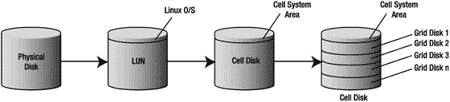
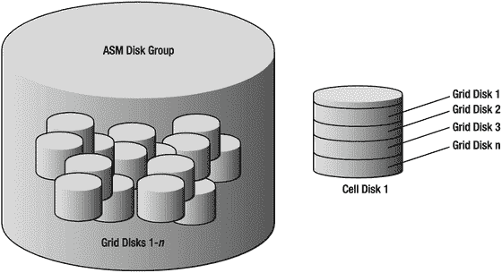
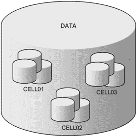
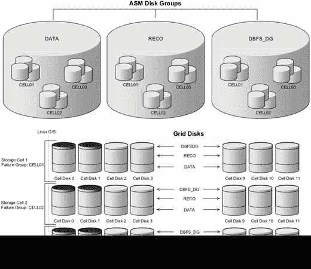
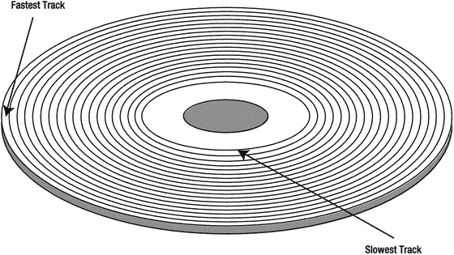
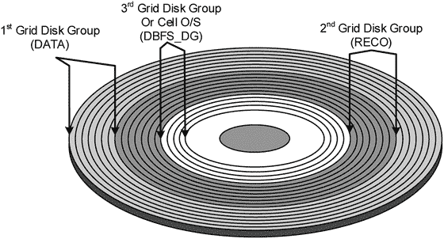
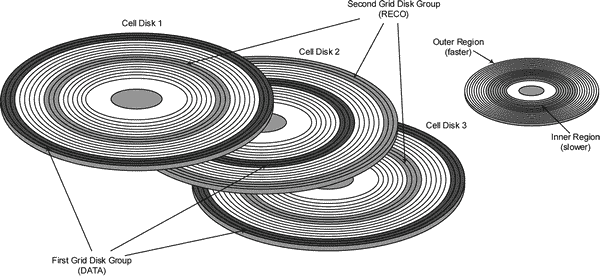
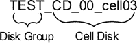

# 14. 存储布局

在 Oracle `10gR1` 中，Oracle 引入了 `自动存储管理 (ASM)`，并改变了我们思考数据库存储管理的方式。Exadata 是第一款完全依赖 `ASM` 来提供数据库存储的 Oracle 产品。没有 `ASM`，数据库根本无法利用 Exadata 存储服务器。因此，`ASM` 是运行 Exadata 的硬性要求。虽然 `ASM` 可能不是一项新技术，但存储服务器是在 Exadata 之前未曾使用过的概念。

乍一看，仔细研究单元存储的所有各种复杂性可能有点令人生畏。在物理磁盘和许多 `DBA` 熟悉的 `ASM` 磁盘组之间有几层抽象。如果你从未使用过 Oracle 的 `ASM` 产品，那里也会有很多新的术语和概念需要理解。在第 8 章中，我们讨论了 Exadata 存储的底层，从物理磁盘一直到单元磁盘层。本章将从第 8 章中断的地方继续，讨论如何使用单元磁盘为 `ASM` 存储创建网格磁盘。我们将简要讨论存储单元的底层磁盘架构以及 `Linux` 如何将物理磁盘呈现给应用层。然后，我们将看看将 Exadata 网格磁盘划分并呈现给数据库层的选项。Oracle 推荐的方法是在所有存储单元上创建几个大的磁盘“池”。虽然从性能角度来看这种方法通常效果很好，但有理由考虑替代策略。有时，隔离一组存储单元以形成单独的存储网格是可取的。这提供了与 Exadata 机箱内更关键系统的分离，以便可以安装补丁并在生产环境实施前进行测试。在此过程中，我们将看看 `ASM` 如何为数据库提供故障恢复能力和存储虚拟化。最后，我们将看看存储安全性在 Exadata 上是如何实现的。存储单元是硬件和软件的高度高性能、高度复杂且高度可配置的混合体。本章将仔细研究所有不同部分如何协同工作，为 Oracle 数据库提供灵活、高性能的存储。

## Exadata 磁盘架构

当 `Linux` 启动时，它会运行扫描以识别连接到服务器的磁盘。当找到磁盘时，操作系统会确定所需的设备驱动程序，并创建一个称为 `LUN` 的块设备供应用程序访问。虽然应用程序可以直接读写这些块设备，但这并不常见。这样做会使应用程序面临难以处理的变化。例如，由于设备名称是在启动时动态生成的，添加或更换磁盘可能导致所有磁盘设备名称发生变化。`ASM` 和数据库还需要设置文件权限，以允许对这些设备进行读/写访问。在早期的 `ASM` 版本中，系统管理员通过原生的 `Linux` 实用程序（如 `ASMLib` 和 `udev`）管理磁盘名称持久性。Exadata 通过各种抽象层为系统管理员和 `DBA` 屏蔽了这些复杂性。单元磁盘为 `LUN` 提供了第一层抽象。单元磁盘由 `cellsrv` 用于在存储单元管理 I/O 资源。网格磁盘是下一层抽象，是作为 `ASM` 磁盘呈现给数据库服务器的磁盘设备。图 14-1 展示了单元磁盘和网格磁盘如何融入 Exadata 存储单元的整体存储架构。



图 14-1.

物理磁盘与网格磁盘之间的关系

随着 `ASM` 的引入，Oracle 提供了一种将许多物理磁盘组合成一个称为磁盘组的单一存储卷的方法。磁盘组是 `ASM` 对传统文件系统的替代，用于实现 Oracle 的 `SAME`（条带化和镜像所有内容）方法论以优化磁盘性能。顾名思义，`SAME` 的目标是将 I/O 均匀地分布在从 `ASM` 实例可见的所有物理磁盘上。以这种方式虚拟化存储允许多个数据库共享相同的物理磁盘。它还允许在不中断数据库操作的情况下添加或移除物理磁盘。如果必须移除磁盘，`ASM` 会在其被删除之前将其数据迁移到磁盘组中的其他磁盘。当磁盘添加到磁盘组时，`ASM` 会自动将其他磁盘上的数据重新平衡到新磁盘上，以确保没有单个磁盘包含比其他磁盘更多的数据。在一个非常基础的 `ASM` 配置中，`LUN` 被作为 `ASM` 磁盘呈现给 `ASM`。`ASM` 磁盘随后用于创建磁盘组，而磁盘组又用于存储数据库文件，如数据文件、控制文件和联机重做日志。`Linux` 操作系统将 `LUN` 作为原生块设备（如 `/dev/sda`）呈现给 `ASM`。Exadata 通过使用网格磁盘和 `ASM` 磁盘组来实现物理存储的虚拟化。网格磁盘用于划分单元磁盘，类似于分区用于划分物理磁盘驱动器的方式。图 14-2 展示了单元磁盘、网格磁盘和 `ASM` 磁盘组之间的关系。需要记住的重要一点是，Exadata 上的 `ASM` 磁盘与标准系统上的 `ASM` 磁盘不同，因为它们并非物理挂载在数据库服务器上。Exadata 上的所有 `ASM` 磁盘都通过 `iDB` 协议访问。



图 14-2.

包含其底层网格磁盘和单元磁盘的 `ASM` 磁盘组


### 故障组

在深入探讨网格磁盘之前，我们先简要了解一下 ASM 架构中如何处理磁盘冗余。ASM 使用称为**故障组**的冗余磁盘集来提供镜像。传统的 RAID1 镜像维护原始磁盘的块级副本。ASM 故障组则通过将 ASM 磁盘分配到不同的故障组来提供冗余，并保证一个数据块的原始副本及其镜像副本不驻留在同一个故障组中。将物理磁盘分离到不同的故障组至关重要。

由于每个存储服务器都是一个独立的、可能随时发生故障的 Linux 系统，Exadata 将来自一个存储服务器的所有磁盘拆分为一个故障组。这确保了单台存储服务器上的两个磁盘永远不会包含同一数据块的两个副本。例如，下面的列表显示了存储单元 1-3 的故障组和网格磁盘。顾名思义，这些故障组对应于存储单元 1-3。这些故障组是在创建网格磁盘时由 ASM 自动创建和命名的。

```sql
SYS:+ASM1> select failgroup, name from v$asm_disk order by 1,2

FAILGROUP   NAME
----------- ----------------------
CELL01      DATA_CD_00_CELL01
CELL01      DATA_CD_01_CELL01
CELL01      DATA_CD_02_CELL01
CELL01      DATA_CD_03_CELL01
...
CELL02      DATA_CD_00_CELL02
CELL02      DATA_CD_01_CELL02
CELL02      DATA_CD_02_CELL02
CELL02      DATA_CD_03_CELL02
...
CELL03      DATA_CD_00_CELL03
CELL03      DATA_CD_01_CELL03
CELL03      DATA_CD_02_CELL03
CELL03      DATA_CD_03_CELL03
```

图 14-3 展示了 `DATA` 磁盘组与故障组 `CELL01`、`CELL02` 和 `CELL03` 之间的关系。请注意，这并不表示正在使用哪个级别的冗余，只表明 `DATA` 磁盘组的数据分配跨越了三个故障组。



图 14-3. ASM 故障组 CELL01–CELL03

ASM 中有三种冗余类型：外部、常规和高：

*   **外部冗余**：ASM 不提供冗余。假定存储阵列（通常是 SAN）提供了足够的冗余——在大多数情况下是 RAID1、RAID10 或 RAID5。在使用大型存储区域网络作为 ASM 存储时，这已成为最常用的方法。在 Exadata 存储网格中，ASM 提供了唯一的镜像机制。如果在 Exadata 上使用外部冗余，单个磁盘驱动器的丢失将意味着使用该磁盘的整个 ASM 磁盘组发生灾难性丢失。这也意味着即使是存储单元的临时丢失（重启、崩溃等）也会导致在故障单元上使用的所有磁盘组在停机期间不可用，并且可能需要进行数据库恢复。
*   **常规冗余**：常规冗余在不同的故障组中维护两个数据块副本。在 Oracle 12c 之前，数据库总是尝试首先从数据块的主副本读取。仅当主副本不可用或损坏时，才读取辅助副本。常规冗余至少需要两个故障组，但可以使用更多。例如，Exadata 全机架配置有 14 个存储单元，每个存储单元构成一个故障组。当数据写入数据库时，用于每个块主副本的故障组会以轮询方式在不同故障组间轮换。这确保了所有故障组中的磁盘都参与读取操作。
*   **高冗余**：高冗余类似于常规冗余，不同之处在于在不同的故障组中维护三个数据块副本。

为了使 ASM 能够正确跟踪数据主副本和辅助副本的位置，每个磁盘都有固定数量的伙伴磁盘，冗余副本可能位于这些伙伴磁盘上。默认情况下，每个磁盘将有八个伙伴。无论使用常规冗余还是高冗余，这个数字都是相同的。磁盘之间的伙伴关系可以通过查询 ASM 实例内部的 `x$kfdpartner` 视图来查看。例如，查看 `DATA` 磁盘组中的磁盘 0，我们可以看到它的八个伙伴磁盘：

```sql
SQL> select g.name "Diskgroup", d.disk_number "Number", d.name "Disk"
2  from v$asm_diskgroup g, v$asm_disk d
3  where g.group_number=d.group_number
4  and g.name='DATA'
5  and d.name='DATA_CD_00_ENKCEL01'
6  /

Diskgroup                           Number  Disk
------------------------------ ----------- -------------------
DATA                                     0  DATA_CD_00_ENKCEL01

SQL> select g.name "Diskgroup", d.name "Disk", p.number_kfdpartner "Partner", d.FAILGROUP "Failgroup"
2    from x$kfdpartner p, v$asm_disk d, v$asm_diskgroup g
3  where p.disk = 0
4  and g.name='DATA'
5  and p.grp=g.group_number
6  and d.group_number = g.group_number
7  and p.number_kfdpartner=d.disk_number
8  ORDER BY p.number_kfdpartner
9  /

Diskgroup                      Disk                               Partner  Failgroup
------------------------------ ------------------------------ ----------- ---------
DATA                           DATA_CD_02_ENKCEL02                     13  ENKCEL02
DATA                           DATA_CD_03_ENKCEL02                     14  ENKCEL02
DATA                           DATA_CD_06_ENKCEL02                     17  ENKCEL02
DATA                           DATA_CD_07_ENKCEL02                     18  ENKCEL02
DATA                           DATA_CD_05_ENKCEL03                     28  ENKCEL03
DATA                           DATA_CD_06_ENKCEL03                     29  ENKCEL03
DATA                           DATA_CD_08_ENKCEL03                     31  ENKCEL03
DATA                           DATA_CD_11_ENKCEL03                     34  ENKCEL03
```

伙伴磁盘在上面显示的四分之一机架中剩余的两个存储单元上均匀分布。每当 ASM 将数据的主副本放置在 `DATA_CD_00_ENKCEL01` 上时，辅助副本（或在高冗余磁盘组中的第三副本）将被放置在上述第二个查询列出的八个磁盘之一上。从磁盘故障的角度来看，伙伴关系至关重要。在常规冗余磁盘组中，只能有一个包含部分数据的磁盘处于离线状态。在高冗余磁盘组中，一个磁盘及其八个伙伴之一可以同时离线，因为存在数据的第三份副本。如果 ASM 无法访问任何数据副本，整个磁盘组将被脱机，以防止可能的数据丢失或损坏。

无论数据副本的数量是多少，Oracle ASM 在 11g 版本中只会从数据的主副本读取。如果磁盘故障，ASM 将寻找冗余副本。在 Oracle 12c 中，引入了一个“均衡读取”功能。在磁盘故障的情况下，ASM 将尝试通过读取所有数据的主副本和副本来保持磁盘 I/O 平衡，无论主副本的状态如何。


### Grid 磁盘

Grid 磁盘是在单元磁盘内创建的，您可能还记得，单元磁盘由物理磁盘组成。Grid 磁盘可以位于基于硬盘的单元磁盘上，也可以位于基于闪存的单元磁盘上。在简单配置中，每个单元磁盘可以创建一个 grid 磁盘。典型的配置是每个单元磁盘有多个 grid 磁盘。`CellCLI`命令`list griddisk`用于显示 grid 磁盘的各种特性。例如，下面的输出展示了 grid 磁盘与单元磁盘的关系、创建它们的设备类型及其大小：

```
[enkcel03:root] root

> cellcli

CellCLI: Release 11.2.1.3.1 - Production on Sat Oct 23 17:23:32 CDT 2010

Copyright (c) 2007, 2009, Oracle. All rights reserved.

Cell Efficiency Ratio: 20M

CellCLI> list griddisk attributes name, celldisk, disktype, size

DATA_CD_00_cell03       CD_00_cell03    HardDisk        1282.8125G

DATA_CD_01_cell03       CD_01_cell03    HardDisk        1282.8125G

...

FLASH_FD_00_cell03      FD_00_cell03    FlashDisk       4.078125G

FLASH_FD_01_cell03      FD_01_cell03    FlashDisk       4.078125G

...
```

`ASM`并不知晓物理磁盘或单元磁盘。Grid 磁盘是存储单元呈现给数据库服务器（作为`ASM`磁盘）用于 Clusterware 和数据库存储的资源。`ASM`使用 grid 磁盘创建磁盘组，其方式与在非 Exadata 平台上使用传统块设备相同。为了说明这一点，下面的查询显示了非 Exadata 系统上`ASM`磁盘的外观：

```
SYS:+ASM1> select path, total_mb, failgroup

from v$asm_disk

order by failgroup, group_number, path;

PATH              TOTAL_MB FAILGROUP

--------------- ---------- ---------

/dev/sdd1            11444 DATA01

/dev/sde1            11444 DATA02

...

/dev/sdj1             3816 RECO01

/dev/sdk1             3816 RECO02

...
```

在 Exadata 上执行相同的查询，则会报告已在存储单元创建的 grid 磁盘：

```
SYS:+ASM1> select path, total_mb, failgroup

from v$asm_disk

order by failgroup, group_number, path;

PATH                                                            TOTAL_MB  FAILGROUP

------------------------------------------------------------    --------  ----------

o/192.168.12.9;192.168.12.10/DATA_CD_00_CELL01                  3023872   CELL01

o/192.168.12.9;192.168.12.10/DATA_CD_01_CELL01                  3023872   CELL01

o/192.168.12.9;192.168.12.10/DATA_CD_02_CELL01                  3023872   CELL01

...

o/192.168.12.9;192.168.12.10/RECO_CD_00_CELL01                  756160    CELL01

o/192.168.12.9;192.168.12.10/RECO_CD_01_CELL01                  756160    CELL01

o/192.168.12.9;192.168.12.10/RECO_CD_02_CELL01                  756160    CELL01

...

o/192.168.12.11;192.168.12.12/DATA_CD_00_CELL02                 3023872   CELL02

o/192.168.12.11;192.168.12.12/DATA_CD_01_CELL02                 3023872   CELL02

o/192.168.12.11;192.168.12.12/DATA_CD_02_CELL02                 3023872   CELL02

...

o/192.168.12.11;192.168.12.12/RECO_CD_00_CELL02                 756160    CELL02

o/192.168.12.11;192.168.12.12/RECO_CD_01_CELL02                 756160    CELL02

o/192.168.12.11;192.168.12.12/RECO_CD_02_CELL02                 756160    CELL02

...

o/192.168.12.13;192.168.12.14/DATA_CD_00_CELL03                 3023872   CELL03

o/192.168.12.13;192.168.12.14/DATA_CD_01_CELL03                 3023872   CELL03

o/192.168.12.13;192.168.12.14/DATA_CD_02_CELL03                 3023872   CELL03

...

o/192.168.12.13;192.168.12.14/RECO_CD_00_CELL03                 756160    CELL03

o/192.168.12.13;192.168.12.14/RECO_CD_01_CELL03                 756160    CELL03

o/192.168.12.13;192.168.12.14/RECO_CD_02_CELL03                 756160    CELL03

...

o/192.168.12.15;192.168.12.16/DATA_CD_00_CELL04                 3023872   CELL04

o/192.168.12.15;192.168.12.16/DATA_CD_01_CELL04                 3023872   CELL04

o/192.168.12.15;192.168.12.16/DATA_CD_02_CELL04                 3023872   CELL04

...

o/192.168.12.15;192.168.12.16/RECO_CD_00_CELL04                 756160    CELL04

o/192.168.12.15;192.168.12.16/RECO_CD_01_CELL04                 756160    CELL04

o/192.168.12.15;192.168.12.16/RECO_CD_02_CELL04                 756160    CELL04

...

o/192.168.12.17;192.168.12.18/DATA_CD_00_CELL05                 3023872   CELL05

o/192.168.12.17;192.168.12.18/DATA_CD_01_CELL05                 3023872   CELL05

o/192.168.12.17;192.168.12.18/DATA_CD_01_CELL06                 3023872   CELL05

...

o/192.168.12.17;192.168.12.18/RECO_CD_00_CELL05                 756160    CELL05

o/192.168.12.17;192.168.12.18/RECO_CD_01_CELL05                 756160    CELL05

o/192.168.12.17;192.168.12.18/RECO_CD_02_CELL05                 756160    CELL05

...
```

将所有内容结合起来，图 14-4 展示了从存储单元到`ASM`磁盘组的各层存储是如何组合在一起的。请注意，每个存储单元的前两个单元磁盘上的 Linux 操作系统分区由一个深色分区标识。我们将在本章稍后及第 8 章中更详细地讨论操作系统分区。



*图 14-4. Exadata 上的存储*

### 存储分配

磁盘驱动器将数据存储在称为磁道的同心环带中。由于磁盘的外圈磁道具有更大的表面积，因此它们能够比内圈磁道存储更多数据。因此，外圈磁道的数据传输速率更高，并随着向最内圈磁道移动而略有下降。图 14-5 展示了磁道从最快到最慢在磁盘表面的布局。



*图 14-5. 磁盘磁道*

Exadata 提供了两种策略，用于在磁盘驱动器表面分配 grid 磁盘存储空间。第一种方法是分配单元磁盘空间的默认行为。它没有官方名称，因此为了本次讨论的目的，我将其称为默认策略。Oracle 将另一种分配策略称为交错分配。这两种分配策略在创建单元磁盘时确定。必须使用`create celldisk`命令的`interleaving`参数显式启用交错分配。关于创建单元磁盘的完整讨论，请参阅第 8 章。


#### 创建网格磁盘

## 最快磁道优先

默认策略只是简单地从最快的可用磁道开始分配空间，随着空间的消耗向内移动。使用此策略时，在每个单元磁盘上创建的第一个网格磁盘将获得最快的存储，而创建的最后一个网格磁盘将被分配到磁盘表面较慢的内侧磁道。在规划存储网格时，请记住，网格磁盘是 ASM 磁盘组的构建块。这些磁盘组随后将用于存储表、索引、联机重做日志、归档重做日志等。为了最大化数据库性能，频繁访问的对象（如表、索引和联机重做日志）应存储在最高优先级的网格磁盘中。低优先级的网格磁盘应用于性能敏感性较低的对象，如数据库备份、归档重做日志和闪回日志。图 14-6 展示了使用默认分配策略时网格磁盘是如何分配的。



图 14-6. 默认分配策略

表 14-1 展示了使用默认分配策略时，从第一个到最后一个创建的网格磁盘对 ASM 磁盘组性能的影响。你在 Oracle 文档中找不到“I/O 性能评级”这个术语。这是我在此创造的一个术语，用于描述由于在物理磁盘驱动器表面的位置不同，每个磁盘组所具有的相对性能能力。

表 14-1. I/O 性能 — 默认分配策略

| ASM 磁盘组 | I/O 性能评级 |
| --- | --- |
| `DATA` | 1 |
| `RECO` | 2 |
| `DBFS_DG` | 3 |

## 交错

另一种策略是交错，它试图通过在磁盘的慢速和快速磁道之间交替分配空间，来平衡快速和慢速磁道的性能。这是通过将每个单元磁盘分成两个区域来实现的——外部区域和内部区域。网格磁盘是单元磁盘的切片，将用于创建 ASM 磁盘组。例如，以下命令在 `Cell03` 上创建 12 个网格磁盘（每个物理磁盘一个；参见图 14-4），用于 `DATA` 磁盘组：

```
CellCLI> CREATE GRIDDISK ALL HARDDISK PREFIX=DATA, size=744.6813G
```

这些网格磁盘被用来创建以下 `DATA` 磁盘组。请注意每个网格磁盘是如何创建在单独的单元磁盘上的：

```
SYS:+ASM2> select dg.name diskgroup,
                  substr(d.name, 6,12) cell_disk,
                  d.name grid_disk
             from v$asm_diskgroup dg,
                  v$asm_disk d
           where dg.group_number = d.group_number
             and dg.name =’DATA’
             and failgroup = ’CELL03’
           order by 1,2;
DISKGROUP   CELL_DISK     GRID_DISK
----------  ------------  ---------------------
DATA        CD_00_CELL03  DATA_CD_00_CELL03
DATA        CD_01_CELL03  DATA_CD_01_CELL03
DATA        CD_02_CELL03  DATA_CD_02_CELL03
DATA        CD_03_CELL03  DATA_CD_03_CELL03
...
DATA        CD_10_CELL03  DATA_CD_10_CELL03
DATA        CD_11_CELL03  DATA_CD_11_CELL03
```

在此示例中使用交错策略，`DATA_CD_00_CELL03`（第一个网格磁盘）被分配到 `CD_00_CELL03` 单元磁盘外部（最快）区域的最外侧磁道。下一个网格磁盘 `DATA_CD_01_CELL03` 则创建在单元磁盘 `CD_01_CELL03` 较慢的内部区域的最外侧磁道上。此模式持续直到所有 12 个网格磁盘分配完毕。当下一组为 `RECO` 磁盘组创建网格磁盘时，它们从单元磁盘 1 的内部区域开始，并在内部和外部区域之间交替，直到所有 12 个网格磁盘创建完毕。图 14-7 展示了如果创建了两个网格磁盘组，交错策略会是什么样子。



图 14-7. 交错分配策略

表 14-2 展示了使用交错分配策略时，从第一个到最后一个创建的网格磁盘对 ASM 磁盘组性能的影响。

表 14-2. I/O 性能 — 交错策略

| ASM 磁盘组 | I/O 性能评级 |
| --- | --- |
| `DATA` | 1 |
| `RECO` | 1 |
| `DBFS_DG` | 2 |

正如你所见，默认策略和交错策略的主要区别在于，默认策略提供了对 ASM 磁盘更细粒度的控制。使用默认策略，你可以选择哪一组网格磁盘获得磁盘上绝对最快的位置。交错策略的效果是均衡网格磁盘的性能。在实践中，这使得前两组网格磁盘（用于 `DATA` 和 `RECO`）具有相同的性能特性。如果前两个磁盘组的性能需求相等，这可能很有用。但根据我们的经验，这种情况很少见。通常，当涉及数据库环境的性能需求时，会有一个明确的优胜者。表、索引和联机重做日志（`DATA` 磁盘组）的性能要求远高于通常存储在 `RECO` 磁盘组中的数据库备份、归档重做日志和闪回日志。除非有特定的理由使用交错策略，否则我们建议使用默认策略。

在我们介绍几个如何创建网格磁盘的示例之前，让我们快速了解一下它们的一些关键属性：

*   可以在单个单元磁盘上创建多个网格磁盘，但一个网格磁盘不能跨多个单元磁盘。
*   网格磁盘的存储以 16M 分配单元为单位进行分配，如果请求的大小不是分配单元大小的倍数，则会向下舍入。
*   网格磁盘可以一次创建一个，也可以使用共同的名称前缀成组创建。
*   网格磁盘名称在存储单元内必须是唯一的，并且应在所有存储单元中保持唯一。
*   网格磁盘名称应包含其所在单元磁盘的名称。

一旦创建了网格磁盘，其名称就可以通过 ASM 的 `V$ASM_DISK` 视图可见。换句话说，网格磁盘 = ASM 磁盘。以能够轻松关联到其所属物理磁盘的方式命名网格磁盘非常重要，尤其是在发生磁盘故障时。为了便于做到这一点，网格磁盘名称应包含以下两项：

*   它将要使用的 ASM 磁盘组的名称
*   单元磁盘名称（其中包含存储单元的名称）

图 14-8 展示了一个属于 `TEST` 磁盘组、创建在单元磁盘 `CD_00_cell03` 上的网格磁盘的规范命名格式。



图 14-8. 网格磁盘命名


#### 创建网格磁盘

`CellCLI`命令`create griddisk`用于创建网格磁盘。它可以一次创建一个单独的网格磁盘，也可以成组创建。如果一次创建一个网格磁盘，您需要提供完整的网格磁盘名称。以下示例在单元格磁盘`CD_00_cell03`上创建一个命名正确的 400GB 网格磁盘。如果我们省略了`size=400GB`参数，生成的网格磁盘将占用单元格磁盘上的所有可用空间：

```
CellCLI> create griddisk TEST_CD_00_cell03 –
           celldisk=’CD_00_cell03’, size=400G
GridDisk TEST_CD_00_cell03 successfully created

CellCLI> list griddisk attributes name, celldisk, size –
           where name=’TEST_CD_00_cell03’
         TEST_CD_00_cell03       CD_00_cell03    400G
```

每个存储单元有 12 个驱动器，存储单元的数量从四分之一机架的 3 个到满配机架的 14 个不等。这意味着您将为四分之一机架创建至少 36 个网格磁盘，最多为满配机架创建 168 个网格磁盘。幸运的是，`CellCLI`提供了一种方式，可以用一条命令为给定的 ASM 磁盘组创建所有需要的网格磁盘。例如，以下命令为 ASM 磁盘组`TEST`创建所有网格磁盘：

```
CellCLI> create griddisk all harddisk prefix=’TEST’, size=400G
GridDisk TEST_CD_00_cell03 successfully created
GridDisk TEST_CD_01_cell03 successfully created
...
GridDisk TEST_CD_10_cell03 successfully created
GridDisk TEST_CD_11_cell03 successfully created
```

当使用这种变体的`create griddisk`命令时，`CellCLI`会自动在每个单元格磁盘上创建一个网格磁盘，并使用您提供的前缀按以下方式命名：
`{prefix}` `_` `{celldisk_name}`

可选的`size`参数指定每个单独网格磁盘的大小。如果不提供大小，生成的网格磁盘将占用其各自单元格磁盘的所有剩余可用空间。`all harddisk`参数指示`CellCLI`仅使用基于磁盘的单元格磁盘。如果您好奇，闪存缓存模块也作为单元格磁盘（类型为`FlashDisk`）呈现，也可以用于创建网格磁盘。我们将在本章后面讨论闪存磁盘。以下命令显示了创建的网格磁盘：

```
CellCLI> list griddisk attributes name, cellDisk, diskType, size -
           where name like ’TEST_.*’
         TEST_CD_00_cell03       CD_00_cell03     HardDisk        96M
         TEST_CD_01_cell03       CD_01_cell03     HardDisk        96M
          ...
         TEST_CD_10_cell03       CD_10_cell03     HardDisk        96M
         TEST_CD_11_cell03       CD_11_cell03     HardDisk        96M
```

#### 网格磁盘大小调整

正如我们前面讨论的，网格磁盘等同于 ASM 磁盘。它们本质上是您将创建的 ASM 磁盘组的构建块。`DBFS_DG`磁盘组是在站点上安装 Exadata 时创建的。它主要用于存储 Oracle Clusterware（Grid Infrastructure）使用的 OCR 和投票文件。然而，没有理由`DBFS_DG`不能用于存储其他对象，例如用于数据库文件系统（DBFS）的表空间。除了`DBFS_DG`（以前是`SYSTEMDG`）磁盘组外，Exadata 还提供了`DATA`和`RECO`磁盘组，用于数据库文件和快速恢复区。但是这些磁盘组实际上可以使用任何对您的环境最有意义的名称来创建。为保持一致性，本章使用名称`DBFS_DG`、`DATA`和`RECO`。如果您正在考虑为磁盘组配置使用“工厂默认值”以外的其他配置，请记住，在 Exadata 上使用多个 ASM 磁盘组的一个主要原因是为了优先考虑 I/O 性能。您首先创建的网格磁盘将是最快的，从而为关联的 ASM 磁盘组带来更高的性能。

#### 注意

当 Exadata V2 推出时，`SYSTEMDG`是用于存储 Oracle Clusterware 的 OCR 和投票文件的磁盘组。当 Exadata X2 推出时，该磁盘组被重命名为`DBFS_DG`，可能是因为有相当多的可用空间剩余，非常适合作为一个中等规模的 DBFS 文件系统的存储位置。此外，当 X2 推出时，其他默认磁盘组名称也发生了一些变化。Exadata 数据库机器名称被添加为`DATA`和`RECO`磁盘组名称的后缀。例如，我们其中一个实验室系统的机器名称是`ENK`。所以`DATA`变成了`DATA_ENK`，`RECO`变成了`RECO_ENK`。

顺便说一下，Oracle 建议您为 DBFS 创建一个单独的数据库，因为它需要的实例参数设置对于典型的应用程序数据库来说不是最优的。

以下是一些最常见的 ASM 磁盘组：
*   `DBFS_DG`：此磁盘组通常是 Clusterware 的 OCR 和投票文件的存储位置，以及 ASM 的 spfile。它也可用于具有类似性能要求的其他文件。对于 OCR 和投票文件，普通冗余是最低要求。普通冗余将创建三个投票文件和三个 OCR 文件。投票文件必须存储在单独的 ASM 故障组中。回想一下，在 Exadata 上，每个存储单元构成一个故障组。这意味着对于 Exadata 八分之一或四分之一机架配置（三个存储单元/故障组），只能使用普通冗余。只有在半机架和满配机架配置（七个或十四个存储单元/故障组）中，才有足够数量的故障组来存储高冗余所需的投票和 OCR 文件数量。表 14-3 总结了在不同冗余级别下 OCR 和投票文件的存储要求。请注意，外部冗余在 Exadata 上不受支持。我们将其包含在表中仅供参考。如果存在具有足够数量故障组的高冗余磁盘组，脚本化安装过程会将 OCR 和投票磁盘移至该磁盘组。

表 14-3. OCR 和投票文件存储要求
| 冗余级别 | 最少磁盘数 | OCR | 投票 | 总计 |
| --- | --- | --- | --- | --- |
| 外部 | 1 | 400 MB | 300 MB | 700 MB |
| 普通 | 3 | 800 MB | 900 MB | 1.7 GB |
| 高 | 5 | 1.2 GB | 1.5 GB | 2.7 GB |


