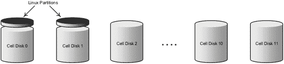

# Exadata 存储配置：磁盘组与网格磁盘

## 磁盘组用途

*   `DATA`：此磁盘组用于存储与 `db_create_file_dest` 数据库参数相关的文件。这些文件包括数据文件、在线重做日志、控制文件和服务器参数文件（spfile）。
*   `RECO`：此磁盘组即过去所称的闪回恢复区（Flash Recovery Area， FRA）。在 11gR1 之后的某个时间，Oracle 将其重命名为“快速恢复区”（Fast Recovery Area）；有传言称这是因为过度使用“Flash”一词导致营销团队感到困惑。为明确起见，此磁盘组用于存储与 `db_recovery_file_dest` 数据库参数对应的所有内容，包括在线数据库备份和副本、在线重做日志文件副本、控制文件镜像副本、归档重做日志、闪回日志和 Data Pump 导出文件。

## 存储单元磁盘布局

回想一下，Exadata 存储单元实际上是经过精细调优的 Linux 服务器，配备 12 个内置硬盘驱动器。Oracle 本可以专门用其中两个内置磁盘来运行操作系统，但这样做会浪费大量空间。相反，他们在机箱的前两个磁盘上划分了几个小分区。这些分区每个约 33GB，造成了单元磁盘（Cell Disk）大小的轻微不平衡。`DBFS_DG` 网格磁盘（Grid Disk）则用于平衡这种不平衡。图 14-9 说明了这种大小不平衡。



**图 14-9. 单元磁盘布局**

此保留空间可以通过在某个存储单元上运行 `parted` 命令来查看。列表中的 `/dev/sda3` 分区是单元磁盘的位置。所有其他分区均由 Linux 操作系统使用：

```
[root@enkx3cel01 ∼]# parted /dev/sda print
Model: LSI MR9261-8i (scsi)
Disk /dev/sda: 3000GB
Sector size (logical/physical): 512B/512B
Partition Table: gpt
Number  Start   End     Size    File system  Name     Flags
1      32.8kB  123MB   123MB   ext3         primary  raid
2      123MB   132MB   8225kB  ext2         primary
3      132MB   2964GB  2964GB               primary
4      2964GB  2964GB  32.8kB               primary
5      2964GB  2975GB  10.7GB  ext3         primary  raid
6      2975GB  2985GB  10.7GB  ext3         primary  raid
7      2985GB  2989GB  3221MB  ext3         primary  raid
8      2989GB  2992GB  3221MB  ext3         primary  raid
9      2992GB  2994GB  2147MB  linux-swap   primary  raid
10      2994GB  2995GB  732MB                primary  raid
11      2995GB  3000GB  5369MB  ext3         primary  raid
```

当运行 `list celldisk` 命令时，可以在 `size` 属性中看到较小的单元磁盘：

```
CellCLI> list celldisk attributes name, devicePartition, size –
         where diskType = ’HardDisk’
CD_00_cell01    /dev/sda3       2760.15625G
CD_01_cell01    /dev/sdb3       2760.15625G
CD_02_cell01    /dev/sdc        2793.953125G
CD_03_cell01    /dev/sdd        2793.953125G
CD_04_cell01    /dev/sde        2793.953125G
CD_05_cell01    /dev/sdf        2793.953125G
CD_06_cell01    /dev/sdg        2793.953125G
CD_07_cell01    /dev/sdh        2793.953125G
CD_08_cell01    /dev/sdi        2793.953125G
CD_09_cell01    /dev/sdj        2793.953125G
CD_10_cell01    /dev/sdk        2793.953125G
CD_11_cell01    /dev/sdl        2793.953125G
```

## 网格磁盘配置示例

让我们看一个相当典型的配置，来说明如何在存储单元中分配网格磁盘。在此示例中，我们将创建网格磁盘以支持三个 ASM 磁盘组。`DBFS_DG` 将用于 OCR 和 Voting 文件：

*   `DATA`
*   `RECO`
*   `DBFS_DG`

此存储单元配置了 3TB 大小、高容量的磁盘，因此每个存储单元的原始空间为 33.45TB。具有更大磁盘大小的新机型会将额外的空间分配在 `DATA` 和 `RECO` 网格磁盘之间。表 14-4 展示了分配情况。

**表 14-4. I/O 网格磁盘空间分配（所有大小以千兆字节表示）**

| 单元磁盘 | 操作系统 | DATA | DBFS_DG | RECO | 网格磁盘总空间 |
| :--- | :--- | :--- | :--- | :--- | :--- |
| `CD_00_cel01` | 33.796875 | 2607 | 不适用 | 1084.4375 | 3691.4375 |
| `CD_01_cel01` | 33.796875 | 2607 | 不适用 | 1084.4375 | 3691.4375 |
| `CD_02_cel01` | 不适用 | 2607 | 33.796875 | 1084.4375 | 3725.234375 |
| `CD_03_cel01` | 不适用 | 2607 | 33.796875 | 1084.4375 | 3725.234375 |
| `CD_04_cel01` | 不适用 | 2607 | 33.796875 | 1084.4375 | 3725.234375 |
| `CD_05_cel01` | 不适用 | 2607 | 33.796875 | 1084.4375 | 3725.234375 |
| `CD_06_cel01` | 不适用 | 2607 | 33.796875 | 1084.4375 | 3725.234375 |
| `CD_07_cel01` | 不适用 | 2607 | 33.796875 | 1084.4375 | 3725.234375 |
| `CD_08_cel01` | 不适用 | 2607 | 33.796875 | 1084.4375 | 3725.234375 |
| `CD_09_cel01` | 不适用 | 2607 | 33.796875 | 1084.4375 | 3725.234375 |
| `CD_10_cel01` | 不适用 | 2607 | 33.796875 | 1084.4375 | 3725.234375 |
| `CD_11_cel01` | 不适用 | 2607 | 33.796875 | 1084.4375 | 3725.234375 |
| **单元总计** | **67.59** | **31,284** | **337.97** | **13,013.25** | **44,635.22** |

创建这样的配置相当简单。以下命令根据表 14-4 中的分配创建网格磁盘：

```
CellCLI> create griddisk all prefix=’DATA’ size=2607G
CellCLI> create griddisk all prefix=’RECO’ size=1084.4375G
CellCLI> create griddisk all prefix=’DBFS_DG’
```

注意，未为 `DBFS_DG` 网格磁盘指定大小。当未指定大小时，`CellCLI` 会自动计算每个网格磁盘的大小，使其消耗单元磁盘上的剩余可用空间。例如：

```
CellCLI> list griddisk attributes name, size
DATA_CD_00_cell01       2607G
DATA_CD_01_cell01       2607G
DATA_CD_02_cell01       2607G
...
RECO_CD_00_cell01       1084.4375G
RECO_CD_01_cell01       1084.4375G
RECO_CD_02_cell01       1084.4375G
...
DBFS_DG_CD_02_cell01    33.796875G
DBFS_DG_CD_03_cell01    33.796875G
DBFS_DG_CD_04_cell01    33.796875G
...
```


### 创建基于闪存盘的网格磁盘

Exadata 利用智能扫描等卸载功能，为通常在 DSS 数据库中出现的直接路径读取提供惊人的快速 I/O。这些功能仅针对数据库中非常特定的数据访问路径激活。为了加速随机读取的 I/O 性能，Exadata V2 引入了闪存缓存，这是一种基于固态、由存储支持的缓存。在 X4-2 型号中，每个存储节点都配置了四块 `3.2T` 的闪存缓存卡（`2,978G` 可用），以提升对频繁访问数据的 I/O 性能。当配置为 Exadata 智能闪存缓存时，这些设备就像是存储节点的一个大型、数据库感知的磁盘缓存。我们在第 5 章中详细讨论过这一点。

可选地，可以从闪存缓存中划出部分空间，用作高速固态磁盘。闪存缓存被配置为 `FlashDisk` 类型的单元磁盘，并且正如网格磁盘是在 `HardDisk` 单元磁盘上创建的一样，它们也可以在 `FlashDisk` 单元磁盘上创建。当 `FlashDisk` 用于数据库存储时，主要是为了在基于磁盘的存储无法跟上时，提升高度写密集型工作负载的性能。随着写回式闪存缓存的出现，对基于闪存的网格磁盘的需求已大大减少。

可以使用 CellCLI 的 `list celldisk` 命令查看 `FlashDisk` 单元磁盘，如下例所示：

```
CellCLI> list celldisk attributes name, diskType, size

CD_00_cel01    HardDisk        3691.484375G
CD_01_cel01    HardDisk        3691.484375G
CD_02_cel01    HardDisk        3725.28125G
...
CD_11_cel01    HardDisk        3725.28125G
FD_00_cel01    FlashDisk       186.25G
FD_01_cel01    FlashDisk       186.25G
...
FD_15_cel01    FlashDisk       186.25G
```

`FlashDisk` 类型的单元磁盘以 `FD` 为前缀命名，其 `diskType` 为 `FlashDisk`。不建议将所有闪存缓存空间都用于网格磁盘。创建闪存缓存时，请使用 `size` 参数保留部分空间用于网格磁盘。以下命令创建了一个 `512GB` 的闪存缓存，并将剩余空间保留给网格磁盘（以下示例来自 X3-2 Exadata）：

```
CellCLI> create flashcache all size=512G
Flash cache cel01_FLASHCACHE successfully created
```

请注意，`create flashcache` 命令使用 `size` 参数的方式与 `create griddisk` 命令不同。创建闪存缓存时，`size` 参数决定了缓存的总体大小：

```
CellCLI> list flashcache detail
name:                   cel01_FLASHCACHE
cellDisk:               FD_11_cel01,FD_03_cel01,FD_07_cel01, ...
...
size:                   512G
status:                 normal
```

```
CellCLI> list celldisk attributes name, size, freespace –
> where disktype='FlashDisk'
FD_00_cel01    22.875G         4.078125G
FD_01_cel01    22.875G         4.078125G
...
FD_15_cel01    22.875G         4.078125G
```

现在我们可以使用熟悉的 `create griddisk` 命令，在闪存盘剩余的可用空间上创建 16 个网格磁盘。这次我们将指定使用 `flashdisk` 作为单元磁盘：

```
CellCLI> create griddisk all flashdisk prefix='RAMDISK'
GridDisk RAMDISK_FD_00_cel01 successfully created
...
GridDisk RAMDISK_FD_14_cel01 successfully created
GridDisk RAMDISK_FD_15_cel01 successfully created
```

```
CellCLI> list griddisk attributes name, diskType, size –
> where disktype='FlashDisk'
RAMDISK_FD_00_cel01    FlashDisk       4.078125G
RAMDISK_FD_01_cel01    FlashDisk       4.078125G
...
RAMDISK_FD_15_cel01    FlashDisk       4.078125G
```

一旦创建了网格磁盘，就可以用它们来创建 ASM 磁盘组，用于存储数据库对象，就像使用任何其他基于磁盘的磁盘组一样。闪存缓存配置的妙处在于，所有这些操作都可以在系统在线并处理 I/O 请求时完成。我们刚刚用来删除和重新配置闪存缓存的所有命令，都无需禁用或关闭数据库或单元服务。

### 存储策略

每个 Exadata 存储节点都是一个智能的小型 SAN，其运行在某种程度上独立于机架中的其他节点。这或许有点扩展了 SAN 的定义，但由于 Cell Server 软件智能地控制 I/O 访问，我们认为这是合适的。

存储节点可以配置为，机架中的所有节点为机架中的所有数据库提供存储。这为系统中的每个数据库提供了最大的 I/O 性能和数据传输速率。计算节点也可以配置为使用 `cellip.ora` 文件与特定的单元服务器通信。此外，可以使用单元安全性，通过存储域的使用来限制对特定数据库或 ASM 实例的访问。

在本节中，我将讨论将节点分组以服务某些数据库服务器或 RAC 集群的策略。借用 SAN 领域的一个熟悉术语，这里我们将讨论如何对一组存储节点进行“分区”，以服务开发、测试和生产环境。虽然这两种选项对 Exadata 管理员都可用，但“隔离存储节点访问”中描述的方法在 Exadata 环境中更为常见。

### 配置选项

对大多数公司而言，Exadata 代表着一项重大投资。出于这样或那样的原因，我们发现许多公司希望购买一个全机架或半机架来整合多个数据库环境。Exadata 的架构使其成为一个非常好的整合平台。以下是我们见过的一些最常见配置：

*   一个全机架服务开发、测试和生产
*   一个全机架服务多个独立的生产环境
*   一个半机架服务开发和测试
*   隔离一个临时环境供 DBA 测试和部署软件补丁

对于这些配置中的每一个，将 I/O 隔离到特定的数据库服务器可能是一个关键考虑因素。例如，您的公司可能托管着外部客户的数据库环境，这些环境需要与其他数据库系统分离。或者您的公司可能有法律要求，需要对服务器访问数据进行隔离。在节点级别进行存储细分的另一个原因，可能是为 DBA 培训或测试软件补丁提供环境。

有两种方法可以隔离 Exadata 存储节点——通过网络访问和通过存储域。根据现场经验，限制数据库服务器和存储节点之间访问的最常用方法是下文描述的第一种方法。


### 隔离存储单元访问

回想一下，ASM 通过 InfiniBand 网格访问网格磁盘。这是通过在 `cellip.ora` 文件中添加存储单元的 IP 地址来配置的。例如，在一个满配机架中，所有 14 个存储单元列举如下：

```
[enkdb02:oracle:EXDB2] /home/oracle
> cat /etc/oracle/cell/network-config/cellip.ora
cell="192.168.10.17;192.168.10.18"
cell="192.168.10.19;192.168.10.20"
cell="192.168.10.21;192.168.10.22"
cell="192.168.10.23;192.168.10.24"
cell="192.168.10.25;192.168.10.26"
cell="192.168.10.27;192.168.10.28"
cell="192.168.10.29;192.168.10.30"
cell="192.168.10.31;192.168.10.32"
cell="192.168.10.33;192.168.10.34"
cell="192.168.10.35;192.168.10.36"
cell="192.168.10.37;192.168.10.38"
cell="192.168.10.39;192.168.10.40"
cell="192.168.10.41;192.168.10.42"
cell="192.168.10.43;192.168.10.44"
```

上面的例子来自一个具有主动-主动 InfiniBand 链路的满配 X4-2 Exadata。每一行定义了一个存储单元。当 ASM 启动时，它会查询这些 IP 地址上的存储单元，以寻找可用于配置 ASM 磁盘组的网格磁盘。我们可以通过移除不应使用的存储单元 IP 地址来轻松地将存储单元隔离以服务特定的数据库服务器。显然，这并非由任何安全机制强制执行，但它是一种将数据库服务器与它们应使用的存储单元配对起来的、简单有效的方法。表 `[14-5]` 展示了一个将满配机架划分为两个独立数据库和存储网格的配置。生产环境配置了六台数据库服务器和十一个存储单元，而测试环境配置了两台数据库服务器和三个存储单元。

表 14-5. 一种存储网络配置

| 生产数据库服务器，1-6 | 生产存储单元，1-11 |
| --- | --- |
| `/etc/oracle/cell/network-config/cellip.ora` |
| `cell="192.168.10.17;192.168.10.18"` | `dm01cel01  192.168.10.17;192.168.10.18` |
| `cell="192.168.10.19;192.168.10.20"` | `dm01cel02  192.168.10.19;192.168.10.20` |
| `cell="192.168.10.21;192.168.10.22"` | `dm01cel03  192.168.10.21;192.168.10.22` |
| `cell="192.168.10.23;192.168.10.24"` | `dm01cel04  192.168.10.23;192.168.10.24` |
| `cell="192.168.10.25;192.168.10.26"` | `dm01cel05  192.168.10.25;192.168.10.26` |
| `cell="192.168.10.27;192.168.10.28"` | `dm01cel06  192.168.10.27;192.168.10.28` |
| `cell="192.168.10.29;192.168.10.30"` | `dm01cel07  192.168.10.29;192.168.10.30` |
| `cell="192.168.10.31;192.168.10.32"` | `dm01cel08  192.168.10.31;192.168.10.32` |
| `cell="192.168.10.33;192.168.10.34"` | `dm01cel09  192.168.10.33;192.168.10.34` |
| `cell="192.168.10.35;192.168.10.36"` | `dm01cel10  192.168.10.35;192.168.10.36` |
| `cell="192.168.10.37;192.168.10.38"` | `dm01cel11  192.168.10.37;192.168.10.38` |
| 测试数据库服务器，7-8 | 测试存储单元，12-14 |
| `/etc/oracle/cell/network-config/cellip.ora` |
| `cell="192.168.10.39;192.168.10.40"` | `dm01cel12  192.168.10.39;192.168.10.40` |
| `cell="192.168.10.41;192.168.10.42"` | `dm01cel13  192.168.10.41;192.168.10.42` |
| `cell="192.168.10.43;192.168.10.44"` | `dm01cel14  192.168.10.43;192.168.10.44` |

数据库服务器和存储单元可以根据您的特定需求，以任何最佳组合进行配对。请记住，在 Exadata 上运行 Oracle RAC 的最低要求是两台数据库服务器和三个存储单元，这基本上是一个四分之一机架的配置。表 `[14-6]` 显示了 Exadata 存储单元在四分之一机架、半机架和满配机架配置下的存储和性能能力。

表 14-6. Exadata 存储单元的性能能力（Exadata X4-2）

| 按设备类型划分的 MBPS 和 IOPS | 八分之一机架 | 四分之一机架 | 半机架 | 满配机架 |
| --- | --- | --- | --- | --- |
| 磁盘传输带宽 |   |   |   |   |
| 高性能 | 2.6 GB/s | 5.2 GB/s | 12 GB/s | 24 GB/s |
| 高容量 | 2.25 GB/s | 4.5 GB/s | 10 GB/s | 20 GB/s |
| 闪存磁盘传输带宽 | 10.7 GB/s | 21.5 GB/s | 50 GB/s | 100 GB/s |
| 磁盘 IOPS |   |   |   |   |
| 高性能 | 5,400 | 10,800 | 25,000 | 50,000 |
| 高容量 | 3,500 | 7,000 | 16,000 | 32,000 |
| 闪存磁盘 IOPS | 210,000 | 570,000 | 1,330,000 | 2,660,000 |

如果您的某些环境不需要 Oracle RAC，那么没有理由不能将它们配置为独立（非 RAC）数据库服务器。如果这样做，则每个数据库服务器可以最少使用一个存储单元来提供数据库存储。事实上，多个独立数据库服务器甚至可以共享单个存储单元。再次强调，Exadata 是一个高度可配置的系统。但是，能够做某事并不意味着应该这样做。存储单元是 Exadata 的主力。每个单元支持有限的数据传输速率（MBPS）和每秒 I/O 数（IOPS）。减少数据库环境所占用的存储单元会直接影响您的数据库所能产生的性能。最后，如果单个存储单元服务于多个数据库集群，则某些组件无法被分割（闪存缓存、闪存日志）。

注意

随着时间的推移，Oracle 已经改变了 Exadata 可用的存储类型。在 X4-2 版本之前，高性能磁盘的转速为 15,000 RPM。X4 存储单元（包括 2013 年 12 月之后购买的 X3-8 机架）包含了 10,000RPM 的高密度驱动器，而 X5 存储服务器则用 NVMe 闪存卡取代了高性能磁盘。高容量磁盘唯一的变化是容量大小，根据购买 Exadata 的时间不同，范围从 2TB 到 4TB 不等。

## 单元安全性

除了通过网络地址隔离存储单元外，Exadata 还提供了一种方法来保护对存储单元内特定网格磁盘的访问。访问控制列表（ACL）在存储单元处维护，网格磁盘被定义为可供特定的 ASM 集群以及（可选的）该 ASM 集群内的数据库访问。如果您已经在 Exadata 系统上工作了一段时间，很可能没有注意到任何此类访问限制。这是因为，在默认情况下，单元安全性是开放的，允许系统中的所有 ASM 集群和数据库访问所有网格磁盘。单元安全性控制对网格磁盘的访问有两个级别——按 ASM 集群和按数据库：

*   ASM 范围安全性：ASM 范围安全性按 ASM 集群限制对网格磁盘的访问。这是单元安全性的第一层。它允许 ASM 集群中的所有数据库访问 ASM 实例管理的所有网格磁盘。例如，可以将 Exadata 满配配置进行划分，使得四台数据库服务器和七个存储单元可供客户 A 使用，而另外四台数据库服务器和七个存储单元可供客户 B 使用。
*   数据库范围安全性：一旦配置了 ASM 范围安全性，可以使用数据库范围安全性在数据库级别进一步控制对网格磁盘的访问。当 ASM 集群内的数据库应该只能访问 ASM 实例管理的网格磁盘子集时，数据库范围安全性最合适。在前面的例子中，客户 A 的环境可以使用数据库范围安全性，在其半机架配置内将各个数据库环境彼此隔离。


#### 单元安全术语

在深入探讨之前，我们先来了解一些 Exadata 单元安全特有的新术语：

*   存储域：共享一个共同安全域的网格磁盘被称为一个**存储域**。
*   安全密钥：安全密钥用于验证 ASM 和数据库客户端对存储域的访问权限。它也用于保护存储单元与 ASM 和数据库客户端之间发送的消息。安全密钥使用 CellCLI 命令 `create key` 创建，然后通过 CellCLI 的 `assign key` 命令分配给网格磁盘。
*   `cellkey.ora`：`cellkey.ora` 文件存储在数据库服务器上。会为 ASM 作用域安全性创建一个 `cellkey.ora` 文件，而为每个需要数据库作用域安全性的数据库也会创建一个 `cellkey.ora` 文件。这些 `cellkey.ora` 文件用于识别安全密钥、存储域以及 ASM 集群或数据库的唯一名称。

表 14-7 显示了 `cellkey.ora` 文件中各字段的定义。

表 14-7. cellkey.ora 文件的内容

| 字段 | 描述 |
| --- | --- |
| `key` | 这是在存储单元上使用 `create key` 命令生成的安全密钥。此密钥用于验证 ASM 集群和数据库对存储域的访问权限。对于 ASM 作用域安全性，此值必须与使用 `assign key` 命令分配给 ASM 集群的密钥匹配。对于数据库作用域安全性，此值必须与使用 `assign key` 命令分配给数据库的安全密钥匹配。 |
| `asm` | 这是在 ASM 实例的 `DB_UNIQUE_NAME` 参数中找到的 ASM 集群的唯一名称。它用于将 ASM 集群与存储域中网格磁盘的 `availableTo` 属性关联起来。网格磁盘使用 CellCLI 的 `create griddisk` 和 `alter grid disk` 命令分配此值。 |
| `realm` | 此字段是可选的。如果使用，其值必须与使用 CellCLI 命令 `alter cell realmName` 分配给存储单元的 `realmName` 属性匹配。 |

#### 单元安全最佳实践

遵循 Oracle 的最佳实践是配置单元安全的重要一环。它可以帮助你避免那些奇怪的情况，比如某些功能有时能用、有时不能用，或者只在某些存储单元上能用。遵循这些最佳实践将为你节省大量时间和精力：

*   如果使用了数据库作用域安全，请确保对 ASM 集群中的所有数据库都使用它。
*   确保对于一个 ASM 集群，其所有服务器上的 ASM `cellkey.ora` 文件内容、所有权和权限都相同。
*   就像对待 ASM `cellkey.ora` 文件一样，确保数据库 `cellkey.ora` 文件在所有服务器上的内容、所有权和权限完全一致。
*   确保属于同一个 ASM 磁盘组的所有网格磁盘在单元端的安全设置相同。
*   非常重要的一点是，`cellkey.ora` 文件和单元命令必须在所有服务器和单元上一致地执行。使用 `dcli` 实用程序来分发 `cellkey.ora` 文件，可以减少人为错误的可能性。

## 配置 ASM 作用域安全性

使用 ASM 作用域安全性时，ASM 集群通过其 `DB_UNIQUE_NAME` 和一个安全密钥向存储单元进行身份验证。安全密钥在存储单元上创建，并存储在数据库服务器上的 `cellkey.ora` 文件中。存储单元上定义了一个访问控制列表，用于验证从 ASM 接收到的安全密钥。每个网格磁盘上的 `availableTo` 属性决定了允许哪些 ASM 集群访问。

现在，让我们看看配置 ASM 作用域安全性的步骤：

1.  使用其中一个 ASM 实例的 `show parameter` 命令，找到你的 ASM 集群的 `DB_UNIQUE_NAME`：
    ```
    SYS:+ASM1>show parameter db_unique_name
    NAME              TYPE        VALUE
    ---------------- ----------- -----
    db_unique_name    string      +ASM
    ```
2.  关闭 ASM 集群中的所有数据库和 ASM 实例。
3.  使用 CellCLI 的 `create key` 命令创建安全密钥：
    ```
    CellCLI> create key
            3648e2a3070169095b799c44f02fea9
    ```
    这只是生成了密钥，不会自动存储在任何地方。`create key` 命令只需运行一次，并且可以在任何存储单元上完成。此安全密钥将通过 `cellkey.ora` 文件中的 `key` 字段分配给 ASM 集群。
4.  接下来，为配置了此 ASM 集群的每个数据库服务器创建一个 `cellkey.ora` 文件，并将其安装在 `/etc/oracle/cell/network-config` 目录中。将文件的所有权设置为 ASM 软件安装期间指定的用户和组。权限应允许文件所有者读取它。例如：
    ```
    key=3648e2a3070169095b799c44f02fea9
    asm=+ASM
    realm=customer_A_realm
    ```
    ```
    > chown oracle:dba cellkey.ora
    > chmod 600 cellkey.ora
    ```
    请注意，如果在此文件中定义了 realm，它必须与使用 `alter cell realm=` 命令分配给存储单元的 realm 名称匹配。使用存储域是可选的。
5.  使用 CellCLI 的 `assign key` 命令将安全密钥分配给正在配置的 ASM 集群。这必须在你希望该 ASM 集群能够访问的每个存储单元上执行：
    ```
    CellCLI> ASSIGN KEY -
                FOR '+ASM'='3648e2a3070169095b799c44f02fea9'
    ```
6.  使用 CellCLI 的 `create griddisk` 命令，为每个你希望此 ASM 集群访问的网格磁盘设置 `availableTo` 属性。可以对单元上的所有网格磁盘执行此操作，如下所示：
    ```
    CellCLI> create griddisk all prefix='DATA' -
                 size= 1282.8125G availableTo='+ASM'
    ```
    对于现有的网格磁盘，使用 `alter grid disk` 命令设置安全性：
    ```
    CellCLI> alter griddisk all prefix='DATA' -
                   availableTo='+ASM'
    ```
    也可以分配一部分网格磁盘，如下所示：
    ```
    CellCLI> alter griddisk DATA_CD_00_cell03, -
                            DATA_CD_01_cell03, -
                            DATA_CD_02_cell03, -
                            ...
                   availableTo='+ASM'
    ```

至此，ASM 作用域的单元安全配置完成。现在可以重启 ASM 集群和所有数据库了。当 ASM 启动时，它会检查 `cellkey.ora` 文件，并将密钥传递给存储单元以获取对网格磁盘的访问权限。请记住，当你使用 ASM 作用域安全时，每个集群需要一个不同的名称用于识别目的。

## 配置数据库作用域安全性

数据库作用域安全性将数据库访问锁定到 ASM 集群内的特定网格磁盘。当多个数据库共享同一个 ASM 集群时，这对于控制对网格磁盘的访问非常有用。在实施数据库作用域安全性之前，必须配置并验证 ASM 作用域安全性。

使用数据库作用域安全性时，每个数据库在每个数据库服务器上将有一个 `cellkey.ora` 文件，并且在存储单元上为每个数据库有一个 ACL 条目。以下步骤可用于为两个数据库（称为 HR（人力资源）和 PAY（薪资））实施简单的数据库作用域安全性。在此示例中，每个数据库都有自己的磁盘组（人力资源数据库使用 `DATA_HR` 和 `RECO_HR`，薪资数据库使用 `DATA_PAY` 和 `RECO_PAY`）。


