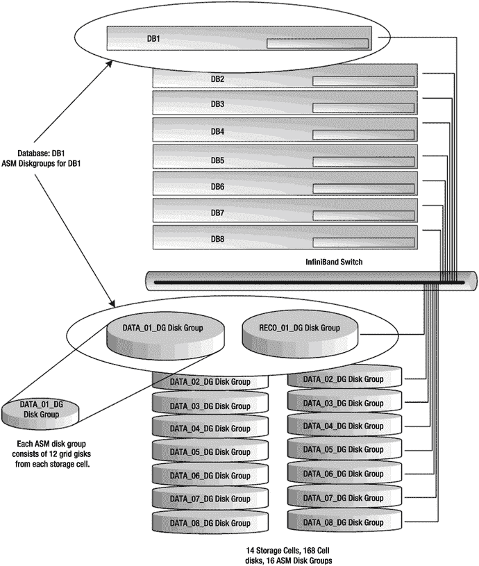

# 15. 计算节点布局

## 摘要

理解 Exadata 存储架构的各个层级及其如何协同工作，是正确为数据库规划存储布局的关键。在大多数情况下，使用 Oracle 的默认布局就足够了，但如果你需要为了最大性能和安全性而划分磁盘存储，那么理解物理磁盘、LUN、单元盘、网格盘和 ASM 磁盘组之间的关系是绝对必要的。在本章中，我们讨论了网格盘是什么、它们由什么组成，以及它们如何融入 ASM 存储网格。我们研究了如何创建磁盘组，以便为性能关键的数据文件优先分配 I/O。划分存储不仅限于磁盘层面，因此我们还讨论了按单元和按单元内的网格盘划分存储的方法。

## 15.1 节点布局

术语“节点”是一个相当通用的词，在 IT 行业中有许多不同的含义。例如，网络工程师将连接到其网络的任何可寻址设备称为节点。Unix 管理员通常将该术语与主机或服务器互换使用。Oracle DBA 经常将作为 RAC 集群成员的数据库服务器称为节点。Oracle 的文档在指代平台的数据库服务器层时使用术语“计算节点”。在本章中，我们将讨论配置 Exadata 计算节点的各种方式，无论它们是 RAC 集群的成员（节点）还是非集群（数据库服务器）。

一个常见的误解是 Exadata 机架必须配置为单个 Oracle RAC 集群。这完全不是事实。在其最简单的形式中，Exadata 数据库层可以描述为一组独立的数据库服务器，它们硬连接到相同的存储和相同的管理网络。这些服务器中的每一台都可以配置为运行独立的数据库，彼此完全独立。然而，出于两个原因——可扩展性和高可用性，这种做法并不常见。Oracle RAC 历史上用于在节点或实例发生故障时提供节点冗余，但 Oracle 的营销一直表明，横向扩展能力同样是重要的目标。传统上，如果我们需要提高数据库性能和容量，我们会通过升级服务器硬件来实现。这种方法变得如此普遍，以至于行业创造了“硬件刷新”一词来描述它。该术语可以指从添加 CPU、内存或 I/O 带宽到完全更换服务器本身的任何事情。以这种方式提高性能和容量被称为纵向扩展。随着 Exadata 能够为数据库服务器提供极高的 I/O 性能，总线速度现在已成为纵向扩展的限制因素。那么，当你达到单服务器容量的极限时会发生什么？显而易见的答案是添加更多服务器。要继续扩展你的应用程序，你必须使用 Oracle RAC 进行横向扩展。尽管如此，理解数据库服务器并非以某种专有方式捆绑在一起，这阐明了 Exadata 高度可配置的特性。

在第 14 章中，我们讨论了配置 Exadata 存储子系统以服务特定数据库服务器的各种策略。在本章中，我们将研究数据库层可以如何配置，以创建非常适合满足你业务需求的集群和非集群数据库环境。

## 15.2 配置考量

Exadata 是一个高度可配置的平台。确定最适合你业务的配置需要审查应用程序的性能和正常运行时间需求，并确保为开发、测试和生产系统提供充分的隔离。以下是确定最合适的计算节点布局以支持数据库环境的一些关键考量：

*   **CPU 资源**：在确定数据库的最佳节点布局时，请记住 Exadata 处理 I/O 工作负载的方式与传统数据库平台非常不同。在非 Exadata 平台上，数据库服务器负责从存储中检索所有数据块以满足应用程序的 I/O 请求。Exadata 将大量此类工作分载到存储单元上。这可以显著降低数据库服务器的 CPU 需求。计算你的数据库将需要多少更少的 CPU 是一项艰巨的任务，因为它部分取决于你的数据库利用并行查询和 HCC 压缩的程度，以及你的应用程序 SQL 是否适合分载。一些智能扫描优化，如解密、谓词过滤和 HCC 解压缩，无论应用程序类型如何，都将降低 CPU 需求。（我们在第 2 章到第 6 章中详细介绍了这些主题。）
*   需要数千个专用服务器连接的系统可能会压倒单台机器的资源。将这些连接分散到多个计算节点上可以减少系统进程调度器的负担，并允许 CPU 更有效地花费时间来服务客户端请求。跨多个计算节点负载均衡连接也提高了数据库处理并发连接请求的能力。
*   **内存资源**：需要数千个专用服务器连接的系统也会给内存资源带来负担。每个专用服务器连接都需要一部分内存，无论该连接是否正在被使用。将这些连接分散到多个 RAC 节点允许数据库处理比单个计算节点所能管理的更多的并发连接。
*   **I/O 性能与容量**：每个计算节点和存储单元都配备了一个 40Gbps QDR、双端口 InfiniBand 卡，实际上，每个计算节点最大可以传输/接收每秒 3.2 吉字节（对于 X4-2 和 X5-2 计算节点，每秒 6.4 吉字节）。如果这个带宽足够，那么转向多节点 RAC 配置的决策可能更多是高可用性的考量。如果你有需要超过单个计算节点所能提供的吞吐量的 I/O 密集型应用程序，RAC 可用于提供高可用性以及额外的 I/O 容量。
*   **打补丁与测试**：设计稳定数据库环境的另一个关键考量是提供一个独立的区域，用于在将补丁和新功能推出到生产环境之前进行测试。对于非 Exadata 平台，打补丁和升级通常涉及操作系统补丁和 Oracle RDBMS 补丁。Exadata 是一个高度复杂的数据库平台，由几个必须定期打补丁的额外硬件和软件层组成，例如单元服务器、ILOM 固件、InfiniBand 交换机固件、InfiniBand 网卡固件和 OFED 驱动程序。因此，建立一个与关键系统隔离的测试环境用于测试补丁是绝对至关重要的。


## 非 RAC 配置

计算节点可以通过多种方式进行配置。如果您的应用程序不需要 Oracle RAC 的高可用性或横向扩展功能，那么 Exadata 为独立数据库服务器提供了卓越的高性能平台。您可以通过配置 IORM（有关 IORM 的更多信息，请参见第 7 章）来管理独立数据库（无论是单实例还是 Oracle RAC）之间的 I/O 服务级别。在非 RAC 配置中，Oracle Grid Infrastructure 仍然为集群配置，但 Oracle 数据库主目录仅为单实例数据库链接。由于 Exadata 存储服务器为所有计算节点提供共享存储，因此可以使用一组集群化的 ASM 磁盘组为所有计算节点提供存储。这种配置为数据库管理员提供了集群的灵活性，同时仍满足单实例数据库的许可要求。

使用集群运行单实例数据库可能看起来有违直觉，但使用此配置的用户可以获得共享存储运行的诸多好处，同时极大避免了资源过度分割的弊端。即使您的数据库服务器运行独立数据库，它们仍然可以共享 Exadata 存储（单元磁盘）。这使得每个数据库都能利用 Exadata 存储子系统的全部 I/O 带宽。数据库的放置取决于计算节点所承受的压力，而不是该计算节点所属的 ASM 磁盘组。由于 ASM 磁盘组是共享的，数据库可以在集群内以最小的工作量进行迁移。此外，从此配置迁移到成熟的 RAC 配置非常简单——只需重新链接数据库主目录并将数据库转换为支持 RAC 即可。

例如，假设您的服务器上有三个名为 `SALES`、`HR` 和 `PAYROLL` 的数据库。所有三个数据库都可以共享相同的磁盘组进行存储。为此，所有三个数据库的实例参数应如下所示：

```
db_create_file_dest='+DATA'
db_recovery_file_dest='+RECO'
local_listener='<connect string of local host listener>'
remote_listener='<SCAN_HOSTNAME:1521>'
```

在图 15-1 中，我们看到 Exadata 全机架配置中的所有八个计算节点都在运行独立数据库。您会注意到，存储分配与集群配置完全相同。所有节点都使用 `+DATA` 和 `+RECO` 磁盘组，这些磁盘组由集群化的 ASM 实例提供服务。每个 ASM 实例共享同一组 ASM 磁盘组，这些磁盘组由所有存储单元中的网格磁盘组成。由于 ASM 磁盘组在所有计算节点之间是共享的，单个节点的故障并不意味着它服务的数据库必须停机。如果在幸存的计算节点上有足够的资源，可以轻松地将单实例数据库迁移到那些节点以恢复服务。通过 SCAN 接口连接的客户端无需重新配置即可连接。


*图 15-1. 非 RAC Exadata 配置示例*

如果为每个计算节点创建单独的磁盘组，管理员将不得不根据计算节点资源和该集群可用的磁盘空间来选择数据库放置位置。由于在 Exadata 上重新配置存储不是一个快速的过程，在节点之间拆分磁盘组迫使需要更多的前期规划。此外，单个存储服务器将被迫跨多个集群管理闪存缓存和资源管理计划，导致管理资源需要额外的开销。最后，在使用独立磁盘组的配置中，创建的网格磁盘数量使集群管理起来要困难得多——一个使用独立的 `+DATA` 和 `+RECO` ASM 磁盘组的全机架将需要 2688 个网格磁盘。上述配置除了标准的 476 个网格外，不会创建额外的网格磁盘。

### 拆分机架集群

既然我们已经讨论了如何在非 RAC 配置中运行 Exadata，现在让我们看看如何将单个机架划分为多个集群。但在这样做之前，我们将简要绕道说明一下什么是高可用性和可扩展性。

高可用性（HA）是一个相当容易理解的概念，但它经常与容错性混淆。在一个真正的容错系统中，每个组件都是冗余的。如果一个组件发生故障，另一个组件会接管，服务不会有任何中断。高可用性也涉及组件冗余，但故障可能会导致服务短暂中断，同时系统重新配置以使用冗余组件。中断期间进行中的工作必须在冗余组件上重新提交或继续。在 HA 系统中，检测故障、重新配置和恢复工作所需的时间差异很大。例如，主动/被动 Unix 集群已被广泛用于在服务器崩溃时提供优雅的故障转移。现在，当您看到“优雅故障转移”和“崩溃”这两个词用在同一个句子里时，您可能会暗自好笑（除非您在航空业工作），所以我来解释一下。在主动/被动集群的语境中，优雅故障转移意味着当系统故障发生或关键组件失效时，构成应用程序、数据库和基础设施的资源会在主系统上自动关闭，并在冗余系统上以尽可能短的停机时间重新启动。另一种不那么优雅的故障转移类型则涉及在凌晨 3:30 给您的支持人员打电话。在主动/被动集群中，数据库以及可能的其他应用程序一次只在一个节点上运行。使用此配置的故障转移可能需要几分钟才能完成，具体取决于必须迁移的资源和应用程序。Oracle RAC 使用主动/主动集群架构。RAC 系统上的故障转移通常在一分钟内完成。真正的容错通常非常难以实现，并且比高可用性昂贵得多。系统类型和故障的影响（或成本）通常决定哪种方案更合适。飞机、空间站或生命支持系统上的关键系统很容易证明容错架构的合理性。相比之下，为公司零售店面提供服务的网络应用程序通常无法证明完全容错架构的成本和复杂性。Exadata 是一种高可用性架构，提供完全冗余的硬件组件。当使用 Oracle RAC 时，这种冗余和快速故障扩展到了数据库层。


