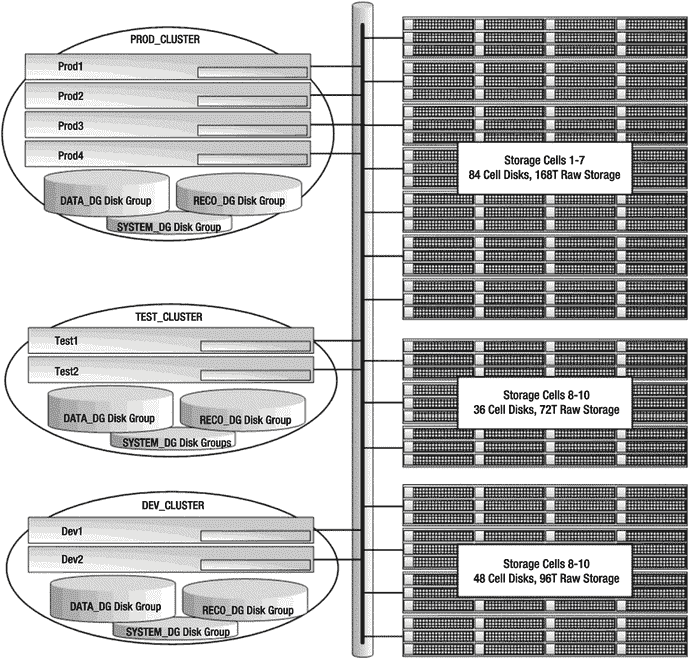

# 多 RAC 集群配置

Exadata 可以配置为多个 RAC 集群，以提供环境间的隔离。这使得集群能够被独立地管理、打补丁和维护。

在数据库层，这与使用 Oracle Clusterware 对普通服务器集进行集群化的方式相同。为了将存储单元配置到特定的计算节点，每个计算节点上的`cellip.ora`文件列出了它将使用的存储单元。例如，以下的`cellip.ora`文件列出了十四个存储单元中的七个（请记住，从 X4-2 开始，计算节点支持主动/主动 InfiniBand 连接）：

```bash
[db01:oracle:EXDB1] /home/oracle
> cat /etc/oracle/cell/network-config/cellip.ora
cell="192.168.10.17;192.168.10.18"
cell="192.168.10.19;192.168.10.20"
cell="192.168.10.21;192.168.10.22"
cell="192.168.10.23;192.168.10.24"
cell="192.168.10.25;192.168.10.26"
cell="192.168.10.27;192.168.10.28"
cell="192.168.10.29;192.168.10.30"
```

当 ASM 启动时，它会搜索这些 IP 地址上的存储单元，查找可用于配置 ASM 磁盘组的网格磁盘。或者，可以使用单元安全来锁定访问，使得只有特定的存储单元可供计算节点使用。`cellip.ora`文件和单元安全将在第 14 章中详细讨论。

为了说明多 RAC Exadata 配置可能的样子，让我们考虑一个分区为三个 Oracle RAC 集群的 Exadata X5-2 满配配置。一个满配提供了八个计算节点和十四个存储单元供我们使用。考虑一个配置如下的 Exadata 满配：

*   一个生产 RAC 集群，包含四个计算节点和七个存储单元
*   一个测试 RAC 集群，包含两个计算节点和三个存储单元
*   一个开发 RAC 集群，包含两个计算节点和四个存储单元

表 15-1 显示了这些 RAC 集群的资源分配，每个集群都有自己的存储网格。在阅读此表时，请记住硬件是不断发展的。这些数据来自 Exadata X5-2。在此示例中，我们使用了高容量的 4TB 磁盘驱动器。

表 15-1. 集群资源

| 集群 | 数据库服务器 | 数据库内存 | 数据库 CPU | 存储单元 | 单元磁盘 | 原始存储 |
| --- | --- | --- | --- | --- | --- | --- |
| `PROD_CLUSTER` | Prod1-Prod4 | 256G × 4 | 36 × 4 | 1–7 | 84 | 336T |
| `TEST_CLUSTER` | Test1, Test2 | 256G × 2 | 36× 2 | 8–10 | 36 | 144T |
| `DEV_CLUSTER` | Dev1, Dev2 | 256G × 2 | 36 × 2 | 11–14 | 48 | 192T |

这些 RAC 环境可以彼此完全独立地打补丁和升级。它们共享的唯一硬件资源是 InfiniBand fabric。如果你正在考虑像这样的多 RAC 配置，请记住对 InfiniBand 交换机打补丁将影响所有存储单元和计算节点。

图 15-2 展示了此集群配置的样子。



图 15-2. 配置为三个 RAC 集群的 Exadata 满配

