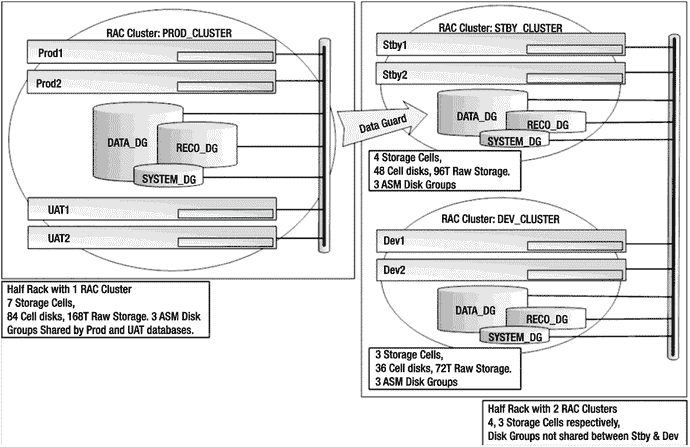
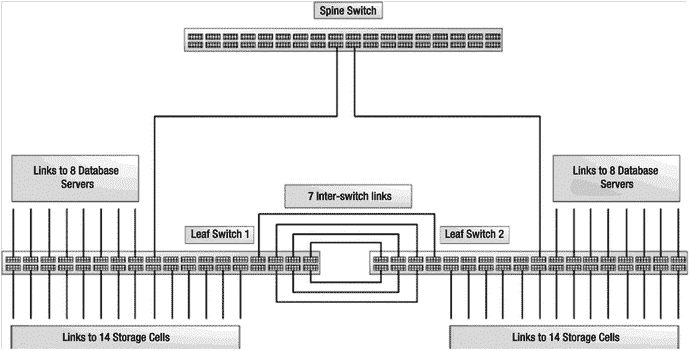
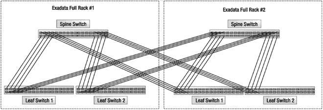

# 典型 Exadata 配置

到目前为止，我们讨论的两种配置策略是相当极端的例子。非 RAC 数据库配置说明了如何在不使用 Real Application Clusters 的情况下配置 Exadata，创建一个真正的整合平台。第二个示例，拆分 RAC 集群，展示了如何使用 Clusterware 创建多个隔离的 RAC 集群。这些配置在现实世界中并不常见，但它们说明了 Exadata 的配置能力。

现在，让我们来看一个我们在现场常见的配置。图 15-3 显示了一个具有两个 Exadata 半配的典型系统。它由一个生产集群（`PROD_CLUSTER`）组成，承载一个双节点生产数据库和一个双节点 UAT 数据库。生产和 UAT 数据库共享相同的 ASM 磁盘组（由所有存储单元上的所有网格磁盘组成）。I/O 资源使用 Exadata I/O 资源管理器（IORM）进行调节和优先级排序，这将在第 7 章中讨论。生产数据库使用 Active Data Guard 维护一个用于灾难恢复和报告目的的物理备用数据库。`UAT`数据库不被视为关键业务，因此未使用 Data Guard 进行保护。

在备用集群（`STBY_CLUSTER`）上，`STBY`数据库使用七个存储单元中的四个作为其 ASM 存储。在开发集群（`DEV_CLUSTER`）上，`Dev`数据库使用剩下的三个单元作为其 ASM 存储。开发集群用于持续的产品开发，并为安装 Exadata 补丁、数据库升级和新功能提供了一个测试平台。

图 15-3. 一个典型配置

## 多机架集群

当单个机架满载后，Exadata 的横向扩展能力并未止步。当一个 Exadata 机架无法完全满足需求时，可以向集群中添加额外的机架，从而创建一个大规模的数据库网格。最多可将 18 个机架连接在一起，形成一个庞大的数据库网格，包含 144 台数据库服务器和超过 12PB 的原始磁盘存储空间。实际上，Exadata 可以扩展到超过 18 个机架，但为此需要购买额外的 InfiniBand 交换机。Exadata 利用一个主干交换机将各个机柜连接起来（计算和存储服务器直接连接到叶交换机）。从`X4-2`型号开始，主干交换机需要额外购买。除非购买了主干交换机，否则四分之一机架配置只能与另一个 Exadata 机架连接。在满配机架配置中，叶交换机的端口使用情况如下：

*   八条链路连接到数据库服务器
*   十四条链路连接到存储单元
*   七条链路连接到冗余的叶交换机
*   七个端口开放

图 15-4 展示了一个未与其他 Exadata 机架连接的满配机架配置。有趣的是，Oracle 选择使用七根备用线缆将两个叶交换机连接在一起。可能是因为这些线缆在工厂已预先配置好——将它们接入叶交换机只是为了妥善安置，方便日后重新配置。叶交换机本身并不需要相互连接。

图 15-4. Exadata 满配机架 InfiniBand 网络

主干交换机与服务于集群和存储网络的其他两个 InfiniBand 交换机类似，只有一个例外。主干交换机在 InfiniBand 结构中充当子网管理器主机。冗余性通过将每个叶交换机连接到配置中的每个主干交换机（从 2 个到 18 个主干交换机）来提供。

要将两个 Exadata 机架连接在一起，需要重新分配图 15-4 中所示的七条交换机间线缆，其中四条用于将叶交换机连接到其内部的主干交换机，另外四条用于将叶交换机连接到相邻机架中的主干交换机。图 15-5 展示了两个联网的 Exadata 机架的网络配置。当八个 Exadata 机架连接在一起时，图 15-4 中的七条交换机间线缆会被重新分配，使得每条叶交换机到主干交换机的链路使用一根线缆（每个叶交换机八根线缆）。当连接三个到七个 Exadata 机架时，七条交换机间线缆会尽可能均匀地分配到所有叶交换机到主干交换机的链路上。叶交换机不与其他叶交换机连接，主干交换机也不与其他主干交换机连接。叶交换机与计算节点和存储单元的链路永远不需要更改。这种网络拓扑通常称为胖树拓扑。

图 15-5. 两个 Exadata 机架的交换机配置，带有一个数据库网格

## 总结

Exadata 是一个高度复杂、高度可配置的数据库平台。在第 14 章中，我们讨论了磁盘驱动器和存储单元如何单独或协同配置，以向 Oracle 数据库提供均衡、高性能 I/O 的各种方法。在本章中，我们将注意力转向数据库层的配置能力和策略。Exadata 很少用于托管独立的数据库服务器。在大多数情况下，它更适合用于 Oracle RAC 集群。理解每个计算节点和存储单元都是完全独立的组件非常重要，因此我们花了大量时间展示如何在满配的 Exadata 机架上配置八台独立的计算节点。接着，我们转向了一种提供三个计算环境隔离的 Oracle RAC 配置策略。最后，我们简要介绍了如何将多个 Exadata 机架联网以构建庞大的数据库网格。理解本书第 14 章和第 15 章中探讨的概念，将有助于您在需要为 Exadata 数据库环境设计配置策略时做出正确的选择。

