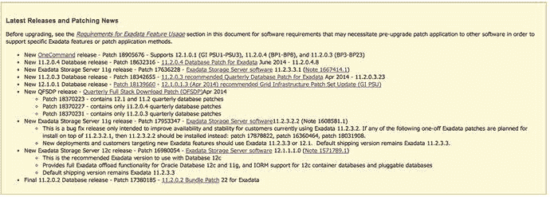
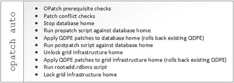

# 16. Exadata 补丁管理

运行自定义构建的 Oracle 系统最大的缺点之一是，它可能是一个独一无二的配置。即使在标准严格控制的环境中，也很难在硬件、固件和操作系统配置之间保持一致性大多数组织没有足够的时间来确保每个构建都具有完全相同的光纤通道 HBA 卡、内部 RAID 控制器和网卡，且运行相同的固件级别，更不用说在单个维护窗口内对所有这些组件进行升级测试计划。在一整年中，很难在整个技术栈中找到完全匹配的组件。有了 Exadata，Oracle 提供了一个标准构建，为每个发布版本提供完全相同的硬件、固件和操作系统配置。每个运行存储服务器版本`11.2.3.3.0`的`X3-2`机架的 Exadata 客户，其`LSI RAID 控制器`都运行版本`12.12.0-178`，`Sun Flash F40`卡的固件版本为`UI5P`，Oracle 不可断内核版本为`2.6.39-400.126.1`，等等。如果需要更新，Oracle 会发布一个单独的补丁，一次性升级所有这些组件。这种标准化使 Exadata 管理员能够应用大多数系统管理员因担心对其独特配置造成意外变更而不愿应用的错误修复和固件更新。由于每一代产品内部的标准化配置，在 Exadata 上测试这些变更要容易得多。本章将深入探讨 Exadata 补丁管理，从需要应用于 Exadata 的各种补丁类型开始，介绍每种补丁的应用方式，以及使补丁应用尽可能轻松的选项。

在应用任何补丁之前，请查阅 Oracle 支持说明编号`888828.1`。该说明是 Oracle Exadata 补丁管理的动态文档，被称为补丁说明，或者更正式的名称是 Exadata 数据库一体机和 Exadata 存储服务器支持版本。该说明涵盖软件版本`11g`和`12c`，涵盖了 Exadata 补丁管理的整个范围，包括每个存储服务器软件版本对应的各种内核和固件版本的参考、有关运行在 Exadata 上的其他 Oracle 产品（如数据库文件系统（`DBFS`））补丁的信息链接，以及该产品所有主要补丁发布的完整历史记录。在查找重要更新时，请检查该说明的“最新版本和补丁新闻”部分，如图 16-1 所示。



图 16-1. 最新版本和补丁新闻


## Exadata 补丁的类型

Exadata 补丁主要可分为两类——Exadata 存储服务器补丁和适用于 Exadata 的季度数据库补丁。Exadata 存储服务器补丁包含许多不同的组件，全部打包在一个单一的补丁中。除了运行在存储服务器上的 `cellsrv` 版本外，Exadata 存储服务器补丁还包含操作系统更新、新版 Linux 内核以及计算和存储服务器内部许多硬件组件的固件更新。Exadata 存储服务器补丁级别通常指代 Exadata 上运行的软件版本。一个存储服务器补丁发布的版本示例是 `11.2.3.3.1`，如图 16-2 所示。此版本说明了数据库兼容性和 `cellsrv` 版本的主要及次要发布版本。请记住，这些规则并非一成不变，例如版本 `11.2.3.3.1` 支持 12c 数据库，但不具备对 12c 执行卸载处理的功能——该功能是在 12c 版本的 `cellsrv` 软件中引入的。


图 16-2. Exadata 存储服务器版本编号

通常，Oracle 在一个日年内会发布两到三个 Exadata 存储服务器补丁。与大多数软件发布一样，对最后一位数字的更改是维护版本，可能只包含少数错误修复或固件更新。对主要或次要发布版本号的更改传统上包括存储服务器级别的新功能。包含新功能的 Exadata 存储服务器补丁示例有 Exadata 智能闪存日志 (`11.2.2.4.0`)、回写式闪存缓存 (`11.2.3.2.0`) 和闪存缓存压缩 (`11.2.3.3.0`)。

尽管其名称可能暗示 Exadata 存储服务器补丁仅应用于存储服务器，但也存在相应的补丁应用于计算节点以及（在某些情况下）InfiniBand 交换机。由于 Exadata 存储服务器补丁包含操作系统和内核更新，因此有一个额外的组件必须应用于计算节点。这确保了整个堆栈中的所有组件都运行相同版本的 Linux 内核，该内核现在包括用于 InfiniBand 堆栈的 OpenFabrics 联盟 (OFA) 驱动程序。从 Exadata 存储服务器版本 `11.2.3.3.0` 开始，Oracle 也开始在 Exadata 存储服务器补丁中包含 InfiniBand 交换机的任何固件更新。这有助于简化对这些组件应用补丁的过程，尽管这些更新通常很少且间隔很久。

除了 Exadata 存储服务器补丁外，Oracle 还发布适用于 Exadata 的季度数据库补丁，或称 QDPE。QDPE 的发布时间与季度 PSU（一月、四月、七月、十月）相同。从 Oracle Database 12c 开始，对 Exadata 和非 Exadata 平台统一发布单个 PSU。在此之前，Exadata 有单独的补丁发布。此外，Oracle 为最新的数据库版本发布月度临时“捆绑补丁”，允许客户获得任何可能需要在标准季度发布周期之外修复的关键错误的修复程序。尽管这些补丁在旧版本中是标准实践（运行 `11.2.0.1` 的 Exadata 管理员会记得月度捆绑补丁），但 Oracle 建议客户坚持使用 QDPE 版本。只有当特定错误影响系统时才应应用月度捆绑补丁。使用“捆绑补丁”这个术语是因为它确实如此——这是一起发布的一组补丁。QDPE 和捆绑补丁包含两个独立的补丁——一个用于数据库组件，一个用于集群就绪服务。在 `11.2.0.4` 之前，还有一个 `diskmon` 组件，但此后已合并到集群就绪服务补丁中。

## 适用于 Exadata 的季度数据库补丁

在考虑 Exadata 补丁时，应关注 Exadata “堆栈”的几个不同组件。第一个组件是大多数数据库管理员所熟悉的——构成每个计算节点上各种 Oracle 主目录的 Oracle 二进制文件。在 Oracle Database 11g 中，适用于 Exadata 的季度数据库补丁 (QDPE) 等同于 Oracle 发布的标准季度补丁集更新 (PSU)。此补丁应用于每个计算节点上的数据库和网格基础设施主目录。

> **注意**
>
> QDPE 在 Oracle Database 12c 中已弃用。数据库管理员只需应用用于工程系统和数据库内存的季度网格基础设施补丁集更新 (PSU)。这使得 Exadata 上的 Oracle 堆栈的补丁与运行 Oracle Database 12c 的正常 RAC 系统保持一致。

由于 QDPE 在结构和内容上与 PSU 类似，因此使用相同的工具应用补丁。Oracle 的补丁实用程序 `OPatch` 承担了所有繁重的工作。要查明系统上安装了哪个 QDPE，管理员可以使用 `OPatch`。`OPatch` 有一个 `lspatches` 命令，可以轻松分享此信息：

```
[oracle@enkx3db01 ∼]$ $ORACLE_HOME/OPatch/opatch lspatches
Patch description:  "ACFS Patch Set Update : 11.2.0.4.2 (18031731)"
Patch description:  "CRS PATCH FOR EXADATA (APR2014 - 11.2.0.4.6) : (18497417)"
Patch description:  "DATABASE PATCH FOR EXADATA (APR2014 - 11.2.0.4.6) : (18293775)"
```

在上面的例子中，这个 `11.2.0.4` 主目录已应用了 2014 年 4 月的 QDPE。从版本号可以推断出，它是 `11.2.0.4` 的第 6 个捆绑补丁。ACFS 补丁 `#18031731` 已包含在内，但自捆绑补丁 2 以来未再更新（显然此后没有必要的错误修复）。列出的补丁编号对应于每个组件。所需应用的只是单一的 QDPE，可以在 Exadata 支持版本说明中找到。


## 就地应用 QDPE

在运行 11.2 或更高版本的任何其他 Oracle RAC 系统上应用 QDPE 与应用季度 PSU 没有区别。由于在 11.2 版本中修补 Grid Infrastructure 主目录的复杂性，Oracle 向 `OPatch` 工具引入了 `auto` 功能。因为 Grid Infrastructure 主目录本身由 `root` 账户所有，软件所有者无法在不经过解锁流程的情况下创建新目录。此外，每个数据库主目录都必须运行 `prepatch` 和 `postpatch` 脚本。最后，单个捆绑补丁或 PSU 中包含的多个补丁必须全部应用。通过使用 `OPatch` 的 `auto` 功能，数据库管理员只需发出一条 `OPatch` 命令，即可修补单个节点上的所有 Oracle 主目录。这实现了真正的滚动补丁，这些补丁应用于垂直切片，而非横跨集群水平应用。图 16-3 展示了 `OPatch` 工具在 11gR2 集群的 `auto` 模式下运行的命令列表。

  
*图 16-3. `OPatch auto` 执行的步骤*

在应用 QDPE 之前，应更新将要接收补丁的每个 Oracle 主目录中的 `OPatch` 工具。最低版本要求可以在补丁的实际 `README` 文件中找到，但通常建议从 My Oracle Support 下载最新版本的 `OPatch`（补丁 `6880880`）并暂存在每个 Oracle 主目录中。当应用 QDPE 时，会执行最低版本检查。您应事先完成此操作，以便在维护窗口期间节省时间。在集群资源仍在系统上运行时，暂存 `OPatch` 二进制文件并运行先决条件检查是安全的。

因为 `OPatch auto` 功能运行需要 `root` 权限的脚本，所以必须以这些权限调用 `opatch` 命令。这可以直接以 `root` 用户身份执行，也可以通过 `sudo` 命令执行。作为软件所有者，解压缩补丁文件。建议以软件所有者身份解压缩此文件，以确保允许所有必需的访问权限。在角色分离的环境（具有独立的 `grid` 和 `oracle` 用户）中，请确保公共的 `oinstall` 组对所有文件都具有权限。切换到解压缩补丁的目录并运行命令 `opatch auto`。在 12cR1 集群上，要发出的命令是 `opatchauto apply`。如果设置了 `$ORACLE_HOME`，则可以使用完整路径或通过环境变量运行该命令。如果安装了多个 Oracle 主目录，则必须使用 `–oh` 开关指定要修补的主目录。在 `auto` 模式下运行时，`OPatch` 工具会查询 Oracle Cluster Registry (OCR) 以确定哪些 Oracle 主目录包含集群管理的资源。如果某个 Oracle 主目录没有注册任何目标，除非直接使用 `–oh` 开关指定，否则 `OPatch` 将跳过该主目录。下面的练习分解了在 11gR2 Exadata 集群上应用 QDPE 的过程。

## 就地应用 QDPE

本练习演示了使用就地方法应用 2014 年 7 月的 QDPE（补丁号 `18840215`）以修补 11.2.0.4。此示例演示了在包含运行 11.2.0.3 和 11.2.0.4 的 Oracle 主目录的 Exadata 集群上安装此补丁。由于安装了多个主目录，因此必须使用 `opatch auto –oh` 来指定要修补的数据库主目录。

1.  下载补丁 `18840215` 并在目录 `/u01/app/oracle/patches` 中解压缩。
2.  以 Oracle 用户身份，生成一个 Oracle Configuration Manager 响应文件。在角色分离的环境中，在两个账户都可以访问的目录中创建该文件。
    ```
    $ /u01/app/11.2.0.4/grid/OPatch/ocm/bin/emocmrsp
    OCM Installation Response Generator 10.3.4.0.0 - Production
    Copyright (c) 2005, 2010, Oracle and/or its affiliates. All rights reserved.
    
    Provide your email address to be informed of security issues, install and
    initiate Oracle Configuration Manager. Easier for you if you use your My
    Oracle Support Email address/User Name.
    Visit http://www.oracle.com/support/policies.html for details.
    Email address/User Name:
    You have not provided an email address for notification of security issues.
    Do you wish to remain uninformed of security issues ([Y]es, [N]o) [N]:  y
    The OCM configuration response file (ocm.rsp) was successfully created.
    ```
3.  以 Oracle 账户身份解压缩补丁文件。
    ```
    $ unzip -oq p18840215_112040_Linux-x86-64.zip -d /u01/app/oracle/patches
    ```
4.  在第一个计算节点上，以 `root` 用户身份运行 `opatch auto`，指定 Grid Infrastructure 主目录。 当提示输入 OCM 响应文件时，输入在步骤 2 中创建的文件的完整路径。
    ```
    # /u01/app/11.2.0.4/grid/OPatch/opatch auto -oh /u01/app/11.2.0.4/grid
    Executing /u01/app/11.2.0.4/grid/perl/bin/perl /u01/app/11.2.0.4/grid/OPatch/crs/patch11203.pl -patchdir /u01/app/oracle/patches -patchn 18840215 -oh /u01/app/11.2.0.4/grid -paramfile /u01/app/11.2.0.4/grid/crs/install/crsconfig_params
    This is the main log file: /u01/app/11.2.0.4/grid/cfgtoollogs/opatchauto2014-08-23_15-50-24.log
    This file will show your detected configuration and all the steps that opatchauto attempted to do on your system:
    /u01/app/11.2.0.4/grid/cfgtoollogs/opatchauto2014-08-23_15-50-24.report.log
    2014-08-23 15:50:24: Starting Clusterware Patch Setup
    Using configuration parameter file: /u01/app/11.2.0.4/grid/crs/install/crsconfig_params
    OPatch  is bundled with OCM, Enter the absolute OCM response file path:
    /home/oracle/ocm.rsp
    Stopping CRS...
    Stopped CRS successfully
    patch /u01/app/oracle/patches/18840215/18825509  apply successful for home  /u01/app/11.2.0.4/grid
    patch /u01/app/oracle/patches/18840215/18522515  apply successful for home  /u01/app/11.2.0.4/grid
    patch /u01/app/oracle/patches/18840215/18522514  apply successful for home  /u01/app/11.2.0.4/grid
    Starting CRS...
    Using configuration parameter file: /u01/app/11.2.0.4/grid/crs/install/crsconfig_params
    Installing Trace File Analyzer
    CRS-4123: Oracle High Availability Services has been started.
    opatch auto succeeded.
    ```
5.  在第一个计算节点上，以 `root` 用户身份运行 `opatch auto`，指定要修补的 11.2.0.4 数据库主目录。如果要修补多个主目录，请使用逗号分隔的列表。
    ```
    # /u01/app/11.2.0.4/grid/OPatch/opatch auto -oh /u01/app/oracle/product/11.2.0.4/dbhome_1
    Executing /u01/app/11.2.0.4/grid/perl/bin/perl /u01/app/11.2.0.4/grid/OPatch/crs/patch11203.pl -patchdir /u01/app/oracle/patches -patchn 18840215 -oh /u01/app/oracle/product/11.2.0.4/dbhome_1 -paramfile /u01/app/11.2.0.4/grid/crs/install/crsconfig_params
    This is the main log file: /u01/app/11.2.0.4/grid/cfgtoollogs/opatchauto2014-09-04_09-01-55.log
    This file will show your detected configuration and all the steps that opatchauto attempted to do on your system:
    /u01/app/11.2.0.4/grid/cfgtoollogs/opatchauto2014-09-04_09-01-55.report.log
    2014-09-04 09:01:55: Starting Clusterware Patch Setup
    Using configuration parameter file: /u01/app/11.2.0.4/grid/crs/install/crsconfig_params
    OPatch  is bundled with OCM, Enter the absolute OCM response file path:
    /home/oracle/ocm.rsp
    Stopping RAC /u01/app/oracle/product/11.2.0.4/dbhome_1 ...
    Stopped RAC /u01/app/oracle/product/11.2.0.4/dbhome_1 successfully
    patch /u01/app/oracle/patches/18840215/18825509  apply successful for home  /u01/app/oracle/product/11.2.0.4/dbhome_1
    patch /u01/app/oracle/patches/18840215/18522515/custom/server/18522515  apply successful for home  /u01/app/oracle/product/11.2.0.4/dbhome_1
    Starting RAC /u01/app/oracle/product/11.2.0.4/dbhome_1 ...
    Started RAC /u01/app/oracle/product/11.2.0.4/dbhome_1 successfully
    opatch auto succeeded.
    ```


在其余计算节点上重复步骤 1-5，一次一个节点。对于任何新打补丁且不是数据保护 Physical Standby 的数据库，以 Oracle 用户身份运行 `catbundle.sql` 脚本。Physical Standby 数据库将在主数据库上运行该脚本时接收到目录更新。仅针对数据库中的一个实例运行该脚本。请注意，在 Oracle 数据库 12c 中，`catbundle.sql` 脚本已被 `datapatch` 脚本取代。更多信息，请查阅具体的补丁自述文件（README）。

```
$ cd $ORACLE_HOME
$ sqplus / as sysdba
SYS@dbm1> @?/rdbms/admin/catbundle.sql exa apply
```

所有节点都打好补丁后，还有一个最后的步骤必须在所有具有新补丁主目录的数据库上运行。对于任何不是数据保护 Physical Standby 的数据库，从 SQL*Plus 运行 `catbundle.sql` 脚本。该脚本必须从 Oracle 主目录运行，因为 `$ORACLE_HOME/rdbms/admin` 中会调用到其他脚本。从 Oracle 主目录外运行将导致那些脚本无法被正常调用。运行 12cR1 的数据库将使用 `datapatch` 脚本。关于 `datapatch` 的更多信息，请查阅具体的补丁自述文件（README）。

### 通过克隆主目录应用 QDPE

为了节省与打补丁相关的停机时间，可以克隆一个 Oracle 主目录，并以就地升级（out-of-place upgrade）的方式应用补丁。虽然这种方法不太常用，但它可以通过预先构建一个已应用新补丁的 Oracle 主目录，然后将数据库实例迁移过去，从而节省时间。虽然此过程确实减少了实施补丁所需的时间，但它需要额外的文件系统空间，并且比就地 QDPE 应用包含更多步骤。当多个数据库实例共享一个主目录，而其中仅有一部分数据库需要补丁升级或单独修复时，此过程很有用。My Oracle Support 注释 #1136544.1 详细说明了 11gR2 Oracle 主目录的此过程。以下练习将详细说明克隆 11.2.0.4 数据库主目录并应用 2014 年 7 月 QDPE 的过程。

#### 就地（Out of Place）应用 QDPE

本练习演示了使用就地（out of place）方法应用 2014 年 7 月适用于 11.2.0.4 的 QDPE（补丁号 #18840215），其中 `/u01/app/oracle/product/11.2.0.4/dbhome_1` 为主目录，`/u01/app/oracle/product/11.2.0.4/db_july2014` 为新主目录。

以 Oracle 用户身份，创建新的 Oracle 主目录，并使用 `tar` 命令克隆现有主目录。关于 `nmb`、`nmhs` 和 `nmo` 可执行文件的任何错误都可以忽略。

```
$ export ORACLE_HOME=/u01/app/oracle/product/11.2.0.4/db_july2014
$ dcli -g ∼/dbs_group -l oracle mkdir -p $ORACLE_HOME
$ dcli -g ∼/dbs_group -l oracle "cd /u01/app/oracle/product/11.2.0.4/dbhome_1;
\tar cf - . | ( cd $ORACLE_HOME ; tar xf - )"
```

克隆完主目录后，使用 `clone.pl` 脚本完成克隆并重新链接 Oracle 主目录。

```
$ export ORACLE_HOME=/u01/app/oracle/product/11.2.0.4/db_july2014
$ dcli -g ∼/dbs_group -l oracle "cd $ORACLE_HOME/clone/bin; \
./clone.pl ORACLE_HOME=$ORACLE_HOME \
ORACLE_HOME_NAME=OraDB_home_july2014 ORACLE_BASE=/u01/app/oracle"
```

在每个计算节点上，更新清单（inventory）以反映新的 Oracle 主目录。

```
$ export ORACLE_HOME=/u01/app/oracle/product/11.2.0.4/db_july2014
$ $ORACLE_HOME/oui/bin/runInstaller \
-updateNodeList ORACLE_HOME=$ORACLE_HOME "CLUSTER_NODES={db01,db02}"
```

为 RDS 重新链接数据库可执行文件。请注意，Oracle 安装程序在安装时会为 RDS 重新链接一个新主目录，但此方法不会自动执行该重新链接。

```
$ export ORACLE_HOME=/u01/app/oracle/product/11.2.0.4/db_july2014
$ dcli -g ∼/dbs_group -l oracle "cd $ORACLE_HOME/rdbms/lib; \
ORACLE_HOME=$ORACLE_HOME make -f ins_rdbms.mk ipc_rds ioracle"
```

运行 `root.sh` 脚本以完成升级。

```
# export ORACLE_HOME=/u01/app/oracle/product/11.2.0.4/db_july2014
# dcli -g ∼/dbs_group -l root $ORACLE_HOME/root.sh
```

验证 `OPatch` 的版本是否符合 QDPE 要求的最低版本。

```
$ export ORACLE_HOME=/u01/app/oracle/product/11.2.0.4/db_july2014
$ dcli –l oracle –g ∼/dbs_group $ORACLE_HOME/OPatch/opatch version
```

将补丁应用到新主目录。下载补丁 18840215 并放置于目录 `/u01/app/oracle/patches` 中。以 Oracle 用户身份，生成一个 Oracle 配置管理器响应文件。在角色分离的环境中，在一个两个账户都能访问的目录中创建该文件。

```
$ /u01/app/11.2.0.4/grid/OPatch/ocm/bin/emocmrsp
OCM Installation Response Generator 10.3.4.0.0 - Production
Copyright (c) 2005, 2010, Oracle and/or its affiliates.  All rights reserved.

Provide your email address to be informed of security issues, install and
initiate Oracle Configuration Manager. Easier for you if you use your My
Oracle Support Email address/User Name.
Visit http://www.oracle.com/support/policies.html for details.
Email address/User Name:
You have not provided an email address for notification of security issues.
Do you wish to remain uninformed of security issues ([Y]es, [N]o) [N]:  y
The OCM configuration response file (ocm.rsp) was successfully created.
```

以 Oracle 账户解压缩补丁文件。


