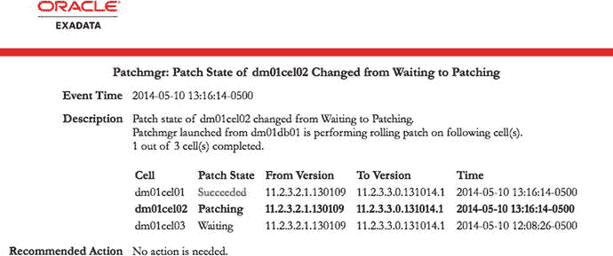

# Exadata 补丁应用指南

## 应用 QDPE 补丁

首先，在计算节点上以 root 用户身份解压补丁文件。

```
$ unzip -oq p18840215_112040_Linux-x86-64.zip -d /u01/app/oracle/patches
```

然后，在第一个计算节点上以 root 用户身份运行 `opatch auto` 命令，并指定新的 11.2.0.4 数据库主目录。

```
# /u01/app/11.2.0.4/grid/OPatch/opatch auto -oh /u01/app/oracle/product/11.2.0.4/db_july2014
```

命令的输出将显示检测到的配置以及 `opatchauto` 尝试在系统上执行的所有步骤：

```
Executing /u01/app/11.2.0.4/grid/perl/bin/perl /u01/app/11.2.0.4/grid/OPatch/crs/patch11203.pl -patchdir /u01/app/oracle/patches -patchn 18840215 -oh /u01/app/oracle/product/11.2.0.4/ db_july2014 -paramfile /u01/app/11.2.0.4/grid/crs/install/crsconfig_params

This is the main log file: /u01/app/11.2.0.4/grid/cfgtoollogs/opatchauto2014-09-04_09-01-55.log

This file will show your detected configuration and all the steps that opatchauto attempted to do on your system:

/u01/app/11.2.0.4/grid/cfgtoollogs/opatchauto2014-09-04_09-01-55.report.log

2014-09-04 09:01:55: Starting Clusterware Patch Setup

Using configuration parameter file: /u01/app/11.2.0.4/grid/crs/install/crsconfig_params

OPatch  is bundled with OCM, Enter the absolute OCM response file path:

/home/oracle/ocm.rsp

Stopping RAC /u01/app/oracle/product/11.2.0.4/ db_july2014 ...

Stopped RAC /u01/app/oracle/product/11.2.0.4/ db_july2014 successfully

patch /u01/app/oracle/patches/18840215/18825509  apply successful for home   /u01/app/oracle/product/11.2.0.4/ db_july2014

patch /u01/app/oracle/patches/18840215/18522515/custom/server/18522515  apply successful for home   /u01/app/oracle/product/11.2.0.4/ db_july2014

Starting RAC /u01/app/oracle/product/11.2.0.4/ db_july2014 ...

Started RAC /u01/app/oracle/product/11.2.0.4/ db_july2014 successfully

opatch auto succeeded.
```

在剩余的计算节点上重复上述步骤，一次一个节点。确保数据库仍在使用旧的 Oracle 主目录。

```
$ srvctl config database -d dbm -a
```

```
Database unique name: dbm
Database name: dbm
Oracle home: /u01/app/oracle/product/11.2.0.4/dbhome_1
Oracle user: oracle
Spfile: +DATA/dbm/spfiledbm.ora
Domain:
Start options: open
Stop options: immediate
Database role: PRIMARY
Management policy: AUTOMATIC
Server pools: dbm
Database instances: dbm1,dbm2
Disk Groups: DATA,RECO
Mount point paths:
Services:
Type: RAC
Database is enabled
Database is administrator managed
```

使用 `srvctl` 工具重新定位数据库。

```
$ srvctl modify database -d dbm -o /u01/app/oracle/product/11.2.0.4/db_july2014
```

在每个节点上修改 `/etc/oratab` 文件中的实例和数据库条目。

```
dbm1:/u01/app/oracle/product/11.2.0.4/ db_july2014:N                # line added by Agent
dbm:/u01/app/oracle/product/11.2.0.4/ db_july2014:N                # line added by Agent
```

逐个实例对数据库进行滚动重启。

```
$ srvctl stop instance -d dbm -i dbm1
$ srvctl start instance -d dbm -i dbm1
$ srvctl stop instance -d dbm -i dbm2
$ srvctl start instance -d dbm -i dbm2
```

在任何新打过补丁且非 Data Guard 物理备用数据库的数据库上，以 Oracle 用户身份运行 `catbundle.sql` 脚本。物理备用数据库将在主数据库运行该脚本时接收到目录更新。每个数据库只在一个实例上运行该脚本。

```
$ cd $ORACLE_HOME
$ sqplus / as sysdba
SYS@dbm1> @?/rdbms/admin/catbundle.sql exa apply
```

可以看出，应用 QDPE 补丁（离线方式）的过程可能比传统的在线补丁应用包含更多的步骤。此方法通常保留用于多个数据库实例共享一个主目录，且其中只有一部分需要补丁升级或一次性修复的情况。

## Exadata 存储服务器补丁

Exadata 存储服务器补丁这个术语涵盖了驻留在 Exadata 环境整个堆栈中的广泛组件。这些补丁不仅包含存储服务器的更新，还包括计算节点和 InfiniBand 交换机的更新。除了新功能和操作系统升级外，更新可能还包括 RAID 控制器、闪存卡、BIOS、ILOM 甚至磁盘驱动器本身的固件。

在深入探讨如何应用补丁之前，最好先了解一下存储服务器操作系统的架构。由于 Exadata 存储服务器运行 Oracle Enterprise Linux，Oracle 能够考虑到补丁应用来定制操作系统布局。在 Exadata 存储服务器上，前两个硬盘驱动器上划出一小部分空间来存放操作系统。这些分区随后使用标准的 Linux 内核 md RAID 驱动程序来构建软件 RAID 设备：

```
[root@enkx3cel01 ∼]# parted /dev/sda print
Model: LSI MR9261-8i (scsi)
Disk /dev/sda: 3000GB
Sector size (logical/physical): 512B/512B
Partition Table: gpt
Number  Start   End     Size    File system  Name     Flags
1       32.8kB  123MB   123MB   ext3         primary  raid
2       123MB   132MB   8225kB  ext2         primary
3       132MB   2964GB  2964GB               primary
4       2964GB  2964GB  32.8kB               primary
5       2964GB  2975GB  10.7GB  ext3         primary  raid
6       2975GB  2985GB  10.7GB  ext3         primary  raid
7       2985GB  2989GB  3221MB  ext3         primary  raid
8       2989GB  2992GB  3221MB  ext3         primary  raid
9       2992GB  2994GB  2147MB  linux-swap   primary  raid
10      2994GB  2995GB  732MB                primary  raid
11      2995GB  3000GB  5369MB  ext3         primary  raid
Information: Don’t forget to update /etc/fstab, if necessary.
```

```
[root@enkx3cel01 ∼]# cat /proc/mdstat
Personalities : [raid1]
md4 : active raid1 sda1[0] sdb1[1]
120384 blocks [2/2] [UU]
md5 : active raid1 sda5[0] sdb5[1]
10485696 blocks [2/2] [UU]
md6 : active raid1 sda6[0] sdb6[1]
10485696 blocks [2/2] [UU]
md7 : active raid1 sda7[0] sdb7[1]
3145664 blocks [2/2] [UU]
md8 : active raid1 sda8[0] sdb8[1]
3145664 blocks [2/2] [UU]
md2 : active raid1 sda9[0] sdb9[1]
2097088 blocks [2/2] [UU]
md11 : active raid1 sda11[0] sdb11[1]
5242752 blocks [2/2] [UU]
md1 : active raid1 sda10[0] sdb10[1]
714752 blocks [2/2] [UU]
unused devices: <none>
```

```
[root@enkx3cel01 ∼]# df -h
Filesystem            Size  Used Avail Use% Mounted on
/dev/md6              9.9G  6.7G  2.8G  72% /
tmpfs                  32G     0   32G   0% /dev/shm
/dev/md8              3.0G  797M  2.1G  28% /opt/oracle
/dev/md4              114M   51M   58M  47% /boot
/dev/md11             5.0G  255M  4.5G   6% /var/log/oracle
```

查看 `/proc/mdstat` 的输出，总共有八个 RAID 设备，但在给定时间只有五个被操作系统挂载。仔细观察每个设备的大小，`/dev/md5` 和 `/dev/md6` 大小匹配，`/dev/md7` 和 `/dev/md8` 也是如此。当运行 `imageinfo` 命令来查看正在运行的 Exadata 存储服务器软件版本时，这一点变得显而易见：

```
[root@enkx3cel01 ∼]# imageinfo
Kernel version: 2.6.39-400.126.1.el5uek #1 SMP Fri Sep 20 10:54:38 PDT 2013 x86_64
Cell version: OSS_11.2.3.3.0_LINUX.X64_131014.1
Cell rpm version: cell-11.2.3.3.0_LINUX.X64_131014.1-1
Active image version: 11.2.3.3.0.131014.1
Active image activated: 2013-12-22 23:48:05 -0600
Active image status: success
Active system partition on device: /dev/md6
Active software partition on device: /dev/md8
In partition rollback: Impossible
Cell boot usb partition: /dev/sdm1
Cell boot usb version: 11.2.3.3.0.131014.1
Inactive image version: 11.2.3.2.1.130109
Inactive image activated: 2013-12-22 22:44:01 -0600
Inactive image status: success
Inactive system partition on device: /dev/md5
```


`设备上的非活动软件分区：/dev/md7`

`引导区拥有版本 11.2.3.2.1.130109 的回滚归档`

`回滚到非活动分区：可能`

`imageinfo` 命令提供了关于目标存储服务器的大量信息。通过查看“活动镜像版本”行，我们可以看到它当前运行的版本是 `11.2.3.3.0`。“/” 文件系统列在“设备上的活动系统分区”行中，而 `/opt/oracle` 分区定义在“设备上的活动软件分区”行中。以“Inactive”开头的行指的是此单元上先前安装的 Exadata 存储服务器软件版本。如你所见，系统分区和软件分区分别位于 `/dev/md5` 和 `/dev/md7` 上。这反映了 Exadata 存储服务器进程所使用的异地修补机制。在上面显示的存储服务器中，`/dev/md6` 和 `/dev/md8` 用于操作系统。当应用新补丁时，`/dev/md5` 和 `/dev/md7` 设备将被清除并接收新的操作系统镜像。在镜像部署完成且新镜像设备被激活后，存储服务器将重新启动并使用新镜像，同时保留原有镜像不变。这允许从补丁管理员处回滚补丁，或者在补丁周期内发生故障时进行自动回滚。

### 应用 Exadata 存储服务器补丁

Exadata 存储服务器补丁使用 `patchmgr` 实用程序应用。与需要从实际补丁文件单独下载的 `opatch` 实用程序不同，`patchmgr` 随每个版本一起提供。该实用程序依赖 SSH 和 `dcli` 实用程序，通过单个命令为集群中的所有存储服务器打补丁。因此，运行 `patchmgr` 的用户在补丁期间必须具有对所有存储服务器 root 账户的无密码访问权限。由于这些要求，存储服务器补丁通常从集群中的某个计算节点应用，但也可以从任何设置了 SSH 密钥的系统应用。这可以是运行 Oracle Enterprise Manager 的主机或 Oracle 的白金服务网关服务器。SSH 密钥可以使用 `dcli` 中的 `-k` 和 `--unkey` 选项进行临时配置和移除。`patchmgr` 实用程序有两种主要模式——先决条件检查和实际补丁。即使补丁模式会运行先决条件检查，也建议先单独运行一次先决条件检查。

在升级存储服务器之前，必须在将驱动补丁会话的主机上下载并解压补丁。除了补丁本身，检查 MOS 注释 `#888828.1` 以获取任何推荐的附加插件也很重要。由于补丁应用涉及多次重新启动，它必须在实际被修补的主机之外运行。补丁归档文件包含多个脚本，包括 `patchmgr`、用于获取状态更新的支持 shell 脚本，以及一个包含整个 Exadata 存储服务器操作系统的 ISO 文件。`11.2.3.3.0` 之后的版本也可能包含 InfiniBand 交换机的更新，这将在后面讨论。在运行 `patchmgr` 脚本之前，必须创建或复制一个 `cell_group` 文件到补丁目录。此文件包含将要由 `patchmgr` 打补丁的存储服务器的主机名。

现在补丁内容已经解压，运行先决条件检查以确保系统已准备好打补丁非常重要。在先决条件模式下运行 `patchmgr` 的语法如下：

```
patchmgr –cells cell_group –patch_check_prereq
```

下面的输出显示了先决条件检查的结果。此检查可以在 Clusterware 运行时进行。它将验证存储服务器的当前镜像状态是否报告成功、升级是否有足够的磁盘空间，以及存储服务器上是否有未解决的警报。这对于确保失败的补丁不会使任何存储服务器处于无法启动的状态非常重要：

```
[root@enkx3db01 patch_11.2.3.3.1.140708]# ./patchmgr -cells cell_group -patch_check_prereq
2014-10-22 18:37:41 -0500        :Working: DO: Initialize files, check space and state of cell services. Up to 1 minute ...
2014-10-22 18:38:00 -0500        :SUCCESS: DONE: Initialize files, check space and state of cell services.
2014-10-22 18:38:00 -0500        :Working: DO: Copy, extract prerequisite check archive to cells. If required start md11 mismatched partner size correction. Up to 40 minutes ...
2014-10-22 18:38:14 -0500        :SUCCESS: DONE: Copy, extract prerequisite check archive to cells. If required start md11 mismatched partner size correction.
2014-10-22 18:38:14 -0500        :Working: DO: Check prerequisites on all cells. Up to 2 minutes ...
2014-10-22 18:39:17 -0500        :SUCCESS: DONE: Check prerequisites on all cells.
2014-10-22 18:39:17 -0500        :Working: DO: Execute plugin check for Patch Check Prereq ...
2014-10-22 18:39:17 -0500 :INFO: Patchmgr plugin start: Prereq check for exposure to bug 17854520 v1.1. Details in logfile /tmp/patch_11.2.3.3.1.140708/patchmgr.stdout.
2014-10-22 18:39:17 -0500 :INFO: This plugin checks dbhomes across all nodes with oracle-user ssh equivalence, but only for those known to the local system. dbhomes that exist only on remote nodes must be checked manually.
2014-10-22 18:39:17 -0500 :SUCCESS: No exposure to bug 17854520 with non-rolling patching
2014-10-22 18:39:17 -0500        :SUCCESS: DONE: Execute plugin check for Patch Check Prereq.
```

此时，Clusterware 可以保持运行（用于滚动补丁）或关闭（用于离线补丁）。无论哪种方式，调用 `patchmgr` 脚本的方式相同。应用补丁的语法如下：

```
./patchmgr –cells cell_group –patch [-rolling] [-smtp_from "address"] [-smtp_to "address1 address2"]
```

与先决条件检查一样，需要包含要修补的单元列表的文件。`-patch` 开关告诉 `patchmgr` 执行补丁操作。在命令中添加 `-rolling` 将指示 `patchmgr` 以滚动方式将补丁应用到每个存储服务器。

最终的开关为补丁过程的每个部分启用了电子邮件警报。启用电子邮件选项将在 `patchmgr` 启动时发送警报，并在存储服务器的补丁状态发生变化时发送更新。这些状态可以是“已启动”、“修补中”、“等待中”、“成功”或“失败”。这对于可能运行很长时间的滚动补丁很有用。指定 `smtp_to` 开关时，用空格分隔多个电子邮件地址。图 16-4 显示了 `patchmgr` 发送的示例电子邮件。你可以看到它已完成第一个存储服务器的修补，并开始修补主机 `dm01cel02`。



图 16-4. Exadata 存储服务器补丁警报

由于单次运行可能耗时较长，使用 `screen` 或 VNC 等实用程序来运行 `patchmgr` 非常重要。如果使用滚动方法应用补丁，`patchmgr` 在所有存储服务器完成补丁过程之前不会结束。

在 `patchmgr` 成功完成且所有存储服务器升级后，清理存储服务器上的安装非常重要。这是使用 `-cleanup` 开关完成的。完整语法如下：

```
./patchmgr –cells cell_group -cleanup
```


