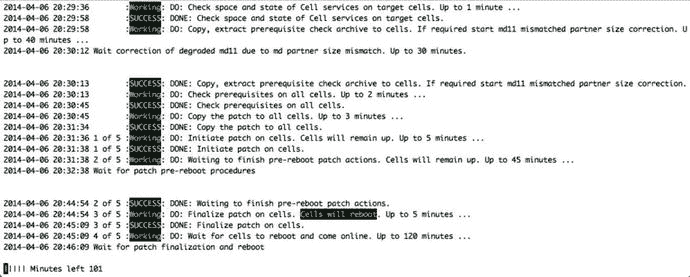

# 存储服务器补丁详解

存储服务器的打补丁过程分为三个不同的阶段：前置阶段、重启前阶段以及重启阶段。

## 前置阶段
如前所述，无论以何种模式运行，只要执行 `patchmgr` 命令，前置阶段就会随之执行。在此阶段，`patchmgr` 将检查未解决的警报、可用空间以及存储服务器的整体健康状况。无论补丁是采用滚动方式还是全停机方式应用，前置阶段都会在所有存储服务器上并行执行。这是所有阶段中速度最快的。

## 重启前阶段
重启前阶段同样并行发生，与打补丁的模式无关。在此阶段，会在存储服务器上运行若干额外的检查。首先，包含操作系统镜像的文件会被复制到所有存储服务器，并通过 `make_cellboot_usb.sh` 脚本将恢复用 USB 媒介更新至最新副本。这一步非常重要，因为在补丁失败的情况下可能需要调用 USB 恢复媒介。重新创建恢复媒介后，`patchmgr` 会指示单元（cell）销毁非活动的操作系统和软件分区并重新创建它们。然后，新操作系统镜像的内容会被复制到新创建的分区中，并验证 BIOS 启动顺序。这些步骤完成后，补丁将进入待机状态。一旦所有存储服务器都完成了重启前阶段，`patchmgr` 就会进入重启阶段。正是在此处，滚动补丁与非滚动补丁的操作将产生差异。

## 重启阶段
对于非滚动补丁，所有存储服务器并行执行重启阶段。因为在非滚动补丁期间必须关闭 Clusterware，所以同时对所有存储服务器打补丁不会产生负面影响。而对于滚动补丁，存储服务器则逐一进行重启阶段。在滚动补丁期间，一个单元开始重启阶段之前，必须首先将其网格磁盘（grid disks）置于离线状态。

### 重启阶段的步骤
重启阶段始于对所有组件的最终验证，重建单元所需的关键文件会被复制到新的分区。这些文件包括 root、celladmin 和 cellmonitor 用户账户的主目录、`/etc` 目录的内容以及其他必要文件。最后，引导程序（grub bootloader）将被指示从新创建的分区启动，并忽略之前用于承载操作系统和 `cellsrv` 应用程序的分区。这些现已不活动的分区将保持原样，以备需要回滚时使用。通过这种方式，Oracle 确保始终有一个可用的操作系统安装以供回退，无论是之前活动的分区，还是通过可启动的 USB 恢复媒介。所有这些操作完成后，存储服务器将重新启动。

在此阶段的第一次重启期间，存储服务器将启动到一个不完整的操作系统版本，并安装一批额外的 RPM 软件包。这些软件包位于临时的 `/install/post` 目录中，该目录包含名为 `10commonos`、`30kernel`、`40debugos`、`50ofed`、`60cellrpms`、`70sunutils` 和 `90last` 的枚举目录。每个目录内都有一个 `install.sh` 脚本，用于安装该目录内的软件包。当 `90last` 目录中的安装脚本执行完毕后，`/install` 目录会被删除，主机将再次重启。

在下一次重启期间，固件组件将被升级。作为每个存储服务器启动过程的一部分，`/opt/oracle.cellos/CheckHWnFWProfile` 脚本将在升级模式下运行。此脚本将检查存储服务器中的所有硬件组件，并验证其固件版本是否与新镜像的预期版本匹配。如果当前版本不匹配，则会升级到受支持的版本。此脚本检查 BIOS、ILOM、RAID 控制器、InfiniBand HCA、闪存卡和磁盘驱动器。根据需要应用的固件更新数量，此过程可能需要长达两个小时。在较旧的补丁版本中，固件更新期间会禁用 SSHD 进程，但在某些版本中此限制已被移除。如需了解固件升级过程的最新状态，请登录存储服务器并查看 `/var/log/cellos/CheckHWnFWProfile.log` 文件的输出。

当所有硬件组件升级完毕后，存储服务器将进行最后一次重启。如果补丁包含 BIOS 升级，最终重启所需时间可能会比通常情况长得多。在最终重启期间，将进行验证检查，以确保新镜像符合预期配置。验证检查的结果可以在 `/var/log/cellos/validations` 目录下找到，具体是 `/var/log/cellos/validations.log` 文件。

### 补丁完成后
验证检查成功完成后，存储服务器进入“成功”状态，`patchmgr` 将完成操作或指示单元激活其网格磁盘（如果是以滚动方式应用补丁）。如果是以滚动方式应用补丁，那么在网格磁盘被激活后，`patchmgr` 将检查 ASM 中网格磁盘的状态。这是通过每个网格磁盘的 `asmmodestatus` 属性来检查的。在网格磁盘于 ASM 中联机期间，它们在 `V$ASM_DISK` 中（或通过网格磁盘的 `asmmodestatus` 属性）的状态将显示为“SYNCING”。这意味着磁盘正在追赶因补丁而离线期间错过的任何写入操作。磁盘完成重新同步过程后，`patchmgr` 将移至下一个单元，并在该单元开始重启阶段。此过程重复进行，直到所有存储服务器都成功打上补丁。

## 时间考量
最近的存储服务器补丁显示，完成补丁的重启阶段需要稍多于一小时的时间。假设每个存储服务器需要 30 分钟来重新同步其磁盘，那么仅重启阶段，在满配机架（14 个存储服务器 x 1.5 小时重启和重新同步）上将耗时约 21 小时。重新同步所需的时间完全取决于系统的活动水平。在打补丁期间不繁忙的系统，重新同步可能需要三到五分钟。在集群非常繁忙的极端情况下，我们观察到重新同步时间长达六小时。


当需要排查存储服务器补丁故障时，了解补丁日志文件的位置会很有帮助。运行`patchmgr`时，它会复制补丁内容并在每个存储服务器的`/root/_patch_hctap_/_p_/`目录下执行。在补丁会话期间，有两个日志文件详细记录了`patchmgr`脚本的所有操作：`wait_out`和`wait_out_tmp`。`wait_out`日志文件记录每次`patchmgr`登录的信息以及一般性消息，例如补丁状态。要了解`patchmgr`具体执行的操作细节，请查看`wait_out_tmp`文件。该日志记录了重启前阶段发生的所有事情。较新版本的`patchmgr`还会在控制主机上为每个存储服务器创建一个日志文件。这些文件可能有参考价值，但可能无法提供像`wait_out`和`wait_out_tmp`文件那样完整的信息。

### Patchmgr 工作原理

本节已多次提及`patchmgr`，但未说明其工作原理。`patchmgr`工具是一个 bash 脚本，用于在运行时指定的一组存储服务器上驱动补丁安装过程。无论是执行升级还是回滚，无论是滚动安装还是非滚动安装，`patchmgr`的功能都相同——它会将脚本和文件推送到待打补丁的节点，并通过 SSH 密钥和`dcli`工具与这些节点交互。在修补多个主机时，`patchmgr`会一直运行，直到所有主机完成补丁安装或过程中出现失败，才返回到命令提示符。大多数情况下，`patchmgr`的输出看起来像一个旋转的风车。在各个阶段，`patchmgr`会报告剩余的分钟数。这不是预估时间，而是超时时限。如果该阶段未在此时间内完成，补丁将被标记为失败。与此同时，`patchmgr`在前台运行时，每分钟会唤醒一次，登录到每个单元格并运行补丁状态脚本。根据脚本的返回结果，`patchmgr`会再休眠一分钟、进入下一个阶段，或完成补丁安装。图 16-5 展示了一个`patchmgr`会话的输出示例。



*图 16-5. Exadata 存储服务器补丁*

#### 滚动补丁与非滚动补丁

Exadata 存储服务器补丁可以在整个集群停机的情况下并行安装，也可以在无停机时间的情况下顺序安装。与任何涉及 Oracle 的选择一样，这两种方法各有利弊。虽然滚动补丁具有一定的吸引力，但其延长的安装性质往往会让 Exadata 管理员望而却步。考虑滚动补丁的另一个因素是 ASM 磁盘组的 ASM 冗余级别。如果还记得第 14 章的内容，磁盘组可以拥有数据的两个副本（正常冗余）或三个副本（高冗余）。当存储服务器正在打补丁时，它所存储的数据在重启阶段全程处于离线状态。对于运行高冗余的 Exadata 来说，这不是问题，因为仍有另外两个数据副本在线。然而，大多数 Exadata 客户似乎使用正常冗余来运行其 Exadata 机架。这意味着在补丁过程的重启阶段，配置为正常冗余的磁盘组的集群会出现 ASM 磁盘组的部分性能下降，全程仅有一个数据副本保持在线。如果在补丁过程中，当前离线磁盘的伙伴磁盘也发生故障，很可能导致 ASM 磁盘组失败，并可能造成数据丢失。由于这些因素，选择完全停机打补丁是最常见的方法。虽然有人主张为了更有效地降低风险而顺序安装服务器补丁而非并行安装，但存储服务器都是独立的机器。一个单元格的故障不会影响其余单元格。通过补丁过程中实施的所有保障措施，未能成功安装补丁的存储服务器将启动回退到补丁开始前的状态。如果发生这种情况，只需确定导致单元格补丁失败的问题，修改`cell_group`文件以包含失败补丁的单元格主机名，然后再次运行补丁过程即可。不言而喻——在选择滚动补丁还是完全停机时，请考虑 ASM 磁盘组的冗余级别以及滚动补丁所需的预估时间。在某些情况下，选择短暂停机或切换到灾难恢复系统并以非滚动方式应用补丁会更简单。


## 回滚存储服务器补丁

用于回滚存储服务器补丁的方法与最初应用补丁的方法完全相同。通过向 `patchmgr` 命令提供 “--rollback” 开关，即可启动回滚过程。启动后，回滚过程会将非活动分区设置为在下次重启时激活。这将使您要回滚的版本成为非活动版本。与升级操作类似，为了确保回滚操作不会出现问题，需要重新创建 USB 恢复介质。通常，固件会保留在较新版本。

## 升级 Exadata 存储服务器

本练习演示如何通过完全停机打补丁的方法将 Exadata 存储服务器升级到版本 12.1.1.1.1。

从 MOS 注释 #888828.1 中查找并下载所需的存储服务器补丁文件。在此示例中，版本 12.1.1.1.1 作为补丁号 18084575 提供，补丁将在 `/u01/stage/patches` 目录下运行。根据补充的 README 注释 (#1667407.1)，还应同时下载额外的插件（补丁号 19681939）。解压缩补丁文件，然后解压缩插件文件。应将插件复制到存储服务器补丁解压缩目录下的插件目录中。确保所有插件脚本都具有可执行权限。补丁应从第一个计算节点或能够通过 SSH 密钥访问存储服务器的主机运行。

```
# cd /u01/stage/patches
# unzip p18084575_121111_Linux-x86-64.zip
# unzip -o -d patch_12.1.1.1.1.140712/plugins p19681939_121111_Linux-x86-64.zip -x Readme.txt
# chmod +x patch_12.1.1.1.1.140712/plugins/*
```

创建一个包含待修补存储服务器主机名的 `cell_group` 文件。在旧版本中，此文件位于 `/root` 目录下。创建文件后，使用 `dcli` 验证连接性。

```
# cp /root/cell_group /u01/stage/patches/patch_12.1.1.1.1.140712
# cd /u01/stage/patches/patch_12.1.1.1.1.140712
# dcli –l root –g cell_group hostname
```

停止集群中所有节点上的 Oracle Clusterware。

```
# $GRID_HOME/bin/crsctl stop cluster -all
# dcli –l root –g <dbs_group> $GRID_HOME/bin/crsctl stop crs
```

运行补丁先决条件检查。

```
# cd /u01/stage/patches/patch_12.1.1.1.1.140712
# ./patchmgr –cells cell_group –patch_check_prereq [-rolling]
```

检查以确保没有进程在运行。

```
# dcli -l root -g <dbs_group> "ps -ef | grep grid"
# dcli -g dbs_group -l root "ps -ef | grep grid"
enkdb01: root      11483   9016  0 05:46 pts/0    00:00:00 python /usr/local/bin/dcli -g dbs_group -l root ps -ef | grep grid
enkdb01: root      11500  11495  0 05:46 pts/0    00:00:00 /usr/bin/ssh -l root enkdb02 ( ps -ef | grep grid) 2>&1
enkdb01: root      11501  11496  0 05:46 pts/0    00:00:00 /usr/bin/ssh -l root enkdb01 ( ps -ef | grep grid) 2>&1
enkdb01: root      11513  11502  0 05:46 ?        00:00:00 bash -c ( ps -ef | grep grid) 2>&1
enkdb01: root      11523  11513  0 05:46 ?        00:00:00 bash -c ( ps -ef | grep grid) 2>&1
enkdb01: root      11525  11523  0 05:46 ?        00:00:00 grep grid
enkdb02: root      61071  61069  0 05:46 ?        00:00:00 bash -c ( ps -ef | grep grid) 2>&1
enkdb02: root      61080  61071  0 05:46 ?        00:00:00 bash -c ( ps -ef | grep grid) 2>&1
enkdb02: root      61082  61080  0 05:46 ?        00:00:00 grep grid
```

运行补丁。

```
# cd /u01/stage/patches/patch_12.1.1.1.1.140712
# ./patchmgr –cells cell_group –patch [-rolling]
```

等待所有存储服务器完成补丁应用，并运行清理阶段。

```
# cd /u01/stage/patches/patch_12.1.1.1.1.140712
# ./patchmgr –cells cell_group –cleanup
```

在应用任何 Exadata 存储服务器补丁之前，请务必查阅该补丁的 `README` 文件以及通过 MOS 注释 #888828.1 找到的补充说明。这些文档将包含已知问题和解决方法，在您的打补丁过程中可能非常有价值。

### 升级计算节点

Exadata 存储服务器补丁中包含的另一个组件是计算节点的相应补丁。由于计算节点和存储服务器都应运行相同的操作系统内核和版本，Oracle 会发布一个单独的补丁，其中包含一个 `yum` 仓库，该仓库包含升级主机所需的所有 Linux 软件包。由于计算节点不是可以轻松重新镜像的封闭系统，Oracle 通过标准的 Linux `yum update` 方法提供操作系统和固件更新。早期的使用 `yum updated` 方法的补丁提供了多种执行更新的方式——通过 Oracle 的 Unbreakable Enterprise Linux 网络在互联网上更新、从本地 `yum` 仓库更新，或通过 Oracle 支持通过单独的补丁下载提供的 ISO 镜像文件更新。Oracle 现在提供了一个名为 `dbnodeupdate.sh` 的辅助脚本，使得升级过程非常直接。使用 `dbnodeupdate.sh` 最常见的补丁应用方法是通过包含 `yum` 仓库的 ISO 镜像文件。使用基于补丁文件创建的仓库的最大好处之一是它保证了更新之间的一致性。如果您和大多数人一样，您的非生产环境机器会在生产系统之前打补丁。这为补丁的“稳定运行”提供了时间，并且任何问题都可以通过测试发现。当您使用公共仓库获取补丁时，您无法控制应用哪些版本的补丁。Oracle 支持创建的仓库文件是一个静态文件，除非补丁版本号发生变化，否则不会更新。此外，通过使用本地主机仓库，无需多次下载补丁，也无需服务器直接连接到互联网。


