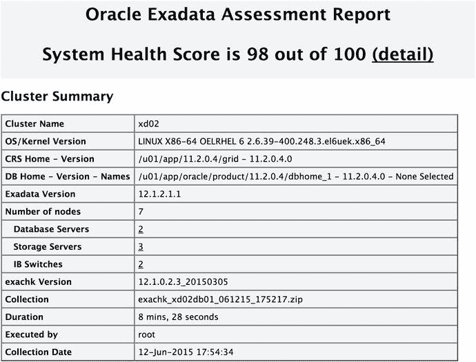
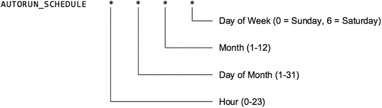

# exachk

长期以来，“最佳实践”这个说法一直让数据库专业人士感到不快。正如俗话所说，“它们只是在更好的实践出现之前被称为最佳实践”。My Oracle Support 网站包含多篇关于 Exadata 最佳实践的详尽说明。核心的“Oracle Exadata 最佳实践”支持说明链接到另外 12 个说明，这些说明涵盖了运行 Exadata 环境的最佳实践。这些说明涉及管理 Exadata 环境的诸多不同方面：设置、性能、高可用性、迁移、OLTP、数据仓库等等。要跟上这些变化是一项艰巨的任务（MOS 笔记#1274318.1，“Oracle Sun 数据库机器设置/配置最佳实践”打印出来竟然长达 127 页）。值得庆幸的是，Oracle 提供了一个名为`exachk`的标准健康检查实用程序，它会根据所有这些建议来检查您的 Exadata 系统。

`exachk`脚本可从 MOS 笔记#1070954.1 获取，通常每季度更新一次。由于其运行的检查会随每个版本而改变，因此在运行`exachk`之前，您应始终确保使用的是最新版本。它最初是专门针对 Exadata 环境编写的脚本，但现已成为验证 Oracle 许多其他集成系统配置的标准脚本。它将对机架中的硬件以及 Oracle 软件二进制文件和数据库本身执行详尽的检查。`exachk`是一个灵活的工具，可以针对部分目标运行，也可以针对整个系统运行。

## exachk 简介

从 My Oracle Support 下载`exachk`捆绑包后，通常将其放置在集群中第一个计算节点的`/opt/oracle.SupportTools/exachk`目录中。该目录应由用于安装 Grid Infrastructure 软件的操作系统账户拥有（通常是`oracle`或`grid`）。这在采用不同数据库或软件堆栈部分之间**角色分离**的 Exadata 系统上尤为重要。在一些整合环境中，管理员可能只能访问一个用户账户，该账户运行整个集群中一部分数据库。`exachk`脚本利用到数据库的本地连接，依靠操作系统身份验证来运行数据库检查。假设您有两组数据库管理员，每组有独立的操作系统账户，`orahr`和`oradw`。`orahr`账户用于运行与 HR 应用程序相关的数据库，`oradw`账户用于运行数据仓库数据库。如果管理员只能访问其各自的软件账户，他们可以针对其管理的数据库运行数据库级别的`exachk`报告，而不会影响或访问任何他们被限制访问的堆栈部分。要获取系统的完整概览，`exachk`需要使用`root`权限运行，或者需要输入`root`密码。

由于检查将在集群中的所有节点上执行，因此建议仅在集群中的第一个计算节点上安装`exachk`。一次完整的`exachk`运行会创建一个压缩文件，其中包含跨集群收集的所有原始数据，以及一个 HTML 报告，可查阅该报告以获取有关每次运行的检查的详细信息。报告包括系统评分、集群摘要、最高可用性体系结构计分卡，以及运行期间所有通过或失败检查的完整参考信息。

从 My Oracle Support 获取的捆绑包包含`exachk`文档、示例报告以及一个包含脚本和驱动程序文件的压缩文件。解压`exachk.zip`文件将为您提供运行`exachk`检查 Exadata 集群所需的一切。以下示例展示了如何将压缩文件解压到推荐的`exachk`目录：

```bash
$ unzip -q exachk.zip -d /opt/oracle.SupportTools/exachk

$ ls -al /opt/oracle.SupportTools/exachk/
total 50036
drwxr-xr-x 3 oracle oinstall      4096 Jul 11 15:31 .
drwxr-xr-x 8 root   root          4096 Jan 26 20:43 ..
drwxrwxrwx 3 oracle oinstall      4096 Jul  2 14:56 .cgrep
-rw-r--r-- 1 oracle oinstall   4114714 Jul  2 14:54 CollectionManager_App.sql
-rw-r--r-- 1 oracle oinstall  39700004 Jul  2 14:56 collections.dat
-rwxr-xr-x 1 oracle oinstall   2209024 Jul  2 14:54 exachk
-rw-r--r-- 1 oracle oinstall      2533 Jul  2 14:56 readme.txt
-rw-r--r-- 1 oracle oinstall   5071756 Jul  2 14:56 rules.dat
-rw-r--r-- 1 oracle oinstall     39612 Jul  2 14:54 sample_user_defined_checks.xml
-rw-r--r-- 1 oracle oinstall      2758 Jul  2 14:54 user_defined_checks.xsd
-rw-r--r-- 1 oracle oinstall       291 Jul  2 14:56 UserGuide.txt
```


### 运行 exachk

文件已准备就绪，现在可以执行首次 `exachk` 运行了。以 root 用户身份在第一个计算节点上执行 `./exachk`，即可在交互模式下启动 `exachk`。启动后，`exachk` 将首先查询集群中所有正在运行的数据库。您可以选择全部、不选或部分数据库。`exachk` 将根据您在查询时指定的数据库运行配置和参数检查。这些数据库检查将在集群中并行执行，以最小化运行脚本所需的时间。以下文本显示了最近一次 `exachk` 运行中的数据库选择提示。如您所见，默认选项是检查集群上的所有数据库：

```
Searching for running databases . . . . .
. . . . . . . . . . . . . . . . . . . . . . . . . . . . . . . . . . . .
List of running databases registered in OCR
1. ACSTBY
2. BDT
3. BIGDATA
4. dbfs
5. dbm
6. demo
7. All of above
8. None of above
Select databases from list for checking best practices. For multiple databases, select 7 for All or comma separated number like 1,2 etc [1-8][7].
```

请记住，`exachk` 会对硬件和操作系统执行许多配置检查。因此，该脚本需要所有待检查节点的 `root` 权限。事实上，Oracle 已更改其先前的建议，现在要求以 `root` 身份运行 `exachk`（从版本 12.1.0.2.2 开始）。旧版的 Exadata 系统会自动配置为允许计算节点和存储节点之间以 `root` 身份进行无密码访问。这一限制在 2014 年发生了变化，当时 Exadata 的配置脚本经过重写，移除了此功能。一些客户将此无密码访问视为安全风险，因此 Oracle 已将其从默认配置中移除。如果您的系统未配置 SSH 等效性，`exachk` 将需要一种方式来以 `root` 权限执行。在处理 `root` 密码时，以交互模式运行 `exachk` 会为用户提供几个选项：

1.  手动输入所有主机的 `root` 密码。
2.  如果运行 `exachk` 的用户账户不是 `root`，则利用 `sudo` 权限。
3.  跳过本次运行的 `root` 检查。

如果您选择输入 `root` 密码，它将仅保存在 `exachk` 进程的内存中，而不会写入磁盘。密码仅在运行期间存储在内存中——脚本完成后，密码将不再保存。如果集群中的主机之间已配置 SSH 用户等效性，`exachk` 根本不会要求输入密码。在未配置 SSH 用户等效性的情况下运行时，`exachk` 会分别询问存储单元、计算节点以及 InfiniBand 交换机的密码。

### 配置 exachk 运行

如果您更倾向于仅检查集群内的一部分主机，表 D-1 列出了一些可以包含在 `exachk` 命令中以自定义运行的参数。

表 D-1. `exachk` 命令参数

| 配置参数 | 描述 |
| --- | --- |
| `-clusternodes` | 对逗号分隔列表中的主机运行检查。默认情况下，`exachk` 将对 `olsnodes` 命令返回的所有主机运行检查。 |
| `-cells` | 对逗号分隔列表中的存储服务器运行检查。默认情况下，`exachk` 针对 `cellip.ora` 文件中列出的所有主机执行。 |
| `-ibswitches` | 对指定的 InfiniBand 交换机运行检查。默认情况下，`exachk` 针对 `ibswitches` 命令列出的交换机执行。 |
| `-dbnames` | 对逗号分隔的数据库列表运行检查。 |
| `-dball` | 对集群上运行的所有数据库运行检查。 |
| `-dbnone` | 跳过所有数据库检查。 |

如果我们希望 `exachk` 不检查任何数据库，但对第一个计算节点、存储服务器和 InfiniBand 交换机执行检查，我们将使用以下选项启动 `exachk`：

```
# ./exachk -clusternodes enkx4db01 -cells enkx4cel01 -ibswitches enkx4sw-iba -dbnone
```

### 理解报告

`exachk` 完成后，会给出 HTML 报告的位置以及一个包含运行期间生成的所有文件的压缩包。通常只需报告文件，但 zip 文件还包含其他有用信息，包括每个 Oracle 软件主目录的补丁清单文件以及所有检查的原始数据。



图 D-1. exachk 报告摘要

`exachk` HTML 报告是系统全面的配置检查。这些检查包括但不限于以下内容：

*   操作系统内核版本
*   Oracle 数据库主目录、补丁级别以及在其中注册的数据库
*   Exadata 软件镜像版本
*   最高可用性架构 (MAA) 对比
*   每台主机上所有硬件组件的固件版本
*   操作系统配置文件
*   ASM 磁盘组对最佳实践的遵循情况
*   Oracle 集群件参数
*   数据库参数检查
*   Exadata 存储服务器警报检查
*   InfiniBand 交换机配置

第一部分包括系统摘要和 Exadata 机架的总体评分。虽然大家都喜欢比较分数，但请记住，分数本身不如围绕失败检查的详细信息重要。系统摘要之后紧接着是“需要关注的发现”部分。您将在报告中在此处找到所有重要消息。发现按主机类型分类，包括问题的简要描述、哪些组件未通过检查，以及指向报告中更多详细信息的链接。单击该链接将带您到该检查的详细概要：引用描述该发现的 My Oracle Support 说明、修复失败所需的措施，以及最重要的是，在每个被调查组件上该检查的结果。

在“需要关注的发现”部分之后，您将看到 MAA 评分卡部分。此评分卡根据 Oracle 的最高可用性架构验证数据库。这些检查包括查看每个数据库的 Data Guard 配置、是否启用了闪回，以及是否存在块损坏和各种数据库参数。虽然许多客户可能无法完全通过 MAA 检查，但它们提供了 Oracle 从高可用性角度所推荐做法的宝贵见解。最后，提供了“基础设施和软件配置摘要”。此部分详细说明了主机的配置，包括网络设置、ASM 存储利用率和 Exadata 存储服务器配置。

### 使用配置文件

Oracle 还提供了几个配置文件，可与 `exachk` 一起使用以执行特定的检查子集。可以通过在用于启动 `exachk` 的命令中添加 `–profile` 参数来选择这些配置文件。表 D-2 定义了 `exachk` 版本 12.1.0.2.4 中可用的配置文件。

表 D-2. `exachk` 配置文件

| 配置文件 | 描述 |
| --- | --- |
| `asm` | ASM 特定检查 |
| `clusterware` | Oracle 集群件的验证检查 |
| `dba` | 数据库配置检查 |
| `maa` | 最高可用性架构检查和评分卡 |
| `storage` | Exadata 存储服务器检查 |
| `switch` | InfiniBand 交换机检查 |
| `sysadmin` | 系统管理员专用检查 |


### 为 exachk 保存密码

许多组织会保护其 Exadata 机架的 root 密码（理应如此）。限制分发 root 密码会使以交互模式运行 `exachk` 变得非常困难，因为它每次运行都会请求 root 密码。其他组织则不允许 DBA 直接以 root 身份运行命令。Oracle 通过允许 `exachk` 存储密码并以守护进程模式运行来解决这些问题。当主机启动时，管理员必须以交互模式并使用特定的 `-d` 开关运行 `exachk` 脚本。提示将与正常的交互式 `exachk` 运行相同，但检查不会执行。相反，会留下一个进程运行，用于存储输入的密码。该进程不会向磁盘写入任何文件，因此密码仅保存在内存中。只要守护进程正在运行，管理员就可以根据需要运行任意多次 `exachk`，而无需输入任何密码。如果主机重启，则必须重新启动 `exachk` 守护进程并再次输入密码。以下展示了以守护进程模式启动 `exachk`。在此示例中，`exachk` 将仅检查 `dbm01` 数据库：

```
# ./exachk -d start

Checking ssh user equivalency settings on all nodes in cluster
Node enkx4db02 is configured for ssh user equivalency for root user
Node enkx4db03 is configured for ssh user equivalency for root user
Node enkx4db04 is configured for ssh user equivalency for root user
Searching for running databases . . . . .
. . . . . . . . . . . . . . . . . . . . . . . . . . . . . . . . . . . . . . . . . .
List of running databases registered in OCR
1. dbm01
2. demo
3. db12c
4. All of above
5. None of above
Select databases from list for checking best practices. For multiple databases, select 4 for All or comma separated number like 1,2 etc [1-5][4]. 1
Searching out ORACLE_HOME for selected databases.
. . . . . . . . . . . . . . . . . . . . . .
Checking Status of Oracle Software Stack - Clusterware, ASM, RDBMS
. . . . . . . . . . . . . . . . . . . . . . . . . . . . . . . . . . . . . . . . . . . . . . . . . . . . . . . . . . . . . . . . . . . . . . . . . . . .
--------------------------------------------------------------------------------------------
Oracle Stack Status
--------------------------------------------------------------------------------------------
Host Name  CRS Installed  RDBMS Installed  CRS UP    ASM UP    RDBMS UP  DB Instance Name
--------------------------------------------------------------------------------------------
enkx4db01   Yes             Yes             Yes        Yes      Yes      dbm011
enkx4db02   Yes             Yes             Yes        Yes      Yes      dbm012
enkx4db03   Yes             Yes             Yes        Yes      Yes      dbm013
enkx4db04   Yes             Yes             Yes        Yes      Yes      dbm014
--------------------------------------------------------------------------------------------
Skipping version checks merge as RAT_SKIP_MERGE_INTERNAL is set
Copying plug-ins
. . . . . .
root user equivalence is not setup between enkx4db01 and STORAGE SERVER enkx4cel02 (192.168.12.12).
1. Enter 1 if you will enter root password for each STORAGE SERVER when prompted.
2. Enter 2 to exit and configure root user equivalence manually and re-run exachk.
3. Enter 3 to skip checking best practices on STORAGE SERVER.
Please indicate your selection from one of the above options for STORAGE SERVER[1-3][1]:- 1
Is root password same on all STORAGE SERVER[y/n][y] y
Enter root password for STORAGE SERVER :-
Verifying root password.
. . . . . . . . . . . . . . . . . . . . . . . . .
9 of the included audit checks require root privileged data collection on INFINIBAND SWITCH .
1. Enter 1 if you will enter root password for each INFINIBAND SWITCH when prompted
2. Enter 2 to exit and to arrange for root access and run the exachk later.
3. Enter 3 to skip checking best practices on INFINIBAND SWITCH
Please indicate your selection from one of the above options for INFINIBAND SWITCH[1-3][1]:- 1
Is root password same on all INFINIBAND SWITCH ?[y/n][y] n
. Enter root password for INFINIBAND SWITCH enkx4sw-ibb :-
Verifying root password.
. . . . Enter root password for INFINIBAND SWITCH enkx4sw-ibs :-
Verifying root password.
. . . . Enter root password for INFINIBAND SWITCH enkx4sw-iba :-
Verifying root password.
. . .
exachk daemon is started with PID : 53208
```

`exachk` 被指示启动守护进程模式，这由 `-d start` 选项表示。如果您想运行 `exachk` 并利用由 `exachk` 守护进程存储的凭证，只需在 `exachk` 命令中添加 `--daemon`。执行 `exachk` 时使用 `--d status` 或 `--d info` 可以查看有关运行中守护进程的信息：

```
# ./exachk -d status
exachk daemon is running. Daemon PID : 53208

# ./exachk -d info
----------------------------------------------------------
exachk daemon information
----------------------------------------------------------
install node = enkx4db01
exachk daemon version = 12.1.0.2.4_20150702
Install location = /tmp/exachk
Started at = Mon Jul 06 21:30:34 CDT 2015
```


### 自动化执行 `exachk`

建议每月运行 `exachk`，以评估 Exadata 系统的整体运行状况。使用 `exachk` 守护进程时，可以根据您的需求安排周期性的 `exachk` 执行。这种自动运行功能允许进行类似于标准 Linux `cron` 工具的调度，并可为各种需求设置多个计划。执行 `exachk` 并指定 `AUTORUN_SCHEDULE` 参数来定义计划。图 D-2 显示了用于调度自动运行功能的选项。


*图 D-2. AUTORUN_SCHEDULE 选项*

如您所见，`AUTORUN_SCHEDULE` 与 `cron` 类似，但不允许指定执行 `exachk` 脚本的具体分钟。使用 `AUTORUN_SCHEDULE` 时，`exachk` 总是在整点执行。除了 `AUTORUN_SCHEDULE`，Oracle 还建议包含一个 `NOTIFICATION_EMAIL` 和 `PASSWORD_CHECK_INTERVAL`。`PASSWORD_CHECK_INTERVAL` 参数定义了 `exachk` 守护进程验证内存中存储的密码是否仍然有效的频率。如果密码发生更改，守护进程将向 `NOTIFICATION_EMAIL` 定义的地址发送电子邮件。此外，当计划的 `exachk` 运行完成后，最终的 HTML 报告将被发送到 `NOTIFICATION_EMAIL` 参数中列出的地址。

以下示例展示了如何创建一个在每周一晚上 10 点执行的自动运行计划：
```
# ./exachk -id Monday_Night -set "AUTORUN_SCHEDULE=22 * * 1;
NOTIFICATION_EMAIL=user@example.com;
PASSWORD_CHECK_INTERVAL=1"
Created autorun_schedule for ID[Monday_Night]
Created notification_email for ID[Monday_Night]
Created password_check_interval for ID[Monday_Night]
```

可以使用 `–id` 参数为计划命名。这允许为不同的计划设置不同的选项或配置文件。例如，DBA 可以获得针对数据库子集运行的特定 `exachk` 报告，而系统管理员可以每月收到一份概述存储单元状态的 `exachk` 报告。如果您想查看通过 `exachk` 守护进程配置的所有计划，请使用 `–get all` 参数启动 `exachk`。

在以下示例中，有两个计划：`Monday_Night` 和 `Tuesday_Night`。`Tuesday_Night` 计划执行仅检查存储服务器的“storage”配置文件：
```
# ./exachk -get all
ID: Monday_Night
----------------------------------
autorun_schedule = 22 * * 1
notification_email = user@example.com
password_check_interval = 1

ID: Tuesday_Night
----------------------------------
autorun_schedule = 22 * * 2
notification_email = sysadmin@example.com
password_check_interval = 1
autorun_flags = -profile storage
```

最后，您可以查询 `exachk` 守护进程以查看下一次自动运行何时发生。查询 `exachk` 守护进程并添加 `nextautorun` 参数，将告知下一次 `exachk` 自动运行发生的时间以及将调用它的计划：
```
# ./exachk -d nextautorun
ID: Monday_Night
Next auto run starts on Jul 13, 2015 22:00:00
```

先前的 `exachk` 报告将保存在启动 `exachk` 守护进程的目录中（通常是 `/opt/oracle.SupportTools/exachk`）。当计划了自动运行时，发送的电子邮件通知会将当前运行与上一次进行比较。电子邮件将给出通过、失败和跳过的检查项数量，以及运行之间的对比。同时，还会创建一份详细说明两次运行之间差异的报告，并在电子邮件中引用。如果需要进一步调查，必须从服务器下载此报告。

## 总结

最佳实践并非一旦写就便一成不变的静态建议。Oracle 明白，从这个角度看，Exadata 是一个不断发展的目标。无论是由于开发出了更强大的硬件和软件而导致建议改变，还是由于发现了现有软件的问题，用于验证环境的工具也必须随之改变。虽然它肯定不是一个能在每个问题发生前就将其捕获的工具，但 `exachk` 能够利用 Exadata 标准化的特性，运行大量验证检查，而这些检查如果是在自建系统上开发，将需要数月时间。


