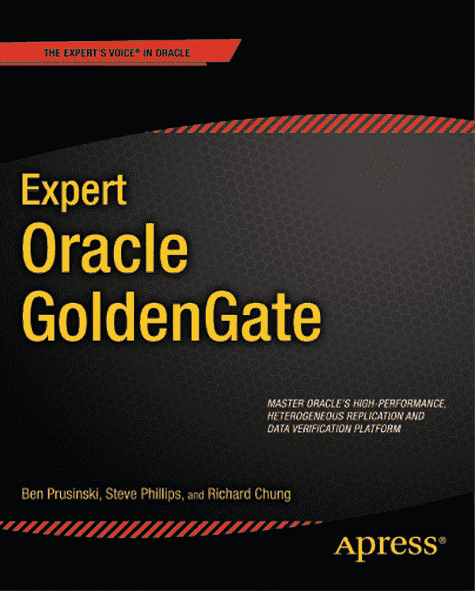
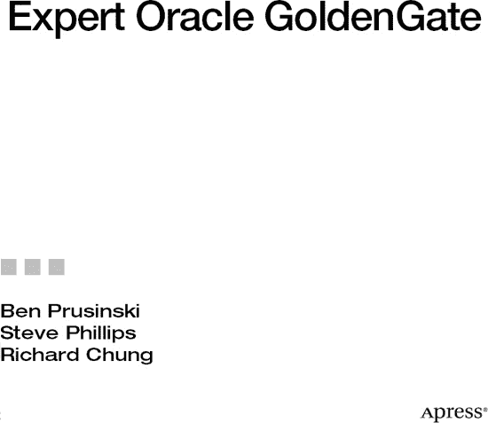

# 精通 Oracle GoldenGate

版权所有 © 2011 Ben Prusinski, Steve Phillips 与 Richard Chung

保留所有权利。未经版权所有者及出版商的书面许可，不得以任何形式或任何方式（包括电子、机械、影印、录音或任何信息存储与检索系统）复制或传播本作品的任何部分。

ISBN-13 (平装): `978-1-4302-3566-8`
ISBN-13 (电子): `978-1-4302-3567-5`

本书中可能出现商标名称、标识和图片。我们仅在编辑目的下使用这些名称、标识和图片，旨在为商标所有者带来益处，并无侵犯商标的意图。

本书中使用商品名称、商标、服务标识及类似术语，即使未特别标明，也不表示这些术语不受专有权约束。

总裁兼出版人: Paul Manning
主编: Jonathan Gennick
技术审校: Arup Nanda
编辑委员会: Steve Anglin, Mark Beckner, Ewan Buckingham, Gary Cornell, Jonathan Gennick, Jonathan Hassell, Michelle Lowman, Matthew Moodie, Jeff Olson, Jeffrey Pepper, Frank Pohlmann, Douglas Pundick, Ben Renow-Clarke, Dominic Shakeshaft, Matt Wade, Tom Welsh
协调编辑: Anita Castro
文字编辑: Tiffany Taylor 与 Mary Behr
排版: Bytheway Publishing Services
索引: BIM Indexing & Proofreading Services
美工: SPI Global
封面设计: Anna Ishchenko

本书通过 Springer Science+Business Media, LLC.（地址：美国纽约州纽约市斯普林街 233 号 6 层，邮编：10013。电话：1-800-SPRINGER，传真：(201) 348-4505，电子邮箱：[`orders-ny@springer-sbm.com`](http://orders-ny@springer-sbm.com)，或访问 [`www.springeronline.com`](http://www.springeronline.com)）向全球图书贸易发行。

有关翻译事宜，请发送电子邮件至 [`rights@apress.com`](http://rights.apress.com)，或访问 [`www.apress.com`](http://www.apress.com)。

Apress 和 friends of ED 图书可批量购买用于学术、企业或推广用途。大多数书名也提供电子书版本和许可。更多信息，请参考我们的批量销售-电子书许可网页：[`www.apress.com/bulk-sales`](http://www.apress.com/bulk-sales)。

本书信息按“原样”提供，不作任何担保。尽管在编写过程中已采取一切预防措施，但作者和 Apress 对因本书信息直接或间接造成或据称造成的任何损失或损害不向任何个人或实体承担任何责任。

本书源代码可在 [`www.apress.com`](http://www.apress.com) 获取。读者需要回答与本书相关的问题才能成功下载代码。

## 内容概览

关于作者
关于技术审校
致谢

第 1 章：简介
第 2 章：安装
第 3 章：架构
第 4 章：基础复制
第 5 章：高级特性
第 6 章：异构复制
第 7 章：性能调优
第 8 章：监控 Oracle GoldenGate
第 9 章：Oracle GoldenGate Veridata
第 10 章：GoldenGate Director
第 11 章：Oracle GoldenGate 故障排除
第 12 章：灾备复制
第 13 章：零宕机时间迁移复制
第 14 章：技巧与窍门
附录：Oracle GoldenGate 管理员的额外技术资源
索引

## 目录

关于作者

关于技术审阅者

致谢

## 第 1 章：简介

### 分布式处理与复制

### Oracle 基础复制

### Oracle 高级复制

### Oracle Streams 复制

### 演进与 Oracle GoldenGate

### 小结

## 第 2 章：安装

### 下载软件

#### 从 Oracle E-Delivery 下载

#### 从 OTN 下载

### 了解您的环境

### 审阅安装说明

### 安装 GoldenGate

### 一般系统要求

##### 内存要求

##### 磁盘空间要求

##### 网络要求

##### 操作系统要求

##### Microsoft Windows 集群环境的要求

#### 在 Windows 上安装 GoldenGate

#### 在 Linux 和 UNIX 上安装 GoldenGate 11g

#### 在 Linux 和 UNIX 上设置 Oracle 与 GoldenGate 的环境

#### GoldenGate 与 Oracle RAC 注意事项

#### 在 Windows 上为 Microsoft SQL Server 安装 GoldenGate

#### 在 Windows 和 UNIX 上为 Teradata 安装 GoldenGate

#### 在 Windows 和 UNIX 上为 Sybase 安装 GoldenGate

#### 在 Windows 和 UNIX 上为 IBM DB2 UDB 安装 GoldenGate

### 安装 Oracle GoldenGate Director 11g

### 系统要求

#### 安装 Oracle GoldenGate Director Server

##### 向 Oracle GoldenGate Director Server 模式授予数据库权限和凭证

#### 安装 Oracle GoldenGate Director

##### 安装 Oracle GoldenGate Veridata

#### GoldenGate Veridata Agent 系统要求

### GoldenGate Veridata Agent 磁盘要求

### GoldenGate Veridata Agent 内存要求

### GoldenGate Veridata Agent 数据库权限

#### GoldenGate Veridata Server 系统要求

安装 Oracle Goldengate Veridata

摘要

## 第 3 章：架构

### 典型的 GoldenGate 流程

### GoldenGate 组件

#### 源数据库

#### 捕获（本地抽取）进程

#### 源端 Trail 文件

### 数据泵

#### 网络

#### 收集器

#### 远程 Trail 文件

#### 投递（复制）

#### 目标数据库

#### 管理器

### 拓扑与用例

#### 单向复制

#### 双向复制

#### 广播复制

#### 集成复制

### 工具与实用程序

#### `GGSCI`

#### `DEFGEN`

#### `Logdump`

#### `Reverse`

#### `Veridata`

#### `Director`

### 摘要

## 第 4 章：基础复制

### 概述

### 设置复制的先决条件

### 要求

#### 单向复制拓扑

### 基础复制步骤

#### 启动 `Extract`

#### 验证数据库级补充日志

#### 启用数据库级补充日志

#### 启用表级补充日志

#### 禁用触发器和级联删除约束

#### 验证 `Manager` 状态

#### 配置本地 `Extract`

##### 添加 `Extract`

##### 启动和停止 `Extract`

##### 验证 `Extract`

#### 启动数据泵

##### 配置数据泵

##### 添加数据泵

##### 启动和停止数据泵

##### 验证数据泵

### 使用 GoldenGate 进行加载

#### GoldenGate 初始加载的先决条件

#### 配置初始加载 `Extract`

##### 添加初始加载 `Extract`

#### 配置初始加载 `Replicat`

##### 添加初始加载 `Replicat`

#### 启动 GoldenGate 初始加载

#### 验证初始加载

### 使用 `DBMS` 工具加载

#### 使用 `DBMS` 工具加载的先决条件

#### 使用 `DBMS` 工具加载的步骤

### 启动复制（Replicat）
### 配置复制（Replicat）
### 添加复制（Replicat）
### 启动和停止复制（Replicat）
### 验证复制（Replicat）
### 本章小结
