# 第 13 章：零停机迁移复制

### 先决条件

### 要求

### 零停机迁移拓扑

### 设置


## 目录

- 配置本地抽取以实现零停机迁移
- 配置数据泵以实现零停机迁移
- 配置复制以实现零停机迁移
- 配置回退本地抽取以实现零停机迁移
- 配置回退数据泵以实现零停机迁移
- 配置回退复制以实现零停机迁移
- 执行迁移切换
- 执行迁移回退
- 总结


## 第 14 章：技巧与窍门

- 需求与规划
- 了解业务目标
- 理解需求
- 确定拓扑结构
- 安装与设置
- 创建专用用户
- 加密密码
- 创建专用安装目录
- 使用检查点表
- 验证字符集
- 制定命名标准
- 使用数据泵
- 管理与监控
- 使用 `GGSCI` 命令快捷方式
- 使用 `OBEY` 文件
- 生成临时统计信息
- 使用丢弃文件
- 定期报告进程健康状态
- 定期清除旧的跟踪文件
- 自动启动进程
- 性能
- 运行性能测试
- 限制抽取进程数量
- 为数据泵使用直通模式
- 使用并行复制
- 使用最快的可用存储
- 调优数据库
- 总结


## 附录：Oracle GoldenGate 管理员的附加技术资源

- 扩展阅读参考文献
- Oracle GoldenGate 命令快速指南
  - `ADD`
  - `GGSCI`
  - `HELP`
  - `INFO`
  - `SEND`
  - `STATUS`
- 用于故障排除的 `Logdump` 命令与语法
  - 访问 `Logdump` 实用程序
  - 获取 `Logdump` 语法帮助
  - `HISTORY`
  - 使用 `Logdump` 打开 GoldenGate 跟踪文件


## 索引

## 关于作者

 `Ben Prusinski` 是一名 `Oracle` 认证专家（`OCP`）和数据库架构师，拥有超过 `14` 年的 `Oracle` 数据仓库和 `Oracle E-Business` 应用程序经验。作为企业数据库顾问，`Ben` 已为数十家财富 `500` 强客户提供服务。他是 `Oracle` 高可用性、性能调优、数据库安全和 `ERP` 实施方面的国际公认专家。作为顶级 `Oracle` 专家，`Ben` 于 `2009` 年获得了著名的 `Oracle ACE` 奖，以表彰他对 `Oracle` 社区的贡献。作为 `Oracle GoldenGate` 认证助理，`Ben` 是 `Oracle OpenWorld`、拉丁美洲智利 `Oracle` 用户组（`CLOUG`）、独立 `Oracle` 用户组（`IOUG`）和 `Oracle Collaborate OAUG`（`Oracle` 应用程序用户组）等主要会议上的热门演讲者。除了为客户提供 `Oracle` 咨询服务外，`Ben` 还定期更新他的 `Oracle` 博客 [`http://oracle-magician.blogspot.com`](http://oracle-magician.blogspot.com)，分享最新的数据库技术技巧和信息。`Ben` 也是一位多语言者，精通西班牙语、法语、韩语和英语，他喜欢去异国他乡旅行。在空闲时间，`Ben` 喜欢参加汽车障碍赛、打高尔夫、练习武术、阅读和烹饪。

 `Steve Phillips` 是 `Hewlett-Packard Enterprise Services` 的信息系统架构师，拥有超过二十五年的计算机数据库工作经验。`Steve` 是 `Oracle` 认证专家，曾在 `Oracle Openworld` 和 `IOUG` 上演讲。`Steve` 拥有德克萨斯大学达拉斯分校的信息系统硕士学位，目前居住在德克萨斯州的普莱诺。在业余时间，`Steve` 喜欢打网球、指导棒球和观看体育比赛。

 `Richard Chung` 拥有 `19` 年的 `IT` 环境各方面实践经验。他近期专注于商业智能领域，如报表、`ETL` 和数据架构。`Richard` 是喜达屋酒店及度假村国际集团的首席 `BI` 和系统架构师，他在那里构建了当前的数据仓库和报表应用程序；他还编写了高度复杂的搜索引擎，并设计了 `ETL` 来近实时地填充活动数据仓库。`Golden Gate` 用于同步美国不同城市的关键业务数据。在加入喜达屋之前，他曾在一家初创公司 [dot.com](http://dot.com)、`JP Morgan Chase` 和 `Ernst & Young` 工作。

## 关于技术审校

 `Arup Nanda` ([`arup@proligence.com`](http://arup@proligence.com)) 担任 `Oracle DBA` 已超过 `16` 年，从事 `Oracle` 数据库管理的各个方面工作，从建模到性能调优。他合著了四本书，发表了 `300` 篇文章，并在各种技术会议上进行了超过 `150` 场演讲；他还于 `2003` 年获得了 `Oracle` 颁发的年度 `DBA` 大奖。他是 `Oracle ACE Director`，频繁的博主（[`arup.blogspot.com`](http://arup.blogspot.com)），并且是 `Oak Table Network` 和 `SELECT Journal` 编辑委员会的成员。他居住在康涅狄格州的丹伯里。

## 第 1 章


## 引言

甲骨文公司于 2009 年收购了 GoldenGate，作为其在未来数据仓库和实时事务管理产品套件中实施高级复制技术战略的一部分。在 Oracle GoldenGate 技术出现之前，数据复制是使用 Oracle Streams 和第三方复制解决方案（如 Quest SharePlex）来完成的。本章将讨论各类数据库复制方法及其所使用的技术，以说明 Oracle GoldenGate 如何成为面向当前及未来基于 Oracle 数据库系统的实时数据事务复制技术的逻辑终点。

在本章讨论 Oracle GoldenGate 软件的基础知识之前，有必要简要回顾一下数据库复制技术的历史。在 GoldenGate 软件出现之前，对于非关系型数据库，数据事务的复制是通过文件传输协议（`FTP`）进行简单的文件传输来跨网络实现的。随着 UNIX 操作系统的普及和客户端-服务器计算的出现，在 Oracle 数据库软件的第 8 版中，通过 Oracle 基础和高级复制软件实现了数据复制。

### 分布式处理与复制

Oracle 第 5 版以数据库链接的形式引入了分布式处理查询。数据库链接提供了跨网络执行 SQL 查询的能力，是实现复制解决方案的首次真正尝试。图 1-1 展示了如何通过数据库链接在源和目标数据库环境之间建立连接。

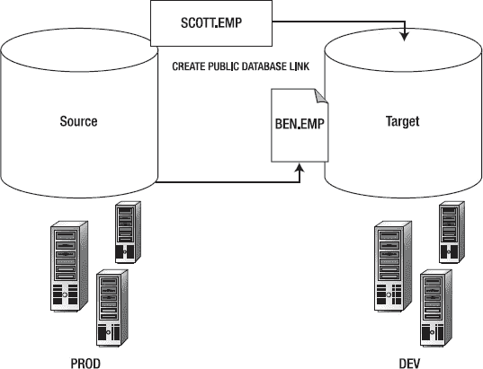

**图 1-1.** 用于分布式系统的数据库链接

数据复制发展的下一步出现在 Oracle 第 8 版中，它使数据库专业人员能够设置基于日志和基于触发器的复制解决方案。

### Oracle 基础复制

Oracle 基础复制有两种形式：基于日志和基于触发器。使用基于日志的复制时，必须在源和目标数据库环境之间设置快照模式和数据库链接。数据从 Oracle 的联机重做日志中提取，以捕获变更并通过网络传播，将数据事务从源数据库（又称主数据库）发送到目标数据库。模式也必须在源和目标数据库上进行配置。此外，还必须配置刷新组以使目标环境与源系统上的主数据库保持同步。可以想象，这种设计在建立成功的冲突解决和制衡系统方面是粗糙且容易出错的。

### Oracle 高级复制

Oracle 高级复制增加了更强大的功能，支持在多环境中进行多主复制，并采用基于触发器的方法来建立冲突解决规则集，以提高数据可靠性并保持源和目标系统之间的准确数据同步。然而，高级复制也有其缺点和缺陷，特别是对某些数据类型缺乏支持，以及基于触发器的冲突处理会发生失败。此外，在保持目标系统与源主系统同步方面，延迟也是一个问题。

图 1-2 展示了在 Oracle 环境中如何为基本和高级复制设置冲突解决。

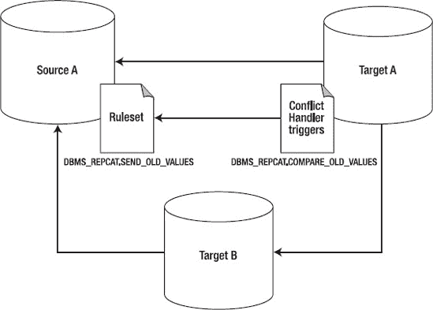

**图 1-2.** Oracle 复制的冲突解决

### Oracle Streams 复制

Oracle 在 9.2 版中引入了 Streams 复制解决方案。Streams 解决了困扰先前版本中旧复制方法的缺陷。它建立了一个基于日志的复制解决方案，从源系统的联机重做日志中挖掘已提交的事务，以将数据移动到下游目标系统。此外，Streams 引入了新的后台进程来维护 Oracle 生态系统内复制活动的通信和操作。

Streams 通过使用高级队列技术来提升复制性能，进一步增强了先前的 Oracle 复制技术。Oracle 高级队列（`AQ`）是随 Streams 以及其他 Oracle 技术（包括 Oracle Data Guard 逻辑数据库）一起设计的一项技术。`AQ`提供了一个基于订阅者和发布者模型的入队和出队系统，用于数据库通信。它允许在源和目标环境之间进行健壮的数据事务消息传递和处理，是 Oracle Streams 处理的核心。

有关如何设置和管理`AQ`的更多详细信息，可在线访问 Oracle 参考文档： [`http://tahiti.oracle.com`](http://tahiti.oracle.com)。

### 演进与 Oracle GoldenGate

随着来自 Oracle 和 Quest SharePlex 的真正基于日志的复制技术的出现，技术进步使得最终能够执行基于实时的复制。在大型机和中型系统领域之外，基于实时事务的复制技术发展领域升起了一颗耀眼的明星。在 20 世纪 80 年代末，一家名为 GoldenGate 的小型软件公司提出了一种在不同数据库平台之间复制数据的不同方法。在 GoldenGate 出现之前，跨平台和跨供应商的数据复制充其量是存在问题的。例如，需要复杂的软件开发才能利用 Oracle 的力量连接到非 Oracle 数据库环境，这需要通过`Pro-C`和软件开发`API`来实现，以允许事务在环境之间移动。

GoldenGate 发明了一种强大且新颖的数据复制方法，同时实现了高性能和准确性。GoldenGate 没有使用不同的格式，而是通过一个名为 GoldenGate 软件命令接口（`GGSCI`）的命令行界面来实施统一格式以执行数据复制操作。`GGSCI`命令用于创建新的 GoldenGate 复制配置以及执行管理任务。已提交的事务存储在源和目标系统文件系统上的称为`trail files`（跟踪文件）的平面文件中。此外，GoldenGate 提供了一种无缝且透明的方法，可以在异构环境之间执行实时数据复制，并保证事务一致性，而无需开发复杂的例程或代码。

### 总结

本引言提供了一个关于数据库复制技术如何演变为强大的 Oracle GoldenGate 技术的历史课程。下一章将向您展示如何安装 Oracle GoldenGate 产品套件。

## 第 2 章

## 安装

与 Oracle 融合中间件（GoldenGate 是其一部分）家族中大多数其他产品套件相比，Oracle GoldenGate 的安装过程是简单的。在本章中，我们将为您提供有关如何准备和执行以下 Oracle GoldenGate 产品完整安装的详细信息：

*   Oracle GoldenGate 11g
*   Oracle GoldenGate Director 11g
*   Oracle GoldenGate Veridata 11g


### 下载软件

对于 Oracle GoldenGate 11g，第一步是通过在线方式或 DVD 介质获取软件。根据您的互联网连接带宽，我们建议现有 Oracle 客户从 Oracle E-Delivery (`http://edelivery.oracle.com`) 下载 Oracle GoldenGate 软件。出于教育和非商业学习目的，Oracle 通过 Oracle 技术网（OTN）`http://otn.oracle.com` 免费提供该软件下载。在本章中，我们将从 `http://edelivery.oracle.com` 下载 Oracle GoldenGate 软件。

我们建议您在 OTN 站点注册一个免费账户，以获取用于试用目的的免费软件、Oracle 白皮书和网络直播。我们还建议您在线查阅 Oracle GoldenGate 的文档（`http://download.oracle.com/docs/cd/E18101_01/index.htm`），以熟悉针对您的数据库和操作系统平台的特定发行说明。虽然本章主要关注 Oracle 数据库平台与 GoldenGate，但我们将针对其他 RDBMS 平台（如 MySQL 和 Teradata）提供 Oracle GoldenGate 的安装要求和指南。

#### 从 Oracle E-Delivery 下载

让我们开始吧，从 `edelivery.oracle.com` 下载 Oracle GoldenGate 软件。如果您更愿意从 OTN 下载，请跳至下一节，我们将展示如何使用 `http://otn.oracle.com`。

图 2-1 展示了介质搜索的结果。如图所示，选择适合您操作系统平台和版本的 Oracle GoldenGate 软件。选择 Oracle Fusion Middleware 作为您的平台。然后指定您的操作系统。

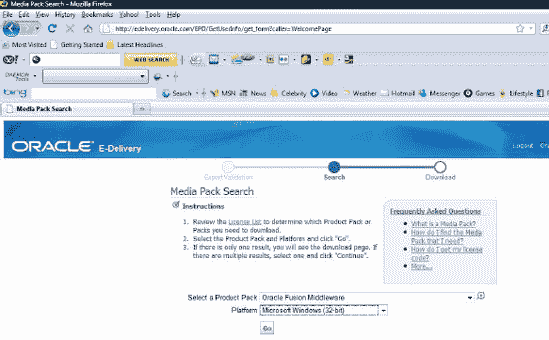

**图 2-1.** 用于获取 Oracle Goldengate 软件的 E-Delivery 网站

选择正确的平台后，您将看到可供下载的 Oracle GoldenGate 软件选项，如图 2-2 所示。

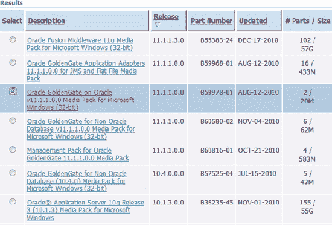

**图 2-2.** 从 E-Delivery 下载 Oracle Goldengate 软件

选择了正确的 Oracle Goldengate 软件后（在我们的示例中是针对 Windows 平台的），您将进入图 2-3 所示的下载屏幕。

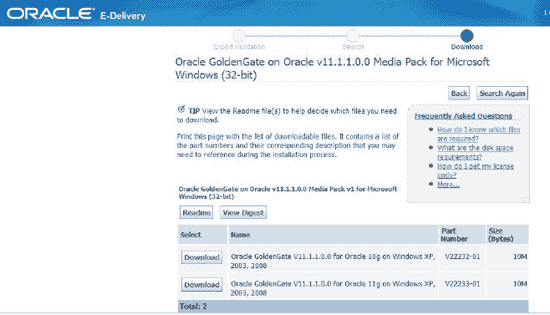

**图 2-3.** 用于获取 Oracle Goldengate 软件的 E-Delivery 网站

此时，我们建议您查看自述文件和发行说明，为安装过程做好最佳准备。投入几个小时阅读，可以避免在安装和配置阶段出现大多数错误。

由于我们将使用带有 Goldengate 的 Oracle 11g，因此我们将选择适用于 Windows XP 平台上 Oracle 11g 的 Oracle GoldenGate 11.1.1.0.0 软件进行下载。

 **注意** 如果您计划在 Linux 上使用 Oracle GoldenGate，您还需要下载适用于 Linux 平台的 Oracle GoldenGate 软件。

图 2-4 提供了 Oracle GoldenGate 介质包的自述说明。

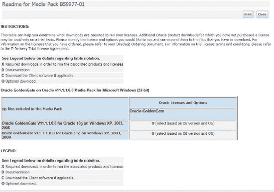

**图 2-4.** Oracle Goldengate 软件安装的 README 说明

#### 从 OTN 下载

对于希望建立测试演示环境以学习如何使用 Oracle Goldengate 软件的读者，我们建议您如下所示从 `http://otn.oracle.com` 的 OTN 下载软件。Oracle 允许您将 GoldenGate 软件用于教育目的，无需购买许可证。如果要在生产环境中使用，您应从 E-Delivery 站点下载软件。图 2-5 显示了 Oracle 技术网（OTN）网站。

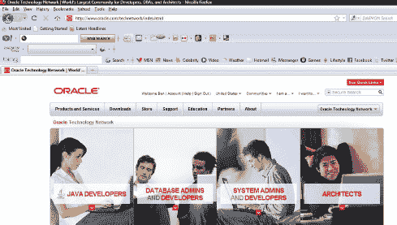

**图 2-5.** OTN 网站

由于 OTN 是一个庞大的网站，找到实际获取 Oracle Goldengate 软件的位置可能有点棘手。别担心——向下滚动页面，您会在左侧找到文档和软件列表。图 2-6 显示了 Oracle GoldenGate 可用的软件下载和文档链接。

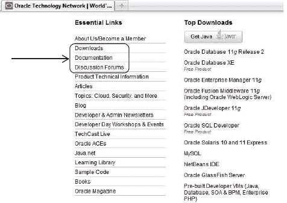

**图 2-6.** 从 OTN 网站下载 Oracle Goldengate

点击 OTN 上的下载链接后，您将看到图 2-7 所示的 Oracle 软件下载列表。

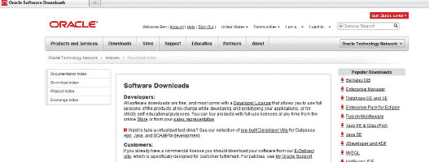

**图 2-7.** 从 OTN 网站下载 Oracle Goldengate

在 OTN 网站的软件下载标题下，您需要先接受许可协议才能下载。接受后，您可以下载适用于您平台的 Goldengate 软件，用于试用、教育和非生产用途。请务必导航到中间件软件标题下，如图 2-8 所示，因为 Oracle 将 Goldengate 归类为 Oracle 融合中间件产品家族的一部分。

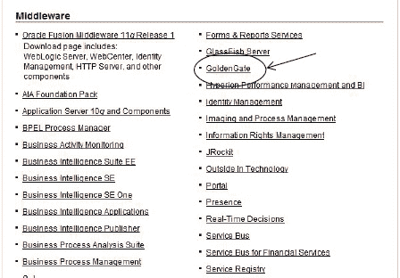

**图 2-8.** 从 OTN 网站下载 Oracle Goldengate

点击 GoldenGate 超链接，您可以下载 Oracle Goldengate 所需的所有软件包，包括 Director 和 Veridata（图 2-9）。

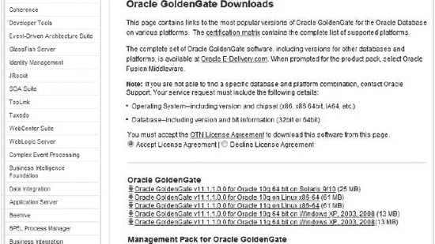

**图 2-9.** 从 OTN 网站下载 Oracle Goldengate

现在您已经了解了如何获取和下载 Oracle Goldengate 软件及文档，是时候为我们的测试环境执行安装和配置了。

### 了解您的环境

在安装之前，您应该充分了解您的目标环境。例如，您可能希望为 Oracle 11g 数据库环境同时安装 Linux 和 Windows。在表 2-1 中，我们展示了一个可用作 Oracle GoldenGate 沙盒环境的测试配置。我们还建议您安装 Oracle 11g 附带的示例模式，以便在使用 GoldenGate 时拥有示例测试数据。我们的测试平台将包括表 2-1 中的配置。

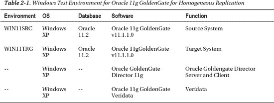

在本书中，我们还将使用来自 Linux 平台的示例，因此如果您愿意，可以跟随使用 Windows、Linux 或两种设置。表 2-2 显示了将使用的测试 Linux 配置。

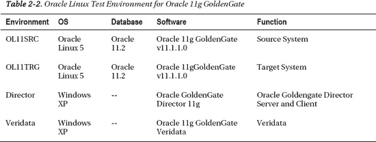

表 2-3 显示了我们即将在关于异构复制的章节中使用的配置。此处的“异构”指的是跨数据库品牌的复制。

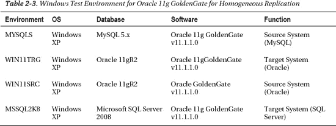

我们建议您从 OTN 或 Oracle E-Delivery 下载适用于 MySQL 和 Microsoft SQL Server 平台的 Oracle Goldengate 11g 软件，为我们在第 6 章中关于使用 Goldengate 进行异构复制的练习做好准备。

如果您需要 MySQL 数据库软件，可以从 `www.mysql.com/downloads/enterprise/` 下载。Microsoft SQL Server 2008 Personal Express Edition 数据库软件可从 `www.microsoft.com/express/Database/` 获取，或者，您也可以使用 Microsoft SQL Server 2008 Enterprise Edition 的试用许可证版本来执行本书中的练习。您可以从 `www.microsoft.com/sqlserver/2008/en/us/trial-software.aspx` 下载为期 180 天的试用版许可证。

现在，让我们深入了解在安装 Oracle Goldengate 软件之前必须完成的系统和数据库先决条件。


### 审阅安装说明

Oracle GoldenGate 文档提供了大量的安装和配置指南，可从 OTN（Oracle 技术网络）获取，地址为 [`www.oracle.com/technetwork/middleware/goldengate/documentation/index.html`](http://www.oracle.com/technetwork/middleware/goldengate/documentation/index.html)。图 2-10 展示了一份指南列表，这些指南阐述了 Oracle GoldenGate 的安装、配置和支持流程。

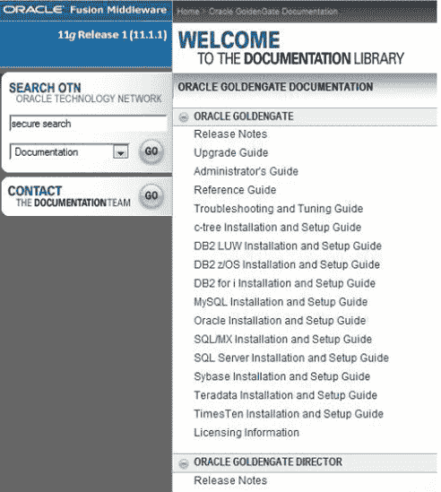

`图 2-10. Oracle GoldenGate 文档库`

根据您的具体平台和基础设施设计，您需要查阅上图所示的相应指南。作为第一步，我们建议您审阅所有发行说明，以避免在安装完成前、安装过程中及安装后出现潜在错误问题。Oracle GoldenGate 软件的每个版本发布时，开发团队都会及时发现新的缺陷并提供补丁以解决已知问题。

 `注意` 在安装 Oracle GoldenGate 软件前，请务必查阅发行说明。

### 安装 GoldenGate

在 Windows 和 Linux 平台上安装 Oracle GoldenGate 软件之前，请务必确认源和目标 Oracle 数据库服务器均已在线并可用。这意味着除了检查确保这些 Oracle 实例和数据库已在线外，您还需要测试两台服务器主机之间的网络连通性。如果 GoldenGate 无法通过 TCP/IP 网络连接访问主机，软件将无法正常运行。您可以使用 `ping` 网络实用程序来检查网络连通性。如果源和目标环境之间存在网络超时问题，您需要在网络管理员协助下解决此问题，然后再安装 Oracle GoldenGate 软件。

##### 通用系统要求

使用 Oracle 和 GoldenGate 的基本安装要求在 Windows、Linux 和 UNIX 平台上是标准的，涵盖所支持的 Oracle 数据库版本、内存要求、磁盘空间分配、网络要求和操作系统支持。我们将在本节中涵盖所有这些方面。

##### 数据库服务器版本

Oracle 11g GoldenGate 支持以下 Oracle 数据库版本：

*   Oracle 9iR2 (9.2)
*   Oracle 10gR1/R2 (10.1/10.2)
*   Oracle 11gR1/R2 (11.1/11.2)

自 Oracle GoldenGate 11g 起，上述 Oracle 版本均支持 DML 和 DDL 复制。不提供对 Oracle 旧版本（如 Oracle v7 和 Oracle 8i）的支持。如果您计划在 Oracle 数据库环境中实施 GoldenGate，我们建议您将数据库升级到 Oracle 11g。

##### 内存要求

每个 GoldenGate `Replicat` 和 `Extract` 进程至少需要 25 到 55 MB 的 RAM 内存。每个 GoldenGate 实例最多支持 300 个并发的 `Extract` 和 `Replicat` 进程。

作为经验法则，您需要考虑到对于基本的 Oracle GoldenGate 安装，除了 `manager` 进程外，至少还需要 1-2 个 `Extract` 进程和多个 `Replicat` 进程。评估总内存需求的最佳方式是运行 `GGSCI` 命令查看当前报告文件，并检查 `PROCESS AVAIL VM FROM OS (min)` 以确定您的平台是否有足够的交换内存。

接下来让我们考虑安装 Oracle GoldenGate 的磁盘要求。

##### 磁盘空间要求

以下是一些您应采取的措施，以确保有足够的磁盘空间来支持您的 GoldenGate 复制需求：

*   为 Oracle GoldenGate 软件二进制文件分配至少 50–150 MB 的磁盘空间。
*   为每台服务器上每个 GoldenGate 实例的工作目录和文件分配 40 MB 磁盘空间。对于 Oracle GoldenGate 的基本配置，您需要在源系统分配 40 MB，在目标系统分配 40 MB，总计需要 80 MB 磁盘空间。
*   为临时文件分配足够的磁盘空间以满足 GoldenGate 操作的需要。默认情况下，GoldenGate 将临时文件存储在默认安装目录下的 `dirtmp` 目录中。规划临时文件空间的一个良好经验法则是大约 10 GB 磁盘空间。
*   每个跟踪文件至少规划 10 MB 空间。作为经验法则，我们建议您从为每个系统分配至少 1 GB 磁盘空间用于跟踪文件开始。或者，使用 Oracle 提供的以下公式确定要预留的磁盘空间量：
    ```
    [一小时内的日志量] x [停机小时数] x 0.4 = 跟踪文件磁盘空间。
    ```
    计算跟踪文件所需总空间量的一种方法是查询源 Oracle 数据库内的 `V$ARCHIVED_LOG` 视图。以下查询展示了如何操作：
    ```
    select trunc(COMPLETION_TIME),count(*)*100 size_in_MB
    from v$archived_log
    group by  trunc(COMPLETION_TIME);
    TRUNC(COM SIZE_IN_MB
    --------- ----------
    15-MAY-11        500
    ```
    安装 GoldenGate 后运行测试，以测量您特定的事务混合和负载，并评估跟踪文件所需的总磁盘空间。

##### 网络要求

由于 Oracle GoldenGate 软件通过网络在源系统和目标系统之间运行，您必须配置 TCP/IP 网络，以在 DNS 中容纳所有主机，包括将部署在 Oracle GoldenGate 基础架构中的主机名。如果存在防火墙，则必须允许主机通过 `manager`、`Extract` 和 `Replicat` 进程访问所需的开放端口发送和接收数据。必须为 GoldenGate 环境分配此端口范围。

同时，为 GoldenGate `manager`、`Extract` 和 `Replicat` 进程分配端口。默认情况下，`manager` 使用端口 `7840`。我们建议您保留此端口可用。此外，记录分配给 GoldenGate 进程的端口以避免端口冲突。

##### 操作系统要求

在 Windows 下运行时，有以下一些要求：

*   您必须使用管理员帐户来安装 Oracle GoldenGate 软件。
*   您必须安装 Microsoft Visual C++ 2005 SP1 可再发行组件包。您必须使用这些库的 SP1 版本。您可以在 [`www.microsoft.com`](http://www.microsoft.com) 获取适用于您特定 Windows 平台的正确版本。

在 Linux 或 UNIX 下，您应执行以下操作：

*   授予用于安装 Oracle GoldenGate 软件的操作系统（OS）帐户读写权限。
*   在集群环境中，将 Oracle GoldenGate 软件放在所有集群节点均可访问的共享磁盘或共享集群文件系统上。
*   从对 Oracle 数据库软件以及 Oracle 在线重做日志文件具有读/写访问权限的操作系统和数据库系统帐户进行安装。

 `注意` 对于安腾（Itanium）平台，您必须安装 `vcredist_IA64.exe` 运行时库包，它提供了在 Windows 安腾平台上运行 Oracle GoldenGate 所必需的 Visual Studio DLL 库。

##### Microsoft Windows 集群环境的要求

GoldenGate 对于使用 Microsoft 集群的 Windows 环境有一些独特的要求。在执行安装之前，请完成以下步骤：

1.  以管理员权限帐户登录到其中一个集群节点。
2.  选择一个在同一 Microsoft Windows 集群组中具有资源成员资格的驱动器。
3.  确保磁盘组具有集群节点所有权。
4.  将 Oracle GoldenGate 软件放置在集群中所有节点均可访问的共享驱动器上。


#### 在 Windows 上安装 GoldenGate

以下是在 Windows 系统上完整安装 GoldenGate 的逐步指南。流程从下载软件开始，接着解压下载文件，然后进入正式安装环节。

1.  下载适用于 Windows x86 平台的 Oracle 11g GoldenGate 软件。
2.  从 [`http://microsoft.com`](http://microsoft.com) 下载并安装 Microsoft Visual C++ 2005 SP1 可再发行组件包，如 `图 2-11` 所示。

    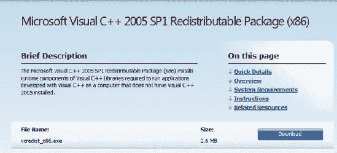

    **图 2-11.** Windows 平台上 Oracle GoldenGate 安装所需的 Microsoft Visual C++包

    下载 Microsoft Visual C++包后，保存文件，然后点击 `vcredist_x86.exe` 文件，如 `图 2-12` 所示。

    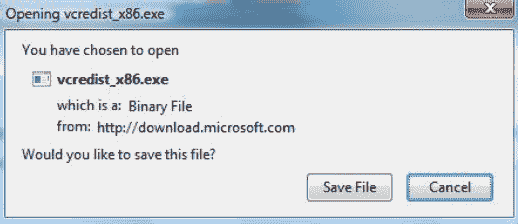

    **图 2-12.** 安装 Microsoft Visual C++库

3.  为 Oracle GoldenGate 软件创建两个新目录，一个作为源目录，另一个作为目标目录：
    ```
    mkdir ggs_src
    mkdir ggs_trgt
    ```
4.  使用 Winzip 或您喜欢的解压工具，将 Oracle 11g GoldenGate 软件解压到源数据库服务器上的 `C:\ggs_src` 目录和目标数据库服务器上的 `C:\ggs_trgt` 目录。
5.  在源和目标系统上执行命令 `ggsci`：
    ```
    ggsci
    ```
6.  在源和目标系统上执行命令 `CREATE SUBDIRS`：
    ```
    create subdirs
    ```
7.  最后，输入命令 `EXIT` 以离开 `ggsci` 环境，完成安装过程。在源和目标机器上都执行此操作。

#### 在 Linux 和 UNIX 上安装 GoldenGate 11g

在开始在 Linux 和 UNIX 平台上为 Oracle GoldenGate 进行安装之前，我们建议您对 Linux 和 UNIX 命令有基本的了解。基本的语法以及诸如 `cp`、`mv`、`tar` 和 `mkdir` 等复制和归档命令的知识对于在此环境中操作至关重要。Oracle ACE Director Arup Nanda 为 Linux 和 UNIX 新手撰写了一系列关于 Oracle Linux 命令掌握的出色在线教程，可在 OTN 上获取：[`www.oracle.com/technetwork/articles/linux/index.html`](http://www.oracle.com/technetwork/articles/linux/index.html)。

 **注意** 确保所有系统、网络和数据库要求都已满足。

您需要使用 `tar` 命令解压适用于 Linux 和 UNIX 平台的文件。解压文件后，如之前在 Windows 上所做的那样，运行 `ggsci` 命令 `CREATE SUBDIRS`。

#### Linux 和 UNIX 上 Oracle 与 GoldenGate 的环境设置

由于 Linux 和 UNIX 平台使用环境变量来配置软件，您必须设置 `ORACLE_HOME` 和 `ORACLE_SID` 环境变量。对于包含 Extract 和 Replicat 的多个进程组，您需要通过添加 `SETENV` 来配置参数文件，如下方的 extract 和 replicat 参数文件语法所示。

```
SETENV (ORACLE_HOME="<ORACLE_HOME directory path>")
SETENV (ORACLE_SID="<ORACLE_SID>")
```

如果您的系统上安装了多个 Oracle 数据库实例，并且运行了 Extract 和 Replicat 进程，则需要在每个 Extract 和 Replicat 进程组的参数文件中都添加一条 `SETENV` 语句。

以下是一个 Extract 参数文件示例：

```
EXTRACT ext1
SETENV (ORACLE_HOME="/oracle/ora11g/product")
SETENV (ORACLE_SID="ora11src")

USERID ggs, PASSWORD ggs
RMTHOST sdtarget
RMTTRAIL /d1/oracle/ggs/dirdat/rt
TABLE scott.emp;
```

对于拥有多个 Oracle 数据库实例的 Windows 服务器，您可以通过将这些设置添加到 Windows 注册表来设置 `ORACLE_HOME` 和 `ORACLE_SID` 环境变量。具体操作路径为：打开“我的电脑”  “设置”  “属性”  “高级”选项卡，然后选择“环境变量”和“系统变量”。

#### GoldenGate 与 Oracle RAC 注意事项

Oracle RAC 已通过 Oracle 认证，支持 GoldenGate 软件。但是，在为 Oracle RAC 环境安装 GoldenGate 时，您需要记住以下几点：

*   所有 GoldenGate 软件二进制文件和可执行文件、轨迹文件和日志文件都应放在所有集群节点可访问的共享存储上。
*   使用 GoldenGate 软件的所有 RAC 节点的系统时钟必须同步。您可以设置网络时间协议（NTP）以确保集群节点保持同步。此外，您可以在 Extract 和 Replicat 参数文件中使用 GoldenGate 的 `IOLATENCY` 选项配合 `THREADOPTIONS` 参数。

#### 在 Windows 上为 Microsoft SQL Server 安装 GoldenGate

为 Microsoft SQL Server 安装 Oracle GoldenGate 需要额外的配置设置，以确保其成功运行。Oracle GoldenGate 支持以下版本的 Microsoft SQL Server：

*   SQL Server 2000
*   SQL Server 2005
*   SQL Server 2008

要验证您的特定 Windows 平台和 MS SQL Server 版本是否受支持，您可以在线查看 My Oracle Support ([`http://support.oracle.com`](http://support.oracle.com)) 上的认证矩阵。

非 Oracle 平台的软件可从 E-Delivery 站点 [`http://edelivery.oracle.com`](http://edelivery.oracle.com) 在线获取。

既然我们已经讨论了 Oracle RDBMS 与 GoldenGate 的安装过程，接下来我们将讨论如何为其他数据库平台准备 Oracle GoldenGate。需要记住的一点是，对于其他 RDBMS 平台（如 Teradata 和 Sybase），Oracle GoldenGate 软件的安装步骤是相同的。然而，细微的差别在于为这些环境准备 Oracle GoldenGate。

#### 在 Windows 和 UNIX 上为 Teradata 安装 GoldenGate

遗憾的是，默认情况下，Teradata RDBMS 平台内没有内置的复制功能。因此，Teradata 需要 GoldenGate 来执行复制活动。Teradata 通过 Teradata 访问模块（TAM）和源 Teradata 服务器上的 Teradata 变更数据捕获（CDC）与 Oracle GoldenGate 通信。Oracle GoldenGate 作为复制服务器运行，并从 Teradata CDC 源服务器接收事务。

Oracle Teradata 有许多在安装 Oracle GoldenGate 之前必须满足的要求。在为 Teradata 安装 Oracle GoldenGate 之前，必须配置并准备好以下项目：

*   变更数据捕获（CDC）
*   复制组
*   Teradata 访问模块（TAM）
*   中继服务网关（RSG）

为 Teradata 设置和配置这些任务超出了本章的范围。有关如何在 Teradata 上配置这些功能的详细信息，请参阅 Teradata 文档，可在线获取：[`www.info.teradata.com/`](http://www.info.teradata.com/)。

##### Teradata 与 Oracle GoldenGate 的系统要求

Oracle GoldenGate 在设置与 Teradata 配合使用时有独特的要求。Oracle GoldenGate 复制服务器必须与源和目标 Teradata 系统（如果使用）的设置一起配置。

###### Oracle GoldenGate 复制服务器

在为 Teradata 部署 Oracle GoldenGate 时，请务必牢记以下几点：

*   将 Oracle 11g GoldenGate 安装在单独的物理服务器上。不要安装在任何 Teradata 服务器上。
*   Teradata 访问模块（TAM）必须安装在 Oracle GoldenGate 复制服务器上，位于 Oracle GoldenGate 安装目录的根目录下。TAM 通过一个称为供应商访问模块（VAM）的 Oracle GoldenGate API 进行通信。TAM 配置的详细信息在 Teradata 复制服务文档中提供，可在线获取：[`www.info.teradata.com/`](http://www.info.teradata.com/)。


##### 磁盘要求

Teradata 版的 Oracle GoldenGate 有以下磁盘空间要求：

*   50–150MB 的空间，加上为 Oracle GoldenGate 二进制文件和软件目录结构准备的 40 MB 额外磁盘空间。

关于 Teradata 和 Oracle GoldenGate 的附加指南可参阅 Oracle® GoldenGate Teradata 安装与设置指南 11g 第 1 版 (11.1.1)，可在线获取： [`http://download.oracle.com/docs/cd/E18101_01/index.htm`](http://download.oracle.com/docs/cd/E18101_01/index.htm)。

## 在 Windows 和 UNIX 上为 Sybase 安装 Goldengate

与所有数据库平台一样，Sybase 对 Oracle GoldenGate 软件的安装提出了独特的要求。用于 Sybase 的 Oracle GoldenGate 磁盘空间要求与用于 Oracle 的 GoldenGate 要求相同。除了磁盘空间存储要求外，您还需要根据 UNIX 或 Windows 权限授予操作系统级别的权限，以便 Sybase 模式账户和 Oracle GoldenGate 操作系统级别账户能够在涉及 Sybase 和 Oracle GoldenGate 安装的源系统和目标系统之间，在数据库和操作系统级别进行读写操作。否则，当复制进程尝试执行其功能时会发生错误。以下数据库要求必须作为 Sybase 和 Oracle GoldenGate 安装过程的一部分完成：

*   在 Sybase 源数据库中配置 `DSQUERY` 变量。
*   在启动 GoldenGate Extract 进程之前，暂停 Sybase RepServer。您需要这样做，因为 Oracle GoldenGate Extract 进程使用 Sybase LTM 从 Sybase 事务日志中读取数据。
*   授予 Oracle GoldenGate Extract 进程权限，以允许管理辅助日志截断点。
*   Sybase 源数据库必须是一个活动服务器。它不能处于温备模式。

关于 Sybase 和 GoldenGate 安装过程的更多细节，请参阅 Oracle® GoldenGate Sybase 安装与设置指南 11g 第 1 版 (11.1.1)，可在线获取： [`http://download.oracle.com/docs/cd/E18101_01/index.htm`](http://download.oracle.com/docs/cd/E18101_01/index.htm)。

#### 在 Windows 和 UNIX 上为 IBM DB2 UDB 安装 GoldenGate

我们将重点介绍在 Windows 和 UNIX 平台上，为 IBM DB2 UDB 数据库安装 Oracle 11g GoldenGate 的数据库要求。磁盘空间存储要求与前面讨论的通用 Oracle GoldenGate 安装要求相同。此外，您还需要在源和目标 DB2 系统上为 Oracle GoldenGate 用户账户授予数据库和操作系统级别的读写权限。以下项目必须作为 DB2 和 GoldenGate 安装的一部分进行配置：

*   数据库和操作系统级别的读写权限，以访问 `DB2READLOG` 函数，从而使 Oracle GoldenGate Extract 进程能够读取 DB2 UDB 事务日志。
*   IBM DB2 UDB 命令行界面（CLI）必须在目标数据库环境中可用，因为 Oracle GoldenGate Replicat 进程使用此 CLI 将数据应用到目标系统。
*   强烈建议在源和目标 DB2 系统上安装并启用 IBM DB2 UDB 控制中心图形用户界面（GUI）和命令行界面（CLI）。

在您确认了最小磁盘空间可用并已安装所需的 IBM DB2 UDB 系统工具后，您需要向 Oracle GoldenGate 用户授予特权。您需要将 `SYSADM` 特权或 `DBADM` 数据库级别访问权限授予 Oracle GoldenGate 数据库模式账户和操作系统级别账户。

 注意 对于 IBM DB2 UDB，您可以通过执行命令 `GRANT DBADM ON DATABASE TO USER <ggs_user>` 或使用 IBM DB2 UDB 控制中心实用程序来授予权限。

在 IBM DB2 UDB 内向 Oracle GoldenGate 模式数据库用户授予以下特权：

*   本地连接到目标 IBM DB2 UDB 数据库环境
*   对 IBM DB2 UDB 系统目录视图的 SELECT 权限
*   对目标 IBM DB2 UDB 表的 SELECT、INSERT、UPDATE 和 DELETE 权限

关于 IBM DB2 UDB 与 GoldenGate 安装的更多信息，请参阅在线提供的 Oracle GoldenGate DB2 LUW 安装与设置指南 11g 第 1 版 (11.1.1)： [`http://download.oracle.com/docs/cd/E18101_01/index.htm`](http://download.oracle.com/docs/cd/E18101_01/index.htm)。您也可以找到其他 DB2 平台（如 IBM DB2 z/OS）的安装指南。

### 安装 Oracle GoldenGate Director 11g

Oracle GoldenGate Director 是一个可选的软件模块，为 Oracle GoldenGate 环境提供端到端的管理和管理控制台。Director 使用丰富的图形界面，类似于 Tivoli、HP OpenView 以及 Oracle Enterprise Manager（OEM）等网络监控工具中的界面。Director 允许您启动和停止 GoldenGate 进程，以及执行自定义脚本。与基本的 Oracle GoldenGate 事务软件的安装过程相比，此产品的安装过程有很大不同。Oracle GoldenGate Director 软件的早期版本具有不同的架构和软件安装过程。本章我们将只讨论当前版本的 Oracle GoldenGate Director 软件。

关于如何配置 Oracle GoldenGate Director 的更多细节将在后续章节中讨论。此外，我们建议您查阅 Oracle GoldenGate Director 管理员指南 11g 第 1 版 (11.1.1)，可在线获取： [`http://download.oracle.com/docs/cd/E18101_01/doc.1111/e18482.pdf`](http://download.oracle.com/docs/cd/E18101_01/doc.1111/e18482.pdf)。

Oracle 11g GoldenGate Director 的安装过程包括以下组件：

*   Oracle 11g Director 服务器应用程序
*   监控代理
*   Director 客户端
*   Director 管理员客户端
*   将被监控的 Oracle GoldenGate 实例

执行实际安装之前的第一步是审查 Oracle 11g GoldenGate Director 软件的系统要求。让我们看一下 Oracle GoldenGate Director 服务器的安装要求。

### 系统要求

成功执行 Oracle 11g GoldenGate Director 安装需要以下系统配置：

*   至少 1GB RAM（内存越多越好）。
*   为 Director 软件分配最少 1–1.5 GB 的磁盘空间。
*   Oracle GoldenGate Director 服务器的专用端口。默认使用的端口是 7001。
*   存储库数据库中至少 200 MB 的磁盘空间，供 Oracle GoldenGate Director 服务器用于模式对象。

接下来，您需要确保使用的特定平台是受支持的配置。以下是受支持的平台。

##### 受支持的平台

Oracle GoldenGate Director 在以下平台上可用并受支持：

*   UNIX: Solaris, IBM AIX, HP-UX
*   Linux: RedHat x86/x64, Oracle Enterprise Linux (OEL)
*   Windows x86/x64

对于 Oracle GoldenGate Director 服务器，您还需要在执行安装之前，验证以下软件已安装并可供 Oracle GoldenGate Director 服务器使用。


##### 软件要求

部署 Oracle GoldenGate Director 之前，必须安装以下软件：

*   用于承载 Oracle GoldenGate Director Server 的系统上需要安装 `Java Runtime Environment (JRE)` 版本 `6` (`1.6` 或更高版本)
*   `Oracle Weblogic Server 11g (10.3.1/10.3.2/10.3.3)` 标准版服务器

 **注意** 在执行 Oracle `11g` GoldenGate Director Server 安装之前，必须已安装并配置好 Oracle `11g` Weblogic Server。有关如何安装 Oracle `11g` Weblogic 的详细信息，请查阅 Oracle `11g` Weblogic 文档。

除了上述软件要求外，在安装过程中，您还需要为 Oracle `11g` GoldenGate Director Server 安装一个新的仓库数据库。以下 `RDBMS` 数据库平台支持作为 Oracle GoldenGate Director Server 的仓库数据库：

*   Oracle `9i` 或更高版本
*   MS SQL Server `2000` 或 `2005`
*   MySQL `5.×` 企业版

对于 `UNIX` 和 `LINUX` 平台，必须安装并配置图形化 (`GUI`) 窗口环境，例如 `X-Windows`。

##### GoldenGate Director 客户端安装要求

在安装 Oracle GoldenGate Director 客户端之前，请注意您需要完成以下准备工作：

*   客户端计算机的监视器屏幕分辨率必须达到 `1024 × 768` 或更高。
*   客户端计算机上必须安装 `Java Runtime Environment` 的 `JRE` 版本 `6` 软件。
*   客户端主机必须与 Oracle GoldenGate Director Server 位于同一物理网络中。

##### GoldenGate Director Web 客户端安装指南

Oracle GoldenGate Director Web 客户端计算机必须包含一个有效且受支持的互联网 Web 浏览器。支持的浏览器如下：

*   Mozilla Firefox `1.4` 或更高版本
*   Microsoft Internet Explorer `5.0` 或更高版本
*   Apple Safari `1.2` 或更高版本

#### 安装 Oracle GoldenGate Director Server

一旦满足所有上述先决条件，就可以执行 Oracle GoldenGate Director Server 的安装。首先，您需要在 Oracle GoldenGate Director Server 上的仓库数据库中创建一个新的数据库模式用户账户。然后，您可以执行 Oracle GoldenGate Director 软件的安装。

#### 为 Oracle GoldenGate Director Server 模式授予数据库权限和凭证

如果您选择使用 Oracle 作为仓库数据库，您需要创建一个模式用户账户，并向该用户的默认表空间授予 `QUOTA UNLIMITED` 权限。有关使用其他数据库平台（例如 `MySQL` 和 `Microsoft SQL Server`）作为 Oracle GoldenGate Director 仓库数据库的详细信息，请查阅在线文档《Oracle GoldenGate Director 管理员指南 `11g` 第 1 版 `(11.1.1)`》，网址为 [`http://download.oracle.com/docs/cd/E18101_01/doc.1111/e18482.pdf`](http://download.oracle.com/docs/cd/E18101_01/doc.1111/e18482.pdf)。

要执行 Oracle GoldenGate Director Server 软件安装，请运行名为 `ggdirector-serverset_<version>` 的安装脚本，并按照屏幕提示操作。

#### 安装 Oracle GoldenGate Director

现在是安装 Oracle GoldenGate Director 软件的时候了。必须执行以下步骤以确保成功安装 Oracle GoldenGate Director 软件：

1.  下载 Oracle `11g` GoldenGate Director 软件。
2.  从 [`http://microsoft.com`](http://microsoft.com) 下载并安装 Microsoft Visual `C++ 2005 SP1` 可再发行组件包。
3.  在 Oracle GoldenGate Director Server 上安装和配置 Oracle `11g` Weblogic 标准版服务器。
4.  将 Oracle `11g` 数据库软件下载到 Oracle `11g` GoldenGate Director Server。这将用作 Director Server 的仓库数据库。

##### 安装 Oracle GoldenGate Veridata

Oracle GoldenGate Veridata 执行数据同步功能，使您能够确保所有源和目标 GoldenGate 环境在源与目标之间复制的数据方面保持同步。Veridata 使用一组比较算法的概念来衡量源和目标 GoldenGate 环境之间的同步变化。Veridata 由一个或多个代理以及容纳 Oracle GoldenGate Veridata 操作元数据对象的仓库服务器组成。对于标准的 Oracle GoldenGate Veridata 安装，您需要安装和配置以下系统：

*   Oracle GoldenGate Veridata Web
*   Oracle GoldenGate Veridata Server
*   Oracle GoldenGate Veridata Agent
*   Oracle GoldenGate Veridata CLI
*   待比较的源和目标数据库

我们将在第 9 章中介绍这些 Oracle GoldenGate Veridata 组件的管理。现在，我们将为您提供安装过程的详细信息。首先，我们将讨论 Oracle GoldenGate Veridata Agent 的要求。

#### GoldenGate Veridata Agent 系统要求

您需要为比较检查中要比较的每个数据库实例安装一个 Oracle GoldenGate Veridata 代理。此外，Oracle GoldenGate Veridata Agent 需要以下软件：

*   代理运行需要 `Java`。为将用于 Veridata Agent 的 `UNIX` 和 `LINUX` 系统安装 `Java Runtime Environment (JRE) 1.5`、`Java 6` 或 `Java Software Developer Kit (JSDK)`。

 **注意** 所有将与 Veridata Agent 和服务器交互的数据库平台都必须有一个可用的 `TCP/IP` 网络端口并配置好。例如，对于 Oracle，您必须配置并在线运行 Oracle 监听器。

#### GoldenGate Veridata Agent 磁盘要求

虽然 Oracle GoldenGate Veridata Agent 没有确切的磁盘空间要求，但我们建议至少为软件安装分配 `200MB` 磁盘空间。

#### GoldenGate Veridata Agent 内存要求

*   Oracle GoldenGate Veridata Agent 软件需要 `1GB` 或更多 `RAM` 内存。

#### GoldenGate Veridata Agent 数据库权限

根据为 Veridata 比较选择的特定数据库平台，您需要向 Oracle GoldenGate Veridata Agent 授予数据库级权限。例如，Oracle 需要以下数据库权限：

*   对 Veridata 将比较的表执行 `GRANT SELECT`
*   `GRANT CONNECT`
*   `SELECT_CATALOG_ROLE`

MS SQL Server 为 Veridata Agent 需要以下数据库权限：

*   对被比较数据库的 `VIEW DEFINITION` 权限
*   对比较表的 `db_datareader` 权限
*   必须使用 SQL Server 身份验证

对于 IBM `DB2` 和 Veridata 代理，您需要为比较中使用的所有表配置 `SELECT` 权限。Teradata 也要求 Veridata 在比较检查中使用的表具有 `SELECT` 权限。

#### GoldenGate Veridata Server 系统要求

##### 磁盘要求

Oracle GoldenGate Veridata 有以下磁盘空间要求：

*   基本安装需要 `30MB` 磁盘存储空间

##### 内存要求

Oracle Veridata 有以下内存要求：

*   Oracle GoldenGate Veridata Server 需要 `1GB` 或更多可用系统内存。

为了获得 Oracle GoldenGate Veridata 处理操作的最佳性能，我们推荐使用 `64 位` `操作系统`。通过使用 `64 位` 操作系统，如果您执行涉及 Veridata 的大型排序操作，您将能够利用额外的内存来满足虚拟内存需求。


##### GoldenGate Veridata 服务器软件要求

仓库数据库安装在 Oracle GoldenGate Veridata 服务器主机上。

Veridata 服务器仓库支持以下数据库平台：

*   Oracle
*   MySQL
*   MS SQL Server

Veridata 安装程序将在安装过程中为您创建数据库。但是，在运行安装程序之前，您需要先准备好数据库仓库软件。例如，如果您选择使用 Oracle 作为 Veridata 服务器的仓库，您需要在开始安装过程之前，确保 Oracle 的客户端和服务器软件已在 Veridata 服务器主机上就绪。此外，对于 Oracle，您需要使用 `TNSNAMES` 或 `EZCONNECT` 方法来处理数据库网络服务。如果您选择将 Oracle 仓库数据库与 `TNSNAMES` 配合用于 Veridata，则必须提供 Oracle 网络服务的所有正确值，例如 `tnsnames.ora` 和 `listener.ora` 文件中的数据库实例名。

##### GoldenGate Veridata 服务器的数据库权限

作为 Oracle GoldenGate Veridata 服务器预安装任务的一部分，您必须向将用于安装 Veridata 服务器的 Veridata 模式帐户授予适当的数据库权限。例如，如果您选择使用 MySQL 作为 Veridata 服务器的仓库数据库，您需要首先创建一个用户和数据库，然后向该帐户授予 DDL 和 DML 权限。如果使用 Oracle 作为 Veridata 的仓库数据库，您需要向新创建的 Veridata 仓库模式帐户授予数据库权限。

向 `VERIDATA_ROLE` 授予以下权限：

*   `CREATE TABLE`
*   `CREATE VIEW`
*   `CREATE SESSION`
*   `CREATE PROCEDURE`

此外，您需要将 `VERIDATA_ROLE` 授予 Oracle 的用户，并向 Veridata 用户授予默认表空间的 `QUOTA UNLIMITED` 权限。

如果您选择使用 Microsoft SQL Server 作为 Veridata 服务器的仓库数据库平台，您需要为 Veridata 用户创建一个新的数据库和登录名。此外，还需要授予以下权限：

*   `ALTER SCHEMA`
*   `CREATE`, `DROP TABLE`, `ALTER`
*   `CONNECT`
*   `CREATE INDEX`
*   `DROP INDEX`
*   `INSERT`, `UPDATE`, `DELETE`
*   `SELECT`

##### GoldenGate Veridata Web 安装要求

对于 Oracle GoldenGate Veridata Web 要求，您需要确保客户端 Web 主机上安装了以下 Internet 浏览器之一：

*   Mozilla Firefox 1.0.4 或更高版本
*   Microsoft Internet Explorer 6 或更高版本

Oracle GoldenGate Veridata 通过 TCP/IP 网络使用各种默认端口。默认情况下使用以下端口，应确保其可用：

*   `4150`：服务器通信端口
*   `8820`：关闭端口
*   `8830`：HTTP 端口

 **注意** Oracle GoldenGate Veridata 的这些默认端口可以在安装后更改。

在第 9 章中，我们将执行 Oracle GoldenGate Veridata 组件的安装。

有关如何安装 Oracle GoldenGate Veridata 的更多信息，也可从 Oracle GoldenGate Veridata 管理员指南中获取，该指南在线提供于：

[`http://download.oracle.com/docs/cd/E15881_01/doc.104/gg_veridata_admin.pdf`](http://download.oracle.com/docs/cd/E15881_01/doc.104/gg_veridata_admin.pdf)。

##### 安装 Oracle Goldengate Veridata

开始 Oracle GoldenGate Veridata 安装需要执行以下步骤：

*   下载 Oracle 11g Goldengate Veridata 软件。
*   将 Veridata 软件解压缩到您将用于暂存软件的目录中。

### 小结

在本章中，我们为您提供了一个详细的路线图，用于安装 Oracle GoldenGate 数据复制应用程序产品系列。提供了关于网络、操作系统和存储等基础设施设置的常见安装问题，以帮助您理解在 Oracle GoldenGate 部署过程中经常遇到的常见陷阱。

## 架构

本章将介绍典型的 GoldenGate 复制流程，并详细研究每个架构组件。它还探讨了 GoldenGate 支持的一些不同复制拓扑结构。最后，您将快速了解一些 GoldenGate 工具和实用程序。

从一开始，您就应该牢记一些关键的 GoldenGate 架构概念：GoldenGate 架构是非侵入式的、模块化的、灵活的，它可以支持许多不同的复制场景和用例。GoldenGate 组件可以重新排列和缩放（放大或缩小），以满足特定的复制场景需求。并且 GoldenGate 能够实时复制大量数据，对服务器和数据库影响极低，并且绝不会遗漏或重复任何事务。

### 典型的 GoldenGate 流程

大多数复制场景至少涉及本章讨论的组件。图 3-1 展示了这些组件如何组合形成本书所称的典型 GoldenGate 流程。

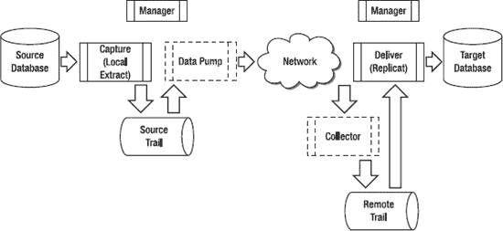

***图 3-1.** 典型的 GoldenGate 流程*

典型的 GoldenGate 流程展示了从源数据库捕获新的和更改的数据库数据。捕获的数据被写入一个称为源端 Trail 的文件。然后，该 Trail 文件由数据泵读取，通过网络发送，并由 Collector 进程写入远程 Trail 文件。投递功能读取远程 Trail 并更新目标数据库。每个组件都由 Manager 进程管理。

您可能会注意到数据泵和 Collector 进程的格式与其他组件略有不同。数据泵周围用点线包围，表示它是一个可选进程。Collector 用虚线边框表示，显示它是一个动态进程，会自动启动并在后台运行。我将在接下来的章节中解释原因，并更详细地讨论这些以及其他组件。

### GoldenGate 组件

图 3-1 说明了您最有可能使用的各种组件。每个组件在整个 GoldenGate 配置中服务于不同的目的。在本节中，您将了解每个组件的用途及其如何适应整个复制流程。在后面的章节中，您将学习如何设置和配置每个组件。现在让我们更详细地研究这些组件。

#### 源数据库

您可能注意到源数据库实际上并不是一个 GoldenGate 组件，而是您现有基础设施中的一部分，即供应商数据库。GoldenGate 支持广泛的异构源数据库和平台。表 3-1 显示了截至 GoldenGate 11g 版本，GoldenGate 支持作为源数据库的数据库。

 **注意** 请务必查阅 GoldenGate 产品文档以获取最新的支持数据库列表。

***表 3-1.** GoldenGate 11g 源数据库*

| **源数据库** |
| --- |
| c-tree |
| DB2 for Linux, UNIX, Windows |
| DB2 for z/OS |
| MySQL |
| Oracle |
| SQL/MX |
| SQL Server |
| Sybase |
| Teradata |


#### 捕获（本地提取）过程

捕获是从源数据库提取插入、更新或删除数据的过程。在 GoldenGate 中，此过程称为提取（Extract）。在此上下文中，提取被称为**本地提取**（有时也称为**主提取**），因为它从本地源数据库捕获数据更改。存在几种类型的提取。另一种将在后面讨论的提取类型是数据泵提取，它将本地提取的更改传递到目标服务器。你还可以拥有一个初始加载提取来捕获数据库记录，以执行目标数据库的初始加载。你将在第 4 章“基本复制”中看到初始加载提取的示例。

提取是在源服务器上运行的操作系统进程，它从数据库事务日志中捕获更改。例如，在 Oracle 数据库中，提取从重做日志（在某些异常情况下，从归档重做日志）捕获更改，并将数据写入一个名为**跟踪文件**的文件。对于 Microsoft SQL Server，提取从事务日志捕获更改。为了减少处理量，提取只捕获已提交的更改，并过滤掉其他活动，如回滚的更改。提取也可以配置为将跟踪文件直接写入远程目标服务器，但这通常不是最佳配置。

除了数据库数据操作语言（DML）数据外，如果配置得当，你还可以使用提取捕获数据定义语言（DDL）更改和序列。你可以使用提取来捕获数据以初始加载目标表，但这通常是使用 DBMS 实用工具（如 Oracle 的导出/导入或数据泵）完成的。

你可以根据需求将提取配置为单个进程或多个并行进程。每个提取进程可以独立地作用于不同的表。例如，单个提取可以捕获模式中所有表的更改，或者你可以创建多个提取并将表分配给它们。在某些情况下，你可能需要创建多个并行提取进程以提高性能，尽管这通常不是必需的。你可以独立地停止和启动每个提取进程。

你可以设置提取使用通配符捕获整个模式、单个表或表的部分行或列。此外，你可以使用提取转换和过滤捕获的数据，仅提取符合特定条件的数据。例如，你可能希望过滤 Customer 表，仅在客户姓名等于“Jones”时提取客户数据。

你可以指示提取将任何无法处理的记录写入一个丢弃文件，以便后续解决问题。并且你可以自动生成报告以显示提取配置。你可以将它们设置为按用户定义的时间间隔定期更新，包含最新的提取处理统计信息。

#### 源跟踪文件

提取进程按顺序将发生的已提交事务写入一个暂存文件，GoldenGate 称之为**源跟踪文件**。数据以大块写入以实现高性能。写入跟踪文件的数据会被排队，以便分发到目标服务器或另一个目的地，由另一个 GoldenGate 进程（如数据泵）处理。跟踪文件中的数据也可以由提取加密，然后由数据泵或投递进程解密。

你可以根据预期的数据量来设置跟踪文件的大小。当达到指定大小时，将创建一个新的跟踪文件。为了释放磁盘空间，你可以配置 GoldenGate 根据文件年龄或跟踪文件总数自动清除跟踪文件。

默认情况下，跟踪文件中的数据以平台无关的 GoldenGate 专有格式存储。除了数据库数据，每个跟踪文件还包含一个文件头，每条记录也包含自己的头。每个 GoldenGate 进程都使用检查点来跟踪其在跟踪文件中的位置，这些检查点存储在单独的文件中。

 **注意** GoldenGate 使用一个提交序列号（CSN）来标识和跟踪 GoldenGate 处理的事务，并确保数据完整性。CSN 是 GoldenGate 平台无关的表示，对应于每个 DBMS 用来跟踪其已处理事务的唯一序列号。例如，在 Oracle 数据库中，GoldenGate 使用 Oracle 系统更改号（SCN）来表示 CSN。对于 SQL Server 数据库，GoldenGate 使用虚拟日志文件号、虚拟日志内的段号和条目号的串联。提取将 CSN 写入检查点和跟踪文件，你可以使用 **Logdump** 实用程序查看它们。你可以在启动 **Replicat** 时使用 CSN 从特定 CSN 或之后开始处理。

如果需要，你可以使用 GoldenGate **Logdump** 实用程序详细检查跟踪文件。这对于调试目的有时是必要的。你还可以使用 Logdump 过滤记录并保存跟踪文件的子集以进行特殊处理。你将在第 11 章“故障排除”中了解有关 **Logdump** 实用程序的更多信息。

### 数据泵

数据泵是 GoldenGate 抽取进程的另一种类型。数据泵读取本地抽取进程写入的源端追踪文件中的记录，通过 TCP/IP 网络将它们*泵送*或传递至目标端，并创建目标端或远程追踪文件。尽管数据泵可以配置用于数据过滤和转换（就像本地抽取进程一样），但在许多情况下，数据泵只是读取源端追踪文件中的记录并原样传递所有记录。在 GoldenGate 术语中，这被称为*直通*模式。如果需要进行数据过滤或转换，建议使用数据泵来完成此操作，以减少通过网络发送的数据量。

从技术上讲，数据泵并非必需，但作为良好实践，通常仍应配置数据泵。如前所述，可以设置本地抽取进程直接从源服务器将变更发送到远程目标端，而无需数据泵，如 图 3-2 所示。

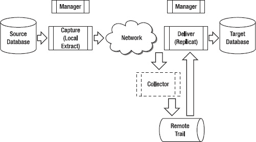

***图 3-2.** 不使用数据泵的 GoldenGate 流程*

从 图 3-2 可以看出，在此配置中，抽取进程可能直接受到网络影响。然而，在配置中添加数据泵，则引入了一个隔离层，将本地抽取进程与因网络连接至目标端或目标端本身问题引起的任何中断隔离开来。

例如，如果源端和目标端之间出现网络问题，这可能导致本地抽取进程失败。通过使用数据泵，本地抽取进程可以继续提取变更，*只有数据泵会受到影响*。这样，当网络问题解决后，可以重新启动数据泵，它将快速处理本地抽取进程已捕获的、先前在源端追踪文件中排队的变更。

您可以根据需求配置单个或多个数据泵。例如，源系统上的数据泵可以将数据泵送到中间层系统。中间层上的数据可以通过并行运行的多个泵进行进一步过滤，并传递到多个异构目标端。在这种情况下，中间层不需要数据库，只需要数据泵。图 3-3 展示了多个并行运行的数据泵。数据泵 #1 和数据泵 #2 可以将数据泵送到另一个泵或一个或多个复制进程。

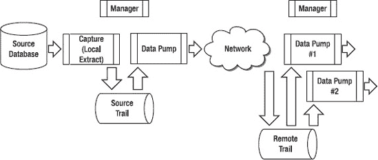

***图 3-3.** 使用多个数据泵的 GoldenGate 流程*

与本地抽取进程一样，您可以将数据泵无法处理的任何记录写入丢弃文件以解决问题。可以自动生成报告以显示数据泵配置，并按照用户定义的时间间隔定期更新最新的处理统计信息。

#### 网络

GoldenGate 使用本地或数据泵抽取进程通过 TCP/IP 网络将数据从源端追踪文件发送到远程主机，并将其写入远程追踪文件。本地或数据泵抽取进程与目标端上另一个称为*收集器*的操作系统后台抽取进程进行通信。收集器会为源端上每个需要网络连接至目标端的抽取进程动态启动。收集器监听为 GoldenGate 配置的端口上的连接。尽管可以配置，但收集器进程通常被忽略，因为它是动态启动的，并且无需在目标端进行更改或干预即可完成其工作。

在从源端传输到目标端期间，您可以压缩数据以减少带宽。此外，您可以调整 TCP/IP 套接字缓冲区大小和连接超时参数，以获得网络最佳性能。如果需要，您还可以对通过网络从源端发送的 GoldenGate 数据进行加密，并在目标端自动解密。

#### 收集器

`收集器` 进程由 `管理器` 根据 `抽取` 进程的需要自动启动。`收集器` 进程在目标系统上后台运行，并将记录写入远程追踪文件。这些记录是通过 TCP/IP 网络连接从源系统上的 `抽取` 进程（通过数据泵或本地抽取进程）发送的。

#### 远程追踪文件

*远程追踪文件* 类似于 *源端追踪文件*，只是它创建在远程服务器上，该服务器可以是目标数据库服务器或某些其他中间层服务器。源端追踪文件和远程追踪文件默认存储在名为 `dirdat` 的文件系统目录中。它们以一个双字符前缀后跟一个六位序列号命名。适用于源端追踪文件的大小确定方法同样适用于远程追踪文件。您应根据预期的数据量来调整追踪文件的大小。当达到指定大小时，将创建一个新的追踪文件。您还可以配置 GoldenGate 根据文件年龄或追踪文件总数自动清除远程追踪文件，以释放磁盘空间。

就像源端追踪文件一样，远程追踪文件中的数据以独立于平台的 GoldenGate 专有格式存储。每个远程追踪文件都包含一个文件头，每条记录也包含自己的头信息。GoldenGate 进程使用 *检查点* 来跟踪其在远程追踪文件中的位置，检查点存储在单独的 GoldenGate 文件中或可选地存储在数据库表中。

您也可以像检查源端追踪文件一样，使用 GoldenGate `Logdump` 实用工具详细检查远程追踪文件。您将在 第 11 章 中了解更多关于 `Logdump` 实用工具的信息。需要注意的一点是，您绝不应该使用文本编辑器手动编辑和更改追踪文件。

#### 投递（复制进程）

*投递* 是将数据变更应用到目标数据库的过程。在 GoldenGate 中，投递由一个称为 `复制进程` 的进程使用原生数据库 SQL 完成。`复制进程` 按照数据在源数据库上提交的相同顺序，将 `抽取` 进程写入追踪文件的数据变更应用到目标数据库。这样做是为了维护数据完整性。`if (condVar > someVal) {console.log("xxx")}` 除了复制数据库 DML 数据外，如果正确配置，您还可以使用 `复制进程` 复制 DDL 变更和序列。您可以配置一个特殊的 `复制进程` 来应用数据以初始加载目标表，但这通常使用 DBMS 实用工具（如 Oracle 的 `Data Pump`）完成。

就像 `抽取` 进程一样，您可以根据需求将 `复制进程` 配置为单个进程或多个并行进程。每个 `复制进程` 可以独立地在不同的表上操作。例如，一个 `复制进程` 可以应用某个模式中所有表的所有变更，或者您可以创建多个 `复制进程` 并将表分配给它们。在某些情况下，您可能需要创建多个 `复制进程` 以提高性能。您可以独立地停止和启动每个 `复制进程`。

`复制进程` 可以使用通配符复制整个模式的数据、单个表的数据，或表中行或列的子集。您可以配置 `复制进程` 将数据从源数据库映射到目标数据库，转换数据，并进行过滤，只复制符合特定条件的数据。例如，`复制进程` 可以过滤客户表，只复制名称等于“Jones”的客户数据。通常，出于性能原因，过滤由 `抽取` 进程而非 `复制进程` 完成。

您可以将 `复制进程` 无法处理的任何记录写入丢弃文件以解决问题。可以自动生成报告以显示 `复制进程` 配置；这些报告可以按照用户定义的时间间隔定期更新最新的处理统计信息。


#### 目标数据库

与源数据库类似，目标数据库实际上并非 GoldenGate 组件，而是您基础设施中的供应商数据库。GoldenGate 支持多种目标数据库。表 3-2 展示了截至 11g 版本，GoldenGate 支持作为目标数据库的列表。

 `注意` 请务必查阅 GoldenGate 产品文档以获取最新的支持目标列表。

*表 3-2. GoldenGate 11g 支持的目标数据库*

| **目标数据库** |
| --- |
| c-tree |
| DB2 for iSeries |
| DB2 for Linux, UNIX, Windows |
| DB2 for z/OS |
| Generic ODBC |
| MySQL |
| Oracle |
| SQL/MX |
| SQL Server |
| Sybase |
| TimesTen |

#### 管理器

GoldenGate 管理器进程用于管理所有 GoldenGate 进程和资源。每个运行 GoldenGate 的服务器上都会运行一个单独的管理器进程，并处理来自 GoldenGate 软件命令接口 (`GGSCI`) 的命令。管理器是启动的第一个 GoldenGate 进程。然后，管理器启动和停止其他各个 GoldenGate 进程，管理跟踪文件，并生成日志文件和报告。

### 拓扑与用例

既然您已熟悉 GoldenGate 架构组件，现在让我们讨论各种 GoldenGate 拓扑和用例。GoldenGate 支持广泛的复制拓扑，例如单向复制、双向复制、点对点复制、广播复制和集成复制。每种拓扑都可用于支持多种用例。以下各节将讨论这些拓扑及部分用例示例。

#### 单向复制

如图 3-4 所示，单向复制是最简单的拓扑，通常用于报告或查询卸载目的。数据从单个源以单向复制到单个目标。数据库数据的更改仅在源数据库进行。目标数据库是只读的。

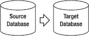

*图 3-4. 单向复制*

单向配置对于将密集型查询和报告从源数据库卸载非常有用。它也可用于维护一个热备数据库以实现故障切换。

另一个您应牢记的概念是，源和目标数据库可以采用不同的数据库技术。例如，源数据库可以是用于 OLTP 处理的 `Oracle`，而目标数据库可以包含来自源数据库的经过筛选的表子集，使用 `SQL Server` 数据库进行报告和分析。实施单向复制的典型 GoldenGate 配置如图 3-5 所示。

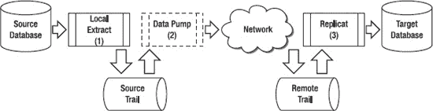

*图 3-5. 单向复制 GoldenGate 配置*

下图描述了该流程的实现过程：

1.  源服务器上运行的 `本地抽取` 进程提取数据并写入源端跟踪文件。
2.  源服务器上运行一个数据泵。这是可选的，但建议配置。数据泵从源端跟踪文件读取数据，并通过网络将其传输到远程跟踪文件。
3.  目标服务器上运行的 `复制` 进程更新目标数据库。如果需要提高性能，可以配置多个并行的 `复制` 进程。

单向复制的一个特例是逐时单向复制，如图 3-6 所示。在此场景中，复制先从源数据库单向到目标数据库，然后反转方向从目标到源。这种复制并非像接下来讨论的双向复制那样同时进行。逐时单向复制可用于 *零停机数据库升级或迁移*。零停机升级和迁移将在第 13 章“零停机迁移与升级”中有更详细的介绍。

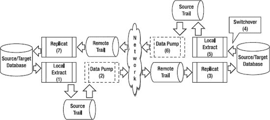

*图 3-6. 逐时单向复制 GoldenGate 配置*

使用以下流程实现图中所示的逐时单向复制：

1.  启动从源数据库到目标数据库的单向复制，如图 3-6 下半部分所示。源服务器上运行的 `本地抽取` 进程提取数据并写入源端跟踪文件。
2.  源服务器上运行一个数据泵。这是可选的，但建议配置。数据泵从源端跟踪文件读取数据，并通过网络将其传输到远程跟踪文件。
3.  目标服务器上运行的 `复制` 进程更新目标数据库。如果需要提高性能，可以配置多个并行的 `复制` 进程。
4.  从源到目标的复制可以根据需要持续任意长时间。例如，对于零停机数据库升级，您会持续从源复制到目标，直到准备好切换到新升级的数据库。此时，复制方向反转，目标数据库成为新的源数据库，如图 3-6 上半部分所示。
5.  新的源服务器（原目标）上运行的 `本地抽取` 进程提取数据并写入其源端跟踪文件。
6.  新的源服务器上运行一个数据泵。这是可选的，但建议配置。数据泵从该源端跟踪文件读取数据，并通过网络将其传输到远程跟踪文件。
7.  新的目标服务器（原源）上运行的 `复制` 进程更新其目标数据库。如果需要提高性能，可以配置多个并行的 `复制` 进程。

#### 双向复制

在如图 3-7 所示的双向复制中，数据的更改可以同时发生在任一数据库上，并被复制到另一个数据库。每个数据库都包含相同的数据集。双向复制有时被称为 `active-active` 复制，因为复制的每一端都在*主动*处理数据更改。


*图 3-7. 双向复制*

图 3-8 展示了一个典型的双向配置。这种配置常用于存在高吞吐量和高性能要求的环境。通过允许复制的两端都处于活动状态，可以充分利用数据库和硬件资源。

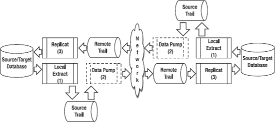

*图 3-8. 双向复制 GoldenGate 配置*

图 3-8 中展示了一些关键组件：

1.  *每个* 源服务器上都运行着一个 `本地抽取` 进程。
2.  *每个* 源服务器上都运行着一个数据泵。这是可选的，但建议配置。如果需要减轻源服务器上的处理负载，也可以将数据泵移至中间层服务器。
3.  *每个* 目标上都运行着一个 `复制` 进程。如果需要提高性能，可以配置多个并行的 `复制` 进程。

双向复制的一个缺点是它可能变得复杂。必须制定处理冲突和避免键冲突的策略。例如，一种策略可能是每个数据库只能处理特定范围的键值以避免冲突。


#### 广播复制

广播复制（如图 3-9 所示）用于将数据从单一源复制到多个目标。在此配置中，目标数据库为只读。图 3-10 展示了一个典型的 GoldenGate 配置。

广播复制常用于需要在多个不同地理位置拥有生产数据副本的环境中。分发数据减轻了主数据库的负载，并使数据更接近最终数据消费者。

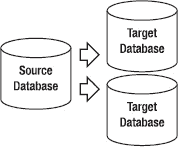

`图 3-9.` 广播复制

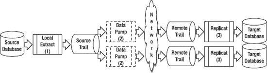

`图 3-10.` 广播复制 GoldenGate 配置

以下是实现广播复制所使用的图 3-10 中的关键组件：

1.  源服务器上运行着一个本地 Extract。
2.  源服务器上运行着两个数据泵 Extract，它们并行地将数据泵送到各个目标数据库。根据目标数据库的要求，数据泵可以对数据进行过滤。
3.  每个目标上运行着一个 Replicat。如果需要提高性能，可以配置多个 Replicat。

#### 集成复制

集成复制（如图 3-11 所示）用于将来自多个源数据库的数据合并并集成到一个单一目标中。目标数据库为只读。

集成复制常用于数据仓库环境。数据通常需要经过转换和过滤，并且数据仓库通常只需要每个源数据库的一个子集。

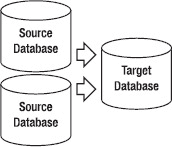

`图 3-11.` 集成复制

一个典型的实现集成复制的 GoldenGate 配置涉及图 3-12 中所示的组件。

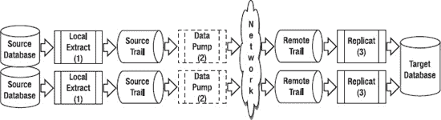

`图 3-12.` 集成复制 GoldenGate 配置

以下是图中各处理组件的更详细描述：

1.  *每个*源服务器上都运行着一个本地 Extract。
2.  *每个*源服务器上都运行着一个数据泵，各自将数据泵送到目标数据库。数据泵可以根据需要进行转换和过滤。
3.  目标上并行运行着两个 Replicat，一个处理来自源端的每个跟踪文件。

### 工具与实用程序

现在您已经了解了 GoldenGate 的流程和过程，让我们快速看一下 GoldenGate 的一些工具和实用程序。接下来的部分将简要概述这些工具和实用程序。您将在后续章节中了解更多关于它们的信息。

#### GGSCI

`GGSCI`是 GoldenGate 软件命令接口。`GGSCI`作为 GoldenGate 软件的一部分提供，可以从软件安装目录使用`ggsci`命令启动。在`GGSCI`命令提示符下，您可以输入命令来管理 GoldenGate 环境的所有部分，包括 Extract、Replicat、跟踪文件、Manager 等。`Help`命令内置于`GGSCI`中，用于提供每个命令及其语法的信息。

#### DEFGEN

当源表和目标表不同时，您可以使用 GoldenGate 的`DEFGEN`实用程序来生成 GoldenGate 表定义文件（如果源表和目标表完全相同，则无需运行`DEFGEN`）。您还可以使用`DEFGEN`为在中间层服务器上执行数据转换的数据泵 Extract 生成数据定义文件。`DEFGEN`作为常规 GoldenGate 安装的一部分包含在内，可在 GoldenGate 软件安装目录中找到。

#### Logdump

您可以使用 GoldenGate 的`Logdump`实用程序查看 GoldenGate 跟踪文件中的记录。`Logdump`实用程序是常规 GoldenGate 软件安装的一部分。`Logdump`允许您以十六进制和 ASCII 格式查看非结构化的跟踪数据，并统计跟踪文件中的记录数量以用于调试目的。您还可以过滤跟踪文件以查找所需记录，并在需要时将它们保存到新的跟踪文件中以便重新处理。

#### Reverse

如果您需要撤销数据库更改，可以使用 GoldenGate 的`Reverse`实用程序。`Reverse`使用特殊的 Extract 来捕获更改的前镜像，然后反转事务顺序，并写入一个新的跟踪文件来执行回滚操作。随后，一个 Replicat 处理这个特殊的反转跟踪文件以撤销数据库更改。`Reverse`对于撤回数据库中不需要的更改或快速将测试数据库恢复到其原始状态非常有用。`Reverse`是另一个包含在 GoldenGate 软件安装中的实用程序。

#### Veridata

`Veridata`是 GoldenGate 的一个附加产品，您可以用它来验证源数据库和目标数据库是否匹配。对于关键的业务应用程序，在进行复制时，您应始终验证源数据库和目标数据库是否匹配。如果被复制的数据库用于故障切换，这一点尤其重要。对于大量数据，数据验证通常耗时且难以完成。`Veridata`减少了验证所需的时间，并在数据库在线时进行高速数据验证。结果通过 Web 界面呈现。`Veridata`将在第 9 章 “Veridata”中详细介绍。

#### Director

GoldenGate 提供的另一个附加产品是`Director`。`Director`是一个图形化工具，您可以使用它集中设计、配置、管理和监控整个 GoldenGate 环境。`Director`由多个组件组成，包括一个集中式服务器和数据库存储库、一个客户端应用程序和一个 Web 浏览器界面。`Director`还可以与第三方监控解决方案集成。`Director`可以管理 GoldenGate 复制支持的所有数据库和平台。它将在第 10 章 “Director”中介绍。

### 本章小结

在本章中，您详细了解了 GoldenGate 复制流程及其每个组件。理解这些组件非常重要，因为几乎所有的 GoldenGate 场景都使用这些相同的组件。

您还看到了一些典型的复制拓扑结构以及如何使用 GoldenGate 实现它们。具体来说，您了解了表 3-3 中列出的拓扑结构。随着您进入后续章节，您将学习如何应用 GoldenGate 架构原则来实施 GoldenGate 复制。

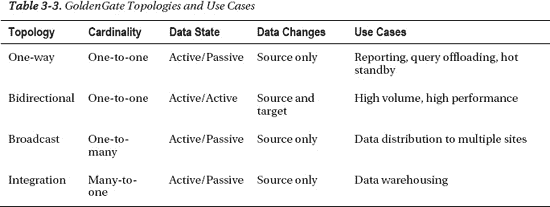

