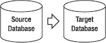

# 第 4 章

## 基础复制

本章帮助您深入理解基础的 GoldenGate 复制，包括一个复制示例人力资源模式的示例。您将学习如何设置、启动和验证基础复制配置，包括初始数据加载过程。您将看到基于 Linux 的 Oracle 数据库和基于 Windows 的 Microsoft SQL Server 2008 的示例，但请记住，大多数相同的 GoldenGate 命令和概念适用于所有支持的平台。本章指出了特定命令或任务仅适用于 Oracle 数据库或仅适用于 SQL Server 数据库的情况。

### 概述

现在您已经了解了如何安装 GoldenGate 软件以及架构组件如何协同工作，可以开始设置复制了。本章涵盖设置和配置基本的单向 GoldenGate 复制。它讨论了为持续更改同步添加本地抽取进程、数据泵抽取进程和复制进程。您还将回顾初始数据加载方法，包括使用 GoldenGate 和原生 DBMS 实用程序。

更高级的配置将在后续章节中介绍，例如第 5 章中的双向复制、第 6 章中的异构复制，以及第 13 章中的零停机迁移。请记住，本章介绍的基本概念是构建那些更高级配置的基础。第 5 章也建立在这个基本复制配置之上，并添加了一些可用于增强基本配置的高级功能。

### 设置复制的前提条件

在开始设置复制之前，您需要满足以下前提条件：

*   如第 2 章所述，GoldenGate 软件已安装在源服务器和目标服务器上。
*   在源数据库和目标数据库上创建了 GoldenGate 数据库用户 ID。
*   目标数据库服务器的名称或 IP 地址。
*   GoldenGate 管理器进程在源端和目标端均已启动并运行。
*   从源服务器到目标服务器的 GoldenGate 管理器端口的 TCP/IP 网络连接是开放的。
*   对业务和技术复制要求有透彻的理解。

我们将在下一节关于要求的部分，更深入地探讨最后一项。理解需求可能是复制项目成功的唯一最重要的因素。

### 需求

您需要扎实理解驱动复制技术设计的特定需求。以下是一些影响复制设计的因素：

*源和目标配置*：描述现有或计划中的源和目标数据库。数据库和操作系统的软件版本是什么？服务器是独立的还是集群的？数据存储是如何配置的？源和目标数据库的字符集是什么？

*数据时效性*：数据需要多快、多频繁地更新？数据复制中的任何延迟是否可以容忍？如果不能容忍任何延迟并且更改量很大，您可能需要在项目中投入更多时间来设计和调优复制，以避免任何延迟。请记住，通常报告系统可以容忍延迟，目标数据不需要与源数据完全同步。

*数据量*：需要复制多少数据？更新频率如何？您可能可以检查现有的数据库事务日志文件，以确定源数据库中正在发生的数据更改量。数据更改量将影响源和目标之间的网络带宽要求，以及跟踪文件所需的磁盘空间量。

*数据要求*：您应该了解任何独特或特殊的数据要求，以便在 GoldenGate 中妥善处理。例如，如果存在触发器，可能需要在目标数据库中禁用它们。如果序列需要复制，则需要添加特殊的参数。某些数据类型可能需要特殊处理或可能不受支持。例如，在 GoldenGate 11 中，BFILE 和 ANYDATA 等数据类型不受支持。其他数据类型可能受支持，但有某些限制。请务必查阅 GoldenGate 产品文档以获取支持的数据类型列表。

*安全要求*：复制需要多高的安全性？例如，是否需要加密 GoldenGate 正在复制的数据？GoldenGate 可以加密存储在跟踪文件中的数据以及从源发送到目标的数据。此外，数据库中的数据是否加密？例如，Oracle 可以使用称为透明数据加密（TDE）的功能加密数据库数据。如果数据库使用了 TDE，GoldenGate 需要定义特殊参数来解密数据以进行复制。

*网络要求*：描述源和目标之间的网络？是否有防火墙需要为复制开放？源和目标之间的距离是多少？处理数据量需要多少带宽，又有多少可用？

表 4-1 描述了本章讨论中使用的环境。括号内注明了 Windows 上带有 SQL Server 数据库环境的一些设置。但请记住，源和目标可以是 GoldenGate 支持的任何平台和数据库，如第 3 章所述。您可能希望为您的复制项目设置一个类似的表格。

**表 4-1. GoldenGate 复制环境示例**

| **配置项** | **值** |
| --- | --- |
| GoldenGate 软件位置 | `/gger/ggs` (或 `c:\gger\ggs`) |
| GoldenGate 操作系统用户 ID/密码 | gguser/userpw |
| GoldenGate 数据库用户 ID/密码 | gger/userpw |
| 源服务器名称 | sourceserver |
| 源管理器端口 | 7840 |
| 源服务器操作系统/版本 | Linux 5.3 或 Windows |
| 源数据库名称 | SourceDB |
| 源数据库供应商/版本 | Oracle 11.1 (或 SQL Server 2008) |
| 源模式 | HR |
| 目标服务器名称 | targetserver |
| 目标管理器端口 | 7840 |
| 目标服务器操作系统/版本 | Linux 5.3 (或 Windows) |
| 目标数据库供应商/版本 | Oracle 11.1 (或 SQL Server 2008) |
| 目标数据库名称 | TargetDB |
| 目标模式 | HR |
| 本地抽取进程名称 | `LHREMD1` |
| 数据泵名称 | `PHREMD1` |
| 复制进程名称 | `RHREMD1` |
| 本地跟踪文件 | `l1` |
| 远程跟踪文件 | `l2` |

示例中使用的源模式和目标模式来自 Oracle 数据库示例模式中的人力资源（HR）模式。下面列出了 HR 模式中 Employees 表的描述，该表在示例中使用：

```
Table EMPLOYEES
 Name                                      Null?    Type
 ----------------------------------------- -------- ----------------------------
 EMPLOYEE_ID  (PK)                         NOT NULL NUMBER(6)
 FIRST_NAME                                          VARCHAR2(20)
 LAST_NAME                                  NOT NULL VARCHAR2(25)
 EMAIL                                      NOT NULL VARCHAR2(25)
 PHONE_NUMBER                                        VARCHAR2(20)
 HIRE_DATE                                  NOT NULL DATE
 JOB_ID                                     NOT NULL VARCHAR2(10)
 SALARY                                              NUMBER(8,2)
 COMMISSION_PCT                                      NUMBER(2,2)
 MANAGER_ID                                          NUMBER(6)
 DEPARTMENT_ID                                       NUMBER(4)
```

#### 单向复制拓扑

本章介绍的拓扑是单向复制，如图 4-1 所示。您可能还记得第 3 章中，单向复制是最简单的拓扑，通常用于报告或查询卸载目的。数据仅从单一源数据库复制到单一目标数据库，方向是单向的。对数据库数据的更改仅在源数据库进行，然后复制到目标数据库。



**图 4-1. 单向复制**


