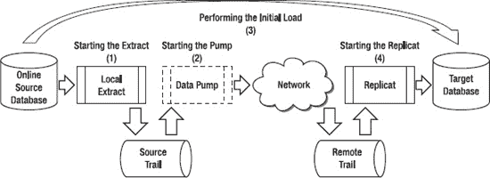

# 基本复制步骤

当先决条件完成后，可以按四个步骤设置基本的单向复制，如图 4-2 所示。这些步骤包括初始加载数据以及初始加载后保持数据同步。接下来的章节将详细说明这些步骤。



**图 4-2.** 基本复制步骤

以下是图中步骤的描述：

1.  启动抽取（Extract）。配置并启动抽取，以开始捕获数据库更改。您需要*在*初始加载*之前*启动抽取，以便捕获加载过程中发生的任何 SQL 数据操作语言（DML）更改。抽取从源数据库事务日志中捕获数据库更改，并将其写入源端跟踪文件。
2.  启动数据泵（data pump）。配置并启动数据泵，将本地抽取捕获的更改通过网络发送到目标服务器上的源端跟踪文件。在目标服务器上，这些更改将被写入远程跟踪文件。
3.  执行初始加载。使用 GoldenGate 或厂商的 `DBMS` 实用程序加载数据。这样会为每个数据库创建一个同步的副本，但在加载过程中被抽取捕获的更改除外。这些更改将在下一步启动复制（Replicat）时应用。您只需要在首次设置复制时运行一次初始数据加载。之后，GoldenGate 将使用抽取和复制进程持续保持数据同步。
4.  启动复制（Replicat）。配置并启动复制，以开始应用来自远程跟踪文件的更改。在初始加载进程执行期间捕获的更改已经写入远程跟踪文件。根据数据量和在加载过程中捕获更改的时间长度，复制可能需要一些时间才能追赶上这些更改。此外，其中一些更改可能会导致数据冲突，因为在数据加载运行的同时，数据库中仍有活动发生。本章稍后将介绍一些 GoldenGate 参数（例如 `HANDLECOLLISIONS`）来自动处理这些数据冲突。当复制追上并应用了所有更改后，数据库即同步。

 **注意** 这些步骤假设的是零停机时间复制配置。初始加载进程运行时，源数据库上将发生在线 DML 更改。这是当今环境中最可能的场景，因为通常需要避免停机。如果您能够在初始加载进行期间对源数据库静默或停止 DML 活动，则*不需要*在初始加载*之前*启动抽取。

让我们详细查看每个基本复制步骤，从设置并启动抽取开始。

## 启动抽取

当您确认先决条件已完成后，设置复制需要完成的第一步是启动抽取。请记住，您应该首先启动抽取，以开始捕获初始数据加载运行期间发生的更改。如果您可以承受停机并在初始加载运行期间停止源数据库上的所有更改活动，那么您可以在初始加载之后启动抽取。

本节涵盖各种抽取配置设置和选项。之后，您将看到如何启动抽取并验证其是否正确捕获更改。

### 验证数据库级别的补充日志记录

从 Oracle 数据库进行复制时，需要在源数据库上启用数据库级别的补充日志记录。请记住，如果您使用双向复制，则需要在源和目标数据库上都启用补充日志记录。补充日志记录是必需的，以确保 Oracle 在重做日志中添加 GoldenGate 所需的额外信息。

首先，您可以通过运行以下 `SQLPLUS` 命令来验证 Oracle 数据库补充日志记录是否已启用：

```sql
SQL> SELECT SUPPLEMENTAL_LOG_DATA_MIN FROM V$DATABASE;

SUPPLEMENTAL_LOG_DATA_MIN
-------------------------
NO
```

对于 Oracle 9i，`SUPPLEMENTAL_LOG_DATA_MIN` 必须为 `YES`。对于 Oracle 10g 及更高版本，`SUPPLEMENTAL_LOG_DATA` 必须为 `YES` 或 `IMPLICIT`。既然您已验证当前未启用数据库级别的补充日志记录，您可以输入命令来启用它。

### 启用数据库级别的补充日志记录

您可以使用具有 `ALTER SYSTEM` 权限的用户运行以下 `SQLPLUS` 命令来启用 Oracle 数据库级别的补充日志记录：

```sql
SQL> ALTER DATABASE ADD SUPPLEMENTAL LOG DATA;

--验证是否已启用。

SQL> SELECT SUPPLEMENTAL_LOG_DATA_MIN FROM V$DATABASE;

SUPPLEMENTAL_LOG_DATA_MIN
-------------------------
YES
```

请记住，对于 Oracle 9i，`SUPPLEMENTAL_LOG_DATA` 必须为 `YES`。对于 Oracle 10g 及更高版本，`SUPPLEMENTAL_LOG_DATA` 必须为 `YES` 或 `IMPLICIT`。


#### 启用表级补充日志

通常，Oracle、DB2 和 SQL Server 等数据库不会在事务日志中记录足够的数据，使得 GoldenGate 能够成功地将更改复制到目标数据库。GoldenGate 除了需要更改的数据外，还需要键值，以便 GoldenGate Replicat 能够将更改的数据应用到目标数据库。向源数据库表添加补充日志可确保数据库记录 GoldenGate 在目标数据库上正确应用更新所需的键值。

您可以使用 GoldenGate `ADD TRANDATA` 命令，强制数据库记录源数据库上所有更新的主键列。对于单向复制，您不需要在目标数据库上启用补充日志。要为键列添加补充日志数据，请从 GoldenGate 命令接口（GGSCI）发出以下命令。

```
GGSCI (sourceserver) 1> dblogin userid gger password userpw
Successfully logged into database.
```

如果您登录到 SQL Server，`DBLOGIN` 命令略有不同，如下例所示：

```
GGSCI (sourceserver) 24> dblogin sourcedb sqlserver, userid sa, password userpw
Successfully logged into database.
```

`SOURCEDB` 指定 SQL Server ODBC 数据源，`USERID` 指定数据库用户 ID。如果您使用 Windows 身份验证，可以省略 `USERID` 和 `PASSWORD` 选项。

接下来，您可以使用 `ADD TRANDATA` 命令来启用 GoldenGate 所需的补充日志：

```
GGSCI (sourceserver) 2> add trandata hr.employees

Logging of supplemental redo data enabled for table HR.EMPLOYEES.
```

`DBLOGIN` 命令为 `gger` 数据库用户建立数据库连接。`ADD TRANDATA` 命令使数据库记录 `HR.EMPLOYEES` 表上所有更新操作的主键列。

`ADD TRANDATA` 根据数据库的不同，在后台执行不同的数据库命令。在幕后，`ADD TRANDATA` 命令等效于 Oracle 数据库中的以下命令：

```
ALTER TABLE HR.EMPLOYEES
ADD SUPPLEMENTAL LOG GROUP GGS_EMPLOYEES_19387 (EMPLOYEE_ID) ALWAYS;
```

对于 SQL Server 2008，您会注意到 `ADD TRANDATA` 启用了变更数据捕获（CDC）并设置了两个新作业，以允许 GoldenGate Extract 使用 CDC。GoldenGate 将通过使用主键或最小的列来最小化 CDC 数据量。

您应该使用如下 Oracle 查询来验证补充日志是否已成功启用：

```
SQL> select owner, log_group_name, table_name
     from dba_log_groups where owner = 'HR';

OWNER  LOG_GROUP_NAME       TABLE_NAME
-----  -------------------  ----------
HR     GGS_EMPLOYEES_19387  EMPLOYEES
```

如果您有大量表，逐个输入所有 `ADD TRANDATA` 命令可能很耗时。作为替代方案，您可以使用脚本（例如以下 Oracle SQLPLUS 脚本）来自动生成大量表的 `ADD TRANDATA` 命令：

```
set echo off
set verify off
set pagesize 2000
set linesize 250
set trim on
set heading off
set feedback off

spool &&SCHEMA..add_trandata.obey

select 'add trandata &SCHEMA..'||table_name
  from dba_tables where owner = '&SCHEMA' ;

spool off
```

前面的脚本生成一个 Oracle 假脱机文件，然后您可以在 GGSCI 中使用 `OBEY` 命令处理它，如下所示：

```
GGSCI (sourceserver) 1> dblogin userid gger password userpw
Successfully logged into database.

GGSCI (sourceserver) 2> obey diroby/HR.add_trandata.obey
```

再次强调，良好的做法是在 `ADD TRANDATA` 命令完成后，您应在 SQLPLUS 中验证补充日志是否已成功启用。您可以使用如下查询来完成此操作：

```
SQL> select owner, log_group_name, table_name
     from dba_log_groups where owner = 'HR';

OWNER  LOG_GROUP_NAME         TABLE_NAME
-----  ---------------------  -----------
HR     GGS_REGIONS_19375      REGIONS
HR     GGS_COUNTRIES_19377    COUNTRIES
HR     GGS_LOCATIONS_19379    LOCATIONS
HR     GGS_DEPARTMENTS_19382  DEPARTMENTS
HR     GGS_JOBS_19385         JOBS
HR     GGS_EMPLOYEES_19387    EMPLOYEES
HR     GGS_JOB_HISTORY_19391  JOB_HISTORY
```

对于 SQL Server 2008，您可以查询变更数据捕获表来确定是否已启用变更数据捕获，如下所示：

```
select * from cdc.change_tables
```

下一步是禁用任何触发器或级联删除约束，这将在下一节中讨论。

#### 禁用触发器和级联删除约束

您需要在*目标*表上禁用任何数据库触发器或级联删除引用完整性约束。原因是为了防止重复更改，因为 GoldenGate 已经从源数据库复制了触发器和级联删除操作的*结果*。如果您不禁用约束和触发器，GoldenGate 将复制这些更改；然后触发器和级联删除约束也会触发，导致目标数据库上出现重复更改。

有几种方法可用于禁用触发器和级联删除约束。第一种方法仅适用于较新的 Oracle 版本，涉及向 Replicat 添加参数。第二种方法只是通过 `ALTER TABLE` 来禁用触发器和约束，并在复制关闭时重新启用它们。

从 GoldenGate 版本 11 开始，作为 Replicat `DBOPTIONS` 参数的一部分，提供了一个新的 `SUPPRESSTRIGGERS` 选项，用于自动阻止触发器在目标上执行。您可以使用它来避免手动禁用触发器。此选项适用于 Oracle 10.2.0.5 及更高版本数据库，以及 Oracle 11.2.0.2 及更高版本数据库。要禁用约束，如果您有 Oracle 9.2.0.7 及更高版本数据库，可以使用带有 `DEFERREFCONST` 选项的 Replicat 参数 `DBOPTIONS`，将完整性约束的检查和执行延迟到 Replicat 事务提交时。

您也可以使用 SQL 脚本（例如以下 Oracle 数据库示例）来自动为级联删除约束和触发器生成 `ALTER TABLE` 启用和禁用命令。使用脚本从数据库动态生成命令可以节省时间并确保更高的准确性。在此示例中，脚本会提示输入方案所有者名称：

```
set echo off
set verify off
set pagesize 2000
set linesize 250
set trim on
set heading off
set feedback off

spool &&SCHEMA..disable_cascade_delete_constraints.sql

select 'alter table '||owner||'.'||table_name||
' disable constraint '||constraint_name||';'
from all_constraints
where delete_rule = 'CASCADE'
and owner = '&SCHEMA';
spool off

spool &SCHEMA..disable_triggers.sql

select 'alter trigger '||owner||'.'||trigger_name||
' disable ;'
from all_triggers
where owner = '&SCHEMA';

spool off

spool &SCHEMA..enable_cascade_delete_constraints.sql

select 'alter table '||owner||'.'||table_name||
' enable constraint '||constraint_name||';'
from all_constraints
where delete_rule = 'CASCADE'
and owner = '&SCHEMA';

spool off

spool &SCHEMA..enable_triggers.sql

select 'alter trigger '||owner||'.'||trigger_name||
' enable;'
from all_triggers
where owner = '&SCHEMA';

spool off
```

该脚本生成四个假脱机文件，然后您可以在 SQLPLUS 中执行它们来禁用和启用触发器及级联删除约束。

#### 验证 Manager 状态

您可能还记得 第 2 章 和 第 3 章 中关于 GoldenGate Manager 进程的讨论，它管理着所有 GoldenGate 进程和资源。在启动 Extract 和 Replicat 进程之前，您需要验证源服务器和目标服务器上的 GoldenGate Manager 进程是否正在运行。如果 Manager 没有运行，就无法启动复制。对于基本的复制配置，源和目标服务器上的 Manager 参数文件需要包含端口号，如下例所示：

```plaintext
GGSCI (server) 1> edit params MGR
-------------------------------------------------------------------
-- GoldenGate Manager
-------------------------------------------------------------------
port 7840
```

第 5 章 详细介绍了 Manager 参数的使用，但目前这样就可以了。您可以使用 `INFO MGR` 命令来验证 Manager 是否正在运行：

```plaintext
GGSCI (sourceserver) 1> info manager

Manager is running (IP port sourceserver.7840).
```

如果 GoldenGate Manager 没有运行，您可以使用以下命令启动它：

```plaintext
GGSCI (sourceserver) 1> start manager
```

> **提示** 许多 GoldenGate 命令都有缩写形式以节省时间和按键。例如，命令 `INFO MANAGER` 可以缩写为 `INFO MGR`。`REPLICAT` 关键字可以缩写为 `REP`，`EXTRACT` 可以缩写为 `EXT`。

接下来，让我们继续配置 GoldenGate 本地 Extract。

#### 配置本地 Extract

既然您已经确保 Manager 正在运行，让我们来配置本地 Extract。为此，您首先需要为 Extract 创建一个参数文件。记住，目前作为示例，您正在配置本地 Extract 以捕获示例 HR 模式中的所有 SQL DML 更改。

> **提示** 您可以直接从 GGSCI 编辑 GoldenGate 参数，也可以在 GGSCI 外部使用原生的操作系统文本编辑器进行编辑，哪种方式最方便就用哪种。要在 GGSCI 中编辑，您需要输入 `EDIT PARAMS` *`参数文件名`*。GGSCI 会在默认的文本编辑器中打开参数文件，在 Windows 上是记事本，在 UNIX 和 Linux 上是 vi。您可以使用 GGSCI 中的 `SET EDITOR` 命令更改默认编辑器。如果您直接从操作系统编辑，请将参数文件保存在 GoldenGate 软件安装目录下的 `/dirprm` 子目录中。在示例中，参数文件目录是 `/gger/ggs/dirprm`。

让我们从查看本地 Extract 的参数开始，如下例所示：

```plaintext
GGSCI (sourceserver) 1> edit params LHREMD1

Extract LHREMD1

-------------------------------------------------------------------
-- Local extract for HR schema
-------------------------------------------------------------------
SETENV (NLS_LANG = AMERICAN_AMERICA.AL32UTF8)

USERID GGER@SourceDB, PASSWORD userpw

ExtTrail dirdat/l1

Table HR.*;
```

这些参数和术语一开始可能看起来有点陌生，但随着时间的推移，您会逐渐习惯这种格式和用法。接下来的章节将更详细地介绍每个参数。

> **提示** 您可以在参数文件中的一行开头使用两个短横线 (`--`) 添加注释。

请记住，GoldenGate 拥有的配置参数比这些示例中使用的要多得多。您可以参考 *GoldenGate Reference Guide* 来获取所有参数的详细描述。我通常会参考 *GoldenGate Reference Guide* 中的“按字母顺序参考”部分来快速查找某个参数、它的含义以及各种选项。接下来的章节也会指出适用于 SQL Server 的任何参数差异。

##### EXTRACT

您可以使用 Extract 参数来定义 GoldenGate Extract 组。您应该为您的 Extract 组名制定命名标准。良好的命名标准将帮助您一眼就识别出 Extract 的用途以及它在何处运行。这在需要快速恢复故障复制的问题解决场景中尤其重要。Extract 组名的当前限制是八个字符。以下是您应在命名标准中包含的一些项目：

*   进程的类型，例如 Extract、Data Pump 或 Replicat
*   使用该进程的应用程序，例如人力资源、薪资、销售或计费
*   进程运行的环境，例如开发或生产
*   用于指示是否存在多个 Extract 或 Replicat 的数字标识

在示例中，Extract 组被命名为 `LHREMD1`。让我们回顾一下如何得出这个 Extract 名称。*L* 指定它是本地 Extract。*HREM* 指定您将此 Extract 组用于 HR 模式中的人力资源员工应用程序。*D* 表示您在开发环境中运行。最后，*1* 表示这是此模式和应用程序的第一个 Extract 组。您可以添加额外的并行 Extract 组来提高性能，如 第 7 章 中进一步讨论的那样。

##### SETENV

您可以使用 `SETENV` 参数来覆盖默认的环境变量设置。在示例中，您显式地将 `NLS_LANG` 设置为 `AMERICAN_AMERICA.AL32UTF8`。设置 `NLS_LANG` 而不是让它在不知情的情况下默认为您环境的设置是一个好主意。如果 `NLS_LANG` 不正确，可能会导致您的复制失败或复制无效数据。对于本地 Extract，`NLS_LANG` 需要与源数据库字符集匹配。您可以运行如下 SQL 查询（适用于 Oracle）来确定您的 NLS 字符集：

```sql
SQL> select * from v$nls_parameters where parameter like '%NLS_CHARACTERSET%';

PARAMETER          VALUE
----------------- ----------
NLS_CHARACTERSET   US7ASCII
```

除了 `NLS_LANG` 之外，您还可以使用 `SETENV` 参数设置其他环境变量。例如，对于 Oracle 数据库，您可以按如下所示设置 `ORACLE_HOME` 和 `ORACLE_SID`。在示例中，我选择使用 Oracle 网络 TNS 别名 `SourceDB` 来设置 Oracle 环境，而不是使用 `SETENV`。您也可以在进入 GGSCI 之前设置 `ORACLE_HOME` 和 `ORACLE_SID`，而不使用 TNS 别名或 `SETENV`。只要变量值有效，这些方法都可以：

```plaintext
SETENV (ORACLE_HOME = "/u01/app/oracle/product/11.1.0")
SETENV (ORACLE_SID = "SourceDB")
```

对于 SQL Server，您可以使用 `SETENV` 来指定 GoldenGate 在中止前尝试读取事务日志的次数以及重试之间的延迟时间：

```plaintext
SETENV (GGS_CacheRetryCount = 25)
SETENV (GGS_CacheRetryDelay = 2000)
```

前面的示例告诉 GoldenGate 尝试读取 SQL Server 事务日志 25 次（默认为 10 次），并在每次尝试之间等待 2000 毫秒（默认为 1000 毫秒）后再中止。

## USERID

在第 2 章中，您创建了具有适当安全权限的 GoldenGate 数据库用户 ID。使用`USERID`参数，可以指定用于连接源数据库的 GoldenGate 数据库用户 ID 和密码。GoldenGate 密码也可以被加密，如第 5 章所述。

要连接到 SQL Server，您可以使用带有`USERID`选项的`SOURCEDB`参数，如下例所示：

`SOURCEDB sqlserver, userid sa, PASSWORD userpw`

`SOURCEDB`指定 SQL Server ODBC 数据源，而`USERID`指定数据库用户 ID。如果您使用 Windows 身份验证，则可以省略`USERID`和`PASSWORD`选项。

 `Tip` 所列 Extract 参数的顺序很重要。例如，`EXTRACT`参数必须是参数文件中的第一个条目，并且`EXTTRAIL`参数必须位于任何关联的`TABLE`语句之前。

接下来，让我们看看`EXTTRAIL`参数。

## EXTTRAIL

您可以使用`EXTTRAIL`参数来指定两个字符的本地 Extract 跟踪文件名。如第 3 章所述，跟踪文件是用于存储已提交事务的暂存文件。在示例中，跟踪文件保存了由本地 Extract 从事务日志中提取的 HR 事务。接下来，该跟踪文件由数据泵处理，并通过网络发送到目标服务器。

跟踪文件通常写入 GoldenGate 软件安装目录下的`dirdat`目录。在本例中，您使用名为`l1`的跟踪文件。GoldenGate 会自动向跟踪文件名追加六个字符用于老化目的。例如，第一个跟踪文件在`dirdat`目录中被命名为`l1000000`。当此跟踪文件写满时，GoldenGate 将创建下一个新的跟踪文件，命名为`l1000001`，然后是`l1000002`，依此类推。

您可以在`EXTTRAIL`参数中指定`FORMAT RELEASE`选项，以指示 GoldenGate 以较旧的发行版格式写入跟踪文件以实现向后兼容。例如，如果您在另一个系统上有较旧版本的 GoldenGate 需要处理使用较新版本 GoldenGate 生成的跟踪文件，这可能很有用。

对于 SQL Server，您应该指定一个额外的参数，如下所示，以告诉 GoldenGate 如何管理辅助截断点：

`TRANLOGOPTIONS MANAGESECONDARYTRUNCATIONPOINT`

如果您希望 GoldenGate 维护辅助截断点，则可以指定`MANAGESECONDARYTRUNCATIONPOINT`。如果 SQL Server 复制未运行，您应指定此参数。如果 SQL Server 复制与 GoldenGate 并发运行，则应指定`NOMANAGESECONDARYTRUNCATIONPOINT`以允许 SQL Server 管理辅助截断点。

## TABLE

使用`TABLE`参数来指定您希望 GoldenGate 从中提取更改的源数据库表。`TABLE`参数是一个复杂的参数；它有许多选项，允许您过滤行、映射列、转换数据等。第 5 章涵盖了一些这些高级选项。现在，让我们保持简单，仅指示 GoldenGate 提取 HR 架构的所有表数据更改。您可以通过在架构名称后使用通配符星号（`*`）轻松完成此操作。在示例中，`HR.*`告诉 GoldenGate 提取 HR 架构中`all`的表。您也可以单独列出每个表，但使用通配符要快得多且容易得多。该示例还假设源和目标架构匹配。如果不匹配，您可以使用`TABLE`参数选项（例如`COLMAP`）来映射不同的源和目标列。

 `Tip` 请注意，`TABLE`参数必须以分号结尾。

接下来，让我们看看如何将 Extract 添加到 GoldenGate 配置。

### 添加 Extract

现在您已经设置了 Extract 配置参数，下一步是添加 Extract 组。您可以使用以下来自 GGSCI 的命令来完成此操作：

```
GGSCI (sourceserver) > ADD EXTRACT LHREMD1, TRANLOG, BEGIN NOW
GGSCI (sourceserver) > ADD EXTTRAIL dirdat/l1, EXTRACT LHREMD1, MEGABYTES 100
```

第一个命令`ADD EXTRACT`使用上一节中定义的配置参数添加 Extract。添加 Extract 后，它会在源跟踪文件和数据库事务日志中建立检查点以跟踪处理进度。`ADD EXTRACT`命令的`TRANLOG`参数告诉 GoldenGate 使用数据库事务日志作为其源。在 Oracle 示例中，重做日志是源。`BEGIN NOW`告诉 Extract 在 Extract 启动后立即开始处理源数据库中的更改。另外，您还可以指示 Extract 在特定时间戳或使用特定跟踪文件号开始捕获更改。

`ADD EXTTRAIL`命令添加本地 Extract 跟踪文件，将其分配给 Extract LHREMD1，并将其大小设为 100MB。跟踪文件的默认大小为 10MB。您应根据事务量将跟踪文件调整得足够大，以便 GoldenGate 不会过于频繁地创建新跟踪文件而降低性能。

 `Tip` 您应将诸如`ADD EXTRACT`之类的命令存储在`diroby`目录中的 obey 文件中。您可以使用`obey` `filename`命令从 GGSCI 命令提示符执行这些命令。这是一个很好的做法，因为这些命令可以随时作为未来参考使用，或者如果您需要在某个时间点重新执行这些命令。第 14 章涵盖了更多关于 obey 文件的内容。

现在，让我们看看如何启动和停止 Extract。

### 启动和停止 Extract

添加 Extract 后，您需要启动它以开始捕获更改，如下例所示：

`GGSCI (sourceserver) > START EXTRACT LHREMD1`

如果需要，您可以使用类似的方法停止 Extract。例如，您可能需要更改 GoldenGate 参数。在这种情况下，您将停止 Extract，对参数进行更改，然后重新启动 Extract 以使新更改生效。以下是停止 LHREMD1 Extract 的示例：

`GGSCI (sourceserver) > STOP EXTRACT LHREMD1`


#### 验证抽取进程

当抽取进程启动后，您可以使用 `INFO EXTRACT` 命令来验证其是否正在运行。您应该会看到状态为 `RUNNING`。如果您看到的状态是 `STOPPED` 或 `ABENDED`，则可能存在问题。在以下示例中，您正在检查名为 `LHREMD1` 的抽取进程的状态：

```
GGSCI (sourceserver) 2> info extract LHREMD1

EXTRACT    LHREMD1   Last Started 2011-01-15 13:53  Status RUNNING
Checkpoint Lag       00:00:00 (updated 00:00:08 ago)
Log Read Checkpoint  Oracle Redo Logs
                     2011-01-17 22:55:08  Seqno 3261, RBA 7135232
```

如果抽取进程未运行，您可以查看 GoldenGate 错误日志文件并尝试解决问题。通常，错误是一些简单的原因，例如拼写错误。错误文件名为 `ggserr.log`，位于 GoldenGate 软件安装目录中。在 Linux 的示例中，错误日志位于 `/gger/ggs/ggserr.log`。在 Windows 上，基于该示例的 GoldenGate 错误日志位于 `c:\gger\ggs\ggserr.log`。

如果您的抽取进程无法启动，首先检查一些显而易见的问题，例如错误的 GoldenGate 数据库用户 ID、错误的密码或参数文件中的笔误。您还应验证源数据库是否在线，以及您能否使用 GoldenGate 数据库用户和密码访问它。第 11 章 更详细地介绍了故障排除。

从 `INFO` 命令的输出中，您可以看到本地抽取进程正在运行（`RUNNING`）。**检查点延迟**（Checkpoint lag）是指写入到 trail 文件的最后一个检查点与 GoldenGate 处理该记录之间的时间差。您当前没有任何检查点延迟。如果检查点延迟很高，则可能表明存在性能问题，或者本地抽取进程可能正在处理大量更改以赶上进度。您还可以看到 Oracle 重做日志是该抽取的数据源、最后读取的检查点时间、事务日志序列号以及事务日志中该记录的相对字节地址（RBA）。

您可以向 `INFO` 命令添加 `DETAIL` 选项，以查看关于该抽取进程的更多信息。详细显示对于了解抽取进程的重要文件（例如参数文件和报告文件）的位置可能很有帮助。以下示例使用 `INFO` 命令显示关于 `LHREMD1` 本地抽取进程的详细信息：

```
GGSCI (sourceserver) 3> info ext LHREMD1, detail

EXTRACT    LHREMD1   Last Started 2011-01-15 13:53   Status RUNNING
Checkpoint Lag       00:00:00 (updated 00:00:01 ago)
Log Read Checkpoint  Oracle Redo Logs
                     2011-01-17 22:57:50  Seqno 3262, RBA 138240

  Target Extract Trails:

  Remote Trail Name                                Seqno        RBA     Max MB
  dirdat/l1                                             3      1489       100

  Extract Source                             Begin             End
  /data/SourceDB/database/redo01_01.rdo      2011-01-15 13:53  2011-01-17 22:57
  /data/SourceDB/database/redo01_01.rdo      2011-01-13 22:29  2011-01-15 13:53
  /data/SourceDB/database/redo01_01.rdo      2011-01-05 02:13  2011-01-13 22:29
  /data/SourceDB/database/redo02_01.rdo      2010-12-16 15:28  2011-01-05 02:13
  Not Available                           * Initialized *   2010-12-16 15:28

Current directory    /gger/ggs

Report file          /gger/ggs/dirrpt/LHREMD1.rpt
Parameter file       /gger/ggs/dirprm/LHREMD1.prm
Checkpoint file      /gger/ggs/dirchk/LHREMD1.cpe
Process file         /gger/ggs/dirpcs/LHREMD1.pce
Stdout file          /gger/ggs/dirout/LHREMD1.out
Error log            /gger/ggs/ggserr.log
```

最后，您可以对您的抽取进程运行 `stats` 命令。这会显示该抽取进程是否实际处理了任何 DML 更改。在示例中，该抽取进程自启动以来已处理了四次插入和两次删除，如下所示：

```
GGSCI (sourceserver) 2> stats ext LHREMD1

Sending STATS request to EXTRACT LHREMD1 ...

Start of Statistics at 2011-01-18 18:50:38.

Output to /gger/ggs/dirdat/l1:

Extracting from HR.EMPLOYEES to HR.EMPLOYEES:

*** Total statistics since 2011-01-15 13:54:52 ***
        Total inserts                                4.00
        Total updates                                0.00
        Total deletes                                2.00
        Total discards                               0.00
        Total operations                             6.00
```

至此，您已完成启动本地抽取进程，接下来让我们进入下一步：启动数据泵抽取进程。

#### 启动数据泵

现在本地抽取进程已启动，您可以继续配置、添加和启动数据泵。首先，让我们根据 第 3 章 的内容，回顾一下数据泵的用途。数据泵是另一种 GoldenGate 抽取进程。它读取本地抽取写入的源端 trail 文件中的记录，通过网络将其“泵送”或传递到目标端，并创建目标端或远程 trail 文件。

在示例中，您将数据泵配置为读取名为 `LHREMD1` 的本地抽取进程写出的 `l1` trail 文件，并通过 TCP/IP 网络将其泵送到目标服务器，以便由 Replicat 进程处理。

##### 配置数据泵

在 GGSCI 中，按照以下示例编辑数据泵的参数：

```
GGSCI (sourceserver) 1> edit params PHREMD1

Extract PHREMD1
-------------------------------------------------------------------
-- Data Pump extract for HR schema
-------------------------------------------------------------------

PassThru

RmtHost targetserver, MgrPort 7840
RmtTrail dirdat/l2

Table HR.* ;
```

现在，让我们更详细地查看每个参数。正如在本地抽取部分提到的，GoldenGate 有许多比基本示例中使用的更多的配置参数。您可以参考 *GoldenGate 参考指南* 以获取所有参数的详细描述。我通常参考 *GoldenGate 参考指南* 中的“按字母顺序参考”部分来快速查找参数及其含义和各种选项。

##### EXTRACT

您可能已经注意到，数据泵只是另一种类型的 GoldenGate 抽取进程。使用 `Extract` 参数来定义 GoldenGate 数据泵抽取进程组的名称。与本地抽取一样，抽取进程组的名称限于 8 个字符。请遵循前面“Extract”部分介绍的相同命名标准。

示例将数据泵抽取进程组命名为 `PHREMD1`。其中的 `P` 指定其为数据泵抽取进程。名称的其余部分与前面部分介绍的本地抽取相同。您可以添加额外的并行数据泵抽取进程组来提高性能，这在 第 7 章 中有更多讨论。

`提示` 您无需在数据泵中指定 `SETENV`。数据泵抽取进程不需要为 `NLS_LANG` 指定 `SETENV`，因为它没有效果。它应在本地抽取和 Replicat 参数中指定。

接下来，让我们讨论 `PASSTHRU` 参数。

##### PASSTHRU

如果您不进行任何过滤或列映射，并且源和目标的数据结构完全相同，则可以在数据泵上指定 `PASSTHRU` 参数。要使 GoldenGate 认为表结构相同，它们必须具有相同的列名、数据类型、大小和语义，并且顺序相同。使用 `PASSTHRU` 可以提高性能，因为它允许 GoldenGate 绕过从数据库或数据定义文件中查找任何表定义的步骤。如果您需要将数据泵抽取进程放置在没有数据库运行的中间层或应用服务器上，您也可能会发现此参数很有帮助。


##### RMTHOST

使用`RMTHOST`和`MGRPORT`来告知数据泵 Extract 远程服务器的名称及 GoldenGate 管理器运行的端口。这是数据泵通过 TCP/IP 网络发送本地跟踪文件的目标地址。你应该验证源服务器与`RMTHOST`上的`MGRPORT`之间是否存在网络连接。如有需要，你可以在同一参数文件中指定多个远程主机，从而将跟踪文件发送至不同的服务器。

##### RMTTRAIL

你可以使用`RMTTRAIL`来指定数据泵的两个字符的远程跟踪文件名称。在此示例中，你使用`l2`作为远程跟踪文件名称。请注意`l1`是本地跟踪文件。数据泵读取本地的`l1`跟踪文件，并将其泵送至远程或目标服务器，作为`l2`文件。还需注意，GoldenGate 会在跟踪文件名上添加相同的六位字符序列号，从`l2000000`开始，接着是`l2000001`，然后是`l2000002`，依此类推。

##### TABLE

现在`TABLE`参数看起来应该很熟悉了。它与本地 Extract 描述的`TABLE`参数相同。在该示例中，你使用通配符将 HR 模式（`HR.*`）中的所有表泵送至目标服务器。如果需要，你可以在此时使用数据泵过滤或转换数据。相反，你只是传递本地 Extract 捕获的所有数据。

##### 添加数据泵

现在你已经设置了数据泵 Extract 的配置参数，下一步是添加数据泵 Extract 组。你可以使用以下示例中显示的命令来完成此操作：

```bash
GGSCI (sourceserver) > ADD EXTRACT PHREMD1, EXTTRAILSOURCE dirdat/l1
GGSCI (sourceserver) > ADD RMTTRAIL dirdat/l2, EXTRACT PHREMD1, MEGABYTES 100
```

让我们更详细地查看每个命令。

第一个命令`ADD EXTRACT`使用上一节中定义的配置参数添加数据泵 Extract。`ADD EXTRACT`命令的`EXTTRAILSOURCE`参数告知 GoldenGate 使用本地 Extract 创建的跟踪文件作为数据泵 Extract 的源。在 Oracle 示例中，`l1`跟踪文件是源。`BEGIN NOW`告诉 Extract 在数据泵 Extract 启动后立即开始处理源跟踪文件中的更改。你也可以指定数据泵 Extract 在特定时间戳或使用特定的跟踪文件编号开始捕获更改。

`ADD RMTTRAIL`命令添加数据泵 Extract 的远程跟踪文件，将其分配给 Extract PHREMD1，并将其大小设置为 100MB。跟踪文件的默认大小是 10MB。与本地 Extract 一样，你应该根据事务量将跟踪文件大小设置得足够大，这样 GoldenGate 就不会太频繁地创建新跟踪文件，从而避免降低性能。

 `提示` 你可以在 GGSCI 中输入`HELP`命令来获取任何命令的帮助。特定命令（如`HELP ADD EXTRACT`）会提供更详细的帮助信息。

##### 启动和停止数据泵

添加数据泵 Extract 后，你需要启动它以开始处理源跟踪文件中的记录，如下例所示：

```bash
GGSCI (sourceserver) > START EXTRACT PHREMD1
```

如果需要，你可以使用`STOP EXTRACT`命令停止数据泵 Extract。例如，你可能需要更改数据泵 Extract 的参数。为此，你需要停止数据泵 Extract，更改参数文件，然后重新启动数据泵 Extract 以使新更改生效。以下是`STOP EXTRACT`命令的示例：

```bash
GGSCI (sourceserver) > STOP EXTRACT PHREMD1
```

让我们看几个命令来验证数据泵 Extract 是否正常工作。

##### 验证数据泵

当数据泵 Extract 启动后，你可以使用`INFO EXTRACT`命令来验证其是否正在运行。这与验证本地 Extract 类似，如下例所示（针对 PHREMD1 数据泵 Extract）：

```bash
GGSCI (sourceserver) 2> info extract PHREMD1

EXTRACT    PHREMD1   Last Started 2011-01-14 10:25   Status RUNNING
Checkpoint Lag       00:00:00 (updated 00:00:01 ago)
Log Read Checkpoint  File dirdat/l1000001
                     2011-01-17 15:05:33.485076  RBA 977
```

你应该看到状态为`RUNNING`。如果你看到状态为`STOPPED`或`ABENDED`，则可能存在问题。与本地 Extract 一样，你可以查看 GoldenGate 错误日志文件并尝试解决问题。通常，错误是一些简单的事情，比如拼写错误。错误文件名为`ggserr.log`，位于 GoldenGate 软件目录中。

如果你的数据泵 Extract 无法启动，首先要检查明显的问题，例如参数文件中的拼写错误，并验证源跟踪文件是否存在于`dirdat`目录中，以及你是否可以使用 GoldenGate 操作系统用户访问它。同时确保目标服务器在参数中指定正确，并验证从源服务器到目标服务器上 GoldenGate 管理器端口的网络连接是否畅通。关于故障排除的更多细节请参见第 11 章（第 11 章）。

你可以从`INFO`命令中看到数据泵状态为`RUNNING`。如前所述，检查点延迟是写入跟踪文件的最后一个检查点与 GoldenGate 处理记录的时间之间的时间延迟。你目前没有任何检查点延迟。如果你有很高的检查点延迟，可能表示存在性能问题或数据泵 Extract 正在处理大量的更改。通常，处于`PASSTHRU`模式的数据泵 Extract 不会出现延迟，因为它只是简单地传输数据。你还可以看到数据泵的源是本地 Extract 创建的`l1`跟踪文件，最后一次读取检查点的时间，以及跟踪文件中记录的 RBA。

你可以在`INFO`命令中添加`DETAIL`选项以查看有关数据泵 Extract 的更多信息。详细显示有助于查看 Extract 的重要文件（如参数和报告文件）的位置。此示例显示了 PHREMD1 数据泵 Extract 的详细信息：

```bash
GGSCI (sourceserver) 3> info ext PHREMD1, detail

EXTRACT    PHREMD1   Last Started 2011-01-23 16:28   Status RUNNING
Checkpoint Lag       00:00:00 (updated 00:00:00 ago)
Log Read Checkpoint  File dirdat/l1000009
                     First Record  RBA 3431

  Target Extract Trails:

  Remote Trail Name                                Seqno        RBA     Max MB
  dirdat/l2                                            4       1151        100

  Extract Source                          Begin             End
  dirdat/l1000009                         2011-01-20 14:04  First Record
  dirdat/l1000009                         2011-01-14 10:22  2011-01-20 14:04
  dirdat/l1000007                         2011-01-12 10:59  2011-01-14 10:22
  dirdat/l1000005                         2011-01-07 08:38  2011-01-12 10:59
  dirdat/l1000004                         2011-01-07 08:38  2011-01-07 08:38
  dirdat/l1000004                         * Initialized *   2011-01-07 08:38
  dirdat/l1000000                         * Initialized *   First Record

Current directory    /gger/ggs/ora10

Report file          /gger/ggs/dirrpt/PHREMD1.rpt
Parameter file       /gger/ggs/dirprm/PHREMD1.prm
Checkpoint file      /gger/ggs/dirchk/PHREMD1.cpe
Process file         /gger/ggs/dirpcs/PHREMD1.pce
Stdout file          /gger/ggs/dirout/PHREMD1.out
Error log            /gger/ggs/ggserr.log
```


最后，您可以在数据泵 Extract 上运行`STATS`命令。这将显示数据泵 Extract 是否实际处理了任何 DML 活动。在本例中，自启动以来，数据泵 Extract 已处理四次插入和两次删除操作：

```
GGSCI (sourceserver) 2> stats ext PHREMD1
Sending STATS request to EXTRACT PHREMD1 ...
Start of Statistics at 2011-01-18 18:50:38.
Output to /gger/ggs/dirdat/l2:
Extracting from HR.EMPLOYEES to HR.EMPLOYEES:
*** Total statistics since 2011-01-15 13:54:52 ***
        Total inserts                                4.00
        Total updates                                0.00
        Total deletes                                2.00
        Total discards                               0.00
        Total operations                             6.00
```

启动本地 Extract 和数据泵 Extract 后，就可以从源数据库向目标数据库执行初始数据加载了。您可以使用 GoldenGate 本身或数据库管理系统的供应商加载实用程序来完成初始数据加载。数据库管理系统的供应商加载实用程序针对加载供应商数据库进行了优化，因此您可能会发现它们比 GoldenGate 加载性能更佳。另一方面，如果您需要进行复杂的转换操作，或者正在执行异构复制，GoldenGate 初始加载可能效果更好。以下各节将讨论每种加载方法。

## 使用 GoldenGate 加载

如果您决定使用 GoldenGate 执行初始加载，有几种选择可供考虑。您可以选择让 Extract 将初始加载记录写入一个文件，然后由 Replicat 处理该文件。您也可以让 Extract 以可被数据库管理系统实用程序（如 Oracle SQL*Loader 和 SQL Server 大容量复制程序）处理的格式输出初始加载记录。另一种方法（也是此处将介绍的方法）是 Oracle GoldenGate 直接加载方法。使用 Oracle 直接加载方法时，不会将任何跟踪文件写入磁盘。相反，GoldenGate 从源数据库提取数据，并直接将其发送到目标服务器上的 Replicat 任务，由该任务将数据加载到目标数据库中。如需进一步了解，您可以在*Oracle GoldenGate Windows and UNIX 管理员指南*中找到使用 GoldenGate 初始加载方法的说明。

为了使用 Oracle GoldenGate 直接加载数据库，您需要配置一个初始加载 Extract 和一个初始加载 Replicat。它们与您为持续同步已添加的 Extract 和 Replicat 类似，但增加了一些新参数，以便让 GoldenGate 知道这些是专门用于初始加载的。

 **提示** 您可以设置多个 Extract 和 Replicat 来处理不同的表集，并并行运行它们以加快 GoldenGate 初始加载速度。这将在第 7 章中更详细地介绍。

首先，让我们看一下使用 GoldenGate 初始加载的一些先决条件。

#### GoldenGate 初始加载的先决条件

在开始 GoldenGate 初始加载之前，请确保已完成以下任务：

*   您必须禁用目标表上的任何外键约束以防止出错。您也可以选择禁用检查约束以提高性能。
*   禁用目标表上的任何触发器。在数据加载过程中触发触发器可能导致错误。
*   您可能希望删除目标表上的索引以提高性能。这是可选的。

当您确认所有先决条件都已满足后，就可以开始配置初始加载 Extract 了。

### 配置初始加载 Extract

让我们回顾一下本例中使用的 Oracle 直接加载 Extract 参数文件。请记住，您需要将源数据库中 HR 模式的所有记录加载到目标数据库的相同模式中。您将新的初始加载 Extract 命名为以字母*I*开头，以表明其用于初始加载：

```
GGSCI (sourceserver) 1> edit params IHREMD1
Extract IHREMD1
-------------------------------------------------------------------
-- Initial Load extract for HR schema
-------------------------------------------------------------------
SETENV (NLS_LANG = AMERICAN_AMERICA.AL32UTF8)
USERID GGER@SourceDB, PASSWORD userpw
RmtHost targetserver, mgrport 7840
RmtTask Replicat, Group DHREMD1
Table HR.*;
```

初始加载 Extract 需要一个新参数。`RMTTASK`参数用于让 GoldenGate 在目标服务器上自动启动和停止用于直接加载的 Replicat。在直接加载过程中，Extract 通过网络直接与初始加载 Replicat 通信。当 Extract 从源数据库捕获记录时，Replicat 直接将记录加载到目标数据库中。`Replicat`关键字告诉 GoldenGate 该远程任务是一个 GoldenGate Replicat。`Group`参数用于指定目标服务器上 Replicat 的名称，本例中为 Replicat `DHREMD1`。

### 添加初始加载 Extract

现在您已经配置好了初始加载 Extract 参数，下一步是添加初始加载 Extract 组。您可以使用以下 GGSCI 命令完成此操作：

```
GGSCI (sourceserver) > ADD EXTRACT IHREMD1, SOURCEISTABLE
```

请注意，添加初始加载 Extract 与添加本地和数据泵 Extract 类似。一个不同之处在于，您需要指定`SOURCEISTABLE`选项。`SOURCEISTABLE`告诉 GoldenGate 此 Extract 仅用于初始加载，并捕获源数据库中的*所有*记录以加载到目标数据库。另一个不同之处在于，Oracle 直接加载 Extract 无需指定任何跟踪文件。

在启动初始加载 Extract 之前，您需要配置并添加初始加载 Replicat。

### 配置初始加载 Replicat

接下来，让我们检查一下本例中使用的 Oracle 直接加载 Replicat 参数文件。再次强调，您要将源数据库中 HR 模式的所有记录加载到目标数据库的相同模式中。当您启动初始加载 Extract 时，Replicat 将由 GoldenGate 自动启动和停止：

```
GGSCI (targetserver) 1> edit params DHREMD1
Replicat DHREMD1
-------------------------------------------------------------------
-- Initial load replicat for HR schema
-------------------------------------------------------------------
SETENV (NLS_LANG = AMERICAN_AMERICA.AL32UTF8)
USERID GGER@TargetDB, PASSWORD userpw
AssumeTargetDefs
Map HR.*, Target HR.* ;
```

让我们更详细地查看每个 Replicat 参数。


## REPLICAT

可以使用 `REPLICAT` 参数来定义 GoldenGate 初始加载的 Replicat 组。你应该为 Replicat 组制定命名标准。这将有助于你快速识别 Replicat 的用途及其运行位置。在需要快速恢复复制（如果它已停止）的问题解决情况下，这一点尤其重要。当前 Replicat 组名的长度限制为八个字符。以下是你的命名标准中应包含的一些项目：

*   流程类型：在本例中是 Replicat。如示例所示，如果你使用 GoldenGate 进行初始加载，还应该对初始加载 Extract 和 Replicat 使用不同的命名。
*   使用该流程的应用程序，例如人力资源、薪资、销售或计费。
*   流程运行的环境，例如开发或生产。
*   一个用于指示是否存在多个 Replicat 的标识符。

在示例中，Replicat 组被命名为 `DHREMD1`。第一个字符 `D` 指定了它是直接加载 Replicat。`HREM` 指定了你将此 Replicat 组用于人力资源员工应用程序和 `HR` 模式。第二个 `D` 表示你在开发环境中运行。最后，`1` 表示这是此模式和应用程序的第一个 Replicat 组。你可以添加额外的 Replicat 组以提高性能，如第 7 章中进一步讨论的那样。

## SETENV

可以使用 `SETENV` 参数来覆盖默认的环境变量设置。示例显式地将 `NLS_LANG` 设置为 `AMERICAN_AMERICA.AL32UTF8`。设置 `NLS_LANG` 而不是让它默认为环境设置是一个好主意。如果 `NLS_LANG` 不正确，可能会导致复制失败或复制不正确的数据。对于 Replicat，`NLS_LANG` 需要与其正在读取的跟踪文件（该文件是从源数据库创建的）中的 NLS 字符集相匹配。

除了 `NLS_LANG`，你还可以使用 `SETENV` 参数设置其他环境变量。例如，可以按如下所示设置 `ORACLE_HOME` 和 `ORACLE_SID`。在示例中，我选择使用 `TargetDB` 的 TNS 别名来设置 Oracle 环境，而不是使用 `SETENV`。你也可以在进入 GGSCI 之前设置 `ORACLE_HOME` 和 `ORACLE_SID`，而不使用 TNS 别名或 `SETENV`。只要变量值有效，这些方法中的任何一种都可以工作：

```
SETENV (ORACLE_HOME = "/u01/app/oracle/product/11.1.0")
SETENV (ORACLE_SID = "TargetDB")
```

接下来，让我们回顾一下 `USERID` 参数。

## USERID

在第 2 章中，你创建了具有适当安全权限的 GoldenGate 数据库用户 ID。使用 `USERID` 参数，你可以指定 GoldenGate 数据库用户 ID 和密码以连接到目标数据库。GoldenGate 密码也可以被加密，如第 5 章中所介绍。

正如之前在 Extract 上提到的，对于 SQL Server，你可以将 `SOURCEDB` 参数与 `USERID` 选项一起使用：

```
SOURCEDB sqlserver, userid sa, PASSWORD userpw
```

`SOURCEDB` 指定了 SQL Server ODBC 数据源，`USERID` 指定了数据库用户 ID。如果你使用 Windows 身份验证，可以省略 `USERID` 和 `PASSWORD` 选项。

## ASSUMETARGETDEFS

当源表和目标表相同时，可以使用 `ASSUMETARGETDEFS` 参数。在示例中，源和目标上的 `HR` 模式是相同的。如果源和目标上使用的数据库表不同，你需要生成一个数据定义文件。第 5 章涵盖了如何使用数据定义文件。

## MAP

你使用 `MAP` 参数来指定从源表到目标表的映射。源表之前已在 Extract 中使用 `TABLE` 参数指定。在示例中，你使用通配符将源数据库 `HR` 模式中的所有表映射到目标数据库 `HR` 模式中的相同表。

与 `TABLE` 参数类似，`MAP` 参数是一个复杂的参数，具有许多选项，允许你过滤行、映射列、转换数据等等。其中一些选项在第 5 章中介绍。现在，让我们保持简单，只指示 GoldenGate 复制 `HR` 模式的所有更改。你可以通过使用通配符星号（如 `HR.*`）轻松完成此操作。通配符告诉 GoldenGate 复制 `HR` 模式中的*所有*表。你也可以单独列出每个表，但使用通配符要容易得多。你也假设源和目标模式匹配。如果它们不匹配，你可以使用 `MAP` 参数选项（如 `COLMAP`）来映射不同的源和目标列。

### 添加初始加载 Replicat

在使用初始加载 Replicat 之前，你需要添加 Replicat 组。你可以使用 `ADD REPLICAT` 命令来完成此操作，如下面的示例所示：

```
GGSCI (targetserver) > ADD REPLICAT DHREMD1, SPECIALRUN
```

`ADD REPLICAT` 命令告诉 GoldenGate 添加 Replicat 组。你可以使用 `SPECIALRUN` 参数让 GoldenGate 知道这是一个仅用于初始加载的特殊 Replicat。本章稍后将介绍为持续同步设置另一个 Replicat。

现在你已经配置了初始加载 Extract 和 Replicat，并将其添加到 GoldenGate 中，就可以启动加载过程了。

#### 启动 GoldenGate 初始加载

你通过启动 Extract 来启动 GoldenGate 初始加载过程。请记住，不需要启动 Replicat，因为当初始加载 Extract 启动时，GoldenGate 会为初始加载自动启动它。GoldenGate 仅自动启动初始加载 Replicat，而不是持续更改 Replicat。加载完成后，GoldenGate 会自动停止初始加载 Extract 和 Replicat。让我们启动 `IHREMD1` Extract，如下例所示：

```
GGSCI (sourceserver) > START EXTRACT IHREMD1
```

如果出于某种原因需要停止，你可以使用类似的方法停止初始加载 Extract。例如，你可能需要更改初始加载 Extract 上的 GoldenGate 参数。你需要停止然后重新启动初始加载 Extract 以使新的更改生效。你必须记住检查是否已有任何行加载到目标表中。如果是，你需要在重新启动 Extract 之前删除目标上的这些行。以下是如何停止 `IHREMD1` Extract 的示例：

```
GGSCI (sourceserver) > STOP EXTRACT IHREMD1
```


#### 验证初始加载

您可以通过查看目标服务器上的 GoldenGate 报告文件来验证初始加载。以下是报告文件的一个摘录，显示了已加载的行数：

```
GGSCI (targetserver) > VIEW REPORT DHREMD1

...
...
...

***********************************************************************
*                   ** Run Time Statistics **                         *
***********************************************************************
Report at 2011-01-21 23:31:42 (activity since 2011-01-21 23:31:36)

From Table HR.COUNTRIES to HR.COUNTRIES:
        #                     inserts:        25
        #                     updates:         0
        #                     deletes:         0
        #                     discards:         0
From Table HR.DEPARTMENTS to HR.DEPARTMENTS:
        #                     inserts:        27
        #                     updates:         0
        #                     deletes:         0
        #                     discards:         0
From Table HR.EMPLOYEES to HR.EMPLOYEES:
        #                     inserts:       117
        #                     updates:         0
        #                     deletes:         0
        #                     discards:         0
From Table HR.JOBS to HR.JOBS:
        #                     inserts:        19
        #                     updates:         0
        #                     deletes:         0
        #                     discards:         0
From Table HR.JOB_HISTORY to HR.JOB_HISTORY:
        #                     inserts:        10
        #                     updates:         0
        #                     deletes:         0
        #                     discards:         0
From Table HR.LOCATIONS to HR.LOCATIONS:
        #                     inserts:        23
        #                     updates:         0
        #                     deletes:         0
        #                     discards:         0
From Table HR.REGIONS to HR.REGIONS:
        #                     inserts:         4
        #                     updates:         0
        #                     deletes:         0
        #                     discards:         0

...
...
...
```

您需要等待初始加载完全完成，然后再启动 Replicat 进行持续的更改同步。本章稍后将回顾启动持续同步 Replicat 的步骤。首先，让我们回顾使用 DBMS 供应商实用工具进行加载的步骤。

## 使用 DBMS 实用工具加载

DBMS 供应商加载实用工具针对加载特定供应商的数据库进行了优化，因此您可能会发现它们比 GoldenGate 加载的性能更好。例如，对于 Oracle 数据库，您可以从传统的 export/import、Data Pump export/import、RMAN copy、可传输表空间等工具中选择。您应选择最适合您特定需求的加载实用工具。例如，如果您使用 GoldenGate 从 Oracle 9i 复制到 Oracle 11g，传统的 export/import 可能是您初始加载的最佳选择。如果您是从 Oracle 10g 复制到 Oracle 11g，那么您可能会决定使用 Oracle Data Pump export/import。您可以查阅特定的 DBMS 手册以获取运行加载实用工具的要求和说明。

### 使用 DBMS 实用工具加载的先决条件

在使用 DBMS 实用工具开始初始加载之前，请确保已完成以下任务：

*   您应禁用目标表上的任何外键约束和触发器，以防止数据错误。加载期间可以禁用检查约束以加快性能。请记住，如果您打算在加载后使用 GoldenGate 来持续保持数据同步，则删除级联约束和触发器需要保持禁用状态。
*   您可能希望在加载期间删除目标表上的索引以加快性能。加载完成后可以重新添加这些索引。这是可选的。

### 使用 DBMS 实用工具加载的步骤

您可以使用以下步骤，利用 DBMS 实用工具加载目标数据库，为 GoldenGate 复制做好准备：

1.  确保您已满足前面章节中描述的启动复制和使用 DBMS 实用工具加载的先决条件。
2.  在加载运行时，启动持续同步的本地 Extract 和数据泵 Extract 以捕获更改。有关启动本地和数据泵 Extract 的详细信息，请参阅前面的章节。
3.  执行您选择的 DBMS 实用工具进行初始加载。加载完全完成后，继续下一步。
4.  启动持续同步的 Replicat，以应用在初始数据加载 DBMS 实用工具运行期间所做的更改。这也开始应用新的更改以持续保持表同步。下一节将介绍这一点。

## 启动 Replicat

加载数据后，您可以启动 Replicat 来应用在加载运行期间由 Extract 捕获的更改。这些更改在加载运行期间已排队到跟踪文件中，等待由 Replicat 应用。在配置、添加并成功启动 Replicat 后，来自跟踪文件的更改将被应用到目标表。

在某些情况下，您可能会遇到由于初始加载过程中进行的持续更改而导致的数据重复或丢失错误。例如，如果在初始加载期间某一行被更新然后被删除，GoldenGate 可能会尝试将更新应用到从未加载过的、已丢失的行。您可以通过向 Replicat 添加 `HANDLECOLLISIONS` 参数来让 GoldenGate 尝试自动解决这些错误。您可能还会注意到，Replicat 需要一些时间才能赶上并应用所有在加载期间所做的更改，特别是对于更改量大、加载时间长的大型数据库。

当初始更改已应用且没有 GoldenGate 延迟时，数据库就完全同步了。此时，本地和数据泵 Extract 以及 Replicat 可以继续运行，并通过持续更改实时保持数据库同步。

本节介绍各种持续更改 Replicat 的配置设置和选项。之后，您将了解如何启动 Replicat 并验证它是否正在正确地向目标应用更改。让我们从配置 Replicat 开始。


#### 配置 Replicat

在开始配置 Replicat 之前，您应返回并仔细检查目标服务器上的先决条件，正如章节“设置复制的先决条件”中所涵盖的内容。当您确认满足所有先决条件后，即可开始配置 Replicat。为此，您首先需要为 Replicat 创建一个参数文件。请记住，您正在配置 Replicat 以应用来自 HR 模式的所有 DML 更改。

 **注意** 您可以直接从 GGSCI 编辑 GoldenGate 参数，或使用 GGSCI 外部的原生操作系统文本编辑器进行编辑，任选最方便的方式即可。要在 GGSCI 中编辑，您输入 `EDIT PARAMS` *`参数文件名`*。GGSCI 会在默认文本编辑器中打开参数文件，对于 Windows 是记事本，对于 UNIX 和 Linux 是 vi。您可以使用 GGSCI 中的 `SET EDITOR` 命令更改默认编辑器。如果您直接从操作系统编辑，请将参数文件保存在 GoldenGate 软件安装目录下的 `/dirprm` 子目录中。在本例中，该目录为 `/gger/ggs/dirprm`。

让我们首先看一下以下示例中 RHREMD1 的 Replicat 参数：

```
GGSCI (targetserver) 1> edit params RHREMD1

Replicat RHREMD1
-------------------------------------------------------------------
-- 用于 HR 模式的 Replicat
-------------------------------------------------------------------

SETENV (NLS_LANG = AMERICAN_AMERICA.AL32UTF8)
USERID GGER@TargetDB, PASSWORD userpw

HandleCollisions

AssumeTargetDefs

Map HR.*, Target HR.* ;
```

让我们更详细地检查这些参数。请记住，GoldenGate 的配置参数比示例中使用的要多得多。您可以参考 *Oracle GoldenGate Reference Guide* 以获取所有参数的详细描述。我通常会查阅 *Oracle GoldenGate Reference Guide* 中的“字母顺序参考”部分，以便快速找到参数及其含义和各种选项。

 **提示** 您可以在参数文件中一行的开头使用双破折号 (`--`) 来添加注释。

让我们从回顾下一节中的 `Replicat` 参数开始。

### Replicat

与初始加载 Replicat 一样，使用 `Replicat` 参数来定义 GoldenGate 持续更改 Replicat 组。您应遵循前面介绍的命名标准。

在示例中，Replicat 组被命名为 RHREMD1。其中 *R* 表示这是持续更改的 Replicat。*HREM* 表示您将此 Replicat 组用于人力资源员工应用程序和 HR 模式。*D* 表示您在开发环境中运行。最后，*1* 表示这是此模式和应用程序的第一个 Replicat 组。您可以添加额外的并行 Replicat 组以提高性能，如 第 7 章 所述。

##### SETENV

正如我们在初始加载 Replicat 中所示，您可以使用 `SETENV` 参数来覆盖默认的环境变量设置。在示例中，您将 `NLS_LANG` 显式设置为 `AMERICAN_AMERICA.AL32UTF8`。设置 `NLS_LANG` 而不让其默认使用环境设置是一个好习惯。因为本地 Extract 和 Replicat 的 `NLS_LANG` 可能不同。如果 `NLS_LANG` 不正确，可能会导致复制失败或复制不正确的数据。对于 Replicat，`NLS_LANG` 需要与其正在读取的跟踪文件中数据的 NLS 字符集相匹配，该跟踪文件源自源数据库。

除了 `NLS_LANG`，您还可以使用 `SETENV` 参数设置其他环境变量。例如，您可以如以下所示设置 `ORACLE_HOME` 和 `ORACLE_SID`。在示例中，我选择使用 Oracle 网络 TNS 别名 `TargetDB` 来设置 Oracle 环境，而不是使用 `SETENV`。您也可以在进入 GGSCI 之前设置 `ORACLE_HOME` 和 `ORACLE_SID`，而不使用 TNS 别名或 `SETENV`。只要变量值有效，这些方法中的任何一种都可以工作：

```
SETENV (ORACLE_HOME = "/u01/app/oracle/product/11.1.0")
SETENV (ORACLE_SID = "TargetDB")
```

接下来，让我们查看 `USERID` 参数。

##### USERID

使用 `USERID` 参数，您可以指定用于连接到目标数据库的 GoldenGate 数据库用户 ID 和密码。GoldenGate 密码可以加密。第 5 章 讨论了加密。

对于 SQL Server，您可以将 `SOURCEDB` 参数与 `USERID` 选项一起使用，如下所示：

```
SOURCEDB sqlserver, userid sa, PASSWORD userpw
```

`SOURCEDB` 指定 SQL Server ODBC 数据源，`USERID` 指定数据库用户 ID。如果您使用 Windows 身份验证，则可以省略 `USERID` 和 `PASSWORD` 选项。

 **注意** 所列参数的顺序很重要。例如，`REPLICAT` 参数必须是参数文件中的第一个条目。

接下来，让我们查看 `HANDLECOLLISIONS` 参数。


## 处理冲突

你可以使用`HANDLECOLLISIONS`参数，使 Replicat 在目标端应用更改时尝试解析数据错误或冲突。当目标行缺失或重复时，就可能发生冲突。GoldenGate 的默认处理方式是不自动处理冲突，这可以通过使用`NOHANDLECOLLISIONS`参数来设置。

`HANDLECOLLISIONS`主要用于初始加载，但也可以在其他时候谨慎地用于错误解析。在初始加载期间，你可能会遇到由加载过程中持续发生的更改导致的重复或缺失数据错误。例如，如果某一行在初始加载期间被更新然后被删除，GoldenGate 可能会尝试将更新应用到从未加载的已删除行上。另一个例子是在需要将 Replicat 通过向后重新定位在跟踪文件中来重新处理事务的问题情况下。如果你添加了`HANDLECOLLISIONS`参数，GoldenGate 会尝试自动解析这些错误。

`HANDLECOLLISIONS`在处理更改时执行以下操作：

-   对缺失行的更新操作将被忽略。
-   对缺失行的删除操作将被忽略。
-   重复的插入操作会被更改为更新操作。

在 GoldenGate 处理完初始数据加载点或问题情况后，你应该尽快关闭`HANDLECOLLISIONS`。你可以通过移除 Replicat 参数文件中的`HANDLECOLLISIONS`参数（或添加`NOHANDLECOLLISIONS`参数）并重新启动 Replicat 来实现这一点。另一种关闭`HANDLECOLLISIONS`的方法是使用`SEND`命令，如下所示，直接与正在运行的 Replicat 通信。如果你选择这种方法，别忘了之后也要从 Replicat 参数文件中移除`HANDLECOLLISIONS`参数，以免下次重新启动 Replicat 时无意中再次启用它。以下示例将 RHREMD1 Replicat 设置为使用`NOHANDLECOLLISIONS`：

```
GGSCI (targetserver)> send replicat RHREMD1 NOHANDLECOLLISIONS HR.*
Sending NOHANDLECOLLISIONS request to REPLICAT RHREMD1 ...
RHREMD1 NOHANDLECOLLISIONS set for 1 tables and 1 wildcard entries
```

关闭`HANDLECOLLISIONS`的原因是，在正常的处理条件下，你希望 GoldenGate 在发生冲突时创建错误条件并停止处理。可能存在需要调查的严重问题。在这些情况下，你需要研究问题的根本原因，而不是让`HANDLECOLLISIONS`掩盖问题并让 GoldenGate 继续处理。

你可以使用`STATS REPLICAT`命令查看 Replicat 是否遇到了任何冲突。它会显示是否有冲突以及每种 DML 语句类型的冲突数量。有关输出示例，请参阅“验证 Replicat”部分。

 **提示** 特定加载实用程序提供了可避免使用`HANDLECOLLISIONS`参数的技术。例如，你可以将 Oracle RMAN 克隆过程用于初始加载，并启动 GoldenGate Replicat 定位到跟踪文件中与来自 RMAN 的 Oracle 系统更改号（SCN）相对应的特定提交序列号（CSN）之后。有关更多详细信息，请下载白皮书*Oracle GoldenGate 最佳实践：从 Oracle 源进行实例化*。你可以在`support.oracle.com`找到该白皮书，文章 ID 1276058.1。

接下来，让我们回顾一下`ASSUMETARGETDEFS`参数。

## ASSUMETARGETDEFS

当源表和目标表相同时，你可以使用`ASSUMETARGETDEFS`参数。在示例中，源和目标上的 HR 模式是相同的。为了让 GoldenGate 认为这些表相同，它们必须具有相同的列名、数据类型、大小和语义，并且以相同的顺序出现。如果你在源和目标上使用的数据库表不同，你需要生成一个数据定义文件。第 5 章介绍了如何使用数据定义文件。

## MAP

你使用`MAP`参数来指定从源表到目标表的映射。这些源表是你之前在 Extract 中使用`TABLE`参数指定的。在示例中，你使用通配符将源数据库上 HR 模式中的所有表映射到目标数据库上的 HR 模式。

与`TABLE`参数类似，`MAP`参数是一个复杂的参数，有许多选项，允许你过滤行、映射列、转换数据等。第 5 章介绍了其中一些选项。现在，让我们保持简单，只指示 GoldenGate 复制 HR 模式的所有更改。你可以通过使用通配符`HR.*`轻松完成此操作，这告诉 GoldenGate 复制 HR 模式中的*所有*表。你也可以逐个列出每个表，但使用通配符要容易得多。你还假设源模式和目标模式是匹配的。如果它们不匹配，你可以使用`MAP`参数选项（如`COLMAP`）来映射不同的源列和目标列。

 **注意** 请注意，`MAP`参数必须以分号结尾。

接下来，让我们看看如何添加 Replicat 组。

### 添加 Replicat

现在你已经设置了 Replicat 配置参数，下一步是添加 Replicat 组。以下示例将 RHREMD1 Replicat 添加到 GoldenGate 配置中：

```
GGSCI (targetserver) > ADD REPLICAT RHREMD1, EXTTRAIL dirdat/l2
```

让我们更详细地查看每个命令。

第一个命令`ADD REPLICAT`，使用上一节中定义的配置参数添加 Replicat。添加 Replicat 后，它会在跟踪文件中建立检查点以跟踪处理进度。`ADD REPLICAT`命令的`EXTTRAIL`参数告诉 GoldenGate 使用特定的跟踪文件供 Replicat 处理。该示例使用跟踪文件`l2`作为 Replicat 的源。这是由你的数据泵 Extract 写入的跟踪文件。在示例中，我们采用默认值并从第一个跟踪文件的开头开始处理。你还可以告诉 Replicat 在特定时间戳或使用特定的跟踪文件编号开始应用更改。

 **提示** 你应该将`ADD REPLICAT`等命令存储在`diroby`目录中的 obey 文件中。你可以使用`obey` *`filename`*命令从 GGSCI 命令提示符执行这些命令。这是一个很好的做法，因为这些命令可以随时作为未来的参考，或者如果你需要在某个时候重复这些命令。第 14 章更详细地介绍了 obey 文件。

现在你可以继续启动 Replicat。

### 启动和停止 Replicat

添加 Extract 后，你需要启动它才能真正开始向目标数据库应用更改。以下示例启动 Replicat RHREMD1：

```
GGSCI (targetserver) > START REPLICAT RHREMD1
```

如果需要，你可以使用类似的方法停止 Replicat。例如，你可能需要更改 GoldenGate Replicat 参数。为此，你停止 Replicat，对参数文件进行更改，然后重新启动 Replicat 以使新更改生效。以下示例展示了如何停止 Replicat RHREMD1：

```
GGSCI (targetserver) > STOP REPLICAT RHREMD1
```

下一节将介绍如何验证 Replicat。


## 验证 Replicat

当 Replicat 启动后，你可以使用 `INFO REPLICAT` 命令来验证其是否正在运行。你应该能看到状态为 `RUNNING`。如果状态是 `STOPPED` 或 `ABENDED`，则可能存在问题。你可以查阅 GoldenGate 错误日志文件并尝试解决问题。通常，错误可能很简单，比如拼写错误。错误文件名为 `ggserr.log`，位于 GoldenGate 软件安装目录下。示例中，Linux 系统上的错误日志路径是 `/gger/ggs/ggserr.log`。在 Windows 上，基于示例的 GoldenGate 错误日志位于 `c:\gger\ggs\ggserr.log`。

如果你的 Replicat 无法启动，首先要检查一些明显的问题，例如错误的 GoldenGate 数据库用户 ID 和密码，或者参数文件中的拼写错误。你还应该确认目标数据库是否在线，以及是否可以使用 GoldenGate 数据库用户连接到它。第 11 章 更详细地介绍了故障排除。

让我们对 Replicat RHREMD1 执行一个 `INFO` 命令来检查状态：

```shell
GGSCI (targetserver) 2> info replicat RHREMD1

REPLICAT   RHREMD1   Last Started 2011-01-22 22:40   Status RUNNING
Checkpoint Lag       00:00:00 (updated 00:00:09 ago)
Log Read Checkpoint  File dirdat/l2000003
                     2011-01-20 14:04:28.998416  RBA 3695
```

从 `INFO` 命令的输出可以看出，Replicat RHREMD1 正在 `RUNNING`。检查点延迟是指写入跟踪文件的最后一个检查点与 GoldenGate 处理该记录的时间之间的时间延迟。你当前没有任何检查点延迟。如果检查点延迟很高，可能表明存在性能问题，或者 Replicat 正在追赶大量的变更。你还可以看到跟踪文件 `l2000003` 是 Replicat 的数据源，包括最后一次日志读取检查点时间和该记录在跟踪文件中的 RBA。GoldenGate 也将跟踪文件号称为外部序列号 (`EXTSEQNO`)。本例中，`EXTSEQNO` 是 3。如果需要，你可以从特定的 `EXTSEQNO` 开始 GoldenGate Replicat 的处理。

你可以在 `INFO` 命令中添加 `DETAIL` 选项以查看关于 Replicat 的更多信息。详细显示可能有助于查看 Replicat 的重要文件位置，例如参数文件和报告文件。以下示例对 Replicat RHREMD1 执行带有详细选项的 `INFO` 命令：

```shell
GGSCI (targetserver) 3> info replicat RHREMD1, detail

REPLICAT   RHREMD1   Last Started 2011-01-22 22:40   Status RUNNING
Checkpoint Lag       00:00:00 (updated 00:00:07 ago)
Log Read Checkpoint  File dirdat/l2000003
                     2011-01-20 14:04:28.998416  RBA 3695

  Extract Source                                  Begin             End

  dirdat/l2000003                                 2011-01-20 13:57  2011-01-20 14:04
  dirdat/l2000003                                 2011-01-20 13:57  2011-01-20 13:57
  dirdat/l2000003                                 2011-01-20 13:57  2011-01-20 13:57
  dirdat/l2000003                                 2011-01-12 10:59  2011-01-20 13:57
  dirdat/l2000001                                 2011-01-07 08:38  2011-01-12 10:59
  dirdat/l2000000                                 * Initialized *   2011-01-07 08:38
  dirdat/l2000000                                 * Initialized *   First Record
  dirdat/l2000000                                 * Initialized *   First Record

Current directory    /gger/ggs

Report file          /gger/ggs/dirrpt/RHREMD1.rpt
Parameter file       /gger/ggs/dirprm/RHREMD1.prm
Checkpoint file      /gger/ggs/dirchk/RHREMD1.cpr
Process file         /gger/ggs/dirpcs/RHREMD1.pcr
Stdout file          /gger/ggs/dirout/RHREMD1.out
Error log            /gger/ggs/ggserr.log
```

最后，你可以对 Replicat 运行 `STATS` 命令。这显示了 Replicat 是否实际处理了任何 DML 活动。在示例中，Replicat 自启动以来已处理了四次插入和两次删除。你可能还会注意到 Replicat 处理了两次插入冲突，因为你必须打开 `HANDLECOLLISIONS` 参数来解决错误。

让我们在以下示例中对 Replicat RHREMD1 执行 `STATS` 命令，以查看是否有数据已被处理：

```shell
GGSCI (targetserver) 2> stats rep RHREMD1

Sending STATS request to REPLICAT RHREMD1 ...

Start of Statistics at 2011-01-18 18:50:38.

Replicating from HR.EMPLOYEES to HR.EMPLOYEES:

*** Total statistics since 2011-01-15 13:54:52 ***
        Total inserts                                4.00
        Total updates                                0.00
        Total deletes                                2.00
        Total discards                               0.00
        Total operations                             6.00
        Total insert collisions                      2.00
```

你现在已经完成了基本复制的设置。让我们总结一下你学到的内容。

### 总结

本章介绍了如何设置、配置和验证基本的 GoldenGate 复制。你了解了如何配置、添加和启动本地 Extract、数据泵 Extract 和 Replicat。你还研究了使用 Oracle GoldenGate 直接加载方法以及使用供应商 DBMS 加载实用程序进行初始数据加载的过程。下一章将扩展这些基本概念，并介绍一些高级技术，以使你的复制环境更安全、更易于管理和监控。

## 第 5 章

## 高级功能

本章深入介绍 GoldenGate 复制的一些高级功能。这些功能通常对于使你的复制能够处理真实世界的生产环境是必要的。此外，你将学习如何配置 GoldenGate 双向复制，以在主动-主动复制配置中充分利用你的两个数据库服务器。

在第 4 章中，你学习了如何设置和配置基本的 GoldenGate 复制。在本章中，你将在基本复制的基础上进行扩展，添加功能以使复制更加健壮，并更易于管理和监控。你还将了解一些特定的更改，以使复制在诸如 Oracle 真应用集群 (RAC) 等专门环境中工作。本章稍后，你将把基本的单向复制扩展为双向复制拓扑。


### 增强复制配置

本节介绍了一些对复制配置的推荐增强措施。首先涉及对基本报告配置的增强。接下来，将介绍如何清除旧的跟踪文件，并为您的 Extract 和 Replicat 添加可重启性。最后，您将看到如何在数据库中添加一个检查点表，以使复制更加稳健。

在开始之前，让我们回顾一下来自第 4 章的基本复制配置参数。首先，这是基础的 Extract 参数文件：

```
GGSCI (sourceserver) 1> edit params LHREMD1
Extract LHREMD1
-------------------------------------------------------------------
-- 针对 HR 模式的本地 Extract
-------------------------------------------------------------------
SETENV (NLS_LANG = AMERICAN_AMERICA.AL32UTF8)
USERID GGER@SourceDB, PASSWORD userpw
ExtTrail /gger/ggs/dirdat/l1
Table HR.*;
```

接下来是基础的 Replicat 参数文件：

```
GGSCI (targetserver) 1> edit params RHREMD1
Replicat RHREMD1
-------------------------------------------------------------------
-- 针对 HR 模式的 Replicat
-------------------------------------------------------------------
SETENV (NLS_LANG = AMERICAN_AMERICA.AL32UTF8)
USERID GGER@TargetDB, PASSWORD userpw
HandleCollisions
AssumeTargetDefs
Map HR.*, Target HR.* ;
```

最后，Manager 参数文件如下。

```
GGSCI (sourceserver) 1> edit params MGR
-------------------------------------------------------------------
-- GoldenGate Manager
-------------------------------------------------------------------
port 7840
```

您将在本章中围绕这些基本参数进行扩展，并在过程中了解在何处进行更改和添加。现在，让我们继续增强您的报告配置。

#### 增强 Extract 和 Replicat 报告

默认情况下，Extract 和 Replicat 每次启动时都会生成一个标准的启动报告。启动报告包含大量关于 Extract 或 Replicat 的有用信息，例如操作系统、数据库版本、字符集以及所使用的参数。例如，让我们看一下您在第 4 章中设置的名为 `RHREMD1` 的人力资源（HR）模式 Replicat 的报告：

```
***********************************************************************
                 Oracle GoldenGate Delivery for Oracle
                     Version 11.1.1.0.0 Build 078
   Linux, x64, 64bit (optimized), Oracle 10 on Jul 28 2010 15:58:11

Copyright (C) 1995, 2010, Oracle and/or its affiliates. All rights reserved.

                    Starting at 2011-01-28 23:19:11
***********************************************************************

操作系统版本:
Linux
Version #1 SMP Tue Jan 23 12:49:51 EST 2007, Release 2.6.9-42.0.8.ELsmp
节点名: targetserver
机器类型: x86_64
                         软限制   硬限制
地址空间大小   :    无限制    无限制
堆大小            :    无限制    无限制
文件大小            :    无限制    无限制
CPU 时间             :    无限制    无限制

进程 ID: 15874
描述:

***********************************************************************
**            使用以下参数运行                  **
***********************************************************************
Replicat RHREMD1

-------------------------------------------------------------------
-- 针对 HR 模式的 Replicat
-------------------------------------------------------------------

SETENV (NLS_LANG = AMERICAN_AMERICA.AL32UTF8)

USERID GGER@TargetDB, PASSWORD userpw

HandleCollisions

AssumeTargetDefs

Map HR.*, Target HR.* ;

CACHEMGR 虚拟内存值（可能已调整）
CACHEBUFFERSIZE:                         64K
CACHESIZE:                              512M
CACHEBUFFERSIZE (软上限):               4M
CACHEPAGEOUTSIZE (正常):                4M
操作系统可用进程虚拟内存 (最小):           1G
CACHESIZEMAX (强制写入磁盘):    881M

数据库版本:
Oracle Database 10g Enterprise Edition Release 10.2.0.4.0 - 64bi
PL/SQL Release 10.2.0.4.0 - Production
CORE    10.2.0.4.0      Production
适用于 Linux 的 TNS: Version 10.2.0.4.0 - Production
NLSRTL Version 10.2.0.4.0 - Production

数据库语言和字符集:
NLS_LANG = "AMERICAN_AMERICA.AL32UTF8"
NLS_LANGUAGE     = "AMERICAN"
NLS_TERRITORY    = "AMERICA"
NLS_CHARACTERSET = "AL32UTF8"

有关字符集设置的更多信息，请参阅用户手册。

***********************************************************************
**                     运行时消息                             **
***********************************************************************

于 2011-01-28 23:19:11 打开跟踪文件 dirdat/l2000006
由于遇到 EOF，于 2011-01-28 23:20:02 切换到下一个跟踪文件 dirdat/l2000007，
当前 RBA 为 1281
于 2011-01-28 23:20:02 打开跟踪文件 dirdat/l2000007

已处理提取进程的正常重启记录，序列号 7，RBA 1191。
已处理提取进程的正常重启记录，序列号 7，RBA 1253。
```

除了标准报告，您还可以添加参数来指示 Extract 或 Replicat 定期向报告中添加更多信息。如示例所示，在您的 Extract 和 Replicat 中添加以下参数以增强默认报告：

```
ReportCount Every 30 Minutes, Rate
Report at 01:00
ReportRollover at 01:15
```

以下各节将更详细地介绍这些参数中的每一个。

##### REPORTCOUNT

您可以使用 `REPORTCOUNT` 参数让 Extract 或 Replicat 自动添加自启动以来 GoldenGate 已处理的记录数的计数。在示例中，您请求每 30 分钟报告一次计数。以下是报告输出的示例：

```
截至 2010-01-28 11:30:40 已处理 1000 条记录 (速率 154，增量 215)
```

自提取进程启动以来，截至显示时间 (11:30:40)，它已处理了 1,000 条记录。您还要求在报告中打印 `RATE` 信息。速率计算如下：

> 速率 = 自启动以来处理的记录数 / 自启动以来的总时间
>
> 增量 = 自上次报告以来的记录数 / 自上次报告以来的时间

在示例中，处理速率是 154，增量是 215。增量更高，这表明您在最近的报告周期内处理了更多记录。您可以比较随时间变化的速率，看看是否有变化。速率的变化可能是由于处理量的增减，也可能是您的 Extract、Replicat 甚至数据库本身存在性能问题。

##### REPORT

您可以使用 `REPORT` 参数让 Extract 或 Replicat 将运行时统计信息插入您的报告中，例如：

```
***********************************************************************
*                   ** 运行时统计信息 **                         *
***********************************************************************

报告时间 2011-01-15 13:53:30（自 2011-01-13 23:23:10 以来的活动）

输出到 /gger/ggs/dirdat/l2：
来自表 HR.EMPLOYEES：
       #                   插入:         6
       #                   更新:         2
       #                   删除:         1
       #                  丢弃:         0
```

该示例告诉 Extract 或 Replicat 每天凌晨 1 点生成统计信息。您也可以选择一周中的某一天，每周只生成一次统计信息。

**提示**：您还可以使用 `SEND EXTRACT xxx REPORT` 或 `SEND REPLICAT xxx REPORT` 命令手动将运行时统计信息添加到您的报告中，其中 `xxx` 是您的 Extract 或 Replicat 名称。请记住，如果您希望统计信息被永久报告，请更新您的参数文件。


##### 报告滚动

如果一个抽取或复制进程长时间持续运行，您可能会发现报告文件变得相当大。为了控制报告文件的大小，您可以设置 GoldenGate 按日或周为单位自动滚动（切换）报告。以下示例设置报告文件每天凌晨 1:15 滚动一次。请注意，即使报告已滚动，报告统计信息仍会持续累积，除非您明确使用`STATOPTIONS`参数的`RESETREPORTSTATS`选项来重置它们。

## 报告丢弃记录

在某些情况下，您可能会注意到 GoldenGate 因某种原因无法处理特定记录。这些记录在 GoldenGate 中被称为丢弃记录。例如，您可能更改了表结构却忘记更新 GoldenGate 配置。这种情况下，GoldenGate 可能会丢弃该表的记录，因为它不了解新的表结构。

默认情况下，GoldenGate 不会生成丢弃文件来向您展示哪些记录被丢弃。如果您想查看丢弃记录，可以使用`DISCARDFILE`参数指示 GoldenGate 将它们写入文件。以下示例告诉 GoldenGate 为名为`LHREMD1`的人力资源模式抽取生成一个丢弃文件。同时使用`APPEND`参数将所有新记录追加到丢弃文件中。为了防止丢弃文件变得过大，您可以通过`DISCARDROLLOVER`参数设置每周日凌晨 2 点对其进行滚动：

```
DiscardFile dirrpt/LHREMD1.dsc, Append
DiscardRollover at 02:00 ON SUNDAY
```

您可以选择让 GoldenGate 为您本地的抽取、数据泵抽取和复制进程报告丢弃记录。

## 清除旧的跟踪文件

您可以使用`PURGEOLDEXTRACTS`参数指示 GoldenGate 在旧跟踪文件被处理后自动清除它们。虽然您可以为单个抽取和复制添加此参数，但最好将其添加到您的管理器参数文件中，以便为所有抽取和复制集中管理清除操作。

以下是您可以添加到管理器参数文件中以清除旧跟踪文件的参数示例：

```
PurgeOldExtracts dirdat/*, UseCheckpoints, MinKeepDays 2
```

让我们更仔细地看看这个参数及其选项。首先，您告诉 GoldenGate 清除存储跟踪文件的`dirdat`目录中的抽取文件。`USECHECKPOINTS`选项告诉 GoldenGate 仅在跟踪文件根据检查点文件被抽取和复制进程完全处理后才删除它们。您几乎总是应该同时指定`USECHECKPOINTS`选项和`PURGEOLDEXTRACTS`参数，否则您的跟踪文件可能在处理之前就被删除。最后，根据`MINKEEPDAYS`选项，跟踪文件在处理后至少保留两天。管理器进程会自动删除任何已完全处理且超过两天的跟踪文件。

## 添加自动进程启动和重启

现在，您可以在管理器参数文件中添加几个参数，以尽量避免抽取和复制进程的停机时间。如下例所示，`AUTOSTART`参数在管理器启动时自动启动所有抽取和复制。此示例使用通配符告诉管理器重启所有抽取和复制。如果需要，您可以指定仅启动单个抽取和复制：

```
AutoStart ER *
```

在某些情况下，抽取或复制会因临时性或间歇性问题（如短暂的网络中断）而失败。如下例所示的`AUTORESTART`参数会在发生此类问题导致失败时自动尝试重启抽取和复制。

 **注意** 请谨慎使用`AUTORESTART`参数。为了确保您不会无意中忽略任何问题，您可能更倾向于让抽取或复制进程失败，然后手动解决问题，而不是使用`AUTORESTART`。`AUTORESTART`最好作为自动解决已知问题的例外情况使用。

默认情况下，使用`AUTORESTART`时，GoldenGate 会在等待两分钟重启间隔后尝试重启抽取和复制两次。每隔两小时，GoldenGate 会再次尝试。如果需要，您可以调整这些默认值。

接下来，让我们向数据库添加一个检查点表。

#### 添加检查点表

默认情况下，GoldenGate 在磁盘上维护一个检查点文件以跟踪事务处理。此外，您可以在目标数据库中创建一个检查点表。这样做可以让复制进程将检查点本身作为事务处理的一部分，从而在某些情况下实现更好的可恢复性。让我们在目标数据库中添加一个检查点表。

首先，您需要在`GLOBALS`文件中添加一个条目，以告诉 GoldenGate 检查点文件的名称。通过在`GLOBALS`文件中添加此条目，您告诉 GoldenGate 为所有复制使用相同的检查点表。您也可以在`ADD REPLICAT`命令中为单个复制添加特定的检查点表：

```
CheckPointTable gger.chkpt
```

 **提示** `GLOBALS`文件用于指定适用于整个 GoldenGate 实例的 GoldenGate 参数，例如`CHECKPOINTTABLE`。`GLOBALS`文件位于 GoldenGate 软件安装目录中（示例中为`/gger/ggs`）。这与抽取和复制参数文件不同，后者位于`dirprm`子目录中。如果`GLOBALS`文件不存在，您可能需要在首次使用时创建它。

接下来，您在目标数据库中创建检查点表：

```
GGSCI (targetserver) 1> dblogin userid gger password userpw
Successfully logged into database.

GGSCI (targetserver) 2> add checkpointtable

No checkpoint table specified, using GLOBALS specification (gger.chkpt)...

Successfully created checkpoint table GGER.CHKPT.
```

现在运行另一个检查点命令以验证检查点表是否存在：

```
GGSCI (targetserver) 1> info checkpointtable gger.chkpt

Checkpoint table GGER.CHKPT created 2011-01-30 22:02:03.
```

以下是基本的抽取和复制参数文件，以及您在本节中引入的更改（以*斜体*显示）。首先我们来看增强后的抽取参数文件：

```
GGSCI (sourceserver) 1> edit params LHREMD1
Extract LHREMD1
-------------------------------------------------------------------
-- 人力资源模式的本地抽取
-------------------------------------------------------------------
SETENV (NLS_LANG = AMERICAN_AMERICA.AL32UTF8)
USERID GGER@SourceDB, PASSWORD userpw
ReportCount Every 30 Minutes, Rate
Report at 01:00
ReportRollover at 01:15
DiscardFile dirrpt/LHREMD1.dsc, Append
DiscardRollover at 02:00 ON SUNDAY
ExtTrail dirdat/l1
Table HR.*;
```

接下来是增强后的复制参数文件：

```
GGSCI (targetserver) 1> edit params RHREMD1
Replicat RHREMD1
-------------------------------------------------------------------
-- 人力资源模式的复制
-------------------------------------------------------------------
SETENV (NLS_LANG = AMERICAN_AMERICA.AL32UTF8)
USERID GGER@TargetDB, PASSWORD userpw
AssumeTargetDefs
ReportCount Every 30 Minutes, Rate
Report at 01:00
ReportRollover at 01:15
DiscardFile dirrpt/RHREMD1.dsc, Append
DiscardRollover at 02:00 ON SUNDAY
Map HR.*, Target HR.* ;
```

最后，增强后的管理器参数文件如下所示：

```
GGSCI (server) 1> edit params MGR
-------------------------------------------------------------------
-- GoldenGate 管理器
-------------------------------------------------------------------
port 7840
AutoStart ER *
AutoRestart ER *
PurgeOldExtracts /gger/ggs/dirdat/*, UseCheckpoints, MinKeepDays 2
```


