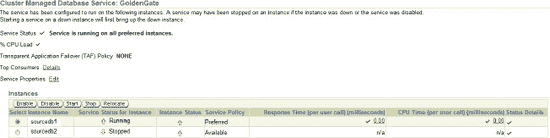

# 添加数据过滤和映射

您可以使用 GoldenGate 来过滤您正在复制的表、列和行。您还可以对从源数据库到目标数据库的表和列执行复杂的映射。接下来的部分将探讨这些主题，并使用 第 4 章 介绍的相同示例 HR 表。作为提醒，以下是该表的布局：

```
Table EMPLOYEES
 Name                                      Null?    Type
 ----------------------------------------- -------- ----------------------------
 EMPLOYEE_ID  (PK)                         NOT NULL NUMBER(6)
 FIRST_NAME                                         VARCHAR2(20)
 LAST_NAME                                  NOT NULL VARCHAR2(25)
 EMAIL                                      NOT NULL VARCHAR2(25)
 PHONE_NUMBER                                        VARCHAR2(20)
 HIRE_DATE                                         NOT NULL DATE
 JOB_ID                                           NOT NULL VARCHAR2(10)
 SALARY                                            NUMBER(8,2)
 COMMISSION_PCT                                    NUMBER(2,2)
 MANAGER_ID                                        NUMBER(6)
 DEPARTMENT_ID                                     NUMBER(4)
```

#### 过滤表

您可能还记得 第 4 章 中，您使用以下 Extract 参数指示 GoldenGate 提取 HR 模式中所有表的所有更改：

```
Table HR.*;
```

您通过在模式名后使用通配符星号 `HR.*` 来实现这一点，这告诉 GoldenGate 提取 HR 模式中的 *所有* 表。

现在假设您的业务需求发生了变化，您不需要提取 HR 模式中的所有表。您只需要提取 `EMPLOYEES` 和 `JOBS` 表。您可以通过更改 Extract 参数来实现，如下例所示：

```
Table HR.EMPLOYEES;
Table HR.JOBS;
```

您移除了通配符，只添加了您想要复制的那两个表。您可能已经想过，是否可以通过使用 Replicat 而不是 Extract 过滤来实现同样的效果。答案是肯定的，尽管在 Extract、Replicat 或两者中进行过滤可能各有优势；这取决于您的需求和具体情况。例如，您可能有多个目标端 Replicat，它们需要来自不同表的不同数据集。在这种情况下，提取所有表的数据，然后让每个 Replicat 仅过滤出它需要的数据可能更好。另一种选择是配置一个数据泵 Extract 来执行过滤，并仅将每个 Replicat 需要的数据发送给它。另一方面，如果您只需要那两个表，可能更好的做法是在 Extract 端过滤掉这些表的数据，仅将 Replicat 需要的数据发送给它。您可以看到，在配置复制环境时，必须做出一些重要的设计决策。

作为提醒，让我们回顾一下 第 4 章 中的基本 Replicat `MAP` 参数。在以下参数示例中，您使用通配符复制 HR 模式中的所有表：

```
Map HR.*, Target HR.* ;
```

如果您想复制特定的表，可以使用 Replicat 以与在 Extract 中过滤类似的方式进行表过滤。以下示例过滤表，仅复制 `EMPLOYEES` 和 `JOBS` 表：

```
Map HR.EMPLOYEES, Target HR.EMPLOYEES ;
Map HR.JOBS, Target HR.JOBS ;
```

除了过滤表，您还可以过滤列。接下来让我们看看这一点。


#### 筛选列

假设你不希望提取 `EMPLOYEES` 表中的所有列，而只对 `EMPLOYEE_ID`、`FIRST_NAME` 和 `LAST_NAME` 列感兴趣。你可以通过向提取（Extract）的 `TABLE` 参数添加以下内容来实现：

```
Table HR.EMPLOYEES
COLS (employee_Id, first_name, last_name);
```

在此示例中，除了 `COLS` 参数中列出的三个列，所有其他列都被忽略。请记住，最好在 `COLS` 列表中包含主键列；否则 GoldenGate 可能会选择所有标记为键的列，这可能不是好主意。

`注意` 如果你在数据泵（data-pump）提取中使用列过滤，将无法再使用直通（passthru）模式。

列过滤的另一个示例是，你希望提取表中的所有列，*除了*少数几列。假设你希望提取整个 `EMPLOYEES` 表，但排除 `EMAIL` 列。你可以在提取中使用 `COLSEXCEPT` 参数来实现，如下例所示：

```
Table HR.EMPLOYEES
COLSEXCEPT (email);
```

你可能会发现 `COLSEXCEPT` 比使用 `COLS` 更方便、更高效，特别是当你只想从大表中排除少数几列时。请记住，不能使用 `COLSEXCEPT` 排除主键列。

除了过滤列，你还可以过滤行。

#### 筛选行

过滤行最简单的方法是，在提取（Extract）的 `TABLE` 语句或复制（Replicat）的 `MAP` 语句中添加一个 `WHERE` 子句。让我们分别看一个示例。首先，在提取中添加过滤条件，仅提取 `EMPLOYEE_ID` 小于 100 的员工，如下例所示：

```
Table HR.EMPLOYEES,
WHERE (EMPLOYEE_ID < 100);
```

现在让我们在复制中添加过滤。假设你决定只复制 IT 程序员的数据。你可以按如下方式在复制中添加该过滤器：

```
Map HR.EMPLOYEES, Target HR.EMPLOYEES,
WHERE (JOB_ID = "IT_PROG");
```

`提示` 过滤数据值时，需要使用双引号。

另一种对数值进行复杂过滤的方法是，在提取或复制中使用 GoldenGate 的 `FILTER` 参数。此外，你可以使用 `FILTER` 将过滤限制在特定的数据操作语言（DML）语句。以下示例仅过滤月薪大于 1000 的员工：

```
Map HR.EMPLOYEES, Target HR.EMPLOYEES,
FILTER (SALARY / 12 > 1000);
```

让我们再看一个基于 DML 操作（如 `insert`、`update` 或 `delete`）进行过滤的示例。假设你只希望在员工的月薪小于 1000 时复制 `delete` 操作。你可以设置一个过滤器，如下所示，该过滤器仅对 `delete` 语句执行。此示例使用提取的 `TABLE` 参数进行过滤：

```
Table HR.EMPLOYEES,
FILTER (ON DELETE, SALARY / 12 < 1000);
```

你已经看到了 GoldenGate 过滤表、行和列的强大功能的几个示例。现在让我们看一些高级的列映射。

#### 映射列

你可能还记得 第 4 章，复制参数文件使用了 `ASSUMETARGETDEFS` 参数。你使用此参数告诉 GoldenGate 你的源表和目标表是相同的。但如果源表和目标表不同呢？GoldenGate 可以轻松处理这些差异，甚至可以在需要时转换数据。

以下是你用作目标表的 `EMPLOYEES` 表的增强版本。在目标数据库中，该表名为 `STAFF`。本节还讨论了另外一些差异：

```
Table STAFF
 Name                                      Null?    Type
 ----------------------------------------- -------- ----------------------------
 EMPLOYEE_ID  (PK)                         NOT NULL NUMBER(6)
 FIRST_NAME                                VARCHAR2(20)
 LAST_NAME                                 NOT NULL VARCHAR2(25)
 FULL_NAME                                 NOT NULL VARCHAR2(46)
 EMAIL                                     NOT NULL VARCHAR2(25)
 PHONE_NUMBER                                     VARCHAR2(20)
 HIRE_DATE                                 NOT NULL DATE
 JOB_ID                                    NOT NULL VARCHAR2(10)
 WAGES                                     NUMBER(8,2)
 COMMISSION_PCT                            NUMBER(2,2)
 MANAGER_ID                                NUMBER(6)
 DEPARTMENT_ID                             NUMBER(4)
```

目标数据库表中的列名不是源数据库表中的 `SALARY`，而是 `WAGES`。你可以按如下示例编写 `MAP` 参数：

```
Map HR.EMPLOYEES, Target HR.STAFF,
COLMAP (USEDEFAULTS,
WAGES = SALARY);
```

在开始复制之前，你需要生成一个 GoldenGate 数据定义文件。这是必需的，因为源表和目标表现在不同了。

##### 生成数据定义文件

只要 GoldenGate 认为你的源表和目标表不完全相同，你就必须使用 GoldenGate 数据定义文件。在本示例中，有一个列名不同，因此你必须创建一个数据定义文件。GoldenGate 复制使用数据定义文件来映射源表和目标表。因为你在目标服务器上使用复制进行映射，所以你在源服务器上生成数据定义文件并将其传输到目标服务器。如果你在源端使用提取进行映射，则需要在目标服务器上创建数据定义文件并将其传输到源服务器。

`提示` 如果任何列不匹配或顺序不同，GoldenGate 就不会认为表是相同的。名称、长度、数据类型、语义和列顺序必须完全匹配，GoldenGate 才会认为表是相同的。

生成数据定义文件的第一步是创建一个 `defgen` 参数文件，以告诉 GoldenGate 文件中需要包含什么。以下示例为 `HR` 架构中的所有源表创建一个 `defgen` 参数文件。本例中 `defgen` 文件与复制同名，但文件扩展名不同，为 `defs`：

```
defsfile ./dirdef/RHREMD1.defs
USERID GGER@sourcedb, PASSWORD userpw
TABLE HR.*;
```

接下来，你可以使用 GoldenGate 的 `defgen` 命令生成数据定义文件：

```
defgen paramfile dirprm/hrdefs.prm
```

这会生成在 `defgen` 参数文件中指定的数据定义文件 `RHREMD1.defs`。下一步是将此文件从源服务器传输到目标服务器。你应该将 `defgen` 文件放在 `dirdef` 目录中。

最后一步是告诉 GoldenGate 你正在使用 `defgen` 文件，并且不再使用 `ASSUMETARGETDEFS` 参数，因为源表和目标表不同。在以下示例中，`ASSUMETARGETDEFS` 参数被注释掉，并且包含一个新的 `SOURCEDEFS` 参数，该参数指向 `defgen` 文件：

```
--AssumeTargetDefs
SourceDefs dirdef/RHREMD1.defs
```

现在你已经设置了列映射并生成了数据定义文件，几乎准备好启动复制了。下一节将讨论一个额外的要求。

#### 转换列

在开始将 `EMPLOYEES` 表复制到 `Staff` 表之前，您还有一件事需要完成。目标 `Staff` 表中的 `WAGES` 列需要反映员工的*年薪*。而源数据库 `EMPLOYEES` 表中的 `SALARY` 列只存储了*月薪*。因此，在复制过程中，您必须将*月薪*金额转换为*年薪*金额。您可以使用 Replicat 的 `MAP` 和 `COLMAP` 参数来完成此操作，如下例所示：

```
Map HR.EMPLOYEES, Target HR.STAFF,
COLMAP (USEDEFAULTS,
WAGES = @COMPUTE(SALARY * 12));
```

此示例在复制过程中，将每月的 `SALARY` 列乘以 12 个月，映射到年薪的 `WAGES` 列。您可以使用 GoldenGate 内置的 `@COMPUTE` 函数进行计算。

源表与目标 `EMPLOYEES` 表之间的另一个区别是，目标表多了一个 `FULL_NAME` 列。全名是 `LAST_NAME`、一个逗号和 `FIRST_NAME` 的连接。您可以使用 Replicat `MAP` 参数执行此转换，如下所示：

```
Map HR.EMPLOYEES, Target HR.STAFF,
COLMAP (USEDEFAULTS,
WAGES = @COMPUTE(SALARY * 12),
FULL_NAME = @STRCAT(LAST_NAME,",",FIRST_NAME));
```

现在让我们看看包含映射和过滤更改（以*斜体*显示）的 Extract 和 Replicat 参数文件。这是增强的 Extract 参数文件：

```
GGSCI (sourceserver) 1> edit params LHREMD1
Extract LHREMD1
-------------------------------------------------------------------
-- Local extract for HR schema
-------------------------------------------------------------------
SETENV (NLS_LANG = AMERICAN_AMERICA.AL32UTF8)
USERID 'GGER', PASSWORD "AACAAAAAAAAAAADAVHTDKHHCSCPIKAFB", ENCRYPTKEY default
ReportCount Every 30 Minutes, Rate
Report at 01:00
ReportRollover at 01:15
DiscardFile dirrpt/LHREMD1.dsc, Append
DiscardRollover at 02:00 ON SUNDAY
ENCRYPTTRAIL
ExtTrail dirdat/l1
Table HR.EMPLOYEES
FILTER (ON DELETE, SALARY / 12 < 1000)
WHERE (EMPLOYEE_ID < 100);
Table HR.JOBS;
```

接下来是增强的 Replicat 参数文件：

```
GGSCI (targetserver) 1> edit params RHREMD1
Replicat RHREMD1
-------------------------------------------------------------------
-- Replicat for HR Schema
-------------------------------------------------------------------
SETENV (NLS_LANG = AMERICAN_AMERICA.AL32UTF8)
USERID 'GGER', PASSWORD "AACAAAAAAAAAAADAVHTDKHHCSCPIKAFB", ENCRYPTKEY default
--AssumeTargetDefs
SourceDefs dirdef/RHREMD1.defs
ReportCount Every 30 Minutes, Rate
Report at 01:00
ReportRollover at 01:15
DiscardFile dirrpt/RHREMD1.dsc, Append
DiscardRollover at 02:00 ON SUNDAY
DECRYPTTRAIL
Map HR.EMPLOYEES, Target HR.STAFF,
COLMAP (USEDEFAULTS,
WAGES = @COMPUTE(SALARY * 12),
FULL_NAME = @STRCAT(LAST_NAME,",",FIRST_NAME));
Map HR.JOBS, Target HR.JOBS ;
```

### Oracle 特定的 DBMS 配置选项

让我们回顾一些特定于在复制配置中使用 Oracle 数据库的 DBMS 配置选项。首先，您将了解如何在 Oracle 真应用集群 (RAC) 环境中配置 GoldenGate。然后，您将回顾 Oracle 自动存储管理 (ASM) 的一些特殊配置选项。最后，您将了解如何在 Oracle 数据库之间设置 DDL 复制。如果您不使用 Oracle 数据库，可以跳过本节。

#### 为 Oracle RAC 配置

GoldenGate 支持 Oracle RAC 已有多年历史。如果您在 Oracle RAC 中运行 GoldenGate，有一些特殊的注意事项需要了解。请查阅 *Oracle GoldenGate Oracle 安装与设置指南* 以获取特定于平台的要求。

您可以选择在 RAC 集群中的任意节点上安装并运行 GoldenGate。您可能决定在计划工作负载较轻的某个节点上运行 GoldenGate。GoldenGate 可以安装在对 RAC 集群中所有节点可用的共享存储上，也可以安装在本地存储上。如果您将 GoldenGate 安装在共享存储上，则可以从任意节点启动 GoldenGate Manager 和其他 GoldenGate 进程。如果您启动 GoldenGate 的节点崩溃，您可以在另一个节点上重新启动它。

您还可以设置 GoldenGate 在 Oracle Clusterware 下运行并自动故障转移到集群中的另一个节点。从 Oracle 11gR2 开始，您可以使用 ASM 集群文件系统 (ACFS) 来存放 GoldenGate 软件和文件。有关更多信息，请参阅白皮书 *Oracle GoldenGate 使用 Oracle Clusterware 实现高可用性*，该文档可在 Oracle 技术网络上获取，网址为 [`www.oracle.com/technetwork/index.html`](http://www.oracle.com/technetwork/index.html)。

##### 同步节点

作为 Oracle RAC 安装的一部分，您应确保集群中每个节点的日期和时间同步。日期和时间同步通常使用网络时间协议 (NTP) 完成。尽管跨节点同步日期和时间是 Oracle 集群安装的一部分，但对于复制来说尤其重要，因为 GoldenGate 会根据系统日期和时间设置做出处理决策。如果每个节点上的时间不同，可能会导致复制问题或异常终止。

您还应该了解几个 GoldenGate 参数，这些参数允许您控制节点之间的 I/O 延迟。您可以使用 `THREADOPTIONS IOLATENCY` 来补偿节点之间 I/O 延迟的差异。默认值为 1.5 秒，但如果您需要处理显著的延迟，可以将其增加到 3 分钟。`THREADOPTIONS` 参数的另一个选项允许您调整因重做日志上的磁盘争用而引起的延迟：您可以将 `THREADOPTIONS MAXCOMMITPROPAGATIONDELAY` 调整到最多 90 秒以补偿这些延迟。默认值为 3 秒。

##### 连接到数据库

对于 Oracle RAC，您应该设置一个专门为 GoldenGate 连接使用的数据库服务，并在您的 `tnsnames.ora` 文件中定义连接信息。您可以使用 Oracle 数据库配置助手 (DBCA) 或通过 Oracle Enterprise Manager 来设置服务，如图 5-1 所示。



**图 5-1.** 在 OEM 中定义的 GoldenGate 服务

图 5-1 中的示例在首选实例 `sourcedb1` 上定义了服务，并且它在实例 `sourcedb2` 上也可用。定义服务后，您可以停止 Extract 或 Replicat，根据需要将服务从实例移动到实例，然后重新启动 Extract 或 Replicat。您还可以使用 `srvctl` 实用程序显示有关服务的信息：

```
> srvctl config service -d sourcedb1 -s goldengate -a
goldengate PREF: sourcedb1 AVAIL: sourcedb2 TAF: NONE
```

定义服务后，您需要将连接信息添加到您的 `tnsnames.ora` 文件中，如下所示：

```
GoldenGate =
  (DESCRIPTION =
    (ADDRESS = (PROTOCOL = TCP)(HOST = sourceserver1-vip)(PORT = 1521))
    (ADDRESS = (PROTOCOL = TCP)(HOST = sourceserver2-vip)(PORT = 1521))
    (LOAD_BALANCE = NO)
    (CONNECT_DATA =
      (SERVER = DEDICATED)
      (SERVICE_NAME = GoldenGate)
    )
  )
```

然后，您可以配置 Extract 或 Replicat 使用新的基于服务的连接，如下所示：

```
USERID GGER@GoldenGate, PASSWORD userpw
```

此连接将 Extract 或 Replicat 连接到您刚刚添加的 `GoldenGate` TNS 别名，该别名使用您在数据库中定义的服务。现在让我们看看在 Oracle RAC 上运行 GoldenGate 时应该注意的另一个考虑因素。


##### 定义线程

在 Oracle 单机数据库中，通常只有一个重做线程。在 Oracle RAC 中，通常每个实例有一个重做线程。您需要告诉 GoldenGate Extract 进程 Oracle RAC 环境中定义的重做线程数。以下示例在具有两个实例和两个线程的 Oracle RAC 环境中添加了一个 Extract：

```
GGSCI (sourceserver) > ADD EXTRACT LHREMD1, TRANLOG, THREADS 2, BEGIN NOW
```

 **提示** 如果线程数量发生变化（例如添加新节点和实例），您必须记住使用正确的线程数删除并重新添加 Extract。

接下来，让我们回顾如何为 Oracle ASM 配置 GoldenGate。

