# 配置 Oracle ASM

如果您使用 Oracle ASM，则需要一些特殊的 GoldenGate 参数，以允许 GoldenGate Extract 连接到 ASM。此外，您必须配置 Oracle 监听器和`tnsnames.ora`以支持来自 GoldenGate 的连接。让我们先看看 GoldenGate 参数。

##### 指定 ASM 用户

使用 ASM 时，GoldenGate 本地 Extract 必须登录到 ASM 实例才能访问重做日志。您需要在本地 Extract 参数文件中添加一个额外的`TranLogOptions ASMUser`参数来指定 ASM 用户 ID 和密码，如下例所示：

```
TranLogOptions ASMUser "sys@asm", asmpassword "<encrypted password>",
ENCRYPTKEY default
```

ASM 用户可以是具有 ASM 实例中 SYSDBA 特权的任何用户（或 11g 及更高版本中的 SYSASM 特权）。此示例使用 sys 用户 ID 连接到 ASM 实例。

##### 更新监听器

更新 GoldenGate 本地 Extract 参数文件后，您需要确保您的监听器正在 ASM 实例上侦听连接。在您的`listener.ora`文件中添加如下所示的子句（以 Oracle 11g 示例为例）：

```
(SID_DESC =
      (SID_NAME = +ASM1)
      (ORACLE_HOME = /u01/asm/oracle/product/11.1.0/asm_1)
```

此子句确保您的监听器正在 ASM 实例上侦听连接。请确保重新加载监听器以使更改生效。

##### 更新 TNSNAMES.ORA

最后，您需要在`tnsnames.ora`文件中为 ASM 连接创建一个别名：

```
ASM =
  (DESCRIPTION =
    (ADDRESS = (PROTOCOL = TCP)(HOST = sourceserver1-vip)(PORT = 1521))
    (CONNECT_DATA =
      (SERVER = DEDICATED)
      (SERVICE_NAME = +ASM1)
      (INSTANCE_NAME = +ASM1)
    )
  )
```

此条目应与您之前在 GoldenGate `ASMUser`参数中指定的别名匹配。该示例在 GoldenGate 参数文件中使用`sys@asm`作为`ASMUser`进行连接，这与您的 TNS 条目相匹配。

### 添加 Oracle DDL 复制

除了复制 DML 语句外，GoldenGate 还可以为所有支持 DML 复制的 Oracle 数据库版本复制 DDL 语句。您可以使用相同的 Extract 和 Replicat 参数文件配置 GoldenGate 仅复制 DDL、仅复制 DML 或同时复制 DDL 和 DML 语句。在开始为 DDL 复制配置参数之前，您应该了解 GoldenGate DDL 复制的一些主要限制：

*   在 Oracle 11gR1 之前的 Oracle 10g 及更高版本中，您必须关闭 Oracle 回收站。
*   GoldenGate 只能自动复制长度小于 2MB 的 DDL 语句。任何长于该长度的 DDL 必须使用 GoldenGate 提供的脚本手动处理。
*   DDL 复制仅支持在*两个*系统之间进行复制。支持双向 DDL 复制。
*   源和目标模式必须相同。这意味着您必须在 Replicat 上使用`ASSUMETARGETDEFS`参数。
*   您必须对需要 DDL 复制的表在数据泵 Extract 上使用直通模式。
*   您应将单个表和相关表组的 DML 和 DDL 复制保留在同一个 Extract 和 Replicat 组中。

有关其他限制的详细信息，请参阅 Oracle *GoldenGate Windows and UNIX Administrator's Guide*。现在，让我们逐步完成添加 Oracle DDL 复制的步骤。此示例使用 gger 用户模式来存储 DDL 表，但您也可以根据需要选择其他模式：

1.  授予 gger 用户在`UTL_FILE`上的执行权限：`SQL> grant execute on utl_file to gger;`
2.  将以下行添加到您的`GLOBALS`文件中。请记住，此文件位于您的 GoldenGate 软件安装目录中。如果它不存在，则需要在首次创建：`GGSCHEMA GGER`
3.  从 GoldenGate 软件安装目录运行`marker_setup.sql`脚本，如下所示。此脚本是 GoldenGate 软件安装的一部分。它会提示输入模式名称，在本例中为 gger：
    ```
    SQL> connect / as sysdba
    Connected.
    SQL> @marker_setup.sql

    Marker setup script

    You will be prompted for the name of a schema for the GoldenGate database objects.
    NOTE: The schema must be created prior to running this script.
    NOTE: Stop all DDL replication before starting this installation.

    Enter GoldenGate schema name:gger

    Marker setup table script complete, running verification script...
    Please enter the name of a schema for the GoldenGate database objects:
    Setting schema name to GGER

    MARKER TABLE
    -------------------------------
    OK

    MARKER SEQUENCE
    -------------------------------
    OK

    Script complete.
    ```
4.  从 GoldenGate 软件安装目录运行`ddl_setup.sql`。此脚本是 GoldenGate 软件安装的一部分：
    ```
    SQL> @ddl_setup.sql

    GoldenGate DDL Replication setup script

    Verifying that current user has privileges to install DDL Replication...
    Checking user sessions...

    Check complete.

    You will be prompted for the name of a schema for the GoldenGate database objects.
    NOTE: For an Oracle 10g source, the system recycle bin must be disabled.
    For Oracle 11g and later, it can be enabled.
    NOTE: The schema must be created prior to running this script.
    NOTE: Stop all DDL replication before starting this installation.

    Enter GoldenGate schema name:gger

    You will be prompted for the mode of installation.
    To install or reinstall DDL replication, enter INITIALSETUP
    To upgrade DDL replication, enter NORMAL
    Enter mode of installation:INITIALSETUP
    Working, please wait ...
    Spooling to file ddl_setup_spool.txt

    Using GGER as a GoldenGate schema name, INITIALSETUP as a mode of installation.

    Working, please wait ...

    ...
    ```


#### DDL 复制状态
---
DDL 复制软件组件安装成功

脚本执行完成。

## 5. 配置角色
运行角色设置脚本，为 DDL 同步设置所需的角色，并将该角色授予`gger`数据库用户：
```
SQL> @role_setup.sql
```

`GGS 角色设置脚本`

`此脚本将删除并重新创建角色 GGS_GGSUSER_ROLE`
`如需使用不同的角色名称，请退出此脚本并编辑 params.sql 脚本`
`将 gg_role 参数更改为您首选的名称。（不要运行脚本。）`

`系统将提示您输入 GoldenGate 数据库对象的架构名称。`
`注意：必须在运行此脚本前创建该架构。`
`注意：在开始此安装前停止所有 DDL 复制。`

`输入 GoldenGate 架构名称：gger`
`已写入文件 role_setup_set.txt`

`PL/SQL 过程已成功完成。`

`角色设置脚本完成`

`请使用以下 SQL 命令，将此角色授予分配给 Extract、GGSCI 和 Manager 进程的每个用户：`

```
GRANT GGS_GGSUSER_ROLE TO <loggedUser>
```

`其中 <loggedUser> 是分配给 GoldenGate 进程的用户。`

```
SQL> GRANT GGS_GGSUSER_ROLE TO gger;
```

`授权成功。`

## 6. 启用 DDL 触发器
运行`ddl_enable.sql`脚本以启用 DDL 触发器：
```
SQL> @ddl_enable.sql
```
`触发器已变更。`

## 7. 更新抽取参数文件
更新本地 Extract 参数文件以包含 DDL 参数，告知 GoldenGate 您希望复制 DDL。在此示例中，您仅复制在复制场景中映射的 DDL 语句。您也可以选择使用不同的参数选项来`INCLUDE`其他表或`EXCLUDE`它们，使其不参与 DDL 复制：
```
DDL Include Mapped
```

至此，您应该已经在 Oracle 数据库之间复制了 DDL 变更。接下来，您将看到如何设置双向复制。

### 添加双向复制

在第 4 章中，您设置了基本的单向复制。现在，让我们扩展该基础配置以支持双向复制。首先，让我们回顾一下第 3 章中双向复制的架构。

在双向复制中，如图 5-2 所示，数据变更可以同时发生在任一数据库上，并被复制到另一个数据库。每个数据库包含相同的数据集。双向复制有时被称为**主动-主动复制**，因为复制的每一侧都在**主动**处理数据变更。


**图 5-2.** 双向复制

图 5-3 展示了一个典型的 GoldenGate 双向复制配置。这种配置通常用于有高吞吐量和高性能要求的环境。通过允许复制的两侧都处于活动状态，可以充分利用数据库和硬件。

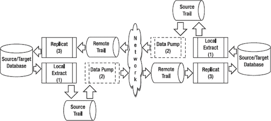

**图 5-3.** 双向复制 GoldenGate 配置

以下是图 5-3 中说明的一些关键组件：

*   在每个源服务器上运行的本地 Extract。
*   在每个源服务器上运行的数据泵。这是可选的，但推荐使用。如果需要减轻源服务器的处理负载，也可以将数据泵移动到中间层服务器。
*   在每个目标上运行的 Replicat。如果需要提高性能，可以配置多个并行的 Replicat。

双向复制的一个缺点是它可能变得极其复杂。您必须制定处理数据冲突和避免主键冲突的策略。例如，一种策略可能是每个数据库只能处理特定范围的主键值以避免冲突。

接下来的章节将探讨这些主题，并使用本章一直在使用的示例`HR.EMPLOYEES`表。对于双向复制，`HR.EMPLOYEES`表在参与复制的每个数据库上**既是源又是目标**。

在开始配置双向复制参数之前，您应该注意以下几点：

*   您无法在双向复制中复制`TRUNCATE`操作。只要截断操作总是源自同一服务器，您可以通过将截断配置为单向复制来解决此限制。
*   从实际角度来看，双向复制通常最多在两个相同的数据库之间进行。超过两个，配置将变得极难管理。
*   在主动-主动配置中，无法禁用触发器，因此您应在触发器中添加代码以忽略由 GoldenGate Replicat 生成的 DML。
*   如果使用级联删除约束，则需要禁用这些约束并将其转换为触发器。
*   您需要规划数据库生成的顺序键，确保不会跨数据库重叠。例如，可以让一个数据库生成奇数键值，另一个数据库生成偶数键值。另一种选择是让一个数据库使用特定的键范围，另一个数据库使用不同的键范围以避免重复。
*   如果两个数据库共享相同的主键值，则必须开发一些冲突解决例程。例如，如果具有相同主键的同一行数据在两个数据库上都被更新，应该应用哪个更新？GoldenGate 提供了用于识别和处理冲突的文档示例，但这通常取决于应用程序的业务规则。

有关其他限制和注意事项的详细信息，请参阅 Oracle *GoldenGate Windows and UNIX Administrator's Guide*。现在，让我们开始配置双向复制的步骤。


#### 为双向复制排除事务

在双向配置中，每台服务器上运行着一个或多个 Replicat 来应用 SQL 事务。可以想象，如果每个 Replicat 总是应用来自另一个 Replicat 的 SQL 事务，就可能出现 SQL 事务无限循环的情况。默认情况下，GoldenGate 不会复制由 Replicat 应用的 SQL 事务，以防止这种无限循环。这是通过 `GETREPLICATES` 或 `IGNOREREPLICATES` 参数控制的。然而，对于大多数数据库，你仍然需要向 GoldenGate 标识要排除的 Replicat 用户事务。根据 DBMS 的不同，需要使用不同的参数，如下列示例所示。

对于 DB2 z/OS 和 LUW、Ingres 和 Sybase 代码，在本地 Extract 参数文件中使用以下内容来排除 gger 用户：

```
TRANLOGOPTIONS EXCLUDEUSER gger
```

对于 Sybase，在本地 Extract 参数文件中包含以下内容以排除默认的事务名称 ggs_repl。对于 SQL Server，仅当 Replicat 事务名称不是默认的 ggs_repl 时才需要此参数：

```
TRANLOGOPTIONS EXCLUDETRANS ggs_repl
```

对于 Teradata，你不需要标识 Replicat 事务；但是，你必须在 Replicat 参数文件中包含以下 `SQLEXEC` 语句，以在启动时自动设置 Replicat 会话：

```
SQLEXEC "SET SESSION OVERRIDE REPLICATION ON;"
SQLEXEC "COMMIT;"
```

对于 SQL/MX，在本地 Extract 参数文件中包含以下内容，以排除对检查点表 `gger.ckpt` 的操作：

```
TRANLOGOPTIONS FILTERTABLE gger.chkpt
```

对于 Oracle 10g 及更高版本，在本地 Extract 参数文件中包含以下内容以排除 gger 用户：

```
TRANLOGOPTIONS EXCLUDEUSER gger
```

对于 Oracle 9i，在任何 `TABLE` 或 `MAP` 语句之前，在 Extract 和 Replicat 参数文件中都包含以下 `TRACETABLE` 参数。当发生更新时，Replicat 会更新跟踪表。这有助于 Extract 识别并排除任何 GoldenGate 事务。你必须先使用 `ADD TRACETABLE` 命令创建跟踪表。此示例使用跟踪表 `ggs_trace`：

```
TRACETABLE ggs_trace
```

接下来，我们讨论如何处理双向复制的冲突解决。

## 处理双向复制的冲突解决

在双向配置中，你必须计划、识别和处理数据冲突。如果具有相同键值的记录所属的数据在两个数据库上同时更新，就可能发生冲突。由于 GoldenGate 是一种异步解决方案，这些冲突是有可能发生的。

以下是可用于避免冲突和处理冲突解决的一些技术：

> *低延迟*：你应该确保两个数据库之间的延迟或滞后最小化，以防止或至少减少冲突的发生。例如，如果第一个数据库上的用户将 Employee_ID 100 的 FIRST_NAME 更新为 Bill，几分钟后第二个数据库上的另一个用户将同一雇员的 FIRST_NAME 更新为正确的名称 William，你希望确保正确的名称被应用到两个数据库。如果存在延迟，Bill 可能在 William 之后被应用。如果没有延迟，正确的名称 William 将按正确顺序被应用。如果存在显著延迟，那么你可能需要解决更多冲突。
>
> *键范围*：你可以为应用程序分配特定的键范围，并确保它们只在特定的数据库上更新该键范围。例如，为避免 EMPLOYEES 表中的冲突，你可以将 EMPLOYEE_ID 0–1000000 分配给第一个数据库，将 EMPLOYEE_ID 1000001–2000000 分配给第二个数据库。HR 应用程序将知晓这些键范围，并相应地编写其 DML 代码，根据键值指向正确的数据库。
>
> *键标识符*：另一种技术是在现有键中添加一个额外的键列，以标识记录所属或主控的特定数据库。例如，数据库 A 可以有一个额外的键列表示该记录属于数据库 A。数据库 B 可以添加一个类似的键。你需要评估在数据库表中添加这样一个列的任何缺点。
>
> *自动化键序列*：在一些数据库中，你可以使用不同选项的自动生成的序列号作为键。例如，在 EMPLOYEES 表中，你可以为一个数据库生成偶数序列，为第二个数据库生成奇数序列。这样做可确保数据库之间没有冲突。
>
> *冲突解决例程*：如果你无法避免键冲突，你需要识别即将发生的冲突，并根据业务决策和应用逻辑适当地处理它。你可以在 `MAP` 语句中添加过滤器来确定冲突即将发生以及如何处理它。例如，你可以添加一个过滤器来判断一条记录是否具有相同的键和比现有记录更旧的时间戳列。如果是，你可以丢弃旧的记录。例如，在 HR.EMPLOYEES 表上，你可以添加一个时间戳列来帮助你在 SQL 更新语句冲突时确定要丢弃哪一行。处理冲突的 `MAP` 语句示例如下：
>
> ```
> MAP HR.EMPLOYEES, TARGET HR.EMPLOYEES, &
> REPERROR (90000, DISCARD), &
> SQLEXEC (ID checkemployee, ON UPDATE, &
> QUERY "select count(*) empduplicate from HR.EMPLOYEES where employee_id = ? and &
> employee_timestamp > ?", &
> PARAMS (p1 = employee_id, p2 = employee_timestamp), BEFOREFILTER, ERROR REPORT, &
> TRACE ALL),&
> FILTER (checkemployee.empduplicate = 0, ON UPDATE, RAISEERROR 90000);
> ```
>
> 此示例在复制更新到行之前执行 GoldenGate 过滤器。该过滤器确定数据库中是否已存在具有相同键和比你正在复制的行更新时间戳的行。如果未找到具有更新时间戳的重复行（`checkemployee.empduplicate = 0`），则你复制该行。如果已经存在具有更新时间戳的行（`checkemployee.empduplicate > 0`），则你引发错误，保留数据库中的现有行，并丢弃正在复制的行。
>
> 有关冲突解决例程的更多示例，请参阅 Oracle *GoldenGate Windows and UNIX Administrator's Guide*。

### 总结

本章介绍了如何在基本 GoldenGate 复制配置中添加高级功能。你学习了如何增强基本报告功能以及使用加密使复制更加安全。你向 Manager 添加了一些自动启动参数，使你的复制能够保持更长时间的运行。你还回顾了如何在复制配置中包含高级的表、行和列映射以及数据过滤，以满足你复杂的业务需求。最后，本章涵盖了 GoldenGate 双向复制拓扑的设置。下一章将通过配置 GoldenGate 进行异构复制，进一步扩展复制场景。

## 第 6 章

## 异构复制

在之前的章节中，我们讨论了如何为 Oracle 11g GoldenGate 环境安装和配置基本复制。根据在客户现场的实践经验，大多数 Oracle 11g GoldenGate 的实施都涉及复杂的异构环境，其中包含多个平台和数据库供应商。例如，在为一个大型电信客户实施近期配置时，我们必须安装和配置 Oracle GoldenGate，以便将数据从运行于 Microsoft Windows 2003 Server 上的 Microsoft SQL Server 2005 数据仓库，复制到运行于 Linux 上的 Oracle 11g 数据仓库系统。在 Oracle GoldenGate 出现之前，不同平台和 RDBMS 系统之间的数据复制往好了说问题重重，往坏了说几乎不可能。这需要耗费数百个工时来创建自定义脚本，并开发以利用那些文档匮乏的系统级 API，即便如此，结果也难以预料。不过，现在无需再为此烦恼了！有了 Oracle GoldenGate，实现不同平台和数据库间实时数据复制的任务相比之下变得**轻而易举**。这当然比仅为类似平台（如从 Oracle 10g 到 Oracle 11g 环境）之间复制数据的 Oracle GoldenGate 基本复制设置要复杂一些。然而，我们将向您展示如何以最简单的方式设置异构环境。您将学习如何从源数据库到目标数据库配置环境，以及与使用 Oracle GoldenGate 进行异构复制相关的管理任务。

由于异构复制可能涉及多种多样的第三方数据库平台，要逐一讨论每种配置所需的时间和篇幅本身就足以写成一本书。因此，我们选择呈现一个案例研究示例，涵盖我们在客户现场实施的常见平台。我们的案例研究将提供如何配置和实现从 Oracle 到 Microsoft SQL Server 的异构复制的信息。为 Oracle GoldenGate 设置异构复制的第一项任务是查阅 Oracle GoldenGate 文档，重点审阅 Oracle GoldenGate 发行说明，以了解 Oracle GoldenGate 在异构复制方面的最新变化。

### Microsoft SQL Server 到 Oracle 复制

Microsoft SQL Server 是中小型公司后台业务数据库环境中最流行且广为人知的 RDBMS 平台之一。然而，根据我们的经验，对于迁移到海量 TB 甚至 PB 级别的大型企业数据仓库环境，其扩展性并不理想。因此，如今的公司倾向于将其较小的 Microsoft SQL Server 环境迁移到 Oracle，以获取 Oracle 可以提供的强大性能。您可以登录 My Oracle Support (MOS) 网站（[`http://support.oracle.com`](http://support.oracle.com)），使用有效的客户账户 (CSI) 号，并查看认证矩阵（如图 6-1 所示），来验证 Oracle 11g GoldenGate 当前支持的第三方数据库平台。

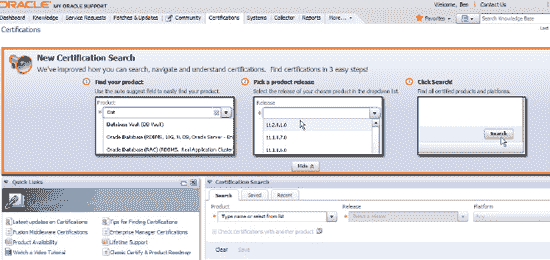

**图 6-1.** My Oracle Support 认证矩阵

目前，从 Microsoft SQL Server 到 Oracle 的 Oracle GoldenGate 复制支持表 6-1 中所示的版本。

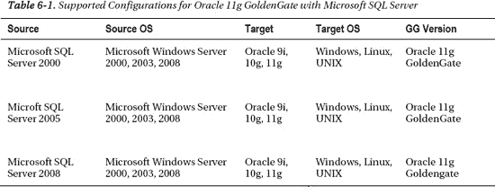

#### 准备 Oracle GoldenGate 环境

您首先需要在源 Oracle 环境和目标 Microsoft SQL Server 环境上安装 Oracle 11g GoldenGate 软件。请确保安装随 GoldenGate 一起提供的示例数据库模式和脚本。

#### 完成 Oracle GoldenGate 环境的初始数据加载

在能够在源和目标环境中设置 Oracle GoldenGate 的 Extract、数据泵和 Replicat 进程组之前，我们需要在源系统和目标系统上加载示例数据。这被称为初始数据加载，不幸的是，Oracle GoldenGate 没有内置过程来自动执行此任务。您可以使用 Oracle 和 Microsoft SQL Server 提供的各种供应商实用程序。对于 Oracle，您可以执行导出/导入或数据泵导出和导入。对于 Microsoft SQL Server，您可以使用 Microsoft 原生的 `BCP` 和 `DTS` 批量加载实用程序，或使用 Replicat 执行直接加载。

#### 源 Oracle 数据库配置

在可以将数据复制到目标 Microsoft SQL Server 数据库环境之前，必须执行许多初步设置。让我们逐步完成这些过程。

在源 Oracle 系统上创建 Manager 参数文件并指定其应使用的端口。

```
$ cd /ggs/source
$ ggsci
GGSCI> EDIT PARAMS MGR
```

```
--GoldenGate Manager 参数文件
PORT 50001
```

启动 Manager 进程。

```
GGSCI> START MGR
```

验证 Manager 进程是否已启动。

```
GGSCI> INFO MGR
Manager is running (IP port oracledba.50001).
```

以 `scott` 用户身份登录到 Oracle 源数据库。创建并用示例数据填充 `SCOTT.EMP` 和 `SCOTT.DEPT` 表。执行 `CREATE TABLE AS SELECT` 以将表数据复制到 `GGS` 用户模式中。接下来，使用 `GGSCI`，您需要登录到源 Oracle 数据库，并为 `SCOTT` 用户模式的 `EMP` 和 `DEPT` 表启用补充日志记录。必须在数据库环境中启用补充日志记录，以便在 DML 操作（例如对表执行 `Insert` 或 `Update` 时）捕获对表中数据所做的更改。

```
$ ggsci
GGSCI> DBLOGIN USERID GGS
GGSCI> ADD TRANDATA GGS.EMP
GGSCI> ADD TRANDATA GGS.DEPT
```

接下来，您需要验证这些表的补充日志记录是否已启用。

```
GGSCI> INFO TRANDATA GGS.*
Logging of supplemental redo data enabled for table GGS.DEPT.

2011-04-03 22:31:21  WARNING OGG-00869  No unique key is defined for table EMP. All viable columns will be used to represent the key, but may not guarantee uniqueness.  KEYCOLS may be used to define the key.

Logging of supplemental redo data enabled for table GGS.EMP.
```

在设置 GoldenGate 环境时，请务必牢记此警告，因为 GoldenGate 要求表必须定义主键或唯一键，以便在复制处理过程中识别唯一键列。否则，将使用所有列，从而对性能产生不利影响。

##### 在源 Oracle 数据库系统上配置源定义

下一步是在源 Oracle 数据库系统上执行源定义文件创建映射，使用以下命令创建 `DEFGEN` 参数文件并添加以下附加参数。

```
$ cd /ggs/
$ ggsci
GGSCI> edit param defgen
```

```
DEFSFILE dirdef/source.def, PURGE
USERID GGS, PASSWORD xxxx
TABLE GGS.EMP;
TABLE GGS.DEPT;
```

```
GGSCI> exit
```

##### 在 Oracle 源系统上执行源定义生成器

在源 Oracle 数据库系统上执行 `defgen` 命令。

```
$ defgen paramfile dirprm/defgen.prm
```

##### 将源定义文件传输到目标 Microsoft SQL Server 系统

```
$ ftp mssql2k8
Password: xxxxx
ftp> ascii
ftp> cd ggs/dirdef
ftp> lcd ggs/dirdef
```

既然我们已经为 Oracle GoldenGate 配置好了 Oracle 源数据库系统，接下来我们将讨论如何设置目标环境以将数据从 Oracle 复制到 Microsoft SQL Server。


#### 目标 Microsoft SQL Server 数据库配置

在可以从源 Oracle 数据库环境复制数据之前，必须执行许多初步设置。让我们逐步了解这些过程。

1.  配置 ODBC 源数据库连接。
2.  在源数据库中设置权限和安全性。
3.  创建抽取和数据泵进程以及参数文件。
4.  启用补充日志记录。
5.  将管理器作为服务添加到 Windows（可选）。

在源 Windows 主机上安装适用于 Microsoft SQL Server 的 Oracle 11g GoldenGate 软件。

在我们的案例研究中，我们将使用 Windows XP 32 位操作系统上的 Microsoft SQL Server 2008 Express Edition。

```bash
C:\ggs\mssqlserver>unzip V22241-01.zip
```
```
Archive:  V22241-01.zip
  inflating: mgr.exe
  inflating: ggsci.exe
  inflating: install.exe
  inflating: ggMessage.dat
  inflating: help.txt
  inflating: tcperrs
  inflating: bcrypt.txt
  inflating: libxml2.txt
```

将管理器添加为 Windows 服务以简化操作，并允许管理器进程作为后台 Windows 服务运行。我们建议在生产环境中采用此做法，以便这个关键进程始终运行而不会停止。

```bash
C:\ggs\mssqlserver> install addevents addservice
```

检查 Windows 事件查看器，确保 Oracle GoldenGate Manager 进程已作为服务添加到 Windows 中，如图 6-2 所示。

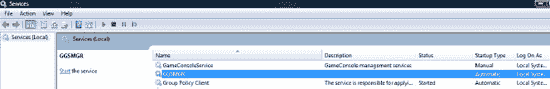

**图 6-2.** 将管理器添加为 Windows 服务

如果管理器进程尚未启动，请点击选项启动它，如图 6-3 所示。

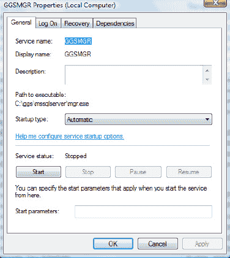

**图 6-3.** 在 Windows 事件查看器中检查管理器进程状态

由于 Microsoft SQL Server 源系统上的管理器进程尚未启动，我们现在启动它。您也可以将管理器进程配置为作为 Windows 服务运行，以便在服务器启动时自动启动，或者将其设置为需要手动干预才能启动管理器。登录到 GGSCI 界面，并为源系统上的 Oracle GoldenGate 软件创建子目录。

```bash
C:\ggs\mssqlserver>ggsci
```

```
Oracle GoldenGate Command Interpreter for ODBC
Version 11.1.1.0.0 Build 078
Windows (optimized), Microsoft SQL Server on Jul 28 2010 18:55:52

Copyright (C) 1995, 2010, Oracle and/or its affiliates. All rights reserved
```

```bash
GGSCI (oracledba) 1> create subdirs
```

```
Creating subdirectories under current directory C:\ggs\mssqlserver

Parameter files                C:\ggs\mssqlserver\dirprm: created
Report files                   C:\ggs\mssqlserver\dirrpt: created
Checkpoint files               C:\ggs\mssqlserver\dirchk: created
Process status files           C:\ggs\mssqlserver\dirpcs: created
SQL script files               C:\ggs\mssqlserver\dirsql: created
Database definitions files     C:\ggs\mssqlserver\dirdef: created
Extract data files             C:\ggs\mssqlserver\dirdat: created
Temporary files                C:\ggs\mssqlserver\dirtmp: created
Veridata files                 C:\ggs\mssqlserver\dirver: created
Veridata Lock files            C:\ggs\mssqlserver\dirver\lock: created
Veridata Out-Of-Sync files     C:\ggs\mssqlserver\dirver\oos: created
Veridata Out-Of-Sync XML files C:\ggs\mssqlserver\dirver\oosxml: created
Veridata Parameter files       C:\ggs\mssqlserver\dirver\params: created
Veridata Report files          C:\ggs\mssqlserver\dirver\report: created
Veridata Status files          C:\ggs\mssqlserver\dirver\status: created
Veridata Trace files           C:\ggs\mssqlserver\dirver\trace: created
Stdout files                   C:\ggs\mssqlserver\dirout: created
```

```bash
GGSCI (oracledba) 2>
```

Windows Vista 和 Windows 2008 的安全选项需要进行配置，以允许启动管理器和抽取进程。否则，当您尝试启动管理器时，将收到以下错误消息：

```bash
GGSCI (oracledba) 7> start mgr
```

```
Process creation error: WIN32 API CALL CreateProcess failed 740 (The requested operation requires elevation.)
```

解决方案很简单：从 Windows 命令行提示符运行`msconfig`实用程序，如图 6-4 所示。

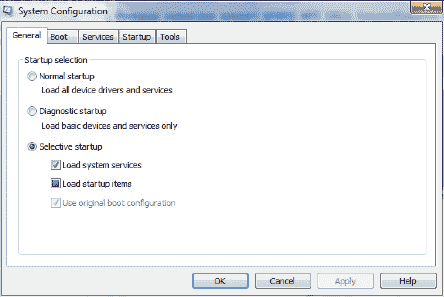

**图 6-4.** Windows 和 Microsoft SQL Server 上管理器的安全设置

现在，您应该能够从服务菜单中以管理员帐户启动 Windows 源系统上的管理器进程。

```bash
C:\ggs\mssqlserver>ggsci
```
```
Oracle GoldenGate Command Interpreter for ODBC
Version 11.1.1.0.0 Build 078
Windows (optimized), Microsoft SQL Server on Jul 28 2010 18:55:52
Copyright (C) 1995, 2010, Oracle and/or its affiliates. All rights reserved.
```

```bash
GGSCI (oracledba) 1> info all
```
```
Program     Status      Group       Lag           Time Since Chkpt

MANAGER     RUNNING
```

```bash
GGSCI (oracledba) 2> status mgr
```
```
Manager is running (IP port oracledba.2000).
```

```bash
GGSCI (oracledba) 3> view params mgr
```
```
PORT 2000
```

#### 创建示例 Microsoft SQL Server 数据库

既然我们已经在源和目标系统上安装了 Oracle GoldenGate 软件，我们需要创建并填充目标 Microsoft SQL Server 数据库。在 Microsoft Windows 中，转到"开始">"程序"，运行 Microsoft SQL Server Enterprise Manager。然后，您需要展开控制台导航树到本地 SQL Server 实例。右键单击 Microsoft SQL Server 数据库实例，如图 6-5 所示，然后选择"属性"。

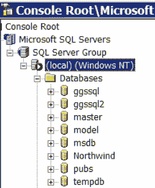

**图 6-5.** 创建示例 Microsoft SQL Server 数据库

在下面的 Microsoft SQL Server 窗口中，选择"安全性"选项卡，然后选择 SQL Server 和 Windows 身份验证，如图 6-6 所示。

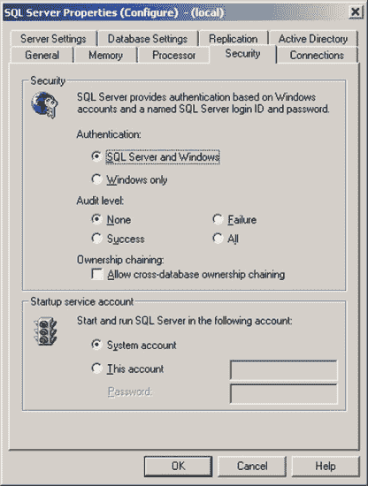

**图 6-6.** 为 Microsoft SQL Server 数据库选择安全性选项卡

在目标 Microsoft SQL Server 环境中创建示例数据库以及 GGS 用户安全帐户。确保为系统和数据库帐户分配正确级别的系统和数据库权限。

由于 Oracle GoldenGate 抽取和应用进程组都通过 ODBC（开放数据库连接）连接到 Microsoft SQL Server 数据库，因此您需要使用系统数据源名称（DSN）设置这些 Oracle GoldenGate 组件。为此，在 Microsoft SQL Server 主机上执行以下任务：

1.  在"程序"下，选择"开始"  "设置"  "控制面板"。
2.  选择  "管理工具"。
3.  双击"数据源（ODBC）"选项，打开 ODBC 数据源管理器对话框。
4.  接下来，请确保单击"系统 DSN"选项卡，然后点击"添加"按钮。将出现"创建新数据源"对话框，如图 6-7 所示。

    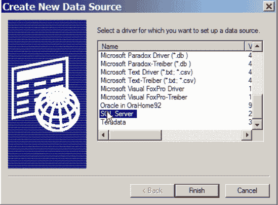

    **图 6-7**. 为 Microsoft SQL Server 数据库创建新数据源

5.  在目标 Microsoft SQL Server 系统上创建新数据源，如图 6-8 所示。

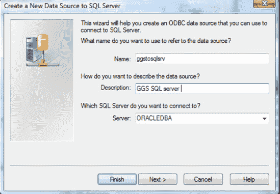

**图 6-8**. 为 Microsoft SQL Server 数据库添加新数据源

既然我们已经完成了源和目标环境上的初始设置，我们就可以为 Oracle 和 Microsoft SQL Server 设置参数文件配置，以作为 Oracle GoldenGate 数据复制的一部分使用。


#### 在源端配置变更数据捕获

接下来，您需要在 Oracle 源数据库系统上配置变更捕获进程。

```bash
GGSCI> ADD EXTRACT EXTORA, TRANLOG, BEGIN NOW
```

```
EXTRACT added.
```

```bash
GGSCI> INFO EXTRACT EXTORA
GGSCI (oracledba) 4> info extract extora
```

```
EXTRACT    EXTORA    Initialized   2011-04-03 23:15   Status STOPPED
Checkpoint Lag       00:00:00 (updated 00:00:31 ago)
VAM Read Checkpoint  2011-04-03 23:15:12.005000
```

下一步是创建跟踪文件并将其与我们上一步的提取进程关联。使用 `GGSCI` 和 `ADD RMTTRAIL` 命令，添加跟踪文件，如下所示。

```bash
GGSCI (oracledba) 5> add rmttrail ./dirdat/lt,extract extora,megabytes 5
```

```
RMTTRAIL added.
```

```bash
GGSCI (oracledba) 6> info rmttrail *
```

```
       Extract Trail: ./dirdat/lt
             Extract: EXTORA
               Seqno: 0
                 RBA: 0
           File Size: 5M
```

创建提取参数，如下列参数文件示例所示。

```
--
-- 变更捕获参数文件，用于捕获
-- EMP 和 DEPT 表的变更
--
EXTRACT EXTORA
USERID GGS, PASSWORD “GGS”
RMTHOST localhost, MGRPORT 2000
RMTTRAIL ./dirdat/lt
TABLE GGS.EMP;
TABLE GGS.DEPT;
```

使用 `GGSCI` 中的 `START` 命令启动源系统上 Oracle 的捕获进程，如下所示。对于变更捕获传递过程，请配置 Replicat 参数，并按照前面章节示例中的常规方式添加跟踪文件。

从 SQL Server 到 Oracle 的复制，其执行方式与前面展示的从 Oracle 复制到 SQL Server 的方式类似。主要区别在于，您将在源 SQL Server 系统上创建 Extract 进程组，而在 Oracle 目标系统上创建 Replicat 进程组。

### MySQL 到 Oracle 复制

MySQL 是一个流行的 RDBMS 平台，被互联网初创公司、媒体公司和互联网服务提供商 (ISP) 广泛采用，是开放标准 LAMP（Linux Apache MySQL PHP）技术栈的一部分。根据我们使用 Oracle GoldenGate 客户的经验，随着他们扩展到更大规模的环境并迁移到 Oracle 环境，他们有复制和迁移其 MySQL 数据的需求，如 表 6-2 所示。

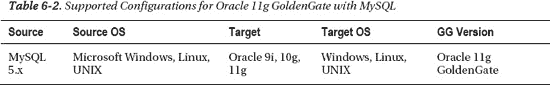

有关如何配置 MySQL 到 Oracle 复制的详细信息，请参阅可在 [`http://otn.oracle.com`](http://otn.oracle.com) 获取的 Oracle GoldenGate 在线文档指南。

### Teradata 到 Oracle 复制

Teradata 是企业数据仓库和商业智能市场的关键参与者之一。它扩展性良好且性能稳健。然而，缺乏内置的原生复制功能一直是 Teradata 的“阿喀琉斯之踵”。因此，它需要 Oracle GoldenGate 软件来执行数据库复制任务。许多客户有业务需求，需要将数据从 Teradata 复制到 Oracle 环境，而 GoldenGate 完美地完成了这项任务。

表 6-3 提供了 Teradata 与 Oracle GoldenGate 当前支持的配置。

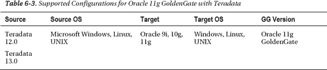

有关如何配置 Teradata 到 Oracle 复制的详细信息，请参阅可在 [`http://otn.oracle.com`](http://otn.oracle.com) 获取的 Oracle GoldenGate 在线文档指南。

### Sybase 到 Oracle 复制

Sybase 最初是 Microsoft 和 Sybase Corporation 的合资企业，后来 SQL Server 从 Sybase 和 Microsoft 中分离出来，成为两个不同的数据库产品。Sybase 有两个数据库产品：Sybase IQ 和 Sybase SQL Server。目前，尚不支持 Sybase IQ 与 Oracle GoldenGate 进行复制。但是，支持从 Sybase SQL Server 到 Oracle GoldenGate 的复制。表 6-4 提供了 Sybase 与 Oracle GoldenGate 当前支持的版本。

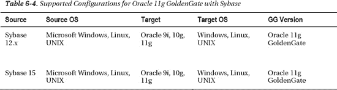

有关如何配置 Sybase 到 Oracle 复制的详细信息，请参阅可在 [`http://download.oracle.com/docs/cd/E18101_01/doc.1111/e17806.pdf`](http://download.oracle.com/docs/cd/E18101_01/doc.1111/e17806.pdf) 获取的 Oracle GoldenGate 在线文档指南。

### IBM DB2 UDB 到 Oracle 复制

IBM DB2 UDB 为 Windows、UNIX、Linux 和大型机平台提供企业数据仓库和 OLTP（在线事务处理）数据库平台。随着 Oracle Fusion Middleware 的普及和 Oracle 数据仓库功能的出现，许多 IBM 客户有业务需求，希望在维护其 Oracle 数据库环境的同时，也保留其当前的 IBM DB2 数据库环境。因此，他们需要一个异构复制解决方案来保持所有数据库环境的同步。Oracle GoldenGate 满足了这一关键需求。Oracle 11g GoldenGate 支持以下版本的 IBM DB2 UDB 与 Oracle 数据库环境，如 表 6-5 所示。

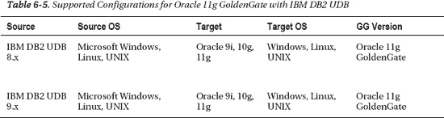

有关如何配置 IBM DB2 UDB 到 Oracle 复制的详细信息，请参阅可在 [`http://download.oracle.com/docs/cd/E18101_01/doc.1111/e17795.pdf`](http://download.oracle.com/docs/cd/E18101_01/doc.1111/e17795.pdf) 获取的 Oracle GoldenGate 在线文档指南。

### 验证操作就绪性

现在，我们已经设置了多个使用第三方数据库到 Oracle 的复制环境来传输数据，是时候测试和验证新的 Oracle GoldenGate 环境是否正常运行了。我们还需要测试和测量基本性能，以确保有足够的资源来从不同的源系统向 Oracle 传输数据。操作就绪性可以通过使用脚本来生成初始加载、执行 DML 和 DDL 事务（如更新、删除和插入）来验证，也可以使用 Oracle GoldenGate Veridata 来检查使用 Oracle GoldenGate 的源和目标异构环境之间的数据同步状态。另一种衡量 Oracle GoldenGate 环境操作就绪性的方法是使用 Oracle GoldenGate Director 产品来检查源和目标环境之间复制的状态。

### 本章小结

我们通过一个案例研究，介绍了使用 Oracle GoldenGate 从第三方数据库平台到 Oracle 的异构实时数据复制。我们从一些基本的安装指南开始，并提供了示例配置步骤以及所需的命令，以便以最少的时间和精力启动并运行。在具有复杂转换的大型生产环境中，您很可能需要通过更高级的功能（如令牌和过滤器）以及宏库来构建这些简单的示例，以满足复制环境的业务需求。

## 第 7 章

### 调优

GoldenGate 是一款久经考验的高性能产品，为世界上一些最繁忙、高吞吐量的应用程序复制数据。为了使 GoldenGate 在此类环境中高效运行，您需要扎实掌握如何调优 GoldenGate。调优 GoldenGate 的过程与许多软件调优实践类似；然而，调优工具和机制却大不相同。您还应记住，尽管 GoldenGate 有自己的调优方法，但其性能取决于底层数据库、服务器、网络和存储的性能。本章将深入探讨如何调优 GoldenGate 复制。

本章回顾了一种用于调优 GoldenGate 复制的结构化方法，并深入探讨了该方法的每个步骤。然后，您将重点关注一些具体的调优策略和示例，这些策略和示例可用于改善 GoldenGate 复制环境的性能。


### 调优方法论

在调优 GoldenGate 时，遵循一套标准的性能与调优方法论对您来说至关重要。否则，您可能无法及时察觉性能问题，或者发现自己在解决错误的问题。本章推荐了一套标准方法论，但严格遵循它并非关键。您可以创建自己的方法论，或根据特定环境调整此方法论。最重要的考虑因素是，您确实遵循了一个结构化的方法，该方法预先定义了需求，并指定了后续的测量与验证。采用结构化方法有助于确保您能恰当地响应性能问题，并满足用户的期望。

以下是 GoldenGate 性能与调优方法论中建议的步骤。步骤 1 和 2 应在项目早期完成：
1.  定义性能需求。
2.  创建性能基线。

步骤 3 至 6 应在识别出调优问题时执行：
3.  评估当前性能。
4.  确定问题。
5.  设计并实施解决方案。
6.  根据需要重复步骤 3 到 5。

如果您曾进行过数据库性能与调优，这些步骤看起来可能很熟悉。但在 GoldenGate 复制环境中，每个步骤都有特定的考量。本章将随着您的进度解释并扩展这些步骤。现在，让我们来审视方法论中的第一步：定义性能需求。

### 定义性能需求

成功满足业务用户性能期望的关键在于正确地定义性能需求。没有性能需求，您永远无法知道是否成功达到了用户的期望。当需求被定义并达成一致后，您就可以将调优工作集中在不符合要求的领域。

您应该在项目早期，甚至在 GoldenGate 安装和配置之前，就定义好 GoldenGate 复制性能需求。之所以这样做，是因为这些需求会对 GoldenGate 的设置和配置方式产生重大影响。

复制最重要的性能需求是应用程序可以容忍的延迟量。在收集复制需求时，您应将延迟视为从源到目标复制的整体延迟。稍后，您会将延迟细分为 GoldenGate 环境中具体的 Extract 和 Replicat 延迟。

在第 4 章中，您了解了一些驱动复制技术设计的需求。以下两个领域特别与复制的性能和调优相关：

> *数据时效性*：数据需要多快、多频繁地更新？数据复制中能否容忍任何延迟？如果完全不能容忍延迟且变更量很大，您可能需要在项目中投入更多时间来设计和调优复制，以避免任何延迟。请记住，通常报告系统可以容忍延迟，目标数据无需与源数据完全同步。
>
> *数据量*：需要复制多少数据？更新频率如何？您可以检查现有的数据库事务日志文件，以确定源数据库中发生的数据变更量。数据变更量会影响源和目标之间的网络带宽要求，以及跟踪文件所需的磁盘空间量。

在与业务用户和利益相关者协作解答了这些问题之后，您就可以开始制定您的复制性能需求了。最好保持需求简单易懂。让我们看几个性能需求的例子。

第一个例子涉及一个重要的高吞吐量在线事务处理数据库，该数据库参与了一个双活复制拓扑。对业务而言，源和目标数据库始终保持近乎同步至关重要。与业务用户协商后，您就以下性能需求达成一致：

> *复制延迟必须在至少 80%的时间内少于 1 分钟。如果复制延迟超过 1 分钟，应发出警告并密切监控复制状态。如果复制延迟超过 5 分钟，应发出严重警报，并需要立即处理该问题。*

让我们再看一个不那么关键的复制例子。在此示例中，您正从一个 OLTP 数据库向一个报告数据库运行复制。报告数据库运行在另一个资源利用率很高的服务器上，只有有限的服务器资源可用于确保复制正常运行。该报告用于离线分析目的，数据是否保持最新对业务而言并非至关重要。在这种情况下，您的需求可能如下所示：

> *从 OLTP 数据库到报告数据库的复制延迟必须在至少 80%的时间内少于 1 小时。如果复制延迟超过 8 小时，应发出警告。如果复制延迟超过 24 小时，应发出严重警报，并需要在次日内解决该问题。*

您可以看到，这些复制场景各自有非常不同的性能需求。如果未预先正确定义需求，您可能会在调优报告复制上花费所有时间，而实际上双活复制才是最关键的。接下来，让我们看看如何创建性能基线。


#### 创建性能基线

您的环境上线后，应尽快捕获复制环境性能的 `baseline`（基线）。`baseline` 本质上是一组在复制正常运行条件下捕获的性能指标。所谓正常条件，是指您不希望在任何特殊或异常处理运行期间，或者存在任何现有性能问题时收集基线指标。您不希望在性能峰值发生时捕获基线。

捕获基线后，您可以使用基线指标进行比较，以识别可能的性能问题。您还应定期捕获新的基线，尤其是在环境发生重大变化时。例如，如果为数据库集群添加了新服务器，您应捕获新的基线指标，因为旧的指标已不再有效。

让我们看一下您应为性能基线收集的指标示例：

> *服务器统计信息*：对于运行复制的服务器，您应收集 CPU 利用率、磁盘利用率和内存使用情况。收集这些统计信息的方法因平台而异。例如，在 Linux 上，您可以使用 `SAR` 或 `IOSTAT`，在 Windows 上，您可以使用 `perfmon`。您甚至可能有自己定制的工具来收集这些指标。
>
> *抽取和复制进程统计信息*：对于每个抽取和复制进程，您应捕获以下指标：
>
> *   *每个处理组的名称和状态：*您可以捕获 GoldenGate 软件命令接口 (GGSCI) 的 `info *` 命令的输出。
> *   *处理统计信息：*您可以使用 `stats` 命令，并通过诸如 `STATS RHREMD1, TOTALSONLY *, REPORTRATE MIN` 之类的命令获取抽取和复制进程的聚合处理速率。例如，您可以使用此命令获取复制进程每分钟处理的总操作数。
> *   *处理速率：*第 5 章 展示了如何向抽取和复制进程添加报告参数以自动报告性能统计信息。您现在可以查看每个抽取和复制进程的报告文件并记录统计信息。从报告文件中，您可以记录处理的记录数、速率和增量。
> *   *处理延迟：*您可以从 `info` 命令获取近似延迟，也可以通过为每个抽取和复制进程运行 `lag` 命令获取具体延迟。
> *   *服务器进程统计信息：*您可以收集专门针对抽取和复制进程的服务器统计信息，例如内存和 CPU 使用率。例如，在 Linux 上，如果 `top` 命令可用，您可以使用类似 `top –U gger` 的命令来仅监控 GoldenGate 的 gger 操作系统用户进程。
>
> *数据库性能统计信息*：作为基线的一部分，您应包含关于源和目标数据库使用情况的统计报告，例如 Oracle AWR 报告或 SQL Server 仪表板报告。这使您能够了解在正常基线期间发生了多少数据库活动。
>
> *网络性能统计信息*：您应捕获一些统计信息以表明网络吞吐量和利用率。您可以使用诸如 Windows 系统监视器或 Linux 上的 `netstat` 命令等工具来收集这些统计信息。

当您收集到一组可靠的基线统计信息后，您就具备了应对可能出现的任何性能问题的充分准备。别忘了定期更新这些基线统计信息。

您接下来可能会问的问题是，我应该收集哪些指标，收集多长时间？本节提供了您应在性能基线中收集哪些指标的指导原则。请记住，这些建议仅供参考，您应该收集任何可能影响您特定复制环境性能的指标。至少收集一小时的指标。如果这对于您的特定环境有意义，您可以收集一周甚至一个月的指标。您还可以捕获特殊情况的指标。例如，您可能有一些月末处理导致复制量增加。当您认为此活动运行正常时，可以为其捕获基线，然后将该基线用于与后续月份进行比较。

假设您很好地完成了基线统计信息的收集，几周后，您收到一份报告称复制运行缓慢。这将促使您进入流程的下一步：评估当前性能。

#### 评估当前性能

当报告了潜在的 GoldenGate 复制性能问题后，流程的下一步是根据您先前记录的基线评估当前性能。您应遵循与在正常条件下收集 `baseline`（基线）性能统计信息完全相同的步骤，在性能问题条件下收集 `current`（当前）统计信息。

让我们看一下为 HR 抽取和复制进程收集的一些基线和当前处理统计信息示例，如表 7-1 所示。

`表 7-1. 抽取和复制进程性能统计信息`

| **统计信息** | **基线** | **当前** |
| --- | --- | --- |
| 源 CPU 利用率 % | 12 | 15 |
| 目标 CPU 利用率 % | 17 | 73 |
| 源磁盘读取/秒 | 2.1 | 2.9 |
| 源磁盘写入/秒 | 10.1 | 10.6 |
| 源磁盘服务时间 | 3.4 | 3.2 |
| 目标磁盘读取/秒 | 2.1 | 2.8 |
| 目标磁盘写入/秒 | 10.1 | 10.9 |
| 目标磁盘服务时间 | 3.4 | 3.2 |
| 本地抽取 LHREMD1 状态 | 运行中 | 运行中 |
| 数据泵 PHREMD1 状态 | 运行中 | 运行中 |
| 复制 RHREMD1 状态 | 运行中 | 运行中 |
| 本地抽取 LHREMD1 速率/增量 | 20/21 | 20/19 |
| 数据泵 PHREMD1 速率/增量 | 20/21 | 20/19 |
| 复制 RHREMD1 速率/增量 | 15/16 | 9/6 |
| 复制 RHREMD1 操作数/分钟 | 1948 | 1232 |
| 本地抽取 LHREMD1 延迟秒数 | 12 | 11 |
| 数据泵 PHREMD1 延迟秒数 | 8 | 9 |
| 复制 RHREMD1 延迟秒数 | 15 | 127 |

当您将基线统计信息与当前性能统计信息进行比较时，您可能会注意到一些重大差异。它们可能表明存在性能问题，但您应该谨慎，不要急于下结论。让我们继续进行调优流程的下一步以确定问题。


#### 确定问题

收集到当前的性能统计数据后，你就可以着手尝试确定实际的性能问题了。尽管你现在拥有了大量统计数据，但仍有许多悬而未决的问题。让我们看看在分析过程中需要完成的一些任务，以确定问题所在：

1.  分析基线统计数据并与当前统计数据进行比较。确定是否存在显著差异。在示例中，你可以看到目标服务器的 CPU 利用率显著升高。你还会发现 Replicat 的处理速率下降，而延迟显著增加。这为你指明了问题可能出在 Replicat 上，但也可能是目标数据库、服务器或其他方面的问题。
2.  与相关方举行一个简短的会议，以了解他们对当前性能问题的看法，并确定他们对调优结果的期望。理解他们认为最重大的问题是什么至关重要。你还可以分享通过对比基线与当前性能统计数据得出的初步发现。以下是你在会议期间应询问的一些问题示例：

    *   最重大的性能问题是什么？
        *   哪些业务流程受到了影响？
        *   性能问题发生在一天中的什么时间，还是持续存在？
        *   性能问题只影响一个用户还是所有用户？
        *   性能问题是否与任何特定的数据库表或所有表相关？
        *   性能问题是工作负载增加还是系统变更导致的结果？
        *   该问题能否在测试环境中稳定复现？

这些问题的答案可能会让你感到意外。也许相关方认为复制变慢是低优先级问题。也许他们只在一天中的特定时间看到变慢。又或者问题是系统变更或新业务量导致的结果。无论如何，获取相关方的观点和期望非常重要。你应该记录对性能问题的回答，并与相关方就复制调优工作的范围、影响和期望达成一致。

3.  深入调查那些看似运行缓慢的 GoldenGate 进程。查看`dirrpt`目录中的 GoldenGate 报告，并比较处理速率，尝试确定问题开始的时间。观察`rate`和`delta`值，看它们何时开始下降，如下列 Replicat 报告示例所示：

    ```
    RHREMD1.rpt:      98650000 records processed as of 2011-03-09 19:27:48 (rate 4728,delta 3969)
    RHREMD1.rpt:      98660000 records processed as of 2011-03-09 19:28:50 (rate 4728,delta 4439)
    RHREMD1.rpt:      98670000 records processed as of 2011-03-09 19:29:53 (rate 3685,delta 4183)
    RHREMD1.rpt:      98680000 records processed as of 2011-03-09 19:30:55 (rate 3247,delta 3366)
    RHREMD1.rpt:      98690000 records processed as of 2011-03-09 19:31:57 (rate 2327,delta 2630)
    RHREMD1.rpt:      98700000 records processed as of 2011-03-09 19:32:00 (rate 1727,delta 2257)
    RHREMD1.rpt:      98710000 records processed as of 2011-03-09 19:33:02 (rate 1135,delta 1736)
    RHREMD1.rpt:      98720000 records processed as of 2011-03-09 19:34:04 (rate 768,delta 1125)
    RHREMD1.rpt:      98730000 records processed as of 2011-03-09 19:35:06 (rate 436,delta 923)
    ```

在示例中，你每处理 10,000 条记录报告一次 Replicat 处理速率。从 Replicat 报告列表中可以看出，处理速率在 19:28 开始下降，并持续降低。

4.  审查 GoldenGate 的`ggserr.log`文件，查找任何错误或警告。有时可能触发了你未意识到的警告消息，而这可能对性能产生负面影响。
5.  审查服务器系统日志，查找任何可能导致性能缓慢的错误消息，例如磁盘驱动器故障。
6.  审查内置的数据库性能报告（例如 Oracle 的 AWR 或 SQL Server 的仪表板），并与基线期间的报告进行比较。查看是否存在可能导致性能不佳的显著变化。

当你完成对统计数据、相关方沟通和性能问题信息的分析后，你应该对问题的原因有了相当清晰的了解。你可能还不知道确切的解决方案，但至少应该有了一些改进性能的明确思路。下一步是设计并实施解决方案。

### 设计与实施解决方案

现在，你可以着手设计并实施解决方案来调优复制。此时，你可能对问题有几种可能的解决方案。你需要进行一些分析以确定首先实施哪个解决方案。某个解决方案可能更容易实施且影响更小，因此你可以先尝试它，看看是否有效或将其排除。重要的是**一次只实施一个调优变更**，然后衡量其影响。这样，你能更清楚地表明你的解决方案确实解决了问题并提升了性能。如果你同时实施多个解决方案，可能很难确定是哪一个修复了问题（或使其恶化）。

接下来的几节将介绍针对 Extract 和 Replicat 的一些不同调优策略。当然，这些并不是唯一的策略，你可能会根据你的特定环境和经验发现自己的策略。由于本书的范围是 GoldenGate，因此仅涵盖与 GoldenGate 复制相关的数据库和服务器等组件的调优；但在调优 GoldenGate 之前，排除这些组件的一般性能问题至关重要。

#### 使用并行 Extract 和 Replicat

通常，大多数调优工作集中在 Replicat 上，而不是 Extract。原因是 Extract 通常从数据库事务日志读取，而 Replicat 则执行单线程 SQL 命令以更改目标数据库中的数据。然而，在某些情况下，Extract 可能需要一些调优。例如，在特定情况下，如果存在大对象（LOB）列或某列不在事务日志中，Extract 可能需要从数据库中获取数据。在这些情况下，你可能希望将这些表隔离到它们自己的 Extract 组中。

一种常见的 GoldenGate 调优策略是创建多个并行的 Extract 或 Replicat 处理组来平衡工作负载。GoldenGate 每个 GoldenGate Manager 最多支持 300 个处理组。例如，让我们为 HR 模式拆分数据泵 Extract 和 Replicat。在开始之前，提醒一下，图 7-1 展示了没有并行组的基本复制配置。

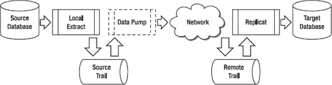

**图 7-1.** 无并行 Extract 或 Replicat 组的单向复制

现在让我们看看具有两个并行数据泵 Extract 和 Replicat 组的相同复制，如图 7-2 所示。

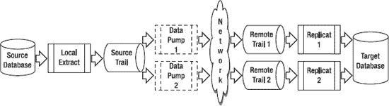

**图 7-2.** 具有并行数据泵 Extract 和 Replicat 组的单向复制

让我们看一个如何在 HR 模式上实现并行 Extract 和 Replicat 的具体示例。


## 实现带表过滤的并行提取与复制

在此示例中，您的所有分析、诊断都指向复制（Replicat）进程变慢，因此您的第一个调整是将数据泵提取（Extract）和复制拆分为两个并行处理组。这样做是为了尝试划分复制工作负载，加快复制速度并减少复制延迟。在此示例中，您通过为特定的 SQL 表设置过滤来拆分 GoldenGate 进程组。稍后，您将看到如何使用键范围以另一种方式拆分复制。

 `注意` 当拆分 GoldenGate 处理组时，请记住将因 SQL 参照完整性约束而相关的表保留在同一个 GoldenGate 进程组中。

图 7-3 展示了如何为 HR 模式拆分数据泵提取和复制的更多细节。

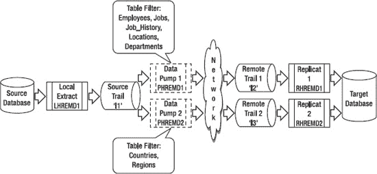

`图 7-3.` HR 示例的并行数据泵提取和复制组

本地提取 `LHREMD1` 保持不变，仍然提取 HR 模式的所有表。使用本地提取来提取*所有*数据是一种常见方法。通常，最好使用本地提取提取所有数据，然后使用数据泵提取进行任何过滤。

数据泵 `PHREMD1` 的配置从提取 HR 模式中的所有表更改为仅过滤 HR 表 `EMPLOYEES`、`JOB_HISTORY`、`JOBS` 和 `LOCATIONS`。该模式中的其他表 `COUNTRIES` 和 `REGIONS` 由一个新的数据泵提取 `PHREMD2` 提取。接下来，您将使用两个复制组来处理来自数据泵的两个远程跟踪文件。

 `提示` 为避免争用，Oracle 建议在读取跟踪文件时，将每个复制与其自己的跟踪文件配对。不应超过三个复制读取同一个跟踪文件。

复制 `RHREMD1` 处理来自数据泵 `PHREMD1` 在 `l2` 跟踪文件中泵出的数据。新的复制 `RHREMD2` 处理来自数据泵 `PHREMD2` 在新的 `l3` 跟踪文件中泵出的数据。

接下来，让我们回顾一下实施调整更改的步骤。因为您已经为 HR 模式运行了复制，所以必须对现有运行配置进行调整，如图 7-1 所示。以下是向现有复制配置添加并行数据泵提取和复制的步骤。提醒一下，尽管这里没有显示（以便您能看到命令细节），但您应该将这些步骤中的 GoldenGate 命令放入一个 obey 文件中，如第 4 章所述：

 `提示` 在进行任何更改之前，请务必备份您的 GoldenGate 参数文件。

1.  编辑现有的数据泵提取参数文件 `PHREMD1` 以添加表过滤：
    ```
    GGSCI (sourceserver) 1> edit params PHREMD1

    Extract PHREMD1

    -------------------------------------------------------------------
    -- Data Pump extract for HR schema
    -------------------------------------------------------------------

    PassThru

    RmtHost targetserver, MgrPort 7809
    RmtTrail dirdat/l2

    ReportCount Every 10000 Records, Rate
    Report at 01:00
    ReportRollover at 01:15

    DiscardFile dirrpt/PHREMD1.dsc, Append
    DiscardRollover at 01:00

    Table HR.EMPLOYEES ;
    Table HR.JOBS ;
    Table HR.JOB_HISTORY ;
    Table HR.LOCATIONS ;
    Table HR.DEPARTMENTS ;
    ```

2.  添加新数据泵提取 `PHREMD2` 的参数文件：
    ```
    GGSCI (sourceserver) 1> edit params PHREMD2

    Extract PHREMD2

    -------------------------------------------------------------------
    -- Data Pump extract for HR schema
    -------------------------------------------------------------------

    PassThru

    RmtHost targetserver, MgrPort 7809
    RmtTrail dirdat/l3

    ReportCount Every 10000 Records, Rate
    Report at 01:00
    ReportRollover at 01:15

    DiscardFile dirrpt/PHREMD2.dsc, Append
    DiscardRollover at 01:00

    Table HR.COUNTRIES;
    Table HR.REGIONS;
    ```

3.  编辑现有的复制参数文件 `RHREMD1` 以添加表过滤：
    ```
    GGSCI (targetserver) 1> edit params RHREMD1
    Replicat RHREMD1
    -------------------------------------------------------------------
    -- Replicat for HR Schema
    -------------------------------------------------------------------
    USERID 'GGER', PASSWORD "AACAAAAAAAAAAADAVHTDKHHCSCPIKAFB", ENCRYPTKEY default
    AssumeTargetDefs

    ReportCount Every 30 Minutes, Rate
    Report at 01:00
    ReportRollover at 01:15

    DiscardFile dirrpt/RHREMD1.dsc, Append
    DiscardRollover at 02:00 ON SUNDAY

    Map HR.EMPLOYEES, Target HR.EMPLOYEES;
    Map HR.JOBS, Target HR.JOBS;
    Map HR.JOB_HISTORY, Target HR.JOB_HISTORY;
    Map HR.LOCATIONS, Target HR.LOCATIONS;
    Map HR.DEPARTMENTS, Target HR.DEPARTMENTS;
    ```

4.  添加新复制 `RHREMD2` 的参数文件：
    ```
    GGSCI (targetserver) 1> edit params RHREMD2
    Replicat RHREMD2
    -------------------------------------------------------------------
    -- Replicat for HR Schema
    -------------------------------------------------------------------
    USERID 'GGER', PASSWORD "AACAAAAAAAAAAADAVHTDKHHCSCPIKAFB", ENCRYPTKEY default
    AssumeTargetDefs

    ReportCount Every 30 Minutes, Rate
    Report at 01:00
    ReportRollover at 01:15

    DiscardFile dirrpt/RHREMD2.dsc, Append
    DiscardRollover at 02:00 ON SUNDAY

    Map HR.COUNTRIES, Target HR.COUNTRIES;
    Map HR.REGIONS, Target HR.REGIONS;
    ```

5.  停止现有的数据泵提取 `PHREMD1`，并从 `info` 命令记录 `EXTRBA` 和 `EXTSEQ` 的值。在添加新的数据泵提取时，您需要这些值，以便它在本地提取跟踪文件中的正确位置开始处理。从下面示例中显示的 `info` 命令中，您可以看到 `EXTSEQ` 等于跟踪文件编号 18。`EXTRBA` 是 8144：
    ```
    GGSCI (sourceserver) 1> stop ext PHREMD1

    Sending STOP request to EXTRACT PHREMD1 ...
    Request processed.

    GGSCI (sourceserver) 2> info ext PHREMD1

    EXTRACT    PHREMD1   Last Started 2011-03-20 13:09   Status STOPPED
    Checkpoint Lag       00:00:00 (updated 00:00:10 ago)
    Log Read Checkpoint  File dirdat/l1000018
                         2011-03-20 13:19:23.000000  RBA 8144
    ```

6.  当复制 `RHREMD1` 处理完当前数据泵提取跟踪中的所有剩余更改并显示零延迟后，停止它：
    ```
    GGSCI (targetserver) 1> info rep RHREMD1

    REPLICAT   RHREMD1   Last Started 2011-03-20 13:18   Status RUNNING
    Checkpoint Lag       00:00:00 (updated 00:00:01 ago)
    Log Read Checkpoint  File dirdat/l2000013
                         2011-03-20 13:19:23.000107  RBA 2351

    GGSCI (targetserver) 2> stop rep RHREMD1

    Sending STOP request to REPLICAT RHREMD1 ...
    Request processed.
    ```

7.  添加新的数据泵提取 `PHREMD2`，并告诉 GoldenGate 从您在第 5 步记录的本地提取跟踪 `l1` 中的 `EXTRBA` 和 `EXTSEQ` 位置开始处理。请注意，如果您不告诉 GoldenGate 从特定位置开始，您可能会重新提取第一个跟踪中的更改，并导致下游复制发生冲突。运行 `info` 命令以验证提取是否已正确添加：
    ```
    GGSCI (sourceserver) > ADD EXTRACT PHREMD2, EXTTRAILSOURCE dirdat/l1,
    EXTSEQNO 18, EXTRBA 8144

    GGSCI (sourceserver) > ADD RMTTRAIL dirdat/l3, EXTRACT PHREMD2, MEGABYTES 100

    GGSCI (sourceserver) > info ext PHREMD*

    EXTRACT    PHREMD1   Last Started 2011-03-20 13:09   Status STOPPED
    Checkpoint Lag       00:00:00 (updated 00:55:22 ago)
    Log Read Checkpoint  File dirdat/l1000018
                         2011-03-20 13:19:23.000000  RBA 8144
    ```


`EXTRACT PHREMD2 已初始化 2011-03-20 22:12 状态 已停止`
`检查点延迟 00:00:00 （更新于 00:00:24 前）`
`日志读取检查点文件 dirdat/l1000018`
`第一条记录 RBA 8144`

8.  添加新的`复制` `RHREMD2`，并告诉`GoldenGate`使用来自数据泵`抽取 PHREMD2`的新`l3`轨迹文件进行处理。因为`l3`是一个新轨迹文件，你可以接受默认设置，即从第一个`l3`轨迹文件的开头开始处理。运行`info`命令以验证`复制`是否已正确添加：
    `GGSCI (targetserver) > ADD REPLICAT RHREMD2, EXTTRAIL dirdat/l3`

    `GGSCI (targetserver) > info rep *`

    ```
    REPLICAT   RHREMD1   最后启动 2011-03-20 13:18   状态 已停止
    检查点延迟       00:00:00 （更新于 00:52:11 前）
    日志读取检查点  文件 dirdat/l2000013
                         2011-03-20 13:19:23.000107  RBA 2351

    REPLICAT   RHREMD2   已初始化   2011-03-20 22:41   状态 已停止
    检查点延迟       00:00:00 （更新于 00:00:03 前）
    日志读取检查点  文件 /gger/ggs/dirdat/l3000000
                         第一条记录  RBA 0
    ```

9.  启动数据泵`抽取`，开始向目标服务器发送变更：
    `GGSCI (sourceserver) > start ext PHREMD*`

    ```
    正在向管理器发送 START 请求 ...
    EXTRACT PHREMD1 正在启动

    正在向管理器发送 START 请求 ...
    EXTRACT PHREMD2 正在启动
    ```

    `GGSCI (sourceserver) > info ext PHREMD*`

    ```
    EXTRACT    PHREMD1   最后启动 2011-03-20 22:51   状态 运行中
    检查点延迟       00:00:00 （更新于 00:00:06 前）
    日志读取检查点  文件 dirdat/l1000018
                         第一条记录  RBA 8144

    EXTRACT    PHREMD2   最后启动 2011-03-20 22:51   状态 运行中
    检查点延迟       00:00:00 （更新于 00:00:06 前）
    日志读取检查点  文件 dirdat/l1000018
                         第一条记录  RBA 8144
    ```

10. 启动两个`复制`以开始处理来自数据泵的变更：
    `GGSCI (targetserver) > start rep RHREMD*`

    ```
    正在向管理器发送 START 请求 ...
    REPLICAT RHREMD1 正在启动

    正在向管理器发送 START 请求 ...
    REPLICAT RHREMD2 正在启动
    ```

    `GGSCI (targetserver) > info rep RHREMD*`

    ```
    REPLICAT   RHREMD1   最后启动 2011-03-20 22:53   状态 运行中
    检查点延迟       00:00:00 （更新于 00:00:04 前）
    日志读取检查点  文件 dirdat/l2000016
                         2011-03-20 22:51:22.493945  RBA 1559

    REPLICAT   RHREMD2   最后启动 2011-03-20 22:53   状态 运行中
    检查点延迟       00:00:00 （更新于 00:00:04 前）
    日志读取检查点  文件 dirdat/l3000000
                         第一条记录  RBA 0
    ```

11. 应用一些变更后，你可以再次检查`复制`的状态，以确保它们正常处理。你可以检查`RBA`并确保它在增加。你也可以执行`stats replicat tablename`命令和`stats extract tablename`命令，以确认`抽取`和`复制`正在处理变更：
    `GGSCI (targetserver) > info rep *`

    ```
    REPLICAT   RHREMD1   最后启动 2011-03-20 22:53   状态 运行中
    检查点延迟       00:00:00 （更新于 00:00:00 前）
    日志读取检查点  文件 dirdat/l2000016
                         2011-03-20 22:56:37.000067  RBA 1856

    REPLICAT   RHREMD2   最后启动 2011-03-20 23:07   状态 运行中
    检查点延迟       00:00:00 （更新于 00:00:01 前）
    日志读取检查点  文件 dirdat/l3000000
                         2011-03-20 23:00:05.000105  RBA 1086
    ```

接下来，让我们看看另一种创建并行`抽取`和`复制`的策略：为你的`HR`模式使用键范围。

### 使用键范围实现并行抽取和复制

另一种创建并行`抽取`和`复制`的策略是使用`@RANGE`函数，通过对键值应用`GoldenGate`哈希算法，将传入的表行拆分成相等的桶。使用这种技术，你可以创建比仅通过表过滤拆分更多的并行进程。这样做可以将复制工作负载按键范围划分为并行进程，使复制过程处理更多数据并减少`复制`延迟。

图 7-4 展示了如何为`HR`模式按键范围拆分`复制`的更多细节。

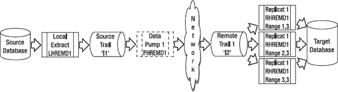

***图 7-4.** 按键范围拆分的并行复制组*

本地`抽取 LHREMD1`保持不变，仍然提取`HR`模式的所有表。使用本地`抽取`提取所有数据是一种常见方法。

在这个例子中，你也让数据泵保持不变，以传递来自本地`抽取`的完整轨迹。你可以使用数据泵来拆分轨迹，但本节展示了另一种技术，即使用`复制`来拆分处理。

`复制 RHREMD1`被拆分为三个`复制`。第一个`复制`，`RHREMD1`，处理第一个键范围。第二个`复制`，`RHREMD2`，处理第二个键范围，依此类推。你使用`GoldenGate` `@RANGE`函数，通过内置的哈希算法将键拆分成三个桶。

现在让我们回顾一下实现调整更改的步骤。同样，本例假设你正在对图图 7-1 中所示的基本单向复制拓扑实施调整更改。

以下是向你的复制配置中添加并行数据泵`抽取`和`复制`的步骤。请注意，此列表未在`obey`文件中显示命令，以便你查看命令细节，但你应该将这些步骤中的`GoldenGate`命令放入`obey`文件中，如第 4 章所述：

1.  编辑现有的`复制`参数文件`RHREMD1`以添加`RANGE`过滤：
    `GGSCI (targetserver) > edit params RHREMD1`

    ```
    Replicat RHREMD1
    -------------------------------------------------------------------
    -- 用于 HR 模式的复制
    -------------------------------------------------------------------
    USERID 'GGER', PASSWORD "AACAAAAAAAAAAADAVHTDKHHCSCPIKAFB", ENCRYPTKEY default
    AssumeTargetDefs

    ReportCount Every 30 Minutes, Rate
    Report at 01:00
    ReportRollover at 01:15

    DiscardFile dirrpt/RHREMD1.dsc, Append
    DiscardRollover at 02:00 ON SUNDAY

    Map HR.EMPLOYEES, Target HR.EMPLOYEES,COLMAP (USEDEFAULTS), FILTER (@RANGE (1,3));
    Map HR.JOBS, Target HR.JOBS,COLMAP (USEDEFAULTS), FILTER (@RANGE (1,3));
    Map HR.JOB_HISTORY, Target HR.JOB_HISTORY,COLMAP (USEDEFAULTS),
    FILTER (@RANGE (1,3));
    Map HR.LOCATIONS, Target HR.LOCATIONS,COLMAP (USEDEFAULTS), FILTER (@RANGE (1,3));
    Map HR.DEPARTMENTS, Target HR.DEPARTMENTS,COLMAP (USEDEFAULTS),
    FILTER (@RANGE (1,3));
    Map HR.COUNTRIES, Target HR.COUNTRIES,COLMAP (USEDEFAULTS), FILTER (@RANGE (1,3));
    Map HR.REGIONS, Target HR.REGIONS,COLMAP (USEDEFAULTS), FILTER (@RANGE (1,3));
    ```

2.  为新的`复制` `RHREMD2`添加参数文件：
    `GGSCI (targetserver) > edit params RHREMD2`

    ```
    Replicat RHREMD2
    -------------------------------------------------------------------
    -- 用于 HR 模式的复制
    -------------------------------------------------------------------
    USERID 'GGER', PASSWORD "AACAAAAAAAAAAADAVHTDKHHCSCPIKAFB", ENCRYPTKEY default
    AssumeTargetDefs

    ReportCount Every 30 Minutes, Rate
    Report at 01:00
    ReportRollover at 01:15

    DiscardFile dirrpt/RHREMD2.dsc, Append
    DiscardRollover at 02:00 ON SUNDAY
    ```


### 3. 为新的 Replicat `RHREMD3` 添加参数文件

```text
GGSCI (targetserver) > edit params RHREMD3
```

参数文件内容如下：
```text
Replicat RHREMD3
-------------------------------------------------------------------
-- 用于 HR 模式的 Replicat
-------------------------------------------------------------------
USERID 'GGER', PASSWORD "AACAAAAAAAAAAADAVHTDKHHCSCPIKAFB", ENCRYPTKEY default
AssumeTargetDefs

ReportCount Every 30 Minutes, Rate
Report at 01:00
ReportRollover at 01:15

DiscardFile dirrpt/RHREMD3.dsc, Append
DiscardRollover at 02:00 ON SUNDAY

Map HR.EMPLOYEES, Target HR.EMPLOYEES,COLMAP (USEDEFAULTS), FILTER (@RANGE (3,3));
Map HR.JOBS, Target HR.JOBS,COLMAP (USEDEFAULTS), FILTER (@RANGE (3,3));
Map HR.JOB_HISTORY, Target HR.JOB_HISTORY,COLMAP (USEDEFAULTS), FILTER (@RANGE (3,3));
Map HR.LOCATIONS, Target HR.LOCATIONS,COLMAP (USEDEFAULTS), FILTER (@RANGE (3,3));
Map HR.DEPARTMENTS, Target HR.DEPARTMENTS,COLMAP (USEDEFAULTS), FILTER (@RANGE (3,3));
Map HR.COUNTRIES, Target HR.COUNTRIES,COLMAP (USEDEFAULTS), FILTER (@RANGE (3,3));
Map HR.REGIONS, Target HR.REGIONS,COLMAP (USEDEFAULTS), FILTER (@RANGE (3,3));
```

### 4. 停止现有的数据泵 Extract `PHREMD1`
你希望它停止抽取，以便确保 Replicat 的延迟降至零，然后你可以继续进行 Replicat 的更改。本地 Extract 可以继续运行。同时运行一个 `info` 命令来验证它已停止：

```text
GGSCI (sourceserver) 1> stop ext PHREMD1

Sending STOP request to EXTRACT PHREMD1 ...
Request processed.

GGSCI (sourceserver) 2> info ext PHREMD1

EXTRACT    PHREMD1   Last Started 2011-03-20 13:09   Status STOPPED
Checkpoint Lag       00:00:00 (updated 00:00:10 ago)
Log Read Checkpoint  File dirdat/l1000018
                     2011-03-20 13:19:23.000000  RBA 8144
```

### 5. 停止 Replicat `RHREMD1` 并记录检查点
当 Replicat `RHREMD1` 处理完当前数据泵 Extract 路径的所有剩余更改，并显示延迟为零后，停止它并从 `info` 命令中记录 `EXTRBA` 和 `EXTSEQ`。添加新的 Replicat 时需要这些值，以便它们在数据泵 Extract 路径文件 `l2` 的正确位置开始处理。从 `info` 命令可以看到，`EXTSEQ` 等于路径文件号 13，`EXTRBA` 是 2351：

```text
GGSCI (targetserver) 1> info rep RHREMD1

REPLICAT   RHREMD1   Last Started 2011-03-20 13:18   Status RUNNING
Checkpoint Lag       00:00:00 (updated 00:00:01 ago)
Log Read Checkpoint  File dirdat/l2000013
                     2011-03-20 13:19:23.000107  RBA 2351

GGSCI (targetserver) 2> stop rep RHREMD1

Sending STOP request to REPLICAT RHREMD1 ...
Request processed.
```

### 6. 添加新的 Replicat `RHREMD2`
并告诉 GoldenGate 从你在步骤 5 中记录的本地 Extract 路径 `l2` 的 `EXTRBA` 和 `EXTSEQ` 位置开始处理。请注意，如果不告诉 GoldenGate 从特定位置开始，可能会导致从第一个路径重复复制更改，从而在 Replicat 中造成冲突：

```text
GGSCI (targetserver) > ADD REPLICAT RHREMD2, EXTTRAIL dirdat/l2, EXTSEQNO 13, EXTRBA 2351

GGSCI (targetserver) > info rep RHREMD2

REPLICAT   RHREMD2   Initialized   2011-03-20 22:51   Status STOPPED
Checkpoint Lag       00:00:00 (updated 00:00:01 ago)
Log Read Checkpoint  File dirdat/l2000013
                     First Record  RBA 2351
```

### 7. 添加新的 Replicat `RHREMD3`
并告诉 GoldenGate 从你在步骤 5 中记录的本地 Extract 路径 `l2` 的 `EXTRBA` 和 `EXTSEQ` 位置开始处理。同样，如果不指定起始位置，可能会导致重复复制和冲突：

```text
GGSCI (targetserver) > ADD REPLICAT RHREMD3, EXTTRAIL dirdat/l2, EXTSEQNO 13, EXTRBA 2351

GGSCI (targetserver) > info rep RHREMD3

REPLICAT   RHREMD3   Initialized   2011-03-20 22:51   Status STOPPED
Checkpoint Lag       00:00:00 (updated 00:00:01 ago)
Log Read Checkpoint  File dirdat/l2000013
                     First Record  RBA 2351
```

### 8. 启动数据泵 Extract
并开始向目标服务器发送新的更改：

```text
GGSCI (sourceserver) > start ext PHREMD*

Sending START request to MANAGER ...
EXTRACT PHREMD1 starting

GGSCI (sourceserver) > info ext PHREMD*

EXTRACT    PHREMD1   Last Started 2011-03-20 22:51   Status RUNNING
Checkpoint Lag       00:00:00 (updated 00:00:06 ago)
Log Read Checkpoint  File dirdat/l1000018
                     First Record  RBA 8144
```

### 9. 启动所有三个 Replicat 以开始处理更改
运行 `info` 命令验证它们正在运行：

```text
GGSCI (targetserver) > start rep RHREMD*

Sending START request to MANAGER ...
REPLICAT RHREMD1 starting

Sending START request to MANAGER ...
REPLICAT RHREMD2 starting

Sending START request to MANAGER ...
REPLICAT RHREMD3 starting

GGSCI (targetserver) > info rep RHREMD*

REPLICAT   RHREMD1   Last Started 2011-03-20 22:53   Status RUNNING
Checkpoint Lag       00:00:00 (updated 00:00:04 ago)
Log Read Checkpoint  File dirdat/l2000013
                     2011-03-20 22:51:22.493945  RBA 2351

REPLICAT   RHREMD2   Last Started 2011-03-20 22:53   Status RUNNING
Checkpoint Lag       00:00:00 (updated 00:00:04 ago)
Log Read Checkpoint  File dirdat/l2000013
                     First Record  RBA 2351

REPLICAT   RHREMD3   Last Started 2011-03-20 22:53   Status RUNNING
Checkpoint Lag       00:00:00 (updated 00:00:04 ago)
Log Read Checkpoint  File dirdat/l2000013
                     First Record  RBA 2351
```

### 10. 检查 Replicat 状态和处理进度
应用一些更改后，你可以检查 Replicat 的状态以确保它们正常处理。可以检查 RBA 值是否在增加。你还可以运行 `stats replicat` `tablename` 和 `stats extract` `tablename` 命令来确认 Extract 和 Replicat 正在处理更改：

```text
GGSCI (targetserver) > info rep *

REPLICAT   RHREMD1   Last Started 2011-03-25 23:08   Status RUNNING
Checkpoint Lag       00:00:00 (updated 00:00:03 ago)
Log Read Checkpoint  File dirdat/l2000013
                     2011-03-25 23:21:48.001492  RBA 2852

REPLICAT   RHREMD2   Last Started 2011-03-25 23:11   Status RUNNING
Checkpoint Lag       00:00:00 (updated 00:00:03 ago)
Log Read Checkpoint  File dirdat/l2000013
                     2011-03-25 23:21:48.001492  RBA 2852

REPLICAT   RHREMD3   Last Started 2011-03-25 23:11   Status RUNNING
Checkpoint Lag       00:00:00 (updated 00:00:03 ago)
Log Read Checkpoint  File dirdat/l2000013
                     2011-03-25 23:21:48.001492  RBA 2852
```


#### 使用 BATCHSQL

`BATCHSQ`L 是你可以添加到 Replicat 中以提升性能的另一个参数。根据 Oracle GoldenGate 文档，`BATCHSQL` 最多可将 Replicat 的性能提升 **300%**。`BATCHSQL` 有一些使用限制，并且仅对 Oracle、SQL Server、DB2 LUW、z/OS 上的 DB2 以及 Teradata 数据库有效。你应查阅 `Oracle GoldenGate Windows and UNIX Reference Guide` 以获取完整的限制列表。

在常规处理中，GoldenGate 会对事务进行分组，但会保留源自源端的事务顺序。使用 `BATCHSQL` 时，GoldenGate 会将相似的事务分组到一个高性能数组中，并以快得多的速度处理它们。要使用默认值实现 `BATCHSQL`，只需将以下参数添加到你的 Replicat 参数文件中即可：

`BATCHSQL`

如果你需要调整 `BATCHSQL` 消耗的内存量，可以为 `BATCHSQL` 添加几个可选参数。你可以参考 GoldenGate 参考指南了解那些参数的详细信息。通常，你应该从默认值开始，然后在需要时添加可选参数。

让我们看几个例子来说明 `BATCHSQL` 的工作原理。图 7-5 显示了 GoldenGate 正常处理远程 trail 的情况。该远程 trail 有三个事务，每个事务都包含对 `HR.EMPLOYEE` 表的一次插入和一次删除。GoldenGate Replicat 根据 `GROUPTRANSOPS` 参数设置的最小值，将这些事务组织成一个更大的 Replicat 事务。在这个例子中，我们假设你使用的是默认的 `GROUPTRANSOPS` 设置，即每个 Replicat 事务最少包含 1,000 个 SQL 操作。请注意，GoldenGate 通常保留 SQL 操作的顺序，即插入后跟删除，正如在远程 trail 中一样。

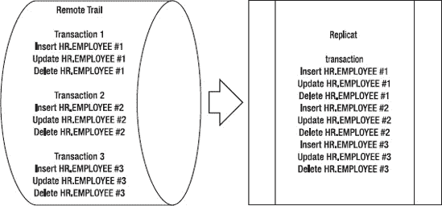

**图 7-5.** GoldenGate 常规事务处理

图 7-6 显示了使用 `BATCHSQL` 处理远程 trail 的 GoldenGate。该远程 trail 有三个事务，每个事务都包含对 `HR.EMPLOYEE` 表的一次插入和一次删除。GoldenGate Replicat 根据 `GROUPTRANSOPS` 参数设置，将这些事务组织成一个更大的 Replicat 事务。在这个例子中，我们假设你使用的是默认的 `GROUPTRANSOPS` 设置，即每个 Replicat 事务包含 1,000 个 SQL 操作。使用 `BATCHSQL` 时，请注意 GoldenGate 改变了 SQL 操作的顺序，并将对同一张 SQL 表的插入、更新和删除操作分组在一起。`BATCHSQ`L 将对相同表格、相同列执行的相同 SQL 操作分组或批处理在一个处理数组中。

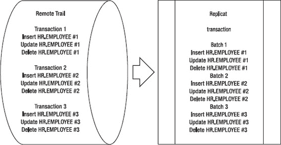

**图 7-6.** 使用 `BATCHSQL` 的 GoldenGate 事务处理

你可能会问自己，使用 `BATCHSQL` 是否会导致任何引用完整性问题。GoldenGate 会在应用批次之前分析任何外键依赖关系并做出调整。根据 GoldenGate 文档，在某些情况下，GoldenGate 可能需要在一个批次中应用多个 SQL 语句来维护引用完整性。

`BATCHSQL` 还会在你的报告文件中创建一个新部分。以下是当 `BATCHSQL` 激活时，你在报告文件中看到的新增统计信息的示例。请记住，这些微小的示例数字是基于图 7-6 中的简单示例，仅用于说明目的：

```
BATCHSQL statistics:
              Batch operations:          9
                       Batches:          3
              Batches executed:          2
                        Queues:          2
              Batches in error:          1
        Normal mode operations:          1
    Immediate flush operations:          0
                  PK collisions:          0
                  UK collisions:          0
                  FK collisions:          0
           Thread batch groups:          0
                       Commits:          2
                     Rollbacks:          1
              Queue flush calls:          2
                  Ops per batch:          3
        Ops per batch executed:       4.5
                  Ops per queue:       4.5
           Parallel batch rate:       N/A
```

让我们回顾一下 `BATCHSQL` 报告中的几个字段。批操作数是已执行的操作总数。批次数是创建的批次数量。在这个例子中你有三个批次，你可以通过参考图 7-6 看到。出错批次数是 1，这告诉你 `BATCHSQL` 在处理时遇到了一个错误。由于这个错误，正常模式操作数等于 1，因为当出现错误时，`BATCHSQL` 会回滚并恢复为正常事务处理模式操作。

当 `BATCHSQL` 遇到处理错误时，你将在 GoldenGate 日志中看到以下类型的消息：

```
2011-03-22 17:12:14  WARNING OGG-00869  Aborting BATCHSQL transaction.
Database error 1 (ORA-00001: unique constraint (HR.PK_EMP_ID) violated).

2011-03-22 17:12:15  WARNING OGG-01137  BATCHSQL suspended, continuing in
normal mode.

2011-03-22 17:12:15  WARNING OGG-01003  Repositioning to rba 231493300 in seqno 49.
```

当这些错误发生时，GoldenGate 会自动回滚 `BATCHSQL` 处理，并尝试在正常模式下处理该事务。这会降低 `BATCHSQL` 的速度，因此如果你看到大量此类错误，你可能会发现 `BATCHSQL` 无法提升你的性能。

当你成功启用 `BATCHSQL` 后，你应该检查你的 Replicat 报告文件，并将处理速率与你的基线报告进行比较，以确定是否获得了性能提升。

#### 使用 GROUPTRANSOPS

你可以使用 `GROUPTRANSOPS` 来调整 GoldenGate 事务中的 SQL 操作数量。正如你在图 7-5 中看到的，GoldenGate Replicat 将源端事务分组到一个 GoldenGate 事务中。默认情况下，Replicat 在一个事务中至少包含 1,000 个 SQL 操作。通过设置更高的 `GROUPTRANSOPS` 值，比如 2,000，你可能会获得更高的性能。除了拥有更大的事务外，更高的 `GROUPTRANSOPS` 值还会减少写入 GoldenGate 检查点表的检查点数量。`GROUPTRANSOPS` 可以在你的 Replicat 参数文件中设置，如下例所示：

`GROUPTRANSOPS 2000`

注意不要将 `GROUPTRANSOPS` 设置得过高。这样做会导致目标端延迟增加，因为目标端的事务大小比源端大。

### 调优磁盘存储

作为数据复制产品，GoldenGate 本质上会产生大量磁盘 I/O。Trail 文件由本地 Extract 写入，由数据泵 Extract 读写，最后由 Replicat 读取。因此，为了实现最高性能，将你的 trail 文件放置在尽可能快速的磁盘存储上至关重要。以下是一些建议，用于为 GoldenGate 调优磁盘存储以获得最佳性能：

*   将 GoldenGate 文件放置在可用的最快存储和存储控制器上。虽然 NAS 对于 GoldenGate 文件来说是可以接受的，但由于 NAS 网络开销，通常 SAN 存储比 NAS 性能更好。存储技术在不断变化，在你做决定时应评估当时的性能。
*   使用 RAID 0+1 而不是 RAID 5。RAID 5 维护奇偶校验信息，这不仅不需要，还会减慢 trail 的写入速度。
*   始终评估用于存储你的 trail 文件的磁盘的性能。例如，在 Linux 上使用 `IOSTAT` 命令来确定是否存在任何磁盘设备瓶颈。
*   使用上一节中描述的 `GROUPTRANSOPS` 参数来减少 I/O。


## 第 8 章：监控 Oracle GoldenGate

### 调优网络

根据你的复制环境中数据变更的数量，Extract（抽取进程）可能会通过网络向 Replicat（复制进程）发送大量数据以供处理。源端与目标端之间的网络性能对于 GoldenGate 的整体性能至关重要。如前所述，你可以使用诸如 Windows 系统监视器或 Linux 上的 `netstat` 命令等工具来收集网络统计数据。你可以将这些数据与基线网络统计数据进行比较，以确定你遇到的是持续的性能问题还是仅仅是一个临时的峰值。

除了服务器命令，你也可以查看 GoldenGate 本身，看看是否是网络问题导致了性能瓶颈。让我们通过一个示例，了解如何使用 GoldenGate 命令检测网络瓶颈。

首先，让我们在本地 Extract 上运行一个 `info` 命令。输出的一部分如下例所示：

```
GGSCI (sourceserver) > info ext LHREMD1, showch 10
...
Write Checkpoint #1

  GGS Log Trail

  Current Checkpoint (current write position):
    Sequence #: 11
    RBA: 977
    Timestamp: 2011-01-28 23:19:46.828700
    Extract Trail: dirdat/l1
```

你应该多次运行 `info` 命令并比较输出，特别是 Write Checkpoint（写入检查点）的值。观察每次命令输出中的最高 Write Checkpoint #，并确保 RBA 和时间戳是递增的。对数据泵 Extract（data-pump Extract）运行相同的命令。

如果本地 Extract 的 Write Checkpoint 值在增加，而数据泵 Extract 的*没有*增加，那么说明数据泵 Extract 存在网络瓶颈。本地 Extract 能够处理数据，但数据泵遇到了瓶颈。最终，由于网络瓶颈，数据泵 Extract 会因事务积压而耗尽内部内存，然后异常终止（abends）。

你也可以在 Replicat 上运行命令来确认是否存在网络瓶颈。下例在 Replicat 上运行了一个 `status` 命令：

```
GGSCI (targetserver) > send replicat RHREMD1, status

Sending STATUS request to REPLICAT RHREMD1 ...
  Current status: At EOF
  Sequence #: 17
  RBA: 2852
  0 records in current transaction
```

在此示例中，Replicat 处于 At EOF（位于文件末尾）状态。如果 Replicat 处于 At EOF 状态，而本地 Extract 正在处理数据，那么你就知道瓶颈出在数据泵和网络上。本地 Extract 正在抽取变更数据，但由于网络瓶颈，Replicat 没有数据可以处理。请记住，如果目标跟踪文件中遗留有任何数据，Replicat 会继续正常处理一段时间，直到它到达文件末尾。然后它将停止处理，因为它没有通过网络从数据泵接收到目标跟踪文件中的新数据。

你可以采取几种调优方法来帮助缓解网络性能问题。第一种方法是创建并行数据泵，如本章前面所述。并行数据泵可以缓解因使用单个数据泵进程而导致的任何网络带宽限制。其次，你可以在 `RMTHOST` 参数上调整一些额外的网络调优选项。我们接下来就来看看这些选项。

### 调优 RMTHOST 参数

默认的 GoldenGate TCP 套接字缓冲区大小为 30,000 字节。通过增加此缓冲区大小，你可以通过网络发送更大的数据包。*《Oracle GoldenGate Windows and UNIX 参考指南》* 提供了一个示例公式来帮助计算最佳的 TCP 套接字缓冲区大小。你还应该检查你的特定服务器对于最大 TCP 缓冲区大小的限制。例如，在 Linux 上，你可以检查以下设置来确定最大 TCP 发送和接收缓冲区大小：

```
net.core.rmem_max = 262144
net.core.wmem_max = 262144
```

在此示例中，发送和接收缓冲区设置为 256KB。你可以与服务器和网络管理员确认这些大小是否可以调整得更高，例如 4MB，以允许 GoldenGate 利用更大的 TCP 缓冲区大小。如果你向 `RMTHOST` 参数添加一个选项，GoldenGate 可以利用更大的 TCP 缓冲区大小，如下例所示：

```
RmtHost targetserver, MgrPort 7809, TCPBUFSIZE 100000
```

此示例将数据泵 Extract 中的 TCP 缓冲区大小自定义为 100,000 字节，试图通过发送更大的 TCP 数据包来提高性能。`RMTHOST` 参数的另一个网络调优选项是 `COMPRESS` 选项，如下例所示：

```
RmtHost targetserver, MgrPort 7809, TCPBUFSIZE 100000, COMPRESS
```

使用 `COMPRESS`，GoldenGate 会压缩通过网络发送的出站数据块，然后在写入跟踪文件之前解压缩数据。根据 GoldenGate 参考手册，压缩比可能达到 4:1 或更高。请注意，压缩和解压缩会增加服务器的一些 CPU 开销。

#### 调优数据库

本书不会花大量篇幅讨论通用的数据库调优，但可以肯定的是，调优不佳的数据库会对 GoldenGate 性能产生负面影响。在 Replicat 端尤其如此，因为 GoldenGate 在那里执行实际的数据库 DML 语句来更改数据。在启用 GoldenGate 之前，你应该确保数据库已得到适当调优。你可以检查几个主要方面，以帮助确保目标数据库上 Replicat 的性能良好：

*   验证 GoldenGate 使用的目标表具有唯一键，并且已为这些键创建了 SQL 索引。
*   验证数据库优化器统计信息是最新的，以确保数据库选择最高效的 SQL 执行计划。
*   确保作为复制目标的数据库表没有过度碎片化。如果有，应进行重组以消除碎片。
*   运行数据库性能报告，例如 Oracle 数据库的 AWR，并验证没有重大的性能问题。

### 总结

本章介绍了调优 GoldenGate 复制的基本方法。它回顾了捕获 GoldenGate 性能统计数据基线，以帮助你确定何时出现性能问题以及如何最好地解决问题。然后，你看到了一些具体的调优方法和示例，例如使用并行处理组策略以及使用 `BATCHSQL` 和 `GROUPTRANSOPS` 等 GoldenGate 参数。

### 监控 Oracle GoldenGate

GoldenGate 有很多依赖其他系统才能正常运行的组成部分。复制的目标是将数据从源端实时复制到目标端而不丢失任何数据。每个系统都是不同的，具有不同的优点和缺点。你可以监控薄弱点，但有时你可能也希望监控那些很少出问题的强点。正如墨菲定律所说：“凡是可能出错的事，就一定会出错。” 解决问题的成本可能远高于实施一个良好监控系统的费用。拥有一个良好的监控系统，你可以减少因错误导致的停机时间，甚至可以在问题发生之前就阻止它们。

本章介绍了一些场景，说明了 GoldenGate 数据传播链中可能出现的问题。接着，讨论了检测和识别错误的不同方法。最后，提供了一些可以使你的工作更轻松的自动化脚本。本章教你如何识别问题，并为你提供一些关于如何解决问题的基本思路。要了解高级故障排除、问题修复和调优技术，请参阅本书的第 7 章、第 11 章和第 14 章。


### 设计监控策略

要设计一个全面的监控策略，您需要掌握两个因素：

*   *内部因素：* 您需要理解 `GoldenGate` 的内部工作原理。作为 `GoldenGate` 管理员，您应该拥有完全的控制权。如果 `GoldenGate` 系统内部出现问题，您应该能够识别并自行解决。
*   *外部因素：* 这些是 `GoldenGate` 所依赖的系统。在大型组织中，您可能无法完全访问这些系统，例如复杂的网络、服务器和存储监控工具及实用程序。在某些情况下，如果您不是 `DBA`，甚至无法访问数据库监控工具。但您无需完全访问这些系统即可监控您的 `GoldenGate` 进程。本章将讨论 `GoldenGate` 管理员可用的监控技术。

除了这些因素，您还需要识别 `GoldenGate` 所有可能出现故障的方式。一个简单的 `GoldenGate` 配置可能的监控点如图 8-1 所示；本章将涵盖其中的每一个。如果您能管理一个简单的配置，就能管理一个复杂的配置。`GoldenGate` 系统中移动部件的数量并不重要——您只需为每个额外的组件增加更多的监控。例如，对于一个双活配置，您需要将图 8-1 中监控点 1 至 7 的监控活动从源端复制到目标端。您还需要在目标端对监控点 7 至 13 执行相同的操作。如果您添加了一个额外的数据泵进程，那么您就需要在源端为点 2、3、4 和 7 添加监控，并在目标端对应的位置进行监控。然而，这是逻辑视图。实际脚本数量可能有所不同。例如，一个脚本可能提供 `GoldenGate` 整体健康状况的鸟瞰视图。

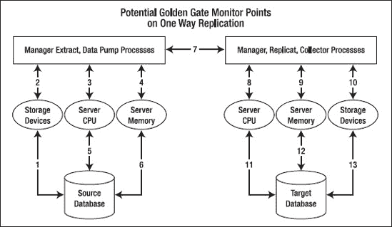

**图 8-1.** 潜在的 `GoldenGate` 监控点

每个 `Extract` 进程都有一个数据库连接，用于查询数据字典以检查是否有任何更改。如果发生更改，`Extract` 进程会读取在线重做日志以捕获更改，并写入到跟踪文件。如果数据不在在线重做日志中，它会读取归档日志。如果数据不在归档日志中，并且您在 `Extract` 参数文件中指定了 `ALTARCHIVELOGDEST <路径名>`，`Extract` 进程会读取备用的归档日志。如果 `Extract` 进程仍然无法找到具有正确提交序列号（`CSN`）的事务，`Extract` 进程将异常终止，并告知您丢失的文件序列号。

 **注意** `CSN` 是 `GoldenGate` 特有的；每个数据库系统都有自己跟踪提交序列的方式。Oracle 使用系统更改号（`SCN`），`DB2 z/OS` 使用相对字节地址（`RBA`），MySQL 使用 `LogNum`，等等。

#### 为何监控抽取进程至关重要

在 Oracle 中，`Extract` 依赖于 Oracle 重做日志工作。对于处于归档日志模式的数据库，在最后一个条目写入后，在线重做日志会被转换为归档日志。在某些系统中，`DBA` 可能会压缩归档日志并将其移动到 `GoldenGate` 无法访问的其他位置。如果 `Extract` 长时间宕机且归档日志无法访问，您就会丢失数据。在关键业务环境中，您需要密切监控您的 `Extract` 进程。

在正常的数据库系统中，`GoldenGate` 跟踪文件通常只占用整个重做日志文件的 30%或更少。另外 70%的重做数据是系统相关的日志，`GoldenGate` 并不需要。因此，例如，如果您为了应对灾难而保留两周的跟踪文件，那么两周的总跟踪文件大小为 `<每日总重做日志大小> × 0.3 × 14`。您需要大约四倍于每日总重做日志大小的存储空间来保存整整两周的变更日志数据。在大型数据库系统上，连续宕机两周是非常罕见的。因此，只要 `Extract` 进程能够生成跟踪文件，`Replicat` 就会加载它们。

#### 获取最大阈值

获取 `GoldenGate` 通过网络能传输的最大阈值非常重要。例如，如果 `GoldenGate` 因计划停机需要关闭 5 小时，您需要知道 `GoldenGate` 追赶至零延迟需要多长时间。为此，您可以停止数据泵几小时，然后重新启动它。您可以在 `GoldenGate` 软件命令界面（`GGSCI`）提示符下使用 `stats` 命令来计算操作数。此外，您可以检查累积的文件大小和消耗速率。您将在本章后面看到如何执行此操作。

### 在 GoldenGate 环境中应监控哪些进程

本章使用 `Extract EXTGGS1`、`Data Pump DPGGS1` 和 `Replicat REPGGS1` 进行演示。这是一个简单的单向抽取。`GoldenGate` 进程使用 `CSN`、`seqno` 和 `RBA` 来连接并序列化每个进程。`CSN`、`seqno` 和 `RBA` 是识别 `GoldenGate` 环境中延迟的工具。如果您确切知道延迟出现在哪里，就可以在该进程中增加更多监控。

如前所述，Oracle `GoldenGate` 使用 `CSN` 来跟踪提交顺序。每个数据库系统都有其独特的序列号；有关 `CSN` 的完整列表，请参阅 Oracle `GoldenGate` 管理指南。`CSN` 也与时间戳相关联。

 **注意** 在真正应用集群（`RAC`）环境中，确保所有集群服务器具有完全相同的时间戳至关重要。否则，您会收到“`SCN` 不匹配的不兼容记录”错误。如果收到此错误，您可能会丢失数据，或者需要使用 `Logdump` 实用程序来识别有问题的记录并手动修补数据。

除了 `CSN`，`seqno` 在监控和故障排除中也起着重要作用。`Seqno` 是跟踪文件的序列号；每种类型的跟踪文件都有自己的序列号。例如，`Extract` 跟踪文件中的 `seqno=100` 可能与 `Replicate` 或数据泵中的序列号 100 不同，即使它们处于同一传播过程中。跟踪文件的命名约定是 `aannnnnn`，其中 `aa` 是两个字符的跟踪文件前缀，六个 `n` 是 `seqno`。如果 `GoldenGate` 用完了所有可用的 `seqno` 值，它会从 `000000` 重新开始。从技术上讲，您最多可以拥有一百万个跟踪文件。因此，如果您需要保留大量跟踪文件，请正确设置跟踪文件大小。

最后一个关键指标是重做日志序列号。每当您发出 `alter extract begin [now]|[timestamp]` 命令时，`GoldenGate` 会搜索 Oracle 数据字典以确定从哪个重做日志开始读取。如果未提供时间戳，`GoldenGate` 会从上一个检查点文件开始。因此，启动 `Extract` 可能需要一段时间，尤其是在使用 `NODYNAMICRESOLUTION` 参数时。

#### 监控所有运行中的进程

`GGSCI` 提示符下的 `info all` 命令可以很好地指示 `GoldenGate` 的整体健康状况。如下所示，在正常操作中，`Lag`（延迟）应为 0，`Time Since Chkpt`（自上次检查点以来的时间）应小于 10 秒。如果您的 `Extract` 存在较大延迟，`Lag` 列中的值会很大或不会减少：

```
GGSCI  28> info all
Program        Status           Group            Lag              Time Since Chkpt
MANAGER    RUNNING
EXTRACT     RUNNING     DPGGS1       00:00:00      00:00:00
EXTRACT     RUNNING     EXTGGS1     00:00:00      00:00:04
REPLICAT    RUNNING     REPGGS1     00:00:00      00:00:09
```


## 监控提取详情

要了解当前提取的状态，可以像下面这样在 `info` GGSCI 命令中添加 `detail` 参数：

```bash
GGSCI> Info extract extggs1, detail
EXTRACT    EXTGGS1   上次启动时间 2011-04-09 22:36   状态：运行中
检查点延迟       00:00:00 (更新于 00:00:02 前)
日志读取检查点  Oracle 重做日志
                     2011-04-10 00:16:47  序列号 175，RBA 36263936
  目标提取跟踪文件：
  远程跟踪文件名                                        序列号        RBA        最大 MB
  C:\ggs\dirdat\C1                                                9         2964         5

  提取源                                  开始时间             结束时间

  C:\APP\ORADATA\ORCL\REDO01.LOG                 2011-04-09 22:02  2011-04-10 00:16
  C:\APP\ORADATA\ORCL\REDO03.LOG                 2011-04-09 20:14  2011-04-09 22:02
  C:\APP\ORADATA\ORCL\REDO01.LOG                 * 已初始化 *   2011-04-09 20:14

当前目录    C:\ggs

报告文件             C:\ggs\dirrpt\EXTGGS1.rpt
参数文件         C:\ggs\dirprm\EXTGGS1.prm
检查点文件        C:\ggs\dirchk\EXTGGS1.cpe
进程文件           C:\ggs\dirpcs\EXTGGS1.pce
错误日志              C:\ggs\ggserr.log
```

根据这些结果，GoldenGate 正在读取序列号 (`seqno`) 为 175 的重做日志。在 RAC 环境中，你会看到每个节点的序列号。序列号 (`Seqno`) 9 是远程跟踪文件的序列号。

`send` 命令提供了关于源端和目标端序列号 (`seqno`) 的类似信息：

```bash
GGSCI  32> Send extract extggs1 status
正在向 EXTRACT EXTGGS1 发送 STATUS 请求 ...
EXTRACT EXTGGS1 (PID 7220)
  当前状态：恢复完成：位于文件末尾

  当前读取位置：
  序列号：175
  RBA：36263936
  时间戳：2011-04-10 00:27:47.000000

  当前写入位置：
  序列号：9
  RBA：2964
  时间戳：2011-04-10 00:27:53.063000
  提取跟踪文件：C:\ggs\dirdat\C1
```

## 检查当前 Oracle 联机重做日志

根据上一节我们知道提取进程 `EXTGGS1` 正在读取序列号 (`sequence#`) 175，我们想知道这个序列号 175 是否是当前最新的。以下查询可以告诉我们 Oracle 正在处理哪个重做日志文件序列号。

```sql
SELECT
  A.MEMBER,
  B.SEQUENCE#,
  B.STATUS,
  B.FIRST_CHANGE#,
  B.NEXT_CHANGE#,
  B.ARCHIVED
FROM   V$LOGFILE A, V$LOG B
WHERE  A.GROUP# = B.GROUP#
```

```
MEMBER                          序列号   状态      首次变更号  下次变更号
C:\ORCL\REDO03.LOG              174         非活动    6591047        6621440
C:\ORCL\REDO02.LOG              173         非活动    6560323        6591047
C:\ORCL\REDO01.LOG              175         当前      6621440        281474976710655
```

`first_change#` 和 `next_change#` 是 Oracle 的 SCN 号。当前重做日志的序列号 (`sequence#`) 是 175。`EXTGGS1` 的序列号也是 175。两者都是 175，说明它们是同步的。因此，GoldenGate 提取进程没有延迟。序列号 (`sequence#`) 为 174 及更小的重做日志位于归档日志区。

#### 检查归档日志

要找出 GoldenGate 正在读取联机重做日志还是归档重做日志，可以使用以下 GGSCI 命令：

```bash
GGSCI> Info extract extggs1, detail
EXTRACT    EXTGGS1   上次启动时间 2011-04-09 22:36   状态：运行中
检查点延迟       00:00:00 (更新于 00:00:02 前)
日志读取检查点  Oracle 重做日志
                     2011-04-10 00:16:47  序列号 175，RBA 36263936
```

序列号 (`Seqno`) 是 175，因为它当前正在读取联机重做日志。如果提取进程没有读取联机重做日志并已落后，那么它的序列号 (`seqno`) 会小于 175。你可以按照以下方式检查它正在读取哪个归档日志：

```sql
SELECT  SEQUENCE#,
        NAME,
        FIRST_CHANGE#,
        NEXT_CHANGE#
FROM   V$ARCHIVED_LOG
```

```
序列号  名称                                          首次变更号  下次变更号
171        C:\ARC0000000171_0718807864.0001              6527997        6542114
172        C:\ARC0000000172_0718807864.0001              6542114        6560323
173        C:\ARC0000000173_0718807864.0001              6560323        6591047
174        C:\ARC0000000174_0718807864.0001              6591047        6621440
```

默认的归档日志命名约定包含了日志序列号 (`sequence#`)。如果 DBA 更改了命名约定，你可以使用序列号 (`sequence#`) 来找出 GoldenGate 正在读取哪个归档重做日志文件。在正常操作期间，最大序列号 (`sequence#`) +1 应该是当前重做日志的序列号 (`seqno`)——本例中为 175。如果不是，则说明提取进程已落后。要确定提取进程是否在写入跟踪文件，请检查跟踪文件的大小。在“监控提取详情”部分，跟踪文件是 `c1000009`，其中 9 是跟踪文件的序列号 (`seqno`)。跟踪文件的 `RBA` 是 2964，因此你可以多次使用 `info extract extggs1, detail` 命令来检查 `RBA` 是否增长。或者，你可以在 Unix/Linux 中使用 `ls -ls` 命令或在 Windows 中使用 `dir` 命令多次检查跟踪文件的大小。

## 监控 GoldenGate 速率和重做日志消耗速率

默认情况下，`stats` 命令会列出所有有事务的表。你可以使用 `totalsonly`、`by table` 和 `reportrate` 来限制显示。你也可以重置统计信息。

```bash
GGSCI  30> stats extggs1
正在向 EXTRACT EXTGGS1 发送 STATS 请求 ...
统计信息开始于 2011-04-10 00:05:46.
输出到 C:\ggs\dirdat\C1：
从 GGS.SOURCE_TABLE 提取到 GGS.SOURCE_TABLE：
*** 自 2011-04-09 22:36:18 以来的总计统计信息 ***
        插入总数                                     0.00
        更新总数                                    12.00
        删除总数                                     0.00
        丢弃总数                                     0.00
        操作总数                                 12.00
*** 自 2011-04-10 00:00:00 以来的每日统计信息 ***
        未执行任何数据库操作。
*** 自 2011-04-10 00:00:00 以来的每小时统计信息 ***
        未执行任何数据库操作。
*** 自 2011-04-09 22:36:18 以来的最新统计信息 ***
        插入总数                                     0.00
        更新总数                                    12.00
        删除总数                                     0.00
        丢弃总数                                     0.00
        操作总数                                 12.00
统计信息结束。
```

如果你执行以下命令，如果在映射中没有特殊过滤器，它们应该给出相似的操作数量：

在源端：
```bash
GGSCI> stats dpggs1 totalsonly *
GGSCI> stats extggs1 totalsonly *
```

在目标端：
```bash
GGSCI> stats repggs1 totalsonly *
```

如果你看到不同的操作数量，那么过程中可能有数据丢失或被过滤。例如，在单向复制中，提取端 (`Extract`) 和复制端 (`Replicate`) 的所有统计信息应该匹配。如果你在源表中插入了 10 条记录，但目标表中只有 9 条，那一定是有问题了。

## 监控各组的延迟

有多种方法可以找出 GoldenGate 进程中的延迟。所有方法都类似，你可以使用一种或全部方法来验证延迟。

监控延迟对于确保数据实时同步至关重要。你可以使用 `lag extract` 或 `lag replicat` 命令直接查看延迟时间，或者通过比较源端和目标端的序列号（如前所述）、检查点时间戳以及 `stats` 命令报告的速率来进行综合判断。如果发现延迟持续增长，需要检查网络、系统资源或 GoldenGate 进程本身是否有瓶颈。


## 监控 GoldenGate 进程

#### 使用 `getlag` 命令

第一种方法使用 `getlag` 命令：

```
GGSCI> lag extract extggs1
```

或者

```
GGSCI> send extract extggs1, getlag
```
```
Sending GETLAG request to EXTRACT EXTGGS1 ...
Last record lag: 1 seconds.
```

你会得到以下三种状态之一：

*   `"At EOF, no more records to process"`：Extract、数据泵或 Replicat 没有延迟。如果数据仍然没有被复制，请检查跟踪文件名或数据库连接，确保它们设置正确。
*   `"Waiting for data to process"`：在 Extract 中，Extract 进程正在等待重做日志。在数据泵中，Extract 正在等待 Extract 跟踪文件。在 Replicat 中，Replicate 进程正在等待数据泵或 Extract 跟踪文件。延迟可能是网络或磁盘 I/O 问题导致的。
*   `"Processing data"`：Extract、数据泵或 Replicat 正忙于处理数据。其中一个进程可能是瓶颈。如果这个状态是暂时的并在几秒钟后消失，这是正常的。

#### 使用 `Write Checkpoint` 命令

下一种方法使用 `Write Checkpoint #`*`n`* 命令来验证延迟：

```
GGSCI> info extract extggs1, showch 10
```
```
Write Checkpoint #1

  GGS Log Trail

  Current Checkpoint (current write position):
    Sequence #: 7
    RBA: 1411
    Timestamp: 2011-04-11 22:00:53.446000
Extract Trail: C:\ggs\dirdat\C2

Write Checkpoint #1

  GGS Log Trail

  Current Checkpoint (current write position):
    Sequence #: 6
    RBA: 4994
    Timestamp: 2011-04-10 22:51:25.477000
    Extract Trail: C:\ggs\dirdat\C2
```

在数据泵进程上执行上述命令，并比较 `Sequence#`、RBA 和时间戳。如果我们期望 Extract 进程捕获数据，那么序列号和 RBA 应该在 Extract、数据泵和 Replicat 进程中递增。如果序列号或 RBA 停滞或比其他进程增长得慢，那么该进程可能存在延迟问题。

#### 使用跟踪文件生成速率

另一种监控延迟的方法是记录 Extract、数据泵和 Replicat 进程当前的 `Sequence#` 和文件大小。本章使用`c1*nnnnnn*`表示数据泵，使用`c2*nnnnnn*`表示 Replicat（`c1`和`c2`中的六个*`n`*并不相同——每个都有自己的序列号）。

我们可以通过列出目录文件（Linux/Unix 中使用`ls –l`，Windows 中使用`dir`）来获取`c1`和`c2`的最大序列号。最大序列号就是该进程当前的跟踪文件。例如，Extract 正在写入`C1000011`文件，但如果数据泵进程正在读取`C1000011`以外的任何文件，那么数据泵进程就存在延迟。`C1000011`连接在 Extract 和数据泵进程之间。而`C200008`连接在数据泵和 Replicat 进程之间。

如以下所示，检查每个跟踪文件的最大`Sequence#`：

```
GGSCI (STRICHCHUT61) 21> shell dir dirdat
```
```
Directory of C:\ggs\dirdat

04/12/2011  06:28 PM               994 C1000010
04/12/2011  06:28 PM               994 C1000011
04/12/2011  06:29 PM             1,411 C2000007
04/12/2011  06:29 PM             1,455 C2000008
```

如上所示，`c1`的最大`Sequence#`是 11，`C2`的最大`Sequence#`是 8。

要确认 Extract 是否正在无延迟地写入当前跟踪文件，我们可以使用以下 GGSCI 命令：

```
GGSCI> info extggs1, detail
```
```
EXTRACT    EXTGGS1   Last Started 2011-04-12 18:28   Status RUNNING
Checkpoint Lag       00:00:00 (updated 00:00:05 ago)
Log Read Checkpoint  Oracle Redo Logs
                     2011-04-12 19:13:40  Seqno 187, RBA 33210880

  Target Extract Trails:
  Remote Trail Name                               Seqno       RBA     Max MB
  C:\ggs\dirdat\C1                                    11         994          5
```

Extract 正在读取重做日志`seqno` 187。你可以使用本章“检查当前 Oracle 联机重做日志”一节中的查询来确定`seqno` 187 是当前的还是旧的。如果当前的 Oracle 重做日志`seqno`是 187，那么 Extract 没有延迟。如果它大于 187，那么延迟发生在源数据库端，Extract 跟不上重做日志的生成速度。这种延迟情况可能是暂时的——例如，在大型更新期间。但如果延迟持续存在，你需要调整 Extract。还要注意，Extract 正在为跟踪文件`c1`写入`seqno` 11。

要确认数据泵是否也在读取`seqno` 11，请执行以下 GGSCI 命令：

```
GGSCI> info dpggs1, detail
```
```
EXTRACT    DPGGS1    Last Started 2011-04-12 18:29   Status RUNNING
Checkpoint Lag       00:00:00 (updated 00:00:04 ago)
Log Read Checkpoint  File c:\ggs\dirdat\c1000011
                     2011-04-12 18:28:41.860000  RBA 994

  Target Extract Trails:
  Remote Trail Name                                Seqno      RBA     Max MB
  C:\ggs\dirdat\C2                                     8        1455          5
```

数据泵也在读取`c1000011` (`seqno` 11)，所以没有延迟。如果数据泵读取的`seqno`小于 11，那么数据泵跟不上 Extract。这可能是网络问题导致的，这种情况下你需要调整数据泵进程。注意，数据泵正在远程跟踪文件`c2`上写入`seqno` 8。要检查 Replicat 是否与数据泵同步，请运行以下 GGSCI 命令：

```
GGSCI 22> info repggs1, detail
```
```
REPLICAT   REPGGS1   Last Started 2011-04-12 18:28   Status RUNNING
Checkpoint Lag       00:00:00 (updated 00:00:06 ago)
Log Read Checkpoint  File c:\ggs\dirdat\c2000008
                     2011-04-12 18:28:41.860000  RBA 1455
```

在这种情况下，Replicat 正在读取和处理`c2`上的`seqno` 8。数据泵也在`C2`上写入`seqno` 8，所以没有延迟。然而，如果该 Replicat 正在读取小于 8 的`seqno`，那么目标数据库端可能存在数据库问题。

#### 在 `ggserr.log` 文件中记录延迟状态

你还可以在 Manager 参数文件中设置延迟报告频率：

```
LAGINFO[MINUTES|SECONDS|HOURS], example. LAGINFOSECONDS 30
LAGREPORT[MINUTES|HOURS], example LAGREPORTMINUTES 1
```

Manager 每 30 秒将延迟信息报告到`ggserr.log`文件，并且每分钟检查一次延迟。在`ggserr`中查看延迟报告。

### 查看事件和错误日志

`view reports <group_name>` 命令显示最近发生于各组的错误和事件：

```
GGSCI > view report extggs1
GGSCI > view report mgr
GGSCI >  view report repggs1
```

详细历史记录在`ggserr.log`中。GoldenGate 也会在 Windows 的`/var/log/messages`和事件日志中记录错误。

### 自动化监控

现在你知道如何手动监控 GoldenGate 进程，是时候自动化它们了。本节介绍几个监控脚本。所有脚本都可扩展到多个 Extract 和 Replicat。作为最佳实践，监控脚本应位于不同的系统上，因为如果监控服务器宕机，你将无法收到在该服务器上运行的任何警报。将所有监控脚本放在不同的地方，你可以在不遗漏任何警报的情况下承受任何系统中断。


## 检查 GoldenGate 进程脚本

此监控脚本开销低；您可以每 5 分钟运行一次，以检查任何 GoldenGate 进程是否在运行。脚本不包括重启功能，因为大多数管理器参数应已包含自动重启。为您要监控的每个新进程复制以下代码块：

```ksh
#!/bin/ksh
EMAIL_LIST="shingchung@aol.com 5555555555@vtext.com"
host=`hostname`
gghome=/ggs

check=`ps -ef|grep extggs1|grep -v "grep extggs1"|wc -l`;
check_num=`expr $check`

if [ $check_num -le 0 ]
then
    echo "GoldenGate Extract EXTGGS1 is down on $host." > $gghome/extggs1.out
    tail -200 $gghome/dirrpt/eextggs1.rpt >> $gghome/extggs1.out
    mailx -s "GoldenGate EXTGGS1 Down on $host" $EMAIL_LIST < $gghome/extggs1.out
fi

check=`ps -ef|grep dpggs1|grep -v "grep dpggs1"|wc -l`;
check_num=`expr $check`

if [ $check_num -le 0 ]
then
    echo "GoldenGate Extract DPGGS1 is down on $host." > $gghome/dpggs1.out
    tail -200 $gghome/dirrpt/dpggs1.rpt >>$gghome/dpggs1.out
    mailx -s "GoldenGate Extract DPGGS1 Down on $host" $EMAIL_LIST < $gghome/dpggs1.out
fi
```

如果出现任何异常终止（abend）甚至意外停止，您将收到警报电子邮件或页面。如果是网络问题或临时数据库问题导致异常终止，它应该会自行修复；然后警报会消失。然而，在极少数情况下，如果 GoldenGate 挂起，此脚本将无法捕获错误。您可以使用下一节中的延迟警报脚本来捕获几乎所有 GoldenGate 问题。

## 监控延迟脚本

此延迟监控脚本报告从源数据库到目标数据库的整体延迟。它完全使用 PL/SQL 编写，易于移植到其他数据库。

您必须在目标数据库上运行此脚本。您可以使用一个具有最频繁事务的表，或者您可以使用一个虚拟表，`source_table` 和 `target_table` 来跟踪延迟。如果使用虚拟表，您可以通过 `dbms_job` 或计划作业每秒使用时间戳更新同一列。然后，在目标端计算相同表的时间差。该差值即为延迟值。

您可以为此脚本使用两种不同的调度：

*   每 5 秒运行一次 `GGS.GET_LAG` 以更新 `LAG_HISTORY` 表。
*   每小时运行一次 `GGS.GET_LAG` 以将有关延迟值的信息发送给您，以便您知道警报正在运行。如果您没有收到每小时的信息警报，那么您就知道出了问题。

此脚本是一个独立的监控进程，不绑定到任何 GoldenGate 进程。因此，如果 图 8-1 中的任何监控点出现故障，它会向我们发出警报。部分场景如下：

*   GoldenGate 管理员意外停止了 Extract，因此 GoldenGate 处于 `STOP` 状态而非 `ABEND` 状态。
*   有人误删了 Extract。
*   Extract 进程挂起。
*   源服务器宕机。
*   有人意外关闭了源/目标端的监控 Shell 脚本。

如果 CPU、内存、锁等出现任何问题导致数据库变慢，您将收到高延迟警报。

`GG_LAG_HISOTRY` 表存储所有历史延迟值。您可以将此表用于报告以及与其他监控工具和 ETL 集成。示例延迟图表如 图 8-2 和 图 8-3 所示：

```sql
CREATE TABLE GGS.GG_LAG_HISTORY
(
  AUDIT_TIME  DATE,
  LAG         NUMBER
);

---- 虚拟源表。将此表映射到您正在监控的 Extract 中
CREATE TABLE GGS.SOURCE_TABLE
(
  UPDATE_DATE  DATE,
  UPDATE_ID    NUMBER
);

---- 虚拟目标表。将此映射到您正在复制的 Replicat 中
CREATE TABLE GGS.TARGET_TABLE
(
  UPDATE_DATE  DATE,
  UPDATE_ID    NUMBER
);

---- 调度此过程每秒或每五秒运行一次。
CREATE OR REPLACE PROCEDURE GGS.GET_LAG
IS
   L_MAX_TIME   DATE;
   L_LAG        NUMBER;
BEGIN

   SELECT   MAX (UPDATE_DATE) INTO L_MAX_TIME FROM TARGET_TABLE;
---- 如果目标和源在不同时区，请在此计算中添加时区偏移值。
   SELECT   (SYSDATE - UPDATE_DATE) * 24 * 60 * 60
     INTO   L_LAG
     FROM   GGS.TARGET_TABLE;

   INSERT INTO GGS.GG_LAG_HISTORY (AUDIT_TIME, LAG)
     VALUES   (SYSDATE, L_LAG);

   COMMIT;

------ 如果延迟超过 5 分钟，则发送电子邮件警报。
   IF L_LAG > 300
   THEN

---- 如果您希望 Oracle 发送电子邮件警报，可以使用此功能。
      GGS.SEND_EMAIL ('shingchung@aol.com.com, 5555555555@vtext.com',
                      'Golden Gate Admin',
                      'ggs@somecompany.com',
                      'Golden Gate Data Is Behind',
                      'The Lag Is ' || L_LAG || ' Seconds');
   END IF;

---- 如果您想从 Shell 脚本启动此过程，此 dbms 输出将返回延迟值
   DBMS_OUTPUT.PUT_LINE (L_LAG);
EXCEPTION
   WHEN OTHERS
   THEN
      NULL;
END GET_LAG;
/

---- 以下是供您参考的 Oracle 发送电子邮件过程，您可以使用自己的版本。
CREATE OR REPLACE PROCEDURE GGS.SEND_EMAIL (I_TO_EMAIL     IN VARCHAR2,
                                            I_FROM_NAME    IN VARCHAR2,
                                            I_FROM_EMAIL   IN VARCHAR2,
                                            I_SUBJECT      IN VARCHAR2,
                                            I_MESSEGE      IN VARCHAR2)
IS
   C                   UTL_SMTP.CONNECTION;
   L_EMAIL_START_POS   NUMBER (5) := 1;
   L_EMAIL_END_POS     NUMBER (5) := 0;
   L_EMAIL_CNT         NUMBER (5) := 0;
   L_EMAIL             VARCHAR2 (250);
   L_LAST_EMAIL_ADDR   BOOLEAN := FALSE;

   PROCEDURE SEND_HEADER (NAME IN VARCHAR2, HEADER IN VARCHAR2)
   AS
   BEGIN
      UTL_SMTP.WRITE_DATA (C, NAME || ': ' || HEADER || UTL_TCP.CRLF);
   END;
BEGIN
   C := UTL_SMTP.OPEN_CONNECTION ('your.mail.relay.server');
   UTL_SMTP.HELO (C, 'foo.com');
   UTL_SMTP.MAIL (C, I_FROM_EMAIL);

   LOOP
      L_EMAIL_CNT := L_EMAIL_CNT + 1;

      L_EMAIL_END_POS :=
         INSTR (STR1   => I_TO_EMAIL,
                STR2   => ',',
                POS    => 1,
                NTH    => L_EMAIL_CNT);

      L_LAST_EMAIL_ADDR := (L_EMAIL_END_POS <= 0);

      L_EMAIL_END_POS :=
         CASE
            WHEN (L_EMAIL_END_POS <= 0) THEN LENGTH (I_TO_EMAIL) + 1
            WHEN (L_EMAIL_START_POS = 0) THEN L_EMAIL_END_POS - 1
            ELSE L_EMAIL_END_POS
         END;

      L_EMAIL :=
         SUBSTR (STR1   => I_TO_EMAIL,
                 POS    => L_EMAIL_START_POS,
                 LEN    => (L_EMAIL_END_POS - L_EMAIL_START_POS));

      UTL_SMTP.RCPT (C, L_EMAIL);

      EXIT WHEN L_LAST_EMAIL_ADDR;

      L_EMAIL_START_POS := L_EMAIL_END_POS + 1;
   END LOOP;

   UTL_SMTP.OPEN_DATA (C);
   SEND_HEADER ('From', '"' || I_FROM_NAME || '" <' || I_FROM_EMAIL || '>');
   SEND_HEADER ('To', '"Recipient" <' || I_TO_EMAIL || '>');
   SEND_HEADER ('Subject', I_SUBJECT);
   UTL_SMTP.WRITE_DATA (C, UTL_TCP.CRLF || I_MESSEGE);
   UTL_SMTP.CLOSE_DATA (C);
   UTL_SMTP.QUIT (C);
EXCEPTION
   WHEN UTL_SMTP.TRANSIENT_ERROR OR UTL_SMTP.PERMANENT_ERROR
   THEN
      BEGIN
         UTL_SMTP.QUIT (C);
      EXCEPTION
         WHEN UTL_SMTP.TRANSIENT_ERROR OR UTL_SMTP.PERMANENT_ERROR
         THEN
            NULL;
      END;

      RAISE_APPLICATION_ERROR (
         -20000,
         'Failed: ' || SQLERRM
      );
END SEND_EMAIL;
/
```

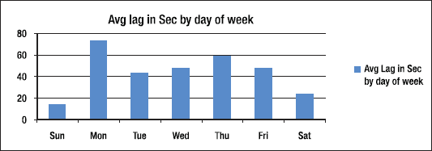

***图 8-2.** 按星期划分的平均延迟（秒）*

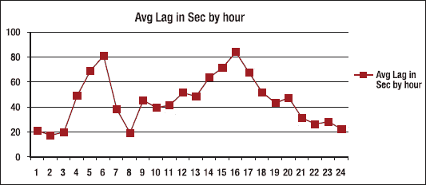

***图 8-3.** 按小时划分的平均延迟（秒）*


#### 检查内存和 CPU 的脚本

如果内存和 CPU 是系统中的薄弱环节，那么这个脚本会很方便，它能每小时报告内存和 CPU 使用情况。它会通过电子邮件发送所有 GoldenGate Extract 进程的内存和 CPU 使用率，以及总空闲内存量。注意，`goldengate`是 Unix/Linux 用户 ID。

以下是脚本：

```ksh
#!/bin/ksh

EMAIL_LIST="shingchung@aol.com 5555555555@vtext.com"

host=`hostname`
cd /ggs/scripts
rm top.log
rm top.rpt
top -h -f top.log -n 50
cat top.log | grep extract > top.rpt
echo "" >> top.rpt
echo "Free Memory: " >> top.rpt
vmstat 1 2 | tail -1 | awk '{printf "%d%s\n", ($5*4)/1024, "MB" }' >> top.rpt

mailx -s "GoldenGate Memory Usage on $host" $EMAIL_LIST < /ggs/scripts/top.rpt
```

输出：
```
19   ?    14000 goldengate 152 20  2331M  1201M run    602:09 31.64 31.59 extract
10   ?    13655 goldengate 137 20 80912K 16432K sleep 1568:25  5.97  5.96 extract

Free Memory:
47610MB
```

Extract 进程使用了 31.59%的单个 CPU，数据泵使用了 5.96%。Extract 通常比数据泵消耗更多 CPU。Extract 的内存使用总量约为 2331MB，常驻内存为 1201MB。整个服务器内存为 47GB，因此您仍有大量空闲内存。GoldenGate Extract 进程通常消耗整体 CPU 利用率的 1%到 5%。

#### 检查磁盘空间

即使磁盘空间目前不是问题，运行一个监控脚本也是有益的。您永远不知道：您的磁盘空间可能在几年内不知不觉地被填满。如果跟踪文件磁盘空间是您的薄弱环节，那么您绝对需要这个脚本。许多脚本可在线获取，适用于各种系统，因此本节不列出具体脚本。请搜索“check disk space scripts”以获取适合您操作系统的脚本。

您可以根据需要编写任意多的监控脚本，但您不希望给系统增加负担。本章中的所有脚本都是轻量级的，因此可以安全使用。

### 总结

本章向您展示了如何为您的 Extract、数据泵和 Replicat 设置一个非常好的监控系统。如果您有其他许多需要监控的 GoldenGate 进程，那么您只需将它们添加到您现有的脚本中即可。图 8-1 包含 GoldenGate 进程中的 13 个链接，但您的配置可能有更多。

GoldenGate 可能出现的故障比您想象的要多，但本章介绍的自动化 PL/SQL 延迟监控脚本可以通知您问题，有时甚至在发生重大问题之前。只要目标数据库处于启动状态，它就是一个独立的进程。如果目标数据库关闭，您将不会收到每小时的延迟状态电子邮件，因此您会知道出了问题。该警报无法确切告诉您出了什么问题，但本章的其他脚本可以为您精确定位确切的问题。

本章还向您展示了如何监控整个 GoldenGate 系统的健康状况。在实施 GoldenGate 监控流程之前，了解系统中可能出现什么问题非常重要，这样您才能在问题恶化之前识别它们。

 **注意** GoldenGate 的管理包（也称为 GoldenGate Director）可以执行一些基本的监控和警报。Director 还将延迟和事件信息存储到其专有表中，因此您可以从中创建报告。但风险自负，因为 Oracle 可能会在不同版本之间更改其表结构。有关 Director 的更多信息，请参见第 10 章。

## 第 9 章 Oracle GoldenGate Veridata

Oracle GoldenGate Veridata 是一种高性能的跨平台数据比较工具，支持在源和目标数据在线且正在更新时进行大规模比较。Veridata 的三层架构将负载分散到不同的服务器上，而不会影响源和目标数据库系统的性能。

Veridata 使用压缩的行哈希数据进行比较，这减少了比较数据所需的 CPU 周期和网络带宽，但它不仅仅是一个数据比较工具。Veridata 可以跟踪变化的数据并在数据更新时执行比较——这是当今任何其他工具都无法实现的壮举。

在本章中，我们将介绍 Veridata 的关键组件，以便您了解它为何如此独特，以及为什么目前没有其他产品能与之竞争。然后，我们将介绍一些关键特性和优势，并展示 Veridata 如何与您的数据项目配合工作并帮助提高您组织的效率。一旦您了解了 Veridata 是什么以及它如何提供帮助，我们将通过一个快速教程介绍如何设置它。（设置一个比较作业实际上只需要几分钟——这就是该工具的高效之处。）最后，我们将介绍一些提示和技巧，以帮助您完成一些复杂的数据比较场景。

### Veridata 组件

为了使 Veridata 启动并运行，您需要设置五个 Veridata 组件，如图 9-1 所示。

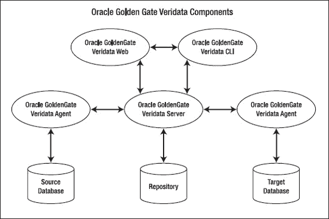

图 9-1. Oracle GoldenGate Veridata 组件

#### GoldenGate Veridata 服务器

Veridata 服务器是整个 Veridata 系统的关键组件。没有它，比较将需要在源或目标数据库上执行，这将对服务器的性能产生负面影响。这是因为任何比较作业都是 CPU 和 I/O 密集型的。

Veridata 服务器执行以下功能：

*   与代理协调 Oracle GoldenGate Veridata 执行任务的所有方面。
*   在 Veridata 服务器上对行进行排序。默认是在安装代理的数据库上进行排序。
*   比较从 GoldenGate Veridata 代理收集的数据。
*   对不同步数据执行确认比较（稍后解释）。
*   生成不同步、确认和性能报告。

#### GoldenGate Veridata Web

Oracle GoldenGate Web 是 Veridata 服务器的基于 Web 的客户端。这是我们用于配置大多数 Veridata 任务的工具。它执行以下功能：

*   配置所有比较对象和规则，包括连接、组、作业等。
*   启动和停止比较作业。
*   提供作业状态的实时状态。
*   查看比较和不同步数据报告。

#### GoldenGate Veridata 存储库

Veridata 存储库存储所有比较对象和规则的配置。元数据以明文形式存储在存储库数据库的表中，因此您可以查询它们以创建自己的自定义报告。它还存储作业状态，因此您可以将其与您的 ETL 和监控工具无缝集成。

#### GoldenGate Veridata 代理，Java 和 C-Code

Veridata 代理执行 SQL 以获取数据块并将其返回给服务器进行比较。它还将不同步行的详细信息提取到服务器以用于报告目的。Java 代理不需要 GoldenGate Manager，但基于 C 代码的代理需要 GoldenGate Manager 进程。

#### GoldenGate Veridata CLI（Vericom）

Vericom 是一个命令行界面，用于调度比较作业。它可以覆盖一些配置文件设置、分区 SQL 谓词、关闭 Veridata 服务器以及生成/查看不同步报告。但是，它不能配置比较设置和规则，这些只能在 Veridata Web 客户端上完成。


