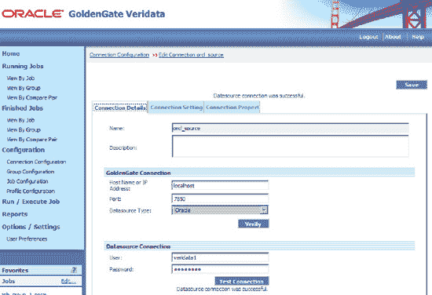
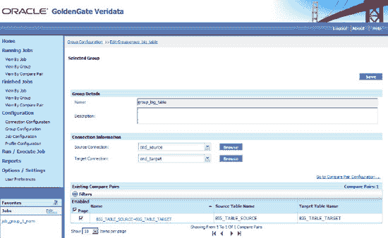
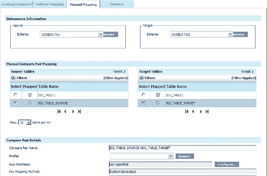
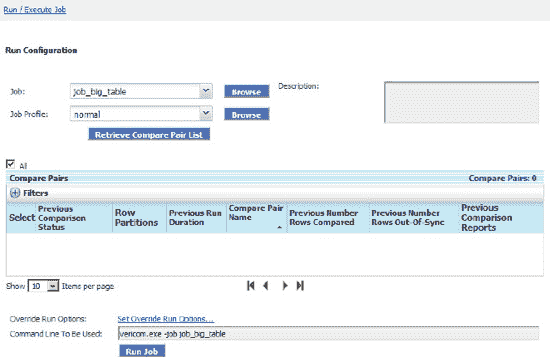
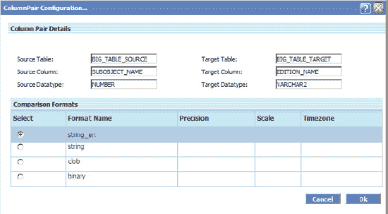

# 设置 Veridata 比较

安装 Veridata 后，您可以使用以下指南来使用您自己的数据或本章中我们使用的数据。高级步骤如下：

1.  创建数据库连接，包括源和目标。
2.  创建组，即一组比较对。
3.  创建比较对，指定要比较哪些表。
4.  创建作业，用于运行一个或多个组。
5.  创建配置文件（指定您希望其运行的方式）。这是可选的，因为您可以使用默认配置文件。
6.  运行作业。

#### 创建数据库连接

登录 GoldenGate Veridata Web 后，点击左侧面板中的“连接配置”，如图 9-2 所示，然后为源和目标填写以下信息。确保 GoldenGate Veridata 代理已安装在两个数据库实例上。

您可以使用向导设置连接，也可以使用如图 9-2 所示的设置屏幕。目前其他选项使用默认值。



***图 9-2.** 连接配置*

## 设置表和数据脚本

本教程中使用了以下表和数据，以便您能跟随指南操作。您也可以使用自己的表。我在脚本中使用 `dba_objects` 创建了表 50 次。如果您的系统速度够快，可以在代码中添加更多循环，这样您就可以在左侧面板中看到“正在运行的作业”选项。

`create table big_table_source as select 0 seqno, a.* from dba_objects a where 0=1;`
`create table big_table_target as select 0 seqno, a.* from dba_objects a where 0=1;`

以下脚本在同一个数据库中填充示例表。如果您想在不同数据上测试比较，则必须将数据复制到另一个数据库。

```sql
CREATE OR REPLACE PROCEDURE populate_big_table IS
BEGIN
   FOR i IN 1..50
    LOOP    
        insert into big_source select i, a.* from dba_objects a;
        insert into big_target select i, a.* from dba_objects a;
        commit;
    END LOOP;
END populate_big_table;
```

## 创建组

在“组配置”中，将源连接和目标连接添加到该组。一个组可以包含多个比较对，一个作业可以包含多个组。例如，您可以按主题区域或按计划来划分组。

## 创建比较对

GoldenGate 比较对是我们需要比较的对象。我们可以比较表、物化视图和视图。这是 Veridata 的核心，是业务规则所在之处。它是组配置的一部分。您可以按照以下步骤设置我们要比较的表。



***图 9-3.** GoldenGate 组配置*

点击如图 9-3 所示的 GoldenGate 组配置屏幕中的“转到比较对配置...”链接。它将带您进入如图 9-4 所示的“比较对映射”屏幕。



***图 9-4.** 比较对映射*

在“比较对映射”屏幕中，您可以使用“手动映射”来添加比较对。选择比较对后，请确保您的比较名称位于“比较对详细信息”部分。在示例中，`BIG_TABLE_SOURCE=BIG_TABLE_TARGET` 是比较对名称。点击“预览”选项卡以确认设置。

## 创建作业

作业类似于 shell 脚本，用于运行一系列比较组。Veridata 没有内置的调度程序，因此您需要使用操作系统调度程序（crontab、Windows 调度程序）来运行 `vericom` 命令行作业。作业名称和组是唯一必需的参数。您可以检查上一节中刚刚创建的组名称 `big_group_table`。

## 创建配置文件

创建配置文件是可选的；您目前可以使用默认配置文件。我们将在本章后面详细讨论这一点。


#### 运行 Veridata 作业

你可以通过在 Veridata 主屏幕的左侧面板上点击 `Run/Execute job` 标签页来运行比较作业。或者，你也可以使用命令 `vericon.exe –job job_big_table`。



**图 9-5.** Veridata 运行作业

此作业的命令行也在 图 9-5 中展示，对于 Windows 系统，命令为 `vericon.exe –job job_big_table`。点击 `Run Job` 按钮来运行作业。如果作业正在运行，`Run Job` 按钮的文本会变为 `Stop Job`。如果你想停止作业，可以点击它。你也可以前往 `Running Jobs` 或 `Finished Jobs` 面板查看状态。如果出现任何错误，你可以深入查看组和比较对以获取详细的错误信息。

## 提升性能并减少开销

Veridata 进程可能非常消耗 CPU，有时也消耗 I/O。如果你需要 Veridata 以最小的资源占用完成大量工作，你应该尽一切努力减少系统利用率以提升性能。因为默认选项不一定是最优的，有一些技巧可以改善性能并减少不必要的开销。

#### 排除列

在 `Column Mapping` 中，你可以使用 `User Defined` 来从映射中移除列。被移除的列可以稍后添加回来。主键不能从映射中移除，因为 Veridata 使用它们进行比较。默认情况下，Veridata 会查询源和目标中的每一列进行比较。

#### 调优配置文件设置

有两种排序方法：数据库排序和 Veridata 服务器上的 `NSort`。如果数据库服务器有空闲的 CPU 或 I/O，那么使用默认的“sort on database”选项。如果数据库是一个需要尽可能利用所有资源以达成高服务等级协议（SLA）的创收环境，那么我们可以使用“sort on server”选项。请注意，Veridata 服务器也在执行实际的比较和其他任务；如果在排序期间其 CPU 占用率达到 100%，你可能希望将数据排序放在数据库服务器上进行，或者为 Veridata 服务器增加更多 CPU。

#### 禁用“确认不同步”步骤

如果你不期望数据在比较期间发生变化，例如每日/每周/每月的 ETL、通过分区过滤的数据，或在所有数据复制完成后立即运行比较，你可以在配置文件设置中禁用 `Confirm-Out-Of-Sync` 步骤。

### 增加线程数

你可以增加 Veridata 服务器上的线程数。默认的 CPU 数量为四。由于所有的比较都在服务器端进行，Veridata 比较非常消耗 CPU。在增加线程数之前，请验证比较期间的 CPU 使用率。这可以在 `Initial Compares` 和 `Confirmation Compares` 的配置文件设置中完成。

### 比较方法

使用哈希（hash）进行比较通常更快。哈希是默认方法，但如果你必须使用字面量（literal）比较以获得 100% 的准确性，你可以在 `Column Mapping` 中更改比较方法。字面量比较是逐值执行的，这与使用哈希的比较相反。

### 字符字段上的右截断

默认情况下，Veridata 在字符字段上启用了 `RTRIM`，因此你的查询看起来像下面的示例。你可以在 `Edit Database Connection` 设置中的 `Truncate Trailing Spaces When Comparing Values` 选项中关闭 `RTRIM`。这减少了修剪每一行中所有 `varchar` 列所消耗的 CPU 周期。

```sql
SELECT   "SEQNO",
         RTRIM ("OWNER"),
         RTRIM ("OBJECT_NAME"),
         RTRIM ("SUBOBJECT_NAME"),
         "OBJECT_ID",
         "DATA_OBJECT_ID",
         RTRIM ("OBJECT_TYPE"),
         TO_CHAR ("CREATED", 'yyyy-MM-DD:hh24:mi:ss'),
         TO_CHAR ("LAST_DDL_TIME", 'yyyy-MM-DD:hh24:mi:ss'),
         RTRIM ("TIMESTAMP"),
         RTRIM ("STATUS"),
         RTRIM ("TEMPORARY"),
         RTRIM ("GENERATED"),
         RTRIM ("SECONDARY"),
         "NAMESPACE",
         RTRIM ("EDITION_NAME")
  FROM   "VERIDATA2"."BIG_TABLE_TARGET" X
```

### 比较大表的增量数据

如果你有一个包含数十亿行的表，你无法承担每次比较都进行全表扫描。相反，你可以使用行分区功能进行比较（Veridata 行分区，而非数据库分区）。这只需要在 `WHERE` 子句中添加一个 SQL 谓词，如果添加正确，将在性能方面产生巨大差异。例如，你可以在 `Compare Pair Configuration Screen` 中为源和目标行分区都添加 `SEQNO=1`，Veridata 将生成如下 SQL：

```sql
SELECT   "SEQNO",
         "OWNER",
         "OBJECT_NAME",
         "SUBOBJECT_NAME",
         "OBJECT_ID",
         "DATA_OBJECT_ID",
         "OBJECT_TYPE",
         TO_CHAR ("CREATED", 'yyyy-MM-DD:hh24:mi:ss'),
         TO_CHAR ("LAST_DDL_TIME", 'yyyy-MM-DD:hh24:mi:ss'),
         "TIMESTAMP",
         "STATUS",
         "TEMPORARY",
         "GENERATED",
         "SECONDARY",
         "NAMESPACE",
         "EDITION_NAME"
  FROM   "VERIDATA2"."BIG_TABLE_TARGET" X
 WHERE   SEQNO = 1
```

如果你需要比较一天内复制的数据——例如，`change_date` 是你用来跟踪更改的列——那么你可以将此放入源和目标的 SQL 谓词语句中。

```sql
Change_date between sysdate-1 and sysdate
```

Veridata 将比较自昨天以来发生变化的数据。

#### 比较 GoldenGate 实时复制数据

如果你的表中没有时间戳，那么 `confirm out-of-sync` 选项是确保数据一致性的唯一选择。确认步骤有三种状态：

*   `In-flight`：在初始比较步骤中行不同步，但它已发生变化。Veridata 目前无法确认它是否已同步。
*   `In-sync`：在初始比较步骤中行不同步；现在已同步。
*   `Persistently out of sync`：在初始比较步骤中行不同步，在确认步骤后仍然不同步。

默认情况下，初始比较和确认步骤并行运行。两个步骤之间等待 60 秒。这个值可以在配置文件设置中更改。

## 比较不同的列类型和比较格式

你可以覆盖默认的 `Column Mapping` 名称、类型甚至格式。在 `Compare Pair Configuration` 中，点击列名超链接；你将看到 图 9-6 中的对话框。你可以覆盖 `Source Column` 名称、`Source Datatype` 及其比较格式。这在源和目标具有不同列名甚至不同数据类型（尽管它们实际上是相同的数据）时非常有用。



**图 9-6.** 更改默认数据类型和比较格式


