# 第 10 章

## 使用性能统计

Veridata 会为每次运行保留一些性能统计信息；它们位于“已完成作业”面板中，如图 9-7 所示。您可以利用这些统计信息为生产环境运行做准备；例如，计算每个作业的运行时间并进行性能调优。

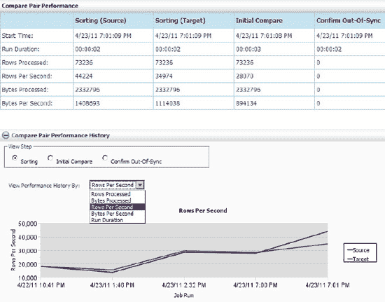

**图 9-7.** 性能统计

您还可以通过在同一屏幕中单击“报告”链接，在“比较对报告”中查看详细的性能信息。以下是“比较对报告”的示例：

```
Processing first rowhash block from source at 2011-04-23 19:01:09.
Processing first rowhash block from target at 2011-04-23 19:01:10.

Performance Statistics for source Rowhash at 2011-04-23 19:01:10.

                     rows: 73236
          duration (secs): 00:00:01
                 rows/sec: 73236.00
                row bytes: 7937097
            row bytes/sec: 7937097
                bytes/row: 108
             rh bytes/row: 4
             rows skipped: 333760
           blocks skipped: 0
           hash comp rate: 0.04
          total comp rate: 0.02
        pct time fetching: 0.00
         pct time waiting: 0.00
     time until first row: 00:00:00
                 ipc msgs: 12
                ipc bytes: 2337393
                bytes/msg: 194782
     compressed bytes/msg: 72710
                bytes/sec: 2337393
     compressed bytes/sec: 872521
    msg compression ratio: 0.37

NSORT statistics:
Nsort version 3.4.29 (Windows-x86 32-bit) using 49M of memory out of 50M
Pointer sort performed Sat Apr 23 19:01:08 2011
      Input Phase       Output Phase          Overall
Elapsed     2.03               0.08               2.11
I/O Busy    2.02   100%        0.01   100%        2.03
Action  User   Sys Busy    User   Sys Busy    User   Sys Busy
main    0.00  0.00   0%    0.00  0.00   0%    0.00  0.00   0%
  1     0.14  0.00   7%    0.00  0.00   0%    0.14  0.00   7%
  2     0.12  0.00   6%    0.02  0.00  25%    0.14  0.00   7%
All     0.26  0.00  13%    0.02  0.00  25%    0.28  0.00  13%
    Majflt    Minflt  Sort Procs Aio Procs/QueueSize RegionKB
     0/0           0           2          0/0              512
File Name                   I/O Mode Busy   Wait MB/sec  Xfers        Bytes     Records
Input Reads
  <release records>         buffered 100%   1.08   1.08      9      2186324       73236
Output Writes
  <return records>          buffered 100%   0.00 218.63      9      2186324       73236
```

### 使用 Vericom 命令行

Vericom 命令行脚本通常用于自动化计划作业。它可以用来覆盖组、比较对和配置文件中的设置。例如，您可以使用系统日期覆盖 `sql-predicates`，以仅比较最新数据。根据白天或晚上的作业设置线程数。

默认情况下，Vericom 会在后台运行作业，并且在返回命令提示符之前不会等待作业完成。

```
C:\Veridata\server\bin>vericom -j job_big_table
Connecting to: localhost:4150
Run ID: (1035, 0, 0)
```

如果作业成功启动，退出代码将为零，但它不会告知您是否有任何比较失败。

如果您希望启动作业以捕获详细消息和状态，可以使用 `–w` 或 `–wp` 参数。`–wp <number>` 是以分钟为单位的轮询间隔。

```
C:\Veridata\server\bin>vericom -j job_big_table -w
Connecting to: localhost:4150
Run ID: (1035, 0, 0)
                              Job Start Time: 2011-05-01 22:12:57
                               Job Stop Time: 2011-05-01 22:13:02
                     Job Report Filename: C:\00001035\job_big_table.rpt
                 Number of Compare Pairs: 1
     Number of Compare Pairs With Errors: 0
        Number of Compare Pairs With OOS: 0
     Number of Compare Pairs With No OOS: 1
       Number of Compare Pairs Cancelled: 0
                   Job Completion Status: IN SYNC
```

您还可以将输出重定向到文件并通过电子邮件发送给监控团队。使用 `–w` 或 `–wp` 参数将返回正确的退出代码。

```
There are six exit statues from the GoldenGate manuals.

0: The Vericom command finished successfully.  If –w or –wp was not specified, the exit status is 0 if the job started successfully.  The actual compare errors will not be captured.
1: Invalid vericom syntax was used.
2: Vericom could not find the connection information by looking in the veridata.loc or veridata.cfg, and the connection parameter “{ -url | -u } <url>” is not specified with the command arguments.
3: Syntax is correct, but missing required flags.  For example, if –j or –c is specified, then –g <group> input is required.
4: Job ran successfully, but the compare status has something other than in–sync.
5: Communication error with Oracle Veridata Server.
```

有关 Vericom 命令参数的完整列表，请输入 `vericom –helprun`。

### 设置基于角色的安全性

Veridata 基于角色的安全性设置非常简单。它已经定义了固定数量的角色。您只需将用户或组添加到预定义的角色中，然后 Veridata 就会为您应用安全性。

要配置安全角色，请使用以下链接进入 Tomcat Web 服务器管理工具屏幕，如图 9-8 所示：`http://<hostname>:<port>/admin`。

默认的 Apache Tomcat Web 服务器端口是 8830。要更改默认端口，请修改 `<Veridata_install_dir>/server/web/conf` 目录中的 `server.xml` 文件。搜索 8830 并将其替换为其他端口号。

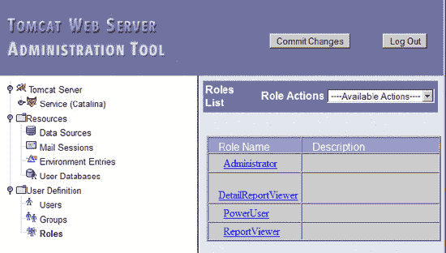

**图 9-8.** Tomcat Web 服务器管理工具中的用户定义角色

以下是角色名称的描述：

*   `Administrator`：这是您最初用于登录的管理员 ID。此角色可以执行所有功能。
*   `DetailReportView`：这是 `ReportViewer` 角色，但它还可以通过 Web 界面或在文件级别查看不同步报告信息。详细报告中可能包含一些业务敏感信息。
*   `PowerUser`：与管理员角色一样，您可以执行除服务器端任何配置功能之外的所有操作。
*   `ReportViewer`：拥有此角色，您只能查看报告、作业和配置。

### 总结

Oracle GoldenGate Veridata 是一种比较工具，能够对变化的数据执行比较，这是任何其他工具都无法做到的。它内置了非常好的安全性，因此可以由 IT 和业务用户使用，以保护业务敏感数据。

Veridata 可以在命令行和基于 Web 的客户端中使用。它足够灵活，可以与现有的提取转换和加载（ETL）以及监控流程集成。

Veridata 的性能令人印象深刻；它具有正确的架构，可以通过“压缩”的行哈希值来比较两个数据库之间的数据。通过适当设置，没有其他数据比较工具的性能可以优于 Veridata。


## GoldenGate Director

Oracle GoldenGate Director 是一个多层 GUI 应用程序，支持开发和监控几乎所有的 Oracle GoldenGate 进程。有了 Director，你无需记忆参数和参数语法。在参数文件中，代码的顺序很重要。Director 会为你处理好这个顺序。不过，你始终可以使用 `Param File Editor` 手动覆盖参数。它还提供上下文相关的帮助，为你提供有关参数作用的高级指导。

为了管理 Oracle GoldenGate，你通常需要为每个运行 GoldenGate 的服务器打开许多 SSH 窗口。有了 Director，你不再需要登录到所有服务器。你只需要登录到 Director Client；然后就可以管理 Director 存储库中设置的所有 Oracle GoldenGate 服务器。GoldenGate 开发人员/管理员甚至无需知道 `UNIX/Windows` 登录信息。如果你的 GoldenGate 服务器位于不同的平台和数据库上，无需登录到每个系统是一个非常好的特性——Director 会为你处理数据库版本和平台特定的命令与参数。

GoldenGate 软件命令接口 (`GGSCI`) 命令行没有自动化的监控和告警功能。Director 显示每个进程近乎实时的滞后情况。你还可以在几分钟内设置好滞后和异常结束报告，而无需编写任何自定义脚本。

凭借所有这些功能，Director 能够加速大多数 Oracle GoldenGate 任务的开发、缩短学习曲线并加快测试速度。设置一个初始加载任务只需两分钟，设置一个简单的 `Extract` 和 `Replicat` 大约需要五分钟。

本章将介绍 Director 的关键组件。然后，你将逐步完成设置初始加载、单向复制和数据泵过程。最后，本章将讨论 Director 的一些高级功能。

### Director 组件

Director 由五个组件组成，如图 10-1 所示。它们分别是：运行着 `Manager` 进程的 GoldenGate `GGSCI` 实例；用于配置 GoldenGate Director 的 Director Administrator；管理所有作业的 Director Server/数据库；用于执行简单监控和管理的 Director Web；以及最后用于执行所有 Director 任务的 Desktop Client。

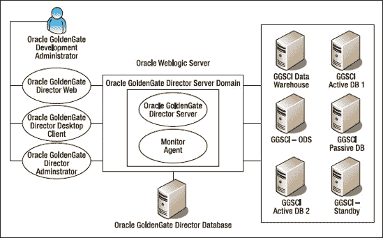

`Figure 10-1. Director components`

#### GoldenGate GGSCI 实例

GoldenGate Director 可以链接到 Director Client 应用程序中的许多 `Manager` 进程或称为数据源。Director Server 连接到 `GGSCI` 实例所需的唯一参数是 `Manager` 的 IP 地址和端口号。

#### Director Administrator

Director Administrator 用于设置所有 `GGSCI` 实例配置。所有这些信息都存储在 Director 存储库数据库中。

#### Director Server 和数据库

Director Server 作为一个 WebLogic 域运行。启动 Director Server 时，无需运行默认的 WebLogic 域。但是，你需要安装 WebLogic 服务器组件。Director Monitor Agent 是 Director Server 的一部分，因此在安装过程中你无需执行任何操作。Director 存储库数据库以明文格式存储所有配置和统计信息，因此我们可以查询表以进行临时报告。

#### Director Web

Director Web 监控和控制 Oracle GoldenGate `Extract` 和 `Replicat` 进程。它通常由监控软件的生产支持团队使用。Director Web 允许你启动和停止进程；但你无法更改参数文件，因此无法使用 Director Web 进行高级编程。它有一个有限的 `GGSCI` 接口，可用于管理 `Extract` 和 `Replicat` 进程。请参阅 Oracle GoldenGate 管理员指南以获取支持的 `GGSCI` 命令。

要使用 Director Web，请在 Web 浏览器中输入以下 URL：

`http:/dirhost.abc.com:7001/acon`

将 `dirhost.abc.com` 更改为你的 Director Server 的 IP 或主机名。`7001` 是默认的 WebLogic 端口；要将默认端口更改为其他端口，你需要在 Director 域中更改 `config.xml` 文件：

`<listen-port>80</listen-port>`
`<listen-port-enabled>true</listen-port-enabled>`

使用 Director Web，你甚至可以从任何兼容的浏览器管理和监控 Oracle GoldenGate 任务，包括 Blackberry、iPhone 和 iPad，如图 10-2 所示。

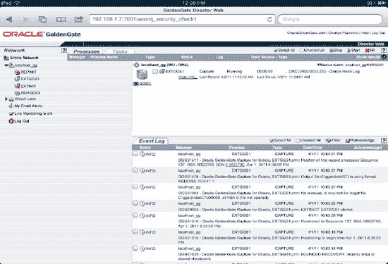

`Figure 10-2. Oracle GoldenGate Director Web on iPad`

#### Director Client

在桌面上，Director Client 可以创建/更改/删除参数和跟踪文件。它还显示可用的 Oracle GoldenGate 参数的在线帮助。

在使用 Director 桌面客户端或 Web 应用程序之前，你必须在 `GGSCI` 实例中设置 `Manager` 进程并启动它——如果没有启动并运行 `Manager`，你将无法执行任何操作。Director Web 和 Director Client 都依赖于 `Manager` 进程来控制 `Extract` 和 `Replicat`。因此，你无法使用 Director Client 或 Web 修改 `Manager` 参数文件。

本书中你将使用 Director Client。你在 Director Web 中可以做的任何事情，在 Director Client 中也可以做。它们的界面相似。

本章向你展示如何使用桌面上的 Director Client 设置一些基本和高级的 Oracle GoldenGate 映射。你跳过了一些 Oracle GoldenGate 概念，因为它们在前面的章节、管理员指南、参考指南和 Director 在线帮助中有所介绍。

Director Client 是一个 GUI 应用程序。本章包含许多截图，因此在按照示例操作时，你可以确保与书中内容一致。在 Director Client 中，相同的菜单栏或按钮的行为可能因你高亮显示的对象而异。例如，当你高亮显示提取对象、数据源和跟踪文件时，“查看详细信息”菜单项会显示不同的对话框。

遵循本章开头的步骤很重要；后面的一些基础说明可以跳过。当你熟悉了 Director 界面后，有些任务比单独使用 `GGSCI` 更简单、更快捷。在 Oracle GoldenGate `Manager` 运行的情况下，你甚至无需接触 `vi` 或记事本来执行大多数常见的开发任务。


### 设置数据源

在使用 Director 应用程序之前，您必须使用 Oracle GoldenGate Director 管理工具设置数据源。请确保 `Director 服务器` 已在运行，然后按照以下步骤操作：

1.  输入 `用户名` 和 `密码`，如图 10-3 所示。默认情况下，`用户名` 和 `密码` 均为 `admin`。
    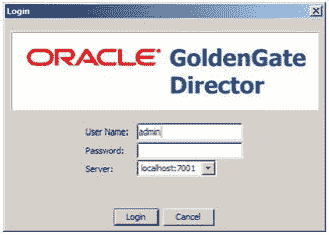
    **图 10-3.** Director 登录界面

2.  从下拉菜单中，选择带有 TCP 端口号的服务器名称。
3.  点击 `登录`。账户页面将会出现。
4.  在账户页面上，创建一个新用户或使用 `admin` 账户。
5.  点击 `监控代理` 选项卡，并确认您正在监控您的数据源。

Director 客户端中只有两种角色：`所有者` 和 `观察者`。您可以在 `数据源` 选项卡上定义它们。此外，用户活动会记录在 Director WebLogic 域下的 `access.log` 文件中。

`所有者` 拥有对此数据源的完全控制权。如果您将 `所有者` 字段留空，那么所有用户都可以看到并访问与此数据源关联的进程。如果选择了 `主机可被观察` 选项，则所有非所有者用户对于此数据源将处于只读模式。

Director 按用户存储用户特定的配置。因此，如果您共享相同的用户 ID，您看到的屏幕将与其他用户看到的完全相同，例如图表和警报。

继续创建一个已运行有管理器的数据源。在 Director 术语中，数据源也称为 `管理器进程`。它与 GoldenGate 用于管理所有抽取和复制的 `管理器` 进程是同一个。请注意，您必须创建一个带有必需端口号的 `管理器` 参数文件，桌面客户端才能工作。使用 `检查连接` 来确认管理器是否正在运行。您无法使用 Director 客户端创建 `管理器` 参数文件。您可以在 Director 客户端中运行 `GGSCI`，但它不支持 `编辑` 命令。有关 Director 某个对话框的 `GGSCI` 选项卡中不支持的特性列表，请参阅 Director 管理员指南。

在 `监控代理` 选项卡上，请确保为您的数据源开启监控。

### 修改管理器参数文件

现在您可以启动 Director 客户端了。从菜单栏中，选择 `文件` > `登录`，如果您想使用默认密码，请输入 `admin/admin`，或者输入您在 Oracle GDSC 管理工具中创建的登录凭据。点击 `数据源` 选项卡，然后将您在管理工具中创建的数据源拖放到图表区域。现在，您应该看到一个 `数据源` 图标，如图 10-4 所示。

#### 使用内置编辑器修改参数文件

在图表面板中右键单击数据源图标，然后选择 `高级` > `编辑参数文件`，如图 10-4 所示。您在此内置编辑器中拥有对参数文件的完全控制权。您通常会用它来编辑那些尚未在 Director 图形用户界面中实现的参数。
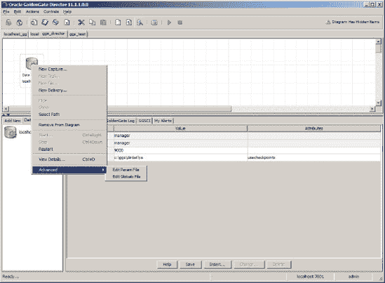
**图 10-4.** 编辑管理器参数文件

### 使用图形用户界面修改参数文件

您也可以使用 Director 界面修改 `管理器` 参数文件。例如，要将 `purgeoldextracts` 参数添加到参数文件中，请高亮显示数据源，然后点击 `插入` 按钮。图 10-5 所示的对话框会打开。这个对话框的一个非常好的特点是，它显示了所有可用的 `管理器` 参数和属性及其在线帮助。
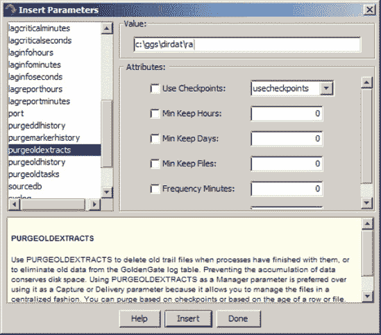
**图 10-5.** 向管理器参数文件中插入参数

从左侧列表中选择 `purgeoldextracts`，并输入您的 `dirdat` 完整路径及两字符的追踪文件前缀。然后点击 `插入`。如果需要，您可以添加其他参数；如果已完成，点击 `完成` 按钮。

右键单击数据源，选择 `重新启动` 以刷新 `管理器`。您也可以转到 `GGSCI` 并输入 `refresh mgr`。

接下来，您将使用 Director 客户端完成几项任务。

### 设置初始加载

Oracle GoldenGate 初始加载任务在 Director 中设置起来非常简单。它有一个菜单项来自动化此过程；您只需要映射表即可。

#### 添加初始加载任务

点击数据源并选择 `操作` > `添加新任务` > `初始加载任务`，如图 10-6 所示。
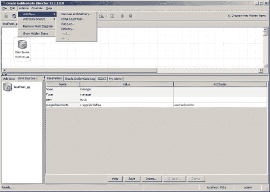
**图 10-6.** 选择初始加载任务

您可以在初始加载任务对话框中填写 `捕获名称` 和 `投递名称`。确保源数据库和目标数据库的登录信息正确。点击 `确定`。Director 会为您创建所有必要的文件，如图 10-7 所示。接下来，您告诉 Oracle GoldenGate 您需要通过初始加载复制哪些表。
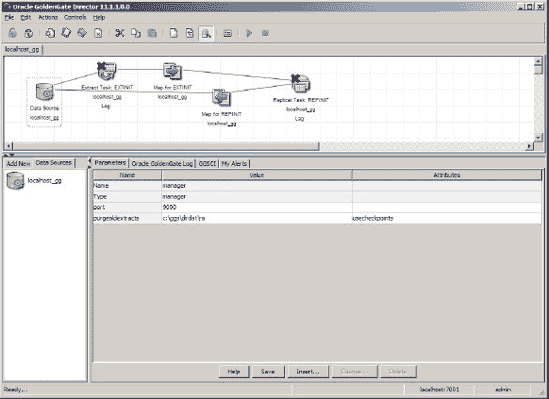
**图 10-7.** 为初始加载任务创建的文件。

*映射* 告诉 Oracle GoldenGate 您需要复制到目标数据库的内容。因此，您需要创建映射规则。创建映射规则的指导原则如下：

*   为 `捕获` 对象配置映射语句时，不要指定目标表或列映射。
*   为 `投递` 对象配置映射语句时，请指定源表和目标表。如果需要，请将源列映射到目标列并指定列转换函数。

在图表上，点击 `EXTINIT` 对应的 `映射`，然后点击底部的 `插入` 按钮。`插入新映射` 对话框打开。目前，请使用 `映射类型` 值 `表`，如图 10-8 所示。在 `表名` 文本框中输入表名。每个新映射都要点击 `插入`。
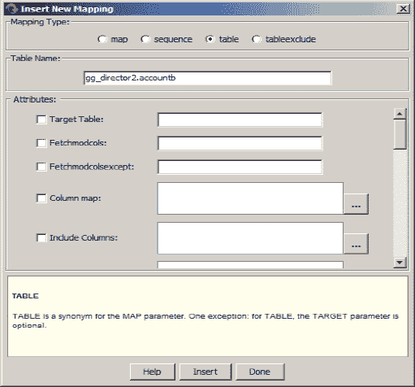
**图 10-8.** 抽取的“插入新映射”对话框

您映射的表会在 `参数` 选项卡的第一列被勾选，如图 10-9 所示。如果看不到它们，请点击 `显示表` 按钮。您也可以在表列表面板中选择表，如图 10-9 所示。
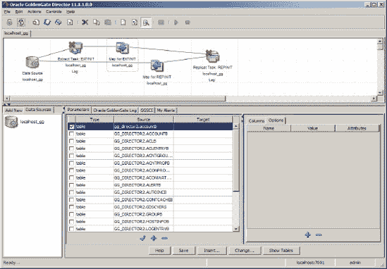
**图 10-9.** 抽取的映射表列表

要查看或编辑您的抽取参数文件，请右键单击 `EXTINIT` 的 `抽取`，然后选择 `高级` > `编辑参数`。图 10-10 所示的对话框将会打开。
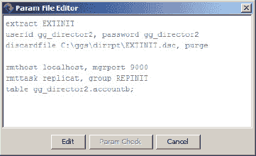
**图 10-10.** 在运行参数文件之前进行验证是良好的做法。

对 `REPINIT` 的 `映射` 执行同样的操作。高亮显示已映射的表，然后点击 `更改`。在 `属性` 框中输入 `目标` 表名，如图 10-8 所示。

现在，右键单击 `EXTINIT` `抽取`，并选择 `启动`，如图 10-11 所示。这样做会启动一个 `GGSCI` 进程来开始 `抽取`。请注意，在 Windows 版 Director 中，启动的 `GGSCI` 进程窗口有时不会正常退出；如果发生这种情况，请转到启动的 `GGSCI` 窗口并输入 `Exit`。或者，您可以在 `GGSCI` 中启动 `EXTINIT`。图表会实时刷新状态。
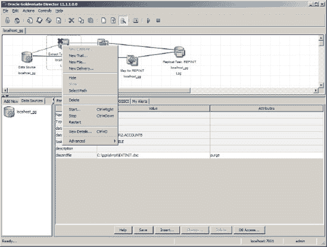
**图 10-11.** 从抽取对象启动抽取。


### 创建单向复制

首次创建抽取时，您需要执行以下数据库任务，这些是 Director 客户端无法自动完成的：

*   在源数据库上至少启用数据库级别的补充日志记录
*   为源和目标上的 Oracle GoldenGate 用户授予适当的权限

如果要记录额外的列变更数据，需要为抽取表添加跟踪数据。为此，再次右键单击数据源，然后选择“查看详细信息”。将打开如图 10-12 所示的对话框。单击“事务/重做日志数据”选项卡，然后单击“获取信息”。Director 会插入默认的登录信息；如果需要其他架构，请在“数据库访问”部分更改登录信息，然后单击“获取信息”以刷新表列表。高亮显示要添加的表，然后单击“添加跟踪数据”（您可以按住 Shift 键选择多个表）。

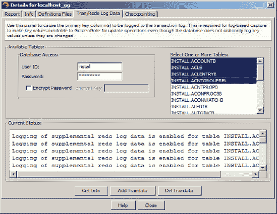

**图 10-12.** 添加跟踪数据。

单击“添加跟踪数据”后，您可以选择要跟踪的列。如果要捕获所有列，请选择所有列并单击“确定”。

现在可以创建抽取。右键单击要在其上运行抽取的数据源，然后选择“新建捕获”。唯一必填字段是“捕获名称”；所有其他字段将由 Director 填写。输入抽取名称 ``EXTGGS1``。将数据库访问信息更改为您的实际信息。

如果您的捕获是在 Oracle 真正应用集群（RAC）上，则需要使用 `threads` 属性修改抽取，如下所示在 GGSCI 中（`4` 表示四节点 RAC）：

```
GGSCI> alter extract extggs1, translog, threads 4, begin now
EXTRACT altered.
```

创建抽取 ``EXTGGS1`` 后，右键单击图中的 ``EXTGGS1`` 图标，然后选择“新建跟踪文件”。输入如图 10-13 所示的跟踪文件选项，然后单击“确定”。您面板中的图表应如图 10-14 所示。

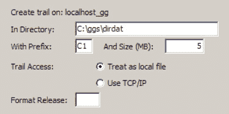

**图 10-13.** 添加跟踪文件选项。

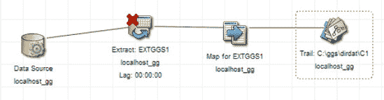

**图 10-14.** 完成的抽取任务图

右键单击“跟踪”图标，然后选择“新建投递”。使用 ``REPGGS1`` 作为复制名称，并输入 `dirdat` 目录的完整路径。单击“确定”。现在您的图中共有六个图标，如图 10-15 所示。

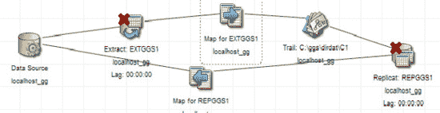

**图 10-15.** 完成的抽取和复制图

与初始加载映射类似，使用“映射”图标添加要复制的表。最后，使用“参数文件编辑器”检查您的抽取和复制参数文件。确保您的参数文件类似于图 10-16 和图 10-17。

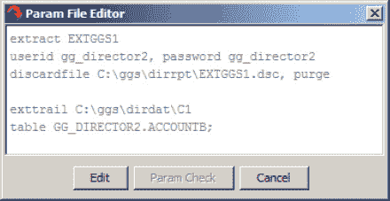

**图 10-16.** 抽取参数文件

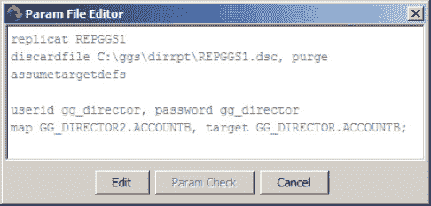

**图 10-17.** 复制参数文件

在 GGSCI 中，键入 `info all` 以确保 Director 已为您创建了两个组：

```
GGSCI> info all
Program     Status      Group       Lag           Time Since Chkpt

MANAGER     RUNNING
EXTRACT     STOPPED     EXTGGS1     00:00:00      01:18:10
REPLICAT    STOPPED     REPGGS1     00:00:00      01:12:13
```

一切就绪后，您可以从 Director 的抽取和复制图标或 GGSCI 启动抽取和复制。

启动抽取和复制后，它们上面的叉号应该会消失。图标之间的连线从灰色变为绿色。延迟值也会显示在图标上。您可以转到 GGSCI 选项卡检查它们的状态，如图 10-18 所示。单击“跟踪”图标；它还会显示当前的相对字节地址（RBA）和序列号。您可以随意向抽取和复制中添加新表；但请确保在任何更改后重新启动它们。

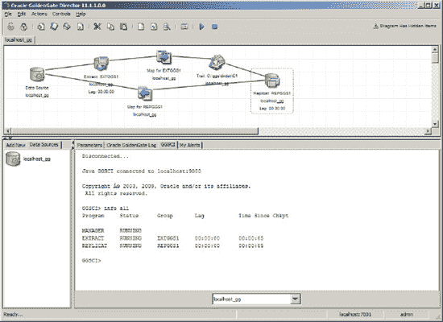

**图 10-18.** 运行抽取和复制

#### 添加数据泵进程

当两个系统不在同一服务器上时，使用 Oracle GoldenGate 数据泵进程是一种最佳实践，这样即使发生长时间中断，GoldenGate 进程也能在不丢失数据的情况下继续运行。要添加数据泵进程，请从数据源添加一个新的捕获，并将其命名为 ``DPGGS1``。单击“确定”。然后，从抽取 ``DPGGS1`` 对象添加一个跟踪文件。数据泵跟踪文件的前缀为 `C2`，如图 10-19 所示。跟踪访问方式现在是 TCP/IP，因为数据泵进程直接将跟踪文件发送到复制端的服务器。

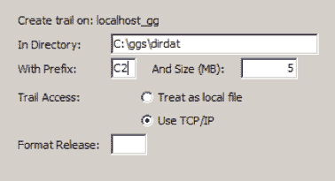

**图 10-19.** 为数据泵进程添加跟踪文件

使用“参数文件编辑器”删除登录信息，因为此数据泵不需要它，并添加 `passthru` 参数，如图 10-20 所示。您也可以在此处添加映射表，或使用 ``DPGGS1`` 参数界面的“映射”功能来添加。

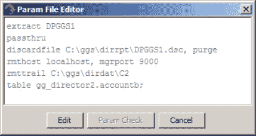

**图 10-20.** 数据泵参数文件

停止抽取 ``EXTGGS1``，等待延迟变为零，然后停止复制 ``REPGGS1``。在 GGSCI 中，更改抽取/复制以指向新的跟踪文件，如下所示：

```
GGSCI> alter extract dpggs1, exttrailsource c:\ggs\dirdat\c1
EXTRACT altered.

GGSCI> alter replicat repggs1, exttrail c:\ggs\dirdat\c2
REPLICAT altered.
```

请注意，`exttrail` 路径在复制和抽取中必须完全匹配。例如，从 Director 的角度看，`.\dirdat\c1` 不等于 `c:\ggs\dirdat\c1`。但是，Oracle GoldenGate 进程会将它们视为相同并无误运行——只是您无法得到正确的图表，如图 10-21 所示。

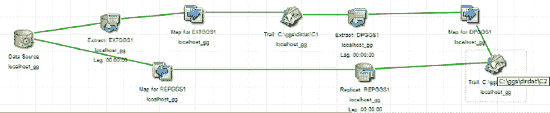

**图 10-21.** 包含数据泵进程的完整流程

启动抽取、数据泵和复制。您可能需要重新启动 Oracle GoldenGate 客户端才能看到具有正确绿线的图表。“刷新图表”功能有时不起作用。

现在一切都在运行，正是检查抽取、复制和数据源图标的“查看详情”功能的好时机。右键单击每个图标，然后选择“查看详情”。这将为您执行一些 GGSCI 命令，例如 `View report <组名>`、`info <组名>`、`lag extract <组名>`、`send <组名>` 等。

## 其他 Director 功能和技巧

除了前面章节介绍的功能外，Director 还有许多其他功能。本节将介绍一些关键功能和技巧。阅读本节后，您将了解 Director 与 Oracle GoldenGate GGSCI 命令行相比能为您做些什么。

### 更改抽取或复制的运行选项

Director 允许您更改抽取/复制的 `RUN` 选项。例如，假设您想重置抽取开始时间戳或复制序列号/RBA。为此，请单击图中的抽取/复制对象，然后选择“控制”  “运行选项”。抽取/复制必须处于停止状态才能调整这些选项。在生产环境中执行此操作前了解其过程非常重要，否则如果不慎跳过记录，可能会导致数据丢失。

### 更改跟踪文件大小

如果 Oracle GoldenGate 生成的跟踪文件过多，将难以维护。过大的跟踪文件也有风险：如果大型跟踪文件损坏，您将丢失大量数据。如果源活动发生变化并影响跟踪文件生成速率，您需要监控并调整跟踪文件大小。要更改跟踪文件大小，请单击图中的“跟踪”对象，然后选择“控制”  “运行选项”。然后您可以输入新的跟踪文件大小。


#### 提取 `tranlogoptions`

默认情况下，Director 不包含 `tranlogoptions`。`tranlogoptions` 参数控制 Oracle GoldenGate 与事务日志的交互方式；它是特定于数据库的。要添加 `tranlogoptions`，请在 图 10-22 所示的参数列表中选中它，然后单击“插入”。要访问以下对话框，请单击任意映射图标的“参数”选项卡上的“插入”按钮。

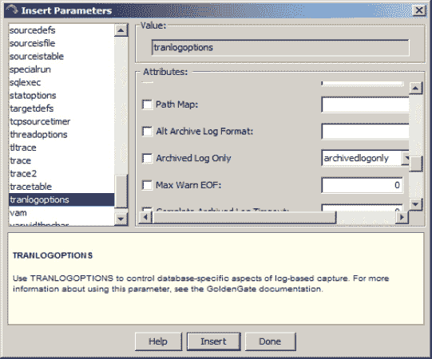

`图 10-22.` 提取 `tranlogoptions` 参数

Director 不验证参数。它会将属性追加到单个 `tranlogoptions` 行中，并且不会为您进行“去重”。您可以每行插入一个 `tranlogoptions` 项，如下所示：

```
TRANLOGOPTIONS ASMUSER SYS@ASM, ASMPASSWORD AEBIZD,ENCRYPTKEY DEFAULT
TRANLOGOPTIONS ALTARCHIVELOGDEST /ggs/gg_archive
TRANLOGOPTIONS CONVERTUCS2CLOBS
```

#### 生成定义文件

生成定义文件与添加 trandata 选项类似。若没有 Director，您需要使用 `DEFGEN` 实用程序来创建定义文件。要在 Director 中创建定义文件，请在图中选择数据源对象，然后选择 控制  查看详细信息。接着，单击“定义文件”选项卡，如 图 10-23 所示。

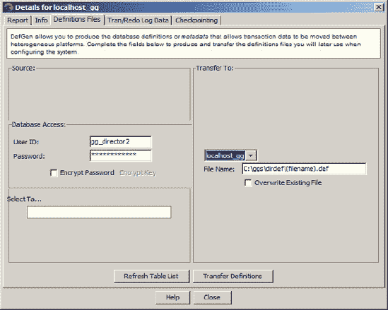

`图 10-23.` 源定义和目标定义文件的生成

为您需要添加到源/目标定义文件的每个表输入数据库访问信息。在“选择表”框中选中一个或多个表，完成后单击“传输定义”。表将通过 Manager 进程自动传输到目标/源位置。您可能在源或目标端为每个模式拥有多个定义文件；如果是这样，请连接这些文件，或者将它们追加到现有的 `sourcedef` 文件中，如 图 10-24 所示。

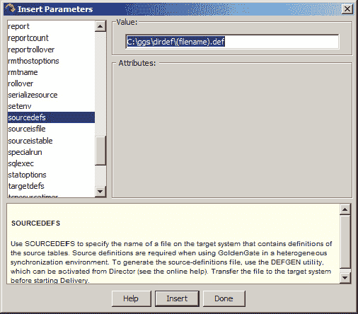

`图 10-24.` 将源或目标定义插入参数文件

请务必将 `sourcedef`/`targetdef` 文件添加到提取或复制进程的参数文件中。使用提取或复制进程的“参数”选项卡上的“插入参数”选项来执行此操作。

#### 在 Director 中查找参数或属性

Director 并未在 GUI 界面中实现所有参数，包括 `TRANSMEMORY` 等许多参数。您必须使用“编辑参数”功能手动添加这些参数。在某些情况下，属性也会缺失，例如 `FETCHOPTIONS NOUSESNAPSHOT`。为了解决这种情况，您可以添加 `FETCHOPTIONS` 并在文本框中手动输入 `NOUSESNAPSHOT`。

Oracle GoldenGate 还会压缩参数。`nocompressupdates` 参数不会出现在列表中，但如果您选择了 `compressupdates`，则可以在下拉列表中选择 `nocompressupdates`，如 图 10-25 所示。

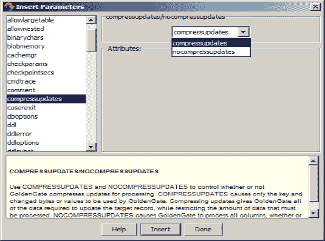

`图 10-25.` `Nocompressupdates` 位于下拉列表中，而不是参数列表面板中。

如您在 图 10-25 中所见，`compressdeletes` 参数不在列表中；`nocompressdeletes` 也不在。如果您需要在跟踪文件中获取被删除行的完整值，这些参数就非常重要。您必须使用“编辑参数”功能来添加它们。

### 高级映射

在图中选择 `EXTGGS1` 的映射图标，然后单击“参数”选项卡上的“更改”按钮（如果需要添加新映射则单击“插入”）；将打开如 图 10-26 所示的对话框。请注意，如果您在“更改映射”对话框中更改了“映射类型”，对话框中的*所有*属性都将消失；它们仍在参数文件中，但您必须重新打开此对话框才能使它们重新出现。

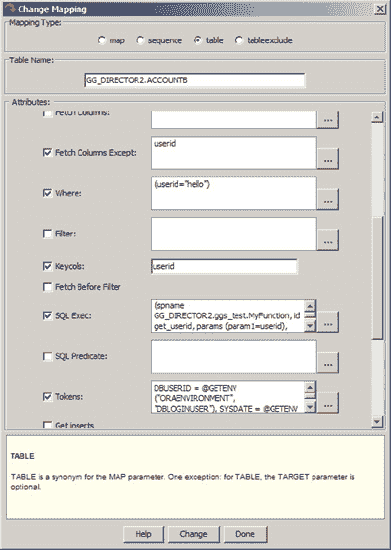

`图 10-26.` 映射类型具有许多属性。

图 10-27 显示了 `SQL Exec` 参数编辑器。如果没有 Director Client 界面，调试 `SQL Exec` 语句会非常困难，并且会导致许多语法错误。因为没有好的 IDE 用于编辑参数文件，您必须使用 `vi` 或其他通用文本编辑器。

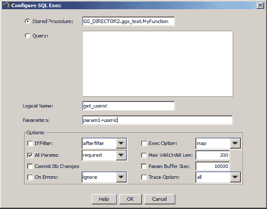

`图 10-27.` 用于查询和 PL/SQL 的 `SQL Exec` 编辑器

在您单击“确定”按钮后，Director 会自动为您创建以下参数代码。没有 Director Client，您必须在文本编辑器中逐字输入这些内容，并确保语法完全一致。

```
extract EXTGGS1
userid gg_director2, password gg_director2
discardfile C:\ggs\dirrpt\EXTGGS1.dsc, purge

exttrail C:\ggs\dirdat\C1
table GG_DIRECTOR2.ACCOUNTB, colmap (usedefaults,
phone=@strext(phone,2,6)), fetchcolsexcept (userid), where (userid="hello"),
keycols (userid), sqlexec (spname GG_DIRECTOR2.ggs_test.MyFunction, id get_userid,
 params (param1=userid), allparams required), tokens (DBUSERID = @GETENV ("ORAENVIRONMENT", "DBLOGINUSER"), SYSDATE = @GETENV ("ORATRANSACTION", "TIMESTAMP"), OPERATION = @GETENV("GGHEADER","OPTYPE"));
```

### 警报

Oracle GoldenGate 没有任何内置警报功能。如果任何进程失败或挂起，如果您不监控系统，您将不会知道。您必须手动编写警报脚本，如第 8 章所述，或者您可以使用 Director。使用 Director，设置警报非常容易。为此，请单击主屏幕上的“我的警报”选项卡。

只有两种类型的警报：检查点延迟和 `ggserr.log` 文件中的事件文本。让我们看两个例子。

首先，假设您希望设置一个事件文本警报，用于检查任何包含 *ABEND* 的消息。此类消息也应出现在 `/var/log/messages` 和 Windows 事件日志中。“AbendAlert”警报条目应类似于 图 10-28。

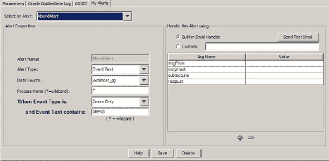

`图 10-28.` 事件文本警报

以下是添加此警报的步骤：

1.  在“警报类型”下拉列表中，选择“事件文本”。
2.  在“数据源”下拉列表中，选择 `localhost_gg` 或您拥有运行 Manager 进程的数据源。
3.  在“进程名称”文本框中，输入 ***** 表示所有进程。或者，要使用单个进程，请键入其名称，例如 `EXTGGS1`。
4.  在“当事件类型是”下拉列表中，选择“仅错误”。您正在创建一个 *ABEND* 警报，而 abend 是一种错误。
5.  在“并且事件文本包含”文本框中，输入 **ABEND**。这是实际出现在 `ggserr.log` 和 `/var/log/` 消息中的文本。
6.  在“msgFrom 值”字段中，输入您想要的任何内容，以便您知道是谁发送的警报。
7.  在“smtphost”字段中，输入任何 SMTP 邮件中继服务器。
8.  在“subjectline”字段中，输入类似 **EXTGGS1 has abended** 的内容。
9.  在“reciplist”字段中，输入警报接收者的电子邮件地址。

接下来，让我们设置一个延迟警报。为此，输入如 图 10-29 所示的信息。

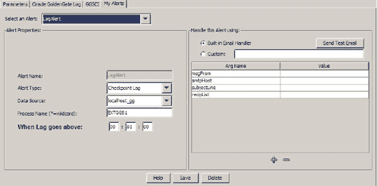

`图 10-29.` 提取进程 `EXTGGS1` 的延迟警报

Director 不需要服务器登录，因为它通过服务器端的 Manager 进程处理所有请求。因此，如果 Manager 宕机，您将不会收到任何警报。有关更高级的主题，请参阅第 8 章。

### 总结

至此，您应该熟悉了 Director 的进程。Director 是一个跨平台工具，因此您可以通过一些微小的更改将其用于其他数据库和平台。这些差异由 Director 在后台处理。

本篇涵盖所有场景超出了范围，但您应该能够使用 Director 完成以下附加任务：

*   使用 `DDL` 和 `DDLOPTIONS` 参数执行 DDL 同步
*   使用 `IGNOREREPLICATES`、`GETAPPLOPS` 和 `TRANLOGOPTIONS EXCLUDEUSER` 参数进行冲突处理，执行活动-活动同步
*   使用 `INSERTALLRECORDS` 和 `GETUPDATEBEFORES` 更改日志捕获
*   使用 Director Client 对大多数常见的 Oracle GoldenGate 错误进行故障排除和修复


## Oracle GoldenGate 故障排除

作为数据库专业人员，使用 Oracle GoldenGate 时最困难的方面之一，是如何在整个实施生命周期中对出现的错误进行故障排查和解决。由于 Oracle GoldenGate 作为企业级软件的功能和操作特性，它涉及从源数据库到目标数据库，再到网络问题等整个技术栈的所有层面。本章的目标是为您提供最佳的整体框架，用以识别和解决 Oracle GoldenGate 生态系统中发生的问题。

### 常见问题与解决方案

为了使您掌握解决 Oracle GoldenGate 相关问题的最佳方法，我们首先采用一种整体方法来排查 Oracle GoldenGate 环境中最常见的问题。因为 Oracle GoldenGate 涉及数据库、网络、存储和操作系统等多个领域，本章将依次讨论这些与 Oracle GoldenGate 问题解决相关的领域。为便于讨论，采用一种可视化方法来分析 Oracle GoldenGate 的根本原因是有用的，如图 11-1 所示。

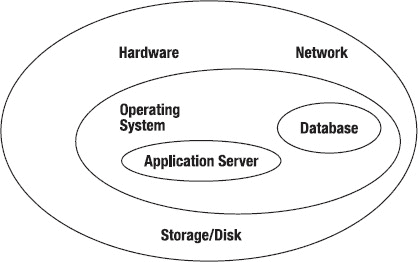

**图 11-1.** 排查 Oracle Goldengate 软件问题的整体方法

本章将探讨以下可能给 Oracle GoldenGate 环境带来困扰的领域：

*   进程失败
*   跟踪文件问题
*   同步问题
*   源和目标系统上的启动问题
*   数据库配置和可用性问题

作为您探索 Oracle GoldenGate 故障排除之旅的一部分，本章提供了可用于追踪和识别问题根源的技巧和技术，以便您能快速解决问题。让我们开始吧！

### Oracle GoldenGate 进程失败

您在 Oracle GoldenGate 环境中可能遇到的第一类问题是进程失败。这些问题可能发生在源端、目标端，或由于一个或多个 Oracle GoldenGate 进程的问题在两个环境中同时发生。

回顾前面的章节，Oracle GoldenGate 环境在源数据库和目标数据库系统上包含许多不同的后台进程，例如抽取（Extract）、数据泵（Data Pump）、复制（Replicat）、收集器（Collector）和管理器（Manager）进程。如果这些关键进程中的任何一个失败，那么复制活动很可能会戛然而止，从而影响数据的完整性以及 Oracle GoldenGate 环境之间实时数据传输的操作。

本节首先探讨在正常的 Oracle GoldenGate 操作期间发生的进程失败，以及解决这些类型进程失败的方法。如果您发现 Oracle GoldenGate 进程失败，要执行的首要任务是使用 GoldenGate 软件命令接口（`GGSCI`）的 `INFO ALL` 命令来调查详细信息：

```
C:\ggs_src>ggsci
Oracle GoldenGate Command Interpreter for Oracle
Version 11.1.1.0.0 Build 078
Windows (optimized), Oracle 11 on Jul 28 2010 17:20:29
Copyright (C) 1995, 2010, Oracle and/or its affiliates. All rights reserve
GGSCI (oracledba) 1> info all
Program     Status      Group       Lag           Time Since Chkpt
MANAGER     STOPPED
```

在许多情况下，当 Oracle GoldenGate 的源环境或目标环境出现网络问题时，`Manager` 进程会失败。您应检查以确保 `Manager` 进程已启动并正在运行。如果 `Manager` 进程未运行，则需要通过在 `GGSCI` 内执行以下命令来重新启动它：

```
GGSCI> START MANAGER
```

要验证 `Manager` 是否已成功启动，请在启动后再次发出 Oracle GoldenGate `GGSCI` 命令。以下示例确保 `Manager` 已正确启动且没有错误：

```
GGSCI (oracledba) 7> start manager
Manager started.
GGSCI (oracledba) 8> info all
Program     Status      Group       Lag           Time Since Chkpt
MANAGER     RUNNING
```

作为 Oracle GoldenGate 的关键进程之一，如果网络端口被防火墙阻止，`Manager` 进程会异常终止或失败。您可以使用 `ping` 命令进行检查，以验证端口是否存在网络问题。您应与您的网络或系统管理员密切合作，确保 `Manager` 进程分配的端口是开放且可用的，以便 `Manager` 能够与 Oracle GoldenGate 的源系统和目标系统进行通信。


#### Oracle GoldenGate Extract 进程失败

Oracle GoldenGate Extract 进程失败可能发生在源系统上，也可能发生在使用数据泵 Extract 进程的中间系统上。由于 Extract 进程与源数据库、Manager 进程以及目标 Replicat 进程进行通信，如果这些 Oracle GoldenGate 进程中的任何一个出现问题，Extract 要么会挂起，要么会异常终止并失败。当您处理 Extract 失败时，应首先运行 Oracle GoldenGate GGSCI `VIEW REPORT` 命令来检查当前 Oracle GoldenGate 环境的状态。如果 Extract 进程在源系统上失败，请运行以下命令：

```
GGSCI> VIEW REPORT <extract name>
```

在 GGSCI 中检查 `VIEW REPORT` 命令的输出；其中的详细信息为解决 Extract 失败提供了进一步调查的线索。解决问题后，您需要通过执行 GGSCI `START EXTRACT <extract name>` 命令来重启 Extract 进程。请使用 `DETAIL` 选项发出命令，如下所示：

```
GGSCI> START EXTRACT <extract name>, DETAIL
```

现在，让我们看一个 Extract 进程在 Oracle 11g 源数据库服务器上失败的示例。要查看 GoldenGate 的报告，请执行命令 `GGSCI` 进入 GoldenGate 命令行界面，然后输入 `VIEW REPORT EATAA`，其中引用了示例 Extract 进程组的名称：

```
GGSCI (oracledba) 3> view report eataa
***********************************************************************
                 Oracle GoldenGate Capture for Oracle
                     Version 11.1.1.0.0 Build 078
        Windows (optimized), Oracle 11 on Jul 28 2010 18:00:34

Copyright (C) 1995, 2010, Oracle and/or its affiliates. All rights reserved.
                    Starting at 2011-03-14 00:00:32
***********************************************************************
Operating System Version:
Microsoft Windows Vista Business Edition, on x86
Version 6.0 (Build 6002: Service Pack 2)
Process id: 2524
Description:
***********************************************************************
**            Running with the following parameters                  **
***********************************************************************
--Example Extract Parameter File
SOURCEISTABLE
2011-03-14 00:00:33  INFO    OGG-01017  Wildcard resolution set to IMMEDIATE bec
ause SOURCEISTABLE is used.
USERID ggs, PASSWORD *****
Source Context :
  SourceModule            : [ggdb.ora.sess]
  SourceID                : [../gglib/ggdbora/ocisess.c]
  SourceFunction          : [OCISESS_try]
  SourceLine              : [498]
2011-03-14 00:00:33  ERROR   OGG-00664  OCI Error during OCIServerAttach (status
 = 12560-ORA-12560: TNS:protocol adapter error).
2011-03-14 00:00:33  ERROR   OGG-01668  PROCESS ABENDING.
```

在此案例中，由于源数据库服务器上的 Oracle 协议网络错误，Extract 未能运行。该网络错误是由 Oracle 11g 网络监听器 (TNS) 启动失败引起的。您可以通过检查 `listener.ora` 和 `tnsnames.ora` 网络配置并纠正任何错误来排查此错误。然后，重新启动 Oracle 监听器和 GoldenGate 进程。通过纠正源 Oracle 11g 监听器协议错误，您可以成功重启 Extract 进程。

调查 Extract 失败问题的另一个有用方法是运行 GGSCI 命令 `INFO <extract name>, DETAIL`，以获取当前 Extract 文件位置的列表，以便进行进一步分析：

```
GGSCI (oracledba) 26> info extora, detail
EXTRACT    EXTORA    Initialized   2011-03-13 23:45   Status STOPPED
Checkpoint Lag       00:00:00 (updated 00:22:24 ago)
Log Read Checkpoint  Oracle Redo Logs
                     2011-03-13 23:45:30  Seqno 0, RBA 0
  Target Extract Trails:
  Remote Trail Name                                Seqno        RBA     Max MB
  AA                                                   0          0         10

  Extract Source                                  Begin             End
  Not Available                                   * Initialized *   2011-03-13 23:45
Current directory    C:\ggs_src
Report file          C:\ggs_src\dirrpt\EXTORA.rpt
Parameter file       C:\ggs_src\dirprm\EXTORA.prm
Checkpoint file      C:\ggs_src\dirchk\EXTORA.cpe
Process file         C:\ggs_src\dirpcs\EXTORA.pce
Error log            C:\ggs_src\ggserr.log
```

接下来，让我们看看当 Oracle GoldenGate 进程失败且未提供报告时发生的更棘手情况。

#### 无报告诊断的 Oracle GoldenGate 进程失败

如果 Oracle GoldenGate 进程在首次将报告文件写入标准屏幕输出之前就失败了，您可以从操作系统的命令 shell（而非 GGSCI）运行它，以便将进程信息发送到终端。要进行调查，您可以在操作系统级别使用语法 `<process> paramfile <path name>.prm` 来启动，其中 `<process>` 表示 Oracle GoldenGate 的 Extract 或 Replicat 进程，`paramfile` 是 Extract 或 Replicat 参数文件的完全限定文件名。以下是一个示例：

```
C:\ggs_src>extract paramfile C:\ggs_src\dirprm\extora.prm
Version 6.0 (Build 6002: Service Pack 2)
Process id: 6056
Description:
2011-03-14 00:19:46  ERROR   OGG-00664  OCI Error beginning session (status = 10
17-ORA-01017: invalid username/password; logon denied).
2011-03-14 00:19:46  ERROR   OGG-01668  PROCESS ABENDING.
```

在 UNIX 和 Linux 平台上，您需要查找位于安装 Oracle GoldenGate 软件的主目录下的核心转储文件。

### Oracle GoldenGate 跟踪文件问题

回顾前面的章节，Oracle GoldenGate 进程组在源和目标系统上向称为 *跟踪文件* 的特殊平面文件写入和读取数据。处理这些跟踪文件失败会中止 Oracle GoldenGate 软件的正确操作。本节介绍跟踪文件可能发生的以下问题：

*   跟踪文件无法清空
*   跟踪文件无法轮转
*   跟踪文件清除问题

#### 跟踪文件无法清空

有时您会遇到跟踪文件无法清空并保持充满数据的问题。您应该检查以确定有问题的跟踪文件是本地跟踪文件还是远程跟踪文件。如果是本地跟踪文件无法清空，请检查源、中间和目标系统之间的 TCP/IP 网络延迟问题。如果目标系统上的远程跟踪文件经常无法清空，请检查您的 Replicat 进程组是否可用、是否正在运行以及是否正在处理来自远程跟踪文件的数据。

如果 Replicat 进程运行正常且没有错误，原因可能是目标系统上 Replicat 正在处理的大型事务。在这种情况下，您可以拆分表并对其进行分区，将大型事务分解到多个跟踪文件中，并使用额外的 Replicat 进程组并行处理事务。为此，请在 Replicat 的 `MAP` 语句中使用 Oracle GoldenGate `Replicat` 参数 `FILTER` 选项和 `@RANGE` 函数。


#### 不回滚的跟踪文件

困扰 Oracle GoldenGate 跟踪文件操作的另一个问题是，当跟踪文件完全填满后，未能回滚（滚动）到一个新的跟踪文件。此处需要检查的一个事项是相关跟踪文件的最大文件大小。您可以使用 Oracle GoldenGate GGSCI 命令 `INFO EXTTRAIL *` 或 `INFO RMTTRAIL *` 来检查，如下例所示：

```
GGSCI (oracledba) 1> info exttrail *
       Extract Trail: AA
             Extract: EXTORA
               Seqno: 0
                 RBA: 0
           File Size: 10M
```

您可以通过检查 `File Size` 字段来定位此信息。要使用 Oracle GoldenGate 更改跟踪文件大小，请发出带有 `MEGABYTES` 选项的 Oracle GoldenGate GGSCI 命令 `ALTER EXTTRAIL` 或 `ALTER RMTTRAIL`，如下所示：

```
GGSCI (oracledba) 3> alter exttrail aa megabytes 20, extract extora
EXTTRAIL altered.
GGSCI (oracledba) 4> info exttrail *
       Extract Trail: AA
             Extract: EXTORA
               Seqno: 0
                 RBA: 0
           File Size: 20M
```

#### 跟踪文件清理问题

跟踪文件有时未能正确清理，从而导致在源和目标数据库环境之间处理数据时出错。跟踪文件清理操作失败最常见的原因，可能是未能使用 `PURGEOLDEXTRACTS` 来管理 Oracle GoldenGate 正在使用的跟踪文件。您应将此参数添加到 Manager 参数文件中，以防止旧跟踪文件积累过快，从而导致 Oracle GoldenGate 配置出现问题。请记住，使用此功能时，必须授予 Oracle GoldenGate Manager 用户帐户正确级别的访问权限，以读取和写入跟踪文件及文件系统。

跟踪文件清理问题的另一个原因可能是过时的 Replicat 组仍在引用旧的跟踪文件。如果其他进程仍在读取 Oracle GoldenGate 跟踪文件，则这些文件不会被清理。如果一个旧的 Replicat 组正在引用某个跟踪文件，您可以使用 GGSCI 中的 `DELETE REPLICAT` 命令来删除过时的 Replicat 进程组，从而删除检查点记录，使 Manager 进程能够清理跟踪文件。请记住，如果 Replicat 组仍在使用检查点表，则需要在删除表中的检查点和 Replicat 之前，使用 `DBLOGIN` 命令登录到目标数据库。您可以使用以下语法执行此任务：

```
DBLOGIN USERID <user>, PASSWORD <pw>
DELETE REPLICAT <group>
```

#### 过早清理的跟踪文件

跟踪文件的另一个棘手情况是文件被过早清理。这会导致由于源系统和目标系统之间数据缺失而引发错误。解决此问题需要检查的一个根本原因是多个 Replicat 和数据泵从同一个跟踪文件读取。

同时，请检查您是否正确使用了 `PURGEOLDEXTRACTS` 参数的细节。关键是要认识到，您应该仅将此参数用作 Manager 参数——不应将 `PURGEOLDEXTRACTS` 用作 Extract 或 Replicat 参数。当您将 `PURGEOLDEXTRACTS` 用作 Manager 参数时，可以使用 `USECHECKPOINTS` 选项来延迟清理跟踪文件，直到所有 Oracle GoldenGate 进程都完成对该跟踪文件的数据处理。此外，您可以使用 `MIN` 选项来将跟踪文件存储一段设定的时间。每当使用 `MIN` 选项时，还必须为 `PURGEOLDEXTRACTS` 设置 `MAX` 选项，以表示保留跟踪文件的最长时间。

### Oracle GoldenGate 错误日志分析

幸运的是，Oracle GoldenGate 是一个监控完善的软件产品，它提供了一个出色的错误日志文件，其中包含源和目标系统上复制操作所有方面的详细信息。如果在 GoldenGate 处理过程中发生错误，您必须检查位于源和目标基本安装目录下的 Oracle GoldenGate 错误日志。在 Linux 和 UNIX 系统上，您可以使用 `tail` 命令来检查 Oracle GoldenGate 错误日志文件中包含的最后几条错误消息。

让我们看一下 Oracle 11g GoldenGate 和 Oracle 11g Windows 源系统的错误日志文件。该文件名为 `ggserr.log`；您可以在 Linux 和 UNIX 上使用 vi 或 Emacs 等文本编辑器，或在 Windows 平台上使用记事本打开它。此外，您还可以使用 GGSCI 命令 `VIEW GGSEVT` 查看错误日志文件，如下所示：

```
Oracle:  PROCESS ABENDING.
2011-03-14 00:19:46  INFO    OGG-00992  Oracle GoldenGate Capture for Oracle, extora.prm:  EXTRACT starting.
2011-03-14 00:19:46  INFO    OGG-01017  Oracle GoldenGate Capture for Oracle, extora.prm:  Wildcard resolution set to IMMEDIATE because SOURCEISTABLE is used.
2011-03-14 00:19:46  ERROR   OGG-00664  Oracle GoldenGate Capture for Oracle, extora.prm:  OCI Error beginning session (status = 1017-ORA-01017: invalid username/password; logon denied).
2011-03-14 00:19:46  ERROR   OGG-01668  Oracle GoldenGate Capture for Oracle, extora.prm:  PROCESS ABENDING.
```

### 理解 Oracle GoldenGate 丢弃文件

回顾前面的章节，当 Extract 或 Replicat 使用了 `DISCARDFILE` 参数时，Oracle GoldenGate 会创建一个丢弃文件。如果在 Replicat 或 Extract 处理来自源或目标环境的数据过程中出现问题，则被拒绝的记录会被转储到丢弃文件中。作为您尽职调查的一部分，您应定期检查源和目标数据库环境上的丢弃文件内容，以捕捉 Oracle GoldenGate 遇到的数据问题。

丢弃文件包含 Oracle GoldenGate 进程未能成功处理的所有数据库操作的列级详细信息。每个丢弃文件包含以下有用细节：

*   进程的数据库错误消息，例如 Oracle 11g 中表示“未找到数据”的 `ORA-00100`
*   Extract 或 Replicat 尝试处理的记录所在的跟踪文件序列号
*   记录在跟踪文件中的相对字节地址（RBA）
*   Extract 或 Replicat 尝试处理的被丢弃记录的详细信息

通常，丢弃文件由 Replicat 用于记录无法重构或应用的操作，但您也可能发现它对 Extract 很有用。检查丢弃错误中的消息，例如 `ORA-1403` 或重复的和/或被拒绝的记录。以下是一个 Oracle GoldenGate 丢弃文件示例：

```
ORA-20017:  repora 724935
ORA-06512: at "HR.REPORAINSERT", line 41
ORA-04088: error during execution of trigger 'HR.REPORA_INSERT'
Operation failed at seqno 15 rba 28483311
Problem replicating HR.EMP to HR.TRGTREP
Error occurred with insert record (target format)...
*
A_TIMESTAMP = 2011-03-09 11:28:11
OK = 1.0000
NOTOK = -1.0000
```

丢弃记录为处理过程中发生的问题提供了有用的线索，使您能够快速识别并解决根本原因。


#### 未创建丢弃文件

有时您可能会遇到一个令人沮丧的问题：Oracle GoldenGate 未能创建丢弃文件。一个常见的原因是，在参数文件中未为 `DISCARDFILE` 参数提供丢弃文件的位置。GoldenGate 默认不会创建丢弃文件，因此您需要指定丢弃文件的文件名和位置——否则它将不会被创建。

导致丢弃文件缺失的第二个原因是，当 `DISCARDFILE` 参数引用的文件系统目录不正确时。您需要验证是否已为丢弃文件及其所在目录授予足够的读写访问权限。此外，请确保访问丢弃文件的用户拥有访问、读写该文件位置所需的安全权限。

#### 丢弃文件过大

请记住，随着处理的进行，Oracle GoldenGate 会不断地写入丢弃文件。如果丢弃文件所在的文件系统没有分配足够的磁盘空间，则可能会在处理过程中出错。一个建议是使用以下参数调整丢弃文件的大小：

*   `DISCARDROLLOVER`：指定丢弃文件的老化参数。
*   `MAXDISCARDRECS`：限制写入丢弃文件的错误总数。
*   `PURGE` `option for` `DISCARDFILE`：在写入新信息之前清除丢弃文件。
*   `MEGABYTES` `option for` `DISCARDFILE`：设置丢弃文件的最大大小。丢弃文件的默认大小为 1MB。

#### 无法打开丢弃文件

Oracle GoldenGate 的 Extract 和 Replicat 进程在操作活动中会使用丢弃文件。如果丢弃文件的位置存在错误，Extract 或 Replicat 进程将在 GoldenGate 中失败，如下面的错误所示：

```
2011-03-16 00:54:08  ERROR   OGG-01091  Unable to open file "c:\win11trgt\dirrpt\report.dsc" (error 3, The system cannot find the path specified.).
2011-03-16 00:54:08  ERROR   OGG-01668  PROCESS ABENDING.
```

请检查您在 Extract 和 Replicat 参数文件中配置的 `DISCARDFILE` 参数的读写权限，以确保目录存在且已授予正确的权限。

### 使用 Oracle GoldenGate 的跟踪命令

Oracle GoldenGate 提供了几个有用的参数，可用于跟踪 Oracle GoldenGate 环境中失败的进程。本节将向您展示如何使用这些跟踪工具来识别 Oracle GoldenGate 中故障的根本原因。将讨论以下跟踪工具，并附带一个展示如何运行 `TRACE` 的示例：

*   `TLTRACE`
*   `TRACE`
*   `TRACE2`

 `注意` 如果您需要在 Oracle GoldenGate 中使用跟踪功能，应在调查 Oracle GoldenGate 环境中的故障时首先联系 Oracle GoldenGate 支持，以便能够以最佳方式部署这些跟踪命令，而不会对您的配置产生不利影响。

#### 使用 TLTRACE 进行 Oracle GoldenGate 进程跟踪

`TLTRACE` 参数允许您运行数据库事务日志活动的跟踪。您可以运行跟踪以显示正在处理记录的基本或详细信息。要启用 `TLTRACE` 会话，您需要将此参数添加到 Extract 或 Replicat 参数文件中并重启进程。

#### 在 Oracle GoldenGate 中使用 TRACE 参数

`TRACE` 和 `TRACE2` 参数允许您获取有关 Extract 和 Replicat 处理的所有详细信息。`TRACE` 参数为 Oracle GoldenGate 进程提供详细的处理信息。相比之下，`TRACE2` 参数用于识别 Extract 或 Replicat 处理最耗时的数据库代码段。

### Oracle GoldenGate 故障排除案例研究

让我们通过一个案例研究，了解如何使用 GGSCI 命令和错误日志来理解 Oracle 数据库环境中进程失败的原因。首先，使用 `STATUS EXTRACT` 命令，返回结果如下：

```
GGSCI (ggs_src) 20> status extract extora
EXTRACT EXTORA: ABENDED
```

接下来，使用 `VIEW GGSEVT` 命令深入查看失败的 Extract 进程的问题：

```
GGSCI (ggs_src) 22> view ggsevt
2011-03-11 10:28:11 GGS INFO 399 GoldenGate Command Interpreter
for Oracle: GGSCI command (admin): start extract ggext.
2011-03-11 10:38:15 GGS INFO 301 GoldenGate Manager for Oracle,
mgr.prm: Command received from GGSCI on host oracledba(START
EXTRACT GGEXT).
2011-03-11 10:40:02 GGS INFO 310 GoldenGate Capture for Oracle,
ggext.prm: EXTRACT EXTORA starting.
2011-03-11 10:41:11 GGS ERROR 501 GoldenGate Capture for Oracle,
extora.prm: Extract read, error 13 (Permission denied) opening redo
log C:\oracle\arch\0001_000000568.arc for sequence
258.
2011-03-11 10:43:22 GGS ERROR 190 GoldenGate Capture for Oracle,
extora.prm: PROCESS ABENDING.
```

在此故障中，错误消息 501 表明 Extract 用户没有正确的权限来读取源 Oracle 数据库上的重做日志。要解决此问题，您需要在源 Oracle 数据库上授予读写权限，以便 Extract 进程能够检索重做日志文件。向 Extract 用户授予这些读写权限后，您需要停止 Manager 进程并退出 GGSCI。注销您打开的终端会话，然后重新启动 Oracle GoldenGate 进程。

#### Oracle GoldenGate 配置问题

Oracle GoldenGate 配置问题会带来挑战，因为一旦环境安装和配置完成，如果原始 DBA 已离开公司，新的 DBA 团队并不总能获得过去 DBA 的文档来帮助他们理解所继承的配置。配置问题主要涉及以下方面：

*   安装了错误版本的 Oracle GoldenGate 软件
*   Oracle GoldenGate 源和/或目标数据库的配置问题
*   Oracle GoldenGate 参数文件配置问题
*   操作系统配置问题
*   网络配置问题

#### Oracle GoldenGate 的软件版本错误

为 Oracle GoldenGate 安装错误的版本和平台版本会导致源和目标环境中的故障。Oracle 为 GoldenGate 软件提供了基于平台、数据库和版本（32 位与 64 位）的独特构建，需要为您的平台安装正确的版本。例如，您不能在 IBM AIX 平台上安装 64 位 Oracle GoldenGate Linux 软件，否则会收到错误。

构建名称包含操作系统版本、数据库版本、GoldenGate 发行号和 GoldenGate 构建号，如下列 Oracle on Solaris 的示例所示：

`ggs_Solaris_sparc_ora10g_64bit_v11_1_1___78.tar`

要查明 GoldenGate 版本，请切换到 GoldenGate 主目录，并在操作系统终端 shell 窗口中发出 GGSCI `–v` 命令：

```
C:\ggs_src>ggsci -v
Oracle GoldenGate Command Interpreter for Oracle
Version 11.1.1.0.0 Build 078
Windows (optimized), Oracle 11 on Jul 28 2010 17:20:29
Copyright (C) 1995, 2010, Oracle and/or its affiliates. All rights reserved.
```


##### 数据库可用性问题

如果源数据库和目标数据库环境未在线或运行不正常，Oracle GoldenGate 的处理将会失败，因为 Extract 和 Replicat 进程需要频繁登录数据库环境以访问重做日志文件来执行数据复制活动。你可以通过操作系统 shell 窗口使用 Oracle 的 `LSNRCTL` 和 `TNSPING` 命令来检查数据库和监听器是否在线：

```cmd
C:\ggs_src>lsnrctl status
LSNRCTL for 32-bit Windows: Version 11.2.0.1.0 - Production on 14-MAR-2011 01:53
Connecting to (DESCRIPTION=(ADDRESS=(PROTOCOL=IPC)(KEY=EXTPROC1521)))
STATUS of the LISTENER
------------------------
Listening Endpoints Summary...
  (DESCRIPTION=(ADDRESS=(PROTOCOL=ipc)(PIPENAME=\\.\pipe\EXTPROC1521ipc)))
  (DESCRIPTION=(ADDRESS=(PROTOCOL=tcp)(HOST=oracledba)(PORT=1521)))
Services Summary...
Service "CLRExtProc" has 1 instance(s).
  Instance "CLRExtProc", status UNKNOWN, has 1 handler(s) for this service...
Service "win11src" has 1 instance(s).
  Instance "win11src", status READY, has 1 handler(s) for this service...
The command completed successfully
C:\ggs_src>tnsping win11src
TNS Ping Utility for 32-bit Windows: Version 11.2.0.1.0 - Production on 14-MAR-2
Used parameter files:
C:\winora11g2\product\11.2.0\dbhome_1\network\admin\sqlnet.ora
Used TNSNAMES adapter to resolve the alias
Attempting to contact (DESCRIPTION = (ADDRESS = (PROTOCOL = TCP)(HOST = oracledb
a)(PORT = 1521)) (CONNECT_DATA = (SERVER = DEDICATED) (SERVICE_NAME = win11src))
)OK (80 msec)
```

一种快速验证数据库是否在线的方法是使用 UNIX 或 Linux 命令 `ps –ef|grep smon`，或者更好的方法是，以 Extract 和 Replicat 对应的 Oracle GoldenGate 用户身份登录 Oracle SQL*PLUS，如下所示：

```cmd
C:\ggs_src>sqlplus ggs/ggs@win11src
SQL*Plus: Release 11.2.0.1.0 Production on Mon Mar 14 01:59:23 2011
Copyright (c) 1982, 2010, Oracle. All rights reserved.
Connected to:
Oracle Database 11g Enterprise Edition Release 11.2.0.1.0 - Production
With the Partitioning, OLAP, Data Mining and Real Application Testing options
SQL> select count(*) from hr.employees;
  COUNT(*)
----------
       107
```

你还需要检查并验证 Manager 进程是否在线运行，并对源数据库和目标数据库执行之前的检查。如果无法访问数据库系统和 Manager 进程，Extract 和 Replicat 将无法成功运行。

#### 缺失的 Oracle GoldenGate 进程组

困扰 Oracle GoldenGate 环境的一个常见问题是进程组缺失。作为此类问题故障排查的起点，你应该执行 GGSCI `INFO ALL` 命令，以查看系统上当前所有的进程和组。Extract 组名可能在组创建时拼写错误，或者在为 Oracle GoldenGate 进程发出 `START` 命令时拼写错误。

#### 缺失的 Oracle GoldenGate 跟踪文件

通常，Oracle GoldenGate 环境中的 Extract 参数文件或 obey 文件会创建引用不存在或缺失的跟踪文件的 Extract 进程组。如果没有有效的跟踪文件，Extract 将无法写出从源数据库在线重做日志文件中捕获的数据。此外，Replicat 进程将会异常中止并失败，因为它无法从远程跟踪文件中读取。没有跟踪文件，Extract 无法写入初始检查点，而 Replicat 也没有可用的数据源可供读取。你可以使用 GGSCI 命令 `INFO EXTRACT <group>` 或带有 `DETAIL` 选项的 `INFO REPLICAT <group>` 命令来验证跟踪文件是否存在。此外，在识别出跟踪文件后，你可以使用 GGSCI 命令 `INFO EXTTRAIL <跟踪文件名>` 来进一步深入查看：

```
GGSCI (oracledba) 3> info extract extora detail
EXTRACT    EXTORA    Initialized   2011-03-13 23:45   Status STOPPED
Checkpoint Lag       00:00:00 (updated 02:24:26 ago)
Log Read Checkpoint  Oracle Redo Logs
                     2011-03-13 23:45:30  Seqno 0, RBA 0

  Target Extract Trails:
  Remote Trail Name                                Seqno        RBA     Max MB
  AA                                                      0          0         10

GGSCI (oracledba) 5> info exttrail aa

       Extract Trail: AA
             Extract: EXTORA
               Seqno: 0
                 RBA: 0
           File Size: 10M
```


##### Oracle GoldenGate 参数文件配置问题

Oracle GoldenGate 依赖参数文件来存储和管理核心功能的操作流程，包括用于源数据捕获的 Extract、用于网络通信和进程间操作的 Manager 进程，以及用于目标系统应用处理的 Replicat。如果这些参数文件设置不正确或不可用，Oracle GoldenGate 处理将会失败。

**参数文件位置**

第一个与参数文件配置相关的问题是检查参数文件是否位于正确的目录中。默认情况下，Oracle GoldenGate 安装后，参数文件存储在 `dirprm` 子目录中。您需要验证 Extract 和 Replicat 的参数文件是否在此目录中，并且这些参数文件是否与 Oracle GoldenGate 的进程组同名。如果参数文件缺失或不在此目录中，请执行搜索以定位正确的参数文件。如果不记得将进程组的配置参数文件放置在何处，可以使用 GGSCI 命令 `INFO EXTRACT <group>, DETAIL` 来定位正确的文件。如果您希望将参数文件存储在不同的文件系统和目录中，则需要在 GGSCI 中使用 `ADD EXTRACT` 命令时，配合使用 `PARAMS` 参数来添加新的 Extract；或者，如果已经创建了 Extract 组，则可以使用 GGSCI 命令 `ALTER EXTRACT` 来更改参数文件的位置。

**文件访问权限**

另一个与参数配置相关的问题是文件访问权限。如果进程组的读写权限未在操作系统级别或数据库级别正确授予，那么当 Extract 或 Replicat 进程尝试访问源或目标系统上的数据库时，将会发生失败。此外，如果文件权限设置不正确，Oracle GoldenGate 操作期间也会出现错误。对于 Windows，您可以使用 Windows 资源管理器图形界面检查权限。在 Linux 和 UNIX 平台上，使用 `ls –l` 命令检查读、写和执行权限的状态。您可以根据需要，使用 UNIX 和 Linux 命令 `chmod` 和 `chown` 为 Oracle GoldenGate 参数文件授予所需的文件系统权限。

**缺失参数**

第三个发生在 Oracle GoldenGate 进程组参数文件配置中的问题，是 Extract 或 Replicat 缺少必需的参数。当新用户在没有充分了解产品的情况下执行 Oracle GoldenGate 配置时，这种情况经常发生。Extract 需要以下参数：

```
EXTRACT <group name>
USERID <ID>, PASSWORD <pw>
RMTHOST <hostname>, MGRPORT <port>
RMTTRAIL <trail name> | EXTTRAIL <trail name> |
RMTFILE <filename> | EXTFILE <filename>
TABLE <source table>;
```

Replicat 需要以下参数才能执行在线变更同步：

```
REPLICAT <group name>
SOURCEDEFS <file name> | ASSUMETARGETDEFS
USERID <ID>, PASSWORD <pw>
MAP <source table>, TARGET <target table>;
```

如果 Extract 和 Replicat 的配置参数顺序错误，则处理会失败。Oracle GoldenGate 参数按照参数文件中列出的确切顺序处理。就像外语的语法规则一样，您必须为参数文件使用正确的顺序和语法。让我们看一些关键示例。参数 `RMTHOST` 必须位于 `RMTTRAIL` 参数之前。参数 `TABLE` 或 `MAP` 必须列在 `global` 及其所有特定参数之后。

**语法错误**

参数文件中的语法错误是另一个问题来源。Oracle GoldenGate 会在进程报告中报告语法问题，这些问题通常表现为“错误参数”错误。缓解这些语法错误（在参数文件中可能很难定位）的一种方法是使用 `CHECKPARAMS` 参数来验证语法。像拼写检查器一样，`CHECKPARAMS` 在 Oracle GoldenGate 进程启动时验证语法。它将结果写入报告文件，然后停止进程。

`Note` 使用 `CHECKPARAMS` 参数并解决语法错误后，请从进程组参数文件中删除该参数。否则，进程将无法重启！

Extract 和 Replicat 的参数文件中常见的一些语法错误包括：

*   Extract 的 `TABLE` 参数或 Replicat 的 `MAP` 参数未以分号结尾。
*   参数文件中的逗号后面没有跟空格。
*   嵌套子句（例如 `COLMAP`）中缺少逗号、引号或括号。

#### Oracle GoldenGate 的操作系统配置问题

Oracle GoldenGate 依赖操作系统平台来实时执行复制活动。Oracle GoldenGate 的所有核心进程都作为系统后台进程运行——在 Linux/Windows 上是守护进程，在 Windows 上是 Windows 服务。如果操作系统级别出现问题，Oracle GoldenGate 进程就会失败。让我们仔细看看一些导致 Oracle GoldenGate 失败的常见操作系统问题以及如何解决它们。

**缺少系统库**

首先是操作系统配置缺少系统库。对于 UNIX 和 Linux 操作系统，如果您在 Oracle GoldenGate 中看到报错抱怨缺少库，您应该在 shell 窗口中执行 `env` 命令，检查 `LD_LIBRARY_PATH` 和 `PATH` 变量的设置，以确保它们设置正确。如果这些变量不正确，请纠正情况，并在 Oracle GoldenGate 主目录中的 `.profile` 启动文件中将这些值设置为正确的路径。

**函数堆栈大小**

错误报告也可能显示一条消息，指出需要增加函数堆栈。要增加分配给堆栈的内存，您可以使用 `FUNCTIONSTACKSIZE` 参数。

`Note` 谨慎使用 `FUNCTIONSTACKSIZE` 参数，因为它可能对 Oracle GoldenGate 性能产生不利影响。在进行更改时，请务必首先在非生产环境中进行测试。

**文件访问问题**

文件访问问题也可能导致操作系统级别的失败。在操作系统级别，Extract 和 Replicat 用户帐户都需要对 Oracle GoldenGate 目录中的所有文件具有完全的读写权限。如果您收到错误消息“错误参数：组名无效”，这表示进程无法打开检查点文件。您应该执行 GGSCI 命令 `INFO *` 来查看组名，然后发出命令 `VIEW PARAMS <group>`，以确保 `INFO *` 命令的 GGSCI 输出中的组名与 `EXTRACT` 或 `REPLICAT` 参数中的组名匹配。

**数据库环境变量**

最后，检查源和目标系统上安装的数据库的关键操作系统环境变量的值。例如，对于 Oracle，请确保检查 `ORACLE_SID` 和 `ORACLE_HOME` 系统变量是否在 GoldenGate 用户配置文件中设置为正确的实例名称。您可以在 Linux 和 UNIX 中使用 `env|grep ORA` 命令来检查这些 Oracle 环境变量是否设置为正确的值。

#### Oracle GoldenGate 的网络配置问题

Oracle GoldenGate 严重依赖网络操作，以确保其作为实时数据复制功能一部分的源系统、中介系统和目标系统之间的数据传输与通信。延迟问题和网络中断会对 Oracle GoldenGate 环境产生不利影响。因此，Oracle GoldenGate 管理员与系统管理员和网络运营团队建立密切的合作伙伴关系至关重要，以确保 Oracle GoldenGate 环境的最大正常运行时间和性能。Oracle GoldenGate 的网络问题可分为以下几类：

*   网络访问与连接性
*   网络延迟
*   网络可用性与稳定性
*   网络数据传输问题

让我们深入探讨这些关键领域的每一个问题如何解决。多年前，当我还是 Oracle GoldenGate 新手时，遇到的第一个错误之一是在抽取报告文件中发现的“连接被拒绝”错误。通常，当你收到一个常见的 TCP/IP 错误，例如“4127 connection refused”时，这表明目标管理器或服务器未运行，或者抽取进程指向了错误的 TCP/IP 地址或管理器端口号。抽取报告显示的错误在 GGSCI 中类似于：
```
ERROR: sending message to EXTRACT EATAA (TCP/IP error: Connection reset).
```
你可以使用 GGSCI 命令 `INFO MGR` 来确定目标管理器正在使用的端口号。

另一个需要检查的项目是抽取参数 `RMTHOST`，以确保 `MGRPORT` 使用的端口号与 GGSCI `INFO MGR` 命令显示的一致。如果你使用的是主机名，请务必检查服务器的域名服务 (DNS) 是否可以解析它。如果使用的是 IP 地址，请务必验证其正确性。你可以从操作系统命令行发出 Linux 或 UNIX 的 `IFCONFIG` 命令以及 Windows 的 `IPCONFIG` 命令来验证 IP 地址。此外，你应该使用 `PING <主机名>` 命令来测试源系统和目标系统之间的网络连接。你可以使用 `NETSTAT` 命令显示网络路由表，以检查源和目标之间的路由访问情况。

Oracle GoldenGate 中出现的另一个常见网络错误是抽取返回错误“No Dynamic ports available”。这意味着目标管理器进程无法获取一个端口来与源管理器进行通信。管理器进程会在 `DYNAMICPORTLIST` 参数指定的列表中查找端口。但是，如果未指定 `DYNAMICPORTLIST` 参数，则管理器会查找比其运行端口号更高的下一个可用端口。使用管理器的 `DYNAMICPORTLIST` 参数时可能遇到的一个问题是，指定的或可自由使用的端口数量可能不足。通常，孤立进程会占用管理器所需的端口。你应该终止占用这些端口的僵尸进程，或者调查可以保留供 Oracle GoldenGate 使用的端口。My Oracle Support 注释 966097.1 ([`http://support.oracle.com`](http://support.oracle.com)) 提供了有关 Oracle GoldenGate 网络分析的其他故障排除提示。

#### 网络数据传输问题

有时，网络延迟问题会导致抽取进程从源系统到目标系统的数据传输出现滞后。你可以通过在 GGSCI 中使用 `INFO EXTRACT, SHOWCH` 命令查看跟踪文件中的抽取检查点来识别延迟问题，如下例所示：
```
INFO EXTRACT <group>, SHOWCH

GGSCI (oracledba) 13> info extract eataa,showch
EXTRACT    EATAA     Initialized   2011-03-16 00:50   Status STOPPED
Checkpoint Lag       00:00:00 (updated 00:17:15 ago)
Log Read Checkpoint  Oracle Redo Logs
                     2011-03-16 00:50:47  Seqno 0, RBA 0

Current Checkpoint Detail:
Read Checkpoint #1
  Oracle Redo Log
  Startup Checkpoint (starting position in the data source):
    Sequence #: 0
    RBA: 0
    Timestamp: 2011-03-16 00:50:47.000000
    Redo File:
Recovery Checkpoint (position of oldest unprocessed transaction in the data source):
    Sequence #: 0
    RBA: 0
    Timestamp: 2011-03-16 00:50:47.000000
    Redo File:

  Current Checkpoint (position of last record read in the data source):
    Sequence #: 0
    RBA: 0
    Timestamp: 2011-03-16 00:50:47.000000
    Redo File:

Write Checkpoint #1
  GGS Log Trail
  Current Checkpoint (current write position):
    Sequence #: 0
    RBA: 0
    Timestamp: 2011-03-16 00:53:45.022000
    Extract Trail: AA
Header:
  Version = 2
  Record Source = U
  Type = 4
  # Input Checkpoints = 1
  # Output Checkpoints = 1

File Information:
  Block Size = 2048
  Max Blocks = 100
  Record Length = 2048
  Current Offset = 0

Configuration:
  Data Source = 3
  Transaction Integrity = 1
  Task Type = 0

Status:
  Start Time = 2011-03-16 00:50:47
  Last Update Time = 2011-03-16 00:50:47
  Stop Status = G
  Last Result = 0
```
需要查看的统计信息是 `Write Checkpoint`，其示例如下所示：
```
Write Checkpoint #1
  GGS Log Trail
  Current Checkpoint (current write position):
    Sequence #: 0
    RBA: 0
    Timestamp: 2011-03-16 00:53:45.022000
    Extract Trail: AA
```
如果 Oracle GoldenGate 中的写检查点编号没有增加，则意味着抽取进程无法通过网络将数据发送到跟踪文件。如果你在源系统上使用数据泵抽取，那么为两个抽取进程发出 GGSCI 命令 `INFO EXTRACT` 将显示主抽取的检查点在移动，因为它能够写入本地跟踪文件；然而，数据泵的检查点没有增加，从而显示出网络延迟问题。当你遇到此延迟问题时，请联系你的本地系统管理员或网络运营团队并与其合作以缓解网络缓慢问题。可以通过从 GGSCI 界面发出带有 `DETAIL` 选项的 `INFO EXTRACT` 和 `INFO REPLICAT` 命令来进行进一步分析：
```
INFO EXTRACT <group>, DETAIL
INFO REPLICAT <group>, DETAIL
```
假设复制进程组已启动并运行，在访问读取和写入跟踪文件方面没有任何系统问题，下一步是通过检查 GGSCI `INFO EXTRACT` 命令的以下统计信息输出来比较抽取写入点与复制读取点：
```
Remote Trail Name Seqno RBA  Max   MB
c:\ggs_src\dirdat\aa    1   251   50
```
将此与 GGSCI 命令 `INFO REPLICAT` 的报告进行比较：
```
Log Read Checkpoint File C:\ggs_trgt\DIRDAT\AA000001
2011-03-13 22:41:58.000000 RBA 2142225
```


每当您发现 Extract 检查点没有递增时，`INFO REPLICAT`命令可能会显示持续处理，因为它会指示读取的相对字节地址（RBA）在不断增加，直到最后一笔记录被写入到跟踪文件（trail file）。之后它就会停止移动，因为没有更多的记录通过网络发送并写入跟踪文件。与此同时，在源系统上，数据泵 Extract 进程无法将数据移动到目标端，并且很快会因为处理数据时内存耗尽而进入异常终止（abend）状态。然而，主 Extract 进程组会继续运行，因为它会写入到本地跟踪文件。最终，它会到达该系列中的最后一个跟踪文件；而当它无法建立检查点时，就会失败并异常终止。

这证明了尽快解决网络问题至关重要，以防止 Extract 进程在事务日志中落后太多，因为您不希望数据失去同步。您应该使用诸如 HP OpenView 或 Tivoli 之类的网络诊断工具来监控源和目标环境之间的网络，并将这些问题告知您的网络管理员，以验证网络是否处于健康状态，并且延迟问题已尽可能降至最低。在确认网络性能充足后，请检查 Extract 进程的带宽是否已饱和。您可能需要在多个 Extract 组之间拆分处理，以缓解网络性能问题。对于带宽资源不大的环境，多个数据泵也可能有益。这降低了在网络不可靠并出现周期性峰值或故障时 Extract 失败的机会。您应该将具有相互参照完整性（referential integrity）的表归入同一个 Extract 进程组。在网络延迟问题解决后，您还可以调整 Extract 的内存使用情况。

## Oracle 数据库与 GoldenGate 相关问题

在理想情况下，本书将涵盖支持 Oracle GoldenGate 的每个平台的数据库配置问题。由于细节超出了本书的范围，我建议您在线查阅针对第三方 RDBMS 平台的平台相关 Oracle GoldenGate 文档：[`http://download.oracle.com/docs/cd/E18101_1/index.htm`](http://download.oracle.com/docs/cd/E18101_1/index.htm)。导致 Oracle GoldenGate 操作出错的 Oracle 数据库相关问题包括以下：

*   Extract 进程无法读取或访问在线重做日志或 Oracle 数据库归档日志文件
*   Oracle 数据库归档日志缺失
*   Oracle 数据库不同步问题
*   Oracle 源和目标数据库环境中 Extract 和 Replicat 失败
*   数据泵错误

##### Extract 无法访问 Oracle 数据库归档和重做日志

如果 Extract 进程在源 Oracle 数据库上找不到请求的归档或在线重做日志文件，它会等待。例如，您可能会遇到 Oracle GoldenGate 内部的错误消息，如下所示：

```
2011-03-16 00:51:55  ERROR   OGG-00446  Error 5 (Access is denied.) opening log file C:\WINORA11G2\ORADATA\WIN11SRC\REDO01.LOG for sequence 16. Not able to establish initial position for begin time 2011-03-16 00:50:47.
2011-03-16 00:51:55  ERROR   OGG-01668  PROCESS ABENDING.
```

您可以通过执行 GGSCI 命令`VIEW REPORT <group>`来找出 Extract 正在寻找的日志文件。解决 Extract 归档日志缺失问题的最佳办法是恢复缺失的归档日志文件，然后重新启动 Extract 组。为避免这些错误，您应维持足够的归档日志供 Extract 使用，直到这些日志中包含的数据已被处理完毕。

Extract 和 Oracle 数据库归档日志文件的第二个问题发生在归档日志未存储在默认 Oracle 位置时。在这种情况下，您可以使用 Extract 参数`ALTARCHIVELOGDEST <路径名>`来为 Extract 处理所需的归档日志指定另一个位置。识别归档日志缺失问题的一个关键方法是，当这种情况发生时，Extract 启动过程运行缓慢，并且看起来处于挂起状态，因为它会回溯查找归档日志序列以找到其所需的特定日志。如果 Extract 在数据库事务打开时重启，则它必须搜索所有过去的日志，从而产生了搜索并回溯到过去操作的需要，直到收到提交（commit）为止，因为只有已提交的事务才会被 Oracle GoldenGate 记录。进行中（In-flight）的事务不会被捕获，也不会记录在 Oracle 数据库归档日志中。Extract 可能需要花费数小时甚至数天时间来搜索 Oracle 数据库归档日志以定位请求的日志文件。如果 Extract 未能找到归档日志，它将异常终止并失败。

您应该在源 Oracle 数据库上针对`V$TRANSACTION`动态性能视图运行查询，以确保存在未提交的事务。您还应该定期运行 GGSCI 命令`SEND EXTRACT`来查看和管理长时间运行的事务。设置长时间运行的 Oracle 数据库事务阈值的一种方法是使用参数`WARNLOGTRANS`来标识 Oracle GoldenGate 中长时间运行的事务。如果您的 Oracle 数据库在线重做日志已将其当前数据转储到归档日志中，并且您无法恢复必要的归档日志，则必须重新同步源和目标数据库环境。

### 由于源 Oracle 数据库问题导致的 Extract 失败情况

如前所述，Extract 必须具有读取权限才能登录到源 Oracle 数据库以从在线重做日志文件读取数据。如果您在操作期间遇到错误，请检查参数文件中提供的 Extract 用户帐户的权限。您可以使用`DBLOGIN`命令来验证权限和读取访问问题。此问题的另一个根本原因是源 Oracle 数据库文件系统的磁盘已满情况。

一旦您解决了源 Oracle 数据库上的读取和登录问题，您需要停止 Oracle GoldenGate 的 Manager 和 Extract 进程。退出 Oracle GoldenGate 的 GGSCI 界面，然后在源系统上重新启动 Manager 和 Extract 进程组。

#### 数据泵错误

回想前面的章节，您可以在中间系统上使用一个称为数据泵的特殊 Extract 进程组，以提高处理性能和可用性。一个常见的问题是当您使用`PASSTHRU`参数并尝试进行数据转换时。这会导致数据泵失败，因为`PASSTHRU`参数不受 Oracle GoldenGate 支持。对于 Oracle GoldenGate 的数据泵直通模式，源表和目标表的名称和结构必须相同，并且不能对数据执行任何过滤操作。

当您使用`PASSTHRU`参数时，数据泵参数文件中需要检查的另一件事是您是否使用了`USERID`或`SOURCEDB`参数。如果源系统不包含数据库，则不应使用这些参数。如果您对某些表使用直通模式，而对其他表使用正常处理，那么对于这些表的正常处理，系统必须具有数据库。此外，您需要为 Oracle GoldenGate 指定数据库登录参数，并且如果执行了任何过滤操作，还需要使用源定义文件（source definitions file）。Furthermore, you need to use a target definitions file for any column mapping or conversion operations.


