# 在 Oracle 数据库目标系统上复制 Replicat 错误

Oracle Replicat 执行着一项关键任务：从目标数据库系统上的远程跟踪文件中读取数据。它使用 SQL 语句将事务应用到目标数据库系统。Replicat 处理过程中可能出现以下问题，导致 Oracle GoldenGate 失败：

*   Replicat 挂起或无法处理目标 Oracle 数据库的数据。
*   Replicat 在目标数据库系统上发生异常终止（abend）并失败。
*   大型事务导致 Replicat 失败。

让我们深入探讨这些 Replicat 问题及其解决方法。

##### Replicat 在目标系统上挂起

有时，Replicat 进程会停滞，无法继续处理目标系统上远程跟踪文件中的数据。如果出现此问题，请通过执行 GGSCI 命令 `INFO REPLICAT` 来检查 Replicat 进程组的状态，并记下跟踪文件名以及检查点信息。

请务必验证 Replicat 正在读取的数据与 Extract 进程组写入的是同一个跟踪文件。如果发现情况并非如此，则需要通过执行 GGSCI 命令 `ALTER REPLICAT <group>, EXTTRAIL <trail file name>` 来纠正此情况。然后，为了验证一切是否正确，在目标系统上执行 GGSCI 命令 `INFO RMTTRAIL *`。如果跟踪文件尚未创建，您可以通过在源系统上执行 GGSCI 命令 `ADD EXTTRAIL <trail file name>, EXTRACT <group>` 来创建一个新的跟踪文件。

## Replicat 在目标系统上遇到异常终止失败

回顾前面的章节可知，Replicat 进程驻留在目标数据库系统上，并使用一个名为 `checkpoint table`（检查点表）的特殊数据库表。如果此表被意外删除或损坏，Replicat 处理就会失败。一个表现就是此处显示的异常终止（abend）状态：

```
2011-03-16 01:13:58  ERROR   OGG-00446  Checkpoint table GGS.CHECKPOINT does not exist. Please create the table or recreate the REPORA group using the correct table.
2011-03-16 01:13:58  ERROR   OGG-01668  PROCESS ABENDING.
```

您还可能在源系统上看到与 Extract 相关的错误，例如 GGS 错误 516：“Extract read, No data found selecting position from checkpoint table.”

解决损坏的检查点错误的方法是：在目标系统上为 Replicat 删除并重新创建检查点表，或者使用 `convchk` 实用程序，然后重新启动 Replicat。我的 Oracle 支持说明 965703.1 ([`http://support.oracle.com`](http://support.oracle.com)) 提供了关于使用 `convchk` 实用程序的提示。

`convchk` 实用程序的语法是：

```
convchk <replicat group> <schema>.<checkpoint table name>
```

让我们看看如何使用 `convchk` 实用程序来修复 Windows 上 Oracle GoldenGate（带有 Replicat）中损坏的检查点表。您需要从 Windows 或 UNIX/Linux shell 提示符窗口运行此命令，而不是从 GGSCI 界面内运行：

```
C:\ggs_trgt>convchk repora ggs.checkpoint
***********************************************************************
            Oracle GoldenGate Checkpoint Conversion Utility
                     Version 11.1.1.0.0 Build 078
              Windows (optimized) on Jul 28 2010 17:43:24
Copyright (C) 1995, 2010, Oracle and/or its affiliates. All rights reserved.
                    Starting at 2011-03-16 01:23:18
***********************************************************************
Operating System Version:
Microsoft Windows Vista Business Edition, on x86
Version 6.0 (Build 6002: Service Pack 2)
Process id: 4880
Opening existing checkpoint file C:\ggs_trgt\dirchk\REPORA.cpr for group REPORA.
Checkpoint C:\ggs_trgt\dirchk\REPORA.cpr backed up to C:\ggs_trgt\dirchk\REPORA.cpr.1300252998.bak.
Updating checkpoint table in 8.0.2-compatible checkpoint file.
Successfully converted checkpoint to 8.0.2-compatible format.
Checkpoint conversion successful for group REPORA.
```

一旦您修复了 Replicat 的检查点表，您应该能够无错误地启动 Replicat，如下所示：

```
GGSCI (oracledba) 14>  info repora, detail
REPLICAT   REPORA    Last Started 2011-03-16 01:29   Status RUNNING
Checkpoint Lag       00:00:00 (updated 00:00:07 ago)
Log Read Checkpoint  File c:\ggs_src\trails\aa000000
                     First Record  RBA 0
  Extract Source                          Begin             End
  c:\ggs_src\trails\aa000000              * Initialized *   First Record
  c:\ggs_src\trails\aa000000              * Initialized *   First Record
Current directory    C:\ggs_trgt
Report file          C:\ggs_trgt\dirrpt\REPORA.rpt
Parameter file       C:\ggs_trgt\dirprm\REPORA.prm
Checkpoint file      C:\ggs_trgt\dirchk\REPORA.cpr
Checkpoint table     GGS.CHECKPOINT
Process file         C:\ggs_trgt\dirpcs\REPORA.pcr
Error log            C:\ggs_trgt\ggserr.log
```

 `请注意` `convchk` 实用程序会使检查点文件成为 Replicat 检查点的新主控文件。Replicat 会使用检查点文件中的数据重新同步被截断的检查点表。

## Replicat 在处理大型事务时失败

如果目标系统无法支持大型事务，Replicat 进程组将因内存不足情况而失败。要解决此错误，您可以设置 `MAXTRANSOPS` 参数，将 Replicat 事务拆分为更小的事务，或者使用多个 Replicat 组并行处理这些事务。

## Replicat 的不兼容记录错误

目标系统上 Replicat 处理期间的一个常见问题是，不兼容的记录会导致 Replicat 崩溃并失败。在 GGSCI 日志中，您会看到类似以下的错误：

```
2011-03-09 11:00:22 GGS ERROR 509 GoldenGate Delivery for Oracle, REPORA.prm: Extract read, Incompatible record in C:\GGS_TRGT\DIRDAT\AA000000, rba 5466 (getting header).
```

如果数据在从源系统传输到目标系统的过程中损坏，就会发生这种情况。另一个原因是数据格式与 Replicat 处理不兼容。如果您在初始加载期间为 Extract 使用了 `FORMATASCII`、`FORMATSQL` 或 `FORMATXML` 参数，将导致此失败发生。

Replicat 的不兼容记录错误也可能由于跟踪文件配置错误而发生，这些跟踪文件是从源系统发送到目标系统的，同时 Extract 被配置为覆盖现有的跟踪文件。例如，如果您有两个 Extract 进程写入同一个跟踪文件，它们将覆盖 Replicat 试图使用的文件，从而导致不兼容记录错误。

Replicat 需要完整的记录才能成功地将数据从跟踪文件应用到目标系统。有时，Extract 和 Replicat 组会被删除并使用完全相同的跟踪文件名重建。这会导致 Extract 进程开始再次从同一个跟踪文件的起始部分写入，从而引发“覆盖跟踪文件”的问题。

您可以使用 `Logdump` 实用程序来调查 Oracle 和 GoldenGate 的错误 509 情况。如果无法挽救数据，最佳解决方案是通过新的初始加载重新同步目标数据库，并正确添加新的跟踪文件以避免将来出现问题。


### 数据同步问题

尽管您可能希望 Oracle GoldenGate 能自动化数据验证过程，但它并不执行此类检查。不过，您可以实现冲突解决脚本和程序来检查源系统和目标系统之间的数据同步情况。Oracle GoldenGate 通过匹配源数据库和目标数据库的主键、唯一键列（或在 Extract 和 Replicat 参数文件的`TABLE`和`MAP`语句中使用`KEYCOLS`选项定义的替代键列）来执行基本检查。

作为 Oracle GoldenGate 数据库管理职责的一部分，您应定期执行同步外数据检查，以修复同步问题。Veridata 提供了一套工具，用于检查 Oracle GoldenGate 环境中的数据同步问题。

您可能会问，是什么导致了数据同步问题？有几个关键因素：

*   表缺少键约束
*   字符集配置问题
*   列缺失错误
*   源表和目标表上的提取失败

#### 表缺少键约束

Oracle GoldenGate 依赖表键约束来映射源到目标的 DDL 和 DML 活动。如果没有这些键，Oracle GoldenGate 会将所有表列用作键值。这可能导致表中包含相同数据的多行被更新。解决此问题以避免数据重复的一种方法是，在 Extract 和 Replicat 参数文件的`TABLE`和`MAP`语句中设置`KEYCOLS`选项，并配合`LIMITROWS`选项，以防止更新多行。

##### 字符集配置问题

由于 Oracle GoldenGate 使用数据库字符集来执行数据同步任务，您需要确保 Oracle 源和目标字符集相同，以避免同步错误。如果它们不同，则会导致错误。您可以通过查看源和目标 Oracle 数据库系统上的`NLS_LANG`环境变量来检查字符集。源`NLS_LANG`值必须设置为与目标系统完全相同的字符集。此外，目标 Oracle 数据库字符集需要设置为源 Oracle 数据库系统的超集。

#### 列缺失错误

如果在源和目标之间发现列缺失，Oracle GoldenGate 将无法正确复制数据。其根源有两个方面。第一种情况是，如果在源和目标 Oracle 数据库环境中未正确启用补充数据。对于 Oracle，您使用`ADD TRANDATA`命令在数据库级别或逐个表的基础上添加所需的补充日志数据。

列缺失错误的另一个原因是使用`KEYCOLS`参数来执行从源到目标环境的列映射转换时。如果源到目标键列映射不匹配，就会发生错误。您需要确保在`KEYCOLS`定义中包含现有键或唯一列，以解决此错误。

如果在 Extract 和 Replicat 参数文件中指定的源到目标映射转换中未指定和找到正确的现有键列，那么在这些参数文件中使用的过滤器和函数也会导致这些错误。

### 提取失败

如果源行数据在 Oracle GoldenGate 处理过程中被删除，数据库提取失败会导致数据同步错误。提取失败的另一个根本原因是 Oracle 源和目标环境的 undo 保留期过期。这导致 Extract 进程正在查找的强制性一致读数据影像消失，最终显示 Oracle Snapshot Too Old 消息。您可以通过向 Extract 进程组配置添加`FETCHOPTIONS NOUSESNAPSHOT`参数来解决此问题。此参数使 Extract 从表中提取数据，而不是访问 undo 表空间。

在确认 Oracle GoldenGate 已处理记录后，您需要移除`FETCHOPTIONS`，以便 Extract 恢复为从 undo 表空间提取数据。您还应该增加源和目标 Oracle 数据库在 undo 表空间中保留数据的时间。

### 总结

本章为您提供了从整体角度排查 Oracle GoldenGate 问题的技巧和技术。您学习了如何识别和解决因数据库、操作系统和网络配置设置而导致 Oracle GoldenGate 处理失败的常见问题。此外，本章还讨论了启用 Oracle GoldenGate 环境跟踪以隔离操作问题根源的方法。更多信息，请访问 My Oracle Support：[`http://support.oracle.com`](http://support.oracle.com)。

### 灾难恢复复制

维护灾难恢复数据库有许多可用策略。这些策略包括简单地在异地位置保留数据库备份副本，到数据库级复制，甚至存储镜像。本章将帮助您详细了解如何为维护灾难恢复数据库设置 GoldenGate 复制解决方案。使用 GoldenGate 进行灾难恢复复制的主要优势是，它可以成为贵组织通用的数据库灾难恢复解决方案。GoldenGate 适用于许多不同的数据库和平台。使用 GoldenGate，您可以开发标准的灾难恢复流程，并在您的组织中实施，而不管使用何种特定的 DBMS。

在第 4 章中，您已经设置了基本复制。在本章中，您将在此基本配置基础上，为灾难恢复目的实现一个特定的复制配置。在许多方面，用于灾难恢复的 GoldenGate 配置与基本复制相似，只是增加了一些增强功能。本章将介绍为灾难恢复设置和配置 GoldenGate 复制。我们将介绍如何处理计划内和计划外中断场景，以及如何使用 GoldenGate 来最小化停机时间。

### 先决条件

在开始设置灾难恢复复制之前，您需要具备以下先决条件：

*   第 2 章所述的源和目标服务器上已安装 GoldenGate 软件
*   源和目标数据库上已创建 GoldenGate 数据库用户 ID
*   目标数据库服务器的名称或 IP 地址
*   源和目标上的 GoldenGate 管理器进程已启动并正在运行
*   从源服务器到目标服务器的 GoldenGate 管理器端口，以及反向的 TCP/IP 网络连接已开放
*   对灾难恢复复制的业务和技术复制要求有透彻的了解

对于灾难恢复复制，还有一些重要的额外先决条件：

*   源和目标服务器上 GoldenGate 软件文件和工作目录的备份
*   用于在切换或故障转移期间授予应用程序所需的任何对象权限的 SQL 脚本
*   将应用程序和用户从源服务器移动到目标服务器并再次移回的流程和脚本

首先，让我们回顾一下灾难恢复复制的要求。了解要求可能是任何复制项目成功的唯一最重要的因素。


## 需求

你需要深入理解那些将驱动灾难恢复复制技术设计的具体需求。以下是一些典型的灾难恢复复制需求与考量。我们将把你正在复制的源数据库称为 `主数据库`，远程目标数据库称为 `备用` 或 `灾难恢复数据库`。`主数据库`，也被称为可信源，是在正常情况下应用程序连接并处于活动状态的数据库。

一旦你定义了需求，就需要确保可以使用 `Oracle GoldenGate` 灾难恢复复制来满足这些要求。

*   使 `备用数据库` 与 `主数据库` 保持同步。
*   `主数据库` 将积极处理变更。在本章中，我们将假设 `备用数据库` 用于只读查询；但请记住，借助 `GoldenGate`，你可以在双向配置中允许对 `备用数据库` 进行写入。如果你允许对 `备用` 进行写入，那么你需要处理任何数据冲突，正如 第 5 章 中所讨论的。
*   为了实现最快的恢复时间，通常你希望 `备用数据库` 中的数据库结构和数据与 `主数据库` 完全相同。然而，通过使用 `GoldenGate`，你可以灵活地允许你的 `主` 数据库和 `备用` 数据库存在差异。例如，你可能决定只为灾难恢复目的保留数据的关键子集，而不是整个数据库。你可以通过 `GoldenGate` 过滤功能来实现这一点，这在 第 5 章 中有介绍。对于 `Oracle` 数据库，你还可以使用 `GoldenGate DDL 复制` 功能来保持数据库表以及数据的同步。
*   通常，你会希望 `主数据库` 中的数据与灾难恢复站点保持高度同步，最多只有几秒的差异，以便在发生故障切换时应对。例如，如果你正在处理金融交易，`主` 和 `备用` 数据之间的任何滞后差异都可能代价高昂。这将根据你的具体应用而有所不同。对于某些应用，你可能能够容忍 `备用` 数据库落后于 `主数据库` 一段时间。此外，可能有些数据库不需要保持最新，只需要定期刷新即可。在这种情况下，你仍然可以设置本章将介绍的相同 `GoldenGate` 配置，但仅在需要时才启用它。
*   无论是计划内还是计划外停机，都能快速从 `主数据库` 切换到 `备用灾难恢复数据库`。
*   故障切换或切换到 `备用数据库` 后，数据库角色互换，它成为 `主数据库`。根据需要，数据库角色可以在稍后时间恢复到原始配置。
*   故障切换或切换后，必须捕获对 `备用数据库` 的更改，以便在 `主数据库` 返回配置后进行同步。

在本章中，我们将展示如何使用 `GoldenGate` 来满足这些需求。对于示例，我们将使用与前面章节相同的 `HR 模式`。

### 灾难恢复复制拓扑

灾难恢复的基础拓扑是 `单向复制`，并进行了一些增强以支持灾难恢复，如 图 12-1 所示。你可能还记得 第 3 章 中，`单向复制` 是最简单的拓扑，通常用于报告或查询卸载目的。在我们的案例中，`单向复制` 拓扑将用于灾难恢复目的。数据从单个源数据库（即 `主` 数据库）复制到单个目标数据库（即 `备用` 数据库），方向是单向的。数据库数据的更改仅在 `主数据库` 进行，然后复制到 `备用数据库`。

对于灾难恢复，需要对基本的 `单向复制` 拓扑进行一些增强。`主数据库` 通常处理应用活动，除非发生切换或故障切换。我们将切换称为计划内停机，例如软件维护。故障切换是计划外停机，此时 `主数据库` 在一段时间内完全丢失。在切换或故障切换期间，`备用数据库` 将成为 `主数据库`。

为了满足我们在上一节中介绍的灾难恢复需求，你必须确保能够快速准确地将应用活动从 `主数据库` 切换到 `备用数据库`，然后再切换回来。此外，你必须捕获在 `备用数据库` 上进行的任何数据库更改，以便在 `主数据库` 重新上线后与之重新同步。我们在 图 12-1 的示意图中用虚线表示了这一点。


图 12-1. 灾难恢复复制拓扑

现在让我们看看如何使用 `GoldenGate` 实现灾难恢复复制需求和拓扑。

### 设置

先决条件完成后，设置从源到目标的灾难恢复复制可以通过两个部分、总共七个步骤完成，如 图 12-2 和 12-3 所示。

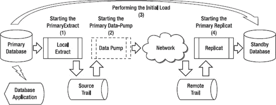

图 12-2. 灾难恢复复制设置，第 1 部分

这些步骤与我们在 第 4 章 中介绍的基本 `单向复制` 设置类似。

第 1 部分包括设置从 `主数据库` 到 `备用数据库` 复制的前四个步骤。这四个步骤包括初始加载数据，以及在初始加载后保持数据同步。由于我们已经在 第 4 章 中介绍了这些步骤和概念，此处不再重复。在本章接下来的部分中，我们将提供 `GoldenGate 参数文件`，并且仅在适用的情况下解释灾难恢复的新概念。

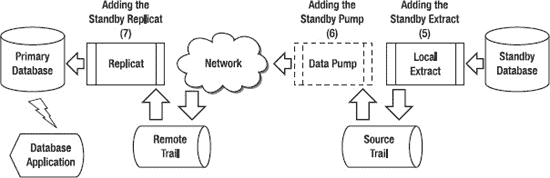

图 12-3. 灾难恢复反向复制设置，第 2 部分

第 2 部分，如 图 12-3 所示，包括最后三个步骤，用于配置从 `备用数据库` 回到 `主数据库` 的复制（如果需要）。你将配置但不启动从 `备用数据库` 到 `主数据库` 的复制。设置从 `备用数据库` 到 `主数据库` 复制的三个步骤包括设置和配置 `本地 Extract`、`数据泵 Extract` 和 `Replicat`。这些 `Extracts` 和 `Replicat` 将在后续的切换和故障切换场景中使用。图 12-3 中的步骤描述如下：

1.  添加 `备用 Extract`。配置并添加 `备用 Extract`，为在切换或故障切换事件中捕获数据库更改做好准备。如果发生停机，`备用本地 Extract` 将已就位并准备好开始捕获更改。
2.  添加 `备用数据泵 Extract`。配置并添加 `备用数据泵`，为在 `主数据库` 发生停机事件时捕获来自 `备用数据库` 的更改做好准备。
3.  添加 `备用 Replicat`。配置并添加 `备用 Replicat`，为在发生停机时开始将更改应用回 `主数据库` 做好准备。

让我们从下一节配置 `本地 Extract` 开始，逐一了解每个灾难恢复复制步骤。


## 配置用于灾难恢复的本地抽取

让我们开始配置本地抽取。为此，您首先需要为抽取创建一个参数文件。请记住，我们正在配置本地抽取以捕获主数据库 HR 方案的所有 SQL DML 更改，以复制到备用数据库 HR 方案。我们将保持数据库数据的精确副本同步，以便用于切换或故障转移。

让我们看一下主服务器上本地抽取的参数，如下例所示。由于我们在之前的章节中使用了 LHREMD1，让我们将灾难恢复本地抽取命名为 LHREMP2。

```
GGSCI (primaryserver) 1> edit params LHREMP2

Extract LHREMP2
-------------------------------------------------------------------
-- Local extract for HR schema
-------------------------------------------------------------------

USERID GGER, PASSWORD userpw

ExtTrail dirdat/l3

ReportCount Every 10000 Records, Rate
Report at 00:30

DiscardFile dirrpt/LHREMP2.dsc, Append
DiscardRollover at 02:00

Table HR.*;
```

这些参数看起来应该很熟悉，因为我们在第 4 章和第 5 章中已经介绍过。下一步是将抽取添加到 GoldenGate 配置中。您应该选择一个新的未使用的跟踪文件名。在此示例中，您可以使用跟踪文件`l3`作为本地抽取的跟踪文件，因为跟踪文件`l1`和`l2`已在之前的示例中使用。您可以使用以下来自 GGSCI 的命令添加抽取：

```
GGSCI (primaryserver) > ADD EXTRACT LHREMP2, TRANLOG, BEGIN NOW
GGSCI (primaryserver) > ADD EXTTRAIL dirdat/l3, EXTRACT LHREMP2, MEGABYTES 100
```

添加抽取后，您需要启动它以开始捕获更改，如下例所示：

```
GGSCI (primaryserver) > START EXTRACT LHREMP2
```

启动后，您应确保抽取正常运行。如果看到`STOPPED`或`ABENDED`状态，则可能存在问题。如果正在处理数据，您应该看到`RUNNING`状态和不断增长的`RBA`值。您可以使用`INFO`命令并验证本地抽取`LHREMP2`的状态：

```
GGSCI (primaryserver) 2> INFO EXTRACT LHREMP2
```

如果抽取未运行，您可以查看 GoldenGate 错误日志文件并尝试解决问题。您还应该运行如下的`stats`命令（针对`LHREMP2`）：

```
GGSCI (primaryserver) 2> STATS EXT LHREMP2
```

您现在已经完成了本地抽取的启动，让我们进入下一步：启动数据泵抽取。

### 配置用于灾难恢复的数据泵

现在本地抽取已启动，您可以继续配置、添加和启动用于灾难恢复的数据泵。在我们的示例中，您将配置数据泵以读取由名为`LHREMP2`的本地抽取写出的`l3`跟踪文件，并通过 TCP/IP 网络将其泵送到目标备用服务器的`l4`跟踪文件，以供复制进程处理。灾难恢复的一个考虑是，您可能会将跟踪文件长距离发送到远程备用站点。您应验证您是否有足够的网络容量和性能来支持您的 GoldenGate 灾难恢复网络需求。如果需要，您可以调整 GoldenGate 的网络参数，我们在第 7 章中回顾过这些参数。

从 GGSCI 开始，让我们编辑数据泵的参数，如下例所示：

```
GGSCI (primaryserver) 1> edit params PHREMP2

Extract PHREMP2
-------------------------------------------------------------------
-- Data-pump Extract for HR schema
-------------------------------------------------------------------

PassThru

ReportCount Every 10000 Records, Rate
Report at 00:30

DiscardFile dirrpt/PHREMP2.dsc, Append
DiscardRollover at 02:00

RmtHost standbyserver, MgrPort 7809
RmtTrail dirdat/l4

Table HR.* ;
```

现在您已经设置了灾难恢复数据泵抽取的配置参数，下一步是在主服务器上添加数据泵抽取组。您可以使用以下示例中的命令来完成此操作：

```
GGSCI (primaryserver) > ADD EXTRACT PHREMP2, EXTTRAILSOURCE dirdat/l3
GGSCI (primaryserver) > ADD RMTTRAIL dirdat/l4, EXTRACT PHREMP2, MEGABYTES 100
```

添加数据泵抽取后，您可以启动它以开始处理源跟踪文件中的记录，如下例所示：

```
GGSCI (primaryserver) > START EXTRACT PHREMP2
```

一旦数据泵抽取启动，您可以使用与本地抽取相同的`INFO EXTRACT`命令来验证其是否正在运行。您还应该在数据泵抽取上运行`STATS`命令以确保它正在处理更改。

现在，用于灾难恢复的本地抽取和数据泵抽取都已启动，您可以开始初始数据加载。您在第 4 章中学习了初始加载数据的不同方法。这些方法同样适用于灾难恢复复制的初始数据加载。您可以使用 GoldenGate 本身或 DBMS 供应商的加载实用程序来进行初始数据加载。有关初始加载过程的更多详细信息，请参阅第 4 章。


### 配置用于灾难恢复的 Replicat

初始数据加载完成后，你可以启动 Replicat，以应用在加载运行期间由 Extract 捕获的变更。如果需要，可以启用 `HANDLECOLLISIONS` 参数来解决因数据缺失或重复而导致的任何错误。Replicat 需要一些时间才能赶上并应用加载期间所做的所有变更，特别是对于更改量大、加载时间长的大型数据库。

一旦 Replicat 应用了所有初始数据加载变更，并且没有 GoldenGate 延迟，主数据库和备用数据库将完全同步。此时，本地 Extract、数据泵 Extract 和 Replicat 可以继续运行，并通过持续的变更保持数据库的实时同步。

在开始配置 Replicat 之前，你应该返回并再次确认目标备用服务器上的 GoldenGate 先决条件已满足。我们在本章开头的“先决条件”一节中已介绍过这些条件。确认先决条件满足后，我们就可以开始配置 Replicat 了。请记住，你正在配置 Replicat，以根据我们的灾难恢复要求，应用来自 `HR` 模式的所有 DML 变更，以复制所有数据。如果你想在此处过滤或转换数据，也可以通过添加相应的参数来实现。

既然你之前已经使用了 `RHREMP1` 作为 Replicat 名称，现在你可以将这个 Replicat 命名为 `RHREMP2`。让我们从查看备用服务器上 `RHREMP2` 的 Replicat 参数开始。

```
GGSCI (standbyserver) 1> edit params RHREMP2
Replicat RHREMP2
-------------------------------------------------------------------
-- Replicat for HR Schema
-------------------------------------------------------------------
USERID GGER, PASSWORD userpw
ReportCount Every 10000 Records, Rate
Report at 00:30
DiscardFile dirrpt/RHREMP2.dsc, Append
DiscardRollover at 02:00
-- HandleCollisions should be turned off after the initial load synchronization.
HandleCollisions
AssumeTargetDefs
Map HR.*, Target HR.* ;
```

现在你已经设置好 Replicat 的配置参数，下一步是添加 Replicat 组。在以下示例中，你将 `RHREMP2` replicat 添加到 GoldenGate 配置中。该 Replicat 将处理由灾难恢复数据泵泵送过来的 `l4` 跟踪文件。

```
GGSCI (standbyserver) > ADD REPLICAT RHREMP2, EXTTRAIL dirdat/l4
```

现在让我们启动 `RHREMP2` replicat。

```
GGSCI (standbyserver) > START REPLICAT RHREMP2
```

Replicat 启动后，你可以使用 `INFO REPLICAT` 命令验证其是否正在运行。你应该看到状态为 `RUNNING`。如果看到状态为 `STOPPED` 或 `ABENDED`，则可能存在问题。

让我们对我们的 Replicat `RHREMP1` 执行一个 `INFO` 命令来检查状态，如下所示：

```
GGSCI (standbyserver) 2> INFO REPLICAT RHREMP2
```

你还应该在 Replicat 上运行 `STATS` 命令，以确保它正在处理变更，如下例所示，针对 Replicat `RHREMP2`：

```
GGSCI (standbyserver) 2> STATS REP RHREMP2
```

接下来，让我们添加用于从备用数据库复制回主数据库的 GoldenGate 进程。

### 配置备用 Extract

一旦你的灾难恢复复制的第一部分完成，并且你已成功地从主数据库复制到备用数据库，下一部分就是添加备用 Extract。备用 Extract 与主 Extract 类似，只是它将在需要时用于提取数据，以从备用数据库复制回主数据库。目前你只是在 `添加` 这个 Extract。稍后你将在切换和故障转移活动中 `启动` 它。

让我们从配置备用本地 Extract 的参数文件开始。在我们的示例中，你将配置本地 Extract，以捕获备用数据库上示例 `HR` 模式的所有 SQL DML 变更。既然你已经使用了跟踪文件 `l3` 和 `l4`，让我们使用 `l5` 和 `l6` 来进行从备用数据库回主数据库的复制。

让我们首先查看备用服务器上本地 Extract 的参数。

```
GGSCI (standbyserver) 1> edit params LHREMP3
Extract LHREMP3
-------------------------------------------------------------------
-- Local extract for HR schema
-------------------------------------------------------------------
USERID GGER, PASSWORD userpw
ExtTrail dirdat/l5
ReportCount Every 10000 Records, Rate
Report at 00:30
DiscardFile dirrpt/LHREMP3.dsc, Append
DiscardRollover at 02:00
Table HR.*;
```

接下来，你将把备用 Extract 添加到 GoldenGate 配置中，以便稍后在数据库切换或故障转移时准备好启动它。你可以使用以下 `GGSCI` 命令来完成此操作：

```
GGSCI (standbyserver) > ADD EXTRACT LHREMP3, TRANLOG, BEGIN NOW
GGSCI (standbyserver) > ADD EXTTRAIL dirdat/l5, EXTRACT LHREMP3, MEGABYTES 100
```

接下来，让我们配置备用数据泵。

### 配置备用数据泵

现在备用本地 Extract 已添加，你可以继续配置和添加备用数据泵。备用数据泵与主数据泵类似，只是它将在需要时用于将跟踪文件从备用数据库泵送回主数据库。在我们的示例中，你将配置数据泵，以读取由名为 `LHREMP3` 的备用本地 Extract 写入的 `l5` 跟踪文件，并通过 TCP/IP 网络将其泵送到目标服务器，由备用 Replicat 进行处理。

从 `GGSCI` 开始，让我们如本示例所示编辑数据泵的参数。

```
GGSCI (standbyserver) 1> edit params PHREMP3
Extract PHREMP3
-------------------------------------------------------------------
-- Data-pump Extract for HR schema
-------------------------------------------------------------------
PassThru
ReportCount Every 10000 Records, Rate
Report at 00:30
DiscardFile dirrpt/PHREMP3.dsc, Append
DiscardRollover at 02:00
RmtHost standbyserver, MgrPort 7809
RmtTrail dirdat/l6
Table HR.* ;
```

既然你已经在第 4 章和第 5 章中回顾过这些参数，让我们继续添加数据泵。你可以使用以下示例中的命令添加数据泵 Extract。

```
GGSCI (standbyserver) > ADD EXTRACT PHREMP3, EXTTRAILSOURCE dirdat/l5
GGSCI (standbyserver) > ADD RMTTRAIL dirdat/l6, EXTRACT PHREMP3, MEGABYTES 100
```

你暂时不会启动数据泵，所以让我们继续配置备用 Replicat。


#### 配置备用复制进程

接下来，你应该添加一个备用复制进程，它将在发生故障切换或计划切换后，随时准备将任何更改应用回你的主数据库。这与主复制进程类似，但将用于从备用数据库复制回主数据库。通过现在提前添加它，你将在发生中断时做好启动它的准备。

首先，为复制进程 `RHREMP3` 创建一个参数文件，如下例所示：

```
GGSCI (primaryserver) 1> edit params RHREMP3

Replicat RHREMP3
-------------------------------------------------------------------
-- 用于 HR 模式的复制进程
-------------------------------------------------------------------

USERID GGER, PASSWORD userpw

ReportCount Every 10000 Records, Rate
Report at 00:30

DiscardFile dirrpt/RHREMP3.dsc, Append
DiscardRollover at 02:00

-- 在初始加载同步完成后，应关闭 HandleCollisions。
HandleCollisions

AssumeTargetDefs

Map HR.*, Target HR.* ;
```

下一步是添加备用复制进程组。在以下示例中，你将把 `RHREMP3` 复制进程添加到 GoldenGate 配置中。

```
GGSCI (primaryserver) > ADD REPLICAT RHREMP3, EXTTRAIL dirdat/l6
```

请记住，在发生计划切换或故障切换之前，你不会启动这个备用复制进程。至此，你已完成灾难恢复复制的初始设置。你目前完成的所有步骤都是为潜在的切换或故障切换情况做准备。你现在已准备好执行计划内的切换或意外的故障切换到你的备用数据库。

### 执行计划切换

尽管你正在为环境准备一个完整的意外灾难恢复场景，但在许多情况下，你可能需要因计划内停机而关闭主数据库。使用 GoldenGate 复制，你可以将这些计划内停机时间缩减到最低限度，只需将应用程序从主数据库切换到备用数据库，且在此过程中不会丢失任何数据。在主数据库因维护而停机时，你可以让应用程序继续处理备用数据库上的事务，并在维护完成后切换回主数据库。

在我们的示例中，假设你需要为应用数据库软件补丁，这通常需要四小时的停机时间。现在，让我们使用 GoldenGate 复制来执行这些步骤，并尽量缩短应用程序的停机窗口。为简单起见，我们将计划切换步骤分为五个部分，每部分包含若干步骤。让我们从第一部分开始，如图 12-4 所示。

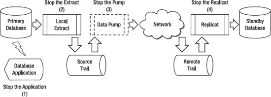

**图 12-4.** 灾难恢复计划切换，第一部分

以下是图 12-4 所示第一部分各步骤的说明。

1.  停止连接到主数据库的应用程序。
2.  确认没有延迟后，停止本地抽取进程，如下例所示：
    ```
    GGSCI (primaryserver) > LAG EXTRACT LHREMD2
    Sending GETLAG request to EXTRACT LHREMD2 ...
    Last record lag: 10 seconds.
    At EOF, no more records to process.

    GGSCI (primaryserver) > STOP EXTRACT LHREMD2
    ```
3.  确认没有延迟后，停止数据泵抽取进程，如下例所示：
    ```
    GGSCI (primaryserver) > LAG EXTRACT PHREMD2
    Sending GETLAG request to EXTRACT PHREMD2 ...
    Last record lag: 6 seconds.
    At EOF, no more records to process.

    GGSCI (primaryserver) > STOP EXTRACT PHREMD2
    ```
4.  确认没有更多记录需要处理后，停止复制进程，如下例所示：
    ```
    GGSCI (standbyserver) > LAG REPLICAT RHREMD2
    Sending GETLAG request to REPLICAT RHREMD2 ...
    Last record lag: 7 seconds.
    At EOF, no more records to process.

    GGSCI (standbyserver) > STOP REPLICAT RHREMD2
    ```

现在你已经完成了切换过程的第一部分。应用程序不再使用主数据库，并且从主数据库到备用数据库的复制已停止。现在你可以进行第二部分，如图 12-4 所示，启动备用抽取进程并将应用程序切换到使用备用数据库。

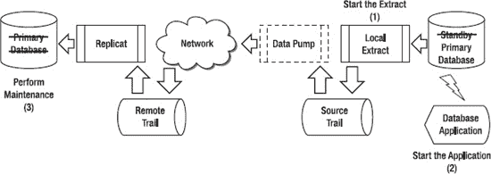

**图 12-5.** 灾难恢复计划切换第二部分

以下是图 12-5 所示第二部分各步骤的说明。

1.  为准备应用程序切换，开始捕获更改，修改备用数据库的本地抽取进程以从现在开始捕获更改，然后如下启动它：
    ```
    GGSCI (standbyserver) > ALTER EXTRACT LHREMD3, BEGIN NOW
    GGSCI (standbyserver) > START EXTRACT LHREMD3
    ```
2.  为应用程序准备备用数据库，并启动连接到备用数据库的应用程序。作为准备，你可能需要在备用数据库上为你的应用程序用户授予一些 SQL 权限。同时记得启用你可能在备用数据库作为复制目标时已禁用的任何触发器或级联删除约束。
3.  此时，你应该在没有任何应用程序连接的情况下，在主数据库上执行所需的任何维护。在示例中，我们将关闭主数据库并应用数据库补丁。


完成第二部分后，您应已完成数据库维护，并准备好将数据库切换回其原始配置。为此，您必须将在备用数据库作为主数据库运行期间对其所做的任何更改，应用回原始主数据库。这些步骤如图 12-6 所示。

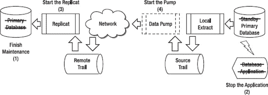

**图 12-6.** 灾难恢复计划切换，第三部分

## 第三部分

现在让我们回顾第三部分的各个步骤，如图 12-6 所示。

### 步骤说明

1.  首先，您需要完成主数据库上的任何维护活动。在维护成功完成之前，备用数据库将充当主数据库。在处理来自备用数据库的 GoldenGate 更改之前，请务必禁用主数据库上的任何触发器或级联删除约束。
2.  停止针对备用数据库运行的应用程序。此时请确保保持`Local Extract`运行，以便它能捕获任何剩余的数据库事务。
3.  在主数据库上启动`Replicat`，准备处理在备用数据库上进行的更改，如下例所示：
    ```
    GGSCI (primaryserver) > START REPLICAT RHREMD3
    ```
4.  在备用数据库上启动数据泵`Extract`，以发送更改事务供主数据库上的`Replicat`处理，如下例所示：
    ```
    GGSCI (standbyserver) > START EXTRACT PHREMD3
    ```

在第三部分中，您完成了数据库维护，然后处理了在备用数据库充当主数据库期间对其所做的所有更改。接下来，您需要在第四部分中关闭从备用数据库到主数据库的复制，如图 12-7 所示。

## 第四部分

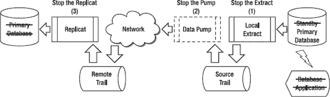

**图 12-7.** 灾难恢复计划切换，第四部分

以下是图 12-7 中第四部分各步骤的说明。

### 步骤说明

1.  验证没有延迟后，停止备用数据库上的`Local Extract`，如下例所示：
    ```
    GGSCI (standbyserver) > LAG EXTRACT LHREMD3
    Sending GETLAG request to EXTRACT LHREMD3 ...
    Last record lag: 5 seconds.
    At EOF, no more records to process.
    GGSCI (standbyserver) > STOP EXTRACT LHREMD3
    ```
2.  验证没有延迟后，停止备用数据库上的数据泵`Extract`，如下例所示：
    ```
    GGSCI (standbyserver) > LAG EXTRACT PHREMD3
    Sending GETLAG request to EXTRACT PHREMD3 ...
    Last record lag: 4 seconds.
    At EOF, no more records to process.
    GGSCI (standbyserver) > STOP EXTRACT PHREMD3
    ```
3.  验证没有更多记录需要处理后，停止主数据库上的`Replicat`，如下例所示：
    ```
    GGSCI (primaryserver) > LAG REPLICAT RHREMD3
    Sending GETLAG request to REPLICAT RHREMD3 ...
    Last record lag: 6 seconds.
    At EOF, no more records to process.
    GGSCI (primaryserver) > STOP REPLICAT RHREMD3
    ```

现在，从备用数据库到主数据库的复制已完成并停止，您可以继续在第五部分中重新启动从主数据库到备用数据库的原始复制，如图 12-8 所示。

## 第五部分

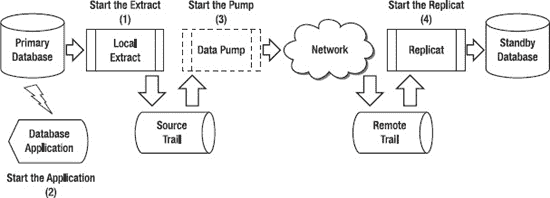

**图 12-8.** 灾难恢复计划切换，第五部分

第五部分的步骤，如图 12-8 所示，如下：

### 步骤说明

1.  为了开始捕获更改，为应用程序切换回主数据库做准备，请修改主数据库的`Local Extract`，使其从*现在*开始捕获更改，然后启动`Extract`，如下所示：
    ```
    GGSCI (primaryserver) > ALTER EXTRACT LHREMD2, BEGIN NOW
    GGSCI (primaryserver) > START EXTRACT LHREMD2
    ```
2.  为主数据库准备应用程序，并启动连接到主数据库的应用程序。在准备过程中，您可能需要向应用程序用户授予一些 SQL 权限。同时，请记住启用在主数据库作为复制目标时可能已停止的任何触发器或级联删除约束。
3.  在主数据库上启动数据泵`Extract`，如下例所示：
    ```
    GGSCI (primaryserver) > START EXTRACT PHREMD2
    ```
4.  在备用数据库上启动`Replicat`，如下例所示：
    ```
    GGSCI (standbyserver) > START REPLICAT RHREMD2
    ```

现在，您已完成复制切换过程的第五部分，数据库已恢复其原始配置。因此，您已将应用程序的停机时间从四小时降至将应用程序切换到备用数据库及其切回所需的最小时间。接下来，让我们介绍使用我们的灾难恢复复制来执行计划外故障切换的不同场景。


### 执行计划外故障转移

在计划外故障转移场景中，您会因灾难而丢失整个主数据库服务器。灾难发生后，您可以使用 GoldenGate 将最后的数据库事务应用到备用数据库，使其数据保持最新，然后应用程序可以使用该备用数据库，直到主数据库被修复并重新上线。一旦主数据库重新上线，您将需要执行一些步骤来将其与备用数据库重新同步。

在我们的示例中，假设您遭遇了灾难，主数据库服务器被毁。一台新的主数据库服务器正在供应商途中，预计将在 24 小时内交付并投入运行。在此之前，您将使用备用服务器作为主数据库服务器。让我们逐步介绍使用 GoldenGate 复制从主数据库故障转移到备用数据库的步骤。之后，您将逐步执行在新主数据库服务器安装并运行后回退的步骤。再次说明，为简单起见，我们将计划外故障转移步骤分为五个部分，每部分包含若干步骤。让我们从第 1 部分开始，如 图 12-4 所示。

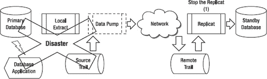

*图 12-9. 灾难恢复计划外故障转移，第 1 部分*

以下是 图 12-9 中所示第 1 部分步骤的说明。

1.  确认没有延迟后，停止 `Replicat`，如下例所示：
    ```
    GGSCI (standbyserver) > LAG REPLICAT RHREMD2
    Sending GETLAG request to REPLICAT RHREMD2 ...
    Last record lag: 7 seconds.
    At EOF, no more records to process.
    GGSCI (standbyserver) > STOP REPLICAT RHREMD2
    ```

现在，您已完成故障转移过程的第 1 部分。备用数据库已同步了主数据库的所有可用更改。现在您可以继续第 2 部分，启动备用数据库的 Extract 并将应用程序切换为使用备用数据库，如 图 12-10 所示。

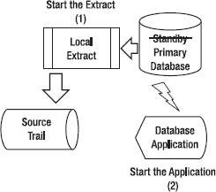

*图 12-10. 灾难恢复计划外故障转移，第 2 部分*

接下来，我们回顾一下 图 12-10 中的第 2 部分步骤。

1.  为准备应用程序切换，修改备用数据库的本地 Extract 以开始*立即*捕获更改，然后启动它，如下所示：
    ```
    GGSCI (standbyserver) > ALTER EXTRACT LHREMD3, BEGIN NOW
    GGSCI (standbyserver) > START EXTRACT LHREMD3
    ```
2.  为应用程序准备备用数据库，并启动连接到备用数据库的应用程序。在准备过程中，您可能需要为您的应用程序用户授予一些 SQL 权限。同时，请记住启用您可能在备用数据库作为复制目标时停止的任何触发器或级联删除约束。

完成第 2 部分后，您就已完成到备用数据库的故障转移，用户可以继续使用备用数据库进行正常处理。对备用数据库所做的任何数据库 DML 更改，都将累积在备用服务器上的 GoldenGate 源跟踪文件中，直到主数据库被修复或更换并重新上线。

一旦主数据库服务器被修复或更换并重新上线，您就可以开始过程的第 3 部分，将应用程序和用户移回主数据库。此过程的前几个步骤如 图 12-11 所示。

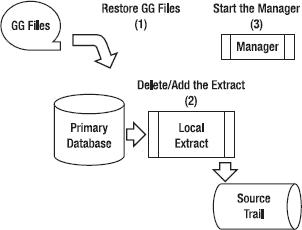

*图 12-11. 灾难恢复计划外故障转移，第 3 部分*

以下是 图 12-11 中第 3 部分步骤的说明。

1.  从离线服务器备份中恢复 GoldenGate 软件目录和文件。
2.  删除本地 Extract 和源跟踪文件，然后重新添加本地 Extract，如下例所示。暂时不要启动本地 Extract。
    ```
    GGSCI (primaryserver) > DELETE EXTRACT LHREMD2
    GGSCI (primaryserver) > DELETE EXTTRAIL dirdat/l3

    GGSCI (primaryserver) > ADD EXTRACT LHREMP2, TRANLOG, BEGIN NOW
    GGSCI (primaryserver) > ADD EXTTRAIL dirdat/l3, EXTRACT LHREMP2, MEGABYTES 100
    ```
    删除本地 Extract 和跟踪文件会重新初始化它们，以便您可以重新开始提取更改。`delete exttrail` 命令仅删除 GoldenGate 检查点，因此您可能还需要使用操作系统命令删除操作系统目录中遗留的跟踪文件，以避免任何冲突。
3.  启动 GoldenGate Manager，如下例所示：
    ```
    GGSCI (primaryserver) > START MANAGER
    ```

现在，您已恢复 GoldenGate 文件并在主数据库上准备好了 GoldenGate 本地 Extract，可以开始第 4 部分了。接下来是从备用数据库重新同步主数据库，如 图 12-12 所示。

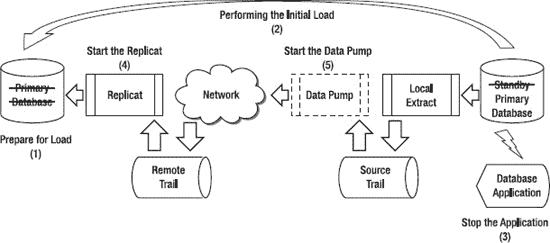

*图 12-12. 灾难恢复计划外故障转移，第 4 部分*

图 12-12 的第 4 部分步骤说明如下。

1.  禁用主数据库上的任何触发器或级联删除约束。
2.  从备用数据库向主数据库执行初始数据加载。此步骤可以在备用数据库运行时以“热”模式完成，因为 GoldenGate Extract 将捕获加载期间发生的任何 DML 更改。
3.  从备用数据库到主数据库的初始加载完成后，停止在备用数据库上运行的应用程序。此时，请务必保持备用数据库上的本地 Extract 运行，以便它能捕获剩余的数据库事务。
4.  在主数据库上启动 `Replicat`，以准备处理在备用数据库上所做的更改，如下例所示：
    ```
    GGSCI (primaryserver) > START REPLICAT RHREMD3
    ```
5.  启动数据泵 Extract 以发送数据库更改事务供 Replicat 处理。一旦复制完成且延迟显示为“At EOF, no more records to process”，您就可以停止 Extract 和 Replicat，如下例所示：
    ```
    GGSCI (standbyserver) > START EXTRACT PHREMD3

    GGSCI (primaryserver) > LAG REPLICAT RHREMD3
    Sending GETLAG request to REPLICAT RHREMD3 ...
    Last record lag: 6 seconds.
    At EOF, no more records to process.
    GGSCI (primaryserver) > STOP REPLICAT RHREMD3

    GGSCI (standbyserver) > STOP EXTRACT LHREMD3
    GGSCI (standbyserver) > STOP EXTRACT PHREMD3
    ```

 **注意** 完成主备数据库同步后，应执行数据验证。您可以使用 SQL 查询手动检查行数和选定的数据值，也可以使用自动化工具，如 `Oracle GoldenGate Veridata`。有关 `Veridata` 的更多信息，请参阅 第 9 章。

最后一步是将用户和应用程序移回主数据库，并重启从主数据库到辅助数据库的原始复制配置。让我们回顾第 5 部分的这些步骤，如 图 12-13 所示。


*图 12-13. 灾难恢复计划外故障转移，第 5 部分*

以下是 图 12-13 中所示第 5 部分步骤的说明。


1.  为了开始捕获更改，为应用程序切换回主数据库做准备，更改主数据库的本地提取（Local Extract），从*现在*开始捕获更改，然后按如下方式启动提取（Extract）：
    `GGSCI (primaryserver) > ALTER EXTRACT LHREMD2, BEGIN NOW`
    `GGSCI (primaryserver) > START EXTRACT LHREMD2`
2.  准备好主数据库以供应用程序使用，并启动连接到主数据库的应用程序。在准备过程中，您可能需要向应用程序用户授予一些 SQL 权限。同时，请记住启用您可能在主数据库作为复制目标时停止的任何触发器或级联删除约束。
3.  在主数据库上启动数据泵提取（data-pump Extract），如下例所示：
    `GGSCI (primaryserver) > START EXTRACT PHREMD2`
4.  在备用数据库上启动复制（Replicat），如下例所示：
    `GGSCI (standbyserver) > START REPLICAT RHREMD2`

现在您已完成计划外故障切换过程的第 5 部分，数据库已恢复到其原始配置。备用数据库现已同步，并准备好进行下一次切换或故障转移。

### 总结

在本章中，我们介绍了如何为灾难恢复目的设置和配置 GoldenGate 复制。我们展示了如何配置 GoldenGate 以支持计划内的切换场景，从而在数据库维护期间最小化应用程序停机时间窗口。我们还展示了如何配置 GoldenGate 以在计划外灾难期间故障转移到备用数据库并返回到主数据库。如果您想获取有关使用 GoldenGate 维护备用数据库的更多信息，也可以参考 `GoldenGate Windows and UNIX Administrator's Guide`。在下一章中，我们将介绍 GoldenGate 的另一个特定用途：零停机时间迁移和升级。

## 第 13 章

### 零停机时间迁移复制

如今，许多 IT 组织因无法忍受迁移到新软件版本和硬件平台所带来的停机时间，而长期被困在旧的软件版本和旧的数据库硬件平台上。即使对于繁忙的在线网站，计划内的数据库停机也可能导致收入损失并激怒客户。Oracle GoldenGate 可以通过提供一种方法来帮助应对这些挑战，即提前实施新的、升级后的数据库平台，并使其准备好供应用程序切换使用。所需的唯一停机时间是应用程序切换并重新连接到新目标数据库所需的时间。此外，通过从新的升级后的目标复制回旧的源数据库，Oracle GoldenGate 可以提供一种方法，以便在迁移出现问题时轻松回退到旧数据库。另外，Oracle GoldenGate 的优势在于可以在许多不同的异构数据库和硬件平台上工作。例如，您可以使用 Oracle GoldenGate 将数据从 NonStop SQL/MX 迁移到 Red Hat Linux 上最新版本的 Oracle 数据库。使用 Oracle GoldenGate，您可以开发标准的零停机时间数据库迁移流程，并在整个组织中实施它们，无论使用的是何种特定的 DBMS 或平台。

本章介绍了 Oracle GoldenGate 复制的另一种应用，即实现用于零停机时间迁移目的的特定复制配置。本章涵盖为零停机时间迁移设置和配置 Oracle GoldenGate 复制。它涵盖了如何处理切换到新数据库以及如果出现问题时从新数据库回退到旧数据库。本章将您正在迁移自的数据库称为`旧数据库`，将您正在迁移至的数据库称为`新数据库`。

### 先决条件

在开始设置零停机时间迁移复制之前，您需要满足以下先决条件：

*   按照第 2 章中的描述，在源和目标服务器上安装 Oracle GoldenGate 软件。
*   在源和目标数据库上创建 Oracle GoldenGate 数据库用户 ID。
*   目标数据库服务器的服务器名称或 IP 地址。
*   Oracle GoldenGate 管理器进程在源端和目标端启动并运行。
*   从源服务器到目标服务器的 Oracle GoldenGate 管理器端口以及反向的 TCP/IP 网络连接是开放的。
*   理解计划迁移的业务和技术复制需求。

对于零停机时间迁移复制，还有一些额外的重要先决条件：

*   在源和目标服务器上备份您的 Oracle GoldenGate 软件和工作目录。
*   用于在切换或回退过程中授予应用程序所需的任何必要对象权限的 SQL 脚本。
*   用于将您的应用程序和用户从旧数据库移动到新数据库以及再移回的流程和脚本。

让我们首先回顾零停机时间迁移复制的需求。


### 需求

在开始配置复制之前，你必须透彻理解驱动此次零停机迁移复制技术设计的具体需求。以下列出了一些典型需求。需要提醒的是，本节将你正在迁移的源数据库称为 `旧数据库`，将你迁移到的目标数据库称为 `新数据库`。

你需要确保能够使用 `Oracle GoldenGate` 零停机迁移复制来满足这些需求：

*   保持你正在迁移的 `旧数据库` 与 `新数据库` 同步。迁移切换后，继续保持 `旧数据库` 同步一段时间，直到你确定不会再回退到 `旧数据库`。
*   `旧数据库` 在迁移切换前将一直主动处理 SQL 变更。通常，切换发生在计划的周末维护窗口期间，或网站/应用的低流量时段。
*   在迁移切换前的这段时间里，`新数据库` 可根据需要用于只读查询。尽管 `Oracle GoldenGate` 的 `双向复制` 功能支持此操作，但通常 `新数据库` 中的数据在切换前不会被更新。如果你的项目需求是在切换前更新 `新数据库` 中的数据，则需要配置 `双向复制` 以保持两个数据库同步。
*   `旧数据库` 中的数据库数据和结构可以与 `新数据库` 不同。这取决于迁移的类型和复杂度。例如，如果你是从 `SQL Server` 数据库迁移到 `Oracle` 数据库，某些特定的数据类型或结构可能需要更改。如果你只是从 `Oracle 10g` 迁移到 `Oracle 11g` 数据库，你的应用数据和数据结构可能完全相同。你也可能使用 `Oracle GoldenGate` 将其他类型的应用程序从旧版本迁移到新版本，在这些情况下，数据结构可能会有所不同。
*   `旧数据库` 中的数据必须与 `新数据库` 保持最新，并且在切换或回退时不应存在复制延迟。在切换或回退之前可以容忍一定的延迟，但该延迟必须在应用切换或回退之前最终消除。切换时存在的任何复制延迟都可能导致延迟。
*   切换到 `新数据库` 以及从 `新数据库` 回退到 `旧数据库` 的操作必须快速进行，以最大限度地减少任何停机时间。请记住，`Oracle GoldenGate` 只是整个迁移项目中的一环，你需要为迁移项目的所有部分（例如切换应用程序连接）准备好经过测试的流程。
*   切换到 `新数据库` 后，数据库角色将发生逆转，`新数据库` 成为复制源，`旧数据库` 成为目标。这允许在需要时迁移回退到 `旧数据库`。
*   应充分理解允许执行切换和回退流程的时间窗口。例如，一个两小时的切换和回退窗口与允许整个周末进行切换相比，需求差异很大。

现在你已经了解了复制需求，接下来让我们回顾一下零停机迁移拓扑。

### 零停机迁移拓扑

零停机迁移的基础拓扑是 `单向复制`，并针对零停机迁移做了一些改动，如 `图 13-1` 所示。`第 3 章` “架构” 介绍了 `单向复制` 的概念。`单向复制` 是最简单的拓扑结构，常用于报告或查询卸载目的。在本章中，`单向复制` 拓扑被用于零停机迁移目的。数据在单一时间点上从单个源数据库复制到单个目标数据库，且方向唯一。数据库数据的更改仅在源数据库进行，然后复制到目标数据库。源数据库是迁移前你正在迁移的 `旧数据库`。切换到 `新数据库` 后，复制方向将反转，数据从 `新数据库` 复制回 `旧数据库`，以允许迁移回退。这种反向复制可以根据需要持续保持。一旦你确定将停留在 `新数据库` 且不再需要回退，就可以关闭反向复制。通常这个周期是几天到几周，但也可以根据需要延长。

为了满足上一节介绍的零停机迁移需求，你必须确保能够快速准确地将应用活动从 `旧数据库` 切换到 `新数据库`，并能再切换回来。此外，如果因出现问题需要从迁移中回退，你必须能够从 `新数据库` 复制回 `旧数据库`。`图 13-1` 中用一条虚线箭头标示了这一点。

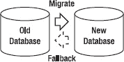

`图 13-1. 零停机迁移复制拓扑`

现在让我们看看如何使用 `Oracle GoldenGate` 来实现这些复制需求和拓扑。


### 设置

一旦前提条件完成，零停机迁移复制的设置可以分为两个部分共七个步骤来完成，如图 13-2 和 13-3 所示。这些步骤与第 4 章（Chapter 4）中介绍的基本单向复制设置类似。第一部分包括前四个步骤，用于设置从旧数据库到新数据库的复制。这些步骤包括初始数据加载，以及在初始加载后保持数据同步。第二部分包括最后三个步骤，用于配置从新数据库返回旧数据库的复制，以备回退时使用。由于第 4 章（Chapter 4）已经介绍了 Oracle GoldenGate 参数文件，本节仅根据需要解释新概念。

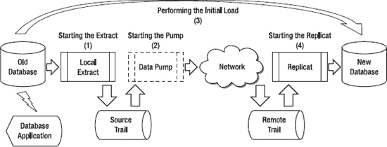

*图 13-2.* 零停机迁移复制设置，第一部分

该示例将`PAYROLL`数据库迁移到新的数据库软件版本。在 Oracle GoldenGate 参数文件中，你可以使用`PR`缩写来表示薪资应用。此外，有两个表包含无需迁移的数据，因此你需要将它们从复制中排除。该示例可适用于许多不同的具体迁移场景，例如从 Sun Solaris 平台上的 Oracle 9i 数据库迁移到 Red Hat Linux 平台上的 Oracle 11g 数据库。请记住，无论你迁移的是什么数据库或应用，其概念和步骤都与此示例类似。如果你在迁移异构数据库或进行复杂的应用迁移，情况可能会变得更加复杂。在这种情况下，你可能需要更复杂的 Oracle GoldenGate 映射或转换过滤器和参数，但总体流程是相同的。如前面章节所示，Oracle GoldenGate 可以处理这些映射和转换。由于第 4 章（Chapter 4）已经详细介绍了步骤 1-4，让我们继续看第二部分的详细步骤。

在初始设置的第二部分中，你需要配置但不启动从新数据库返回旧数据库的复制，如图 13-3（Figure 13-3）所示。这些步骤对于在需要时设置迁移回退复制是必要的。这三个步骤包括设置和配置本地抽取（Local Extract）、数据泵抽取（data-pump Extract）和复制（Replicat）。这些抽取和复制将用于后续的回退场景。

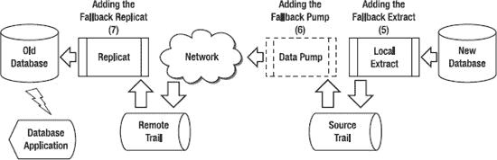

*图 13-3.* 零停机迁移复制设置，第二部分

以下是图 13-3（Figure 13-3）中所示步骤 5-7 的描述：

1.  配置并添加回退抽取。回退抽取稍后启动，用于捕获迁移切换后的变更，并在需要时用于回退。
2.  配置并添加回退数据泵抽取，该抽取稍后在迁移切换后启动，并在需要时用于回退。
3.  添加回退复制，该复制稍后在迁移切换后启动，并在需要时用于回退。

在下一节中，我们将详细查看零停机迁移复制的每个步骤，首先从设置并启动本地抽取开始。

## 为零停机迁移配置本地抽取

验证前提条件完成后，设置零停机迁移复制的第一步是配置、添加并启动本地抽取。请记住，你应该首先启动抽取，以便在初始数据加载运行时开始捕获所做的变更。如果你能承受应用停机，并在初始加载运行期间停止源数据库上的所有变更活动，那么你可以在初始加载完成后启动抽取。

请参阅第 4 章（Chapter 4）了解启动抽取的详细步骤。本节仅涵盖针对零停机迁移抽取的特定配置。

让我们从配置本地抽取开始。为此，你首先需要为抽取创建一个参数文件。记住，你正在配置本地抽取以捕获示例`PAYROLL`模式中的所有 SQL DML 变更。

让我们看以下示例中本地抽取的参数：

```
GGSCI (oldserver) 1> edit params LPREMP1

Extract LPREMP1
-------------------------------------------------------------------
-- PAYROLL 数据库的本地抽取
-------------------------------------------------------------------

USERID GGER, PASSWORD userpw

ExtTrail dirdat/p1

ReportCount Every 10000 Records, Rate
Report at 00:30

DiscardFile dirrpt/LPREMP1.dsc, Append
DiscardRollover at 02:00

Table PAYROLL.*;
TableExclude PAYROLL.EXCLUDETABLE1;
TableExclude PAYROLL.EXCLUDETABLE2;
```

请记住 Oracle GoldenGate 本地抽取组的命名约定，`L`用于指定本地抽取。因为你正在复制`PAYROLL`数据库，所以可以在本地抽取名称中使用`PR`作为`PAYROLL`的缩写。你可以使用`EM`表示`PAYROLL`数据库是员工应用的一部分。你使用`TableExclude`参数排除了两个不需要复制的表`EXCLUDETABLE1`和`EXCLUDETABLE2`。请注意，你使用星号作为通配符复制了`PAYROLL`数据库中的所有表，然后*仅*排除了你不想复制的那两个表。

现在你已经在旧服务器上设置了抽取配置参数，下一步是添加抽取组。你可以使用 GoldenGate 软件命令界面（`GGSCI`）的以下命令来完成：

```
GGSCI (oldserver) > ADD EXTRACT LPREMP1, TRANLOG, BEGIN NOW
GGSCI (oldserver) > ADD EXTTRAIL dirdat/p1, EXTRACT LPREMP1, MEGABYTES 500
```

你可以使用`p1`作为本地抽取跟踪文件名。由于薪资应用的数据变更量很大，你将跟踪文件大小设为`500MB`。

添加抽取后，你需要启动它以真正开始捕获变更，如下例所示：

```
GGSCI (oldserver) > START EXTRACT LPREMP1
```

接下来，让我们使用`INFO`命令检查抽取是否运行正常：

```
GGSCI (oldserver) 2> INFO EXTRACT LPREMP1
```

如果抽取没有运行，你可以查看 Oracle GoldenGate 错误日志和报告文件，并尝试解决问题。

你还应该在抽取上运行`STATS`命令。这显示了抽取是否处理了任何 DML 变更：

```
GGSCI (oldserver) 2> STATS EXT LPREMP1
```

现在你已经完成了添加、启动和验证本地抽取，让我们继续下一步：启动数据泵抽取。


### 配置数据泵以实现零停机迁移

当本地 Extract 启动后，您就可以继续配置、添加并启动数据泵了。在本示例中，您将配置数据泵，用于读取旧服务器上名为`LPREMP1`的本地 Extract 写出的`p1`跟踪文件，并通过 TCP/IP 网络将其泵送至目标服务器，由新服务器上的复制进程进行处理。

从`GGSCI`中，您可以按此示例所示编辑数据泵的参数：

`GGSCI (oldserver) 1> edit params PPREMP1`
```
Extract PPREMP1
-------------------------------------------------------------------
-- PAYROLL 数据库的数据泵 Extract
-------------------------------------------------------------------

PassThru

ReportCount Every 10000 Records, Rate
Report at 00:30

DiscardFile dirrpt/PPREMP1.dsc, Append
DiscardRollover at 02:00

RmtHost newserver, MgrPort 7809
RmtTrail dirdat/p2

Table PAYROLL.*;
TableExclude PAYROLL.EXCLUDETABLE1;
TableExclude PAYROLL.EXCLUDETABLE2;
```

既然您已设置好数据泵 Extract 的配置参数，下一步是在旧服务器上添加数据泵 Extract 组。您可以使用以下示例中的命令来完成：

`GGSCI (oldserver) > ADD EXTRACT PPREMP1, EXTTRAILSOURCE dirdat/p1`
`GGSCI (oldserver) > ADD RMTTRAIL dirdat/p2, EXTRACT PPREMP1, MEGABYTES 500`

添加数据泵 Extract 后，您需要启动它以开始处理源跟踪文件中的记录：

`GGSCI (oldserver) > START EXTRACT PPREMP1`

接下来，您可以使用`INFO EXTRACT`命令来验证数据泵 Extract 是否已启动：

`GGSCI (oldserver) 2> INFO EXTRACT PPREMP1`

您应该看到`Status`为`RUNNING`。如果看到`Status`为`STOPPED`或`ABENDED`，则可能存在问题。

您还应该在数据泵 Extract 上运行`STATS`命令，以确认它正在处理数据：

`GGSCI (oldserver) 2> STATS EXT PPREMP1`

现在，本地 Extract 和数据泵 Extract 均已启动，您可以开始初始数据加载了。

您在第 4 章中了解了不同的初始数据加载方法。这些方法同样适用于零停机迁移复制的初始数据加载。请记住，初始加载过程发生在实际应用切换之前的这段时间内。这段时间可能是实际切换前的几天、几周甚至几个月。您可以执行初始加载并使数据保持同步，等待预定的切换窗口。您可以使用 Oracle GoldenGate 本身或数据库厂商的加载工具来完成初始数据加载。有关初始加载过程的更多详情，请参阅第 4 章。

## 配置复制进程以实现零停机迁移

加载数据后，您可以启动复制进程，以应用在初始数据加载期间由 Extract 捕获的更改。这些更改在加载期间已被排入跟踪文件队列，等待复制进程应用。在您配置、添加并成功启动复制进程后，跟踪文件中的更改便会被应用到目标表。

当初始更改应用完毕，且不存在 Oracle GoldenGate 延迟时，数据库即完全同步。此时，本地和数据泵 Extract 以及复制进程可以继续运行，使新旧数据库与持续的更改保持实时同步。新数据库已准备就绪，等待应用程序切换以完成迁移。

本节将介绍各种持续更改的复制进程配置设置和选项。之后，将讨论如何启动复制进程并验证其是否正确地将更改应用到目标。让我们从配置复制进程开始。

在开始配置复制进程之前，您应返回并再次检查目标服务器上的 Oracle GoldenGate 先决条件，如前面“先决条件”部分所述。然后，您就可以开始配置复制进程了。为此，首先需要为复制进程创建一个参数文件。请记住，您正在配置复制进程以应用来自`PAYROLL`数据库的所有 SQL DML 更改，但您排除的那两个表除外。

让我们看一下新服务器上`RPREMP1`的复制进程参数，如下例所示：

`GGSCI (newserver) 1> edit params RPREMP1`
```
Replicat RPREMP1
-------------------------------------------------------------------
-- PAYROLL 数据库的复制进程
-------------------------------------------------------------------

USERID GGER, PASSWORD userpw

ReportCount Every 10000 Records, Rate
Report at 00:30

DiscardFile dirrpt/RPREMP1.dsc, Append
DiscardRollover at 02:00

-- 初始加载同步后应关闭 HandleCollisions。
HandleCollisions

AssumeTargetDefs

Map PAYROLL.*, Target PAYROLL.* ;
```

您可能想知道为什么不像在 Extract 中那样排除那两个表。原因是这些表已经在 Extract 中被排除，因此其数据不包含在复制进程正在处理的跟踪文件中。您只需告诉 Oracle GoldenGate 应用跟踪文件中`PAYROLL`数据库的所有数据即可，其中不包含被排除的两个表。

既然您已设置好复制进程的配置参数，下一步是添加复制进程组。以下示例将`RPREMP1`复制进程添加到 Oracle GoldenGate 配置中：

`GGSCI (newserver) > ADD REPLICAT RPREMP1, EXTTRAIL dirdat/p2`

提示：添加复制进程时，您可以使用数据库中的特定检查点表名，也可以使用`GLOBALS`文件中指定的默认数据库检查点表，如第 5 章所述。您还可以指定`NODBCHECKPOINT`，表示复制进程仅将检查点写入磁盘上的文件。

添加复制进程后，您需要启动它才能开始实际向目标数据库应用更改。以下示例在新服务器上启动复制进程`RPREMP1`：

`GGSCI (newserver) > START REPLICAT RPREMP1`

您可以使用`INFO REPLICAT`命令验证复制进程是否正在运行。您应该看到`Status`为`RUNNING`。如果看到`Status`为`STOPPED`或`ABENDED`，则可能存在问题。

让我们对复制进程`RPREMP1`执行一个`INFO`命令来检查状态：

`GGSCI (newserver) 2> INFO REPLICAT RPREMP1`

验证复制进程正在运行后，您还应使用`STATS`命令确认其正在处理数据。

注意：当您完成新旧数据库的同步后，应执行数据验证。在某些情况下，数据可能未正确复制，或者配置中可能存在错误。您可以使用 SQL 查询手动进行数据验证，检查行数和一些选定的数据值，也可以使用自动化工具，如 Oracle GoldenGate Veridata。有关 Veridata 的更多信息，请参阅第 9 章。

接下来，让我们添加用于从新数据库复制回旧数据库的 Oracle GoldenGate 进程。


#### 为零停机迁移配置本地备用提取

当您成功实现从旧数据库到新数据库的复制后，下一步就是添加备用提取。目前，您只是*添加*这个提取。稍后，在应用切换活动完成后，您再*启动*它。

让我们从配置本地备用提取开始。在此示例中，您正在配置本地提取，以捕获新数据库上 `PAYROLL` 数据库的所有 SQL DML 更改，但排除两个表。由于您已经使用了跟踪文件 `p1` 和 `p2`，因此可以使用跟踪文件 `p3` 和 `p4` 来实现从新数据库回旧数据库的复制。

##### 审查本地提取参数

首先审查新服务器上本地提取的参数，如下例所示：

```
GGSCI (newserver) 1> edit params LPREMP2

Extract LPREMP2

-------------------------------------------------------------------
-- Local extract for PAYROLL database
-------------------------------------------------------------------

USERID GGER, PASSWORD userpw

ExtTrail dirdat/p3

ReportCount Every 10000 Records, Rate
Report at 00:30

DiscardFile dirrpt/LPREMP2.dsc, Append
DiscardRollover at 02:00

Table PAYROLL.*;
TableExclude PAYROLL.EXCLUDETABLE1;
TableExclude PAYROLL.EXCLUDETABLE2;
```

##### 添加备用提取

接下来，将备用提取添加到 Oracle GoldenGate 配置中，以便在应用迁移切换后准备好启动它。您可以使用 `GGSCI` 中的以下命令来完成此操作：

```
GGSCI (newserver) > ADD EXTRACT LPREMP2, TRANLOG, BEGIN NOW
GGSCI (newserver) > ADD EXTTRAIL dirdat/p3, EXTRACT LPREMP2, MEGABYTES 500
```

您将在稍后应用切换完成后启动本地备用提取。接下来，让我们添加备用数据泵。

#### 为零停机迁移配置备用数据泵

添加了备用本地提取后，您可以配置并添加备用数据泵。在此示例中，您将数据泵配置为读取名为 `LPREMP2` 的备用本地提取写入的 `p3` 跟踪文件，并通过 TCP/IP 网络将其泵送到旧服务器，以便由 `Replicat` 处理。

##### 审查数据泵参数

从 `GGSCI` 中，您可以编辑和审查数据泵的参数，如下所示：

```
GGSCI (newserver) 1> edit params PPREMP2

Extract PPREMP2

-------------------------------------------------------------------
-- Data-pump Extract for PAYROLL database
-------------------------------------------------------------------

PassThru

ReportCount Every 10000 Records, Rate
Report at 00:30

DiscardFile dirrpt/PPREMP2.dsc, Append
DiscardRollover at 02:00

RmtHost oldserver, MgrPort 7809
RmtTrail dirdat/p4

Table PAYROLL.*;
TableExclude PAYROLL.EXCLUDETABLE1;
TableExclude PAYROLL.EXCLUDETABLE2;
```

##### 添加数据泵提取组

下一步是添加数据泵提取组。您可以使用以下命令来完成此操作：

```
GGSCI (newserver) > ADD EXTRACT PPREMP2, EXTTRAILSOURCE dirdat/p3
GGSCI (newserver) > ADD RMTTRAIL dirdat/p4, EXTRACT PPREMP2, MEGABYTES 500
```

您暂时还不会启动数据泵，所以让我们继续添加备用 `Replicat`。

#### 为零停机迁移配置备用复制

接下来，您应该添加一个备用 `Replicat`，它将准备好在应用迁移切换后将任何更改应用到您的旧数据库。通过现在、在需要之前添加它，您就做好了在需要时启动它的准备。

##### 创建复制参数文件

首先为 `Replicat` 创建一个参数文件。您正在配置 `Replicat`，以便在需要回退时，将所有来自新迁移的 `PAYROLL` 数据库的 DML 更改应用回旧数据库。请注意，您已从备用 `Replicat` 中移除了 `HANDLECOLLISIONS` 参数。此时不应该有任何冲突，因为数据库已经同步。

让我们看看 `RPREMP2` 的 `Replicat` 参数，如下例所示：

```
GGSCI (newserver) 1> edit params RPREMP2

Replicat RPREMP2

-------------------------------------------------------------------
-- Replicat for PAYROLL database
-------------------------------------------------------------------

USERID GGER, PASSWORD userpw

ReportCount Every 10000 Records, Rate
Report at 00:30

DiscardFile dirrpt/RPREMP2.dsc, Append
DiscardRollover at 02:00

AssumeTargetDefs

Map PAYROLL.*, Target PAYROLL.* ;
```

##### 添加复制组

下一步是添加 `Replicat` 组。这里是将 `RPREMP2` `Replicat` 添加到 Oracle GoldenGate 配置中：

```
GGSCI (oldserver) > ADD REPLICAT RPREMP2, EXTTRAIL dirdat/p4
```

请记住，直到应用迁移到新数据库的切换完成后，您才会启动备用 `Replicat`。

至此，您已完成零停机迁移复制的初始设置。您到目前为止完成的所有步骤都是为了应用切换做准备。新旧数据库已同步，您已准备好在迁移窗口期间切换到新数据库。


### 执行迁移切换

在迁移切换过程中，您将数据库应用程序从旧数据库切换到新数据库。应用程序切换到新数据库后，复制关系会反转回旧数据库，以支持回退。

本节将介绍使用 Oracle GoldenGate 复制切换到新数据库的步骤。为简化起见，迁移切换分为两个部分，每个部分包含若干步骤（参见图 13-4）。让我们从第 1 部分开始。

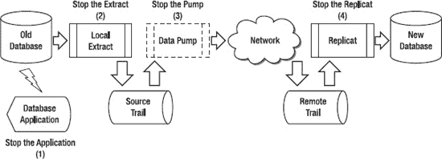

*图 13-4. 零停机迁移切换，第 1 部分*

以下是图 13-4 中所示步骤 1-4 的说明：

1.  停止连接到旧数据库的应用程序。
2.  确认没有延迟后，停止本地提取（Local Extract），如下例所示：
    ```
    GGSCI (oldserver) > LAG EXTRACT LPREMP1
    Sending GETLAG request to EXTRACT LPREMP1 ...
    Last record lag: 10 seconds.
    At EOF, no more records to process.
    GGSCI (oldserver) > STOP EXTRACT LPREMP1
    ```
3.  确认没有延迟后，停止数据泵提取（data-pump Extract），如下所示：
    ```
    GGSCI (oldserver) > LAG EXTRACT PPREMP1
    Sending GETLAG request to EXTRACT PPREMP1 ...
    Last record lag: 6 seconds.
    At EOF, no more records to process.
    GGSCI (oldserver) > STOP EXTRACT PPREMP1
    ```
4.  确认没有更多记录需要处理后，停止复制（Replicat），如下所示：
    ```
    GGSCI (newserver) > LAG REPLICAT RPREMP1
    Sending GETLAG request to REPLICAT RPREMP1 ...
    Last record lag: 7 seconds.
    At EOF, no more records to process.
    GGSCI (newserver) > STOP REPLICAT RPREMP1
    ```

现在，应用程序不再使用旧数据库，并且从旧数据库到新数据库的复制已停止。您可以继续第 2 部分（参见图 13-5），启动回退提取（fallback Extract）并将应用程序切换到使用新数据库。

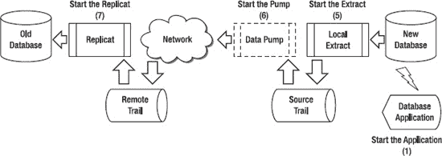

*图 13-5. 零停机迁移切换，第 2 部分*

以下是图 13-5 中所示步骤 1-4 的说明：

1.  为了在应用程序切换前开始捕获对新数据库的更改，修改新数据库的本地提取以开始捕获更改，然后如下启动它：
    ```
    GGSCI (newserver) > ALTER EXTRACT LPREMP2\. BEGIN NOW

    GGSCI (newserver) > START EXTRACT LPREMP2
    ```
2.  为应用程序准备好新数据库，并启动连接到新数据库的应用程序。在准备过程中，您可能需要在新数据库上为应用程序用户授予一些 SQL 权限。同时，记得启用您在新数据库作为复制目标时可能已禁用的任何触发器或级联删除约束。
3.  在新数据库上启动数据泵提取，如下例所示：
    ```
    GGSCI (oldserver) > START EXTRACT PPREMP2
    ```
4.  在旧数据库上启动复制，如下所示。在处理来自新数据库的 Oracle GoldenGate 更改之前，请确保禁用旧数据库上的任何触发器或级联删除约束：
    ```
    GGSCI (newserver) > START REPLICAT RPREMP2
    ```

### 执行迁移回退

完成迁移后，您可能会因为问题或其他原因决定需要回退到原始数据库。本节介绍回退所需的步骤。这些步骤分为两个部分：在第 1 部分中，停止从新数据库到旧数据库的复制（参见图 13-6）；在第 2 部分中，重新启动从旧数据库到新数据库的复制，为下一次切换尝试做准备。

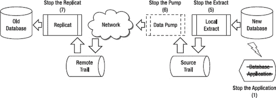

*图 13-6. 零停机迁移回退，第 1 部分*

以下是图 13-6 中所示步骤 1-4 的说明：

1.  停止在新数据库上运行的应用程序。此时，请确保保持本地提取运行，以便它可以捕获任何剩余的数据库事务。
2.  确认没有延迟后，停止新数据库上的本地提取，如下例所示：
    ```
    GGSCI (newserver) > LAG EXTRACT LPREMP2
    Sending GETLAG request to EXTRACT LPREMP2 ...
    Last record lag: 5 seconds.
    At EOF, no more records to process.
    GGSCI (newserver) > STOP EXTRACT LPREMP2
    ```
3.  确认没有延迟后，停止新数据库上的数据泵提取：
    ```
    GGSCI (newserver) > LAG EXTRACT PHREMD2
    Sending GETLAG request to EXTRACT PHREMD2 ...
    Last record lag: 4 seconds.
    At EOF, no more records to process.
    GGSCI (newserver) > STOP EXTRACT PHREMD2
    ```
4.  确认没有更多记录需要处理后，停止旧数据库上的复制：
    ```
    GGSCI (oldserver) > LAG REPLICAT RHREMD2
    Sending GETLAG request to REPLICAT RHREMD2 ...
    Last record lag: 6 seconds.
    At EOF, no more records to process.
    GGSCI (oldserver) > STOP REPLICAT RHREMD2
    ```

现在，从新数据库到旧数据库的复制已完成并停止，您可以继续第 2 部分，重新启动从旧数据库到新数据库的原始复制，如图 13-7 所示。

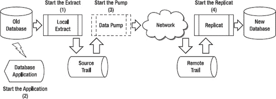

*图 13-7. 零停机迁移回退，第 2 部分*

以下是图 13-7 中所示步骤 1-4 的说明：

1.  为了在应用程序切换回旧数据库前开始捕获更改，修改旧数据库的本地提取以开始捕获更改，然后如下启动提取：
    ```
    GGSCI (oldserver) > ALTER EXTRACT LPREMP1, BEGIN NOW

    GGSCI (oldserver) > START EXTRACT LPREMP1
    ```
2.  为应用程序准备好旧数据库，并启动连接到旧数据库的应用程序。在准备过程中，您可能需要为应用程序用户授予一些 SQL 权限。同时，记得启用您在旧数据库作为复制目标时可能已禁用的任何触发器或级联删除约束。
3.  在旧数据库上启动数据泵提取，如下例所示：
    ```
    GGSCI (oldserver) > START EXTRACT PPREMP1
    ```
4.  在新数据库上启动复制。在处理来自旧数据库的 Oracle GoldenGate 更改之前，请确保禁用新数据库上的任何触发器或级联删除约束：
    ```
    GGSCI (newserver) > START REPLICAT RPREMP1
    ```

数据库已恢复其原始配置，并在任何问题解决后准备好进行下一次切换尝试。

### 总结

本章介绍了如何设置和配置 Oracle GoldenGate 复制以支持零停机数据库迁移场景。首先，您设置了从旧数据库到新数据库的正向和反向复制的基本 Oracle GoldenGate 进程。然后，您了解了如何配置 Oracle GoldenGate 以支持切换到新数据库，并在需要时回退到旧数据库。关于零停机迁移的额外参考资料，Oracle 在 Oracle 技术网络网站上提供了一份题为 *使用 Oracle GoldenGate 实现零停机数据库升级* 的白皮书，网址为 [`www.oracle.com/technetwork/middleware/goldengate/overview/ggzerodowntimedatabaseupgrades-174928.pdf`](http://www.oracle.com/technetwork/middleware/goldengate/overview/ggzerodowntimedatabaseupgrades-174928.pdf)。

下一章将介绍一些 Oracle GoldenGate 的技巧和窍门，帮助您以最佳方式设置和管理您的 Oracle GoldenGate 复制环境。

## 第 14 章


## 技巧与窍门

在多年使用 `GoldenGate` 的过程中，我们积累了许多有用的技巧和窍门。本章将介绍一些您在设置和管理 `GoldenGate` 复制时可以使用的技巧。这些建议应能帮助您以最佳方式快速启动并运行您的环境。请记住，这些技巧基于多种不同的经验，通常能带来最佳效果。然而，不同的系统有不同的需求和要求，因此这些捷径可能不适用于您的具体情况。同时请注意，随着 `GoldenGate` 和技术的不断发展，这些技巧和窍门也会随之变化。您应始终查阅标准的 `Oracle GoldenGate` 产品文档，这是使用该产品的官方指南。

### 需求与规划

本节重点介绍为 `GoldenGate` 复制设置做准备。这个过程常常被草草了事或完全跳过，这会在日后导致错误，从长远来看最终会花费更多成本。您应确保您的项目投入适当的时间和精力来收集和理解需求，并且所有利益相关者都批准了这些需求。与所有项目一样，仔细规划复制项目有助于确保其成功。

#### 了解业务目标

清晰地理解设置 `GoldenGate` 的业务目标非常重要。业务目标驱动着围绕复制设置的许多技术决策。例如，如果业务目标可以通过单向复制而非双向复制来实现，那么技术复杂性就会大大降低。

您可以从与核心团队成员进行一次非正式的白板讨论开始，回顾提议的复制范围和目标。您甚至可以开始勾勒出高层次的复制场景和流程，以便每个人都能理解其中涉及的内容。之后，您可以将初步的业务目标正式化，与团队成员分享并征求反馈。最后，项目范围和目标应由主要利益相关者审阅并批准。

以下是一些您可以使用 `GoldenGate` 实现的业务目标示例：

*   在将 Oracle 数据库从 10g 迁移到 Oracle 11g 时，将停机时间降至最低。
*   将销售、客户和产品数据整合到一个新的只读数据库中，用于分析和报告。
*   将密集的查询和报告活动从主 OLTP 数据库中卸载。
*   在异地保留一个与主数据库同步的副本，用于灾难恢复目的。
*   为业务用户创建一个企业数据仓库，其中包含从多个异构源数据库集成的近实时数据。
*   在迁移到新平台时，将停机时间降至最低，同时确保有回退计划可用。

#### 理解需求

您需要深入理解将驱动复制技术设计的具体需求。以下是一些影响复制设计的因素：

*   `源和目标配置：` 描述现有或计划中的源和目标数据库。数据库和操作系统的软件版本是什么？服务器是独立的还是集群的？数据存储如何配置？源和目标数据库的字符集是什么？
*   `数据时效性：` 数据需要以多快的速度、多高的频率进行更新？可以容忍数据复制中的任何延迟吗？如果不能容忍任何延迟且数据变化量很大，您可能需要在项目中投入更多时间来设计和调整复制，以避免任何延迟。请注意，报告系统通常可以容忍延迟，目标数据不需要与源数据完全同步。
*   `数据量：` 需要复制多少数据？数据更新的频率如何？您可以检查现有的数据库事务日志文件来确定源数据库中发生的数据变化量。数据变化量会影响源和目标之间的网络带宽要求以及跟踪文件所需的磁盘空间量。
*   `数据需求：` 您应理解任何独特或特殊的数据需求，以便在 `GoldenGate` 中妥善处理。例如，如果存在触发器，则可能需要在目标数据库中禁用它们。如果需要复制序列，则需要添加特殊参数。某些数据类型可能需要特殊处理或可能不受支持。例如，在 `GoldenGate 11` 中，`BFILE` 和 `ANYDATA` 等数据类型不受支持。其他数据类型可能受支持但有某些限制。*（请务必查阅 `Oracle GoldenGate` 产品文档以获取支持的数据类型列表。）*
*   `安全需求：` 需要多高的安全性？例如，是否需要加密 `GoldenGate` 正在复制的数据？`GoldenGate` 可以加密存储在跟踪文件中的数据以及从源发送到目标的数据。此外，数据库中的数据是否加密？例如，Oracle 可以使用称为 `透明数据加密 (TDE)` 的功能对数据库数据进行加密。如果数据库正在使用 `TDE`，`GoldenGate` 需要特殊参数来解密数据以进行复制。最后，`GoldenGate` 本身在安装和拥有 `GoldenGate` 软件以及在数据库内执行复制时也需要安全性。您需要为此做好计划，并确保您的组织允许 `GoldenGate` 所需的新用户和安全访问权限。
*   `网络需求：` 描述源和目标之间的网络。是否有任何防火墙需要为复制而开放？距离有多远？复制需要多少带宽，实际可用多少带宽？

#### 确定拓扑结构

正如第 3 章“架构”中所讨论的，`GoldenGate` 支持许多不同的拓扑结构。每种拓扑结构都有其独特的要求和复杂性。尽早确定拓扑结构有助于推动技术需求和设计。例如，单向复制拓扑比双向复制设置起来要简单得多。涉及单个源和单个目标数据库的复制比涉及单个源和多个目标数据库的复制更容易设置。

### 安装与设置

现在，让我们来看一些与 `GoldenGate` 安装和设置相关的技巧和窍门。这些建议包括设置用户、指定 `Extract` 和 `Replicat` 参数以及命名标准。

### 创建专用用户

您可能很想直接使用现有的数据库和操作系统用户来运行 `GoldenGate`。但您应该创建专门用于 `GoldenGate` 的操作系统和数据库专用用户。这样做可以确保来自 `GoldenGate` 用户的任何活动都能被单独跟踪。例如，如果出现数据库性能问题，您可以隔离 `GoldenGate` 数据库用户的活动，以确定是否是它导致了问题。一些示例用户名如 `gger`、`gguser`、`ggate` 等。

根据您的平台，`GoldenGate` 用户可能需要一些通常为 DBA 团队保留的高级权限。例如，对于 `Microsoft SQL Server`，`Extract` 进程需要一个具有 `系统管理员` 角色的用户。您需要根据您组织的安全要求，确定 `GoldenGate` 用户应属于 DBA 团队还是一个独立的团队。如果 `GoldenGate` 用户 ID 不归 DBA 团队所有，那么 `GoldenGate` 的职责需要根据所需的安全级别在 DBA 团队和 `GoldenGate` 团队之间进行划分。


#### 加密密码

在任何安全环境中，您都应该加密 GoldenGate 数据库用户密码。以下示例展示了如何使用 GoldenGate 加密密码 `abc` 并在参数文件中指定它。该示例使用了默认加密密钥，但如果需要，您可以使用特定密钥。

```
GGSCI (server) 1> encrypt password abc
No key specified, using default key…

Encrypted password:  AACAAAAAAAAAAADAVHTDKHHCSCPIKAFB
```

确定密钥的加密值后，您可以将其在 Extract 或 Replicat 参数文件中指定，如下例所示。

```
USERID "GGER", PASSWORD "AACAAAAAAAAAAADAVHTDKHHCSCPIKAFB", ENCRYPTKEY default
```

接下来，让我们回顾如何使用专用的 GoldenGate 安装目录。

### 创建专用安装目录

您应该将 GoldenGate 软件安装在其自己独立的目录中，该目录由专用的 GoldenGate 操作系统用户拥有。这可以将 GoldenGate 软件与其他文件分开，并允许快速、轻松地定位和监控它们。由于 GoldenGate 软件特定于 DBMS 供应商版本，您可能需要根据 DBMS 版本来限定子目录名称。示例安装目录包括用于 Oracle 10 GoldenGate 安装的 `/gger/ggs/ora10` 和用于 SQL Server 2008 安装的 `c:\ggate\sql2008`。

#### 使用检查点表

您应该在目标数据库中添加一个检查点表，以跟踪 Replicat 的检查点。默认情况下，GoldenGate 在磁盘上的文件中跟踪检查点。如果您将检查点文件添加到数据库，GoldenGate 会将检查点作为 Replicat 事务的一部分，这在某些情况下允许更好的可恢复性。以下示例创建了检查点表：

```
GGSCI (targetserver) 1> dblogin userid gger password abc
Successfully logged into database.
```

```
GGSCI (targetserver) 2> add checkpointtable gger.chkpt
Successfully created checkpoint table GGER.CHKPT.
```

您应该将 `CHECKPOINTTABLE` 参数添加到 GoldenGate 软件安装目录（例如 `/gger/ggs`）中的 `GLOBALS` 文件中，以便所有 Replicat 都使用此检查点表，如下所示：

```
CHECKPOINTTABLE gger.chkpt
```

#### 验证字符集

有时您会在具有不同数据库字符集的数据库之间进行复制。使用 `SETENV` 命令在参数文件中显式设置数据库字符集始终是一个好主意。这样，您就不会意外地从环境设置中拾取可能不正确的默认字符集。

以下示例展示了如何在 GoldenGate Extract 或 Replicat 参数文件中设置数据库字符集。

```
SETENV (NLS_LANG = AMERICAN_AMERICA.AL32UTF8)
```

接下来，我们将介绍为 GoldenGate 组件使用命名标准。

#### 制定命名标准

为您的 Extract 和 Replicat 组制定命名标准。这样做有助于您一目了然地识别 Extract 或 Replicat 的用途及其运行位置。在需要快速恢复故障复制的问题解决情况下，命名标准尤为重要。目前，Extract 和 Replicat 组名的长度限制为八个字符。

以下是您在制定命名标准模式时应包含的一些项目：

*   进程类型，例如 Extract、Data Pump 或 Replicat
*   使用该进程的应用程序，例如 payroll、sales 或 billing
*   进程运行的环境上下文，例如 development 或 production
*   指示是否存在多个 Extract 或 Replicat 组的标识符

例如，名为 `RPAYRP1` 的 Replicat 组是在 `production` 环境中运行的针对 `payroll` 应用程序（`PAYR`）的 `第一个 Replicat`。您可以很容易地看出 `RPAYRP1` 是一个 Replicat，因为首字符是 `R`。结尾的 `P1` 表示在生产环境中运行的第一个 Replicat。

也可以为跟踪文件制定命名标准，尽管您仅限于两个字符。您可以使用第一个字符来表示跟踪文件是由本地 Extract 创建还是由数据泵 Extract 创建。第二个字符可以是任何有效的字母或数字。例如，跟踪文件 `P1` 可用于数据泵跟踪文件。

#### 使用数据泵

尽管从技术上讲数据泵 Extract 并非必需，但您几乎总是应该使用数据泵。本地 Extract 可以配置为直接将更改从源服务器发送到远程目标，而无需数据泵。然而，在配置中添加数据泵会引入另一个保护层，将本地 Extract 与目标网络连接中断或目标本身问题造成的任何干扰隔离开来。

例如，如果源和目标之间存在网络问题，这可能导致本地 Extract 失败。通过在源和目标之间设置数据泵，本地 Extract 可以继续提取更改，只有数据泵会受到影响。这样，当网络问题解决后，您可以重新启动数据泵并快速处理本地 Extract 已在跟踪文件中捕获的已排队更改。请记住，数据泵需要一个额外的跟踪文件，因此您应确保在配置中留出一些额外的磁盘空间。

### 管理与监控

本节介绍了一些使管理和监控 GoldenGate 环境更轻松的技巧和窍门。通过利用这些建议，您可以简化 GoldenGate 设置的日常管理，并确保其保持平稳运行。


#### 使用 GGSCI 命令快捷方式

至此，您应该已经熟悉了 GoldenGate 软件命令接口（`GGSCI`）以及许多基本的 `GGSCI` 命令。让我们来看一些可能不太为人所知的快捷方式。它们可以为您节省大量时间（以及打字！）。

您可以在命令中使用常见的缩写，例如用 `ext` 代替 `Extract`，用 `rep` 代替 `Replicat`，用 `mgr` 代替 `Manager`，以及用 `er` 来指代 Extract 和 Replicat 两者。让我们看几个使用 `INFO` 命令查询 Extract、Replicat 以及在第三个例子中同时查询两者的示例。

```
GGSCI (server) 1> info ext *
GGSCI (server) 2> info rep *
GGSCI (server) 3> info er *
```

现在，让我们使用感叹号（`!`）命令来重新执行上一条 `INFO` 命令。

```
GGSCI (server) 4> !
info er *
```

请注意，`!` 命令重新执行了 `info er *` 命令。接下来，我们通过向 `!` 添加特定的命令编号 `2` 来重新执行第二条命令 `info rep *`，如下所示。

```
GGSCI (server) 5> ! 2
info rep *
```

假设您想在 `GGSCI` 内部执行一个操作系统命令来显示当前目录内容。您可以使用 `SHELL` 命令来完成，如下例所示。

```
GGSCI (server) 6> shell dir
```

您可以使用 `SHOW` 命令快速查看有关 GoldenGate 环境的信息。`SHOW` 在快速列出 GoldenGate 目录方面特别有用。

```
GGSCI (server) 7> show

Parameter settings:

SET SUBDIRS    ON
SET DEBUG      OFF

Current directory: /gger/ggs

Using subdirectories for all process files

Editor:  vi

Reports (.rpt)                 /gger/ggs/dirrpt
Parameters (.prm)              /gger/ggs/dirprm
Stdout (.out)                  /gger/ggs/dirout
Replicat Checkpoints (.cpr)    /gger/ggs/dirchk
Extract Checkpoints (.cpe)     /gger/ggs/dirchk
Process Status (.pcs)          /gger/ggs/dirpcs
SQL Scripts (.sql)             /gger/ggs/dirsql
Database Definitions (.def)    /gger/ggs/dirdef
```

现在，让我们使用 `HISTORY` 命令来显示您已执行的命令历史记录，如下例所示。

```
GGSCI (server) 8> history

GGSCI Command History

    1: info ext *
    2: info rep *
    3: info er *
    4: info er *
    5: info rep *
    6: shell dir
    7: show
    8: history
```

通过将 `HISTORY` 与 `!` 命令结合使用，您确实可以节省时间。您可以使用 `! #` 命令重新执行历史记录中的任何命令编号。例如，`! 7` 会重新执行命令编号 7，在本例中就是 `SHOW` 命令。

最后，您可以使用 `HELP` 来获取任何 GoldenGate 命令的帮助，如下所示。

```
GGSCI (server) 9> help
```

接下来，让我们看看 `OBEY` 文件，这是另一个使 GoldenGate 管理更加容易的工具。

#### 使用 OBEY 文件

您应将常用命令存储在 GoldenGate `OBEY` 文件中。`OBEY` 文件是命令文件（类似于 Windows 中的 `.bat` 文件或 UNIX 中的 shell 脚本），您将它们放在 GoldenGate 安装目录下的 `diroby` 目录中。您可以为 `OBEY` 文件任意命名；但建议采用命名标准，例如使用像 `.obey` 这样的标准文件扩展名。

让我们看一个 `OBEY` 文件示例。假设您要为您的生产 payroll 数据添加一个名为 `LPAYRP1` 的 Extract 以及对应的 trail 文件。您可以创建一个 `OBEY` 文件来添加该 Extract，如下例所示。

```
$ cat diroby/LPAYRP1.obey

ADD EXTRACT LPAYRP1, TRANLOG, BEGIN NOW
ADD EXTTRAIL /gger/dirdat/l1,  EXTRACT LPAYRP1,  MEGABYTES 25
```

```
GGSCI (sourceserver) 1> obey ./dirdat/LPAYRP1.obey
```

使用 `OBEY` 文件还有一个额外优势，即您的文件被集中存储，作为良好的参考，并且可以重复使用。您可以创建一套标准的 `OBEY` 文件，为您的 GoldenGate 设置和维护确保一个一致、可重用、脚本化的过程。任何支持复制的人员都可以轻松找到您用于设置复制的文件。此外，如果出现问题，您始终有脚本可以作为参考点。

#### 生成临时统计数据

默认情况下，每次启动 Extract 或 Replicat 进程时，GoldenGate 都会生成一份报告。此外，您应至少每天包含 `REPORT` 参数来生成临时运行时统计数据。这些信息在调试或评估性能时非常宝贵。您还应包含带有 `RATE` 参数的 `REPORTCOUNT` 参数，以显示正在处理的记录数和处理速率。

在以下示例中，Extract 或 Replicat 参数配置为每 15 分钟报告一次处理的记录数，报告处理速率，并每天 12:00 生成临时运行时统计数据。

```
ReportCount Every 15 Minutes, Rate
Report at 12:00
```

现在让我们看看如何为 GoldenGate 无法处理的记录使用废弃文件。

#### 使用废弃文件

您应在 Extract 和 Replicat 参数文件中指定一个废弃文件。GoldenGate 使用此文件来写入任何无法处理的记录以及错误代码。在发生故障时，您可以将此文件用于调试目的。您应定期检查废弃文件是否有更改，并尽快解决任何被废弃的记录。

以下是在 Extract 参数中使用废弃文件参数的示例。我们在第 5 章“高级和双向功能”中回顾过此内容。

```
DiscardFile dirrpt/LHREMD1.dsc, Append
DiscardRollover at 02:00 ON SUNDAY
```

接下来让我们回顾一下如何报告 GoldenGate 进程的健康状况。

#### 定期报告进程健康状况

您可以使用 GoldenGate Manager 进程来报告 Extract 和 Replicat 进程的健康状况。至少，您应考虑在 Manager 参数文件中包含以下参数：

*   `DOWNREPORT`：每隔用户指定的小时或分钟数报告一次宕机进程。
*   `DOWNCRITICAL`：如果 Extract 或 Replicat 失败，则写入关键消息。
*   `LAGCRITICAL`：当超过用户指定的时间段时，写入警告消息。
*   `LAGINFO`：指示 Manager 按照用户指定的时间段报告延迟信息。

