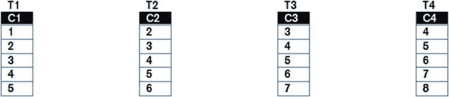

# 使用因子化子查询

```sql
WITH q1
     AS (  SELECT manager_id, COUNT (DISTINCT job_id) job_id_cnt
             FROM hr.employees
         GROUP BY manager_id)
    ,q2
     AS (  SELECT manager_id, COUNT (DISTINCT job_id) job_id_cnt
             FROM hr.employees
         GROUP BY manager_id)
    ,sub
     AS (  SELECT e.manager_id, COUNT (*) mgr_cnt, job_id_cnt
             FROM hr.employees e, q1 jid
            WHERE jid.manager_id = e.manager_id
         GROUP BY e.manager_id, jid.job_id_cnt)
    ,peers
     AS (  SELECT e.manager_id, COUNT (*) mgr_cnt, job_id_cnt
             FROM hr.employees e, q2 jid
            WHERE jid.manager_id = e.manager_id
         GROUP BY e.manager_id, jid.job_id_cnt)
  SELECT e.employee_id
        ,e.first_name
        ,e.last_name
        ,e.manager_id
        ,sub.mgr_cnt subordinates
        ,peers.mgr_cnt - 1 peers
        ,peers.job_id_cnt peer_job_id_cnt
        ,sub.job_id_cnt sub_job_id_cnt
    FROM hr.employees e, sub, peers
   WHERE sub.manager_id = e.employee_id AND peers.manager_id = e.employee_id
ORDER BY last_name, first_name;
```

代码清单 1-15 将 `SUB` 和 `PEERS` 中的嵌套内联视图移至因子化子查询 `Q1` 和 `Q2`。在这种情况下，我们不能使用原来的表别名，因为因子化子查询的名称必须是唯一的，而两个嵌套内联视图的表别名都叫做 `JID`。然后，我从 `SUB` 中引用了 `Q1`，并从 `PEERS` 中引用了 `Q2`。一个因子化子查询可以引用另一个因子化子查询，只要被引用的子查询在引用它的子查询之前定义即可。在这种情况下，这意味着 `Q1` 的定义必须在 `SUB` 之前，`Q2` 的定义必须在 `PEERS` 之前。

 **提示** 像任何其他标识符一样，为因子化子查询选择有意义的名称通常是个好主意。然而，有时就像这里一样，你是在“逆向工程” `SQL` 并且还不清楚因子化子查询的作用。在这些情况下，尽量避免使用标识符 `X` 和 `Y`。这些标识符实际上被 `Oracle Spatial` 使用，这可能会导致令人困惑的错误消息。我更喜欢使用标识符 `Q1`、`Q2` 等。

这个练习只是为了使查询更容易阅读。除非出现 `CBO` 异常，否则你还没有做任何影响性能的事情。

在继续之前，我必须说明在早期版本的 `Oracle` 数据库产品中，存在许多异常情况，会导致诸如 代码清单 1-14 和 1-15 所示的重构对性能产生影响。但这些似乎在 `11gR2` 及更高版本中已经得到解决。无论如何，对于我们大多数人来说，能够读懂查询是优化它的重要一步。所以，尽管进行重构，查询会变得容易读得多。

## 多次使用因子化子查询

当你更仔细地观察 代码清单 1-15 时，你可以看到子查询 `Q1` 和 `Q2` 是相同的。这就引出了使用因子化子查询的第二个关键原因：你可以多次使用它们，如 代码清单 1-16 所示。

**代码清单 1-16. 多次使用因子化子查询**

```sql
WITH jid
     AS (  SELECT manager_id, COUNT (DISTINCT job_id) job_id_cnt
             FROM hr.employees
         GROUP BY manager_id)
    ,sub
     AS (  SELECT e.manager_id, COUNT (*) mgr_cnt, job_id_cnt
             FROM hr.employees e, jid
            WHERE jid.manager_id = e.manager_id
         GROUP BY e.manager_id, jid.job_id_cnt)
    ,peers
     AS (  SELECT e.manager_id, COUNT (*) mgr_cnt, job_id_cnt
             FROM hr.employees e, jid
            WHERE jid.manager_id = e.manager_id
         GROUP BY e.manager_id, jid.job_id_cnt)
  SELECT e.employee_id
        ,e.first_name
        ,e.last_name
        ,e.manager_id
        ,sub.mgr_cnt subordinates
        ,peers.mgr_cnt - 1 peers
        ,peers.job_id_cnt peer_job_id_cnt
        ,sub.job_id_cnt sub_job_id_cnt
    FROM hr.employees e, sub, peers
   WHERE sub.manager_id = e.employee_id AND peers.manager_id = e.employee_id
ORDER BY last_name, first_name;
```

改为多次使用单个因子化子查询 `是` 一件可能影响语句执行计划并可能改变其性能特征的事情，通常是向好的方向改变。然而，在这个阶段，我们只是试图让我们的语句更容易阅读。

既然你已经做了这些更改，你可以看到子查询 `SUB` 和 `PEERS` 现在是相同的，并且 `JID` 子查询是多余的。代码清单 1-17 完成了这个可读性练习。

**代码清单 1-17. 使用单个因子化子查询重写的 代码清单 1-16**

```sql
WITH mgr_counts
     AS (  SELECT e.manager_id, COUNT (*) mgr_cnt, COUNT (DISTINCT job_id) job_id_cnt
             FROM hr.employees e
         GROUP BY e.manager_id)
  SELECT e.employee_id
        ,e.first_name
        ,e.last_name
        ,e.manager_id
        ,sub.mgr_cnt subordinates
        ,peers.mgr_cnt - 1 peers
        ,peers.job_id_cnt peer_job_id_cnt
        ,sub.job_id_cnt sub_job_id_cnt
    FROM hr.employees e, mgr_counts sub, mgr_counts peers
   WHERE sub.manager_id = e.employee_id AND peers.manager_id = e.employee_id
ORDER BY last_name, first_name;
```

## 理解查询的作用

花几分钟时间重新组织 代码清单 1-13，使其组成部分清晰地凸显出来后，你就有更好的机会理解它实际做了什么：

*   该查询为每位中层经理返回一行。公司老板和非经理的员工被排除在外。
*   `EMPLOYEE_ID`、`LAST_NAME` 和 `FIRST_NAME` 以及 `MANAGER_ID` 来自选定的中层经理。
*   `SUBORDINATES` 是直接向选定中层经理汇报的员工数量。
*   `PEERS` 是与选定中层经理拥有相同经理的其他人数量。
*   `PEER_JOB_ID_CNT` 是这些同级经理所担任的不同职位的数量。
*   `SUB_JOB_ID_CNT` 是选定中层经理的直接下属所担任的不同职位的数量。

一旦你理解了一个查询，如果需要调优，你就处于更有利的位置。

## 避免使用临时表

使用因子化子查询的第三个原因是避免使用临时表。有些人建议将复杂查询分解为单独的语句，并将中间结果存储到一个或多个临时表中。这样做的理由是这些更简单的语句更容易阅读和测试。既然因子化子查询已经可用，我个人不再仅仅为了简化 `SQL` 而使用临时表。

如果你想单独测试各个因子化子查询，无论是为了调试它们还是查看性能，你可以使用你的因子化子查询的一个子集，而不是使用临时表。代码清单 1-18 展示了如何单独测试 代码清单 1-17 中的 `MGR_COUNTS` 因子化子查询。


清单 1-18. 独立测试因子化子查询

```
WITH mgr_counts
     AS (  SELECT e.manager_id, COUNT (*) mgr_cnt, COUNT (DISTINCT job_id) job_id_cnt
             FROM hr.employees e
         GROUP BY e.manager_id)
    ,q_main
     AS (  SELECT e.employee_id
                 ,e.first_name
                 ,e.last_name
                 ,e.manager_id
                 ,sub.mgr_cnt subordinates
                 ,peers.mgr_cnt - 1 peers
                 ,peers.job_id_cnt peer_job_id_cnt
                 ,sub.job_id_cnt sub_job_id_cnt
             FROM hr.employees e, mgr_counts sub, mgr_counts peers
            WHERE sub.manager_id = e.employee_id AND peers.manager_id = e.employee_id
         ORDER BY last_name, first_name)
SELECT *
  FROM mgr_counts;
```

我在清单 1-18 中所做的，是将之前的主查询子句变成了另一个我选择命名为 `Q_MAIN` 的因子化子查询。新的主查询子句现在仅从 `MGR_COUNTS` 中选择行以用于测试目的。

在 Oracle Database 10g 中，清单 1-18 会是无效的 SQL 语法，因为并非所有的因子化子查询都被使用了。谢天谢地，从 Oracle Database 11g 开始，这一限制已被取消，我们现在可以分阶段测试复杂的 SQL 语句，而无需借助临时表。

我通常更倾向于使用一个包含多个简单因子化子查询的复杂 SQL 语句，而不是使用临时表来集成多个独立的 SQL 语句，原因是 CBO（基于成本的优化器）可以一次性看到整个问题，并且在确定执行顺序时有更多选择。

 `注意` 我说过我不会仅仅为了测试而使用临时表。但是，使用临时表还有其他原因，我将在第 16 章中讨论。

## 递归因子化子查询

我们现在来到使用因子化子查询的第四个也是最后一个原因。这个原因是为了实现递归。

Oracle Database 11gr2 引入了 `递归因子化子查询`，它们实际上与我们目前处理的因子化子查询是不同类型的特性。这个特性在 SQL 语言参考手册中有示例说明，并且网上也有大量关于其使用的讨论。

假设你的表包含树形结构数据。访问这些数据的一种方式是使用层次查询，但递归是一个更强大、更优雅的工具。了解递归因子化子查询的一个有趣方式是查看 Martin Amis 的博客。

 `注意` 你可以访问 Martin Amis 的博客：`http://technology.amis.nl/`。他关于使用递归因子化子查询解决数独问题的文章在这里：`http://technology.amis.nl/2009/10/13/oracle-rdbms-11gr2-solving-a-sudoku-using-recursive-subquery-factoring/`。

顺便提一下，一个查询可以包含递归和非递归因子化子查询的混合。尽管递归子查询因子化看起来是一个有用的特性，但我尚未在商业应用中看到它被使用，因此我不会在本书中进一步讨论它。

## 连接

让我们继续本章的最后一个主题：连接。我将从回顾内连接和传统连接语法开始。然后，在探讨分区外连接如何为分析查询提供数据密集化问题的解决方案之前，我将解释外连接和美国国家标准协会（ANSI）连接语法的相关主题。

### 内连接和传统连接语法

SQL 的原始版本只包含内连接，并设计了一种简单的“逗号分隔”语法来表示它。在本书的其余部分，我将这种语法称为 `传统语法`。

#### 简单的两表连接

让我们从清单 1-19 开始，这是一个使用 `HR` 示例模式中表的简单例子。

清单 1-19. 一个两表连接

```
SELECT *
  FROM hr.employees e, hr.jobs j
 WHERE e.job_id = j.job_id AND e.manager_id = 100 AND j.min_salary > 8000;
```

这个查询只有一个连接。理论上，这条语句的意思是：

*   将 `EMPLOYEES` 中的所有行与 `JOBS` 中的所有行进行组合。所以如果 `EMPLOYEES` 中有 `M` 行，`JOBS` 中有 `N` 行，我们的 `中间结果集` 应该有 `M x N` 行。
*   从这个中间结果集中，只选择满足 `EMPLOYEES.JOB_ID = JOBS.JOB_ID`、`EMPLOYEES.MANAGER_ID=1` 和 `JOBS.MIN_SALARY > 8000` 的行。

请注意，连接中使用的谓词（称为 `连接谓词`）和其他谓词（称为 `选择谓词`）之间没有区别。该查询逻辑上首先返回没有任何谓词的表连接结果（一个 `笛卡尔连接`），然后在最后将所有谓词作为选择谓词应用。

现在，正如我在本章开头提到的，SQL 是一种声明式编程语言，CBO 被允许以任何合法的方式生成最终结果集。实际上，CBO 可以采取几种不同的方法来处理这个简单的查询。以下是其中一种方式：

*   在 `EMPLOYEES` 中找到所有满足 `EMPLOYEES.MANAGER_ID=1` 的行。
*   对于 `EMPLOYEES` 中的每个匹配行，在 `JOBS` 中找到所有满足 `EMPLOYEES.JOB_ID = JOBS.JOB_ID` 的行。
*   从中间结果中选择满足 `JOBS.MIN_SALARY > 8000` 的行。

CBO 也可能采取以下方法：

*   在 `JOBS` 中找到所有满足 `JOBS.MIN_SALARY > 8000` 的行。
*   对于 `JOBS` 中的每个匹配行，在 `EMPLOYEES` 中找到所有满足 `EMPLOYEES.JOB_ID = JOBS.JOB_ID` 的行。
*   从中间结果中选择满足 `EMPLOYEES.MANAGER_ID=1` 的行。

这些例子引入了 `连接顺序` 的概念。CBO 以某种顺序处理 `FROM` 子句中的每个表，我将使用自己的符号来描述该顺序。例如，前面的两个例子可以使用表别名分别表示为 E  J 和 J  E。

我将把箭头左边的表称为 `驱动` 表，箭头右边的表称为 `探测` 表。不要对这些术语赋予过多含义，因为它们并不总是有意义，并且在某些情况下会与公认的用法相矛盾。我只是需要一种方式来命名连接操作数。让我们继续看一个稍微复杂一点的内连接。

#### 四表内连接

清单 1-20 在清单 1-19 的查询中添加了更多表。

清单 1-20. 连接四个表

```
SELECT *
  FROM hr.employees e
      ,hr.jobs j
      ,hr.departments d
      ,hr.job_history h
 WHERE e.job_id = j.job_id AND e.employee_id = h.employee_id
       AND e.department_id = d.department_id;
```

由于清单 1-20 中的查询涉及四个表，因此需要三个连接操作。连接数总是比表数少一个。一种可能的连接顺序是 ((E  J)  D)  H。你可以看到我使用了括号来突出显示中间结果。

当查询中只有内连接时，CBO 可以自由选择它希望的任何连接顺序，尽管性能可能不同，但结果将始终相同。这就是为什么这种语法如此适合内连接的原因，因为它避免了对连接顺序或谓词分类的任何不必要的指定，并将其全部留给 CBO。

### 外连接和 ANSI 连接语法

尽管内连接非常有用并且在这个世界上占大多数，但还需要一些额外的东西。于是有了外连接。`左外连接`、`右外连接` 和 `全外连接` 是三种变体，我将依次介绍它们。但首先我们需要一些测试数据。


我不会使用 `HR` 模式中的表来演示外连接，因为我们需要更简单的例子。清单 1-21 设置了所需的四个表。

清单 1-21. 设置表 `T1` 至 `T4`

```sql
DROP TABLE t1;               -- 在清单 1-8 中创建
DROP TABLE t2;               -- 在清单 1-8 中创建

CREATE TABLE t1
AS
   SELECT ROWNUM c1
     FROM all_objects
    WHERE ROWNUM <= 5;

CREATE TABLE t2
AS
   SELECT c1 + 1 c2 FROM t1;

CREATE TABLE t3
AS
   SELECT c2 + 1 c3 FROM t2;

CREATE TABLE t4
AS
   SELECT c3 + 1 c4 FROM t3;
```

每个表都有五行，但内容略有不同。图 1-1 显示了内容。



图 1-1. 我们测试表中的数据

## 左外连接

清单 1-22 提供了第一个外连接示例。它展示了一个左外连接。这种连接使得第二个表（即右边的表）中的行成为可选。无论右边的表中是否存在对应的行，你都将获得左边表中的所有相关行。

清单 1-22. 两个表的左外连接

```sql
SELECT *
    FROM t1 LEFT OUTER JOIN t2 ON t1.c1 = t2.c2 AND t1.c1 > 4
   WHERE t1.c1 > 3
ORDER BY t1.c1;

C1         C2
---------- ----------

5          5
```

如你所见，`FROM` 子句的格式现在大不相同，我稍后会再讲到这一点。连接的左操作数称为 `保留行源`，右操作数称为 `可选行源`。

这个查询（逻辑上）是说：

*   找出 `T1` 和 `T2` 中符合 `T1.C1 = T2.C2 AND T1.C1 > 4` 条件的行组合。
*   对于 `T1` 中所有不匹配 `T2` 任何行的行，将它们输出，并将 `T2` 中的列值设为 `NULL`。
*   从结果集中删除所有不符合 `T1.C1 > 3` 条件的行。
*   按 `T1.C1` 对结果排序。

请注意，选择谓词和连接谓词之间有很大区别。选择谓词 `T1.C1 > 3` 导致从结果集中删除行，但连接谓词 `T1.C1 > 4` 只是导致 `T2` 的列值丢失。

现在不仅连接谓词和选择谓词之间有很大区别，而且 `CBO` 也没有完全的自由来重排连接顺序。考虑清单 1-23，它连接了所有四个表。

清单 1-23. 四表外连接

```sql
 SELECT c1
        ,c2
        ,c3
        ,c4
    FROM (t3 LEFT JOIN t4 ON t3.c3 = t4.c4)
         LEFT JOIN (t2 LEFT JOIN t1 ON t1.c1 = t2.c2) ON t2.c2 = t3.c3
ORDER BY c3;

C1         C2         C3         C4
---------- ---------- ---------- ----------
         3          3          3
         4          4          4          4
         5          5          5          5
                    6          6          6
                               7          7
```

为了更清晰，我添加了可选括号，以便你能看清意图。另请注意，关键字 `OUTER` 是可选的，我在省略了它。

除一个特殊情况（我稍后讨论 `哈希输入交换` 时会讲到）外，`CBO` 总是使用左外连接的左操作数（保留行源）作为连接中的驱动行源。因此，`CBO` 在这里选择连接顺序的余地有限。指定的连接顺序是 ((`T3` `T4`)  (`T2`  `T1`))。

事实上，`CBO` 有五种连接顺序可供选择。所有谓词都要求：

*   `T3` 在连接顺序中排在 `T4` 之前
*   `T2` 在连接顺序中排在 `T1` 之前
*   `T3` 在连接顺序中排在 `T2` 之前

例如，清单 1-24 使用顺序 (((`T3`  `T2`)  `T1`)  `T4`) 重写了清单 1-23，得到了相同的结果。

清单 1-24. 清单 1-23 的另一种构造方式

```sql
 SELECT c1
        ,c2
        ,c3
        ,c4
    FROM t3
         LEFT JOIN t2 ON t3.c3 = t2.c2
         LEFT JOIN t1 ON t2.c2 = t1.c1
         LEFT JOIN t4 ON t3.c3 = t4.c4
ORDER BY c3;
```

因为在最初发明 `SQL` 时，外连接的概念尚未形成，所以传统语法无法区分连接条件和选择条件，也无法区分保留行源和可选行源。

`Oracle` 是外连接的早期实现者之一，它设计了一种专有扩展来表示外连接条件。该语法通过修改 `WHERE` 子句，在连接条件中为来自可选行源的列附加 `(+)`。清单 1-25 使用专有语法重写了清单 1-24。

清单 1-25. 使用专有语法重写的清单 1-24

```sql
 SELECT c1
        ,c2
        ,c3
        ,c4
    FROM t1
        ,t2
        ,t3
        ,t4
   WHERE t3.c3 = t2.c2(+) AND t2.c2 = t1.c1(+) AND t3.c3 = t4.c4(+)
ORDER BY c3;
```

这种表示法的能力受到严重限制：

*   在 `Oracle Database 12cR1` 之前，一个表最多只能作为可选行源出现在一个连接中。
*   不支持全外连接和分区外连接（我稍后将讨论）。

由于这些限制，清单 1-28、1-29 和 1-30 中的查询无法用专有语法表达。要用专有语法实现这些查询，你需要使用带因子的子查询、内联视图或集合运算符。

就我个人而言，我觉得这种专有语法难以阅读，这是我通常建议避免使用它的另一个原因。不过，你可能会在执行计划的谓词部分看到这种表示法，这将在第 8 章中讨论。

新语法已被 `ANSI` 认可，通常称为 `ANSI 连接语法`。所有主流数据库供应商都支持这种语法，并且它也支持内连接。清单 1-26 展示了如何用 `ANSI` 语法指定内连接。

清单 1-26. 带有内连接的 `ANSI` 连接语法

```sql
 SELECT *
  FROM t1
       LEFT JOIN t2
          ON t1.c1 = t2.c2
       JOIN t3
          ON t2.c2 = t3.c3
       CROSS JOIN t4;

C1         C2         C3         C4
---------- ---------- ---------- ----------
         3          3          3          4
         3          3          3          5
         3          3          3          6
         3          3          3          7
         3          3          3          8
         4          4          4          4
         4          4          4          5
         4          4          4          6
         4          4          4          7
         4          4          4          8
         5          5          5          4
         5          5          5          5
         5          5          5          6
         5          5          5          7
         5          5          5          8
```

与 `T3` 的连接是内连接（如果需要，你可以显式添加关键字 `INNER`），与 `T4` 的连接是笛卡尔积连接；`ANSI` 使用关键字 `CROSS JOIN` 表示笛卡尔积连接。

## 右外连接


右外连接（Right Outer Join）只是**语法糖**。它保留的是右侧而非左侧的行。列表 1-27 展示了没有右外连接语法时，查询会变得多么难以阅读。

列表 1-27. 没有右外连接的复杂查询
```sql
 SELECT c1, c2, c3
    FROM    t1
         LEFT JOIN
               t2
            LEFT JOIN
               t3
            ON t2.c2 = t3.c3
         ON t1.c1 = t3.c3
ORDER BY c1;
```

列表 1-27 指定了连接顺序 (`t1`  (t2  `t3`))。列表 1-28 展示了如何使用右外连接来指定相同的连接顺序。

列表 1-28. 右外连接
```sql
 SELECT c1, c2, c3
    FROM t2
         LEFT JOIN t3
            ON t2.c2 = t3.c3
         RIGHT JOIN t1
            ON t1.c1 = t3.c3
ORDER BY c1;
```

就我个人而言，我觉得后一种语法更易读，但对于执行计划或结果来说，两者并无区别。

## 全外连接

正如你可能猜到的那样，全外连接（Full Outer Join）会保留关键字两侧的行。列表 1-29 是一个例子。

列表 1-29. 全外连接
```sql
 SELECT *
    FROM t1 FULL JOIN t2 ON t1.c1 = t2.c2
ORDER BY t1.c1;

C1         C2
---------- ----------

2          2
         3          3
         4          4
         5          5
```

## 分区外连接

左外连接和右外连接都可以是*分区的*（*partitioned*）。这个术语有点被过度使用了。需要澄清的是，它在此处的用法与*分区选项*（*partitioning option*）无关，后者涉及物理数据库设计特性。

为了解释分区外连接，我将使用 `SH` 示例模式中的 `sh.sales` 表。为了保持结果集较小，我仅查看 1998 年至 1999 年间销往欧洲国家的销售数据。对于每一年，我想知道每个国家的总销售额，与出生于 1976 年的顾客在每个国家的平均销售额对比。列表 1-30 是我的第一次尝试。

列表 1-30. 平均销售额查询的第一次尝试
```sql
WITH sales_q
     AS (SELECT s.*, EXTRACT (YEAR FROM time_id) sale_year
           FROM sh.sales s)
  SELECT sale_year
        ,country_name
        ,NVL (SUM (amount_sold), 0) amount_sold
        ,AVG (NVL (SUM (amount_sold), 0)) OVER (PARTITION BY sale_year)
            avg_sold
    FROM sales_q s
         JOIN sh.customers c USING (cust_id) -- PARTITION BY (sale_year)
         RIGHT JOIN sh.countries co
            ON c.country_id = co.country_id AND cust_year_of_birth = 1976
   WHERE     (sale_year IN (1998, 1999) OR sale_year IS NULL)
         AND country_region = 'Europe'
GROUP BY sale_year, country_name
ORDER BY 1, 2;
```

我首先使用了一个因子化子查询（factored subquery）以方便地获取销售年份。我知道有些国家可能没有任何面向出生于 1976 年的顾客的销售，因此我在国家表上使用了外连接，并将 `cust_year_of_birth = 1976` 添加到连接条件中，而不是 `WHERE` 子句。同时请注意 `USING` 子句的使用。这只是 `ON c.cust_id = s.cust_id` 的简写形式。结果如下：
```sql
SALE_YEAR COUNTRY_NAME                             AMOUNT_SOLD   AVG_SOLD
---------- ---------------------------------------- ----------- ----------
      1998 Denmark                                       2359.6 11492.5683
      1998 France                                      28430.27 11492.5683
      1998 Germany                                      6019.98 11492.5683
      1998 Italy                                         5736.7 11492.5683
      1998 Spain                                       15864.76 11492.5683
      1998 United Kingdom                               10544.1 11492.5683
      1999 Denmark                                      13250.2 21676.8267
      1999 France                                       46967.8 21676.8267
      1999 Italy                                       28545.46 21676.8267
      1999 Poland                                       4251.68 21676.8267
      1999 Spain                                       21503.07 21676.8267
      1999 United Kingdom                              15542.75 21676.8267
           Ireland                                            0          0
           The Netherlands                                    0          0
           Turkey                                             0          0
```

`avg_sold` 列应该包含该年所有国家的平均销售额，因此在任何一年中，该值对于所有国家都是相同的。它是使用所谓的*分析函数*（*analytic function*）计算的，我将在第 7 章中详细解释。你可以看到有三个国家没有符合条件的销售记录，外连接在末尾为这些国家添加了行。但请注意 `sale_year` 是 `NULL`。这就是我添加 `OR sale_year IS NULL` 子句的原因，它有助于调试。此外，波兰在 1998 年没有销售额，德国在 1999 年没有销售额。因此，报告的平均值是不正确的：它将总额除以了当年有销售额的六个国家，而不是欧洲的十个国家。你需要的是不仅保留每个国家，还要保留国家和年份的每一种组合。你可以取消注释高亮的 `PARTITION BY` 子句来实现这一点，如列表 1-30 所示。这样会得到以下更有意义的结果：
```sql
 SALE_YEAR COUNTRY_NAME                             AMOUNT_SOLD   AVG_SOLD
---------- ---------------------------------------- ----------- ----------
      1998 Denmark                                       2359.6   6895.541
      1998 France                                      28430.27   6895.541
      1998 Germany                                      6019.98   6895.541
      1998 Ireland                                            0   6895.541
      1998 Italy                                         5736.7   6895.541
      1998 Poland                                             0   6895.541
      1998 Spain                                       15864.76   6895.541
      1998 The Netherlands                                    0   6895.541
      1998 Turkey                                             0   6895.541
      1998 United Kingdom                               10544.1   6895.541
      1999 Denmark                                      13250.2  13006.096
      1999 France                                       46967.8  13006.096
      1999 Germany                                            0  13006.096
      1999 Ireland                                            0  13006.096
      1999 Italy                                       28545.46  13006.096
      1999 Poland                                       4251.68  13006.096
      1999 Spain                                       21503.07  13006.096
      1999 The Netherlands                                    0  13006.096
      1999 Turkey                                             0  13006.096
      1999 United Kingdom                              15542.75  13006.096
```


现在这样好多了！现在每年有十行数据，无论该年销售额如何，每个国家都占一行。

分区外连接所解决的问题被称为*数据稠密化*。这并不总是合理的做法，我将在第 19 章中重新讨论这个问题。

 **注意** 尽管不支持分区全外连接，但可以对保留行源而非可选行源进行分区，如示例所示。我想不出为什么需要这样做，并且在互联网上也找不到任何使用示例。

## 总结

本章讨论了 SQL 的几个特性，尽管对优化至关重要，却常常被忽视。本章结尾我希望传达的主要信息是：

*   数组接口对于大量数据的进出数据库传输至关重要。
*   外连接限制了`CBO`重新排序连接的机会。
*   理解 SQL 至关重要，而使用因子化子查询使其易于阅读是实现这一点的简单方法。

我在本章中简要提到了`CBO`的作用，并在第 2 章中更详细地概述了它的功能和工作原理。

