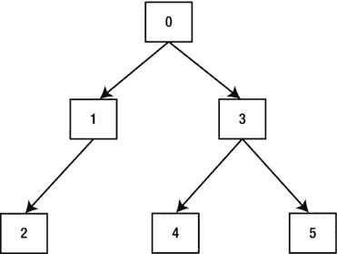

# 执行计划分析与展示

第一个列出的谓词与操作 2 相关。这是一个`filter predicate`（过滤谓词），意味着该谓词在操作生成行之后、输出之前应用于行。在这种情况下，除非`DEPTNO`列匹配特定值，否则这些行会从`TABLE ACCESS FULL`（全表扫描）操作中被拒绝。但是是什么值呢？值`:B1`看起来完全像一个绑定变量，但这个查询中没有任何绑定变量！实际上，如果你尝试将该操作与原始 SQL 文本匹配，你会看到别名为`I`的表实际上来自一个关联子查询，而这个“变量”实际上只是该关联子查询调用时对应的`DEPTNO`值；换句话说，它是来自别名为`E`的表的值。

第二个列出的谓词是一个`access predicate`（访问谓词）。这意味着它实际上用作操作执行的一部分，而不是像过滤谓词那样仅在最后应用。在这种情况下，操作 3 的`HASH JOIN`（哈希连接）使用该谓词来实际执行连接。

最后列出的部分是一个人类可读的注释。它列出了可能有用但没有在计划中其他地方出现的信息。在这种情况下，数据字典中的表没有统计信息，因此使用了动态采样来即时生成一些统计信息。

## EXPLAIN PLAN 可能具有误导性

当你使用`EXPLAIN PLAN`时，你可能期望实际运行语句时运行时引擎使用的执行计划会与之前`EXPLAIN PLAN`调用生成的计划相匹配。这是一个危险的假设！让我提供一个可能不符合此情况的情景。

*   你运行一个语句。CBO 基于当时的可用统计信息生成一个计划，并将其保存在游标缓存中供运行时引擎使用。
*   你收集（或设置）统计信息而没有指定`NO_INVALIDATE=FALSE`。结果，保存在游标缓存中的执行计划没有被作废。
*   你发出`EXPLAIN PLAN`。CBO 基于新的统计信息生成一个计划。
*   你运行你的语句。CBO 不会生成新计划，因为游标缓存中已经存在一个有效的执行计划。运行时引擎使用基于旧统计信息保存的计划。

这不是`EXPLAIN PLAN`可能具有误导性的唯一场景。我将在第 8 章中讨论一个称为“绑定变量窥探”的功能。同样值得注意的是，可能出于某种原因（也许是与安全相关），SQL*Plus 的`AUTOTRACE`功能使用`EXPLAIN PLAN`，而不是尝试从游标缓存中检索实际的执行计划。因此`AUTOTRACE`也可能具有误导性。

现在让我们离开`EXPLAIN PLAN`，看看显示执行计划的其他方法。

## 从游标缓存显示输出

由于`EXPLAIN PLAN`调用可能具有误导性，幸运的是，通常可以在语句运行时或运行后不久从游标缓存中检索实际的执行计划。清单 3-2 中的代码实际上运行了一个 SQL 语句，然后从游标缓存中检索了该计划。默认情况下，`DBMS_XPLAN.DISPLAY_CURSOR`从调用会话最近执行的 SQL 语句中检索计划。

**清单 3-2. 查看游标缓存中的执行计划**

```
SELECT 'Count of sales: ' || COUNT (*) cnt
  FROM sh.sales s JOIN sh.customers c USING (cust_id)
 WHERE cust_last_name = 'Ruddy';
SELECT * FROM TABLE (DBMS_XPLAN.display_cursor);

Count of sales: 1385

SELECT * FROM TABLE (DBMS_XPLAN.display_cursor);

SQL_ID  d4sba28503nxy, child number 0

SELECT 'Count of sales: ' || COUNT (*) cnt   FROM sh.sales s JOIN
sh.customers c USING (cust_id)  WHERE cust_last_name = 'Ruddy'

Plan hash value: 1818178872

| Id  | Operation             | Name      |X| Cost (%CPU)| Time     | Pstart| Pstop |

|   0 | SELECT STATEMENT      |           |X|   832 (100)|          |       |       |
|   1 |  SORT AGGREGATE       |           |X|            |          |       |       |
|*  2 |   HASH JOIN           |           |X|   832   (1)| 00:00:08 |       |       |
|*  3 |    TABLE ACCESS FULL  | CUSTOMERS |X|   423   (1)| 00:00:04 |       |       |
|   4 |    PARTITION RANGE ALL|           |X|   407   (0)| 00:00:05 |     1 |    28 |
|   5 |     TABLE ACCESS FULL | SALES     |X|   407   (0)| 00:00:05 |     1 |    28 |

Predicate Information (identified by operation id):

2 - access("S"."CUST_ID"="C"."CUST_ID")
   3 - filter("CUST_LAST_NAME"='Ruddy')

Note

- this is an adaptive plan
```

你会注意到这次调用的输出看起来有点不同。操作表中标记为“X”的列在现实中并不存在。为了使输出适应页面，我抑制了行和字节列。

## 使用 SH 示例模式和游标缓存

*   你需要对`V$SESSION`、`V$SQL`和`V$SQL_PLAN`具有`SELECT`特权才能使用`DBMS_XPLAN.DISPLAY_CURSOR`函数。通常，我建议授予任何进行诊断工作的用户`SELECT_CATALOG_ROLE`。
*   请注意，SQL*Plus 命令`SET SERVEROUTPUT ON`会在无参数调用`DBMS_XPLAN.DISPLAY_CURSOR`时产生干扰。
*   使用`SH`模式需要具有分区选项的 Oracle 企业版。
*   虽然不是必需的，但我在访问`SH`模式时（以及从现在开始的大多数示例中）将使用 ANSI 连接语法。在这种情况下，ANSI 语法比传统语法更简洁，因为`CUST_ID`连接列在`SH.SALES`和`SH.CUSTOMERS`表中名称相同。

输出以标识语句`SQL_ID`的一行开始。这是`DBMS_XPLAN.DISPLAY`未提供的有用信息。子游标号指示正在显示的具体子游标。

## “游标”一词

“游标”这个词是 Oracle 在太多不同上下文中使用的少数术语之一。我在这里使用的术语与 PL/SQL 数据类型或任何相关的客户端概念无关。在讨论 CBO 和运行时引擎时，“父游标”指的是关于 SQL 语句文本的信息。“子游标”指的是保存的执行计划和安全上下文。子游标被编号，并在 SQL 语句首次解析时从零开始。

下一部分显示的是压缩了空格的 SQL 语句片段。对于较长的语句，该片段是代码的截断版本。之后是计划哈希值和操作表，与`DBMS_XPLAN.DISPLAY`类似。

你可以看到在这种情况下，操作表有两个额外的列：`pstart`和`pstop`。这些列在清单 3-1 中没有出现，因为没有涉及分区表。在清单 3-2 中，列出了访问`SH.SALES`表的分区范围。在这种情况下，所有 28 个分区都被访问，因为没有涉及分区列的谓词。

谓词部分应该看起来很熟悉，因为它与清单 3-1 中的非常相似。

注释部分表明该计划是`自适应的`。我将在第 6 章讨论 Oracle 12cR1 的一个新功能——自适应计划。

## 从 AWR 显示执行计划

使用游标缓存作为执行计划信息来源的局限性在于“缓存”这个词。这个词表明计划可能会消失，如果共享池中的空间开始短缺，它确实会消失。幸运的是，MMON 进程将大多数长时间运行的计划保存在 AWR 中。清单 3-3 展示了如何检索一个可能早已从游标缓存中消失的执行计划。


### 3.3.1 执行计划解析

```
SELECT * FROM TABLE (DBMS_XPLAN.display_awr ('6xvp6nxs4a9n4'));

SQL_ID 6xvp6nxs4a9n4

select nvl(sum(space),0) from recyclebin$ where ts# = :1

Plan hash value: 1168251937

| Id  | Operation                    | Name           | Rows  | Bytes | Cost (%CPU)| Time     |

|   0 | SELECT STATEMENT             |                |       |       |     1 (100)|          |
|   1 |  SORT AGGREGATE              |                |     1 |    26 |            |          |
|   2 |   TABLE ACCESS BY INDEX ROWID| RECYCLEBIN$    |     1 |    26 |     1   (0)| 00:00:01 |
|   3 |    INDEX RANGE SCAN          | RECYCLEBIN$_TS |     1 |       |     1   (0)| 00:00:01 |
```

我在这里所做的是检索一条由 MMON 进程自身用于监控空间的 SQL 语句。它在所有 11gR2 和 12cR1 数据库上都会执行，并且由于一条语句的 `SQL_ID` 在不同数据库间是固定不变的，所以如果你有 11gR2 或 12cR1 数据库，上面的查询应该对你有效。

你可以看到，尽管语句中显然有一个谓词，但此输出中没有谓词部分。如果你检查视图 `DBA_HIST_SQL_PLAN` 的定义，你会看到列 `ACCESS_PREDICATES` 和 `FILTER_PREDICATES`，但截至 12cR1，这些列始终为 `NULL`。我听很多人抱怨过这个麻烦事，但显然存在无法克服的技术问题阻碍了这些列的填充。

### 理解操作

操作是 CBO 为运行时引擎生成以供执行的执行计划组成部分。要调查性能问题，你需要理解它们做什么、如何交互以及耗时多久。让我逐一讨论这些问题。

#### 操作的作用

不幸的是，Oracle 并没有文档化执行计划中的所有操作（尽管从 12cR1 开始，《SQL 调优指南》引入了不少），我们只能靠自己来弄清楚它们实际做什么。我将在第 3 部分介绍涉及表访问和连接的最重要操作，但即使我能声称我了解并理解所有操作（我做不到），我也没有篇幅在这里记录它们。通常你可以通过回溯到原始语句来弄清楚一个操作做什么，但对此要小心。例如，你认为 清单 3-1 中的 `SORT AGGREGATE` 操作做什么？语句中有一个聚合函数 `COUNT`，你可以正确地假设 `SORT AGGREGATE` 函数对输入行进行计数并输出该计数。然而，你可能会被 `SORT` 这个词干扰。排序从何谈起？答案是它没有排序！我做了相当多的测试，并得出结论：`SORT AGGREGATE` 操作从不排序；只需在 SQL*Plus 中用 `AUTOTRACE` 多运行几次类似 清单 3-3 的查询，你就会发现初始解析后就没有排序了！

#### 操作如何交互

和许多人一样，当我看到我的第一个执行计划时，我问的第一个问题是“我从哪里开始？”第二个问题隐含其中：“运行时引擎从哪里开始？”许多人回答这些问题时会说，“从缩进最深的、最顶部的操作开始”，或者类似的说法。在 Oracle 8i 中，这是一种过度简化。在 9i 版本发布并引入了我之前顺便提到过的 hash-join-input-swapping 功能后，这种解释变得极具误导性。一个正确（虽然有些轻率）的答案是，你从 ID 为 0 的操作开始，即你从顶部开始！为了帮助解释从那里该去哪里，你确实需要理解所有这些缩进的含义。操作被组织成一个树形结构，操作 0 是树的根。缩进以一种直观的方式表示了父子关系。图 3-1 展示了如何绘制 清单 3-1 中显示的执行计划，以强调其父子关系。



操作 0 向操作 1 和 3 发起一次或多次协程调用以生成行，操作 1 向操作 2 发起协程调用，操作 3 向操作 4 和 5 发起协程调用。其理念是子操作收集少量行，然后将其传递回其父操作。如果子操作未完成，它会等待被再次调用以继续。

### 协程的概念

你可能对子程序调用的概念很熟悉，但对协程的概念不太熟悉。如果是这种情况，那么做一些关于协程的背景阅读可能会有所帮助，因为这可能有助于你更好地理解执行计划。

让我按照运行时引擎的方式，过一遍 清单 3-1 中的具体操作。

#### 操作 0：SELECT STATEMENT

运行时引擎从 `SELECT STATEMENT` 本身开始。这个特定操作总是至少有一个子项，并且首先调用*最后*一个子项。也就是说，它调用 ID 最高的子项——本例中是操作 3。它等待 `HASH JOIN` 返回行，对于返回的每一行，它调用操作 1 来评估 select 列表中的相关子查询。操作 1 添加额外的列，然后完整的行被输出。如果 `HASH JOIN` 未完成，则再次调用它以检索更多行。

#### 操作 1：SORT AGGREGATE

操作 1 和 2 与 select 列表中的相关子查询有关。我已在 清单 3-1 中高亮显示了相关子查询和关联的操作。在 SQL 语句执行过程中，操作 1 被多次调用，每次都被传入来自主查询的 `DEPTNO` 作为输入。它调用其子操作，即操作 2，传递 `DEPTNO` 参数，执行一次 `TABLE ACCESS FULL` 并将行传回。`SORT AGGREGATE` 所做的就是对这些行进行计数然后丢弃它们。当计数返回后，它将其单行单列输出传递给其父操作：操作 0。你可以看到此操作的估计基数为 1，这证实了对该操作功能的理解。

#### 操作 2：TABLE ACCESS FULL

因为在 SQL 语句执行过程中操作 1 被多次调用，而操作 1 总是调用一次操作 2，所以操作 2 在整个语句执行过程中也被多次调用。它每次执行一个 `TABLE ACCESS FULL`。当行从该操作返回时，但在返回给操作 1 之前，会应用过滤谓词；行中的 `DEPTNO` 与输入的 `DEPTNO` 参数进行匹配，如果行不匹配则被丢弃。

#### 操作 3：HASH JOIN


此操作执行 `EMP` 和 `DEPT` 表的连接。该操作首先调用其第一个子操作，即操作 4，随着行的返回，它们被放入一个内存中的哈希集群中。一旦 `DEPT` 表的所有行都已返回且操作 4 完成，操作 5 便开始执行。随着操作 5 的行的返回，它们会与从操作 4 返回的行进行匹配，并且假设有一个或多个行匹配，则它们被返回给操作 0 进行进一步处理。对于 `HASH JOIN`（或任何连接操作），总是恰好有两个子操作，并且每个子操作在每次调用连接时都会被调用一次。

## 操作 4 和 5：全表扫描

这些操作对 `EMP` 和 `DEPT` 表执行全表扫描，并将其结果直接传回其父操作，即操作 3。这些操作上没有谓词，并且在本例中，也没有子操作。

## 操作如何交互（总结）

你可以看到，实际上在任何时间点都有多个操作在进行中。随着从操作 5 返回的行被操作 3 连接并传回操作 0，操作 0 随后调用操作 1，并间接调用操作 2。“最顶层的最内层”操作是操作 2，它是最后一个开始并且几乎是最后一个完成的，所以这个理论被打破了。

## 操作需要多长时间？

我必须在强调和唠叨之间取得平衡，但请允许我再次提醒你，在此阶段，我谈论的只是 CBO 认为操作需要运行多长时间，而不是它们在实践中实际运行多长时间。即使是来自 `DBMS_XPLAN.DISPLAY_CURSOR` 和 `DBMS_XPLAN.DISPLAY_AWR` 的数据也仍然是初始估计值（在默认显示中），而不是实际的已用时间。分析 SQL 语句性能的大部分工作在于识别初始估计值与实际现实之间的差异。我将在第四章介绍如何识别实际的基数（cardinality）和运行时间。

我已经指出，基数估计（标题为 "rows" 的列）是基于单次调用的。成本（cost）和时间（time）列也是基于单次调用的。如果你再次查看清单 3-1，你会看到操作 2 和操作 5 的成本是相同的，尽管操作 2 被调用了多次，而操作 5 只被调用了一次。我不确定为什么数据是以这种方式呈现的，但事实就是如此。

## INLIST 迭代器和分区范围操作

解释如何阅读执行计划如此困难的原因之一，是存在太多例外情况。对于 `INLIST ITERATOR` 和 `PARTITION RANGE` 操作符，子操作（实际上是所有后代操作）报告的行数、字节数、成本和时间列反映的是所有调用的累计成本，而不是单个调用的成本。

父操作的成本/时间包括其子操作的成本。所以在清单 3-1 中，你可以看到操作 3 的成本是 7，而它的两个子操作 4 和 5 的成本各为 3。这意味着 `HASH JOIN` 本身预计有 1 的开销（似乎全是 CPU……这说得通）。

但是等等。`SELECT STATEMENT` 本身的成本是 7。子查询的成本去哪了？这些子查询的成本各为 3，而运行时引擎执行了多个这样的子查询。这纯粹是一个错误。如果你想看看另一个错误，可以查看清单 3-2 和 3-3 中报告的操作 0 的成本所占 CPU 百分比。这些百分比是 100%，并且对于操作 0，在 `DBMS_XPLAN.DISPLAY_CURSOR` 和 `DBMS_XPLAN.DISPLAY_AWR` 的情况下，它们总是 100%。这类异常比比皆是，我指出这些问题只是因为当你第一次尝试理解执行计划时，你很可能会认为这些异常反映了你从根本上理解不足。但在这些情况下并非如此。

## 总结

在本章中，我通过示例介绍了展示和解读一些具有基本格式的简单 SQL 语句的技术。即使对于这些简单的例子，仍有很多未作解释的地方，但当我再介绍几个概念后，其中一些问题将得到解答。

好消息是，当我们查看运行时引擎产生的实际统计数据时，我们在查看 CBO 初始估计时看到的许多异常行为就消失了。那么，让我们在第四章中继续探讨吧。

