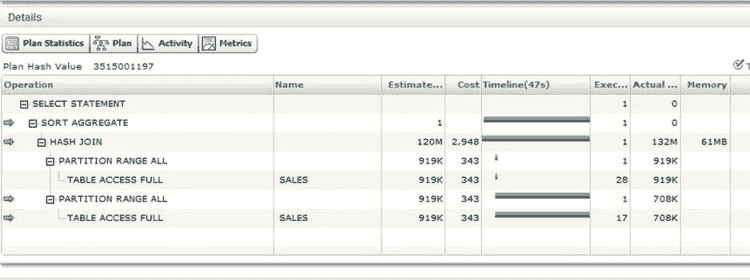

# SQL 性能监控器

`V$SQL_PLAN_STATISTICS_ALL` 中的统计信息存在三大缺陷：

*   只有将 `STATISTICS_LEVEL` 设置为 `ALL` 时，这些统计信息才可用。正如前面所讨论的，在某些硬件平台上这不会造成问题，但在其他平台上可能会出现问题。
*   这些信息仅在语句执行完成后才可用。
*   当使用并行查询操作时，`LAST` 统计信息会缺失或不正确。

这些缺陷使得诊断某些问题变得困难。幸运的是，Oracle Database 11gR1 引入了 SQL 性能监控器，它有助于克服所有这些不足。

可以通过 Enterprise Manager 或在 SQL*Plus 中调用 `DBMS_SQLTUNE.REPORT_SQL_MONITOR` 来访问 SQL 性能监控器报告。在这里，我将重点介绍后一种机制。列表 4-6 展示了可用于生成 HTML 报告的两个小型脚本。就个人而言，在详细分析时，我并不太喜欢多彩的图表。我随时都喜欢文本输出和电子表格。然而，在这种情况下，即使是我也会总是生成 HTML 输出。让我来告诉你为什么。

你应该将 列表 4-6 中的前两段代码分别保存为 PC 上的两个独立脚本。第三段代码展示了如何调用这些脚本。当你调用脚本时，一个 HTML 文件会生成在 C:\Temp 目录下，如果你愿意，这个路径显然可以更改。

列表 4-6. 用于生成带有 SQL 性能监控器的 HTML 报告的脚本

```
-- 将此代码放入 GET_MONITOR_SID.SQL

SET ECHO OFF TERMOUT OFF LINES 32767 PAGES 0 TRIMSPOOL ON VERIFY OFF LONG 1000000 LONGC 1000000
SPOOL c:\temp\monitor.html REPLACE

SELECT DBMS_SQLTUNE.report_sql_monitor (session_id => &sid, TYPE => 'ACTIVE')
  FROM DUAL;

SPOOL OFF
SET TERMOUT ON

-- 将此代码放入 GET_MONITOR_SQLID.SQL

SET ECHO OFF TERMOUT OFF LINES 32767 PAGES 0 TRIMSPOOL ON VERIFY OFF LONG 1000000 LONGC 1000000
SPOOL c:\temp\monitor.html REPLACE

SELECT DBMS_SQLTUNE.report_sql_monitor (sql_id   => '&sql_id'
                                       ,TYPE     => 'ACTIVE')
  FROM DUAL;

SPOOL OFF
SET TERMOUT ON PAGES 900 LINES 200

-- 从 SQL*Plus 调用 GET_MONITOR_SID.SQL 的示例

DEFINE SID=123
@GET_MONITOR_SID
```

注意 `SPOOL` 语句之前的 SQL*Plus 格式化行。这些对于确保输出可用非常重要。

下一步是在浏览器中将一个书签指向 `file:///c:/temp/monitor.html`。你只需点击此书签，你最新的监控报告就会出现！

输出包含了 `V$SQL_PLAN_STATISTICS_ALL` 中几乎所有可用信息，甚至更多。图 4-1 展示了 SQL 性能监控器报告的一部分。



图 4-1. SQL 性能监控器报告片段

图 4-1 中的截图来自一个正在运行的查询。你看到左边的箭头了吗？这些箭头显示了当前正在进行的操作。数据正从 `SALES` 表中读取，随着行被生成，它们正通过 `HASH JOIN` 进行匹配，然后通过 `SORT AGGREGATE` 操作进行聚合。请记住，`SORT AGGREGATE` 并不排序！

第五列中的 47 秒时间线显示，第一次全表扫描很快，但第二次运行得较慢。这里你必须小心。此报告所示的时间线数字显示了操作首次变为活动状态的时间以及它们（如果）停止活动的时间点；它包含了父操作和子操作处理行所花费的时间。将此与 `V$SQL_PLAN_STATISTICS_ALL` 对比，后者报告的时间包含了子操作但不包含父操作。SQL 性能报告中包含大量信息，所以请多尝试使用它。

不幸的是，SQL 性能监控器并非 `V$SQL_PLAN_STATISTICS_ALL` 的完全替代品。例如，从 图 4-1 中无法判断当前运行的四个操作中哪一个占用了时间。这只有在查询完成后，才能在 `V$SQL_PLAN_STATISTICS_ALL` 中看到。关于 SQL 性能监控器，还有几点最后的注意事项：

*   语句通常仅在运行超过五秒后才会被监控。你可以通过 `MONITOR` 和 `NO_MONITOR` 提示来覆盖此规则。
*   受监控的 SQL 语句的数据保存在一个循环缓冲区中，因此在繁忙的系统中，这些数据可能很快就会被清除。

