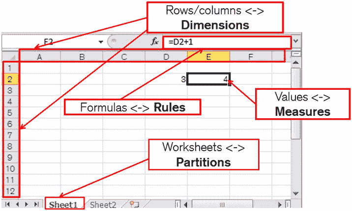

# 窗口分析子句

清单 7-12 中的查询按 `SALES_AMOUNT` 对 `T1` 表中的 100 行进行排序。该语句的执行计划看起来与清单 7-10 和 7-11 中的相同，因此我没有再次展示。`NTILE` 函数用于识别百分位数，其参数指示数量。在此案例中，该函数为 `SALES_AMOUNT` 值最低的 25 行（即最低四分位数中的行）返回 1，为第二四分位数的 25 行返回 2，为第三四分位数的 25 行返回 3，为 `SALES_AMOUNT` 值最高的 25 行返回 4。

可以在同一个函数调用中组合查询分区子句和排序子句。清单 7-13 展示了如何实现这一点，并同时引入了一个新的分析函数。

清单 7-13. LAG 分析函数

```sql
 SELECT t1.*
        ,LAG (sales_amount)
            OVER (PARTITION BY channel_id, cust_id ORDER BY transaction_date)
            prev_sales_amount
    FROM t1
ORDER BY channel_id, sales_amount;
```

`LAG` 函数从较早的行中选取表达式的值。该函数接受三个参数。

*   第一个参数是必需的，是要选取的列或表达式
*   第二个参数是可选的，表示要回溯的行数，默认为 1，即前一行
*   第三个也是最后一个可选参数，是指定当偏移量超出窗口范围时返回的值。如果未指定第三个参数，则默认为 `NULL`。

这个对 `LAG` 函数的调用通过根据 `CHANNEL_ID` 和 `CUST_ID` 的不同值将 100 行逻辑上分成 20 组，每组 5 行来操作。在每组内，我们按 `TRANSACTION_DATE` 排序，取前一行的 `SALES_AMOUNT` 值。换句话说，我们看到一笔交易的详细信息，以及同一客户使用同一渠道进行的上一笔交易的 `SALES_AMOUNT`。清单 7-14 展示了输出的几行示例。

清单 7-14. 清单 7-13 的示例输出

```
TRANSACTION_DATE        CHANNEL_ID      CUST_ID SALES_AMOUNT    PREV_SALES_AMOUNT
20/01/2014              1               1       400
09/02/2014              1               1       1600            400
01/03/2014              1               1       3600            1600
21/03/2014              1               1       9400            3600
10/04/2014              1               1       10000           9400
16/01/2014              1               2       256
```

请注意，**高亮**的行是其组内的第一行。在此案例中，`LAG` 返回 `NULL`，因为我们没有为函数指定三个参数。你应该知道还有一个 `LEAD` 函数调用。它从后续行而非前序行取值。


**注意** 使用降序排序调用 `LEAD` 所得的值与使用升序排序调用 `LAG` 所得的值相同，反之亦然。只有 `WINDOW SORT` 操作返回的行的顺序会改变。

窗口子句是三种类型子句中最复杂的，但也最有用的之一。它的使用规则相当复杂，我在这里只能做一个介绍。

*   窗口子句仅允许用于一部分 NSAF（非 SQL 聚合函数）。
*   如果指定了窗口子句，则也需要 `order by` 子句。
*   对于那些支持窗口子句的函数，如果提供了 `order by` 子句，则隐含默认的窗口子句。

与查询分区子句类似，窗口子句将分析函数限制在行的一个子集内，但与查询分区子句不同的是，它的范围是动态的。考虑清单 7-15，它展示了窗口子句的实际应用。

清单 7-15. 移动平均值的实现

```sql
SELECT t1.*
      ,AVG (
          sales_amount)
       OVER (PARTITION BY cust_id
             ORDER BY transaction_date
             ROWS BETWEEN 2 PRECEDING AND CURRENT ROW)
          mov_avg
  FROM t1;

-- 示例输出

TRANSACTION_DATE        CHANNEL_ID      CUST_ID SALES_AMOUNT    MOV_AVG
05-JAN-14               2               1           25          25
10-JAN-14               3               1           3100        1562.5
15-JAN-14               4               1           225         1116.66666666667
20-JAN-14               1               1           400         1241.66666666667
```

清单 7-15 实现了一个传统的移动平均值计算，包括当前行及其之前的两行（假设它们存在）。该函数返回的值是该客户最近三笔交易的平均 `SALES_AMOUNT`。示例输出显示了 `CUST_ID` 为 1 的一些行。第一行的窗口只有一行，第二行提供了前两行的平均值，第三行及之后的行在该组内平均三个数字。因此，第四行提供了 3100、225 和 400 的平均值，即 1241⅔。

默认的窗口规范是 `ROWS BETWEEN UNBOUNDED PRECEDING AND CURRENT ROW`，它的一个非常常见的用途是实现累计总计，如清单 7-16 所示。

清单 7-16. 使用带隐含窗口子句的 SUM 实现累计总计

```sql
SELECT t1.*
      ,SUM (sales_amount)
          OVER (PARTITION BY cust_id ORDER BY transaction_date)
          moving_balance
  FROM t1;

-- 示例输出（前几行）

TRANSACTION_DATE        CHANNEL_ID      CUST_ID SALES_AMOUNT    MOVING_BALANCE
05-JAN-14               2               1               25      25
10-JAN-14               3               1               3100    3125
15-JAN-14               4               1               225     3350
20-JAN-14               1               1               400     3750
```

乍一看，与 `SUM` 函数一起使用的 `order by` 子句似乎很荒谬，因为无论顺序如何，一组值的总和都是一样的。然而，由于 `SUM` 支持窗口，`order by` 子句的隐含意义是，我们只对当前行和之前的行求和；窗口子句是隐含的。你看出 `SALES_AMOUNT` 的值是如何在 `MOVING_BALANCE` 列中累加的吗？

窗口也支持逻辑范围。清单 7-17 展示了一个逻辑范围的例子。

清单 7-17. 在指定时间段上的窗口

```sql
 SELECT t1.*
    ,AVG (
        sales_amount)
     OVER (PARTITION BY cust_id
           ORDER BY transaction_date
           RANGE INTERVAL '10' DAY PRECEDING)
        mov_avg
FROM t1;
```

清单 7-17 中的查询指定，截止到当前行交易日期的十一天内进行的交易都包含在窗口中。请注意，我这里对窗口规范进行了缩写；默认情况下，窗口在当前行或当前值处关闭。由于 `T1` 中数据的设置方式，清单 7-17 的输出与清单 7-15 中的输出相同。


 `Note` 当使用逻辑范围时，`CURRENT ROW` 关键字（在 Listing 7-17 中是隐式的）实际上意味着当前值。因此，如果存在多行与当前行的 `TRANSACTION_DATE` 值相同，那么分析函数会将所有此类行的 `SALES_AMOUNT` 值都包含在其平均值计算中。

## 为何窗口化仅限于 NSAF（非排序聚合函数）

不久前，一位客户要求我实现一个移动中位数，类似于 Listing 7-15 中的移动平均。我无法在带有窗口子句的情况下使用 `MEDIAN` 函数，因为窗口化对于 `MEDIAN` 函数不受支持，这样做效率低下。

要理解计算移动中位数为何如此困难，让我们再看一下 Listing 7-15 中显示的示例输出。在计算最后一个 `MOVING_BALANCE` 之前，窗口需要“滑动”以排除第一行并包含第四行。结果窗口中包含的行已高亮显示。为了使这种“滑动”操作高效，`WINDOW SORT` 操作已经按 `CUST_ID` 和 `TRANSACTION_DATE` 对行进行了排序。

一旦确定了窗口中的行，就该调用分析函数了。对于像 Listing 7-15 中使用的 `AVG` 这样的 NSAF，这只是像往常一样扫描值并跟踪累计值的问题。

 `Note` 对于许多函数，包括 `AVG`，理论上可以不必每次都扫描窗口中的所有行来计算新值。然而，对于像 `MAX` 和 `MIN` 这样的函数，扫描是必需的。

现在假设我们想为 `SALES_AMOUNT` 计算一个移动中位数，而不是移动平均。我们窗口中的行已按 `TRANSACTION_DATE` 排序，并且必须重新按 `SALES_AMOUNT` 排序。每次窗口滑动到 `T1` 中的新行时，都需要进行这种重新排序。对于任何需要排序的聚合函数，都可以提出同样的论点。

当然，无论计算效率如何，我的客户仍然需要移动中位数功能！当我们讨论 `MODEL` 子句时，我会再回到我如何解决这个问题。

## 分析作为一把双刃剑

这些分析功能看起来确实很酷。分析函数允许我们编写简洁高效的代码，同时还能用我们的 SQL 能力给朋友留下深刻印象！还有什么比这更好的呢？实际上，还有很多。

让我创建一个新表 `T2`，它展示分析函数如何更经常地将你引入性能泥潭，而不是将你从中解救出来。Listing 7-18 展示了一个测试案例，类似于几年前天真的 Tony Hasler 开发来展示分析函数有多快的案例。结果令我大吃一惊！

Listing 7-18. 分析函数的缺点

```sql
CREATE TABLE t2
(
   c1            NUMBER
  ,c2            NUMBER
  ,big_column1   CHAR (2000)
  ,big_column2   CHAR (2000)
);

INSERT /*+ APPEND */ INTO t2 (c1
               ,c2
               ,big_column1
               ,big_column2)
       SELECT ROWNUM
             ,MOD (ROWNUM, 5)
             ,RPAD ('X', 2000)
             ,RPAD ('X', 2000)
         FROM DUAL
   CONNECT BY LEVEL <= 50000;

COMMIT;

WITH q1
     AS (  SELECT c2, AVG (c1) avg_c1
             FROM t2
         GROUP BY c2)
SELECT *
  FROM t2 NATURAL JOIN q1;

| Id  | Operation            | Name | Rows  | Bytes | Cost (%CPU)| Time     |

|   0 | SELECT STATEMENT     |      | 50000 |   192M| 27106   (1)| 00:00:02 |
|*  1 |  HASH JOIN           |      | 50000 |   192M| 27106   (1)| 00:00:02 |
|   2 |   VIEW               |      |     5 |   130 | 13553   (1)| 00:00:01 |
|   3 |    HASH GROUP BY     |      |     5 |    40 | 13553   (1)| 00:00:01 |
|   4 |     TABLE ACCESS FULL| T2   | 50000 |   390K| 13552   (1)| 00:00:01 |
|   5 |   TABLE ACCESS FULL  | T2   | 50000 |   191M| 13552   (1)| 00:00:01 |

Predicate Information (identified by operation id):

1 - access("T2"."C2"="Q1"."C2")

SELECT t2.*, AVG (c1) OVER (PARTITION BY c2) avg_c1 FROM t2;

| Id  | Operation          | Name | Rows  | Bytes |TempSpc| Cost (%CPU)| Time     |

|   0 | SELECT STATEMENT   |      | 50000 |   191M|       | 55293   (1)| 00:00:03 |
|   1 |  WINDOW SORT       |      | 50000 |   191M|   195M| 55293   (1)| 00:00:03 |
|   2 |   TABLE ACCESS FULL| T2   | 50000 |   191M|       | 13552   (1)| 00:00:01 |
```

Listing 7-18 创建了一个测试表，然后执行了两个产生完全相同结果的查询。第一个查询是那些对分析函数一无所知、但热衷于展示子查询因子分解和 ANSI 语法知识的初级程序员的典型写法。CBO 似乎认为将有 58 亿行数据占用 21TB 空间。所有这些可怕的情况当然应该避免。

Listing 7-18 中的第二个查询看起来高效得多。我们消除了那个“冒犯性”的对 `T2` 的第二次全表扫描。太好了——那么为什么第二个查询的估计（和实际）耗时比第一个还高呢？

问题的线索在于执行计划中名为“TempSpc”（临时表空间）的列，该列仅出现在第二个查询的执行计划中。分析函数的一大问题是排序是基于*整个结果集*的。假设的初级程序员的 SQL 中聚合的数据排除了 `BIG_COLUMN1` 和 `BIG_COLUMN2`。因此，我们可以在内存中聚合数据，并且由于 `AVG` 是 NSAF，我们根本不需要任何排序！除非你有足够大的 SGA，否则你永远无法在内存中对第二个查询的数据进行排序，而基于磁盘的排序将比多一次全表扫描耗时更长。

 `Note` Listing 17-18 中显示的执行计划是在一个拥有 512Mb SGA 的数据库上准备的。如果你在一个拥有大 SGA 的数据库上尝试运行这些示例，你可能需要将 `T2` 中的行数从 50,000 增加到更大的值才能看到效果。同样，如果你发现第二个查询耗时过长，你可能需要将行数减少到一个更小的值。

## 聚合函数与分析函数结合使用

分析函数在任何可选聚合之后进行计算。这个事实的第一个后果是分析函数不能出现在 `WHERE` 子句、`GROUP BY` 子句或 `HAVING` 子句中；分析函数只能与 `MODEL` 子句一起使用，作为选择列表的一部分，或者作为 `ORDER BY` 子句中表达式的一部分。分析函数被较晚评估的第二个后果是，聚合的结果可以用作分析函数的输入。Listing 7-19 给出了一个例子。

Listing 7-19. 结合聚合函数和分析函数

```sql
 SELECT cust_id
        ,COUNT (*) tran_count
        ,SUM (sales_amount) total_sales
        ,100 * SUM (sales_amount) / SUM (SUM (sales_amount)) OVER ()
            pct_revenue1
        ,100 * ratio_to_report (SUM (sales_amount)) OVER () pct_revenue2
    FROM t1
GROUP BY cust_id;

| Id  | Operation           | Name |

|   0 | SELECT STATEMENT    |      |
|   1 |  WINDOW BUFFER      |      |
|   2 |   HASH GROUP BY     |      |
|   3 |    TABLE ACCESS FULL| T1   |
```


## 数据示例

```
CUST_ID  TRAN_COUNT    TOTAL_SALES    PCT_REVENUE1           PCT_REVENUE2
1        20            80750          21.2302781889455       21.2302781889455
2        20            69673          18.3179835573796       18.3179835573796
4        20            76630          20.1470739024012       20.1470739024012
5        20            78670          20.6834177724377       20.6834177724377
3        20            74630          19.621246578836        19.621246578836
```

清单 7-19 将 `T1` 表中的 100 行数据聚合为五组，每组对应一个 `CUST_ID`。我们使用聚合函数来计算 `TRAN_COUNT`（与该客户的交易数量）和 `TOTAL_SALES`（该客户的 `SALES_AMOUNT` 总和）。从执行计划中可以看出，此时，操作 2 中哈希聚合的结果被传递给支持非分区 NSAF 分析函数调用的 `WINDOW BUFFER` 操作。

最后两列 `PCT_REVENUE1` 和 `PCT_REVENUE2` 显示了客户贡献的收入百分比。尽管这两列的值相同，但计算方式略有不同。`PCT_REVENUE1` 是通过将客户的聚合 `SALES_AMOUNT` 总和除以所有客户的聚合销售总额来计算的。`PCT_REVENUE2` 则使用了特殊的分析函数 `RATIO_TO_REPORT`，这使得编写此类表达式更加容易。

我认为有些人可能会觉得这种 SQL 难以阅读，我也不建议您将 清单 7-19 视为良好的编码实践。编写 清单 7-19 中 SQL 的一个稍长但更清晰的方式如 清单 7-20 所示。

## 通过子查询分离聚合与分析

```
WITH q1
     AS (  SELECT cust_id, COUNT (*) tran_count, SUM (sales_amount) total_sales
             FROM t1
         GROUP BY cust_id)
SELECT q1.*
      ,100 * total_sales / SUM (total_sales) OVER () pct_revenue1
      ,100 * ratio_to_report (total_sales) OVER () pct_revenue2
  FROM q1;
```

CBO 能够轻松地将 清单 7-20 中的查询转换为 清单 7-19 中的形式，这两个查询具有相同的执行计划。

## 单行函数

SQL 语言参考手册中创造的术语 *“单行函数”* 有些误导性，因为所提到的函数可以应用于从多行聚合而来的数据。单行函数通常被称为 *标量函数*，但这种说法并不准确，因为该类别中的某些函数，例如 `SET`，操作的是非标量数据。清单 7-21 展示了此类函数的几个有趣案例。

## 各种上下文中的单行函数

```
 SELECT GREATEST (
            ratio_to_report (FLOOR (SUM (LEAST (sales_amount, 100)))) OVER ()
           ,0)
            n1
    FROM t1
GROUP BY cust_id;

| Id  | Operation           | Name |

|   0 | SELECT STATEMENT    |      |
|   1 |  WINDOW BUFFER      |      |
|   2 |   HASH GROUP BY     |      |
|   3 |    TABLE ACCESS FULL| T1   |
```

这个查询没有做任何有意义的事情，因此我没有列出结果。构建这个查询纯粹是为了展示单行函数如何工作。基本的评估规则是：

*   单行函数在查询块的所有子句的表达式中都是有效的。
*   如果单行函数的参数包含一个或多个分析函数，则单行函数在分析函数之后评估；否则，单行函数在任何分析之前评估。
*   如果单行函数的参数包含一个或多个聚合函数，则单行函数在聚合之后评估；否则，单行函数在任何聚合之前评估（除非参数包含分析函数）。

让我们看看这些规则如何影响用于评估查询中 `N1` 的各种标量函数。

*   单行函数 `LEAST` 的参数不包含聚合或分析函数，因此 `LEAST` 在任何聚合或分析之前评估。
*   单行函数 `FLOOR` 的参数是一个聚合函数，因此 `FLOOR` 在聚合之后但在分析之前评估。
*   单行函数 `GREATEST` 的参数包含一个分析函数，因此 `GREATEST` 函数在分析之后评估。

## MODEL 子句

在投资银行界（可能还有其他行业）存在一种普遍行为，监管机构对此越来越不认可。这种行为是业务人员将数据库查询结果下载到 Excel 电子表格中，然后使用 Visual Basic 函数在其中执行复杂的计算。我听说过一个案例，这些计算非常复杂，需要超过 45 分钟才能运行！监管机构对这类事情的问题在于，对这些电子表格的变更通常控制很少。我们作为技术人员应该注意到的问题是，当有一个拥有大量 CPU 的巨型数据库服务器可以更快地执行这些计算时，在台式机上执行如此复杂的计算是不合适的。

为了解决这个问题，Oracle 在 10g 中引入了 `MODEL` 子句。事实上，关键字 `SPREADSHEET` 是 `MODEL` 的同义词，这一事实强调了该子句的正常使用。在本节中，我将简要介绍其概念。如果您有真正需要使用 `MODEL` 子句，应查阅数据仓库指南中名为 *SQL for Modeling* 的章节。

## 电子表格概念

Oracle 提供的文档中缺少的一点是将 `MODEL` 子句的术语和概念与 Excel 电子表格的术语和概念进行比较。考虑到 Excel 不是 Oracle 提供的产品，这并不奇怪！让我现在来纠正这一点。俗话说一图胜千言，那么请看 图 7-1。



图 7-1 Excel 与 MODEL 子句概念比较

*   Excel 工作簿被拆分为一个或多个工作表。等效的 `MODEL` 子句概念是 `PARTITION`。这是这个重载术语的另一种用法！
*   工作表包含许多值。等效的 `MODEL` 子句概念是 `MEASURE`。
*   工作表中的值通过行号和列字母引用。在 `MODEL` 分区中，度量通过 `DIMENSION` 值引用。
*   Excel 电子表格中的某些值是通过公式计算的。`MODEL` 子句中的公式被称为 `RULES`。

Excel 和 `MODEL` 子句概念之间存在一些重要差异，这些差异总结在 表 7-1 中。

## Excel 与 MODEL 子句概念之间的差异


