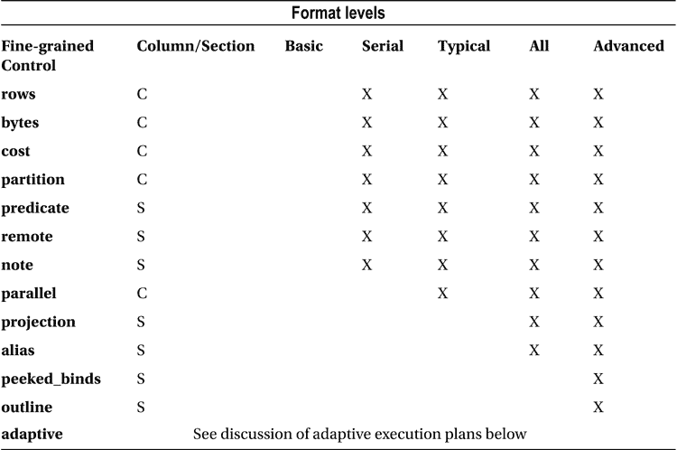

# MODEL 子句详解与移动中位数实现

## 模型术语与 Excel 术语对比

| 模型术语 | Excel 术语 | 差异 |
| --- | --- | --- |
| 分区 (Partition) | 工作表 (Worksheet) | 一个 Excel 工作表中的公式可以引用另一个工作表中的单元格。模型子句中的分区则不能相互引用。 |
| 维度 (Dimension) | 行和列 | Excel 中始终恰好有两个维度。模型子句中则有一个或多个维度。 |
| 度量 (Measure) | 单元格值 | Excel 中只有由维度引用的一个值。模型子句允许一个或多个度量。 |
| 规则 (Rules) | 公式 | 模型中可以实现嵌套的单元格引用。 |

## 使用 MODEL 子句实现移动中位数

还记得我们不能在窗口子句中将 `MEDIAN` 作为分析函数使用，因为数据库不支持它吗？清单 7-22 展示了如何用 `MODEL` 子句实现移动中位数。

清单 7-22. 使用 MODEL 子句实现移动中位数

```sql
ALTER SESSION FORCE PARALLEL QUERY PARALLEL 3;

SELECT transaction_date,channel_id,cust_id,sales_amount,mov_median,mov_med_avg
  FROM t1
MODEL
   PARTITION BY (cust_id)
   DIMENSION BY (ROW_NUMBER () OVER (PARTITION BY cust_id ORDER BY transaction_date) rn)
   MEASURES (transaction_date, channel_id, sales_amount, 0 mov_median, 0 mov_med_avg)
   RULES
      (
      mov_median [ANY] =
            MEDIAN (sales_amount)[rn BETWEEN CV()-2 AND CV ()],
      mov_med_avg [ANY] = ROUND(AVG(mov_median) OVER (ORDER BY rn ROWS 2 PRECEDING))
)
ORDER BY cust_id,transaction_date,mov_median;

ALTER SESSION ENABLE PARALLEL QUERY;

-- 示例输出

TRANSACTION_DATE       CHANNEL_ID       CUST_ID  SALES_AMOUNT   MOV_MEDIAN      MOV_MED_AVG
05-JAN-2014            2                1               25      25              25
10-JAN-2014            3                1               3100    1562.5          794
15-JAN-2014            4                1               225     225             604
20-JAN-2014            1                1               400     400             729

| Id  | Operation                      | Name     |
| --- | --- | --- |
|   0 | SELECT STATEMENT               |          |
|   1 |  PX COORDINATOR                |          |
|   2 |   PX SEND QC (ORDER)           | :TQ10002 |
|   3 |    SORT ORDER BY               |          |
|   4 |     SQL MODEL ORDERED          |          |
|   5 |      PX RECEIVE                |          |
|   6 |       PX SEND RANGE            | :TQ10001 |
|   7 |        WINDOW SORT             |          |
|   8 |         PX RECEIVE             |          |
|   9 |          PX SEND RANGE         | :TQ10000 |
|  10 |           PX BLOCK ITERATOR    |          |
|  11 |            TABLE ACCESS FULL   | T1       |
|  12 |      WINDOW (IN SQL MODEL) SORT|          |
```

清单 7-22 中的代码首先强制并行查询。我这样做只是为了演示 `MODEL` 子句的并行化能力；数据集通常太小，不值得使用并行查询。

该查询首先从 `T1` 中选择所有行和列，并将数据传递给 model 子句。

*   我们看到的第一个子句是可选的 `PARTITION BY` 子句。这意味着每个 `CUST_ID` 的数据被单独处理——可以认为是在自己的工作表中。
*   第二个子句是 `DIMENSION BY` 子句，其表达式中包含一个分析函数。该子句定义了一个新的标识符 `RN`，它按事务日期给出了工作表中行的排序。通常我会使用类似于 清单 7-20 中的因子化子查询来使查询更易读，但这里我只是展示可能的做法。
*   `MEASURES` 子句标识了我们的 `RN` 维度所引用的值。这些包括来自 `T1` 的剩余列以及两个新列。`MOV_MEDIAN` 将是最近三次交易的中位数，`MOV_MED_AVG` 将是最近三次交易的 `MOV_MED` 的平均值。这些标识符被初始化为零，以便度量的数据类型是已知的。
*   `RULES` 子句随后计算我们缺失的度量。

第一条规则使用 `MEDIAN` 作为聚合函数，在 `MODEL` 子句中我们可以显式指定要使用的度量范围。右侧方括号中的表达式是：

```sql
rn BETWEEN CV()-2 AND CV ()
```

术语 `CV` 是 `CURRENT_VALUE` 的缩写，这是模型类别中的一个函数，仅在 `MODEL` 子句内合法。`CV` 函数非常类似于 Excel 中的相对单元格引用。因此，例如，当维度 `RN` 的值为 7 时，整个表达式将被解释为 `rn BETWEEN 5 AND 7`。请注意，我们在 `RULES` 子句中应用聚合函数是在 `DIMENSION BY` 子句中的分析函数之后。这是合法的，因为 `RULES` 子句独立于查询块的其余部分运行。

第二条规则在第一条之后进行评估，因此可以使用在第一条规则中计算的 `MOV_MEDIAN` 度量作为输入，就像 Excel 中一个公式的结果可以作为另一个公式的输入一样。我本可以像计算 `MOV_MED_median` 一样计算 `MOV_MED_AVG`，但在这种情况下，我可以选择使用分析函数，这就是我所选择的做法。

在度量由规则评估后，结果被传回选择列表和 `ORDER BY` 子句。我将 `MOV_MEDIAN` 包含在 `ORDER BY` 子句中只是为了展示这是可能的，并没有其他原因。

清单 7-22 中的执行计划有点长，但这更多是与并行化有关，而不是 `MODEL` 子句；`MODEL` 子句中的各个规则不会在执行计划中显示。关于执行计划，我想提到的第一点是操作 7 和操作 12 之间的区别。操作 7 用于在 `MODEL` 子句外部评估 `ROW_NUMBER` 分析函数，操作 12 用于在 `MODEL` 子句内部评估 `AVG` 分析函数，正如您可能从操作名称 `WINDOW (IN SQL MODEL) SORT` 猜到的那样。没有针对 `MEDIAN` 聚合函数的可见操作。我想在执行计划中强调的另一点是操作 6。它检查 `CUST_ID` 的值以确定将数据发送到哪个并行查询从属进程；`MODEL` 子句规则评估的并行化总是基于 `PARTITION BY` 子句中的表达式，以防止并行查询从属进程之间需要任何通信。

## 为什么不用 PL/SQL？

`MODEL` 子句看起来像是异端！SQL 应该是一种声明性编程语言，而我们在这里编写一系列规则，并指定计算的执行方式和顺序。我们有像 PL/SQL 这样具有等效并行化能力的命令式编程语言来处理这些，不是吗？


需要认识到的关键点是，SQL 是**声明式**（`declarative`）的，并且有能力同时对`多行`进行操作。而 PL/SQL 等命令式语言则是**命令式**（`imperative`）且基于**单行**的。`MODEL`子句为我们提供的，正是能够一次性操作`多行`的**命令式**语法。想象一下，在 PL/SQL 中实现一个移动中位数该有多困难！

## 总结

本书的一个反复出现的主题是，你对事物理解得越透彻，就越容易正确地分析问题并找到这些问题的良好解决方案。本章开头，我们先看了看查询块的语法，因为如果不理解该语法，执行计划的某些方面就会难以理解。接着，我们介绍了函数。透彻理解 SQL 函数的主要类别，对于理解日益增多的、与为访问表选择索引或确定正确的连接顺序无关的性能问题至关重要。特别是，我们看到了分析函数处理的数据量如何使其在某些情况下缺乏吸引力。最后，我们介绍了`MODEL`子句这一复杂主题，并解释了如何在无法轻易通过其他方式执行计算时，使用它来对行集进行分析计算。

本章标志着我们对 SQL 语言本身分析的结束。现在是回到性能分析主题的时候了。在第 8 章，我们将完成从第 3 章开始的关于执行计划的研究。

## 第 8 章


### 高级执行计划概念

本章涵盖三个主要主题：执行计划的显示、并行执行计划和全局提示。

我在本书中已经展示了不少执行计划的部分，在本章中，我将解释剩余的大部分部分，尤其是大纲提示部分。这些额外的执行计划部分可以通过非默认的格式化选项来显示。本章的第二个主要主题是讨论并行运行语句的执行计划。关于并行执行计划如何工作的著述不多，特别是关于如何解读此类执行计划存在很多困惑。我想花些时间澄清所有这些困惑。CBO（基于成本的优化器）对执行计划的选择可以通过使用`优化器提示`来控制，或者至少是影响，而提示这个话题远比本书迄今为止所展现的要深入得多。因此，本章的第三个主题是`全局提示`。全局提示允许程序员影响 CBO 对提示出现位置之外的其他块的处理。这类提示对于在不修改视图的情况下提示来自数据字典视图的查询块等场景非常有用。

但让我从这三个主题中的第一个开始本章：显示执行计划。

### 显示额外的执行计划部分

在第 3 章，我解释了使用`DBMS_XPLAN`包中的函数默认显示执行计划；在第 4 章，我解释了如何在`DBMS_XPLAN`输出的操作表和`V$SQL_PLAN_STATISTICS_ALL`视图中显示来自运行时引擎的附加信息。但是`DBMS_XPLAN`能显示的关于 CBO 行为的信息远比迄今为止解释的要多得多。如果通过使用非默认格式化选项请求这样做，`DBMS_XPLAN`将在操作表下方的额外部分中显示更多信息。我将简要概述这些格式化选项，然后解释如何解读这些额外的部分。

#### DBMS_XPLAN 格式化选项

表 8-1 总结了 PL/SQL 包和类型参考手册中记录的关于`DBMS_XPLAN`显示选项的信息：

表 8-1。对 DBMS_XPLAN 包调用中的格式级别和细粒度控制



查看表 8-1 时，请记住以下几点：

*   一些可选的显示数据出现在操作表的额外列中，一些则出现在操作表之后的额外部分中。该表格显示了每个数据项的出现位置。
*   `BASIC`级别仅显示操作表的`Id`、`Operation`和`Name`列，并且除了一些晦涩的例外¹外，不显示其他任何部分。这些基本级别的列在任何显示中都无法被抑制。
*   除`BASIC`以外的显示级别包含无法被抑制的额外列（如`Time`），除非选择`BASIC`级别然后再添加任何所需的部分或列。
*   格式关键字不区分大小写。
*   所有级别都可以使用细粒度控制进行自定义，结合减号（`-`）移除数据，或可选的加号（`+`）添加数据。因此，例如，'`ADVANCED -COST`' 和 '`BASIC +PEEKED_BINDS`' 都是合法的格式。
*   任何级别都不显示有关自适应执行计划的信息，必须通过`+ADAPTIVE`显式添加。将`ADAPTIVE`显式添加到`BASIC`级别不起作用。
*   运行时统计信息使用格式选项显示，如第 4 章所述。因此，要从`DBMS_XPLAN.DISPLAY_CURSOR`获得尽可能完整的显示，你需要为 format 参数指定 '`ADVANCED ALLSTATS LAST ADAPTIVE`'。
*   除`ADVANCED`外的所有级别都有文档记录；除`PEEKED_BINDS`和`OUTLINE`外的所有细粒度控制都有文档记录。
*   `SERIAL`级别仍然会为并行执行的语句显示并行操作。只有操作表中与并行操作相关的列会被抑制。
*   有些选项并不适用于`DBMS_XPLAN`包中的所有过程。例如，`PEEKED_BINDS`仅对`DBMS_XPLAN.DISPLAY_CURSOR`有效，而`PREDICATE`信息不会在`DBMS_XPLAN.DISPLAY_AWR`的输出中显示。

我已经解释过，如果你需要关于单个行源操作的详细信息，最好查看视图`V$SQL_PLAN_STATISTICS_ALL`，因此我将专注于执行计划的额外部分，并按它们出现的顺序进行介绍。

#### 为分析运行 EXPLAIN PLAN

本章剩余部分的清单使用如清单 8-1 所示创建的表。

清单 8-1。为执行计划演示创建表和环回数据库链接

```sql
CREATE PUBLIC DATABASE LINK "loopback"
USING 'localhost:1521/orcl'; -- 根据你的数据库名称和端口进行自定义

CREATE /*+ NO_GATHER_OPTIMIZER_STATISTICS */ TABLE t1 AS
        SELECT ROWNUM c1 FROM DUAL CONNECT BY LEVEL <= 100;
CREATE /*+ NO_GATHER_OPTIMIZER_STATISTICS */ TABLE t2 AS
        SELECT ROWNUM c2 FROM DUAL CONNECT BY LEVEL <= 100;
CREATE /*+ NO_GATHER_OPTIMIZER_STATISTICS */ TABLE t3 AS
        SELECT ROWNUM c3 FROM DUAL CONNECT BY LEVEL <= 100;
CREATE /*+ NO_GATHER_OPTIMIZER_STATISTICS */ TABLE t4 AS
        SELECT ROWNUM c4 FROM DUAL CONNECT BY LEVEL <= 100;
```

清单 8-1 创建了四个表，每个表只有一列。为了测试远程访问，我还创建了一个环回数据库链接。该清单假设数据库名为`ORCL`，且 SQLNET 端口设置为默认的 1521。这是一种安全性极低的方法，要测试这些示例，你可能需要修改数据库链接创建语句以满足你的需求。


接下来几节中的清单包含语句和执行计划。除非另有说明，执行计划应使用 `EXPLAIN PLAN` 获取，并配合调用 `DBMS_XPLAN.DISPLAY` 来指定 `BASIC` 级别，同时根据清单出现的具体章节中规定的适当细粒度控制。使用 `BASIC` 级别是为了尽可能保持操作表简洁，从而将注意力引向所讨论执行计划的其他方面。

## 查询块和对象别名

如果指定了或隐含了 `ALIAS` 细粒度控制，那么在操作表之后会立即出现一个详细说明被解释语句中使用的查询块和对象的章节。清单 8-2 是一个简单的查询，有助于说明本节的含义。

### 清单 8-2. 包含三个查询块的简单查询

```
WITH q1 AS (SELECT /*+ no_merge */
                  c1 FROM t1)
    ,q2 AS (SELECT /*+  no_merge */
                  c2 FROM t2)
SELECT COUNT (*)
  FROM q1, q2 myalias
 WHERE c1 = c2;

Plan hash value: 1978226902

| Id  | Operation            | Name |

|   0 | SELECT STATEMENT     |      |
|   1 |  SORT AGGREGATE      |      |
|   2 |   HASH JOIN          |      |
|   3 |    VIEW              |      |
|   4 |     TABLE ACCESS FULL| T1   |
|   5 |    VIEW              |      |
|   6 |     TABLE ACCESS FULL| T2   |

Query Block Name / Object Alias (identified by operation id):

1 - SEL$3
   3 - SEL$1 / Q1@SEL$3
   4 - SEL$1 / T1@SEL$1
   5 - SEL$2 / MYALIAS@SEL$3
   6 - SEL$2 / T2@SEL$2
```

当然，清单 8-2 中的简单语句可以通过消除两个带因子的子查询，改为直接连接 `T1` 和 `T2` 来变得更简单。实际上，如果移除了 `NO_MERGE` 提示，CBO 会应用*简单视图合并*转换来为我们完成这项工作。但就目前而言，三个查询块没有被合并，并且全部出现在最终的执行计划中。

CBO 为这三个查询块提供了默认名称。这些名称是 `SEL$1`、`SEL$2` 和 `SEL$3`，按照原始语句中 `SELECT` 关键字出现的顺序分配。执行计划显示的 `ALIAS` 部分指明了操作相关的查询块。在适用的情况下，还会显示一个*对象别名*。由于操作 2 与操作 1 关联到同一个查询块，并且没有对象别名可显示，因此操作 2 根本没有出现在 `ALIAS` 部分中；`SEL$3` 是隐含的。

对于表 `T1` 和 `T2`，我未在 `FROM` 子句中指定别名，因此对于操作 4 和 6 的对象别名，显示的是表名本身。然而，你会注意到表名已被限定，前面加上了查询块的名称，并以‘@’符号开头。因此，对于操作 4，`T1@SEL$1` 表示*在 SEL$1 的 FROM 子句中出现的名为 T1 的行源*。之所以需要限定行源名称，是因为同一个对象（或别名）可以在同一个 SQL 语句的不同查询块中多次使用。

请注意，别名可能针对的是表之外的对象。操作 3 引用了 `Q1`，这是一个在 清单 8-2 主句中未给予别名的带因子子查询。操作 5 引用了 `MYALIAS`，这是我在主查询 (`SEL$3`) 中为 `Q2` 给出的别名。

清单 8-3 展示了当我们移除其中一个 `NO_MERGE` 提示时会发生什么。

### 清单 8-3. 查询块合并

```
WITH q1 AS (SELECT c1 FROM t1)
    ,q2 AS (SELECT /*+  no_merge */
                  c2 FROM t2)
SELECT COUNT (*)
  FROM q1, q2 myalias
 WHERE c1 = c2;

Plan hash value: 3055011902

| Id  | Operation            | Name |

|   0 | SELECT STATEMENT     |      |
|   1 |  SORT AGGREGATE      |      |
|   2 |   HASH JOIN          |      |
|   3 |    TABLE ACCESS FULL | T1   |
|   4 |    VIEW              |      |
|   5 |     TABLE ACCESS FULL| T2   |

Query Block Name / Object Alias (identified by operation id):

1 - SEL$F1D6E378
   3 - SEL$F1D6E378 / T1@SEL$1
   4 - SEL$2        / MYALIAS@SEL$3
   5 - SEL$2        / T2@SEL$2
```

操作表现在少了一行，因为移除第一个带因子子查询中的 `NO_MERGE` 提示，使得 `SEL$1` 和 `SEL$3` 得以合并。然而，`ALIAS` 部分突然变得更难以解析。操作 1 和 3 的那个古怪别名是什么？这个十六进制名称实际上是 CBO 通过对 `SEL$1` 和 `SEL$3` 进行哈希运算分配的一个名称。事实证明，在所有直到并包括 12cR1（至少）的版本中，当 `SEL$1` 被合并到 `SEL$3` 中时（反之则不然），无论语句、数据库实例或数据库版本如何，这个看似随机的名称总是完全相同！决定合并后查询块名称的唯一因素是待合并块的名称。

操作 3 展示了另一个有趣的点。请注意，斜杠左边的引用查询块 (`SEL$F1D6E378`) 是与*操作*相关的查询块，但斜杠右边的引用查询块 (`SEL$1`) 是被引用*对象*所来自的原始查询块。

在处理全局提示时，我们可能需要依赖这些名称，但尽管这些名称具有稳定性，最佳实践是在使用全局提示时显式命名查询块。清单 8-4 展示了如何操作。

### 清单 8-4. 使用 QB_NAME 提示命名查询块

```
WITH q1 AS (SELECT /*+  qb_name(qb1)*/
                  c1 FROM t1)
    ,q2 AS (SELECT /*+  no_merge */
                  c2 FROM t2)
SELECT /*+ qb_name(qb2)*/
       COUNT (c1)
  FROM q1, q2 myalias
 WHERE c1 = c2;

Plan hash value: 3055011902

| Id  | Operation            | Name |

|   0 | SELECT STATEMENT     |      |
|   1 |  SORT AGGREGATE      |      |
|   2 |   HASH JOIN          |      |
|   3 |    TABLE ACCESS FULL | T1   |
|   4 |    VIEW              |      |
|   5 |     TABLE ACCESS FULL| T2   |

Query Block Name / Object Alias (identified by operation id):

1 - SEL$86DECE37
   3 - SEL$86DECE37 / T1@QB1
   4 - SEL$1        / MYALIAS@QB2
   5 - SEL$1        / T2@SEL$1
```

由于我们通过 `QB_NAME` 提示将 `SEL$1` 显式重命名为 `QB1`，将 `SEL$3` 显式重命名为 `QB2`，因此 清单 8-4 中操作 3 和 4 的完全限定对象别名已更改。此外，操作 5 的查询块名称从 `SEL$2` 更改为 `SEL$1`，因为操作 5 现在与语句中第一个未命名的查询块相关联。更重要的是，合并查询块的古怪名称已更改；每当名为 `QB1` 的查询块合并到 `QB2` 中时，生成的查询块被命名为 `SEL$86DECE37`。清单 8-5 展示了 DML 语句中的查询块命名。

### 清单 8-5. 多表插入语句中的附加查询块

```
INSERT ALL
  INTO t1 (c1)
   WITH q1 AS (SELECT /*+  qb_name(qb1) */
                     c1 FROM t1)
       ,q2 AS (SELECT /*+  no_merge */
                     c2 FROM t2)
   SELECT /*+ qb_name(qb2) */
          COUNT (c1)
     FROM q1, q2 myalias
    WHERE c1 = c2;

Plan hash value: 3420834736

| Id  | Operation              | Name |

|   0 | INSERT STATEMENT       |      |
|   1 |  MULTI-TABLE INSERT    |      |
|   2 |   VIEW                 |      |
|   3 |    SORT AGGREGATE      |      |
|   4 |     HASH JOIN          |      |
|   5 |      TABLE ACCESS FULL | T1   |
|   6 |      VIEW              |      |
|   7 |       TABLE ACCESS FULL| T2   |
|   8 |   INTO                 | T1   |
```

## 查询块名称 / 对象别名（由操作 ID 标识）：

```
1 - SEL$1
   2 - SEL$86DECE37 / from$_subquery$_002@SEL$1
   3 - SEL$86DECE37
   5 - SEL$86DECE37 / T1@QB1
   6 - SEL$2        / MYALIAS@QB2
   7 - SEL$2        / T2@SEL$2
```

在 Listing 8-5 中，`INSERT`关键字之后出现的关键字`ALL`使其在语法上成为一个多表操作，尽管我们只是向`T1`插入数据。然而，与从`T2`中未合并的选择相关联的查询块（Listing 8-5 中的操作 7）已从`SEL$1`更改为`SEL$2`。这里发生的情况是添加了一个隐藏的查询块。我们合并后的查询块名称没有改变，因为它仍然是通过将`QB1`合并到`QB2`中形成的。当我们在本章后面查看全局提示时，这一点的重要性将变得更加清晰。

在实际生活中，我们需要调整的语句通常比我目前给出的简单例子要复杂得多。Listing 8-6 更接近实际情况。

Listing 8-6. 多种查询块类型

```
ALTER SESSION SET star_transformation_enabled=temp_disable;

INSERT /*+ APPEND */ INTO t2 (c2)
   WITH q1
        AS (SELECT *
              FROM book.t1@loopback t1)
   SELECT
          COUNT (*)
     FROM (SELECT *
             FROM q1, t2
            WHERE q1.c1 = t2.c2
           UNION ALL
           SELECT *
             FROM t3, t4
            WHERE t3.c3 = t4.c4
            -- ORDER BY 1  ... 参见下面关于列投影的解释
           )
         ,t3
    WHERE c1 = c3;

COMMIT;

ALTER SESSION SET star_transformation_enabled=false;

Plan hash value: 2044158967

| Id  | Operation                        | Name |

|   0 | INSERT STATEMENT                 |      |
|   1 |  LOAD AS SELECT                  | T2   |
|   2 |   OPTIMIZER STATISTICS GATHERING |      |
|   3 |    SORT AGGREGATE                |      |
|*  4 |     HASH JOIN                    |      |
|   5 |      TABLE ACCESS FULL           | T3   |
|   6 |      VIEW                        |      |
|   7 |       UNION-ALL                  |      |
|*  8 |        HASH JOIN                 |      |
|   9 |         REMOTE                   | T1   |
|  10 |         TABLE ACCESS FULL        | T2   |
|* 11 |        HASH JOIN                 |      |
|  12 |         TABLE ACCESS FULL        | T3   |
|  13 |         TABLE ACCESS FULL        | T4   |

查询块名称 / 对象别名（由操作 ID 标识）:

1 - SEL$2
   5 - SEL$2        / T3@SEL$2
   6 - SET$1        / from$_subquery$_003@SEL$2
   7 - SET$1
   8 - SEL$F1D6E378
   9 - SEL$F1D6E378 / T1@SEL$1
  10 - SEL$F1D6E378 / T2@SEL$3
  11 - SEL$4
  12 - SEL$4        / T3@SEL$4
  13 - SEL$4        / T4@SEL$4
```

 **注意** 由于动态采样的行为不可预测，第 9 行和第 10 行的操作可能会互换。

Listing 8-6 展示了一个包含四个`SELECT`关键字的单表`INSERT`语句。由于单表`INSERT`语句不会像多表`INSERT`那样引入额外的查询块，因此这四个查询块被命名为`SEL$1`、`SEL$2`、`SEL$3`和`SEL$4`。然而，`SEL$3`和`SEL$4`是`UNION ALL`运算符的操作数，正如我在第 7 章开头所解释的，这导致创建了一个名为`SET$1`的新查询块。

`SET$1`是在主查询（`SEL$2`）中引用的一个内联视图。与真实表、数据字典视图和因式子查询不同，内联视图没有默认的对象别名。由于 Listing 8-6 中没有为内联视图显式指定别名，CBO 便编造了名称`from$_subquery$_003@SEL$2`并显示在操作 6 中。

我想用两点观察来结束对执行计划`ALIAS`部分的解释：

*   Listing 8-6 将`SEL$1`合并到`SEL$3`中；生成的查询块名称`SEL$F1D6E378`与 Listing 8-3 中的相同。在两种情况下，该名称都是通过哈希`SEL$1`和`SEL$3`形成的。
*   在 Listing 8-6 中，操作 2、3 和 4 没有条目，因为没有对象别名；关联的查询块与操作 1 相同，即`SEL$2`。

## 概要数据

执行计划显示的`ALIAS`部分之后是`OUTLINE`部分。为了解释这个`OUTLINE`部分的目的和用途，我将使用与 Listing 8-6 中提供的相同语句。Listing 8-7 仅展示了`OUTLINE`部分。

Listing 8-7. Listing 8-6 中 INSERT 语句的概要数据

```
01   /*+
02       BEGIN_OUTLINE_DATA
03       USE_HASH(@"SEL$F1D6E378" "T1"@"SEL$1")
04       LEADING(@"SEL$F1D6E378" "T1"@"SEL$1" "T2"@"SEL$3")
05       FULL(@"SEL$F1D6E378" "T1"@"SEL$1")
06       FULL(@"SEL$F1D6E378" "T2"@"SEL$3")
07       USE_HASH(@"SEL$4" "T4"@"SEL$4")
08       LEADING(@"SEL$4" "T3"@"SEL$4" "T4"@"SEL$4")
09       FULL(@"SEL$4" "T4"@"SEL$4")
10       FULL(@"SEL$4" "T3"@"SEL$4")
11       USE_HASH(@"SEL$2" "from$_subquery$_003"@"SEL$2")
12       LEADING(@"SEL$2" "T3"@"SEL$2" "from$_subquery$_003"@"SEL$2")
13       NO_ACCESS(@"SEL$2" "from$_subquery$_003"@"SEL$2")
14       FULL(@"SEL$2" "T3"@"SEL$2")
15       FULL(@"INS$1" "T2"@"INS$1")
16       OUTLINE(@"SEL$1")
17       OUTLINE(@"SEL$3")
18       OUTLINE_LEAF(@"INS$1")
19       OUTLINE_LEAF(@"SEL$2")
20       OUTLINE_LEAF(@"SET$1")
21       OUTLINE_LEAF(@"SEL$4")
22       MERGE(@"SEL$1")
23       OUTLINE_LEAF(@"SEL$F1D6E378")
24       ALL_ROWS
25       OPT_PARAM('star_transformation_enabled' 'temp_disable')
26       DB_VERSION('12.1.0.1')
27       OPTIMIZER_FEATURES_ENABLE('12.1.0.1')
28       IGNORE_OPTIM_EMBEDDED_HINTS
29       END_OUTLINE_DATA
30   */
```

执行计划的这一部分充满了那些难以理解的十六进制代码！希望前面对查询块和对象别名命名方式的解释能让它稍微容易解析一些，但这个部分显然不是为人类可读性而设计的。请注意，Listing 8-7 中的行号在真实环境中不会出现。我添加行号是为了辅助后面的解释。

 **注意** DML 语句使用了别名部分中未出现的额外“查询块”。您会看到操作 15 引用了一个名为`INS$1`的查询块。`DELETE`、`MERGE`和`UPDATE`语句分别包含一个`DEL$1`、`MRG$1`和`UPD$1`“查询块”。如果您解释一个`CREATE INDEX`或`ALTER INDEX`语句，您还会看到提及`CRI$1`“查询块”。

执行计划`OUTLINE`部分的目的是提供完全指定语句执行计划所需的所有提示。如果您只是获取这个部分（它方便地包含了`/*+ */`提示语法）并将其粘贴到语句中任何允许使用提示的位置，理论上，只要执行计划仍然合法，它就不会因对象统计信息、系统统计信息或大多数初始化参数的任何更改而改变；您将移除 CBO 的所有灵活性。

这些类型的提示实际上是存储在存储提纲和 SQL 计划基线中的内容，但事实上，它们并没有完全指定 Listing 8-6 的执行计划。让我们详细看看不同类型的提示，以了解缺少了什么。

## 概要解释提示

当 Oracle 客户从 9i 升级到 10g 时，许多人发现他们的存储大纲不再按预期工作。问题在于提示的解释方式发生了变化。如今，像清单 8-7 中第 24、25、26 和 27 行那样的提示控制着剩余提示被解释的确切方式。当然，如果你在代码中指定了这样的提示，或者`OPTMIZER_MODE`初始化参数有非默认设置，`ALL_ROWS`提示可能会被某个`FIRST_ROWS`变体所替代。传递给`OPTIMIZER_FEATURES_ENABLE`的参数值也可能因数据库版本、提示或初始化参数设置而异。

这些参数如何与未文档化的`DB_VERSION`提示协同工作我们无需关心。我们只需要知道，其目的是为了在数据库版本或初始化参数发生变化时避免行为改变。如果优化器初始化参数有任何非默认设置，例如我在解释查询前更改的`STAR_TRANSFORMATION_ENABLED`设置，那么也会出现一个或多个`OPT_PARAM`提示，就像第 25 行看到的那样。

识别大纲数据

清单 8-7 中第 2、28 和 29 行的提示协同工作，以确保大纲提示与语句中的其他提示区别对待。`IGNORE_OPTIM_EMBEDDED_HINTS`提示告诉 CBO 忽略 SQL 语句中**大多数**提示，除了那些被`BEGIN_OUTLINE_DATA`和`END_OUTLINE_DATA`提示括起来的提示。我强调“大多数”这个词是因为有一些提示并未在执行计划的`OUTLINE`部分实现，值得庆幸的是这些提示不会被忽略。

术语“大纲”（OUTLINE）

术语“大纲”有些重载，为避免混淆，我需要解释其不同用法：

*   在由`OUTLINE`细粒度控制生成的`DBMS_XPLAN`函数输出中，有一个标题为`Outline Data`的部分。
*   大纲部分的内容包含一些提示，这些提示被单独称为**大纲提示（outline hints）**，整个集合则简称为**大纲（outline）**。这些大纲提示被`BEGIN_OUTLINE_DATA`和`END_OUTLINE_DATA`这两个提示括起来。
*   大纲提示是计划稳定性功能（如存储大纲和 SQL 计划基线）实现的基础。
*   大纲提示可以粘贴到 SQL 语句中，在那里它们仍然被称为大纲提示。除了被`BEGIN_OUTLINE_DATA`和`END_OUTLINE_DATA`括起来的提示外，其他提示被称为**嵌入式提示（embedded hints）**。
*   如果这还不够令人困惑，其中一个大纲提示被命名为`OUTLINE`，另一个被命名为`OUTLINE_LEAF`。

希望这能带来一点帮助。

一个未被`IGNORE_OPTIM_EMBEDDED_HINTS`忽略的嵌入式提示例子是`APPEND`。`APPEND`会导致发生串行直接路径加载。清单 8-6 中的`APPEND`提示，以及任何执行相同功能的替代提示，都没有出现在清单 8-7 中，但串行直接路径加载仍然发生了。为了更清楚地说明这一点，清单 8-8 展示了我们如何将大纲提示移入清单 8-6 以防止执行计划更改。

清单 8-8. 在源代码中使用大纲提示

```
INSERT /*+ APPEND */
      INTO  t2 (c2)
   WITH q1
        AS (SELECT *
              FROM book.t1@loopback t1)
   SELECT /*+
           BEGIN_OUTLINE_DATA
           <other hints suppressed for brevity>
           IGNORE_OPTIM_EMBEDDED_HINTS
           END_OUTLINE_DATA
         */
          COUNT (*)
     FROM (SELECT *
             FROM q1, t2
            WHERE q1.c1 = t2.c2
           UNION ALL
           SELECT *
             FROM t3, t4
            WHERE t3.c3 = t4.c4)
         ,t3
    WHERE c1 = c3;
```

清单 8-8 中高亮显示的提示源自清单 8-7，但为简洁起见已被缩短。如果你查看清单 8-8 的执行计划，会发现它与清单 8-6 的执行计划未改变，特别是操作 1 仍然是`LOAD AS SELECT`。如果从清单 8-8 中移除`APPEND`提示，那么操作 1 将变为`LOAD TABLE CONVENTIONAL`，因为大纲提示中没有出现使用直接路径加载的指令。

 **注意**  优化器参数的非默认值，例如`_optimizer_gather_stats_on_load`，也会被忽略，除非大纲提示中包含相应的`OPT_PARAM`提示。这是因为`OPTIMIZER_FEATURES_ENABLE`提示的存在，它会将优化器参数重置为该版本的默认值。

关于哪些提示未在大纲中实现的完整列表，你可以查看视图`V$SQL_HINT`。所有`OUTLINE_VERSION`为`NULL`的行都标识了那些如果包含在源代码中，将不会在大纲中实现且不会被`IGNORE_OPTIM_EMBEDDED_HINTS`忽略的提示。被排除在大纲之外的提示包括我们在第 4 章中讨论过的`RESULT_CACHE`，以及控制因子化子查询行为的`MATERIALIZE`和`INLINE`。我们将在第 13 章中研究因子化子查询的具体化。

 **注意**  当`IGNORE_OPTIM_EMBEDDED_HINTS`作为大纲外部的嵌入式提示提供时，会产生一个有趣的悖论。实际上，这样的提示没有任何效果。这实际上意味着它忽略了自己！

我强调出现在大纲中的提示与那些不出现的提示之间的区别，是因为许多人在将大纲提示粘贴到代码中时，会从 SQL 语句中移除所有其他嵌入式提示。在你确定它们确实不必要之前，不要移除任何嵌入式提示！

最终查询块结构

提示`OUTLINE_LEAF`和`OUTLINE`出现在清单 8-7 的第 16、17、18、19、20、21 和 23 行。这些提示指出了哪些查询块存在于最终的执行计划中`（OUTLINE_LEAF）`，以及哪些被合并或以其他方式转换消失了`（OUTLINE）`。²

是时候提醒你注意你在大纲中看到的那些未文档化的提示了。除非你知道自己在做什么，否则你不应该尝试更改它们或在大纲之外使用它们。例如，如果你想抑制视图合并，你可以使用`OUTLINE_LEAF`来实现。然而，像我在本章中多次做的那样，使用文档化的`NO_MERGE`提示来实现此目的要安全得多。将`OUTLINE`和`OUTLINE_LEAF`这类提示的使用保留到你将大纲提示原封不动地粘贴到代码中的场合。

查询转换提示


