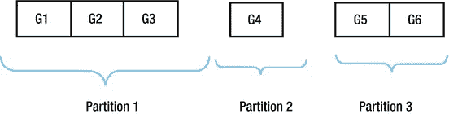
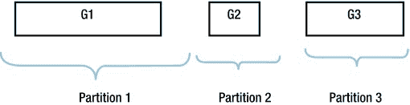

# 执行计划显示与并行执行

## 执行计划输出示例

```sql
SELECT * FROM TABLE (DBMS_XPLAN.display (format => 'TYPICAL'));

Plan hash value: 272002086

| Id  | Operation          | Name                      | Rows  | Bytes | Cost (%CPU)| Time     |

|   0 | SELECT STATEMENT   |                           |     1 |     2 |     2   (0)| 00:00:01 |
|   1 |  RESULT CACHE      | 9p1ghjb9czx4w7vqtuxk5zudg6|       |       |            |          |
|   2 |   TABLE ACCESS FULL| DUAL                      |     1 |     2 |     2   (0)| 00:00:01 |

Result Cache Information (identified by operation id):

1 - column-count=1; attributes=(single-row); name="SELECT /*+ RESULT_CACHE */ * FROM DUAL"

14 rows selected.
```

## 执行计划中的 Notes 部分

`NOTE` 部分提供了可能有用的文字信息。此部分可能出现多种类型的注释。我们已经看到过与自适应计划相关的注释。以下是我见过的一些其他注释示例：

```
- rule based optimizer used (consider using cbo)

- cbqt star transformation used for this statement

- Warning: basic plan statistics not available. These are only collected when:
    * hint 'gather_plan_statistics' is used for the statement or
    * parameter 'statistics_level' is set to 'ALL', at session or system level
```

第一条注释会在执行计划由 `RBO` 而非 `CBO` 生成时显示，可能是因为使用了 `RULE` 提示。第二条提示在基于成本的查询转换（`CBQT`）导致星型转换时显示。第三条注释在你选择了类似 `ALLSTATS` 的格式参数，但运行时引擎的统计信息不可用时显示，原因可能是注释中给出的，也可能是因为你使用了 `DBMS_XPLAN.DISPLAY` 而 `SQL` 语句实际上并未运行。

在 Listing 8-6 的语句案例中，出现了第四种类型的注释，如 Listing 8-16 所示。

**Listing 8-16. Listing 8-6 中查询的注释**

```
Note

- dynamic sampling used for this statement (level=2)
```

显示此注释是因为我在创建示例表时使用了提示来抑制统计信息收集。因此，`CBO` 对表中的数据进行了采样，为其计划评估生成统计信息。

以上就是关于执行计划显示的讨论。现在让我们继续本章的第二个主要主题：并行执行计划。

## 理解并行执行计划

当一条 `SQL` 语句使用并行执行时，两个或多个`并行执行服务器`（有时称为并行执行从属进程或并行查询从属进程）会被分配到原始会话中。每个并行查询服务器可以执行总工作负载的一部分，从而使整个 `SQL` 语句能更快地完成。

并行执行是一个很长的主题，一本关于 `Oracle` 数据库性能的通用书籍可能会用一整章来专门讨论它。事实上，《*VLDB and Partitioning Guide*》中题为“*使用并行执行*”的章节正是这样做的。不过，在这里我只想专注于解读包含并行操作的执行计划以及分析其性能。但在查看示例执行计划之前，我需要先奠定一些基础。让我们先从哪些 `SQL` 语句可以并行运行、哪些不可以开始。

## 可以并行运行的操作

以下 `DDL` 语句可以并行运行：

*   `CREATE INDEX`
*   `CREATE TABLE ... AS SELECT`
*   `ALTER INDEX ... REBUILD`
*   `ALTER TABLE ... [MOVE|SPLIT|COALESCE] PARTITION`
*   `ALTER TABLE ... MOVE`
*   `ALTER INDEX ... [REBUILD|SPLIT] PARTITION`

 **提示** 当你验证约束时，会涉及一个递归查询，该递归查询也可以并行执行。

当 `DDL` 语句被并行化时，正在创建的对象的多个块会被同时写入。所有 `DML` 操作也可以并行运行，并且同样可以并行写入或更新多个块。术语`并行 DDL`和`并行 DML`就用来指代这些类型的并行操作。

第三种也是最常见的并行操作类型称为`并行查询`。术语`并行查询`不仅指并行运行 `SELECT` 语句，也用于指代 `DDL` 或 `DML` 语句中子查询的并行化。因此，例如，如果你并行运行 `CREATE TABLE ... AS SELECT` 语句的查询部分，但将数据串行写入磁盘，那么你执行的是并行查询，而不是并行 DDL。

并行查询在概念上比并行 `DDL` 或并行 `DML` 更复杂。一个查询或子查询通常涉及多个行源操作。在执行计划中看到一些行源操作并行运行而另一些串行运行是很正常的。随着我们继续，为什么会经常在执行计划中混合使用串行和并行操作的原因将变得清晰。

## 控制并行执行

控制并行 `DDL`、并行 `DML` 和并行查询的机制存在细微差异，因此我想分别探讨它们。让我们从并行 `DDL` 开始。

### 控制并行 DDL

运行并行 `DDL` 的两个主要考虑因素是会话状态和 `DDL` 语句的语法。默认情况下，并行 `DDL` 是启用的，但可以使用以下命令之一为当前会话进行更改：

*   `ALTER SESSION DISABLE PARALLEL DDL`
*   `ALTER SESSION ENABLE DDL`
*   `ALTER SESSION FORCE PARALLEL DDL [PARALLEL n]`

通过查看 `V$SESSION` 中的 `PDDL_STATUS` 列，你可以看到最后执行的是哪条命令（如果有的话）。`PDDL_STATUS` 的有效值为 `DISABLED`、`ENABLED` 或 `FORCED`。我们稍后会解释这些命令的作用，但首先我们需要查看 Listing 8-17，它展示了运行并行 `DDL` 的语法结构。

**Listing 8-17. 并行 DDL 语法**

```sql
CREATE INDEX t1_i1
   ON t1 (c1)
   PARALLEL 10;
```

Listing 8-17 使用了 `PARALLEL` 子句，该子句在所有支持并行 `DDL` 的语句中都可用，用于`建议`索引内容以并行方式写入。`并行度`（`DOP`）在语句中被指定为“10”。如果我不希望显式指定 `DOP`，这个 `PARALLEL` 子句本可以简写为 `PARALLEL`。在解释更多概念之后，我将在几页后解释什么是 `DOP`。

`PDDL_STATUS` 的值可以解释如下：

*   如果 `PDDL_STATUS` 的值是 `DISABLED`，那么即使 Listing 8-17 中存在 `PARALLEL` 子句，索引 `T1_I1` 也不会被并行构建。
*   如果 `PDDL_STATUS` 的值是 `ENABLED`，索引将使用指定的或默认的并行度来构建。
*   如果 `PDDL_STATUS` 的值是 `FORCED`，索引将使用 `ALTER SESSION FORCE PARALLEL` `DDL` 语句中指定的度来并行构建。实际上，如果 `PDDL_STATUS` 的值是 `FORCED`，即使 `SQL` 语句中没有指定 `PARALLEL` 子句，表也会被并行创建。

 `提示` 在 12cR1 之前的版本中，执行并行 DDL 时指定 DOP 也会为后续的并行查询设置默认 DOP。我无法告诉你有多少次看到 DBA 或开发者在创建或重建索引后忘记执行 `ALTER INDEX xxx PARALLEL 1` 语句。明智的是，在 12cR1 中，如果你并行移动表或重建索引，数据字典不会被更新。但是，如果你并行创建表或索引，数据字典会像以前的版本一样保留你指定的 DOP，所以请继续小心！

## 控制并行 DML

与并行 DDL 类似，我们需要考虑会话状态和并行 DML 语句的语法，但还有其他考虑因素。默认情况下，并行 DML 是*禁用的*，但可以使用以下命令之一为当前会话进行更改：

*   `ALTER SESSION DISABLE DML`
*   `ALTER SESSION ENABLE PARALLEL DML`
*   `ALTER SESSION FORCE PARALLEL DML [PARALLEL n]`

通过查看 `V$SESSION` 中的 `PDML_STATUS` 列，你可以看到最后执行了这些语句中的哪一个。

我稍后会解释为什么并行 DML 默认是禁用的。首先，看一下 代码清单 8-18，它展示了当并行 DML 启用时如何使用。

**代码清单 8-18. 并行 DML 语法**

```
ALTER SESSION ENABLE PARALLEL DML;

INSERT INTO t2 (c2)
   SELECT /*+ parallel */
         c1 FROM t1;

INSERT /*+ parallel(t3 10) */
      INTO  t3 (c3)
   SELECT c1 FROM t1;

ALTER TABLE t3 PARALLEL 10;

INSERT INTO t3 (c3)
   SELECT c1 FROM t1;

COMMIT;
```

代码清单 8-18 中的第一个 `INSERT` 语句使用*语句级提示*来允许整个语句中的并行 DML 和并行查询。因为它是一个语句级提示，它可以出现在任何合法的位置。

代码清单 8-18 中的第二个查询展示了 `PARALLEL` 提示的另一种变体，它指定了一个特定对象，即表 `T3`，以及一个可选的 DOP。为了使提示应用于并行 DML，它需要像所示那样放在查询中 `INSERT` 关键字之后。这是因为该提示应用于我们之前讨论过的 `INS$1` 查询块。

代码清单 8-18 中的第三个查询没有包含任何提示。然而，并行 DML 仍然可能，因为前面的 `ALTER TABLE` 命令为对象设置了默认 DOP。`PDML_STATUS` 的值可以解释如下：

*   如果 `PDML_STATUS` 的值是 `DISABLED`，那么 代码清单 8-18 中的语句都不会使用并行 DML。
*   如果 `PDML_STATUS` 的值是 `ENABLED`，那么 代码清单 8-18 中的所有语句都将使用并行 DML。
*   如果 `PDML_STATUS` 的值是 `FORCED`，那么 代码清单 8-18 中的所有语句都将使用 `ALTER SESSION FORCE PARALLEL DML` 语句中指定的 DOP 来使用并行 DML。事实上，如果 `PDML_STATUS` 的值是 `FORCED`，即使 SQL 语句中没有指定提示并且涉及的表没有指定大于 1 的 DOP，也会使用并行 DML。

现在让我回到为什么并行 DML 在会话级别默认是禁用的问题。如果我们看看运行 代码清单 8-19 中的代码会发生什么，这会有所帮助。

**代码清单 8-19. 在并行修改后尝试读取表**

```
ALTER SESSION ENABLE PARALLEL DML;

-- 下面的语句成功

INSERT INTO t2 (c2)
   SELECT /*+ parallel */
         c1 FROM t1;

-- 下面的语句失败

INSERT INTO t2 (c2)
   SELECT c1 FROM t1;

COMMIT;

-- 下面的语句成功

INSERT INTO t2 (c2)
   SELECT c1 FROM t1;

-- 下面的语句成功

INSERT INTO t2 (c2)
   SELECT c1 FROM t1;

COMMIT;
```

如果你尝试运行 代码清单 8-19 中的代码，你会发现第二个 `INSERT` 语句失败了，即使它没有使用并行 DML。错误代码是

```
ORA-12838: cannot read/modify an object after modifying it in parallel
```

问题是并行 DML 语句可能使用所谓的*直接路径写入*，这意味着插入的行不在 SGA 中，并且只能在事务提交后从磁盘读取。这种语义变化是并行 DML 默认不启用的原因。请注意，从 12cR1 开始，直接路径写入仅在向表中插入行时使用，而且并非总是如此。当行被更新或删除时，从不使用直接路径写入。但是，无论执行哪种 DML 语句是并行的，你都会收到相同的错误消息。

## 控制并行查询

我们现在来到 SQL 语句可以并行化的三种方式中最复杂的一种：并行查询。并行查询在会话级别默认是启用的，冒着重复的风险，这里是在会话级别影响并行查询的三个命令：

*   `ALTER SESSION DISABLE PARALLEL QUERY`
*   `ALTER SESSION ENABLE QUERY`
*   `ALTER SESSION FORCE PARALLEL QUERY [PARALLEL n]`

 `注意` 尽管并行 DDL 和并行 DML 可以用 `ALTER SESSION FORCE` 语句强制执行，但 `ALTER SESSION FORCE PARALLEL QUERY` 并不会强制并行查询！在奠定更多基础之后，我稍后会解释原因。

通过查看 `V$SESSION` 中的 `PQ_STATUS` 列，你可以看到最后执行了这些语句中的哪一个。

与并行 DML 类似，并行查询可以在语句级别通过设置对象的 DOP 和/或使用提示来管理。然而，在讨论并行查询时，需要考虑更多的提示。这些是我将在后续章节中讨论的提示：

*   `PARALLEL`
*   `PARALLEL_INDEX`
*   `PQ_DISTRIBUTE`
*   `PQ_REPLICATE`

我还没准备好提供并行查询的例子。我们首先需要涵盖更多概念，从*并行粒度*开始。

## 并行粒度

当并行访问对象时，可以分配两种类型的粒度。我们将首先讨论*块范围粒度*，然后讨论*分区粒度*。永远记住，当多个对象在同一 SQL 语句中被访问时，有些可能使用块范围粒度访问，有些使用分区粒度访问，有些可能串行访问而不使用任何粒度。

### 块范围粒度

当使用多块读取访问对象时，我们可以并行化这些读取。例如，当需要 `TABLE FULL SCAN` 操作时，可以使用多个并行查询服务器，每个服务器读取表的一部分。

为此，表被分成所谓的块范围粒度。这些块范围粒度是在运行时识别的，执行计划中没有任何信息告诉你块范围粒度有多少或者它们有多大。块范围粒度的数量通常比 DOP 大得多。

即使访问分区表的多个分区时，也可以使用块范围粒度。图 8-1 展示了基本思想。



**图 8-1. 分区表上的块范围粒度**

图 8-1 显示了一个有三个分区的表如何被分成六个大致相等大小的块范围粒度，即使分区大小差异很大。例如，我们可以使用两个并行查询服务器，每个服务器最终可能会从三个块范围粒度中读取数据。


 `提示` 当使用区块范围粒度时，执行计划中会出现操作 `PX BLOCK ITERATOR`。此操作的子项是派生出这些粒度的对象。

对于大型表，通常有几十个甚至几百个粒度，许多粒度被分配给每个并行查询服务器。

现在，让我们继续讨论第二种类型的粒度——分区粒度。

## 分区粒度

当表或索引被分区时，可以分配分区粒度而不是区块范围粒度。在这种情况下，每个分区（或子分区）恰好有一个粒度。这听起来不是一个好主意，因为粒度的大小可能差异很大，如图 8-2 所示：



图 8-2. 分区表上的分区粒度

正如你所见，现在三个分区只有三个粒度，并且这些粒度的大小都不同。分区粒度可能导致一些并行查询服务器完成了大部分工作，而其他服务器则处于空闲状态。

 `提示` 当使用分区粒度时，许多以 `PX PARTITION ...` 开头的操作之一会出现在执行计划中。此操作的子项是派生出这些粒度的对象。

使用分区粒度主要有三个原因：

*   在执行并行 DDL 或并行 DML 时，让一个并行查询服务器写入一个分区通常比多个服务器写入更高效。
*   正如我们将在 第 10 章 中看到的，不可能对未分区的索引并行执行 `INDEX RANGE SCAN` 或 `INDEX FULL SCAN`。然而，一个并行查询服务器可以扫描索引的一个分区，而其他并行查询服务器扫描不同的分区。
*   *分区连接*（*Partition-wise joins*）需要分区粒度。我们将在 第 11 章 中介绍分区连接。

现在我们知道了数据是如何为并行化而拆分的，是时候看看如何组织并行查询服务器以使它们能够访问这些粒度数据了。

## 数据流操作符

Oracle 文档讨论了一种称为**数据流操作符**（**Data Flow Operator**）或 DFO 的东西。就我个人而言，我认为从语法上它应该被称为数据流操作（Data Flow Operation），但既然我从现在开始将使用缩写 DFO，我们就不必太担心这个细节。

DFO 基本上是一个执行计划中的一个或多个行源操作，它们形成一个并行化工作的单一单元。为了解释这一点，我终于需要展示一个带有并行查询的实际执行计划了！清单 8-20 展示了一个只有一个 DFO 的执行计划。

清单 8-20. 只有一个 DFO 的执行计划

```
CREATE TABLE t5
PARTITION BY HASH (c1)
   PARTITIONS 16
AS
       SELECT ROWNUM c1, ROWNUM c2
         FROM DUAL
   CONNECT BY LEVEL <= 10000;

CREATE INDEX t5_i1
   ON t5 (c2) local;

SELECT /*+ index(t5) parallel_index(t5) */
       *
  FROM t5
 WHERE c2 IS NOT NULL;

| Id  | Operation                                    | Name     |    TQ  |IN-OUT| PQ Distrib |

|   0 | SELECT STATEMENT                             |          |        |      |            |
|   1 |  PX COORDINATOR                              |          |        |      |            |
|   2 |   PX SEND QC (RANDOM)                        | :TQ10000 |  Q1,00 | P->S | QC (RAND)  |
|   3 |    PX PARTITION HASH ALL                     |          |  Q1,00 | PCWC |            |
|   4 |     TABLE ACCESS BY LOCAL INDEX ROWID BATCHED| T5       |  Q1,00 | PCWP |            |
|   5 |      INDEX FULL SCAN                         | T5_I1    |  Q1,00 | PCWP |            |
```

清单 8-20 首先创建了一个分区表 `T5` 和一个关联的本地索引 `T5_I1`。然后查询该表，指定提示以通过索引访问 `T5`。由于 `INDEX FULL SCAN` 无法使用区块范围粒度，你可以看到 `PX PARTITION HASH ALL` 操作，这表明使用了分区粒度。每个并行查询服务器将访问一个或多个分区，并对这些分区执行操作 4 和 5。

当每个并行查询服务器从表中读取行时，这些行被发送到*查询协调器*（*query coordinator*, QC），如操作 2 所示。QC 是开始时存在的原始会话。除了接收并行查询服务器的输出外，QC 还负责将任何类型的粒度分配给并行查询服务器。

注意执行计划中 `IN-OUT` 列的内容。操作 3 显示 `PCWC`，表示*与子项并行组合*（*Parallel Combined with Child*）。操作 5 显示 `PCWP`，表示*与父项并行组合*（*Parallel Combined with Parent*）。操作 4 则与父项和子项都组合。此信息可用于识别执行计划中每个 DFO 内的行源操作组。顺便说一下，操作 2 的 `IN-OUT` 列显示 `P->S`，表示*并行到串行*（*Parallel to Serial*）；并行查询服务器正在向 QC 发送数据。

这理解起来并不太难，对吧？让我继续一个涉及多个 DFO 的更复杂示例。

## 并行查询服务器集与 DFO 树

清单 8-20 中的执行计划只涉及一个 DFO。一个执行计划可能涉及多个 DFO。DFO 的集合被称为 *DFO 树*（*DFO tree*）。清单 8-21 提供了一个具有多个 DFO 的 DFO 树示例。

清单 8-21. 具有多个 DFO 的并行查询

```
BEGIN
   FOR i IN 1 .. 4
   LOOP
      DBMS_STATS.gather_table_stats (
         ownname   => SYS_CONTEXT ('USERENV', 'CURRENT_SCHEMA')
        ,tabname   => 'T' || i);
   END LOOP;
END;
/

WITH q1
     AS (  SELECT c1, COUNT (*) cnt1
             FROM t1
         GROUP BY c1)
    ,q2
     AS (  SELECT c2, COUNT (*) cnt2
             FROM t2
         GROUP BY c2)
SELECT /*+ monitor optimizer_features_enable('11.2.0.3') parallel*/
       c1, c2, cnt1
  FROM q1, q2
 WHERE cnt1 = cnt2;

| Id  | Operation                   | Name     |    TQ  |IN-OUT| PQ Distrib |

|   0 | SELECT STATEMENT            |          |        |      |            |
|   1 |  PX COORDINATOR             |          |        |      |            |
|   2 |   PX SEND QC (RANDOM)       | :TQ10003 |  Q1,03 | P->S | QC (RAND)  |
|   3 |    HASH JOIN BUFFERED       |          |  Q1,03 | PCWP |            |
|   4 |     VIEW                    |          |  Q1,03 | PCWP |            |
|   5 |      HASH GROUP BY          |          |  Q1,03 | PCWP |            |
|   6 |       PX RECEIVE            |          |  Q1,03 | PCWP |            |
|   7 |        PX SEND HASH         | :TQ10001 |  Q1,01 | P->P | HASH       |
|   8 |         PX BLOCK ITERATOR   |          |  Q1,01 | PCWC |            |
|   9 |          TABLE ACCESS FULL  | T1       |  Q1,01 | PCWP |            |
|  10 |     PX RECEIVE              |          |  Q1,03 | PCWP |            |
|  11 |      PX SEND BROADCAST      | :TQ10002 |  Q1,02 | P->P | BROADCAST  |
|  12 |       VIEW                  |          |  Q1,02 | PCWP |            |
|  13 |        HASH GROUP BY        |          |  Q1,02 | PCWP |            |
|  14 |         PX RECEIVE          |          |  Q1,02 | PCWP |            |
|  15 |          PX SEND HASH       | :TQ10000 |  Q1,00 | P->P | HASH       |
|  16 |           PX BLOCK ITERATOR |          |  Q1,00 | PCWC |            |
|  17 |            TABLE ACCESS FULL| T2       |  Q1,00 | PCWP |            |
```


