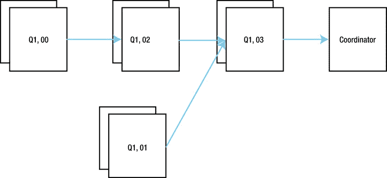

# 并行执行计划：DFO 树与表队列

收集缺失对象统计信息后，清单 8-21 发出了并行查询。我指定了 `optimizer_features_enable('11.2.0.3')` 提示；12.1.0.1 计划可能会过早地呈现一些新特性。

使用 清单 8-21 的 `IN-OUT` 列来识别 DFO 是可行的，但有点麻烦。更简单的方法是查看 `TQ` 列，可以看到四个不同的值，反映了该计划中的四个 DFO。我们还可以查看每个 `PX SEND` 操作上方的操作，以了解每个 DFO 将数据发送到了哪里。

对于像这样的复杂并行执行计划，画出 DFO 树通常很有帮助。图 8-3 展示了与 清单 8-21 关联的 DFO 树的一种描述方式。



图 8-3. 清单 8-21 的 DFO 树图示

从图 8-3 可以看出，四个 DFO 中有三个将数据发送到另一个 DFO，而名为 `Q1, 03` 的 DFO（清单 8-21 执行计划中的操作 2 到 6 和操作 10）则将数据发送给 QC。

DFO 树既不是高度平衡的，也不是二叉的；树的叶子节点距离根节点的距离各不相同，一个分支节点可能有一个或多个子节点。树的叶子节点往往是诸如全表扫描之类的操作，而分支节点则往往是连接、聚合或排序操作。

为了支持多个并发的 DFO，Oracle 数据库创建了**并行查询服务器集 (PQSS)** 的概念，每个集一次在一个 DFO 上操作。现在，如果每个 DFO 都有一个 PQSS，对于一个复杂的 DFO 树来说，我们将有数量惊人的进程。事实上，对于每个 DFO 树，我们最多只有**两个** PQSS。

 **提示** PQSS 中的服务器数量被称为*并行度 (DOP)*，并且如果一个 DFO 树中有两个 PQSS，则两者的 DOP 将相同。此外，如果你使用提示为一个表指定 DOP 为 4，为另一个表指定 DOP 为 5，通常会使用较高的数字，从而分配 10 个并行查询服务器（尽管这个数字可能会减少以节省资源）。

为了理解我们如何能仅用两个 PQSS 就应付过去，是时候看看 DFO 之间以及 DFO 与 QC 之间是如何通信的了。是时候引入**表队列**了。

## 表队列与 DFO 排序

图 8-3 中连接节点的箭头表示数据从一个 DFO 发送到另一个 DFO 或发送给 QC。这种通信是通过**表队列 (TQ)** 实现的。每个表队列都有一个生产者和一个消费者。表队列的名称显示在 `PX SEND` 操作的执行计划的 `NAME` 列中，并且与作为该 TQ 生产者的 DFO 的名称有显著的相似性。这不是巧合！

当生产者向 TQ 发送数据时，*必须*有一个消费者正在主动等待该数据；不要让“队列”这个词误导你认为大量数据可以缓冲在 TQ 中。它不能。如果生产者和消费者正在使用 TQ 交换数据，我将称一个 `TQ` 为*活动的*。谈论一段内存是活动的有点奇怪，但我相信你明白我的意思。

那么，运行时引擎如何仅用两个 PQSS 来处理整个 DFO 树呢？嗯，运行时引擎必须遵循几条规则：

1.  在任何时间点，对于一个 DFO 树，最多只能有一个 TQ 是活动的。
2.  在接收时，TQ 的消费者不得将数据转发到另一个 TQ。这通常通过在工作区中缓冲数据来实现。
3.  运行时引擎总是从 `:TQ10000` 开始，并按数字顺序处理每个 TQ。

理解这第三条规则是读懂并行执行计划的关键。引用 Jonathan Lewis 的话：*跟着 TQ 走*。让我们使用这些规则来梳理 清单 8-21 中的事件序列。

两个 PQSS 最初被分配给 `:TQ10000`，一个 PQSS（让我们称之为 PQSS1）生产，另一个（让我们称之为 PQSS2）消费。这意味着 PQSS1 从运行 DFO Q1, 00 开始，而 PQSS2 从运行 Q1, 02 开始。第 13 行有一个 `HASH GROUP BY` 聚合，用于缓冲数据，以便 PQSS2 能够遵守上面的规则 2。一旦来自表 `T2` 的所有数据被分组，DFO Q1, 00 就完成了。以下是与 `:TQ10000` 相关的操作集高亮显示：

```
| Id  | Operation                   | Name     |    TQ  |IN-OUT| PQ Distrib |
|  13 |        HASH GROUP BY        |          |  Q1,02 | PCWP |            |
|  14 |         PX RECEIVE          |          |  Q1,02 | PCWP |            |
|  15 |          PX SEND HASH       | :TQ10000 |  Q1,00 | P->P | HASH       |
|  16 |           PX BLOCK ITERATOR |          |  Q1,00 | PCWC |            |
|  17 |            TABLE ACCESS FULL| T2       |  Q1,00 | PCWP |            |
```

运行时引擎现在继续处理 `:TQ10001`。一个 PQSS 开始在第 9 行读取 `T1`（DFO Q1, 01）并将数据发送到另一个 PQSS（DFO Q1, 03）。这个消费的 PQSS 使用 `HASH GROUP BY` 操作将接收到的数据分组，然后为哈希连接构建一个工作区。以下是与 `:TQ10001` 相关的操作集高亮显示：

```
| Id  | Operation                   | Name     |    TQ  |IN-OUT| PQ Distrib |
|   3 |    HASH JOIN BUFFERED       |          |  Q1,03 | PCWP |            |
|   4 |     VIEW                    |          |  Q1,03 | PCWP |            |
|   5 |      HASH GROUP BY          |          |  Q1,03 | PCWP |            |
|   6 |       PX RECEIVE            |          |  Q1,03 | PCWP |            |
|   7 |        PX SEND HASH         | :TQ10001 |  Q1,01 | P->P | HASH       |
|   8 |         PX BLOCK ITERATOR   |          |  Q1,01 | PCWC |            |
|   9 |          TABLE ACCESS FULL  | T1       |  Q1,01 | PCWP |            |
```

在这个阶段，可能还不明显哪个 PQSS 是 `:TQ10001` 的生产者，哪个是消费者，但这很快就会变得清晰。

运行时引擎现在继续处理 `:TQ10002`。这里发生的是，第 13 行工作区中的数据被提取出来，然后从一个 PQSS 发送到另一个 PQSS。以下是与 `:TQ10002` 相关的操作集高亮显示：

```
| Id  | Operation                   | Name     |    TQ  |IN-OUT| PQ Distrib |
|   3 |    HASH JOIN BUFFERED       |          |  Q1,03 | PCWP |            |
< 未涉及的行已省略 >                                                   |
|  10 |     PX RECEIVE              |          |  Q1,03 | PCWP |            |
|  11 |      PX SEND BROADCAST      | :TQ10002 |  Q1,02 | P->P | BROADCAST  |
|  12 |       VIEW                  |          |  Q1,02 | PCWP |            |
|  13 |        HASH GROUP BY        |          |  Q1,02 | PCWP |            |
```

我们 DFO 树中最后一个 TQ 是 `:TQ10003`，但让我们在详细查看它之前稍作停顿。

我们总是对同一个 DFO 中的所有操作使用相同的 PQSS，因此 `:TQ10002` 的生产者必须是 PQSS2，因为当 Q1, 02 是 `:TQ10000` 的消费者时，PQSS2 运行了 Q1, 02。这反过来意味着 `:TQ10002` 的消费者是 PQSS1，并且由于这是 DFO Q1, 03，我们可以反向推导出 `:TQ10001` 的消费者也一定是 PQSS1，而 `:TQ10001` 的生产者一定是 PQSS2。如果你的头有点晕，请再看一下图 8-3。DFO 树中任何两个相邻的节点必须使用不同的 PQSS，因此在将 PQSS1 分配给 DFO Q1, 00 之后，只有一种方法可以将 PQSS 分配给剩余的 DFO。


