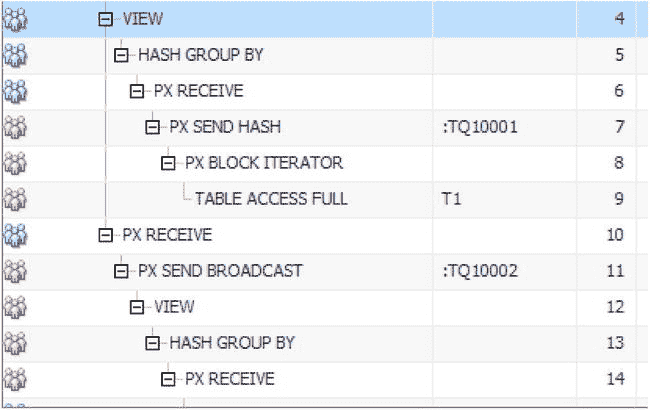

# SQL 监控报告与并行查询服务器集分析

## 理解执行流程

你现在可以看到 `PQSS1` 执行 `Q1,00` 和 `Q1,03`，而 `PQSS2` 执行 `Q1,01` 和 `Q1,02`。你可以通过生成 SQL 监控报告来确认此分析（尽管查询几乎瞬间完成，但由于清单 8-21 中的 `MONITOR` 提示，此报告可用），可使用清单 4-6 中展示的脚本之一。图 8-4 展示了报告中的一个片段。



图 8-4. SQL 监控报告片段，展示 DFO 与并行查询服务器集的关系

图 8-4 用三个蓝色人物（无彩色时为深灰色）聚集表示 `PQSS1`，用三个粉色人物（无彩色时为浅灰色）表示 `PQSS2`。

这一切都很复杂，所以我将再次逐步讲解 DFO `Q1,02` 和 `Q1,03`。`PQSS2` 的每个成员在作为 `:TQ10000` 的消费者时，都会构建一个与第 13 行的 `HASH GROUP BY` 相关联的工作区。然后，在 `:TQ10001` 活动期间，DFO `Q1,02` 实际上被暂停。当 `:TQ10002` 变为活动状态并从工作区读取数据时，`PQSS2` 恢复 DFO `Q1,02`，此时它充当生产者。

上面的规则 2 指出，TQ 的消费者不能将数据转发到另一个 TQ。然而——在第 10 行收到数据时——看起来第 3 行的哈希连接第二部分将开始生成行并将其发送到第 2 行的协调器。这难道不是违反了规则 2 吗？看起来 `:TQ10002` 和 `:TQ10003` 将同时处于活动状态。正如你可能猜到的，线索来自第 3 行的 `BUFFERED` 一词。实际上，来自第 10 行的数据此时并未连接——它只是被缓冲。当我在第 11 章更详细地讲解连接时，我会提供关于 `HASH JOIN BUFFERED` 操作的更详细解释。

一旦所有数据从 `PQSS2` 发送到 `PQSS1` 并被缓冲，`PQSS1` 就会转向 `:TQ10003`。`PQSS1` 现在可以读取它刚刚缓冲的数据，执行第 3 行的连接，并将数据发送给 QC。以下是与 `:TQ10003` 相关的步骤：

```
| Id  | Operation                   | Name     |    TQ  |IN-OUT| PQ Distrib |
|----|-----------------------------|----------|--------|------|------------|
|   1 |  PX COORDINATOR             |          |        |      |            |
|   2 |   PX SEND QC (RANDOM)       | :TQ10003 |  Q1,03 | P->S | QC (RAND)  |
|   3 |    HASH JOIN BUFFERED       |          |  Q1,03 | PCWP |            |
```

回顾一下：

*   当 `:TQ10000` 处于活动状态时，行被放入第 13 行 `HASH GROUP BY` 的工作区，而当 `:TQ10002` 处于活动状态时，这些行被提取。
*   当 `:TQ10001` 处于活动状态时，行被放入第 3 行 `HASH JOIN BUFFERED` 操作的内存哈希簇中；当 `:TQ10002` 处于活动状态时，探测行源的行被缓冲；而当 `:TQ10003` 处于活动状态时，实际的连接才被执行。

现在你可能有个问题。通常只让一个 TQ 一次处于活动状态是有意义的，否则一个 `PQSS` 可能必须同时在一个 TQ 上生产并从另一个 TQ 消费。然而，在 `:TQ10002` 和 `:TQ10003` 的情况下，这个限制似乎没有必要。为什么 `PQSS2` 不能将数据发送给 `PQSS1`，然后 `PQSS1` 再将连接结果转发给 QC 呢？我们许多人都想知道。也许有一天 Oracle 会告诉我们原因，或者从 CBO 和运行时引擎中移除此限制。目前，我们只能推测。

## 多 DFO 树

清单 8-21 只有一个 DFO 树，并且所有 DFO 都由一个 `PQSS` 处理。不幸的是，一些 SQL 语句需要不止一个 DFO 树，有时一个 DFO 由 QC 处理。清单 8-22 演示了这些要点。

清单 8-22. 具有多 DFO 树的并行查询

```sql
COMMIT;

ALTER SESSION DISABLE PARALLEL DML;

WITH q1
     AS (  SELECT /*+
                     parallel(T1)
                     full(t1)
                     no_parallel(t2)
                     no_pq_replicate(t2)
                     no_gby_pushdown
                     pq_distribute(t2 none broadcast)
                     */
                 c1 + c2 c12, AVG (c1) avg_c1, COUNT (c2) cnt_c2
             FROM t1, t2
            WHERE c1 = c2 + 1
         GROUP BY c1 + c2
         ORDER BY 1)
    ,q2 AS (SELECT ROWNUM rn, c12 FROM q1)
  SELECT /*+ leading(q1)
             pq_distribute(q2 none broadcast) */
         *
    FROM q1 NATURAL JOIN q2
ORDER BY cnt_c2;
```

```
| Id  | Operation                         | Name           |    TQ  |IN-OUT| PQ Distrib |
|----|-----------------------------------|----------------|--------|------|------------|
|   0 | SELECT STATEMENT                  |                |        |      |            |
|   1 |  TEMP TABLE TRANSFORMATION        |                |        |      |            |
|   2 |   PX COORDINATOR                  |                |        |      |            |
|   3 |    PX SEND QC (RANDOM)            | :TQ10002       |  Q1,02 | P->S | QC (RAND)  |
|   4 |     LOAD AS SELECT                | SYS_TEMP_0FD9D6|  Q1,02 | PCWP |            |
|   5 |      SORT GROUP BY                |                |  Q1,02 | PCWP |            |
|   6 |       PX RECEIVE                  |                |  Q1,02 | PCWP |            |
|   7 |        PX SEND RANGE              | :TQ10001       |  Q1,01 | P->P | RANGE      |
|   8 |         HASH JOIN BUFFERED        |                |  Q1,01 | PCWP |            |
|   9 |          PX BLOCK ITERATOR        |                |  Q1,01 | PCWC |            |
|  10 |           TABLE ACCESS FULL       | T1             |  Q1,01 | PCWP |            |
|  11 |          PX RECEIVE               |                |  Q1,01 | PCWP |            |
|  12 |           PX SEND BROADCAST       | :TQ10000       |  Q1,00 | S->P | BROADCAST  |
|  13 |            PX SELECTOR            |                |  Q1,00 | SCWC |            |
|  14 |             TABLE ACCESS FULL     | T2             |  Q1,00 | SCWP |            |
|  15 |   PX COORDINATOR                  |                |        |      |            |
|  16 |    PX SEND QC (ORDER)             | :TQ20003       |  Q2,03 | P->S | QC (ORDER) |
|  17 |     SORT ORDER BY                 |                |  Q2,03 | PCWP |            |
|  18 |      PX RECEIVE                   |                |  Q2,03 | PCWP |            |
|  19 |       PX SEND RANGE               | :TQ20002       |  Q2,02 | P->P | RANGE      |
|  20 |        HASH JOIN BUFFERED         |                |  Q2,02 | PCWP |            |
|  21 |         VIEW                      |                |  Q2,02 | PCWP |            |
|  22 |          PX BLOCK ITERATOR        |                |  Q2,02 | PCWC |            |
|  23 |           TABLE ACCESS FULL       | SYS_TEMP_0FD9D6|  Q2,02 | PCWP |            |
|  24 |         PX RECEIVE                |                |  Q2,02 | PCWP |            |
|  25 |          PX SEND BROADCAST        | :TQ20001       |  Q2,01 | S->P | BROADCAST  |
|  26 |           BUFFER SORT             |                |  Q2,01 | SCWP |            |
|  27 |            VIEW                   |                |  Q2,01 | SCWC |            |
|  28 |             COUNT                 |                |  Q2,01 | SCWP |            |
|  29 |              PX RECEIVE           |                |  Q2,01 | SCWP |            |
|  30 |               PX SEND 1 SLAVE     | :TQ20000       |  Q2,00 | P->S | 1 SLAVE    |
|  31 |                VIEW               |                |  Q2,00 | PCWP |            |
|  32 |                 PX BLOCK ITERATOR |                |  Q2,00 | PCWC |            |
|  33 |                  TABLE ACCESS FULL| SYS_TEMP_0FD9D6|  Q2,00 | PCWP |            |
```


别担心清单 8-22 中的查询具体在做什么。把注意力放在执行计划上。首先要看的是操作 4。`LOAD AS SELECT`操作在`IN-OUT`列中的值为`PCWP`（并行结合子操作），这清楚地表明我们正在并行加载一个表。这可能会让你感到惊讶，因为清单 8-22 开头禁用了并行 DML。但是，禁用并行 DML 的目的是为了防止出现`ORA-12838`错误，就像清单 8-19 中那样。由于我们正在加载的临时表是为了物化因子化子查询`Q1`而创建的，并且在当前语句结束时将不复存在，因此不可能发生此类错误；即使并行 DML 表面上已被禁用，我们也可以使用它。

接下来看操作 12、13 和 14。从`IN-OUT`列的值可以看出，这些操作是串行读取表`T2`的。第 13 行的`PX SELECTOR`操作是 12cR1 的新特性，表明串行操作是由来自`PQSS1`的并行查询服务器完成的，而不是像早期版本那样由 QC 完成。第 12 行显示，从`T2`中选择的所有行都广播到了`PQSS2`的所有成员。我们稍后会探讨并行查询服务器之间相互通信的其他方式。

现在来看第 30 行的操作。关于这个操作有两点需要注意。首先，新创建的临时表被`PQSS1`并行读取（为了节省页面空间，我截断了表名），但所有行都发送给了`PQSS2`的单个成员，这从操作名可以看出，并被`IN-OUT`列证实。由于查询中使用了`ROWNUM`伪列，所有行都由`PQSS2`中的一个从属进程处理。同样，`PX SEND 1 SLAVE`操作是 12cR1 的新特性，在之前的版本中，这个操作会是`PX SEND QC (RANDOM)`，因为实现`ROWNUM`伪列的`COUNT`操作是由 QC 执行的。

关于操作 30 要注意的第二点是，`DFO`的名称是`Q2, 00`，`TQ`名称是`:TQ20000`。这些名称表明该语句中使用了第二个`DFO`树，并且从第 16 行到第 33 行的所有操作都是由这第二个`DFO`树执行的。当一个语句中涉及多个`DFO`树时，每个`DFO`树通常会获得自己的一组并行查询服务器或一对并行查询服务器集，而且实际上，不同`DFO`树的`DOP`（并行度）也可能不同。支持特定`DFO`树的并行查询服务器集被称为`并行组`。因此，在清单 8-22 的案例中，总共有四组并行查询从属服务器——每组两对。

最后，我想请大家注意操作 26。还记得`TQ`的消费者必须缓冲其数据吗？在清单 8-21 的第 3 行和清单 8-22 的第 20 行，这种缓冲被整合到了`HASH JOIN BUFFERED`操作中，但在清单 8-22 的第 26 行，缓冲是一个独立且显式的操作。不用担心`sort`（排序）这个词。这是众多情况中的一种，即`BUFFER SORT`操作实际上并不进行排序。

## 并行查询分发机制

清单 8-21 和清单 8-22 使用了`PX SEND HASH`、`PX SEND RANGE`、`PX SEND BROADCAST`、`PX SEND QC (RANDOM)`和`PX SEND QC (ORDER)`等操作。生产者通过表队列发送数据的这些多种方式，反映了这些操作所关联的多种`数据分发`机制。现在是时候解释这些分发机制了。我们将从分区表的数据加载分发机制开始，然后介绍与连接和其他操作相关的分发机制。

## 分区表的数据加载分发机制

虽然一些数据加载分发机制已经存在了很长时间，但它们直到 11gR2 才在控制它们的提示（hint）的上下文中被记录。在本节中，我将只讨论在向分区表的多个分区加载数据时可以使用的两种数据加载分发机制。更多信息你可以查阅`PQ_DISTRIBUTE`提示在 SQL 参考手册中的描述。

想象一下，你正在向一个有八个分区的哈希分区表加载数据。自然的做法应该是为被加载表的每个分区分配一个并行查询服务器，不是吗？是的，确实如此！清单 8-23 演示了这一点。

清单 8-23. 将无偏斜的数据加载到哈希分区表中

```
CREATE TABLE t_part1
PARTITION BY HASH (c1)
   PARTITIONS 8
AS
   SELECT c1, ROWNUM AS c3 FROM t1;

CREATE TABLE t_part2
PARTITION BY HASH (c2)
   PARTITIONS 8
AS
   SELECT c1 AS c2, ROWNUM AS c4 FROM t1;

ALTER SESSION ENABLE PARALLEL DML;

INSERT /*+ parallel(t_part1 8) pq_distribute(t_part1 PARTITION)*/
      INTO  t_part1
   SELECT  c1,c1 FROM t1;

| Id  | Operation                          | Name     |    TQ  |IN-OUT| PQ Distrib |

|   0 | INSERT STATEMENT                   |          |        |      |            |
|   1 |  PX COORDINATOR                    |          |        |      |            |
|   2 |   PX SEND QC (RANDOM)              | :TQ10001 |  Q1,01 | P->S | QC (RAND)  |
|   3 |    LOAD AS SELECT                  | T_PART1  |  Q1,01 | PCWP |            |
|   4 |     OPTIMIZER STATISTICS GATHERING |          |  Q1,01 | PCWP |            |
|   5 |      PX RECEIVE                    |          |  Q1,01 | PCWP |            |
|   6 |       PX SEND PARTITION (KEY)      | :TQ10000 |  Q1,00 | S->P | PART (KEY) |
|   7 |        PX SELECTOR                 |          |  Q1,00 | SCWC |            |
|   8 |         TABLE ACCESS FULL          | T1       |  Q1,00 | SCWP |            |
```

创建了几个分区表并启用并行 DML 后，清单 8-23 将数据从一个非分区表复制到一个分区表，每个分区使用一个加载服务器。我们使用了提示来演示如何强制使用这种加载技术。在这个案例中，非分区表`T1`是串行读取的；然后每一行都被发送到负责将该行加载到其目标分区的并行查询从属服务器。

这看起来似乎很好，但是如果你读取的大部分数据只进入一两个分区呢？如果只有一个进程写入一个分区，那帮助就不大了。看看清单 8-24。

清单 8-24. 将有偏斜的数据加载到哈希分区表中

```
INSERT /*+ parallel(t_part1 8) pq_distribute(t_part1 RANDOM)  */
      INTO  t_part1
   SELECT /*+ parallel(t_part2 8) */ * FROM t_part2;

| Id  | Operation                          | Name     |    TQ  |IN-OUT| PQ Distrib |

|   0 | INSERT STATEMENT                   |          |        |      |            |
|   1 |  PX COORDINATOR                    |          |        |      |            |
|   2 |   PX SEND QC (RANDOM)              | :TQ10001 |  Q1,01 | P->S | QC (RAND)  |
|   3 |    LOAD AS SELECT                  | T_PART1  |  Q1,01 | PCWP |            |
|   4 |     OPTIMIZER STATISTICS GATHERING |          |  Q1,01 | PCWP |            |
|   5 |      PX RECEIVE                    |          |  Q1,01 | PCWP |            |
|   6 |       PX SEND ROUND-ROBIN          | :TQ10000 |  Q1,00 | S->P | RND-ROBIN  |
|   7 |        PARTITION HASH ALL          |          |        |      |            |
|   8 |         TABLE ACCESS FULL          | T_PART2  |        |      |            |
```


