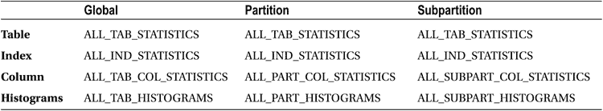

# 检查对象统计信息

对象统计信息同时保存在数据字典和由 `DBMS_STATS.CREATE_STAT_TABLE` 创建的表中。让我们看看如何找到并解读这些统计信息，从数据字典开始。

## 检查数据字典中的对象统计信息

可以通过调用 `DBMS_STATS` 包中的存储过程（例如 `DBMS_STATS.GET_COLUMN_STATS`）来获取数据字典中的统计信息。然而，通常更方便的是使用数据字典上的视图。表 9-1 列出了用于检查对象统计信息的主要视图。

表 9-1. 用于检查数据字典中对象统计信息的视图

此时我需要定义一些术语以避免混淆。

*   对象统计信息与表、索引或列相关联。在本章中，当我指代具有对象统计信息的实体时，将使用术语 `对象表`、`对象索引` 和 `对象列`。我在本章中对这些术语的使用与其在《对象关系开发者指南》中定义的常规用法无关。
*   可以使用表 9-1 中的视图（以及其他视图）来显示对象统计信息。我将此类视图称为 `统计视图`，将统计视图中的列称为 `统计列`。
*   我将使用术语 `导出表` 来指代由 `DBMS_STATS.CREATE_STAT_TABLE` 创建的表。我将使用术语 `导出列` 来指代导出表中的列。

 **提示** 虽然向导出表加载数据的常规方式是使用 `DBMS_STATS.EXPORT_TABLE_STATS`，但也可以使用诸如 `DBMS_STATS.GATHER_TABLE_STATS` 之类的存储过程，直接将统计信息收集到导出表中，而不更新数据字典。

在查看表 9-1 时请注意以下几点：

*   直方图是一种特殊类型的列统计信息。与其他类型的列统计信息不同，每个对象列在统计视图中需要多行记录。因此，直方图显示在一组与其他列统计信息分开的统计视图中。
*   表 9-1 中列出的所有视图都以 `ALL` 开头。与许多数据字典视图一样，也存在以 `USER` 和 `DBA` 为前缀的替代变体。`USER` 视图仅列出当前用户拥有的对象的统计信息。具有适当权限的用户可以访问 `DBA` 变体，其中包含由 `SYS` 拥有的对象以及当前用户无权访问的其他对象。表 9-1 中的视图以 `ALL` 开头，显示当前用户有访问权限的所有对象的对象统计信息，包括其他用户拥有的对象。当前用户没有访问权限的对象不会被显示。
*   对象统计信息也包含在许多其他常用视图中，例如 `ALL_TABLES`，但这些视图可能缺少一些关键列。例如，列 `STATTYPE_LOCKED` 指示表的统计信息是否被锁定，该列不存在于 `ALL_TABLES` 中，但它存在于 `ALL_TAB_STATISTICS` 中。
*   视图 `ALL_TAB_COL_STATISTICS` 排除了没有统计信息的对象列，并且三个直方图统计视图不一定列出所有对象列。列表 9-1 中的其他八个表包含具有统计信息的对象行以及没有统计信息的对象行。

## 检查已导出的对象统计信息

当你查看一个导出表时，你会发现大多数导出列都有意被赋予了无意义的名称。例如，在 11gR2 中创建的导出表中有 12 个数字列，名称从 `N1` 到 `N12`。有两个类型为 `RAW` 的列，名为 `R1` 和 `R2`，30 字节的字符列名为 `C1` 到 `C5`，以及列 `CH1`、`CL1` 和 `D1`。最后三个列分别是一个 1000 字节的字符列、一个 `CLOB` 和一个 `DATE`。在 12cR1 中添加了额外的列。

