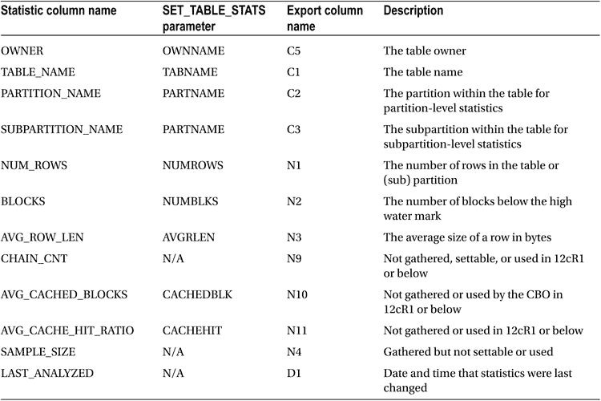
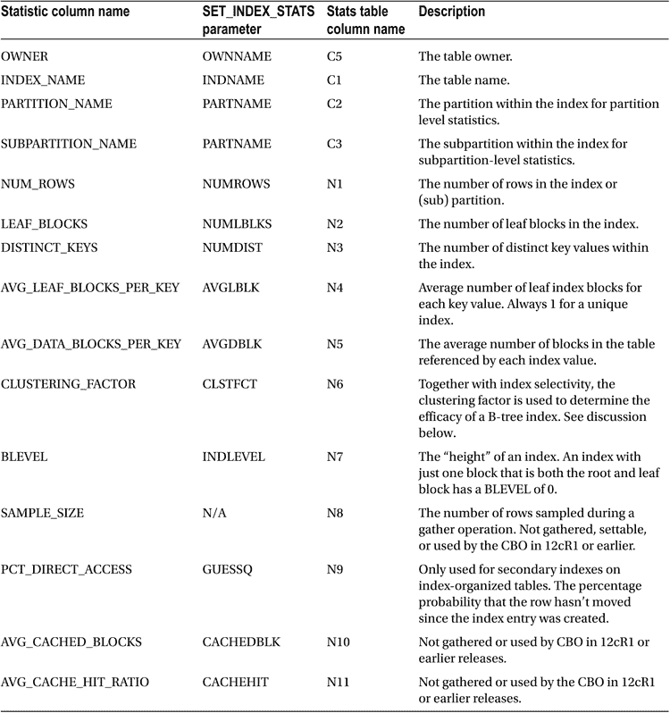

# 统计信息描述

到目前为止，在本章中，我已经解释了如何将统计信息加载到数据字典中，如何导出统计信息，以及如何使用统计视图和导出表来检查统计信息。现在是时候看看各个对象统计信息了，以便我们理解它们各自的作用。表 9-2、9-3 和 9-4 分别提供了表、索引和列统计信息的描述。

重要的是要认识到 CBO 是一个复杂且不断变化的“野兽”。如果没有访问所有 Oracle 数据库版本的源代码，就不可能确切地说某个特定的统计信息（如果有的话）究竟是如何被使用的。尽管如此，有相当多的已发表研究可以给我们一些概念。¹ 让我们从查看表统计信息开始。

## 表统计信息

表 9-2 提供了每个表统计信息的描述，以及在统计视图和导出表中标识该统计信息的名称。表 9-2 还提供了在调用 `DBMS_STATS.SET_TABLE_STATS` 时使用的参数名称。

表 9-2. 表统计信息描述

表 9-2 显示，据我所知，CBO 仅使用了三个表`统计信息`。

*   `NUM_ROWS`：此统计信息与行源操作的估计`选择率`结合使用，以估计该操作的基数（cardinality）；换句话说，就是该操作预期返回的行数。因此，如果 `NUM_ROWS` 是 1,000 且选择率计算为 0.1（10%），则该操作的估计基数将为 100。`NUM_ROWS` 统计信息既不用于确定每个返回行将消耗的字节数，也不用于确定操作的成本。
*   `BLOCKS`：此统计信息仅用于全表扫描，并且仅用于估计行源操作的成本，换句话说，就是全表扫描需要多长时间。此统计信息不用于估计基数或字节数。
*   `AVG_ROW_LEN`：此统计信息仅用于估计行源操作返回的每行将消耗的字节数。事实上，只有当选择了表中的所有列时，CBO 才可以选择使用此统计信息。大多数时候，列统计信息 `AVG_COL_LEN` 被用于估计行源操作返回的字节数。

我们缺少的一个信息是操作的选择率。我们使用列统计信息来计算选择率，在查看索引统计信息之后，我们将讨论列统计信息。

## 索引统计信息

表 9-3 提供了每个索引统计信息的描述，以及在统计视图和导出表中标识该统计信息的名称。表 9-3 还提供了在调用 `DBMS_STATS.SET_INDEX_STATS` 时使用的参数名称。

表 9-3. 索引统计信息描述

关于索引统计信息，我想说的第一点是，它们完全独立于表和列统计信息，仅通过查看索引本身就可以收集，无需访问表。例如，看起来与表相关的统计信息 `AVG_DATA_BLOCKS_PER_KEY`，可以通过查看索引条目中的 ROWID 来确定。

索引统计信息不仅用于确定索引访问的成本、基数和字节数，还用于在索引访问是 `TABLE ACCESS BY [LOCAL|GLOBAL] ROWID` 操作的子操作时，确定访问表的成本。然而，在查看索引统计信息如何用于计算表访问成本之前，让我们先考虑索引操作本身。

### 索引统计信息如何用于索引操作

有许多用于访问索引的行源操作。这些包括 `INDEX RANGE SCAN`、`INDEX FULL SCAN` 等。我们将在第 10 章中查看所有这些操作。一旦访问了索引，返回的 ROWID 可能会被用于访问表本身，也可能不会。现在，让我们专注于 CBO 如何使用索引统计信息来为索引访问本身生成估计。

所有类型的统计信息都可以保存在导出表中，不仅仅是对象统计信息，而这些无意义的列名正反映了导出表的多用途性质。理论上，你不需要解读此类表中的数据。不幸的是，在实践中你很可能需要这么做。一个涉及直接操作导出统计信息的常见场景涉及分区表。假设你为按日期分区的表备份了分区级别的统计信息，并希望在一年后恢复这些统计信息。一些分区可能已被删除，而另一些则已创建，因此分区的名称很可能已经改变。最实际的做法就是在导入前，更新导出表中的分区名称。

导出表中有一些列具有有意义或半有意义的名称：

*   `TYPE` 表示统计信息的类型。`T` 表示 `table`（表），`I` 表示 `index`（索引），`C` 表示该行包含列统计信息。当一个对象列有直方图时，导出表中会有多行对应同一个对象列。导出表中所有这样的行，其 `TYPE` 均为 `C`。
*   `FLAGS` 是一个位掩码。例如，如果 `TYPE` 的值是 `C` 且 `FLAGS` 是奇数（最低位被置位），则表示该对象列的统计信息是通过调用 `DBMS_STATS.SET_COLUMN_STATS` 设置的。导入后，`ALL_TAB_COL_STATISTICS` 中的统计信息列 `USER_STATS` 将为 `YES`。
*   `VERSION` 适用于导出表的布局。如果你尝试将统计信息从在 10g 中创建的导出表导入到 11g 数据库，系统会要求你运行 `DBMS_STATS.UPGRADE_STAT_TABLE` 过程。在此过程中，导出表中所有行的 `VERSION` 列的值将从 4 增加到 6。
*   `STATID` 是一个导出列，允许为同一个对象保存多组统计信息。可以在调用 `DBMS_STATS.EXPORT_TABLE_STATS` 时设置 `STATID` 的值，并在调用 `DBMS_STATS.IMPORT_TABLE_STATS` 时指定要导入的那组统计信息。

既然我们知道了显示数据字典中对象统计信息的统计视图，并且从高层次上了解了如何解读导出表中的行，我们就可以继续描述各个统计信息是什么以及它们的用途了。

