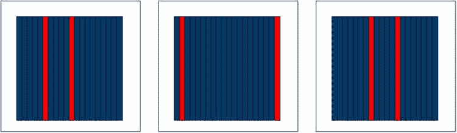
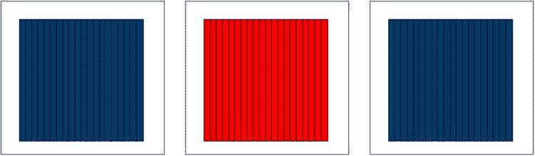

# 索引统计信息如何用于评估表访问的成本

## NUM_ROWS
如果一个 B 树索引完全由非空列组成，那么索引的 `NUM_ROWS` 值将与表的 `NUM_ROWS` 值完全匹配。但是，当被索引的列包含 `NULL` 时，该行在 B 树索引中不会创建条目，因此索引的 `NUM_ROWS` 值可能低于表的 `NUM_ROWS` 值。事实证明，有时 CBO（基于成本的优化器）会利用索引的 `NUM_ROWS` 统计信息来估算索引操作的基数（cardinality），但在大多数情况下，索引的统计信息会被忽略，而使用表的 `NUM_ROWS` 统计信息进行基数计算。

## LEAF_BLOCKS
此统计信息用于帮助确定索引操作的成本。如果选择性（selectivity）为 10%（不包括过滤谓词），则假定访问的叶块（leaf blocks）数量为 `LEAF_BLOCKS` 统计信息值的 10%。

## BLEVEL
大多数索引访问操作涉及访问索引的根块（root block）并向下遍历到叶块。`BLEVEL` 统计信息可直接用于估算此遍历过程的成本，并与基于 `LEAF_BLOCKS` 的计算结果相加，以得出索引操作的总体成本。`INDEX FAST FULL SCAN`（索引快速全扫描）的成本计算算法是唯一不使用 `BLEVEL` 统计信息的算法，因为它不是从根块开始遍历索引来读取叶块。我将在第 10 章中，结合其他访问方法来讨论 `INDEX FAST FULL SCAN` 操作。

索引访问操作返回的字节数，是通过将索引操作返回的所有列的 `AVG_COL_LEN`（平均列长度）列统计信息相加，再加上一些额外开销（overhead）来确定的。我们需要使用列统计信息来确定索引操作的选择性，就像对表操作所做的那样。在解释了如何使用索引统计信息来评估通过索引访问表的成本之后，我将接着讨论列统计信息。

当通过索引访问表时，该访问的估算成本是由索引（而非表）的统计信息决定的。另一方面，索引统计信息既不用于确定表访问操作返回的行数，也不用于确定返回的字节数。这是合理的，因为从表中选择的行数与使用哪个索引（或是否使用索引）来访问表无关。

图 9-1 和 图 9-2 展示了确定通过索引访问表的成本有多么困难。


图 9-1. 来自弱聚簇索引的表块


图 9-2. 来自强聚簇索引的表块

图 9-1 展示了一个假想表中的三个表块，该表共有十个块，每个块包含 20 行，总共 200 行。假设表中有 20 行在特定列上具有特定值，并且该列已被索引。如果这 20 行分散在整个表中，那么每个块中大约会有两行匹配数据。我在图 9-1 中用高亮行表示了这种情况。

如图所示，要获取这 20 行数据，几乎需要读取表中的所有块，因此全表扫描会比索引访问更高效，主要原因是全表扫描可以使用多块读取（multi-block reads）来访问表，而不是单块读取（single block reads）。现在来看一下图 9-2。

在这种情况下，我们通过索引选择的所有 20 行都出现在一个块中，现在索引访问将高效得多，因为只需要读取一个表块。请注意，在图 9-1 和图 9-2 中，选择性都是 10%（200 行中的 20 行），因此仅知道选择性对于 CBO 估算通过索引访问表的成本来说是不够的。于是引入了 `聚簇因子（clustering factor）`。要计算通过索引访问表（而非访问索引本身）的成本，我们将聚簇因子乘以选择性。由于强聚簇索引的 `聚簇因子` 比弱聚簇索引的 `聚簇因子` 更低，因此通过强聚簇索引访问表的成本低于通过弱聚簇索引访问表的成本。清单 9-3 演示了这在实践中是如何运作的。

## 清单 9-3. 聚簇因子对表访问成本的影响
```sql
SELECT index_name, distinct_keys, clustering_factor
  FROM all_ind_statistics I
  WHERE    i.table_name = 'STATEMENT'
       AND i.owner = SYS_CONTEXT ('USERENV', 'CURRENT_SCHEMA')
       AND i.index_name IN ('STATEMENT_I_PC', 'STATEMENT_I_CC')
ORDER BY index_name DESC;

SELECT *
  FROM statement t
 WHERE product_category = 1;

SELECT *
  FROM statement t
 WHERE customer_category = 1;

SELECT /*+ index(t (customer_category)) */
       *
  FROM statement t
 WHERE customer_category = 1;
--
-- 第一个查询的输出，显示索引的聚簇因子
--

INDEX_NAME                     DISTINCT_KEYS                          CLUSTERING_FACTOR
STATEMENT_I_PC                 10                                     17
STATEMENT_I_CC                 50                                     500

--
-- 对 STATEMENT 表的三个查询的执行计划
--

| Id  | Operation                           | Name           | Cost (%CPU)|

|   0 | SELECT STATEMENT                    |                |     3   (0)|
|   1 |  TABLE ACCESS BY INDEX ROWID BATCHED| STATEMENT      |     3   (0)|
|   2 |   INDEX RANGE SCAN                  | STATEMENT_I_PC |     1   (0)|

| Id  | Operation         | Name      | Cost (%CPU)|

|   0 | SELECT STATEMENT  |           |     7   (0)|
|   1 |  TABLE ACCESS FULL| STATEMENT |     7   (0)|

| Id  | Operation                           | Name           | Cost (%CPU)|

|   0 | SELECT STATEMENT                    |                |    11   (0)|
|   1 |  TABLE ACCESS BY INDEX ROWID BATCHED| STATEMENT      |    11   (0)|
|   2 |   INDEX RANGE SCAN                  | STATEMENT_I_CC |     1   (0)|
```

我已安排插入 `STATEMENT` 表的前 50 行具有一个 `PRODUCT_CATEGORY` 值，接下来的 50 行具有第二个值，依此类推。因此，`PRODUCT_CATEGORY` 有 10 个不同的值，并且数据是强聚簇的，因为所有属于同一个 `PRODUCT_CATEGORY` 的行都集中在少量的块中。另一方面，`CUSTOMER_CATEGORY` 的 50 个值是使用 `MOD` 函数分配的，因此特定 `CUSTOMER_CATEGORY` 的行分散在整个表中。

当我们选择特定 `PRODUCT_CATEGORY` 的行时，我们将选择性（1/10）乘以 `STATEMENT_I_PC` 索引的聚簇因子（清单 9-3 显示为 17），得到值 1.7。索引访问本身的成本为 1，因此通过索引访问表的总成本为 2.7。为显示目的，该值被四舍五入为 3。


